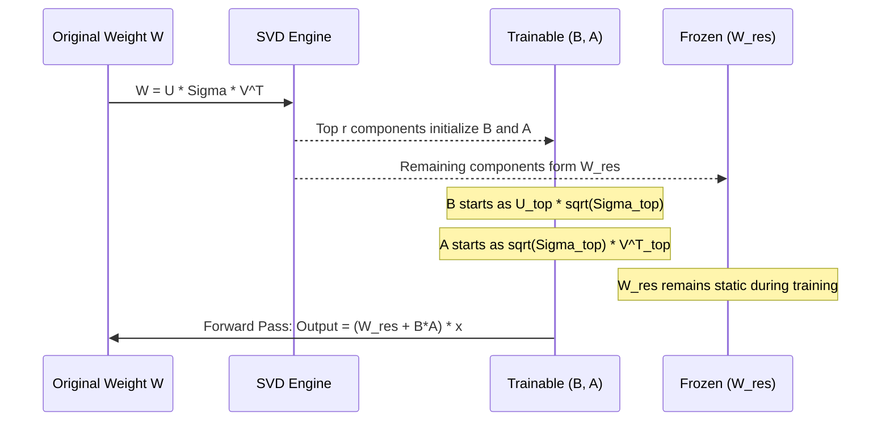

> **AI/ML Engineering Track** | NEW 2026 module — pipeline will expand this stub
>
> **Topic**: Modern PEFT beyond standard LoRA: Weight-Decomposed Low-Rank Adaptation (DoRA) and PiSSA.
> Near full-parameter performance with minimal compute.
> Practical fine-tuning workflows, when to choose each, integration with PEFT/Hugging Face, comparison with LoRA and full fine-tuning.

## Why This Module Matters

Teams adapting very large language models to specialized regulatory text can run into adaptation limits that standard LoRA does not always handle well.
The team was also working under tight GPU and infrastructure constraints.
They initially relied on standard Low-Rank Adaptation (LoRA) to execute the task.
The team expected a straightforward fine-tuning process to align the open-weight model with strict European financial syntax and proprietary analytical frameworks.
However, they soon discovered that the model systematically failed to adapt its stylistic tone while maintaining factual accuracy across lengthy context windows.
The standard LoRA-tuned model exhibited severe catastrophic forgetting of the base model's intricate reasoning capabilities.
It frequently hallucinated basic arithmetic when pushed into niche financial domains that deviated slightly from the training set.
The result was a failed pilot that wasted compute and delayed downstream business goals.

The core engineering team spent weeks running isolated diagnostics across their neural architecture to identify the exact root cause of this high-profile failure.
They eventually realized that standard LoRA's mathematical foundation—specifically its permanently coupled update of weight magnitude and weight direction—was fundamentally unsuited for tasks requiring massive shifts in representational direction.
When the model attempted to learn the highly specific, rigid syntax of regulatory finance, standard LoRA forced the weight magnitudes to spike uncontrollably in the deeper layers.
This destabilized the delicate activation ranges established during the model's initial, multi-million dollar pre-training phase.
By migrating their entire continuous training pipeline to Weight-Decomposed Low-Rank Adaptation (DoRA), the team successfully decoupled these vector updates and fully restored training stability.

DoRA is designed to narrow the gap to full fine-tuning while preserving PEFT-style efficiency, but the exact quality and memory trade-offs depend on the model, task, rank, and implementation.
This single architectural shift saved the core project, stabilized their production inference engine, and established a new internal standard for Parameter-Efficient Fine-Tuning (PEFT) across their multinational organization.
As standard LoRA reveals its inherent limitations in complex reasoning, highly specific domain adaptation, and long-context generation tasks, modern PEFT techniques like DoRA and PiSSA (Principal Singular Values and Singular Vectors Adaptation) have emerged to bridge the critical performance gap.
Understanding how to correctly leverage these advanced decomposition strategies is no longer optional for AI engineers dealing with modern frontier models.
It is the defining difference between building an unreliable, mathematically constrained prototype and deploying a robust, production-grade generative AI application capable of sophisticated reasoning.

## Learning Outcomes

After completing this comprehensive module, you will be able to:

1. **Evaluate** the mathematical and operational differences between standard LoRA, DoRA, and PiSSA to select the optimal fine-tuning strategy for a given generative AI task.
2. **Implement** Weight-Decomposed Low-Rank Adaptation (DoRA) using the Hugging Face PEFT library to maximize model performance on complex reasoning datasets.
3. **Design** a Singular Value Decomposition (SVD) initialization pipeline for PiSSA to accelerate convergence rates during large language model adaptation.
4. **Diagnose** training instabilities and catastrophic forgetting anomalies specific to advanced PEFT methods by analyzing weight magnitude and direction shift metrics.
5. **Compare** the computational overhead, VRAM utilization, and inference latency trade-offs of deploying DoRA and PiSSA models in enterprise production environments.

## Core Concept 1: The Limitations of Standard LoRA

To truly appreciate the architectural elegance and operational superiority of DoRA and PiSSA, we must first deeply dissect the mathematical and practical limitations of standard LoRA.
Standard LoRA operates on the principle of updating a frozen, pre-trained weight matrix by adding a low-rank decomposition matrix during the forward pass.
If we define the pre-trained weight matrix as $W_0 \in \mathbb{R}^{d \times k}$, [LoRA injects an update matrix defined mathematically as $\Delta W = BA$](https://arxiv.org/abs/2106.09685).
In this equation, $B \in \mathbb{R}^{d \times r}$ and $A \in \mathbb{R}^{r \times k}$, and the chosen rank $r$ is significantly smaller than both spatial dimensions $d$ and $k$.
While this specific mathematical approach is highly efficient in terms of memory footprint and total trainable parameter count, standard LoRA forces a strict, unavoidable correlation between the magnitude and the direction of the resulting weight updates.

To understand why this coupling is deeply problematic for advanced reasoning tasks, we must analyze how unrestricted Full Fine-Tuning (FT) behaves empirically.
Extensive analysis of Full Fine-Tuning on massive language models reveals a fascinating, highly decoupled pattern of learning across different transformer layers.
Full Fine-Tuning often updates weight vectors by making relatively trivial changes to their overall scalar magnitude while simultaneously making highly significant changes to their angular direction in the high-dimensional latent space.
Alternatively, in some specific feed-forward layers, it might drastically scale the magnitude up or down while keeping the core spatial direction relatively stable.
Full fine-tuning possesses the absolute mathematical freedom to decouple these two dimensions of learning based entirely on the exact needs of the loss function gradients.

Standard LoRA struggles immensely to replicate this decoupled learning dynamic due to its strict geometric constraints.
Because the low-rank matrices $B$ and $A$ are explicitly initialized near or exactly at zero, LoRA mathematically dictates that any significant change in the spatial direction of the weight vector inherently requires a proportional increase in its scalar magnitude.
You cannot rotate the high-dimensional vector significantly without also making it physically longer in the latent space.
This geometric restriction severely limits LoRA's expressiveness, particularly in the deep, terminal layers of transformer architectures.
Subtle directional shifts in these terminal layers are absolutely critical for nuanced task adaptation and logic routing.

Consider an operational analogy of steering a high-speed maritime vessel where the steering wheel (controlling direction) and the throttle engine (controlling magnitude) are physically welded together into a single mechanical lever.
If you need to make a sharp, precise 90-degree turn to navigate a complex, narrow channel, the mechanical linkage forces you to simultaneously accelerate the vessel to its maximum engine speed.
This forced coupling makes delicate, nuanced maneuvering entirely impossible and often leads to catastrophic collisions with the channel walls.
In the exact context of deep neural networks, this coupling leads to highly suboptimal feature representations during the fine-tuning phase.
The language model either fails to learn the new required direction entirely, or it successfully learns it at the devastating cost of artificially inflating the magnitude of the layer's activations.

> **Stop and think**: If a standard LoRA model requires a massive shift in direction to learn a new syntax, what consequence will this have on the magnitude of the updated weights, and how might this affect the activation outputs of that layer?

When the magnitude of the model's weights artificially inflates due to these directional constraints, the resulting activation outputs for that specific layer will also scale up proportionally across the entire batch of tokens.
In a deep, multi-layered transformer network, these scaled-up activations are passed directly to subsequent layers.
They feed directly into non-linear activation functions (like SiLU or GELU) and layer normalization modules.
This unexpected, uncalibrated surge in activation scalar values can severely saturate the non-linearities, pushing them into regions where gradients become incredibly small.
When activation functions saturate, they cause gradients to either vanish entirely or explode uncontrollably during the subsequent backward pass.
Furthermore, this inflation completely disrupts the delicate, calibrated balance of the pre-trained representations.
This cascade of activation failures precisely explains why heavily LoRA-tuned models often suffer from catastrophic forgetting when exposed to out-of-domain prompts.

## Core Concept 2: Weight-Decomposed Low-Rank Adaptation (DoRA)

Weight-Decomposed Low-Rank Adaptation, commonly abbreviated as DoRA, solves the magnitude-direction coupling problem gracefully.
It takes profound mathematical inspiration from a classic deep learning technique known as weight normalization.
DoRA fundamentally restructures the adaptation architecture by explicitly decomposing the pre-trained weight matrix into two distinct, independently manageable components.
These components are [a scalar magnitude vector ($m$) and a structural directional matrix ($V$)](https://arxiv.org/abs/2402.09353).

Mathematically, any dense weight matrix $W$ can be flawlessly decomposed and represented via the following elegant equation:
$W = m \frac{V}{\|V\|_c}$

In this formulation, $\|V\|_c$ represents the vector-wise norm of the matrix $V$, rigorously computed across its vertical columns.
This specific division operation ensures that the directional matrix is strictly normalized at all times.
Because it is consistently normalized, every single column vector contained within $V$ has a spatial length of exactly 1.0.
This normalized matrix now represents pure, unadulterated direction, completely devoid of any magnitude scaling information.

In the practical DoRA architecture, the initial pre-trained base weights $W_0$ are used to instantly initialize both $m_0$ and $V_0$ at the start of the training run.
During the fine-tuning optimization process, the magnitude vector $m$ is defined as a highly efficient, fully trainable parameter set.
Because it is a simple one-dimensional vector rather than a massive two-dimensional matrix, it adds a trivially small number of parameters to the overall model footprint.
This preserves PEFT's core advantages while solving the fundamental coupling flaw.
The directional matrix $V$, however, is typically far too massive to train directly without quickly eroding the compute efficiency that teams usually require.
Therefore, DoRA updates the directional matrix using a low-rank mechanism that is mathematically nearly identical to standard LoRA:
$V' = W_0 + BA$

By combining these decoupled mathematical concepts, the final, comprehensive forward pass equation for DoRA becomes:
$W' = m \frac{W_0 + BA}{\|W_0 + BA\|_c}$

```mermaid
graph TD
    subgraph Pre-trained Model
        W0[Pre-trained Weight W0]
    end
    
    subgraph DoRA Decomposition
        M[Trainable Magnitude Vector m]
        V_Dir[Normalized Directional Matrix V / ||V||c]
    end
    
    subgraph LoRA Directional Update
        B[Trainable Matrix B d x r]
        A[Trainable Matrix A r x k]
        W0_Dir[Fixed W0]
        UpdateDir["V = W0 + (B * A)"]
    end
    
    W0 --> M
    W0 --> W0_Dir
    B --> UpdateDir
    A --> UpdateDir
    W0_Dir --> UpdateDir
    UpdateDir --> V_Dir
    M --> Final[Final Weight W' = m * V_Dir]
    V_Dir --> Final
```

This specific decomposition is a masterclass in linear algebra applied directly to neural network optimization and representation learning.
It allows DoRA to learn critical changes in magnitude completely independently of learning changes in spatial direction.
If the loss function determines that a specific feature requires a massive shift in direction to accommodate a complex new reasoning pattern, it can aggressively update the low-rank matrices $B$ and $A$ to achieve this directional shift.
Crucially, because the resulting directional matrix is immediately mathematically normalized by its column-wise norm, the length of the vector remains strictly clamped at 1.0.
The model can then independently and safely decide whether to increase, decrease, or perfectly maintain the scalar magnitude of that specific feature by adjusting the highly isolated $m$ parameter.

This decoupled, bipartite learning process closely mirrors the unconstrained learning pattern observed in full parameter fine-tuning.
Yet, miraculously, it retains the extreme parameter and VRAM efficiency that made standard LoRA famous in the first place across the open-source community.
In rigorous empirical practice across enterprise deployments, DoRA often significantly surpasses standard LoRA on highly complex, domain-specific tasks.
It excels particularly in domains like advanced coding assistance, mathematical step-by-step reasoning, and multi-hop logical deduction pipelines.
In these advanced domains, the structural logic must change dramatically without blowing up the activation scales.

## Implementing DoRA

Implementing DoRA in a modern, scalable enterprise environment is incredibly straightforward thanks to the mature ecosystem provided by modern libraries like Hugging Face `peft`.
The complex mathematical integration, including the dynamic normalization step, is typically handled seamlessly under the hood by the framework's internal PyTorch modules.
It usually requires just a simple boolean flag toggled over a standard LoRA configuration object to activate the entire decomposition logic workflow.
However, understanding the optimal hyperparameters for DoRA is absolutely crucial for maximizing its empirical effectiveness and preventing training stagnation.

When configuring a DoRA training run, you must pay special, focused attention to the rank ($r$) parameter and the selection of target modules across the architecture.
Because DoRA relies exclusively on the low-rank matrices $B$ and $A$ purely for directional shifting, setting the rank too low can severely bottleneck its algorithmic ability to find the correct high-dimensional orientation.
While standard LoRA can sometimes successfully scrape by with a tiny rank of 4 or 8 for simple, superficial styling tasks, DoRA typically demands a minimum rank of 16 or 32.
This higher rank ensures the directional matrix has sufficient mathematical capacity to physically rotate the large vectors meaningfully in the highly dimensional latent space.

Furthermore, targeting the correct network modules is absolutely essential for DoRA to function properly and deliver near full-parameter performance.
Standard LoRA is often applied only to the query and value projections (`q_proj`, `v_proj`) to aggressively save memory on consumer-grade GPUs.
DoRA, however, shines brightest and achieves state-of-the-art results when applied comprehensively across the entire attention mechanism and all multilayer perceptron (MLP) blocks.
Targeting all linear layers provides the model with the maximum possible flexibility to adjust its internal representations globally.

```python
from peft import LoraConfig, get_peft_model
from transformers import AutoModelForCausalLM

model_id = "mistralai/Mistral-7B-v0.1"
model = AutoModelForCausalLM.from_pretrained(model_id, load_in_4bit=True) # Quantize base model to fit within consumer GPU VRAM

# Define DoRA Configuration
dora_config = LoraConfig(
    r=16, # Rank 16 ensures sufficient capacity for the directional matrix to shift
    lora_alpha=32,
    target_modules=["q_proj", "k_proj", "v_proj", "o_proj"], # Targeting all attention projections maximizes reasoning adaptation
    lora_dropout=0.05,
    bias="none",
    task_type="CAUSAL_LM",
    use_dora=True  # The critical flag enabling Weight Decomposition
)

dora_model = get_peft_model(model, dora_config)
dora_model.print_trainable_parameters()
# Output will show slightly more parameters than standard LoRA due to the magnitude vectors (m)
```

In the Python implementation script above, initializing the base model with `load_in_4bit=True` demonstrates a very common, highly effective production workflow.
The base model is aggressively quantized via the `bitsandbytes` library to fit comfortably within the strict VRAM constraints of consumer or edge-grade hardware deployments.
PEFT documents DoRA use with bitsandbytes-quantized weights, but compatibility still depends on the surrounding training stack.
The most critical addition to the script is the [`use_dora=True` parameter](https://huggingface.co/docs/peft/developer_guides/lora) passed explicitly to the configuration object.
When you execute the script and print the trainable parameters, you will visually notice a slight, mathematically calculated increase compared to a standard LoRA run initialized with the exact same rank and target modules.
This explicit delta represents the newly added magnitude vectors ($m$), which strategically add exactly one parameter for every output dimension of the targeted linear layers.
This minimal parameter overhead is a microscopic price to pay for the massive, empirical boost in representational expressiveness.

## Core Concept 3: PiSSA (Principal Singular Values and Singular Vectors Adaptation)

While DoRA focuses entirely on mathematically redefining *how* the weight vectors are dynamically updated during training, PiSSA takes a completely different structural approach.
PiSSA focuses entirely on optimizing *where* the trainable parameters start their initial optimization journey on the gradient loss landscape.

In standard LoRA, the default initialization strategy is remarkably simple but potentially highly inefficient for traversing complex optimization landscapes.
The matrix $A$ is typically initialized with a random Gaussian distribution, and the matrix $B$ is initialized entirely with explicit, hardcoded zeros.
Mathematically, this strict initialization guarantees that at training step zero, the initial model adaptation $\Delta W = BA$ is exactly zero across all layers.
The fine-tuning process therefore begins effectively identical to the frozen base model, possessing absolutely no structural bias towards the new downstream task.
The model must then learn the required adaptation entirely from scratch, fighting against incredibly flat gradients to push those zero values into meaningful, non-zero representational forms.

PiSSA boldly challenges this prevailing paradigm by arguing that a pre-trained frontier model already contains a massively rich, dense matrix of highly structured knowledge.
Instead of starting the adaptation matrices from absolute zero and blindly hoping gradient descent eventually finds the optimal path, we can leverage the existing structural topology.
PiSSA asks: why not initialize our low-rank matrices with the most structurally important, principal mathematical components of the pre-trained weights themselves?

To achieve this superior initialization, PiSSA heavily relies on applying Singular Value Decomposition (SVD) directly to the pre-trained weight matrix $W \in \mathbb{R}^{d \times k}$.
SVD is a foundational theorem of linear algebra that factorizes any given real matrix into three distinct, highly useful mathematical matrices:
$W = U \Sigma V^T$

In this specific decomposition, the matrix $U$ contains the left singular vectors, the matrix $V^T$ contains the right singular vectors, and $\Sigma$ is a vital diagonal matrix containing the singular values.
These singular values are typically sorted in non-increasing order of magnitude by the underlying SVD algorithm execution.
These singular values mathematically represent the "importance" or the "spectral energy" of their corresponding vectors in defining the overall structure of the original weight matrix.

PiSSA then strategically and precisely slices these three decomposed matrices into two distinct structural groups based entirely on the user-chosen hyperparameter rank $r$:

1. **Principal Components**: It meticulously extracts the top $r$ largest singular values from $\Sigma$ and their mathematically corresponding vectors from $U$ and $V^T$.
   These highly influential, massive components are [directly used to optimally initialize the trainable matrices $A$ and $B$](https://arxiv.org/abs/2404.02948).
2. **Residual Components**: It takes all the remaining, less impactful singular values and vectors from the full matrix decomposition.
   These long-tail, granular components are multiplied back together to construct a frozen, static residual weight matrix formally known as $W_{res}$.

Mathematically, the fundamental forward pass equation of the neural network layer is rigorously rewritten as:
$W = W_{res} + BA$
Crucially, $A$ and $B$ are specifically and deterministically initialized such that their matrix product $BA$ perfectly reconstructs the top principal components of the original pre-trained matrix.



By initializing the trainable parameters directly with the core principal components of the base model, PiSSA models converge at a dramatically faster rate.
The high-dimensional optimization landscape is often smoother because the model begins adjusting its foundational representations from step one.
It does not waste massive amounts of GPU compute attempting to push a zero-initialized matrix up a steep gradient surface just to reach a functional baseline.
Furthermore, because it is explicitly operating on the most mathematically significant sub-space of the model's weights from the very beginning, PiSSA consistently achieves lower final validation loss values.
It demonstrates far better, more robust generalization capabilities, frequently rivaling full parameter fine-tuning on highly competitive industry leaderboards.

## Designing the PiSSA Initialization Pipeline

Designing a robust, automated PiSSA pipeline for a high-throughput production MLOps environment requires careful, deliberate management of the upfront SVD computation.
Performing exact, deterministic SVD on massive, multi-gigabyte weight matrices is an incredibly compute-intensive and highly memory-hungry operation.
It scales very poorly as model parameter counts grow into the hundreds of billions.

In the Hugging Face PEFT library ecosystem, PiSSA is natively and officially supported.
This makes code integration relatively simple via the `init_lora_weights` argument within the standard LoraConfig configuration block.
However, for modern frontier models, calculating the exact SVD sequentially across all layers can take many exhaustive hours of idle pipeline time.
This process may easily trigger catastrophic Out-Of-Memory (OOM) errors even on enterprise-grade hardware equipped with massive 80GB VRAM pools per card.
To effectively mitigate this severe operational bottleneck, the PEFT library supports a highly optimized, fast-SVD approximation technique known mathematically as Subspace Iteration.

```python
pissa_config = LoraConfig(
    r=16,
    target_modules=["q_proj", "v_proj"],
    task_type="CAUSAL_LM",
    init_lora_weights="pissa_niter_16" # Triggers fast-SVD initialization with 16 subspace iterations
)
```

By explicitly setting the parameter [`init_lora_weights="pissa_niter_16"`](https://huggingface.co/docs/peft/developer_guides/lora), you strictly instruct the underlying PEFT library to utilize the randomized subspace iteration algorithm.
This algorithm rapidly approximates the top singular values and vectors without calculating the entire matrix spectrum.
The numerical value "16" embedded in the configuration string explicitly denotes the exact number of mathematical algorithmic iterations to execute.
Utilizing higher iteration numbers naturally yields a much closer approximation to exact SVD at the direct cost of additional compute time during initialization.
This approximation can reduce initialization time substantially relative to exact SVD, with the actual speedup depending on model size, hardware, and iteration count.
Remarkably, it accomplishes this massive speedup while rigorously maintaining near-perfect, mathematically sound initialization quality that fully preserves the rapid convergence benefits.

A mature, enterprise-grade machine learning production pipeline should generally avoid computing this SVD on the fly for routine iterative developer training runs.
The optimal system architecture involves pre-computing these fast-SVD initialized adapters and extracting the resulting residual base model ($W_{res}$) exactly once per base model architecture version.
These massive, pre-processed artifacts should then be permanently cached in a centralized model registry or a high-throughput enterprise object storage bucket.
All subsequent fine-tuning runs across the entire engineering organization can simply pull these cached, pre-initialized artifacts over the local cluster network.
The training loop can begin immediately, completely bypassing the expensive initialization phase for every subsequent experiment.

> **Pause and predict**: Because PiSSA modifies the base weights by extracting the principal components into the trainable matrices, what must happen during inference deployment compared to a standard LoRA adapter that simply adds to the base model?

Unlike standard LoRA deployments, where a tiny, standalone adapter is merely appended to a pristine, completely unmodified base model residing in VRAM, PiSSA fundamentally alters the underlying base model itself.
It permanently creates the modified, hollowed-out residual matrix $W_{res}$.
Because PiSSA changes initialization and weight decomposition, deployment needs an artifact format that matches how the adapter was prepared rather than assuming every serving stack can treat it like a drop-in LoRA adapter.
If you attempt this naive deployment strategy, the text outputs will be complete, unintelligible garbage because the specific adapter mathematically expects to be added to $W_{res}$, not to $W_0$.
Depending on the serving stack, deployment may involve exporting a merged model or converting the trained adapter into a LoRA-compatible form instead of assuming a single required export path.
This crucial function structurally fuses the trained PiSSA adapter back into the $W_{res}$ matrix entirely offline.
It perfectly reconstructs a standard, monolithic weight format architecture that can be served seamlessly by any standard inference engine like vLLM or SGLang.

## The VRAM and Compute Trade-offs

Advanced PEFT methods like DoRA and PiSSA absolutely do not come for free in terms of underlying hardware requirements and operational overhead.
They introduce specific, quantifiable computational and architectural complexities that must be managed tightly by platform engineering teams.
A deep, rigorous understanding of their precise resource implications is absolutely crucial for effective MLOps systems design and strict financial capacity planning.

**DoRA Trade-offs:**

- **Training Compute Latency**: DoRA intrinsically requires calculating the vector-wise norm of the directional matrix ($W_0 + BA$) dynamically on every single forward pass through the network.
  This mathematical division operation adds a tangible, albeit slight, computational overhead to the step time.
  Furthermore, during the critical backward pass, the PyTorch autograd engine must correctly compute gradients flowing through this complex non-linear normalization step.
  This demonstrably slows down the overall training steps-per-second metric when directly compared to a standard LoRA baseline.
- **Training VRAM Utilization**: Memory utilization is marginally, but measurably, higher during active DoRA training loops.
  Memory utilization is typically somewhat higher during DoRA training than with plain LoRA because the method tracks extra magnitude parameters and normalization-related tensors.
  This minor increase is directly attributable to the necessary tensor storage, momentum buffers, and active gradient tracking required for the thousands of newly injected magnitude vectors.
- **Inference Latency Profile**: This is DoRA's absolute greatest operational strength in a demanding enterprise production setting.
  During the preparation phase for inference, the trainable matrices $B$ and $A$ can be mathematically merged into the static base weights entirely offline.
  Crucially, the isolated magnitude vector $m$ can also be folded directly into the resulting linear weight matrix through a simple scalar multiplication broadcast.
  Therefore, DoRA introduces absolutely zero inference latency overhead compared to standard LoRA or full parameter fine-tuning.
  The final deployed artifact is structurally identical to the original, lightning-fast base model architecture.

**PiSSA Trade-offs:**

- **Initialization Overheads**: As previously discussed in rigorous detail, PiSSA requires performing SVD on every single targeted weight matrix before the training loop can begin.
  For large models, PiSSA initialization can be a noticeable upfront cost and may require careful memory planning, especially when exact SVD is used.
  This is a severe, unavoidable one-time upfront computational cost that can frequently break automated CI/CD pipelines if strict execution timeouts are not configured correctly.
- **Training Compute and VRAM**: Once the heavy initialization phase is successfully completed, PiSSA's actual iterative training speed, token throughput, and VRAM consumption are mathematically and operationally identical to standard LoRA.
  There are absolutely no extra normalization steps, complex forward-pass calculations, or additional gradients to compute during the core iterative loop.
- **Inference Flexibility Constraints**: Because PiSSA permanently alters the base model by stripping out the principal components to leave behind $W_{res}$, it severely damages multi-tenant flexibility.
  PiSSA can complicate some adapter-serving workflows, so teams should validate whether their serving stack prefers merged weights or a converted LoRA-compatible artifact.
  You cannot quickly hot-swap PiSSA adapters onto a standard base model without massive overhead.
  You must fundamentally merge the PiSSA weights back into the residual matrix prior to deployment, locking that specific loaded model instance to that single task forever.

## War Story: The PiSSA Convergence Trap

One practical risk with PiSSA is that teams may underestimate how different its optimization behavior is from zero-initialized LoRA.
This agent needed to be uniquely capable of perfectly translating complex natural language requests into highly dialect-specific, heavily optimized database queries.
Seeking to drastically reduce their costly iteration cycles on AWS, the lead ML engineer made the executive decision to transition their entire training pipeline from standard LoRA directly to PiSSA.
The explicit goal was to heavily capitalize on PiSSA's purported fast convergence capabilities widely documented in recent academic research papers.
They initialized the PiSSA adapters across the board with a robust, high-capacity rank of $r=64$ across all attention and MLP layers.
They then confidently launched a massive, distributed training run on a costly cluster of H100s, expecting immediate and stellar results.

The engineers expected rapid, smooth, perfectly predictable convergence curves to populate on their operational monitoring dashboards.
In practice, an overly aggressive learning-rate schedule can destabilize training very early when switching from LoRA-style initialization to PiSSA.
This aggressively signaled a catastrophic gradient explosion event had occurred within the deep network layers.
Diagnosing this kind of instability can consume substantial engineering time if PiSSA is treated like a drop-in replacement for LoRA.
They desperately inspected text data loaders for hidden formatting corruption and checked for corrupted tensor states in PyTorch's backend.
They rigorously verified that all global gradient clipping parameters were correctly set to standard industry defaults.

The ultimate post-mortem eventually revealed a fundamental, dangerous misunderstanding of neural optimization dynamics by the engineering leadership.
The team was using a learning-rate schedule that was too aggressive for PiSSA-style initialization and had been tuned for a different LoRA setup.
Standard LoRA typically starts with the $B$ matrix initialized to exactly zero, meaning the initial network adaptation is mathematically zero.
A highly aggressive learning rate is often absolutely necessary in that specific scenario to quickly push these zero weights into useful, expressive numerical ranges.

PiSSA, however, is a completely different mathematical beast entirely.
Its trainable matrices $A$ and $B$ are already populated at step zero with the massive, highly active principal singular values extracted directly from the base model weights.
These are mathematically critical, high-magnitude numbers that dictate the model's core logic and pre-trained structural intelligence.
Applying an aggressively high learning rate to these already large initial values caused massive, completely destabilizing gradient updates across the entire neural network.
They were essentially blowing apart the principal structural components of the model's pre-trained knowledge in the very first few training batches.
The team stabilized training by using a substantially more conservative optimization schedule better matched to PiSSA's non-zero initialization.
They also implemented an extended, highly conservative linear warm-up phase to slowly introduce gradients to the massive system architecture.
This aligned the optimization dynamics perfectly with the delicate, pre-initialized state of the large PiSSA weights, leading to a perfectly stable run and a highly successful product launch.

## Did You Know?

- Early DoRA results report performance close to full fine-tuning on some evaluation setups while updating only a small fraction of the parameters, but the exact gap depends on the benchmark and configuration.
- The cost of SVD-based PiSSA initialization depends heavily on matrix size, implementation, and hardware.
- DoRA is motivated by the observation that full fine-tuning and LoRA can differ in how they change weight magnitude versus direction, but any exact similarity values depend on the measurement setup.
- PiSSA’s use of top singular components is motivated by the fact that a relatively small leading subspace can capture an important share of a weight matrix’s structure, but the exact share varies by model and layer.

## Common Mistakes

| Mistake | Why it happens | How to fix it |
| :--- | :--- | :--- |
| **Reusing LoRA learning rates for PiSSA** | Engineers assume PEFT methods are hyperparameter-compatible. PiSSA starts with non-zero, large magnitude values unlike LoRA's zero-initialization. | Reduce the PiSSA learning rate relative to your standard LoRA baseline and use a conservative linear warmup. |
| **Failing to merge PiSSA adapters correctly** | Applying a PiSSA adapter directly to the unmodified base model at inference time. PiSSA requires the base model to be altered to the residual matrix ($W_{res}$). | Deploy PiSSA only after confirming whether your toolchain expects merged weights or a converted adapter format compatible with the target base model. |
| **Using DoRA with tiny rank ($r < 8$)** | Assuming DoRA is magically expressive at any rank. If the rank is too low, the directional matrix $V$ lacks the capacity to shift, rendering the magnitude decomposition useless. | Avoid assuming extremely low ranks will preserve DoRA's benefits; validate rank choice empirically for your model and task. |
| **Skipping layernorm tuning with DoRA** | DoRA focuses on linear layers, but large magnitude shifts can destabilize subsequent layer normalizations if they remain frozen. | If DoRA training is unstable on a demanding task, evaluate whether additional trainable components are warranted instead of assuming one fixed recipe always applies. |
| **Using PiSSA on heavily quantized models (e.g., NF4)** | Precise SVD is computationally expensive and can be impractical on aggressively quantized 4-bit integer weights without extensive dequantization overhead. | Plan PiSSA initialization with care on quantized setups, because SVD-based initialization and low-bit serving constraints may require a staged workflow. |
| **Evaluating DoRA mid-training without folding** | Inference during a validation loop is slow because the DoRA equation $W' = m (W_0 + BA) / \|V\|_c$ must be calculated dynamically on every forward pass. | While standard for training, ensure your evaluation script uses context managers or specific PEFT evaluation modes that optimize the forward pass. |
| **Ignoring the SVD initialization time in CI/CD pipelines** | PiSSA's SVD initialization blocks the training script from actually starting the first epoch, leading to pipeline timeouts in automated runners. | Pre-compute and cache the PiSSA initialized adapters and residual base models for standard foundational models used in your organization. |

## Hands-On Exercise: Implementing and Analyzing DoRA

In this extensive exercise, you will directly implement DoRA utilizing the Hugging Face `peft` library within a Python environment.
You will rigorously analyze the exact parameter count differences when mathematically compared to a standard LoRA baseline configuration.
Finally, you will programmatically simulate the complex forward pass normalization decomposition that makes DoRA uniquely powerful.

**Prerequisites**

Before initiating the structured tasks, ensure your local or cloud environment is fully prepared by strictly installing the required cutting-edge packages:

```bash
pip install -q torch transformers "peft>=0.18.0"
```

**Task 1: Setup and Standard LoRA Baseline**

1. Load a causal language model (e.g., `sshleifer/tiny-gpt2`) to run this exercise quickly on a CPU or a low-tier consumer GPU without triggering memory limits.
2. Carefully configure a standard LoRA adapter explicitly targeting the `c_attn` and `c_proj` modules with a rank of $r=16$.
3. Print the trainable parameters using the built-in utility and meticulously record the exact baseline numerical value for architectural comparison.

**Task 2: Implement DoRA**

1. Utilizing the exact same underlying base model architecture to ensure a scientifically fair comparison, construct a brand new PEFT configuration object.
2. Enable the DoRA architecture by explicitly setting the crucial boolean flag within the `LoraConfig` initialization logic.
3. Apply this new configuration directly to the model and print the total trainable parameters to observe the architectural shift.

<details>
<summary>View Solution for Task 1 & 2</summary>

```python
import torch
from transformers import AutoModelForCausalLM
from peft import LoraConfig, get_peft_model

model_id = "sshleifer/tiny-gpt2"
model = AutoModelForCausalLM.from_pretrained(model_id)

# Task 1: Standard LoRA
lora_config = LoraConfig(
    r=16,
    target_modules=["c_attn", "c_proj"],
    task_type="CAUSAL_LM"
)
lora_model = get_peft_model(model, lora_config)
print("Standard LoRA:")
lora_model.print_trainable_parameters()
# Output will show X trainable parameters

# Task 2: DoRA
# Reload model to start fresh
model_dora = AutoModelForCausalLM.from_pretrained(model_id)
dora_config = LoraConfig(
    r=16,
    target_modules=["c_attn", "c_proj"],
    task_type="CAUSAL_LM",
    use_dora=True # Enabling DoRA
)
dora_model = get_peft_model(model_dora, dora_config)
print("\nDoRA:")
dora_model.print_trainable_parameters()
# Output will show Y trainable parameters, where Y > X
```

</details>

**Task 3: Parameter Delta Analysis**

1. Mathematically calculate the exact numerical difference in active trainable parameters between the standard LoRA model and the freshly configured DoRA model.
2. Identify precisely from an architectural standpoint what these extra parameters specifically represent based on your rigorous understanding of DoRA's structural decomposition.

<details>
<summary>View Solution for Task 3</summary>

The difference in parameters directly correlates to the magnitude vectors ($m$). 
For every targeted linear layer with output dimension $d$, DoRA adds exactly $d$ trainable parameters for the magnitude vector. 
If you target a query projection layer where the output dimension is 4096, DoRA adds 4096 parameters to the budget for that layer compared to standard LoRA. Because $d$ is relatively small compared to the matrix size ($d \times k$), the overall parameter increase is minimal (usually under 2%), but it provides massive expressive power.

</details>

**Task 4: Simulating the Normalization (Advanced)**

1. Write a standalone Python script utilizing PyTorch that defines a dummy pre-trained weight matrix ($W_0$ sized $128 \times 128$), a LoRA $A$ matrix ($16 \times 128$), and a LoRA $B$ matrix ($128 \times 16$).
2. Implement the critical DoRA forward pass equation mathematically step-by-step to compute the final combined weight matrix $W'$, strictly assuming the initial magnitude vector $m$ is populated using the exact column norms of $W_0$.
3. Architect an assertion check to programmatically verify that the column norms of the directional component ($W_0 + BA$) immediately prior to multiplication by $m$ are mathematically equivalent to exactly 1.0.

<details>
<summary>View Solution for Task 4</summary>

```python
import torch

def simulate_dora_forward(W0, B, A):
    # Initialize magnitude m as the column norms of W0
    m = torch.linalg.norm(W0, dim=0)
    
    # Directional update
    directional_update = W0 + (B @ A)
    
    # Calculate column norms of the directional update
    norm_c = torch.linalg.norm(directional_update, dim=0)
    
    # Normalize the directional matrix
    normalized_direction = directional_update / norm_c
    
    # Assert norms are 1.0 (with small epsilon for floating point math)
    assert torch.allclose(torch.linalg.norm(normalized_direction, dim=0), torch.ones_like(m), atol=1e-5)
    
    # Final weight calculation
    W_prime = m * normalized_direction
    return W_prime

# Dummy tensors
W0 = torch.randn(128, 128)
B = torch.randn(128, 16) * 0.01
A = torch.randn(16, 128) * 0.01

W_final = simulate_dora_forward(W0, B, A)
print("DoRA forward pass simulation successful. Norms validated.")
```

</details>

**Success Checklist:**

- [ ] You have successfully initialized a foundational model utilizing both standard LoRA and DoRA methodologies in code.
- [ ] You have empirically verified through printed logs that DoRA introduces a precisely calculated, slight parameter overhead.
- [ ] You mathematically understand that this exact parameter overhead stems strictly from the isolated magnitude vector $m$ dynamically adjusting weights.
- [ ] You have successfully built a programmatic simulation thoroughly verifying the exact column-wise normalization step that rigorously decouples direction from magnitude updates in PyTorch.

## Quiz

<details>
<summary>1. A machine learning team is fine-tuning a model for advanced medical diagnostics. They notice that while the model learns the terminology, it completely forgets how to structure its reasoning, a sign that the fundamental direction of the weights is heavily restricted. Which PEFT method is best suited to resolve this, and why?</summary>

DoRA is the best suited method for this scenario. The symptoms describe the fundamental limitation of standard LoRA, where changes in direction are coupled with changes in magnitude. DoRA decouples these updates by separating the weight matrix into a trainable magnitude vector and a directional matrix, allowing the model to make significant structural (directional) changes to its reasoning without blowing up the magnitude of the weights.

</details>

<details>
<summary>2. You are migrating an existing training pipeline from standard LoRA to PiSSA. After making the switch, your training loss immediately explodes to infinity within the first 10 steps. What is the most likely cause of this failure?</summary>

The most likely cause is using a learning rate that is too high, likely inherited directly from the LoRA configuration. Standard LoRA initializes the $B$ matrix with zeros, meaning the initial adaptation is zero. PiSSA initializes $A$ and $B$ with the principal singular values of the pre-trained weights, which are typically large, non-zero values. Applying a high learning rate to these large initial values causes a massive, destabilizing gradient update, leading to exploding loss.

</details>

<details>
<summary>3. An MLOps engineer is designing an inference server that needs to dynamically swap out adapters for 50 different enterprise clients on a single base model. They are deciding between DoRA and PiSSA. Which method presents a massive architectural hurdle for this specific use case, and why?</summary>

PiSSA presents a massive architectural hurdle for dynamic adapter swapping. Standard LoRA and DoRA allow adapters to be loaded and applied on top of the unmodified, shared base model in memory. PiSSA, however, alters the base model itself by subtracting the principal components to create a residual base model ($W_{res}$). Because each PiSSA adapter corresponds to a uniquely modified residual base model, you cannot easily hot-swap PiSSA adapters over a single, unmodified base model without significant dynamic reconstruction overhead.

</details>

<details>
<summary>4. A machine learning team is training a DoRA model to adjust the tone of a coding assistant but accidentally removes the normalization step (dividing by $\|V\|_c$) in their custom PyTorch training loop. What specific behavior will they observe in the model's weight updates during training, and what is the mathematical reason for this failure?</summary>

They will observe that the model's weight magnitudes are unintentionally changing alongside the directional updates, completely negating the primary benefit of the DoRA architecture. Without dividing the directional matrix by its column-wise norm, any gradient updates applied to the low-rank matrices $B$ and $A$ will inherently alter the length (magnitude) of the resulting vectors. The normalization step is mathematically critical because it forces $V$ to act strictly as a unit vector matrix, ensuring it only dictates the direction of the weights. By omitting this division, the trainable parameter $m$ is no longer the exclusive controller of magnitude, leading to coupled updates that mimic the limitations of standard LoRA and potentially destabilize training.

</details>

<details>
<summary>5. You are running an on-premise cluster and have strict VRAM limits. You want to use PiSSA for its fast convergence, but you observe that the initialization phase crashes due to Out-Of-Memory (OOM) errors before training even begins. How can you diagnose and resolve this?</summary>

The OOM crash during initialization is caused by performing Singular Value Decomposition (SVD) on massive weight matrices directly on the GPU. SVD is highly memory-intensive. To resolve this, you must configure the PiSSA initialization script to offload the SVD computation to the CPU. While CPU SVD takes significantly longer, it utilizes system RAM, bypassing the strict VRAM limits of the GPU. Once initialized, the low-rank matrices can be moved back to the GPU for training.

</details>

<details>
<summary>6. A deployment engineering team is hesitant to approve a transition from standard LoRA to DoRA for their real-time translation API. Their strict Service Level Agreement (SLA) dictates that any new fine-tuning method must not add even a single millisecond of inference latency over their current merged LoRA deployment. Should the team approve the transition to DoRA, and how must they prepare the model to ensure SLA compliance?</summary>

Yes, the team should approve the transition because DoRA introduces absolutely zero inference latency overhead when properly prepared for production. To ensure compliance with their strict SLA, the engineering team must merge the DoRA adapter weights directly into the base model prior to deployment. During this merging process, both the magnitude vector $m$ and the low-rank directional updates ($B$ and $A$) are mathematically computed and baked into a standard, static linear weight matrix. Once this offline merging is complete, the resulting model architecture is mathematically identical to an unmodified base model, meaning no extra calculations are required during the forward pass at runtime.

</details>

## Next Module

Having thoroughly mastered the advanced structural mathematical decompositions underpinning DoRA and PiSSA, it is time to pivot aggressively towards the robust infrastructure required to serve and operate these highly optimized models at planetary scale.
In [Module 1.3: vLLM and SGLang for Inference](/ai-ml-engineering/ai-infrastructure/module-1.3-vllm-sglang-inference/), we will rigorously explore how modern inference engines leverage deeply optimized kernel algorithms, sophisticated memory layouts, and dynamic batching scheduling strategies to deliver massive-throughput LLM serving capabilities to thousands of concurrent enterprise users.

## Sources

- [LoRA: Low-Rank Adaptation of Large Language Models](https://arxiv.org/abs/2106.09685) — Original LoRA paper for claims about freezing base weights, training low-rank adapters, parameter-count reduction, memory savings, and PEFT trade-offs versus full fine-tuning.
- [DoRA: Weight-Decomposed Low-Rank Adaptation](https://arxiv.org/abs/2402.09353) — Primary source for DoRA’s weight magnitude/direction decomposition, training-stability rationale, and benchmark comparisons against LoRA/full fine-tuning.
- [PEFT LoRA Developer Guide](https://huggingface.co/docs/peft/developer_guides/lora) — Official implementation guide for LoRA configuration in PEFT, including rank, alpha, initialization, adapter behavior, and practical library-level fine-tuning mechanics.
- [PiSSA: Principal Singular Values and Singular Vectors Adaptation of Large Language Models](https://arxiv.org/abs/2404.02948) — Primary source for PiSSA’s SVD-based initialization, faster convergence claims, and performance comparisons versus standard LoRA.
