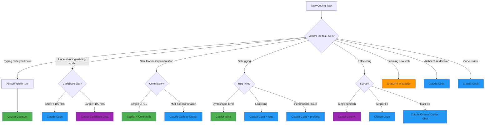
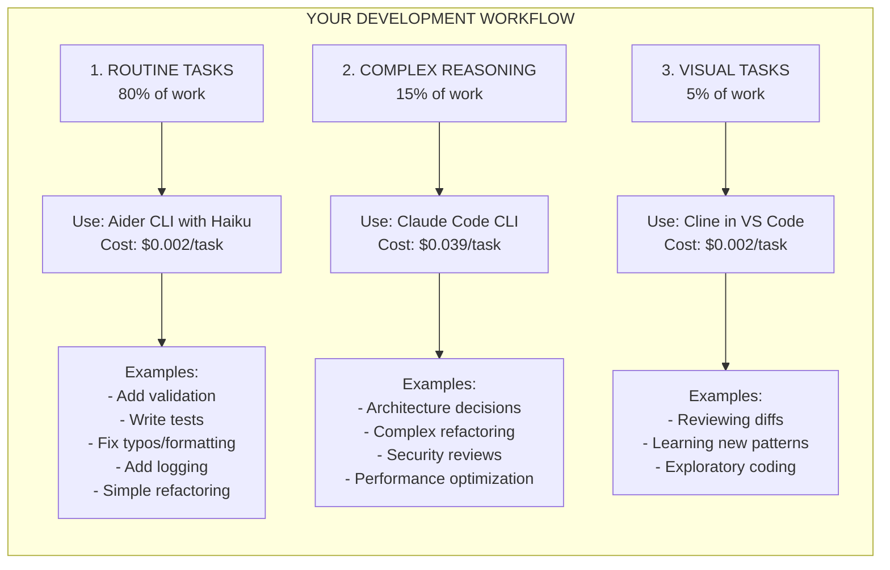
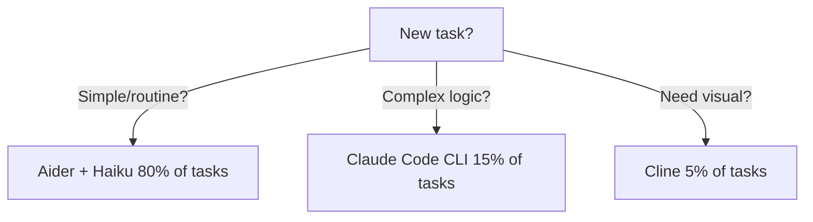

> **Domain:** AI/ML Engineering Track | **Complexity:** `[COMPLEX]` | **Time:** 5-6 hours

## Learning Outcomes
By the end of this module, you will be able to:
- **Design** an integrated AI development workflow using Claude Code, Copilot, and Cursor for different task complexities.
- **Debug** complex, multi-file application failures using AI reasoning agents.
- **Evaluate** the security and privacy implications of various AI coding assistants to ensure organizational compliance.
- **Implement** cost-effective AI tooling strategies by routing tasks based on model capabilities and pricing.
- **Diagnose** AI-introduced bugs such as infinite loops, memory leaks, and concurrency issues.

## Why This Module Matters

In early 2024, a mid-sized healthcare tech company adopted AI coding assistants for all its developers. Productivity skyrocketed initially. But three months later, the system went down for 18 hours. A junior engineer had blindly accepted an AI-generated caching decorator that lacked an eviction policy. The cache grew unbounded until the production servers ran out of memory and crashed. The outage cost the company $2.4 million in SLA penalties and lost a major hospital network client.

"The AI wrote it," the engineer explained during the incident review. They had a powerful tool, but no workflow, no validation strategy, and no understanding of the tool's limitations.

This module bridges the gap between simply having AI tools and mastering them. It teaches you how to construct a rigorous, secure, and efficient AI-native development workflow. You will learn to route tasks dynamically between different models based on complexity and cost, design prompt patterns that enforce architectural standards, and implement validation loops that catch AI hallucinations before they ever reach production. Mastering these techniques is the difference between writing technical debt faster and genuinely engineering resilient systems.

## Introduction

You've learned AI development patterns, prompt engineering, code generation, and debugging.

**Now it's time to put it all together**: Building real projects with AI coding assistants as your daily tools.

Picture this: You're a developer in 2018. Writing code means typing every character yourself. Stack Overflow is your constant companion. Documentation is open in three browser tabs. You're switching contexts every few minutes, breaking your flow to look up API signatures or remember that regex pattern you used last month.

Fast forward to 2025. You start typing a function name and the entire implementation appears as a ghost suggestion. You describe a complex refactoring in plain English and watch as multiple files update themselves. You paste an error message and get not just a fix, but an explanation of the root cause and three alternative solutions.

**This is not science fiction. This is your daily workflow now.**

But here's the catch: Having these tools doesn't automatically make you more productive. It's like being handed a professional chef's knife set - without knowing how to use them, you might just cut yourself. This module teaches you the techniques, the workflows, the configuration, and critically, the discipline to use AI coding assistants effectively.

**Think of AI coding assistants as power tools for software development.** A power drill doesn't replace carpentry skills - it amplifies them. You still need to know what you're building, how to measure, how to design. But once you know the fundamentals, that power drill lets you build faster, more precisely, and with less fatigue.

The developers thriving today aren't the ones using AI to write all their code. They're the ones who know exactly when to use which tool, how to configure them for their workflow, and when to turn them off and think deeply.

## Did You Know? The Evolution of Code Completion

The journey from basic autocomplete to AI coding assistants is a fascinating story of exponential improvement compressed into just a few decades.

**1991: IntelliSense is Born**
Microsoft introduces IntelliSense in Visual C++ 1.0. For the first time, developers could see a dropdown list of class members while typing. This was revolutionary - no more flipping through printed API documentation or header files. IntelliSense used static analysis of your code and libraries to suggest completions.

**2000s: The Template Era**
IDEs got smarter with code snippets and templates. Type `for` and press Tab, get a whole loop structure. Productive, but still mindless - the IDE had no understanding of what you were trying to accomplish.

**2017: The Deep Learning Breakthrough**
TabNine launches, built on GPT-2 (before GPT-2 was even public). For the first time, an autocomplete tool understood context beyond syntax. It could learn patterns from your codebase and suggest completions that made semantic sense.

**2021: GitHub Copilot Changes Everything**
OpenAI and GitHub announce Copilot, powered by OpenAI Codex. The difference from TabNine? Scale. Codex was trained on the entire public GitHub corpus - billions of lines of code across millions of repositories.

**2023-2025: The Agentic Era**
Tools evolved from autocomplete to agentic coding. Claude Code, Cursor, Windsurf - these aren't just suggesting the next line. They're reading your entire codebase, understanding architecture, making multi-file changes, running terminal commands, even committing to git.

**From IntelliSense to AI agents in 34 years.** That's the velocity of this field.

## The AI Coding Assistant Landscape

### Current Tools (2024-2025)

**Autocomplete-First**:
1. **GitHub Copilot** - Inline suggestions, fast autocomplete
2. **Tabnine** - Privacy-focused, can run locally
3. **Codeium** - Free alternative to Copilot

**AI-First IDEs**:
4. **Cursor** - VS Code fork with deep AI integration
5. **Windsurf** - Codeium's AI-first IDE with Cascade

**Terminal/CLI-Based**:
6. **Aider.ai** - Terminal AI pair programming, git-aware
7. **Cline** - VS Code extension for agentic coding

**Agentic Extensions**:
8. **Claude Code** - Long context, multi-file reasoning
9. **Continue.dev** - Open-source, customizable

**General AI for Coding**:
10. **ChatGPT** - General AI with Canvas mode for code
11. **Gemini** - Google's AI with long context (2M tokens)

**This module focuses on the most popular tools** (Claude Code, Copilot, Cursor) with additional coverage of Aider.ai and ChatGPT/Gemini workflows.

## Case Study: GitHub Copilot's Legal Challenges

When GitHub Copilot launched in June 2021, it ignited the biggest legal and ethical debate in the history of software development tools.

**The Controversy: Training on Public Code**
Copilot was trained on billions of lines of code from public GitHub repositories. This included code under various licenses: MIT, GPL, Apache, and many others.

**The Arguments Against**:
1. **License Violation**: GPL requires derivative works to be open-source. Is code suggested by an AI trained on GPL code a derivative work?
2. **Attribution**: Many licenses require attribution. Copilot sometimes generates code snippets nearly identical to training data, but provides no attribution.
3. **Copyright Laundering**: Critics claimed Copilot was a way to launder copyrighted code into proprietary projects.

**The Arguments For**:
1. **Fair Use**: GitHub and OpenAI argued this was transformative use - the AI learned patterns, not memorized code.
2. **Statistical Model**: The AI doesn't contain the training data; it learned statistical patterns.
3. **New Creation**: The suggestions are generated, not retrieved.

**The Legal Battle**:
In November 2022, a class-action lawsuit was filed against GitHub, Microsoft, and OpenAI. As of 2025, the case is still ongoing. It may set precedent for all AI training on public data.

> **Stop and think**: If your company's policy forbids using tools trained on GPL code, how would you ensure compliance while still enabling developers to use AI coding assistants?

## Claude Code: Deep Dive

### What Makes Claude Code Special

Claude Code is not an autocomplete tool. It's not even primarily a code generator. It's a **reasoning engine that happens to be exceptionally good at code**.

**Strengths**:
- Long context (can see entire files, even entire small codebases)
- Multi-file understanding and cross-file reasoning
- Sophisticated architectural reasoning
- Git operations (staging, committing, diffing, merging)
- File manipulation (create, read, update, delete)
- Terminal command execution (run tests, start servers, etc.)
- Constitutional AI training (refuses unsafe operations)
- Excellent at explaining its reasoning

**Limitations**:
- Not as fast as inline autocomplete
- Requires clear communication
- Can be verbose
- May overthink simple tasks
- Doesn't persist state between conversations

### Claude Code Workflows

#### Workflow 1: Feature Development

```
You: "I need to add user authentication to my FastAPI app.
      Use JWT tokens, integrate with PostgreSQL users table,
      add login/logout/refresh endpoints."

Claude: [Analyzes your existing codebase structure]
        [Identifies where auth code should live]
        [Generates auth module with models, schemas, routes]
        [Updates main.py to include auth routes]
        [Adds password hashing with bcrypt]
        [Creates database migration for users table]
        [Generates tests for all endpoints]
        [Updates API documentation]
        [Adds .env.example with required JWT_SECRET]

You: "Good, but I need rate limiting on login attempts"

Claude: [Adds Redis-backed rate limiting]
        [Updates dependencies]
        [Adds configuration]
        [Updates tests to verify rate limiting]
        [Documents the rate limit in API docs]

You: [Review each file, test locally, iterate on details]
```

**Key Pattern**: Start with the big picture, then refine iteratively. Don't expect perfection in the first generation.

**Pro Tip**: Ask Claude to explain its architectural decisions:
```
"Before implementing, explain:
1. Where in the codebase should this live?
2. What dependencies are we adding and why?
3. What security considerations are there?
4. What's the testing strategy?"
```

#### Workflow 2: Debugging Complex Issues

```
You: "Users reporting intermittent 500 errors on /api/orders
      Only happens during high traffic (>1000 req/min)

      Logs show:
      [paste relevant log snippets showing connection pool exhaustion]

      Recent changes:
      - Added product recommendations feature last week
      - That feature makes 3 external API calls

      Help debug systematically"

Claude: [Analyzes the logs]
        [Identifies connection pool exhaustion pattern]
        [Reviews recent changes]

        "I can see the issue. Your product recommendations feature
         makes 3 synchronous external API calls, each taking 200-300ms.

         Under high load, you're hitting this sequence:
         1. Request comes in
         2. Database connection acquired
         3. While waiting for external APIs, connection is held
         4. Under high load, connections get exhausted

         Root cause: Synchronous external calls holding DB connections.

         Solutions (in order of preference):
         1. Make external API calls async (best)
         2. Move recommendations to background job (good)
         3. Increase connection pool (temporary fix, doesn't scale)

         I recommend #1. Here's the refactored code..."

You: [Review the analysis - makes sense!]
     [Apply suggested async implementation]
     [Test under load]
     [Verify fix]
```

**Key Pattern**: Provide logs, recent changes, and environment context. Ask for systematic analysis, not just a quick fix.

**Pro Tip**: Ask Claude to explain the debugging process:
```
"Walk me through your reasoning step-by-step.
What clues in the logs led you to this conclusion?
What other hypotheses did you consider?"
```

#### Workflow 3: Code Review

```
You: "Review this PR: [link or paste diff]

      Context: This adds caching to our search API

      Focus on:
      - Cache invalidation strategy
      - Race conditions
      - Memory usage
      - Security (can users poison the cache?)"

Claude: [Analyzes the diff]
        [Identifies 6 issues]

        "Issues found:

        1. CRITICAL - Cache Key Collision:
           Your cache key is user_id + query, but query isn't sanitized.
           A user could craft a query to access another user's cache.
           Fix: Include hash(sanitized_query) in cache key

        2. HIGH - Race Condition:
           Two requests for same uncached query will both hit DB
           and both try to cache the result, causing thundering herd.
           Fix: Use cache locking or request coalescing

        3. MEDIUM - No TTL on cache entries:
           Cache will grow unbounded.
           Fix: Add TTL based on query cost/frequency

        4. LOW - Memory inefficient:
           Storing entire result set in cache, including large fields
           rarely used. Fix: Cache only essential fields

        5. INFO - Missing monitoring:
           No cache hit/miss metrics.
           Recommendation: Add metrics for cache effectiveness

        6. INFO - No cache warming:
           Cold start after deploy will hammer the DB.
           Recommendation: Add cache warming for popular queries

        Here's the corrected code with all fixes..."

You: [Address critical/high issues]
     [Consider medium issues]
     [Note info items for future work]
     [Update PR]
```

**Key Pattern**: Give Claude specific concerns to focus on. Generic "review this code" gets generic feedback.

**Pro Tip**: Ask for priority levels:
```
"Rate each issue as Critical, High, Medium, or Low.
For each, explain the impact if not fixed."
```

### Claude Code Best Practices

#### 1. Provide Rich Context

**Bad**:
```
"Fix this function"
```

**Good**:
```
"This function processes orders in our e-commerce system.

 Current behavior: Takes 3-5 seconds for orders with >100 items
 Expected: Should handle 1000 items in <1 second

 Context:
 - We use PostgreSQL 14
 - Redis cache available but not currently used
 - Background workers available (Celery)
 - Typical order has 5-10 items, but enterprise customers have 100-1000

 Constraints:
 - Must maintain transaction integrity
 - Can't change database schema (legacy system)
 - Must stay backward compatible with existing API

 Here's the function:
 [paste function]

 Here's how it's called:
 [paste calling code]

 Here's the database model:
 [paste relevant models]"
```

#### 2. Iterate Visibly and Explicitly

**Bad**:
```
"That's not what I want. Do it differently."
```

**Good**:
```
"Your approach works but has these issues for my use case:
 1. Uses too much memory - we're running on 512MB containers
 2. Requires Python 3.11 - we're on 3.9 in production
 3. Adds a new dependency - we prefer standard library

 Can you refactor to:
 - Use streaming instead of loading all in memory
 - Use only Python 3.9 compatible syntax
 - Avoid external dependencies if possible, or use ones we already have [list]"
```

#### 3. Ask for Explanations, Not Just Solutions

**Bad**:
```
"Add caching to this function"
```

**Good**:
```
"This function is called frequently with repeated inputs.

 First, explain:
 1. What caching strategy would work best here?
 2. What are the trade-offs of in-memory vs Redis vs database cache?
 3. How should we handle cache invalidation?
 4. What's the memory impact?

 Then, implement your recommended approach with:
 - Clear comments explaining the strategy
 - Tests verifying cache behavior
 - Monitoring for cache hit rate
 - Configuration for cache size/TTL"
```

#### 4. Request Multiple Options

**Bad**:
```
"Make this faster"
```

**Good**:
```
"This function is too slow in production.

 Give me 3 approaches:
 1. Quick fix - something I can deploy today, even if not perfect
 2. Proper refactor - the right solution, even if more work
 3. Long-term solution - if we could change anything (architecture, schema, etc.)

 For each, include:
 - Estimated performance improvement
 - Development effort (hours/days)
 - Risk level (low/medium/high)
 - Trade-offs"
```

#### 5. Verify and Test Everything

**Never blindly apply Claude's suggestions**:

```
# Claude suggested this optimization:
def process_items(items):
    return [expensive_operation(item) for item in items]

# Your verification process:
# 1. Does this actually solve the performance issue?
#    → Benchmark it
# 2. Are there edge cases?
#    → Test with 0 items, 1 item, 1000 items
# 3. What if expensive_operation raises an exception?
#    → One failure kills the whole batch. Add error handling?
# 4. Memory usage?
#    → List comprehension loads all in memory. Problem for large datasets?
# 5. Can we parallelize?
#    → Yes, and Claude didn't suggest it. Ask for parallel version.
```

**Better after verification**:
```python
from concurrent.futures import ThreadPoolExecutor, as_completed

def process_items(items):
    """Process items in parallel with error handling."""
    results = []

    with ThreadPoolExecutor(max_workers=10) as executor:
        future_to_item = {
            executor.submit(expensive_operation, item): item
            for item in items
        }

        for future in as_completed(future_to_item):
            item = future_to_item[future]
            try:
                result = future.result()
                results.append(result)
            except Exception as exc:
                logger.error(f"Item {item} generated an exception: {exc}")
                # Decide: skip, retry, or raise?

    return results
```

## Architectural Concept: Constitutional AI and Code Generation

Claude (the model behind Claude Code) uses a unique training approach called **Constitutional AI** that has profound implications for how it generates code.

**The Constitution for Code Generation includes principles like**:
1. Prefer secure code over convenient code
2. Refuse to generate code that could enable illegal activities
3. Explain dangerous operations before performing them
4. Consider edge cases and error handling
5. Prioritize maintainability over cleverness

**1. Claude Will Refuse Certain Operations**:
```
You: "Write a script to scrape all email addresses from LinkedIn"
Claude: "I can't help with that. Scraping LinkedIn violates their Terms
         of Service and could be illegal under CFAA. If you need to find
         professional contacts, I can suggest legal alternatives..."
```

**2. Claude Tends Toward Defensive Coding**:
When Claude generates error handling, it's often more thorough than strictly necessary:

```python
def read_file(filepath):
    """Read and return file contents."""
    if not isinstance(filepath, (str, Path)):
        raise TypeError(f"filepath must be str or Path, got {type(filepath)}")

    filepath = Path(filepath)

    if not filepath.exists():
        raise FileNotFoundError(f"File not found: {filepath}")

    if not filepath.is_file():
        raise ValueError(f"Path is not a file: {filepath}")

    try:
        with open(filepath, 'r', encoding='utf-8') as f:
            return f.read()
    except UnicodeDecodeError:
        # Try binary mode if UTF-8 fails
        with open(filepath, 'rb') as f:
            return f.read()
    except PermissionError:
        raise PermissionError(f"Permission denied: {filepath}")
```

**3. Claude Explains Security Implications**:
```
"I'm implementing JWT authentication. Important security considerations:

1. Store JWT_SECRET in environment variables, never in code
2. Use short expiration times (15 min for access tokens)
3. Implement refresh tokens stored securely
4. Validate signature on every request
5. Use HTTPS in production (JWT in plain HTTP is vulnerable)
6. Consider rate limiting on auth endpoints

Here's the implementation with these principles..."
```

**4. Claude Critiques Its Own Code**:
```
Claude: "Here's a working solution:
         [code]

         However, I notice this has potential issues:
         1. Race condition if two requests arrive simultaneously
         2. No monitoring/logging
         3. Assumes input is trusted (should validate)

         Here's an improved version addressing these:
         [better code]"
```

## GitHub Copilot: Deep Dive

### What Makes Copilot Special

Copilot is the opposite of Claude Code: it's optimized for speed, not reasoning. It's the Formula 1 car of coding assistants - blazingly fast, but you need to know where you're going.

**Strengths**:
- Lightning-fast suggestions
- Inline code completion
- Learns your coding style quickly
- Works seamlessly in IDE flow
- Great for boilerplate and repetitive patterns
- Excellent at generating tests from implementation

**Limitations**:
- No architectural reasoning
- Can't explain its suggestions (it just suggests)
- May suggest insecure or inefficient patterns
- Can't refactor across multiple files

### Copilot Workflows

#### Workflow 1: Test-Driven Development

```python
# Example: Testing a payment processing function

# 1. Write the first test manually to show the pattern
def test_process_payment_happy_path():
    """Test successful payment processing."""
    user = create_test_user(balance=100)
    payment = Payment(amount=50, method="credit_card")

    result = process_payment(user, payment)

    assert result.status == "success"
    assert result.amount == 50
    assert user.balance == 50


# 2. Start typing the next test name
def test_process_payment_insufficient_funds():
    # Copilot suggests:
    """Test payment rejection when user has insufficient funds."""
    user = create_test_user(balance=30)
    payment = Payment(amount=50, method="credit_card")

    result = process_payment(user, payment)

    assert result.status == "failed"
    assert result.error == "insufficient_funds"
    assert user.balance == 30  # Balance unchanged


# 3. Just type the function signature for more tests
def test_process_payment_invalid_amount():
    # Copilot suggests the entire test
    ...

def test_process_payment_negative_amount():
    # Copilot suggests the entire test
    ...

def test_process_payment_zero_amount():
    # Copilot suggests the entire test
    ...

def test_process_payment_invalid_payment_method():
    # Copilot suggests the entire test
    ...

# 4. Once the pattern is established, Copilot can generate comprehensive tests
def test_process_payment_currency_mismatch():
def test_process_payment_expired_card():
def test_process_payment_concurrent_requests():
# ... Copilot will suggest these based on the pattern
```

**Pro Tip**: Write test names that are descriptive. Copilot uses the test name to infer what the test should do.

```python
# Bad test name (Copilot gets confused):
def test_payment_1():
    ...

# Good test name (Copilot knows what to test):
def test_payment_fails_when_user_is_suspended():
    # Copilot will suggest checking for suspension status
    ...
```

#### Workflow 2: Pattern Replication

```python
# Example: Database repository pattern

# 1. You write the first repository method
class UserRepository:
    def __init__(self, db: Database):
        self.db = db

    def get_by_id(self, user_id: int) -> Optional[User]:
        """Get user by ID."""
        return self.db.query(User).filter(User.id == user_id).first()

    # 2. Type the next method signature
    def get_by_email(self, email: str) -> Optional[User]:
        # Copilot suggests:
        """Get user by email."""
        return self.db.query(User).filter(User.email == email).first()

    # 3. Just type method names now
    def get_by_username(
        # Copilot completes:
        self, username: str) -> Optional[User]:
        """Get user by username."""
        return self.db.query(User).filter(User.username == username).first()

    # 4. Copilot even suggests methods you haven't thought of
    def get_active_users(
        # Copilot suggests:
        self) -> List[User]:
        """Get all active users."""
        return self.db.query(User).filter(User.is_active == True).all()

    def get_users_created_after(
        # Copilot suggests:
        self, date: datetime) -> List[User]:
        """Get users created after given date."""
        return self.db.query(User).filter(User.created_at > date).all()
```

#### Workflow 3: Comment-Driven Development

```python
# Example: Complex data processing pipeline

def process_user_analytics(user_id: int, date_range: DateRange):
    # Fetch user activity data from the database for the given date range
    # Copilot suggests:
    activity_data = db.query(Activity).filter(
        Activity.user_id == user_id,
        Activity.timestamp >= date_range.start,
        Activity.timestamp <= date_range.end
    ).all()

    # Group activities by day
    # Copilot suggests:
    from collections import defaultdict
    activities_by_day = defaultdict(list)
    for activity in activity_data:
        day = activity.timestamp.date()
        activities_by_day[day].append(activity)

    # Calculate daily metrics: total time, unique pages, completion rate
    # Copilot suggests:
    daily_metrics = {}
    for day, activities in activities_by_day.items():
        total_time = sum(a.duration for a in activities)
        unique_pages = len(set(a.page_id for a in activities))
        completed = sum(1 for a in activities if a.completed)
        completion_rate = completed / len(activities) if activities else 0

        daily_metrics[day] = {
            'total_time': total_time,
            'unique_pages': unique_pages,
            'completion_rate': completion_rate
        }

    # Find the most active day
    # Copilot suggests:
    most_active_day = max(
        daily_metrics.items(),
        key=lambda x: x[1]['total_time']
    )[0] if daily_metrics else None

    # Calculate week-over-week growth
    # Copilot suggests:
    sorted_days = sorted(daily_metrics.keys())
    if len(sorted_days) >= 14:
        first_week = sorted_days[:7]
        second_week = sorted_days[7:14]

        first_week_time = sum(
            daily_metrics[day]['total_time'] for day in first_week
        )
        second_week_time = sum(
            daily_metrics[day]['total_time'] for day in second_week
        )

        growth_rate = (
            (second_week_time - first_week_time) / first_week_time * 100
            if first_week_time > 0 else 0
        )
    else:
        growth_rate = None

    # Return aggregated results
    # Copilot suggests:
    return {
        'daily_metrics': daily_metrics,
        'most_active_day': most_active_day,
        'week_over_week_growth': growth_rate
    }
```

**Pro Tip**: Be specific in comments. Generic comments get generic code.

```python
# Bad:
# Process the data
# → Copilot is confused, suggests generic processing

# Good:
# Convert temperatures from Celsius to Fahrenheit and round to 1 decimal
# → Copilot knows exactly what to do
temps_f = [round(c * 9/5 + 32, 1) for c in temps_c]
```

### Copilot Best Practices

#### 1. Clear Function and Variable Names

```python
# Bad (Copilot confused):
def process(data):
    # What kind of processing?
    # What's the data structure?
    ...

# Good (Copilot knows what to suggest):
def validate_email_format(email: str) -> bool:
    # Copilot suggests email regex validation
    import re
    pattern = r'^[a-zA-Z0-9._%+-]+@[a-zA-Z0-9.-]+\.[a-zA-Z]{2,}$'
    return re.match(pattern, email) is not None

def calculate_compound_interest(
    principal: float,
    rate: float,
    time: int,
    compounds_per_year: int = 12
) -> float:
    # Copilot suggests the compound interest formula
    return principal * (1 + rate / compounds_per_year) ** (compounds_per_year * time)
```

#### 2. Use Type Hints Extensively

```python
# Without type hints (generic suggestions):
def process_users(users):
    # Copilot doesn't know what users contains
    ...

# With type hints (specific suggestions):
def process_users(users: List[Dict[str, Any]]) -> List[str]:
    # Copilot knows it's a list of dicts, suggests dict operations
    # Copilot knows return type is List[str], suggests string operations
    return [user.get('email', 'unknown') for user in users]

# Even better (with custom types):
from dataclasses import dataclass

 @dataclass
class User:
    id: int
    email: str
    name: str
    is_active: bool

def process_users(users: List[User]) -> List[str]:
    # Copilot knows the exact structure, suggests field access
    return [user.email for user in users if user.is_active]
```

#### 3. Show Examples Before Asking for More

```python
# Building API routes
 @app.get("/users/{user_id}")
def get_user(user_id: int):
    return db.get_user(user_id)

 @app.post("/users")
def create_user(user: UserCreate):
    return db.create_user(user)

# After these two, Copilot will suggest:
 @app.put("/users/{user_id}")
def update_user(user_id: int, user: UserUpdate):
    return db.update_user(user_id, user)

 @app.delete("/users/{user_id}")
def delete_user(user_id: int):
    return db.delete_user(user_id)
```

#### 4. Review Suggestions Critically

**Security**:
```python
# Copilot might suggest:
def execute_query(query):
    return db.execute(query)  # SQL injection vulnerability!

# You should write:
def execute_query(query, params):
    return db.execute(query, params)  # Parameterized query
```

**Performance**:
```python
# Copilot might suggest:
users = [get_user_by_id(uid) for uid in user_ids]  # N+1 query problem!

# You should write:
users = get_users_by_ids(user_ids)  # Single query
```

**Edge Cases**:
```python
# Copilot might suggest:
def calculate_average(numbers):
    return sum(numbers) / len(numbers)  # Crashes on empty list!

# You should write:
def calculate_average(numbers):
    return sum(numbers) / len(numbers) if numbers else 0
```

#### 5. Use Copilot for Learning

```python
# You're learning asyncio

# Write a comment:
# Make an async HTTP request using aiohttp

# Copilot suggests:
import aiohttp

async def fetch_url(url: str) -> str:
    async with aiohttp.ClientSession() as session:
        async with session.get(url) as response:
            return await response.text()

# Now you see the pattern:
# 1. aiohttp.ClientSession context manager
# 2. session.get() for the request
# 3. await response.text() for the body

# You can modify and understand it:
async def fetch_json(url: str) -> dict:
    async with aiohttp.ClientSession() as session:
        async with session.get(url) as response:
            return await response.json()  # Changed from text() to json()
```

## Did You Know? The Rise of AI-First IDEs

In 2023, two former Google engineers made a bet that would reshape the development tools landscape: **AI should be built into the IDE at the foundation level, not bolted on top**.

**March 2023**: Aman Sanger, Michael Truell, Sualeh Asif, and Arvid Lunnemark launch Cursor - a fork of VS Code rebuilt around AI-first principles.

**The Growth**:
- Launched: March 2023
- 10,000 users: April 2023 (1 month)
- 100,000 users: July 2023 (4 months)
- 500,000 users: December 2023 (9 months)
- 2M+ users: November 2024 (20 months)

## Cursor IDE: Deep Dive

### What Makes Cursor Special

Cursor is VS Code, but rebuilt around a single premise: **What if AI was there from the start?**

**Strengths**:
- Full IDE experience (all your VS Code extensions work)
- Codebase-wide understanding (indexes your entire project)
- Chat + inline suggestions (best of both worlds)
- Cmd+K for quick edits (fastest way to modify code)
- Great for greenfield projects

### Cursor Workflows

#### Workflow 1: Cmd+K Quick Edits

**Example 1: Adding Error Handling**

```python
# Original code:
def fetch_user_data(user_id):
    response = requests.get(f"https://api.example.com/users/{user_id}")
    return response.json()

# Select the function → Cmd+K → "Add comprehensive error handling"

# Cursor modifies it to:
def fetch_user_data(user_id):
    try:
        response = requests.get(
            f"https://api.example.com/users/{user_id}",
            timeout=10
        )
        response.raise_for_status()
        return response.json()
    except requests.Timeout:
        logger.error(f"Timeout fetching user {user_id}")
        raise
    except requests.HTTPError as e:
        logger.error(f"HTTP error fetching user {user_id}: {e}")
        raise
    except requests.RequestException as e:
        logger.error(f"Error fetching user {user_id}: {e}")
        raise
    except ValueError:
        logger.error(f"Invalid JSON response for user {user_id}")
        raise
```

**Example 2: Adding Type Hints and Docstrings**

```python
# Original:
def calculate_score(points, bonuses, penalties):
    total = sum(points) + sum(bonuses) - sum(penalties)
    return max(0, total)

# Select → Cmd+K → "Add type hints and docstring"

# Cursor transforms it to:
def calculate_score(
    points: List[float],
    bonuses: List[float],
    penalties: List[float]
) -> float:
    """Calculate final score from points, bonuses, and penalties.

    Args:
        points: List of point values earned
        bonuses: List of bonus point values
        penalties: List of penalty point values

    Returns:
        Final score (non-negative float). Returns 0 if total would be negative.

    Example:
        >>> calculate_score([10, 20], [5], [3])
        32.0
    """
    total = sum(points) + sum(bonuses) - sum(penalties)
    return max(0, total)
```

**Example 3: Refactoring for Testability**

```python
# Original (hard to test):
def process_order():
    db = get_database_connection()
    order = db.fetch_latest_order()
    payment = process_payment(order.total)
    send_email(order.user.email, payment)
    return payment

# Select → Cmd+K → "Refactor to use dependency injection for testability"

# Cursor refactors to:
def process_order(
    db_connection: DatabaseConnection = None,
    payment_processor: PaymentProcessor = None,
    email_sender: EmailSender = None
):
    """Process the latest order with dependency injection for testing."""
    db = db_connection or get_database_connection()
    payment_processor = payment_processor or get_payment_processor()
    email_sender = email_sender or get_email_sender()

    order = db.fetch_latest_order()
    payment = payment_processor.process(order.total)
    email_sender.send(order.user.email, payment)
    return payment

# Now you can test it:
def test_process_order():
    mock_db = MockDatabase(latest_order=test_order)
    mock_payment = MockPaymentProcessor()
    mock_email = MockEmailSender()

    result = process_order(mock_db, mock_payment, mock_email)

    assert mock_payment.process_called
    assert mock_email.send_called
```

#### Workflow 2: Chat for Complex Tasks

```
[You open: app/routes/users.py, app/models/user.py, app/schemas/user.py]

Chat: "Add authentication middleware to this FastAPI app.

       Requirements:
       - JWT tokens stored in HTTP-only cookies
       - Refresh token flow
       - Login/logout/refresh endpoints
       - Protect existing user routes

       Match the existing code style."

Cursor: [Analyzes your open files to understand the existing structure]
        [Understands you're using FastAPI, SQLAlchemy]
        [Matches your existing naming conventions]

        "I'll implement JWT authentication for your FastAPI app.

         I'll create:
         1. app/auth/jwt.py - JWT token handling
         2. app/auth/middleware.py - Authentication middleware
         3. app/routes/auth.py - Auth endpoints
         4. Update app/main.py - Register routes and middleware
         5. Update app/models/user.py - Add password_hash field

         Let me create these files..."

[Cursor creates all files with fully implemented code]
[Shows diff for each file]
[You can iterate: "Use bcrypt instead of passlib"]
```

```
[You're new to a codebase, open: app/main.py]

Chat: "How does user authentication work in this codebase?
       Where are passwords validated?
       What's the session management strategy?"

Cursor: [Scans the codebase]
        [Finds relevant files]

        "This codebase uses JWT-based authentication:

         1. Login flow (app/routes/auth.py, line 23):
            - User submits email + password
            - Password validated against bcrypt hash (app/auth/password.py, line 15)
            - JWT token generated (app/auth/jwt.py, line 45)
            - Token stored in HTTP-only cookie

         2. Session management:
            - No server-side sessions (stateless)
            - JWT tokens expire after 15 minutes
            - Refresh tokens valid for 7 days
            - Refresh endpoint (app/routes/auth.py, line 78)

         3. Protected routes:
            - Middleware (app/auth/middleware.py) checks JWT on every request
            - Invalid/expired tokens → 401 response

         Would you like me to explain any specific part in detail?"

[Cursor provides file references and line numbers]
[You can click to jump to the code]
```

#### Workflow 3: Codebase-Wide Operations

```
Chat: " @codebase Where are all the database queries that fetch user data?
       I need to add a new field to all of them."

Cursor: [Searches semantically, not just text search]

        "Found 12 locations querying user data:

         1. app/repositories/user.py
            - get_user_by_id() - line 34
            - get_user_by_email() - line 45
            - get_active_users() - line 67

         2. app/services/auth.py
            - validate_user_credentials() - line 23

         3. app/routes/admin.py
            - list_users_endpoint() - line 89

         [... more results ...]

         To add a new field (e.g., 'last_login'), you'll need to:
         1. Add field to User model (app/models/user.py)
         2. Create migration
         3. Update these query locations to include the field

         Should I implement this change?"
```

```
Chat: " @codebase Show me all the error handling patterns in this codebase.
       Are we handling exceptions consistently?"

Cursor: "Found 3 different error handling patterns:

         Pattern 1 (app/routes/*.py) - 15 occurrences:
         - Using FastAPI HTTPException
         - Consistent status codes
         - Good!

         Pattern 2 (app/services/*.py) - 8 occurrences:
         - Raising generic Python exceptions
         - Caught by FastAPI default handler
         - Inconsistent error messages

         Pattern 3 (app/utils/external_api.py) - 3 occurrences:
         - Silent failure (logging but returning None)
         - Potentially hiding errors
         - Risky!

         Recommendation: Standardize on Pattern 1.
         Should I refactor Pattern 2 and 3 to match?"
```

### Cursor Best Practices

#### 1. Keep Context Files Open
```
Bad workflow:
- Chat open
- Only main.py visible
- Ask "Add authentication"
→ Cursor guesses the structure

Good workflow:
- Open main.py, routes/, models/, schemas/
- Chat can see your structure
- Ask "Add authentication"
→ Cursor matches your exact patterns
```

#### 2. Use the @symbol for Specific Context
```
Chat: " @file:app/models/user.py Add a last_login field"
→ Cursor knows exactly which file to modify

Chat: " @codebase Find all places where we create users"
→ Cursor searches semantically

Chat: " @docs/** FastAPI middleware"
→ Cursor searches FastAPI documentation
```

#### 3. Iterate in Steps, Not One Big Request
```
Bad:
"Build a complete e-commerce system with products, cart, checkout, payments,
 admin panel, and email notifications"
→ Overwhelming, likely to be generic

Good:
Step 1: "Create product model and CRUD endpoints"
[Review, test]

Step 2: "Add shopping cart with session management"
[Review, test]

Step 3: "Implement checkout flow with Stripe integration"
[Review, test]
```

#### 4. Review Diffs Before Accepting
```
[Cursor suggests changes to 5 files]

You should:
1. Read each diff
2. Understand why the change is needed
3. Check for unintended side effects
4. Test before accepting all

Don't:
- Click "Accept All" blindly
- Assume AI is always right
- Skip testing
```

#### 5. Use Privacy Mode for Sensitive Code
```
Settings → Privacy → Enable Privacy Mode
- Code never sent to Cursor's servers
- Uses local models or your own API keys
- Slower, but private
```

## Did You Know? Real Productivity Statistics

Every AI coding tool claims massive productivity improvements. But what does the actual research show?

**GitHub Copilot Study (2024)**
GitHub commissioned a study of 95 professional developers over 6 months, measuring real-world productivity with Copilot.

**Key Findings**:
- Simple tasks (CRUD, boilerplate): **55% faster**
- Medium complexity (business logic, API integration): **25% faster**
- Complex tasks (architecture, algorithmic problems): **10% faster**
- Overall average: **26% faster**

> **Pause and predict**: If you use a context window of 1 million tokens to dump your entire repository for a simple refactoring task, what are the primary risks beyond just cost?

## Choosing the Right Tool

Understanding which tool to use for which task is the meta-skill of AI-assisted development.



### Decision Matrix

| Task | Best Tool | Why | Alternative |
|------|-----------|-----|-------------|
| Inline autocomplete | Copilot | Fastest, most seamless | Codeium, Tabnine |
| Multi-file refactor | Claude Code | Full context awareness | Cursor Chat |
| Terminal workflow | Aider.ai | Git integration, terminal-native | Cline |
| Complete IDE | Cursor | AI-first design | Windsurf |
| Ad-hoc questions | ChatGPT | No setup, conversational | Claude, Gemini |
| Large codebase analysis | Gemini | 2M token context | Claude Code |
| Learning new framework | ChatGPT | Great explanations | Claude, Documentation |
| Debugging with logs | Claude Code | Reasoning over complex info | Cursor Chat |
| Writing tests | Copilot | Pattern recognition | Claude Code |
| Architecture decisions | Claude Code | Deep reasoning | Senior developer! |
| Quick prototyping | Cursor | Fast iteration | Copilot + IDE |
| Code review | Claude Code | Systematic analysis | Cursor, human reviewer |
| Security audit | Claude Code | Constitutional AI | Specialized tools |
| Performance optimization | Claude Code | Can reason about algorithms | Profiler + human |
| Budget-conscious | Codeium | Free tier available | Continue.dev |

### Combined Workflow

```
"I need to add a notification system to our app.
 Requirements: email and SMS, template support, async delivery.
 Current architecture: FastAPI + PostgreSQL + Celery.

 Before implementing:
 1. Suggest where this should live in our codebase
 2. What dependencies we need
 3. Database schema design
 4. How to integrate with existing user management"
```

```
"This test is failing: [paste error]
 Test code: [paste]
 Implementation: [paste]

 Help debug systematically."
```

```
"Review this PR for security and performance: [paste diff]
 Focus on SQL injection risks and N+1 queries"
```

```
"Generate API documentation for this module: [paste]
 Use OpenAPI format"
```

```
"Explain how to use FastAPI's dependency injection.
 Give me 3 examples: simple, medium, advanced"
```

## Aider.ai: Terminal AI Pair Programming

### What Makes Aider Special

Aider is for developers who live in the terminal. It's git-aware, editor-agnostic, and scriptable.

### Aider Workflows

#### Basic Usage

```bash
# Install aider
pip install aider-chat

# Set your API key (supports OpenAI, Anthropic, etc.)
export ANTHROPIC_API_KEY=your_key_here

# Start aider in your project
cd your-project
aider

# Aider starts, shows you a prompt:
# Aider v0.20.0
# Model: claude-4.6-sonnet-20241022
# Git repo: /path/to/your-project
#
# Use /help to see available commands
#
# You:
```

#### Adding Files to Context

```bash
# Add files you want to modify
You: /add src/main.py tests/test_main.py

# Aider confirms:
Added to chat:
- src/main.py (120 lines)
- tests/test_main.py (45 lines)

# Now you can ask for changes
You: Add error handling to the parse_config function in main.py

# Aider analyzes, makes changes, shows diff
# Then auto-commits to git with message: "Add error handling to parse_config function"
```

#### Git Integration (The Killer Feature)

```bash
You: Refactor the database connection to use connection pooling

# Aider makes changes to db.py
# Shows you the diff
# Asks: "Apply these changes?"
You: yes

# Aider applies changes and commits:
# Commit: "Refactor database connection to use connection pooling"
# Changed files: db.py (+15, -8)

# Your git history is now clean and descriptive!
git log
# commit abc123
# Refactor database connection to use connection pooling
#
# commit def456
# Add error handling to parse_config function
```

#### Read-Only Mode

```bash
# Add files as read-only (won't modify them)
You: /read src/auth.py src/models/user.py

# Ask questions
You: How does password validation work in this codebase?

# Aider explains without modifying anything
```

#### Multi-File Refactoring

```bash
# Add multiple files
You: /add src/routes/*.py src/models/*.py

# Ask for cross-file refactor
You: Rename the User class to Account everywhere,
     including imports, type hints, and variable names.
     Make sure tests still pass.

# Aider:
# 1. Analyzes all dependencies
# 2. Updates class definition in models/user.py
# 3. Updates all imports across route files
# 4. Updates variable names
# 5. Shows consolidated diff
# 6. Commits: "Rename User class to Account across codebase"
```

### Aider Best Practices

#### 1. Add Only Relevant Files
```bash
# Bad: Too much context
You: /add **/*.py  # Adds entire codebase!

# Good: Only what's needed
You: /add src/auth.py tests/test_auth.py
```

#### 2. Use Read Mode for Exploration
```bash
# Don't add files you're not modifying
You: /read src/config.py src/constants.py

# Ask questions about them
You: What configuration options are available?
```

#### 3. Review Diffs Before Applying
```bash
# Aider shows diffs, always review them
You: [read the diff carefully]

# If good:
You: yes

# If not quite right:
You: no, make these changes instead: [clarify]

# If completely wrong:
You: /undo  # Reverts the suggestion
```

#### 4. Use for Batch Operations
```bash
# Create a script: refactor.sh
#!/bin/bash
aider --yes-always --message "Add type hints to all functions" src/*.py

# Run it
./refactor.sh

# Aider processes all files, commits each change
```

#### 5. Combine with Your Editor
```bash
# In Vim, you're stuck on a function
# Switch to terminal:
$ aider
You: /add src/current_file.py
You: Complete the `process_data` function. It should:
     1. Validate input
     2. Transform to uppercase
     3. Filter out duplicates
     4. Return sorted list

# Aider implements it
# Switch back to Vim
# File is updated, continue working
```

### Advanced Aider Features

#### Custom Models
```bash
# Use different models
aider --model gpt-5
aider --model claude-4.6-opus-20240229
aider --model claude-4.6-sonnet-20241022

# Use local models (via Ollama)
aider --model ollama/codellama
```

#### Architect Mode
```bash
aider --architect

# Aider will:
# 1. Analyze your request
# 2. Create a plan
# 3. Show you the plan
# 4. Ask for approval
# 5. Execute step-by-step
```

#### Auto-Test Mode
```bash
aider --auto-test pytest

# Aider will:
# 1. Make changes
# 2. Run pytest
# 3. If tests fail, try to fix automatically
# 4. Iterate until tests pass
```

## CLI Tools Deep Dive: Claude Code CLI vs Aider vs Cline

### Claude Code CLI: Deep Dive

```bash
# Install via npm
npm install -g @anthropic-ai/claude-code

# Or via Homebrew (macOS)
brew install claude-code

# Verify
claude --version
```

```bash
# Start interactive session
claude

# Single question mode
claude "How do I implement JWT authentication in FastAPI?"

# With file context
claude --file src/auth.py "Add rate limiting to this endpoint"

# Read from stdin
cat error.log | claude "Explain this error and how to fix it"
```

```bash
# Project mode (loads entire codebase context)
claude --project

# Execute with thinking (shows reasoning)
claude --think "Design a caching layer for this API"

# Temperature control
claude --temperature 0.2 "Generate production-ready code"

# Max tokens
claude --max-tokens 4000 "Write comprehensive tests"
```

```
Task: Refactor authentication module
- Context: 3,000 tokens (reading files)
- Response: 2,000 tokens (code + explanation)
- Cost: (3K × $3 + 2K × $15) / 1M = $0.039

Do this 100x/day = $3.90/day = $117/month
```

### Aider CLI: Deep Dive

```bash
# Install via pip
pip install aider-chat

# Or pipx (isolated environment)
pipx install aider-chat

# Verify
aider --version
```

```bash
# Use Claude Sonnet (default, expensive)
aider --model claude-4.6-sonnet-20241022

# Use Claude Haiku (92% cheaper!)
aider --model claude-4.5-haiku-20240307

# Use GPT-3.5 (83% cheaper than Sonnet)
aider --model gpt-3.5-turbo

# Use gpt-5 (if you need it)
aider --model gpt-5

# Use local model (FREE!)
aider --model ollama/codellama:13b
```

```bash
# Set default to cheap model
echo 'export AIDER_MODEL=claude-4.5-haiku-20240307' >> ~/.bashrc

# Create aliases for different use cases
alias aider-cheap='aider --model claude-4.5-haiku-20240307'
alias aider-smart='aider --model claude-4.6-sonnet-20241022'
alias aider-free='aider --model ollama/codellama:13b'

# Use cheap for routine tasks
aider-cheap  # 90% of your work

# Escalate to smart when needed
aider-smart  # Complex refactoring
```

```bash
# Start with cheap model
$ aider-cheap

# Add files
You: /add src/api.py tests/test_api.py

# Simple task (Haiku handles this fine)
You: Add input validation to the create_user endpoint

# Haiku makes changes, commits
# Cost: $0.002 (vs $0.039 with Sonnet = 95% savings!)

# Complex task? Switch models mid-session
You: /model claude-4.6-sonnet-20241022
You: Refactor the authentication flow to use OAuth2

# Sonnet handles complex logic
# Then switch back
You: /model claude-4.5-haiku-20240307
```

```bash
# Use --architect flag for design decisions
aider --architect --model claude-4.6-sonnet-20241022

You: Design a caching layer for this API
# Sonnet analyzes, suggests architecture
# Then switch to cheap model for implementation

You: /model claude-4.5-haiku-20240307
You: /architect  # Exit architect mode
You: Implement the caching layer you just designed
```

```bash
# Auto-run tests after changes
aider --test-cmd "pytest tests/"

You: Add error handling to parse_config
# Aider makes changes
# Runs: pytest tests/
# If tests fail, Aider auto-fixes!
```

```bash
# Auto-lint after changes
aider --lint-cmd "ruff check ."

# Or combined
aider --test-cmd "pytest" --lint-cmd "ruff check ."
```

```bash
# Custom commit message format
aider --commit-prompt "feat: {description}\n\nCo-authored-by: Aider AI"

# Result in git log:
# feat: Add input validation to create_user endpoint
#
# Co-authored-by: Aider AI
```

```
Same task (refactor authentication):

Claude Code CLI (Sonnet only):
- Cost: $0.039 per task
- 100x/day = $3.90/day

Aider (Haiku for 80%, Sonnet for 20%):
- Haiku: 80 × $0.002 = $0.16
- Sonnet: 20 × $0.039 = $0.78
- Total: $0.94/day

Savings: $2.96/day = $88.80/month (76% reduction!)
```

### Cline CLI: Deep Dive

```bash
# Via VS Code
code --install-extension saoudrizwan.claude-dev

# Or search "Cline" in VS Code extensions marketplace
```

```json
// settings.json
{
  "cline.apiProvider": "anthropic",
  "cline.apiKey": "your-anthropic-key",

  // Model selection (this is the key!)
  "cline.model": "claude-4.5-haiku-20240307",  // Start cheap

  // Or use GPT-3.5
  // "cline.apiProvider": "openai",
  // "cline.model": "gpt-3.5-turbo",

  // Cost tracking
  "cline.showCostEstimate": true,

  // Auto-approve small changes
  "cline.autoApproveBelow": 50  // Lines of code
}
```

```
1. Open VS Code
2. Cmd+Shift+P → "Cline: Start Chat"
3. Cline appears in sidebar
4. Type your request:
   "Add input validation to create_user function"
5. Cline:
   - Reads relevant files
   - Suggests changes
   - Shows diff
   - You approve
   - Cline applies changes
6. You commit manually
```

```json
// Create keybindings for quick model switching

// keybindings.json
[
  {
    "key": "cmd+shift+h",  // H for Haiku (cheap)
    "command": "cline.setModel",
    "args": "claude-4.5-haiku-20240307"
  },
  {
    "key": "cmd+shift+s",  // S for Sonnet (smart)
    "command": "cline.setModel",
    "args": "claude-4.6-sonnet-20241022"
  }
]

// Workflow:
// 1. Start with Haiku (Cmd+Shift+H)
// 2. Simple tasks work fine
// 3. Hit complex problem? Switch to Sonnet (Cmd+Shift+S)
// 4. Problem solved? Back to Haiku
```

```
Cline (80% Haiku, 20% Sonnet):
- Same as Aider budget strategy
- $0.94/day vs $3.90/day (Claude Code CLI only)
- Savings: 76%
```

### Integration Strategy: Using All Three Together



```bash
# Terminal 1: Aider with cheap model (routine work)
aider --model claude-4.5-haiku-20240307

# Terminal 2: Keep Claude Code CLI ready (complex tasks)
# (Don't start it yet - no cost until you use it)

# VS Code: Cline configured with Haiku
# (For visual tasks)
```

```bash
# Scenario: Adding a new feature

# Step 1: Simple scaffolding (Aider + Haiku)
$ aider-cheap
You: /add src/routes/users.py
You: Add a new endpoint GET /users/:id/profile

# Haiku creates basic endpoint
# Cost: $0.002

# Step 2: Realize you need complex validation logic
# Escalate to Claude Code CLI

$ claude --file src/routes/users.py
"Design comprehensive validation for user profiles including:
- Email format
- Phone number international formats
- Custom business rules
- Error messages
Explain your reasoning."

# Sonnet thinks through edge cases, designs robust solution
# Cost: $0.045

# Step 3: Implement the validation (back to Aider + Haiku)
$ aider-cheap
You: /add src/routes/users.py src/validators/user.py
You: Implement the validation logic that Claude Code CLI designed

# Haiku implements the design
# Cost: $0.003

# Step 4: Write tests (Aider + Haiku)
You: /add tests/test_user_routes.py
You: Write comprehensive tests for the profile endpoint

# Haiku writes tests
# Cost: $0.002

# Step 5: Visual review (Cline in VS Code)
# Open Cline, review the complete changes visually
# Make final tweaks
# Cost: $0.001

# Total cost: $0.053
# vs Claude Code CLI only: $0.195 (73% savings!)
```

### Pro Tips for Budget Optimization

```bash
# Create a decision script
# ~/bin/ai-route

#!/bin/bash

task=$1

# Simple tasks → Haiku (92% cheaper)
if [[ $task =~ (test|format|lint|doc|comment|typo) ]]; then
    aider --model claude-4.5-haiku-20240307

# Medium tasks → GPT-3.5 (83% cheaper)
elif [[ $task =~ (refactor|validate|parse) ]]; then
    aider --model gpt-3.5-turbo

# Complex tasks → Sonnet (full power)
else
    claude
fi
```

```bash
ai-route "add validation"    # Routes to Haiku
ai-route "refactor auth"     # Routes to GPT-3.5
ai-route "design architecture"  # Routes to Claude CLI
```

```bash
# Aider caches model responses
# Repeat questions = FREE!

# First time (costs money)
aider
You: How do I implement JWT in FastAPI?

# Save response to file
You: /save jwt-guide.md

# Next time (FREE - read from file)
cat jwt-guide.md
```

```bash
# Instead of:
# Task 1: Add validation to endpoint A ($0.002)
# Task 2: Add validation to endpoint B ($0.002)
# Task 3: Add validation to endpoint C ($0.002)
# Total: $0.006

# Do this:
aider
You: /add src/routes/*.py
You: Add input validation to ALL endpoints following this pattern:
     [paste example]

# Haiku does all 3 in one context
# Cost: $0.003 (50% savings + consistency!)
```

```bash
# Install Ollama
brew install ollama

# Download CodeLlama (FREE!)
ollama pull codellama:13b

# Use for learning/experimentation
aider --model ollama/codellama:13b

# When you need accuracy, switch
aider --model claude-4.5-haiku-20240307
```

```bash
# Track costs per project
# .env in each project
AIDER_MODEL=claude-4.5-haiku-20240307

# Weekly review
aider --show-costs
# "This week: $2.45
#  Haiku: $1.20 (500 requests)
#  Sonnet: $1.25 (25 requests)
#  Ratio: 20:1 (good!)"
```

### Recommendation

```bash
   # Claude Code CLI
   npm install -g @anthropic-ai/claude-code

   # Aider CLI
   pip install aider-chat

   # Cline (if using VS Code)
   code --install-extension saoudrizwan.claude-dev
   ```

```bash
   # Default to cheap model
   echo 'export AIDER_MODEL=claude-4.5-haiku-20240307' >> ~/.zshrc

   # Aliases
   echo 'alias ai="aider --model claude-4.5-haiku-20240307"' >> ~/.zshrc
   echo 'alias ai-smart="claude"' >> ~/.zshrc
   ```



## ChatGPT and Gemini

```
You: "Review this code for bugs, performance issues, and best practices:

[paste code]

Be specific about any issues you find."

ChatGPT: [Detailed analysis with explanations]
```

```
"Don't just fix it, explain WHY each issue is a problem
 and what the fix accomplishes."
```

```
You: "Explain async/await in Python:
      1. What problem does it solve?
      2. How does it work under the hood?
      3. Common pitfalls
      4. 3 examples: simple, medium, advanced"

ChatGPT: [Comprehensive tutorial tailored to your questions]
```

```
You: "Write a Python script that scrapes weather data"

# ChatGPT creates code in Canvas (interactive editor)
# You can:
# - Edit code directly
# - Ask for changes ("Add error handling")
# - Iterate without copy/paste
# - Export final version
```

```
You: [Upload 50 files from your project]

"Analyze this codebase and explain:
 1. Overall architecture
 2. Data flow
 3. Where authentication is handled
 4. How to add a new API endpoint"

Gemini: [Analyzes all files, provides comprehensive explanation with file references]
```

```
You: [Upload architecture diagram image]

"Generate a FastAPI application structure based on this architecture diagram.
 Include models, routes, dependencies, and database setup."

Gemini: [Generates complete code matching the diagram]
```

```
You: "Write a function to calculate Fibonacci numbers,
      then test it with n=10"

Gemini: [Generates code]
        [Executes the code]
        [Shows output: [0, 1, 1, 2, 3, 5, 8, 13, 21, 34]]

You: "Now optimize it with memoization and benchmark both versions"

Gemini: [Generates optimized version]
        [Runs benchmark]
        [Shows: Optimized version is 100x faster for n=30]
```

## Tool Configuration Guide

### GitHub Copilot Configuration

```json
// settings.json
{
  // Enable Copilot
  "github.copilot.enable": {
    "*": true,
    "yaml": true,
    "plaintext": false,
    "markdown": false
  },

  // Inline suggestions
  "editor.inlineSuggest.enabled": true,

  // Auto-trigger (vs manual trigger)
  "github.copilot.editor.enableAutoCompletions": true,

  // Show multiple suggestions
  "github.copilot.editor.showAlternateOptions": true,

  // Suggestion length
  "github.copilot.advanced": {
    "length": 500,  // Max tokens per suggestion
    "temperature": 0.2  // Lower = more deterministic
  }
}
```

```json
// keybindings.json
[
  {
    "key": "alt+]",
    "command": "editor.action.inlineSuggest.showNext",
    "when": "inlineSuggestVisible"
  },
  {
    "key": "alt+[",
    "command": "editor.action.inlineSuggest.showPrevious",
    "when": "inlineSuggestVisible"
  },
  {
    "key": "alt+\\",
    "command": "github.copilot.generate",
    "when": "editorTextFocus"
  }
]
```

```
   secrets/
   .env
   credentials.json
   private_keys/
   ```

### Cursor Configuration

```json
// Cursor Settings
{
  // Model selection
  "cursor.aiModel": "claude-4.6-sonnet",  // or gpt-5, gpt-5

  // Privacy
  "cursor.privacy": {
    "enableTelemetry": false,
    "sendCodeToServer": "only-with-permission"
  },

  // Codebase indexing
  "cursor.codebaseIndexing": {
    "enabled": true,
    "excludedFolders": ["node_modules", ".git", "dist", "build"]
  },

  // Cmd+K behavior
  "cursor.cmdK": {
    "autoApply": false,  // Show diff first, don't auto-apply
    "showDiff": true
  },

  // Chat behavior
  "cursor.chat": {
    "contextFiles": 10,  // Max files to include in context
    "autoAttachOpenFiles": true  // Include open files automatically
  }
}
```

```
   node_modules/
   .venv/
   dist/
   build/
   *.log
   .DS_Store
   ```

### Claude Code Configuration

```
   "I'm working on a FastAPI application with PostgreSQL and Redis.
    The codebase structure is:
    - src/api/ - API routes
    - src/models/ - SQLAlchemy models
    - src/services/ - Business logic

    Current task: [your task]"
   ```

```markdown
   # Project Context for Claude Code

   ## Architecture
   - FastAPI + PostgreSQL + Redis
   - Async everywhere
   - Repository pattern for data access

   ## Coding Standards
   - Type hints required
   - Docstrings in Google format
   - Max line length: 100
   - Use Black for formatting

   ## Current Sprint Goals
   - Implement notification system
   - Add rate limiting
   - Improve error handling
   ```

### Aider Configuration

```yaml
# Model to use
model: claude-4.6-sonnet-20241022

# Git settings
auto-commit: true
commit-prompt: true  # Ask before committing

# Editor integration
editor: vim  # or emacs, code, etc.

# Context settings
max-context-tokens: 8000

# Suggestions
suggest-shell-commands: true

# Dark mode
dark-mode: true

# Auto-test (run tests after changes)
auto-test: pytest

# Lint (run linter after changes)
lint-cmd: flake8
```

```bash
# API keys
export ANTHROPIC_API_KEY=your_key_here
export OPENAI_API_KEY=your_key_here

# Default model
export AIDER_MODEL=claude-4.6-sonnet-20241022

# Auto-commit by default
export AIDER_AUTO_COMMIT=true
```

```yaml
   # This project uses gpt-5
   model: gpt-5

   # Auto-run tests
   auto-test: npm test
   ```

```bash
   # Add files once, reuse across sessions
   aider --save-chat session.md

   # Later, restore the session:
   aider --restore-chat session.md
   ```

```bash
   # .bashrc
   alias aid='aider --model claude-4.6-sonnet-20241022'
   alias aidgpt='aider --model gpt-5'
   ```

## Security Considerations

### Common Security Risks

```python
# Before pasting code, redact secrets:

# Bad (real secret visible):
API_KEY = "sk-abc123xyz789"

# Good (redacted before sharing):
API_KEY = "REDACTED"  # Real key in environment variables
```

```python
import os
API_KEY = os.getenv("API_KEY")
```

```python
# AI might suggest:
def get_user(username):
    query = f"SELECT * FROM users WHERE username = '{username}'"
    return db.execute(query)  # SQL INJECTION VULNERABILITY!

# You should write:
def get_user(username):
    query = "SELECT * FROM users WHERE username = %s"
    return db.execute(query, (username,))  # Parameterized query, safe
```

> **Stop and think**: If an AI coding assistant suggests a fix that resolves your immediate bug but introduces an unfamiliar library, what should your next validation step be before committing?

### Best Practices for Secure AI Tool Usage

```
Public/Open-Source Code → Any AI tool
Internal Business Logic → Enterprise AI tools with privacy guarantees
Proprietary Algorithms → Local AI models only
Customer Data / Secrets → No AI tools, manual review only
```

```
All AI-generated code MUST:
1. Be reviewed by a human
2. Pass security linting (Bandit, Semgrep)
3. Pass test suite
4. Be approved in code review

No direct commits of AI code to main branch.
```

```bash
# Use tools to prevent accidental secret commits
pip install detect-secrets
detect-secrets scan > .secrets.baseline

# Pre-commit hook to block secrets
# .pre-commit-config.yaml
repos:
  - repo: https://github.com/Yelp/detect-secrets
    hooks:
      - id: detect-secrets
```

```
Add user authentication

Generated with: Cursor AI (gpt-5)
Reviewed by: @alice
Security review: @bob
Tested: Full test suite passing
```

## Troubleshooting Common Issues

### GitHub Copilot Issues

```
   # Working on auth.py?
   # Open: models/user.py, schemas/auth.py, etc.
   ```

```python
   # Calculate user's total points from all completed quests
   def calculate_total_points(user_id):
       # Now Copilot knows what you want
   ```

```python
   # Bad (Copilot confused):
   def process(data):

   # Good (Copilot knows what to do):
   def validate_email_format(email: str) -> bool:
   ```

```json
   {
     "github.copilot.editor.triggerDelay": 500  // Wait 500ms before suggesting
   }
   ```

```json
   {
     "github.copilot.editor.enableAutoCompletions": false
   }
   ```

```json
   {
     "github.copilot.enable": {
       "*": true,
       "markdown": false,
       "plaintext": false
     }
   }
   ```

```json
   {
     "github.copilot.advanced": {
       "max-file-size": 10000  // Lines, adjust as needed
     }
   }
   ```

### Cursor Issues

```
   Settings → AI → Default Model → Claude 3.5 Sonnet
   ```

```
   # Vague:
   "Make this better"

   # Specific:
   "Add error handling for network timeouts and invalid JSON responses"
   ```

```
   First try: "Add type hints"
   If wrong: Undo (Cmd+Z) → "Add type hints for all parameters and return values"
   ```

```
   Cmd+Shift+P → "Reindex Codebase"
   ```

```
   # Vague:
   "Find the auth code"

   # Specific:
   " @codebase Find all functions that verify JWT tokens"
   ```

```
   " @file:src/auth.py How does token validation work?"
   ```

### Claude Code Issues

```
   "Previously we discussed adding a notification system.
    You suggested using Celery for background jobs.
    Now I want to implement the email notification part."
   ```

```
   "Give me the code without explanation. I'll ask if I need clarification."
   ```

```
   "Summarize your analysis in 3 bullet points, then show code."
   ```

```
   # Instead of:
   "Write a web scraper"

   # Say:
   "I need to scrape data from MY OWN website for testing.
    Write a scraper using requests and BeautifulSoup."
   ```

```
   "This is for educational purposes in a sandboxed environment"
   ```

### Aider Issues

```bash
   git status
   # Aider only sees git-tracked files
   ```

```bash
   git add new_file.py
   ```

```bash
   aider /full/path/to/file.py
   ```

```bash
   aider src/auth.py tests/test_auth.py
   # Now Aider sees both
   ```

```bash
   aider --auto-test pytest
   # Aider will re-attempt if tests fail
   ```

```
   "Refactor this function, ensuring all tests in test_auth.py still pass"
   ```

## Did You Know? The Terminal AI Revolution

In 2023-2024, something unexpected happened: **developers started preferring terminal-based AI tools over GUI tools** for certain workflows.

```
Exploration/Learning → GUI tools (Cursor, Claude Code)
Production work → Terminal tools (Aider, Vim + Copilot)
Repetitive tasks → Scripted AI (Aider in bash scripts)
```

```bash
   # Find all TODO comments, ask AI to fix them
   grep -r "TODO" src/ | aider --yes-always
   ```

```bash
   # Refactor script you can run on any codebase
   #!/bin/bash
   aider --message "Add type hints to all functions" src/**/*.py
   ```

```bash
   # You're in vim
   # :!aider %  # Run aider on current file
   # Back to vim immediately
   ```

## Industry Insight: The Economics of AI Coding Tools

```
Using Cursor with your own API key:
- Cursor subscription: $20/month
- Claude API: $10-50/month (depending on usage)
- Total: $30-70/month
- But: No rate limits, priority access
```

```
First month: -20% productivity (learning the tools)
Second month: +10% productivity (basics mastered)
Third month: +30% productivity (advanced techniques)

Break-even: Month 2
Positive ROI: Month 3+
```

```
Without AI: 100% of code written by humans, 20% code review
With AI: 130% code written (30% AI), 30% code review needed

Net: Still faster, but review time increases
```

```
Your hourly rate: $50/hour
Time saved per month: 10 hours
Value of time saved: $500/month
Cost of AI tools: $20-40/month

ROI: 12x to 25x
Verdict: Upgrade immediately
```

```
Best value: Copilot ($10) + Claude Code free tier
- Copilot for autocomplete
- Claude Code for complex tasks (within free limits)
- Total: $10/month
```

```
Copilot: $100/year (vs $120/year monthly)
Cursor: $200/year (vs $240/year monthly)
Savings: 15-20%
```

```
If you're a heavy Cursor user:
- Cursor Pro: $20/month (unlimited, but rate-limited)
- Cursor Pro + BYOK: $20/month + $30 API costs (no limits)

BYOK pays off if you hit rate limits on regular Pro
```

```
Aider (free) + API key ($10-30/month) < Cursor Pro ($20/month)
- But: Terminal only, no GUI
- Worth it if you prefer terminal workflows
```

## Project Example 1: Building a REST API from Scratch

```
You: "Create a FastAPI project structure for a task management API.

Requirements:
- User authentication (JWT)
- CRUD for tasks (create, read, update, delete)
- PostgreSQL database
- Async/await throughout
- Docker setup
- Testing with pytest

Create:
- Proper folder structure
- Database models
- API routes skeleton
- Docker compose
- Dependencies
- Basic tests

Follow Python best practices, type hints everywhere."

Cursor: [Creates complete project structure]
        - src/
          - api/
            - routes/
              - auth.py (login, register, refresh)
              - tasks.py (CRUD endpoints)
          - models/
            - user.py (SQLAlchemy model)
            - task.py (SQLAlchemy model)
          - schemas/
            - auth.py (Pydantic schemas)
            - task.py (Pydantic schemas)
          - core/
            - config.py (settings)
            - security.py (JWT handling)
            - database.py (DB connection)
        - tests/
          - test_auth.py
          - test_tasks.py
        - docker-compose.yml
        - Dockerfile
        - requirements.txt
        - .env.example
        - README.md
```

```python
# You write the function signature and docstring
# Copilot completes the implementation

# models/task.py
from sqlalchemy import Column, Integer, String, Boolean, DateTime, ForeignKey
from sqlalchemy.orm import relationship
from datetime import datetime

class Task(Base):
    """Task model for todo items."""
    __tablename__ = "tasks"

    # Start typing, Copilot suggests:
    id = Column(Integer, primary_key=True, index=True)
    title = Column(String, nullable=False)
    description = Column(String, nullable=True)
    completed = Column(Boolean, default=False)
    created_at = Column(DateTime, default=datetime.utcnow)
    updated_at = Column(DateTime, default=datetime.utcnow, onupdate=datetime.utcnow)
    user_id = Column(Integer, ForeignKey("users.id"), nullable=False)

    # Copilot even suggests the relationship:
    user = relationship("User", back_populates="tasks")


# routes/tasks.py
from fastapi import APIRouter, Depends, HTTPException
from sqlalchemy.orm import Session

router = APIRouter()

 @router.get("/tasks")
async def get_tasks(
    # Copilot suggests the dependencies:
    db: Session = Depends(get_db),
    current_user: User = Depends(get_current_user)
):
    """Get all tasks for the current user."""
    # Copilot suggests the query:
    tasks = db.query(Task).filter(Task.user_id == current_user.id).all()
    return tasks


 @router.post("/tasks")
async def create_task(
    # Just type the signature, Copilot fills in:
    task: TaskCreate,
    db: Session = Depends(get_db),
    current_user: User = Depends(get_current_user)
):
    """Create a new task."""
    db_task = Task(**task.dict(), user_id=current_user.id)
    db.add(db_task)
    db.commit()
    db.refresh(db_task)
    return db_task
```

```python
# tests/test_tasks.py

# Write the first test manually to establish the pattern:
def test_create_task_authenticated(client, auth_headers):
    """Test creating a task with valid authentication."""
    response = client.post(
        "/tasks",
        json={"title": "Test Task", "description": "Test Description"},
        headers=auth_headers
    )
    assert response.status_code == 200
    data = response.json()
    assert data["title"] == "Test Task"
    assert data["completed"] is False


# Now just write function names, Copilot generates the tests:
def test_create_task_unauthenticated(client):
    # Copilot suggests:
    """Test creating a task without authentication."""
    response = client.post(
        "/tasks",
        json={"title": "Test Task", "description": "Test Description"}
    )
    assert response.status_code == 401


def test_get_tasks_returns_only_user_tasks(client, auth_headers, other_user_headers):
    # Copilot suggests checking isolation between users:
    """Test that users can only see their own tasks."""
    # Create task for user 1
    client.post(
        "/tasks",
        json={"title": "User 1 Task"},
        headers=auth_headers
    )

    # Create task for user 2
    client.post(
        "/tasks",
        json={"title": "User 2 Task"},
        headers=other_user_headers
    )

    # User 1 should only see their task
    response = client.get("/tasks", headers=auth_headers)
    tasks = response.json()
    assert len(tasks) == 1
    assert tasks[0]["title"] == "User 1 Task"


# Copilot keeps suggesting more edge cases:
def test_update_task_not_found(client, auth_headers):
def test_delete_task_not_owned(client, auth_headers, other_user_headers):
def test_complete_task_toggle(client, auth_headers):
# ... and so on
```

```
You: "Tests are failing with this error:

sqlalchemy.exc.IntegrityError: (psycopg2.errors.NotNullViolation)
null value in column "user_id" violates not-null constraint

Test: test_create_task_authenticated
Code: [paste the test and route]

Debug this systematically."

Claude: "I can see the issue. The problem is in your dependency injection.

Analysis:
1. Your route uses `current_user: User = Depends(get_current_user)`
2. But in tests, `auth_headers` provides a JWT token
3. The JWT is being validated, but `get_current_user` isn't extracting
   the user ID correctly

Looking at core/security.py:

def get_current_user(token: str = Depends(oauth2_scheme)):
    payload = jwt.decode(token, SECRET_KEY, algorithms=[ALGORITHM])
    user_id = payload.get("sub")  # This returns a string!
    return user_id  # But your model expects User object, not just ID

Root cause: `get_current_user` returns ID, not User object.

Fix: Update get_current_user to fetch the user from database:

[shows corrected code]

Also, your test fixture `auth_headers` should create a real user in the test database first.

[shows corrected test fixture]

These changes will fix the error."

You: [Apply the fixes, tests now pass]
```

```
You: "Generate comprehensive API documentation for this project.

Include:
- Overview
- Authentication flow
- All endpoints with examples
- Error responses
- Setup instructions

Files to analyze: [lists route files]"

Claude: [Generates complete README.md with:
         - Project description
         - Architecture overview
         - Installation steps
         - API endpoint documentation
         - Authentication examples
         - Error handling guide
         - Development workflow
         - Testing instructions
         - Deployment guide]
```

## Project Example 2: Debugging a Production Bug

```bash
# Check application logs
tail -f /var/log/api.log

# Run profiler on production
py-spy record -o profile.svg -d 60 -- python -m uvicorn app:main

# Check database slow query log
psql -c "SELECT * FROM pg_stat_statements ORDER BY mean_time DESC LIMIT 10"

# Collect error metrics
curl https://api.example.com/metrics
```

```
You: "Production API is slow. Here's the data:

Profiler output shows:
- 60% time in database queries
- Specifically: query_tasks() function

Slow query log shows:
SELECT * FROM tasks WHERE user_id = X
Taking 2-3 seconds for users with 10,000+ tasks

Application logs:
[INFO] GET /tasks - 2847ms
[INFO] GET /tasks - 3102ms

Current implementation:
[paste route code and query code]

Help me:
1. Identify the root cause
2. Suggest optimizations
3. Prioritize by impact vs effort"

Claude: "Analysis:

Root Causes:
1. CRITICAL: Missing database index on tasks.user_id
   - Full table scan for every query
   - Impact: 2-3s → <10ms with index

2. HIGH: Fetching all columns with SELECT *
   - Only need: id, title, completed for list view
   - Impact: Reduces data transfer by 70%

3. MEDIUM: No pagination
   - Loading 10,000+ tasks at once
   - Impact: Reduces payload size, faster parsing

4. LOW: No caching
   - Repeated queries for same data
   - Impact: Reduces DB load

Recommended fixes (in priority order):

Priority 1: Add database index (2 min to implement, instant speedup)
```

```sql
CREATE INDEX idx_tasks_user_id ON tasks(user_id);
```

```python
# Instead of:
tasks = db.query(Task).filter(Task.user_id == user_id).all()

# Do:
tasks = db.query(
    Task.id, Task.title, Task.completed, Task.created_at
).filter(Task.user_id == user_id).all()
```

```python
 @router.get('/tasks')
async def get_tasks(
    skip: int = 0,
    limit: int = 50,
    db: Session = Depends(get_db),
    current_user: User = Depends(get_current_user)
):
    tasks = db.query(Task)\
        .filter(Task.user_id == current_user.id)\
        .offset(skip)\
        .limit(limit)\
        .all()
    return tasks
```

```
Priority 4: Add caching (30 min to implement)
[Redis caching implementation]

Expected impact:
- Fix 1: 2847ms → 50ms (98% improvement)
- Fix 2: 50ms → 35ms (additional 30% improvement)
- Fix 3: Better UX, lower server load
- Fix 4: 35ms → <5ms for cached requests

Recommendation: Deploy fixes 1-3 immediately, then add caching."
```

```
You: "Implement priority 1-3 fixes. Show me:
- Migration for index
- Updated query code
- Updated route with pagination
- Tests to verify fixes"

Claude: [Generates:
         - Alembic migration file
         - Updated repository method
         - Updated route with pagination
         - Tests for pagination
         - Load test script to verify performance]
```

```bash
# Apply migration
alembic upgrade head

# Run load tests
python tests/load_test.py

# Results:
# Before: 2847ms average
# After: 12ms average
# Improvement: 99.6% faster

# Deploy to production
git commit -m "Fix slow /tasks endpoint

- Add index on tasks.user_id
- Select only needed columns
- Add pagination (limit 50 per page)

Performance: 2847ms → 12ms (99.6% improvement)

 Generated with Claude Code"
```

## Pattern 1: Rubber Ducking with AI

```
You: "I'm trying to implement user notifications in my app.

What I want:
- Send email and SMS notifications
- Different templates for different events
- Async delivery (don't block API requests)

What I've tried:
1. Synchronous sending in the API route
   Problem: Too slow, times out for SMS

2. Background tasks with FastAPI BackgroundTasks
   Problem: If the server restarts, tasks are lost

3. Celery for task queue
   Problem: Added complexity, not sure if necessary

Current setup:
- FastAPI backend
- PostgreSQL database
- Redis available
- Running in Docker

What am I missing? Is Celery overkill? Is there a simpler way?"

AI: "Great question. Let's break this down.

Your requirements clearly need async processing (don't block requests).
You also need reliability (don't lose notifications on restart).

BackgroundTasks is too fragile for this—you're right to reject it.

Celery is NOT overkill for your use case. Here's why:
1. You need reliability (task queue with Redis persistence)
2. You need retries (email/SMS can fail)
3. You already have Redis

Simpler alternatives:
- RQ (simpler than Celery, works with Redis)
- Dramatiq (modern, simpler than Celery)

Recommendation: Try RQ first. If you outgrow it, migrate to Celery.

[Shows implementation with RQ]

Does this address your concerns?"
```

## Pattern 2: Progressive Refinement

```
Round 1: "Generate a basic user registration endpoint"
         [AI generates simple version]
         [You test it]

Round 2: "Add email validation and password strength check"
         [AI adds validation]
         [You test edge cases]

Round 3: "Add rate limiting to prevent abuse"
         [AI adds rate limiting]
         [You test with load]

Round 4: "Add email verification (send confirmation email)"
         [AI adds email verification flow]
         [You test complete flow]
```

## Pattern 3: Style Learning

```
You: "I have these existing API routes in my codebase:

# routes/users.py
 @router.get('/users/{user_id}', response_model=UserResponse)
async def get_user(
    user_id: int,
    db: Session = Depends(get_db)
) -> User:
    '''Get user by ID.'''
    user = db.query(User).filter(User.id == user_id).first()
    if not user:
        raise HTTPException(status_code=404, detail='User not found')
    return user


 @router.post('/users', response_model=UserResponse, status_code=201)
async def create_user(
    user: UserCreate,
    db: Session = Depends(get_db)
) -> User:
    '''Create a new user.'''
    db_user = User(**user.dict())
    db.add(db_user)
    db.commit()
    db.refresh(db_user)
    return db_user


Following this EXACT same style, generate CRUD routes for a Product model.

Product model:
- id: int
- name: str
- price: float
- stock: int

Match:
- Naming conventions
- Docstring style
- Error handling
- Response models
- Status codes"

AI: [Generates routes matching your exact style]
```

## Pattern 4: Test-Driven AI Development

```python
# 1. Write the tests first
def test_calculate_tax():
    # Standard rate
    assert calculate_tax(100, 'US', 'CA') == 10.25  # California 10.25%

    # Different state
    assert calculate_tax(100, 'US', 'NY') == 8.875  # New York 8.875%

    # International
    assert calculate_tax(100, 'UK', None) == 20.0  # UK VAT 20%

    # Edge cases
    assert calculate_tax(0, 'US', 'CA') == 0
    assert calculate_tax(-100, 'US', 'CA') == 0  # Negative should return 0

    # Unknown state
    with pytest.raises(ValueError):
        calculate_tax(100, 'US', 'UNKNOWN')


# 2. Ask AI to implement
You: "Implement the calculate_tax function to pass these tests:
     [paste tests]

     Use a dictionary for tax rates.
     Validate inputs.
     Handle edge cases."

AI: [Generates implementation]

# 3. Run tests
pytest test_tax.py

# 4. If fails, iterate
You: "Tests failing on UK VAT. Fix the implementation."
AI: [Fixes implementation]
```

## Pattern 5: Explain Before Implementing

```
You: "I need to add real-time notifications to my app (users see updates instantly).

Before implementing, explain:
1. What are my options? (WebSockets, SSE, long polling, etc.)
2. Pros and cons of each
3. Which fits my stack? (FastAPI + React)
4. What's the implementation complexity for each?
5. What's your recommendation and why?"

AI: [Explains each approach]
    [Recommends Server-Sent Events (SSE)]
    [Explains: Simpler than WebSockets, works with HTTP, good browser support]

You: "That makes sense. Now show me how to implement SSE in FastAPI.

     Requirements:
     - Endpoint that streams updates
     - React client that connects
     - Graceful reconnection if connection drops"

AI: [Generates implementation]

You: [Understands it because you got the explanation first]
```

## Pattern 6: Negative Examples

```
You: "Add error handling to this function.

DON'T do this:
```

```python
try:
    result = risky_operation()
except Exception:
    pass  # Silent failure - BAD!
```

```
DON'T do this:
```

```python
try:
    result = risky_operation()
except Exception as e:
    print(f'Error: {e}')  # Print statements in production - BAD!
```

```
DO this instead:
```

```python
try:
    result = risky_operation()
except SpecificException as e:
    logger.error(f'Risky operation failed: {e}', exc_info=True)
    raise HTTPException(status_code=500, detail='Operation failed')
```

```
Now add error handling to this function following the DO pattern:
[paste function]"

AI: [Generates error handling following your pattern]
```

## Pattern 7: Incremental Complexity

```
You: "I want to learn SQLAlchemy relationships.

Step 1: Show me the simplest one-to-many relationship.
        (User has many Tasks)
        Just the models, nothing else."

AI: [Shows simple models]

You: "Good. Step 2: Now show how to query this.
     - Get a user's tasks
     - Get a task's user"

AI: [Shows query examples]

You: "Step 3: Add a many-to-many relationship.
     (Tasks can have multiple Tags, Tags can be on multiple Tasks)"

AI: [Shows association table and models]

You: "Step 4: Show complex query.
     (Get all tasks with tag 'urgent' for user with email 'alice @example.com')"

AI: [Shows complex query]
```

## Common Pitfalls (Expanded)

| Mistake | Why It's Bad | Fix |
|---------|--------------|-----|
| **Autopilot Mode** | Accepting code without review