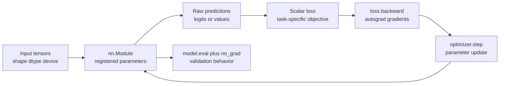
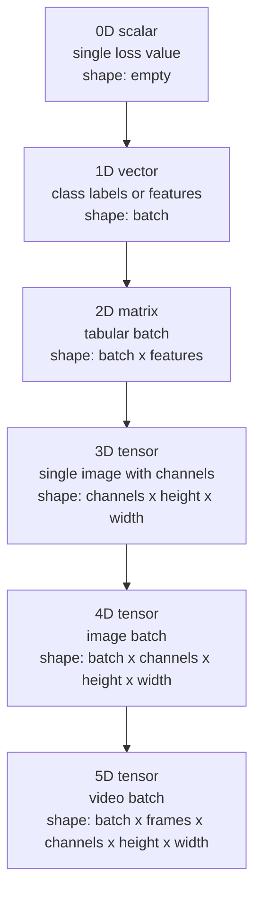
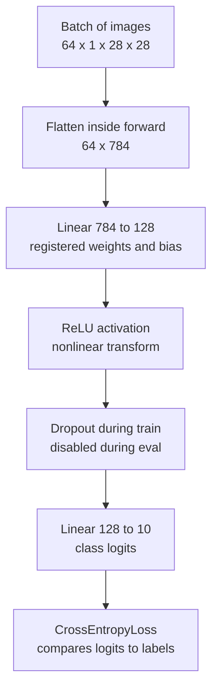
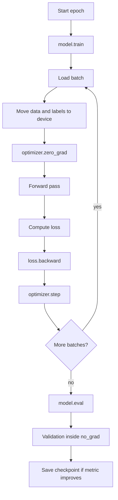
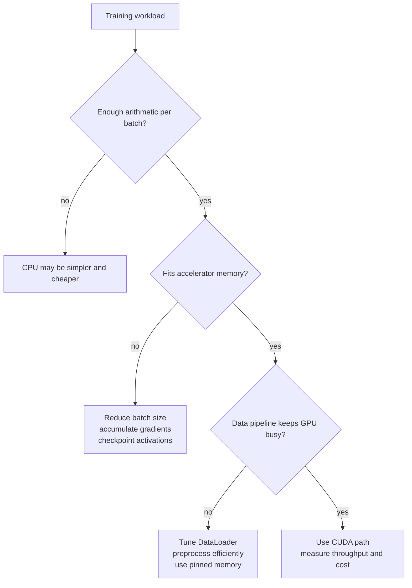
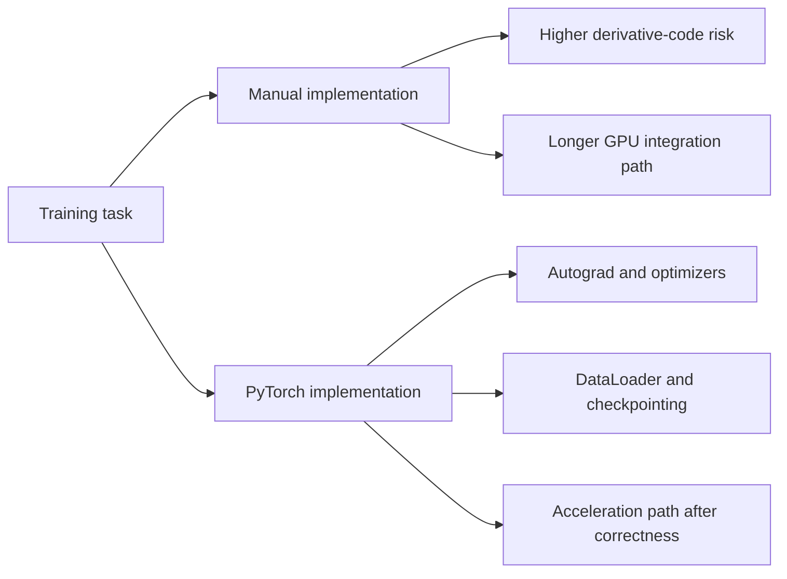

# Training Neural Networks

> **AI/ML Engineering Track** | Complexity: `[COMPLEX]` | Time: 6-8 hours
>
> **Prerequisites**: Python fundamentals, NumPy arrays, matrix multiplication, gradient descent, and the previous neural-network-from-scratch module.
>
> **Primary tools**: PyTorch, TorchVision, NumPy, local virtual environments, optional CUDA-capable GPU.

---

## Learning Outcomes

By the end of this module, you will be able to:

1. **Implement** PyTorch tensor, autograd, and `nn.Module` workflows that replace manual NumPy backpropagation without hiding the training mechanics.
2. **Debug** common training-loop failures, including stale gradients, wrong loss functions, unregistered layers, device mismatches, and evaluation-mode errors.
3. **Compare** CPU, GPU, mixed-precision, and compiled execution paths, then choose the path that fits a workload's memory, latency, and operational constraints.
4. **Evaluate** whether a model training script is production-ready by inspecting data loading, checkpointing, validation, logging, reproducibility, and failure detection.
5. **Design** a complete supervised training pipeline that includes data preparation, model definition, loss selection, optimizer setup, validation, checkpointing, and troubleshooting evidence.

---

## Why This Module Matters

At 03:12 on a Tuesday morning, a fraud-detection retraining job finishes successfully and ships a model whose predictions are almost random. The platform engineer on call sees no Kubernetes failures, no failed health checks, and no obvious Python exception. The training script printed reassuring loss values for hours, yet the model performs worse than yesterday's baseline because validation ran with dropout still enabled and gradients were silently accumulating across batches.

That engineer does not need a definition of a tensor in that moment; she needs a mental model sharp enough to ask the right questions under pressure. Did the optimizer see the parameters? Did the labels match the loss function? Did the model switch from training behavior to inference behavior before validation? Did logging keep full computational graphs alive until the GPU ran out of memory? Those questions separate a person who has merely run a tutorial from a practitioner who can operate machine-learning systems responsibly.

PyTorch makes deep learning accessible because it lets engineers write ordinary Python while it handles automatic differentiation, device movement, layer registration, and optimizer updates. The accessibility can be dangerous when the learner treats the framework as a black box. This module teaches PyTorch as a set of inspectable mechanisms, so each convenience maps back to a concrete training responsibility that can be verified, debugged, and improved.

The path through the module follows the way training systems actually fail. First you will map data into tensors with explicit shapes, dtypes, and devices. Then you will watch autograd build and clear computation graphs. After that you will construct registered modules, run complete training and evaluation loops, and add the operational controls that keep experiments reproducible and production jobs recoverable.

---

## Core Content

### 1. From Manual Backpropagation to PyTorch Training

The previous module asked you to build neural networks from lower-level pieces so that the chain rule, cached activations, and parameter updates were visible. That work matters because PyTorch does not remove those mechanics; it automates them behind a more reliable interface. When you call `loss.backward()`, PyTorch traverses a computation graph whose nodes correspond to the same intermediate values you cached manually.

A training framework earns trust only when you can connect its abstractions to the work being done. A tensor is not just an array; in PyTorch it can also carry device placement, dtype, gradient-tracking state, and a link to the operation that produced it. A model is not just a Python class; as an `nn.Module`, it registers parameters so optimizers can discover them, save them, move them, and update them.

The central training contract is compact: feed tensors into a registered model, compute a scalar loss, ask autograd for gradients, let an optimizer update registered parameters, and evaluate with behavior appropriate for inference. Most training bugs violate one part of that contract. The module therefore teaches PyTorch by repeatedly checking the contract rather than by listing API calls.



| Training responsibility | Manual NumPy version | PyTorch version | Practitioner check |
|---|---|---|---|
| Store data in arrays | `np.ndarray` with manually managed shapes | `torch.Tensor` with shape, dtype, device, and gradient flags | Print `shape`, `dtype`, `device`, and `requires_grad` before blaming the model |
| Track intermediate values | Custom caches inside forward functions | Dynamic computation graph built during tensor operations | Inspect whether tensors still have `grad_fn` when memory grows unexpectedly |
| Compute gradients | Hand-written derivatives and chain-rule loops | `loss.backward()` over the recorded graph | Verify gradients are finite and reset at the intended time |
| Update parameters | Manual subtraction using learning rate | `optimizer.step()` over registered parameters | Confirm `len(list(model.parameters()))` is not zero |
| Move to accelerator | Separate GPU library or custom kernels | `.to(device)` on tensors and modules | Keep model, input tensors, and labels on the same device |
| Save training state | Custom serialization of arrays and counters | `state_dict()` for model and optimizer | Save both model and optimizer when resuming training |

A PyTorch tensor can represent a scalar loss, a vector of class labels, a matrix of tabular features, a batch of images, or a sequence of token embeddings. The framework does not know the business meaning of those values. It only knows dimensions, numeric types, storage location, and the graph of operations that transform one tensor into another.



| Tensor rank | Common name | Example training object | Typical shape | Failure to watch for |
|---|---|---|---|---|
| 0 | Scalar | Loss value after reduction | `[]` | Calling `backward()` on a non-scalar without supplying a gradient |
| 1 | Vector | Class labels for a batch | `[batch]` | Passing one-hot labels to `CrossEntropyLoss` when it expects class indices |
| 2 | Matrix | Tabular features or flattened images | `[batch, features]` | Accidentally transposing batch and feature dimensions |
| 3 | Tensor | One color image | `[channels, height, width]` | Mixing channel-first PyTorch format with channel-last image libraries |
| 4 | Batch tensor | Batch of color images | `[batch, channels, height, width]` | Forgetting to flatten before a fully connected network |
| 5 | Sequence batch | Batch of short video clips | `[batch, frames, channels, height, width]` | Applying image-only layers without deciding how time should be handled |

The first debugging habit is to print tensor metadata before reading stack traces too deeply. Shape errors often look mysterious because the failing operation reports only the immediate mismatch, not the upstream decision that created it. When the network expects `[batch, 784]` and receives `[batch, 1, 28, 28]`, the fix is not inside the optimizer; it belongs at the boundary between the data loader and the model.

```python
import torch

images = torch.randn(64, 1, 28, 28)
labels = torch.randint(0, 10, (64,))

print("images:", images.shape, images.dtype, images.device, images.requires_grad)
print("labels:", labels.shape, labels.dtype, labels.device, labels.requires_grad)

flattened = images.view(images.size(0), -1)
print("flattened:", flattened.shape)
```

Active learning prompt: before running the snippet above, predict the shape of `flattened` and identify which dimension represents the batch. If your answer does not preserve the batch dimension, the model may still run for a single example but fail when real batches arrive.

PyTorch and NumPy can share memory when tensors are created with `torch.from_numpy`. That sharing is efficient, but it can surprise you when preprocessing code mutates the original array after creating the tensor. In training code, accidental mutation is especially costly because a model may appear nondeterministic even though the randomness comes from shared storage.

```python
import numpy as np
import torch

array = np.array([1.0, 2.0, 3.0], dtype=np.float32)
tensor = torch.from_numpy(array)

array[0] = 99.0
print(tensor)

safe_copy = torch.tensor(array)
array[1] = -5.0
print("shared:", tensor)
print("copied:", safe_copy)
```

Dtype choices also shape the training result. Floating-point tensors are used for model inputs, activations, weights, and losses because gradients require continuous values. Integer tensors are used for indices and class labels because classification losses such as `CrossEntropyLoss` expect each target to name a class, not a floating-point score.

| Dtype | Typical use | Why it matters | Common mistake |
|---|---|---|---|
| `torch.float32` | Default model weights, activations, and losses | Good balance of precision and hardware support | Converting labels to float for a classification loss that expects integer indices |
| `torch.float16` | Mixed-precision training on compatible GPUs | Lower memory use and faster tensor cores when used carefully | Running unstable operations in half precision without automatic scaling |
| `torch.bfloat16` | Mixed precision on supported accelerators | Wider exponent range than float16 can reduce overflow risk | Assuming every GPU supports it equally well |
| `torch.long` | Class labels and embedding indices | Many PyTorch indexing operations require 64-bit integer labels | One-hot encoding labels before passing them to `CrossEntropyLoss` |
| `torch.uint8` | Raw image bytes before conversion | Efficient storage for images in the range 0 to 255 | Training directly on byte images without converting and normalizing |

The second debugging habit is to treat device placement as part of the tensor's type. A CPU tensor and a CUDA tensor are not interchangeable, even if their shapes match. PyTorch will not secretly copy data across the PCIe bus inside a model call because that would hide expensive operations and create unpredictable performance.

```python
import torch

device = torch.device("cuda" if torch.cuda.is_available() else "cpu")

features = torch.randn(32, 128, device=device)
weights = torch.randn(128, 10, device=device)
logits = features @ weights

print(logits.shape, logits.device)
```

When you create new tensors inside `forward`, use the incoming tensor's device or a registered buffer instead of assuming CPU. This matters in production because a script that works on a laptop can crash immediately when the same model moves to GPU. The pattern `torch.zeros_like(x)` is often safer than `torch.zeros(...)` because it inherits shape, dtype, and device from the tensor already flowing through the model.

```python
import torch

x = torch.randn(8, 16)
mask = torch.zeros_like(x)
print(mask.shape, mask.dtype, mask.device)
```

### 2. Autograd: Turning Computation into Gradients

Autograd is PyTorch's automatic differentiation system, and its core idea is simple enough to test with small tensors. When a tensor has `requires_grad=True`, PyTorch records operations that produce new tensors from it. When you call `backward()` on a scalar result, PyTorch walks that graph backward and accumulates partial derivatives into each leaf tensor's `.grad` field.

```ascii
+-------------------+       +-------------------+       +-------------------+
| x requires_grad   | ----> | y = x * x         | ----> | loss = y.sum()    |
| leaf tensor       |       | recorded op       |       | scalar output     |
+-------------------+       +-------------------+       +-------------------+
          ^                                                       |
          |                                                       |
          +---------------- gradients via backward ---------------+
```

The word "accumulates" is the detail that turns into real incidents. PyTorch adds new gradients to existing `.grad` values because some advanced training strategies intentionally combine gradients across multiple micro-batches. In ordinary training loops, you must clear old gradients before computing new ones, or each update is based on the current batch plus leftover information from previous batches.

```python
import torch

x = torch.tensor([2.0], requires_grad=True)

y = x * 3
y.backward()
print("after first backward:", x.grad.item())

y = x * 5
y.backward()
print("after second backward:", x.grad.item())

x.grad.zero_()
y = x * 7
y.backward()
print("after reset:", x.grad.item())
```

Worked example: suppose a model starts with stable loss and then produces `NaN` after several hundred batches. A rushed engineer might blame the dataset or the learning rate. A more reliable investigation first checks whether the training loop calls `optimizer.zero_grad()` before `loss.backward()`, because missing that line causes gradient values to combine across all previous batches.

```python
import torch
import torch.nn as nn
import torch.optim as optim

model = nn.Linear(4, 2)
criterion = nn.CrossEntropyLoss()
optimizer = optim.SGD(model.parameters(), lr=0.1)

x = torch.randn(16, 4)
y = torch.randint(0, 2, (16,))

for step in range(3):
    optimizer.zero_grad()
    logits = model(x)
    loss = criterion(logits, y)
    loss.backward()

    total_grad_norm = 0.0
    for parameter in model.parameters():
        total_grad_norm += parameter.grad.detach().norm().item()

    optimizer.step()
    print(f"step={step} loss={loss.item():.4f} grad_norm={total_grad_norm:.4f}")
```

This worked example demonstrates the healthy sequence: zero stale gradients, run the forward pass, compute a scalar loss, backpropagate, inspect gradients if needed, and only then update parameters. If the gradient norm is infinite, `NaN`, or wildly larger than expected, you have evidence before the optimizer changes the weights. That evidence is more useful than a final failed accuracy number because it points to the exact phase where training broke.

Active learning prompt: remove `optimizer.zero_grad()` in a temporary copy of the script and predict what will happen to the printed gradient norm over repeated steps. Do not focus only on whether the script crashes; focus on whether the update represents one batch or a hidden mixture of many batches.

Autograd records graphs dynamically, which means Python control flow works naturally. An `if` branch, a loop, or a conditional model path can produce a different graph on each forward pass. That flexibility made PyTorch popular for research, but it also means the graph lives only as long as the tensors that reference it.

```python
import torch

def piecewise_loss(x):
    if x.mean().item() > 0:
        return (x ** 2).mean()
    return (x.abs()).mean()

x = torch.randn(10, requires_grad=True)
loss = piecewise_loss(x)
loss.backward()

print("loss:", loss.item())
print("gradient available:", x.grad is not None)
```

Detaching is how you intentionally stop a value from participating in gradient computation. Metrics, logs, visualizations, and cached predictions usually should not preserve the graph. If you append a loss tensor to a Python list every batch, you keep the graph alive and memory grows with training history; if you append `loss.item()`, you keep only a plain Python number.

```python
import torch

loss_history = []

x = torch.randn(4, requires_grad=True)
loss = (x ** 2).mean()

loss_history.append(loss.item())
metric_tensor = loss.detach()

print(type(loss_history[0]))
print(metric_tensor.requires_grad)
```

`torch.no_grad()` is the larger boundary you use around inference or validation. It tells PyTorch not to build graphs for the operations inside the block, saving memory and compute. It does not change dropout or batch normalization behavior; that is the job of `model.eval()`, which you will use with `no_grad()` during validation.

```python
import torch
import torch.nn as nn

model = nn.Sequential(nn.Linear(4, 8), nn.ReLU(), nn.Linear(8, 2))
x = torch.randn(5, 4)

model.eval()
with torch.no_grad():
    logits = model(x)
    predictions = logits.argmax(dim=1)

print(predictions)
```

| Situation | Use gradient tracking? | Use `model.train()`? | Use `model.eval()`? | Reason |
|---|---|---|---|---|
| Training a batch | Yes | Yes | No | Need gradients and training behavior for dropout or batch normalization |
| Validating accuracy | No | No | Yes | Need deterministic inference behavior without graph allocation |
| Logging scalar loss | No after extraction | Usually still training | No | Store `loss.item()` rather than the graph-backed tensor |
| Freezing a pretrained encoder | Usually no for frozen part | Depends on full model | Depends on phase | Prevent unnecessary gradients through frozen parameters |
| Computing adversarial examples | Yes for inputs | Often eval | Often yes | Need input gradients while keeping inference behavior stable |
| Exporting predictions | No | No | Yes | Production inference should be deterministic and memory efficient |

### 3. Building Models with `nn.Module`

`nn.Module` is the foundation for trainable PyTorch models because it provides registration. Registration means PyTorch knows which tensors are parameters, which nested modules belong to the model, which buffers should move with the model, and which values belong in a checkpoint. A model that computes correct numbers but fails to register parameters will not train because the optimizer has nothing to update.

```python
import torch
import torch.nn as nn

class DigitClassifier(nn.Module):
    def __init__(self, input_features=784, hidden_features=128, classes=10):
        super().__init__()
        self.fc1 = nn.Linear(input_features, hidden_features)
        self.activation = nn.ReLU()
        self.dropout = nn.Dropout(p=0.2)
        self.fc2 = nn.Linear(hidden_features, classes)

    def forward(self, x):
        x = x.view(x.size(0), -1)
        x = self.fc1(x)
        x = self.activation(x)
        x = self.dropout(x)
        x = self.fc2(x)
        return x

model = DigitClassifier()
print(model)
print("parameter tensors:", len(list(model.parameters())))
```

The `super().__init__()` line initializes the machinery that makes registration work. Assigning `self.fc1 = nn.Linear(...)` after that call registers `fc1` as a submodule. If you omit the parent initializer or hide layers inside a plain Python list, the model may still run a forward pass, but optimizer construction can fail or silently exclude layers.

```python
import torch.nn as nn

class RegisteredStack(nn.Module):
    def __init__(self, width=32, depth=3):
        super().__init__()
        self.layers = nn.ModuleList(
            [nn.Linear(width, width) for _ in range(depth)]
        )

    def forward(self, x):
        for layer in self.layers:
            x = layer(x).relu()
        return x
```

A `ModuleList` is not a stylistic preference; it is the difference between trainable layers and ordinary Python objects. PyTorch recursively searches registered modules when you call `model.parameters()`, `model.to(device)`, `model.state_dict()`, and `model.eval()`. Layers in a regular list are invisible to those recursive operations.

| Container pattern | Registered as trainable? | Moves with `.to(device)`? | Saved in `state_dict()`? | Appropriate use |
|---|---|---|---|---|
| `self.layer = nn.Linear(...)` | Yes | Yes | Yes | Fixed layer known during initialization |
| `self.layers = nn.ModuleList([...])` | Yes | Yes | Yes | Dynamic number of layers iterated in `forward` |
| `self.blocks = nn.ModuleDict({...})` | Yes | Yes | Yes | Named dynamic branches or configurable stacks |
| `self.layers = [nn.Linear(...)]` | No | No | No | Avoid for trainable modules |
| `self.scale = nn.Parameter(...)` | Yes | Yes | Yes | Custom trainable tensor not wrapped by a layer |
| `self.register_buffer("mean", tensor)` | No optimizer update | Yes | Yes | Non-trainable state such as normalization statistics |

Model output should match the loss function's expectations. For multi-class classification, `nn.CrossEntropyLoss` expects raw logits with shape `[batch, classes]` and labels with shape `[batch]` containing integer class indices. It applies log-softmax internally, so adding a final softmax layer before the loss weakens numerical stability and changes the gradient path.

```python
import torch
import torch.nn as nn

logits = torch.randn(32, 10)
labels = torch.randint(0, 10, (32,))

criterion = nn.CrossEntropyLoss()
loss = criterion(logits, labels)

print(loss.item())
```

For regression, the model usually outputs continuous values and the target tensor has a compatible floating-point shape. The loss function encodes what "wrong" means: squared error heavily penalizes large deviations, while absolute error is more robust to outliers. The right choice depends on the business cost of different errors, not on which loss appears first in a tutorial.

| Task type | Model output | Target format | Common loss | Decision cue |
|---|---|---|---|---|
| Multi-class classification | Raw logits `[batch, classes]` | Integer labels `[batch]` | `nn.CrossEntropyLoss` | Exactly one class is correct for each example |
| Binary classification with one output | Logit `[batch, 1]` or `[batch]` | Float labels with zeros and ones | `nn.BCEWithLogitsLoss` | Each example has a yes-or-no target |
| Multi-label classification | Logits `[batch, labels]` | Float matrix of zeros and ones | `nn.BCEWithLogitsLoss` | Several labels may be true at once |
| Regression | Continuous values | Continuous target values | `nn.MSELoss` or `nn.L1Loss` | Distance between numeric values matters |
| Ranking or metric learning | Embeddings or scores | Pairwise or triplet structure | Margin or contrastive loss | Relative ordering matters more than absolute class |

Active learning prompt: a teammate builds a two-class classifier with `nn.MSELoss` because there are only two classes. Predict two symptoms you might observe during training, then identify which target format and loss function would better match the task.

Model inspection is not optional in professional work. Before running a long job, print the architecture, count parameters, and confirm that every expected layer appears in the parameter list. This catches missing `super().__init__()`, plain-list layers, and mismatched dimensions before expensive GPU time is wasted.

```python
import torch
import torch.nn as nn

model = DigitClassifier()
total_parameters = sum(parameter.numel() for parameter in model.parameters())

for name, parameter in model.named_parameters():
    print(f"{name}: shape={tuple(parameter.shape)} trainable={parameter.requires_grad}")

print(f"total parameters: {total_parameters}")
```



`nn.Sequential` is useful when a model is a straight pipeline with no branching, reused outputs, or conditional logic. A custom class is better when you need named intermediate values, skip connections, multiple inputs, multiple outputs, or richer validation in `forward`. Senior engineers tend to choose the simplest structure that still makes debugging clear.

```python
import torch.nn as nn

prototype = nn.Sequential(
    nn.Flatten(),
    nn.Linear(784, 128),
    nn.ReLU(),
    nn.Dropout(0.2),
    nn.Linear(128, 10),
)
```

### 4. Training, Validation, and Checkpointing Loops

A training loop is a control system that repeatedly measures error and changes parameters. The five core steps are stable across many architectures: clear gradients, run the model, compute loss, backpropagate, and update. The surrounding details decide whether the loop is trustworthy: data shuffling, device movement, validation mode, checkpointing, metric logging, and failure checks.



The following script is intentionally small but complete enough to run when PyTorch and TorchVision are installed. It uses MNIST because the dataset is familiar, downloads automatically, and trains quickly on CPU. The goal is not to chase leaderboard accuracy; the goal is to practice a loop whose mechanics can be transferred to larger projects.

```python
import random
from pathlib import Path

import numpy as np
import torch
import torch.nn as nn
import torch.optim as optim
from torch.utils.data import DataLoader
from torchvision import datasets, transforms


class DigitClassifier(nn.Module):
    def __init__(self):
        super().__init__()
        self.network = nn.Sequential(
            nn.Flatten(),
            nn.Linear(784, 128),
            nn.ReLU(),
            nn.Dropout(0.2),
            nn.Linear(128, 10),
        )

    def forward(self, x):
        return self.network(x)


def set_seed(seed=13):
    random.seed(seed)
    np.random.seed(seed)
    torch.manual_seed(seed)
    if torch.cuda.is_available():
        torch.cuda.manual_seed_all(seed)


def accuracy_from_logits(logits, labels):
    predictions = logits.argmax(dim=1)
    return (predictions == labels).float().mean().item()


def main():
    set_seed()
    device = torch.device("cuda" if torch.cuda.is_available() else "cpu")
    data_dir = Path("data")

    transform = transforms.Compose(
        [
            transforms.ToTensor(),
            transforms.Normalize((0.1307,), (0.3081,)),
        ]
    )

    train_data = datasets.MNIST(data_dir, train=True, download=True, transform=transform)
    test_data = datasets.MNIST(data_dir, train=False, download=True, transform=transform)

    train_loader = DataLoader(train_data, batch_size=128, shuffle=True)
    test_loader = DataLoader(test_data, batch_size=512)

    model = DigitClassifier().to(device)
    criterion = nn.CrossEntropyLoss()
    optimizer = optim.Adam(model.parameters(), lr=0.001)

    best_accuracy = 0.0
    checkpoint_path = Path("mnist-checkpoint.pt")

    for epoch in range(3):
        model.train()
        running_loss = 0.0

        for batch_index, (features, labels) in enumerate(train_loader):
            features = features.to(device)
            labels = labels.to(device)

            optimizer.zero_grad()
            logits = model(features)
            loss = criterion(logits, labels)

            if not torch.isfinite(loss):
                raise RuntimeError(f"non-finite loss at epoch {epoch}, batch {batch_index}")

            loss.backward()
            optimizer.step()

            running_loss += loss.item()

        model.eval()
        correct = 0
        total = 0

        with torch.no_grad():
            for features, labels in test_loader:
                features = features.to(device)
                labels = labels.to(device)

                logits = model(features)
                predictions = logits.argmax(dim=1)
                correct += (predictions == labels).sum().item()
                total += labels.numel()

        validation_accuracy = correct / total
        average_loss = running_loss / len(train_loader)

        print(
            f"epoch={epoch} "
            f"train_loss={average_loss:.4f} "
            f"validation_accuracy={validation_accuracy:.4f}"
        )

        if validation_accuracy > best_accuracy:
            best_accuracy = validation_accuracy
            torch.save(
                {
                    "epoch": epoch,
                    "model_state_dict": model.state_dict(),
                    "optimizer_state_dict": optimizer.state_dict(),
                    "validation_accuracy": validation_accuracy,
                },
                checkpoint_path,
            )

    print(f"best validation accuracy: {best_accuracy:.4f}")


if __name__ == "__main__":
    main()
```

Each line in the loop has a reason. `model.train()` enables training-time behavior for dropout and batch normalization. `optimizer.zero_grad()` clears stale gradient buffers. `loss.backward()` fills those buffers with derivatives for the current batch. `optimizer.step()` changes the parameters, and validation happens under `model.eval()` plus `torch.no_grad()` so the reported metric reflects inference behavior.

The order is not ceremonial. If you call `optimizer.step()` before `loss.backward()`, the optimizer updates using stale or missing gradients. If you forget `model.eval()`, dropout may randomly disable activations during validation. If you forget `torch.no_grad()`, validation may allocate graphs that are never needed, increasing memory use and slowing the job.

```mermaid
sequenceDiagram
    participant Loader as DataLoader
    participant Model as nn.Module
    participant Loss as Loss function
    participant Auto as Autograd
    participant Opt as Optimizer
    Loader->>Model: batch tensors on selected device
    Model->>Loss: logits or predictions
    Loss->>Auto: scalar loss with graph
    Auto->>Model: gradients stored on parameters
    Opt->>Model: update registered parameters
    Model->>Loader: next batch repeats the control loop
```

Data loading is part of training quality because slow or inconsistent input pipelines create misleading experiments. Shuffling training data reduces order effects, batching trades statistical noise against hardware efficiency, and parallel workers can hide preprocessing latency. Validation data is usually not shuffled because reproducible metric computation matters more than stochastic order.

| DataLoader setting | Training effect | Risk when misused | Practical starting point |
|---|---|---|---|
| `batch_size` | Controls examples per optimization step | Too large may exceed memory, too small may produce noisy updates | Start with a size that fits comfortably, then measure throughput |
| `shuffle=True` | Randomizes training order each epoch | Forgetting it can overfit sequence artifacts in ordered datasets | Use for training unless order is meaningful |
| `shuffle=False` | Keeps validation order stable | Using it for training may hide data-order bias | Use for validation and test loaders |
| `num_workers` | Loads samples in parallel subprocesses | Too many workers can add overhead or file contention | Start with zero for debugging, then increase while measuring |
| `pin_memory=True` | Speeds CPU-to-GPU transfer on CUDA systems | Adds little value on CPU-only runs | Enable for CUDA training after correctness is proven |
| Custom dataset | Loads samples lazily from files or services | Bugs in `__getitem__` can corrupt labels silently | Add small sample visualizations or assertions |

Optimizers encode assumptions about the loss landscape. Stochastic gradient descent is simple and can generalize well when tuned, but it usually requires more learning-rate care. Adam adapts per-parameter update sizes and often works well early in experimentation. AdamW decouples weight decay from Adam's adaptive update and is a common choice for transformer-style architectures.

| Optimizer | Strength | Trade-off | Good use case |
|---|---|---|---|
| `SGD` | Simple, inspectable, strong baseline when tuned | Sensitive to learning rate and schedule | Vision models, controlled experiments, teaching gradient behavior |
| `SGD` with momentum | Smooths noisy gradients | Momentum can overshoot when learning rate is high | Larger batches or losses with noisy local directions |
| `Adam` | Adapts update size per parameter | Can hide poor scaling or overfit without regularization | Fast prototypes and many tabular or smaller neural networks |
| `AdamW` | Handles decoupled weight decay cleanly | Still needs learning-rate and decay tuning | Transformers and models where weight decay matters |
| Learning-rate scheduler | Changes step size over time | Misconfigured schedules can stop learning too early | Longer runs where early exploration and late refinement differ |
| Gradient clipping | Limits extreme gradient norms | Can mask upstream instability if used blindly | Recurrent models, transformers, or jobs with occasional spikes |

Checkpointing should save enough state to resume training, not just enough state to run inference. Model weights are sufficient for deployment, but optimizer state contains momentum and adaptive statistics that affect future updates. If a long training job crashes and resumes with a fresh optimizer, the loss curve may jump even though the model weights loaded correctly.

```python
import torch

def save_checkpoint(path, epoch, model, optimizer, validation_accuracy):
    torch.save(
        {
            "epoch": epoch,
            "model_state_dict": model.state_dict(),
            "optimizer_state_dict": optimizer.state_dict(),
            "validation_accuracy": validation_accuracy,
        },
        path,
    )


def load_checkpoint(path, model, optimizer, device):
    checkpoint = torch.load(path, map_location=device)
    model.load_state_dict(checkpoint["model_state_dict"])
    optimizer.load_state_dict(checkpoint["optimizer_state_dict"])
    return checkpoint["epoch"], checkpoint["validation_accuracy"]
```

For inference-only loading, create the architecture, load the model state dict, switch to evaluation mode, and run under `torch.no_grad()`. Avoid loading untrusted pickle-based model files because generic `torch.load` can deserialize Python objects. When publishing models across trust boundaries, prefer safer formats and documented model cards where the serving team can reproduce preprocessing and expected inputs.

```python
import torch

device = torch.device("cuda" if torch.cuda.is_available() else "cpu")
model = DigitClassifier().to(device)

checkpoint = torch.load("mnist-checkpoint.pt", map_location=device)
model.load_state_dict(checkpoint["model_state_dict"])
model.eval()

with torch.no_grad():
    sample = torch.randn(1, 1, 28, 28, device=device)
    logits = model(sample)
    prediction = logits.argmax(dim=1).item()

print(prediction)
```

### 5. Acceleration, Operations, and Senior-Level Debugging

GPU acceleration changes the economics of training, but it does not change the training contract. The model, input tensors, labels, and any new tensors created during the forward pass must live on compatible devices. A script that moves only the model to CUDA is broken; a script that moves data every batch but creates CPU masks inside `forward` is also broken.

```python
import time
import torch


def benchmark_matrix_multiply(device, size=2048, iterations=20):
    x = torch.randn(size, size, device=device)
    y = torch.randn(size, size, device=device)

    for _ in range(3):
        _ = x @ y

    if device.type == "cuda":
        torch.cuda.synchronize()

    start = time.perf_counter()

    for _ in range(iterations):
        _ = x @ y

    if device.type == "cuda":
        torch.cuda.synchronize()

    return (time.perf_counter() - start) / iterations


cpu_time = benchmark_matrix_multiply(torch.device("cpu"), size=1024, iterations=5)
print(f"cpu_seconds_per_iteration={cpu_time:.6f}")

if torch.cuda.is_available():
    gpu_time = benchmark_matrix_multiply(torch.device("cuda"), size=1024, iterations=5)
    print(f"gpu_seconds_per_iteration={gpu_time:.6f}")
    print(f"speedup={cpu_time / gpu_time:.2f}")
else:
    print("cuda_available=false")
```

Small workloads may not benefit from a GPU because transfer overhead, kernel launch overhead, and underutilization can dominate. Large matrix multiplications and convolution-heavy models often benefit substantially because the GPU keeps many parallel arithmetic units busy. The senior-level decision is therefore not "GPU is faster"; it is "this workload is large enough, batched enough, and memory-efficient enough to justify GPU scheduling."



| Execution path | Best fit | Watch for | Senior decision question |
|---|---|---|---|
| CPU training | Small models, debugging, CI smoke tests | Slow epochs on large tensor workloads | Is correctness still being established? |
| Single GPU | Most local deep-learning experiments | Device mismatches and memory pressure | Is the batch large enough to use the device efficiently? |
| Mixed precision | Large models on compatible accelerators | Overflow, underflow, and unsupported operations | Does automatic scaling preserve metrics while improving throughput? |
| `torch.compile` | Stable models with repeated execution paths | Compile overhead and graph breaks | Is the model mature enough to optimize after debugging? |
| Gradient accumulation | Effective large batch without fitting it at once | Forgetting when to call `optimizer.step()` | Does the accumulated gradient match the intended batch size? |
| Distributed training | Large datasets or models across devices | Synchronization, reproducibility, and operational complexity | Has single-device training already been made correct and measurable? |

Mixed precision can reduce memory use and improve throughput on modern accelerators by using lower precision where it is safe. The safe part matters. PyTorch's automatic mixed precision chooses appropriate operations and gradient scaling helps avoid underflow, but the engineer still must compare validation metrics and inspect instability rather than assuming faster means equivalent.

```python
import torch
import torch.nn as nn
import torch.optim as optim

device = torch.device("cuda" if torch.cuda.is_available() else "cpu")
model = nn.Sequential(nn.Linear(128, 256), nn.ReLU(), nn.Linear(256, 10)).to(device)
criterion = nn.CrossEntropyLoss()
optimizer = optim.AdamW(model.parameters(), lr=0.001)

features = torch.randn(64, 128, device=device)
labels = torch.randint(0, 10, (64,), device=device)

if device.type == "cuda":
    scaler = torch.cuda.amp.GradScaler()
    optimizer.zero_grad()

    with torch.cuda.amp.autocast():
        logits = model(features)
        loss = criterion(logits, labels)

    scaler.scale(loss).backward()
    scaler.step(optimizer)
    scaler.update()
else:
    optimizer.zero_grad()
    logits = model(features)
    loss = criterion(logits, labels)
    loss.backward()
    optimizer.step()

print(loss.item())
```

`torch.compile` is an optimization step, not a substitute for a correct model. Compile after the eager-mode model trains, validates, checkpoints, and debugs correctly. This order preserves PyTorch's developer-experience advantage: ordinary Python while you are learning and diagnosing, compilation only when the execution path is stable enough to optimize.

```python
import torch
import torch.nn as nn

model = nn.Sequential(nn.Linear(32, 64), nn.ReLU(), nn.Linear(64, 2))

if hasattr(torch, "compile"):
    model = torch.compile(model)

x = torch.randn(8, 32)
print(model(x).shape)
```

Production training also needs failure detection. A training script should fail fast when loss becomes non-finite, labels fall outside the expected class range, the optimizer has no parameters, a checkpoint cannot be written, or validation accuracy collapses relative to a baseline. These checks turn silent corruption into actionable errors.

```python
import math
import torch

def assert_training_batch(features, labels, num_classes):
    if not torch.isfinite(features).all():
        raise ValueError("features contain non-finite values")

    if labels.dtype != torch.long:
        raise TypeError(f"labels must be torch.long, received {labels.dtype}")

    if labels.min().item() < 0 or labels.max().item() >= num_classes:
        raise ValueError("labels contain a class index outside the expected range")


def assert_loss_is_healthy(loss):
    value = loss.item()
    if not math.isfinite(value):
        raise RuntimeError(f"loss is non-finite: {value}")
```

A senior debugging workflow narrows the problem by proving simpler claims before investigating complex ones. Can the model overfit one batch? Do gradients exist for every trainable layer? Does validation produce identical predictions twice in a row under `model.eval()` and `torch.no_grad()`? Does a checkpoint restore identical output for the same input? Each question isolates a layer of the training system.

| Debugging probe | What it tests | Healthy signal | Likely issue when it fails |
|---|---|---|---|
| Overfit one small batch | Model capacity and training loop mechanics | Loss falls close to zero on the same batch | Wrong loss, missing gradients, bad labels, or no optimizer updates |
| Print gradient norms | Gradient flow through layers | Non-zero finite gradients where expected | Dead activations, detached tensors, or unregistered parameters |
| Count optimizer parameters | Registration and optimizer setup | Expected number of tensors in parameter groups | Plain Python lists, missing `super().__init__()`, or frozen parameters |
| Run validation twice | Deterministic inference behavior | Same predictions for same inputs | Missing `model.eval()` or hidden randomness |
| Save and reload checkpoint | Serialization and architecture match | Same output after reload for same input | Missing state, wrong architecture, or device loading error |
| Compare CPU and GPU tiny run | Device-independent correctness | Similar losses within expected numerical tolerance | Device-specific tensor creation or precision assumptions |

The "overfit one batch" test deserves special attention because it is the fastest way to separate data-scale problems from loop correctness problems. If a model cannot memorize a tiny fixed batch, adding more data will not fix it. The bug is usually in architecture wiring, loss-target mismatch, optimizer configuration, gradient flow, or preprocessing.

```python
import torch
import torch.nn as nn
import torch.optim as optim

model = nn.Sequential(nn.Linear(4, 16), nn.ReLU(), nn.Linear(16, 3))
criterion = nn.CrossEntropyLoss()
optimizer = optim.Adam(model.parameters(), lr=0.05)

features = torch.randn(12, 4)
labels = torch.randint(0, 3, (12,))

for step in range(200):
    optimizer.zero_grad()
    logits = model(features)
    loss = criterion(logits, labels)
    loss.backward()
    optimizer.step()

print(f"final_loss={loss.item():.6f}")
```

The economics of PyTorch are not only about faster syntax. Framework primitives reduce engineering time, but acceleration can increase infrastructure spend if jobs are poorly batched, frequently restarted, or run without checkpointing. A cheaper GPU hour can be more expensive than a CPU run if half the time is spent waiting for the data loader or repeating failed epochs.



| Cost driver | How PyTorch helps | Remaining engineering responsibility | Operational metric |
|---|---|---|---|
| Development time | Provides layers, autograd, losses, optimizers, and loaders | Choose correct abstractions and verify assumptions | Time from baseline idea to validated run |
| Compute time | Enables GPU, mixed precision, and compilation | Measure utilization and avoid unnecessary graph allocation | Examples per second and cost per epoch |
| Failure recovery | Supports checkpointing with state dicts | Save complete state and test restore paths | Lost work after interruption |
| Debugging time | Exposes tensor metadata and gradients | Add assertions, probes, and reproducible seeds | Time to isolate a broken training phase |
| Deployment risk | Provides eval mode, export paths, and ecosystem tools | Match preprocessing, trust model files, and validate outputs | Difference between validation and serving behavior |
| Team learning | Uses readable Python and rich ecosystem examples | Teach mechanisms rather than copy patterns blindly | Review quality of training-code changes |

Framework comparisons are useful when they focus on trade-offs rather than identity. PyTorch is a practical default for many teams because it combines readable eager execution with a broad ecosystem. TensorFlow remains important in many production and legacy environments. JAX is attractive for functional transformations, accelerator-oriented research, and workflows where compilation and transformation discipline are central.

| Framework | Strength | Trade-off | Practical selection cue |
|---|---|---|---|
| PyTorch | Pythonic eager execution, broad research and application ecosystem | Production path still requires discipline around export, serving, and reproducibility | Choose when team productivity and debuggability are primary |
| TensorFlow | Mature serving ecosystem and legacy production footprint | Older static-graph patterns can be harder for beginners to debug | Choose when existing platform investment already centers on it |
| JAX | Powerful functional transformations and strong accelerator workflows | Steeper learning curve and different programming model | Choose when function transforms, compilation, or TPU-oriented work dominate |
| Manual NumPy | Maximum educational transparency | Impractical for complex models and accelerators | Use for learning internals, not routine production training |
| Higher-level wrappers | Less boilerplate for common training patterns | Can hide mechanics when learners are still building mental models | Add after the team can debug plain PyTorch loops |

The final mental model is a layered one. Tensors describe numeric data and execution placement. Autograd records differentiable computation. Modules register parameters and organize forward logic. Losses turn predictions into scalar training signals. Optimizers mutate parameters using gradients. Operational controls make the loop repeatable, measurable, recoverable, and safe.

---

## Did You Know?

1. **Reverse-mode automatic differentiation predates modern deep learning**: PyTorch's autograd uses ideas that were developed decades before today's large neural networks, and the reason it fits neural networks so well is that training usually has many parameters but one scalar loss.

2. **Gradient accumulation is intentional behavior**: PyTorch adds gradients into `.grad` buffers instead of replacing them because accumulation supports larger effective batches, multi-loss training, and advanced optimization patterns.

3. **`CrossEntropyLoss` expects raw logits**: The loss combines log-softmax with negative log likelihood internally, so adding softmax before it can reduce numerical stability and distort the gradient signal.

4. **Pickle-based model loading is a trust boundary**: Generic PyTorch checkpoint loading can deserialize Python objects, so production teams should treat untrusted model files as executable input and prefer safer distribution formats when appropriate.

---

## Common Mistakes

| Mistake | Scenario symptom | Root cause | Corrective action |
|---|---|---|---|
| Forgetting `optimizer.zero_grad()` | Loss starts plausible, then gradients grow until updates become unstable or non-finite | PyTorch accumulates gradients across backward calls by default | Clear gradients before each normal training step unless intentional accumulation is documented |
| Calling softmax before `CrossEntropyLoss` | Classification training improves slowly or becomes numerically fragile | The loss already applies the stable log-softmax calculation internally | Return raw logits from the model and pass integer class labels directly |
| Using a plain Python list for layers | `model.parameters()` is empty or missing expected tensors | `nn.Module` cannot register modules hidden in ordinary lists | Use `nn.ModuleList`, `nn.ModuleDict`, or direct module attributes |
| Leaving validation in training mode | Validation metrics fluctuate on identical data, especially with dropout | Dropout and batch normalization keep training-time behavior active | Call `model.eval()` before validation and return to `model.train()` before training |
| Building validation graphs | GPU memory grows during evaluation even though no learning happens | Inference loop runs without `torch.no_grad()` | Wrap validation and inference operations inside `with torch.no_grad():` |
| Mixing CPU and GPU tensors | Runtime error reports tensors on different devices | Model, labels, inputs, or newly created tensors live on incompatible devices | Create a `device` variable and move every batch plus the model consistently |
| Logging full tensors | Memory grows with the number of batches or logged metrics | Stored tensors keep references to computation graphs | Log `loss.item()` or `tensor.detach().cpu()` depending on the metric need |
| Saving only model weights for resumable jobs | Training resumes but loss curve jumps or behaves differently | Optimizer momentum and adaptive state were discarded | Save model state, optimizer state, epoch, metric history, and configuration together |

---

## Quiz

1. Your team trains a small image classifier and the training loss decreases, but validation accuracy changes every time you run validation on the same saved checkpoint and same validation set. The model contains dropout. What should you inspect first, and why?

   <details>
   <summary>Answer</summary>

   Inspect whether the validation loop calls `model.eval()` before inference and uses `torch.no_grad()` around the loop. Dropout remains active in training mode, so repeated validation passes can produce different predictions for the same inputs. `torch.no_grad()` is also appropriate because validation does not need computation graphs, although the nondeterministic metric symptom points most directly to the missing evaluation mode.
   </details>

2. A teammate writes `self.layers = [nn.Linear(128, 128), nn.Linear(128, 10)]` inside an `nn.Module`. The forward pass runs, but the optimizer reports an empty parameter list or the loss never changes. How do you fix the model and prove the fix worked?

   <details>
   <summary>Answer</summary>

   Replace the plain Python list with `nn.ModuleList` or assign the layers as direct module attributes, and make sure `super().__init__()` is called first. Then print `list(model.named_parameters())` or count `sum(p.numel() for p in model.parameters())` before training. A non-empty parameter list with the expected layer names proves PyTorch registered the trainable tensors.
   </details>

3. A fraud model uses `nn.CrossEntropyLoss`, but the labels arrive as one-hot floating-point vectors because a preprocessing job was copied from a different framework. The script crashes or trains poorly after a quick workaround. What target format should the team provide, and why?

   <details>
   <summary>Answer</summary>

   The team should provide integer class indices with dtype `torch.long` and shape `[batch]`, while the model returns raw logits with shape `[batch, classes]`. `CrossEntropyLoss` expects each target to name the correct class, not to provide a one-hot probability vector. Keeping logits raw also lets the loss use its numerically stable internal log-softmax path.
   </details>

4. During validation, GPU memory usage increases batch after batch until the process fails, even though the script never calls `backward()` in validation. What code pattern is most likely missing, and what secondary logging mistake would you check?

   <details>
   <summary>Answer</summary>

   The validation loop is likely missing `with torch.no_grad():`, so PyTorch still builds computation graphs for each forward pass. As a secondary check, inspect whether the script appends graph-backed tensors such as `loss` or `logits` to a list for later reporting. Validation metrics should usually be stored as Python numbers via `.item()` or as detached CPU tensors when detailed analysis is required.
   </details>

5. A model trains successfully on CPU, but the first CUDA run fails with a device mismatch inside `forward`. The model and input batch were moved to CUDA. What hidden source of CPU tensors should you look for?

   <details>
   <summary>Answer</summary>

   Look for tensors created inside `forward` with constructors such as `torch.zeros(...)`, `torch.arange(...)`, or `torch.tensor(...)` that do not specify the incoming tensor's device. Those tensors default to CPU and then collide with CUDA tensors during operations. Prefer `torch.zeros_like(x)`, pass `device=x.device`, or register persistent non-trainable tensors as buffers so they move with the model.
   </details>

6. A long training job is interrupted after several hours. The engineer saved only `model.state_dict()` and restarts with a fresh Adam optimizer. The job resumes, but the loss curve shifts and convergence differs from the original run. What was missing from the checkpoint?

   <details>
   <summary>Answer</summary>

   The checkpoint omitted optimizer state, and for Adam that state includes adaptive moment estimates that affect future updates. A resumable checkpoint should include the model state dict, optimizer state dict, epoch or step counters, validation metrics, and enough configuration to reconstruct the run. Model weights alone are appropriate for inference, not for an exact training resume.
   </details>

7. Your team wants to enable mixed precision because GPU memory is tight. After enabling it, throughput improves but validation quality drops. How should you evaluate whether mixed precision is acceptable rather than assuming the faster run is better?

   <details>
   <summary>Answer</summary>

   Compare validation metrics, loss curves, and non-finite loss checks against a known float32 baseline using the same data split and seed where possible. Use automatic mixed precision and gradient scaling rather than manually converting every tensor to half precision. If quality drops, inspect numerically sensitive operations, learning rate, loss scaling behavior, and whether the target hardware supports the chosen lower-precision format well.
   </details>

8. A new model cannot overfit a single tiny batch after hundreds of updates. The full dataset is large and noisy, but the one-batch experiment should be easy. What training components should you debug before changing the architecture?

   <details>
   <summary>Answer</summary>

   Debug the basic training contract first: labels match the loss, model outputs have the expected shape, parameters are registered, gradients are finite and non-zero, `optimizer.zero_grad()` and `optimizer.step()` occur in the correct order, and preprocessing produces sensible inputs. If a model cannot memorize one fixed batch, adding more data or making the architecture more complex usually hides the underlying loop or data bug rather than solving it.
   </details>

---

## Hands-On Exercise

In this lab you will build a local PyTorch training workflow, introduce controlled failures, and document the evidence you used to diagnose them. The exercise intentionally withholds completed solution files because the goal is active problem-solving. Use the module content as your reference, and write down predictions before running each script.

### Step 1: Prepare a Local Workspace

Create an isolated workspace and install the packages needed for the exercise. Use the explicit virtual-environment Python path when running scripts so the commands behave the same way in shells that have different global Python installations.

```bash
mkdir pytorch-training-lab
cd pytorch-training-lab
.venv/bin/python -m venv .venv
.venv/bin/python -m pip install --upgrade pip
.venv/bin/python -m pip install torch torchvision numpy
.venv/bin/python -c "import torch; print(torch.__version__)"
```

- [ ] You created a `pytorch-training-lab` directory.
- [ ] You created a local `.venv` inside that directory.
- [ ] You installed `torch`, `torchvision`, and `numpy`.
- [ ] You verified that importing `torch` prints a version instead of raising an exception.

### Step 2: Explore Gradients and Accumulation

Create `explore_gradients.py`. Your script should create `x = torch.tensor([1.0, 2.0, 3.0], requires_grad=True)` and test four expressions independently: `x.sum()`, `(x ** 2).sum()`, `x.mean()`, and `x.max()`. Before each run, write a comment predicting the gradient, then verify the result with `backward()`.

```python
import torch

x = torch.tensor([1.0, 2.0, 3.0], requires_grad=True)

tests = [
    ("sum", x.sum()),
    ("squared_sum", (x ** 2).sum()),
    ("mean", x.mean()),
    ("max", x.max()),
]

for name, expression in tests:
    if x.grad is not None:
        x.grad.zero_()

    expression.backward(retain_graph=True)
    print(name, x.grad)
```

Run it with:

```bash
.venv/bin/python explore_gradients.py
```

- [ ] You predicted each gradient before executing the script.
- [ ] You reset gradients between tests or otherwise prevented accidental accumulation.
- [ ] You explained why `x.max()` produces a sparse gradient for this input.
- [ ] You modified the script once to demonstrate accumulation deliberately, then restored the correct reset behavior.

### Step 3: Build a Complete MNIST Training Script

Create `train_mnist.py` using the complete training-loop pattern from the module, but write the file yourself rather than pasting blindly. Include a registered `nn.Module`, `CrossEntropyLoss`, Adam or AdamW, train and validation loaders, `model.train()`, `model.eval()`, `torch.no_grad()`, finite-loss checks, and checkpoint saving when validation accuracy improves.

```python
# Fill this file from the module pattern rather than copying a hidden answer.
# Required components:
# - DigitClassifier class inheriting from nn.Module
# - DataLoader objects for train and validation data
# - CrossEntropyLoss with raw logits and integer labels
# - optimizer.zero_grad() before loss.backward()
# - model.eval() and torch.no_grad() during validation
# - checkpoint dictionary with model and optimizer state
```

Run it with:

```bash
.venv/bin/python train_mnist.py
```

- [ ] The script downloads or reuses MNIST data successfully.
- [ ] Training loss is printed at least once per epoch.
- [ ] Validation accuracy is computed under evaluation mode.
- [ ] A checkpoint file is written when validation accuracy improves.
- [ ] Your model uses registered layers that appear in `named_parameters()`.

### Step 4: Create and Fix a Broken Model

Create `debug_model.py` with a deliberately broken model containing these issues: missing `super().__init__()`, layers stored in a plain Python list, `MSELoss` used for multi-class labels, missing `optimizer.zero_grad()`, and validation without evaluation mode or `no_grad()`. Then fix the file one bug at a time and record the symptom that led you to each fix.

```python
# Intentionally create the broken version first.
# Then fix one issue at a time and keep a short debugging note for each fix.
```

Run it with:

```bash
.venv/bin/python debug_model.py
```

- [ ] You observed at least one failure before applying fixes.
- [ ] You replaced the plain Python list with a PyTorch registration mechanism.
- [ ] You changed the loss-target pair to a valid classification setup.
- [ ] You added gradient reset in the correct part of the loop.
- [ ] You used `model.eval()` and `torch.no_grad()` for validation.
- [ ] You confirmed that the fixed script runs without crashing.

### Step 5: Benchmark CPU and Optional GPU Execution

Create `benchmark_devices.py` and compare matrix multiplication time on CPU and CUDA if CUDA is available. Use synchronization around CUDA timing so your measurements reflect completed work rather than queued kernels.

```python
import time
import torch


def benchmark(device, size, iterations):
    x = torch.randn(size, size, device=device)
    y = torch.randn(size, size, device=device)

    for _ in range(3):
        _ = x @ y

    if device.type == "cuda":
        torch.cuda.synchronize()

    start = time.perf_counter()

    for _ in range(iterations):
        _ = x @ y

    if device.type == "cuda":
        torch.cuda.synchronize()

    return (time.perf_counter() - start) / iterations


for size in [512, 1024, 2048]:
    cpu_time = benchmark(torch.device("cpu"), size=size, iterations=5)
    print(f"size={size} cpu_seconds={cpu_time:.6f}")

    if torch.cuda.is_available():
        gpu_time = benchmark(torch.device("cuda"), size=size, iterations=5)
        print(f"size={size} gpu_seconds={gpu_time:.6f} speedup={cpu_time / gpu_time:.2f}")
    else:
        print(f"size={size} cuda_available=false")
```

Run it with:

```bash
.venv/bin/python benchmark_devices.py
```

- [ ] The script prints timing information for all configured matrix sizes.
- [ ] CUDA timing uses synchronization when a CUDA device is available.
- [ ] You explain why small matrix sizes may show less impressive speedup than large sizes.
- [ ] You connect the benchmark result to a training decision, such as batch size or device choice.

### Step 6: Write a Training Readiness Note

Create `training-readiness.md` summarizing whether your MNIST training script is ready for a longer experiment. Treat this as an engineering review, not a tutorial summary. Include evidence from your runs, the bugs you fixed, and any remaining risks you would address before productionizing the workflow.

- [ ] The note identifies the selected model, loss, optimizer, and device path.
- [ ] The note includes at least three concrete debugging checks you performed.
- [ ] The note explains how validation differs from training in your script.
- [ ] The note states what your checkpoint contains and whether it supports training resume.
- [ ] The note names at least two risks that would matter for a larger dataset.
- [ ] The note avoids copying module prose and uses your observed results.

---

## Next Module

Next: [Training Deep Networks](/ai-ml-engineering/deep-learning/module-1.4-training-deep-networks/) covers initialization, normalization, regularization, learning-rate schedules, and deeper debugging strategies for models that are harder to optimize.

---

## Sources

- [PyTorch: An Imperative Style, High-Performance Deep Learning Library](https://arxiv.org/abs/1912.01703) — Primary paper describing PyTorch's imperative execution model, autograd design, and performance goals.
- [Seppo Linnainmaa](https://en.wikipedia.org/wiki/Seppo_Linnainmaa) — Background on Linnainmaa and the 1970 publication associated with reverse-mode automatic differentiation.
- [Automatic differentiation](https://en.wikipedia.org/wiki/Automatic_differentiation) — Overview of forward-mode and reverse-mode automatic differentiation and their computational tradeoffs.
- [Mixed Precision Training](https://arxiv.org/abs/1710.03740) — Primary reference for mixed-precision training, including speed and memory tradeoffs.
- [Adam: A Method for Stochastic Optimization](https://arxiv.org/abs/1412.6980) — Original paper introducing the Adam optimizer discussed in the module.
