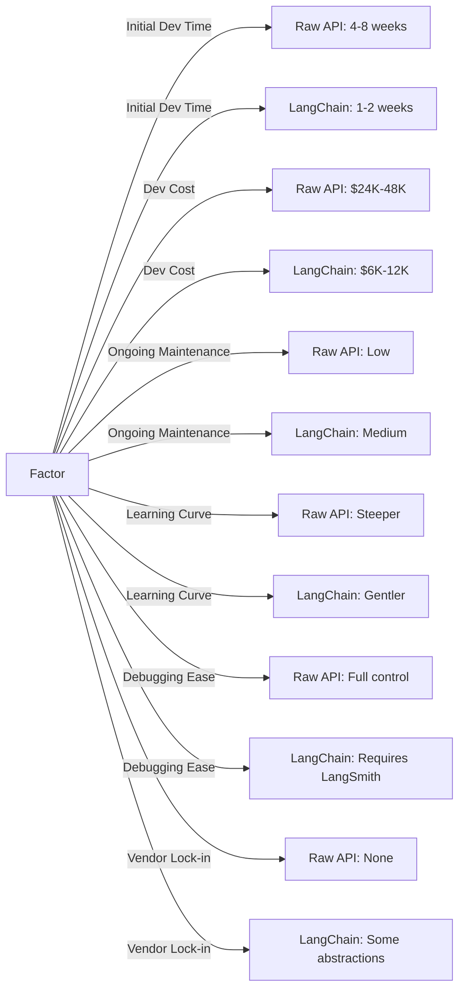

> **AI/ML Engineering Track** | Complexity: `[COMPLEX]` | Time: 5-6 Hours

# Or: The Framework That Took Over AI Development

**Reading Time**: 6-7 hours
**Prerequisites**: Module 14

---

## Why This Module Matters

In early 2023, a Series B legal technology startup almost burned through their entire financial runway attempting to build a custom multi-document retrieval system from scratch. They spent three grueling months and over $200,000 in engineering salaries trying to chain together language models, text chunking algorithms, and vector databases using nothing but raw API calls. Their custom system was plagued by context window overflows, fragile string parsing, and state management bugs that ultimately rendered the product completely unusable in production.

When the lead engineer discovered LangChain, they took a massive risk and scrapped their custom implementation. By utilizing LangChain's built-in document loaders, semantic text splitters, and optimized retrieval chains, the team rebuilt the entire system from the ground up in just two weeks. They deployed their Minimum Viable Product to production immediately, secured their first enterprise customer within a month, and now process tens of thousands of complex legal contracts weekly. This framework didn't just salvage their engineering schedule; it literally saved the company from bankruptcy.

LangChain fundamentally altered the economics of AI application development. It established a standardized methodology for interfacing with large language models, transforming complex, brittle integration challenges into composable, reusable code pipelines. Understanding how to leverage this powerful framework—and crucially, knowing when its dense abstractions introduce unnecessary latency or debugging complexity—is an absolutely mandatory skill for modern AI engineers working at scale.

---

## Learning Outcomes

By the end of this module, you will be able to:
- **Design** composable language model pipelines utilizing LangChain Expression Language (LCEL) syntax.
- **Implement** conversational AI systems featuring robust, token-aware memory management.
- **Evaluate** the performance, maintainability, and cost trade-offs between raw API requests and LangChain abstractions.
- **Debug** complex multi-step chains by inspecting intermediate outputs and handling silent parser failures.
- **Diagnose** context window exhaustion and statefulness anomalies within production retrieval-augmented generation applications.

---

## Did You Know? 

1. LangChain rapidly grew from a weekend project in October 2022 to a $200,000,000 corporate valuation by January 2024, successfully securing $130,000,000 in Series B funding.
2. A comprehensive 2024 survey of production LangChain deployments revealed that exactly 67% of critical bugs originated in custom developer components, rather than the framework's core code.
3. Caching embeddings using LangChain can save massive capital; re-embedding 10,000 standardized documents daily costs over $1,000 monthly with commercial models, a cost completely eliminated by local caching.
4. Utilizing streaming LCEL pipelines reduces perceived latency drastically; recent benchmarks demonstrated that time-to-first-token drops from 3.5 seconds to 0.3 seconds on major language models.

---

## The "Framework vs Library" Debate

In late 2023, the developer community engaged in a fierce debate regarding LangChain's utility. Critics argued it provided too much abstraction for simple tasks, while proponents hailed it as the definitive orchestrator for complex systems.

This dichotomy is best illustrated in code:

```python
# LangChain way (many abstractions)
from langchain.llms import OpenAI
from langchain.prompts import PromptTemplate
from langchain.chains import LLMChain

template = "What is a good name for a company that makes {product}?"
prompt = PromptTemplate(input_variables=["product"], template=template)
chain = LLMChain(llm=OpenAI(), prompt=prompt)
result = chain.run("colorful socks")

# Raw API way (simple and direct)
import openai
result = openai.ChatCompletion.create(
    model="gpt-3.5-turbo",
    messages=[{"role": "user", "content": "What is a good name for a company that makes colorful socks?"}]
)
```

The economics of this decision vary significantly based on project scale:

| Factor | Raw API | LangChain |
|--------|---------|-----------|
| **Initial Dev Time** | 4-8 weeks | 1-2 weeks |
| **Dev Cost (at $150/hr)** | $24K-48K | $6K-12K |
| **Ongoing Maintenance** | Low | Medium (API changes) |
| **Learning Curve** | Steeper initially | Gentler |
| **Debugging Ease** | Full control | Requires LangSmith |
| **Vendor Lock-in** | None | Some abstractions |



**Verdict:** If your application requires simple single-turn prompts, stick to the raw API. If you are building stateful agents, Retrieval-Augmented Generation (RAG), or multi-tool orchestrators, LangChain pays for its overhead quickly.

---

## Architecture and Ecosystem

Think of LangChain as a set of interlocking LEGO blocks designed for AI infrastructure. The stack is heavily layered, providing both high-level orchestration and low-level execution primitives.

Here is the classic representation of the stack:

```text
┌─────────────────────────────────────────────────────────────┐