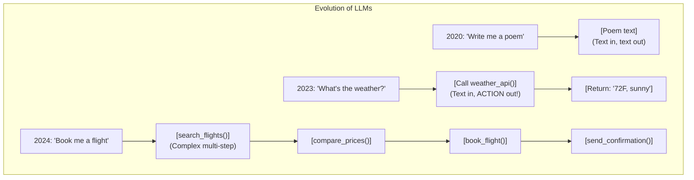
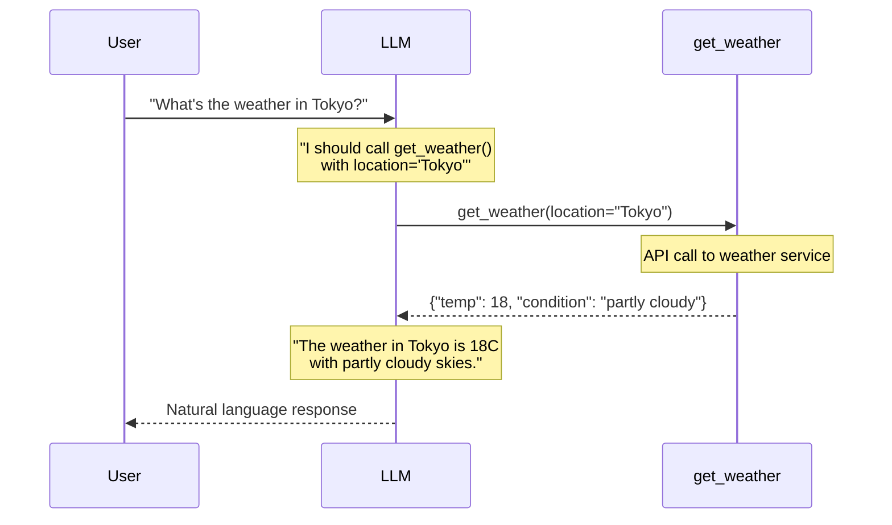
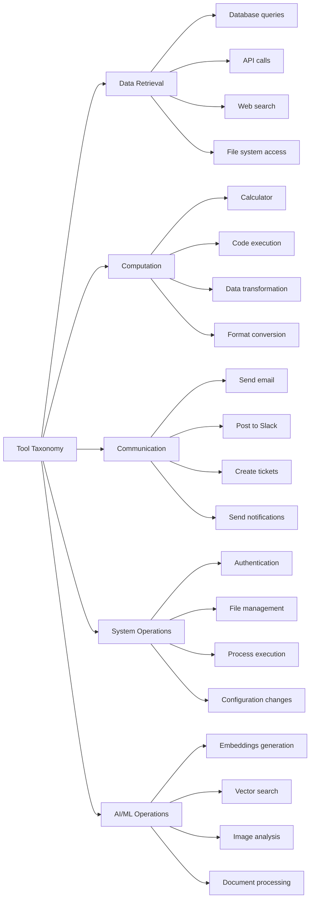
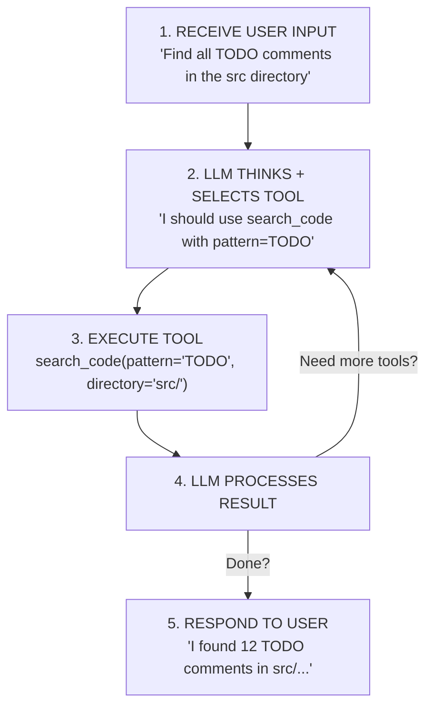

> **AI/ML Engineering Track** | Complexity: `[COMPLEX]` | Time: 5-6

# Or: Teaching AI to Use Tools Like a Human

**Reading Time**: 6-7 hours
**Prerequisites**: Module 15

---

## What You'll Be Able to Do

By the end of this module, you will:

1. **Implement** function calling architectures using LangChain to bridge the gap between text generation and external system execution.
2. **Design** robust tool schemas that effectively guide language models toward accurate tool selection while minimizing token consumption.
3. **Debug** agent execution loops by inspecting intermediate steps, trace logs, and analyzing tool routing decisions.
4. **Evaluate** the cost and performance trade-offs of multi-step reasoning models against single-pass prompt strategies.
5. **Diagnose** security vulnerabilities in tool-calling implementations, applying the principle of least privilege to restrict shell executions and database queries.
6. **Compare** synchronous and parallel tool execution strategies to significantly optimize agent response latencies.

---

## Why This Module Matters

In early 2024, Air Canada was ordered by a civil tribunal to honor a hallucinated refund policy invented by its customer service chatbot. The bot, functioning as a generic conversational agent rather than a tightly constrained tool-caller, generated a plausible-sounding but entirely fictitious bereavement fare policy. Because the system relied on the model's internal weights rather than deterministic API calls to a strict policy database, the airline suffered substantial reputational damage and financial loss.

Meanwhile, a startup in Boston deployed a financial analysis agent that operated flawlessly in staging environments. In production, a single user asked a series of follow-up questions about technology stocks. Because the agent lacked caching tools and was free to query external market data providers synchronously, the system generated over eight hundred external API calls in one user session. The company received a twenty-three thousand dollar API bill within three days.

These incidents highlight the core thesis of this module: large language models are exceptional reasoning engines but dangerous, unpredictable data stores. To build reliable, production-grade artificial intelligence systems, you must decouple reasoning from direct action. By designing robust tool-calling frameworks, you constrain the model to use verified external functions for data retrieval and state mutations. This module transitions you from building conversational novelties to architecting deterministic, secure, and cost-effective AI agents.

---

## Theory

### Introduction: When LLMs Need Hands

You have learned that Large Language Models are incredibly capable at understanding semantics and generating text. But there is a fundamental limitation: **LLMs can only produce text outputs**. On their own, they cannot:

- Check the current weather conditions.
- Query a relational database.
- Send an email or text message.
- Execute a Python script.
- Access the live internet.
- Read files from a local disk.

This is where **function calling** (also referred to as **tool use**) comes into play. It is the architectural breakthrough that transformed LLMs from advanced autocomplete engines into **AI agents** capable of taking actions in the real world. 

If an LLM is a brilliant brain in a jar, function calling gives it the hands it needs to interact with its environment.



---

### The Function Calling Revolution

Think of function calling like teaching a highly intelligent assistant to use a telephone. The assistant is brilliant at understanding user requests and formulating conversational responses, but they cannot physically dial the numbers or browse a website themselves. Function calling gives the assistant a phone book (the available tools) and teaches them exactly how to place requests (invoking functions). You still handle the underlying mechanics of the phone call; the assistant merely tells you when to call and what arguments to provide.

#### How It Works

Function calling is elegantly simple in its core concept:

1. **You define tools**: Tell the LLM what functions are available and precisely what they do.
2. **LLM decides**: Based on the user's prompt, the LLM analyzes the context and chooses which tool to call.
3. **You execute**: The LLM outputs a structured request, and your application code runs the actual function locally.
4. **LLM interprets**: The LLM receives the results of your local function execution and uses them to formulate a final response.



> **Stop and think**: If you provide a language model with ten different tools for fetching weather data (e.g., `get_current_weather`, `get_hourly_forecast`, `get_weekend_forecast`), how might this affect the model's reliability compared to providing a single, flexible `get_weather` tool?

---

### Tool Schema: Teaching LLMs About Your Tools

Before a language model can effectively use a tool, it must comprehend the tool's mechanics. It needs to know:
- **Name**: What is the unique identifier for the tool?
- **Description**: What exactly does the tool do, and under what circumstances should it be invoked?
- **Parameters**: What inputs are required, and what data types are expected?
- **Return type**: What format will the returned data take?

This information is transmitted to the model via a **tool schema**, traditionally structured in JSON format:

```python
# A tool schema tells the LLM everything it needs to know
weather_tool_schema = {
    "name": "get_weather",
    "description": "Get the current weather for a location. Use this when the user asks about weather, temperature, or conditions for a specific place.",
    "parameters": {
        "type": "object",
        "properties": {
            "location": {
                "type": "string",
                "description": "The city and country, e.g., 'Tokyo, Japan' or 'New York, USA'"
            },
            "units": {
                "type": "string",
                "enum": ["celsius", "fahrenheit"],
                "description": "Temperature units. Default is celsius."
            }
        },
        "required": ["location"]
    }
}
```

#### The Description Is Everything

A fundamental secret that separates mediocre tool implementations from exceptional ones: **the description parameter is the most critical component**. The model relies almost entirely on semantic comprehension of the description string to decide:

1. Whether the tool is appropriate for the user's current request.
2. How to extract and map entities from the user's prompt into the tool's required parameters.

```python
# BAD description - vague, unhelpful
{
    "name": "search",
    "description": "Searches for things"  # What things? How? When to use?
}

# GOOD description - specific, actionable
{
    "name": "search_products",
    "description": "Search the product catalog by name, category, or keywords. Use this when the user wants to find products, browse inventory, or look up items by name. Returns up to 10 matching products with prices and availability."
}

# EXCELLENT description - includes examples and edge cases
{
    "name": "search_products",
    "description": """Search the product catalog. Use when users want to:
    - Find specific products ("show me laptops")
    - Browse categories ("what electronics do you have")
    - Check availability ("do you have the iPhone 15")

    Returns: List of products with name, price, stock status.
    Note: For price comparisons, use compare_prices tool instead."""
}
```

---

### LangChain Tools: The Elegant Abstraction

Writing pure JSON schemas by hand is tedious and prone to syntax errors. LangChain offers an elegant, pythonic abstraction for creating tools. You can use decorators and classes to auto-generate the underlying schemas.

#### Method 1: The @tool Decorator (Simplest)

```python
from langchain_core.tools import tool

@tool
def get_weather(location: str, units: str = "celsius") -> str:
    """Get the current weather for a location.

    Use this when the user asks about weather, temperature, or
    conditions for a specific place.

    Args:
        location: The city and country, e.g., 'Tokyo, Japan'
        units: Temperature units - 'celsius' or 'fahrenheit'

    Returns:
        A string describing the current weather conditions.
    """
    # Your implementation here
    return f"Weather in {location}: 22 {units[0].upper()}, sunny"
```

LangChain automatically inspects the function and:
- Extracts the function name to use as the tool name.
- Parses the docstring to populate the tool description.
- Analyzes Python type hints to generate the parameter schema.
- Handles all serialization and deserialization during runtime.

#### Method 2: StructuredTool (More Control)

```python
from langchain_core.tools import StructuredTool
from pydantic import BaseModel, Field

class WeatherInput(BaseModel):
    """Input schema for weather tool."""
    location: str = Field(description="City and country, e.g., 'Tokyo, Japan'")
    units: str = Field(default="celsius", description="celsius or fahrenheit")

def get_weather_impl(location: str, units: str = "celsius") -> str:
    """Implementation of weather lookup."""
    return f"Weather in {location}: 22 {units[0].upper()}, sunny"

weather_tool = StructuredTool.from_function(
    func=get_weather_impl,
    name="get_weather",
    description="Get current weather for a location",
    args_schema=WeatherInput,
    return_direct=False  # LLM will process the result
)
```

#### Method 3: BaseTool Subclass (Maximum Flexibility)

```python
from langchain_core.tools import BaseTool
from pydantic import BaseModel, Field
from typing import Type, Optional
from langchain_core.callbacks import CallbackManagerForToolRun

class CalculatorInput(BaseModel):
    expression: str = Field(description="Mathematical expression to evaluate")

class CalculatorTool(BaseTool):
    name: str = "calculator"
    description: str = "Evaluates mathematical expressions. Use for any math calculations."
    args_schema: Type[BaseModel] = CalculatorInput

    def _run(
        self,
        expression: str,
        run_manager: Optional[CallbackManagerForToolRun] = None
    ) -> str:
        """Execute the calculation."""
        try:
            # WARNING: eval is dangerous! Use a safe parser in production
            result = eval(expression)
            return f"Result: {result}"
        except Exception as e:
            return f"Error: {str(e)}"

    async def _arun(
        self,
        expression: str,
        run_manager: Optional[CallbackManagerForToolRun] = None
    ) -> str:
        """Async version (required for async agents)."""
        return self._run(expression, run_manager)
```

---

### Tool Categories: Building Your Toolkit

Real-world agents require diverse sets of capabilities. You can conceptually group tools into broad operational taxonomies.



---

### Building Real Tools: A Practical Example

Let us assemble a practical tool system designed specifically for a developer assistant agent:

```python
from langchain_core.tools import tool
from typing import Optional
import subprocess
import os

@tool
def run_shell_command(command: str) -> str:
    """Execute a shell command and return the output.

    Use this for:
    - Running tests: "pytest tests/"
    - Checking git status: "git status"
    - Installing packages: "pip install package_name"
    - Any other shell operation

    Args:
        command: The shell command to execute

    Returns:
        Command output (stdout + stderr) or error message

    Warning:
        Be careful with destructive commands. Always confirm
        with the user before running commands that modify files.
    """
    try:
        result = subprocess.run(
            command,
            shell=True,
            capture_output=True,
            text=True,
            timeout=30
        )
        output = result.stdout + result.stderr
        return output if output else "Command completed with no output"
    except subprocess.TimeoutExpired:
        return "Error: Command timed out after 30 seconds"
    except Exception as e:
        return f"Error executing command: {str(e)}"

@tool
def read_file(file_path: str, max_lines: Optional[int] = 100) -> str:
    """Read the contents of a file.

    Use this to:
    - Examine source code
    - Read configuration files
    - Check log files
    - Review documentation

    Args:
        file_path: Path to the file (relative or absolute)
        max_lines: Maximum lines to read (default 100)

    Returns:
        File contents or error message
    """
    try:
        with open(file_path, 'r') as f:
            lines = f.readlines()[:max_lines]
            content = ''.join(lines)
            if len(lines) == max_lines:
                content += f"\n... (truncated, showing first {max_lines} lines)"
            return content
    except FileNotFoundError:
        return f"Error: File not found: {file_path}"
    except Exception as e:
        return f"Error reading file: {str(e)}"

@tool
def search_code(pattern: str, directory: str = ".") -> str:
    """Search for a pattern in code files using grep.

    Use this to:
    - Find function definitions
    - Locate imports
    - Search for TODOs
    - Find usage of specific variables/functions

    Args:
        pattern: Regex pattern to search for
        directory: Directory to search in (default: current)

    Returns:
        Matching lines with file paths and line numbers
    """
    try:
        result = subprocess.run(
            f'grep -rn "{pattern}" {directory} --include="*.py" --include="*.js" --include="*.ts" | head -50',
            shell=True,
            capture_output=True,
            text=True,
            timeout=30
        )
        output = result.stdout
        if not output:
            return f"No matches found for pattern: {pattern}"
        return output
    except Exception as e:
        return f"Error searching: {str(e)}"
```

---

### Tool-Calling Agents: Putting It Together

The true power of function calling is unlocked when creating an agent that autonomously sequences these tools intelligently.

#### The Agent Loop

A tool-calling agent operates in an iterative reasoning cycle, deciding at each step whether to call a tool or to conclude the conversation:



#### Creating an Agent with LangChain

```python
from langchain_google_genai import ChatGoogleGenerativeAI
from langchain_core.prompts import ChatPromptTemplate, MessagesPlaceholder
from langchain.agents import create_tool_calling_agent, AgentExecutor

# 1. Define your tools
tools = [run_shell_command, read_file, search_code]

# 2. Create the LLM
llm = ChatGoogleGenerativeAI(
    model="gemini-1.5-flash",
    temperature=0  # Lower temperature for more consistent tool use
)

# 3. Create the prompt template
prompt = ChatPromptTemplate.from_messages([
    ("system", """You are a helpful developer assistant with access to tools.

When using tools:
- Think step by step about what information you need
- Use the most appropriate tool for each task
- If a tool returns an error, try to understand and fix the issue
- Summarize your findings clearly for the user

Available tools: {tool_names}"""),
    ("human", "{input}"),
    MessagesPlaceholder(variable_name="agent_scratchpad"),
])

# 4. Create the agent
agent = create_tool_calling_agent(llm, tools, prompt)

# 5. Create the executor (runs the agent loop)
agent_executor = AgentExecutor(
    agent=agent,
    tools=tools,
    verbose=True,  # See what's happening
    max_iterations=10,  # Prevent infinite loops
    handle_parsing_errors=True
)

# 6. Run!
result = agent_executor.invoke({
    "input": "Find all Python files that import requests",
    "tool_names": ", ".join([t.name for t in tools])
})
print(result["output"])
```

> **Pause and predict**: Why is setting the `temperature=0` highly recommended when configuring language models designed specifically for tool-calling pipelines?

---

### Error Handling: When Tools Fail

Tools are software components; they will inevitably fail. APIs time out, files do not exist, and databases drop connections. A robust agent must anticipate and handle these failures gracefully to maintain user trust.

#### Error Handling Strategies

```python
from langchain_core.tools import tool, ToolException

@tool(handle_tool_error=True)
def risky_operation(param: str) -> str:
    """A tool that might fail.

    The handle_tool_error=True means failures are caught
    and returned as messages instead of crashing.
    """
    if not param:
        raise ToolException("Parameter cannot be empty!")
    return f"Success with {param}"

# Custom error handler
def handle_tool_error(error: ToolException) -> str:
    """Convert tool errors into helpful messages."""
    return f"""Tool Error: {str(error)}

Suggestions:
- Check if all required parameters are provided
- Verify the input format is correct
- Try a simpler query first

Please try again with corrected input."""

@tool(handle_tool_error=handle_tool_error)
def another_risky_tool(x: int) -> str:
    """Tool with custom error handling."""
    if x < 0:
        raise ToolException("Negative numbers not allowed")
    return str(x * 2)
```

#### Graceful Degradation Pattern

If a primary data source fails, the tool should ideally fall back to a secondary source or a cached result rather than failing outright.

```python
@tool
def get_stock_price(symbol: str) -> str:
    """Get current stock price with fallback sources."""

    # Try primary source
    try:
        price = primary_api.get_price(symbol)
        return f"${price:.2f} (source: primary)"
    except Exception as e:
        pass  # Try fallback

    # Try fallback source
    try:
        price = fallback_api.get_price(symbol)
        return f"${price:.2f} (source: fallback, primary unavailable)"
    except Exception as e:
        pass  # Try cache

    # Try cached value
    cached = cache.get(f"price:{symbol}")
    if cached:
        return f"${cached['price']:.2f} (cached from {cached['timestamp']}, live data unavailable)"

    # All sources failed
    return f"Unable to get price for {symbol}. All data sources are currently unavailable. Please try again later."
```

---

### Tool Selection Strategies

When your agent's toolkit grows, the model may struggle to choose the correct function. Implement the following strategies to optimize tool selection.

#### 1. Clear, Distinct Descriptions

Descriptions must not overlap semantically. Ensure the model has a definitive path for every logical request.

```python
# BAD: Overlapping, confusing
search_tool = "Searches for information"
lookup_tool = "Looks up data"
find_tool = "Finds things"

# GOOD: Clear, distinct purposes
search_web = "Search the internet for current information. Use for news, general knowledge, or anything not in our database."
search_database = "Search our internal product database. Use for inventory, pricing, or customer information."
search_docs = "Search our documentation. Use for how-to guides, API references, or troubleshooting."
```

#### 2. Hierarchical Tool Organization

Rather than presenting twenty flat functions, consolidate related tasks under a single "meta-tool" that takes an `action` argument.

```python
# Instead of 20 flat tools, organize hierarchically
@tool
def developer_tools(action: str, params: dict) -> str:
    """Meta-tool for developer operations.

    Actions:
    - 'run_tests': Run pytest on specified files
    - 'lint_code': Run linter on code
    - 'format_code': Auto-format code
    - 'check_types': Run type checker

    Args:
        action: One of the above actions
        params: Parameters specific to the action
    """
    if action == "run_tests":
        return run_pytest(params.get("path", "tests/"))
    elif action == "lint_code":
        return run_linter(params.get("path", "."))
    # ... etc
```

#### 3. Tool Routing (Advanced)

For highly complex systems, employ a separate routing model whose sole job is to deduce the proper toolset before invoking the primary reasoning model.

```python
from langchain.agents import initialize_agent, Tool

# Create a "router" that picks the right toolset
def route_to_toolset(query: str) -> list:
    """Dynamically select relevant tools based on query."""

    query_lower = query.lower()

    if any(w in query_lower for w in ['code', 'file', 'debug', 'error']):
        return developer_tools
    elif any(w in query_lower for w in ['email', 'schedule', 'meeting']):
        return productivity_tools
    elif any(w in query_lower for w in ['data', 'chart', 'analyze']):
        return data_tools
    else:
        return general_tools
```

---

### Parallel Tool Execution

If an agent needs multiple discrete pieces of information to satisfy a request, modern language models can output multiple tool calls simultaneously in a single turn.

```python
from langchain_core.tools import tool
from langchain.agents import AgentExecutor
import asyncio

@tool
async def get_weather_async(location: str) -> str:
    """Get weather (async version)."""
    await asyncio.sleep(1)  # Simulate API call
    return f"Weather in {location}: Sunny, 72F"

@tool
async def get_time_async(timezone: str) -> str:
    """Get current time in timezone (async version)."""
    await asyncio.sleep(1)  # Simulate API call
    from datetime import datetime
    return f"Time in {timezone}: {datetime.now().strftime('%H:%M')}"

@tool
async def get_news_async(topic: str) -> str:
    """Get latest news on topic (async version)."""
    await asyncio.sleep(1)  # Simulate API call
    return f"Latest news on {topic}: [Headlines would go here]"

# With async tools, the agent can run multiple in parallel
# User: "What's the weather, time, and news in Tokyo?"
# Agent can call all three tools simultaneously!
```

The underlying model might generate a JSON payload resembling:
```json
{
  "tool_calls": [
    {"name": "get_weather_async", "args": {"location": "Tokyo"}},
    {"name": "get_time_async", "args": {"timezone": "Asia/Tokyo"}},
    {"name": "get_news_async", "args": {"topic": "Tokyo"}}
  ]
}
```

Because the asynchronous tools yield control immediately, they execute concurrently, reducing total execution time from approximately three seconds to just one second.

---

### Security Considerations

Providing an LLM with live tools is fundamentally granting external systems access. Security is paramount. 

#### The Principle of Least Privilege

Limit database and operational scopes directly inside the tools. Never assume the LLM will "behave itself" and omit dangerous queries.

```python
# BAD: Overly permissive
@tool
def run_any_sql(query: str) -> str:
    """Run any SQL query."""
    return database.execute(query)  # SQL injection, data deletion

# GOOD: Restricted, parameterized
@tool
def search_users(name: str, limit: int = 10) -> str:
    """Search for users by name (read-only, max 100 results)."""
    limit = min(limit, 100)  # Enforce limit
    # Parameterized query prevents injection
    results = database.execute(
        "SELECT id, name, email FROM users WHERE name LIKE ? LIMIT ?",
        (f"%{name}%", limit)
    )
    return str(results)
```

#### Input Validation

Leverage Pydantic strongly-typed schemas to forcefully whitelist acceptable commands before execution.

```python
from pydantic import BaseModel, Field, validator

class SafeCommandInput(BaseModel):
    """Validated input for shell commands."""

    command: str = Field(description="Command to run")

    @validator('command')
    def validate_command(cls, v):
        # Whitelist allowed commands
        allowed_prefixes = ['git ', 'npm ', 'pytest ', 'python -m']
        if not any(v.startswith(p) for p in allowed_prefixes):
            raise ValueError(f"Command not allowed: {v}")

        # Block dangerous patterns
        dangerous = ['rm -rf', 'sudo', '> /dev', 'curl | sh']
        if any(d in v for d in dangerous):
            raise ValueError(f"Dangerous command blocked: {v}")

        return v

@tool(args_schema=SafeCommandInput)
def safe_shell_command(command: str) -> str:
    """Run a safe, whitelisted shell command."""
    # Command has already been validated by Pydantic
    return subprocess.run(command, shell=True, capture_output=True, text=True).stdout
```

#### Confirmation for Destructive Actions

Destructive tools must enforce a safety switch logic.

```python
@tool
def delete_file(file_path: str, confirm: bool = False) -> str:
    """Delete a file (requires explicit confirmation).

    Args:
        file_path: Path to file to delete
        confirm: Must be True to actually delete
    """
    if not confirm:
        return f"WARNING: This will DELETE {file_path}. To proceed, call with confirm=True"

    os.remove(file_path)
    return f"Deleted {file_path}"
```

---

### Real-World Tool Patterns

#### Pattern 1: The Swiss Army Knife

A powerful, singular tool that encapsulates multiple closely related operations to minimize token overhead on prompt schemas.

```python
@tool
def git_operations(
    operation: str,
    args: Optional[dict] = None
) -> str:
    """Perform git operations.

    Operations:
    - status: Show working tree status
    - log: Show recent commits (args: count)
    - diff: Show changes (args: file)
    - branch: List or create branches (args: name, create)
    - commit: Create commit (args: message)
    - pull: Pull from remote
    - push: Push to remote
    """
    args = args or {}

    commands = {
        "status": "git status",
        "log": f"git log -n {args.get('count', 5)} --oneline",
        "diff": f"git diff {args.get('file', '')}",
        "branch": "git branch" if not args.get('create') else f"git checkout -b {args['name']}",
        "commit": f"git commit -m \"{args.get('message', 'Update')}\"",
        "pull": "git pull",
        "push": "git push"
    }

    cmd = commands.get(operation)
    if not cmd:
        return f"Unknown operation: {operation}"

    result = subprocess.run(cmd, shell=True, capture_output=True, text=True)
    return result.stdout or result.stderr
```

#### Pattern 2: The Specialist Team

Multiple focused tools that operate synergistically to complete exhaustive analysis workflows.

```python
@tool
def analyze_code(file_path: str) -> str:
    """Analyze code quality and complexity."""
    # Returns metrics, complexity scores, etc.

@tool
def suggest_refactoring(file_path: str) -> str:
    """Suggest refactoring improvements."""
    # Returns specific refactoring suggestions

@tool
def apply_refactoring(file_path: str, refactoring_id: str) -> str:
    """Apply a suggested refactoring."""
    # Actually modifies the code

@tool
def run_tests(test_path: str = "tests/") -> str:
    """Run tests to verify changes."""
    # Runs pytest and returns results
```

#### Pattern 3: The Retrieval-Augmented Tool

Combining traditional RAG with tool schemas so an agent can explicitly query the vector database dynamically.

```python
@tool
def answer_from_docs(question: str) -> str:
    """Answer questions using our documentation.

    This tool searches our vector database of documentation
    and returns relevant information to answer the question.
    """
    # 1. Generate embedding for question
    embedding = embed_model.embed(question)

    # 2. Search vector database
    results = vector_db.search(embedding, k=5)

    # 3. Format context
    context = "\n\n".join([
        f"From {r.metadata['source']}:\n{r.text}"
        for r in results
    ])

    return f"Relevant documentation:\n\n{context}"
```

---

### Debugging Tool-Calling Agents

When multi-step architectures fail, tracing the discrete execution steps is paramount.

#### 1. Enable Verbose Mode

```python
agent_executor = AgentExecutor(
    agent=agent,
    tools=tools,
    verbose=True,  # See every step
    return_intermediate_steps=True  # Get all tool calls and results
)

result = agent_executor.invoke({"input": "test query"})

# Examine what happened
for step in result["intermediate_steps"]:
    action, output = step
    print(f"Tool: {action.tool}")
    print(f"Input: {action.tool_input}")
    print(f"Output: {output}")
    print("---")
```

#### 2. Check Tool Schemas

Always dump the generated Pydantic schemas to ensure LangChain compiled your type hints successfully.

```python
# Inspect what the LLM sees
for tool in tools:
    print(f"Name: {tool.name}")
    print(f"Description: {tool.description}")
    print(f"Schema: {tool.args_schema.schema()}")
    print("---")
```

#### 3. Common Issues

| Symptom | Likely Cause | Fix |
|---------|-------------|-----|
| Wrong tool selected | Description overlap | Make descriptions more distinct |
| Missing parameters | Unclear param descriptions | Add examples to descriptions |
| Tool not called at all | Description doesn't match query | Reword description to match user language |
| Infinite loop | Tool returns unclear results | Return clearer success/failure messages |
| Parsing errors | Malformed tool output | Return valid JSON or simple strings |

---

### The Function Calling Protocol Deep Dive

Different proprietary language models utilize slightly different wire protocols. Understanding these differences emphasizes the value of an abstraction layer like LangChain.

#### OpenAI Format
```json
{
  "type": "function",
  "function": {
    "name": "get_weather",
    "description": "Get weather for a location",
    "parameters": {
      "type": "object",
      "properties": {
        "location": {"type": "string"}
      },
      "required": ["location"]
    }
  }
}
```

#### Anthropic (Claude) Format
```json
{
  "name": "get_weather",
  "description": "Get weather for a location",
  "input_schema": {
    "type": "object",
    "properties": {
      "location": {"type": "string"}
    },
    "required": ["location"]
  }
}
```

#### Google (Gemini) Format
```json
{
  "name": "get_weather",
  "description": "Get weather for a location",
  "parameters": {
    "type": "object",
    "properties": {
      "location": {"type": "string"}
    },
    "required": ["location"]
  }
}
```

---

### Production War Stories: Tool Calling Gone Wrong

#### The $23,800 API Call

**Boston. August 2023. A fintech startup building an AI financial advisor.**

The engineering team built a beautiful tool-calling agent. Users could ask "What's happening with NVIDIA stock?" and the agent would call their market data API, analyze trends, and provide insights. In testing, it worked flawlessly.

Then they deployed to production. Within 72 hours, they received a bill for $23,800 from their market data provider. What happened?

The problem was a missing caching layer. When users asked follow-up questions like "What about their earnings?" or "How does it compare to AMD?", the agent did not realize it already had relevant data. Each question triggered fresh API calls. One curious user asking questions about tech stocks generated massive volume in a single session.

**The fix:**

```python
from functools import lru_cache
from datetime import datetime, timedelta

# Cache market data for 5 minutes
@lru_cache(maxsize=1000)
def _cached_fetch(symbol: str, cache_key: str) -> dict:
    """Internal cached fetcher."""
    return market_data_api.get_quote(symbol)

@tool
def get_stock_price(symbol: str) -> str:
    """Get current stock price for a symbol like AAPL, GOOGL, NVDA."""
    # Cache key includes 5-minute bucket
    cache_key = datetime.now().strftime("%Y%m%d%H") + str(datetime.now().minute // 5)
    data = _cached_fetch(symbol.upper(), cache_key)
    return f"{symbol}: ${data['price']:.2f} ({data['change']:+.2f}%)"
```

#### The Tool Description Disaster

**Seattle. October 2023. E-commerce company building a customer service agent.**

The team deployed an agent with these tools:
- `search_orders` - Search customer order history
- `check_inventory` - Check product availability
- `process_return` - Process a return request

Within the first week, they noticed something strange. Customers asking "Where's my order?" were getting inventory information instead of order status. The agent was choosing `check_inventory` frequently for tracking questions. The root cause? Their tool descriptions were extremely vague:

```python
# BAD - Vague descriptions
@tool
def search_orders(customer_id: str):
    """Search for orders."""  # Too vague!

@tool
def check_inventory(product_id: str):
    """Check availability."""  # Ambiguous!
```

After rewriting descriptions to include exhaustive detail:

```python
# GOOD - Specific, detailed descriptions
@tool
def search_orders(customer_id: str):
    """Search for a customer's past orders including status, tracking info, and delivery dates.
    Use this when customers ask about order status, shipping updates, or delivery times.
    Returns: List of orders with order_id, status, items, and tracking URL."""

@tool
def check_inventory(product_id: str):
    """Check if a product is currently in stock and available for purchase.
    Use this when customers ask if they can buy a product or when it will be available.
    Returns: Stock count and next restock date if out of stock."""
```

#### The Infinite Loop Incident

An AI legal research assistant was designed to search case law, summarize findings, and provide citations. A user asked: "Find precedents for software patent disputes in Texas." The search returned fifty results, so the agent decided to get more details via `get_case_details`. Those details mentioned related cases. The agent tried to fetch those too. Then those cases referenced more cases.

The system generated 12,850 API calls in a short window before crashing.

```python
# BAD - No recursion protection
@tool
def get_case_details(case_id: str):
    """Get full details including related cases."""
    details = legal_api.get(case_id)
    return details  # Includes "related_cases" field that agent will try to explore

# GOOD - With call limits and depth tracking
class LegalResearchTools:
    def __init__(self, max_calls: int = 20):
        self.call_count = 0
        self.max_calls = max_calls
        self.explored_cases = set()

    @tool
    def get_case_details(self, case_id: str):
        """Get case details. Limited to 20 calls per session to prevent runaway research."""
        if self.call_count >= self.max_calls:
            return "Research limit reached. Please refine your query."
        if case_id in self.explored_cases:
            return f"Already retrieved case {case_id}."

        self.call_count += 1
        self.explored_cases.add(case_id)
        details = legal_api.get(case_id)
        # Don't include related cases in response to prevent exploration
        del details['related_cases']
        return details
```

---

### The Economics of Tool Calling

Understanding the true token consumption overhead is essential to writing cost-effective architectures. 

```text
TOOL CALLING COST ANATOMY
=========================

Single Tool Call Request:
- System prompt:           ~200 tokens
- Tool definitions:        ~100 tokens per tool (5 tools = 500 tokens)
- Conversation history:    ~500 tokens average
- User message:            ~50 tokens
- Total INPUT:            ~1,250 tokens

Response (with tool call):
- Tool call JSON:          ~100 tokens
- Reasoning (if any):      ~50 tokens
- Total OUTPUT:           ~150 tokens

Tool Result Turn:
- Previous context:        ~1,400 tokens (cumulative)
- Tool result:            ~200 tokens average
- Final response:         ~200 tokens OUTPUT

TOTAL for single tool interaction:
- Input tokens:           ~1,800
- Output tokens:          ~350
- Cost (gpt-5):           ~$0.012
- Cost (Claude Sonnet):   ~$0.009
```

| Agent Type | Avg. Tool Calls | Input Tokens | Output Tokens | Cost/Request |
|-----------|-----------------|--------------|---------------|--------------|
| Single-tool (weather) | 1 | 1,500 | 200 | $0.008 |
| Customer service | 2.3 | 3,200 | 450 | $0.021 |
| Research assistant | 4.6 | 6,800 | 900 | $0.045 |
| Complex workflow | 8+ | 12,000+ | 1,500+ | $0.090+ |

| Task | Manual Time | Manual Cost | Agent Cost | Savings |
|------|-------------|-------------|------------|---------|
| Order lookup | 2 min | $1.00 | $0.02 | 98% |
| Flight search | 5 min | $2.50 | $0.05 | 98% |
| Data extraction | 15 min | $7.50 | $0.10 | 99% |
| Research synthesis | 60 min | $30.00 | $0.50 | 98% |

```python
# BAD - Returns massive objects
@tool
def search_products(query: str):
    results = catalog.search(query, limit=100)  # 100 full product objects
    return results  # Could be 50,000+ tokens!

# GOOD - Return only what's needed
@tool
def search_products(query: str, limit: int = 5):
    """Search products. Returns top 5 matches with name, price, and ID."""
    results = catalog.search(query, limit=limit)
    return [
        {"id": p["id"], "name": p["name"], "price": p["price"]}
        for p in results
    ]  # ~500 tokens max
```

---

### Interview Preparation

**Q: How do you prevent prompt injection through tool results?**

A malicious user can embed dangerous payloads in an otherwise innocuous database field. If the agent retrieves that field and incorporates it directly into the prompt context, the payload could hijack the agent's logic.

```xml
<tool_result source="database">
User's bio: {potentially malicious content}
</tool_result>
```
To mitigate this risk, you isolate external data in specific XML tags and provide explicit system prompts instructing the model never to interpret the contents of the `tool_result` tag as execution instructions.

---

## Did You Know?

- In June 2023, OpenAI officially introduced function calling to their API, fundamentally shifting the paradigm from text generation to agentic workflows.
- Research published in 2023 demonstrated that agent accuracy for tool selection drops from roughly 95 percent to 70 percent when the number of available tools exceeds twenty.
- Implementing a tool execution loop can reduce manual processing costs by up to 98 percent, lowering the price of a typical data extraction task from seven dollars to ten cents.
- Early implementations of recursive agents were known to execute over ten thousand API calls in under three minutes due to the absence of depth limits and recursion protections.

---

## Common Mistakes

| Mistake | Why | Fix |
|---|---|---|
| Overpowered Tools | Models may hallucinate destructive commands if given broad access. | Apply the principle of least privilege; parameterize queries and restrict scopes. |
| Missing Error Context | Returning a generic error causes the model to guess or hallucinate next steps. | Catch exceptions and return actionable, clear error strings detailing the exact issue. |
| Tool Overload | Providing dozens of overlapping tools confuses the model's selection logic. | Consolidate related functionality into single tools with clear, distinct responsibilities. |
| Synchronous External Calls | Blocking calls halt the entire response generation, leading to poor user experience. | Use asynchronous functions (`_arun`) to allow parallel tool execution. |
| Ignoring Tool Call Costs | Returning massive JSON objects consumes massive amounts of tokens. | Filter tool responses to return only the specific fields required by the prompt. |
| Poor Descriptions | The model uses the description to determine if and how to use the tool. | Write exhaustive docstrings detailing inputs, edge cases, and exactly when to invoke the tool. |

---

## Quiz

1. **Scenario: You are managing a LangChain agent that integrates with a proprietary CRM database. The agent keeps returning a massive JSON payload causing token limit exceptions. How do you resolve this?**
   <details>
   <summary>Reveal Answer</summary>
   The database tool is returning the entire customer record object back to the agent's context window. You must refactor the tool function to extract and return only the specific fields requested (e.g., name and active status), reducing the token payload drastically.
   </details>

2. **Scenario: Your agent has twenty-five different tools to manage cloud resources. It consistently selects the wrong tool. What strategy improves tool selection?**
   <details>
   <summary>Reveal Answer</summary>
   Tool overload confuses the model classification logic. Implement a hierarchical tool routing pattern where a primary agent determines the category (e.g., networking, compute), and passes the query to a specialized sub-agent with a much smaller, focused set of tools.
   </details>

3. **Scenario: A developer implements an agent tool `delete_user_record`. It deletes records without prompting the user. How should you restructure the tool to be secure?**
   <details>
   <summary>Reveal Answer</summary>
   You must implement a confirmation boolean parameter in the tool schema. If the parameter is missing or false, the tool should safely return a warning message requesting explicit confirmation before proceeding to mutate state.
   </details>

4. **Scenario: A weather agent correctly calls the `get_weather` tool, but the API endpoint times out. The agent crashes. What should you change in the tool definition?**
   <details>
   <summary>Reveal Answer</summary>
   The tool is missing internal error handling. In LangChain, you should pass `handle_tool_error=True` to the decorator or wrap the external API call in a `try/except` block, returning a clean, textual explanation of the failure so the model can degrade gracefully.
   </details>

5. **Concept: What is the main structural difference between OpenAI's function calling schema and Anthropic's tool schema?**
   <details>
   <summary>Reveal Answer</summary>
   While conceptually identical, OpenAI nests parameters under a `parameters` key within a `function` object. Anthropic utilizes a flattened `input_schema` key. LangChain abstracts these wire-level formatting differences away from the developer.
   </details>

6. **Concept: In the context of tool taxonomies, what is a composite or "Specialist Team" tool pattern?**
   <details>
   <summary>Reveal Answer</summary>
   A composite tool is a wrapper function that internally executes multiple sequential or related actions (like fetching a stock price, grabbing news headlines, and reading financials) and returns a synthesized block of text, preventing the agent from having to navigate complex multi-step logic on its own.
   </details>

7. **Concept: What does the `@tool` decorator in LangChain automate for the developer?**
   <details>
   <summary>Reveal Answer</summary>
   The decorator dynamically extracts the function name, parses the python docstring into the tool description, and converts the python type hints into the required JSON schema parameters automatically.
   </details>

---

## Hands-On Exercises

### Environment Setup

Before starting the exercises, open your terminal and establish your virtual environment to ensure all packages are isolated cleanly.

```bash
# Create and activate a fresh virtual environment
python -m venv langchain-env
source langchain-env/bin/activate

# Install required packages
pip install langchain langchain-core langchain-openai pydantic

# Export your API key for the LLM client
export OPENAI_API_KEY="sk-..."
```

Verify your environment by launching the python REPL and running:
```python
import langchain
print(langchain.__version__)
```
If this prints a version number without errors, proceed to the exercises.

### Exercise 1: Build a Weather + News Agent

Create an agent that can check weather AND get news headlines for a city. This teaches you multi-tool coordination.

**Requirements:**
- Tool 1: `get_weather(city: str)` - Returns temperature and conditions
- Tool 2: `get_headlines(city: str)` - Returns top 3 news headlines
- The agent should answer: "What's happening in Tokyo today?"

**Starter Code:**

```python
from langchain.agents import tool, create_react_agent, AgentExecutor
from langchain_openai import ChatOpenAI
from langchain import hub

# Tool 1: Weather (simulated for exercise)
@tool
def get_weather(city: str) -> str:
    """Get current weather for a city. Use when user asks about weather conditions."""
    # In production, you'd call a real API
    weather_data = {
        "tokyo": "72F (22C), partly cloudy, humidity 65%",
        "london": "55F (13C), rainy, humidity 85%",
        "new york": "68F (20C), sunny, humidity 50%",
    }
    city_lower = city.lower()
    return weather_data.get(city_lower, f"Weather data not available for {city}")

# Tool 2: News (simulated for exercise)
@tool
def get_headlines(city: str) -> str:
    """Get top news headlines for a city. Use when user asks about news or events."""
    headlines = {
        "tokyo": [
            "Tokyo Stock Exchange hits record high",
            "Cherry blossom season starts early this year",
            "New bullet train route announced"
        ],
        "london": [
            "Parliament debates new climate bill",
            "Underground expansion project approved",
            "West End theater attendance up 20%"
        ],
    }
    city_lower = city.lower()
    news = headlines.get(city_lower, [f"No headlines available for {city}"])
    return "\n".join(f"- {h}" for h in news)

# Your task: Create the agent
tools = [get_weather, get_headlines]
llm = ChatOpenAI(model="gpt-5", temperature=0)

# Get the ReAct prompt template
prompt = hub.pull("hwchase17/react")

# Create the agent
agent = create_react_agent(llm, tools, prompt)
agent_executor = AgentExecutor(agent=agent, tools=tools, verbose=True)

# Test it!
response = agent_executor.invoke({
    "input": "What's happening in Tokyo today? Include weather and news."
})
print(response["output"])
```

<details>
<summary>Solution & Verification</summary>
The starter code provided above represents the complete solution. Simply execute the script. The agent executor loop will identify the two available tools, break the prompt down into a sequence, and run the tools iteratively. Verify the output terminal displays the verbose trace log output outlining the agent's Thought, Action, and Observation cycles.
</details>

---

### Exercise 2: Build a Calculator with Error Handling

Create a robust calculator tool that handles execution errors gracefully without exposing dangerous `eval` privileges unconditionally.

**Requirements:**
- Handle division by zero.
- Handle invalid expressions syntactically.
- Return helpful textual error messages.

**Implementation:**

```python
@tool
def calculate(expression: str) -> str:
    """Evaluate a mathematical expression. Supports +, -, *, /, and parentheses.

    Examples: "2 + 2", "10 / 3", "(5 + 3) * 2"

    Use this when the user asks for any mathematical calculation.
    """
    # Whitelist allowed characters for security
    allowed_chars = set("0123456789+-*/().eE ")
    if not all(c in allowed_chars for c in expression):
        return f"Invalid characters in expression. Only numbers and +-*/() allowed."

    try:
        # Use eval with restricted globals for safety
        result = eval(expression, {"__builtins__": {}}, {})

        # Handle floating point display
        if isinstance(result, float):
            if result == int(result):
                return f"{expression} = {int(result)}"
            return f"{expression} = {result:.6f}".rstrip('0').rstrip('.')
        return f"{expression} = {result}"

    except ZeroDivisionError:
        return "Cannot divide by zero. Please check your expression."
    except SyntaxError:
        return "Invalid expression syntax. Example valid expressions: '2+2', '10/3', '(5+3)*2'"
    except Exception as e:
        return f"Calculation error: {str(e)}"

# Test cases to verify:
print(calculate.invoke("2 + 2"))           # Should work
print(calculate.invoke("10 / 0"))          # Should handle gracefully
print(calculate.invoke("import os"))       # Should reject
print(calculate.invoke("(5 + 3) * 2"))     # Should work
```

<details>
<summary>Solution & Verification</summary>
When executed locally, verify the output terminal safely catches the division by zero and rejects the arbitrary `import os` string, confirming your string filtering prevents remote execution vulnerabilities.
</details>

---

### Exercise 3: Build a Multi-Step Research Agent

Create an agent that answers questions by searching for relevant information, pulling detail schemas, and summarizing the results.

**Starter Code:**

```python
# Your task: Implement these tools and create an agent

@tool
def search_database(query: str) -> str:
    """Search for items matching a query. Returns list of item IDs and names.
    Use as the first step to find relevant items."""
    # Simulated database
    pass

@tool
def get_item_details(item_id: str) -> str:
    """Get detailed information about a specific item by ID.
    Use after search to get more details."""
    pass

@tool
def summarize_findings(items: str) -> str:
    """Summarize a list of findings into a concise report.
    Use as the final step to compile research."""
    pass

# Create an agent that can answer:
# "Find me information about machine learning frameworks and summarize the top 3"
```

<details>
<summary>Solution</summary>

```python
from langchain.agents import create_react_agent, AgentExecutor
from langchain_openai import ChatOpenAI
from langchain import hub
from langchain_core.tools import tool

MOCK_DB = {
    "frameworks": [
        {"id": "1", "name": "TensorFlow", "desc": "Google's deep learning suite."},
        {"id": "2", "name": "PyTorch", "desc": "Meta's dynamic neural network framework."}
    ]
}

@tool
def search_database(query: str) -> str:
    """Search for items matching a query. Returns list of item IDs and names.
    Use as the first step to find relevant items."""
    results = MOCK_DB.get(query.lower(), [])
    if not results:
        return "No results found."
    return ", ".join([f"ID: {item['id']} Name: {item['name']}" for item in results])

@tool
def get_item_details(item_id: str) -> str:
    """Get detailed information about a specific item by ID.
    Use after search to get more details."""
    for category in MOCK_DB.values():
        for item in category:
            if item["id"] == item_id:
                return f"{item['name']}: {item['desc']}"
    return "Item not found."

@tool
def summarize_findings(items: str) -> str:
    """Summarize a list of findings into a concise report.
    Use as the final step to compile research."""
    return f"Here is the executive summary based on the details: {items}"

tools = [search_database, get_item_details, summarize_findings]
llm = ChatOpenAI(model="gpt-5", temperature=0)
prompt = hub.pull("hwchase17/react")
agent = create_react_agent(llm, tools, prompt)
agent_executor = AgentExecutor(agent=agent, tools=tools, verbose=True)

response = agent_executor.invoke({"input": "Find frameworks and grab details for ID 1."})
print(response["output"])
```
</details>

---

### Exercise 4: Tool Composition Challenge

Build a wrapper tool that aggregates multiple discrete actions.

**Starter Code:**

```python
from typing import List

@tool
def analyze_company(ticker: str) -> str:
    """Comprehensive company analysis combining stock price, news, and financials.

    This is a composite tool that gathers multiple data points automatically.
    Use when user wants a complete picture of a company.
    """
    # Gather data from multiple sources
    results = []

    # Get stock price
    price_data = get_stock_price.invoke(ticker)
    results.append(f"Stock: {price_data}")

    # Get news
    news_data = get_company_news.invoke(ticker)
    results.append(f"News: {news_data}")

    # Get financials
    financial_data = get_financials.invoke(ticker)
    results.append(f"Financials: {financial_data}")

    return "\n\n".join(results)
```

<details>
<summary>Solution</summary>

```python
from langchain_core.tools import tool

@tool
def get_stock_price(ticker: str) -> str:
    """Gets the stock price."""
    return "$150.00"

@tool
def get_company_news(ticker: str) -> str:
    """Gets the company news."""
    return "Company announces new product line."

@tool
def get_financials(ticker: str) -> str:
    """Gets the financials."""
    return "Q3 revenue up 12%."

@tool
def analyze_company(ticker: str) -> str:
    """Comprehensive company analysis combining stock price, news, and financials."""
    results = []
    
    # Internal tool invocations must pass exact strings
    results.append(f"Stock: {get_stock_price.invoke(ticker)}")
    results.append(f"News: {get_company_news.invoke(ticker)}")
    results.append(f"Financials: {get_financials.invoke(ticker)}")

    return "\n\n".join(results)

# Test execution:
print(analyze_company.invoke("AAPL"))
```
</details>

---

## Next Steps

Now that you have given your agent the ability to interact with external tools deterministically, you are ready to study the underlying reasoning loops that govern complex decision making. Proceed to:

[Module 1.3: Chain-of-Thought & Reasoning](/ai-ml-engineering/frameworks-agents/module-1.3-cot-reasoning) — Learn how to make agents "think out loud" using the ReAct pattern to navigate deeply nested problems.