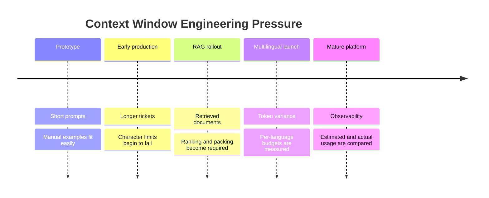

# Tokenization & Text Processing

> **Complexity**: `[MEDIUM]`
>
> **Time to Complete**: 55-75 minutes
>
> **Prerequisites**: Basic Python, JSON, command-line execution, and a beginner understanding of generative AI prompts.
>
> **Track**: AI/ML Engineering - Generative AI Foundations

---

## Learning Outcomes

By the end of this module, learners will be able to:

- **Diagnose** token boundary failures in prompts that contain numbers, code, multilingual text, or copied production data.
- **Compare** Byte-Pair Encoding, WordPiece, and SentencePiece tokenization strategies against real engineering trade-offs.
- **Implement** a local token measurement workflow that estimates cost, context usage, and truncation risk before an API request is sent.
- **Design** token-aware RAG and chat-memory pipelines that respect strict context budgets while preserving the most useful information.
- **Evaluate** prompt formatting choices by balancing token savings against reliability, readability, and downstream model behavior.

---

## Why This Module Matters

A support automation team ships a retrieval system that summarizes customer incidents from logs, tickets, and translated chat messages. The prototype works in demos because the sample tickets are short, English-only, and carefully edited. In production, the same system receives stack traces, pasted JSON, invoice numbers, Japanese messages, copied table data, and long conversation histories. The application begins failing with context-limit errors, monthly inference cost climbs faster than usage, and some numerical summaries become subtly wrong.

The team originally treated tokenization as a hidden implementation detail. Their monitoring counted characters, not tokens. Their prompt templates looked compact to humans but expanded badly once code blocks, whitespace, and non-English scripts were included. Their RAG packer appended documents until a character limit was reached, which meant a short-looking payload could still exceed the model's real budget. Nothing in the user interface made the failure obvious; the model simply received less useful context than expected.

Tokenization is the perceptual boundary between text and a language model. A model does not process "words" in the way humans do, and it does not see a JSON document, a number, or a sentence as a single semantic unit unless the tokenizer happens to encode it that way. Production engineers who understand tokenization can predict cost, control context usage, design safer truncation logic, and recognize when a model's strange behavior is partly caused by how the input was split before inference began.

---

## Section 1: Text Becomes Model Input Only After Tokenization

The first practical shift is to stop thinking of prompts as strings and start thinking of them as sequences of integer identifiers. A tokenizer maps raw text into tokens, and each token maps to an integer in a vocabulary. The model receives those integers, not the original characters. The original text matters because it determines the token sequence, but the model's computation happens over token IDs and learned embeddings.

A token is usually smaller than a word but larger than a character. Common words may fit into one token, common word fragments may become reusable tokens, and rare strings may break into several smaller units. This design is a compromise. Character-level processing can represent almost anything, but it makes sequences long. Word-level processing keeps sequences shorter, but it cannot gracefully represent new words, typos, product names, and mixed-language text. Subword tokenization sits between those extremes.

```text
+-----------------------------+      +-------------------------+      +----------------------+
| Raw text                    |      | Tokenizer               |      | Model input          |
| "Tokenization matters."     | ---> | split + vocabulary map  | ---> | [token_id sequence]  |
+-----------------------------+      +-------------------------+      +----------------------+
```

A simple English phrase can show the idea without hiding the mechanism. The string `Hello, world!` is not necessarily treated as two words. A tokenizer might split it into tokens such as `Hello`, `,`, ` world`, and `!`. Notice that the second word can include the leading space. Many modern tokenizers learn tokens that include spaces because the space is a useful signal about word boundaries.

```text
Text:     "Hello, world!"
Tokens:   ["Hello", ",", " world", "!"]
Meaning:  A short greeting, represented as four model-visible units.
```

Tokenization is exact-string sensitive. The strings `hello world`, `Hello world`, `Hello  world`, and `Helloworld` may look related to a human, but each can produce a different token sequence. This matters when prompts are generated from templates, logs, user input, or database records. A small formatting change may alter both cost and behavior because the model receives a different sequence of learned units.

```text
"Hello world"     -> likely compact because the phrase is common
"Hello  world"    -> extra whitespace may create different boundaries
"Helloworld"      -> the missing space changes the learned fragments
"HELLO WORLD"     -> capitalization can split into less common pieces
```

> **Active learning prompt**: Before checking a tokenizer, predict which string is likely to use more tokens: `error_count` or `error count`. The correct answer depends on the vocabulary, but the reasoning matters more than the guess. Identifiers, underscores, and casing often behave differently from ordinary prose.

A token boundary is not a semantic boundary. The token `ing` might appear at the end of many unrelated words, and a product name might split into fragments that carry no useful meaning alone. Models learn patterns over these fragments during training, but the fragments are not guaranteed to align with grammar, business concepts, or application fields. Engineering pipelines that assume token boundaries equal word boundaries often fail in subtle ways.

Numbers are a frequent source of confusion because they look atomic to humans. A human sees `3789` as one number. A tokenizer may split it into `37` and `89`, or some other combination depending on the vocabulary. A language model can still reason about numbers in many cases, but it must reconstruct the numerical meaning from token fragments. For exact arithmetic, invoice identifiers, account numbers, and safety-critical values, downstream validation remains necessary.

```text
User-visible value:        3789
Possible token fragments:  ["37", "89"]
Engineering implication:   exact numeric handling should not rely on generation alone.
```

Code is token dense because programming languages contain punctuation, indentation, casing conventions, operators, file paths, and identifiers. Fifty characters of English prose may be relatively cheap, while fifty characters of stack trace or minified code can be expensive. This is one reason log analyzers, code assistants, and automated incident summarizers need token budgets from the beginning rather than after the first unexpectedly large bill.

```python
def add_tax(price, rate):
    return price * (1 + rate)
```

The code above is small, but it contains parentheses, commas, indentation, operators, and variable names. Each part can influence token boundaries. In a production incident tool, a single stack trace may contain hundreds of lines with file paths, line numbers, nested exceptions, and repeated boilerplate. The token cost of that payload is often higher than the visible size suggests.

Multilingual input adds another layer because tokenizers reflect the data and design choices used during training. English text is often highly optimized in models trained heavily on English web data. Other scripts may require more tokens for the same meaning, especially when the tokenizer falls back to smaller fragments or byte-level representations. A global product should measure token usage for its actual supported languages, not estimate every market from English examples.

```text
English:   "Where is the station?"
French:    "Où est la gare ?"
Japanese:  "駅はどこですか？"
Arabic:    "أين المحطة؟"
```

The lesson is not that one language is worse than another. The lesson is that token budgets are model-specific and language-specific. A team that builds a multilingual assistant should collect token measurements during design, not after launch. This measurement belongs next to latency, accuracy, and cost because it directly changes all three.

---

## Section 2: How Tokenizers Learn Useful Fragments

Most modern language-model tokenizers are trained from large text corpora. They do not start with a human-written dictionary of every possible word. Instead, they learn reusable fragments that make the training data efficient to represent. The details vary by algorithm, but the shared goal is to represent frequent strings compactly while still allowing rare or unseen strings to be encoded.

Byte-Pair Encoding, usually shortened to BPE, is one of the most important ideas behind modern subword tokenization. A BPE-style tokenizer starts with very small pieces, then repeatedly merges frequent neighboring pieces. If `l` and `o` often appear together, they may merge into `lo`. If `lo` and `w` often appear together, they may merge into `low`. Over many iterations, frequent words and fragments become single tokens.

```text
Training sketch for one word:

Start:       l   o   w   e   r
Merge 1:     lo  w   e   r
Merge 2:     low e   r
Merge 3:     low er
Possible:    lower
```

This toy sequence is simplified, but it captures the engineering intuition. BPE rewards frequency. A common word, phrase fragment, or coding pattern may become compact. A rare product name, typo, or mixed-case identifier may fragment. This explains why tokenization can feel inconsistent when two strings look similarly long to a human but appeared at different frequencies in the tokenizer's training data.

WordPiece is similar in spirit but uses a different scoring method for choosing merges. It is commonly associated with BERT-style models and often marks continuation fragments with a prefix such as `##`. That prefix is not decoration; it tells the tokenizer and downstream processing that the fragment continues a word rather than beginning one. This makes it easier to reconstruct word-like structure during certain natural language processing tasks.

```text
WordPiece-style example:

"playing"      -> ["play", "##ing"]
"unplayed"     -> ["un", "##play", "##ed"]
"play"         -> ["play"]
```

SentencePiece approaches the problem from a different angle by treating input as raw text rather than requiring a separate pre-tokenization step. It can encode whitespace as a normal symbol, often shown as `▁`. This is useful for multilingual systems because not every language uses spaces the same way English does. SentencePiece is common in models that need robust behavior across many scripts and writing systems.

```text
SentencePiece-style example:

"Hello world"  -> ["▁Hello", "▁world"]
"New York"     -> ["▁New", "▁York"]
```

| Algorithm | Common use | Key idea | Practical engineering consequence |
|---|---|---|---|
| BPE | Many generative language models | Merge frequent neighboring fragments | Common strings are compact, rare strings may fragment unexpectedly |
| WordPiece | BERT-style encoders and classic NLP systems | Merge fragments by likelihood improvement with continuation markers | Useful for word-like analysis, but token boundaries still differ from human words |
| SentencePiece | Multilingual and raw-text tokenization | Treat whitespace as a normal symbol and avoid language-specific pre-splitting | Strong fit for mixed scripts and languages without whitespace-separated words |

A tokenizer's vocabulary is a compression scheme and a modeling interface at the same time. When a string is represented compactly, the model has fewer sequence positions to process and may have seen that unit often during training. When a string fragments heavily, the model has more positions to process and must combine more pieces to recover meaning. This does not automatically make the output wrong, but it increases the burden on the model and the application.

> **Active learning prompt**: A team finds that `CustomerID` is cheaper than `customer_identifier` for its target model. Should the team rename every field to save tokens? Decide what else must be checked before making that change in a production prompt schema.

The correct engineering answer is usually conditional. Token savings are useful, but field names also carry meaning. If shorter names make the prompt ambiguous, model quality may drop. If the prompt is consumed by both humans and automated validators, readability and schema stability matter. Token optimization is a design trade-off, not a contest to make every string as short as possible.

A worked example makes this trade-off concrete. Imagine a system prompt that includes field descriptions for an incident triage assistant. The verbose schema is easy to read, but it repeats long field names on every request. The compact schema saves tokens, but it requires a stable mapping between short keys and their meaning. The better design may keep compact keys in payloads while documenting the mapping once in the system instructions.

```json
{
  "customer_identifier": "acme-prod-1826",
  "incident_severity": "high",
  "observed_error_message": "database timeout after retry budget exhausted"
}
```

```json
{"cid":"acme-prod-1826","sev":"high","err":"database timeout after retry budget exhausted"}
```

The compact version is not automatically better. It may save tokens across thousands of requests, but it also hides meaning from anyone reading logs and may reduce model reliability if the abbreviations are not explained. A senior engineering approach measures the savings, tests the effect on output quality, and chooses a schema that serves the application rather than the tokenizer alone.

---

## Section 3: Measuring Tokens, Cost, and Context Pressure

Tokenization must be measured with the tokenizer used by the target model or a close documented approximation. Character counts are useful for user-interface limits, but they are not reliable for context windows. A payload with many ASCII letters, a payload with dense JSON, and a payload with Japanese text can have very different token counts even if their character lengths are similar. The safest production habit is to count tokens before constructing or sending a request.

The following Python script uses `tiktoken` with a named encoding. It is intentionally local and repeatable. The goal is not to memorize a specific count, because tokenizer libraries and model mappings can change over time. The goal is to build the habit of measuring real strings from the application rather than guessing from a rule of thumb.

```python
import tiktoken

encoding = tiktoken.get_encoding("cl100k_base")

samples = [
    "Hello, world!",
    "Hello  world!",
    "customer_identifier",
    "customer identifier",
    "駅はどこですか？",
]

for text in samples:
    token_ids = encoding.encode(text)
    pieces = [encoding.decode([token_id]) for token_id in token_ids]
    print(f"{text!r}")
    print(f"  token_count={len(token_ids)}")
    print(f"  pieces={pieces}")
```

A rule of thumb such as "one token is about four English characters" can be helpful for rough planning, but it is not a control mechanism. Rules of thumb fail with code, tables, Unicode text, generated identifiers, and minified data. Production systems need actual measurement at the point where prompts are assembled. That means token counting belongs in prompt builders, RAG packers, chat-memory managers, and cost estimation tools.

Cost has two token dimensions: input tokens and output tokens. Input tokens include system instructions, user messages, retrieved context, tool results, and any conversation history sent with the request. Output tokens are generated by the model. The price per token depends on the provider and model, so durable curriculum should teach the formula rather than hard-code a rate that will become stale.

| Quantity | What it includes | Why it matters | Control strategy |
|---|---|---|---|
| System tokens | Repeated instructions, role definitions, formatting rules | Paid on every stateless request where included | Keep concise, version prompts, batch when appropriate |
| User tokens | Current user request and attached user data | Varies by workload and product surface | Validate size and normalize noisy input |
| Context tokens | Retrieved documents, logs, summaries, tool outputs | Often the largest hidden cost in RAG systems | Rank, deduplicate, chunk, and pack by token budget |
| Output tokens | Model-generated answer, code, JSON, or explanation | Can dominate cost when responses are long | Set output limits and ask for the needed format directly |

A useful cost estimator separates rates from logic. The application should accept a pricing configuration, calculate expected cost from measured tokens, and reject or reshape requests that exceed budget. The code below is deliberately simple, but it shows the core control point. Real systems would also record the estimate, the actual usage reported by the provider, and any truncation decisions made by the prompt builder.

```python
from dataclasses import dataclass

@dataclass(frozen=True)
class TokenPrice:
    input_per_million: float
    output_per_million: float

def estimate_cost(input_tokens: int, output_tokens: int, price: TokenPrice) -> float:
    input_cost = input_tokens * price.input_per_million / 1_000_000
    output_cost = output_tokens * price.output_per_million / 1_000_000
    return input_cost + output_cost

example_price = TokenPrice(input_per_million=2.00, output_per_million=8.00)
print(round(estimate_cost(12_000, 900, example_price), 6))
```

Formatting choices can produce meaningful savings, especially when the same structure is sent repeatedly. Pretty-printed JSON costs extra tokens because indentation, newlines, and spaces are still text. Minified JSON is usually cheaper for the model to ingest. However, minification is most valuable when the structured wrapper is a meaningful share of the prompt. If a request contains a ten-page document, saving a handful of whitespace tokens in the wrapper may not change the total cost much.

```python
import json
import tiktoken

encoding = tiktoken.get_encoding("cl100k_base")

payload = {
    "user_id": 38162,
    "plan": "enterprise",
    "features": ["audit_logs", "single_sign_on", "priority_support"],
    "limits": {"projects": 120, "members": 900},
}

pretty = json.dumps(payload, indent=2)
compact = json.dumps(payload, separators=(",", ":"))

for label, text in [("pretty", pretty), ("compact", compact)]:
    print(label, len(encoding.encode(text)))
```

> **Active learning prompt**: A prompt contains a 9,000-token policy document and a 90-token JSON wrapper. If minifying the wrapper saves 30 tokens, is that optimization worth prioritizing first? Explain the decision in terms of total cost, engineering effort, and risk to readability.

The most valuable optimizations usually target repeated or dominant token sources. A short system prompt that is repeated millions of times can matter more than a long document processed once. A large retrieved context block can matter more than a few polite words in the user instruction. A production team should profile token sources the same way it profiles CPU usage: measure first, optimize the hot path, and avoid clever changes that make behavior harder to reason about.

Context windows add another constraint. A model may support a large maximum context, but that does not mean every request should fill it. Larger inputs can increase cost, latency, and the chance that important details are diluted by irrelevant text. Token-aware systems treat the context window as a budget to allocate. The application decides which information earns space in the prompt, which information is summarized, and which information is excluded.



The timeline is not about memorizing model release history. It is about recognizing how context pressure appears as systems mature. The first demo usually fits. The first real customer dataset often does not. Teams that instrument token usage early can evolve from manual prompt trimming to repeatable context management before failures become expensive.

---

## Section 4: Edge Cases That Break Naive Text Processing

Tokenization edge cases are not rare corner trivia; they are ordinary production inputs. Logs contain paths and stack traces. Finance documents contain long numbers and tables. Global products contain mixed scripts. Users paste malformed JSON, copied spreadsheets, and messages with unusual whitespace. The model may handle many of these inputs well, but the application must not assume they have the same token behavior as clean English sentences.

Whitespace is a structural tokenization input. Leading spaces, repeated spaces, tabs, and newlines can all affect token boundaries. This is especially important in prompts that include code, YAML, Markdown, or copied terminal output. Removing all whitespace may damage meaning, but preserving every accidental space can waste context. The engineering task is to normalize safely: preserve semantic whitespace while removing accidental or redundant formatting.

```text
Possible normalization decisions:

Keep indentation in code blocks because it changes Python meaning.
Keep line breaks in stack traces because they preserve call order.
Collapse repeated blank lines in user prose because they rarely add meaning.
Minify machine-readable JSON only when downstream readability is not required.
```

Capitalization and casing also matter. A tokenizer may encode `Kubernetes`, `kubernetes`, and `KUBERNETES` differently. Mixed-case identifiers such as `PodSecurityPolicy`, `customerID`, and `HTTPRequestTimeout` can split in surprising places. This does not mean identifiers must be renamed, but it does mean generated prompt schemas should be tested rather than assumed cheap.

Numbers deserve special care because tokenization can separate their visual representation from their mathematical meaning. A model that summarizes `20260426`, `8356`, or `1000000` may not process each as a single unit. For exact calculations, production systems should use deterministic code and then ask the model to explain or format the result. For extraction, the system should validate generated numbers against the source text before presenting them as facts.

```python
import re

def extract_amounts(text: str) -> list[str]:
    return re.findall(r"\b\d+(?:\.\d+)?\b", text)

source = "Invoice 1826 totals 8356 USD after discount."
model_summary = "The invoice total is 8346 USD."

source_numbers = set(extract_amounts(source))
summary_numbers = set(extract_amounts(model_summary))

unexpected = summary_numbers - source_numbers
print(f"Unexpected numbers: {sorted(unexpected)}")
```

The script above does not solve every numerical reasoning problem, but it demonstrates a reliable pattern. Let deterministic code handle exact validation. Let the model handle language tasks where approximate semantic reasoning is useful. A senior production design does not ask tokenization to become perfect; it adds checks around known weak points.

Unicode text introduces another source of hidden complexity. Modern systems commonly use UTF-8, which represents characters as one or more bytes. Some tokenizers operate partly at the byte level, which helps them encode almost any text but can make certain scripts or symbols expand into more tokens. This is one reason the same semantic sentence can have different token costs across languages.

```text
Character examples in UTF-8:

A      -> one byte in UTF-8
é      -> two bytes in UTF-8
中     -> three bytes in UTF-8
Ж      -> two bytes in UTF-8
```

Encoding and tokenization are different layers. Encoding turns text into bytes so computers can store and transmit it. Tokenization turns text or bytes into model vocabulary units. When systems mix encodings incorrectly, the text can become garbled before tokenization even starts. When tokenization is inefficient for a script, the text may remain readable but consume more context than expected.

> **Active learning prompt**: A Japanese support ticket is visually shorter than its English translation but uses more tokens in the target tokenizer. What should the product team change: the language, the model, the budget, or the measurement process? Justify the answer as an engineering decision rather than a preference.

The strongest answer starts with measurement and user requirements. The team should not force users into a different language merely to reduce cost. It should measure per-language token usage, choose a model and tokenizer appropriate for supported markets, and set budgets that reflect real input distributions. If the product promises multilingual support, the architecture must budget for multilingual text.

Some strings can trigger anomalous behavior because they correspond to unusual or poorly learned tokens. Researchers have documented cases where rare tokens caused models to respond strangely. These cases are not everyday failures, but they are useful reminders that tokenization is part of the model's learned interface. Security and reliability testing should include unusual strings, generated identifiers, repeated fragments, and data copied from real systems.

A robust prompt pipeline treats text processing as a staged system rather than a single concatenation operation. It normalizes where safe, preserves where meaning depends on formatting, counts tokens with the target tokenizer, validates high-risk fields, and records what was sent. This staged design makes failures explainable. When a request is too large or a value is altered, engineers can inspect each stage instead of guessing what happened inside the model.

---

## Section 5: Designing Token-Aware RAG and Conversation Pipelines

Retrieval-Augmented Generation systems fail when they retrieve useful documents but pack them into the prompt carelessly. The retriever might return ten relevant chunks, but the context window may only have space for five after the system prompt, user query, tool instructions, and output reserve are considered. A token-aware RAG builder must allocate budget before appending documents. It should not simply concatenate strings until the provider rejects the request.

```text
+------------------+      +-------------------+      +----------------------+
| User question    | ---> | Retrieve chunks   | ---> | Token-aware packing  |
+------------------+      +-------------------+      +----------------------+
                                                              |
                                                              v
                                                   +----------------------+
                                                   | Final prompt budget  |
                                                   | system + query       |
                                                   | docs + output reserve|
                                                   +----------------------+
```

The output reserve is easy to forget. If a model's context window is treated entirely as input space, the request may leave too little room for the answer. A summarizer, code generator, or incident analyst needs an explicit maximum output budget. The input packer should subtract that reserve before selecting context. This is a design requirement, not a cosmetic implementation detail.

A worked RAG packer can be small and still demonstrate the correct control flow. The function below starts with the fixed prompt parts, reserves room for output, sorts retrieved documents by score, and appends only the documents that fit. It also returns metadata so the caller can log which documents were included and which were skipped. Production systems should make these decisions observable.

```python
from dataclasses import dataclass
import tiktoken

encoding = tiktoken.get_encoding("cl100k_base")

@dataclass(frozen=True)
class RetrievedDoc:
    doc_id: str
    score: float
    text: str

def count_tokens(text: str) -> int:
    return len(encoding.encode(text))

def build_rag_prompt(
    question: str,
    docs: list[RetrievedDoc],
    max_context_tokens: int,
    output_reserve_tokens: int,
) -> tuple[str, list[str], list[str]]:
    header = (
        "Answer the question using only the provided context.\n"
        "If the context is insufficient, say what is missing.\n\n"
        f"Question: {question}\n\n"
        "Context:\n"
    )

    budget = max_context_tokens - output_reserve_tokens
    used = count_tokens(header)
    included: list[str] = []
    skipped: list[str] = []
    prompt = header

    for doc in sorted(docs, key=lambda item: item.score, reverse=True):
        block = f"[{doc.doc_id}]\n{doc.text}\n\n"
        block_tokens = count_tokens(block)

        if used + block_tokens > budget:
            skipped.append(doc.doc_id)
            continue

        prompt += block
        used += block_tokens
        included.append(doc.doc_id)

    return prompt, included, skipped
```

This design is intentionally conservative. It does not split a document halfway through a sentence. It does not assume all retrieved chunks deserve equal space. It reserves output budget before packing context. It returns skip metadata instead of silently dropping documents. These choices make the system easier to test and debug when a user asks why a source was or was not used.

Conversation memory has a related but different problem. Chat history grows every turn, and stateless API calls often resend some or all previous messages. A naive assistant appends every message forever until the request fails. A better assistant keeps recent messages verbatim, summarizes older turns, and preserves durable facts separately. The goal is not to remember everything; the goal is to preserve the information needed for the next useful response.

```text
Conversation memory tiers:

Recent turns        -> keep verbatim because wording and immediate intent matter.
Older discussion    -> summarize because exact phrasing is usually less important.
Durable facts       -> store separately because they should survive summarization.
Tool outputs        -> keep references or summaries rather than full repeated payloads.
```

A token-aware memory manager should also record how much budget each tier consumes. If the summary grows too large, it needs to be compressed again. If tool outputs dominate the prompt, they need chunking or references. If recent conversation leaves no room for retrieved evidence, the application must decide which information has priority. These are product and architecture decisions expressed through token budgets.

Prompt optimization becomes dangerous when it removes the very information the model needs to behave correctly. Shorter prompts are not always better. A clear instruction that prevents hallucinated citations may be worth its tokens. A compact field name that confuses the model may cost more in quality than it saves in money. A token-aware engineer optimizes after defining success metrics, not before.

| Optimization | When it helps | When it hurts | Better engineering check |
|---|---|---|---|
| Minify JSON | Structured data is repeated often and humans do not need to read the prompt | Logs become hard to debug or field meaning becomes unclear | Compare token savings with output quality and observability needs |
| Shorten system prompt | Instructions contain redundant politeness or repeated boilerplate | Safety, format, or domain constraints become ambiguous | Run regression prompts before and after the change |
| Truncate documents | Retrieved chunks exceed the available context budget | Important evidence appears near the end of a document | Chunk documents semantically before retrieval |
| Abbreviate field names | Schema is stable and mappings are documented in prompt instructions | Abbreviations create ambiguity or collide across domains | Validate with representative examples and human review |
| Summarize chat history | Older turns are useful but too large to resend verbatim | Summary loses commitments, preferences, or constraints | Store durable facts separately from narrative summaries |

The senior-level lesson is that tokenization turns prompt construction into resource allocation. Tokens are not merely billing units; they are the limited working space where instructions, evidence, memory, and output all compete. A good architecture makes those trade-offs explicit. It measures token usage, keeps high-value context, rejects or reshapes oversized inputs, and validates outputs where token boundaries create known risk.

---

## Did You Know?

1. **Subword tokenization was a major breakthrough for rare words**: Instead of treating every unseen word as unknown, subword methods can compose rare words from smaller learned fragments.
2. **Whitespace can be part of a token**: Many tokenizers learn fragments that include leading spaces, which is why `world` and ` world` can be different vocabulary entries.
3. **Token counting is model-specific**: Two models can tokenize the same string differently, so a count from one tokenizer should not be treated as a universal truth.
4. **Context windows are shared budgets**: System instructions, user input, retrieved evidence, chat history, tool outputs, and generated answers all compete for the same limited sequence space.

---

## Common Mistakes

| Mistake | Why it happens | How to fix |
|---|---|---|
| Using character limits as context limits | Characters feel easy to count, but token density changes across code, JSON, numbers, and languages. | Count tokens with the target model's tokenizer before sending or truncating a request. |
| Treating token boundaries as word boundaries | Subword tokenizers split text according to learned vocabulary frequency, not grammar or business meaning. | Perform word-level or field-level logic on the original text, then tokenize only for model input budgeting. |
| Ignoring output reserve | Teams pack the input until it nearly fills the context window, then leave too little room for the model's answer. | Subtract a deliberate output budget before selecting retrieved documents or chat history. |
| Minifying everything without testing quality | Token savings are visible immediately, while ambiguity and debugging cost appear later. | Measure quality on representative prompts after every formatting optimization. |
| Sending full chat history forever | Early demos are short, so the failure only appears after real users have long sessions. | Use recent-turn windows, rolling summaries, and durable fact storage with measured token budgets. |
| Assuming English token ratios apply globally | Many teams prototype in English and launch multilingual support without measuring real market inputs. | Profile token counts for each supported language and script before setting budgets. |
| Trusting generated numbers without validation | Large or unusual numbers may split into fragments, and language models are not deterministic calculators. | Extract and validate critical numbers with deterministic code before displaying or acting on them. |

---

## Quiz

<details>
<summary><strong>Question 1: A team builds a log summarizer that worked in testing but becomes expensive in production. Real users paste stack traces, file paths, JSON payloads, and error tables. What should the team inspect first, and why?</strong></summary>

The team should inspect token counts by payload type using the tokenizer for the target model. Stack traces, file paths, JSON, and tables are usually token dense because punctuation, identifiers, indentation, and repeated structure add many model-visible units. Character counts may hide the problem. The practical fix is to profile token usage, normalize safely, remove repeated boilerplate, and pack only the highest-value evidence into each request.

</details>

<details>
<summary><strong>Question 2: A RAG pipeline truncates retrieved context at 80,000 characters, but some requests still fail with context-limit errors. The failures mostly involve code snippets and multilingual documents. What design flaw caused the issue?</strong></summary>

The pipeline uses a character budget instead of a token budget. Code and multilingual text can consume far more tokens per character than simple English prose. The RAG builder should count tokens after prompt assembly, subtract an output reserve, and append retrieved chunks only while the measured token count remains under the model's limit. The fix belongs in the context-packing logic, not in a larger character limit.

</details>

<details>
<summary><strong>Question 3: A finance assistant summarizes reports accurately in prose but occasionally changes long invoice numbers. The source text is clean, and the mistake appears only in generated summaries. What should the application do before presenting the answer?</strong></summary>

The application should validate critical numbers deterministically against the source text. Tokenization can split long numbers into fragments, and language models should not be treated as exact transcription engines for high-risk values. A safer design extracts source numbers with code, compares generated numbers against the extracted set, and either corrects, flags, or blocks the answer when unexpected values appear.

</details>

<details>
<summary><strong>Question 4: A product manager asks engineers to abbreviate every prompt field because token cost is high. The proposed schema changes `customer_identifier` to `cid`, `incident_severity` to `sev`, and `observed_error_message` to `err`. How should the team evaluate the proposal?</strong></summary>

The team should measure token savings and test output quality before adopting the change. Abbreviations can reduce repeated payload cost, especially at scale, but they can also reduce clarity for the model, humans debugging logs, and downstream validators. A balanced design may use compact keys only when the system prompt defines them clearly and regression tests show that model behavior remains reliable.

</details>

<details>
<summary><strong>Question 5: A multilingual assistant launches in Japanese after being tested mostly in English. Usage volume is similar, but requests become slower and more expensive. What should engineers add to their observability and budgeting process?</strong></summary>

Engineers should add per-language token measurement and compare estimated tokens with provider-reported usage. The same semantic content can require different token counts depending on script, tokenizer, and model family. The product should budget based on real supported-language distributions, not English-only estimates. If token pressure remains high, the team can evaluate a model with a tokenizer better suited to the target languages.

</details>

<details>
<summary><strong>Question 6: A chat assistant resends the full conversation on every turn. After long sessions, answers become slower, more expensive, and less grounded in the newest user question. What memory strategy should replace the naive design?</strong></summary>

The assistant should separate memory into recent verbatim turns, summarized older discussion, durable facts, and selected tool outputs. Recent turns preserve immediate intent, while older turns can often be compressed. Durable facts should be stored separately so they survive summarization. The prompt builder should measure each tier and allocate token budget deliberately instead of letting history grow without control.

</details>

<details>
<summary><strong>Question 7: A developer minifies a JSON payload and saves tokens, but incident responders complain that prompt logs are now hard to interpret. The model's answers also become slightly less consistent because field names were shortened aggressively. What is the better production approach?</strong></summary>

The better approach is to treat token optimization as a tested design change rather than a blanket rule. The team can minify machine-readable payloads where readability is not needed, keep clear field names when they improve model reliability, and log a human-readable decoded version separately if necessary. The decision should be based on measured savings, regression prompts, and operational debugging needs.

</details>

---

## Hands-On Exercise: Build a Token-Aware Prompt Packer

In this lab, learners will build a local Python tool that measures token counts, compares formatting choices, and packs retrieved documents under a strict context budget. The exercise mirrors the production pattern from the module: measure first, reserve output space, include the highest-value context, and record what was skipped. The goal is not to memorize exact token counts. The goal is to build a repeatable workflow that exposes token pressure before an API request is made.

### Setup

Run the exercise from the repository root or any directory that already has access to the KubeDojo Python virtual environment. The commands use `.venv/bin/python` explicitly so the same interpreter runs installation and execution.

```bash
mkdir -p token-lab
cd token-lab
../.venv/bin/python -m pip install --upgrade tiktoken
```

Create a file named `token_packer.py`.

```python
from dataclasses import dataclass
import json
import re
import tiktoken

encoding = tiktoken.get_encoding("cl100k_base")

def count_tokens(text: str) -> int:
    return len(encoding.encode(text))

def token_pieces(text: str) -> list[str]:
    return [encoding.decode([token_id]) for token_id in encoding.encode(text)]

@dataclass(frozen=True)
class RetrievedDoc:
    doc_id: str
    score: float
    text: str
```

### Task 1: Inspect Token Boundaries

Add code that prints token pieces for ordinary prose, an identifier, a long number, and a multilingual sentence. The purpose is to see that visually similar strings can become different model inputs.

```python
def inspect_examples() -> None:
    examples = [
        "Hello, world!",
        "customer_identifier",
        "Invoice 1826 totals 8356 USD.",
        "駅はどこですか？",
    ]

    for text in examples:
        print(f"\n{text!r}")
        print(f"token_count={count_tokens(text)}")
        print(f"pieces={token_pieces(text)}")
```

Run the file after adding a temporary main block.

```python
if __name__ == "__main__":
    inspect_examples()
```

Success criteria:

- [ ] The script runs with `../.venv/bin/python token_packer.py` without import errors.
- [ ] The output shows a token count for each sample string.
- [ ] The output prints token pieces, making at least one non-word-like split visible.
- [ ] The learner can explain why the long number should be validated by code in a production workflow.

### Task 2: Compare Pretty and Compact JSON

Extend the file with a function that compares pretty-printed JSON against compact JSON. The payload is intentionally small so the learner can see the effect of formatting without needing a large dataset.

```python
def compare_json_formats() -> None:
    payload = {
        "customer_identifier": "acme-prod-1826",
        "incident_severity": "high",
        "observed_error_message": "database timeout after retry budget exhausted",
        "affected_services": ["checkout", "billing", "notification"],
    }

    pretty = json.dumps(payload, indent=2)
    compact = json.dumps(payload, separators=(",", ":"))

    pretty_tokens = count_tokens(pretty)
    compact_tokens = count_tokens(compact)
    saved = pretty_tokens - compact_tokens
    percent = saved / pretty_tokens * 100 if pretty_tokens else 0

    print("\nJSON comparison")
    print(f"pretty_tokens={pretty_tokens}")
    print(f"compact_tokens={compact_tokens}")
    print(f"saved_tokens={saved}")
    print(f"saved_percent={percent:.1f}")
```

Update the main block so both inspection functions run.

```python
if __name__ == "__main__":
    inspect_examples()
    compare_json_formats()
```

Success criteria:

- [ ] The script prints token counts for both pretty and compact JSON.
- [ ] The compact JSON count is lower than or equal to the pretty JSON count.
- [ ] The script prints both saved token count and saved percentage.
- [ ] The learner can state when minifying JSON is worth prioritizing and when it is not.

### Task 3: Validate Generated Numbers Against Source Text

Add a deterministic validator that compares numbers in a source document with numbers in a generated summary. This step turns the tokenization lesson into a reliability control.

```python
def extract_numbers(text: str) -> set[str]:
    return set(re.findall(r"\b\d+(?:\.\d+)?\b", text))

def validate_numbers(source: str, generated: str) -> list[str]:
    source_numbers = extract_numbers(source)
    generated_numbers = extract_numbers(generated)
    return sorted(generated_numbers - source_numbers)

def demonstrate_number_validation() -> None:
    source = "Invoice 1826 totals 8356 USD after applying discount 120."
    generated = "Invoice 1826 totals 8346 USD after applying discount 120."

    unexpected = validate_numbers(source, generated)

    print("\nNumber validation")
    print(f"unexpected_numbers={unexpected}")
```

Update the main block again.

```python
if __name__ == "__main__":
    inspect_examples()
    compare_json_formats()
    demonstrate_number_validation()
```

Success criteria:

- [ ] The script detects `8346` as an unexpected generated number.
- [ ] The validation logic operates on original text rather than token pieces.
- [ ] The learner can explain why token counting and deterministic validation solve different problems.
- [ ] The learner can identify at least one production domain where this validation would be required.

### Task 4: Implement a Token-Aware RAG Packer

Now add the RAG prompt builder. It must reserve output space before adding documents and return both included and skipped document IDs. The function should pack by retrieval score so the highest-value documents get priority.

```python
def build_rag_prompt(
    question: str,
    docs: list[RetrievedDoc],
    max_context_tokens: int,
    output_reserve_tokens: int,
) -> tuple[str, list[str], list[str]]:
    header = (
        "Answer using only the provided context.\n"
        "If the context is insufficient, say what is missing.\n\n"
        f"Question: {question}\n\n"
        "Context:\n"
    )

    input_budget = max_context_tokens - output_reserve_tokens
    used = count_tokens(header)
    included: list[str] = []
    skipped: list[str] = []
    prompt = header

    for doc in sorted(docs, key=lambda item: item.score, reverse=True):
        block = f"[{doc.doc_id}]\n{doc.text}\n\n"
        block_tokens = count_tokens(block)

        if used + block_tokens > input_budget:
            skipped.append(doc.doc_id)
            continue

        prompt += block
        used += block_tokens
        included.append(doc.doc_id)

    return prompt, included, skipped

def demonstrate_rag_packing() -> None:
    docs = [
        RetrievedDoc("runbook", 0.95, "Restart workers only after the queue drains. " * 12),
        RetrievedDoc("logs", 0.90, "Timeout observed in checkout after database retry budget exhausted. " * 16),
        RetrievedDoc("history", 0.65, "A similar incident occurred after a schema migration. " * 14),
        RetrievedDoc("noise", 0.20, "General onboarding notes for unrelated services. " * 18),
    ]

    prompt, included, skipped = build_rag_prompt(
        question="Why is checkout timing out?",
        docs=docs,
        max_context_tokens=220,
        output_reserve_tokens=60,
    )

    print("\nRAG packing")
    print(f"final_prompt_tokens={count_tokens(prompt)}")
    print(f"included={included}")
    print(f"skipped={skipped}")
```

Update the main block one final time.

```python
if __name__ == "__main__":
    inspect_examples()
    compare_json_formats()
    demonstrate_number_validation()
    demonstrate_rag_packing()
```

Success criteria:

- [ ] The final prompt token count stays under the input budget implied by `max_context_tokens - output_reserve_tokens`.
- [ ] At least one retrieved document is skipped when the budget is tight.
- [ ] Included documents are selected by score order rather than original list order.
- [ ] The script prints enough metadata to explain which context entered the prompt.
- [ ] The learner can describe why reserving output tokens prevents a different class of context-window failure.

### Task 5: Reflect on the Architecture

Write a short note beside the script or in a lab notebook explaining the design choices. The note should connect tokenization mechanics to production behavior rather than restating definitions.

Success criteria:

- [ ] The note identifies one input type that is likely to be token dense in the learner's own environment.
- [ ] The note explains one case where saving tokens could reduce model quality or operational debuggability.
- [ ] The note names one value that should be validated with deterministic code instead of trusting generated text.
- [ ] The note proposes one metric that should be logged in a production token-aware prompt pipeline.

---

## Next Module

Next: [Text Generation & Sampling Strategies](/ai-ml-engineering/generative-ai/module-1.3-text-generation-sampling-strategies/)

The next module moves from how text enters a language model to how responses are generated one token at a time. It covers probability distributions, decoding strategies, temperature, top-p sampling, determinism, and the engineering controls that shape model output.

## Sources

- [Neural Machine Translation of Rare Words with Subword Units](https://arxiv.org/abs/1508.07909) — Classic paper explaining why subword tokenization and BPE-style segmentation matter.
- [OpenAI API Pricing](https://openai.com/api/pricing/) — Current official pricing page for validating any cost examples in the module.
