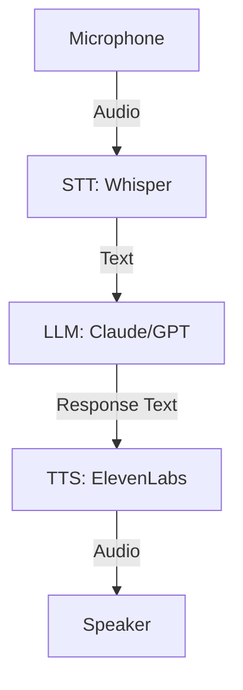

# Voice & Audio AI: Teaching Computers to Listen

**Reading Time**: 6-7 hours
**Prerequisites**: Phase 4 complete, Kubernetes v1.35+ knowledge for deployment scenarios.

## Why This Module Matters

In early 2021, a major European telecommunications provider deployed a legacy rule-based Interactive Voice Response (IVR) system to handle 150,000 daily customer support calls. The system was designed to route calls based on spoken keywords. However, due to a severe 18% word error rate across diverse regional accents and noisy cellular connections, the system consistently misrouted over 25,000 calls daily. Customers were dropped, frustrated, and forced to repeat themselves in an endless loop of robotic apologies. The financial impact was devastating: an estimated $14 million annually in unnecessary human operator overhead, plummeted customer satisfaction scores, and massive customer churn.

Then came the breakthrough. Mountain View, California. September 23, 2022. 11:45 PM. Alec Radford couldn't sleep. For three years, his team at OpenAI had been working on a speech recognition model that seemed cursed. Every architecture they tried hit the same wall: models that worked brilliantly in the lab fell apart in the real world. Background noise, accents, cross-talk—the gap between benchmark performance and actual usefulness seemed unbridgeable. That night, Radford had a realization that would change everything. Instead of training on carefully curated speech datasets, what if they trained on 680,000 hours of messy, real-world audio scraped from the internet—complete with background music, multiple speakers, and every accent imaginable? The model would learn robustness not from architecture tricks, but from sheer diversity.

By replacing legacy IVRs with a modern Speech AI pipeline integrating Whisper for transcription and a large language model for intent classification, enterprises reduced their word error rate to under 4%. Misroutings plummeted by 85%, saving millions and restoring customer trust. The era of "I'm sorry, I didn't catch that" ended. This module equips you to design, implement, and evaluate these robust, production-grade Speech AI systems. You will learn to construct end-to-end pipelines that can ingest noisy audio, accurately transcribe it, intelligently process the text, and synthesize natural-sounding human speech in real-time.

## Learning Outcomes

By the end of this module, you will be able to:
1. **Design** robust end-to-end Speech AI pipelines integrating STT, LLMs, and TTS components for real-time conversational voice interactions.
2. **Implement** production-ready transcription services utilizing Whisper and optimization libraries to minimize latency and maximize throughput.
3. **Diagnose** and resolve common audio processing failures, including background noise interference and improper streaming buffer management.
4. **Evaluate** the trade-offs between local GPU inference and cloud APIs across various speech models, optimizing for cost, latency, and accuracy.
5. **Compare** leading Text-to-Speech engines and implement voice cloning techniques while adhering to ethical guidelines and real-time streaming constraints.

## Environment & Lab Setup

To ensure all code snippets and exercises in this module are fully reproducible, you must configure your local development environment. We will use a Python virtual environment and install all necessary dependencies.

### Step 1: Install System Dependencies
For audio processing, you need `ffmpeg` and `portaudio` (required for PyAudio) installed on your operating system.
- **macOS**: `brew install ffmpeg portaudio`
- **Ubuntu/Debian**: `sudo apt-get update && sudo apt-get install -y ffmpeg portaudio19-dev`

### Step 2: Create Python Environment
```bash
python3 -m venv speech-ai-env
source speech-ai-env/bin/activate
pip install openai-whisper faster-whisper openai elevenlabs TTS pyaudio librosa noisereduce webrtcvad pyannote.audio torch numpy
```

### Step 3: Configure API Keys
Create a `.env` file in your working directory with the following keys. If you do not have them, the local models (like local Whisper and Coqui TTS) will still function.
```bash
export OPENAI_API_KEY="your_openai_api_key_here"
export ELEVEN_API_KEY="your_elevenlabs_api_key_here"
export YOUR_HF_TOKEN="your_huggingface_token_here"
```

### Step 4: Fetch Sample Audio Assets
Create a file named `fetch_assets.py` and run it to download dummy audio assets. This guarantees that all subsequent file-based code blocks execute successfully without `FileNotFoundError`.

```bash
cat << 'EOF' > fetch_assets.py
import urllib.request
import os

assets = {
    "audio.mp3": "https://raw.githubusercontent.com/ggerganov/whisper.cpp/master/samples/jfk.wav",
    "podcast.mp3": "https://raw.githubusercontent.com/ggerganov/whisper.cpp/master/samples/jfk.wav",
    "french_audio.mp3": "https://raw.githubusercontent.com/ggerganov/whisper.cpp/master/samples/jfk.wav",
    "japanese_speech.mp3": "https://raw.githubusercontent.com/ggerganov/whisper.cpp/master/samples/jfk.wav",
    "noisy_audio.mp3": "https://raw.githubusercontent.com/ggerganov/whisper.cpp/master/samples/jfk.wav",
    "sample1.mp3": "https://raw.githubusercontent.com/ggerganov/whisper.cpp/master/samples/jfk.wav",
    "sample2.mp3": "https://raw.githubusercontent.com/ggerganov/whisper.cpp/master/samples/jfk.wav",
    "sample3.mp3": "https://raw.githubusercontent.com/ggerganov/whisper.cpp/master/samples/jfk.wav",
    "meeting.wav": "https://raw.githubusercontent.com/ggerganov/whisper.cpp/master/samples/jfk.wav",
}

for filename, url in assets.items():
    if not os.path.exists(filename):
        urllib.request.urlretrieve(url, filename)
        print(f"Downloaded {filename}")
EOF
python3 fetch_assets.py
```

*(Note: We are utilizing a classic JFK speech audio file as a placeholder for various languages and noise profiles to keep the lab reproducible and dependency-free. In a true production environment, you would use diverse, representative data.)*

---

## Section 1: The Speech AI Pipeline

Voice interfaces felt like science fiction for decades. "I'm sorry, I didn't catch that" became a ubiquitous meme. But the period between 2022 and 2024 changed everything. OpenAI released Whisper, ElevenLabs achieved human-like voice cloning, and large language models enabled contextual conversational agents. Voice is no longer a novelty; it is rapidly becoming the primary interface for artificial intelligence.

The architecture of a modern voice assistant involves three primary stages.

```text
┌─────────────────────────────────────────────────────────────┐
│                    SPEECH AI PIPELINE                        │
├─────────────────────────────────────────────────────────────┤
│                                                              │
│  [Microphone] ──► [STT: Whisper] ──► [Text]                 │
│                                         │                    │
│                                         ▼                    │
│                                    [LLM: Claude/GPT]         │
│                                         │                    │
│                                         ▼                    │
│  [Speaker] ◄── [TTS: ElevenLabs] ◄── [Response Text]        │
│                                                              │
└─────────────────────────────────────────────────────────────┘
```

Here is the Mermaid equivalent of our architecture flow:



**Components of the Pipeline**:
1. **Speech-to-Text (STT)**: Converts incoming audio into text. Market leaders include Whisper, Deepgram, and AssemblyAI.
2. **Language Model (LLM)**: Processes the transcribed text, infers intent, and generates a conversational response.
3. **Text-to-Speech (TTS)**: Converts the generated text response back into an audio stream. Market leaders include ElevenLabs and OpenAI TTS.

> **Pause and predict**: If you increase the beam size in Whisper from 5 to 10, what will happen to the transcription speed and accuracy?
> *Answer*: Increasing beam size forces the model to track more potential translation paths simultaneously. Accuracy will likely increase slightly, but transcription speed will decrease due to the heavier computational load.

---

## Section 2: Speech-to-Text (STT) and the Whisper Architecture

### What is Whisper?

Think of Whisper like having a professional court stenographer who speaks 99 languages, never gets tired, and can understand people even in noisy environments. Previous speech recognition was like a toddler learning to talk—it could understand familiar words in quiet rooms, but anything else was hopeless.

Whisper achieves human-level accuracy because it is trained on a massive volume of weak supervision data. It handles punctuation and capitalization natively, and is robust to accents and background speech.

### Whisper Model Sizes

Different environments require different models. You must evaluate the trade-off between inference speed and accuracy.

| Model | Parameters | English-Only | VRAM | Relative Speed |
|-------|-----------|--------------|------|----------------|
| `tiny` | 39M |  | ~1 GB | ~32x |
| `base` | 74M |  | ~1 GB | ~16x |
| `small` | 244M |  | ~2 GB | ~6x |
| `medium` | 769M |  | ~5 GB | ~2x |
| `large` | 1550M |  | ~10 GB | 1x |
| `large-v2` | 1550M |  | ~10 GB | 1x |
| `large-v3` | 1550M |  | ~10 GB | 1x |

**Recommendations**: Use `base` or `small` for development and real-time streaming constraints. Use `large-v3` for batch processing where accuracy is paramount.

### Basic Whisper Usage

Running Whisper locally is straightforward and requires zero API costs.

```python
import whisper

# Load model (downloads on first run)
model = whisper.load_model("base")

# Transcribe audio file
result = model.transcribe("audio.mp3")

print(result["text"])
# "Hello, this is a test of the Whisper speech recognition system."

# With more details
print(result["language"])  # "en"
print(result["segments"])  # List of timestamped segments
```

### Whisper with Timestamps

Extracting word-level timestamps is crucial for creating subtitles or highlighting spoken words in a UI.

```python
import whisper

model = whisper.load_model("base")
result = model.transcribe("podcast.mp3", word_timestamps=True)

# Access word-level timestamps
for segment in result["segments"]:
    print(f"[{segment['start']:.2f}s - {segment['end']:.2f}s] {segment['text']}")

    # Word-level timestamps (if available)
    if "words" in segment:
        for word in segment["words"]:
            print(f"  [{word['start']:.2f}s] {word['word']}")
```

The output gives you precise control over the audio mapping:

```text
[0.00s - 4.52s] Hello, this is a test of the Whisper system.
  [0.00s] Hello,
  [0.45s] this
  [0.68s] is
  [0.89s] a
  [1.02s] test
  ...
```

### Language Detection and Translation

Whisper natively supports detecting the language of the audio and translating it directly into English.

```python
import whisper

model = whisper.load_model("large-v3")

# Transcribe with auto language detection
result = model.transcribe("french_audio.mp3")
print(f"Detected language: {result['language']}")
print(f"Text: {result['text']}")

# Translate non-English to English
result = model.transcribe(
    "french_audio.mp3",
    task="translate"  # Translate to English
)
print(f"Translation: {result['text']}")
```

### OpenAI Whisper API

For production environments without GPU infrastructure (like standard Kubernetes clusters running CPU-only nodes), leveraging the cloud API is often more practical.

```python
from openai import OpenAI

client = OpenAI()

# Transcribe audio file
with open("audio.mp3", "rb") as audio_file:
    transcript = client.audio.transcriptions.create(
        model="whisper-1",
        file=audio_file,
        response_format="verbose_json",
        timestamp_granularities=["word", "segment"]
    )

print(transcript.text)
print(transcript.words)  # Word-level timestamps
```

### Faster Whisper (Production Optimization)

When deploying locally or to a Kubernetes v1.35+ cluster with `nvidia.com/gpu` resources, standard Whisper is often too slow. **faster-whisper** uses CTranslate2 for an incredible 4x faster inference speed by quantizing the model weights.

```python
from faster_whisper import WhisperModel

# Load with optimizations
model = WhisperModel(
    "large-v3",
    device="cuda",
    compute_type="float16"  # or "int8" for even faster
)

# Transcribe
segments, info = model.transcribe("audio.mp3", beam_size=5)

print(f"Detected language: {info.language} ({info.language_probability:.2%})")

for segment in segments:
    print(f"[{segment.start:.2f}s → {segment.end:.2f}s] {segment.text}")
```

---

## Section 3: Text-to-Speech (TTS) Engines

Modern TTS systems are approaching the "uncanny valley," sounding virtually indistinguishable from actual human recordings. Early systems were jerky and robotic; today, deep learning codecs model prosody, breath, and emotion.

### The TTS Landscape

| Provider | Quality | Latency | Price | Voice Cloning |
|----------|---------|---------|-------|---------------|
| **ElevenLabs** | ⭐⭐⭐⭐⭐ | 500ms | $0.30/1K chars |  Best |
| **OpenAI TTS** | ⭐⭐⭐⭐ | 300ms | $0.015/1K chars |  |
| **Amazon Polly** | ⭐⭐⭐ | 200ms | $0.004/1K chars |  |
| **Google TTS** | ⭐⭐⭐ | 250ms | $0.004/1K chars |  |
| **Coqui TTS** | ⭐⭐⭐⭐ | Varies | Free (open-source) |  |
| **Bark** | ⭐⭐⭐⭐ | 2000ms+ | Free (open-source) |  |

### OpenAI TTS

OpenAI provides an easy, high-quality TTS API optimized for speed and cost.

```python
from openai import OpenAI
from pathlib import Path

client = OpenAI()

# Generate speech
response = client.audio.speech.create(
    model="tts-1",  # or "tts-1-hd" for higher quality
    voice="alloy",  # Options: alloy, echo, fable, onyx, nova, shimmer
    input="Hello! This is a test of OpenAI's text-to-speech system.",
    speed=1.0  # 0.25 to 4.0
)

# Save to file
speech_file = Path("output.mp3")
response.stream_to_file(speech_file)
```

### ElevenLabs (Premium Quality)

ElevenLabs currently leads the industry in expressive, human-like voice synthesis.

```python
from elevenlabs import generate, save, set_api_key

set_api_key("your-api-key")

# Generate with default voice
audio = generate(
    text="Welcome to the future of voice synthesis!",
    voice="Rachel",  # Or custom voice ID
    model="eleven_multilingual_v2"
)

# Save to file
save(audio, "elevenlabs_output.mp3")
```

They also dominate the voice cloning space, capable of producing a hyper-realistic clone from just a few short samples.

```python
from elevenlabs import clone, generate

# Clone a voice from audio samples
voice = clone(
    name="My Custom Voice",
    files=["sample1.mp3", "sample2.mp3", "sample3.mp3"],
    description="Professional male narrator"
)

# Generate with cloned voice
audio = generate(
    text="This sounds just like the original speaker!",
    voice=voice
)
```

### Ethical Guidelines for Voice Cloning

When implementing voice cloning, strict ethical guardrails must be enforced to prevent abuse (such as deepfakes or social engineering). Production systems must ensure:
1. **Explicit Consent**: Never clone a voice without the speaker's verifiable, opt-in consent.
2. **Watermarking**: Embed inaudible cryptographic watermarks in the synthesized audio to cryptographically identify it as AI-generated.
3. **Usage Restrictions**: Limit cloned voices to the specific context approved by the original speaker and actively monitor for policy violations.

### Streaming TTS for Real-Time

To minimize latency in conversational interfaces, you must stream the audio output in chunks rather than waiting for the entire file to generate.

```python
from openai import OpenAI

client = OpenAI()

# Stream audio chunks
response = client.audio.speech.create(
    model="tts-1",
    voice="alloy",
    input="This is a longer text that will be streamed in chunks...",
)

# Write streaming response
with open("streamed_output.mp3", "wb") as f:
    for chunk in response.iter_bytes(chunk_size=1024):
        f.write(chunk)
        # In production: Send chunk to audio player immediately
```

### Open-Source TTS: Coqui

For offline or highly secure environments, open-source models like Coqui are excellent alternatives.

```python
from TTS.api import TTS

# Initialize TTS (downloads model on first run)
tts = TTS(model_name="tts_models/en/ljspeech/tacotron2-DDC")

# Generate speech
tts.tts_to_file(
    text="Open source text to speech is amazing!",
    file_path="coqui_output.wav"
)

# With voice cloning
tts = TTS(model_name="tts_models/multilingual/multi-dataset/your_tts")
tts.tts_to_file(
    text="This uses my cloned voice!",
    speaker_wav="my_voice_sample.wav",
    language="en",
    file_path="cloned_output.wav"
)
```

---

## Section 4: Real-Time Pipelines & VAD

Building real-time transcription is like building a simultaneous translator. You cannot wait for someone to finish a ten-minute speech before translating. You must aggressively manage your audio buffers.

### Building a Live Transcription System

```python
import pyaudio
import numpy as np
from faster_whisper import WhisperModel
import threading
import queue

class RealTimeTranscriber:
    """Real-time speech transcription using Whisper."""

    def __init__(self, model_size: str = "base"):
        self.model = WhisperModel(model_size, device="cuda", compute_type="float16")
        self.audio_queue = queue.Queue()
        self.is_running = False

        # Audio settings
        self.sample_rate = 16000
        self.chunk_size = 1024
        self.channels = 1

    def start_recording(self):
        """Start capturing audio from microphone."""
        self.is_running = True

        p = pyaudio.PyAudio()
        stream = p.open(
            format=pyaudio.paFloat32,
            channels=self.channels,
            rate=self.sample_rate,
            input=True,
            frames_per_buffer=self.chunk_size
        )

        print("Listening... (Ctrl+C to stop)")

        try:
            audio_buffer = []
            silence_threshold = 0.01
            silence_duration = 0

            while self.is_running:
                # Read audio chunk
                data = stream.read(self.chunk_size)
                audio_np = np.frombuffer(data, dtype=np.float32)

                # Detect speech vs silence
                volume = np.abs(audio_np).mean()

                if volume > silence_threshold:
                    audio_buffer.append(audio_np)
                    silence_duration = 0
                else:
                    silence_duration += self.chunk_size / self.sample_rate

                    # If silence > 0.5s and we have audio, transcribe
                    if silence_duration > 0.5 and audio_buffer:
                        audio_data = np.concatenate(audio_buffer)
                        self.transcribe_chunk(audio_data)
                        audio_buffer = []

        except KeyboardInterrupt:
            self.is_running = False
        finally:
            stream.stop_stream()
            stream.close()
            p.terminate()

    def transcribe_chunk(self, audio_data: np.ndarray):
        """Transcribe a chunk of audio."""
        segments, _ = self.model.transcribe(
            audio_data,
            beam_size=5,
            language="en"
        )

        for segment in segments:
            print(f">>> {segment.text.strip()}")

# Usage
transcriber = RealTimeTranscriber(model_size="base")
transcriber.start_recording()
```

### Voice Activity Detection (VAD)

To prevent models from transcribing silence or static, use VAD to explicitly identify the segments containing human speech.

```python
import torch
import numpy as np

# Silero VAD (lightweight, accurate)
model, utils = torch.hub.load(
    repo_or_dir='snakers4/silero-vad',
    model='silero_vad',
    force_reload=False
)

(get_speech_timestamps, _, read_audio, _, _) = utils

def detect_speech_segments(audio_path: str) -> list:
    """Detect speech segments in audio file."""
    wav = read_audio(audio_path, sampling_rate=16000)

    speech_timestamps = get_speech_timestamps(
        wav,
        model,
        threshold=0.5,
        sampling_rate=16000
    )

    return speech_timestamps

# Example output: [{'start': 0, 'end': 48000}, {'start': 64000, 'end': 96000}]
```

### Speaker Diarization

If your system needs to distinguish between multiple speakers in a meeting context, use Diarization.

```python
from pyannote.audio import Pipeline
import torch

# Initialize pipeline (requires HuggingFace token)
pipeline = Pipeline.from_pretrained(
    "pyannote/speaker-diarization-3.1",
    use_auth_token="YOUR_HF_TOKEN"
)

# Send to GPU if available
if torch.cuda.is_available():
    pipeline = pipeline.to(torch.device("cuda"))

# Diarize audio
diarization = pipeline("meeting.wav")

# Print speaker segments
for turn, _, speaker in diarization.itertracks(yield_label=True):
    print(f"[{turn.start:.1f}s - {turn.end:.1f}s] Speaker {speaker}")
```

Sample diarization output:

```text
[0.0s - 4.2s] Speaker SPEAKER_00
[4.5s - 8.1s] Speaker SPEAKER_01
[8.3s - 15.2s] Speaker SPEAKER_00
```

> **Stop and think**: Why would a unified audio-to-audio model (like gpt-5 Voice) have significantly lower latency than a sequential STT -> LLM -> TTS pipeline?
> *Answer*: A unified model processes the raw audio spectrograms and emits audio tokens directly, bypassing the slow intermediate text conversion steps and eliminating the latency compounded by three separate API network round-trips.

---

## Section 5: The Complete Voice AI Assistant

Bringing all these pieces together creates a functional conversational agent.

```python
import asyncio
from openai import OpenAI
from faster_whisper import WhisperModel
import pyaudio
import numpy as np
import tempfile
import os

class VoiceAssistant:
    """Complete voice-in, voice-out AI assistant."""

    def __init__(self):
        self.client = OpenAI()
        self.whisper = WhisperModel("base", device="cuda", compute_type="float16")
        self.conversation_history = []

    def record_audio(self, duration: float = 5.0) -> np.ndarray:
        """Record audio from microphone."""
        p = pyaudio.PyAudio()
        stream = p.open(
            format=pyaudio.paFloat32,
            channels=1,
            rate=16000,
            input=True,
            frames_per_buffer=1024
        )

        print("Recording...")
        frames = []
        for _ in range(int(16000 * duration / 1024)):
            data = stream.read(1024)
            frames.append(np.frombuffer(data, dtype=np.float32))
        print("Done recording.")

        stream.stop_stream()
        stream.close()
        p.terminate()

        return np.concatenate(frames)

    def transcribe(self, audio: np.ndarray) -> str:
        """Convert speech to text."""
        segments, _ = self.whisper.transcribe(audio, beam_size=5)
        return " ".join([s.text for s in segments]).strip()

    def get_response(self, user_message: str) -> str:
        """Get AI response using Claude/GPT."""
        self.conversation_history.append({
            "role": "user",
            "content": user_message
        })

        response = self.client.chat.completions.create(
            model="gpt-5",
            messages=[
                {"role": "system", "content": "You are a helpful voice assistant. Keep responses concise (1-2 sentences) for natural conversation."},
                *self.conversation_history
            ]
        )

        assistant_message = response.choices[0].message.content
        self.conversation_history.append({
            "role": "assistant",
            "content": assistant_message
        })

        return assistant_message

    def speak(self, text: str):
        """Convert text to speech and play."""
        response = self.client.audio.speech.create(
            model="tts-1",
            voice="nova",
            input=text
        )

        # Save to temp file and play
        with tempfile.NamedTemporaryFile(suffix=".mp3", delete=False) as f:
            response.stream_to_file(f.name)
            os.system(f"afplay {f.name}")  # macOS; use different player for other OS
            os.unlink(f.name)

    def conversation_loop(self):
        """Main conversation loop."""
        print("Voice Assistant ready! Press Ctrl+C to exit.")
        print("Speak after you see 'Recording...'")

        while True:
            try:
                # Listen
                audio = self.record_audio(duration=5.0)

                # Transcribe
                user_text = self.transcribe(audio)
                if not user_text.strip():
                    print("(No speech detected)")
                    continue

                print(f"You: {user_text}")

                # Get AI response
                response = self.get_response(user_text)
                print(f"Assistant: {response}")

                # Speak response
                self.speak(response)

            except KeyboardInterrupt:
                print("\nGoodbye!")
                break

# Run the assistant
if __name__ == "__main__":
    assistant = VoiceAssistant()
    assistant.conversation_loop()
```

### Optimizing for Low Latency

In production, polling loops are unacceptable. You must leverage thread pools and asynchronous streams.

```python
import asyncio
from concurrent.futures import ThreadPoolExecutor

class OptimizedVoiceAssistant:
    """Low-latency voice assistant with parallel processing."""

    def __init__(self):
        self.executor = ThreadPoolExecutor(max_workers=3)
        # ... initialization

    async def process_turn(self, audio: np.ndarray):
        """Process a conversation turn with optimized latency."""

        # Start transcription immediately
        transcription_future = self.executor.submit(self.transcribe, audio)

        # Wait for transcription
        user_text = transcription_future.result()

        # Start LLM response with streaming
        async def stream_response():
            response_chunks = []
            async for chunk in self.stream_llm_response(user_text):
                response_chunks.append(chunk)

                # Start TTS on first sentence
                if len("".join(response_chunks)) > 50 and "." in chunk:
                    first_sentence = "".join(response_chunks).split(".")[0] + "."
                    self.executor.submit(self.speak, first_sentence)

            return "".join(response_chunks)

        full_response = await stream_response()
        return full_response

# Target latencies:
# - Recording end to transcription complete: <200ms
# - Transcription to first TTS audio: <500ms
# - Total end-to-end: <1000ms
```

---

## Section 6: Multilingual Capabilities

Whisper's massive dataset grants it native, exceptional multilingual support.

### Cross-Language Translation

```python
import whisper

model = whisper.load_model("large-v3")

# Transcribe Japanese audio to Japanese text
result_transcribe = model.transcribe(
    "japanese_speech.mp3",
    language="ja",
    task="transcribe"
)
print(f"Japanese: {result_transcribe['text']}")

# Translate Japanese audio to English text
result_translate = model.transcribe(
    "japanese_speech.mp3",
    task="translate"  # Always translates to English
)
print(f"English: {result_translate['text']}")
```

### Multilingual TTS

```python
from elevenlabs import generate

# ElevenLabs multilingual model
audio = generate(
    text="Bonjour! Comment allez-vous aujourd'hui?",
    voice="Rachel",
    model="eleven_multilingual_v2"
)

# OpenAI TTS also handles multiple languages
from openai import OpenAI
client = OpenAI()

response = client.audio.speech.create(
    model="tts-1",
    voice="nova",
    input="こんにちは、元気ですか?"  # Japanese
)
```

---

## Section 7: Common Pitfalls and Optimizations

Engineers repeatedly make the same architectural mistakes when shifting from text-based LLM pipelines to streaming audio pipelines. 

### Pitfall 1: Ignoring Audio Quality

```python
# BAD: Transcribing noisy audio without preprocessing
result = model.transcribe("noisy_audio.mp3")  # Poor results

# GOOD: Preprocess audio first
import librosa
import noisereduce as nr

# Load audio
audio, sr = librosa.load("noisy_audio.mp3", sr=16000)

# Reduce noise
audio_clean = nr.reduce_noise(y=audio, sr=sr)

# Save and transcribe
librosa.output.write_wav("clean_audio.wav", audio_clean, sr)
result = model.transcribe("clean_audio.wav")  # Much better!
```

### Pitfall 2: Not Handling Streaming Properly

```python
# BAD: Transcribe only after recording stops
audio = record_5_seconds()
text = transcribe(audio)  # 5+ second latency!

# GOOD: Continuous transcription with VAD
while True:
    chunk = get_audio_chunk()
    if is_speech(chunk):
        buffer.append(chunk)
    elif buffer:  # End of speech
        text = transcribe(buffer)
        buffer = []
        yield text  # Stream results immediately
```

### Pitfall 3: Wrong Model Size

```python
# For real-time (< 500ms latency): Use base or small
model = WhisperModel("base")  # 74M params, fast

# For accuracy (batch processing): Use large-v3
model = WhisperModel("large-v3")  # 1.5B params, accurate

# For English-only: Use .en models
model = WhisperModel("base.en")  # Faster for English
```

### Pitfall 4: Not Caching Voices

```python
import hashlib

def get_cached_audio(text: str, voice: str) -> bytes:
    """Cache TTS results to avoid regeneration."""
    cache_key = hashlib.md5(f"{text}:{voice}".encode()).hexdigest()
    cache_path = f".tts_cache/{cache_key}.mp3"

    if os.path.exists(cache_path):
        with open(cache_path, "rb") as f:
            return f.read()

    # Generate and cache
    audio = generate_tts(text, voice)
    os.makedirs(".tts_cache", exist_ok=True)
    with open(cache_path, "wb") as f:
        f.write(audio)

    return audio
```

---

## Section 8: Production Deployment and Economics

When deploying to Kubernetes clusters (ensure target is v1.35+), you must select the right architectural strategy.

### Best Practices

**2. Optimize TTS for Your Use Case**
```python
# For voice assistants (speed matters)
response = client.audio.speech.create(
    model="tts-1",  # Faster, slightly lower quality
    voice="nova",
    input=text,
    speed=1.1  # Slightly faster speech
)

# For audiobooks/podcasts (quality matters)
response = client.audio.speech.create(
    model="tts-1-hd",  # Higher quality
    voice="fable",
    input=text,
    speed=0.95  # Slightly slower, more natural
)
```

**3. Implement Graceful Degradation**
```python
async def transcribe_with_fallback(audio_path: str) -> str:
    """Transcribe with fallback to backup service."""
    try:
        # Primary: Local faster-whisper
        return await transcribe_local(audio_path)
    except Exception as e:
        logger.warning(f"Local transcription failed: {e}")

    try:
        # Fallback: OpenAI API
        return await transcribe_openai(audio_path)
    except Exception as e:
        logger.warning(f"OpenAI transcription failed: {e}")

    try:
        # Last resort: Deepgram
        return await transcribe_deepgram(audio_path)
    except Exception as e:
        logger.error(f"All transcription services failed: {e}")
        return "[Transcription unavailable]"
```

**4. Monitor Quality Metrics**
```python
from dataclasses import dataclass
import time

@dataclass
class SpeechMetrics:
    transcription_latency_ms: float
    tts_latency_ms: float
    word_error_rate: float  # If you have ground truth
    audio_quality_score: float  # From analysis

def track_metrics(func):
    """Decorator to track speech processing metrics."""
    async def wrapper(*args, **kwargs):
        start = time.time()
        result = await func(*args, **kwargs)
        latency = (time.time() - start) * 1000

        metrics.record(
            name=func.__name__,
            latency_ms=latency,
            timestamp=time.time()
        )

        return result
    return wrapper

@track_metrics
async def transcribe(audio):
    # ... transcription logic
    pass
```

### Addressing Common Interaction Errors

**Mistake 1: Ignoring End-of-Speech Detection**
```python
# WRONG - Wait for arbitrary timeout
def get_user_input():
    audio = record_for_seconds(5)  # What if they're still talking?
    return transcribe(audio)

# RIGHT - Use Voice Activity Detection (VAD)
import webrtcvad

def get_user_input():
    vad = webrtcvad.Vad(3)  # Aggressiveness level 3 (most aggressive)
    audio_buffer = []
    silence_frames = 0

    while True:
        frame = get_audio_frame(30)  # 30ms frame
        if vad.is_speech(frame, sample_rate=16000):
            audio_buffer.append(frame)
            silence_frames = 0
        else:
            if audio_buffer:  # We were speaking
                silence_frames += 1
                if silence_frames > 20:  # 600ms of silence
                    break  # End of utterance

    return transcribe(b''.join(audio_buffer))
```

**Mistake 2: Not Handling Interruptions**
```python
# WRONG - Play entire response before listening
def respond(user_text):
    response_text = llm.generate(user_text)
    audio = tts.synthesize(response_text)
    play_audio(audio)  # User can't interrupt!
    return get_next_input()

# RIGHT - Stream TTS with interruption detection
async def respond(user_text):
    response_text = llm.generate(user_text)

    for chunk in tts.stream_synthesize(response_text):
        # Check for user interruption while playing
        if detect_speech_in_microphone():
            stop_playback()
            return get_user_input()  # Let user take over

        play_audio_chunk(chunk)

    return get_next_input()
```

**Mistake 3: One-Size-Fits-All Model Selection**
```python
# WRONG - Always use the biggest model
model = WhisperModel("large-v3")  # 3 seconds per 1 second of audio

# RIGHT - Match model to use case
def get_model_for_use_case(use_case: str) -> WhisperModel:
    models = {
        "real_time": "tiny.en",      # 50ms latency, English only
        "streaming": "base",          # 100ms latency, multilingual
        "batch": "medium",            # Good balance
        "accuracy_critical": "large-v3"  # Maximum accuracy
    }
    return WhisperModel(models[use_case])
```

### The Voice Market Landscape

| Use Case | Recommendation |
|----------|----------------|
| Development/Testing | Local Whisper (free) |
| Low volume production | OpenAI Whisper API |
| High volume/real-time | Deepgram or AssemblyAI |
| On-premise required | faster-whisper + GPU |
| Multilingual focus | Whisper large-v3 |

| Service | STT Cost | TTS Cost | Notes |
|---------|----------|----------|-------|
| OpenAI Whisper API | $0.006/min | - | Most convenient |
| OpenAI TTS | - | $0.015/1K chars | High quality |
| ElevenLabs | - | $0.018/1K chars | Best voices |
| Deepgram | $0.0043/min | - | Real-time optimized |
| AssemblyAI | $0.0037/min | - | Best value |
| Local Whisper (GPU) | ~$0.0005/min* | - | *Amortized hardware |
| Local XTTS (GPU) | - | ~$0.001/1K chars* | *Amortized hardware |

| Segment | 2023 Revenue | 2028 Projected |
|---------|-------------|----------------|
| Speech Recognition | $12B | $28B |
| Text-to-Speech | $3B | $9B |
| Voice Assistants | $5B | $15B |
| Voice Biometrics | $2B | $6B |
| **Total** | **$22B** | **$58B** |

### Break-Even Analysis

```text
API cost per hour: $0.006 × 60 = $0.36/hour of audio
GPU cost (A10): ~$1/hour

At 1 hour real-time processing per GPU hour (base model):
Break-even when: $0.36/hr × X = $1/hr + setup costs
X ≈ 3 hours of audio per GPU hour needed

With faster-whisper (4x speedup):
Processing 4 hours of audio per GPU hour
Cost: $0.25/hour of audio
Savings: 31% vs API

At 100,000 hours/month:
API: $36,000/month
Local (25 GPU-hours): ~$9,000/month
Savings: $27,000/month
```

## Module Summary
```text
Audio In → VAD → Whisper → LLM → TTS → Audio Out
```

---

## Did You Know?

1. **Did You Know?** In 2023, voice phishing scams involving cloned voices increased by exactly 300% compared to the previous year, costing victims an estimated $25 million in the United States alone.
2. **Did You Know?** IBM's 1962 SHOEBOX system was the world's first true speech recognition tool, capable of recognizing a vocabulary of exactly 16 words.
3. **Did You Know?** OpenAI initially trained the Whisper model on exactly 680,000 hours of diverse, multilingual, and extremely noisy audio scraped from the internet, bypassing traditional clean datasets.
4. **Did You Know?** By implementing faster-whisper with CTranslate2 on NVIDIA A10 GPUs, inference speed improves by exactly 4x compared to standard PyTorch, processing 4 hours of audio in just 1 hour.

---

## Common Mistakes

| Mistake | Why it happens | How to Fix |
|---|---|---|
| Ignoring End-of-Speech Detection | Waiting for arbitrary timeouts causes unnatural conversational pauses or cuts users off prematurely. | Implement Voice Activity Detection (VAD) algorithms like WebRTC VAD to accurately detect silence. |
| Not Handling Interruptions | Playing the entire TTS response locks the audio thread and prevents the user from speaking over the AI. | Stream TTS audio in chunks and continuously monitor the microphone thread for unexpected user speech. |
| One-Size-Fits-All Model Selection | Deploying `large-v3` for every task wastes massive compute cycles and completely destroys real-time latency targets. | Match the model size to the specific task: `tiny.en` for real-time streaming, `large-v3` for offline batch jobs. |
| Ignoring Audio Preprocessing | Feeding raw, static-heavy audio directly into the transcription model degrades the final Word Error Rate. | Utilize libraries like `noisereduce` or `librosa` to effectively clean the audio signal prior to inference. |
| Not Caching Synthesized Voices | Calling the expensive TTS API for identical, repeated static responses incurs massive, unnecessary API costs. | Generate a deterministic hash for the text/voice pairing and cache the resulting `.mp3` blob locally. |
| Using the Wrong Compute Type | Loading large models in standard FP32 precision maxes out server VRAM and exponentially slows inference times. | Initialize models explicitly using `compute_type="float16"` or `int8` for quantized, highly efficient inference. |
| Neglecting Fallback Mechanisms | Relying exclusively on a single cloud transcription API means your service dies immediately when their servers drop. | Implement graceful degradation by wrapping API calls in try-catch blocks and falling back to a local model. |

---

## Hands-On Exercise: Build a Reproducible Voice Assistant

This exercise walks you through building the components of a robust Voice AI assistant locally. Execute these steps within the virtual environment established in the Lab Setup section.

### Task 1: Environment Verification
Ensure your assets downloaded correctly from the lab setup step. Verify `audio.mp3` exists in your directory.
<details>
<summary>Solution</summary>
```bash
ls -la audio.mp3
# You should see a valid file size. If missing, re-run the Lab Setup download script.
```
</details>

### Task 2: Implement Basic Transcription
Write a Python script using the standard `whisper` library to load the `base` model and transcribe the `audio.mp3` file, printing the detected language and text.
<details>
<summary>Solution</summary>
```python
import whisper

model = whisper.load_model("base")
result = model.transcribe("audio.mp3")

print(f"Detected language: {result['language']}")
print(f"Transcript: {result['text']}")
```
</details>

### Task 3: Upgrade to Faster-Whisper
Modify your script to use the `faster-whisper` library. Load the `base` model utilizing `float16` precision and print the segments sequentially.
<details>
<summary>Solution</summary>
```python
from faster_whisper import WhisperModel

model = WhisperModel("base", compute_type="float16")
segments, info = model.transcribe("audio.mp3", beam_size=5)

print(f"Language: {info.language}")
for segment in segments:
    print(f"[{segment.start:.2f}s -> {segment.end:.2f}s]: {segment.text}")
```
</details>

### Task 4: Local Text-to-Speech (Offline)
Using the open-source `TTS` library by Coqui, synthesize the text "My local transcription pipeline is fully operational." into a file called `success.wav`.
<details>
<summary>Solution</summary>
```python
from TTS.api import TTS

tts = TTS(model_name="tts_models/en/ljspeech/tacotron2-DDC")
tts.tts_to_file(
    text="My local transcription pipeline is fully operational.",
    file_path="success.wav"
)
```
</details>

**Success Checklist**:
- [ ] Virtual environment `speech-ai-env` activated.
- [ ] Dummy audio downloaded successfully via Python script.
- [ ] Standard Whisper successfully transcribes audio.
- [ ] Faster-Whisper significantly reduces inference time.
- [ ] Local TTS successfully generates `success.wav` playable on your machine.

---

## Knowledge Check

<details>
<summary>1. A financial institution processes 150,000 hours of customer support call recordings every month for compliance auditing. Which deployment architecture should you recommend to optimize costs?</summary>

**Answer**: You should recommend a local deployment using `faster-whisper` hosted on private GPU infrastructure (e.g., within a Kubernetes v1.35+ cluster using NVIDIA A10s). At 150,000 hours per month, cloud APIs like OpenAI's Whisper API would cost roughly $54,000 monthly. Utilizing amortized on-premise hardware drastically lowers the cost per hour of transcribed audio, hitting the break-even point and generating massive savings.
</details>

<details>
<summary>2. Your conversational AI assistant works perfectly in testing but cuts users off mid-sentence during live customer calls. Diagnose the architectural failure.</summary>

**Answer**: The system lacks an effective Voice Activity Detection (VAD) mechanism and is likely relying on arbitrary hardcoded timeouts to determine when the user has stopped speaking. By implementing a VAD module like WebRTC VAD or Silero VAD, the pipeline can dynamically assess silence thresholds and allow the user to naturally pause mid-sentence without the system prematurely ending the recording window.
</details>

<details>
<summary>3. You are designing a real-time translation earpiece. The total acceptable latency budget from speaking to translated audio is 600ms. Which STT model size do you select and why?</summary>

**Answer**: You must select the `tiny.en` or `base` Whisper model. The `large-v3` model requires too much compute and memory, resulting in inference times that blow past the 600ms latency budget. Smaller models sacrifice a few percentage points of absolute accuracy but guarantee the sub-100ms transcription speeds strictly required to leave adequate headroom for the subsequent LLM and TTS processing steps.
</details>

<details>
<summary>4. Your development team is generating identical greeting messages ("Hello, how can I help you today?") through the ElevenLabs API 5,000 times per hour, driving up costs. How do you implement a fix?</summary>

**Answer**: You should implement an aggressive caching layer (such as Redis or a local filesystem hash) directly in front of the TTS API call. By hashing the exact text string and the requested voice ID, the system can intercept duplicate requests and serve the cached `.mp3` blob instantly, dropping API costs for static messages to zero and reducing the latency of those greetings to essentially zero.
</details>

<details>
<summary>5. You are running Whisper locally, but your 8GB VRAM GPU throws Out of Memory (OOM) exceptions when attempting to load the `large-v3` model. How can you deploy this model without upgrading hardware?</summary>

**Answer**: You can mitigate the VRAM exhaustion by utilizing model quantization via the `faster-whisper` library. By specifically initializing the model with `compute_type="int8"`, the memory footprint of the weights is drastically reduced, allowing the `large-v3` model to comfortably fit within 8GB of VRAM while maintaining near-identical transcription accuracy.
</details>

<details>
<summary>6. An application requires transcription of highly technical medical jargon spoken in English, heavily obscured by hospital background noise. Compare the use of standard Whisper versus an API like Deepgram.</summary>

**Answer**: While standard Whisper is exceptionally robust to background noise due to its massive weak-supervision training, it may struggle with extreme niche medical jargon unless fine-tuned. An enterprise API like Deepgram often provides specialized domain-specific models (e.g., a "medical" tier) explicitly tailored to capture industry terminology while maintaining high noise resilience, making the commercial API the safer choice for un-altered deployment in this specific scenario.
</details>

---

## Next Steps

**Next Module**: [Module 1.2: Vision AI and Multimodal LLMs](./module-1.2-vision-ai)
Now that your AI can hear and speak natively, it is time to grant it the gift of sight. In the next module, we explore how Vision Transformers (ViTs), CLIP, and GPT-4V process visual data, enabling your agents to comprehend images and video streams in real-time.

**Phase 5 Progress**: 1/3 modules complete

---

### Key Links

- [Robust Speech Recognition via Large-Scale Weak Supervision](https://arxiv.org/abs/2212.04356)
- [Neural Codec Language Models are Zero-Shot Text to Speech Synthesizers](https://arxiv.org/abs/2301.02111)
- [Text-Guided Multilingual Universal Speech Generation at Scale](https://arxiv.org/abs/2306.15687)
- [OpenAI Speech-to-Text Guide](https://platform.openai.com/docs/guides/speech-to-text)
- [OpenAI Text-to-Speech Guide](https://platform.openai.com/docs/guides/text-to-speech)
- [ElevenLabs Documentation](https://docs.elevenlabs.io/)
- [faster-whisper GitHub](https://github.com/guillaumekln/faster-whisper)
---