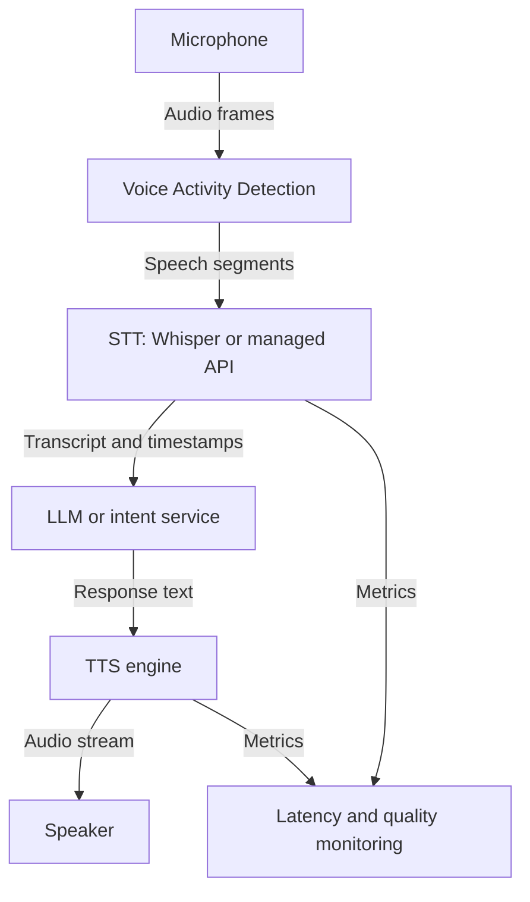

# Voice & Audio AI: Teaching Computers to Listen and Speak

**Complexity**: Intermediate to Advanced  
**Reading Time**: 6-7 hours  
**Prerequisites**: Phase 4 complete, basic Python, HTTP APIs, container images, and Kubernetes v1.35+ deployment knowledge.

## Learning Outcomes

By the end of this module, you will be able to:

1. **Design** an end-to-end voice AI pipeline that combines speech-to-text, language reasoning, text-to-speech, latency budgets, and fallback behavior.
2. **Implement** local and managed transcription flows with Whisper-family models, faster-whisper, timestamped segments, and production-ready preprocessing.
3. **Diagnose** failures caused by noisy audio, poor voice activity detection, buffer sizing mistakes, model-size mismatches, and missing interruption handling.
4. **Evaluate** when to choose local GPU inference, managed speech APIs, streaming vendors, or hybrid fallback architectures based on latency, privacy, cost, and reliability.
5. **Deploy** a GPU-backed Whisper service on Kubernetes v1.35+ with explicit resource requests, health checks, model storage, and operational guardrails.

## Why This Module Matters

A support director listens to a call recording after a customer churns. The customer did everything right: explained the billing problem clearly, waited through a menu, repeated the same sentence several times, and finally asked for a human. The system failed anyway because it treated voice as a sequence of keywords instead of a noisy, emotional, time-sensitive signal. The call was not a simple transcription task; it was a real-time distributed system where microphones, codecs, inference latency, intent detection, and response playback all had to work together.

Modern speech AI changes the engineering problem. Whisper showed that large weakly supervised models could handle accents, background noise, multilingual speech, punctuation, and translation far better than many older narrow recognizers. Neural text-to-speech systems made generated speech feel less robotic, and LLMs made it possible to turn transcripts into useful action. The result is powerful, but it also introduces new failure modes: a voice assistant can cut off a customer mid-sentence, hallucinate a response from a bad transcript, leak sensitive audio to the wrong vendor, or burn GPU budget because the largest model was deployed for every workload.

This module teaches voice AI as a production system, not as a demo script. You will start with the simplest speech-to-text pipeline, then add timestamps, streaming, voice activity detection, text-to-speech, multilingual handling, cost modeling, and Kubernetes deployment. By the end, you should be able to explain why a pipeline behaves poorly, choose a better architecture, and deploy a GPU-backed transcription service with the same seriousness you would apply to any other customer-facing platform component.

## Section 1: The Speech AI Pipeline

A voice AI system is a chain of time-sensitive transformations. The microphone captures waveform data, the speech-to-text component turns that signal into words, the language layer decides what the words mean, and the text-to-speech component turns the response back into audio. Each stage can be tested alone, but users experience the whole chain as one interaction. A strong design therefore starts with the end-to-end path instead of treating transcription, reasoning, and playback as separate toy problems.

```text
┌─────────────────────────────────────────────────────────────┐
│                    SPEECH AI PIPELINE                        │
├─────────────────────────────────────────────────────────────┤
│                                                             │
│  [Microphone] ──► [STT: Whisper] ──► [Text]                 │
│                                         │                   │
│                                         ▼                   │
│                                    [LLM or Intent Layer]    │
│                                         │                   │
│                                         ▼                   │
│  [Speaker] ◄── [TTS Engine] ◄── [Response Text]             │
│                                                             │
└─────────────────────────────────────────────────────────────┘
```



The diagram is intentionally simple because the first architectural mistake is overcomplicating the mental model. In a batch transcription system, audio enters once and a transcript appears later. In a conversational system, audio arrives continuously, users pause unpredictably, responses must begin before the full answer is generated, and the user may interrupt playback. That difference turns speech AI into a streaming systems problem.

| Component | Main job | Production question | Failure symptom |
|---|---|---|---|
| Audio capture | Convert microphone or file input into frames | Is the sample rate, format, and channel count compatible with downstream models? | Distorted audio, empty transcripts, or poor accuracy |
| VAD | Detect speech and silence boundaries | Does the system wait long enough for natural pauses without adding unnecessary delay? | Users get cut off or wait too long |
| STT | Convert speech to text | Is the model accurate enough within the latency and cost budget? | Wrong transcript, missing words, or slow response |
| LLM or intent layer | Decide what to do with the transcript | Is the system robust to partial, noisy, or low-confidence transcripts? | Confident but wrong answers |
| TTS | Convert response text to speech | Can audio begin streaming before the full response is complete? | Long silent pauses before playback |
| Observability | Measure quality and latency | Can operators identify which stage caused a bad interaction? | Incidents with no clear root cause |

Voice interfaces are less forgiving than text interfaces. In a chat app, a two-second delay is noticeable but often acceptable. In a phone call or live assistant, the same delay can feel broken because conversation depends on turn-taking. A production architecture must therefore assign latency budgets to each stage before choosing models or vendors.

> **Active check**: Your team proposes using the most accurate STT model for every request because "accuracy matters most." Before reading further, decide which production metric will degrade first in a live voice assistant and why.

The likely first failure is latency, followed by cost under sustained traffic. A larger model can improve accuracy for hard audio, but it also consumes more GPU memory and inference time. If transcription takes longer than the natural pause between conversational turns, users experience the assistant as slow even when the final words are correct. Accuracy is necessary, but it is not the only success criterion.

## Section 2: Speech-to-Text and Whisper

Speech-to-text systems map an acoustic signal to tokens. That sounds like a pure machine learning task, but engineering choices around audio normalization, model size, decoding settings, and timestamps strongly affect production behavior. Whisper-family models are useful because they combine transcription, language detection, punctuation, and translation behavior in a single architecture, which makes them a strong baseline for learning and deployment.

Think of Whisper as a robust generalist rather than a magical listener. It performs well across many accents, recording conditions, and languages because it was trained on a large and diverse weakly supervised dataset. That does not mean it solves every domain. Medical abbreviations, legal names, overlapping speakers, heavy music, and low-quality phone audio can still break transcripts. The engineer's job is to decide when the generalist is enough and when preprocessing, domain models, or human review are required.

| Model | Parameters | Typical local use | VRAM expectation | Relative speed |
|---|---:|---|---:|---:|
| `tiny` | 39M | Fast experiments and constrained English tasks | About 1 GB | Very fast |
| `base` | 74M | Development, demos, and low-latency prototypes | About 1 GB | Fast |
| `small` | 244M | Better quality while preserving interactive behavior | About 2 GB | Moderate |
| `medium` | 769M | Batch jobs where accuracy matters more than delay | About 5 GB | Slower |
| `large` | 1550M | Accuracy-focused offline transcription | About 10 GB | Slowest |
| `large-v2` | 1550M | Mature large-checkpoint workloads | Similar to `large` | Hardware-dependent |
| `large-v3` | 1550M | Strong multilingual and batch workloads | Similar to `large` | Hardware-dependent |

A good model-size decision starts with the user experience. For live calls, choose the smallest model that meets quality requirements on representative audio. For compliance archives, choose a larger model if the batch window and budget allow it. For regulated data, local inference may matter more than vendor convenience. For many teams, the correct answer is hybrid: a local model handles normal traffic, while a managed API or larger batch job handles fallback and audit workflows.

The simplest local transcription path uses the reference Whisper package. This is useful for learning because the code is short and the output includes language, text, and segments. It is not always the best production runtime, but it gives you a baseline to compare against optimized implementations.

```python
import whisper

model = whisper.load_model("base")
result = model.transcribe("audio.mp3")

print(f"Detected language: {result['language']}")
print(f"Transcript: {result['text']}")

for segment in result["segments"]:
    print(f"[{segment['start']:.2f}s - {segment['end']:.2f}s] {segment['text']}")
```

Timestamps matter whenever audio must be reviewed, indexed, captioned, or linked back to the original recording. A plain transcript tells you what was said. Segment and word timestamps tell you when it was said, which enables subtitle generation, transcript search, playback highlighting, compliance review, and speaker-turn debugging.

```python
import whisper

model = whisper.load_model("base")
result = model.transcribe("podcast.mp3", word_timestamps=True)

for segment in result["segments"]:
    print(f"[{segment['start']:.2f}s - {segment['end']:.2f}s] {segment['text']}")
    for word in segment.get("words", []):
        print(f"  [{word['start']:.2f}s] {word['word']}")
```

Managed APIs are useful when you do not want to operate GPU infrastructure or when traffic volume is too low to justify a self-hosted service. The trade-off is that audio leaves your infrastructure, pricing can change, and vendor-specific response formats become part of your application contract. Treat that contract as seriously as a database schema because downstream systems may depend on word timings, confidence values, or speaker labels.

```python
from openai import OpenAI

client = OpenAI()

with open("audio.mp3", "rb") as audio_file:
    transcript = client.audio.transcriptions.create(
        model="whisper-1",
        file=audio_file,
        response_format="verbose_json",
        timestamp_granularities=["word", "segment"],
    )

print(transcript.text)
for word in transcript.words:
    print(word)
```

For production self-hosting, faster-whisper is often a better runtime than the reference implementation. It uses CTranslate2 and supports efficient compute types such as `float16` and `int8`. The important lesson is not that one package is always better; the important lesson is to measure the same audio, model size, batch size, hardware, and decoding settings before making a claim.

```python
from faster_whisper import WhisperModel

model = WhisperModel(
    "large-v3",
    device="cuda",
    compute_type="float16",
)

segments, info = model.transcribe("audio.mp3", beam_size=5)

print(f"Detected language: {info.language} ({info.language_probability:.2%})")
for segment in segments:
    print(f"[{segment.start:.2f}s -> {segment.end:.2f}s] {segment.text}")
```

> **Active check**: You run the same recording with `beam_size=1` and `beam_size=5`. The larger beam gives slightly better punctuation but doubles latency on your GPU. Which setting would you ship for a real-time customer-support assistant, and what evidence would you collect before deciding?

A defensible answer compares user-facing latency and transcript quality on representative calls, not on a single clean sample. If the larger beam improves critical entities such as account numbers or medical terms, it may be worth the delay. If the improvement is mostly punctuation, the lower-latency setting is probably better for live conversation. The decision should be tied to measured word error rate, entity accuracy, and turn latency.

## Section 3: Audio Quality, Preprocessing, and VAD

Bad audio creates bad transcripts before the model has a fair chance. A noisy recording can hide consonants, clipping can destroy information, and a mismatched sample rate can make a valid model look broken. Beginners often jump straight to changing models, but senior engineers inspect the input signal first because model changes are expensive and sometimes irrelevant.

A practical ingestion path normalizes sample rate, channel count, and volume before transcription. Most speech models expect mono audio at a predictable sampling rate, commonly 16 kHz. If your source is a stereo browser recording, a telephony stream, or a compressed upload, normalize it deliberately instead of hoping the library does the right thing.

```bash
ffmpeg -y \
  -i raw-input.mp3 \
  -ac 1 \
  -ar 16000 \
  -af loudnorm \
  normalized.wav
```

```python
import librosa
import soundfile as sf

audio, sample_rate = librosa.load("raw-input.mp3", sr=16000, mono=True)
sf.write("normalized.wav", audio, sample_rate)
```

Noise reduction can help when the noise profile is stable, but it is not free. Aggressive denoising may remove speech frequencies, flatten speaker characteristics, or introduce artifacts that confuse the recognizer. Use it as a measured intervention, not a ritual. Always compare original and cleaned audio against ground truth when the transcript quality matters.

```python
import librosa
import noisereduce as nr
import soundfile as sf

audio, sample_rate = librosa.load("noisy_audio.mp3", sr=16000, mono=True)
clean_audio = nr.reduce_noise(y=audio, sr=sample_rate)

sf.write("clean_audio.wav", clean_audio, sample_rate)
```

Voice activity detection decides where speech starts and ends. This is one of the highest-leverage pieces of a voice assistant because it controls turn-taking. If VAD is too aggressive, the assistant cuts users off during natural pauses. If VAD is too permissive, it waits through silence and feels slow. The correct threshold depends on language, microphone quality, room noise, and conversation style.

```python
import webrtcvad

vad = webrtcvad.Vad(2)

def is_speech_frame(frame_bytes: bytes, sample_rate: int = 16000) -> bool:
    """Return True when a 10, 20, or 30 ms PCM frame contains speech."""
    return vad.is_speech(frame_bytes, sample_rate)
```

```python
import torch

model, utils = torch.hub.load(
    repo_or_dir="snakers4/silero-vad",
    model="silero_vad",
    force_reload=False,
)

(get_speech_timestamps, _, read_audio, _, _) = utils

wav = read_audio("meeting.wav", sampling_rate=16000)
speech_timestamps = get_speech_timestamps(
    wav,
    model,
    threshold=0.5,
    sampling_rate=16000,
)

print(speech_timestamps)
```

A worked example helps connect these ideas. Imagine a call-center assistant that cuts people off after exactly five seconds. The code records a fixed window, sends it to STT, and ignores whether the user is still speaking. The fix is not a bigger STT model. The fix is to replace fixed windows with speech-boundary detection and a short silence grace period.

```python
def collect_utterance(get_frame, vad, sample_rate: int = 16000) -> bytes:
    """Collect speech until a user stops talking for roughly 600 ms."""
    frames = []
    silence_frames = 0
    max_silence_frames = 20

    while True:
        frame = get_frame(30)
        speech = vad.is_speech(frame, sample_rate)

        if speech:
            frames.append(frame)
            silence_frames = 0
            continue

        if frames:
            silence_frames += 1
            if silence_frames >= max_silence_frames:
                break

    return b"".join(frames)
```

The logic is simple, but the behavior is very different. The system waits for the user to finish an utterance instead of assuming every utterance fits a fixed duration. You can tune the grace period by measuring interruptions and perceived delay during real calls. This is an example of using application behavior to guide model-adjacent engineering.

## Section 4: Real-Time Pipelines and Streaming Design

Real-time voice systems are pipelines, not scripts. A script can record, transcribe, generate a response, synthesize speech, and play it sequentially. A production assistant should overlap work where possible, stream intermediate output, and keep listening for interruptions. The design goal is to reduce perceived latency without sacrificing correctness.

```text
┌──────────────┐   frames   ┌──────────────┐  segment  ┌──────────────┐
│ Microphone   │───────────►│ VAD Buffer   │──────────►│ STT Worker   │
└──────────────┘            └──────────────┘           └──────┬───────┘
                                                               │ text
                                                               ▼
┌──────────────┐   audio    ┌──────────────┐  sentence ┌──────────────┐
│ Speaker      │◄───────────│ TTS Stream   │◄──────────│ LLM Stream   │
└──────────────┘            └──────────────┘           └──────────────┘
        ▲
        │ interruption signal
        └──────────────────────────────────────────────────────────────
```

The easiest optimization is to stream the response text and start TTS at a sentence boundary instead of waiting for the full answer. This approach works best when the assistant is instructed to produce short, spoken responses. Long paragraphs are bad voice UX because the user cannot scan them, and they also delay the moment when the first complete sentence can be synthesized.

```python
import asyncio
from collections.abc import AsyncIterator

async def synthesize_when_sentence_ready(
    text_stream: AsyncIterator[str],
    synthesize_sentence,
) -> str:
    """Buffer streamed text and send complete sentences to TTS."""
    full_text = ""
    pending = ""

    async for chunk in text_stream:
        full_text += chunk
        pending += chunk

        if "." in pending or "?" in pending or "!" in pending:
            sentence, _, rest = pending.partition(".")
            if sentence.strip():
                await synthesize_sentence(sentence.strip() + ".")
            pending = rest

    if pending.strip():
        await synthesize_sentence(pending.strip())

    return full_text
```

A real assistant also needs interruption handling. Humans interrupt, correct themselves, and start talking before playback completes. If your system treats playback as an uninterruptible blocking call, it behaves more like a voicemail system than a conversation partner. The microphone path must continue monitoring for speech while TTS is playing, and playback must be stoppable.

```python
async def play_with_barge_in(audio_stream, detect_user_speech, stop_playback):
    """Play synthesized audio while allowing the user to interrupt."""
    async for audio_chunk in audio_stream:
        if detect_user_speech():
            stop_playback()
            return "interrupted"

        await play_audio_chunk(audio_chunk)

    return "completed"
```

> **Active check**: A demo assistant responds accurately but feels slow. Logs show STT takes 180 ms, the LLM takes 900 ms to finish, and TTS takes 700 ms to generate a full file. What change would improve perceived latency without changing any model?

The best first change is streaming. Start rendering the LLM response as it arrives, synthesize the first complete sentence, and begin playback before the full answer is complete. This does not reduce total compute time, but it reduces time-to-first-audio, which is what the user perceives during a turn. The same principle applies across distributed systems: overlap independent work instead of waiting for every stage to finish.

## Section 5: Text-to-Speech and Voice Design

Text-to-speech is not just the inverse of transcription. STT tries to preserve what a speaker said, while TTS must decide how a response should sound. Voice choice, speaking rate, sentence length, punctuation, and emotional tone all shape user trust. A technically correct voice assistant can still fail if it sounds rushed, monotonous, or inappropriate for the domain.

| Provider | Quality profile | Latency profile | Deployment model | Voice cloning |
|---|---|---|---|---|
| ElevenLabs | Expressive commercial voices | Low-latency options available | Managed API | Available under vendor policy |
| OpenAI TTS | High-quality general voices | Low-latency managed synthesis | Managed API | Built-in voice set |
| Amazon Polly | Mature cloud service | Low-latency cloud synthesis | Managed API | Feature set varies |
| Google TTS | Mature cloud service | Low-latency cloud synthesis | Managed API | Feature set varies |
| Coqui TTS | Open-source and self-hostable | Depends on model and hardware | Local or server-hosted | Community options |
| Bark | Expressive experimental generation | Often higher latency | Local or server-hosted | Setup-dependent |

For a first implementation, managed TTS is easier because you can focus on conversational behavior instead of model hosting. Save the output to a file when you are testing, but stream bytes in production. A file-first flow hides latency because nothing plays until the full object exists.

```python
from pathlib import Path
from openai import OpenAI

client = OpenAI()

response = client.audio.speech.create(
    model="tts-1",
    voice="alloy",
    input="Your transcription pipeline is ready for a test call.",
    speed=1.0,
)

speech_file = Path("output.mp3")
response.stream_to_file(speech_file)
```

```python
from openai import OpenAI

client = OpenAI()

response = client.audio.speech.create(
    model="tts-1",
    voice="alloy",
    input="This response can be streamed to the player as chunks arrive.",
)

with open("streamed_output.mp3", "wb") as audio_file:
    for chunk in response.iter_bytes(chunk_size=1024):
        audio_file.write(chunk)
```

Open-source TTS is useful when audio cannot leave your environment, when you need predictable unit economics, or when you want full control over the serving stack. The trade-off is operational responsibility. You own model loading, GPU allocation, cold starts, quality tuning, and scaling. That may be exactly right for regulated environments, but it is not automatically cheaper at low traffic.

```python
from TTS.api import TTS

tts = TTS(model_name="tts_models/en/ljspeech/tacotron2-DDC")
tts.tts_to_file(
    text="Open source text to speech can run inside your own environment.",
    file_path="coqui_output.wav",
)
```

Voice cloning requires stricter governance than ordinary TTS because it can create a recognizable speaker likeness. Production systems should require explicit consent, track the approved use case, watermark or label generated audio where appropriate, and log synthesis requests for abuse investigation. Treat cloned voices like sensitive credentials: access should be limited, auditable, and revocable.

> **Active check**: A product manager asks you to clone the CEO's voice for internal announcements because it would "sound more personal." What technical and policy controls would you require before building it?

A senior answer includes both consent and system controls. You need verifiable approval from the speaker, a documented scope of allowed messages, restricted access to the cloned voice, audit logs, abuse monitoring, and a plan for revocation. You should also consider whether a clearly synthetic branded voice would meet the product goal with less risk. The engineering decision is inseparable from misuse prevention.

## Section 6: Building a Complete Voice Assistant

A complete assistant joins the pieces into one loop: listen, detect speech, transcribe, reason, synthesize, play, and keep enough state to respond coherently. The code below is intentionally compact, but it demonstrates the production shape. In a real service, the microphone and speaker would usually be browser, mobile, or telephony clients, while STT, reasoning, and TTS run as backend services.

```python
import os
import tempfile
from pathlib import Path

import numpy as np
import pyaudio
from faster_whisper import WhisperModel
from openai import OpenAI


class VoiceAssistant:
    """Voice-in, voice-out assistant for local experimentation."""

    def __init__(self) -> None:
        self.client = OpenAI()
        self.whisper = WhisperModel("base", device="cuda", compute_type="float16")
        self.conversation_history: list[dict[str, str]] = []

    def record_audio(self, duration: float = 5.0) -> np.ndarray:
        sample_rate = 16000
        chunk_size = 1024

        pyaudio_client = pyaudio.PyAudio()
        stream = pyaudio_client.open(
            format=pyaudio.paFloat32,
            channels=1,
            rate=sample_rate,
            input=True,
            frames_per_buffer=chunk_size,
        )

        frames = []
        for _ in range(int(sample_rate * duration / chunk_size)):
            data = stream.read(chunk_size)
            frames.append(np.frombuffer(data, dtype=np.float32))

        stream.stop_stream()
        stream.close()
        pyaudio_client.terminate()

        return np.concatenate(frames)

    def transcribe(self, audio: np.ndarray) -> str:
        segments, _ = self.whisper.transcribe(audio, beam_size=5)
        return " ".join(segment.text for segment in segments).strip()

    def get_response(self, user_message: str) -> str:
        self.conversation_history.append({"role": "user", "content": user_message})

        response = self.client.chat.completions.create(
            model="gpt-5",
            messages=[
                {
                    "role": "system",
                    "content": "You are a concise voice assistant. Use one or two spoken sentences.",
                },
                *self.conversation_history,
            ],
        )

        assistant_message = response.choices[0].message.content
        self.conversation_history.append(
            {"role": "assistant", "content": assistant_message}
        )
        return assistant_message

    def speak(self, text: str) -> None:
        response = self.client.audio.speech.create(
            model="tts-1",
            voice="nova",
            input=text,
        )

        with tempfile.NamedTemporaryFile(suffix=".mp3", delete=False) as audio_file:
            output_path = Path(audio_file.name)

        response.stream_to_file(output_path)
        os.system(f"afplay {output_path}")
        output_path.unlink(missing_ok=True)

    def conversation_loop(self) -> None:
        print("Voice Assistant ready. Press Ctrl+C to exit.")

        while True:
            try:
                audio = self.record_audio(duration=5.0)
                user_text = self.transcribe(audio)

                if not user_text:
                    print("(No speech detected)")
                    continue

                print(f"You: {user_text}")
                assistant_text = self.get_response(user_text)
                print(f"Assistant: {assistant_text}")
                self.speak(assistant_text)

            except KeyboardInterrupt:
                print("Goodbye.")
                break


if __name__ == "__main__":
    VoiceAssistant().conversation_loop()
```

This version teaches the flow, but it is not the final production architecture. The fixed recording duration should be replaced with VAD, local playback should be replaced with a client audio stream, and the blocking calls should be isolated behind asynchronous workers. The important engineering habit is to identify which simplifications are acceptable for a lab and which would harm real users.

A stronger backend version treats each turn as a timed transaction. It records latency at each stage, carries a correlation ID, and emits enough metadata to debug failures. When a user reports "the assistant misunderstood me," you need the original audio reference, VAD boundaries, transcript, model name, decoding settings, response text, TTS voice, and stage timings.

```python
from dataclasses import dataclass
from time import perf_counter


@dataclass
class TurnMetrics:
    vad_ms: float
    stt_ms: float
    llm_ms: float
    tts_ms: float
    total_ms: float


async def process_turn(audio, transcribe, generate_response, synthesize):
    started = perf_counter()

    stt_started = perf_counter()
    transcript = await transcribe(audio)
    stt_ms = (perf_counter() - stt_started) * 1000

    llm_started = perf_counter()
    response_text = await generate_response(transcript)
    llm_ms = (perf_counter() - llm_started) * 1000

    tts_started = perf_counter()
    response_audio = await synthesize(response_text)
    tts_ms = (perf_counter() - tts_started) * 1000

    metrics = TurnMetrics(
        vad_ms=0.0,
        stt_ms=stt_ms,
        llm_ms=llm_ms,
        tts_ms=tts_ms,
        total_ms=(perf_counter() - started) * 1000,
    )

    return transcript, response_text, response_audio, metrics
```

## Section 7: Multilingual and Multi-Speaker Audio

Multilingual speech changes the design because language detection, translation, and voice output become product decisions. A travel assistant might translate every utterance into English internally, while a customer-support assistant might preserve the user's language throughout the conversation. Neither choice is universally correct. The correct design depends on the agents, compliance rules, evaluation data, and whether downstream tools understand the original language.

```python
import whisper

model = whisper.load_model("large-v3")

transcribed = model.transcribe(
    "japanese_speech.mp3",
    language="ja",
    task="transcribe",
)
print(f"Japanese transcript: {transcribed['text']}")

translated = model.transcribe(
    "japanese_speech.mp3",
    task="translate",
)
print(f"English translation: {translated['text']}")
```

Translation can hide uncertainty. If the original transcript is wrong, the translated text may look fluent and convincing anyway. That is dangerous in support, healthcare, legal, and safety workflows. For high-risk domains, store the original audio reference, original-language transcript, translated transcript, language confidence, and model settings so reviewers can reconstruct the decision path.

Speaker diarization solves a different problem: who spoke when. It is essential for meetings, interviews, sales calls, and compliance review because a transcript without speaker boundaries can change meaning. If a customer says "I agree" and an agent says "we will cancel the account," the identity of the speaker matters as much as the words.

```python
from pyannote.audio import Pipeline
import torch

pipeline = Pipeline.from_pretrained(
    "pyannote/speaker-diarization-3.1",
    use_auth_token="YOUR_HF_TOKEN",
)

if torch.cuda.is_available():
    pipeline = pipeline.to(torch.device("cuda"))

diarization = pipeline("meeting.wav")

for turn, _, speaker in diarization.itertracks(yield_label=True):
    print(f"[{turn.start:.1f}s - {turn.end:.1f}s] {speaker}")
```

Diarization is not the same as speaker identification. Diarization labels segments like `SPEAKER_00` and `SPEAKER_01`; it does not prove that a speaker is a specific person. If your product needs identity, you need separate enrollment, consent, verification, and privacy controls. Confusing diarization with identity is a serious design error.

> **Active check**: A compliance team wants meeting transcripts where every sentence is attributed to an employee name. Your diarization pipeline only outputs anonymous speaker labels. What additional system would you need, and what risk would you explain before approving the feature?

You would need a speaker verification or enrollment system that maps voice patterns to known identities, plus consent and retention controls. The risk is that misidentification can create false records of who said what, which may have legal or workplace consequences. For many organizations, anonymous speaker labels plus manual review are safer than automated identity claims.

## Section 8: Production Deployment on Kubernetes v1.35+

Deploying Whisper on Kubernetes is an infrastructure decision as much as an ML decision. A GPU-backed service needs compatible nodes, the NVIDIA device plugin or equivalent GPU operator setup, container images with CUDA-compatible libraries, model storage, resource requests, probes, autoscaling signals, and fallback behavior. Kubernetes does not make GPU inference cheap or fast by itself; it gives you scheduling, isolation, rollout, and operational control.

The following manifest is a concrete starting point for a GPU-backed faster-whisper API. It assumes your cluster has GPU nodes exposing `nvidia.com/gpu`, an image that starts an HTTP server on port 8000, and a persistent volume for cached model files. It is deliberately explicit about resources because silent CPU fallback is one of the most common ways speech services become slow and expensive.

```yaml
apiVersion: v1
kind: Namespace
metadata:
  name: speech-ai
---
apiVersion: v1
kind: PersistentVolumeClaim
metadata:
  name: whisper-model-cache
  namespace: speech-ai
spec:
  accessModes:
    - ReadWriteOnce
  resources:
    requests:
      storage: 30Gi
---
apiVersion: apps/v1
kind: Deployment
metadata:
  name: whisper-stt
  namespace: speech-ai
  labels:
    app: whisper-stt
spec:
  replicas: 1
  selector:
    matchLabels:
      app: whisper-stt
  template:
    metadata:
      labels:
        app: whisper-stt
    spec:
      nodeSelector:
        accelerator: nvidia
      containers:
        - name: api
          image: ghcr.io/example/whisper-stt:1.0.0
          imagePullPolicy: IfNotPresent
          ports:
            - name: http
              containerPort: 8000
          env:
            - name: WHISPER_MODEL
              value: large-v3
            - name: WHISPER_DEVICE
              value: cuda
            - name: WHISPER_COMPUTE_TYPE
              value: float16
            - name: MODEL_CACHE_DIR
              value: /models
          resources:
            requests:
              cpu: "2"
              memory: 8Gi
              nvidia.com/gpu: "1"
            limits:
              cpu: "4"
              memory: 16Gi
              nvidia.com/gpu: "1"
          volumeMounts:
            - name: model-cache
              mountPath: /models
          readinessProbe:
            httpGet:
              path: /readyz
              port: http
            initialDelaySeconds: 20
            periodSeconds: 10
            timeoutSeconds: 2
            failureThreshold: 6
          livenessProbe:
            httpGet:
              path: /livez
              port: http
            initialDelaySeconds: 60
            periodSeconds: 20
            timeoutSeconds: 2
            failureThreshold: 3
      volumes:
        - name: model-cache
          persistentVolumeClaim:
            claimName: whisper-model-cache
---
apiVersion: v1
kind: Service
metadata:
  name: whisper-stt
  namespace: speech-ai
spec:
  selector:
    app: whisper-stt
  ports:
    - name: http
      port: 80
      targetPort: http
```

A minimal serving process can expose health checks and a transcription endpoint. The implementation below is intentionally small so you can see the contract. In production, add authentication, request-size limits, structured logging, timeout controls, and object storage for large audio files instead of accepting unlimited multipart uploads.

```python
import os
import tempfile
from pathlib import Path

from fastapi import FastAPI, File, UploadFile
from faster_whisper import WhisperModel

app = FastAPI()

model_name = os.getenv("WHISPER_MODEL", "base")
device = os.getenv("WHISPER_DEVICE", "cuda")
compute_type = os.getenv("WHISPER_COMPUTE_TYPE", "float16")
model = WhisperModel(model_name, device=device, compute_type=compute_type)


@app.get("/livez")
def livez() -> dict[str, str]:
    return {"status": "live"}


@app.get("/readyz")
def readyz() -> dict[str, str]:
    return {"status": "ready", "model": model_name, "device": device}


@app.post("/transcribe")
async def transcribe(file: UploadFile = File(...)) -> dict:
    suffix = Path(file.filename or "audio.wav").suffix or ".wav"

    with tempfile.NamedTemporaryFile(suffix=suffix, delete=False) as temp_file:
        temp_path = Path(temp_file.name)
        temp_file.write(await file.read())

    try:
        segments, info = model.transcribe(str(temp_path), beam_size=5)
        transcript_segments = [
            {"start": segment.start, "end": segment.end, "text": segment.text}
            for segment in segments
        ]

        return {
            "language": info.language,
            "language_probability": info.language_probability,
            "segments": transcript_segments,
            "text": " ".join(segment["text"] for segment in transcript_segments).strip(),
        }
    finally:
        temp_path.unlink(missing_ok=True)
```

Build the container with CUDA-compatible dependencies and the serving package installed. The exact base image depends on your GPU drivers and organization standards, but the important point is to make the runtime explicit. A container that works on a laptop CPU is not proof that it will use GPU correctly in a cluster.

```dockerfile
FROM nvidia/cuda:12.4.1-runtime-ubuntu22.04

WORKDIR /app

RUN apt-get update \
    && apt-get install -y --no-install-recommends ffmpeg python3 python3-pip \
    && rm -rf /var/lib/apt/lists/*

COPY requirements.txt .
RUN pip3 install --no-cache-dir -r requirements.txt

COPY app.py .

EXPOSE 8000

CMD ["uvicorn", "app:app", "--host", "0.0.0.0", "--port", "8000"]
```

```text
fastapi==0.115.0
uvicorn[standard]==0.30.6
python-multipart==0.0.9
faster-whisper==1.0.3
```

Once deployed, verify the service with `kubectl`. In this module, `k` is used as the common shell alias for `kubectl`; define it with `alias k=kubectl` if your shell does not already have it. Validation should confirm that the pod is scheduled on a GPU node, the resource request is visible, the readiness probe passes, and the endpoint returns a transcript for a known sample.

```bash
kubectl get nodes -L accelerator
kubectl -n speech-ai get pods -o wide
kubectl -n speech-ai describe pod -l app=whisper-stt
kubectl -n speech-ai port-forward svc/whisper-stt 8080:80
```

```bash
curl -s \
  -F "file=@audio.mp3" \
  http://127.0.0.1:8080/transcribe
```

A production rollout should also include degradation paths. If the GPU service is unavailable, the caller might queue the job for batch processing, fall back to a managed API, or return a clear "transcription unavailable" status depending on the product. Do not silently switch to a much slower CPU path for live calls unless the user experience can tolerate it.

```python
async def transcribe_with_fallback(audio_path: str) -> str:
    try:
        return await transcribe_local_gpu(audio_path)
    except TimeoutError:
        logger.warning("Local GPU transcription timed out")

    try:
        return await transcribe_managed_api(audio_path)
    except Exception as exc:
        logger.error("Managed transcription failed: %s", exc)

    return "[Transcription unavailable]"
```

## Section 9: Economics, Reliability, and Evaluation

Speech AI economics depend on utilization. A managed API is often cheaper for low and unpredictable traffic because you pay per use and avoid idle GPUs. Self-hosted inference can become cheaper at high volume, but only if GPUs are well utilized, operations are mature, and the team accounts for engineering time, monitoring, upgrades, and incident response. A naive break-even spreadsheet that ignores utilization is misleading.

| Use case | Recommended starting point | Reason |
|---|---|---|
| Development and local learning | Local Whisper or faster-whisper | No per-request API cost and easy experimentation |
| Low-volume production | Managed STT and TTS APIs | Avoids operating GPU capacity for small workloads |
| High-volume batch transcription | Self-hosted faster-whisper on GPUs | Better unit economics when utilization is high |
| Live call-center assistant | Streaming STT vendor or tuned local low-latency model | Turn latency matters more than maximum batch accuracy |
| Regulated on-prem audio | Self-hosted STT and TTS | Keeps sensitive audio inside controlled infrastructure |
| Multilingual archive search | Larger Whisper model or managed multilingual STT | Accuracy and language coverage matter more than speed |

| Service | STT cost model | TTS cost model | Operational burden | Notes |
|---|---|---|---|---|
| OpenAI Whisper API | Per audio duration | Not applicable | Low | Managed transcription |
| OpenAI TTS | Not applicable | Per generated audio or characters | Low | Managed speech synthesis |
| ElevenLabs | Not applicable | Vendor-specific usage pricing | Low | Commercial TTS and voice features |
| Deepgram | Usage-based | Vendor-dependent | Low | Strong streaming STT focus |
| AssemblyAI | Usage-based | Vendor-dependent | Low | Managed transcription features |
| Local Whisper GPU | Hardware, power, utilization, operations | Not applicable | Medium to high | Strong control and privacy |
| Local XTTS or Coqui | Not applicable | Hardware, utilization, operations | Medium to high | Useful for offline environments |

| Metric | What it measures | Why it matters | Typical owner |
|---|---|---|---|
| Word error rate | Difference from reference transcript | Captures transcription quality | ML or data team |
| Entity accuracy | Correctness of names, IDs, terms, and numbers | Often more important than overall WER | Product and domain experts |
| Time to first audio | Delay before the assistant speaks | Drives perceived responsiveness | Backend and client teams |
| End-of-turn accuracy | Whether the system waits for the user to finish | Prevents interruptions and cutoffs | Voice platform team |
| GPU utilization | How much inference capacity is used | Determines self-hosted economics | Platform team |
| Fallback rate | How often primary STT or TTS fails | Signals reliability and cost drift | SRE team |

A realistic evaluation set includes clean audio, noisy audio, accented speakers, domain vocabulary, overlapping speech, silence, interruptions, and multilingual examples if your product supports them. Do not evaluate only on the sample file used in development. That creates a false sense of quality because the pipeline may be tuned to one easy recording.

```python
from dataclasses import dataclass


@dataclass
class EvaluationCase:
    audio_path: str
    reference_text: str
    scenario: str
    must_capture_entities: list[str]


cases = [
    EvaluationCase(
        audio_path="support_noisy.wav",
        reference_text="I need to update invoice INV-23891 before Friday.",
        scenario="noisy support call with invoice number",
        must_capture_entities=["INV-23891", "Friday"],
    ),
    EvaluationCase(
        audio_path="meeting_overlap.wav",
        reference_text="Speaker labels require manual review.",
        scenario="overlapping meeting audio",
        must_capture_entities=["manual review"],
    ),
]
```

The key evaluation habit is to tie metrics back to decisions. If entity accuracy is poor, a larger model, domain vocabulary support, or human review may help. If time-to-first-audio is poor, streaming and sentence chunking may help. If GPU utilization is low, batching or managed APIs may be better. A metric without an action path is just decoration.

## Module Summary

Voice AI is a distributed, latency-sensitive system wrapped around machine learning models. Speech-to-text, language reasoning, and text-to-speech are the obvious components, but the production quality often depends on less glamorous pieces: sample-rate normalization, VAD, streaming, interruption handling, observability, and deployment constraints. A voice assistant that sounds impressive in a demo can fail in production if it cuts users off, hides transcript uncertainty, ignores privacy, or runs an oversized model for every request.

The path from beginner to senior practice is the path from isolated model calls to system design. First, transcribe a file. Then add timestamps, preprocessing, and model-size comparisons. Next, build a conversational loop with streaming and interruption handling. Finally, deploy the service on Kubernetes with explicit GPU resources, health checks, fallback behavior, and evaluation data that represents real users.

```text
Audio In -> Normalize -> VAD -> STT -> Reasoning -> TTS -> Audio Out
              │          │      │        │          │
              └──────────┴──────┴────────┴──────────┘
                    metrics, fallbacks, and policy controls
```

## Did You Know?

1. **Did You Know?** Voice-cloning scams and other audio-based social-engineering attacks are a growing security concern, but precise incident counts and loss estimates depend heavily on the reporting source and methodology.
2. **Did You Know?** [IBM's 1962 SHOEBOX system](https://www.ibm.com/history/voice-recognition) was the world's first true speech recognition tool, capable of recognizing a vocabulary of exactly 16 words.
3. **Did You Know?** OpenAI initially trained the Whisper model on exactly [680,000 hours of diverse, multilingual, and extremely noisy audio scraped from the internet](https://openai.com/index/whisper/), bypassing traditional clean datasets.
4. **Did You Know?** Benchmarks published by the faster-whisper project show meaningful speed and memory improvements over `openai/whisper` under comparable settings, but results depend on hardware and decoding settings.

## Common Mistakes

| Mistake | Why it happens | How to fix it |
|---|---|---|
| Using fixed recording windows | The first prototype records five seconds because it is easy to code. | Replace fixed windows with VAD and a silence grace period tuned on real conversations. |
| Deploying the largest model everywhere | Teams optimize for benchmark accuracy without assigning a latency budget. | Match model size to the use case and measure time-to-first-response on representative audio. |
| Ignoring audio normalization | Inputs arrive from browsers, phones, uploads, and meeting tools with different formats. | Normalize sample rate, channel count, and loudness before inference. |
| Treating diarization as identity | Speaker labels look like names even though they are only anonymous clusters. | Use separate speaker verification only with consent, enrollment, and clear confidence handling. |
| Blocking during TTS playback | Demo code plays a full file and stops listening until playback ends. | Stream audio chunks and keep monitoring for user interruption. |
| Falling back silently to CPU | A pod starts without GPU access and still serves requests very slowly. | Request `nvidia.com/gpu`, expose readiness checks, and alert on device or latency anomalies. |
| Evaluating on clean sample audio only | The lab file works, so the team assumes the product works. | Build an evaluation set with noise, accents, interruptions, domain terms, and multilingual cases. |
| Caching without policy | TTS caching is added for cost savings but stores sensitive generated speech indefinitely. | Hash deterministic prompts, set retention limits, and avoid caching sensitive personalized audio. |

## Quiz

<details>
<summary>1. Your live assistant transcribes accurately in offline tests, but customers complain that it interrupts them during pauses. What part of the pipeline should you debug first, and what evidence would confirm the problem?</summary>

Debug the VAD and end-of-speech logic before changing the STT model. The confirming evidence would be logs showing that recording stops after a fixed timeout or after too short a silence interval while speech resumes immediately afterward. You should inspect frame-level speech decisions, silence duration thresholds, and real call examples where the assistant starts responding before the user finishes.
</details>

<details>
<summary>2. A compliance team has 120,000 hours of archived calls per month and no strict real-time requirement. They currently use a managed API and costs are rising. What architecture would you evaluate next?</summary>

Evaluate self-hosted batch transcription with faster-whisper on GPU-backed Kubernetes nodes or dedicated GPU workers. The batch nature makes latency less critical, and high volume can justify the operational cost if GPU utilization is high. The evaluation should compare total monthly cost, word error rate, entity accuracy, engineering support, security requirements, and fallback behavior.
</details>

<details>
<summary>3. Your Kubernetes Whisper pod is running, but transcription latency is far worse than expected. The pod logs show `device=cpu` even though the node has GPUs. What do you inspect and change?</summary>

Inspect the pod resource requests, node labels, NVIDIA device plugin or GPU operator status, container CUDA compatibility, and environment variables passed to the serving process. The manifest should request and limit `nvidia.com/gpu: "1"` and schedule onto GPU-capable nodes. The application should fail readiness if it expects CUDA but cannot load the model on the GPU.
</details>

<details>
<summary>4. A product team wants to store only translated English transcripts for multilingual support calls to simplify search. Why is this risky, and what design would you recommend?</summary>

It is risky because translation can hide original transcription errors and remove evidence needed for audit or dispute resolution. Store the original audio reference, original-language transcript, translated transcript, language confidence, model settings, and timestamps. Search can still use English translations, but reviewers need access to the original-language record when quality or compliance matters.
</details>

<details>
<summary>5. A voice assistant gives correct answers but users perceive it as slow. Stage metrics show the LLM and TTS steps are sequential and file-based. What implementation change should you make first?</summary>

Stream the LLM response and start TTS when the first complete sentence is available. Then stream audio chunks to the client instead of waiting for a full generated file. This reduces time-to-first-audio even if total processing time is similar, which usually improves conversational feel more than swapping models immediately.
</details>

<details>
<summary>6. Your team uses aggressive noise reduction before every transcription. Accuracy improves on one noisy dataset but gets worse for quiet office recordings. How should you revise the pipeline?</summary>

Make preprocessing conditional and evidence-driven. Compare original and cleaned audio across representative scenarios, track word error rate and entity accuracy, and apply denoising only when signal characteristics justify it. Overprocessing can remove useful speech information, so the pipeline should preserve the original audio and record which preprocessing steps were applied.
</details>

<details>
<summary>7. A manager asks you to use diarization output to prove which employee made a statement in a meeting. How should you respond from an engineering perspective?</summary>

Explain that diarization separates speakers but does not establish real-world identity. To attribute speech to an employee, the system would need speaker enrollment or verification, explicit consent, confidence thresholds, review workflows, and privacy controls. Without those safeguards, the output should remain anonymous labels such as `SPEAKER_00` and `SPEAKER_01`.
</details>

## Hands-On Exercise: Build and Deploy a Voice AI Pipeline

In this exercise, you will assemble the core pieces of a production-minded voice AI workflow. The goal is not to build a polished product. The goal is to prove that you can normalize audio, transcribe it, measure latency, and describe how the same service would run on Kubernetes with a GPU-backed deployment.

### Task 1: Prepare a Local Environment

Create a virtual environment, install the required libraries, and make sure `ffmpeg` is available. Use a small model first so you can iterate quickly before testing larger models.

```bash
python3 -m venv speech-ai-env
source speech-ai-env/bin/activate
pip install openai-whisper faster-whisper soundfile librosa noisereduce fastapi uvicorn python-multipart
ffmpeg -version
```

Success criteria:

- [ ] A virtual environment named `speech-ai-env` is active.
- [ ] `ffmpeg -version` prints a valid version.
- [ ] Python can import `whisper` and `faster_whisper`.

### Task 2: Normalize a Sample Audio File

Convert an input file to mono 16 kHz WAV so the transcription path receives a predictable format. Use any short speech file you are allowed to process.

```bash
ffmpeg -y \
  -i audio.mp3 \
  -ac 1 \
  -ar 16000 \
  -af loudnorm \
  normalized.wav
```

Success criteria:

- [ ] `normalized.wav` exists.
- [ ] The file is mono audio.
- [ ] The sample rate is 16 kHz.

### Task 3: Implement Baseline Transcription

Write `transcribe_baseline.py` and print the language, full text, and segment timestamps. This gives you a reference result before optimization.

```python
import time
import whisper

started = time.perf_counter()

model = whisper.load_model("base")
result = model.transcribe("normalized.wav")

elapsed_ms = (time.perf_counter() - started) * 1000

print(f"Language: {result['language']}")
print(f"Elapsed ms: {elapsed_ms:.1f}")
print(f"Text: {result['text']}")

for segment in result["segments"]:
    print(f"[{segment['start']:.2f}s - {segment['end']:.2f}s] {segment['text']}")
```

Success criteria:

- [ ] The script prints a transcript.
- [ ] The script prints segment timestamps.
- [ ] The script prints elapsed time.

### Task 4: Compare faster-whisper

Write `transcribe_fast.py` and compare elapsed time against the baseline on the same audio. Use `base` first, then test a larger model only if your machine can handle it.

```python
import time
from faster_whisper import WhisperModel

started = time.perf_counter()

model = WhisperModel("base", device="auto", compute_type="int8")
segments, info = model.transcribe("normalized.wav", beam_size=5)

elapsed_ms = (time.perf_counter() - started) * 1000
segments = list(segments)

print(f"Language: {info.language}")
print(f"Elapsed ms: {elapsed_ms:.1f}")
print("Text:", " ".join(segment.text for segment in segments).strip())

for segment in segments:
    print(f"[{segment.start:.2f}s - {segment.end:.2f}s] {segment.text}")
```

Success criteria:

- [ ] The script runs on the same normalized audio.
- [ ] You record the elapsed time for both implementations.
- [ ] You can explain whether the optimized runtime improved latency on your machine.

### Task 5: Sketch the Kubernetes Deployment Decision

Review the GPU-backed manifest from Section 8 and adapt the image name, model name, and node selector for your environment. You do not need to apply it to a real cluster unless you have GPU nodes available.

Success criteria:

- [ ] The Deployment requests `nvidia.com/gpu: "1"`.
- [ ] The pod has readiness and liveness probes.
- [ ] The model cache is mounted as a volume.
- [ ] You can explain what would happen if the pod started without CUDA access.

### Task 6: Write a Production Readiness Note

Create a short note describing the architecture you would ship for one scenario: live customer support, monthly archive transcription, or regulated on-prem meetings. Include model choice, deployment model, fallback, key metrics, and one risk.

Success criteria:

- [ ] The note names the target scenario.
- [ ] The note justifies local GPU, managed API, or hybrid deployment.
- [ ] The note includes at least three metrics you would monitor.
- [ ] The note identifies one privacy, reliability, or cost risk.

## Next Module

**Next Module**: [Module 1.2: Vision AI and Multimodal LLMs](./module-1.2-vision-ai)

Now that your AI can hear and speak, the next module adds visual perception. You will compare vision models, image embeddings, multimodal prompts, and real-time video pipelines so your agents can reason across more than one sensory channel.

## Sources

- [Robust Speech Recognition via Large-Scale Weak Supervision](https://arxiv.org/abs/2212.04356) — Primary paper for Whisper's training data, multilingual scope, and robustness claims.
- [pyannote speaker-diarization-3.1](https://github.com/pyannote/hf-speaker-diarization-3.1) — Relevant upstream reference for diarization capabilities used later in the module.
