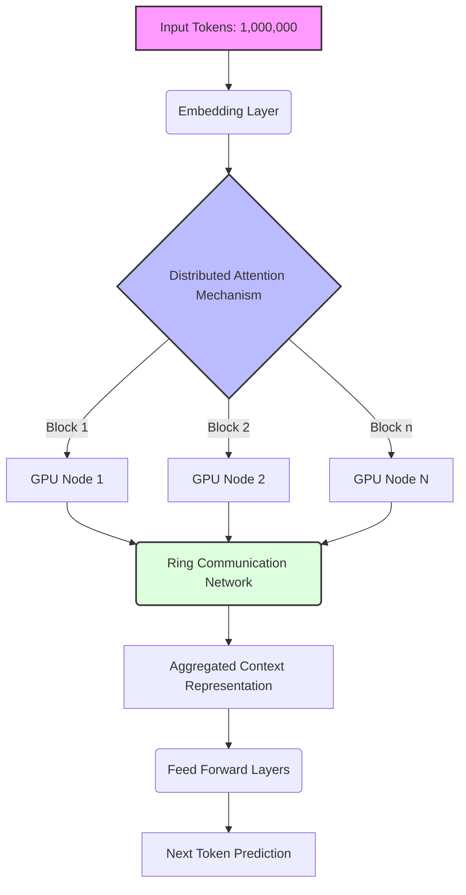
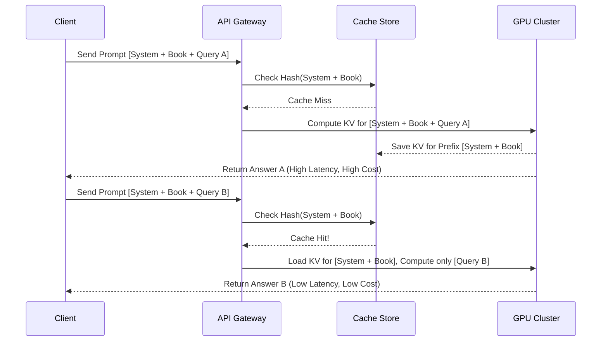
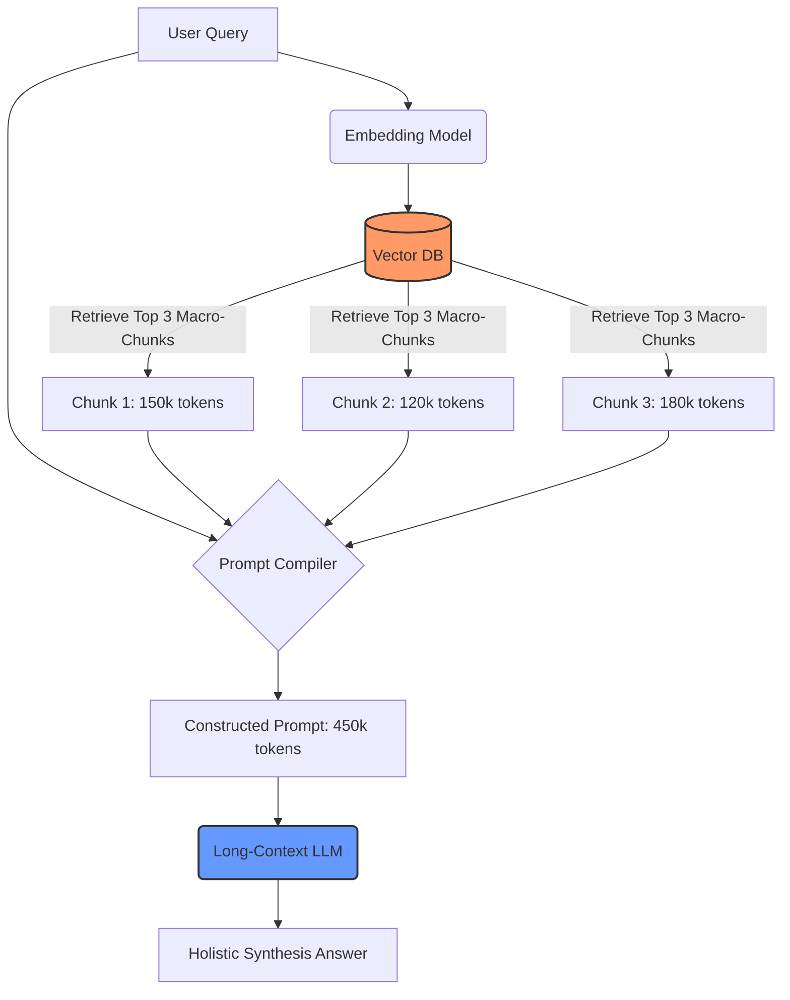

## Learning Outcomes

Upon completing this module, you will be able to:
- **Compare** the architectural differences, latency profiles, and cost structures between traditional Vector RAG architectures and long-context LLM approaches.
- **Design** application architectures that leverage prefix caching to minimize cost and maximize Time To First Token (TTFT) performance.
- **Diagnose** attention degradation and needle-in-a-haystack retrieval failures within contexts exceeding one million tokens.
- **Implement** cost-optimization patterns for massive context windows using the latest API features of models like Gemini 3.5 Pro and Claude 4.6.
- **Evaluate** the financial and computational trade-offs between dynamic retrieval augmented generation and static bulk-context loading, determining the exact break-even point for your workloads.
- **Construct** hybrid retrieval pipelines that utilize vector search for initial filtering and massive context windows for comprehensive synthesis.

## Why This Module Matters

In late 2025, a major fintech analytics firm, QuantStream Solutions, attempted to replace their complex, multi-stage RAG pipeline with a single, massive-context LLM call. They fed ten years of quarterly earnings reports—roughly 1.8 million tokens—directly into the model for every user query, assuming the model would perfectly synthesize the data without the need for semantic search. For the first two days, the system seemed miraculous, eliminating the need for vector databases, embedding models, and complex chunking strategies. The developers celebrated the simplification of their architecture and the immediate reduction in moving parts.

However, the architectural naivety quickly surfaced. Because they dynamically injected the user's short query at the *beginning* of the prompt before the massive block of historical data, they completely invalidated the prompt cache on every single request. Instead of paying fraction-of-a-cent caching rates, they were billed for processing 1.8 million tokens from scratch for every query. Within seventy-two hours, their API usage bill exceeded $120,000, wiping out their entire quarterly infrastructure budget. Furthermore, users began reporting that the model was hallucinating financial metrics from 2018 when asked about 2024, a classic symptom of attention degradation in unoptimized massive contexts.

This incident highlights the critical inflection point modern AI engineering has reached. We now possess models capable of ingesting entire codebases, libraries of documentation, and years of transactional history in a single prompt. But raw capacity does not equal architectural efficiency. Understanding how to structure prompts to exploit KV cache reuse, how to measure prefix caching cost models, and when to hybridize long-context with traditional RAG is the difference between a highly profitable, lightning-fast application and a catastrophic financial liability. This module provides the practitioner-level insights required to navigate this new paradigm safely and effectively, ensuring you can harness the power of millions of tokens without falling into the traps of latency and exponential cost.

## 1. The Physics of Massive Context Windows

To understand prompt caching, we must first understand the computational physics of what happens when you send one million tokens to an LLM. 

### The Quadratic Bottleneck of Attention

In a standard transformer architecture, the core mechanism is Self-Attention. For a sequence of length $N$, the attention mechanism must compute the relationship between every single token and every other token. This results in a computational complexity of $O(N^2)$ for both time and memory. 

When context windows were limited to 4k or 8k tokens, this quadratic scaling was manageable. However, as we scale to 1M or 2M tokens, $N^2$ becomes an astronomical figure. 

If computing attention for 8,000 tokens takes $X$ amount of memory, computing it for 1,000,000 tokens does not take $125X$; it theoretically requires $15,625X$ memory due to the quadratic curve.

### Overcoming the Limits: RingAttention and Sparse Attention

The leap to models like Claude 4.6 and Gemini 3.5 Pro was not achieved merely by adding more GPUs. It required algorithmic breakthroughs:

1.  **RingAttention**: Instead of forcing a single GPU cluster to hold the entire $N \times N$ attention matrix, RingAttention distributes the sequence across a ring of interconnected devices. Each device computes attention for a block of tokens and passes the keys and values to the next device in the ring, overlapping computation with communication.
2.  **KV Caching**: During generation, the model caches the Key (K) and Value (V) tensors for all previous tokens. This prevents the model from recomputing the attention representations for the entire prompt every time it generates a new single word.
3.  **RoPE Scaling (Rotary Position Embeddings)**: Techniques like YaRN (Yet another RoPE extensioN method) dynamically adjust the frequency of positional embeddings, allowing models trained on shorter contexts to extrapolate their understanding of token positions out to millions of tokens without catastrophic degradation.



## 2. The Needle-in-a-Haystack Problem

Just because a model *can* ingest two million tokens does not mean it pays equal attention to all of them. The "Needle in a Haystack" evaluation is the standard industry test for long-context models: a specific, obscure fact (the needle) is hidden deep within hundreds of thousands of words of irrelevant text (the haystack). The model is then asked a question that can only be answered by finding that needle.

### The U-Shaped Attention Curve

Empirical testing across almost all massive-context models reveals a U-shaped performance curve regarding information retrieval:

*   **Beginning of Prompt (Primacy Effect)**: High retrieval accuracy. The model pays strong attention to the system instructions and the first few documents.
*   **Middle of Prompt (The "Lost in the Middle" Zone)**: Severe degradation. Needles placed here are frequently ignored or hallucinated over.
*   **End of Prompt (Recency Effect)**: High retrieval accuracy. The model strongly weighs the most recent tokens right before the generation phase.

### Diagnosing Retrieval Failures

When a long-context application fails, developers often assume the model isn't smart enough. In reality, it's usually a structural issue. Symptoms of needle-in-a-haystack failures include:
- The model answers based on pre-training knowledge instead of the provided context.
- The model summarizes the beginning and end of the document but ignores the core.
- The model hallucinates a plausible-sounding answer that contradicts a specific clause buried at token index 800,000.

> **Pause and predict**: If you are feeding a massive codebase to an LLM to find a specific security vulnerability, and the vulnerability is located in a file that happens to be concatenated in the exact middle of the 1.5 million token prompt, what mitigation strategy could you employ without removing code?

## 3. Prompt Caching: The Economic Engine of Long Context

Processing 1 million tokens costs significant compute. If a user asks five questions about a 1-million-token document, computing the attention matrix for the document five separate times is economically unviable.

Enter **Prompt Caching** (specifically, Prefix Caching).

### How Prefix Caching Works

When you send a prompt to an API that supports caching, the provider's infrastructure calculates the exact tokens. As the model processes the prompt layer by layer, it generates Key (K) and Value (V) tensors. 

Instead of discarding these massive multi-gigabyte tensors when the request finishes, the provider stores them in a high-speed memory layer (often NVMe or specialized RAM clusters), keyed by the exact hash of the token sequence.

When a subsequent request arrives, the infrastructure hashes the incoming prompt. If the first $M$ tokens perfectly match a stored hash, the system completely skips the computational phase for those $M$ tokens and loads the KV states directly from memory.

### The Strict Rules of Prefix Matching

Prefix caching is brutally literal. It requires an **exact, left-to-right token match**. 



If you change a single space, a single punctuation mark, or inject a dynamic timestamp at the beginning of your prompt, the hash changes, and the entire cache is invalidated for that request.

### Cost Models

Providers typically structure pricing to incentivize caching:
- **Base Input Token Cost**: $X per 1M tokens.
- **Cache Write Cost**: Often roughly equal to or slightly higher than the base cost (e.g., $1.25X). You pay this once to establish the cache.
- **Cache Read Cost**: Drastically cheaper, often 10% to 25% of the base cost (e.g., $0.10X). 

If you design your application correctly, 95% of your input volume should be billed at the Cache Read rate.

## 4. Architecting for Maximum Cache Hits

To achieve optimal economics, you must structure your payloads so the static, heavy information is front-loaded, and the dynamic, user-specific information is appended at the very end.

### Anti-Pattern: The Dynamic Header

This is the most common mistake engineers make when transitioning from simple chatbots to massive-context systems.

```python
# BAD ARCHITECTURE: Invalidates cache on every single call
def generate_bad_prompt(user_name, user_query, massive_document):
    # The dynamic data is at the FRONT. 
    # The prefix changes every time the user name changes!
    prompt = f"""
    Current Time: {datetime.now()}
    User: {user_name}
    
    Analyze the following 1-million word document based on the user's query:
    {user_query}
    
    DOCUMENT:
    {massive_document}
    """
    return prompt
```

### Best Practice: The Static Prefix Block

You must isolate the unchanging data and place it unconditionally at the beginning of the prompt sequence.

```python
# GOOD ARCHITECTURE: Maximizes Cache Hits
def generate_optimized_prompt(user_name, user_query, massive_document):
    # 1. System Instructions (Static)
    system_prompt = "You are an expert financial analyst. Rely strictly on the provided documents."
    
    # 2. Massive Knowledge Base (Static across many queries)
    knowledge_base = f"DOCUMENT:\n{massive_document}"
    
    # 3. Dynamic context and query (Appended at the end)
    dynamic_query = f"\nUser: {user_name}\nTime: {datetime.now()}\nQuery: {user_query}"
    
    # The prefix (system_prompt + knowledge_base) remains identical across requests.
    # The provider will cache this massive chunk.
    return system_prompt + knowledge_base + dynamic_query
```

### Multi-Tiered Caching

Modern architectures often employ multi-tiered prefixes to serve different user segments efficiently. For example, in a B2B SaaS application:

*   **Tier 1 Prefix (Global):** Core system instructions and global product documentation. (Shared across all customers).
*   **Tier 2 Prefix (Tenant):** The specific tenant's organizational data and historical logs. (Shared across all users within a company).
*   **Tier 3 Prefix (User):** The specific user's current session context.
*   **Suffix:** The immediate query.

By structuring the prompt exactly in this order: `[Global] + [Tenant] + [User] + [Query]`, the API can reuse the `[Global] + [Tenant]` KV cache for every employee in that company, resulting in massive cost savings.

> **Stop and think**: If Tenant A has 100 users and Tenant B has 5 users, and the Global prefix is 500k tokens, does Tenant B benefit from the Global prefix cache established by Tenant A's queries?

## 5. Long-Context vs. Traditional RAG: The Hybrid Future

With 2-million token windows, is traditional Vector RAG dead? Absolutely not. Massive context and RAG are complementary, not mutually exclusive.

### The Case for Traditional RAG
- **Infinite Corpus**: If your data is 50 gigabytes (billions of tokens), no context window can hold it. Vector RAG is required to filter the universe of data down to a manageable size.
- **Latency**: Even with a 100% cache hit, loading 2 million tokens of KV state from memory into the GPU SRAM takes time. A 2-million token cache hit might have a TTFT of 400ms-800ms. A 2000-token RAG context might have a TTFT of 15ms. If you are building a real-time voice assistant, 800ms is unacceptable.
- **Precision**: Smaller, highly relevant contexts suffer less from the "Lost in the Middle" attention degradation.

### The Case for Massive Context
- **Holistic Synthesis**: If a user asks, "Summarize the changing tone of the CEO across all 50 earnings calls from 2015 to 2025," traditional RAG will fail. Vector search retrieves isolated chunks based on semantic similarity. It cannot piece together a decade-long narrative arc. Massive context can read the entire history simultaneously.
- **Codebase Refactoring**: Changing a function signature in a core library requires understanding how every other file in the repository uses that function. RAG misses edge cases. Passing the entire codebase in a single prompt allows the LLM to perform accurate, repository-wide reasoning.

### The Hybrid Architecture: "Pre-filtered Bulk Context"

The state-of-the-art approach combines both. Instead of chunking documents into tiny 512-token paragraphs, architectures now use "Macro-RAG."

1.  **Macro-Chunking**: Break a massive library into logical blocks of 100,000 tokens (e.g., "All 2023 financial reports", "The entire frontend repository").
2.  **Semantic Routing**: Use a fast, cheap model or traditional vector search to determine *which* macro-chunks are relevant.
3.  **Bulk Injection**: Inject 3 or 4 of these 100,000-token macro-chunks into the long-context LLM.

This guarantees that the LLM has all necessary surrounding context (avoiding the fragmentation of traditional RAG) while keeping the total token count under the threshold of severe attention degradation and controlling costs.



## 6. Advanced Mitigation for Attention Degradation

When you must use a massive context window, you can employ prompt engineering techniques to force the model's attention mechanism to stay sharp across the entire document.

### The "Chain of Density" for Retrieval
Ask the model to first explicitly list the locations or quotes of relevant information before answering. By forcing the model to output the intermediate retrieval steps, you drag the relevant hidden context into the highly-weighted "recency" zone of the prompt (the end), effectively refreshing the model's memory just before it synthesizes the final answer.

**Example Prompt Addition:**
`Before answering the query, read the entire document. Extract exactly 5 direct quotes from the text that are relevant to the query, and state their surrounding context. Then, using ONLY those quotes, formulate your final answer.`

### Strategic Repetition
If there are core rules or system constraints that the model *must not forget*, do not just state them at the beginning. Repeat the core constraints at the very end of the prompt, right next to the user query. This exploits the recency effect of the U-shaped attention curve.

## 7. Operationalizing the Cache: A Practitioner's Guide

To truly benefit from prompt caching, you must operationalize it in your backend infrastructure.

### Cache Warm-up Strategies
If you have a global prefix (e.g., your company's master documentation) that takes 15 seconds to process uncached, you do not want your first user of the day to experience a 15-second TTFT. 

Implement a CRON job that sends a "dummy" request using the exact global prefix every hour (or whatever the provider's Cache TTL is). This ensures the KV cache remains hot in the provider's memory, guaranteeing low latency for all actual users.

### Measuring and Monitoring
You cannot optimize what you do not measure. You must log the exact token counts for Cache Read and Cache Write on every request. 

```python
# Example pseudo-code for tracking API usage economics
def execute_llm_call(prompt):
    response = llm_api.generate(prompt)
    
    # Extract metadata provided by modern APIs
    uncached_tokens = response.usage.prompt_tokens - response.usage.cached_tokens
    cached_tokens = response.usage.cached_tokens
    
    cost_uncached = (uncached_tokens / 1_000_000) * 3.00 # Example base price
    cost_cached = (cached_tokens / 1_000_000) * 0.30     # Example cache read price
    
    log_metrics(
        total_cost=cost_uncached + cost_cached,
        cache_hit_ratio=cached_tokens / response.usage.prompt_tokens,
        ttft=response.metrics.time_to_first_token
    )
    
    return response.text
```

If your cache hit ratio drops below 80% on a system designed for massive static context, it immediately signals a regression in how your application concatenates strings.

## War Stories from the Edge of Context

**The "Innocent" Timestamp**: A healthcare startup loaded 500 patient histories into a massive context window to look for cross-patient epidemiological trends. Their system prompt started with: `Report generated on: {current_date_time}. Analyze the following records...` Because the time changed down to the second on every execution, the prefix hash changed. They paid full price for 800,000 tokens on 5,000 consecutive queries before noticing the billing spike. Moving the timestamp to the bottom of the prompt reduced their daily API cost from $1,200 to $18.

**The Formatter's Folly**: A data engineering team used an automated code formatter (like `black` or `prettier`) on their backend pipeline. The formatter silently converted tabs to spaces in the string literal that held their massive system prompt. Because the API gateway hashes the exact bytes of the string, the change from `\t` to `    ` invalidated the cache for their entire global user base, causing an immediate 800% latency spike during peak hours.

## Did You Know?

- **Fact 1:** The jump from 128k to 1M token context windows required a fundamental shift in memory management, moving from standard flash attention to distributed RingAttention algorithms across multiple GPU clusters to handle the quadratic memory explosion.
- **Fact 2:** Processing 1 million tokens without caching requires approximately 3000 PetaFLOPs of compute, whereas a 99 percent cache hit reduces the required compute on the provider side by over two orders of magnitude, which is why they pass the savings to you.
- **Fact 3:** The theoretical limit of Rotary Position Embedding (RoPE) scaling currently tested in lab environments exceeds 10 million tokens, though empirical testing shows retrieval accuracy degrades significantly past 2 million without highly specialized, domain-specific fine-tuning.
- **Fact 4:** In benchmark testing, accessing a fully cached 2-million token prefix can yield a Time To First Token (TTFT) of under 400 milliseconds, compared to over 25 seconds for an uncached processing run of the exact same size.

## Common Mistakes

| Mistake | Why it happens | Fix |
| :--- | :--- | :--- |
| **Dynamic Headers** | Developers naturally put timestamps, user IDs, or current session states at the top of the prompt for readability. | Force all dynamic variables to the absolute end of the prompt string. The static payload must form the unbroken prefix. |
| **Assuming Linear Attention** | Believing a model pays equal attention to token 500,000 as it does to token 10. | Assume the "Lost in the Middle" phenomenon is real. Use "Chain of Density" prompting to force the model to resurface middle-data before answering. |
| **Ignoring Cache TTL** | Providers evict caches after a period of inactivity (e.g., 5-15 minutes). If requests are sparse, you pay full price every time. | Implement a CRON job to send a dummy request with your static prefix to keep the KV cache warm in the provider's memory. |
| **Over-relying on Long Context** | Using a 1M token window for a simple QA task that a vector database could filter to 2k tokens in milliseconds. | Use massive context for synthesis and cross-document reasoning. Use Vector RAG for needle-in-haystack fact retrieval. |
| **String Formatting Jitter** | Minor whitespace changes, differing line endings (CRLF vs LF), or trailing spaces in the constructed prompt. | Treat your static prefix as an immutable artifact. Load it from a locked file, do not construct it dynamically with string interpolation. |
| **Ignoring Sub-Document Structure** | Dumping raw text without XML tags or markdown headers. The model loses its semantic bearings in a sea of raw characters. | Wrap massive documents in clear XML tags (e.g., `<financial_report_2023> ... </financial_report_2023>`) to provide structural landmarks. |

## Hands-On Exercise

In this exercise, you will debug a high-cost LLM pipeline and restructure it to utilize prefix caching effectively.

**Scenario:**
You inherited a Python script that analyzes customer support transcripts. It loads a massive 800k-token employee handbook, then appends a specific customer transcript, and asks for an analysis. The script is currently costing $2.50 per run and taking 18 seconds to return the first token.

### Tasks:

1.  **Analyze the existing code structure.** Look at the `construct_prompt` function and identify exactly where the caching mechanism is being broken.
2.  **Refactor the prompt construction.** Separate the payload into a `STATIC_PREFIX` and a `DYNAMIC_SUFFIX`.
3.  **Implement multi-tenant caching.** Assume you now have two handbooks (Company A and Company B). Structure the code so that requests for Company A reuse Company A's cache, without mixing up the data.
4.  **Implement a Cache Warm-up function.** Write a simple function that can be called on a schedule to prevent the API provider from evicting your massive handbook from their KV cache.

<details>
<summary><strong>Task 1 & 2 Solution: Refactoring for the Cache</strong></summary>

**Original Bad Code:**
```python
def analyze_transcript(ticket_id, transcript, handbook_text):
    prompt = f"Ticket: {ticket_id}\n\nHANDBOOK:\n{handbook_text}\n\nTRANSCRIPT:\n{transcript}\n\nDid the agent follow the handbook?"
    return call_api(prompt)
```
*Why it fails:* `ticket_id` is unique per call and is at the very beginning. The prefix changes every time.

**Refactored Good Code:**
```python
def analyze_transcript(ticket_id, transcript, handbook_text):
    # The massive, unchanging data is at the very front.
    static_prefix = f"HANDBOOK:\n{handbook_text}\n\n"
    
    # The unique data is appended at the end.
    dynamic_suffix = f"Ticket: {ticket_id}\nTRANSCRIPT:\n{transcript}\n\nDid the agent follow the handbook?"
    
    prompt = static_prefix + dynamic_suffix
    return call_api(prompt)
```
</details>

<details>
<summary><strong>Task 3 Solution: Multi-Tenant Structuring</strong></summary>

```python
# Load these once at startup, not per request
GLOBAL_SYSTEM_PROMPT = "You are an QA auditor. Follow instructions strictly.\n"
TENANT_HANDBOOKS = {
    "tenant_a": load_file("handbook_a.txt"),
    "tenant_b": load_file("handbook_b.txt")
}

def analyze_tenant_transcript(tenant_id, ticket_id, transcript):
    # This prefix will uniquely cache for Tenant A or Tenant B
    # Global prompt is shared, maximizing efficiency if the provider supports sub-prefix caching
    tenant_prefix = GLOBAL_SYSTEM_PROMPT + f"HANDBOOK:\n{TENANT_HANDBOOKS[tenant_id]}\n\n"
    
    dynamic_suffix = f"Ticket: {ticket_id}\nTRANSCRIPT:\n{transcript}\nAnalyze agent compliance."
    
    return call_api(tenant_prefix + dynamic_suffix)
```
</details>

<details>
<summary><strong>Task 4 Solution: Cache Warm-up</strong></summary>

```python
def warmup_cache(tenant_id):
    """Call this every 5 minutes via CRON to keep KV cache alive."""
    tenant_prefix = GLOBAL_SYSTEM_PROMPT + f"HANDBOOK:\n{TENANT_HANDBOOKS[tenant_id]}\n\n"
    
    # Append a very cheap, fast-to-evaluate dynamic suffix
    dummy_suffix = "SYSTEM WARMUP. Reply with 'OK'."
    
    # This call costs almost nothing if cached, but resets the eviction timer on the provider side
    call_api(tenant_prefix + dummy_suffix, max_tokens=2)
    print(f"Cache warmed for {tenant_id}")
```
</details>

### Success Checklist
- [ ] You have verified that dynamic variables (time, IDs) are entirely removed from the top 90% of your prompt.
- [ ] You have wrapped your static documents in clear structural tags (Markdown or XML).
- [ ] You have implemented a mechanism to track the `cached_tokens` metric returned by the API to ensure your hit rate remains above 90%.

## Quiz

<details>
<summary><strong>1. You are building a system to analyze daily financial news against a static 1.5M token database of company history. You want to minimize costs. Which prompt structure is most efficient?</strong></summary>
**Answer:** The prompt must begin with the static 1.5M token company history, followed by the daily financial news, and end with the specific user query. WHY: Prefix caching requires an exact left-to-right token match. By placing the massive, unchanging database at the very beginning, the API provider can cache its KV states. If you put the daily news at the top, the prefix changes every day, invalidating the cache and forcing you to pay base compute costs for the entire 1.5M tokens.
</details>

<details>
<summary><strong>2. Your long-context model is failing to extract a specific clause from page 400 of a 1000-page legal contract, even though the contract fits well within the 2-million token window. What is the most likely architectural cause?</strong></summary>
**Answer:** The model is suffering from the "Lost in the Middle" attention degradation phenomenon. WHY: Long-context models exhibit a U-shaped attention curve. They pay strong attention to the beginning (primacy) and the end (recency) of a prompt, but attention heavily dilutes in the middle. The clause on page 400 is buried in this low-attention zone.
</details>

<details>
<summary><strong>3. A developer decides to add a UUID to the very first line of a system prompt for tracing purposes: `Trace-ID: 8f7e... \n You are a helpful assistant...`. The system passes a 500k token context block after this line. What is the financial impact of this decision?</strong></summary>
**Answer:** The system will experience a 0% cache hit rate and incur massive, exponential cost increases. WHY: Prefix caching relies on cryptographic hashing of the token sequence. Because the UUID changes on every single request, the hash of the prompt's beginning changes instantly. The API provider will never find a matching KV cache and will recompute the 500k token block from scratch for every query.
</details>

<details>
<summary><strong>4. You need to build a customer support bot that can answer questions based on a 50-gigabyte library of technical manuals. Should you use a 2-million token massive context model or traditional Vector RAG?</strong></summary>
**Answer:** You must use traditional Vector RAG (or a hybrid Macro-RAG approach). WHY: 50 gigabytes of text is roughly 15 to 20 billion tokens. This exceeds even the largest available context windows by orders of magnitude. You mathematically cannot fit the data into the context window, so you must use vector search to retrieve only the semantically relevant chunks before passing them to the LLM.
</details>

<details>
<summary><strong>5. Your application successfully achieves a 95% cache hit rate on a 1-million token prefix. However, users are complaining that the Time To First Token (TTFT) is still around 600 milliseconds, which feels sluggish for a chat interface. Why isn't the response instantaneous if it's cached?</strong></summary>
**Answer:** Loading cached KV states from memory to GPU SRAM is incredibly fast, but it is not governed by zero-latency magic. WHY: A 1-million token KV cache represents gigabytes of raw tensor data. Even with high-bandwidth interconnects, physically moving this data from the provider's storage tier into the GPU's active memory takes hundreds of milliseconds. While 600ms is vastly superior to the 20+ seconds it would take to compute from scratch, it is the physical floor for massive context retrieval.
</details>

<details>
<summary><strong>6. To combat attention degradation, you implement a "Chain of Density" prompting strategy. You instruct the model to first extract and quote relevant sections before answering. Where in the prompt should this instruction be placed for maximum effect?</strong></summary>
**Answer:** The instruction should be placed at the very end of the prompt, immediately following the massive context payload and right before the generation begins. WHY: Placing the instruction at the end leverages the recency effect of the attention mechanism. It forces the model to actively scan back through the context and pull the relevant information into the high-attention zone right before it begins synthesizing the final response.
</details>

## Next Module

Now that you have mastered the economics and architecture of massive context windows, you are ready to explore how to build resilient systems when the LLM inevitably fails to follow instructions. 

Continue to [Module 3.6: Fallbacks, Retries, and Defensive Engineering](./module-3.6-defensive-engineering), where we will cover exponential backoff strategies, semantic validation loops, and how to gracefully degrade your application's UX when the API provider experiences a catastrophic outage.