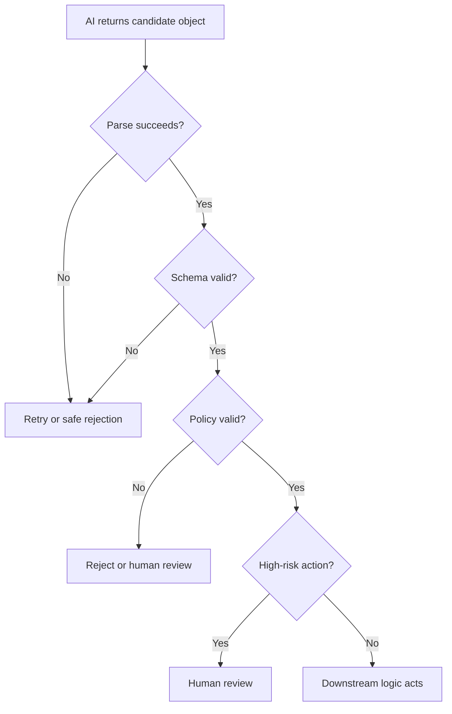

> **AI Building** | Complexity: `[MEDIUM]` | Time: 55-70 min | Prerequisites: Module 1.1, basic API literacy, and comfort reading JSON

## Learning Outcomes

By the end of this module, you will be able to:

- **Select** an AI model for a product workflow using latency, cost, reasoning depth, tool support, and risk constraints.
- **Design** a context package that gives the model the task, data, constraints, and examples it needs to produce useful output.
- **Compare** free-form prose, structured output, and tool calls for different application behaviors.
- **Build** a validation strategy that sits between model output and downstream application logic.
- **Evaluate** an AI API integration for failure modes before it affects users, databases, or automated workflows.

## Why This Module Matters

A product manager opens the dashboard on Monday morning and sees that hundreds of support tickets were routed to the wrong queue. The AI feature was not obviously broken, and it returned confident summaries, and it produced valid JSON most of the time. It even looked impressive in the demo, and the failure happened because the team treated the model as the product boundary. The application sent a vague prompt, and the model guessed from incomplete context.

The response was parsed as if formatting meant correctness, and then the downstream workflow trusted the parsed fields and moved real customer requests into the wrong queues. This is the common shape of weak AI products, and they fail at the seams between model behavior and software behavior. The model is probabilistic, and the application is deterministic, and the API call connects the two, but it does not make them the same kind of system.

A strong AI product is designed around that mismatch, and the builder chooses a model for the job, not for hype. The builder supplies context deliberately, not as an afterthought, and the builder asks for output in a shape the application can inspect. The builder validates that output before any irreversible action, and this module teaches that system shape, and it starts with the model choice because model behavior changes product behavior. It moves into context because the model can only use what it receives.

It then introduces structured output because software needs contracts, and it finishes with the validation layer because structured output without validation is just a better-looking failure.

## Model Choice Is Product Design

Model choice is not only an infrastructure decision, and it changes the user experience, and it changes cost. It changes latency, and it changes how often the application needs fallback behavior, and it changes which tasks should be automated and which tasks should pause for review. A model that is excellent for a slow, high-stakes analysis may be a poor choice for inline autocomplete. A model that is excellent for cheap classification may be a poor choice for debugging a multi-step incident report.

A model that supports tools may be required for a workflow that needs search, file lookup, or code execution. A model with a large context window may let the application include complete documents. A smaller model may require retrieval and summarization before the call. A model with stronger reasoning may reduce review burden in complex cases. A faster model may make the interface feel immediate. The important product question is not "which model is best?"

The important question is "which model is best for this workflow under these constraints?", and those constraints are usually visible before implementation. You can list them, and you can rank them, and you can test them. You can revisit them when usage grows.

### The Basic Tradeoff Map

| Product Need | Model Attribute That Matters | Why It Matters |
|---|---|---|
| Inline UI suggestions | low latency | the user is waiting in the interface |
| Batch document review | cost and throughput | many calls may run without a human waiting |
| Security analysis | reasoning depth and conservative behavior | false confidence can create risk |
| Customer support routing | structured output and consistency | downstream systems need stable fields |
| Fresh market or policy answers | retrieval or search support | static model knowledge may be stale |
| Long contract review | context size and grounding strategy | the model needs enough source material |
| Workflow automation | tool support and validation | the model may trigger real actions |

This table is a starting point, not a scoring system, and the same feature may have multiple modes. A support product might use a fast model to classify every ticket. It might use a stronger model only when the first model reports low confidence, and it might send high-risk billing cases to a human even when the model is confident. That layered design is usually better than choosing one expensive model for everything.

It is also usually better than choosing one cheap model for everything.

### Worked Decision Example: Support Ticket Triage

A team is building a support ticket triage feature, and the feature receives new tickets from email and chat. It must classify each ticket into one of these queues:

- `billing`
- `login_access`
- `bug_report`
- `feature_request`
- `security_risk`
- `other`

It must also assign severity:

- `low`
- `medium`
- `high`
- `critical`

The team is choosing between two specific models in its API catalog, and the first option is `gpt-5 mini`. It is faster and cheaper, and it is a good fit for well-defined tasks, while the second option is `gpt-5.2`, which is [stronger for complex reasoning and agentic work](https://openai.com/index/introducing-gpt-5-2/). It costs more and may not be necessary for simple classification, and the first product requirement says tickets must appear in the correct queue within a few seconds.

The second requirement says security-risk tickets must not be missed, and the third requirement says the team processes many routine tickets every day. The fourth requirement says a human support lead already reviews critical escalations. A weak decision would say: "Use the strongest model because it is best." That ignores cost and workflow shape. Another weak decision would say: "Use the cheapest model because it is only classification." That ignores the high-risk class.

A stronger decision separates the workflow, and use `gpt-5 mini` for the first-pass classification because most tickets are routine and the output schema is narrow. Add validation rules that reject impossible combinations, and add a second pass with `gpt-5.2` only for ambiguous, security-related, or high-severity tickets. Send any ticket that remains uncertain to a human queue, and this is product design, and the model choice is connected to the user experience, risk model, and operational cost.

The implementation does not pretend one model solves every case, and it creates a path for ordinary cases and a different path for risky cases.

### Decision Point: Choose The Model Path

Your team is adding an AI feature to a live chat support tool, and the agent types a short customer question and expects a suggested reply while the customer waits. Some conversations mention account lockouts, and some conversations mention possible fraud, and you have two implementation options. Option A uses a fast model for every suggestion and blocks messages that match a high-risk policy, and option B uses a stronger model for every suggestion and makes the agent wait longer.

Before reading the answer, decide which option you would start with and what guardrail you would add. A reasonable first design is Option A with clear escalation behavior. The fast model keeps the interface responsive, and the policy check prevents the application from casually suggesting unsafe actions in high-risk cases. The stronger model can still be used as a second pass when the case is complex, sensitive, or unclear. The key is not that fast is always better.

The key is that the user experience requires speed for ordinary cases and caution for risky cases, and that pushes you toward a tiered design.

### A Simple Model Selection Checklist

Start with the task, and do not start with the model catalog, and ask what the user is trying to accomplish. Ask what the application will do with the result, and ask whether the model output affects money, security, health, access, legal status, production systems, or customer trust. Ask how quickly the user expects a response, and ask whether the task requires current information, and ask whether the task needs tools. Ask whether the task needs long context.

Ask whether the result can be checked mechanically, and ask what happens when the model is uncertain, and ask what happens when the model is wrong. Only after those questions should you choose the model. A practical selection record can be short, and it should be explicit enough that a teammate can challenge it.

```text
Feature: support ticket routing

Primary model:
gpt-5 mini

Why:
Low-latency structured classification is the common path.
The allowed labels are narrow.
Most tickets are routine.
The validation layer can reject invalid labels.

Escalation model:
gpt-5.2

When:
The ticket mentions security, fraud, account takeover, legal threats, or self-harm.
The first pass reports low confidence.
The output fails validation twice.
The summary conflicts with the selected queue.

Human review:
Always required for critical severity.
Always required for account closure or refund automation.
```

This record is not busywork, and it documents the product logic, and it also makes testing easier. If latency becomes unacceptable, you know where to measure, and if security tickets are misrouted, you know which escalation rule to inspect. If costs grow, you know which calls are common and which are exceptional.

### Model Choice Anti-Pattern: Hype-First Architecture

Hype-first architecture starts with a model announcement, and then the team looks for a place to use it, and that approach often creates fragile systems. The model may be powerful but mismatched to the workflow, and the output may be impressive but not inspectable. The feature may demo well but fail under repeated usage, and the better approach starts with workflow design, and the model is one component in that workflow. The API request is one boundary in that workflow.

The context package is one input to that workflow, and the validation layer is one safety control in that workflow. The human review path is one operational control in that workflow. A senior builder can explain all of those pieces. A beginner often focuses only on the prompt, and this module moves you from the beginner view to the system view.

## Context Is The Real Interface

The model only sees what you provide, and that sounds obvious, and it is the reason many AI features fail. A human support agent sees the customer account, the product area, the service level, the previous conversation, and the company's policies. A model sees only the request payload, and if the request payload does not include the policy, the model cannot obey the policy reliably. If the request payload does not include the customer plan, the model may assume the wrong entitlement.

If the request payload does not include examples of the expected classification, the model may invent its own labels. If the request payload includes too much irrelevant material, the model may focus on the wrong evidence, and context is the real interface between your application and the model. The prompt is only one part of that context.

### What Goes Into Context

A useful context package usually contains several parts, and it includes the system or developer instruction, and it includes the user's request. It includes retrieved documents or records, and it includes examples when the task benefits from examples, and it includes constraints. It includes output requirements, and it includes tool results when tools were called earlier in the workflow, and it may include previous messages. It may include metadata such as user role, plan, locale, region, or product version.

Each part should earn its place, and do not include data simply because it is available, and do not omit data simply because the prompt looks cleaner without it. A strong context package is like a good incident handoff, and it gives the next operator the facts needed to act. It leaves out noise, and it makes constraints visible, and it names the expected decision.

### Context Anatomy

```text
+------------------------------------------------------------+
|                   AI Request Context                       |
+----------------------+-------------------------------------+
| Task instruction     | What the model must do              |
| User input           | The raw request or conversation     |
| Retrieved facts      | Policies, docs, records, examples  |
| Constraints          | Allowed actions and forbidden ones |
| Output contract      | Required fields and value formats  |
| Risk guidance        | When to escalate or refuse         |
+----------------------+-------------------------------------+
```

This is the first mental model to keep, and the model is not reading your database, and it is not reading your product requirements. It is not reading your company policy, and it is reading the context you send, and if an important fact is missing, the model may guess. If an important constraint is missing, the model may violate it, and if the output contract is missing, the model may answer in a shape your software cannot use.

### Weak Prompt Versus Designed Context

A weak approach asks for a good prompt.

```text
Read this support ticket and tell me what it is about.
```

This might produce a helpful paragraph, and it might also produce a paragraph that is difficult to route, and it may use labels that the downstream system does not recognize. It may fail to distinguish urgency from emotion, and it may skip escalation criteria. A designed context package is more explicit.

```text
You classify incoming support tickets for routing.

Use only these issue_type values:
- billing
- login_access
- bug_report
- feature_request
- security_risk
- other

Use only these severity values:
- low
- medium
- high
- critical

Escalate to human review when:
- the customer reports suspected fraud
- the customer cannot access an account with admin privileges
- the ticket mentions legal action
- the ticket asks for refunds above the automated limit
- the content is too ambiguous to classify safely

Ticket:
{{ticket_text}}

Return a JSON object matching the schema provided by the application.
```

The second version is not better because it is longer, and it is better because it contains the decision boundaries. It tells the model what labels are allowed, and it tells the model when the automation should stop, and it connects output shape to application behavior.

### Prediction Check: Missing Context

Imagine a ticket says:.

```text
Unable to log in. This is urgent. We have payroll today.
```

The application sends only that sentence to the model, and it does not send the customer's plan, and it does not send whether the user is an admin. It does not send the support policy, and it does not send the escalation rules, and predict what the model may do wrong. The model may classify the ticket as `login_access`, which is probably correct, and it may assign `critical` because the word "urgent" appears. It may fail to escalate even if the customer is an admin for a payroll system.

It may over-escalate even if the customer is on a trial plan with no production access, and the missing facts create ambiguity. The model cannot infer the business policy from the ticket alone, and the fix is not a cleverer phrase. The fix is better context, and include account role, and include service tier. Include whether payroll is a supported critical workflow, and include escalation criteria, and then validate that the output follows the allowed values.

### Context Quality Is A Product Lever

Context quality changes output quality more reliably than prompt decoration, and if the model receives the wrong policy, it will follow the wrong policy. If it receives stale documentation, it may generate stale guidance, and if it receives irrelevant documents, it may blend unrelated facts. If it receives contradictory instructions, it may choose one unpredictably, and if it receives examples with hidden bias, it may repeat that bias. A production system should treat context as data.

That means it should be versioned, and it should be tested, and it should be reviewed. It should be observable, and it should be small enough to inspect when something goes wrong, and for example, a support classifier should log the policy version used for classification. It should log the retrieved document identifiers, and it should log the model name, and it should log whether validation passed. It should log whether human escalation occurred, and it should not log sensitive user content unless the organization has a clear privacy and retention policy.

This is where AI engineering becomes normal software engineering, and the model call is not magic, and it is a request with inputs, outputs, metadata, and failure modes.

### Context Budget And Compression

Every model has a context limit, and even large context windows are not a reason to dump everything, and more context can help when the extra material is relevant. More context can hurt when the extra material distracts from the task, and the practical question is not "how much can I fit. The practical question is "what evidence does the model need to make this decision", and for classification, the model may need only the ticket, policy, labels, and a few examples.

For contract review, it may need the full clause, related definitions, and the playbook, and for incident analysis, it may need logs, timeline, deployment diff, and service ownership data. For code generation, it may need interfaces, tests, constraints, and surrounding files. A good context package is shaped by the task. If the context is too large, consider retrieval, and if retrieval returns too much, rank or summarize, and if summarization loses important details, use structured extraction first.

If the task is high risk, prefer preserving source excerpts over lossy summaries.

### Designing Context In Layers

You can design context in layers, and the first layer is stable instruction, and it changes rarely. It defines the role, allowed behavior, and output contract, and the second layer is workflow policy, and it changes when the business changes. It includes escalation rules, allowed labels, and thresholds, and the third layer is case data, and it changes on every request. It includes the ticket, document, conversation, or user input, and the fourth layer is retrieved evidence.

It changes depending on search results, file results, or tool calls, and the fifth layer is examples, and it changes when evaluation shows the model needs calibration. Layering matters because each layer has a different owner, and product and policy owners may review workflow policy, and engineers may review output contract and validation. Support leads may review examples, and security teams may review high-risk rules, and when all of this is hidden in one giant prompt string, ownership becomes unclear.

When context is structured deliberately, the system becomes easier to maintain.

## Free-Form Output, Structured Output, And Contracts

Free-form output is useful, and it is often the right choice, and if a human is meant to read the answer, prose may be fine. A writing assistant can return a paragraph. A tutor can explain a concept. A brainstorming tool can offer several options. A code review assistant can write narrative feedback, and the problem appears when software needs to act on that output. Downstream logic needs stable fields. A router needs labels.

A UI renderer needs predictable properties. A database insert needs types, and an alerting rule needs thresholds. An automation engine needs explicit commands, and free-form prose makes those systems brittle, and structured output gives the application a contract. The contract does not make the answer true, and it makes the answer inspectable, and it gives the application a way to reject invalid output. It gives tests something concrete to assert.

### Free-Form Output Versus Structured Output

Free-form output is good for:.

- explanation
- drafting
- rewriting
- brainstorming
- mentoring
- summarizing for a human reader

Structured output is better for:.

- field extraction
- classification
- workflow routing
- UI rendering
- database-ready objects
- queue assignment
- policy decisions
- automation inputs

If the system needs downstream logic, structured output is usually the safer choice, and the practical rule is simple. If a human is meant to read the answer, prose may be fine, and if a system is meant to act on the answer, prefer structure first. The structure can still include a short human-readable summary, and that summary should not be the field that drives automation.

### Example: Weak Version

```text
Read this support ticket and tell me what it is about.
```

This prompt asks for meaning, and it does not ask for a contract, and the model may answer:.

```text
The customer is frustrated because they cannot access their account and need urgent help.
```

That may be true, and it is not enough for automation, and the router still needs a queue. The escalation policy still needs a severity, and the support UI still needs a short summary, and the audit trail still needs to know whether a human review was required.

### Example: Safer Version

```text
Read this support ticket.
Return JSON with:
- issue_type
- severity
- likely_product_area
- requires_human_escalation
- short_summary
```

Now the application has something it can validate and route, and the output is no longer just language, and it is a candidate decision object. The word "candidate" matters, and the application still has to check it.

### A Better Contract

The safer version above is better than prose, and it is still incomplete for production, and it names fields but not allowed values. It does not define severity, and it does not define escalation criteria, and it does not say what to do when the model is uncertain. It does not define maximum summary length, and it does not require evidence. A stronger contract is more explicit.

```json
{
  "issue_type": "login_access",
  "severity": "high",
  "likely_product_area": "authentication",
  "requires_human_escalation": true,
  "confidence": 0.72,
  "evidence": [
    "customer cannot log in",
    "payroll deadline today"
  ],
  "short_summary": "Customer cannot access payroll system before deadline."
}
```

This object is useful because each field has a job, and `issue_type` drives queue routing, and `severity` affects prioritization. `likely_product_area` helps assignment, and `requires_human_escalation` prevents risky automation, and `confidence` helps decide whether to review. `evidence` supports inspection, and `short_summary` helps the human understand the case, and the object is still not automatically safe. It is a candidate output, and the validation layer decides whether it can be used.

### Schema Thinking

A schema is a contract for shape, and it says which fields exist, and it says which types are expected. It says which values are allowed, and it can say which fields are required, and it can say how long a string may be. It can say whether extra fields are allowed, and it cannot prove that the model's classification is correct, and it cannot prove that the model's evidence is sufficient. It cannot prove that the model understood the customer's business context.

That distinction is central. A schema catches shape errors, and business validation catches policy errors. Human review catches cases where judgment is required, and you often need all three.

### Runnable Validation Example

The following Python script validates a candidate support ticket classification, and it uses only the Python standard library, and it does not call an AI API. That is intentional, and you are testing the boundary after the model call.

```python
#!/usr/bin/env python3
import json
from typing import Any

ALLOWED_ISSUE_TYPES = {
    "billing",
    "login_access",
    "bug_report",
    "feature_request",
    "security_risk",
    "other",
}

ALLOWED_SEVERITIES = {"low", "medium", "high", "critical"}

REQUIRED_FIELDS = {
    "issue_type",
    "severity",
    "likely_product_area",
    "requires_human_escalation",
    "confidence",
    "evidence",
    "short_summary",
}


def validate_classification(candidate: dict[str, Any]) -> list[str]:
    errors: list[str] = []

    missing = REQUIRED_FIELDS - set(candidate)
    if missing:
        errors.append(f"missing required fields: {sorted(missing)}")

    if candidate.get("issue_type") not in ALLOWED_ISSUE_TYPES:
        errors.append("issue_type is not an allowed value")

    if candidate.get("severity") not in ALLOWED_SEVERITIES:
        errors.append("severity is not an allowed value")

    if not isinstance(candidate.get("requires_human_escalation"), bool):
        errors.append("requires_human_escalation must be a boolean")

    confidence = candidate.get("confidence")
    if not isinstance(confidence, int | float) or not 0 <= confidence <= 1:
        errors.append("confidence must be a number from 0 to 1")

    evidence = candidate.get("evidence")
    if not isinstance(evidence, list) or not evidence:
        errors.append("evidence must be a non-empty list")

    summary = candidate.get("short_summary")
    if not isinstance(summary, str) or len(summary) > 140:
        errors.append("short_summary must be a string with at most 140 characters")

    if candidate.get("severity") == "critical" and not candidate.get("requires_human_escalation"):
        errors.append("critical severity must require human escalation")

    if candidate.get("issue_type") == "security_risk" and not candidate.get("requires_human_escalation"):
        errors.append("security_risk must require human escalation")

    return errors


def main() -> None:
    candidate = json.loads(
        """
        {
          "issue_type": "login_access",
          "severity": "high",
          "likely_product_area": "authentication",
          "requires_human_escalation": true,
          "confidence": 0.72,
          "evidence": [
            "customer cannot log in",
            "payroll deadline today"
          ],
          "short_summary": "Customer cannot access payroll system before deadline."
        }
        """
    )

    errors = validate_classification(candidate)

    if errors:
        print("REJECT")
        for error in errors:
            print(f"- {error}")
        return

    print("ACCEPT")


if __name__ == "__main__":
    main()
```

Run it from the repository root or any directory with Python available.

```bash
.venv/bin/python validate_ticket.py
```

The expected output is:.

```text
ACCEPT
```

Now change the object so that `severity` is `critical` and `requires_human_escalation` is `false`, and run the script again, and the expected output is:.

```text
REJECT
- critical severity must require human escalation
```

This is the point of structured output, and it lets ordinary software reject unsafe combinations, and the model can suggest. The application decides what is allowed.

### Active Check: Prose Or Object?

You want to route incoming support requests, and should the model return:.

- a paragraph explanation
- a structured classification object

The better answer is the object, because the system needs stable downstream logic. A paragraph can still be included for the human. It should not be the only output used by the router, and the router should read fields with allowed values. The validator should reject invalid fields, and the workflow should escalate risky cases.

### Decision Point: Which Output Shape Fits?

A design team is building three features, and the first feature drafts a friendly response for a support agent to edit. The second feature routes tickets into queues, and the third feature displays a compact triage card in an internal dashboard. Choose the output shape for each one before reading the answer, and the draft response can be free-form prose because a human edits it. The router should use structured output because software acts on the fields.

The dashboard should use structured output with a short summary because UI rendering needs predictable properties, and one product may use all three patterns. The mistake is using the same output style everywhere, and the output shape should match the consumer, and humans consume prose. Programs consume contracts, and dashboards consume predictable fields plus readable summaries.

## The Validation Layer

Structured output does not guarantee truth, and it only makes the result easier to validate, and it also makes the result easier to reject. That is useful. A perfectly formatted answer can still be wrong. A valid JSON object can contain the wrong label. A valid severity field can overstate the risk. A valid summary can omit the most important fact. A valid confidence value can be poorly calibrated. A valid tool call can still request an unsafe action.

The application needs a validation layer between AI output and downstream logic, and this layer is where normal software engineering returns to the center. It is the boundary that says, "The model proposed this, but the system must decide whether to use it".

### Architecture: Validation Between AI And Action

```text
+------------------+     +------------------+     +----------------------+
|  Product Request | --> | Context Builder  | --> |       AI API         |
|  user + workflow |     | task + evidence  |     | model + output shape |
+------------------+     +------------------+     +----------+-----------+
                                                              |
                                                              v
+------------------+     +------------------+     +----------------------+
| Downstream Logic | <-- | Validation Layer | <-- |  Structured Output   |
| route, save, act |     | schema + policy  |     | candidate decision   |
+------------------+     +------------------+     +----------------------+
                                  |
                                  v
                         +------------------+
                         | Human Review or  |
                         | Safe Rejection   |
                         +------------------+
```

The validation layer sits after the AI API and before downstream logic, and it does not belong inside the prompt. The prompt can ask for valid output, and the validation layer checks whether the output is valid, and those are different responsibilities. The model is not the authority on whether its own answer should be trusted, and the application owns that decision.

### What The Validation Layer Checks

A validation layer can check several categories, and the first category is syntax, and is the output valid JSON. Can the application parse it, and are there extra fields, and are required fields present. The second category is type, and is `requires_human_escalation` a boolean, and is `confidence` a number. Is `evidence` a list, and is `short_summary` a string, and the third category is value. Is `issue_type` one of the allowed labels, and is `severity` one of the allowed values.

Is the summary short enough for the UI, and is the model name allowed for this workflow, and the fourth category is business policy. Does critical severity require human escalation, and does a security-risk ticket require human escalation, and does a refund above a threshold require human review. Does an account deletion require a second confirmation, and the fifth category is evidence, and does the evidence field quote or point to actual input. Does the evidence support the selected label.

Does the output cite a retrieved document that was actually provided, and does the model claim facts that were not in context. The sixth category is risk, and is this an irreversible action, and could the output affect money, access, security, legal status, or production systems. Should the system pause and ask for a human decision. A good validation layer does not try to make the model perfect. It limits the damage when the model is imperfect.

### Validation Is Not One Thing

Validation often happens in stages, and the parser checks whether the object can be read, and the schema validator checks shape. The policy validator checks workflow rules, and the evidence checker compares claims to provided context, and the risk gate decides whether automation is allowed. The observability layer records the decision, and the fallback path gives the user a safe outcome, and each stage can fail differently. A parse failure may retry with a clearer instruction.

A schema failure may ask the model to repair the object. A policy failure should not ask the model to override the policy. A high-risk output may go directly to human review. A repeated validation failure may disable automation for that request. The important idea is that not every failure deserves the same response.

### Mermaid Flow: Candidate Output To Action



This flow is small but powerful, and it separates machine-readable correctness from business correctness, and it also makes the review path explicit. The downstream logic only receives outputs that pass the checks required for that workflow.

### Validation Layer Design Choices

A validation layer should be strict where the application needs stability, and it should be flexible only where flexibility is safe. Allowed labels should be strict, and boolean flags should be strict, and dates should be strict. Currency should be strict, and identifiers should be strict, and human-facing summaries can be more flexible. Evidence requirements should be strict for high-risk decisions, and confidence thresholds should be conservative until measured, and retries should be limited. Fallback behavior should be defined.

When validation fails, the application should not silently continue, and it should reject, retry, repair, or escalate, and the chosen behavior should match the risk. For a low-risk tag suggestion, a retry may be enough, and for a security-risk ticket, human review is better. For a database update, rejection is better than guessing, and for a UI card, showing "Needs review" is better than showing a false certainty.

### What Structured Output Does Not Solve

Structured output does not guarantee truth, and it does not guarantee completeness, and it does not guarantee safety. It does not guarantee policy compliance, and it does not guarantee that the model used the right evidence, and it does not guarantee that the model understood the business. It does not remove the need for tests, and it does not remove the need for monitoring, and it does not remove the need for human review in high-risk cases.

It makes all of those things easier to build, and that is enough reason to use it.

### Failure Example: Valid Shape, Wrong Decision

Consider this candidate output.

```json
{
  "issue_type": "billing",
  "severity": "medium",
  "likely_product_area": "payments",
  "requires_human_escalation": false,
  "confidence": 0.88,
  "evidence": [
    "customer asks for refund",
    "customer mentions charge"
  ],
  "short_summary": "Customer requests help with a charge."
}
```

The schema may accept it, and the types are correct, and the labels are allowed. The summary is short, and but the original ticket says:.

```text
I am the CFO. We were charged twice for our enterprise renewal.
The duplicate charge is over the automated refund limit.
Our legal team needs confirmation today.
```

Now the business policy should reject the candidate, and the ticket mentions a high-value refund and legal urgency, and the validation layer should require human escalation. A schema-only validator would miss this. A policy-aware validator can catch it, and this is why validation must reflect the workflow.

### Prediction Check: What Should The Validator Do?

A model returns this object for a ticket.

```json
{
  "issue_type": "security_risk",
  "severity": "medium",
  "likely_product_area": "authentication",
  "requires_human_escalation": false,
  "confidence": 0.91,
  "evidence": [
    "customer reports suspicious login attempts"
  ],
  "short_summary": "Customer reports suspicious login attempts."
}
```

Predict whether the validator should accept it, and it should reject it or send it to human review, and the object is syntactically valid. The fields look reasonable, and the confidence is high, and but the business rule says `security_risk` must require human escalation. The validator should not trust the model's confidence over the application's policy, and this is a senior-level habit, and you respect model capability. You do not outsource product authority to it.

## APIs Are Product Boundaries

An AI API call is not just a function call, and it is a boundary between your application and an external system. That boundary has latency, and it has cost, and it has rate limits. It has model behavior, and it has request and response formats, and it has privacy implications. It has failure modes, and it may have tool calls, and it may stream output. It may return partial results, and it may change behavior when you change models.

The API integration should be designed like any other production dependency.

### What To Log

Log the model name, and log the model version or snapshot when available, and log the feature name. Log the validation outcome, and log the schema version, and log the policy version. Log the latency, and log the token usage or request cost if available, and log retry count. Log fallback path, and log whether a human review was required, and be careful with user content. Do not casually log sensitive prompts, documents, or personal data, and if the organization needs prompt logs for debugging, define retention and access controls.

A useful log event might look like this.

```json
{
  "feature": "support_ticket_triage",
  "model": "gpt-5 mini",
  "schema_version": "ticket_triage_v1",
  "policy_version": "support_policy_2026_04",
  "validation_result": "rejected",
  "rejection_reason": "security_risk_requires_human_escalation",
  "latency_ms": 820,
  "retry_count": 0,
  "fallback": "human_review"
}
```

This event avoids storing the full ticket, and it still tells operators what happened, and it supports debugging. It supports cost analysis, and it supports evaluation, and it supports incident review.

### What To Test

Test the happy path, and test missing fields, and test invalid enum values. Test malformed JSON, and test high-risk labels, and test low-confidence outputs. Test contradictory evidence, and test repeated validation failures, and test model timeout. Test rate limit handling, and test fallback behavior, and test human review routing. Test UI rendering with rejected output, and test database writes only after validation. A model integration without tests is not a product feature. It is a demo. A tested integration can still fail.

But failures become visible and bounded.

### Evaluation Before Release

Before release, create a small evaluation set, and use real examples when policy allows, and use synthetic examples when privacy prevents real data. Include easy cases, and include ambiguous cases, and include high-risk cases. Include adversarial wording, and include cases that should be rejected, and include cases that should escalate. Measure more than accuracy, and measure invalid output rate, and measure escalation correctness. Measure latency, and measure cost, and measure user correction rate. Measure how often the model cites evidence that does not support its decision.

Measure how often validation catches a problem, and the goal is not to prove the feature is perfect, and the goal is to understand how it behaves before users depend on it.

### Runtime Fallbacks

Every production AI feature needs a fallback. A fallback is not a sign of failure, and it is part of the design. The fallback may be a human review queue, and it may be a simpler rules-based classifier, and it may be a safe default label. It may be a message asking the user for more information, and it may be a disabled automation with manual action available. The fallback should be boring, and it should be predictable.

It should be safe, and do not make the fallback another unvalidated model output, and do not hide failures from the user when the user needs to know. Do not write partial data to downstream systems unless the workflow can tolerate it. A good fallback protects trust.

### Streaming And Partial Output

Some AI APIs support streaming, and streaming is useful for chat and long-form text, and it can make a product feel faster. It is less useful when the application needs a complete structured object before acting, and if the model streams prose to a user, the UI can display partial text. If the model streams JSON for routing, the application should not act until the object is complete and validated. This distinction matters.

A partial sentence can be useful. A partial decision object is usually not safe, and if you stream structured output, buffer it until validation succeeds. Then update downstream logic.

### Tools And Structured Output

Tool calls and structured output are related but not identical. A tool call asks the application or API to perform a defined operation. Structured output returns a defined object. A model might return structured output that says a ticket needs escalation. A model might call a tool to create an escalation ticket, and the second option has higher risk, and when the model can trigger tools, validation becomes even more important. Validate the arguments before executing the tool.

Check permissions, and check idempotency, and check whether the action is reversible. Check whether human approval is required, and log the proposed action and the final decision, and never let a model's tool call bypass application policy.

### Decision Point: Act Now Or Ask For Review?

A model classifies a support ticket as `billing`, and it sets severity to `critical`, and it sets `requires_human_escalation` to `true`. It includes evidence that the customer says a renewal charge was duplicated, and the downstream system has an automation that can issue refunds below a defined limit. The ticket does not include the charge amount, and should the system issue a refund automatically, and the better answer is no. The model output is not enough.

The required amount is missing, and the severity is critical, and the model requested human escalation. The validation layer should route to review and ask for the missing billing context, and this is the difference between a clever assistant and a safe workflow. The assistant can identify the likely issue, and the system still controls the action.

## Bringing The Pieces Together

A production AI feature is a pipeline, and it starts with a user or system event, and it builds context. It chooses a model, and it calls the API, and it receives a candidate output. It validates the output, and it either acts, rejects, retries, or escalates, and it records enough metadata to debug the decision. That pipeline is the lesson of this module, and the beginner view sees only the prompt, and the intermediate view sees prompt plus model.

The senior view sees the whole boundary, and the senior view asks what happens when each part fails.

### End-To-End Example: Ticket Routing Pipeline

A support ticket arrives, and the application loads the customer's account tier, and the application loads the routing policy. The application selects the first-pass model, and the application builds context with the ticket, labels, policy, and schema, and the model returns a candidate JSON object. The parser reads the object, and the schema validator checks required fields and types, and the policy validator checks escalation rules. The evidence checker verifies that the selected label has support in the ticket.

The risk gate decides whether automation can proceed, and the workflow routes the ticket or sends it to human review. The system logs model name, schema version, policy version, validation result, and fallback path, and at no point does the application assume that formatted output is automatically correct. At no point does the model directly own the business decision, and this is the core pattern, and you will reuse it in retrieval systems. You will reuse it in tool-using agents.

You will reuse it in code assistants, and you will reuse it in data extraction, and you will reuse it in workflow automation.

### Design Review Questions

Before shipping an AI API integration, ask these questions, and what exact user workflow does this support, and what model is used for the common path. What model is used for escalation, if any, and what context is included, and who owns each context layer. What output shape is requested, and what schema version is active, and what validation rules run before downstream logic. What happens when parsing fails, and what happens when schema validation fails, and what happens when business policy validation fails.

What happens when the output is high risk, and what gets logged, and what sensitive data is excluded from logs. What fallback protects the user, and what metrics will tell you whether the feature is working, and what examples are in the evaluation set. Which human team reviews failures, and these questions are practical, and they keep the feature from becoming a prompt hidden inside an application. They turn it into a system that can be operated.

## Patterns & Anti-Patterns

The strongest pattern in this module is tiered model routing: use a fast, lower-cost model for the common path, reserve a stronger model for ambiguous or high-risk cases, and make human review the fallback for decisions that affect money, access, security, legal status, or production systems. This pattern works because it treats latency, cost, and risk as separate engineering constraints instead of collapsing them into a single "best model" choice. It scales when the escalation rule is observable, because operators can measure how many cases take the expensive path and whether the cheaper path is drifting.

A second useful pattern is layered context ownership: keep stable instructions, workflow policy, case data, retrieved evidence, examples, and output contracts as separate pieces that can be reviewed by the right people. Product owners can inspect the policy, engineers can inspect schemas and validation, support leads can inspect examples, and security teams can inspect escalation rules. The anti-pattern is one giant prompt string that hides every decision in prose, because no one can tell which part changed when the model starts producing weaker results.

A third pattern is candidate-output validation: treat every model response as a proposal until parsing, schema checks, value checks, business policy checks, evidence checks, and risk gates have passed. The matching anti-pattern is parse-and-act automation, where valid JSON is treated as permission to update queues, write records, or call tools. Structured output is valuable precisely because it gives ordinary software something to inspect, reject, retry, or escalate before downstream logic changes the world.

## Decision Framework

Start with the consumer of the output. If a human will read, edit, and approve the response, free-form prose is often the simplest fit, but if a system will route, render, save, alert, or trigger a workflow, choose structured output with an explicit schema. If the model needs to retrieve data or request an application action, use a tool call, but validate the arguments and permissions before execution. This first decision prevents the common mistake of asking prose to do a contract's job.

Next, classify the risk of a wrong answer. Low-risk suggestions can usually retry, repair, or fall back to a safe default, while high-risk decisions should require stricter context, stronger validation, and a clear human review path. When the output affects money, access, security, legal status, production systems, or customer trust, the model should not be the final authority. The application must own policy, and the model can only propose a candidate decision inside that policy.

Finally, choose the model path after the workflow and validation plan are clear. Pick the fastest model that can handle the common task reliably, add a stronger model only where complexity or ambiguity justifies the cost, and keep an escape hatch for cases neither model should automate. Pause and predict: if validation failures double after a policy update, would you first change the model, the context package, the schema, or the policy rules? A strong decision framework makes that investigation concrete because each layer has a named owner and observable behavior.

## Did You Know?

- **Structured output is a contract, not a guarantee**: It gives software a predictable shape to inspect, but the content still needs schema checks, policy checks, and sometimes human review.
- **Model selection can be tiered**: Many production workflows use a fast model for common cases and a stronger model only for ambiguous or high-risk cases.
- **Context is often the highest-leverage input**: A mediocre prompt with the right policy and evidence often beats a polished prompt that omits the facts the model needs.
- **Validation failures are product signals**: A rising rejection rate may reveal stale policies, confusing user input, a weak schema, or a model mismatch.

## Common Mistakes

| Mistake | Why It Happens | How to Fix It |
|---|---|---|
| picking a model by hype | ignores workflow needs | pick by latency, cost, task, and reliability |
| sending too little context | weak answers and guesswork | design context deliberately |
| using prose where software needs structure | brittle downstream handling | request structured output |
| trusting parsed output automatically | formatted can still be wrong | validate and gate |
| treating confidence as permission | high confidence can still violate policy | combine confidence with business rules |
| validating only JSON syntax | valid shape can contain unsafe decisions | add schema, policy, evidence, and risk checks |
| hiding failures from operators | teams cannot debug routing, cost, or safety issues | log model, schema, policy, validation result, and fallback |

## Quiz

1. **Your team built a ticket router that returns valid JSON, but security tickets sometimes go to the normal support queue. What should you inspect first?**

<details>
<summary>Answer</summary>

Inspect the validation layer and routing policy before blaming JSON formatting, and valid JSON only proves that the response can be parsed. The likely failure is that `security_risk` was not enforced as an escalation condition, the allowed labels were not strict enough, or downstream logic trusted the model's label without a policy gate. A strong fix adds a rule that security-risk classifications require human escalation and cannot enter the normal queue automatically.

</details>

2. **A product team wants to use one strong model for every support interaction, including inline reply suggestions. Users complain that the interface feels slow. How would you redesign the model path?**

<details>
<summary>Answer</summary>

Split the workflow by risk and latency, and use a faster model for ordinary inline suggestions where the human agent remains in control. Use the stronger model for complex, ambiguous, or high-risk cases, and add policy checks that block or escalate sensitive topics such as fraud, account access, legal threats, or security incidents. This preserves responsiveness without pretending that every case has the same risk.

</details>

3. **A model receives a ticket that says, "Unable to log in and payroll is today." It classifies the ticket as critical. The application did not provide account role, service tier, or escalation policy. What is the design issue?**

<details>
<summary>Answer</summary>

The design issue is missing context, and the model may be reacting to the word "payroll" without knowing whether the customer has a supported payroll workflow, whether the requester is an admin, or what the escalation policy says. The fix is to include the relevant account metadata and policy in the context package, then validate severity and escalation rules after the model returns a candidate object.

</details>

4. **Your model returns a structured object with `severity: "critical"` and `requires_human_escalation: false`. The schema accepts both fields. What should happen next?**

<details>
<summary>Answer</summary>

The policy validator should reject the object or route it to human review, and the schema only checks that `severity` is a valid string value and `requires_human_escalation` is a boolean. Business policy should enforce that critical severity requires human escalation, and the downstream workflow should not act on the object just because it is well formed.

</details>

5. **A dashboard feature needs to show a compact triage card with queue, severity, summary, and evidence. The team asks for a paragraph summary and parses it with regular expressions. What would you recommend?**

<details>
<summary>Answer</summary>

Recommend structured output with explicit fields for queue, severity, summary, and evidence, and the dashboard renderer needs predictable properties. Regular expressions over prose are brittle because small wording changes can break parsing. A short human-readable summary can remain as one field, but routing and rendering should use validated structured fields.

</details>

6. **A model proposes a tool call that would refund a customer. The output is valid, but the ticket does not include the refund amount. What should the application do?**

<details>
<summary>Answer</summary>

The application should not execute the refund, and it should reject the tool call or route the case to human review because required business context is missing. Validation should check the tool arguments, policy thresholds, permissions, and whether human approval is required. A model proposal is not permission to perform a financial action.

</details>

7. **After launch, validation failures increase sharply for one workflow. The model, schema, and application code did not change. What should the team investigate?**

<details>
<summary>Answer</summary>

Investigate context and policy inputs, and the routing policy may have changed, retrieved documents may be stale, examples may no longer match real tickets, or user behavior may have shifted. The team should inspect schema version, policy version, retrieved evidence identifiers, validation rejection reasons, and recent product changes. Validation failures are signals, not just errors to suppress.

</details>

## Hands-On Exercise

**Task**: Design a structured-output and validation plan for an AI support ticket router.

You will create a small architecture decision record, a context package, a candidate output schema, and validation rules. You do not need to call a live model, and the goal is to design the boundary around the model.

### Scenario

Your company receives support tickets through email, and the first AI feature will classify each ticket for routing, and the feature must choose an `issue_type`. The feature must choose a `severity`, and the feature must write a short summary, and the feature must decide whether human escalation is required. The feature must include evidence from the ticket, and the application may route low-risk tickets automatically, and the application must not automate high-risk cases.

### Step 1: Define The Workflow

Write a short decision record covering:

- feature name
- user workflow
- downstream action
- risk of a wrong decision
- fallback path

Example format:

```text
Feature:
support_ticket_triage

Workflow:
Classify incoming email tickets before they enter the support queue.

Downstream action:
Route the ticket to the correct queue and show a triage card to the support lead.

Risk:
Wrong queue assignment can delay urgent customer help.
Wrong security classification can hide an account takeover report.

Fallback:
Send rejected or high-risk outputs to human review.
```

### Step 2: Choose The Model Path

Choose a primary model for the common path and decide whether a second model is needed for escalation. Then justify the decision using constraints:

- what latency does the user experience require?
- how many tickets are routine?
- which tickets are high risk?
- can the output be mechanically validated?
- when should a human take over?

Your answer should name the tradeoff. A good answer is not "use the best model."

A good answer ties the model path to the workflow.

### Step 3: Design The Context Package

Write the context pieces your application should send, including:

- task instruction
- allowed labels
- escalation policy
- ticket text
- output requirements
- account metadata that matters (use placeholders where real data would be inserted)

```text
Task:
Classify a support ticket for routing.

Allowed issue_type values:
billing
login_access
bug_report
feature_request
security_risk
other

Allowed severity values:
low
medium
high
critical

Escalation policy:
Escalate suspected fraud, account takeover, legal threats, high-value refunds, and ambiguous critical cases.

Account metadata:
plan={{plan}}
requester_role={{requester_role}}
region={{region}}

Ticket:
{{ticket_text}}

Output:
Return a JSON object that matches the application schema.
```

### Step 4: Define The Candidate Output

Create an example object using this shape or improve it.

```json
{
  "issue_type": "login_access",
  "severity": "high",
  "likely_product_area": "authentication",
  "requires_human_escalation": true,
  "confidence": 0.74,
  "evidence": [
    "customer cannot log in",
    "requester is an admin"
  ],
  "short_summary": "Admin user cannot access the account."
}
```

Check whether each field has a downstream purpose. Remove fields with no purpose. Add fields if downstream logic needs them.

### Step 5: Write Validation Rules

Write at least eight validation rules. Cover syntax rules, schema rules, allowed-value rules, business-policy rules, and risk rules. Example rules:

- [ ] Output must parse as JSON.
- [ ] Required fields must be present.
- [ ] `issue_type` must be one of the allowed values.
- [ ] `severity` must be one of the allowed values.
- [ ] `requires_human_escalation` must be a boolean.
- [ ] `confidence` must be between 0 and 1.
- [ ] `security_risk` must require human escalation.
- [ ] `critical` severity must require human escalation.
- [ ] Evidence must be a non-empty list.
- [ ] Summary must fit the dashboard length limit.

### Step 6: Test A Failure Case

Create one candidate output that looks valid but should be rejected. For example, use `issue_type: "security_risk"` with `requires_human_escalation: false`. Explain which validation rule catches it. Then explain what the application should do next. Acceptable next actions include safe rejection, limited retry, or human review. The correct action depends on risk, and for security-risk tickets, human review is usually the safer fallback.

### Step 7: Define Observability

Write the metadata your system should log. Do not log sensitive ticket text unless your organization has explicit approval.

- [ ] feature name
- [ ] model name
- [ ] schema version
- [ ] policy version
- [ ] validation result
- [ ] rejection reason
- [ ] latency
- [ ] retry count
- [ ] fallback path
- [ ] human review flag

Explain how these fields help operators debug the feature.

### Success Criteria

- [ ] Your learning outcomes are reflected in your design, not only described in prose.
- [ ] Your model choice includes a scenario-based tradeoff, not a popularity claim.
- [ ] Your context package includes task, evidence, constraints, and output requirements.
- [ ] Your output object has fields that downstream logic can use.
- [ ] Your validation layer sits between AI output and downstream logic.
- [ ] Your validation rules include schema, value, business-policy, and risk checks.
- [ ] Your failure case is rejected for a clear reason.
- [ ] Your fallback behavior is safe for the scenario.
- [ ] Your observability plan supports debugging without casually exposing sensitive content.

### Extension Challenge

Add a second-pass review path.

Define:

- when the first model's output should be sent to a stronger model
- when the stronger model's output should still go to a human
- how the application prevents the second model from overriding hard policy rules

A strong answer keeps policy outside the model. The model can recommend, while the application decides.

## Sources

- [openai.com: introducing gpt 5 2](https://openai.com/index/introducing-gpt-5-2/) — OpenAI's GPT-5.2 launch page explicitly describes GPT-5.2 as built for professional work, long-running agents, tool use, and complex multi-step tasks.
- [GPT-5 Is Here](https://openai.com/gpt-5/) — Useful for current OpenAI model-family positioning, pricing snapshots, and high-level model-selection context.
- [NIST AI Risk Management Framework](https://www.nist.gov/itl/ai-risk-management-framework) — Useful background for the module's validation, risk-gating, and human-review design guidance.
- [OpenAI structured outputs guide](https://developers.openai.com/api/docs/guides/structured-outputs)
- [OpenAI function calling guide](https://developers.openai.com/api/docs/guides/function-calling)
- [OpenAI latest model guide](https://developers.openai.com/api/docs/guides/latest-model)
- [OpenAI rate limits guide](https://developers.openai.com/api/docs/guides/rate-limits)
- [OpenAI data controls guide](https://developers.openai.com/api/docs/guides/your-data)
- [OpenAI Responses API tool orchestration cookbook](https://developers.openai.com/cookbook/examples/responses_api/responses_api_tool_orchestration)
- [OpenAI context engineering session memory cookbook](https://developers.openai.com/cookbook/examples/agents_sdk/session_memory)
- [OpenAI GPT-5 troubleshooting guide](https://developers.openai.com/cookbook/examples/gpt-5/gpt-5_troubleshooting_guide)

## Next Module

Continue to [Tools, Retrieval, and Boundaries](./module-1.3-tools-retrieval-and-boundaries/).
