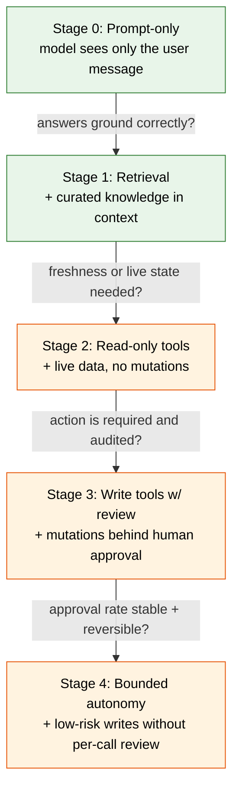

> **Complexity**: `[MEDIUM]`
>
> **Time to Complete**: 60-75 min
>
> **Prerequisites**: Modules 1.1 and 1.2

---

## What You'll Be Able to Do

By the end of this module you will be able to:

1. **Distinguish** retrieval problems from tool-use problems given a real product brief, and justify your classification using blast-radius and reversibility criteria.
2. **Design** a four-stage escalation path for a new assistant feature that moves from prompt-only through retrieval to bounded write tools, with explicit promotion criteria between stages.
3. **Evaluate** a proposed tool integration against a six-question boundary checklist and decide whether it is ready to expose to users.
4. **Debug** an over-empowered assistant by identifying which capability layer, such as knowledge, read tool, write tool, or autonomy, is responsible for a given failure.
5. **Compare** the operational cost of retrieval versus tool use for a given workload and recommend the smallest capability that solves the task.

These outcomes target Bloom Level 3 (Apply), Level 4 (Analyze), and Level 5 (Evaluate). The quiz and exercise test the same skills under unfamiliar scenarios, so treat the module as a design rehearsal rather than a vocabulary lesson.

## Why This Module Matters

Hypothetical scenario: a support engineering team ships an assistant that can answer questions from internal runbooks, create tickets, close tickets, and post incident comments. The demo looks strong because the assistant can move from "what does this alert mean?" to "open a follow-up task" without making the user switch tools. A week later the team has duplicate tickets, closed incidents that should have stayed open, and a few confident replies that cite the wrong runbook revision. Nobody can explain the chain cleanly because every chat turn mixed document retrieval, live API reads, write actions, and model judgment inside one control surface.

That scenario is not an argument against tools. It is an argument against adding capability before the boundaries are strong enough to contain the capability. Once you can produce a useful prompt and a structured output, the next tempting step is to give the model more context, more APIs, more files, and more autonomy. Each step may look like a small feature request, but each one changes the system's blast radius, which is the set of things that can go wrong when the model is wrong, confused, stale, or manipulated by the text it reads.

Real practitioners separate two questions that beginners often merge: what does the model know, and what can the model do? Retrieval extends what the system knows by adding documents, search results, database snippets, or other grounded context. Tools extend what the system can do by letting the model request operations against external systems. The controls for those two capabilities are different. A retrieval error can mislead a user; a write-tool error can mutate a live workflow, send a message, charge money, or delete data.

This module teaches you to keep those questions separate. You will classify product briefs, climb a capability ladder gradually, evaluate tool boundaries before exposure, and debug failures by locating the layer that introduced them. The goal is not to avoid powerful systems; the goal is to earn power one boundary at a time, with enough evidence that each promotion is justified.

## The Real Distinction: Knowledge Versus Capability

The first thing to internalize is that "give the model more power" is not a single design decision. It is at least two decisions stacked on top of each other, and they have very different risk profiles. Knowledge expands what the model has in its working context when it answers: documents, snippets, search results, embeddings of internal data, or explicit facts returned by a trusted retriever. Capability expands what happens outside the chat as a side effect of the model's response: a function called, a row written, a ticket closed, an email sent, or a Kubernetes object changed. Treating those as the same lever is the architectural mistake that turns a promising assistant into an incident waiting for a prompt.

Picture the two architectures side by side. A retrieval system has the user and orchestrator on one side and a knowledge index on the other; the index can be queried, but it cannot act, and the model's only output is text or structured data that flows back through your code. A tool-using system replaces that one-way context addition with a feedback loop. The model emits a tool call, an executor runs the call against a real system, the result returns to the model, and the model may chain another call if your orchestration permits it. Once that loop exists, the model is no longer only describing the world; it is participating in the world through your runtime.

```ascii
                  RETRIEVAL ARCHITECTURE
   ┌──────────┐      query       ┌────────────────┐
   │  User    │ ───────────────▶ │  Orchestrator  │
   └──────────┘                  │  (your code)   │
        ▲                        └───────┬────────┘
        │                                │ search(text)
        │ answer + citations             ▼
        │                        ┌────────────────┐
        │                        │  Vector store  │
        │                        │  + doc index   │
        │                        └───────┬────────┘
        │                                │ top-k chunks
        │                                ▼
        │                        ┌────────────────┐
        └────── text ─────────── │   LLM (read    │
                                 │   only context)│
                                 └────────────────┘

                  TOOL-USING ARCHITECTURE
   ┌──────────┐                  ┌────────────────┐
   │  User    │ ───────────────▶ │  Orchestrator  │
   └──────────┘                  └───────┬────────┘
        ▲                                │ user msg
        │                                ▼
        │ final answer            ┌────────────────┐
        │                         │     LLM        │◀──┐
        │                         └───────┬────────┘   │
        │                                 │ tool_call  │ tool_result
        │                                 ▼            │
        │                         ┌────────────────┐   │
        │                         │  Tool runtime  │───┘
        │                         │  (REAL world:  │
        │                         │   APIs, DBs,   │
        │                         │   files, mail) │
        │                         └────────────────┘
```

Notice that the retrieval diagram has no arrow pointing from the model into a real system. Every effect on the world happens through the orchestrator, and the model is sandboxed inside a context window. In the tool-using diagram, the model sits in a loop with a runtime that can touch live infrastructure. The same model and prompt can be present in both designs, but the second design has a fundamentally different surface area for failure. When you add a tool, you are not merely adding a feature; you are extending model judgment into a place where mistakes can persist.

The risk profile follows directly from this picture. A retrieval system can be wrong about a fact, but it cannot delete a customer record. A read-only tool system can return stale or misleading data, but it cannot mutate state. A write-capable tool system can mutate state, and once it can, hallucination, prompt injection, stale context, and authorization drift become operational risks rather than only answer-quality problems. Each step up the ladder requires a matching step up in observability, authorization, input validation, and rollback machinery.

Pause and predict: a teammate proposes giving an assistant a `create_calendar_event` tool, a `read_calendar` tool, and a knowledge base of company holidays. Which one would you ship first, which one last, and what specific incident are you picturing when you order them that way? A strong answer separates the knowledge need from the live-state need from the write action. Company holidays probably belong in retrieval, calendar reading may be a scoped read tool, and calendar creation should wait until you have identity binding, preview, confirmation, and an undo path.

The distinction also changes how you debug. If an assistant answers "the policy says contractors can expense laptops" and the policy never said that, the failure is either retrieval selection or generation over the retrieved text. If the assistant answers "your PTO balance is zero" after a live HR tool returned a null value, the failure is a tool-contract and interpretation problem. If the assistant files a PTO request when the user only asked about policy, the failure is a write-boundary problem. The model may be involved in all three, but the fix lands in different code and governance layers.

## The Capability Ladder

Senior practitioners rarely jump from "prompt only" to "fully autonomous agent" in one move. They climb a ladder, and at each rung they pause until the control path is at least as strong as the capability path. The same instinct appears in good platform engineering: a new service does not receive production write access on day one; it receives development access, then staging access, then production read access, then tightly scoped production writes behind a flag. AI systems deserve the same discipline because their failure variance is higher, their inputs are more open-ended, and their actions are often selected at runtime rather than by a fixed controller.



Read the diagram as a sequence of questions, not a prescription to reach the top. Each arrow is a gate that you only pass by demonstrating, with evidence from the previous rung, that you actually need the next capability. Many teams skip Stage 1 and jump from Stage 0 to Stage 3 because retrieval feels ordinary and tools feel impressive. That is usually backwards. Retrieval is where you discover that many "tool" needs were really knowledge needs in disguise, and skipping it means paying the operational tax of tools to get the value of a search system.

Promotion criteria are the part beginners most often omit. "We moved up because the demo worked" is not a criterion. A useful criterion is concrete, measurable, and tied to the failure mode the next stage introduces. Moving from retrieval to read-only tools requires evidence that the retrieval-only version is correctly grounded on the major tasks; otherwise live data will not save the design, it will just give the model fresher material to misuse. Moving from read-only tools to write tools requires evidence that the model interprets tool results correctly under edge cases and adversarial phrasing, because the same interpreter will soon decide what to mutate.

| Stage | What the model can do | Blast radius | Required controls before promotion |
|---|---|---|---|
| 0. Prompt-only | Read user input, emit text | None beyond reply | Working prompt template, baseline evals |
| 1. Retrieval | Read user input + curated docs | Wrong-but-sourced answers | Source attribution, freshness policy, eval set on grounded answers |
| 2. Read-only tools | Query live systems | Information leakage, stale-but-confident reads | AuthZ scoping, rate limits, audit logs, schema-validated outputs |
| 3. Write tools w/ review | Propose mutations, human approves | Whatever a human waves through | Per-action diff preview, approval queue, blameable identity, undo path |
| 4. Bounded autonomy | Execute low-risk writes directly | Limited by allow-list and budget | Action allow-list, per-call cost cap, rollback automation, kill switch |

The blast-radius column is where the ladder earns its keep. In Stage 1 the worst case is a confident wrong answer, which may be embarrassing or harmful but is still contained inside a response. In Stage 3 the worst case is whatever a human reviewer approves under deadline pressure, which can be much more than the reviewer intended if the review surface is vague. In Stage 4 the worst case is bounded only by the allow-list, budget cap, identity scope, and rollback path. Those controls must be designed before the stage is enabled, because adding them after an incident means you already let the model act beyond your ability to contain it.

The ladder also protects product teams from overbuilding. Stage 3 can be a permanent operating point, not an embarrassing halfway house. If a support assistant drafts refunds and agents approve them, the system may be valuable for years without ever autonomously issuing money. If an on-call helper suggests `kubectl` diagnostics but never runs them, it can still save time while keeping production authority with the human operator. Autonomy is a tool for a subset of low-risk, reversible, measurable actions; it is not the destination of every assistant.

Before running this design in your head, what output do you expect from the ladder for these four briefs? "Help engineers find the right runbook for an alert" should land at retrieval. "Tell the on-call which pods are currently crashlooping in a Kubernetes 1.35 cluster" requires a read-only live-state tool. "Draft a customer reply citing our refund policy" is retrieval plus generation. "Refund the customer when they ask for one" is a write tool with strong review and reversibility controls. The verbs determine blast radius more reliably than the nouns.

## When Retrieval Is the Right Answer

Most product ideas pitched as "agents" are retrieval problems wearing a costume. Before you reach for tools, ask whether the user's question is fundamentally about information that already exists somewhere you control. If the answer is yes, retrieval is usually the right first move because its failure modes are well understood and cheap to debug compared to tool use. A new-hire assistant that explains parental leave, a release-notes assistant that summarizes changes, and a code-search helper that points to the timeout configuration all need grounded reading more than external action.

Retrieval is the right answer when work is dominated by document understanding, policy lookup, summarization of internal text, freshness against a curated corpus, or grounding claims in cited material. The system should retrieve relevant chunks, show the model those chunks, instruct the model to answer only from them, and cite what it used. If the evidence is absent, the correct behavior is refusal or a narrow "not found in the available sources" answer, not a guess. That refusal is not a product failure; it is a boundary doing its job.

The advantages compound. Retrieval is usually cheaper per user task than tool-heavy orchestration because there is no multi-turn function-calling loop. It is easier to evaluate because answers can be scored against source documents. It is easier to debug because failures localize either to the retriever, which fetched the wrong chunks, or to the generator, which misread the right chunks. It is easier to govern because the corpus is a controllable artifact: you can decide what goes in, who can edit it, which documents are stale, and how often the index refreshes.

There are limits. Retrieval cannot answer questions whose ground truth is not in the corpus, and it cannot perform actions. If a user asks "is the production database accepting writes right now," a runbook about how to check write status may be relevant, but it is not the answer the user requested. A retrieval system that pretends a runbook is live state is weaker than a tool system that fetches state with a read-only API. The skill is recognizing that gap honestly and routing the request, not papering over it with a clever prompt.

The implementation details matter, but they do not change the boundary. Dense vector retrieval can find semantically related passages, lexical retrieval can find exact identifiers and acronyms, and hybrid retrieval combines both. Enterprise corpora often need hybrid search because internal documents contain service names, incident IDs, Kubernetes resource names, ticket keys, product codes, and short abbreviations that embeddings may blur. If a retrieval-only product feels weaker than expected, adding BM25 or metadata filters is often a better first fix than adding a generic web or shell tool.

One useful debugging habit is to ask, "Could a perfect librarian answer this from the documents?" If yes, start with retrieval. If a perfect librarian would need to log into another system, query a current status page, or perform an action, then retrieval alone is not sufficient. The analogy is intentionally plain: retrieval turns the model into a fast librarian with a controlled shelf, while tool use turns it into an operator with keys to other rooms. Do not hand out keys when the problem is that the shelf is disorganized.

## When a Tool Is Actually Justified

A tool is justified when the answer or outcome the user needs cannot be produced from any document, no matter how well retrieved. The clearest signals are liveness, uniqueness, and action. Liveness means the answer changes minute by minute, such as cluster state, service health, inventory level, or account balance. Uniqueness means the answer depends on the specific user, tenant, transaction, or environment. Action means the user wants something to happen in the world, not merely to be told something. If none of those signals apply, you are probably looking at a retrieval problem in disguise.

Even when a tool is justified, the right move is usually the smallest tool that solves the task. If the user wants to know whether a staging cluster is healthy, they need a `get_cluster_health` tool, not a generic `run_kubectl` tool. Generic tools are seductive because they are flexible, but flexibility is the enemy of boundary clarity. A `run_kubectl` tool can do anything its kubeconfig can do, so its blast radius is every Kubernetes 1.35 resource the credential can touch. A specific health tool can be authorized tightly because its capability is tight by construction.

Read-only versus write is the single most important property of a tool. Read-only tools have a bounded failure mode: at worst, they return wrong data, and the model builds a wrong answer on it. That is bad, but it resembles retrieval failure and can be mitigated with schema validation, freshness checks, source attribution, and sanity bounds. Write tools introduce a different failure class: the model can persist a wrong action. A write tool without review, identity binding, and rollback deserves the scrutiny you would give any endpoint that mutates a production system.

The transition from read to write should never happen silently inside one generic tool. Many SDKs make it easy to define a tool such as `manage_ticket` that can fetch, comment, assign, and close depending on parameters. Resist that design. Split the tool by verb: `get_ticket`, `comment_on_ticket`, `assign_ticket`, and `close_ticket` have distinct permissions, logs, rate limits, and rollback paths. They also give the model a less ambiguous menu, which reduces unintended writes when the user's phrasing is fuzzy or the retrieved context contains hostile instructions.

Tools also impose operational cost that teams underestimate. Each tool needs credentials, schema contracts, observability, rate limits, tests, documentation, an owner, an incident path, and deprecation rules. A retrieval corpus can be stale; a tool integration can be stale, overprivileged, down, slow, expensive, or incompatible with the model's generated arguments. None of those costs mean tools are wrong. They mean the tool must solve a problem that retrieval cannot solve and must be valuable enough to justify the operating load.

## Boundaries Before Capability

Before any tool is exposed to a real user, six questions must have crisp written answers. Treat them as an engineering checklist, not a compliance ritual. If any answer is vague, the tool is not ready, because the model will eventually find the vague part through ordinary user requests, confusing retrieved text, or malicious prompt injection. These are the same questions an SRE asks before a new service reaches production, translated into the language of model-driven actions.

The first question is what the tool can access. A tool that calls an internal API inherits whatever permissions its credentials hold, and teams often discover too late that the service account had read access to far more than the assistant should expose. Scope credentials to the exact resources the tool needs, prefer per-tool identities over shared identities, and bind tenant or user filters outside the model's control. If the model can choose the tenant ID, account ID, namespace, or SQL predicate, the boundary is advisory rather than enforced.

The second question is what the tool can change. For read-only tools the answer should be "nothing," enforced by the downstream API rather than by a comment in your tool code. For write tools the answer must be specific enough to review: this tool can update the `status` field of a ticket owned by the requesting user, or it can create a PTO request in a staging table, or it can add a label to a namespaced Kubernetes object. Vague answers such as "ticket fields" become "any ticket field" when production pressure arrives.

The third question is who is accountable for the result. Every tool call happens on behalf of someone, and that identity must be visible in authorization, logging, and incident response. Running all tool calls through one assistant service account is convenient until you need to answer which user caused a bad write, revoke one user's access, or explain why a tool queried another tenant. The originating user identity should travel from the chat session through the orchestrator into the tool runtime and the downstream audit log.

The fourth question is how usage is logged. Logs should capture the user identity, tool name, input parameters, output or normalized result, timestamp, correlation ID, and approval state for write actions. The log retention window should be at least as long as the action's business reversibility window, because a refund, email, or access change may be disputed well after the chat turn. Privacy matters, so redact or tokenize sensitive fields deliberately, but do not remove the fields that make incident reconstruction possible.

The fifth question is what fallback exists when the tool fails. Hard failures are straightforward because the call returns an error and the model can retry, escalate, or explain that the action did not complete. Soft failures are more dangerous because the tool returns a syntactically valid result that the model misinterprets. A null PTO balance, an empty monitoring response, or a stale cache hit may look like a valid answer unless the tool contract distinguishes "zero," "unavailable," "not authorized," and "not found." Good tool design makes dangerous ambiguity impossible or at least visible.

The sixth question is what rollback or undo path exists. Every write tool needs a documented reversal, and the reversal should be as accessible to an operator as the original action is to the assistant. If your assistant can close a ticket, your incident process needs a reopen path. If it can create a calendar event, it needs a delete or cancel path. Tools whose actions are practically irreversible, such as external email or money movement, require extra friction, usually a confirmation step, delay window, or human approval queue.

```ascii
        BOUNDARY CHECKLIST (per tool, before exposure)
        ┌──────────────────────────────────────────────┐
        │  1. ACCESS    — exact resources, scoped creds│
        │  2. CHANGE    — mutation surface, per-field  │
        │  3. OWNER     — user identity in every call  │
        │  4. LOGGING   — who, what, when, where, why  │
        │  5. FALLBACK  — error path + soft-fail check │
        │  6. ROLLBACK  — undo at least as accessible  │
        └──────────────────────────────────────────────┘
                             │
                             ▼
              ┌────────────────────────────┐
              │ All six answered concretely│
              │       in writing?          │
              └─────┬───────────────┬──────┘
                    │ yes           │ no
                    ▼               ▼
              ┌──────────┐    ┌─────────────────┐
              │  ship    │    │ NOT ready —     │
              │  to one  │    │ fix gaps before │
              │  tenant  │    │ exposing tool   │
              └──────────┘    └─────────────────┘
```

The checklist is a living document because tool boundaries drift. A downstream API adds a field, a service account gets a broader role, a team expands a tool's parameter schema to satisfy one urgent user, or a new workflow starts calling the same tool in a context it was not designed for. Re-run the checklist when the downstream contract changes, when a tool gains a new parameter, when a new tenant or environment is enabled, and after every meaningful incident. A boundary that was correct at launch can become overbroad through normal maintenance.

## Worked Example: Building PolicyPal for a 200-Person Company

Exercise scenario: PolicyPal is an internal HR assistant for a 200-person company. Employees ask about parental leave, expense policy, equipment reimbursement, and time off. The product team's first instinct is to give it everything: read policy documents, query the HR system, file expense claims, and book PTO. We will walk the product through the ladder to show why that instinct is too broad and what a disciplined escalation path looks like.

The prompt-only prototype is a chat box with a system instruction that says the assistant should answer HR questions for the company. An employee asks how many weeks of parental leave they get, and the model gives a generic answer based on common public policy patterns. Another employee asks whether a specific fertility treatment is covered, and the model guesses from industry norms. Version 0 is not useless; it reveals that the missing ingredient is company-specific knowledge rather than external action. That diagnosis points to retrieval, not tools, because the source of truth lives in controlled policy documents.

The retrieval version chunks HR policies, embeds those chunks, stores them in an index, and retrieves the top passages for each user question. The model is instructed to answer only from retrieved material and to cite the policy name, section, and effective date when available. Now the assistant can answer parental leave and reimbursement questions using the actual policy instead of broad public assumptions. It can also refuse when a benefit is not described in the corpus, which is better than inventing a plausible answer. Version 1 creates a measurable grounding problem: given a question and a source set, did the assistant answer what the sources support?

Version 1 also surfaces the next boundary. When an employee asks how many vacation days they personally have left, retrieval should refuse or route because that fact is not in policy documents. It lives in the HR system and changes as time is booked. That is a liveness and uniqueness signal, so the team adds one read-only tool: `get_my_pto_balance(employee_id)`. The tool is intentionally narrow. It does not run SQL, browse the HR system, or accept arbitrary employee IDs from the model. The orchestrator binds `employee_id` to the authenticated user before the tool call reaches the HR API.

The read-only tool is scoped at three layers. At the credentials layer, the service account can read only a view containing employee ID, used days, remaining days, and status. At the call-time authorization layer, the model cannot request another employee's balance because the orchestrator overwrites or rejects user-controlled IDs. At the logging layer, every call records the requesting identity, tool name, normalized parameters, normalized result, and a correlation ID linking it to the chat message. Those details feel ordinary until an incident happens; then they are the difference between a clear answer and a week of guesswork.

The first important failure in Version 2 is a soft failure. An employee on leave has a PTO balance represented as null in the HR system, and the tool faithfully returns null. The model interprets null as zero and tells the employee they have no remaining vacation, which is wrong. The fix is not to beg the model to be more careful. The fix is to strengthen the tool contract so it returns a structured result such as `{"status": "unavailable", "reason": "leave_of_absence", "next_step": "contact_hr"}`. The boundary should remove dangerous ambiguity before the model sees it.

After the read-only version operates cleanly, the team considers a write capability: `request_pto(start_date, end_date, reason)`. This is Stage 3, so the tool writes to a staging record and creates an approval item rather than writing directly to the HR system. The user sees a confirmation card that explains the proposed dates and reason. Only after confirmation does a separate workflow submit the request. The model has proposal access, not final write authority, and the approval queue becomes labeled data for future evaluation.

The team may never promote that PTO request flow to Stage 4. That is a valid result. If users edit requests often, if approval latency suggests rubber-stamping, or if reversals create HR burden, the review gate should remain. The ladder is not a maturity model where the top is always better. It is a risk model where the correct operating point depends on evidence, reversibility, user expectations, and operational cost.

Which approach would you choose here and why: should PolicyPal add a generic `update_hris(record_type, id, fields)` tool or three specific tools for PTO request, address change, and emergency-contact update? A strong answer favors specific tools because they give separate schemas, authorization scopes, review rules, and rollback paths. The generic tool looks cheaper only until the first incident requires you to explain which field was allowed, which user authorized it, and why the model selected that mutation.

## Patterns & Anti-Patterns

Good tool and retrieval systems tend to share a few patterns. The first is capability minimalism: add the smallest capability that resolves the observed failure. If retrieval cannot answer live state, add a read-only live-state tool before adding a write tool. If one tenant needs a feature, ship it to one tenant or one internal group before exposing it broadly. This pattern scales because each tool has a clear reason to exist and a measurable failure mode it addresses.

The second pattern is verb-level decomposition. Tools should map to the verbs that matter operationally: read, propose, approve, comment, close, create, delete, or refund. Splitting by verb creates more definitions, but it also creates clean audit trails and authorization surfaces. A model choosing among four precise tools is easier to evaluate than a model filling parameters for one broad "execute" tool. Decomposition also lets you promote individual capabilities independently; `get_ticket` may be safe today while `close_ticket` remains behind review.

The third pattern is contract-first tool design. Define the input schema, output schema, error cases, and soft-failure states before connecting the model. A tool that returns plain text forces the model to infer meaning from prose. A tool that returns a structured result with status, value, source timestamp, and remediation gives the model fewer opportunities to guess. This pattern matters for both read and write tools, because ambiguity at the boundary becomes confident natural language at the user interface.

The anti-patterns are just as common. A generic execution tool such as `run_query`, `run_shell`, `execute_action`, or `manage_ticket` moves complexity out of the schema and into the model's judgment. It feels flexible during a demo and becomes unreviewable in production. A shared service identity makes integration easy and audit hard. A prompt-only boundary, such as "never refund more than the policy allows," is an instruction rather than enforcement unless the tool runtime validates the amount, account, policy, and approval state.

Another anti-pattern is treating retrieval freshness as a vibes problem. "We re-index periodically" is not a freshness policy. If policy documents drive customer-visible answers, you need source ownership, refresh cadence, stale-document detection, and a visible way for the assistant to say that a source is older than the required freshness window. Freshness problems often masquerade as model problems because the model sounds confident even when the retrieved material is obsolete.

The last anti-pattern is skipping Stage 3 because approval feels like friction. The review stage is where you discover the failure modes that bounded autonomy would otherwise discover in production. If reviewers frequently edit proposed actions, the model is teaching you that autonomy is premature. If reviewers approve too quickly, the review interface may be failing because it does not make the diff legible. Treat review data as instrumentation, not bureaucracy.

## Decision Framework

Use this framework when a stakeholder asks for "an agent" but the actual capability is unclear. Start with the user's verb. If the verb is find, explain, summarize, compare, cite, or draft from known materials, begin with retrieval. If the verb is check, fetch, calculate for this user, inspect current status, or list live resources, consider a read-only tool. If the verb is create, update, delete, send, approve, refund, deploy, scale, or close, you are in write-tool territory and need review, identity binding, rollback, and a promotion plan.

The next question is reversibility. A wrong draft can be edited, a wrong cited answer can be corrected, and a wrong read can be rechecked. A wrong email, refund, access grant, data deletion, or production mutation has a longer tail. Reversibility should affect both the stage you choose and the friction you impose. Low-risk writes may only need a confirmation card; high-risk writes may need approval by a human who is not the requester, a delay window, or an explicit external system of record.

The third question is evaluation. If you cannot evaluate the previous stage, you are not ready for the next one. Retrieval should have grounded-answer evals, citation checks, and stale-source tests. Read-only tools should have schema tests, authorization tests, soft-failure fixtures, and logs that show how outputs are interpreted. Write tools should have proposal acceptance data, correction data, rollback drills, and incident-response exercises. Promotion without evaluation is optimism disguised as product momentum.

The framework deliberately pushes many ideas downward. A customer-support assistant that drafts replies from policy should start at retrieval even if the future roadmap includes sending messages. An on-call helper that identifies current CrashLoopBackOff pods may need a read-only Kubernetes tool but not a write tool. A billing assistant that issues refunds should likely start with retrieval plus a proposed-action review queue, because money movement is high impact and customer-specific. The smaller capability is not less ambitious; it is easier to trust, measure, and improve.

## Did You Know?

1. The 2020 retrieval-augmented generation paper by Lewis and coauthors framed retrieval as a way to combine parametric model memory with non-parametric external memory, which is the same architectural separation this module uses: the model reasons, while the index supplies grounded evidence.
2. Anthropic's "Building Effective Agents" guidance distinguishes workflows from agents and argues that fixed orchestration patterns are often more reliable than broad autonomous loops for business tasks, which reinforces the ladder's bias toward staged control.
3. OpenAI's current tool guidance treats file search, web search, code execution, and custom function tools as different hosted or developer-defined capabilities, which is why tool descriptions should include side effects, retry safety, and error modes rather than only happy-path names.
4. Kubernetes role-based access control is additive: permissions come from matching RoleBindings and ClusterRoleBindings, so a generic cluster tool inherits the full combined authority of its credential unless the credential is deliberately scoped before the model can call it.

## Common Mistakes

| Mistake | Why It Happens | How to Fix It |
|---|---|---|
| Reaching for tools because they feel more advanced than retrieval | Teams equate visible action with product value and skip the cheaper knowledge layer | Use the smallest capability that answers the brief, then promote only when evidence shows retrieval is insufficient |
| Defining one generic tool like `run_query` or `manage_ticket` | A broad wrapper reduces implementation effort during the demo | Split by verb into per-action tools, each with its own schema, scope, log, rate limit, and owner |
| Combining read and write semantics in a single tool | SDK examples often make multipurpose functions look convenient | Separate `get_*`, `propose_*`, and `update_*` tools so read and write choices are unambiguous in logs |
| Running all tool calls under one shared service identity | Shared credentials simplify integration and avoid per-user authorization work | Bind every tool call to the originating user identity and enforce authorization outside the model |
| Treating retrieval freshness as a loose maintenance task | Stale documents are invisible when the model's answer sounds fluent | Define a freshness policy per corpus, track index lag, and make stale-source behavior explicit |
| Skipping human review and going straight to autonomous writes | Review feels like friction after a successful demo | Treat Stage 3 as the default write operating point until correction, reversal, and approval data justify a narrower autonomous subset |
| Logging tool calls without enough inputs or outputs | Teams overcorrect for privacy and remove incident context | Redact sensitive fields deliberately while preserving correlation IDs, normalized parameters, outputs, approval state, and retention windows |
| Relying on the model's system prompt to enforce boundaries | Prompt rules are easier to write than runtime guards | Enforce access, mutation limits, budgets, and rollback rules in code and downstream APIs before side effects occur |

## Quiz

<details>
<summary>Question 1: Your team is building an assistant that answers "what changed in the last three releases of our API?" by calling a live release-notes service. Internal feedback says it invents version numbers. You inspect the system and find it is using a generic web-search tool that returns SEO blog posts. What is the most likely root cause, and what is the smallest fix?</summary>

The root cause is a tool/retrieval mismatch. The team reached for a broad external tool when the actual need is retrieval against the internal release-notes corpus. The smallest fix is to remove the generic web-search path for this task and replace it with curated retrieval over the source-of-truth release notes, including citations and version metadata. This is a demotion from a broad Stage 2 capability to a narrower Stage 1 capability, which is exactly the right move when the problem is knowledge rather than live action.
</details>

<details>
<summary>Question 2: A `close_incident_ticket` tool has been live for two weeks. Logs show hundreds of calls and no runtime errors. Your security lead asks, "Whose authority is closing these tickets?" You check and find every call runs under the assistant's service account. What is the concrete risk, and what do you change first?</summary>

The concrete risk is that the audit trail attributes every closure to a non-human identity, so incident review cannot answer which user caused a closure and access revocation becomes all-or-nothing. Runtime success does not mean the boundary is safe; it only means the API accepted the calls. The first change is to make the orchestrator pass the originating user identity into the tool layer and make the tool API require that identity for both authorization and logging. After that, review whether the service account itself can be narrowed so it no longer masks user-level policy.
</details>

<details>
<summary>Question 3: A retrieval-only documentation assistant gets the question, "Is the production database currently accepting writes?" The corpus contains a runbook titled "How to check if the production database is accepting writes." The assistant returns the runbook. Did the system fail, and what changes?</summary>

The retrieval system did not fail at finding a relevant document, but the product design failed to classify the user's intent. The user wanted current state, which is a liveness problem, not a document-understanding problem. The right change is to route that intent to a small read-only status tool, such as `get_db_write_status`, or to refuse with a clear statement that the assistant can only provide the runbook. Teaching retrieval to pretend it knows live state would make the system sound more helpful while reducing correctness.
</details>

<details>
<summary>Question 4: You are reviewing a PR that adds a `send_email` tool to a customer-support assistant. The PR says, "Tool calls go to the customer's address; we log the recipient and subject." Identify two boundary-checklist questions that are not yet answered, and explain why each matters.</summary>

Rollback is not answered because email is practically irreversible once sent, so the mitigation must be a review step, preview card, delay window, or cancel path before delivery. Logging is also incomplete because recipient and subject do not capture the body, attachments, source citations, or approval state, which are the parts most likely to matter during a customer-facing incident. Access scope may be weak too if the model can choose arbitrary recipients rather than a verified customer address. The PR is therefore not ready for direct user exposure.
</details>

<details>
<summary>Question 5: A teammate proposes promoting an assistant from Stage 3 to Stage 4 because users approve 98 percent of proposed actions. What evidence would you ask for before agreeing, and what evidence would make you refuse?</summary>

Approval rate alone is weak evidence because it can reflect habit, trust, or rubber-stamping rather than correctness. Ask for the rate of later corrections or reversals, the distribution of approval latency, the severity distribution of wrong actions, and examples of rejected proposals grouped by cause. You should refuse promotion if reversals are meaningful, if approvals cluster so quickly that users are not reading, or if the worst wrong autonomous action is hard to undo. Stage 4 needs evidence that the subset is low risk, reversible, and reliably recognized by the system.
</details>

<details>
<summary>Question 6: An assistant has `read_calendar` and `create_calendar_event`. A user types, "Cancel my 3pm and put a focus block there instead." The assistant creates a focus block but leaves the meeting in place. What capability is missing, and what is the lesson about tool decomposition?</summary>

A cancel or delete calendar-event capability is missing, so the assistant could only complete half of the user's natural request. The failure is not just the absence of a tool; it is also the absence of a boundary that forces the model to say when a requested verb is unsupported. Tool decomposition must cover the verbs users can reasonably request, and the orchestrator should require explicit partial-fulfillment disclosure. Otherwise missing tools produce silent partial actions rather than visible refusals.
</details>

<details>
<summary>Question 7: You inherit a system with one tool called `execute_action(name, params)`, where `name` is a free-form string. The team says it works because the model was trained on a list of valid action names. How do you describe the risk to a non-technical executive, and what change do you propose?</summary>

For a non-technical executive, the risk is that the assistant is allowed to invent command names and the system will try to honor them unless other code happens to reject them. Training and prompting make good behavior more likely, but they do not close the action space. The concrete change is to replace the free-form executor with a typed tool registry where each action has a fixed name, schema-validated parameters, explicit authorization, and separate logging. The boundary should be enforced by the API contract rather than by model memory.
</details>

## Hands-On Exercise

Choose one of the product briefs below, or use a real candidate from your workplace if you can describe it without sensitive data. Produce a written design document using the checklist that follows. The exercise should take about an hour the first time because you are not trying to sketch a quick architecture diagram; you are trying to make every boundary decision explicit enough that another engineer can challenge it.

### Brief Options

- **DevSurvey assistant.** Helps engineers answer "what is our standard tooling for X?" across an internal engineering handbook.
- **Refund assistant.** Helps customer-support agents resolve refund requests against a billing system.
- **On-call helper.** Helps the on-call engineer triage alerts against a runbook corpus and live monitoring, optionally including read-only Kubernetes 1.35 cluster status.

### Deliverables

- [ ] **User and queries.** Write one paragraph of 50-100 words describing the user and the top three queries you expect, using concrete examples rather than vague categories.
- [ ] **Stage classification.** State which stage of the ladder, from 0 through 4, you intend to ship and which stage you would consider next. Justify the choice in two sentences using blast-radius and reversibility language.
- [ ] **Retrieval design.** Describe the corpus, chunking approach, refresh cadence, retrieval method, metadata filters, and citation policy. State how the assistant behaves when the source material does not support an answer.
- [ ] **Tool list.** Enumerate every tool in a small table with columns for tool name, read/write status, scope, originating identity, log fields, fallback behavior, and rollback path. If any row has an unanswered boundary, mark the tool not ready.
- [ ] **Boundary review.** For each tool, walk through access, change surface, owner, logging, fallback, and rollback in writing. Do not merge two tools just because they share a downstream API.
- [ ] **Failure scenarios.** Write three concrete failures: one retrieval failure, one read-tool soft failure, and one write-tool wrong action. For each, describe detection, containment, user communication, and operational response.
- [ ] **Promotion criteria.** State measurable evidence required before promotion to the next stage, such as grounded-answer accuracy, authorization failures, soft-failure rate, correction rate, reversal rate, or approval latency.

<details>
<summary>Solution outline for the DevSurvey assistant</summary>

A strong DevSurvey design usually ships as Stage 1 retrieval. The corpus is the engineering handbook, ADRs, platform service catalog, and tool-selection guides, refreshed daily or on merge to the documentation repository. There may be no tools at first because the assistant answers "what do we use?" rather than "change my project." Promotion to a read-only service-catalog tool might be justified if engineers ask for current ownership, deprecation state, or runtime adoption metrics that are not in the docs.
</details>

<details>
<summary>Solution outline for the Refund assistant</summary>

A strong Refund assistant normally starts with retrieval plus Stage 3 proposed writes. Retrieval explains policy and drafts the rationale; read-only tools fetch order status and prior refunds; write actions create a refund proposal for agent approval rather than issuing money directly. The boundary checklist should be strict about originating identity, maximum amount, policy citation, duplicate-refund detection, and rollback or reversal. Stage 4 should be limited to a narrow subset only if reversal data and correction data prove it is safe.
</details>

<details>
<summary>Solution outline for the On-call helper</summary>

A strong On-call helper often combines Stage 1 retrieval for runbooks with Stage 2 read-only tools for monitoring and Kubernetes status. The assistant can fetch current alerts, pod status, events, and recent deployment metadata, but it should not restart pods or apply manifests until write boundaries are reviewed separately. For Kubernetes 1.35, scope credentials to namespaces and read verbs where possible, and keep live diagnostic output separate from runbook citations so users can see what came from current state versus documentation.
</details>

### Success Criteria

- [ ] The shipped stage is justified by the user's verb, blast radius, and reversibility.
- [ ] Every retrieval source has an owner, freshness policy, and citation behavior.
- [ ] Every tool has a written access scope, mutation surface, originating identity, log shape, fallback behavior, and rollback path.
- [ ] At least one proposed capability is deliberately deferred because its boundary is not strong enough.
- [ ] Promotion criteria are measurable and tied to the next stage's new failure mode.

When you are done, give the document to a colleague and ask them to find the weakest boundary. If they can find one quickly, fix the design before you write integration code. The exercise is calibrated so the first draft usually has at least one weak boundary; discovering it on paper is cheaper than discovering it after the assistant has credentials.

## Sources

- [Retrieval-Augmented Generation for Knowledge-Intensive NLP Tasks](https://arxiv.org/abs/2005.11401)
- [Building Effective Agents](https://www.anthropic.com/engineering/building-effective-agents)
- [OpenAI: Function calling](https://platform.openai.com/docs/guides/function-calling)
- [OpenAI: File search](https://platform.openai.com/docs/guides/tools-file-search)
- [OpenAI: Web search](https://platform.openai.com/docs/guides/tools-web-search)
- [OpenAI: Structured outputs](https://platform.openai.com/docs/guides/structured-outputs)
- [OWASP Top 10 for Large Language Model Applications](https://owasp.org/www-project-top-10-for-large-language-model-applications/)
- [NIST AI Risk Management Framework](https://www.nist.gov/itl/ai-risk-management-framework)
- [Kubernetes RBAC good practices](https://kubernetes.io/docs/concepts/security/rbac-good-practices/)
- [Kubernetes authorization overview](https://kubernetes.io/docs/reference/access-authn-authz/authorization/)
- [Google Cloud Vertex AI: Grounding overview](https://cloud.google.com/vertex-ai/generative-ai/docs/grounding/overview)
- [Microsoft Azure OpenAI: Use your data](https://learn.microsoft.com/azure/ai-services/openai/concepts/use-your-data)

## Next Module

Continue to [Evaluation, Iteration, and Shipping v1](./module-1.4-evaluation-iteration-and-shipping-v1/), where we take the design you just wrote and turn it into an evaluation harness, a shipping plan, and a feedback loop that survives contact with real users.
