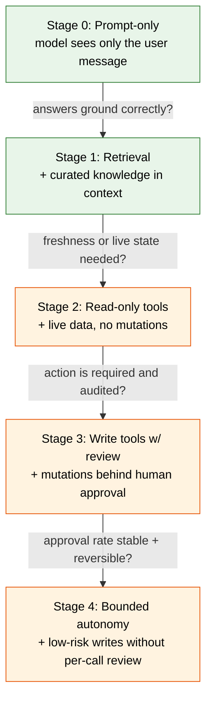

> **AI Building** | Complexity: `[MEDIUM]` | Time: 45-60 min | Prerequisites: Modules 1.1 and 1.2

## Why This Module Matters

On a Friday afternoon in mid-2024, a fintech operations team flipped on an "AI helper" they had wired to their internal ticketing system. The pitch was simple: any employee could ask the assistant a question in natural language, and the assistant would answer. To make it more useful, the team had also given the assistant the ability to *create* tickets, *close* tickets, and *post* comments on behalf of the user — because that was easy to add, the SDK supported it, and the demo looked great.

By Monday morning, the ticketing system held a small graveyard of duplicate tickets, three closed incidents that should have stayed open, and a polite but very confidently wrong reply on a payments outage thread. Nothing catastrophic had happened, but nobody on the team could clearly explain *which* assistant action had caused *which* outcome, because every interaction had blended four different capabilities at once: reading documents, calling APIs, writing data, and inferring intent. The post-mortem made the same point a senior platform engineer would make about any production system that had been over-empowered too quickly: the team had stacked too much capability on top of an unproven control surface.

That is the failure mode this module exists to prevent. Once a learner can produce a working prompt and a structured output, the obvious next move is to give the model "more": web search, database lookups, file reads, internal APIs, write actions, and eventually fully autonomous loops. Each step of that staircase looks small from the outside, but each one materially changes the system's *blast radius* — the set of things that can go wrong when the model is wrong. Real practitioners separate two questions that beginners conflate: *What does the model know?* and *What can the model do?* This module teaches you to keep those questions separate and to expand each one only when its control surface is ready.

Retrieval extends what the system *knows*. Tools extend what the system can *do*. Capability is not the same as knowledge, and the controls required to ship them safely are not the same either. By the end of this module you will recognise which of the two a problem actually needs, design an escalation path that adds capability gradually, and write down the specific boundary conditions a tool must satisfy before it is allowed near a real user.

## Learning Outcomes

By the end of this module you will be able to:

1. **Distinguish** retrieval problems from tool-use problems given a real product brief, and justify your classification using blast-radius and reversibility criteria.
2. **Design** a four-stage escalation path for a new assistant feature that moves from prompt-only through retrieval to bounded write tools, with explicit promotion criteria between stages.
3. **Evaluate** a proposed tool integration against a six-question boundary checklist and decide whether it is ready to expose to users.
4. **Debug** an over-empowered assistant by identifying which capability layer (knowledge, read tool, write tool, autonomy) is responsible for a given failure.
5. **Compare** the operational cost of retrieval versus tool use for a given workload and recommend the smaller capability that solves the task.

These outcomes target Bloom Level 3 (Apply), Level 4 (Analyse), and Level 5 (Evaluate). The quiz and exercise will test the same skills under unfamiliar scenarios.

## The Real Distinction: Knowledge Versus Capability

The first thing to internalise is that "give the model more power" is not a single decision. It is at least two decisions stacked on top of each other, and they have very different risk profiles. *Knowledge* expands what the model has in its working context when it answers — documents, snippets, search results, embeddings of internal data. *Capability* expands what happens in the world as a side effect of the model's response — a function called, a row written, an email sent, a deployment triggered. Treating those as the same lever is the single most common architectural mistake in early AI systems, and it is the reason so many "agent" projects quietly turn into incident reports.

Picture the two architectures side by side. A retrieval system has the model on one side and a knowledge index on the other; the index can be queried, but it cannot act, and the model's only output is text or structured data that flows back to the user. A tool-using system replaces that one-way arrow with a feedback loop: the model emits a tool call, an executor runs the call against a real system, the result returns to the model, and the model can chain another call. Once that loop exists, the model is no longer just describing the world — it is *changing* it.

```ascii
                  RETRIEVAL ARCHITECTURE
   ┌──────────┐      query       ┌────────────────┐
   │  User    │ ───────────────▶ │  Orchestrator  │
   └──────────┘                  │  (your code)   │
        ▲                        └───────┬────────┘
        │                                │ search(text)
        │ answer + citations             ▼
        │                        ┌────────────────┐
        │                        │  Vector store  │
        │                        │  + doc index   │
        │                        └───────┬────────┘
        │                                │ top-k chunks
        │                                ▼
        │                        ┌────────────────┐
        └────── text ─────────── │   LLM (read    │
                                 │   only context)│
                                 └────────────────┘

                  TOOL-USING ARCHITECTURE
   ┌──────────┐                  ┌────────────────┐
   │  User    │ ───────────────▶ │  Orchestrator  │
   └──────────┘                  └───────┬────────┘
        ▲                                │ user msg
        │                                ▼
        │ final answer            ┌────────────────┐
        │                         │     LLM        │◀──┐
        │                         └───────┬────────┘   │
        │                                 │ tool_call  │ tool_result
        │                                 ▼            │
        │                         ┌────────────────┐   │
        │                         │  Tool runtime  │───┘
        │                         │  (REAL world:  │
        │                         │   APIs, DBs,   │
        │                         │   files, mail) │
        │                         └────────────────┘
```

Notice how the retrieval diagram has no arrow pointing from the LLM out into a real system. Every effect on the world happens through the orchestrator, and the model is sandboxed inside a context window. In the tool-using diagram, by contrast, the model sits in a loop with a runtime that can touch live infrastructure. The same model, the same prompt, but a fundamentally different surface area for things to go wrong. When you "add a tool" you are not adding a feature; you are extending the model's reach into a place where mistakes have consequences.

The risk profile follows directly from this picture. A retrieval system can be wrong about a fact, but it cannot delete a customer record. A read-only tool system can return stale or misleading data, but it cannot mutate state. A write-capable tool system can mutate state, and once it can, the model's hallucinations and prompt-injection vulnerabilities become operational risks rather than UX annoyances. Each step up the ladder demands a corresponding step up in observability, authorisation, and rollback machinery.

> **Active Check 1 — Predict the failure mode.**
> A teammate proposes giving an assistant a `create_calendar_event` tool, a `read_calendar` tool, and a knowledge base of company holidays. Before reading the next section, write down which of those three would you ship first, which last, and what specific incident you are picturing when you order them that way. Keep your answer — we will revisit it after the escalation ladder.

## The Capability Ladder

Senior practitioners almost never jump from "prompt only" to "fully autonomous agent" in one move. They climb a ladder, and at each rung they pause until the *control* path is at least as strong as the *capability* path. The same instinct shows up in good infrastructure work: you do not give a new service production write access on day one, you give it staging read access, then production read, then production write behind a feature flag, then full enable. AI systems are no different — they are services with unusually high failure variance, which makes the ladder more important, not less.



Read the diagram as a question, not a prescription. Each arrow is a *gate*: you only earn the next rung by demonstrating, with evidence from the previous rung, that you actually need it. Many teams skip Stage 1 entirely and jump from Stage 0 to Stage 3, because retrieval feels boring and tools feel exciting; this is exactly backwards. Retrieval is where you discover that most of your "tool" needs were really knowledge needs in disguise, and skipping it means you pay the operational tax of a tool system to get the value of a search engine.

Promotion criteria are the part that beginners almost always omit. "We moved up because we shipped" is not a promotion criterion. A useful criterion is concrete, measurable, and tied to the failure mode the next stage introduces. Going from retrieval to read-only tools, for example, requires that your retrieval-only version is *correctly grounded* on at least the top tasks — otherwise live data will not save you, it will just give the model fresher material to misuse. Going from read-only to write requires that your read tool's outputs are interpreted correctly by the model under adversarial inputs, because the same interpreter will soon be deciding what to mutate.

| Stage | What the model can do | Blast radius | Required controls before promotion |
|---|---|---|---|
| 0. Prompt-only | Read user input, emit text | None beyond reply | Working prompt template, baseline evals |
| 1. Retrieval | Read user input + curated docs | Wrong-but-sourced answers | Source attribution, freshness policy, eval set on grounded answers |
| 2. Read-only tools | Query live systems | Information leakage, stale-but-confident reads | AuthZ scoping, rate limits, audit logs, schema-validated outputs |
| 3. Write tools w/ review | Propose mutations, human approves | Whatever a human waves through | Per-action diff preview, approval queue, blameable identity, undo path |
| 4. Bounded autonomy | Execute low-risk writes directly | Limited by allow-list and budget | Action allow-list, per-call cost cap, rollback automation, kill switch |

The blast-radius column is the column most teams under-think. In Stage 1 the worst case is a confident wrong answer — embarrassing, sometimes harmful, but contained. In Stage 3 the worst case is whatever the human reviewer rubber-stamps under deadline pressure, which empirically is "almost everything" within a few weeks unless the UX makes review easy and the diff legible. In Stage 4 the worst case is bounded only by the allow-list and the budget cap, which is why both must be designed before the stage is enabled, not bolted on after the first incident.

## When Retrieval Is The Right Answer

Most product ideas pitched as "agents" are actually retrieval problems wearing a costume. Before you reach for tools, ask whether the user's question is fundamentally about *information that already exists somewhere you control*. If the answer is yes, retrieval is almost always the right first move, because the failure modes of retrieval — staleness, missing chunks, irrelevant top-k — are well understood and cheap to debug compared to the failure modes of tool use.

Retrieval is the right answer when the work is dominated by document understanding, policy lookup, summarisation of internal text, freshness against a curated corpus, or grounding answers in cited material. A new-hire onboarding assistant that explains "what is our parental leave policy" is a retrieval problem. A release-notes summariser that explains "what changed in version 3.4" is a retrieval problem. A code-search helper that explains "where do we set the Postgres timeout" is a retrieval problem. None of these need the model to *do* anything in the world — they need it to read carefully, ground its claims in source text, and refuse when the source does not support the claim.

The advantages compound. Retrieval is cheaper per call than agentic tool use because there is no multi-turn function-calling loop. It is easier to evaluate because the answer can be scored against the source documents. It is easier to debug because failures localise either to the retriever (wrong chunks fetched) or the generator (right chunks, wrong synthesis). It is easier to govern because the corpus is a controllable artefact: you can decide what goes in, who can edit it, and how often it refreshes. None of those properties survive contact with a generic tool-using agent.

There are limits, of course. Retrieval cannot answer questions whose ground truth is *not* in the corpus, and it cannot perform actions. If a user asks "is the staging cluster healthy right now," a document about how to check cluster health is the wrong answer; the right answer requires querying the cluster, which is a tool. The skill is recognising that gap honestly rather than papering over it with a more clever prompt. A retrieval system that hallucinates fresh data is worse than a tool system that fetches it, but a tool system added to solve a retrieval problem is worse than a retrieval system that admits "I don't know."

> **Active Check 2 — Reclassify the brief.**
> Read each brief and decide whether it is fundamentally a *retrieval* problem or a *tool* problem. Write your reasoning in one sentence each before reading on:
> 1. "Help engineers find the right runbook for an alert."
> 2. "Tell the on-call which pods are currently crashlooping."
> 3. "Draft a customer reply citing our refund policy."
> 4. "Refund the customer when they ask for one."
>
> Expected answers: (1) retrieval — runbooks are static documents. (2) tool — current state is not in any document. (3) retrieval — the policy is documented; the draft is generated. (4) tool *and* a high-stakes one, because it mutates money. The interesting case is (3) versus (4): they sound similar, but the verb separates them, and the verb is what determines blast radius.

## When A Tool Is Actually Justified

A tool is justified when the answer the user needs cannot be produced from any document, no matter how well retrieved. The clearest signals are *liveness* (the answer changes minute to minute, like cluster state or stock price), *uniqueness* (the answer depends on the specific user or transaction, like "what is *my* balance"), and *action* (the user wants something to happen in the world, not just to be told something). If none of those three apply, you are probably looking at a retrieval problem in disguise.

Even when a tool is justified, the right move is usually to ship the *smallest* tool that solves the task. If the user wants to know whether the staging cluster is healthy, they need a `get_cluster_health` tool, not a generic `run_kubectl` tool. Generic tools are seductive because they are flexible — one tool covers many use cases — but flexibility is the enemy of boundary clarity. A `run_kubectl` tool can do anything kubectl can do, which means its blast radius is "everything kubectl can touch," which means your authorisation story has to be as careful as your kubeconfig itself. A specific tool can be authorised tightly because its capability is tight by construction.

Read-only versus write is the single most important property of a tool. Read-only tools have a bounded failure mode: at worst, they return wrong data, and the model uses wrong data to produce a wrong answer. That is bad, but it is the same failure mode as bad retrieval, and the mitigations are the same — schema validation, freshness checks, source attribution. Write tools introduce a categorically different failure mode: the model can persist a wrong action, and the wrong action might not be reversible. A write tool without a review gate is, in operational terms, a remote-code-execution endpoint authenticated by an LLM, and it deserves the scrutiny that description implies.

The transition from read to write should never happen silently inside a single tool. Many SDKs make it easy to define a tool with both read and write semantics in one function — a `manage_ticket` tool that can fetch, comment, or close depending on parameters. Resist this. Split the tool by verb. A `get_ticket` tool, a `comment_on_ticket` tool, and a `close_ticket` tool give you three independent boundaries to authorise, log, and rate-limit. They also give the model a less ambiguous menu, which empirically reduces the rate of unintended writes when the user's request is fuzzy. The cost is three function definitions instead of one, which is the cheapest insurance you will buy this quarter.

## Boundaries Before Capability

Before any tool is exposed to a real user, six questions must have crisp, written answers. Treat these as a checklist; if any answer is "we'll figure it out," the tool is not ready. The questions are not bureaucratic — they are the same questions an SRE asks before a new service goes to production, just translated into the language of model-driven actions.

The first question is *what can it access?* This is the authorisation scope. A tool that calls an internal API inherits whatever permissions its credentials hold, and most teams discover too late that their service account had read access to the entire database when they only intended to expose one table. Scope the credentials down to the exact resources the tool needs, and prefer per-tool credentials over a shared identity so that a leak in one tool does not compromise the others.

The second question is *what can it change?* This is the mutation surface. For read-only tools the answer is "nothing," and that should be enforceable at the API layer, not just by convention in the tool code. For write tools, the answer must be specific: "this tool can update the `status` field of a ticket owned by the requesting user, nothing else." Vague answers like "ticket fields" will become "any ticket field" in production within a week, because the model will eventually be asked to do something the boundary did not anticipate.

The third question is *who is accountable for the result?* Every action the model takes happens on behalf of *someone*, and that someone must be identifiable in the audit log. Many early systems run all tool calls under a single service identity, which is convenient but disastrous for incident response: when a wrong write happens, you cannot tell whether it was triggered by user A's prompt or user B's prompt or an automated job, and you cannot revoke a single user's access without revoking the whole assistant. Bind the tool call to the originating user identity from the first day.

The fourth question is *how is usage logged?* Logs must capture, at minimum, the user identity, the tool name, the input parameters, the output, and a timestamp, and they must be queryable for at least as long as the action is reversible. A refund tool whose log expires after seven days but whose financial reversibility window is ninety days is a guaranteed future incident. Logging is also where you discover misuse patterns: spikes in a particular tool, calls with unusual parameters, or users whose assistant interactions look qualitatively different from the rest. Without logs you have no eyes.

The fifth question is *what is the fallback if it fails?* Tools fail in two flavours: hard failures, where the call returns an error, and soft failures, where the call returns a wrong-but-syntactically-valid answer. Hard failures are easy — return the error to the model and let it decide whether to retry, escalate, or abandon. Soft failures are the dangerous ones, because the model has no way to know the data is wrong, and it will confidently build on it. Mitigations include schema validation, sanity bounds (a balance returning a negative number when negatives are impossible), and cross-checking against a second source for high-stakes calls.

The sixth question is *what is the rollback or undo path?* Every write tool needs a documented way to reverse its action, and the reversal should be at least as accessible as the original. If your `close_ticket` tool can be invoked by the assistant, your `reopen_ticket` capability needs to be at least as easy to invoke by an operator. Tools whose actions are irreversible — sending external email, charging a card, deleting data — require an extra layer of friction, typically a human approval step or a delay window during which the action can be cancelled.

```ascii
        BOUNDARY CHECKLIST (per tool, before exposure)
        ┌──────────────────────────────────────────────┐
        │  1. ACCESS    — exact resources, scoped creds│
        │  2. CHANGE    — mutation surface, per-field  │
        │  3. OWNER     — user identity in every call  │
        │  4. LOGGING   — who, what, when, where, why  │
        │  5. FALLBACK  — error path + soft-fail check │
        │  6. ROLLBACK  — undo at least as accessible  │
        └──────────────────────────────────────────────┘
                             │
                             ▼
              ┌────────────────────────────┐
              │ All six answered concretely│
              │       in writing?          │
              └─────┬───────────────┬──────┘
                    │ yes           │ no
                    ▼               ▼
              ┌──────────┐    ┌─────────────────┐
              │  ship    │    │ NOT ready —     │
              │  to one  │    │ fix gaps before │
              │  tenant  │    │ exposing tool   │
              └──────────┘    └─────────────────┘
```

The checklist is not a one-time gate; it is a living document. Tools evolve, scopes drift, dependencies change. A tool that was scoped tightly at launch can become over-privileged six months later when its underlying API adds new endpoints, and the model will discover the new capability long before your security review does. Re-run the checklist every time the tool's downstream contract changes, and treat any "we expanded the scope to fix a bug" pull request as the security event it actually is.

## Worked Example: Building "PolicyPal" For A 200-Person Company

The cleanest way to internalise the ladder is to walk a single product through all four stages, watching what works, what breaks, and what each promotion gate actually catches. We will follow PolicyPal, an internal HR assistant for a 200-person company. Employees ask questions about parental leave, expense policy, equipment reimbursement, and time off. The product team's first instinct is to give it everything: read the policy docs, query the HRIS, file expense claims, and book PTO. We will show why that instinct is wrong, and what to ship instead.

### Version 0: Prompt-only

The first prototype is a chat box that sends the user's question to a frontier model with a system prompt that says, in essence, "you are an HR assistant for Acme Corp, answer the user's questions." There is no retrieval, no tool. An employee asks "How many weeks of parental leave do I get?" The model answers "Most US companies offer 12 weeks of unpaid leave under FMLA, plus additional company-specific policies that vary." This is true in general and useless in particular. Worse, when an employee asks "Does Acme cover IVF?" the model invents a confident answer based on what is common in the industry, and the answer happens to be wrong for Acme.

The lesson is not that V0 is bad — it is that V0 reveals the actual problem. The problem is not that the model lacks capability; the problem is that the model lacks *the company's specific knowledge*. No amount of better prompting will fix that, because the answer is genuinely not in the model's weights. This is the diagnostic moment that tells you to climb to Stage 1, and specifically to retrieval rather than to a tool, because the missing information is *documented* — it lives in a Confluence space and a few PDFs in Google Drive.

### Version 1: Retrieval

The team builds a retrieval pipeline. They chunk the HR policy documents, embed the chunks, store them in a vector database, and on each user message they retrieve the top eight chunks by semantic similarity, prepend them to the model's context with explicit citation markers, and instruct the model to answer only from the retrieved material and to refuse otherwise. Now when the employee asks about parental leave, the model returns "Acme offers 16 weeks of paid parental leave for the primary caregiver, per the Parental Leave Policy (last updated March 2024)" with a clickable citation, and on the IVF question it correctly answers based on the actual policy rather than industry averages.

V1 surfaces a second class of problem. When an employee asks "Did the parental leave policy change last quarter?" the assistant answers based on whichever version of the document is currently in the corpus, with no notion of *when* the change happened or what the previous text said. When an employee asks "How many remaining vacation days do I have?" the assistant cannot answer at all, because that fact is not in any document — it is in the HRIS, and it changes every time someone takes a day off. This is the diagnostic moment that distinguishes the two kinds of remaining work: better retrieval (versioning, freshness, more sources) and tool use (live state).

The team ships V1 to a beta group of 30 employees with logging on every query and answer. Over two weeks, they categorise the failures: roughly 60% are correctly answered, 25% are "not in the policy docs but should be" (gaps in the corpus), 10% require live state from the HRIS ("how many days do I have left"), and a small remainder are out of scope. The grounded answers are scored against the source documents by a second LLM running an eval rubric. The grounded-answer accuracy stabilises around 92%, which is the team's promotion criterion to consider Stage 2.

### Version 2: Adding A Read-Only Tool

The 10% of queries that require live state from the HRIS are the strongest justification the team has for a tool. The criterion is liveness — the answer cannot be served from any document, because it changes whenever anyone takes a day off. The team adds a single read-only tool: `get_my_pto_balance(employee_id)`. Note the specificity. They did *not* add `query_hris(sql)`, even though the SDK made that easy, because the boundary checklist demanded a precise mutation surface, and `query_hris(sql)` has a mutation surface roughly the size of the entire database.

The tool is scoped at three layers. At the credentials layer, the service account can only read from the `pto_balances` view, which exposes employee_id, used_days, and remaining_days, and nothing else. At the call-time authorisation layer, the orchestrator binds the `employee_id` parameter to the authenticated user — the model cannot ask for someone else's balance even if a user prompts it to. At the logging layer, every call records the requesting user, the tool name, the parameter, the result, and a correlation ID linking it back to the user's chat message.

The first week of V2 reveals a soft failure. An employee on a leave-of-absence has their PTO balance stored as `null` in the HRIS, and the tool faithfully returns null. The model interprets null as "zero" and tells the employee they have no remaining vacation, which is wrong — the correct interpretation is "balance is not currently calculable, contact HR." The fix is not in the model; it is at the tool boundary. The tool is updated to translate null into a structured `{"status": "unavailable", "reason": "leave_of_absence", "next_step": "contact_hr"}` response, and the system prompt is updated to handle that shape explicitly. This is the kind of soft-failure the boundary checklist's question 5 is meant to catch.

### Version 3: Adding A Write Tool With Review

After three months of V2 operating cleanly, the team considers adding a write tool: `request_pto(start_date, end_date, reason)`. This is a Stage 3 capability, and the question is whether the Stage 2 evidence justifies promotion. The grounded-answer accuracy is now 94%, the read-only tool has logged about 4,200 calls with zero authorisation failures, and the soft-failure rate (model misinterprets a tool result) has dropped to under 1% after three rounds of system-prompt iteration. The team decides to promote, but with a hard constraint: every write call must go through a review queue.

The architecture changes in two ways. First, `request_pto` does not actually write to the HRIS — it writes to a *staging* table, and inserts a row into an approval queue with the proposed start date, end date, reason, and the model's chain-of-thought summary. Second, the user sees a confirmation card in the chat that says "I am about to file a PTO request from June 10 to June 14 for 'family wedding' — confirm or edit." The user clicks confirm; only then does a separate process move the row from staging into the HRIS. The model never has direct write access; it has *proposal* access.

This architecture does two things at once. It bounds the blast radius — a wrong proposal that the user catches at the confirmation card costs nothing — and it generates a stream of human-labelled approvals and rejections that the team can use as evaluation data for the next promotion gate. After six months, the team has 1,800 confirmed proposals and around 90 rejections, with rejection reasons clustered into a small number of categories. They use this data to ask whether Stage 4 (autonomous writes for low-risk subsets) is justified. For most categories, the answer is no — even single-day PTO requests get edited often enough that auto-approval would frustrate users. The team stays at Stage 3, and they are right to.

### What The Worked Example Shows

The worked example illustrates four things that bullet-point summaries of the ladder cannot. First, each stage *generates the evidence* required to evaluate the next stage; you cannot decide whether to add a tool until you see what retrieval cannot do. Second, *specificity beats flexibility* at every boundary — `get_my_pto_balance` is safer and clearer than `query_hris`, `request_pto` is safer than `update_hris`. Third, *soft failures are the real enemy*, not hard failures, and the boundary checklist exists primarily to catch them. Fourth, *autonomy is not the goal*; bounded review can be a permanent operating point if the data says users prefer it, and "we never made it to Stage 4" is a perfectly good outcome.

> **Active Check 3 — Trace the failure.**
> Imagine PolicyPal V3 has just incorrectly filed a two-week PTO request for an employee who only asked "what's the policy on extended leave?" The user did not click confirm — somehow the request was filed anyway. Walk through the four stages and identify which boundary the failure most likely violated. (Hint: the model itself rarely "files" anything; the orchestrator does. Look at the authorisation binding between user identity and the staging-to-HRIS mover.)

## Common Mistakes

| Mistake | Why It Fails | Better Move |
|---|---|---|
| Reaching for tools because they "feel more advanced" than retrieval | Adds operational complexity, blast radius, and on-call load with no corresponding capability gain | Use the smallest capability that answers the brief; tools are a tax, not a feature |
| Defining one generic tool like `run_query` or `manage_ticket` | Boundary surface is the entire underlying API, authorisation collapses to "all or nothing" | Split by verb into per-action tools; each has its own scope, log, and rate limit |
| Combining read and write semantics in a single tool | Easy to silently promote a "read-ish" call into a write under prompt drift | Separate `get_*` and `update_*` tools so the model's choice is unambiguous in logs |
| Running all tool calls under one shared service identity | Audit trail cannot attribute actions to users; revocation is all-or-nothing | Bind every tool call to the originating user identity and pass it through the call chain |
| Treating retrieval freshness as "we'll re-index sometime" | Stale documents produce confidently wrong answers that look identical to correct ones | Define a freshness SLA per corpus; alert when re-index lag exceeds it |
| Skipping the human-review stage and going straight to autonomous writes | The review stage is where you discover the failure modes you would otherwise discover in production | Treat Stage 3 as the *default* operating point; promote to Stage 4 only with explicit data |
| Logging tool calls without inputs or outputs ("for privacy") | Incident response becomes guesswork; misuse is invisible | Log inputs and outputs with a defined retention and access policy; redact PII at the field level |
| Relying on the model's system prompt to enforce boundaries | Prompts are advisory and bypassable under injection or unusual phrasing | Enforce boundaries in code at the orchestrator and the API layer, before any side effect |

## Did You Know?

1. The earliest production "tool-using" LLM systems predate the OpenAI function-calling API: teams in 2022 were already parsing structured tool calls out of free-text completions using regex, and the failure modes you see in modern agent frameworks (the model emitting almost-but-not-quite valid JSON) are the same ones those early systems hit. The API surface improved; the underlying class of bug did not.
2. Anthropic's own published guidance on building agents argues that *workflows* — fixed sequences of LLM calls with conditional logic — outperform autonomous agents on the majority of business tasks, because the developer's prior knowledge about the task structure is more reliable than the model's runtime planning. The corollary is that "agent" is not a goal; it is an answer to a specific class of problem.
3. The single most common cause of incident reports in production tool-using systems is not the model hallucinating actions — it is the *plumbing* around the model: misconfigured credentials, scope creep on service accounts, missing rate limits, and lost user-identity binding between the chat layer and the tool layer. Most "AI bugs" are old systems bugs wearing new clothes.
4. Retrieval pipelines that use hybrid search (lexical plus dense vectors) consistently outperform pure dense retrieval on enterprise corpora, because internal documents are full of acronyms, product codes, and proper nouns that embedding models tokenise poorly. If your retrieval-only product feels weaker than expected, the fix is often to add BM25 to the mix before adding any tools.

## Quiz

1. **Your team is building an assistant that answers "what changed in the last three releases of our API?" by calling a release-notes service in real time. Internal feedback says it sometimes invents version numbers that do not exist. You inspect the system and find the assistant is using a `search_web` tool that returns generic SEO blog posts. What is the most likely root cause, and what is the smallest fix?**
   <details>
   <summary>Answer</summary>
   The root cause is a tool/retrieval mismatch. The team reached for a generic web tool when the actual problem is retrieval against an internal corpus (the release notes themselves). The smallest fix is to remove `search_web` and replace it with a retrieval pipeline over the internal release-notes repository, with citations. This is a Stage 2-to-Stage 1 *demotion*, which is a perfectly valid move.
   </details>

2. **A `close_incident_ticket` tool has been live for two weeks. Logs show 320 calls, no errors. Your security lead asks: "Whose authority is closing these tickets?" You check and find every call runs under the assistant's service account. What is the concrete risk, and what do you change first?**
   <details>
   <summary>Answer</summary>
   The risk is that the audit trail attributes every closure to a single non-human identity, so you cannot answer "did user X cause this closure?" during incident review, and revoking access for a misbehaving user is impossible without disabling the entire assistant. Change the orchestrator to forward the originating user identity to the tool layer, and make the tool API require it explicitly. Logs and authorisation should both be per-user, not per-assistant.
   </details>

3. **A retrieval-only documentation assistant gets a question: "Is the production database currently accepting writes?" The corpus contains a runbook titled "How to check if the production database is accepting writes." The assistant returns a polite walkthrough of the runbook. The user is unhappy. Did the system fail? What changes, if anything?**
   <details>
   <summary>Answer</summary>
   The system did not fail at the retrieval task — it returned the right document for the question as parsed. The failure is at the design layer: the user wanted *current state*, which is a tool problem (liveness), not a retrieval problem. The right change is to add a small, scoped `get_db_write_status()` tool, *not* to try to teach retrieval to handle live state. The retrieval system should detect the liveness intent and either route to the tool or refuse with "I can only describe how to check this; here is the runbook."
   </details>

4. **You are reviewing a PR that adds a `send_email` tool to a customer-support assistant. The PR description says: "Tool calls go to the customer's address; we log the recipient and subject." Identify two boundary-checklist questions that are not yet answered, and explain why each matters.**
   <details>
   <summary>Answer</summary>
   At least two are weak. *Rollback*: email is irreversible once sent, so there is no undo path; the mitigation must be a delay window or a human review step before send. *Logging*: recipient and subject are logged, but not the *body*, which is the part that contains the actual customer-facing risk; the body must be logged (with retention and PII handling). A third weak point is *fallback for soft failures*: an SMTP success does not mean the email was correctly addressed, so a bounce-handling path is needed.
   </details>

5. **A teammate proposes promoting an assistant from Stage 3 (write with review) to Stage 4 (bounded autonomous writes) on the grounds that "users approve 98% of proposals, so the review step is just friction." What evidence would you ask for before agreeing, and what evidence would make you refuse?**
   <details>
   <summary>Answer</summary>
   Approval rate alone is insufficient — it conflates "the proposal was correct" with "the user did not feel like reading carefully." Ask for: (a) the rate at which approved proposals are *later corrected or reversed*, which is the true error rate, (b) the distribution of approval latency (very fast approvals are suspicious — they suggest rubber-stamping), and (c) the cost of a wrong autonomous write in the worst category. You refuse promotion if reversal rates are nontrivial, if approvals cluster under two seconds, or if the worst-case wrong action is hard to undo.
   </details>

6. **An assistant has a `read_calendar` tool and a `create_calendar_event` tool. A user types: "Cancel my 3pm and put a focus block there instead." The assistant proposes creating a focus block at 3pm and the user confirms. Two minutes later, the user discovers their original 3pm meeting is still on the calendar — both events are now booked. What capability is missing, and what is the lesson about tool decomposition?**
   <details>
   <summary>Answer</summary>
   A `cancel_calendar_event` (or `delete_calendar_event`) tool is missing. The assistant had read and create capabilities but no destructive mutation, so it could only do half of the user's request, and the model — under pressure to be helpful — silently dropped the cancellation. The lesson is that tool decomposition must cover the verbs the user can naturally request; missing verbs do not produce errors, they produce silent partial fulfilment. A second-order lesson is that the system prompt should require the model to surface "I cannot do part of this" explicitly when capabilities are missing.
   </details>

7. **You inherit a system whose architecture diagram shows the LLM connected to a tool called `execute_action(name, params)` where `name` is a free-form string. The team says: "It works because we trained the model on a list of valid action names." How do you describe this risk to a non-technical exec, and what concrete change do you propose?**
   <details>
   <summary>Answer</summary>
   To a non-technical exec: "The model is allowed to invent its own commands; today it mostly invents commands we recognise, but there is no machinery preventing it from inventing one we did not anticipate, and the system will faithfully try to run whatever it invents." The concrete change is to replace `execute_action(name, params)` with an enum-based tool registry: each action becomes its own typed function, with a fixed name and a schema-validated parameter set. The model can no longer invent action names because the action space is closed at the API layer, not advisory in the prompt.
   </details>

## Hands-On Exercise

Choose one of the following product briefs (or one from your own workplace, if you have a real candidate) and produce a written design document, in this exact structure. The exercise should take about 60 minutes the first time you do it. The goal is not to be exhaustive — it is to make every boundary decision explicit and defensible.

**Brief options.**
- *DevSurvey assistant.* Helps engineers answer "what is our standard tooling for X?" across an internal engineering handbook.
- *Refund assistant.* Helps customer-support agents resolve refund requests against a billing system.
- *On-call helper.* Helps the on-call engineer triage alerts against a runbook corpus and live monitoring.

**Deliverables (use these as a checklist).**

- [ ] **One paragraph (50-100 words) describing the user and the top three queries you expect.** Pick concrete query examples; vague briefs lead to vague boundaries.
- [ ] **Stage classification.** State which stage of the ladder (0 through 4) you intend to *ship*, and which stage you would consider for the *next* iteration. Justify the choice in two sentences using blast-radius and reversibility language.
- [ ] **Retrieval design.** Describe the corpus (what documents, how chunked, how often re-indexed), the retrieval method (lexical, dense, hybrid), and the citation policy (does the model attribute every claim or only some).
- [ ] **Tool list.** Enumerate every tool you would expose, one per row in a small table, with columns: tool name, read/write, scope, originating identity, log fields, fallback behaviour, rollback path. If you have any rows that say "TBD" you have not finished the exercise.
- [ ] **Boundary review.** For each tool, walk through the six boundary-checklist questions in writing. Where you cannot answer concretely, mark the tool *not ready* and note what you would need.
- [ ] **Failure scenarios.** Write three concrete failure scenarios — one retrieval failure, one read-tool soft failure, one write-tool wrong action — and describe how your design contains each one. "It would be logged" is not containment; describe the operational response.
- [ ] **Promotion criteria.** State, in measurable terms, what would have to be true before you would consider promoting to the next stage. "We feel good about it" is not a criterion; "grounded-answer accuracy above 90% on a held-out eval set, with fewer than two soft-failure incidents per week over four weeks" is a criterion.

When you are done, hand the document to a colleague and ask them to find the weakest boundary. If they find one within five minutes, fix it before you write any code. The exercise is calibrated so that the *first* draft always has at least one weak boundary; finding it on paper is much cheaper than finding it in production.

## Next Module

Continue to [Evaluation, Iteration, and Shipping v1](./module-1.4-evaluation-iteration-and-shipping-v1/), where we take the design you just wrote and turn it into an evaluation harness, a shipping plan, and a feedback loop that survives contact with real users.

## Sources

- [Retrieval-Augmented Generation for Knowledge-Intensive NLP Tasks](https://arxiv.org/abs/2005.11401) — Foundational paper on retrieval-augmented generation, relevant to the module's distinction between adding knowledge and extending capability.
- [Building Effective Agents](https://www.anthropic.com/engineering/building-effective-agents) — Practical guidance on choosing tools, workflows, and human approvals instead of adding broad autonomy too early.
