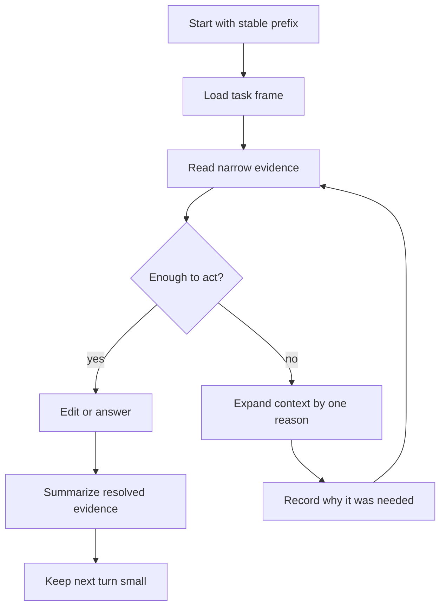
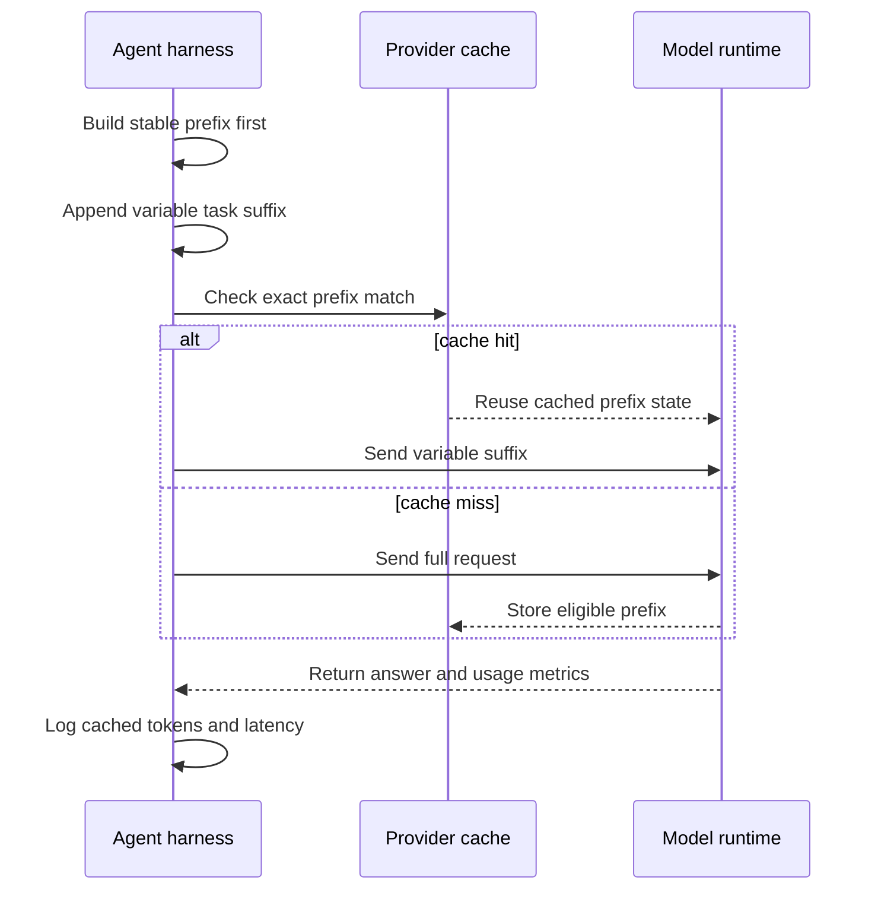

> **Complexity**: [COMPLEX]
>
> **Time to Complete**: 75-90 min
>
> **Prerequisites**: Module 1.1 Prompt Fundamentals or equivalent; comfort with LLM context windows; basic CLI + git.

---

## Learning Outcomes

By the end of this module, you will be able to:

- **Distinguish** context engineering from prompt engineering and from RAG by naming the unit of optimization for each discipline.
- **Diagnose** why an agent that worked in one session fails in a fresh session by identifying the missing context inputs.
- **Design** a context layout that improves prefix-cache hit rate while staying under the effective attention budget.
- **Evaluate** the trade-offs of high-context and low-context agent runs across cost, latency, risk, and reviewability.
- **Compare** session-level context with repo-level context and route information to the surface that will remain authoritative.

## Why This Module Matters

Mira is the senior engineer everyone asks when the AI coding workflow becomes unstable.

She shipped the first useful internal agent playbook for a large platform repository.

In her hands, the agent reads the right runbook, opens the right files, avoids the generated state directory, runs the correct tests, and produces a small pull request.

The model has a large context window, and Mira uses it well.

For several weeks, the workflow looks repeatable.

Then a teammate joins the same workstream.

The teammate receives Mira's prompt, the same model name, and the same issue.

The result is not the same.

The new session misses a hidden branch rule, reopens a solved design question, forgets a reviewer constraint, and edits a generated file that Mira's runs never touched.

Nobody changed the model.

Nobody changed the task.

The missing piece is that Mira had been carrying useful state inside the session: prior tool outputs, remembered decisions, cached files, the order in which she loaded instructions, and a mental map of which repository documents mattered.

Her "prompting skill" was not just prompt writing.

It was context engineering that she had never named.

Context engineering is the discipline of managing what an LLM agent sees on each turn.

It is not a synonym for prompt engineering.

It is not the same thing as RAG.

It is the RAM-management layer of LLM-backed work: deciding what belongs in the window, where it should sit, how it should change, how it should be cached, and when stale state should be refreshed.

This module gives that layer a practical shape.

You will learn how to reason about the model window as a scarce operating surface, how to place persistent repository knowledge differently from transient session knowledge, how prefix caching changes prompt layout, and how to detect context rot before a useful session turns into a loop.

## Start With The Unit Of Optimization

Prompt engineering, context engineering, and RAG often get collapsed into one phrase because all three influence model input.

That collapse is expensive.

When teams do not name the layer, they debug the wrong thing.

They rewrite instructions when the repository map is missing.

They add vector search when the real issue is tool-output bloat.

They increase context size when the actual problem is poor ordering.

The first senior habit is to name the unit of optimization.

| Discipline | Unit of optimization | Typical artifact | Failure symptom |
|---|---|---|---|
| Prompt engineering | The instruction interface for a task | system prompt, user prompt, examples, output contract | the model misunderstands what to do |
| Context engineering | The assembled input state for a turn | file excerpts, chat history, tool results, repo docs, retrieved snippets | the model lacks or misweights the information needed to act |
| RAG | One retrieval pattern inside context assembly | retriever, corpus, chunks, ranking, citations | the model receives the wrong external knowledge or cannot ground a claim |

Prompt engineering asks: "What instruction should the model follow?"

Context engineering asks: "What should the model be able to see right now?"

RAG asks: "Which external records should be retrieved and inserted?"

Those questions overlap, but they are not interchangeable.

A strong prompt cannot compensate for a missing acceptance criterion.

A large retrieval result cannot fix contradictory session state.

A perfect repository guide will not help if it is loaded after several screens of noisy logs that dominate attention.

The context engineer owns selection, compression, order, freshness, and observability.

That ownership matters most in agentic work because the input is not one static prompt.

The input is repeatedly rebuilt from instructions, conversation history, tool outputs, file reads, previous decisions, and sometimes retrieved documents.

Each turn is a new operating surface.

### Worked Example: The Fresh-Session Failure

Mira's successful run had this hidden context:

```text
+------------------------------------------------------------++
|| Stable repo context                                        ||
|| AGENTS.md, branch policy, generated-file exclusions         ||
++----------------------------------------------------------++|
 | Session context                                            ||
 | prior command failures, selected test command, issue scope  |
++----------------------------------------------------------++|
 | Task prompt                                                |
 | "fix the module and open a PR"                             |
++----------------------------------------------------------++|
 | Tool outputs                                               |
 | changed file list, build output, reviewer notes            |
+------------------------------------------------------------++
```

Her teammate received only this:

```text
+------------------------------------------------------------++
|| Task prompt                                                ||
|| "fix the module and open a PR"                             ||
+------------------------------------------------------------++
```

The prompt was not the problem by itself.

The missing state was the problem.

The teammate did not know which files were generated, which checks were mandatory, which issue scope was active, or which previous design choice had already been rejected.

A prompt engineer might try to make the task prompt longer.

A context engineer asks where each missing input should live.

| Missing input | Best home | Why |
|---|---|---|
| generated-file exclusions | repo context | stable rule, should apply to every session |
| selected test command | repo context if universal, session context if task-specific | some checks are global, some are local to a change |
| previous rejected design | repo context if durable, session context if only for this task | avoid polluting stable docs with one-off debate |
| last failing build output | session context | transient evidence, useful until fixed |
| reviewer requirement | repo context if policy, session context if PR-specific | route based on expected reuse |

The core diagnostic question is:

> **Active learning prompt:** Think of an AI agent run that worked only after a long back-and-forth. Which three pieces of state did the final successful turn contain that a fresh session would not have?

If the answer includes policy, path maps, or team conventions, those belong in repo context.

If the answer includes command output, partial reasoning, or current failure traces, those belong in session context.

If the answer includes external knowledge, retrieval may help, but only after you know what the retrieval result must support.

## The LLM-as-OS Mental Model

The LLM-as-OS framing is a community-of-practice shorthand, not a formal architecture standard.

Lopopolo's OpenAI post on harness engineering pushes practitioners to think beyond individual prompts and toward the system around the model.

Andrej Karpathy's public commentary has also popularized the broader idea that LLMs increasingly behave like a new operating layer with tools, memory-like context, and applications around them.

This module uses that framing carefully:

the LLM is not literally an operating system, but the analogy helps engineers reason about scarce runtime state.

In the analogy, the context window acts like RAM.

Tools are system calls.

Repository files are durable storage.

The harness is the process supervisor, policy layer, and observability surface.

The prompt is closer to a process entrypoint than to the whole program.

```text
+----------------------+----------------------+----------------------++
|| Operating concern    | LLM agent analogue   | Context question     ||
++----------------------+----------------------+--------------------++|
 | RAM                  | context window        | what fits now?       |
 | cache locality        | prefix cache          | what repeats first?  |
 | disk                  | repository docs/code  | what persists?       |
 | process log           | session history       | what just happened?  |
 | system call           | tool invocation       | what can be fetched? |
 | supervisor            | harness rules/checks  | what is enforced?    |
+----------------------+----------------------+----------------------++
```

This model prevents two common mistakes.

The first mistake is treating the context window as a passive bucket.

It is not a bucket.

It is the active working set that shapes the next model computation.

The second mistake is treating a larger window as a cure for weak context design.

More address space does not eliminate the need for memory management.

It often makes memory management more important because the agent can now carry a larger amount of stale or low-value state.

### Nominal Limit Versus Effective Attention Budget

Vendors advertise nominal token limits.

Engineers operate within effective attention budgets.

The nominal limit answers: "How much input can the request accept before truncation or failure?"

The effective attention budget answers: "How much of this input can the model use reliably for this task?"

Those are different numbers.

A model may accept a huge input while still over-weighting the beginning, the end, recent tool outputs, repeated phrasing, or highly salient instructions.

Long-context research, including the DeepMind paper at the requested ArXiv URL, exists because scaling useful attention across very long inputs is a hard systems problem.

The practical lesson is not "never use long context."

The lesson is "test where performance degrades for your task shape."

Long windows are extremely useful for codebase reading, multi-document review, and migration planning.

They are less useful when the agent must notice one small acceptance criterion hidden in a noisy transcript.

Position effects matter.

Many model behaviors are strongest around the start and end of the prompt.

That is why teams often place durable instructions and maps early, keep the current task and acceptance criteria near the end, and aggressively compress tool output that no longer matters.

```text
+------------------+------------------+------------------+------------------++
|| Prompt region    | Good candidates  | Risk             | Design move      ||
++------------------+------------------+------------------+----------------++|
 | Very early        | stable rules     | stale if mixed   | keep static      |
 | Early-middle      | repo map         | too much prose   | use indexes      |
 | Middle            | evidence chunks  | lost-in-middle   | summarize        |
 | Late-middle       | recent findings  | tool bloat       | prune resolved   |
 | Very late         | task and ask     | unstable if huge | keep crisp       |
+------------------+------------------+------------------+------------------++
```

The effective budget is also shaped by task difficulty.

A simple summarization task can often tolerate more background.

A multi-file code edit with strict acceptance criteria needs a cleaner window because the model must preserve constraints while planning, editing, and explaining.

Do not ask "Can the file fit?"

Ask "Will the model attend to the part that controls the decision?"

### A Practical RAM Budget

For senior engineering work, start with a budget that classifies context by expected reuse.

```yaml
context_budget:
  stable_prefix:
    purpose: durable rules and maps
    examples:
      - agent instructions
      - repository layout
      - acceptance rubric
  task_frame:
    purpose: the current problem and success criteria
    examples:
      - issue summary
      - non-goals
      - required checks
  evidence:
    purpose: facts gathered during this run
    examples:
      - file excerpts
      - failing command output
      - API responses
  scratch:
    purpose: short-lived notes used to choose next action
    examples:
      - temporary hypotheses
      - alternative plans
      - resolved errors
```

Only the first block should be stable across many requests.

The task frame should change per issue, but not per tool call.

Evidence should be kept only while it affects the next decision.

Scratch should be summarized or discarded quickly.

The RAM analogy becomes useful when the session starts to degrade.

If the agent is looping, the scratch area may have grown into a misleading state machine.

If the agent forgets acceptance criteria, the task frame may be buried.

If the agent violates stable policy, the stable prefix may be missing, contradicted, or loaded too late.

## Context Is Scarce Even In Large Windows

Large context windows change what is possible.

They do not remove scarcity.

Scarcity moves from "will this input fit?" to "which tokens deserve attention, cost, latency, and review?"

Every added token competes with other tokens.

Every added file increases the chance that the model will overfit to irrelevant detail.

Every added tool output can become stale evidence after the problem is fixed.

The most useful discipline is to treat context like an SRE treats dashboards during an incident.

More panels are not always better.

The right panel, at the right moment, with a clear freshness signal, is better.

### High-Context Versus Low-Context Runs

Neither high-context nor low-context is inherently correct.

The right choice depends on blast radius, ambiguity, and recovery cost.

| Approach | Strength | Cost | Failure mode | Use when |
|---|---|---|---|---|
| High-context | broad awareness, fewer missing files, better architectural continuity | slower, more expensive, harder to review | model attends to stale or irrelevant detail | architecture review, migration planning, incident reconstruction |
| Low-context | fast, cheap, narrow, easier to audit | misses hidden constraints, may rediscover known facts | agent invents defaults for absent context | small edits, single-file fixes, known command loops |
| Staged-context | starts narrow, expands on evidence | requires orchestration discipline | expansion rules are vague | most production agent workflows |

Staged-context is often the best default.

Begin with the stable rules, the task frame, and the smallest relevant file set.

Expand only when evidence shows a missing dependency.

Summarize or drop resolved evidence before the next expansion.

That loop keeps the session from turning into an accidental archive.



The phrase "by one reason" is important.

Do not expand context because the agent feels uncertain.

Expand because a specific decision needs a specific missing input.

### Position Bias In Practice

The "lost in the middle" problem is not only an academic curiosity.

In agent sessions, it shows up as practical forgetting.

An acceptance criterion placed in the middle of a long transcript may be ignored while the model follows the newest command output.

A repository rule loaded after several long logs may be treated as less central than the logs.

A security note buried in a retrieved document may lose to a confident but generic prior.

The repair is not to shout the rule louder in every sentence.

The repair is to design a context layout.

Put durable rules early.

Put the current task and success criteria late.

Keep the middle for compressed evidence that directly supports the next decision.

When a middle item becomes decision-critical, promote it into the task frame or stable prefix before the next turn.

```text
Bad layout:

+------------+------------+------------+------------+------------+
| variable   | huge logs  | key rule   | old debate | current ask |
+------------+------------+------------+------------+------------+

Better layout:

+------------+------------+------------+------------+------------+
| stable     | repo map   | evidence   | open risks | current ask |
+------------+------------+------------+------------+------------+
```

### Worked Example: Shrinking Without Losing Signal

Suppose an agent is fixing a failing build.

The raw session includes:

- full repository instructions
- issue body
- three failed build logs
- two file reads
- one reviewer comment
- one stale hypothesis about package versions
- the final compiler error

A weak low-context approach drops too much:

```text
Fix the build. The compiler failed.
```

A weak high-context approach includes everything:

```text
Here is every instruction, every log, every command, every old hypothesis,
every file, and every comment from the last two hours. Continue.
```

A context-engineered version keeps the decision state:

```text
Stable rules:
- Do not edit generated state.
- Run the site build before opening the PR.

Task:
- Fix the build failure caused by the new module.
- Keep the change limited to the new content files.

Fresh evidence:
- The current compiler error says the Mermaid block is malformed.
- The affected file is module-2.1-context-fundamentals.md.
- Earlier package-version hypotheses were disproven by a clean dependency install.

Next action:
- Inspect the Mermaid block, correct syntax, rerun build, and report only current errors.
```

The engineered version is smaller than the raw session but richer than the vague prompt.

It removes resolved noise while preserving the causal path.

> **Active learning prompt:** Take a recent AI session transcript and mark each paragraph as stable rule, task frame, evidence, or scratch. Which paragraphs would you delete before the next model turn?

## The Economics Of Prefix Caching

Context layout is not only about quality.

It is also about cost and latency.

Prompt caching rewards stable prefixes.

If the beginning of a request repeats exactly across calls, providers can reuse cached work instead of processing the whole prefix from scratch.

Both Anthropic and OpenAI document the same core design rule:

put stable or repeated content first, and variable user-specific content later.

The exact implementation differs by provider.

Anthropic exposes automatic caching and explicit cache breakpoints such as `cache_control`.

OpenAI describes automatic prompt caching for eligible long prompts, with usage fields such as `cached_tokens` and options such as `prompt_cache_key` and retention policy.

The engineering principle is provider-neutral:

maximize the stable prefix without hiding current task data.

### Cache-Friendly Context Layout

```text
+--------------------------------------------------------------------------++
|| Stable prefix                                                            ||
|| provider instructions, agent role, repo policy, output contract           ||
++-----------------------------------------------------------------------++|
 | Semi-stable middle                                                       |
 | tool schemas, repository map, rubric, examples                           |
++-----------------------------------------------------------------------++|
 | Variable suffix                                                          |
 | issue body, current file excerpts, command output, user question          |
+--------------------------------------------------------------------------++
```

If you put variable content at the top, the cache breaks early.

If you put a timestamp, random run id, or current error log before the stable policy, every request looks new.

That forces the provider to process the expensive shared material again.

### Caching Flow



The important metric is not "did caching exist?"

The important metric is cache hit rate for the expensive part of the prompt.

You can observe that with provider usage fields and local timing.

### Worked Example: Reordering For Cache

Assume an agent harness sends this request shape on every file review:

```text
BAD ORDER

1. Current timestamp and run id
2. User issue text
3. Failing command output
4. Stable repository policy
5. Stable review rubric
6. Tool schema
7. Required output shape
```

The top changes every request.

Even if the policy and rubric are identical, they arrive after variable content.

The stable prefix is tiny.

A cache-friendly layout is:

```text
BETTER ORDER

1. Stable repository policy
2. Stable review rubric
3. Tool schema
4. Required output shape
5. Current issue text
6. Failing command output
7. Timestamp and run id, only if needed
```

Now the expensive stable portion is the prefix.

The variable details still reach the model, but they do not poison the cache key at the top.

For an agent doing repeated reviews, that can reduce both latency and input cost.

### Instrumentation Example

Do not guess whether the layout improved caching.

Log usage and calculate the share of input tokens served from cache.

The following script reads JSON lines from a local agent log.

Each line must include `prompt_tokens`, `cached_tokens`, and `latency_ms`.

```python
import json
from pathlib import Path


def load_runs(path: Path) -> list[dict]:
    runs = []
    for line in path.read_text().splitlines():
        if line.strip():
            runs.append(json.loads(line))
    return runs


def summarize(runs: list[dict]) -> dict:
    prompt_tokens = sum(run["prompt_tokens"] for run in runs)
    cached_tokens = sum(run["cached_tokens"] for run in runs)
    latency_ms = sum(run["latency_ms"] for run in runs)
    count = len(runs)
    cache_hit_rate = cached_tokens / prompt_tokens if prompt_tokens else 0
    return {
        "runs": count,
        "prompt_tokens": prompt_tokens,
        "cached_tokens": cached_tokens,
        "cache_hit_rate": round(cache_hit_rate, 3),
        "avg_latency_ms": round(latency_ms / count, 1) if count else 0,
    }


if __name__ == "__main__":
    log_path = Path("agent-cache-runs.jsonl")
    print(json.dumps(summarize(load_runs(log_path)), indent=2))
```

Create a small test log:

```bash
cat > agent-cache-runs.jsonl <<'EOF'
{"prompt_tokens": 18000, "cached_tokens": 0, "latency_ms": 9200}
{"prompt_tokens": 18100, "cached_tokens": 15600, "latency_ms": 4100}
{"prompt_tokens": 17950, "cached_tokens": 15480, "latency_ms": 3980}
EOF

.venv/bin/python cache_summary.py
```

Expected output shape:

```json
{
  "runs": 3,
  "prompt_tokens": 54050,
  "cached_tokens": 31080,
  "cache_hit_rate": 0.575,
  "avg_latency_ms": 5760.0
}
```

This is a toy measurement, but the operating habit is real.

A context layout is not done until you can see whether it improves repeated work.

### Cache Trade-Offs

Caching does not mean every request should start with a giant static prefix.

Static content has to earn its place.

A stable prefix that includes outdated rules will faithfully cache outdated rules.

A stable prefix that includes every possible policy may improve cache rate while degrading attention.

Cache optimization must stay subordinate to task quality.

| Design choice | Cache effect | Attention effect | Decision |
|---|---|---|---|
| stable policy first | improves prefix reuse | makes rules salient | usually good |
| variable issue first | breaks reuse | makes current task salient | only use when request is one-off |
| all repo docs in prefix | may improve reuse | overloads attention | usually bad |
| compact repo map in prefix | improves reuse | preserves routing signal | usually good |
| current log at top | breaks reuse | may over-focus on transient evidence | avoid unless emergency |
| task ask at end | does not help prefix cache | improves recency | usually good |

The best layout often has a stable prefix and a crisp suffix.

The prefix gives the model the operating contract.

The suffix tells it what to do now.

## Session Context Versus Repo Context

All context eventually enters the same model window.

That does not mean all context should be managed the same way.

Session context is ephemeral.

Repo context is persistent.

Session context answers: "What has happened in this run?"

Repo context answers: "What should every run know?"

Both are necessary.

Confusing them creates rot.

If a durable policy lives only in chat history, the next session forgets it.

If a one-off failure log is copied into a permanent agent guide, future sessions inherit stale noise.

### Comparison Matrix

| Context surface | Examples | Lifetime | Owner | Good for | Bad for |
|---|---|---|---|---|---|
| Chat history | decisions, clarifications, recent failures | one session | current operator | continuity inside a task | durable policy |
| Tool outputs | command results, file reads, API responses | minutes to hours | harness or agent | fresh evidence | long-term memory |
| AGENTS.md | workflow rules, branch policy, maps | weeks to months | repository maintainers | stable agent instructions | long debates |
| Structured docs | architecture, runbooks, rubrics | weeks to quarters | domain owners | explainable policy and design | transient logs |
| Code as context | tests, types, scripts, config | version history | code owners | executable truth | unexpressed intent |
| Retrieval corpus | tickets, docs, knowledge base | variable | platform team | external grounding | hidden enforcement |

The routing rule is simple:

put information where its expected lifetime and ownership match.

If it should survive a fresh session, put it in repo context.

If it should disappear after the current task, keep it in session context.

If it should be recomputed from code, do not duplicate it in prose unless the prose explains intent.

### Repo Context Design

A repository should give agents a map, not a full manual at the top of every request.

The map should point to stable sources.

The stable sources should be small enough to load on purpose.

```text
repo-root/
  AGENTS.md
  docs/
    architecture/
      context-boundaries.md
    runbooks/
      build-and-test.md
    harness/
      checks.md
  scripts/
    check_context_layout.py
  src/
    ...
```

`AGENTS.md` should not become a dumping ground for every lesson learned.

It should route the agent.

For example:

```text
For build failures, read docs/runbooks/build-and-test.md.
For generated artifacts, read docs/harness/checks.md.
For architecture changes, read docs/architecture/context-boundaries.md.
```

That is repo-level context.

It persists across sessions.

It can be reviewed in pull requests.

It can be tested with link checks.

It can be shortened when it grows.

### Session Context Design

Session context needs a different discipline.

The goal is not preservation.

The goal is continuity without bloat.

At each turn, the session should carry:

- the current objective
- the latest accepted plan
- current open questions
- fresh evidence that changes the next action
- decisions that have not yet been written to the repo

It should not carry:

- resolved command output
- disproven hypotheses
- entire files after a small excerpt was enough
- repeated policy already available in repo context
- long assistant explanations that no longer affect the task

Agent harnesses can implement this with rolling summaries.

Humans can implement it manually by writing a short "current state" note before asking the next question.

The note should be factual, not autobiographical.

```text
Current state:
- Objective: make the new context module render cleanly.
- Files in scope: the new section index and module.
- Fixed: frontmatter parses.
- Open: Mermaid syntax and line-count gate.
- Next check: npm run build.
```

This is a compression boundary.

It preserves decision state without preserving every token that produced it.

### Routing Decisions

Use this decision table when deciding where context belongs.

| Question | If yes | If no |
|---|---|---|
| Should a fresh agent know this next week? | repo context | session context |
| Is it executable truth? | code, tests, or scripts | docs or session note |
| Is it policy rather than evidence? | AGENTS.md or structured docs | tool output |
| Does it change per request? | suffix or session state | stable prefix |
| Is it sensitive or user-specific? | minimize and isolate | consider stable docs |
| Is it needed for one decision only? | session evidence | repo map |

The main risk is over-documenting transient facts.

Repo context should remain clean enough that every new agent can afford to read it.

Session context should remain fresh enough that every next turn can trust it.

## Context-Rot Observability

Context rot is degradation caused by stale, bloated, contradictory, or misordered context.

It often feels like the model "got worse."

Sometimes the model is fine.

The working set is bad.

You can observe context rot before it wastes a whole session.

### Symptoms

Common signs include:

- the agent loops on a problem already resolved
- it contradicts an earlier accepted decision
- it forgets acceptance criteria after reading long logs
- it hallucinates filenames that do not exist
- it edits files outside the declared scope
- it repeats a tool call without using the result
- it treats old errors as current errors
- it asks for context that is already present but buried

Each symptom maps to a context failure class.

| Symptom | Likely context failure | First repair |
|---|---|---|
| loops on resolved problem | stale evidence remains salient | summarize resolved state and remove old logs |
| contradicts accepted decision | decision not promoted | move decision into task frame or repo doc |
| forgets acceptance criteria | criteria buried in middle | restate criteria near current ask |
| hallucinates filenames | repository map missing | load file tree or exact path list |
| edits outside scope | scope missing or contradicted | put scope in stable rule and current ask |
| repeats tool calls | tool outputs too noisy | extract the useful result and drop the rest |
| treats old error as current | freshness not labeled | label outputs with time and status |
| asks for present context | overload or poor ordering | shrink and reorder context |

### What To Instrument

Instrument context like you would instrument a service boundary.

You need size, freshness, composition, and outcome.

At minimum, log:

- total input tokens
- cached input tokens
- context sections included
- top files loaded
- tool-output token share
- age of last critical evidence
- number of unresolved open questions
- final outcome for the turn

The point is not to collect beautiful dashboards.

The point is to make failure review factual.

When an agent misses a rule, you should be able to answer:

Was the rule present?

Where was it located?

Was it contradicted?

Was it surrounded by noisy output?

Did the session summary preserve it?

### Minimal Context Ledger

A context ledger is a small structured record of what the agent saw.

```yaml
turn_id: review-006
stable_prefix:
  - AGENTS.md
  - docs/harness/checks.md
task_frame:
  - issue summary
  - acceptance criteria
evidence:
  - src/content/docs/ai/ai-engineering-foundations/index.md
  - build error excerpt
tool_output:
  token_share_estimate: 0.18
freshness:
  build_error: current
  branch_policy: stable
outcome:
  status: needs_rerun
  reason: mermaid syntax corrected
```

This ledger can live in an agent trace, a local JSONL file, or a pull request note.

It does not need to be long.

It needs to tell reviewers whether the agent had the right working set.

### Refresh Cycle

When rot appears, do not keep adding context.

Refresh the working set.

```text
+-------------------+     +-------------------+     +-------------------+
| detect symptom     | --> | classify context  | --> | prune or promote  |
| loop, miss, drift   |     | stale, absent,    |     | delete, summarize,|
| or contradiction    |     | buried, noisy     |     | or move to repo   |
+-------------------+     +-------------------+     +-------------------+
          ^                                                   |
          |                                                   v
+-------------------+     +-------------------+     +-------------------+
| observe next turn  | <-- | rerun with ledger | <-- | rebuild window    |
| outcome and cost    |     | size and outcome  |     | stable then fresh |
+-------------------+     +-------------------+     +-------------------+
```

This is the same operational loop as debugging a flaky service:

observe, classify, repair one cause, rerun, and record the result.

### Choosing The Repair

Use one of four repairs.

Prune when the context is too large or stale.

Promote when a decision should become durable.

Reorder when important content is present but poorly placed.

Retrieve when the missing fact exists outside the current session and repository context.

| Repair | Use when | Example |
|---|---|---|
| prune | resolved evidence dominates | replace full build log with current error |
| promote | a rule should survive sessions | move "never edit generated state" to AGENTS.md |
| reorder | content is present but ignored | put acceptance criteria near the current ask |
| retrieve | needed fact is external | fetch provider docs or issue history |

Do not use retrieval as a reflex.

Retrieval is powerful when the missing fact is in a corpus.

It does not fix overloaded session state or contradictory instructions.

## Designing A Context Layout

A useful context layout is a repeatable assembly order.

It should be explicit enough that another engineer or harness can rebuild it.

Start with this baseline:

```text
+-----------------------++
|| 1. Stable prefix      ||
|| rules, role, maps     ||
++---------------------++|
 | 2. Semi-stable tools  |
 | schemas, rubrics      |
++---------------------++|
 | 3. Task frame         |
 | issue, goals, limits  |
++---------------------++|
 | 4. Fresh evidence     |
 | files, logs, outputs  |
++---------------------++|
 | 5. Current ask        |
 | exact next action     |
+-----------------------++
```

Then apply three checks.

First, cache check:

Does the repeated part appear before the variable part?

Second, attention check:

Are the highest-risk rules and success criteria at strong positions?

Third, freshness check:

Can the model tell which evidence is current?

### Example Layout For A Coding Agent

```yaml
stable_prefix:
  role: senior repository coding agent
  rules:
    - obey AGENTS.md
    - do not edit generated artifacts
    - keep scope limited to the issue
  output_contract:
    - summarize changed files
    - report tests run
semi_stable:
  repo_map:
    - src/content/docs
    - scripts
    - docs
  tool_contracts:
    - use ripgrep for search
    - use explicit virtualenv python path
task_frame:
  issue: write Context Engineering Fundamentals
  success:
    - module has required sections
    - line count gate passes
    - build passes
fresh_evidence:
  files_read:
    - module-quality.md
    - existing harness module
current_ask:
  action: draft, validate, commit, and open PR
```

This layout is not universal.

It is a starting point.

A security review would put threat model and trust boundaries into the task frame.

An incident analysis would put current timeline and confirmed facts into fresh evidence.

A migration plan would put compatibility constraints into the stable or semi-stable area.

### Evaluation Rubric

Before using a layout, evaluate it with these questions.

| Dimension | Good answer | Weak answer |
|---|---|---|
| selection | each included item has a decision reason | included because it might help |
| ordering | stable prefix and current ask are deliberate | order follows discovery accident |
| freshness | stale and current evidence are labeled | all logs look equally current |
| cacheability | repeated prefix is stable | variable data appears first |
| reviewability | reviewer can see what was loaded | context is invisible in chat |
| portability | fresh session can reconstruct it | depends on one person's memory |

The layout should not optimize only for the model.

It should also optimize for human review.

If a reviewer cannot tell what context the agent used, they cannot tell whether the failure was model reasoning, missing input, or bad instructions.

## Did You Know?

1. OpenAI's prompt-caching guide says cache hits require exact prefix matches, so static instructions and examples should be placed before variable user-specific content. Source: [OpenAI Prompt Caching](https://platform.openai.com/docs/guides/prompt-caching).

2. Anthropic's prompt-caching docs describe automatic caching, explicit cache breakpoints, a default five-minute cache lifetime, and longer cache options for supported use cases. Source: [Anthropic Prompt Caching](https://docs.anthropic.com/en/docs/build-with-claude/prompt-caching).

3. DeepMind's "Leave No Context Behind: Efficient Infinite Context Transformers with Infini-attention" describes a bounded-memory architecture for scaling attention over long inputs without quadratic compute. Source: [arXiv:2404.07143](https://arxiv.org/abs/2404.07143).

4. OpenAI's "Harness Engineering" post argues that reliable AI work is a system around the model — code structure, mechanical lints, application legibility — not just a better instruction string. Source: [Harness Engineering](https://openai.com/index/harness-engineering/).

## Common Mistakes

| Mistake | Why it hurts | Better move |
|---|---|---|
| Putting timestamps or user-specific data at the top of every request | breaks stable prefix reuse and weakens cache benefits | place static policy and schemas first, variable details later |
| Loading the entire repository into context | increases cost, latency, and irrelevant attention competition | load a repo map first, then expand by reason |
| Calling context engineering "advanced prompt engineering" | hides the difference between instruction design and working-set design | name the layer and optimize the assembled turn state |
| Treating RAG as the whole context strategy | retrieval does not manage session history, repo policy, ordering, or cache layout | use RAG as one input source inside a broader context plan |
| Ignoring tool-output bloat | stale logs become more salient than current facts | summarize resolved outputs and keep only fresh evidence |
| Keeping durable policy only in chat | fresh sessions miss the rule | promote durable policy to AGENTS.md or structured docs |
| Copying transient failures into permanent docs | future sessions inherit stale incident state | store transient evidence in session logs or traces |
| Measuring token count but not outcome | a smaller window can still omit critical facts | measure cache hit rate, latency, errors, and task success together |

## Quiz

### Question 1

Your team has a prompt that says, "Follow our repository rules," but a fresh agent still edits generated files.

The previous successful session did not make that mistake.

What context failure should you investigate first?

<details>
<summary>Answer</summary>

Investigate whether the generated-file rule exists in repo-level context and whether the fresh session loaded it early enough.

This is not primarily a prompt phrasing issue.

The missing or poorly placed input is likely a durable repository rule that lived in prior session memory.

Promote the rule to AGENTS.md or a linked harness doc, then make the agent map load that source before editing.

</details>

### Question 2

An agent reads a huge failure log, then ignores a short acceptance criterion that appeared earlier in the conversation.

The model's final answer is plausible but outside scope.

How should you repair the next turn?

<details>
<summary>Answer</summary>

Do not paste more log output.

Compress the log to the current causal error and restate the acceptance criterion near the current ask.

This is a position and freshness problem: stale or bulky evidence has outcompeted the controlling requirement.

</details>

### Question 3

A platform team wants to improve cost and latency for repeated code reviews.

Their current prompt starts with the issue body, current timestamp, and raw command output, then appends the stable review rubric.

What layout change should they test?

<details>
<summary>Answer</summary>

Move stable policy, rubric, output contract, and tool schemas to the prefix.

Place the issue body and command output after that stable prefix.

Then log cached tokens, total input tokens, and latency across repeated requests to verify that the prefix cache improves the expensive shared portion.

</details>

### Question 4

An engineer proposes solving all context issues by adding vector search over every internal document.

The agent's actual failure is that it keeps treating an old command error as current after the command has passed.

Is RAG the right first fix?

<details>
<summary>Answer</summary>

No.

The failure is stale session evidence, not missing external knowledge.

The first fix is to label command output freshness, remove or summarize resolved errors, and rebuild the session state.

Retrieval may help later if a needed document is absent, but it does not solve stale working-set state.

</details>

### Question 5

A security review agent performs better when given the full repository policy document, but the run becomes slow and expensive.

The team wants to keep quality without paying that cost on every small review.

What context strategy fits?

<details>
<summary>Answer</summary>

Use staged context.

Start with a compact stable security map and the current task frame.

Expand into the full policy only when a decision requires a specific rule.

If repeated reviews need the same policy excerpt, place that stable excerpt in the prefix and measure cache hit rate.

</details>

### Question 6

An agent forgets that the team already rejected a design option earlier in the task.

The rejection matters only for this pull request, not future work.

Where should that context live?

<details>
<summary>Answer</summary>

Keep it in session context, preferably in a short current-state summary or open-decisions note.

Do not promote it to AGENTS.md unless it becomes durable policy.

The right home follows lifetime and ownership.

</details>

### Question 7

A reviewer asks why an AI-generated patch missed a mandatory test.

The agent claims the test instruction was present, but nobody can tell where it was loaded or whether it was buried in tool output.

What should the team add?

<details>
<summary>Answer</summary>

Add a context ledger or trace that records which stable prefix, task frame, evidence, and tool outputs were included for the turn.

The ledger should include enough size and freshness information to distinguish missing context from ignored context.

That makes review factual instead of speculative.

</details>

## Hands-On Exercise

You will refactor an existing agent prompt and context bundle for cache use, attention quality, and fresh-session repeatability.

Use a real workflow if you have one.

If not, create a small mock workflow with an agent instruction file, a task prompt, a repository map, and two command outputs.

### Part A: Capture The Current Layout

- [ ] Choose one agent workflow that runs more than once per week.
- [ ] Save the current prompt or instruction bundle in a scratch file.
- [ ] List every context input the agent receives before its first tool call.
- [ ] Mark each input as stable prefix, semi-stable, task frame, fresh evidence, or scratch.
- [ ] Identify which inputs change on every request.
- [ ] Identify which inputs should survive a fresh session.

### Part B: Add Measurement

- [ ] Add logging for total input tokens if your provider exposes it.
- [ ] Add logging for cached input tokens or provider-specific cache-read fields.
- [ ] Add latency measurement around the model call.
- [ ] Add a list of included context sections to each trace record.
- [ ] Run the workflow at least three times with similar stable context.
- [ ] Record the baseline cache hit rate and average latency.

### Part C: Refactor The Layout

- [ ] Move stable policy, role, output contract, and tool schemas before variable task data.
- [ ] Replace large stable documents with a compact map plus targeted excerpts.
- [ ] Move current acceptance criteria near the final ask.
- [ ] Delete or summarize resolved tool outputs.
- [ ] Label fresh evidence with current, stale, or superseded.
- [ ] Keep one explicit note for open questions and accepted decisions.

### Part D: Re-Measure

- [ ] Run the same workflow again with a similar task shape.
- [ ] Compare cache hit rate before and after the refactor.
- [ ] Compare latency before and after the refactor.
- [ ] Inspect the output for missed rules or hallucinated files.
- [ ] Ask a teammate to reconstruct the agent's working set from your trace.
- [ ] Write one sentence explaining which context item moved to a better surface.

### Success Criteria

- [ ] The stable prefix no longer starts with variable user data.
- [ ] A fresh session can find durable policy without relying on chat history.
- [ ] The current task and acceptance criteria are easy to locate.
- [ ] Tool-output bloat is reduced or summarized.
- [ ] Cache metrics are visible for repeated runs.
- [ ] The measured result includes both quality and cost or latency observations.

## Next Module

Next module (planned): Repository Engineering for Agents.

That module will focus on making repository structure, indexes, docs, scripts, and tests act as durable context surfaces for AI coding agents.

## Sources

- Lopopolo, "Harness Engineering": [https://openai.com/index/harness-engineering/](https://openai.com/index/harness-engineering/)
- OpenAI, "Prompt caching": [https://platform.openai.com/docs/guides/prompt-caching](https://platform.openai.com/docs/guides/prompt-caching)
- Anthropic, "Prompt caching": [https://docs.anthropic.com/en/docs/build-with-claude/prompt-caching](https://docs.anthropic.com/en/docs/build-with-claude/prompt-caching)
- Google DeepMind, "Leave No Context Behind: Efficient Infinite Context Transformers with Infini-attention": [https://arxiv.org/abs/2404.07143](https://arxiv.org/abs/2404.07143)
- Nelson F. Liu et al., "Lost in the Middle: How Language Models Use Long Contexts": [https://arxiv.org/abs/2307.03172](https://arxiv.org/abs/2307.03172)
