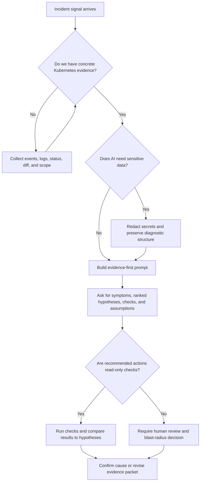

> **AI for Kubernetes & Platform Work** | Complexity: `[MEDIUM]` | Time: 40-55 min
>
> **Prerequisites**: Basic Kubernetes workload concepts, `kubectl` familiarity, and Module 1.1 in this track

---

## Learning Outcomes

- Diagnose Kubernetes rollout failures by separating symptoms, hypotheses, and verified causes before asking AI for recommendations.
- Design evidence-first AI prompts that include Kubernetes events, logs, resource state, manifest diffs, scope, and negative evidence.
- Evaluate AI-generated triage plans by ranking hypotheses against confidence, verification cost, blast radius, and operational risk.
- Implement a human-AI troubleshooting workflow that preserves human ownership of evidence collection, production judgment, and final action.

## Why This Module Matters

Hypothetical scenario: a production Deployment in the `payments` namespace stalls during a routine image update. The old Pods are still serving traffic, the new Pods never become Ready, the incident channel fills with partial observations, and someone pastes the phrase "cluster is broken" into an AI assistant because the team wants help quickly. That is the exact moment when AI can either calm the investigation or make it more chaotic, depending on whether the operator provides evidence or invites the model to guess.

Kubernetes troubleshooting is one of the highest-value places to use AI because incidents create too much text for one person to read cleanly under pressure. Events, logs, rollout history, resource quotas, node conditions, probe failures, and manifest diffs all arrive at once, and the hard work is not memorizing every command but deciding which signal changes the next decision. AI can compress those signals, propose candidate causes, and help you build a sharper next-check plan, but it cannot know your cluster state unless you provide it.

The risk is that a fluent answer can feel like a confirmed diagnosis even when it is only a pattern match. A model that has seen thousands of public posts about DNS, OOMKills, and image pulls may offer those explanations before it has enough evidence, and the polished wording can hide the gap between plausible and proven. In this module, you will learn to use AI as an investigation organizer, not as an authority that bypasses Kubernetes evidence.

The practical goal is simple: preserve the speed benefit without letting the model take control of production judgment. You will build prompts that separate symptoms from hypotheses, ask for discriminating checks instead of generic command lists, and evaluate recommendations against blast radius before running anything. By the end, AI should help you think more clearly during triage, not flood you with commands that make the incident feel busy.

## Start With Evidence, Not Anxiety

The weakest troubleshooting prompt is usually the most emotionally honest one: "My cluster is broken. What should I do?" That sentence communicates urgency, but it gives the model almost no operational context. Because the request contains no namespace, resource name, event stream, rollout timing, scope, or recent change, the model has to fill the missing space with general Kubernetes patterns rather than evidence from the incident.

A stronger prompt begins with facts that would also help a human reviewer. It names the workload, describes the observed failure, includes the change window, and provides the exact output that Kubernetes already produced. That shift matters because AI is much better at organizing evidence than discovering evidence it has never seen, and the difference between a useful hypothesis and a dangerous guess is often one missing event line.

A weak request usually compresses the whole incident into anxiety and gives the model no evidence to inspect:

> "My cluster is broken. What should I do? We need a fix quickly, and I do not know where to start looking."

A useful request still communicates urgency, but it gives the model Kubernetes facts that can be checked:

> "A Deployment rollout is stuck. New Pods remain Pending. Here are the Pod events, node capacity details, and the relevant spec diff."

AI performs far better when given exact error messages, event output, logs, manifest diffs, timing, and scope. Without those inputs, it may default to the most common public explanations rather than the most likely cause in your environment. That is why the first operator skill is evidence packaging, not prompt creativity.

The hallucination of certainty appears when the model states a cause without the evidence needed to support it. For example, a `Pending` Pod could be blocked by insufficient CPU, an unsatisfied node selector, a taint without a matching toleration, a quota limit, a missing PersistentVolume, or a scheduler constraint created by topology spread rules. If the prompt only says "Pending," a confident answer about any one of those causes is not a diagnosis; it is an untested hypothesis with a polished voice.

Consider a small example that shows the cost of guessing. A vague prompt says, "My Pod is Pending. Fix it," and an AI assistant responds with a node-maintenance sequence because it assumes a worker problem. The real `kubectl describe pod` output, which was not provided, says `0/10 nodes are available: 10 Insufficient cpu`; draining nodes would add churn to a capacity problem instead of resolving it.

The platform engineer's responsibility is to prevent that failure mode by treating AI like a fast junior investigator that must be shown the case file. You would not ask a human teammate to recommend a production action without seeing events, logs, and the last change, so do not ask a model to do it either. The evidence-first habit turns AI from a source of confident noise into a tool for shortening the path from symptom to tested cause.

The simplest collection pattern is to gather enough data to define change, symptom, scope, evidence, and constraints. You do not need to paste the entire cluster into the model, but you do need enough signal for it to distinguish lookalike causes. In Kubernetes, that usually means resource identity, recent spec diff, current status, event messages, relevant logs, node or quota context, and one or two examples of what is still working.

```bash
kubectl rollout status deployment/api -n payments
kubectl get pods -n payments -l app=api -o wide
kubectl describe pod -n payments -l app=api
kubectl get events -n payments --sort-by=.lastTimestamp
kubectl diff -f deployment.yaml
kubectl describe quota -n payments
```

Before running this, what output do you expect to separate a scheduling problem from a container-start problem? If the Pod never receives a node assignment, the scheduler and cluster capacity are near the center of the investigation; if the Pod is assigned but repeatedly restarts, the container, probes, configuration, and runtime environment become more important. That prediction step helps you notice when the evidence contradicts the first story in your head.

Evidence also includes negative evidence, meaning facts that rule out attractive explanations. If one Service can reach the database from the same node while another cannot, a broad node-network failure becomes less likely. If old Pods remain healthy while new Pods fail, a full cluster outage is less likely than a rollout-specific change, and the model should be told that boundary before it ranks hypotheses.

The following triage packet is a useful template because it treats AI as a reader of evidence rather than a replacement for collection. It preserves the original module's safest prompt shape and adds just enough structure to prevent a generic answer. The final request asks for ranked hypotheses and uncertainty-reducing checks, which makes the model show its reasoning path instead of jumping straight to a fix.

```text
Help me triage this Kubernetes rollout issue.

Facts:
- namespace: payments
- deployment: api
- old pods healthy
- new pods Pending
- problem began after image + resources change

Evidence:
- pod describe output:
  [paste]
- node allocatable summary:
  [paste]
- deployment diff:
  [paste]

Return:
1. symptoms
2. strongest hypotheses ranked by evidence
3. next 3 checks that would most reduce uncertainty
4. what not to assume yet
```

The phrase "what not to assume yet" is more valuable than it first appears. Incidents create anchoring bias because the first plausible explanation feels productive, especially when it matches something the team has seen before. Asking AI to list unproven assumptions forces a pause before action, and it can reveal whether the model is relying on evidence from your packet or filling gaps with common Kubernetes folklore.

The model should also be asked to distinguish evidence from inference. Evidence is an event that says `FailedScheduling`, a log line that says the process cannot bind to a port, or a rollout history entry that shows the resource request changed. Inference is the model saying the request probably exceeded allocatable CPU, the process probably lost a capability, or the readiness probe probably started too early; useful inference must point back to the evidence that made it plausible.

This distinction is worth practicing before an outage because it changes how the team talks in the incident channel. Instead of saying "AI found the root cause," say "AI ranked quota exhaustion highest because the event stream shows failed scheduling and the Deployment diff increased requests." That wording is slightly longer, but it preserves the chain from observation to interpretation and makes it easier for another engineer to challenge the next step.

## Build a Triage Frame Before Asking for Fixes

A strong triage frame answers six questions before anyone runs a repair command: what changed, what is broken, what is the scope, what evidence is already available, what hypotheses fit that evidence, and what checks would best separate those hypotheses. The frame is useful with or without AI, but it is especially powerful with AI because it constrains the model's answer to the investigation you are actually running. It also gives teammates a common language for reviewing the model's output.

Use this shape:

1. What changed?
2. What is broken?
3. What is the scope?
4. What evidence do we already have?
5. What are the top 3 hypotheses?
6. What checks best separate them?

The first question, "what changed," prevents the investigation from becoming a tour of every Kubernetes subsystem. A rollout that changed only image tag and resource requests should initially bias the investigation toward image availability, scheduler capacity, startup behavior, and any policy triggered by the new spec. It does not prove those areas are guilty, but it gives the model a reasonable starting map.

The second and third questions keep blast radius visible. "New Pods in one Deployment are Pending" is a much narrower problem than "all workloads in a node pool are failing DNS," and the difference determines both urgency and action risk. If AI knows that the old ReplicaSet is still serving requests and unrelated workloads are healthy, it should avoid global repair suggestions until the evidence supports them.

The fourth question makes the model work from data instead of vibes. Kubernetes already tells you a great deal through object status, events, conditions, controller messages, and recent changes, but those signals are easy to read in the wrong order under pressure. A model can summarize a long `describe` output or event stream, but it needs the raw material in the prompt because it cannot query your cluster by intuition.

The fifth and sixth questions create a differential diagnosis rather than a command dump. A discriminating check is an action that meaningfully separates two or more plausible causes, such as comparing Pod events against quota state when a Pod is Pending. The goal is to ask, "Which single check most reduces uncertainty?" rather than, "Which twenty commands look Kubernetes-shaped?"

Here is a simple investigation map for a rollout where new Pods are unhealthy while old Pods still serve traffic:

```text
+------------------------+     +-----------------------+     +------------------------+
| Observed symptom       | --> | Evidence packet       | --> | Ranked hypotheses      |
| New Pods not Ready     |     | events, logs, diff    |     | capacity, image, probe |
+------------------------+     +-----------------------+     +------------------------+
             |                              |                              |
             v                              v                              v
+------------------------+     +-----------------------+     +------------------------+
| Scope boundary         | --> | Discriminating check  | --> | Human action decision  |
| old Pods still healthy |     | one check per branch  |     | rollback, patch, wait  |
+------------------------+     +-----------------------+     +------------------------+
```

That diagram intentionally ends with a human action decision. AI can help rank the branches, but the operator owns the production action because only the operator can weigh business impact, change-freeze rules, rollback safety, SLO pressure, and the risk of making the system worse. This division of labor is not conservative theatre; it is how you keep a probabilistic assistant from becoming an unsupervised control loop.

Pause and predict: if the old Pods are healthy, new Pods are Pending, and the Deployment diff only increased CPU requests, which hypothesis should rise and which should fall? Scheduler capacity should rise because the symptom appears before container start, while DNS and readiness-probe theories should fall until evidence shows the new Pods reached a node and started a container. The point is not to prove capacity immediately; the point is to make the next check precise.

When you ask AI for the next checks, ask it to connect each check to a branch. For example, "Check quota because a namespace limit can block scheduling even when node capacity exists," or "Check node selectors because the new spec may require labels that no available node has." If a recommended command has no branch attached, it may be busywork, and busywork is expensive during incidents because it consumes attention.

The model should also be told to surface destructive or high-blast-radius actions separately. Commands such as deleting Pods, restarting controllers, draining nodes, or changing resource requests can be valid in the right incident, but they should not appear as first-line steps without evidence and a rollback plan. A good AI triage answer explains why a check is safe, what uncertainty it reduces, and what action would follow if the check confirms the branch.

## Rank Hypotheses, Then Verify Them

The safest mental model is a four-level ladder: symptom, plausible cause, tested cause, and confirmed cause. A symptom is what Kubernetes reports, such as a Pod stuck in `Pending` or a container in `CrashLoopBackOff`. A plausible cause is a branch that fits the symptom, a tested cause has a check result behind it, and a confirmed cause explains the observed failure while surviving comparison against competing branches.

AI is most useful in the middle of that ladder. It can generate plausible causes you might overlook, rank them by the evidence you supplied, and propose checks that turn uncertainty into information. It should not leap from symptom to certainty, and you should treat an unsupported phrase like "this is definitely DNS" as a process defect rather than a helpful answer.

The reason is that model fluency is not the same as causal access. A public corpus contains many posts where Kubernetes failures involve DNS, OOMKills, image pulls, CNI issues, and probe misconfiguration, so those explanations are easy for a model to produce. Your cluster, however, may be failing because a topology spread rule, namespace quota, admission policy, or new resource request created a specific scheduler constraint that appears less often in public examples.

Evidence-weighted ranking counters that bias by asking the model to score each hypothesis against two practical axes: confidence from the supplied evidence and cost of verification. A low-effort check with moderate confidence is often worth doing before an invasive check with slightly higher confidence, because triage rewards uncertainty reduction per minute. This is why a quick quota or event review can beat a complex network trace early in an incident.

| Hypothesis | Evidence that supports it | Fast discriminating check | Verification cost | Action if confirmed |
| --- | --- | --- | --- | --- |
| Resource requests exceed available capacity | New Pods Pending after resource change | Inspect scheduler events and node allocatable | Low | Reduce request, scale capacity, or rollback |
| Image cannot be pulled | New image tag introduced in diff | Review Pod events for pull errors | Low | Fix tag, registry auth, or image policy |
| Readiness probe rejects new build | Pods start but never become Ready | Compare container logs and probe events | Low | Patch probe, app config, or rollback |
| SecurityContext blocks process startup | Security settings changed with rollout | Inspect logs and runtime errors | Medium | Adjust capability, port, or filesystem setting |
| NetworkPolicy blocks dependency | Only new version fails dependency calls | Test policy scope from an ephemeral debug Pod | Medium | Patch policy or route traffic away |

This table is not a replacement for judgment, but it gives the AI answer a shape you can audit. Each row has a reason, a check, and an action boundary, so you can reject rows that do not fit the evidence. When a model returns a list without that structure, ask it to rewrite the list as a hypothesis table before running anything.

The original module's constraint-driven prompt is still a useful escalation pattern when a generic answer is too broad. It tells the model what has already been ruled out, names the technology context, and asks about two specific branches. The important part is that the prompt includes negative evidence, because negative evidence prunes the hypothesis tree and keeps the model from repeating checks the team has already completed.

```text
[Context: Pods stuck in CrashLoopBackOff after ConfigMap update]

Constraints:
- We have already verified the ConfigMap syntax; it is valid YAML.
- This is NOT an OOMKill; memory usage is flat at 12MB.
- Do NOT suggest 'kubectl logs' as the binary crashes before it can write to stdout.

Specific Question:
Given that the binary is written in Go and we recently updated the 'securityContext', 
could this be a 'filesystem-read-only' error or a missing 'cap_net_bind_service' capability?
```

Notice how much work the constraints do. They tell the model not to spend tokens on syntax validation, memory pressure, or a log command that has already failed to help. They also narrow the investigation to runtime permissions, which makes the answer more likely to propose checks such as container security context review, port binding behavior, read-only filesystem effects, and startup error collection through events or side-channel diagnostics.

Which approach would you choose here and why: ask AI for "all possible CrashLoopBackOff fixes," or ask it to rank only branches consistent with the constraints above? The second approach is stronger because it filters common but irrelevant advice before the answer is generated. It also preserves the team's time by keeping the conversation close to what the evidence can actually prove.

Ranking must not become a disguised conclusion. A branch can be "highest ranked" and still unconfirmed, especially when the evidence is incomplete or ambiguous. Your prompt should ask the model to state what evidence would falsify each branch, because falsifiability is a practical guardrail against answer-shaped speculation.

In production triage, the best next check is often the one that changes the decision tree, not the one that produces the most output. If a single `describe` event proves a namespace quota was exceeded, it is better than a large bundle of logs that does not distinguish quota from node capacity. Ask AI to justify every recommended check by the branch it confirms, weakens, or eliminates.

A useful review habit is to read the model's top hypothesis and ask, "What result would make us stop believing this?" If the answer is vague, the hypothesis is not operational yet. For Kubernetes work, a strong hypothesis normally points to a concrete status field, event reason, controller message, or log line that can change the team's confidence quickly.

## Use AI for Compression, Translation, and Missing Evidence

AI is strong at summarizing long logs, translating dense `kubectl describe` output into plain language, spotting repeated event patterns, organizing a troubleshooting timeline, and listing evidence that is still missing. Those tasks have a common theme: they reduce cognitive load without granting the model authority to mutate the system. They are especially helpful when an on-call engineer must read unfamiliar controller messages while also coordinating with application owners.

AI is weak at knowing your environment-specific quirks, understanding undocumented platform conventions, and choosing between lookalike causes when the prompt lacks evidence. A managed Kubernetes cluster with custom admission policies, private registry rules, special node labels, service mesh defaults, and team-specific rollout automation can behave differently from examples in public documentation. If those details matter, they must appear in the prompt or remain under human review.

Think of the model as a fast summarizer sitting beside a careful operator. The summarizer can say, "These events repeat in this order," or "The rollout changed resource requests and security context," but the operator decides whether to rollback, patch, scale, or wait. This keeps the model in a role where its strengths are useful and its blind spots are less likely to cause damage.

Here is a practical compression prompt for event streams:

```bash
kubectl get events -n payments --sort-by=.lastTimestamp > /tmp/payments-events.txt
kubectl describe deployment api -n payments > /tmp/payments-deployment.txt
kubectl describe replicaset -n payments -l app=api > /tmp/payments-replicasets.txt
```

After collecting the files, paste relevant excerpts rather than blindly uploading unrelated cluster state. Ask AI to group repeated messages, name the controller emitting each message when possible, and separate observations from interpretation. That request helps the model produce a compact timeline, while the operator still verifies the timeline against the raw output before making a production change.

A useful answer might say that the Deployment created a new ReplicaSet, the ReplicaSet created Pods, the scheduler rejected those Pods for insufficient CPU, and no container logs exist because the containers never started. That is a high-quality summary because it follows the control path and avoids asking for logs that cannot exist yet. The model is not "solving Kubernetes"; it is compressing a noisy object graph into an ordered explanation.

The same pattern works for `CrashLoopBackOff`, but the evidence packet changes. You would include container status, restart count, recent logs if available, previous logs, probe configuration, ConfigMap or Secret references, resource limits, and any diff that changed startup behavior. If the model recommends networking checks before acknowledging container exit status and previous logs, that is a sign to steer it back to the evidence.

```bash
kubectl get pod api-abc123 -n payments -o jsonpath='{.status.containerStatuses[*].restartCount}{"\n"}'
kubectl logs api-abc123 -n payments --previous
kubectl describe pod api-abc123 -n payments
kubectl get deployment api -n payments -o yaml
```

Be careful with secrets when using AI tools. Kubernetes manifests can contain environment variable names, Secret references, service account names, and internal hostnames that may be sensitive even when the literal secret values are not present. Redact tokens, credentials, private customer identifiers, and internal URLs as needed, but preserve the structure that matters for diagnosis, such as which Secret key was referenced or which ServiceAccount was used.

The model can also translate Kubernetes object relationships for teammates who do not live in the platform layer. During a rollout incident, application engineers may care about whether the new build started, SREs may care about traffic and SLO impact, and platform engineers may care about scheduler events or admission policy. A good AI summary can produce one technical timeline and one stakeholder-facing summary, as long as both remain tied to the same evidence.

Do not let compression become laundering. If the model summarizes a log line incorrectly, the error can spread through the incident channel because the summary is easier to read than the original. For high-impact incidents, keep the raw command output linked or attached, and ask AI to quote the exact event messages it is relying on when it makes a claim.

This is also where team process matters. If AI produces a concise timeline, paste that timeline beside the raw evidence rather than replacing the raw evidence with the summary. The summary helps people orient quickly, while the raw output preserves auditability and lets a second responder verify whether the model skipped, merged, or misread an important line.

## Keep the Human-AI Division of Labor Explicit

The human owns evidence collection, prioritization, production judgment, and the final decision. AI helps with summarization, candidate causes, investigation structure, and clarifying what to test next. That split is the core safety rule for AI-assisted Kubernetes triage, because production operations involve risk preferences, user impact, and organizational context that are not contained in a model's generated text.

This division is not about distrust for its own sake. It is about matching responsibilities to capability boundaries. Kubernetes exposes state through APIs, controllers, events, and logs, while AI generates language based on a prompt; when the two disagree, the cluster state wins, and the operator must be able to explain the action without saying, "The model told me to."

You can make the division visible in the prompt itself. Ask AI to produce "recommended checks" and "possible actions if confirmed" as separate sections, then require it to mark destructive actions such as deletion, drain, restart, or rollback. That formatting makes it easier for a human reviewer to approve a check while holding back a change that needs incident-command agreement.

```text
Return your answer in four sections:
1. Evidence summary with direct references to the pasted output.
2. Ranked hypotheses with confidence and what would falsify each one.
3. Safe next checks that do not mutate production state.
4. Possible production actions only if a human confirms the evidence.
```

This kind of prompt is especially helpful for teams that pair a junior on-call engineer with an AI assistant. The assistant can help the junior engineer produce a clearer handoff to a senior reviewer, while the senior reviewer evaluates the evidence and action plan. The learning value is high because the model's output becomes a structured artifact that can be critiqued, not a magic answer hidden inside a chat window.

The model should never be allowed to invent business incidents, claim a team history, or imply a real outage occurred unless you provide a sourced incident. Hypothetical scenarios are fine when clearly labeled, because they let learners practice without confusing fiction for evidence. The same honesty standard applies inside your incident process: if a hypothesis is not confirmed, label it as a hypothesis.

Guardrails should also include command review. AI-generated commands can include the wrong namespace, unsafe selectors, stale resource names, destructive verbs, or shell assumptions that work interactively but fail in scripts. Prefer commands that read state first, use explicit namespaces, avoid broad selectors until verified, and produce output that can be compared against a hypothesis.

```bash
kubectl get deployment api -n payments -o wide
kubectl describe deployment api -n payments
kubectl get pods -n payments -l app=api -o wide
kubectl describe pod -n payments -l app=api
```

The examples use the full `kubectl` command because copy-paste runnable snippets should not depend on an interactive alias. Many engineers use a short alias at their own terminal, but module examples must work in a non-interactive shell, a runbook, or a pasted incident note. Small runnability details matter when the operator is tired and the incident clock is moving.

Another boundary is source freshness. Kubernetes behavior changes across releases, feature gates, and provider defaults, so a model may remember older patterns or omit changes relevant to Kubernetes 1.35. When a recommendation depends on command syntax, feature maturity, or controller behavior, verify it against current Kubernetes documentation or your provider's documentation before turning it into a runbook step.

## Work Through a Rollout Triage Example

Exercise scenario: a Deployment named `api` in namespace `payments` was updated with a new image and higher CPU request. The rollout status does not complete, old Pods are still serving traffic, and the new Pods remain Pending. You want AI assistance, but you want the investigation to stay grounded in Kubernetes evidence and avoid unnecessary production mutations.

Start by collecting a narrow packet rather than a cluster dump. You need enough information to decide whether the failure happens before scheduling, during image pull, during container start, or during readiness. The fastest packet includes rollout status, Pod phase, events, Deployment diff, node allocatable context, and quota context, because those signals separate several common branches without changing the system.

```bash
kubectl rollout status deployment/api -n payments --timeout=60s
kubectl get pods -n payments -l app=api -o wide
kubectl get events -n payments --sort-by=.lastTimestamp
kubectl describe quota -n payments
kubectl describe nodes
```

Suppose the new Pods have no assigned node and the event stream repeats a scheduler message about insufficient CPU. That evidence moves capacity and request sizing upward while moving image pull, startup crash, and readiness failure downward. The next AI prompt should not ask "what is wrong with Kubernetes"; it should ask for a ranked explanation of the scheduling branch and a minimal set of checks to distinguish namespace quota, node capacity, node selectors, taints, and topology constraints.

If the model recommends reading application logs at this stage, challenge the recommendation. A Pod that has not been scheduled cannot have container logs from the target container, so the command may be harmless but low-value. This is a practical way to evaluate AI output: does it respect the object lifecycle implied by the evidence, or does it offer generic Kubernetes advice because the symptom sounds familiar?

Now suppose a different evidence packet shows the Pods are scheduled, the image pulls successfully, and the container exits quickly after the security context changed. That moves the investigation away from scheduler capacity and toward runtime permissions, filesystem mode, port binding, missing capabilities, or application configuration. The same AI workflow still applies, but the evidence packet and discriminating checks change because the failure moved to a different lifecycle stage.

```bash
kubectl get pod api-abc123 -n payments -o jsonpath='{.status.containerStatuses[*].state}{"\n"}'
kubectl logs api-abc123 -n payments --previous
kubectl get deployment api -n payments -o yaml
kubectl describe pod api-abc123 -n payments
```

Ask the model to compare the two branches explicitly: "What evidence would we expect if this were scheduler capacity, and what evidence would we expect if this were startup permission failure?" This forces a lifecycle-aware answer. It also helps the team see when a hypothesis no longer fits, which is one of the hardest human skills during a stressful incident.

When the evidence points to a likely cause, the action still needs a decision frame. Reducing CPU requests might restore scheduling but could overload the application if the original request increase was intentional. Rolling back the Deployment might restore traffic but hide a capacity gap that will return during the next release. Scaling the node pool might be safest for service health but slower or more expensive depending on the environment.

AI can help list those tradeoffs, but it cannot decide your SLO priority, change policy, or cost tolerance. A useful final prompt asks for action options with risks and validation steps, not a single command to run. The operator then chooses an action, announces the reasoning, and verifies the result against the original symptom.

## Patterns & Anti-Patterns

Good AI-assisted triage has repeatable patterns. The goal is not to make every incident feel scripted, but to create habits that preserve evidence quality when pressure is high. Use these patterns when you want AI to reduce cognitive load while keeping Kubernetes, not the model, as the source of truth.

| Pattern | When to Use It | Why It Works | Scaling Consideration |
| --- | --- | --- | --- |
| Evidence packet first | Any incident where AI will summarize or rank causes | It anchors the answer in events, logs, diffs, and scope | Standardize a packet template per workload type |
| Hypothesis table | When several causes fit the same symptom | It connects each branch to evidence and a check | Store examples in runbooks so responders learn the format |
| Negative evidence prompt | When the team has already ruled out branches | It prevents repeated advice and prunes the search tree | Include "known good" services, nodes, and versions in handoffs |
| Safe-check separation | Before production mutations | It separates read-only investigation from action | Require incident lead approval for high-blast-radius actions |

Anti-patterns usually appear when urgency pushes the team toward activity instead of information. They feel productive because commands are running and chat messages are moving, but they do not necessarily reduce uncertainty. The better alternative is to slow down just enough to ask which fact would change the next decision.

| Anti-pattern | What Goes Wrong | Better Alternative |
| --- | --- | --- |
| Command spam | The team runs many unrelated commands without learning which branch is likely | Ask for three checks, each tied to a hypothesis |
| Symptom-to-fix jump | AI recommends a repair before cause is tested | Require symptom, plausible cause, tested cause, and confirmed cause labels |
| Missing scope | A namespace issue is treated like a cluster outage | State affected and unaffected workloads before ranking causes |
| Ignoring negative evidence | The same ruled-out branches keep returning | Paste what has already been verified and ask the model not to repeat it |
| Unreviewed destructive action | A generated command deletes, restarts, or drains without approval | Separate safe checks from possible actions and require human confirmation |
| Secret-rich prompt | Sensitive manifest or log data is pasted into an external tool | Redact credentials while preserving diagnostic structure |

The most common anti-pattern is command spam because it looks like momentum. A weak AI troubleshooting answer may list twenty commands with no explanation, no ranking, and no link to the current failure. A stronger answer gives the likely branches of investigation, the minimum next checks, and the reason each check matters.

Another subtle anti-pattern is treating AI as a tie-breaker when the evidence is insufficient. If two hypotheses fit the available data, the right move is to collect discriminating evidence, not to ask for a more confident answer. Confidence without new evidence is just stronger wording, and stronger wording is not operational progress.

## Decision Framework

Use AI during triage when the problem has enough evidence to summarize, several plausible branches to compare, or a large amount of text that must be compressed. Avoid using AI as the primary decision-maker for destructive actions, policy exceptions, security-sensitive data, or incidents where the prompt cannot include enough context to be useful. The decision is less about whether AI is allowed and more about which role it is allowed to play.



The first gate asks whether you have evidence because AI is unable to responsibly rank causes from anxiety alone. The second gate asks whether the evidence includes sensitive data because prompt quality does not excuse careless disclosure. The third gate separates read-only checks from production changes, which keeps the model helpful during investigation without giving it control over action.

| Situation | Best AI Role | Human Responsibility | Do Not Let AI Do This |
| --- | --- | --- | --- |
| Long event stream with repeated messages | Summarize patterns and timeline | Verify exact messages against raw output | Invent missing controller behavior |
| Rollout stuck after a spec change | Rank causes and propose discriminating checks | Choose rollback, patch, scale, or wait | Run destructive commands without review |
| Unknown error message in logs | Translate likely meaning and related Kubernetes layer | Confirm against current docs and system state | Treat public examples as proof |
| Post-incident review | Separate observed, guessed, and verified facts | Decide corrective actions and owners | Rewrite uncertainty as certainty |
| Junior on-call escalation | Structure handoff and missing evidence list | Mentor, approve actions, and update runbook | Replace senior review for production risk |

If you are unsure whether to involve AI, ask what artifact you want from it. A summary, hypothesis table, missing-evidence checklist, or stakeholder explanation is usually a good artifact. A command sequence that changes production state is rarely a good first artifact, because it skips the step where humans test whether the command fits the evidence.

## Did You Know?

- Kubernetes event retention is intentionally limited by cluster configuration, so old evidence may disappear before a long incident review unless your observability system stores it elsewhere.
- `kubectl debug` was promoted to stable in Kubernetes 1.25, making ephemeral container workflows a normal part of modern troubleshooting rather than an experimental trick.
- The Kubernetes documentation groups debugging tasks by applications, Services, clusters, and running Pods, which mirrors the triage habit of separating workload symptoms from platform symptoms.
- Kubernetes 1.35 still reports many workload failures through ordinary object status and Events, so the first useful AI prompt often starts with standard `kubectl get`, `describe`, and `logs` output rather than exotic tooling.

## Common Mistakes

| Mistake | Why It Happens | How to Fix It |
| --- | --- | --- |
| Asking AI to "fix the cluster" without evidence | Urgency turns into a vague prompt, and the model fills gaps with common public patterns | Provide namespace, workload, symptom, scope, recent change, events, logs, and diffs before asking for recommendations |
| Treating the first fluent explanation as confirmed | Polished language feels authoritative during a stressful incident | Require every hypothesis to cite supporting evidence and name a check that could falsify it |
| Running AI-generated command lists unfiltered | Long lists feel like progress and reduce the discomfort of uncertainty | Ask for the minimum next checks ranked by uncertainty reduction and blast-radius safety |
| Omitting negative evidence | Teams focus on what failed and forget to mention what still works | Include unaffected workloads, healthy old Pods, known-good nodes, and checks already completed |
| Mixing safe checks with production actions | Generated answers often place read-only commands beside restarts, deletes, or drains | Split the answer into read-only checks and human-approved actions before running anything |
| Pasting sensitive manifests or logs into external tools | Troubleshooting pressure makes redaction feel secondary | Redact credentials and private identifiers while preserving structural details needed for diagnosis |
| Ignoring Kubernetes lifecycle stage | The team asks for logs or network tests before knowing whether the Pod was scheduled or started | Identify whether failure occurs during scheduling, image pull, startup, readiness, or traffic routing |

## Quiz

<details>
<summary>Question 1: Your team says, "The cluster is broken," after a payment service rollout stalls. You have Pod events, a `kubectl describe` output, node allocatable capacity, and a Deployment diff showing an image and resource change. What is the best way to ask AI for help so it improves the investigation instead of guessing?</summary>

Provide a structured, evidence-first prompt that includes the exact facts, pasted evidence, scope, recent change, and a narrow request such as symptoms, ranked hypotheses, the next three checks, and what not to assume yet. This is better than asking for "the fix" because the model can organize Kubernetes evidence without pretending to know cluster state it has not seen. The prompt should also ask the model to separate observations from inference so the team can audit whether each recommendation is grounded in the packet.
</details>

<details>
<summary>Question 2: A new set of Pods is stuck in `Pending` after a rollout, while the old Pods are still healthy. An AI assistant immediately says, "This is definitely a DNS issue." How should you treat that response?</summary>

Treat the response as a process failure unless the evidence directly supports DNS as the cause. `Pending` means the investigation is probably still near scheduling, admission, quota, storage binding, or node-selection logic, while DNS usually matters after a Pod is running and making network calls. The correct move is to ask for ranked hypotheses tied to the actual Pod events and to run a discriminating check that separates scheduler-related branches.
</details>

<details>
<summary>Question 3: During an incident, an AI tool returns twenty Kubernetes commands with no ranking, no reasoning, and no link to the current failure. Your teammate wants to run them all to save time. What is the better approach?</summary>

Reject the command spam and ask for the likely investigation branches, the minimum next checks, and why each check matters. Running unrelated commands may create output, but it does not necessarily reduce uncertainty or respect blast radius. A better AI answer connects each read-only check to a hypothesis, explains what result would confirm or weaken that branch, and separates any production-changing action for human approval.
</details>

<details>
<summary>Question 4: Your platform team is reviewing an outage after a recent configuration change. You want AI to help, but you also want to avoid letting it replace operator judgment. Which responsibilities stay with the human, and which can be delegated to AI?</summary>

The human keeps ownership of evidence collection, prioritization, production judgment, and the final decision. AI can help summarize long output, generate candidate causes, structure the investigation, identify missing evidence, and prepare a clearer handoff. This split matters because the model does not own SLO risk, rollout policy, customer impact, or the operational context needed to choose between rollback, patch, scale, and wait.
</details>

<details>
<summary>Question 5: An engineer asks AI to "fix the rollout" after a Deployment change. Another engineer suggests asking AI to separate symptoms, ranked hypotheses, and the next checks that would best distinguish them. Which approach is safer and why?</summary>

The second approach is safer because it keeps AI in the role of investigation organizer rather than letting it pretend to know the fix before the cause is verified. A good investigation moves from symptom to plausible cause to tested cause to confirmed cause, and each step should be backed by Kubernetes evidence. Asking for ranked hypotheses and discriminating checks supports that ladder, while asking for "the fix" encourages unsupported certainty.
</details>

<details>
<summary>Question 6: After a historical Kubernetes incident, your team wants to learn whether AI would have improved the response. What exercise would best test that?</summary>

Separate the incident into what was observed, what was guessed, and what was verified, then ask AI to propose the next three checks using only the observed evidence. Compare the model's plan to the checks that actually resolved the incident and note where it reduced uncertainty or produced noise. This tests AI against an evidence-first workflow instead of rewarding confident-sounding guesses after the answer is already known.
</details>

<details>
<summary>Question 7: You are troubleshooting a network-looking failure and provide the AI with negative evidence, such as "Service A on the same node works fine." Why is this technically superior to providing only error logs?</summary>

Negative evidence helps prune the hypothesis tree by telling the model which broad explanations no longer fit. If a similar workload on the same node can reach the dependency, a node-wide or cluster-wide network failure becomes less likely, and the model should shift attention toward workload-specific configuration, policy, identity, or routing. Error logs show what failed, but negative evidence shows the boundary of the failure, which is often what separates lookalike causes.
</details>

## Hands-On Exercise

Exercise scenario: you are preparing an AI-assisted triage packet for a Kubernetes 1.35 rollout that is stuck after a Deployment change. You do not need a live production cluster for this exercise; use a test namespace, a local cluster, or saved command output from a lab environment. The goal is to practice structuring evidence, ranking hypotheses, and reviewing AI output before any production action.

### Task 1: Collect a Minimal Evidence Packet

Gather the current rollout status, Pod list, Pod details, Events, Deployment YAML, and any relevant diff from your lab workload. Keep the namespace explicit in every command, and save the output so you can paste selected excerpts into an AI prompt. If you do not have a live cluster, write a short simulated packet with realistic Kubernetes object names and clearly label it as an exercise scenario.

```bash
kubectl create namespace ai-triage-lab
kubectl get deployment api -n ai-triage-lab -o yaml
kubectl rollout status deployment/api -n ai-triage-lab --timeout=60s
kubectl get pods -n ai-triage-lab -l app=api -o wide
kubectl describe pod -n ai-triage-lab -l app=api
kubectl get events -n ai-triage-lab --sort-by=.lastTimestamp
```

<details>
<summary>Solution guidance</summary>

Your packet should be small enough for a human to review but complete enough to distinguish lifecycle stage. Include the exact symptom, recent change, scope boundary, event messages, and at least one piece of negative evidence. Redact sensitive values, but keep structural details such as resource names, Secret key references, and relevant labels when they matter to the diagnosis.
</details>

### Task 2: Write the Evidence-First AI Prompt

Turn the packet into a prompt that asks AI to return symptoms, ranked hypotheses, the next three checks that reduce uncertainty, and what not to assume yet. Include the original protected prompt shape from this module if it fits your case, and add constraints when you have already ruled out a branch. Do not ask for a repair command until you have a tested cause.

<details>
<summary>Solution guidance</summary>

A strong answer names the workload, namespace, current failure mode, recent change, and evidence sources. It also asks the model to separate observations from inference and to mark destructive actions separately from read-only checks. If your prompt contains only a vague symptom and no pasted evidence, revise it before using AI.
</details>

### Task 3: Evaluate the AI Output

Review the model's answer as if you were the incident lead approving the next investigation step. Mark each hypothesis as supported, weakly supported, unsupported, or contradicted by the packet. Then identify whether each recommended command is read-only, namespace-scoped, and connected to a specific branch.

<details>
<summary>Solution guidance</summary>

The model passes this review only if its highest-ranked branches match the evidence and its checks would actually separate plausible causes. A command that reads state and explains why the output matters is usually acceptable. A command that deletes, restarts, drains, patches, or rolls back should be held for human decision after the relevant cause is confirmed.
</details>

### Task 4: Add Negative Evidence and Re-rank

Add two facts about what is still working, such as old Pods remaining Ready, a sibling Service succeeding, another namespace being unaffected, or a node pool running other workloads normally. Ask AI to revise the hypothesis table using that negative evidence. Compare the new ranking to the original answer and note which branches were pruned.

<details>
<summary>Solution guidance</summary>

The revised ranking should reduce broad cluster explanations when the negative evidence contradicts them. If the model ignores the new boundary and repeats the same generic advice, ask it to state which hypotheses are weakened by the negative evidence. This is a useful way to test whether the answer is reasoning from the packet or recycling common troubleshooting patterns.
</details>

### Task 5: Produce a Human-Approved Action Note

Write a short incident note that names the confirmed or leading cause, the evidence supporting it, the next safe validation step, and the production action that requires approval. Keep the language honest if the cause is not confirmed yet. The action note should be clear enough that another engineer can challenge it without reopening the whole chat history.

<details>
<summary>Solution guidance</summary>

A good note might say that new Pods are Pending, scheduler events report insufficient CPU, old Pods are healthy, and the next check is to compare Deployment requests against node allocatable and namespace quota. It should not say "root cause confirmed" until the check proves it. If the proposed action is rollback, request reduction, or node-pool scaling, the note should include why that action fits the evidence and how success will be verified.
</details>

### Success Criteria

- [ ] Diagnose Kubernetes rollout failure by labeling symptom, plausible causes, tested causes, and any confirmed cause.
- [ ] Design evidence-first AI prompt with events, logs or lifecycle evidence, manifest diff, scope, and negative evidence.
- [ ] Evaluate AI triage plan by ranking hypotheses against evidence, verification cost, and blast-radius risk.
- [ ] Implement human-AI troubleshooting workflow that separates read-only checks from production-changing actions.
- [ ] Preserve redaction discipline by removing secrets while keeping diagnostic structure intact.

## Sources

- [Monitoring, Logging, and Debugging](https://kubernetes.io/docs/tasks/debug/) — Official Kubernetes guidance on collecting evidence and debugging workloads or clusters.
- [Troubleshooting Applications](https://kubernetes.io/docs/tasks/debug/debug-application/) — Covers practical Kubernetes troubleshooting workflows that support an evidence-first triage process.
- [kubectl debug Reference](https://kubernetes.io/docs/reference/kubectl/generated/kubectl_debug/) — Reference for `kubectl debug`, useful as follow-on reading for hands-on debugging after triage.
- [Debug Running Pods](https://kubernetes.io/docs/tasks/debug/debug-application/debug-running-pod/) — Kubernetes task guidance for inspecting Pods and using debug techniques when containers are running or failing.
- [Events](https://kubernetes.io/docs/reference/kubernetes-api/cluster-resources/event-v1/) — Kubernetes API reference for Event objects, the evidence stream behind many scheduling and lifecycle clues.
- [Pod Lifecycle](https://kubernetes.io/docs/concepts/workloads/pods/pod-lifecycle/) — Kubernetes concepts documentation explaining Pod phases, container states, and conditions used during triage.
- [Deployments](https://kubernetes.io/docs/concepts/workloads/controllers/deployment/) — Kubernetes Deployment documentation for rollout behavior, ReplicaSets, status, and rollback context.
- [Resource Management for Pods and Containers](https://kubernetes.io/docs/concepts/configuration/manage-resources-containers/) — Kubernetes resource request and limit guidance that supports scheduling and capacity investigations.
- [Assigning Pods to Nodes](https://kubernetes.io/docs/concepts/scheduling-eviction/assign-pod-node/) — Kubernetes scheduling documentation for node selectors, affinity, and placement constraints.
- [Taints and Tolerations](https://kubernetes.io/docs/concepts/scheduling-eviction/taint-and-toleration/) — Kubernetes scheduling documentation for taint-based placement failures and matching tolerations.
- [Resource Quotas](https://kubernetes.io/docs/concepts/policy/resource-quotas/) — Kubernetes policy documentation for namespace quota failures that can block workload changes.
- [Ephemeral Containers](https://kubernetes.io/docs/concepts/workloads/pods/ephemeral-containers/) — Kubernetes documentation for debug containers and their limits during runtime investigation.

## Next Module

Continue to [AI for Platform and SRE Workflows](./module-1.3-ai-for-platform-and-sre-workflows/) to turn triage habits into repeatable platform workflows.
