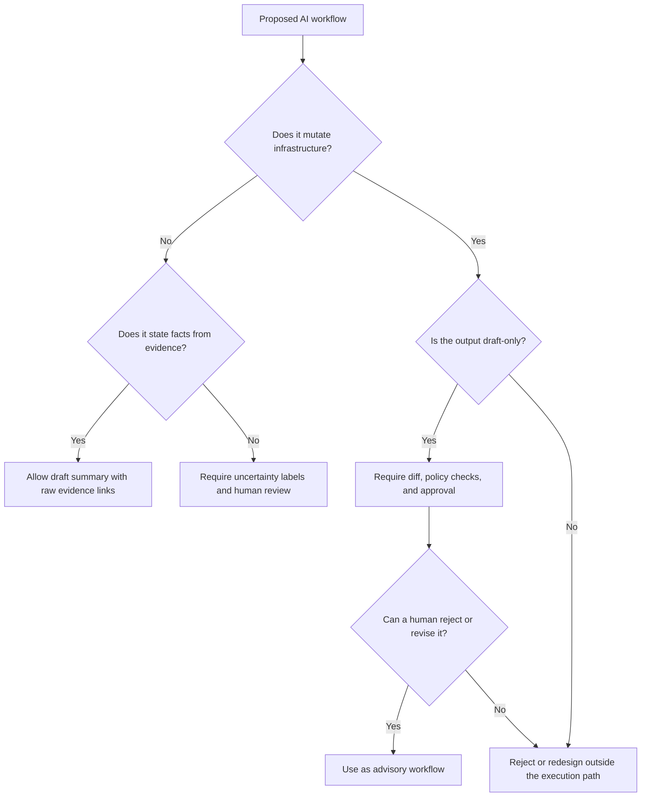

> **Complexity**: `[MEDIUM]`
>
> **Time to Complete**: 40-55 min
>
> **Prerequisites**: Kubernetes fundamentals, basic incident response vocabulary, comfort reading `kubectl` output, and completion of the previous AI for Kubernetes platform work module

---

## What You'll Be Able to Do

- Diagnose safe AI assistance boundaries for Kubernetes incident workflows by separating evidence gathering, recommendation drafting, approval, execution, and risk acceptance.
- Design human-in-the-loop runbook and postmortem workflows that use AI for clarity while preserving accountable platform ownership.
- Evaluate AI-generated alert summaries, remediation proposals, and incident notes for uncertainty, missing context, and unsafe operational assumptions.
- Implement a mock SRE workflow where AI assists with Kubernetes evidence review, documentation cleanup, and remediation option framing without controlling infrastructure.

## Why This Module Matters

Hypothetical scenario: a Kubernetes 1.35 platform team receives a burst of alerts after a rollout touches an API gateway, a checkout service, and a shared node pool. The monitoring system reports `CrashLoopBackOff`, memory pressure, pending pods, and SLO burn at nearly the same time, while chat fills with partial observations from several responders. An AI assistant can summarize the alerts, compare symptoms against old notes, and draft a cleaner timeline faster than a tired human can copy lines between tools, but the same assistant can also turn uncertain evidence into a confident story that sounds more complete than it is.

That tension is the practical reason SRE teams need a workflow model instead of a slogan. The useful question is not whether AI can help with platform work, because it obviously can help with text-heavy and pattern-heavy tasks. The sharper question is where AI changes the work without changing ownership, especially when the work sits close to production risk. If a model drafts a postmortem outline, the human reviewer can correct it; if a model approves a rollback, drains a node, or rewrites policy during an ambiguous incident, the team has crossed from assistance into delegated judgment.

This module teaches the operating boundary. You will keep the strong parts of the existing lesson: AI is good at summarizing repetitive alert context, drafting incident notes, comparing current symptoms to known patterns, improving runbook readability, and surfacing missing verification steps. You will also practice the constraint that makes those benefits safe: humans still decide severity, approve production changes, execute commands, and accept risk. The result is a workflow you can explain to another engineer, audit after an incident, and improve without pretending that persuasive text equals operational authority.

## Good Workflow Targets Start With Evidence, Not Authority

The best AI-assisted SRE workflows begin where the model can reduce cognitive load without taking control of the system. Alert review, log summarization, runbook editing, and postmortem drafting are valuable because they are evidence-rich and language-heavy. They are also reversible in a way that production actions are not. A bad paragraph can be corrected before it reaches the postmortem; a bad command against the API server can move the outage from confusing to damaging.

Think of AI as a very fast incident scribe with an unusually broad memory, not as the incident commander. A scribe can assemble notes, highlight contradictions, and remind the room that a question has not been answered. The scribe should not declare the severity, approve the change, or decide that one risk matters less than another. This analogy is imperfect, but it keeps the key separation clear: the model helps humans see the work, while accountable humans still choose what to do.

In Kubernetes, this distinction matters because signals are spread across controllers, pods, events, logs, admission decisions, scheduler output, and external monitoring systems. A single symptom such as `Pending` pods may point to resource pressure, node taints, topology spread constraints, a quota limit, or a rollout that requested more capacity than the cluster had available. AI can help collect those possible explanations into a readable map. It must not collapse that map into a root cause before the team has verified the evidence.

Good targets therefore share three properties. First, they use data the team can inspect directly, such as events, logs, runbooks, incident notes, manifests, or change tickets. Second, they produce drafts, summaries, comparisons, or questions that a human can review. Third, they leave the irreversible steps outside the model, including approvals, production writes, policy changes, and public incident conclusions. That boundary is what lets the team move faster without hiding accountability inside a chat transcript.

The original lesson used the phrase "contextual enrichment" for this work, and that phrase is still useful. Traditional alert grouping can connect signals through labels, time windows, and static routing rules. A language model can add semantic correlation by noticing that a pending pod event, an `OOMKilled` event, and an application startup failure may belong in the same investigation packet, even when the labels do not line up perfectly. The value is not magic diagnosis; it is faster assembly of the first coherent hypothesis set.

The following example preserves that advisory role. The command gathers Kubernetes events for one object and sends the JSON to an LLM-integrated CLI for analysis, but the prompt asks for correlations rather than an action. It is intentionally framed as input to human hypothesis testing. A responder still needs to inspect the events, compare them with node state and logs, and decide what verification step comes next.

```bash
# Example: Using an LLM-integrated CLI tool to diagnose a CrashLoopBackOff
kubectl get events --field-selector involvedObject.name=api-gateway-v2 -o json | \
llm-cli "Analyze these events and identify if the restarts correlate with 
underlying node pressure, admission controller rejections, or application-level errors."
```

Pause and predict: before running a workflow like this, what answer would be unsafe even if it sounded plausible? A safe answer might say that restarts correlate with memory pressure and that node metrics should be checked next. An unsafe answer would say that the service should be patched immediately, that a rollback is definitely unnecessary, or that the root cause is proven when the evidence only shows correlation. The more confident the model sounds, the more deliberately you should separate observed facts from proposed explanations.

The same boundary applies to log review. Practitioners can feed a `kubectl describe pod` output and recent container logs into a specialized prompt to find relationships a static linter may miss, such as a mismatch between a Service `targetPort` and the port exposed by a Helm chart. The assistant can point out why those details should be inspected together. The engineer still confirms the manifest, checks endpoints, reads the rollout history, and decides whether the fix belongs in application configuration, chart values, or platform policy.

This changes the SRE's role from data retrieval toward decision preparation. Without assistance, the first part of an incident often becomes a scavenger hunt through terminals, dashboards, old postmortems, and chat. With a bounded assistant, responders can spend more time asking better questions: which symptoms appeared first, which signal is authoritative, which change introduced new risk, and which verification step reduces uncertainty fastest. The system is safer when the model accelerates those questions instead of replacing them.

Institutional memory is another strong target. Postmortems, runbooks, incident review notes, and design documents often contain the exact edge cases a team forgets under pressure. Retrieval-augmented AI can surface related material during a new incident, but it should present that material as context with citations or references, not as a ruling. A useful assistant says, "This resembles the April rollout where memory pressure and pending pods appeared together; here are the notes to inspect." It does not say, "This is the same root cause, so apply the previous fix."

The safest platform teams make this advisory status visible in the workflow itself. They label model output as draft, include uncertainty fields, require human review notes, and keep execution in deterministic tools or manual approval paths. Those details may feel bureaucratic until an incident gets tense. During stress, visible workflow boundaries prevent the team from treating a polished summary as a verified conclusion.

## Weak Workflow Targets Cross the Accountability Line

Weak AI workflow targets are usually tempting because they sit near repetitive work but include hidden judgment. Approving a production change, deciding incident severity, choosing rollback versus forward-fix, rewriting policy, or acting directly on infrastructure may involve lots of text, but the hard part is not text production. The hard part is risk ownership under incomplete information. A model can imitate the language of that ownership without actually carrying it.

Kubernetes makes this danger concrete. A recommendation to drain a node might be reasonable when workloads have healthy replicas, disruption budgets, and no local state. The same recommendation can cause downtime if the node hosts fragile workloads, if the `PodDisruptionBudget` blocks eviction, or if replacement capacity is not available. The model can read a description of the situation and produce a plausible plan, but it does not bear the pager, the customer impact, or the audit trail.

The failure mode is not only hallucination. Even when the model is factually correct about a resource, it may optimize for the wrong objective. During an outage, increasing a memory limit might reduce restarts for one deployment while exhausting node capacity for lower-priority workloads. Rolling back might restore latency while reintroducing a security regression. Forward-fixing might be faster while increasing change complexity. These are tradeoffs, not trivia, so they belong to accountable responders and established change controls.

This is why AI belongs in the advisory layer rather than the executive layer of a platform workflow. The advisory layer can analyze inputs, draft options, and ask whether a guardrail is missing. The executive layer applies changes through `kubectl`, GitOps controllers, CI/CD systems, admission controllers, or cloud APIs. If the advisory layer can directly mutate production state without a human approval gate and deterministic policy check, the team has made persuasive generation part of the control plane.

The following preserved example shows how an AI-generated remediation proposal should be treated as a draft. It writes a patch file and then uses `kubectl diff` so a practitioner can compare the proposal against current state. The important detail is the comment: do not auto-apply the proposal. The command block is useful because it keeps the model's suggestion inspectable and reviewable before any change reaches the API server.

```bash
# AI-Generated Remediation Proposal (DO NOT AUTO-APPLY)
# Reason: Detected 90% memory utilization in 'auth-service'
# Proposed Action: Patch deployment to increase memory limit

cat <<EOF > remediation-patch.yaml
spec:
  template:
    spec:
      containers:
      - name: auth-service
        resources:
          limits:
            memory: "2Gi"
EOF

# Practitioner Note: Always diff the proposal against current state
kubectl diff -f remediation-patch.yaml
```

Before running this, what output do you expect from `kubectl diff`, and what would make you stop? You should expect a manifest difference, not proof that the change is safe. You should stop if the diff touches an unexpected workload, if it omits resource requests, if it conflicts with quotas or node capacity, or if the incident evidence does not actually support memory as the most useful next check. A diff is a review input; it is not approval.

Human-in-the-loop is sometimes presented as a vague comfort phrase, so make it operational. A meaningful human gate has a named reviewer, enough context to judge risk, a visible approval record, and a way to reject or revise the model output. A weak gate is a button someone clicks because the model already wrote a confident explanation. If the reviewer cannot see the evidence and cannot change the plan, the team has added ceremony rather than control.

Policy engines and admission controls complement this boundary, but they do not replace it. Open Policy Agent Gatekeeper, ValidatingAdmissionPolicy, resource quotas, and RBAC can prevent classes of bad changes from reaching the cluster. They cannot decide whether a risky rollout is justified during a specific incident. Deterministic policy should catch forbidden shapes; human review should decide context-dependent risk; AI should help prepare the evidence for both.

Auditability is another reason to keep AI out of final authority. Many platform teams must explain who approved a production change, what evidence was available, which alternatives were considered, and why the chosen action was acceptable. A transcript containing "the model recommended it" is not an accountability chain. The audit trail should show that the model produced a draft, a human reviewed the draft, deterministic checks ran, and an approved workflow applied the change.

The line becomes especially important when severity is ambiguous. Severity is not just a label; it drives paging, communications, escalation, customer messaging, and sometimes contractual commitments. AI can summarize the symptoms relevant to severity, such as affected services, SLO burn, error budgets, and observed customer impact. It should not make the final severity call unless the team has encoded that decision in deterministic policy and accepted the governance implications.

The same caution applies to postmortem conclusions. AI is very good at turning messy notes into a clean narrative, which can accidentally erase uncertainty. If the team has partial logs and incomplete timing, the assistant may produce a root cause sentence that reads better than the evidence deserves. A strong workflow requires fields such as "observed symptoms," "confirmed causes," "contributing factors," and "unknowns" so the model cannot hide a gap by writing around it.

There is one more weak target that deserves attention: letting AI become the hidden prioritization engine for platform work. Backlog triage, incident follow-up ordering, and reliability roadmap decisions often look like text classification, but they encode business impact, user harm, engineering capacity, and strategic risk. AI can cluster similar follow-up items or identify duplicates, yet the final priority should come from accountable owners who understand service commitments and organizational context. Otherwise the team may accidentally optimize for the most legible work instead of the most important work.

The practical test is whether a reasonable reviewer could challenge the output. If the answer is a ranked list of risks, the reviewer should see the criteria and evidence behind the ranking. If the answer is a proposed change, the reviewer should see the diff, preconditions, and rollback path. If the answer is a postmortem conclusion, the reviewer should see which facts support it and which facts remain uncertain. Reviewability is the difference between using AI to make judgment visible and using AI to hide judgment behind fluency.

## A Three-Stage SRE Pattern Keeps AI Useful

A practical AI workflow for SRE work has three stages: before the work, during the work, and after the work. This pattern is simple enough to use during a real incident, but strict enough to prevent role confusion. Before the work, AI helps clarify goals, surface assumptions, and draft a checklist. During the work, AI helps summarize evidence, compare symptoms, and maintain structured notes. After the work, AI helps turn raw material into reviewable documentation and follow-up items.

The "before" stage is where AI can reduce blind spots without creating operational momentum. For a migration, rollout, or incident drill, ask the assistant to restate the goal, list assumptions, identify missing validation steps, and suggest a preflight checklist. The model is not being asked whether the change should be approved. It is being asked to make the review surface larger so the team can see where a human decision is still needed.

For example, before a platform migration, a good prompt might ask the assistant to compare the intended workflow with the team's runbook and identify unclear prerequisites. The output should be a review artifact: missing rollback criteria, ambiguous ownership, absent monitoring checks, or unclear communication steps. If the assistant proposes a command, that command should be moved into a draft section and reviewed like any other change. The purpose is better preparation, not a shortcut around change control.

The "during" stage is where speed matters most and boundaries matter most. The assistant can convert incoming evidence into a living packet: timeline, symptoms, hypotheses, rejected explanations, open questions, and next verification checks. This is valuable because incident channels are noisy and humans lose context under pressure. The packet must explicitly mark uncertainty, because a neat timeline without uncertainty can become more misleading than the raw chat it replaced.

The original incident-note prompt captures that discipline and should remain part of the module. It asks for structure, but it also tells the model not to infer unverified root cause. That last instruction is not a decorative safety phrase. It changes the output from a conclusion engine into a documentation assistant, which is exactly the role we want during the work.

```text
Convert these raw incident notes into:
1. timeline
2. observed symptoms
3. actions taken
4. open questions
5. possible follow-up items

Do not infer unverified root cause.
Mark unknowns clearly.
```

During an incident, this prompt should be paired with a human review step. The reviewer checks whether the assistant invented timestamps, merged separate symptoms, omitted a failed action, or converted a hypothesis into fact. A useful practice is to add a "reviewed by" note with one or two corrections at the bottom of the draft. That keeps the final artifact from pretending the model's first pass was authoritative.

The "after" stage is where AI can improve learning velocity. Postmortems often start as messy notes, chat exports, command snippets, and partial recollections. AI can assemble those inputs into a draft timeline, extract action items, identify unclear runbook steps, and group follow-up work by owner or system. Humans then decide what the postmortem actually concludes, which action items are worth doing, and which risks remain accepted.

Runbook improvement is a strong after-action target because the task is editorial but operationally important. A weak prompt says, "Write me a runbook for database latency." That asks the model to invent operational decisions from an under-specified request. A stronger prompt says, "Review this existing runbook for ambiguity, hidden assumptions, and missing verification steps. Do not rewrite the operational decisions. Point out where a junior responder could misread the sequence." This preserves the team's decisions while improving the document.

The same pattern applies to alert rules. AI can review alert descriptions for missing context, unclear labels, and absent runbook links. It can suggest whether a page might lack enough diagnostic information for the responder. It should not independently change alert thresholds, silence policies, or escalation routes. Those choices involve SLOs, team capacity, customer impact, and on-call burden, so they need human review and normal change processes.

AI can also help compare current symptoms to prior incidents, but the comparison should remain evidentiary. A safe output says that two incidents share symptoms, affected services, or timeline shapes, then links to the prior notes. An unsafe output says the prior remediation should be applied because the symptoms are similar. Similarity is useful for search and hypothesis generation, but it is not proof that the same cause or fix applies.

This three-stage pattern scales because it can be embedded in the team's existing tools. A ticket template can include fields for AI-drafted assumptions and human-reviewed decisions. A postmortem template can include an "AI-assisted draft reviewed by" field. A ChatOps bot can produce summaries while refusing to execute commands. A GitOps workflow can accept model-generated comments on a pull request while leaving merges to protected branches and required reviewers.

## Building Reviewable AI Outputs

An AI output is reviewable when it exposes its inputs, separates facts from hypotheses, marks uncertainty, and avoids irreversible action. This sounds simple, but it requires prompt design and workflow design to agree. If a prompt asks for "the fix," the model will tend to produce a fix. If the workflow has no place to record uncertainty, uncertainty gets squeezed out of the artifact. Safe platform AI work starts by shaping the output into something reviewers can challenge.

For alert summaries, use sections that mirror incident reasoning. Ask for observed symptoms, correlated signals, missing data, possible explanations, and immediate verification checks. Do not ask for the root cause unless the inputs contain confirmed evidence. Do not ask for a command unless the command will be treated as a draft and diffed or reviewed. This output structure makes it easier for a tired responder to find the next question rather than simply accept the model's answer.

For remediation options, require preconditions, risks, verification checks, and "when not to use this option." That final field is especially useful because it pushes the model to describe the boundary of each suggestion. A recommendation that cannot say when it is unsafe is not ready for review. In production work, the negative space around a change is often more important than the happy path.

For runbook reviews, ask for comments rather than rewrites. A comment can point to ambiguity, missing prerequisites, hidden assumptions, or places where a junior responder could take the wrong action. A rewrite may improve prose while changing meaning. If you do let AI propose wording changes, require a side-by-side review and keep the operational decision text under human ownership. Good writing is useful only when it preserves the procedure's intent.

For postmortems, separate "confirmed," "suspected," and "unknown." This prevents the model from turning a timeline into a courtroom argument. The postmortem should preserve ambiguity until the team resolves it, because future responders need to know what was known and when. If AI makes the incident sound tidier than it was, the organization learns the wrong lesson and may build the wrong guardrail.

One helpful design is the "draft packet." A draft packet contains the AI summary, the raw inputs or links to them, the human review notes, and the decision boundary. It can live in an incident folder, ticket, or pull request. The packet does not need to be elaborate. Its purpose is to make the assistant's contribution inspectable after the incident, so reviewers can see what the model influenced and what humans decided.

The packet should also avoid hidden authority. If the model suggested a remediation, the packet should say whether that suggestion was accepted, rejected, or left unchosen. If the model identified an unknown, the packet should say how the team resolved it or why it remained open. If the model reviewed a runbook, the packet should preserve the review comments so future readers know why wording changed. Traceability is what turns AI assistance from a private chat into an operational artifact.

Which approach would you choose here and why: a bot that posts one confident incident summary every few minutes, or a bot that posts a structured draft with explicit unknowns and links to raw evidence? The second design is less dramatic, but it is safer. It gives the incident lead material to review and revise, and it prevents the team from confusing narrative polish with verification.

The strongest reviewable outputs use verbs that keep the model in its lane. "Summarize," "compare," "draft," "highlight," "classify," and "ask" are usually safer than "decide," "approve," "execute," "fix," or "own." The verbs are not magic, because a careless prompt can still produce unsafe advice. They do, however, remind the user and the assistant that the output is an input to human judgment.

This is also where source discipline enters. When the assistant cites Kubernetes behavior, policy behavior, or tool semantics, prefer primary documentation and links to the exact object or rule involved. A model can summarize the Kubernetes logging model, but the team should be able to inspect the upstream logging documentation. A model can mention `PodDisruptionBudget`, but the reviewer should verify how it affects voluntary disruptions in the current Kubernetes version. Source links turn a summary into a starting point for evidence.

Reviewable output design is not only about avoiding mistakes. It also improves teaching and onboarding. Junior responders learn faster when the packet shows how evidence became hypotheses, how hypotheses became verification checks, and how verification checks became human decisions. AI can help write that packet, but the learning value appears only when the workflow preserves the reasoning rather than hiding it behind a final answer.

## Guardrails for Kubernetes Platform Integration

When AI moves from an external chat window into platform tooling, guardrails need to be explicit. A local assistant that summarizes pasted logs has a small blast radius because it cannot mutate cluster state. A ChatOps integration, IDE plugin, or agent wired into CI/CD can influence real workflows. The closer the assistant gets to Kubernetes credentials, GitOps repositories, or production automation, the more the team must constrain inputs, outputs, permissions, and approvals.

Start with identity and permissions. If an AI-assisted tool needs Kubernetes access, give it the narrowest read-only access that supports its task, and prefer service accounts that cannot write resources. For many workflows, the assistant does not need cluster credentials at all; it can consume exported events, logs, manifests, and ticket text. Read-only is not risk-free, because logs may contain sensitive information, but it is still a smaller risk than giving a generative tool write access to workloads.

Next, separate suggestion channels from execution channels. A suggestion channel can post a summary, create a draft ticket, or comment on a pull request. An execution channel applies manifests, merges changes, scales deployments, or restarts workloads. If the same integration can both write a persuasive recommendation and execute it, the review boundary is fragile. A safer design sends recommendations into existing systems that already enforce required reviewers, policy checks, and audit trails.

Then apply deterministic checks after generative output. If AI drafts a manifest patch, run schema validation, policy checks, `kubectl diff`, and normal CI tests. If AI comments on a runbook, require a human reviewer. If AI summarizes alerts, compare its output to raw data before using it in external communications. Deterministic checks cannot prove the plan is wise, but they can catch malformed YAML, forbidden resource shapes, missing labels, and changes outside the expected namespace.

The following table summarizes the boundary in a compact form. It is intentionally framed around workflow ownership rather than model capability, because capability alone is the wrong design variable. A model may be capable of drafting a command that works. The question is whether the workflow should let that command reach production without the same controls you would require from a human engineer.

| Workflow area | Good AI role | Human-owned decision | Required guardrail |
|---|---|---|---|
| Alert storm review | Summarize symptoms, group related signals, identify missing data | Decide incident severity and response strategy | Raw evidence links and human-reviewed summary |
| Runbook improvement | Comment on ambiguity and missing verification steps | Approve operational procedure changes | Pull request review or documented owner approval |
| Remediation planning | Draft options with risks and preconditions | Choose rollback, forward-fix, wait, or escalate | Change ticket, peer review, and deterministic policy checks |
| Postmortem drafting | Create timeline and follow-up candidates | Confirm root cause and action item ownership | Human review notes and explicit unknowns |
| Policy authoring | Explain existing policy and draft examples | Adopt, enforce, or weaken policy | Test suite, staged rollout, and owner approval |

Guardrails also need data hygiene. Incident inputs can include customer identifiers, internal URLs, personal data, secrets accidentally printed in logs, and vendor-specific details. Before sending data to any external model or hosted service, teams must follow their data handling policy. For local or private deployments, the same principle still applies: minimize the input, redact secrets, and avoid training or retention modes that conflict with your organization's rules.

Kubernetes-specific guardrails should include namespace scoping, RBAC review, audit logging, and admission control. For example, a read-only AI assistant could be allowed to inspect events in staging namespaces while production evidence is exported through a controlled workflow. A model-generated patch could be required to pass `kubectl diff`, policy tests, and a pull request review before a GitOps controller reconciles it. These controls keep the model from becoming an invisible shortcut around the platform's normal safety design.

The key operating rule is that AI should not be the only thing standing between uncertainty and action. If a model says a rollout is safe, the workflow should still require tests, diffs, policy checks, and human approval. If a model says a root cause is likely, the incident packet should still show evidence and unknowns. If a model says a runbook is clear, responders should still test the runbook in a drill. Safety comes from layered controls, not from a single confident assistant.

Retention and feedback loops need guardrails too. If responders routinely paste model output back into knowledge bases without review, future retrieval can amplify earlier mistakes and make them look authoritative. A safer workflow stores the reviewed final artifact separately from the raw AI draft, then records what changed during human review. That gives future assistants better material to retrieve and gives future humans a way to audit whether the model helped or misled the team.

Finally, define what the assistant must refuse to do. A platform assistant should be able to say that it cannot approve a production change, cannot execute a command, cannot declare a root cause from incomplete evidence, and cannot use unredacted secrets as input. Refusal behavior is part of the product design, not just a model setting. When refusal is explicit, responders learn the workflow boundary before an incident forces them to discover it under pressure.

## Patterns & Anti-Patterns

The reliable patterns all keep AI close to evidence and far from final authority. They also create artifacts the team can inspect later: drafts, comments, diffs, review notes, and decision records. This matters because platform work is collaborative and asynchronous. The person who learns from an incident next month may not have been in the incident channel, so the workflow must preserve reasoning in a durable form.

| Pattern | When to Use It | Why It Works | Scaling Consideration |
|---|---|---|---|
| Evidence packet first | Alert storms, ambiguous incidents, noisy rollouts | AI organizes symptoms, unknowns, and verification checks without choosing the fix | Standardize packet fields so multiple teams can review the same shape |
| Draft-only remediation | Risky production changes or unclear root cause | The model proposes options while humans approve, reject, or revise | Route drafts through existing change tickets or pull requests |
| Runbook comment mode | Existing procedure is unclear but operational decisions are owned | AI finds ambiguity without silently changing intent | Track comments as review findings, not automatic edits |
| Postmortem structuring | Raw notes are messy after a long incident | AI turns material into a timeline, open questions, and action candidates | Require human owners for final causes and follow-up commitments |

The anti-patterns usually appear when a team mistakes a productivity gain for a governance change. A model that writes quickly can make a weak process look mature, because the artifacts are clean and confident. Clean artifacts are not enough. If the workflow hides uncertainty, removes reviewers, or gives the assistant credentials it does not need, the team has increased operational risk while improving the surface appearance of response.

| Anti-pattern | What Goes Wrong | Why Teams Fall Into It | Better Alternative |
|---|---|---|---|
| AI incident commander | The model assigns severity, chooses strategy, and pressures responders toward its plan | Incident channels are stressful, and confident summaries feel stabilizing | Use AI as a scribe and hypothesis assistant while the incident lead owns decisions |
| Auto-apply remediation | A generated command reaches production without normal review | The change looks small, and the model explains it well | Require diffs, policy checks, and human approval before execution |
| Root-cause narrator | The postmortem becomes more certain than the evidence | A tidy story is easier to circulate than a messy set of unknowns | Keep confirmed, suspected, and unknown sections separate |
| Runbook replacement | AI rewrites procedures and accidentally changes operational meaning | Rewriting feels faster than reviewing old text | Ask for review comments, then let owners edit and approve |

Use these patterns as a design checklist rather than a compliance checklist. The point is not to forbid every advanced integration. The point is to ask whether the integration still preserves inspectable evidence, human decision rights, deterministic guardrails, and durable review records. If those conditions are present, AI can improve the workflow without quietly becoming the workflow owner.

## Decision Framework

When deciding whether AI belongs in a platform or SRE workflow, evaluate the task along two axes: reversibility and accountability. Reversible tasks produce artifacts that can be edited before they affect the system, such as summaries, comments, and draft checklists. Accountable tasks decide risk, approve change, or mutate state. AI fits naturally in reversible support tasks and requires heavy guardrails near accountable tasks.

Use this decision flow when you review a proposed integration. If the task is evidence gathering or document drafting, allow AI assistance with input controls and human review. If the task proposes a production action, require draft-only output plus deterministic validation. If the task approves or executes production action, keep AI out of the final authority path unless the organization has explicitly designed, tested, and audited that automation as a control plane component. Most teams should stop well before that point.



The flowchart deliberately asks about mutation before it asks about model quality. A highly capable model still needs guardrails if it can affect infrastructure. A weaker model may still be useful if it only summarizes exported logs for a reviewer. Capability determines how helpful the assistant is; authority determines how dangerous it can become. Keep those two questions separate when you design the workflow.

| Task | Use AI directly | Use AI with heavy review | Keep AI advisory only |
|---|---|---|---|
| Summarize logs and events | Yes, with redaction and evidence links | Needed for sensitive data | Not applicable |
| Draft incident timeline | Yes, if unknowns are marked | Needed for external reports | Not applicable |
| Suggest remediation options | Not as a final answer | Yes, with risks and preconditions | Yes |
| Approve rollback or forward-fix | No | Only through established human approval | Yes |
| Execute `kubectl` changes | No | Only if generated output becomes a reviewed change artifact | Yes |
| Rewrite production policy | No | Yes, as a reviewed pull request draft | Yes |

The final question is whether the workflow improves learning. If AI hides the reasoning, responders may move faster once but learn less. If AI exposes evidence, uncertainty, alternatives, and review notes, the team can improve both immediate response and future readiness. The best platform AI workflows feel a little slower at the boundary because they force review where review matters, then much faster everywhere else because they remove repetitive sorting and drafting work.

You can also use the framework as a pre-merge review checklist for new internal tooling. Ask whether the proposed assistant has the minimum permissions needed, whether its output is draft-only, whether a human can reject or revise the output, whether deterministic checks run before mutation, and whether the audit trail shows the model's influence. A workflow that passes those questions is not automatically perfect, but it is much easier to reason about than one where the model quietly sits between alert and action.

## Did You Know?

- Kubernetes events are API objects with their own structure, timestamps, involved objects, and reasons, which makes them useful input for AI summaries only when the assistant preserves the distinction between observed event data and inferred explanations.
- The NIST AI Risk Management Framework 1.0 was released in January 2023 and emphasizes governance, measurement, and management of AI risk, which maps directly to keeping production approvals and risk acceptance with accountable humans.
- `PodDisruptionBudget` protects against voluntary disruptions, not every possible failure mode, so an AI recommendation to drain nodes still requires human review of workload design, capacity, and disruption semantics before action.
- SRE postmortems are most valuable when they preserve learning, not blame, which is why AI-assisted drafts should keep confirmed causes, suspected contributors, and unresolved unknowns separate until reviewers close the gaps.

## Common Mistakes

| Mistake | Why It Happens | How to Fix It |
|---|---|---|
| Treating an AI-written runbook as a validated runbook | Clear prose feels like operational correctness, especially when the model uses confident procedure language | Require owner review, dry-run the steps, and keep AI comments separate from approved procedure text |
| Letting AI summarize away important uncertainty | Incident channels are noisy, and a concise story feels helpful under pressure | Add mandatory unknowns, assumptions, and evidence sections to every AI-generated incident packet |
| Asking for action plans before gathering evidence | Responders want a fix quickly and prompts often reward decisive answers | Ask first for observed symptoms, correlations, missing data, and verification checks |
| Using AI to create policy with no operational reviewer | Policy examples look like ordinary YAML or Rego snippets, so teams underestimate the risk | Route policy drafts through tests, staged rollout, and human approval from the owning platform team |
| Assuming good writing equals good operational reasoning | Models can produce polished explanations that hide incomplete context | Review the evidence chain, not only the grammar or formatting of the answer |
| Giving an assistant broad Kubernetes credentials | Tool integration is easier when one service account can read and write everything | Prefer exported evidence or narrowly scoped read-only access, then keep writes in existing approved workflows |
| Allowing model output to bypass GitOps review | Generated patches can look like routine small changes | Convert generated patches into pull requests with diffs, policy checks, and required reviewers |
| Forgetting to preserve raw inputs | Teams keep the AI summary but lose the events, logs, and notes that produced it | Store links or copies of the raw evidence beside the AI draft and human review notes |

## Quiz

<details><summary>Question 1: Your team is hit by a noisy alert storm after a node pool starts behaving oddly. One SRE wants to use AI to correlate `Pending` pods, recent `OOMKilled` events, and related logs across namespaces so the team can form hypotheses faster. Another SRE suggests letting the AI pick and execute the fix immediately. Which approach fits safe AI assistance boundaries for a Kubernetes incident workflow?</summary>

Use AI to summarize and correlate the evidence, but do not let it choose or execute the remediation on its own. The correlation task is a good workflow target because it organizes signals for human hypothesis testing. The execution task crosses the accountability boundary because production changes require human approval, deterministic checks, and risk ownership. A safe response packet would include observed symptoms, likely correlations, unknowns, and immediate verification checks.
</details>

<details><summary>Question 2: A junior responder is struggling with a database latency runbook that has vague wording and unclear verification steps. Your team lead asks AI to write a new runbook from scratch. How would you design a human-in-the-loop runbook workflow instead?</summary>

Ask AI to review the existing runbook for ambiguity, hidden assumptions, missing verification steps, and places where a junior responder could misread the sequence. The model should return comments or suggested edits, while the runbook owner decides which changes preserve the intended procedure. This design keeps AI useful for clarity without handing it operational authorship. The final runbook still needs human review, approval, and ideally a drill or dry-run.
</details>

<details><summary>Question 3: During a production incident, an AI assistant produces a confident summary that names a root cause even though the team has only partial logs and incomplete timeline data. How should the incident lead evaluate that AI-generated incident note?</summary>

The incident lead should treat the output as a draft and remove or relabel the unverified root cause. The useful parts are the timeline, observed symptoms, actions taken, open questions, and possible follow-up items. The unsafe part is converting incomplete evidence into a final conclusion. A strong workflow requires the reviewer to mark unknowns clearly and preserve the evidence needed to confirm or reject each hypothesis.
</details>

<details><summary>Question 4: Your platform team is reviewing a proposed production patch during an ambiguous outage. An AI tool recommends increasing memory limits immediately and says the confidence is high. The change could affect node capacity and workload stability. What should the team do?</summary>

The team should keep the recommendation advisory, create a diff or pull request, and review the risks before approval. The model may have noticed useful evidence, but memory changes can affect scheduling, quotas, node capacity, and other workloads. A human reviewer should check preconditions and decide whether rollback, forward-fix, scaling, or waiting is appropriate. Confidence from the model does not replace approval or risk acceptance.
</details>

<details><summary>Question 5: After a long incident bridge call, your notes are messy and spread across chat logs, timestamps, and partial observations. You want to use AI before the postmortem meeting. What is an appropriate postmortem workflow?</summary>

Use AI to turn the raw notes into a postmortem draft with timeline, symptoms, actions taken, open questions, and follow-up candidates. Then have humans review the draft, confirm root cause, assign action item owners, and mark anything that remains unknown. This workflow improves documentation speed while preserving accountability for conclusions. It also creates a durable learning artifact instead of leaving knowledge buried in chat.
</details>

<details><summary>Question 6: A team wants to build an AI incident commander that reads alerts, assigns severity, chooses rollback versus forward-fix, and pushes remediation commands automatically. The justification is that the model writes clear explanations and will save time. What is the core problem with this design?</summary>

It crosses from assistance into outsourced judgment. Assigning severity, choosing a strategy, approving production action, and executing commands are accountable decisions, not just text-generation tasks. Clear explanations can make the design feel safer while hiding the fact that review and risk acceptance have been removed. A safer design uses AI as a scribe and hypothesis assistant while the incident lead owns decisions and execution remains gated.
</details>

<details><summary>Question 7: Before a risky platform migration, your team wants AI involved but wants to preserve strong review discipline. How should AI be used across the work lifecycle?</summary>

Use AI before the work to clarify goals, surface assumptions, and draft a checklist; during the work to summarize evidence, compare symptoms to known patterns, and maintain structured notes; and after the work to draft the postmortem, extract action candidates, and highlight unclear runbook steps. This three-stage pattern keeps the assistant close to reversible artifacts. It also gives humans visible places to review, revise, approve, or reject the output. The important design point is that AI supports the workflow without owning the decisions.
</details>

## Hands-On Exercise

Exercise scenario: you will build a mock incident workspace where AI is allowed to summarize evidence, improve documentation, and frame remediation options, but it is not allowed to approve or execute production actions. The exercise uses local text files rather than a live cluster so you can focus on workflow design, review discipline, and accountability boundaries. If you do adapt the pattern to a real Kubernetes 1.35+ environment later, keep the same separation between exported evidence, AI drafts, human review, and approved execution.

- [ ] Create a working directory with mock incident inputs.
  ```bash
  mkdir -p sre-ai-workflow-lab
  cd sre-ai-workflow-lab

  cat > alerts.txt <<'EOF'
  [CRITICAL] api-gateway-v2: 12 pods restarting across 3 namespaces
  [WARNING] nodepool-a memory pressure on 2 nodes
  [WARNING] checkout-api p95 latency above SLO for 18m
  [INFO] 6 pods in Pending state after rollout
  EOF

  cat > events.txt <<'EOF'
  Warning  FailedScheduling  pod/checkout-api-7d9c8  0/5 nodes available: 2 Insufficient memory
  Warning  BackOff           pod/api-gateway-v2      Back-off restarting failed container
  Normal   Pulled            pod/api-gateway-v2      Container image already present
  Warning  OOMKilled         pod/api-gateway-v2      Container terminated due to OOM
  EOF

  cat > logs.txt <<'EOF'
  2026-04-21T10:11:03Z ERROR failed to bind on port 8081
  2026-04-21T10:11:05Z ERROR health check failed
  2026-04-21T10:11:07Z INFO retrying startup
  EOF

  cat > runbook.md <<'EOF'
  If latency is high, restart affected services if needed.
  Check cluster health.
  Scale the deployment if appropriate.
  EOF

  cat > raw-notes.md <<'EOF'
  10:07 alert fired for latency
  10:10 more restarts noticed
  someone mentioned memory pressure
  not sure if rollout caused it
  pods pending in another namespace too
  EOF
  ```

  - Verification commands:
  ```bash
  ls -1
  rg -n "OOMKilled|Pending|latency" .
  ```

- [ ] Diagnose safe AI assistance boundaries by separating advisory tasks from human-only decisions in `decision-boundary.md`.
  Write down two lists in `decision-boundary.md`: `AI may assist with` and `Human must decide`.
  ```bash
  cat > decision-boundary.md <<'EOF'
  AI may assist with:
  - summarizing alerts and logs
  - turning raw notes into a structured timeline
  - reviewing runbook wording for ambiguity
  - suggesting questions and missing verification steps

  Human must decide:
  - incident severity
  - rollback vs forward-fix
  - production approval
  - command execution against infrastructure
  EOF
  ```

  - Verification commands:
  ```bash
  cat decision-boundary.md
  rg -n "Human must decide|AI may assist" decision-boundary.md
  ```

- [ ] Evaluate AI-generated alert summaries by asking for uncertainty, correlations, and verification checks without inferred root cause.
  Prompt to use:
  ```text
  Summarize these incident inputs into:
  1. observed symptoms
  2. likely correlations
  3. unknowns
  4. immediate verification checks

  Do not infer root cause.
  Do not recommend executing production changes.
  Mark uncertainty clearly.

  Inputs:
  <paste alerts.txt, events.txt, logs.txt>
  ```
  Save the result as `ai-summary.md`.

  - Verification commands:
  ```bash
  test -f ai-summary.md && echo "ai-summary.md present"
  rg -n "unknown|uncertain|verification" ai-summary.md
  ```

- [ ] Design human-in-the-loop incident documentation by converting raw notes into a reviewed structured draft.
  Prompt to use:
  ```text
  Convert these raw notes into:
  1. timeline
  2. observed symptoms
  3. actions taken
  4. open questions
  5. follow-up items

  Do not invent timestamps or root cause.
  Mark missing information clearly.

  Notes:
  <paste raw-notes.md>
  ```
  Save the result as `incident-draft.md`, then add one human review note at the bottom identifying anything the AI left ambiguous.

  - Verification commands:
  ```bash
  rg -n "timeline|open questions|follow-up" incident-draft.md
  tail -n 5 incident-draft.md
  ```

- [ ] Implement a runbook review workflow where AI comments on ambiguity without changing operational decisions.
  Prompt to use:
  ```text
  Review this runbook for:
  - ambiguous wording
  - hidden assumptions
  - missing verification steps
  - places where a junior responder could misread the sequence

  Do not rewrite the operational decisions.
  Return findings as review comments.

  Runbook:
  <paste runbook.md>
  ```
  Save the output as `runbook-review.md`, then manually update `runbook.md` to make the wording clearer while keeping approval and execution with humans.

  - Verification commands:
  ```bash
  rg -n "ambiguous|missing verification|assumption" runbook-review.md
  cat runbook.md
  ```

- [ ] Evaluate remediation options as draft-only output, then add a human approval gate.
  Prompt to use:
  ```text
  Based on these symptoms, propose 2 possible remediation paths with:
  - preconditions
  - risks
  - verification checks
  - when not to use each option

  Do not choose one.
  Do not approve one.
  Do not produce auto-executable commands.
  ```
  Save the result as `remediation-options.md`, then append a short `Human decision:` section explaining which option would need human approval and why.

  - Verification commands:
  ```bash
  rg -n "risks|verification|when not to use|Human decision" remediation-options.md
  ```

- [ ] Assemble a final incident packet that shows AI stayed in a support role.
  Create `final-brief.md` with:
  - a short incident summary
  - the key unknowns
  - the reviewed runbook changes
  - the human-owned decision points
  - the next follow-up actions

  - Verification commands:
  ```bash
  rg -n "unknowns|decision|follow-up|runbook" final-brief.md
  ls -1 *.md
  ```

The exercise is complete when the final packet proves that AI stayed in a support role, the human-owned decisions are visible, and every generated artifact can be checked against the mock evidence rather than accepted on style alone.
- [ ] A complete mock incident workspace exists with alerts, events, logs, notes, and runbook inputs.
- [ ] AI-generated outputs are saved as drafts and clearly label uncertainty.
- [ ] The runbook was improved for clarity without giving AI operational authority.
- [ ] Remediation options remain advisory and include risks plus verification checks.
- [ ] Human approval, execution, and risk acceptance are explicitly documented as human responsibilities.

## Sources

- [Kubernetes Logging Architecture](https://kubernetes.io/docs/concepts/cluster-administration/logging/)
- [Kubernetes Debug a Cluster](https://kubernetes.io/docs/tasks/debug/debug-cluster/)
- [Kubernetes Events Reference](https://kubernetes.io/docs/reference/kubernetes-api/cluster-resources/event-v1/)
- [Kubernetes Resource Management for Pods and Containers](https://kubernetes.io/docs/concepts/configuration/manage-resources-containers/)
- [Kubernetes Pod Disruption Budgets](https://kubernetes.io/docs/tasks/run-application/configure-pdb/)
- [Kubernetes RBAC Authorization](https://kubernetes.io/docs/reference/access-authn-authz/rbac/)
- [Kubernetes Auditing](https://kubernetes.io/docs/tasks/debug/debug-cluster/audit/)
- [Kubernetes Validating Admission Policy](https://kubernetes.io/docs/reference/access-authn-authz/validating-admission-policy/)
- [Open Policy Agent Gatekeeper Documentation](https://open-policy-agent.github.io/gatekeeper/website/docs/)
- [Prometheus Alerting Overview](https://prometheus.io/docs/alerting/latest/overview/)
- [Google SRE Book: Postmortem Culture](https://sre.google/sre-book/postmortem-culture/)
- [NIST AI Risk Management Framework](https://nist.gov/itl/ai-risk-management-framework)

## Next Module

Continue to [Trust Boundaries for Infrastructure AI Use](./module-1.4-trust-boundaries-for-infrastructure-ai-use/), where you will turn this workflow boundary into a concrete trust model for infrastructure-facing AI tools.
