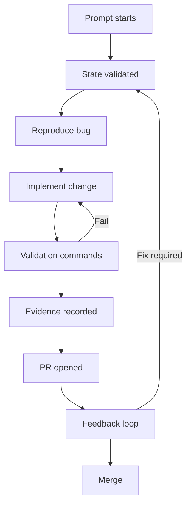
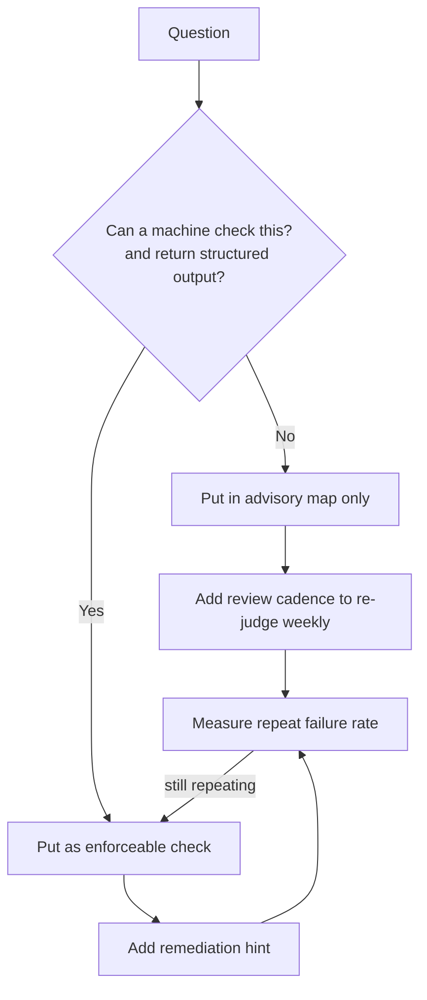

> **Complexity**: `[COMPLEX]`
>
> **Time to Complete**: 75-90 min
>
> **Prerequisites**: AI-native work modules 1.1-1.4, basic Git + CI/CD comfort, exposure to AGENTS.md or CLAUDE.md style agent-config files

---

## Learning Outcomes

- Design a layered harness using platform defaults, project advisory, and project enforcement.
- Classify the seven principles into the most fitting layer.
- Build a manual-to-mechanical migration for repeated agent failures.
- Diagnose harness failures using an actionable trace-first method.
- Implement a pre-commit branch gate and a manifest invariant check.
- Explain why one hundred lines of map-first `AGENTS.md` beats one thousand lines of procedural text.
- Predict where a prompt should stop and where enforcement should continue the process.
- Compare advisory and enforcement trade-offs with explicit risk criteria.
- Validate a harness by running commands, reading outputs, and adjusting rules with minimal churn.

## Why This Module Matters

Hypothetical scenario: you hand an agent a patch task on a busy release day, and the first run fixes one bug but repeats the same namespace and review mistakes in every subsequent attempt. Your team wants to remove the repetition by changing one prompt, not by adding endless tribal knowledge in chat.

Imagine a team shipping with agent assistance. The prompts start out clear. The agent applies fixes, edits YAML, and opens PRs quickly. Then a pattern appears. The same mistakes happen at regular intervals. The team keeps adding reminders instead of adding constraints.

This module exists for that moment. Reliability is not reached by writing better prompts alone. Reliability is reached by making the workspace and harness do the repetitive teaching. The most important lesson is not the list of principles; it is the architecture that makes those principles enforceable. That architecture is the layered harness model.

The module will repeatedly return to this model and ask two kinds of questions.
First: "What is this rule trying to solve?"
Second: "Where should this rule live for best leverage?"

This framing prevents accidental overengineering. It also avoids false certainty from writing advice no one can follow under pressure. Use these definitions while building your layer map: a rule belongs to one layer; mixed ownership creates confusion and makes reviews harder. The layered model has three tiers:

## The layered-harness mental model

```text
+------------------------------+------------------------------+------------------------------+
| Layer 1: Platform defaults   | Layer 2: Project advisory    | Layer 3: Project enforcement |
| Tools and host behavior      | Repo-specific guidance        | Mechanical checks and gates   |
+------------------------------+------------------------------+------------------------------+
```

### Why this shape is the first thing to learn

Platform defaults are often external and hard to change quickly, while project advisory is where shared context is communicated and project enforcement is where repeated risk is blocked automatically. A healthy harness keeps each layer explicit, and every rule answer includes three values: whether it is default behavior, guidance, or a hard gate.

### Layer 1 details

Layer 1 includes assumptions you inherit from the tool stack, such as command permissions, default tool wrappers, available environment values, native branch and working tree behavior, and sandbox modes. You can document these constraints for orientation, but you usually cannot rewrite them in repo-level files. That is why this layer is usually advisory-facing.

### Layer 2 details

Layer 2 is where `AGENTS.md`, `CLAUDE.md`, `docs/` conventions, and project playbooks live. This layer is where agents orient themselves. If it is dense and noisy, the map fails; if it is clear and short, the map scales. A good layer 2 has a short map structure, explicit role tags, clear links to deeper docs, and no hidden assumptions.

### Layer 3 details

Layer 3 is enforcement. This is where the harness becomes dependable. If an instruction only lives in prose, it competes with human memory. If enforced mechanically, it becomes part of the workflow shape. Layer 3 examples include branch protection checks, pre-commit hooks, static lints, deterministic YAML/JSON validation, and CI or API-level policy checks.

### Worked example: "No direct commit to main"

Use the same rule in all three layers, then observe behavior. The leverage shape appears only when the table below is complete across all three rows.

| Layer | Rule implementation |
|---|---|
| Platform default | `git commit` works unless blocked elsewhere |
| Project advisory | `AGENTS.md` and workflow docs say avoid direct commits |
| Project enforcement | pre-commit checks branch and blocks `main` commit |

This is exactly the leverage shape in the brief example. When the rule is only advisory, violations keep repeating. When it is enforced, people still can ignore instructions but cannot bypass the system.

Pause and predict: If direct-commit guidance remains advisory only, how many review touches per week are needed after the first violation? A likely answer is "more than planned" because enforcement does not yet absorb repetition. This module uses this example again and again because it is concrete, repeatable, and easy to evaluate.

## Seven principles and layer placement

Lopopolo’s seven principles map cleanly to this model. The mapping is what matters; principles become tactics only after mapping. The map is advisory, but it must be backed by layer 3 when rules become repetitive. A map gives fast orientation and should answer these in one read:

### 1) The map, not the manual

- where the source of truth is,
- where the active task instructions live,
- where enforcement metadata is defined,
- where to find troubleshooting guidance,
- and what to do next when validation fails.

The anti-pattern is a giant prose file that explains everything. If the map has no clear path, no prompt can reliably navigate.

### 2) Repository as the only system of record

This is advisory plus enforcement, and repository-only truth is the continuity baseline for durable behavior. If a policy is not in versioned files, an agent cannot reliably reconstruct it, and that policy is not an enforceable guarantee. Keep standards in docs, keep decisions in reviewable files, and keep command outputs plus remediation suggestions in machine-readable forms.

### 3) Enforce invariants, not implementations

This one belongs to enforcement. A brittle implementation-based rule is "always use parser X." A robust invariant-based rule is "all manifest files under manifests/ must include metadata.namespace." Invariants survive tool changes and keep harness flexibility.

Pause and predict: which rule survives a replacement of the lint tool from shell script to a specialized parser? The invariant does.

### 4) Make the application legible to the agent

Legible applications expose state and signals in predictable commands, avoid hidden side effects, and remove custom-only debug flow. You need a stable startup endpoint, one command for status, one command for log slice, one for signal metrics, and one for recent diff or diff-equivalent check. When these exist, an agent can diagnose "did I fix the root cause?" without manual lore.

### 5) Flip merge philosophy

In high throughput contexts, merge philosophy should optimize around what to block, what to auto-retry, and what to escalate. This principle removes manual friction where it is pure mechanics without removing human judgment where there is policy risk.

### 6) Continuous garbage collection

Docs, scripts, and rules decay. Without periodic cleanup they lose trust, so maintenance hygiene should remove stale paths from maps, remove obsolete scripts, remove stale exceptions, clean stale runbook branches, and refresh references.

### 7) Boring tech wins

No novelty premium in harness design: prefer predictable tools, small scripts, stable command interfaces, and explicit error outputs. A boring script is an operational asset, while a trendy script with hidden behavior becomes a maintenance liability. If your harness depends on one engineer understanding the parser deeply, it is not boring enough.

## Autonomy ladder: from prompt to merge

The autonomy ladder is a practical sequence where output quality increases with each enforced stage, and a one-prompt cycle can succeed when each stage has deterministic handoff.



That means state checks are scripted, validation can rerun unchanged, evidence capture is automatic, and feedback is structured and not ad hoc.

Pause and predict:
At which point in the ladder is merge review most likely to fail if the evidence has no remediation path?
You likely identify the evidence stage.

## Repository map design for AGENTS

A concise map reduces guidance fragmentation. The example target is around one hundred lines, not because of arbitrary limits, but because short files are easier to audit. A good map includes one-line purpose, links to architecture, execution plans, enforcement rules, references, and generated or evidence outputs. A simple example map structure:

```text
/AGENTS.md
/docs/
  architecture/
  exec-plans/
  references/
  generated/
  decisions/
/scripts/
/.github/
  hooks/
  workflows/
```

This structure makes search deterministic. The point is not pretty docs; the point is that an agent reaches the right section in first pass.

## Mechanical-invariant lints as multipliers

A mechanical invariant has leverage when it applies broadly and cheaply. One check can improve hundreds of prompts. The key is low cognitive overhead. A good lint message includes exactly what to change.

- rule: manifests under manifests/ must include metadata.namespace,
- scope: all non-test manifests,
- command: one script,
- gate: pre-commit and CI.

A weak lint says:
"manifest file invalid."
A strong lint says:
"manifests/mission.yaml failed invariant metadata.namespace at line 3; add namespace line for consistency with cluster policy."

### Script sketch

```bash
#!/usr/bin/env bash
set -euo pipefail
fail=0

for f in manifests/*.yaml manifests/*.yml; do
  [ -f "$f" ] || continue

  if ! grep -q "^apiVersion:" "$f"; then
    echo "FAIL: $f missing apiVersion"
    fail=1
  fi

  if ! grep -q "^kind:" "$f"; then
    echo "FAIL: $f missing kind"
    fail=1
  fi

  if grep -q "^kind: Namespace" "$f"; then
    continue
  fi

  if ! grep -q "^  metadata:" "$f"; then
    echo "FAIL: $f missing metadata block"
    fail=1
  fi

  if ! grep -q "^    namespace:" "$f"; then
    echo "FAIL: $f missing metadata.namespace"
    fail=1
  fi
done

if [ "$fail" -ne 0 ]; then
  echo "Fix by adding metadata.namespace to each non-Namespace manifest under manifests/"
  exit 1
fi

echo "manifest invariant checks passed"
```

## App legibility and observability for agents

Agents can follow rules only if they can observe outcomes. This is why observability is part of the harness, not an optional dashboard. A minimum local observability bundle includes:

- health endpoint,
- startup time metric,
- logs command,
- resource command.

```bash
# health and startup checks
curl -fsS http://127.0.0.1:8080/healthz
curl -fsS http://127.0.0.1:8080/metrics | grep -E "startup|latency"

# structured logs
kubectl logs -n default deploy/app-controller --tail=40 || true

# side effects snapshot
kubectl get ns --no-headers | wc -l || true
```

If observability is not local and deterministic, prompts become fragile with every environment change, and the harness teaches a different workflow each run. In the module scope, prompts can include:

### Why local observability matters for prompts

- "Before running, what do you expect this check to return?"
- "If metric is above threshold, which command should run first?"
- "Where is the correction path documented?" Each line here is active learning encoded into harness design.

## Merge philosophy, risk, and escalation

A proper merge philosophy is not “fast with no review.” It is “strict where impact is high and fast where impact is low.” A simple decision matrix can become code by mapping action risk to review burden:

| Action risk | Human checkpoint required |
|---|---|
| Docs only | Optional with traceability |
| Low-impact refactor | Required review before merge |
| Config or API change | Mandatory check + explicit owner |
| Production-impacting change | Mandatory human review + rollback plan |

This matrix can become code by mapping labels to hook requirements. When merge philosophy is designed this way, agents know the boundary and are not guessing whether a failure needs final judgment or retry.

A guiding principle from the source is "Humans steer. Agents execute." — Ryan Lopopolo, OpenAI. The phrase is not ornamental; it describes authority boundaries in every automated system.

### Escalation trigger examples

Escalate when policy violation touches data or production scope, run context is missing, or evidence is not present in the artifact set. Use this framework before adding each rule. You can apply this in practice by running this sequence when onboarding a new rule.

- policy violation touches data or production scope,
- output confidence is low,
- run context is missing,
- or evidence is not present in the artifact set.

## Decision framework



1. Ask if machine check is possible.
2. Ask who owns the rule.
3. Ask remediation output can be generated automatically.
4. Add rule at the lowest reliable layer.
5. Monitor repeat violations for two weeks.

## Pattern & anti-pattern matrix

### Patterns (best-practice moves)

| Pattern | Use case | Why it works |
|---|---|---|
| One-line map in AGENTS + folder map links | Any team using agents | Keeps retrieval deterministic |
| Branch policy as pre-commit gate | All teams with PR flow | Eliminates policy drift by default |
| Lint for shape-level invariants | K8s manifests, config, API contracts | Turns repeated advice into automatic enforcement |
| Evidence-first merge logs | CI + PR templates | Makes post-incident reconstruction possible |
| Prompt-friendly remediation messages | Hook failures | Reduces correction rounds |

### Anti-patterns (what to avoid)

| Anti-pattern | Why it fails | Fix |
|---|---|---|
| Monolithic instruction files | Agents lose path precision | Reduce to map, move depth to linked docs |
| Policy not enforced | Rule repetition persists | Move to pre-commit or CI checks |
| Hidden assumptions in branches | Rule bypass through context differences | Add explicit branch checks and environment outputs |
| Fancy tooling first, boring path second | Maintenance cost grows and adoption drops | Start with boring scripts and stable formats |
| Lint with no remediation hints | Repeated failure without learning | Add exact fix path in output |

## AGENTS.md as a worked anti-pattern recovery case

KubeDojo currently has a lot of strong advisory behavior and partial enforcement.
A short anti-example is valid here: some friction patterns remain and still generate delays.
That does not invalidate the pattern; it reinforces principle three.
Use this distinction carefully.

If a team cannot reliably enforce a rule through hooks, every advisory sentence turns into another exception list. This is where anti-pattern becomes a design loop, and the recovery sequence is usually:

1. split long docs,
2. keep the map,
3. add mechanical checks,
4. reduce exception clauses,
5. rerun repeat violations after one week.

## Did You Know?

- Ryan Lopopolo’s five-month experiment summary reported about ~1,000,000 LOC in a five-month window.
- It reported roughly 1,500 PRs merged in that window.
- Team size was described as moving from 3 to 7 engineers.
- Throughput was observed around 3.5 PRs per engineer per day.

## Hands-On Exercise

This is the required hands-on design for this module and is realistic, shell-based, and command-first for a temporary workspace.

### Step 0: project setup

```bash
mkdir -p ~/tmp/harness-hello-operator
cd ~/tmp/harness-hello-operator
git init
mkdir -p .github/hooks docs manifests scripts
```

### Step 1: make a short map-first AGENTS with a short map plus pointers

```bash
cat > AGENTS.md <<'EOF'
# AGENTS

This repository uses repo-first guidance with mechanical enforcement.

- docs/index.md: one-page entrypoint for architecture and repo patterns.
- docs/merge-policy.md: branch and merge rules.
- docs/harness.md: required invariants.
- scripts/manifest-check.sh: mechanical manifest invariant script.
- .github/hooks/pre-commit: local enforcement.
EOF
```

### Step 2: add principle map docs

```bash
cat > docs/index.md <<'EOF'
# Project Index

This repository stores
- architecture notes in architecture.md,
- harness rules in harness.md,
- merge policy in merge-policy.md,
- references in references.md.
EOF

cat > docs/harness.md <<'EOF'
# Harness invariants

1) Manifest files in manifests/ must include metadata.namespace.
2) The harness requires deterministic lint output.
3) Agents should use docs references before guessing workflow.
EOF

cat > docs/merge-policy.md <<'EOF'
# Merge policy

- Do not commit to main directly.
- Open PRs for all changes.
- Use branch names that describe scope.
EOF

cat > docs/architecture.md <<'EOF'
# Architecture note

This folder is the working harness design for a tiny operator project.
The primary control path is static lint + branch guard.
EOF
```

### Step 3: create baseline manifests

```bash
cat > manifests/hello-namespace.yaml <<'EOF'
apiVersion: v1
kind: Namespace
metadata:
  name: hello-operator
EOF

cat > manifests/deployment.yaml <<'EOF'
apiVersion: apps/v1
kind: Deployment
metadata:
  name: hello-controller
spec:
  replicas: 1
  selector:
    matchLabels:
      app: hello-controller
  template:
    metadata:
      labels:
        app: hello-controller
    spec:
      containers:
        - name: controller
          image: example/controller:v1
EOF
```

### Step 4: add enforcement script

```bash
cat > scripts/manifest-check.sh <<'EOF'
#!/usr/bin/env bash
set -euo pipefail

fail=0
for f in manifests/*.yaml manifests/*.yml; do
  [ -f "$f" ] || continue

  if ! grep -q '^apiVersion:' "$f"; then
    echo "FAIL: $f missing apiVersion"
    fail=1
  fi

  if ! grep -q '^kind:' "$f"; then
    echo "FAIL: $f missing kind"
    fail=1
  fi

  if grep -q '^kind: Namespace' "$f"; then
    continue
  fi

  if ! grep -q '^  metadata:' "$f"; then
    echo "FAIL: $f missing metadata block"
    fail=1
  fi

  if ! grep -q '^    namespace:' "$f"; then
    echo "FAIL: $f missing metadata.namespace"
    fail=1
  fi
done

if [ "$fail" -ne 0 ]; then
  echo "Remediation: set metadata.namespace on each non-Namespace manifest under manifests/"
  exit 1
fi

echo "manifest checks passed"
EOF
chmod +x scripts/manifest-check.sh
```

### Step 5: add direct-commit guard

```bash
cat > .github/hooks/pre-commit <<'EOF'
#!/usr/bin/env bash
set -euo pipefail

branch=$(git rev-parse --abbrev-ref HEAD)
if [ "$branch" = "main" ]; then
  echo "Blocked: direct commits to main are not allowed."
  echo "Create or switch to a feature branch and open a PR."
  exit 1
fi

scripts/manifest-check.sh
EOF
chmod +x .github/hooks/pre-commit
```

### Step 6: run baseline and observe failures

```bash
# intentionally run pre-commit equivalent manually because hooks may not be auto-linked
./scripts/manifest-check.sh
```

Expected result: `manifests/deployment.yaml` should fail with namespace missing and include a remediation message. After you fix it, rerun the script and expect only the success message.

```bash
cat > manifests/deployment.yaml <<'EOF'
apiVersion: apps/v1
kind: Deployment
metadata:
  name: hello-controller
  namespace: hello-operator
spec:
  replicas: 1
  selector:
    matchLabels:
      app: hello-controller
  template:
    metadata:
      labels:
        app: hello-controller
    spec:
      containers:
        - name: controller
          image: example/controller:v1
EOF

./scripts/manifest-check.sh
```

### Step 7: test branch gate behavior

```bash
# create branch path and verify guard in behavior
git checkout -b feature/agent-harness

git add .
git -c user.name=Demo -c user.email=demo@example.com commit -m "setup harness exercise"

git checkout main

git -c user.name=Demo -c user.email=demo@example.com add .
.git/hooks/pre-commit .
```

For a true pre-commit install, use `core.hooksPath` or copy hooks manually. This exercise only demonstrates command behavior. If you are on `main`, the hook block should block commit.

### Step 8: kubectl-based final validation check

If kubectl exists locally, run this dry-run line as a final check; this is deterministic parsing plus shape checks before runtime.

```bash
if command -v kubectl >/dev/null 2>&1; then
  kubectl apply -f manifests/deployment.yaml --dry-run=client
fi
```

### Success checklist

- [ ] Map-style `AGENTS.md` is small and navigable.
- [ ] invariant script rejects manifests missing namespace.
- [ ] pre-commit guard blocks direct main commits.
- [ ] remediation text is explicit and machine-readable.
- [ ] successful lint run occurs after correction.
- [ ] branch policy and manifest policy can be reproduced from docs and scripts.

## Quiz

<details>
<summary>Question 1: Your script flags a manifest as missing namespace, but the developer says it is a namespace object and does not need one. What is the correct correction?</summary>
The correction depends on policy.
In Kubernetes, some resources may use different metadata rules.
Your harness should explicitly exempt those types by kind before enforcing this invariant.
If exemptions grow large and brittle, revisit if namespace should be required for a different layer.
In the exercise, the simple rule is to skip `Namespace` kind, but if other exempt kinds appear, list them consistently and document that decision in docs.
</details>

<details>
<summary>Question 2: A direct-commit gate blocks a developer while they are on a tight release window. What should the harness return?</summary>
It should fail fast with a short reason, include a clear alternative path, and not depend on additional tribal knowledge.
A blocked commit is a control surface, not a penalty.
The message should include branch creation and PR path so the developer can continue with minimal friction.
This preserves speed while preserving policy.
</details>

<details>
<summary>Question 3: A teammate asks why this module avoids fancy tooling. How do you justify the choice?</summary>
The justification is maintainability under team turnover.
Boring tools are easier to inspect, easier to fix, and easier to trust.
A harness should optimize for recovery speed and predictable output, not novelty.
If only one engineer can debug the enforcement stack, scalability is already broken.
</details>

<details>
<summary>Question 4: Why is the layer model repeated before adding every new rule?</summary>
Because every rule has both an ownership and a resistance profile.
Repeating placement helps avoid “policy inflation” where everything becomes an advisory warning.
Layer classification also reduces accidental coupling between guidance and enforcement.
</details>

<details>
<summary>Question 5: Your agent receives the rule to add namespace, but still submits PRs with missing fields.
What is the likely harness fault?</summary>
The likely fault is in enforcement output quality or hook coverage.
If rule exists but is inconsistent in invocation, rule coverage is partial.
Either the check is not run at all times or the message is too weak for remediation.
The correct fix is to standardize invocation in pre-commit and CI and strengthen remediation output.
</details>

<details>
<summary>Question 6: Your merge reviewer wants to allow fast approvals but preserve safety.
How should they tune policy?</summary>
Keep low-risk checks automated.
For high-risk changes, require explicit review with evidence trace.
Safety remains in the same layer; speed improvements happen at the enforcement boundary where repeated mechanical work is safe.
</details>

<details>
<summary>Question 7: What is the strongest signal that a repo map is degrading over time?</summary>
The strongest signal is repeated confusion in failure points:
agents or humans repeatedly open the wrong file, miss the active instruction, or ignore a live rule.
When this appears, refresh map density and prune stale paths before adding more instructions.
</details>

## Advanced exercise design and common variations

### Variation A: enforcement-only start for a noisy team

If the team already has instruction fatigue, start by adding only two checks, then collect two iterations of data before adding one advisory file per failing case. This avoids introducing too many constraints at once.

- direct commit gate,
- namespace invariant.

### Variation B: no-kubectl environment

If kubectl is unavailable, skip runtime command checks and rely on static checks. The invariant design is still valid because it prevents known avoidable failures. When kubectl returns, add command-based validation as a second stage.

### Variation C: branch naming controls

Some teams prefer naming constraints in hooks.
Add a check such as `feat/...`, `hotfix/...`, `chore/...`.
Use this only when branch entropy is a measurable problem.
Do not over-constrain initially.

### Variation D: evidence bundle integration

If PR template exists,
add lint output and hook output automatically.
This lets human reviewers check evidence quickly.
You can script this with simple shell capture commands and markdown summaries.

## Common Mistakes

| Mistake | Why it happens | Better fix |
|---|---|---|
| Enforcing too much too soon | Fear of failure in first iteration | Start with one high-value invariant and layer outward |
| Hiding remediation in separate issue trackers | No immediate feedback loop | Embed fix guidance in check output |
| Using stale map links | Docs are updated without pointer updates | Add map lint that flags broken references |
| Duplicating policy across advisory and enforcement | Rules diverge and confuse humans and agents | Keep a single policy source and generate references |
| Treating merge risk as always low or always high | Context varies by action outcome | Add scenario-based escalation criteria |
| Not including success-path checks in exercises | Learners only test failure outputs | Always include explicit pass-state checks |
| Ignoring branch-state tests | Branch rules never exercised after writing hooks | Add branch-simulation tests in exercise documentation |

## Next step orientation

Once you can design and run this harness model for one small operator task, your next learning step is to continue in [Module 2.2 — Orchestrating fleets: Symphony and project-management-as-control-plane](./module-2.2-orchestrating-fleets-symphony.md) to learn how to coordinate multiple tasks across tracks in the same reliability spirit.

## Sources

- [Harness engineering: leveraging Codex in an agent-first world](https://web.archive.org/web/20260211120000/https:%2F%2Fopenai.com/index/harness-engineering/)
- [Custom instructions with AGENTS.md — Codex | OpenAI Developers](https://developers.openai.com/codex/guides/agents-md)
- [Git hooks - Git - Documentation](https://git-scm.com/docs/githooks)
- [pre-commit](https://pre-commit.com/)
- [About protected branches - GitHub Docs](https://docs.github.com/en/repositories/configuring-branches-and-merges-in-your-repository/managing-protected-branches/about-protected-branches)

## Next Module

Continue in [Module 2.2 — Orchestrating fleets: Symphony and project-management-as-control-plane](./module-2.2-orchestrating-fleets-symphony.md) when you are ready to coordinate multiple operator tasks across tracks with the same reliability patterns.
