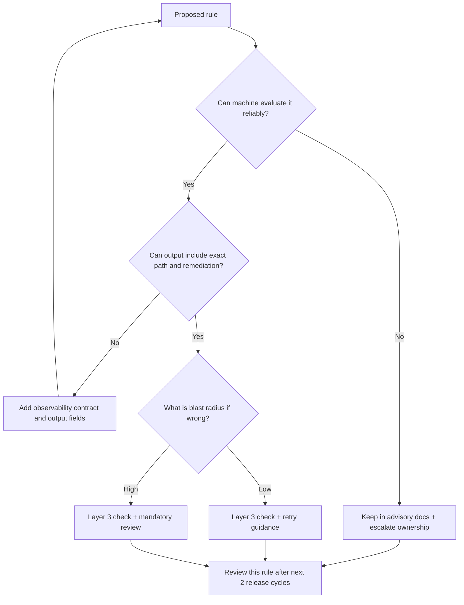

> **Complexity**: `[COMPLEX]`
>
> **Time to Complete**: 75-90 min
>
> **Prerequisites**: AI-native work modules 1.1-1.4, basic Git + CI/CD comfort, familiarity with AGENTS.md or CLAUDE.md conventions

---

## Learning Outcomes

- Design a layered harness map and classify each rule into platform defaults, project advisory, or project enforcement.
- Implement and validate at least two enforcement controls (branch guard and one invariant lint) using deterministic failure output and repeatable remediations.
- Diagnose repeated agent failures through a trace-first loop: reproduce, read the error, correct a single root cause, and rerun.
- Compare advisory-only, advisory-plus-tooling, and hard enforcement options using explicit risk, reversibility, and blast-radius criteria.
- Evaluate harness anti-patterns and choose the correct repair path using the decision framework.

A short assessment map links each learning outcome to quizzes, hands-on stages, and the Decision Framework where relevant.

## Why This Module Matters

A high-throughput AI-native team does not fail because agents are incapable of learning. It fails because the same policy boundaries are reintroduced manually every cycle. The repository does not break because someone wrote a bad commit; it breaks because the repo repeatedly failed to act as a stable control map.

A harness is the opposite of a giant instruction dump. It is a bounded control system: a map that points to policy, checks that enforce deterministic outcomes, and traces that prove recovery. The harness is where teams stop arguing over who should remember what and start operating on stable, machine-checkable artifacts.

This module turns that control design into habits. You will move from ad hoc memory to reusable structure, from scattered reminders to layered enforcement, and from weak signal retries to trace-first diagnostics. Most importantly, you will keep humans in the highest-value role: deciding intent and risk boundaries, while agents run repeatable deterministic loops.

## The seven principles and where they fit in a layered harness

A practical module design uses a three-layer harness model for every rule in the repository. The layers are platform defaults, project advisory, and project enforcement.

```text
+------------------------------+-----------------------------+-----------------------------+
| Layer 1: Platform defaults   | Layer 2: Project advisory   | Layer 3: Project enforcement |
+------------------------------+-----------------------------+-----------------------------+
| external tool contracts       | map and context             | scripts, hooks, CI gates     |
+------------------------------+-----------------------------+-----------------------------+
```

The value is practical: each rule is placed once, and each placement decides who owns failure and recovery. The model only works if those placements are explicit.

### 1) The map, not the manual

The brief states this directly: **"give Codex a map, not a 1,000-page instruction manual."** That sentence is not about documentation style. It is about reducing retrieval ambiguity before any policy action starts.

A map is a control artifact before it is a text artifact. If a task starts with uncertain search, all subsequent gates are delayed. If a task starts with a map, branch checks, invariant checks, and observability checks run with predictable scope. The motivation is to remove ambiguity in the first thirty seconds of every task.

A practical map should answer three questions immediately: where the task class begins, where the authoritative policy references live, and what comes next when a constraint fails. In a moderate AI-native repository, this usually means a small fixed layout with explicit ownership, so teams can make the same decision in one pass instead of chasing context.

In a moderate AI-native repository, this often looks like:

```text
/AGENTS.md
/docs/
  harness/
  architecture/
  runbooks/
/scripts/
.github/
  workflows/
  hooks/
```

Each destination in that layout has one owner role:

Each destination usually maps to one of three artifacts: the stable index, a policy source, and a decision artifact.

**Worked example:** an agent receives a request to correct a deployment issue. With a clean map, the agent opens `/AGENTS.md`, then jumps directly to the relevant harness policy and recovery doc. The first failure mode is now “wrong rule selected” instead of “missing policy path,” which drops response time and reduces speculative edits. Reviewers then check whether the policy path was correct, not whether policy was implied in chat.

**Trade-off:** a map that is too thin becomes a maze with short labels, increases first-pass uncertainty, and encourages duplicate policy interpretation. Add enough intent hints to reduce backtracking while keeping the map intentionally small.

### 2) Repository as the system of record

The repository is not a passive bucket for configuration. The source is explicit that policy belongs in structured documentation discoverable by both humans and agents, so policy updates become repeatable and can be validated by checks instead of private memory.

If policy is spread across chat notes and private references, consistency is always partial. One team may follow one source while another follows a second source. A system-of-record repo collapses this with one canonical path for each policy family.

The motivation is to replace drift with verifiable ownership. If a rule changes, it should change once, and all agents should discover that change through map-linked files in the same repository graph.

**Worked example:** your team keeps branch requirements in one note, manifest exceptions in another, and recovery steps in chat snippets. Those three are consolidated into `/docs/harness/policy/` and `/docs/runbooks/recovery.md`, while `AGENTS.md` stays a short map. Now every review can verify if all linked paths exist and are the same source of truth.

This principle also changes review quality. Reviews become focused on enforcement design rather than whether everyone “saw” the same text. The map is only useful once paired with check scripts and hooks that read those paths consistently across local and CI runs.

**Trade-off:** centralization can become slow if ownership is not explicit. Keep each policy file small, then assign explicit owners and a revision cadence so the system remains usable during urgent recovery cycles.

### 3) Enforce invariants, not implementations

A scalable harness does not enforce implementation style. It enforces invariant outcomes that remain stable across implementation changes. This is why invariant checks remain useful even as tooling evolves.

A robust invariant check answers two questions: what is required, and what to do if required state is missing. If the answer is only “run the check failed,” the harness is not giving teams enough signal to recover.

```bash
#!/usr/bin/env bash
set -euo pipefail

fail=0
for f in manifests/*.yaml manifests/*.yml; do
  [ -f "$f" ] || continue

  if ! grep -q '^apiVersion:' "$f"; then
    echo "FAIL: $f missing apiVersion"
    fail=1
  fi

  if grep -q '^kind: Namespace' "$f"; then
    continue
  fi

  if ! grep -q '^metadata:' "$f"; then
    echo "FAIL: $f missing metadata block"
    fail=1
  fi

  if ! grep -q '^    namespace:' "$f"; then
    echo "FAIL: $f missing metadata.namespace"
    fail=1
  fi

done

if [ "$fail" -ne 0 ]; then
  echo "Remediation: add metadata and metadata.namespace in each non-Namespace manifest."
  exit 1
fi

echo "manifest invariant checks passed"
```

**Worked example:** when `manifests/deployment.yaml` lacks namespace, the check emits a deterministic failure and one remediation path. The correction is explicit and repeatable: add namespace and rerun. This is how low-cost determinism protects quality under repeated workload.

This principle becomes stronger when the same invariant runs in both local hooks and CI through the same script path, because one output contract then remains stable across environments.

**Trade-off:** an invariant that is too broad creates friction and blocks valid edge cases. Keep explicit exception lists and review them with the same trace-first process so policy remains strict where it should be and permissive where it is safe.

### 4) Make the application legible

A harness that checks files but cannot observe runtime behavior is incomplete. The model is expected to reason from output. If that output is noisy, stale, or ambiguous, the loop becomes slower and less reliable.

Legibility means clear and stable run-state: health status, metrics counters, and bounded logs that reflect the stage transition. In practice, this turns a repair into evidence-based execution.

```bash
cat > scripts/trace-observe.sh <<'EOF'
#!/usr/bin/env bash
set -euo pipefail

echo "== health endpoint =="
printf '%s\n' '{"status":"ok","uptime_ms":1840}'

echo "== startup metrics =="
printf '%s\n' '{"startup_latency_ms":125,"repair_attempts_total":1,"repair_success_total":0}'

echo "== recent logs =="
printf '%s\n' '{"severity":"error","component":"manifest","message":"namespace missing"}'
printf '%s\n' '{"severity":"info","component":"agent","message":"retrying with remediation"}'

echo "== run state =="
printf '%s\n' '{"last_error":"namespace_missing","stage":"validate"}'
EOF
chmod +x scripts/trace-observe.sh

./scripts/trace-observe.sh
```

**Observed sequence:** the first output should show the error stage, then remediation, then a successful rerun that updates `repair_success_total` and changes `stage` to `validate-fixed`; this proves the loop executed end-to-end rather than stalling on a stale trace file.

**Worked example (instrumented app):** if `repair_success_total` stays at 0 after a successful manifest edit, the issue is often trace wiring. The fastest repair is to verify the trace contract path and state source before touching policy logic.

**Trade-off:** verbose telemetry is not the goal; deterministic telemetry is. Keep output keys stable and output size bounded so policy decisions can be made with small, repeatable scripts instead of fuzzy interpretation.

### 5) Throughput changes merge philosophy

As throughput rises, gate design must scale by failure class. If every step is hard-gated, teams waste time on low-risk cycles. If every step is advisory, teams accept silent drift.

The practical split is simple: automate retries for deterministic low-risk classes, but keep high-risk classes in enforced + review pathways where a human confirms intent and blast risk.

**Worked example:** namespace checks are repeatable and low ambiguity. Branch policy is high-signal and high-risk if bypassed. In one policy stack, the manifest check should rerun quickly with one expected fix, while branch policy changes should force branch and human confirmation.

**Trade-off:** the wrong split creates either operational drag or recurrent risk. Calibrate each rule class every sprint based on failure trends and the cost of mistaken retries.

### 6) Humans steer, agents execute

The explicit operating principle is: **"Humans steer. Agents execute."** That means humans should spend cycles on ambiguity and policy intent while agents run bounded deterministic loops.

If every decision is escalated to a human, the system stalls. If every retry is automated without threshold, the system drifts into blind repetition. The motivation is to define where convergence should stop and escalation should begin.

**Worked example:** a manifest lint fails twice in the same way. After two retries, escalation should trigger. The human then reviews whether the rule boundary is wrong or exception policy changed. This avoids infinite loops with no policy adjustment.

**Trade-off:** escalate too often and harness throughput drops; escalate too late and silent breakage spreads. Escalation policy should be deterministic, with explicit evidence thresholds.

### 7) Continuous garbage collection and boring tech

Long-running AI workflows scale whatever quality you encode. If you encode cleanup debt, debt becomes the default path. If you encode routine maintenance, maintenance becomes the default path.

The loop should include stale-map link scans, exception-drift checks, outdated-script checks, and repeat-failure analytics. This turns quality work into predictable maintenance work.

**Worked example:** a weekly maintenance job fails because one map path disappeared and one trace key changed format. Instead of adding a new control, teams fix both the map and the trace contract in one low-risk PR.

**Trade-off:** cleanup without ownership becomes ceremonial. Assign owners and frequencies explicitly, and enforce a minimum maintenance window so technical debt stays bounded.

The principle-to-layer matrix:

| Principle | Primary layer | First repeatable symptom |
|---|---|---|
| Map, not the manual | 2 | map lookup loops repeatedly fail |
| Repository as system of record | 2,3 | same rule appears in multiple places |
| Enforce invariants, not implementations | 3 | same shape violation repeats |
| Make the application legible | 2,3 | state output is stale or missing |
| Throughput changes merge philosophy | 2,3 | manual follow-up dominates small failures |
| Humans steer, agents execute | 2,3 | retries happen without convergence |
| Continuous GC + boring tech | 2,3 | stale runbooks and exceptions grow |

## Extended case study: one failure, four fixes, no repetition

A small incident simulation demonstrates all seven principles together. You receive one ticket: **“fix the namespace regression and open a PR that passes checks.”** The fastest path is to apply rules in the same order they are discovered by gate order, so the team spends time on the narrowest failure boundary at each step.

### Fix 1 — Branch lock fails first

The first local check fails immediately because the user is on `main`. Branch protection is the gating boundary. This is the expected first stop, and it should not be bypassed. The recovery action is to move to a feature branch before any manifest edits.

### Fix 2 — Invariant failure on namespace

On feature branch, manifest validation returns missing namespace. The error is concrete, so the fix is deterministic: add one field and rerun. This demonstrates the first pass of outcome-driven recovery.

### Fix 3 — Trace output is stale after fix

The manifest is corrected, but trace output still reports the old stage. This is a separate issue in observability mapping. Updating the trace state contract may be the correct fix even when the application logic is already correct.

### Fix 4 — Hidden exception drift after cleanup

A stale path appears in policy map cleanup and causes future discovery failures. The fix is to remove stale map targets and rerun the same validation command path so the map remains authoritative.

The four fixes are not independent; they complete a full loop where branch gates, invariants, traces, and cleanup interact:
branch gates prevent invalid workflow entry,
invariant checks enforce measurable correctness,
trace output proves recovery,
and maintenance sweeps prevent recurrence.

You now apply the decision framework to classify each control path against blast radius and reversibility before deciding whether to harden:

1. Branch policy remains Layer 3 because repeated unsafe commits are high-signal failures.
2. Namespace invariants remain Layer 3 because this is measurable and deterministic.
3. Trace outputs remain at Layer 3 because they are required to prove recovery.

If these classes keep failing after the same remediation, rule scope and risk model should be revisited, because repeated deterministic misses usually indicate either weak criteria selection or missing exception governance.

## Operational playbook notes for production-ready harnesses

The fastest way to sustain a harness is to treat it as a living operator manual, not as a static appendix. A reliable loop has three clocks that must be checked independently. The first clock is policy freshness: when rules evolve, every mapped path and hook should update together. The second clock is enforcement freshness: local checks and CI checks should produce identical outputs for identical inputs. The third clock is recovery freshness: if the same failure class repeats, treat it as a control-design debt signal rather than a random regression.

Use this rhythm for every new policy family. First, assign an owner and a single source-of-truth file. Next, define the smallest enforceable invariant that proves the behavior and decide which layer hosts it. Third, define the observable state contract for remediation. Fourth, define the escalation triggers after repeated misses. This rhythm prevents teams from adding a half-dozen disconnected scripts without a shared recovery story, because every control now has a reason, owner, and expected outcome.

The value of this sequence becomes obvious during onboarding. New agents and new engineers should not need to memorize hidden patterns; they should be able to read one map, run one command sequence, and infer the next action from one paragraph plus one command output. You can test onboarding quality by introducing a synthetic namespace failure and requiring that it is fixed with exactly two retries. If the team cannot close it predictably in that envelope, the layer placement or messaging needs revision before scaling the module further.

When policy grows, treat map and checks as a coupled pair. If you add a rule to the map but not to the executable gate, you have created an instruction debt. If you add a check without a clear map path, you have created an enforcement debt. Sustainable harnesses avoid both by applying paired edits: one map entry, one check, one expected remediation path, one verification step. This is why many operators prefer “small PRs with complete evidence” over “big PRs with partial intent.” The former is always easier to review and easier to roll back.

A high-confidence trace strategy is to define exactly four fields for every failure family: stage, last_error, attempt count, and action taken. Once those fields are stable, all teams can write scripts and LLM prompts against the same schema. The next quality win is to version those fields and to keep backward compatibility. When a field changes, keep compatibility at least one release long so legacy runs do not become false positives while the team migrates.

If you keep these principles, the decision framework becomes easier: advisory when learning and discovery are dominant, advisory-plus-tooling when drift is repetitive but low impact, and hard enforcement when the cost of mistake is clearly above the cost of temporary friction. For each transition, keep the same trace event so outcomes can be compared. The more uniform the events are, the easier it is to build dashboards, alerts, and review notes.

The final operational habit is review cadence. Even mature harnesses degrade without periodic resets. Every two release cycles, run a cleanup review that checks map targets, stale exception entries, duplicated hook logic, and CI parity. This review can be light when systems are stable and heavy when a new failure class appears. Most teams fail this step not because rules are wrong, but because the review event is not owned by someone with authority to prune and correct drift.

### Migration sequence for a team of five

A team that has five active contributors should not try to scale governance by adding more checks first. It should scale by reducing ambiguity of ownership and decision ownership. The sequence that works well is this: align one map for all new modules, define the two most common failure classes, publish two deterministic checks, then only add a third and fourth check if the first two are stable for one cycle.

This sequence is practical because high-ambiguity teams tend to overfit on quantity. They add checks quickly, then spend weeks teaching why they exist. The result is the opposite of a harness: a museum of policies. By holding back to two or three checks, teams keep the cognitive loop short and can measure whether each additional control improves time-to-recovery. If the new control does not reduce repeated misses, it should not be promoted to hard enforcement.

The most reliable conversion pattern starts with a synthetic failure family and ends with a real one. For example, begin with one branch rule and one manifest invariant, then run each from both clean and broken states. Record output, correction, and evidence. Once this base loop is stable, apply one real production rule such as namespace namespace discipline or merge target policy. The synthetic-to-real order gives teams a deterministic baseline where teaching and operations share the same recovery grammar.

This approach also protects against brittle policy churn after merges. If a teammate adds a temporary exception during an incident, the review should ask three explicit questions: is this exception still aligned with the failure family, is there a better layered location, and what is the decommission date? If one answer is unclear, keep it as advisory for one cycle and review again with the same evidence. This avoids turning every emergency response into long-term governance.

During scale, you can measure maturity with three signals: repeated failure frequency, mean retries before first fix, and mean time to deterministic rerun. When those three are stable, the team can move from one-off checks to durable enforcement. If not, the problem is not the check count; it is the harness contract and ownership model. A healthy migration sequence always closes with one clean evidence artifact that proves map, check, and trace are in sync.

A stable migration cycle is also a teaching cycle. Every maintainer should be able to explain, in one minute, what the current highest-risk rule is and why it sits in Layer 3 rather than Layer 2. If someone cannot explain that, the team has not finished adopting the harness model even if all checks are passing on a clean run.

### Rule-change governance loop for high-scale teams

A robust harness does not grow by adding rules whenever a new failure appears. It grows by running a fixed rule-change governance loop that has three explicit outputs: expected behavior, expected failure, and expected evidence. Teams that skip this loop typically create "rule snow." They get a new check for each symptom and eventually end up with more scripts than outcomes.

Start by writing the rule in one sentence, then extract the invariants it implies. For each invariant, state whether it belongs to repository intent, agent loop control, or enforcement. This is where Layer 1, Layer 2, and Layer 3 begin their lifecycle. If the rule is not tied to an invariant and is only phrased as a preference, it should not enter Layer 3 directly. It should usually start as advisory documentation with a short remediation example so agents can detect it and humans can refine it.

The second step is to define output contracts before implementation. A contract is not prose; it is concrete output that can be parsed and acted on. In one line, define the command, the guaranteed failure path, and the guaranteed remediation text. Then define which stage transitions and fields indicate that the issue has moved from transient to resolved. Teams that define contracts first reduce debugging by more than half when the first failure appears in a new context.

Third, create a one-cycle migration plan for each new rule. The plan should include a rollback note and a compatibility window. If command output format changes, keep an accept list for one release window so older output is still recognized while teams migrate automation and prompts. This avoids false regressions and preserves review continuity.

The loop should include a negative test before the positive test. Add the malformed path, confirm the expected failure, and confirm the deterministic remediation message remains unchanged after a clean repository reset. Only then add the corrected form. This sequencing matters because agents evaluate signal quality before they can evaluate intent quality.

Teams with high volume should automate this loop as a reusable mini-playbook. The playbook can be a three-part artifact set: one markdown note that describes the rule and ownership, one script check that emits exact fields, and one incident test that proves the check remains stable across environment paths. This structure scales because it gives each rule a repeatable onboarding path for both humans and agent workers.

### Observability as enforcement substrate

Observability becomes meaningful only when it answers three questions: what failed, where it failed, and what to do next. A trace command that prints only generic success and failure is insufficient. A useful trace contract adds stage, rule id, target file, and attempt number so agents can decide whether the fix should be in policy, in schema, or in operational assumptions.

In the field, teams often discover that policy enforcement and trace visibility drift apart over time. A pre-commit hook might pass locally while CI still fails because the CI layer uses an older contract, older branch naming, or a different path set. That is not a tooling bug; it is a contract debt problem. The remedy is not tighter scripts but synchronized owners, synchronized invocation, and synchronized docs.

A mature team can treat these observability fields as a small event protocol. Stage transition events can be recorded by hooks, runbooks, or lightweight local scripts. The schema should be strict enough for script parsing but human-readable enough for incident reviews. This is where an observability tool choice matters: if your query language and retention model allow per-worktree ephemeral stacks, you can validate a local exercise in a scratch namespace without polluting team telemetry.

This is also where the Chrome DevTools protocol example becomes operationally useful. If your app includes browser-driven workflows, use protocol-level events or logs in the same trace contract style. You are not required to reproduce every browser event in the harness, but you should ensure that high-friction commands can point to stable observability evidence.

### Stale exception policy and exception drift handling

Exception drift is the most common reason a harness becomes brittle without apparent policy growth. The exception was introduced as a temporary fix, then copied into unrelated areas, then forgotten by ownership. Three months later, the exception itself becomes invisible technical debt.

Treat exceptions as first-class change records, not as incidental notes. Store them in versioned files with a reason line, a review date, and a review cadence. A stale exception is often visible as one of three symptoms: a missing map target, a check that can no longer fail in the expected way, or a repeated branch of manual fixwork that appears in every on-call rotation. If two of these symptoms appear, your exception inventory is not healthy.

A practical pattern is to mark each exception with explicit expiry criteria tied to a release train or ticket. The criteria can be date-based, risk-based, or milestone-based. When the criterion is met, require a re-validation step before the exception can be reused. This keeps temporary exceptions from becoming permanent policy.

When exception debt compounds, teams should prefer one of two options rather than adding a fourth or fifth workaround: either convert the exception to a proper rule with explicit risk boundaries, or remove and close it through a cleanup PR. A temporary fix is useful only while a team tests behavior safely.

### Multi-team scale and reviewer ergonomics

At scale, many teams fail because the reviewer no longer sees the full recovery narrative in one pass. They see fragments: one map file, one hook, one runbook, one alert channel. That fragmentation drives wrong decisions because no single person has a stable story of how controls interact.

The response is architectural separation with explicit sequencing: onboarding, policy definition, enforcement, and telemetry each have owners, and every owner has a checklist that starts at the same command boundaries. Reviewers then inspect one sequence rather than scattered fragments. A good reviewer checklist should include an explicit "repro → trace → fix → rerun" row, not just a change summary.

For teams building cross-track modules, harmonize naming with the project map and avoid environment-specific shortcuts that require human memory. A branch name, a path, a hook, and a failure output format are not implementation trivia; they are the interfaces your future self and future agents will consume when speed matters.

Use this principle to decide how much to lock down. If a control prevents expensive or high-blast changes, keep Layer 3 firm. If it mainly guides agent quality, keep advisory language and lightweight linting. If it teaches a team behavior that is repeatedly forgotten, apply advisory-plus-tooling with explicit correction and limited escalation.

The practical outcome of this scale approach is not one perfect harness script. It is a stable habit chain where teams can onboard a new failure class in one exercise cycle and remove one stale class from backlog in the next.

### Final gate before T0 promotion

Before you promote a mature module to production use, run one final harness convergence loop. It should verify that at least one policy, one hook, one trace path, and one recovery path all share the same ownership model and same output contract. The loop ends when every participant can predict the same expected output for three representative failures and the same remediation action for each.

A pragmatic pass criterion is to measure three outcomes across the team: no ambiguous failures, no unresolved stale links in the map, and no retry loops without a single-file minimal fix. If any participant reaches for more than one external assumption during the loop, that is evidence the map is still not complete. If remediation still depends on tribal memory, add one clearer map bullet and one explicit failure message, then rerun.

When all three gates pass, the team should capture a short handover note that includes expected outputs, current owners, and the next cleanup date. This note is not ceremony; it is the evidence boundary that keeps the harness from being rewritten during the next on-call cycle. If this note is missing, the module will still work in the short term, but will fail quality pressure after two or three rotations.

## Patterns & Anti-Patterns

### Patterns

| Pattern | When to use | Why it works | Scaling considerations |
|---|---|---|---|
| Map-first entrypoints (`AGENTS.md` with linked docs) | Teams with repeated instruction searches or cross-role handoffs | reduces cognitive load and route variance before execution | keep map shallow, with one owner per review cycle |
| Invariant-first implementation checks | Repeated shape violations and predictable failures | turns ambiguity into deterministic fix commands | keep identical invocation in local and CI |
| Layered decision path with trace output | Teams with noisy repeated retries | separates judgment from execution and improves convergence | preserve stable trace keys and trace contracts |

### Anti-patterns

| Anti-pattern | Why it goes wrong | Recovery pattern |
|---|---|---|
| Monolithic context file | one file carries all instructions and exceptions | agents lose priority and spend time rediscovering context | split into map plus linked decision documents |
| Enforcement without remediation text | FAIL states are too broad | retries become blind and low-confidence | include one path-specific next command in each failure |
| Hidden exceptions in prose | exceptions are not machine-visible and drift silently | failures recur in similar form across teams | move exceptions into versioned configuration and validate |

## Decision Framework

Before adding a rule, evaluate this sequence:



### Advisory-only, advisory-plus-tooling, and hard enforcement comparison

Use the criteria in this section for Outcome 4 in the Learning Outcomes. Choose **advisory-only** for low-risk, rarely violated preferences. Choose **advisory-plus-tooling** when agents repeatedly miss guidance but cost remains contained. Choose **hard enforcement** when repeated measurable failures justify immediate prevention and explicit escalation safeguards.

Decision criteria are risk if wrong, reversibility, and blast radius, and each should be scored before rule placement.

| Rule class | Risk if wrong | Reversibility | Blast radius | Suggested placement |
|---|---|---|---|---|
| Formatting and convention | Low | High | Low | Layer 2 + short advisory + retry |
| Merge behavior and namespace policy | Medium | Medium | Medium | Layer 2 + Layer 3 with explicit links |
| Deployment semantics and data model | High | Low | High | Layer 3 + mandatory review/escalation |

If these three dimensions are reversed, teams usually overconstrain low-risk operations and underconstrain high-risk ones.

### Escalation checklist

Escalate when any of these are true: the same failure repeats after two deterministic retries, remediation requires external evidence outside repository state, data loss or production impact is possible, or the policy decision needs cross-team review. Escalation should include failure signature, command sequence, unresolved risk, and a recommendation for next step.

## Did You Know?

- The OpenAI post is dated February 11, 2026 and describes an agent-generated shipping path using repository-level scaffolding.
- In that phase, the team reported roughly 1,500 PRs with a small core team, showing how harnessing repeated tasks can scale safely.
- The model ties recovery to observable outputs such as health checks, logs, and deterministic checks rather than hidden memory.
- The module distinguishes advisory guidance from enforceable policy and keeps humans in final exception/risk decisions.

## Common Mistakes

| Mistake | Why it happens | Better fix |
|---|---|---|
| Map contains too much context and no pointers | Teams avoid frequent map updates | keep map short, enforce link checks |
| Reusing old one-off scripts without review | Speed-first mindset for an urgent failure | convert to versioned checks with deterministic output |
| Treating branch rules as reminder text only | concern about friction | add pre-commit/CI enforcement with explicit remediation |
| Adding checks without exception handling | copy-paste from example templates | encode exceptions in policy files with explicit tests |
| Ignoring stale links in docs | maintenance debt | automate path lint and stale-link scans |
| Escalating everything to manual review | uncertainty intolerance | classify by risk and routability first |

## Quiz

<details>
<summary>Question 1: The same policy appears in two files with different branch names. How do you fix this first?</summary>
Define one canonical source in docs, point every other document to it, and update the map. Then ensure both pre-commit and CI read from the same source. This removes contradiction and keeps routing deterministic.
</details>

<details>
<summary>Question 2: A manifest check shows missing namespace. What is your immediate action sequence?</summary>
Capture exact failure output, patch only the failing path, rerun the same check, and only then run broader checks. This keeps the correction minimal and deterministic.
</details>

<details>
<summary>Question 3: The error output says only “lint failed.” Why is this dangerous for an agent loop?</summary>
Because no exact file or field targets cause blind retries. Replace generic text with path-level failure output and one remediation command.
</details>

<details>
<summary>Question 4: For each class below, choose advisory-only, advisory-plus-tooling, or hard enforcement using risk, reversibility, and blast-radius.</summary>
Formatting rule that frequently reappears? advisory-only.
Namespace policy with repeated measurable misses? hard enforcement.
Guidance for ambiguous workflows? advisory-plus-tooling.
Explain the correct layer in one sentence each.
</details>

<details>
<summary>Question 5: Your map check passes but the rule still does not hold in practice. What is the likely mismatch?</summary>
Either hook invocation differs across environments or ownership is split across documents with unclear precedence. Consolidate entrypoints and map references.
</details>

<details>
<summary>Question 6: Throughput is high and your team wants fewer gates. What should change?</summary>
Keep gates for high-risk actions and automate low-risk repetitive checks with deterministic reruns and explicit remediation.
</details>

<details>
<summary>Question 7: You repeatedly encounter new exceptions after each cleanup. What anti-pattern is active?</summary>
A hidden exception model is active. Apply advisory-versus-tooling-versus-enforcement using risk, reversibility, and blast radius, then lock the chosen layer in the decision framework.
</details>

<details>
<summary>Question 8: A local hook can be bypassed by an alternative command. What is the strongest remedy?</summary>
Do not rely on local hooks alone. Add equivalent CI checks with explicit failure and remediation text. Local hooks remain faster, CI remains the final deterministic boundary.
</details>

## Hands-On Exercise

Complete all 7 stages and capture output at each stage. Each stage is build + verify + correction.  
This exercise is intentionally repetitive so the loop becomes boringly reliable: run the command, read the exact failure, make the smallest possible fix, rerun the same command, and only then continue. Keep a short evidence log of the command, output, and decision for every stage. That habit is what prevents agents from guessing and lets humans audit recovery speed without opening private context.

### Stage 1: create map scaffolding (outcome 1)

```bash
mkdir -p ~/tmp/harness-playground && cd ~/tmp/harness-playground

git init
mkdir -p .github/hooks docs docs/harness docs/runbooks manifests scripts
```

```bash
cat > AGENTS.md <<'EOF'
# AGENTS

This repository uses a compact map + linked instructions.

- docs/harness/index.md: policy and map targets
- scripts/manifest-lint.sh: invariant check
- scripts/trace-observe.sh: state trace command
- .github/hooks/pre-commit: hard gate for branch and lint
EOF
```

Stage 1 should produce a stable map root that points to future enforcement files, runbooks, and checks. Keep the names short and explicit so downstream hooks can reference the same anchors without translation. The exercise is not about perfect prose; it is about making one deterministic map path that an agent and a reviewer can both trust on first read.

### Stage 2: create canonical policy documents (outcomes 1, 5)

```bash
mkdir -p docs/harness docs/runbooks

cat > docs/harness/index.md <<'EOF'
# Harness index

- no direct commit to main
- manifests must include metadata.namespace where applicable
- run trace-observe after every enforcement action
EOF

cat > docs/runbooks/recovery.md <<'EOF'
# Recovery runbook

1. run manifest lint
2. read failure line
3. patch targeted file
4. rerun manifest lint
5. record pass/fail outcome
EOF

cat > docs/harness/policy.md <<'EOF'
# Harness policy

- branch gate is mandatory
- manifest invariant check is mandatory for non-namespace manifests
- remediation output must include one actionable suggestion
EOF
```

After creating the map and policy files, verify that all links resolve and are still readable from Stage 1. This catches repository-layout failures before any policy check runs, which is important because broken targets can mimic rule failures and waste recovery effort on the wrong surface.

### Stage 3: add invariant and observe first failure (outcomes 2, 3)

```bash
cat > scripts/manifest-lint.sh <<'EOF'
#!/usr/bin/env bash
set -euo pipefail

fail=0
for f in manifests/*.yaml manifests/*.yml; do
  [ -f "$f" ] || continue

  if ! grep -q '^apiVersion:' "$f"; then
    echo "FAIL: $f missing apiVersion"
    fail=1
  fi

  if grep -q '^kind: Namespace' "$f"; then
    continue
  fi

  if ! grep -q '^  metadata:' "$f"; then
    echo "FAIL: $f missing metadata block"
    fail=1
  fi

  if ! grep -q '^    namespace:' "$f"; then
    echo "FAIL: $f missing metadata.namespace"
    fail=1
  fi

done

if [ "$fail" -ne 0 ]; then
  echo "Remediation: add metadata.namespace to all non-Namespace manifests"
  exit 1
fi

echo "manifest checks passed"
EOF
chmod +x scripts/manifest-lint.sh

cat > manifests/deployment.yaml <<'EOF'
apiVersion: apps/v1
kind: Deployment
metadata:
  name: hello-controller
EOF

./scripts/manifest-lint.sh
```

Expected Stage 3 failure pattern: `FAIL: manifests/deployment.yaml missing metadata.namespace` plus a direct `Remediation:` line.  
This is a good failure because it identifies a file path, the exact missing field, and the intended fix in one place. If this output changes shape each run, pause and normalize the script before adding more rules.

<details>
<summary>Stage 3 fix</summary>
Patch `metadata` with `namespace: harness-demo` and rerun.
</details>

### Stage 4: add branch enforcement hook (outcome 2)

```bash
cat > .github/hooks/pre-commit <<'EOF'
#!/usr/bin/env bash
set -euo pipefail

branch=$(git rev-parse --abbrev-ref HEAD)
if [ "$branch" = "main" ]; then
  echo "Blocked: direct commits to main are not allowed."
  echo "Switch to a feature branch and rerun."
  exit 1
fi

./scripts/manifest-lint.sh
EOF
chmod +x .github/hooks/pre-commit

./.github/hooks/pre-commit
```

Expected output on main is: `Blocked: direct commits to main are not allowed.` This is your admission gate for Layer-3 branch policy. If the message is replaced by a generic exit code, the harness is providing less signal than a branch policy should provide, and trace recovery becomes slower.

<details>
<summary>Stage 4 fix</summary>
Create a feature branch (`git checkout -b feature/harness`) and rerun.
</details>

### Stage 5: run observability loop before fixing (outcome 3)

```bash
cat > scripts/trace-observe.sh <<'EOF'
#!/usr/bin/env bash
set -euo pipefail

echo 'TRACE_STATE=validate'
echo 'LAST_ERROR=namespace_missing'
echo 'REMEDIATION=add metadata.namespace'
EOF
chmod +x scripts/trace-observe.sh

./scripts/trace-observe.sh
```

Verify whether the stage transitions when the manifest is fixed. If the stage does not change, treat the failure as a trace-wiring bug and fix telemetry before changing policy behavior.

### Stage 6: inject an anti-pattern and recover with trace-first design (outcome 5)

```bash
printf "stale-policy.md\n" >> docs/harness/index.md
rg -n "stale-policy.md" docs/harness/index.md
```

Expected observation: the stale target appears and creates an invalid map path.  
A stale path is correct in this stage because it demonstrates detection quality. Fix the map entry first, then re-run this exact check so the same command path proves the policy surface can recover cleanly.

<details>
<summary>Stage 6 fix</summary>
Remove the stale line and rerun map validation with `rg -n`.
</details>

### Stage 7: final convergence and evidence capture (all outcomes)

```bash
printf '  namespace: harness-demo\n' >> manifests/deployment.yaml
./scripts/manifest-lint.sh

git checkout -b feature/harness-control
./.github/hooks/pre-commit
./scripts/trace-observe.sh
```

Expected final output is a full evidence bundle: manifest checks pass, branch hook succeeds on a feature branch, and the trace output has stable state keys that match the previous stage transitions. You should be able to point to the exact log line that proves each decision in the sequence.

<details>
<summary>Stage 7 fix path</summary>
If any stage still fails, fix the smallest command-specific cause and rerun that command once before the next command.
</details>

### Success checklist

- [ ] map file contains short pointers and no duplicated policy text
- [ ] policy docs are linked and all targets exist
- [ ] manifest lint check provides field-level failure output
- [ ] branch hook blocks direct commits with clear remediation
- [ ] trace command emits deterministic state for each stage
- [ ] stale entries are removed through the same command path
- [ ] final state has all checks passing and recorded evidence

### Maintenance with measurable evidence and review cadence

When teams say “the harness worked yesterday,” they usually mean “the last failure they remember was fixed.” A stable harness needs stronger evidence than memory. For each week, run a short maintenance loop with four evidence buckets:

1) map health (all linked targets resolve),  
2) invariant health (the same deterministic command set fails fast and explains causes),  
3) trace health (state keys and counters are predictable across runs), and  
4) escalation health (the same repeatable error does not bypass review boundaries).  

The review loop should include an owner for each bucket and one line of evidence per bucket. That line might be a link to a command transcript, a diff proof, or a shared note with timestamped outputs. The key requirement is that each control has a measurable artifact, not a promise.

For low-cost scaling, convert one non-trivial repository policy into a “self-checking module” every sprint. Define the rule, define the expected failure lines, define the one remediation command, and define the expected post-remediation state. Then wire the same rule into local and CI checks. Teams that do this consistently spend less time on ad hoc triage because each policy move has a known script-level acceptance test.

A practical maintenance trick is to keep a small debt register in your runbooks. Record when a rule is added, the owner, and the date you plan to review exception drift. If one rule produces more than two deterministic retries per week, escalate it to decision review before it creates noisy exceptions. The objective is not zero exceptions; it is clean exception ownership and explicit cleanup points.

Telemetry should be treated as part of the policy contract, not as a bonus. If stage transitions are never logged, then every repair decision is made in reduced visibility. If telemetry is logged but unstable, then every repair decision becomes a re-interpretation exercise. Keep both schema and keys stable across edits, and version changes as policy updates with backward-compatible reads where possible.

Scale pressure appears when teams grow and command sequences spread across multiple roles. One pattern that holds up is separating map authorship from enforcement authorship. Map authors define intent and location once; enforcement authors define checks and expected outcomes; operations owners verify that map, check, and trace are still synchronized at release cadence. This is less glamorous than rewriting everything, and significantly more durable.

You can still keep the repository “boring” while adding complexity. The target operating state for this module is not perfect automation; it is predictable automation with explicit escalation and clear proof. At 2.1 maturity, your harness should produce repeatable signals quickly, while giving humans one obvious decision gate where policy nuance belongs.

## Sources

- [OpenAI Codex AGENTS.md guide](https://developers.openai.com/codex/guides/agents-md)
- [Pre-commit hooks documentation](https://pre-commit.com/)
- [Conventional Commits specification](https://www.conventionalcommits.org/en/v1.0.0/)
- [ESLint custom rules documentation](https://eslint.org/docs/latest/extend/custom-rules)
- [OpenAI Symphony SPEC](https://github.com/openai/symphony/blob/main/SPEC.md)
- [OpenAI Symphony repository](https://github.com/openai/symphony)
- [OpenAI Symphony repository README](https://github.com/openai/symphony/blob/main/README.md)
- [GitHub protected branch controls](https://docs.github.com/en/repositories/configuring-branches-and-merges-in-your-repository/managing-protected-branches/about-protected-branches)
- [Chrome DevTools Protocol](https://chromedevtools.github.io/devtools-protocol/)
- [ADR method overview](https://www.thoughtworks.com/radar/techniques/architecture-decision-records)
- [ADR repository and README](https://github.com/joelparkerhenderson/architecture-decision-record/blob/main/README.md)
- [Loki query language reference](https://grafana.com/docs/loki/latest/query/)
- [12-Factor App](https://12factor.net/)

## Next Module

Continue in [Module 2.2 — Orchestrating fleets: Symphony and project-management-as-control-plane](./module-2.2-orchestrating-fleets-symphony/).
