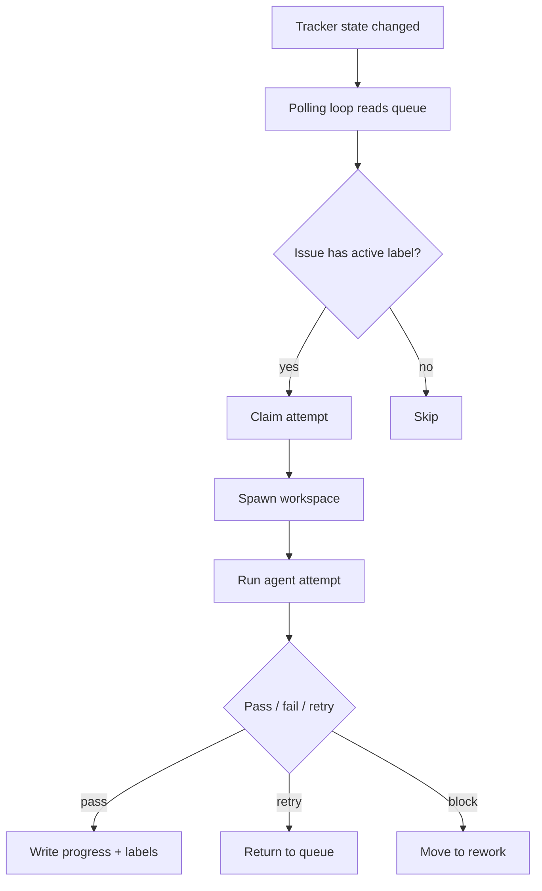
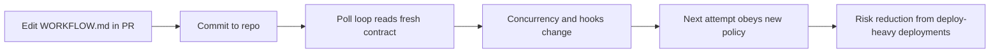
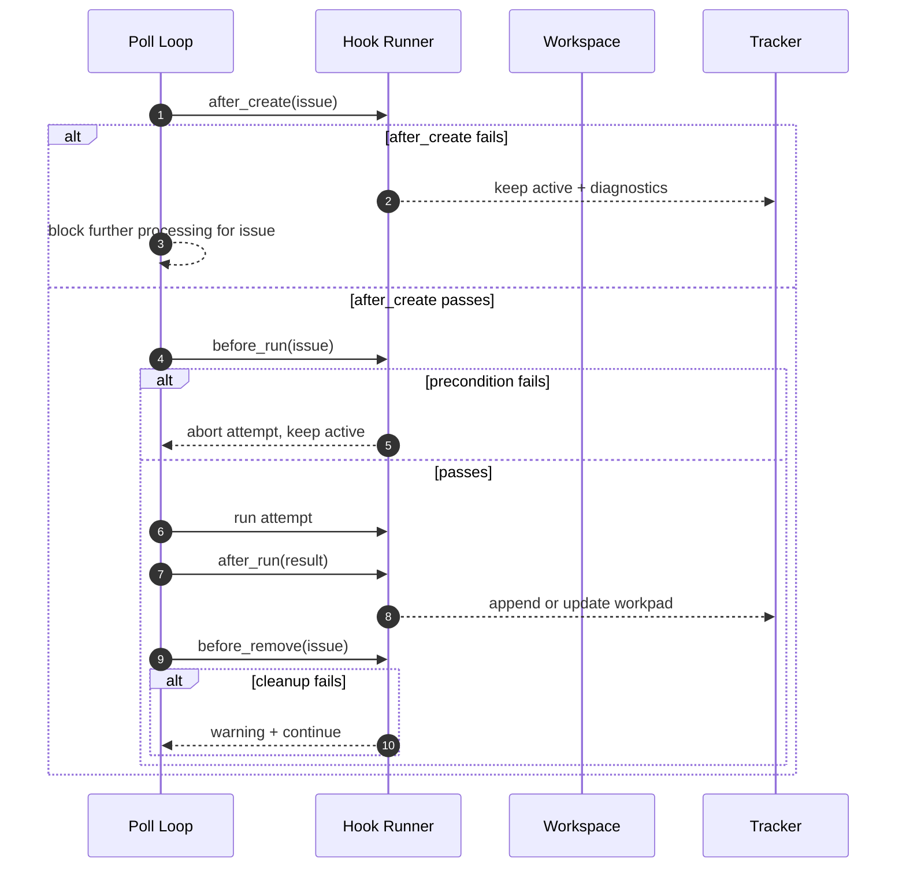
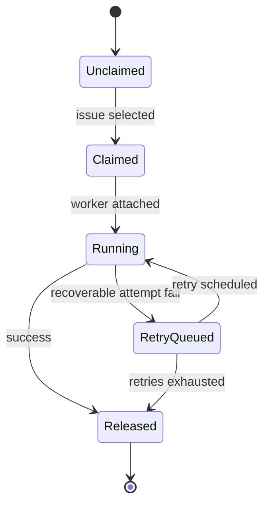
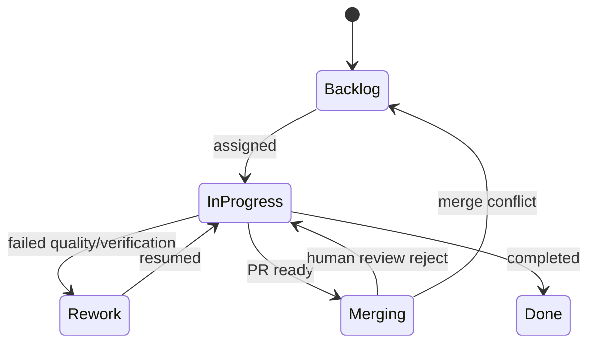
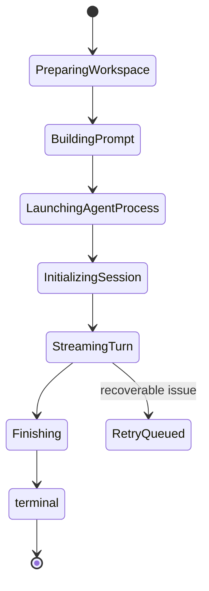

> **Complexity**: [COMPLEX]
>
> **Time to Complete**: 75-90 min
>
> **Prerequisites**: AI-native work modules 1.1-1.4 + 2.1 (Harness Engineering), basic Git + branching comfort, Linear/Jira/GitHub Issues familiarity at user-level, exposure to YAML configs

---

## Learning Outcomes

- Diagnose failures in session-centered automation and map each breakage to a hidden ownership or control-plane gap.
- Design a `WORKFLOW.md` contract with the required six top-level sections and a Liquid-templated body that can be reviewed and changed safely in Git.
- Implement a minimal, label-driven polling loop that respects `WORKFLOW.md` and executes lifecycle hooks.
- Evaluate the separation between internal claim states and ticket states before choosing how retries, rework, and completion are handled.
- Compare Symphony-style ticket automation with human-in-the-loop sessions and `/goal` objective loops for different risk and reversibility assumptions.

## Why This Module Matters

Hypothetical scenario: a small platform team starts three agents against one repository, each with its own shell session. During one outage, one agent is preempted, another operator resumes with partial notes, and by the next day nobody can explain why a backlog item is still open even after comments and commits exist across sessions.

The root issue is not speed. The root issue is the wrong abstraction of ownership. If the system is built around sessions, state dies with shells, terminals, or process identities. If the system is built around tickets, state survives handoffs, and the control surface remains the artifact humans already own and understand.

The central pivot is explicit in the core source, and it is the design lens you can keep checking as you scale:

> "We were optimizing the wrong thing. We were orienting our system around coding sessions instead of the work itself."

This sentence is not rhetoric. It is a design contract that determines what your automation can reliably optimize. In a ticket-first control plane, optimization means better flow from Backlog to Done for the same human goal. In a session-first control plane, optimization often means reducing churn in short-lived terminals, which quickly stalls as team size grows.

Before this module, you likely already know that orchestration needs loops, retries, and backpressure. This module asks you to redesign the abstraction under those loops: move control ownership from runtime sessions to issue records on a project-management tracker. You will design a `WORKFLOW.md` contract, wire practical lifecycle hooks, and decide when this pattern should and should not be used.

Pause and predict: if an outage occurs while an agent is halfway through an attempt, which model gives you a truthful handoff point in under one minute: session state, or ticket state? Which one preserves recoverability when a human changes direction? The ticket-first model should be your default answer for this class of fleet operations.

## Core content

### 1) Sessions-as-unit: where orchestration silently breaks

Before Symphony, orchestration patterns around AI coding agents often treated each terminal session as the atomic unit of progress. That design feels practical early because terminal output is easy to capture, and the model can be restarted quickly. As soon as concurrency grows, the first break appears where teams cannot reliably infer ownership after context switches.

The failure mode is subtle and cumulative. You can have many short successful turns and still lose global correctness because no single artifact explains "who owned what." A session ends when a process ends, but the work is not done by then. Without a durable unit, retries duplicate effort, progress reports fork, and release gates become manual and ambiguous.

Scenario: agent A clones a repo and starts editing ticket #12. Agent B accidentally reruns the attempt after a timeout, using different assumptions about what A already fixed. The terminal output looks clean on both sides, but the branch history now reflects partial overlap and the team cannot tell what to keep. You are not seeing random engineering bugs, you are seeing an information architecture problem.

Symphony captures this collapse in a specific way by identifying the core wrong metric: a team is not optimizing terminal throughput. It is optimizing work completion at the ticket level. In practical terms, this means the orchestrator should read and respect tracker state, and not treat sessions as authoritative units.

The first implementation correction is to reduce questions operators must ask manually. When the queue is ticket-driven, operators ask:

1. Which issues are active?
2. Which issues are blocked or in rework?
3. Which issue should be retried or closed first?

When the queue is session-driven, operators ask: which terminal has context, who approved the last transition, and how to recover without a durable ticket summary?

1. Which terminal has context?
2. Which terminal last touched the change?
3. Which attempt was last successful before an uncertain crash?

The first is scalable in teams; the second is a personal memo strategy wearing the shape of a system. Scaling requires the first model.

Pause and predict: if you keep session-as-unit and also require traceable progress across a week, what part of your workflow will most likely become a manual dashboard and why? The answer is usually a human-authored worklog, because the machine never had a shared durable issue identity.

### 2) The issue-first pivot: tracker as control plane

The practical shift is to invert control flow and treat a PM ticket as the canonical unit. The orchestrator becomes a policy reader for tickets, not a session governor. The orchestrator reads states like active, rework, merging, done, and then dispatches attempts to agents according to contract settings.

In this model, humans can reason at ticket granularity. Human stakeholders can ask the same questions they already ask in standups: why this is still active, why this is blocked, and what needs to happen for closure. You preserve alignment between technical automation and operational communication. This is critical because orchestration without shared narrative quickly becomes brittle even if it moves fast.

You also get sharper recovery semantics. If an attempt fails, you keep the ticket in an active class with a visible recovery posture. If the result is good, you release and let PM workflows advance it. If deeper human decision is needed, you route to rework with context preserved as tracked evidence.

This pattern aligns strongly with established project-management systems where ownership is represented as a shared ledger rather than a process artifact.



Active labels or states are the control points. The tracker becomes a durable truth table for the loop. Human intervention can happen on any issue edge, not between shell restarts.

This is not removing people from the loop; it is removing people from clerical state tracking and moving them to higher-level decisions. You stop asking "which command is still running" and start answering "which ticket has meaningful progress and what risk it carries."

### 3) `WORKFLOW.md` as contract, not “prompt blob”

The architecture requires a repository-native contract so orchestration behavior is reviewable and versioned like ordinary code. In this design, the file has two parts: YAML front-matter and a Liquid-templated body. The body can be long, but the contract part defines runtime shape.

From the brief source example, the required top-level keys are `tracker`, `polling`, `workspace`, `hooks`, `agent`, and `codex`. A minimal contract for a GitHub Issues fleet looks like this:

```yaml
tracker:
  kind: github
  owner: your-org
  repo: your-repo
  active_labels:
    - agent:active
  rework_labels:
    - agent:rework
  terminal_labels:
    - agent:done
    - done
    - closed
polling:
  interval_seconds: 30
  max_concurrent_agents: 10
workspace:
  root: .
  clone_template: "worktrees/issue-{{ number }}/"
hooks:
  after_create: ./.work/symphony-hooks/after_create.sh
  before_run: ./.work/symphony-hooks/before_run.sh
  after_run: ./.work/symphony-hooks/after_run.sh
  before_remove: ./.work/symphony-hooks/before_remove.sh
agent:
  max_turns: 20
  max_retries: 4
codex:
  command: codex --config 'model="gpt-5.5"' app-server
  approval_policy: never
```

The body in that same file is where prompt semantics live. It is not optional decoration. It is what injects current ticket context into each attempt:

```liquid
You are solving issue {{ issue.number }} in this repository.

Title:
{{ issue.title }}

Body:
{{ issue.body }}


You are continuing attempt {{ attempt }} for the same ticket.
Preserve prior workpad notes:
- What changed since last attempt
- What assumptions were invalid
- What still blocks completion

Initialize baseline environment and record your first plan.

```

The important part is strictness and hot-reload behavior. Unknown variables are not cosmetic; unknown variables should fail template rendering and force explicit contract discipline. This gives you a reliable loop where mistakes surface as deterministic failures, not mysterious output drift.

The contract-first approach also changes accountability. A prompt change without PR review is now unusual because any meaningful change should appear in `WORKFLOW.md` and thus in diff history. This is close to the "rules are in code, not lore" pattern used across the repo architecture.

Before running this, what do you expect to happen if `codex` reads `issue.title` from a typoed key like `issues.title`? In a robust setup, the run should fail, get flagged, and prevent silent undefined behavior.

### 4) WORKFLOW contract lifecycle and why “hot reload” changes behavior

Revisions to `WORKFLOW.md` should affect the loop promptly. If a team changes concurrency policy from 10 to 1, the next poll cycle should already enforce the new budget. If a team adds a stronger pre-run requirement, it should run on the next attempt, not after a deploy.

Concretely, the poller should re-read contract YAML each cycle (or on each pass), not once at process start. This turns `WORKFLOW.md` into an operational control plane, not a one-time bootstrap file. It also makes operational tuning practical during incidents.



The contract must include all five operational layers in one coherent policy: control-plane inputs (`tracker`, `polling`), workspace mapping (`workspace`), lifecycle control (`hooks`), agent loop constraints (`agent`), and execution backend (`codex`).

The "hot reload" property is powerful because it lets teams run controlled experiments. They can lower `max_concurrent_agents`, test behavior, then restore it without restarts. It is also dangerous unless you monitor behavior because a bad commit in contract fields can immediately widen the blast radius.

### 5) Lifecycle hooks and their different failure semantics

Symphony's lifecycle hooks are exactly four. They are small but high leverage because each one defines where automation can fail and how control should respond.

1. `after_create` runs once when the per-ticket workspace is born.
   It is the bootstrap gate: if workspace creation fails, the loop should not call any later hooks for that attempt.
   A concrete use is cloning `worktrees/issue-{{ number }}/` and verifying that no stale lock files remain from prior partial attempts.
   If cloning or initialization fails, keep the issue active, write structured diagnostics, and let the loop retry on schedule with the same ticket label policy.
   This prevents one failed bootstrap from becoming a silent no-op and gives humans an unambiguous recovery point.
2. `before_run` runs before each attempt.
   This hook validates environment preconditions, including issue label freshness, workspace permission state, and required credentials/tooling presence.
   For example, it can fail fast when the issue is no longer tagged `agent:active`, when the repository template is missing, or when network access required by the next action is unavailable.
   A dependency miss or stale cache should abort only that attempt so the orchestration can retry, but never claim the ticket has completed.
   This distinction reduces confusing state transitions because missing context is different from bad code output.
3. `after_run` runs after each attempt.
   Its job is evidence persistence: it writes attempt history so the next worker can continue without re-learning context.
   A practical pattern is a single marker workpad comment updated in place with attempt number, changed files, and known risks.
   If comment APIs or network calls fail transiently, this hook should degrade to warning-level telemetry and continue, because the work itself may still be valid.
   That said, any non-idempotent progress signal should be retried later so visibility never becomes permanently blind on good attempts.
4. `before_remove` runs when cleanup would happen.
   Cleanup should make the next attempt deterministic by removing worktree directories, stale temporary files, and process artifacts for that issue.
   A common setup is deleting `worktrees/issue-{{ number }}/` and pruning partial logs only after `after_run` has already emitted evidence.
   Cleanup failures should be captured and surfaced, but should not collapse the entire orchestration queue.
   Instead, keep cleanup faults in diagnostics and treat them as follow-up actions while new issues can continue.



Concrete examples help translate this from design to operation, so each hook line can be observed, measured, and debugged during incident retrospectives:

- `after_create`: clone repository and create `worktrees/issue-{{ number }}/` so each attempt has isolated state.
- `before_run`: check issue is still labeled `agent:active`, run quick dependency checks, and verify a writable workspace.
- `after_run`: append progress to one persistent comment so reruns do not spam duplicates.
- `before_remove`: remove `worktrees/issue-{{ number }}/` and prune temporary files to reduce disk drag.

A common anti-pattern is inverting these semantics, such as treating temporary logging failures as hard orchestration blockers. If log/reporting is always blocking, one transient network hiccup can freeze all active work and create false urgency around unrelated incidents.

### 6) State machines: claim states, ticket states, attempt phases

Symphony distinguishes claim-level states from tracker ticket states. They are orthogonal for a reason: automation needs internal lifecycle details without forcing human-visible churn at every internal event.

The internal claim machine is the private automation axis for handling attempt readiness, failures, and retries without polluting ticket-facing user signals.



The ticket machine remains user-facing and often uses platform-native states, while the claim machine stays internal to reduce churn and preserve decision clarity for human reviewers.



Each actual attempt also has phases so failures can be reported precisely and so human operators can map a failed attempt to a concrete corrective step instead of guessing where a crash occurred.



This separation prevents one category of bug from becoming noise. If your tracker shows "In Progress" while internal claim state is `RetryQueued`, humans can still understand that retry is intentional and expected. If your loop accidentally collapses these into one, operators may think no work is happening when retries are active but legitimate.

An operational diagnosis trick: when an issue loops for long periods, print both axes side by side. If claim shows repeated `RetryQueued` and ticket still stays `In Progress`, you likely need better backoff or better attempt quality checks. If ticket is `Rework` but claim remains `Running`, you likely have control-plane drift.

### 7) Late lesson: rigid transitions are not enough

Symphony's later writing includes a decisive correction to earlier assumptions, because strict state choreography eventually became too rigid for model improvements and learning tasks.

> "Treating agents as rigid nodes in a state machine doesn't work well. Models get smarter… So we eventually moved toward giving agents objectives instead of strict transitions, much like a good manager would assign a goal to a direct report."

This is an architecture-level lesson, not just a prompt optimization detail. A state machine should describe visibility and guardrails. It should not become the only method of control once model capability changes.

The objective lens can be represented as explicit progress predicates with clear completion tests that define when a run may safely end and when a human checkpoint is required.

- maintain a safe workspace
- provide progress in one workpad comment
- produce evidence for acceptance
- stop when quality target is met or blocked by external escalation

This model is compatible with ticket-first systems, but it shifts where intelligence is exercised. Instead of asking "what should be the next hardcoded state?", you ask "which objective indicates a safe release from this iteration?" For high-performing loops this matters because it reduces brittle orchestration complexity while retaining control boundaries.

### 8) Independent convergence in KubeDojo: `goal-driven-runs` as the sibling lesson

Symphony arrived at objective-driven orchestration from the project-management side. KubeDojo's own rule set reached a parallel lesson from loop governance side in `.claude/rules/goal-driven-runs.md` (PR #1082). The convergence matters because it validates a design principle across teams and stacks: objective clarity scales better than rigid sequencing when output quality is high.

This is not a branding competition. It is evidence that both stacks hit the same boundary. In practice, this means your team can run ticket-driven automation for suitable work classes and still keep `/goal` as a separate control plane for tasks where objective completion and explicit human checkpointing beat strict transition logic.

For this reason, teaching fleets should include both models in a decision matrix, not a one-way endorsement. The same team may need both: ticket loops for high-volume mechanical tasks and objective sessions for work with uncertainty and nuanced judgment.

### 9) Critical caveat: when this pattern is the wrong tool

Symphony's own regime relies on cheapness of bad output. The brief explicitly states this assumption: if output is cheap, repeated attempts and reverts can be acceptable. The design can absorb retries and reversions. This is why this model shows strong gains in specific engineering loops.

Now apply the caveat: if bad output is expensive, or non-reversible, or high-stakes for learners, this pattern should be narrowed. A strict reading of the module brief examples:

- Education content can persist wrong ideas in learners longer than a clean revert can recover from.
- Safety-critical changes can cross trust and compliance boundaries before correction.
- Regulated domains often require explicit evidence and non-reversible approval paths.

Here is the cost lens to evaluate before enabling an autonomous fleet: `Bad output cost = probability of bad output * expected recovery cost + external impact risk + irreversibility penalty`.

If the score is high, you should reduce automation authority. For such domains, use stricter human checkpoints, lower concurrency, and `/goal`-style objective loops with stronger escalation conditions.

In KubeDojo-specific education loops, this cost lens usually moves faster than in purely engineering loops because learner-facing mistakes do not stay short-lived.
A single poor pattern reused by learners can remain in study notes, code snippets, and examples long after the original mistake is corrected in git.
For this reason, these modules should default to higher-friction checkpoints and evidence-based reversibility even when the technical patch itself is easy to roll back.

This is not rejecting autonomy. It is choosing autonomy only where the cost model supports it, which means teams can explicitly encode safer defaults for high-impact work.

Consider this practical question: "Would I accept repeated blind retries of this action if a failure lands in public, educational, or regulated space?" If the answer is no, your loop must change before enabling broad ticket-farm patterns.

A quick way to enforce that change is to run a pre-flight cost review before turning on wider parallelism. Start with a one-line entry in your project log for each candidate loop: `risk_class`, `expected bad-output frequency`, `recoverability window`, and `irreversibility flag`. If any field is missing, treat the loop as high-risk by default and keep it under stricter human checkpoints.

Then map those fields to control knobs:

- risk_class = low: keep existing check-ins, with fast retries and low-friction checkpoints.
- risk_class = medium: add checkpoint requirements in `after_run`, plus explicit workpad continuity for retries.
- risk_class = high: require manual review before completion labels, reduce parallelism, and force an escalation route for unresolved anomalies.

This pre-flight review is not ceremonial. It is the difference between "we hoped this automation held" and "we encoded the risk posture." If the same loop is later moved across repositories, copy the line verbatim and update the fields based on repository constraints; if the same three risk dimensions look good on paper but still produce bad outcomes, do not widen the loop until the control plane catches up.

For high-volume teams, add one cheap operational invariant to stop false confidence: every 20th failure must include an explicit postmortem summary in one workpad comment, with the root cause and remediation action marked. Over time, this gives you a cheap trend signal for whether control quality is improving or merely becoming noisier.

If your team runs a two-week trial, keep this table pattern in your shared notes and update it weekly:

- **What changed:** one sentence about contract or workflow edit
- **Failure class:** template parse, workspace policy, hook behavior, or recovery path
- **Cost class:** low / medium / high using the same three-factor rubric
- **Owner:** who resolves the drift and when it is declared remediated
- **Evidence trail:** which ticket and workpad comment prove closure

When this pattern is respected, teams can scale automation without shrinking governance: expensive failures become visible, and inexpensive failures become cheap to fix. The discipline of filling this table once per cycle is also a good test for whether your layer split is real—advisory notes stay brief, enforcement failures are explicit, and your post-incident loop keeps the control-plane contract in sync with actual runtime behavior.
If the table is skipped, treat scale-up as a warning and run only constrained pilots until the governance rhythm is consistently completed.

### 10) Layered harness design: where instructions live and where they should fail

Module 2.1 covers Lopopolo's seven harness principles in depth — the map-not-manual ToC, repository-as-system-of-record, mechanical-invariant enforcement, app legibility, flipped merge philosophy, continuous garbage collection, and boring-tech bias. What follows is how those principles change shape when the unit of work is a Linear ticket instead of a coding session.

In this module, orchestration succeeds when instructions are layered: platform defaults, project advisory text, and project enforcement mechanisms. If every rule lives only in narrative text, it is easy to forget; if every rule lives only in scripts, it becomes too rigid to evolve. The durable model needs both flexibility and enforceability.

Platform defaults are what the agent runtime gives you. In a repo like this, examples include sandbox posture, built-in tool behavior, and model-specific execution assumptions. These constraints are useful but limited: agents will always optimize for what they can observe and what the runtime permits. You cannot ask an agent to follow a missing rule if the platform never exposes it as a signal. This is why the most important first step is not adding more instructions; it is knowing which instructions are enforceable where.

Project advisory rules are the documentation layer you already have: AGENTS.md, CLAUDE.md, team notes, workflow conventions, and runbook instructions. Advisory rules shape behavior and are high value for onboarding, but they do not automatically execute. If advisory guidance conflicts with platform defaults or is omitted from prompt context, agents can and will diverge. In practice this matters most in transition events such as team handoffs, incident spikes, and repo rewrites.

Project enforcement is where rules become non-negotiable. In this module's context, that means checks that fail fast when critical orchestration invariants are violated, and configuration patterns that cannot silently drift. For example, a policy that claims `WORKFLOW.md` must include `workspace` and `hooks` can be enforced by CI or pipeline-level checks instead of reviewer memory. This is exactly the difference between instruction and mechanism: one describes what should happen, one guarantees what will not be skipped.

The goal is not control for control's sake. The goal is to encode the same rule with progressively stronger guarantees: first explain in advisory text, then codify in one machine-checked path. When this is done, the team can remove "tribal knowledge" from failure diagnosis because the failure boundary is explicit.

For curriculum quality gates, this depth is not about verbosity. It is about risk control for reusable training artifacts, because each repeated cycle inherits the same control assumptions and needs stable explanatory coverage rather than accidental shortcuts.

In practical terms, consider this trio as a design exercise before each orchestration change:

- What is changing in runtime behavior (script, workflow, or policy)?
- Which layer is the highest enforceable layer for this behavior?
- Which layer gets an explicit test and a review comment if someone edits it?

For orchestration, common failure classes become dramatically easier to triage when this trio is explicit. If `WORKFLOW.md` no longer renders because of a bad template variable, a project advisory fix is not enough—you want enforcement to fail the contract parsing path before a worker spends cycles on bad attempts. If workspace cleanup is optional for safety, then it can remain advisory with warnings. If workspace cleanup is required for storage and concurrency guarantees, then it belongs in enforceable hooks and gate definitions.

In practice, the seven principles become these orchestration rules:

- Minimal in-repo contract is the first place to look: every production behavior should have a small, reviewable source-of-truth definition.
- The loop should read contract and labels from tracked files, not from ephemeral chat notes.
- Invariant checks should govern retries, state transitions, and evidence requirements consistently across all workers.
- Poller logs should make sequence legible with issue, reason, and labels visible.
- With enough guardrails, teams recover safely through bounded reruns instead of halting everything for perfection.
- Contract files need periodic debt cleanup: prune stale keys, labels, and ambiguous hook semantics so the active control model stays small.
- Boring automation stack choices (predictable parsing, clear hook order, readable YAML) beat clever systems with hidden state.

A practical way to prevent this module from becoming just another "policy-heavy but brittle" page is to keep every high-risk behavior observable in one place. A clean example is the "single workpad comment" rule paired with labeled attempt updates. The workpad becomes a human-readable checkpoint channel, while the internal claim states remain machine-readable and restart-safe. That split gives both teams and learners a stable mental model: humans trust the narrative anchor, machines handle sequence.

Treat the harness as a cost model. If a rule can be violated, ask where to spend your enforcement budget. For low-cost repetitive work, advisory guidance plus light enforcement is often enough. For higher cost domains, the same rule should move one layer lower.

You can test this split in two minutes: pick one rule from your draft loop and deliberately violate it once.

- If the violation only appears in an onboarding discussion and no gate triggers, it is advisory and fragile.
- If the violation blocks with clear telemetry and an actionable message, the enforcement layer is working.
- If the violation causes ambiguous behavior but no failure signal, move more logic into contract parsing and contract validation.

This exercise is not just for compliance. It changes team cognition, because the team starts noticing whether a rule is "remembered" or "enforced."

### 11) Decision maturity: when ticket orchestration and objective loops should intentionally coexist

The late lesson from the broader source is that strict finite transitions alone eventually flatten nuance. Models improve, tasks change, and some work requires goal interpretation rather than state interpolation. The module's strongest point is not to abandon transitions, but to recognize where transitions must yield to objective controls. In practice, this means you should never freeze orchestration into a single path before you model reversibility, audit burden, and cost of misclassification.

Objective control is useful when a task has high variance and cannot be fully captured by binary state labels. Examples include complex documentation restructuring, design-heavy refactors, and educational content updates where quality dimensions differ per reader context. In these domains, a rigid state machine can still be part of the mechanism, but progression must remain tied to explicit completion predicates. Those predicates are often easier to evaluate as "Has this run produced evidence, validation, and human-accepted scope boundaries?" than as "Did we pass through N labeled states in order?"

This does not conflict with ticket-first orchestration. You can keep ticket flow as the coordination spine while giving each ticket a local objective contract. For low-cost repetitive tasks, ticket transitions alone may be enough. For ambiguous tasks, add objective gates inside `after_run` and require a stronger handoff signal before moving from `In Progress` to `Merging`. This hybrid model reduces accidental optimism because every escalation must satisfy observable evidence.

An explicit cost matrix helps teams decide when to apply this hybrid. Use three scores from 0 to 5 each, then compare:

1. Expected bad-output frequency.
2. Recoverability speed (hours vs days vs irreversible).
3. Compliance of evidence required for safe rollback.

When all three are low, a pure state-machine loop with lightweight evidence often wins. When one or more scores are high, add `/goal`-style objective checkpoints. When scores are high and human risk communication is immediate, keep session-level review as the final gate even if ticket automation runs underneath.

The result is a portfolio approach: sessions for high-context, high-trust work; tickets for reversible mechanical production work; and objectives for ambiguous work where quality criteria evolve. This portfolio gives teams a stable default, but not a one-size-fits-all failure model.

One anti-pattern in this decision space is to map everything to one orchestration family because the team wants speed today. Speed without a correct control model often produces delayed cost. Another anti-pattern is to overfit objective loops to every issue because it sounds modern. Overfitting creates governance complexity and can hide simple operational progress behind constant policy exceptions.

In a teaching repository, this lesson is especially important because learner-visible artifacts persist longer than any single PR. If an automated loop emits a weak explanation, then students can copy a weak pattern and repeat it. If objective checkpoints are missing, students may infer speed is proof of correctness. Therefore, high-cost educational outputs should bias toward explicit checkpoints even when the underlying patch is technically reversible.

This module's practical takeaway is to make a design choice at both entry and exit points: entrance policy in the contract, and exit policy in objective completion. Inbound choices decide which tickets even enter automation. Outbound choices decide whether automation can claim "done." If both sides are explicit, orchestration becomes teachable, auditable, and scalable.

A final implementation pattern is to separate "hard stop" criteria from "suspension" criteria. Hard stop means the loop must pause globally because the control plane is broken (contract parsing failure, identity/auth breakage, broken required labels). Suspension means a single ticket should pause while the rest continue (single-hook timeout, transient API call failure, temporary cleanup drift). This is a meaningful difference and is often missed.

Use hard-stop rules sparingly and only where systemic safety depends on them. Use suspension rules liberally to avoid unnecessary blast radius. This distinction is exactly what makes high-throughput automation survivable over a semester, a sprint, or a quarter.

Before you promote a ticket-orchestrated loop to production use, run a six-point hardening check that maps directly to incident cost:

1. Can every contract change be traced from a PR diff to one observed runtime behavior in under one poll cycle?
2. Does every attempt write one stable workpad anchor that includes why the attempt started and what changed?
3. Is cleanup failure visible without blocking unrelated issues, and does it trigger a follow-up repair path?
4. Are retry rules explicit enough that every `RetryQueued` transition can be explained to a reviewer in one line?
5. Can a single stale lock or stale workspace directory be remediated safely without deleting unresolved context?
6. Are high-cost domains explicitly tagged to force stricter checkpoints before transitioning to completion labels?

If you can answer "yes" to all six with evidence, the loop has crossed from an educational prototype into reliable operations. If any answer is "no," keep the loop in rehearsal mode and add one evidence requirement per cycle before adding concurrency. This process matters because one good contract design choice can still fail if the surrounding operational habits are improvised.

That extra hardening discipline is what turns a promising mechanism into institutional memory: teams learn which assumptions remain safe as the model changes. It also means your module stays teachable after scaling because every rule now has both a written meaning and a tested enforcement path. In short, this is the final bridge between harness ideas and orchestration engineering—you are no longer optimizing for "looks like it worked" in one run, you are engineering repeatable outcomes under repeated disturbance.

### 12) Applied case walkthrough: diagnose the first real failure and make the control plane robust

This section is the practical extension that converts the model into a repeatable operating approach, complete with stage gates that prove your control decisions are still visible after retries.

Your team starts with one concrete symptom: issue-driven automation is enabled, yet operators still say they cannot diagnose handoff quality after a preemption. Start by writing a one-line incident log from yesterday and ask only three questions: which ticket was active, whose attempt touched it last, and where did the evidence live. If the log includes terminal IDs only, you already know why the team still feels blind. The goal is to move that incident record from terminal-only traces into ticket state and artifact comments.

In the first design pass, keep everything else constant and only add a minimal `WORKFLOW.md` contract with the six required sections. This isolates the experiment. You should be able to say exactly where concurrency, hook behavior, workspace location, and codex launch policy are sourced at runtime. This is the equivalent of changing a moving part from undocumented assumptions to versioned input.

Next, map each observed failure mode to one contract point and a measurable evidence update so each handoff has continuity.

1. If workspace creation fails, `after_create` is the control edge to block that attempt.
2. If prompt rendering fails, template strictness tells you which issue fields are required.
3. If progress is lost between retries, `after_run` indicates your evidence contract is incomplete.
4. If cleanup stalls the fleet, `before_remove` should warn and continue, not kill global orchestration.

This phase has two outcomes. First, diagnostics stop being narrative and become structured. Second, automation failures stop being interpreted as model failures when the control contract was never enforced.

After stabilization, add a second pass and run a synthetic load test by temporarily setting `polling.max_concurrent_agents` to `1`. The expected observation is not faster throughput. It is deterministic behavior: one active issue processed at a time, consistent hook order, and easy traceability. This proves that hot-reload and contract parsing behave as intended.

The third step is to formalize work continuity via the Codex Workpad pattern. Add a single marker comment with a stable section model:

```text
## Codex Workpad
- Plan
- Acceptance Criteria
- Validation
- Notes
- Confusions
```

Then keep each attempt as an in-place update. The objective is not to remove commentary. It is to remove ambiguity in sequence. A reviewer should be able to inspect one comment and understand what changed, what remains, and why the next step is the right one.

Your fourth pass should compare state-machine clarity against manual operations. Create an issue that legitimately needs retries and observe claim state transitions. If claim toggles between `Running` and `RetryQueued` while ticket still remains `In Progress`, that is expected. If ticket state is moving backward without a meaningful manual reason, you may be encoding too many conditions into the visible ticket path and need internalized attempt state for retries.

In the fifth pass, introduce the late lesson intentionally: move from strict state choreography to objective thresholds. Define exit conditions such as "produce a valid workspace proof", "append updated workpad summary", and "evidence links include issue body and checks". If those predicates are met, allow progression even when not every internal transition is pre-scripted. This is not removing controls, and it is not reducing safety; it is replacing brittle sequencing with explicit quality requirements.

Before turning the model up, run a governance review with a cost lens. If your domain includes public learner-facing content, regulated decisions, or irreversible changes, then this same workflow should remain scoped. Increase human checkpoints, reduce retry autonomy, and force explicit escalation decisions. You should be able to answer this in one sentence: what is one incorrect output cost you cannot recover from within your normal review horizon.

This walkthrough ends with the decision rule. Keep ticket-first orchestration for repetitive, reversible work. Keep stricter `/goal` objectives for tasks where correctness and judgment dominate speed, and keep session-in-loop human checkpoints where human synthesis is still the safest output boundary.

## Did You Know?

1. In its core documents, Symphony says it is technically just a `SPEC.md` file in a repository-driven form, which makes the control contract reviewable with normal code review workflows.
2. The runtime lifecycle in this orchestration model includes exactly four first-class hooks: `after_create`, `before_run`, `after_run`, and `before_remove`.
3. Default numeric guardrails often shown in implementation references include `max_concurrent_agents: 10` and `max_turns: 20`.
4. The brief records a roughly `500%` PR throughput lift in streams that adopted the issue-driven model.

## Common Mistakes

| Mistake | Why It Happens | How to Fix It |
|---|---|---|
| Keeping orchestration policy inside chat prompts while leaving only filenames in `WORKFLOW.md` | Teams want flexibility and push logic into scripts or prompts first | Move execution constraints, hook names, and polling limits into the front matter and keep prompts focused on intent |
| Running `before_remove` as a hard gate for all workpads | Cleanup feels operationally important and teams over-protect it | Treat cleanup failures as logged and reconcilable; never let a temporary cleanup error stop issue processing |
| Updating ticket states inside external scripts without changing agent-authored progress | Controllers compete for state and lose single source of truth | Require state transitions to be produced through the same actor path used by agent progress and comment updates |
| Duplicating one-off comments per attempt instead of one workpad comment | Teams optimize for simplicity and avoid patch logic | Use a stable marker comment and update it in place; append attempt details under a stable section layout |
| Reusing one hook for both initialization and attempt execution | Script naming drift creates hidden side effects and difficult diagnostics | Separate workspace preparation from attempt lifecycle; each hook should map to one guaranteed semantic point |
| Ignoring ticket labels like `agent:rework` and relying on local memory | Local memory seems faster in short sessions | Encode ticket class in labels and check them on every poll cycle so handoff is automatic |
| Using `max_concurrent_agents` from startup cache rather than contract reload | Performance optimization at startup is mistaken for correctness | Reload `WORKFLOW.md` each poll cycle and emit active config in logs for operator visibility |
| Porting this model directly to education or regulated output without additional gates | Teams assume every automation class has the same failure cost | Add escalation and human checkpoint stages; in high-cost domains avoid open-ended autonomous ticket loops |

## Quiz

<details>
<summary>1. Your incident report shows issue #401 moved between `agent:active` and `agent:rework` without any commit, and each shift happens in a different terminal. Which control-plane mistake is most likely, and what diagnostic fix should you apply first?</summary>

The likely issue is that execution state is still coupled to terminal sessions rather than ticket state, so terminal churn is masking real progress. Diagnose this by checking whether control checks are attached to an issue record instead of a shell session. The first fix is to make issue labels the contract boundary and treat the ticket as the only durable owner. Then ensure every attempt writes to one workpad comment with attempt evidence, so `after_run` output does not depend on shell history.
</details>

<details>
<summary>2. In your polling loop, `after_create` fails to clone the repository, but `before_run` still fires for the same issue in the next pass. What does this reveal about hook semantics and failure handling?</summary>

It reveals the loop is not honoring the failure semantics boundary and is running attempts against an unprepared workspace. `after_create` failure should block the attempt and leave clear failure telemetry so the issue does not proceed as if it were healthy. The correct fix is to gate progression on hook success, especially for bootstrap steps that cannot be meaningfully retried inside `before_run`.
</details>

<details>
<summary>3. A candidate loop reports `RetryQueued` internally but leaves ticket state unchanged at `In Progress` for hours. Which action correctly isolates concerns, and why?</summary>

The pattern should preserve internal retries as a normal execution path while keeping ticket state stable unless external conditions change. This means internal claim state can move `Running` to `RetryQueued` while ticket state remains visible as `In Progress` or `Rework`. If you collapse these into one combined state machine, every retry appears as noisy progress churn and operators lose meaningful visibility.
</details>

<details>
<summary>4. A reviewer notices that every attempt posts a new "Codex update" comment and the issue timeline is polluted. Which design change is preferable for fleet observability?</summary>

Keep one persistent workpad comment and update it each attempt instead of appending many short messages. A workpad pattern centralizes continuity, makes handoffs faster, and reduces cognitive load for humans deciding whether the effort is converging or drifting. The loop should update a dedicated comment marker rather than creating a new comment stream.
</details>

<details>
<summary>5. You changed `polling.max_concurrent_agents` in `WORKFLOW.md` but the loop still spawns too many workers. What is the highest-confidence diagnosis?</summary>

The loop likely reads configuration once and does not hot-reload per tick. Since the contract design depends on reloadable policy, this behavior is a control defect. The diagnosis should be validated by logging the active value every cycle and moving contract parsing into the poll loop body.
</details>

<details>
<summary>6. Two tickets are both labeled `agent:active`. One is production-impacting and irreversible, the other is internal docs housekeeping. Should both use the same level of automation authority?</summary>

No. Shared control-plane mechanics are fine, but authority should differ by cost-of-bad-output and reversibility. The production ticket needs stronger checkpoints, lower tolerance for silent retries, and likely human escalation gates, while documentation housekeeping can use higher autonomy if recovery is quick and low-cost.
</details>

<details>
<summary>7. Symphonic automation reduced orchestration friction in one domain but failed in education content. What is the strongest decision based on the late lesson and cost model?</summary>

The strongest decision is to treat objective-driven `/goal` or explicit human checkpoints as the governing model for high-impact educational outputs, while keeping ticket-based orchestration for low-cost, reversible tasks. Rigid transitions remain useful for visibility, but objective completion criteria should control progression when output quality variance is high and recovery is hard.
</details>

## Hands-On Exercise

This exercise simulates a minimal end-to-end Symphony-style workflow in one repository using GitHub Issues as the tracker, and it is designed so a team can validate every stage before production scale.

### Stage 1 — Create a `WORKFLOW.md` contract at repo root

Create the contract at the root of your training repository with active label-driven states and lock the state vocabulary before you run the loop.

```md
---
tracker:
  kind: github
  owner: your-org
  repo: your-repo
  active_labels:
    - agent:active
  rework_labels:
    - agent:rework
  terminal_labels:
    - agent:done
polling:
  interval_seconds: 20
  max_concurrent_agents: 10
workspace:
  root: "."
  clone_template: "worktrees/issue-{{ number }}/"
hooks:
  after_create: ./.work/symphony-hooks/after_create.sh
  before_run: ./.work/symphony-hooks/before_run.sh
  after_run: ./.work/symphony-hooks/after_run.sh
  before_remove: ./.work/symphony-hooks/before_remove.sh
agent:
  max_turns: 20
  max_concurrent_attempts: 5
codex:
  command: codex --config 'model="gpt-5.5"' app-server
  approval_policy: never
---

You are an automation agent for issue {{ issue.number }}.
Issue title: {{ issue.title }}
Issue body:
{{ issue.body }}
Use objective-driven steps and write all updates to one Codex Workpad comment.
```

<details>
<summary>Solution: check against required top-level keys</summary>

- Ensure the six required top-level keys are present: tracker, polling, workspace, hooks, agent, codex.
- Keep `agent:active`, `agent:rework`, and `agent:done` labels consistent across the tracker and your runbook.
- Keep the YAML front matter valid and one-line-safe for `max_concurrent_agents` and `max_turns`.
</details>

### Stage 2 — Verify Liquid variables and prompt injection

Include minimum ticket metadata placeholders in the body:

```liquid
Issue number: {{ issue.number }}
Issue title: {{ issue.title }}
Issue body: {{ issue.body }}
```

Before running anything, confirm these placeholders resolve from your issue payload. They are how the orchestrator avoids context drift.

<details>
<summary>Solution</summary>

Check with your loop's dry run by echoing the rendered body for one test issue. Any unresolved or blank variable means your tracker payload shape does not match the template assumptions.
</details>

### Stage 3 — Add `after_create` hook and workspace layout

Create `.work/symphony-hooks/after_create.sh` and make it create per-issue worktrees under `worktrees/issue-{{ number }}/` with explicit guardrails for stale directories and duplicate invocations.

```bash
#!/usr/bin/env bash
set -euo pipefail

issue_number="${1:?missing issue number}"
repo="${2:?missing owner/repo}"
worktree_root="${3:-worktrees}"

mkdir -p "${worktree_root}"
workspace="${worktree_root}/issue-${issue_number}"
if [ -d "${workspace}" ]; then
  rm -rf "${workspace}"
fi
git clone "https://github.com/${repo}.git" "${workspace}"
```

<details>
<summary>Solution</summary>

Run once with a sample issue number and verify the directory path matches the template used in `WORKFLOW.md`.
</details>

### Stage 4 — Build a small polling loop (~30+ lines) with lifecycle hooks

Create `scripts/polling-loop.sh` and call it with `./scripts/polling-loop.sh your-org/your-repo` so hook execution order is controlled by contract changes instead of shell-local assumptions.

```bash
#!/usr/bin/env bash
set -euo pipefail

repo="${1:?usage: ./scripts/polling-loop.sh owner/repo}"
workflow_file="${2:-WORKFLOW.md}"
workspaces_root="${3:-worktrees}"

while true; do
  active_labels="$(yq '.tracker.active_labels | join(",")' "$workflow_file")"
  max_agents="$(yq '.polling.max_concurrent_agents // 1' "$workflow_file")"
  max_agents="${max_agents:-1}"
  poll_seconds="$(yq '.polling.interval_seconds // 20' "$workflow_file")"

  issues="$(gh issue list -R "$repo" --state open --label "$active_labels" --json number,title,body)"
  issue_count=0

  echo "[poll] active_labels=${active_labels} max_agents=${max_agents} interval=${poll_seconds}s"
  echo "$issues" | jq -c '.[]' | while read -r issue; do
    if [ "$issue_count" -ge "$max_agents" ]; then
      break
    fi

    issue_number="$(echo "$issue" | jq -r '.number')"
    issue_title="$(echo "$issue" | jq -r '.title')"
    issue_body="$(echo "$issue" | jq -r '.body // ""')"

    ./.work/symphony-hooks/after_create.sh "$issue_number" "$repo" "$workspaces_root"
    ./.work/symphony-hooks/before_run.sh "$issue_number" "$repo" "$issue_title" "$issue_body"

    echo "[simulate] would run agent for #${issue_number}: ${issue_title}"
    ./.work/symphony-hooks/after_run.sh "$issue_number" "$repo"

    ./.work/symphony-hooks/before_remove.sh "$issue_number" "$workspaces_root"
    issue_count=$((issue_count + 1))
  done

  sleep "$poll_seconds"
done
```

<details>
<summary>Solution</summary>

- Keep this loop minimal and explicit.
- In production add distributed locking, backoff, and explicit state update calls.
- The critical behavior for this exercise is: read `WORKFLOW.md` every tick and execute the hook order exactly as shown.
</details>

### Stage 5 — Simulate agent execution and persistent workpad updates

Create `.work/symphony-hooks/after_run.sh` using one persistent workpad comment pattern with Codex Workpad sections that records retries, validations, and pending decisions in one place.

```bash
#!/usr/bin/env bash
set -euo pipefail

issue_number="${1:?missing issue number}"
repo="${2:?missing owner/repo}"
marker="<!-- codex-workpad -->"
workpad_body="## Codex Workpad\n- Plan: validate repo clone and attempt output\n- Acceptance Criteria: no duplicate side effects\n- Validation: dry run simulation\n- Notes: simulated echo agent\n- Confusions: none"

existing_id="$(gh api "repos/${repo}/issues/${issue_number}/comments" --paginate \
  | jq -r --arg marker "$marker" '.[] | select(.body | contains($marker)) | .id' | head -n 1)"

if [ -n "$existing_id" ] && [ "$existing_id" != "null" ]; then
  gh api -X PATCH "repos/${repo}/issues/comments/${existing_id}" -f body="${marker}\n${workpad_body}"
else
  gh issue comment "$issue_number" -R "$repo" --body "${marker}\n${workpad_body}"
fi

echo "after_run: issue #${issue_number} updated persistent workpad"
```

<details>
<summary>Solution</summary>

The point is not to perfect the content quality in this stage, but to confirm the one-comment behavior. The workpad should remain stable and be updated, not created repeatedly.
</details>

### Stage 6 — Show contract versioning with git history and hot reload

Stage 6 proves two ideas: `WORKFLOW.md` is reviewable artifact, and hook behavior reloads when edited, so queue behavior changes become auditable contract updates.

```bash
git add WORKFLOW.md scripts/polling-loop.sh .work/symphony-hooks/after_create.sh \
  .work/symphony-hooks/before_run.sh .work/symphony-hooks/after_run.sh \
  .work/symphony-hooks/before_remove.sh
git commit -m "chore: add minimal symphony-style issue workflow for exercise"
git show --stat --oneline HEAD
```

Edit `polling.max_concurrent_agents` from `10` to `1`, restart one poll tick and confirm the log line reflects the lower limit without restarting the loop process.

<details>
<summary>Solution</summary>

- Commit history proves configuration is code-reviewable and auditable.
- Hot-reload is proven when the printed `max_agents` line changes immediately after a commit-driven edit.
</details>

### Stage 7 — Validate execution and release path

1. Create a test issue in the repository and label it `agent:active`.
2. Run the polling loop for a short window.
3. Confirm exactly one simulated execution line appears for that issue.
4. Edit ticket label from `agent:active` to `agent:done`.
5. Confirm no further execution for that ticket appears in subsequent ticks.

<details>
<summary>Solution</summary>

Expected behavior is deterministic:

- active issue dispatches once per tick under your max-concurrency cap,
- progress appears via the workpad comment,
- changing terminal state to `agent:done` removes it from active polling.
</details>

- [ ] `WORKFLOW.md` defines all six required top-level sections and is committed with a clear review note tied to ticket automation behavior.
- [ ] Polling loop reads `WORKFLOW.md` during each poll cycle, prints active configuration, and continues within the active label set.
- [ ] The simulated agent updates one persistent workpad comment and preserves section labels across multiple attempts.
- [ ] Changing `max_concurrent_agents` and tracker labels modifies dispatch behavior on the next cycle without restarting the polling process.
- [ ] Transitioning a ticket from `agent:active` to `agent:done` stops dispatch and prevents repeated simulation for the same issue.

## Patterns & Anti-Patterns

### Patterns

1. **Contract-first orchestration**  
Keep runtime policy and ticket mapping in `WORKFLOW.md` and use scripts only as executable implementations. This keeps decisions reviewable.

2. **State-axis separation**  
Track claim state internally (`Unclaimed` to `Released`) and ticket state externally (`Backlog`, `In Progress`, `Rework`, `Done`) so retries remain visible but not confusing.

3. **Persistent workpad commentary**  
Use one marker-based comment per issue with sections like Plan, Acceptance Criteria, Validation, Notes, and Confusions. This creates continuity across retries.

### Anti-patterns

1. **Session-centric fallback**  
Continuing to treat terminal/session IDs as the control object after introducing issue polling and expecting scale across operators.

2. **Unbounded cleanup failures**  
Stopping all orchestration because one cleanup command fails, even when progress was validly recorded, creates a single point of fragility in failure recovery.

3. **Naive transport of this pattern to education and safety-critical output**  
Running ticket-driven autonomous loops on high-cost, low-reversibility tasks without explicit escalation and human checkpoints risks durable production damage from a small, recoverable attempt mistake.

4. **Single global variable in shared scripts**  
Using one mutable global state cache for attempts and retries across multiple issues erodes traceability because each attempt can overwrite another attempt's recovery signal.

5. **State mutation without evidence**  
Changing issue labels or comments without deterministic updates to the workpad evidence makes re-opened incidents difficult to audit and slows corrective action.

## Decision Framework

Before selecting a model, compare the three axes that usually dominate failure economics: cost of bad output, reversibility, and audit trail.
Choose session-first control when ongoing human synthesis is the dominant risk filter, choose issue-first when outcomes are reversible and repetitive, and choose `/goal` when success itself is value-oriented and must be judged against evolving criteria.
Use the matrix below to make that choice explicit before scale-out.

Use this guide to choose the right control model before you onboard a team, and make the default explicit so onboarding does not rely on undocumented tribal knowledge.

| Decision axis | Human-in-the-loop session model | Symphony-style issue model | `/goal` objective model |
|---|---|---|---|
| Cost of bad output | Strongly bounded by explicit human checkpoint before each risky action | Acceptable when retries and reverts are low-cost and reversible | Acceptable when objective criteria and escalation are explicit; best for mixed-cost loops |
| Reversibility | High because outcomes are frequently held for review | Moderate to high if close review exists after each terminal label transition | Depends on objective definition; can be strict when objective includes rollback readiness |
| Ticket class | Best for high-touch, uncertain, high-context tasks | Best for repetitive, bounded, well-structured tasks | Best for open-ended and context-sensitive tasks with evolving completion signals |
| Control visibility | Human review points are explicit and frequent | Tracker states give global visibility; hooks give deterministic lifecycle logging | Progress criteria are explicit to the actor, but requires careful policy design |
| Audit footprint | High by default, because humans annotate decisions | Moderate, because contract and comments carry machine-readable history | High when workpad + objective counters are persisted |
| Recommended first use | Content, policy decisions, and risky production edits | Mechanical maintenance, doc-gardening, or repeatable infrastructure chores | Long-form problem solving where success is defined by quality goal and context evolves |

Use the matrix as a preflight check: if cost-of-bad-output is high and reversibility is weak, do not default to full ticket-farm autonomy.

## Sources

- [Symphony SPEC.md](https://github.com/openai/symphony/blob/main/SPEC.md)
- [Symphony repository](https://github.com/openai/symphony)
- [Harness Engineering (archived)](https://web.archive.org/web/20260317122110*/openai.com/index/harness-engineering/)
- [Linear API overview](https://linear.app/developers)
- [Linear API authentication and GraphQL reference](https://developers.linear.app/docs/graphql/working-with-the-linear-api)
- [GitHub Issues REST API](https://docs.github.com/en/rest/issues/issues)
- [GitHub API documentation for labels](https://docs.github.com/en/rest/issues/labels)
- [GitHub Actions workflow reference](https://docs.github.com/en/actions/reference/workflow-syntax-for-github-actions)
- [Liquid template language](https://shopify.github.io/liquid/)
- [YAML 1.2.2 specification](https://yaml.org/spec/1.2.2/)
- [YAML multiline string (literal block) guidance](https://yaml.org/spec/1.2.2/#72-block-scalar-styles)
- [Conventional Commits](https://www.conventionalcommits.org/en/v1.0.0/)
- [SCXML specification](https://www.w3.org/TR/scxml/)
- [KubeDojo goal-driven convergence evidence](https://github.com/kube-dojo/kube-dojo.github.io/blob/main/.claude/rules/goal-driven-runs.md)

## Next Module

- [AI-native Work index](/ai/ai-native-work/)
