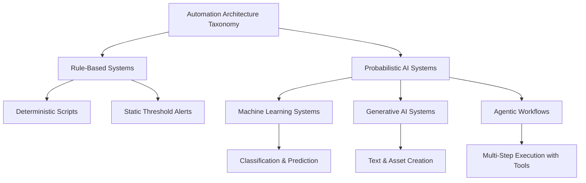

> **Complexity**: `[QUICK]`
>
> **Time to Complete**: 60-75 min
>
> **Prerequisites**: Basic scripting literacy, basic infrastructure terminology, and curiosity about how automation fails

---

## Learning Outcomes

By the end of this module, you should be able to:

- Classify a given automation system into one of four AI architecture categories by identifying its operational mechanism and boundaries.
- Compare the risk profiles of rule-based systems, machine learning systems, generative AI, and agentic workflows when applied to infrastructure automation tasks.
- Design a trust boundary for an agentic workflow by mapping its destructive permissions to required human-approval gates.
- Evaluate the reliability of an AI-generated operational response by distinguishing between fluent language generation and factually grounded systemic reasoning.

## Why This Module Matters

Hypothetical scenario: an infrastructure engineer wakes up during an overnight incident and sees that the primary database is reporting severe query latency. The engineer pastes several pages of logs into a generative assistant and asks for an immediate remediation script. The response is formatted cleanly, names familiar database concepts, and presents the exact confidence of a runbook written by a senior operator. Under pressure, the engineer runs it and discovers too late that the script terminated healthy sessions and triggered a costly index rebuild during peak load.

That failure is not a story about a foolish engineer; it is a story about a missing taxonomy. The engineer treated fluent language as operational evidence, even though language quality and system understanding are different properties. A deterministic script, a statistical classifier, a generative language model, and an autonomous agent can all be sold under the same "AI-powered" label, but they fail in different ways and deserve different boundaries. This module gives you the vocabulary to separate the marketing wrapper from the mechanism that actually makes decisions.

Modern platform teams are not deciding whether AI exists in their workflow, because it already appears in alert triage, code review, search, anomaly detection, documentation, ticket routing, and experimental remediation tools. The practical question is narrower and more useful: what kind of system is this, what evidence does it use, what can it change, and who remains accountable when it is wrong? If you can answer those questions, you can use AI as an engineering component instead of treating it as magic, novelty, or a blanket ban.

The module is intentionally grounded in infrastructure work rather than abstract philosophy. You will learn how ordinary software differs from probabilistic systems, how four common AI-adjacent architectures behave, why agentic workflows need special scrutiny, and how to place trust boundaries around tools before they touch production. Later modules will go deeper into large language models, prompts, agents, and Kubernetes 1.35+ workflows, so this first lesson builds the safety vocabulary that makes those deeper topics easier to reason about.

## AI vs Ordinary Software

Traditional software engineering relies on explicit decisions written by people. A developer describes the condition, the program checks that condition, and the program performs the corresponding action. This is why ordinary infrastructure automation can be tested with familiar techniques such as unit tests, dry runs, static analysis, code review, and staged rollout. If the same input enters the same deterministic program in the same state, you expect the same output, and when that expectation fails you can usually trace the path through the code.

That determinism is not primitive or outdated; it is the reason much of production infrastructure works at all. A deployment controller reconciles actual state toward desired state, a linter rejects a known-invalid manifest, and a threshold alert fires when a metric crosses a configured boundary. These systems can still be complicated, buggy, and poorly designed, but their decision logic is inspectable. You can ask where the condition is defined, who changed it, which branch executed, and why the resulting action followed from the input.

The simplest form of this thinking looks like the kind of logic many engineers write in scripts, controllers, and runbooks. The code below is intentionally small, but the important property is not its size. The important property is that a human authored the conditions and the resulting behavior is expected to be repeatable.

```text
if (cpu_utilization_percentage > 80) {
    execute_scale_up_procedure();
} else if (cpu_utilization_percentage < 20) {
    execute_scale_down_procedure();
} else {
    maintain_current_replica_count();
}
```

Artificial intelligence systems, as the term is used in modern engineering practice, usually introduce statistical generalization. Instead of a human writing every branch, the system is trained, tuned, or prompted to infer patterns from data and apply those patterns to new inputs. The system may classify a support ticket, predict future demand, generate text, summarize logs, recommend a configuration, or decide which tool to call next. That extra flexibility is useful precisely because the space of possible inputs is too large, ambiguous, or fluid for ordinary hand-written rules to cover comfortably.

The tradeoff is that statistical generalization changes the shape of verification. You no longer prove correctness only by reading a branch and checking a known condition. You also ask what data shaped the model, whether the current situation resembles that data, how the system represents uncertainty, what it does when evidence is incomplete, and whether the output can be independently checked. In other words, AI does not remove engineering discipline; it moves more of that discipline into evaluation, monitoring, and boundary design.

Pause and predict: if a deterministic scaling script and a trained forecasting model both face a traffic spike caused by a campaign that has never happened before, which one fails more visibly and which one might fail more persuasively? The deterministic script may be obviously limited because it only checks a current metric, while the model may produce a confident forecast based on historical patterns that no longer apply. That difference matters because obvious brittleness often receives faster skepticism than polished probabilistic output.

It helps to think of ordinary software as a recipe and many AI systems as an experienced but imperfect taster. A recipe says that if the oven is at a certain temperature and the timer reaches a certain point, you take the dish out. The taster can recognize patterns that are hard to encode, such as smell, texture, and context, but can also be fooled by unfamiliar ingredients or misleading presentation. Good kitchens use both: recipes for repeatability, judgment for ambiguity, and clear rules for when judgment must not override safety.

The same hybrid mindset belongs in infrastructure. You might use deterministic validation to block dangerous Kubernetes manifests, machine learning to surface unusual metric patterns, a generative model to draft an incident summary, and an agentic workflow to collect diagnostic evidence. Each tool can be valuable, but each belongs behind a boundary that matches its failure mode. The mistake is not using AI; the mistake is giving an ambiguous, probabilistic system the same unchecked authority you would give to a small deterministic script.

## The Four Categories You Will Actually Meet

The word "AI" is too broad to guide operational decisions by itself. A vendor demo, an internal tool name, or a dashboard badge can hide the mechanism that matters most to an engineer. Before you decide whether a system is safe, useful, or overhyped, classify it by how it reaches conclusions and what kind of action it can take. The four categories below are not the only possible taxonomy, but they are practical enough for day-to-day platform work.



Rule-based systems are the familiar foundation. They include scripts, static thresholds, policy checks, hand-authored decision trees, and many conventional controllers. Their strength is traceability: a reviewer can inspect the rule, reproduce the input, and understand why the action happened. Their weakness is that they do not generalize beyond the situations someone anticipated. When a new log format, directory layout, traffic pattern, or workload behavior appears, the rule either misses it, mishandles it, or needs a person to update the logic.

Machine learning systems generalize from examples. In infrastructure contexts, they often classify events, cluster logs, rank alerts, detect anomalies, forecast demand, or estimate risk. These systems are valuable when the relevant signal is distributed across many inputs and would be awkward to capture with static thresholds. Their weakness is not mystical opacity; their weakness is dependence on data quality and representativeness. If current behavior drifts away from training behavior, a once-useful model can become confidently stale.

Generative AI systems produce new content rather than only selecting from a fixed set of labels. A large language model can draft a runbook, explain a stack trace, translate a vague request into a configuration skeleton, or summarize a long incident thread. The attractive property is fluency across many domains, which makes the tool feel like a general collaborator. The dangerous property is the same fluency, because the model can generate plausible statements without having grounded evidence that those statements are true for your environment.

Agentic workflows combine generative or reasoning-oriented models with tools. Instead of only answering a question, the system may plan steps, call APIs, query logs, run commands, inspect results, and choose the next action. This is where the operational blast radius grows quickly. An agent with read-only access to logs is different from an agent that can patch deployments, rotate credentials, delete resources, approve pull requests, or execute database migrations. The model's reasoning quality matters, but the permission boundary matters just as much.

To understand the mechanical contrast between hand-authored logic and learned behavior, compare the earlier branch-based example with a simplified model-driven flow. The model does not contain a neat list of human-written conditions for every possible metric combination. Instead, it applies learned weights to current telemetry and produces a score that another rule may consume.

```text
historical_model_weights = load_trained_anomaly_model()
current_system_metrics = fetch_live_telemetry_data()
anomaly_probability_score = calculate_probability(current_system_metrics, historical_model_weights)

if (anomaly_probability_score > 0.95) {
    trigger_high_severity_incident_alert()
}
```

Notice that the final decision may still contain a deterministic threshold. Many real systems are hybrids, and that is why taxonomy must focus on the decision mechanism rather than the product label. A model may produce a probability score, a rule may decide whether that score triggers a page, and a human may decide whether remediation is appropriate. When you map the chain this way, you can test the deterministic parts, monitor the probabilistic parts, and place approvals around the parts that alter state.

Which approach would you choose here and why: a static CPU threshold for a small internal service with predictable load, or a forecasting model for a consumer-facing service whose demand changes around public events? The threshold is easier to audit and may be completely adequate for the small service. The forecasting model may be worth its extra complexity for the consumer-facing service, but only if you monitor drift, compare predictions with reality, and keep deterministic safety limits around scaling cost and capacity.

The categories also differ in what evidence should make you trust them. A rule-based system earns trust through code review, explicit tests, and operational history. A machine learning system earns trust through evaluation data, drift monitoring, confidence calibration, and comparison with baselines. A generative system earns narrow trust when its output is checked against authoritative sources or executable tests. An agentic workflow earns permission only when identity, tools, approvals, logs, and rollback paths are designed before autonomy is enabled.

| System Category | Typical Operational Use Case | Primary Failure Domain | Required Trust Boundary |
|-----------------|------------------------------|------------------------|-------------------------|
| Rule-Based Systems | Static threshold alerting and deterministic configuration | Brittleness when encountering unprecedented edge cases | Standard peer review and unit testing |
| Machine Learning | Predictive autoscaling and anomaly detection | Degradation due to training data drift and historical bias | Continuous confidence score monitoring and fallback rules |
| Generative AI | Documentation synthesis and incident summary drafting | Plausible but completely fabricated technical details | Mandatory independent verification against authoritative sources |
| Agentic Workflows | Autonomous alert remediation and infrastructure provisioning | Unbounded execution loops and destructive state changes | Strict human-in-the-loop approval gates for all actions |

Use the table as a first-pass review checklist, not as a rigid academic definition. Real systems can cross boundaries, and the most interesting operational systems often do. A ticket router might use a machine learning classifier, then ask a language model to draft a response, then let an agent update the ticket. The safe design question is therefore not "Is this AI?" but "Which step uses which mechanism, what evidence supports it, and what action can follow from it?"

## Worked Example: Debugging an Agentic Failure

Exercise scenario: a platform team introduces an autonomous remediation workflow for a staging cluster. The workflow watches deployment events, reads application logs, queries metrics, and can roll back a deployment when it concludes that a new release is unhealthy. The team gives it broad permissions because the environment is not production, and they expect the tool to behave like the deterministic rollback step in their existing delivery pipeline. That expectation is the first design error.

During a routine release, developers change the application logging format so that verbose diagnostic messages are written to the standard error stream. The application is healthy, request latency is stable, and user-facing error rates are unchanged. The agent, however, asks a generative model to interpret the new logs, receives an alarming summary, and decides that the release is failing. It calls the deployment tool, rolls the service back, observes that the new log pattern disappeared, and treats the disappearance as confirmation that its action was correct.

The resulting loop is easy to miss if you debug it with the wrong mental model. A deterministic rollback rule would usually point to a visible condition such as "HTTP error rate greater than threshold after rollout." In this case, the harmful condition lives across several layers: a generative interpretation of logs, a planning loop that treats its own action as evidence, and a permission boundary that allows state changes without a second signal. The bug is not only in a prompt, a model, or a threshold. The bug is in the workflow design.

The first diagnostic move is to separate observation from action. Read-only investigation can often be delegated earlier than write access because a mistaken summary is recoverable when a human reviews it before change. State-altering steps deserve stronger evidence, especially when they can undo work, delete data, scale systems aggressively, rotate credentials, or modify network policy. In this scenario, the agent should have been allowed to collect logs and metrics, but a rollback should have required deterministic corroboration and a human approval gate.

The second diagnostic move is to require independent signals before an autonomous workflow concludes that remediation worked. If the agent rolls back a deployment and then says the problem disappeared because the logs changed, it may simply be observing the consequence of its own rollback. A safer design asks whether user-facing health improved, whether the original symptom was real, and whether the action affected the intended causal path. This is ordinary incident thinking applied to a new automation shape.

Before running a similar workflow in your own environment, what output would you expect from each stage if the release is healthy but noisy? A good design would show the log summary as uncertain, keep latency and error-rate checks green, refuse rollback because the signals disagree, and ask a human to decide whether the logging change needs cleanup. A poor design would convert scary text into a high-severity conclusion and then let tool access turn that conclusion into state change.

Here is a useful way to review the failure without being distracted by the product interface. The language model produced an interpretation, the planning loop chose an action, the tool permission allowed that action, and the environment produced feedback. Each boundary is a place where engineering controls can be added. You can constrain the model's task, require structured evidence, limit the tool, add approval, log the decision, and enforce rollback limits that stop repeated actions.

When teams skip this boundary review, agentic systems can inherit the broad permissions of the humans who installed them. That is a bad default because the agent lacks the human's situational awareness, social accountability, and ability to pause when a conclusion feels wrong. Least privilege is not merely a security slogan here; it is a reliability control. The agent should have the smallest set of read and write capabilities needed for the narrow workflow, and destructive permissions should be separated behind explicit approval.

The practical lesson is that autonomy should be earned in layers. Start with read-only diagnostics, compare the agent's findings with known-good runbooks, measure false positives, add deterministic cross-checks, then consider low-risk actions with automatic rollback. Only after that evidence exists should a team discuss broader write access, and even then the scope should be narrow. If a workflow cannot explain what evidence justified an action, it is not ready to perform that action without review.

## Evaluating Trust and Establishing Boundaries

Trust is not a single switch. A tool can be trustworthy for drafting a summary and untrustworthy for executing a migration; useful for suggesting a Kubernetes manifest and unsafe for applying it; excellent at finding related documentation and weak at deciding whether your production database is healthy. The safest teams avoid global judgments such as "we trust this AI" or "we do not use AI." They define task-specific trust, evidence-specific trust, and permission-specific trust.

Begin by naming the task. "Help with incidents" is too vague to secure or evaluate, while "summarize recent log lines from this namespace without changing resources" is concrete. A concrete task tells you which inputs matter, what output format is expected, which checks are possible, and what damage could occur. This is especially important for generative tools because their conversational interface can make a broad request feel harmless even when the implied work spans diagnosis, planning, and execution.

Next, name the mechanism. If the system uses a rule, you can inspect the rule. If it uses a model, you can ask what data shaped the model and how current inputs are monitored for drift. If it generates text, you can ask what retrieval, citations, tests, or human review ground the output. If it calls tools, you can ask which identity it uses, which commands are allowed, where approvals happen, and how every action is logged for audit and rollback.

Then name the blast radius. A bad recommendation in a draft document wastes review time; a bad recommendation applied to a cluster can delete workloads. A false anomaly alert may wake someone unnecessarily; an autonomous remediation loop may flap a service for an hour. The same model output can be low risk or high risk depending on what follows it. That is why the permission boundary is often more important than the model family when you design production controls.

Evaluation should also match the category. For rule-based systems, test representative inputs and edge cases. For machine learning systems, compare predictions with labeled examples, track drift, and watch whether confidence remains calibrated over time. For generative systems, verify claims against primary sources, run generated code in isolated environments, and require reviewers to understand the domain. For agentic workflows, test not only the answer quality but the entire loop of planning, tool use, observation, retry, stopping, and escalation.

The most dangerous moment is when a tool moves from advisory to authoritative. Advisory tools can be wrong while still saving time, because a person decides what to accept. Authoritative tools can be wrong and immediately change reality. This does not mean authoritative automation is forbidden; Kubernetes controllers are authoritative automation, and infrastructure depends on them. The difference is that mature controllers are constrained by explicit desired state, well-defined APIs, reconciliation semantics, and extensive operational experience. New AI agents need comparable constraints before they deserve comparable authority.

For a first review, write a simple boundary statement. A good boundary statement might say: "This assistant may read logs and metrics for the staging namespace, summarize likely causes, and draft a rollback plan, but it may not execute changes; any rollback requires a named human approver and must cite at least two deterministic health signals." That sentence is more valuable than a broad policy slogan because it names scope, action, evidence, and approval. It also gives reviewers something testable.

Human approval should not be treated as a decorative checkbox. A tired engineer clicking "approve" on a dense model-generated plan without evidence is not a meaningful control. A useful approval gate presents the proposed action, the evidence, the confidence limits, the affected resources, the rollback path, and the reason alternatives were rejected. The goal is not to slow every workflow forever; the goal is to make dangerous actions legible enough that a responsible person can catch a bad inference before it becomes an outage.

Finally, keep a record of AI-assisted decisions the same way you keep records for deployments and incidents. You want to know which prompt or input triggered a recommendation, what sources or telemetry the system used, which tool calls happened, who approved them, and what changed afterward. Without that audit trail, post-incident review becomes guesswork. With it, AI becomes another observable part of the system, subject to the same engineering habits as any other component.

## Reading AI Outputs Like Operational Evidence

An AI output should be read as a claim that needs a support trail, not as a conclusion that arrives fully verified. This is a small mental shift with large practical consequences. When a model says a service is unhealthy, ask which signals support that claim. When it proposes a command, ask which API version, permissions, and preconditions the command assumes. When it summarizes a document, ask which source lines or events are being compressed and which details may have been omitted.

This habit is familiar from incident response. A graph, log line, alert, and user report can each be true while still being incomplete. Engineers learn to correlate evidence because one signal rarely tells the whole story. AI output deserves the same treatment, especially because it often arrives in a smooth narrative that hides uncertainty. A smooth narrative can make weak evidence feel complete, so your job is to pull the evidence back into view before allowing the output to influence action.

For generative systems, the first question is whether the output is grounded in something inspectable. Grounding might be a link to official documentation, a snippet from a repository file, a query result from a monitoring system, or a test run in an isolated environment. Without grounding, the output may still be useful as a brainstorm, but it should not be treated as operational evidence. The more specific and risky the recommendation, the more specific the grounding needs to be.

For machine learning systems, the first question is whether the current case resembles the cases used for evaluation. A model trained on weekday traffic may behave poorly during a one-time public launch. A model trained on a previous logging format may overreact after a structured logging migration. A model trained on past support tickets may route new product issues to the wrong team. The model does not need malicious input to fail; ordinary change can be enough to make its learned pattern less reliable.

For agentic systems, the first question is whether the workflow can stop. A good agent has a clear goal, limited tools, bounded retries, escalation rules, and logs that show why each step happened. A weak agent keeps trying because every observation becomes an invitation to take another action. This matters because a human operator can notice that a loop has become absurd, while an automated workflow may need an explicit stopping rule. A stop condition is a reliability feature, not an implementation detail.

You can also evaluate AI output by separating syntax, semantics, and suitability. Syntax asks whether the output is well formed, such as valid YAML or a command that parses. Semantics asks whether the output means what the author intends, such as selecting the correct resource or applying the correct policy. Suitability asks whether the output belongs in this environment at this time, given your cluster version, risk tolerance, maintenance window, and rollback path. Many model-generated artifacts pass syntax while failing suitability.

That distinction is especially important in infrastructure education. A generated manifest can look valid while assuming an API field that is not available in your Kubernetes 1.35+ cluster, or it can be technically valid while violating your organization's policy. A generated incident summary can be readable while overemphasizing the loudest log line and ignoring the metric that actually shows user impact. A generated command can be syntactically correct while targeting the wrong namespace. The review must go beyond appearance.

Pause and predict: if a model gives you a remediation plan with three commands, which part is most likely to fool a rushed reviewer: invalid syntax, a wrong causal assumption, or an unsafe blast radius? Invalid syntax is often caught quickly by tools. Wrong causal assumptions and unsafe blast radius are harder because they can be hidden behind plausible explanations. That is why strong review asks not only "Will this run?" but also "Why should this action fix this symptom, and what else could it affect?"

One practical review technique is to turn the output into a checklist of claims. If the assistant says a deployment failed because readiness probes are timing out, the claims might be: the deployment changed recently, pods are failing readiness, the readiness failure started after the change, user-facing errors correlate with the failure, and rolling back would address the cause. Each claim can be checked independently. If several claims are unverified, the plan is not ready for execution.

Another technique is to require a reversible first step. Instead of allowing an assistant to patch production immediately, ask it to propose a read-only query, a dry run, or a staging reproduction that would increase confidence. This keeps the workflow useful while preserving human judgment around irreversible steps. In mature systems, the same idea becomes policy: read widely, write narrowly, and require approval when the proposed change crosses a risk threshold. That policy is how teams convert AI assistance into controlled automation.

The final review question is accountability. If an AI-assisted action causes damage, the organization still owns the outcome. The model does not attend the post-incident review, explain why permissions were broad, or decide how customers should be informed. People do those things, so people must design the controls before the action happens. Treating AI output as operational evidence keeps accountability where it belongs: with the engineers who decide which systems may act and under what conditions.

## Patterns & Anti-Patterns

The strongest pattern is to pair probabilistic judgment with deterministic guardrails. A model can notice that a metric pattern looks unusual, but a rule can cap maximum scale-out, require minimum evidence, or block changes outside an approved maintenance window. This combination gives you flexibility without letting ambiguity make irreversible decisions. It also makes testing easier because you can evaluate the model's recommendation separately from the policy that decides whether action is allowed.

A second useful pattern is staged autonomy. Start with suggestions, then read-only investigation, then low-risk changes, then narrowly scoped write actions with approvals, and only later consider broader automation. Each stage should have measured evidence that the previous stage works well enough. This pattern keeps excitement from outrunning observability and gives the team time to learn where the system is brittle. It also creates a natural rollback path for the automation itself.

A third pattern is source-grounded generation. If a generative model drafts a Kubernetes configuration, an incident summary, or a security recommendation, require it to point to primary documentation, live telemetry, repository files, or test results that can be checked. The model's fluency is useful for synthesis, but the grounding evidence is what lets a reviewer decide whether the synthesis is safe. This is especially important for learners, because polished explanations can hide missing assumptions.

The first anti-pattern is category collapse: treating every tool with an AI label as the same kind of thing. Teams fall into this because vendor language is broad and internal conversations often optimize for speed. The better approach is to name the mechanism in architecture reviews. Say "a classifier ranks alerts," "a language model drafts the summary," or "an agent calls the deployment API." Specific nouns force specific controls.

The second anti-pattern is permission inheritance. A human installs a tool, authenticates it with broad credentials, and accidentally gives the automation the same reach the human has. This is convenient during a demo and dangerous in operations. The better approach is to create purpose-specific identities with narrow read scopes, separate write permissions, and visible audit logs. If the tool needs more access later, the request should be reviewed like any other privilege expansion.

The third anti-pattern is using AI where the rule is already simple and sufficient. A static threshold, schema validation rule, or policy-as-code check may be boring, but boring is often the right answer when the condition is clear. Adding a model can introduce nondeterminism, training concerns, and new monitoring needs without improving the outcome. Use AI when ambiguity, scale, or language makes ordinary rules impractical, not merely because the interface feels modern.

## When You'd Use This vs Alternatives

Use a rule-based system when the condition is explicit, the action is well understood, and predictability matters more than flexibility. Examples include rejecting manifests that lack required labels, blocking privileged containers by policy, or paging when a known saturation metric crosses a defined threshold. The rule may need maintenance, but its behavior can be reviewed before it runs. That reviewability is valuable when the cost of a mistaken action is high.

Use machine learning when patterns are too large or subtle for comfortable manual rules, and when you can collect enough representative data to evaluate performance. Forecasting demand, clustering noisy logs, ranking related incidents, and detecting unusual combinations of metrics can fit this category. The key requirement is feedback. If nobody measures whether predictions remain useful, the model becomes an expensive source of stale confidence.

Use generative AI when the task involves language, synthesis, transformation, or drafting, and when a person or deterministic process can verify the result. It is reasonable to ask for a first draft of documentation, a summary of a long thread, or a starting point for a configuration. It is reckless to treat that draft as authoritative without checking it. Generative output should accelerate expert review, not replace the need for expertise where consequences matter.

Use an agentic workflow when the work genuinely requires multiple steps, tool calls, observation, and adaptation, and when the workflow has been bounded like any other automation with production impact. A read-only diagnostic agent can be a sensible early use case because it gathers context without altering state. A write-capable remediation agent should arrive later, after the team has evidence, guardrails, approval gates, and a clear stop condition. Autonomy is a design choice, not a default setting.

If you are unsure which category fits, trace the input-to-action path. Ask what data enters, what mechanism transforms it, what output is produced, what action follows, and what evidence can disprove the conclusion. A system that cannot answer those questions clearly should remain advisory until it can. Engineering maturity often looks like slowing down at the exact point where a demo looks effortless.

## Did You Know?

- The OECD updated its definition of an AI system in 2023 to emphasize machine-based systems that infer from inputs and generate outputs such as predictions, content, recommendations, or decisions.
- The NIST AI Risk Management Framework was released as version 1.0 in January 2023 and organizes AI risk work around govern, map, measure, and manage functions.
- Many production "AI" features are hybrids: a model may rank or generate, while ordinary rules still decide thresholds, permissions, routing, and final execution.
- A language model can produce a valid-looking configuration for a version your cluster does not run, which is why these modules assume Kubernetes 1.35+ and still require documentation checks.

## Common Mistakes

| Mistake | Why It Happens | How to Fix It |
|---------|----------------|---------------|
| Treating all AI systems as a single, uniform technology category | The product label hides whether the system is a rule, classifier, generator, or agent, so reviewers discuss it too vaguely. | Categorize every new tool by its specific underlying architectural mechanism before approving its use. |
| Assuming linguistic fluency guarantees technical correctness | Polished prose feels like expertise, especially during incidents when people want a clear answer quickly. | Rigorously verify all generative outputs against official documentation, tests, or live telemetry before acting. |
| Using "AI" as a shortcut term in architectural design discussions | Broad language avoids hard questions about evidence, permissions, and failure modes. | Explicitly name the actual capability being used, such as "probabilistic classifier" or "tool-calling agent." |
| Assuming machine learning systems are infallible black boxes | Teams may focus on model novelty and forget that predictions depend on data quality and representativeness. | Implement continuous monitoring of prediction confidence, drift, and baseline comparisons with fallback rules. |
| Dismissing all probabilistic systems entirely due to marketing hype | Frustration with vague claims can make teams ignore useful classification, forecasting, and summarization tools. | Separate vendor marketing claims from the actual verifiable capabilities and risks of the system. |
| Trusting generative models most on tasks you understand the least | The model's answer may be the only explanation a learner sees, making errors harder to detect. | Use AI primarily to accelerate tasks you can review, and bring in authoritative references for unfamiliar domains. |
| Deploying agentic workflows without human approval gates | Demo environments reward fast autonomy, while production environments punish unbounded state changes. | Mandate human-in-the-loop authorization for destructive actions and narrowly scope every tool permission. |

## Quiz

<details>
<summary>1. Your team wants to deploy a system that automatically categorizes incoming support tickets based on historical resolution data. Which architectural category best describes this tool, and what risk should you test first?</summary>

This is a machine learning system because it uses historical examples to classify new tickets. The first risk to test is whether the historical data still represents current support patterns, because new products, new incident types, or changed team ownership can create data drift. A rule-based system would rely on explicit conditions, which is not the main mechanism here. A generative system might draft a response, and an agent might update tickets through tools, but the categorization step is a classifier.

</details>

<details>
<summary>2. A vendor pitches an "AI DevOps Assistant" that writes infrastructure-as-code templates from natural language prompts. Why is this riskier than a deterministic configuration linter?</summary>

The assistant is a generative AI system, so it can produce plausible new content that has not been validated against your exact platform rules. A deterministic linter checks known conditions and can explain which rule failed, while the generator may invent deprecated fields, omit required constraints, or produce insecure defaults with confident wording. The correct response is not to ban all generation, but to require review, tests, and primary documentation checks before use. The linter and the generator solve different problems and need different trust boundaries.

</details>

<details>
<summary>3. During an incident, an engineer uses a language model to generate a database recovery plan. The plan is clear, detailed, and full of familiar terms. How should the engineer evaluate the reliability of that AI-generated operational response?</summary>

The engineer should treat fluency as a presentation quality rather than evidence of correctness. Reliability comes from checking every command against authoritative documentation, current system state, backups, and a peer review path appropriate to the blast radius. The model may still be useful for organizing possibilities, but it cannot prove that the recovery plan matches the live database. The safest next step is to convert the draft into a reviewed runbook, not to run it because it sounds confident.

</details>

<details>
<summary>4. Your organization wants an autonomous agent to detect vulnerabilities and automatically patch running workloads. What trust boundary must be designed before write access is enabled?</summary>

The workflow needs a human-approval gate for state-changing actions, narrow tool permissions, and deterministic evidence requirements before any patch is applied. Vulnerability detection can involve probabilistic interpretation, and patching can restart workloads, break compatibility, or change security posture. Read-only investigation may be allowed earlier, but automatic remediation needs stronger controls because the action changes production state. A safe design maps each destructive permission to an approver, an audit record, and a rollback plan.

</details>

<details>
<summary>5. A legacy alert pages whenever CPU utilization exceeds a threshold for several minutes. A new engineer suggests replacing it with an AI model. What comparison should the team make before changing the design?</summary>

The team should compare the current rule's known limitations with the model's expected benefits and new failure modes. If the threshold is simple, reliable, and easy to tune, replacing it may add drift monitoring, explainability concerns, and operational uncertainty without improving outcomes. If the real problem is complex demand forecasting, a model may be justified, but it should be evaluated against historical and recent incidents. The right question is not whether AI is newer, but whether the mechanism fits the problem.

</details>

<details>
<summary>6. An agent repeatedly rolls back a healthy deployment because it misreads a noisy log format. Which part of the design should you debug first: the model, the tool permissions, or the evidence gate?</summary>

Start with the evidence gate and permission boundary, because the system should not be able to convert a single uncertain log interpretation into repeated state changes. The model may also need improvement, but model quality alone is a weak control when actions are destructive. The workflow should require independent health signals such as error rate, latency, and readiness before rollback is allowed. It should also limit repeated actions and require human approval when signals disagree.

</details>

<details>
<summary>7. A generated Kubernetes manifest appears valid, but the assistant does not cite the Kubernetes version or documentation source. What should you do before applying it to a Kubernetes 1.35+ cluster?</summary>

You should validate the manifest against the Kubernetes 1.35+ API behavior and your cluster policies before applying it. The assistant may have generated a field from an older version, a future proposal, or another tool's schema. A dry run, schema validation, policy check, and review against official documentation provide better evidence than the model's wording. The generated manifest can be a useful draft, but applying it without verification would confuse fluency with compatibility.

</details>

## Hands-On Exercise

In this exercise, you will analyze the operational risks of different automation architectures by designing appropriate trust boundaries for a hypothetical production environment. Your platform engineering team manages a fleet of stateless services and is evaluating three tools to reduce operational toil. For each tool, classify the architecture, identify the main failure mode, and decide what constraint must exist before the tool is used near production.

Exercise scenario: the first tool is a static script that deletes temporary cache files from nodes every Sunday at midnight. The second tool is a dashboard widget that analyzes historical traffic patterns and predicts when the team may need to scale resources for upcoming events. The third tool is an autonomous chat bot that can read alerts, query a production database for context, and independently execute schema migrations when it believes a mismatch exists. Treat the scenario as a design review, not a vendor evaluation.

### Tasks

- [ ] Classify each automation system into a category: rule-based system, machine learning system, generative AI system, or agentic workflow.
- [ ] Compare the risk profiles of the three tools by writing one likely failure mode and one likely blast-radius concern for each tool.
- [ ] Design a trust boundary for the agentic workflow by mapping every destructive permission to a required human-approval gate.
- [ ] Evaluate the reliability of any AI-generated operational response by listing the external evidence you would require before acting on it.
- [ ] Decide which tool, if any, could safely start in advisory or read-only mode and explain what evidence would justify additional autonomy later.

<details>
<summary>Suggested solution</summary>

The cache cleanup script is a rule-based system because a person defines the schedule and deletion behavior explicitly. Its main failure mode is brittleness around unexpected directory structures, unsafe path expansion, or a changed node layout, so the boundary should include dry runs, path allowlists, and review before it runs broadly. The traffic predictor is a machine learning system because it forecasts demand from historical data, so its main failure mode is drift when upcoming events differ from the past; it should remain advisory until predictions are compared with current plans and recent telemetry. The chat bot is an agentic workflow because it interprets alerts, queries tools, plans actions, and can execute migrations. It needs the strongest boundary: read-only access by default, no migration execution without named human approval, deterministic health and schema evidence, audit logs for every tool call, and a rollback plan for any approved change.

</details>

### Success Criteria

- [ ] You have classified the static script as a rule-based system and noted that its primary failure mode is brittleness when encountering unexpected directory structures.
- [ ] You have classified the traffic predictor as a machine learning system and established a constraint that its predictions must be verified against current event plans to account for data drift.
- [ ] You have accurately classified the autonomous chat bot as an agentic workflow, recognizing that it carries the highest operational risk.
- [ ] You have designed a trust boundary that prevents the chat bot from executing a database migration without explicit authorization from a senior engineer.
- [ ] You have compared the risk profiles of rule-based, machine learning, generative AI, and agentic approaches using mechanism, evidence, and blast radius rather than product labels.
- [ ] You have explained how to evaluate the reliability of an AI-generated operational response before using it in an infrastructure workflow.

## Sources

- [OECD AI Principles Overview](https://oecd.ai/ai-principles/)
- [What is AI? Can you make a clear distinction between AI and non-AI systems?](https://oecd.ai/en/wonk/definition-)
- [Does ChatGPT tell the truth?](https://help.openai.com/en/articles/8313428-does-chatgpt-tell-the-truth%3F.pls)
- [NIST AI Risk Management Framework](https://www.nist.gov/itl/ai-risk-management-framework)
- [NIST AI Risk Management Framework 1.0 PDF](https://nvlpubs.nist.gov/nistpubs/ai/NIST.AI.100-1.pdf)
- [Google Cloud: MLOps continuous delivery and automation pipelines in machine learning](https://cloud.google.com/architecture/mlops-continuous-delivery-and-automation-pipelines-in-machine-learning)
- [Microsoft Azure Machine Learning: monitor models in production](https://learn.microsoft.com/en-us/azure/machine-learning/concept-model-monitoring?view=azureml-api-2)
- [AWS SageMaker model monitor documentation](https://docs.aws.amazon.com/sagemaker/latest/dg/model-monitor.html)
- [Kubernetes concepts overview](https://kubernetes.io/docs/concepts/overview/)
- [Kubernetes configuration overview](https://kubernetes.io/docs/concepts/configuration/overview/)
- [OWASP Top 10 for Large Language Model Applications](https://genai.owasp.org/llmrisk/llm-top-10-risk/)

## Next Module

Continue to [What Are LLMs?](./module-1.2-what-are-llms/) to connect this taxonomy to the specific model family behind many modern generative tools.
