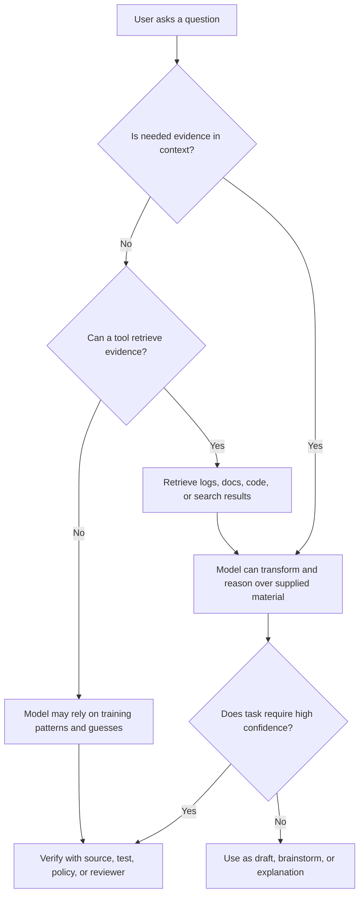
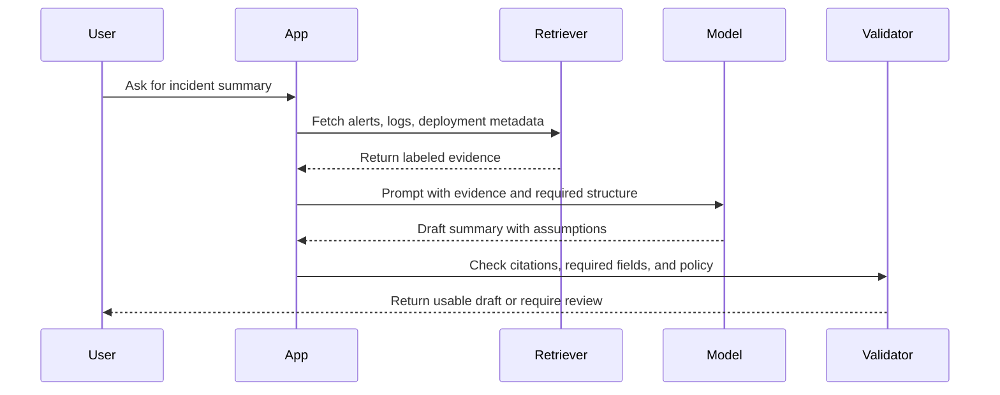
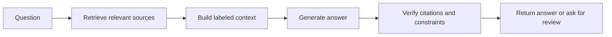

# What Are LLMs?

> **AI Foundations** | Complexity: `[QUICK]` | Time: 40-55 min | Prerequisites: Module 1.1 or equivalent comfort with basic AI terminology

## Learning Outcomes

By the end of this module, you should be able to evaluate whether a language-model task needs generation, retrieval, verification, or a combination of those capabilities.

You should be able to analyze how tokens, context windows, and next-token prediction shape the quality and failure modes of an LLM response.

You should be able to compare LLMs with search engines, databases, rules engines, and human reviewers when choosing a tool for a real workflow.

You should be able to design a prompt boundary that gives an LLM enough context, constrains the output, and makes uncertainty visible instead of hidden.

You should be able to debug a poor LLM answer by checking task fit, missing context, ambiguous instructions, unsupported claims, and verification gaps.

## Why This Module Matters

A platform engineer named Lina is asked to speed up incident write-ups by using an LLM inside the team's operational workflow. The first draft looks excellent: it is calm, structured, and full of confident explanations about why a deployment failed. Then the on-call lead notices a serious problem. The model mentioned a database timeout that never happened, omitted the actual image-pull error, and invented a remediation step that would have made the next rollout slower.

Nobody on Lina's team was careless in an obvious way. They made a subtler mistake: they treated fluent language as if it were grounded analysis. The model was useful, but the team had not decided which parts of the task required summarization, which parts required log retrieval, and which parts required human verification. The failure was not just a "bad prompt"; it was a bad mental model of what the system was doing.

This module gives you that mental model. You will learn why large language models are powerful enough to draft, explain, transform, and assist with technical work, while still being unreliable when a task demands current facts, precise evidence, or accountable judgment. The goal is not cynicism. The goal is disciplined use: knowing what the model can help with, what it cannot guarantee, and how to shape a workflow so the useful parts are captured without letting fluent mistakes escape review.

## Start With The Simplest Honest Description

An LLM is a model trained on large amounts of text to predict a likely next token from the tokens already present in its context. That description is intentionally plain because it keeps the core mechanism visible. The model is not opening a dictionary, consulting a private database, or deciding what is morally true in the human sense. It is generating the next piece of text from learned statistical structure and the information currently available.

That simple mechanism can still produce surprisingly capable behavior because language carries a huge amount of structure. A sentence can encode a command, a policy, a bug report, a proof sketch, a deployment plan, a joke, or a warning. When a model learns patterns across enormous text collections, it learns many relationships between words, formats, concepts, styles, and tasks. At useful scale, next-token prediction becomes a flexible interface for drafting, rewriting, summarizing, translating, classifying, and explaining.

The sentence to keep in your head is this: prediction is not the same as understanding. That does not mean prediction is useless, and it does not mean the model is pretending in every ordinary sense. It means you should not treat an impressive answer as evidence that the model has grounded knowledge, stable intent, or an internal obligation to be truthful. The output is language that fits the context, and fitting the context is related to truth only when the context and task make truth available.

A beginner often asks, "Does the model understand?" A more useful practitioner question is, "What evidence did the model have, what transformation did I ask it to perform, and where could plausible language diverge from verified reality?" That shift turns an abstract debate into a workflow decision. You stop arguing with the model as if it were a person, and you start designing the interaction as a system with inputs, transformations, limits, and checks.

```ascii
+----------------------+        +------------------------+        +-----------------------+
| User task            |        | LLM generation         |        | User or system check  |
| "Explain this alert" | -----> | likely next tokens     | -----> | evidence and fit      |
| prompt + context     |        | fluent structured text |        | verify before action  |
+----------------------+        +------------------------+        +-----------------------+
```

This first diagram is deliberately small because it shows the minimum useful loop. The model receives a task and context, generates language, and then something outside the model must decide whether the result is good enough for the job. In a toy chat, that outside check may be your own judgment. In a production workflow, it may be retrieval, tests, policy validation, peer review, or an approval gate.

A senior mental model does not reduce the system to either magic or trivia. Calling an LLM "a mind" gives it too much credit and invites misplaced trust. Calling it "just autocomplete" gives it too little credit and hides why it can be valuable in real work. A better phrase is: an LLM is a powerful pattern-completion engine that uses language as its control surface and context as its working material.

That phrase has consequences. If the pattern is well represented, the context is relevant, and the requested output can tolerate variation, the model may perform extremely well. If the task depends on missing evidence, precise freshness, private data, or hard guarantees, the model can still sound good while being wrong. The same mechanism explains both the productivity boost and the risk.

### Active Learning Prompt: Classify The Task Before You Trust The Answer

Imagine a teammate asks an LLM, "What changed in our production cluster yesterday?" Before reading any generated answer, decide what the model would need in context to answer responsibly. Would training data be enough, would a search result be enough, or would the model need direct access to logs, Git history, deployment records, and timestamps?

A strong answer should say that the model cannot know yesterday's cluster changes from training alone. It needs retrieved operational evidence, and the final response should cite or summarize that evidence rather than merely sound plausible. If your first instinct was "ask the model and see," notice the hidden risk: a polished answer may feel like investigation even when no investigation happened.

### From Beginner Description To Practitioner Boundaries

At beginner level, "LLMs predict tokens" explains why they generate fluent text. At intermediate level, it explains why prompt shape, examples, and context placement affect results. At senior level, it explains why governance must treat model output as an untrusted transformation until the surrounding system supplies evidence and validation. The same concept grows with you; it is not a slogan to memorize and discard.

This is why the rest of the module focuses on tokens, context windows, prediction, and task fit. These are not isolated vocabulary terms. Together they explain what the model sees, how much it can use, how it produces output, why it can help, and where it fails. Once you can trace that path, LLM behavior becomes less mysterious and much easier to debug.

## Tokens: The Model's Working Units

Humans usually think in words, sentences, and paragraphs. LLMs operate over tokens, which are pieces of text converted into numeric identifiers before the model processes them. A token may be a whole word, part of a word, punctuation, whitespace, or a formatting marker. The exact split depends on the tokenizer used by the model family, so two systems may count the same text differently.

This matters because context windows, pricing, latency, and truncation are usually measured in tokens rather than pages or characters. A short-looking prompt with dense code, tables, paths, or unusual names can consume more tokens than expected. A long-looking paragraph with common words may be cheaper than it appears. Tokenization is not just an implementation detail; it changes what fits into the model's working space.

```ascii
+-------------------------------+
| Human text                    |
| "Restart pod api-7f9c safely" |
+---------------+---------------+
                |
                v
+------------------------------------------------+
| Tokenization                                   |
| "Restart" | " pod" | " api" | "-" | "7" | ... |
+---------------+--------------------------------+
                |
                v
+------------------------------------------------+
| Numeric token IDs                              |
| 18422 | 8457 | 5931 | 12 | 22 | ...           |
+---------------+--------------------------------+
                |
                v
+------------------------------------------------+
| Model computation                              |
| patterns over token IDs inside current context |
+------------------------------------------------+
```

The important lesson is not the exact token boundaries in the diagram. The lesson is that the model does not begin with human concepts in a clean symbolic form. It begins with token IDs, and the model's learned parameters shape how those IDs influence one another. Meaning emerges through patterns in the model, not through a separate dictionary lookup that guarantees correctness.

You can inspect an approximate tokenization effect with a tiny local script. This is not a real production tokenizer, because real tokenizers use model-specific vocabularies and merge rules. It is still useful because it shows why punctuation, paths, casing, and identifiers can split text into more pieces than a human expects.

```python
import re

samples = [
    "Restart pod api-7f9c safely.",
    "Restart the application pod safely.",
    "kubectl rollout status deployment/api --timeout=90s",
]

pattern = re.compile(r"[A-Za-z]+|[0-9]+|[^A-Za-z0-9\s]")

for sample in samples:
    pieces = pattern.findall(sample)
    print(sample)
    print(pieces)
    print(f"approx_piece_count={len(pieces)}")
    print()
```

To run that example from the repository root, save it as a scratch file or paste it into a Python heredoc. Use the project virtual environment when you run Python in this repository, because the project rules require explicit use of `.venv/bin/python` rather than a system interpreter.

```bash
.venv/bin/python - <<'PY'
import re

samples = [
    "Restart pod api-7f9c safely.",
    "Restart the application pod safely.",
    "kubectl rollout status deployment/api --timeout=90s",
]

pattern = re.compile(r"[A-Za-z]+|[0-9]+|[^A-Za-z0-9\s]")

for sample in samples:
    pieces = pattern.findall(sample)
    print(sample)
    print(pieces)
    print(f"approx_piece_count={len(pieces)}")
    print()
PY
```

The output will show that technical identifiers break into multiple pieces. That is one reason code, logs, stack traces, and command output can consume context quickly. It is also one reason models sometimes struggle with exact strings, rare identifiers, and small differences that humans can spot visually. The model can handle technical text, but you should not assume it sees every boundary the same way you do.

Tokens also explain why models can be sensitive to formatting. A markdown table, a JSON object, and a paragraph may carry the same human information while creating different token sequences. The model may find one form easier to continue accurately than another because the training data contained many examples in that format. Format is not decoration; it is part of the input signal.

| Text Shape | Tokenization Pressure | Practical Effect |
|---|---|---|
| Plain prose with common words | Usually efficient and pattern-rich | Good for explanation, rewriting, and summarization |
| Logs with IDs and timestamps | Often fragmented and dense | Requires careful filtering before sending to a model |
| Source code and stack traces | Structured but token-heavy | Works best when scoped to the relevant files or frames |
| Tables and JSON | Strong format signal but can be verbose | Useful when you need structured output or comparison |
| Long policy documents | Can exceed useful attention despite fitting | Needs chunking, retrieval, or targeted questions |

A useful design rule follows from the table: do not put every available byte into the prompt just because the context window is large. Put in the information that changes the answer. If the model needs to explain one failing deployment, include the relevant event, manifest, rollout status, and recent change. Do not include an entire month of unrelated logs and expect size alone to become judgment.

### Active Learning Prompt: Predict The Token Budget Problem

You are helping a teammate ask an LLM to summarize a failing CI job. They plan to paste the full log, including dependency installation, progress bars, unrelated warnings, and the final error. Before improving the prompt, predict two ways the extra text could make the answer worse even if it still fits inside the context window.

One answer is that irrelevant tokens can distract the model from the actual failure signal, especially when repeated warnings look important but are not causal. Another answer is that the model may summarize the largest or most frequent pattern rather than the decisive one. Context capacity is not the same as context quality, so senior users curate evidence before asking for analysis.

### Tokenization In Real Workflows

In a documentation workflow, tokenization affects how much source material can be reviewed at once. In an incident workflow, it affects whether the relevant log lines fit beside the question and the service metadata. In a coding workflow, it affects whether the model sees the function, the caller, the tests, and the error together. The better you understand this constraint, the less likely you are to blame the model for a context-design problem.

There is also a cost and latency dimension. More tokens generally means more computation, more waiting, and more room for irrelevant material to shape the answer. A model with a very large context window can be worth it for complex analysis, but the professional move is still to reduce noise. Context engineering is not about stuffing. It is about preserving the causal information needed for the task.

Tokens are the first layer. They explain what the model consumes. The next layer is context, which explains what the model can condition on during a particular interaction. A model may have learned general Kubernetes language during training, but if your question depends on your cluster, your repository, or today's error, the needed information must be available in context or through tools.

## Context Windows: What The Model Can Use Right Now

Context is the information available to the model during a specific response. It may include your current prompt, previous messages, system instructions, developer instructions, attached files, retrieved snippets, tool results, and any hidden scaffolding supplied by the application. If information is not in context and not available through a tool, the model cannot reliably use it for that answer.

The context window is the maximum amount of tokenized input and output the model can consider in one interaction. A larger window lets the model consider more material, but it does not guarantee that every detail is used equally well. Long contexts can create retrieval-like challenges inside the prompt itself. Important details may be present but easy to miss, especially if the prompt is noisy, repetitive, or poorly organized.

```ascii
+--------------------------------------------------------------------------------+
| Context window                                                                 |
|                                                                                |
|  System and developer instructions                                             |
|  +----------------------------------------------------------------------------+|
|  User request                                                                 ||
|  +----------------------------------------------------------------------------+|
|  Prior conversation                                                            ||
|  +----------------------------------------------------------------------------+|
|  Retrieved document snippets                                                   ||
|  +----------------------------------------------------------------------------+|
|  Tool output, logs, code excerpts, tables                                      ||
|  +----------------------------------------------------------------------------+|
|  Space needed for the model's answer                                           ||
|                                                                                |
+--------------------------------------------------------------------------------+
```

This box shows a common beginner trap: the answer itself consumes part of the available budget. If you fill the window with input material and ask for a long response, something has to give. Depending on the application, older messages may be summarized, files may be truncated, retrieved chunks may be omitted, or the model may have less room to produce the requested output. The window is a budget, not an infinite desk.

Context also explains why the same model can feel brilliant in one moment and weak in another. If one prompt includes the failing manifest, the relevant event, and the exact error, the model may produce a useful diagnosis. If another prompt says only "my pod is broken," the model must guess from common patterns. The model did not necessarily become worse; the evidence changed.



The flowchart is the habit you want to build. Before trusting output, ask whether the needed evidence was present. If it was absent, ask whether a tool supplied it. If no tool supplied it, treat the response as a hypothesis or draft rather than a verified answer. This check is simple, but it prevents many real-world failures.

Context windows are especially important in platform and Kubernetes work because the meaningful evidence is often distributed. The root cause of a rollout failure may require the deployment manifest, the new image tag, the events on the ReplicaSet, the container logs, and the recent Git commit. Any one artifact alone may be ambiguous. The LLM can help connect them, but only if the relevant pieces are present and labeled.

A useful context packet has four properties: it is relevant, labeled, bounded, and purpose-driven. Relevant means the material can affect the answer. Labeled means the model can tell what each chunk represents. Bounded means you removed old noise and unrelated material. Purpose-driven means the prompt says what decision or artifact the answer should support.

```ascii
+------------------------+     +-------------------------+     +-------------------------+
| Poor context packet    |     | Better context packet   |     | Why it improves output  |
+------------------------+     +-------------------------+     +-------------------------+
| "Here is everything"   |     | "Here is the failing    |     | The model can connect   |
| full logs and chat     | --> | pod event, last change, | --> | cause, evidence, and    |
| history with no labels |     | and expected behavior"  |     | requested judgment      |
+------------------------+     +-------------------------+     +-------------------------+
```

Labels matter more than beginners expect. If you paste a manifest, a log, and a desired policy into one large block, the model must infer which is which. If you label them as `current manifest`, `event output`, `expected behavior`, and `team constraint`, you reduce ambiguity. You are not making the model smarter; you are making the task better specified.

### Worked Context Example: Debugging A Thin Prompt

Suppose a learner asks, "Why is my deployment failing?" and the only context is that sentence. The model may mention image pull errors, crash loops, readiness probes, resource limits, or bad selectors because those are common Kubernetes failure patterns. Some of those guesses may be useful as a checklist, but none is a grounded diagnosis.

A better prompt supplies evidence and asks for a constrained analysis. It separates what happened from what the user wants. It also asks the model to mark uncertainty so that missing evidence remains visible.

```text
We are debugging a Kubernetes Deployment in a test cluster.

Current symptom:
- rollout does not complete within the expected time

Evidence:
- `kubectl rollout status deployment/api` reports timeout
- newest pod event says `Back-off restarting failed container`
- container log ends with `KeyError: DATABASE_URL`
- last commit renamed `DATABASE_URL` to `APP_DATABASE_URL` in application code
- deployment manifest still sets only `DATABASE_URL`

Task:
Analyze the likely cause, name the evidence for it, and propose the smallest safe fix.
If another check is required before acting, say exactly what to check.
```

This prompt is better because it gives the model a causal chain to inspect. The answer can connect the log error, the application rename, and the manifest mismatch. It can also propose a small fix, such as updating the environment variable contract or making the application accept both names during migration. The quality improvement came from evidence, not from asking the model to be clever.

Now notice the boundary. The model still should not directly change production without a human or automated review. It can help identify the likely cause, draft the patch, and suggest verification commands. The surrounding workflow must still run tests, review the manifest, and verify the rollout. This is the difference between assistance and authority.

### Active Learning Prompt: Find The Missing Evidence

Your team asks an LLM, "Should we roll back the new API release?" The prompt includes the deployment name and a vague note that users are complaining. List the minimum evidence you would want before accepting any recommendation. Then decide whether the model should answer with a decision, a checklist, or a request for more context.

A strong response asks for error rates, latency, recent change details, deployment status, logs or traces, blast radius, rollback risk, and the team's rollback policy. Without those inputs, the model should not issue a confident go/no-go decision. It should produce a checklist or ask for missing evidence because the decision is operationally significant and context-dependent.

### Context Is Not Memory In The Human Sense

Many applications provide conversation history, but that is not the same as a human memory. Older details may be summarized, trimmed, or superseded by newer instructions. Even when details remain in context, the model may not weight them the way a human teammate would. If a detail is critical, restate it near the task and label it clearly.

This is why high-stakes prompts often repeat constraints. "Use only the supplied log excerpt." "Do not assume access to production." "Mark unsupported claims." "Return commands separately from explanation." Repetition is not always wasteful; it can be useful when it keeps task-critical boundaries close to the generation point.

Senior practitioners design context intentionally. They do not paste everything, and they do not starve the model. They build packets that contain the evidence needed for the requested transformation, plus enough constraints to prevent the output from drifting into unsupported advice. That discipline becomes even more important once tools and retrieval enter the workflow.

## Next-Token Prediction: How Output Is Generated

Once text is tokenized and placed in context, the model repeatedly predicts a next token. After choosing a token, the system appends it to the growing response and predicts again. This loop continues until the answer is complete, a stop condition is reached, or the output budget runs out. The process is sequential, even when the underlying computation is highly optimized.

```ascii
+----------------------------+
| Context so far             |
| "The pod is failing because|
|  the container cannot..."  |
+-------------+--------------+
              |
              v
+----------------------------+
| Predict next token scores  |
| "find"  0.31               |
| "start" 0.24               |
| "pull"  0.18               |
| "read"  0.08               |
+-------------+--------------+
              |
              v
+----------------------------+
| Select one token           |
| "find"                     |
+-------------+--------------+
              |
              v
+----------------------------+
| Append and repeat          |
| "...cannot find"           |
+----------------------------+
```

The probabilities in the diagram are illustrative, not real scores from a specific model. They show the shape of the process: the model produces a distribution over possible continuations, and decoding chooses from that distribution. Different decoding settings can make output more conservative or more varied. A highly constrained setting may be better for structured extraction, while a more varied setting may be better for brainstorming.

This mechanism explains why LLMs can produce coherent paragraphs. Each token is chosen in relation to the previous context, including the answer already produced. If the beginning of the answer establishes a careful troubleshooting structure, later tokens tend to continue that structure. If the beginning commits to a mistaken assumption, later tokens may elaborate that mistake with equal fluency.

It also explains why hallucination can be so convincing. The model is not required by its core mechanism to distinguish "supported by supplied evidence" from "common continuation in similar text." Unless the prompt, tools, or training behavior push it toward evidence discipline, plausible continuation can fill gaps. The result may read like a confident explanation while resting on unsupported assumptions.

The word hallucination is useful but sometimes too broad. In practice, you should distinguish several failure modes. A model may invent a source, overstate confidence, blend two similar concepts, apply a true pattern to the wrong situation, miss a constraint buried in the prompt, or produce a syntactically valid command with unsafe semantics. Different failures need different controls.

| Failure Mode | What It Looks Like | Better Control |
|---|---|---|
| Unsupported fact | The answer names a cause not present in evidence | Require citations or evidence labels |
| Pattern overreach | A common solution is applied to the wrong environment | Include constraints and ask for assumptions |
| Format compliance without truth | JSON is valid but values are wrong | Validate against schema and source data |
| Lost constraint | The answer violates a stated policy or boundary | Put critical constraints near the task and test them |
| Confident uncertainty | The model hides missing evidence under polished prose | Ask it to mark unknowns and verification steps |

Prediction also explains why prompt wording can matter so much. A prompt is not a magic spell, but it shapes the distribution of likely continuations. If you ask for "the answer," the model may continue with a direct answer even when evidence is weak. If you ask for "the likely cause, supporting evidence, assumptions, and checks," you make a more disciplined answer easier to generate.

### Temperature, Variation, And Reliability

Most user-facing tools hide many decoding details, but the principle still matters. Some settings make the model choose safer, more probable continuations. Others allow more variety. For creative writing, variety can be useful. For incident analysis, policy extraction, or code modification, uncontrolled variety is usually a liability. The right setting depends on the task's tolerance for variation.

Even with conservative decoding, the model can be wrong. The highest-probability continuation is not necessarily true; it is just likely under the model and context. If the context says "the service is slow after a database migration," a common continuation may blame indexes. That might be correct, but it is not verified until you inspect evidence. Reliability comes from the whole workflow, not from probability alone.

This is why senior LLM use often looks boring. The prompt asks for assumptions, evidence, unknowns, and verification. The system retrieves source material. The answer is checked by tests, validators, reviewers, or monitoring data. The workflow does not depend on the model having a private sense of truth. It gives the model a constrained role and verifies the result.



The sequence diagram introduces a key architectural idea: the LLM is often one component in a larger system. It may be the language engine, but retrieval supplies evidence and validation supplies guardrails. When people say "LLMs are unreliable," they may be criticizing a bare model used as an oracle. When people say "LLMs are useful," they may be describing a system that pairs generation with evidence and checks.

### Active Learning Prompt: Predict The Failure From The Mechanism

A model is asked, "Summarize the attached design doc and identify the approved database." The attached document contains three options, but only one sentence near the end says the decision is still pending. Predict the most likely failure if the model is not specifically told to distinguish proposals from decisions.

A likely failure is that the model chooses the most prominent or most fully described option and presents it as approved. That happens because long, coherent sections create strong continuation patterns, while a short caveat can be easy to underweight. The fix is to ask the model to separate proposed, rejected, approved, and unknown states, then quote or cite the evidence for each classification.

### Why "It Sounded Certain" Is A Weak Signal

Humans use tone as a social signal. If someone speaks carefully, cites specifics, and sounds confident, we naturally treat the answer as more credible. LLMs can produce those signals without having the underlying evidence. A calm tone may reflect training patterns for authoritative writing, not a verified chain of reasoning.

This does not mean you should ignore all LLM output. It means trust should come from inspectable support. For a low-stakes draft, "sounds good" may be enough to continue editing. For a command that changes infrastructure, it is not enough. The higher the consequence, the more you should require evidence, tests, or human review.

The same principle applies to reasoning explanations. A model can produce a chain of reasoning that looks plausible while containing hidden mistakes. In many workflows, it is better to ask for a concise rationale, supporting evidence, and verification steps than to ask for a long internal monologue. You want outputs that can be checked, not just outputs that feel thoughtful.

## Why LLMs Feel Smart And Still Fail

LLMs feel smart because they are strong at language-shaped tasks. They can preserve tone, reorganize messy notes, explain concepts at different levels, generate examples, convert between formats, and draft plausible plans. Those are valuable skills because much human work is mediated through language. Tickets, runbooks, design docs, comments, summaries, policies, and learning materials are all language artifacts.

The mistake is assuming that language fluency implies the full set of human capabilities behind expert work. An expert does not only produce fluent text. An expert also knows when evidence is missing, understands domain constraints, carries accountability, notices stakes, and can inspect the physical or operational system being discussed. An LLM may simulate parts of the expert's language without possessing those surrounding capacities.

```ascii
+---------------------------+        +-----------------------------+
| What fluent output shows  |        | What fluent output may lack |
+---------------------------+        +-----------------------------+
| grammar and structure     |        | verified evidence           |
| familiar terminology      |        | current system state        |
| plausible causal story    |        | accountable judgment        |
| useful summarization      |        | awareness of consequences   |
| adaptable tone            |        | stable commitment to truth  |
+---------------------------+        +-----------------------------+
```

The table-like diagram highlights the central mismatch. A model can be useful precisely because it produces good language artifacts. It can also be risky precisely because those artifacts resemble expert communication. The skill you are building is the ability to separate output quality from truth quality.

Beginner users often swing between overtrust and dismissal. They may trust a confident wrong answer, get burned, and then conclude the technology is useless. Experienced users take a narrower view. They ask which part of the task is language transformation, which part is evidence retrieval, which part is decision-making, and which part needs verification. That decomposition reveals many useful roles that do not require blind trust.

For example, an LLM can be excellent at turning a raw incident timeline into a first draft. It can group events, remove repeated noise, improve wording, and produce a structured postmortem outline. It should not invent missing timestamps, assign blame without evidence, or decide whether the incident severity was correct unless the severity policy and evidence are supplied. The same workflow can be productive or dangerous depending on role boundaries.

### Useful Task Shapes

LLMs are often a good fit when the task has many acceptable outputs and language quality matters. Drafting an explanation, rewriting a policy for clarity, summarizing a meeting transcript, generating alternative names, classifying support tickets, or converting notes into a checklist can all be appropriate. The model's flexibility is valuable because there is no single exact answer.

They are also useful when you can cheaply inspect the output. If a model rewrites a paragraph, a human can read it. If it suggests a shell command, a human or test environment can inspect it before execution. If it generates unit tests, the test runner can validate behavior. The availability of fast feedback changes the risk profile.

### Risky Task Shapes

LLMs are risky when a task demands exact factual grounding and the evidence is absent. They are risky when a mistake causes harm before anyone can inspect it. They are risky when the answer must be current, legal, medical, financial, security-sensitive, or production-changing. They are risky when the system asks them to act as both generator and verifier of their own unsupported claims.

This is not a moral judgment about models. It is engineering. A component should not be assigned responsibilities it cannot satisfy reliably. You would not use a cache as the source of truth for financial settlement, even if it usually contains the right value. Similarly, you should not use a generative model as the sole source of truth for operational decisions.

| Task | LLM Fit | Reasoning |
|---|---|---|
| Rewrite a runbook section for clarity | Strong | Human can inspect meaning and style quickly |
| Summarize logs after relevant lines are selected | Moderate to strong | Evidence is supplied, but conclusions need checking |
| Identify today's production change without tool access | Weak | The model lacks current operational evidence |
| Generate a migration checklist from a design doc | Moderate | Useful if the checklist cites source sections and is reviewed |
| Approve a rollback during an outage | Weak as final authority | Decision needs live metrics, policy, and accountable ownership |
| Brainstorm edge cases for a test plan | Strong | Variety is useful and outputs can be filtered |

A mature workflow often pairs an LLM with tools that compensate for its weaknesses. Retrieval brings current or private evidence. Validators check formats and policies. Tests check behavior. Human reviewers check judgment, stakes, and organizational context. The model's strength remains language and pattern synthesis, but the system around it supplies grounding and control.

### Active Learning Prompt: Choose The Right Role

Your team wants to use an LLM for security exception requests. It would read a request, summarize the risk, suggest missing information, and recommend approve or deny. Decide which of those actions are safe as model outputs, which require evidence retrieval, and which require human authority.

A strong design lets the model summarize the request, identify missing fields, map the request to policy language, and draft a recommendation with evidence. It should not silently approve exceptions by itself. Approval requires policy ownership, risk acceptance, and accountability. The model can prepare the decision; it should not become the decision-maker unless the organization has a carefully governed automation policy.

### The Reliability Ladder

Think of LLM use as a ladder of increasing responsibility. At the bottom, the model drafts language that a person edits. In the middle, it transforms supplied evidence into structured artifacts that validators and reviewers check. Near the top, it calls tools or proposes actions under strict constraints. At the top, it acts autonomously, which requires the strongest controls and is rarely appropriate for beginners.

Moving up the ladder requires more than a better prompt. It requires observability, permissions, rollback plans, policy checks, tests, audit logs, and clear ownership. The model may be the visible part of the product, but the surrounding system determines whether it is safe enough for the responsibility assigned. This is why understanding LLMs matters for platform engineering, not just personal productivity.

## LLMs Are Not Search Engines, Databases, Or People

A search engine retrieves documents or indexed information that match a query. A database stores structured records and returns values according to a query language or API. A rules engine applies explicit conditions to inputs. A person brings lived experience, accountability, judgment, and social context. An LLM can imitate the language associated with all of these systems, but imitation is not the same as having their guarantees.

The confusion is understandable because many applications blend these capabilities. A chat interface may retrieve web pages, call tools, read files, and then use an LLM to synthesize the result. From the user's perspective, it feels like "the model searched." Architecturally, retrieval and generation are different steps. If you cannot tell whether retrieval happened, you cannot tell whether the answer is grounded.

```ascii
+----------------+-------------------------+-----------------------------+
| System type    | Primary strength        | Main trust question         |
+----------------+-------------------------+-----------------------------+
| Search engine  | finding existing docs   | Are the sources relevant?   |
| Database       | returning stored values | Is the query correct?       |
| Rules engine   | enforcing explicit logic| Are the rules complete?     |
| LLM            | generating language     | Is the output grounded?     |
| Human expert   | judgment and ownership  | Is the expert informed?     |
+----------------+-------------------------+-----------------------------+
```

This comparison does not make one tool superior to the others. It helps you assign work correctly. If the task is "find the current policy," use retrieval. If the task is "return all failed jobs from this table," use a database query. If the task is "apply this eligibility rule," use deterministic logic. If the task is "explain the policy difference to a new engineer," an LLM may help after the policy is retrieved.

The phrase "LLMs are not search engines" is most important when facts are current or source-sensitive. Training data has a cutoff, may contain errors, and may not include private organizational information. Even if a model has seen something similar, it may not know the latest version. Asking for current facts without retrieval invites plausible but stale answers.

The phrase "LLMs are not databases" is most important when exactness matters. A model may output a valid-looking record, ID, command, or path that is not real. If you need exact inventory, query the inventory system. If you need a summary of inventory trends, the model can help after the exact data is retrieved.

The phrase "LLMs are not people" is most important when tone triggers trust. A model can apologize, sound cautious, express confidence, or imitate humility. Those are language patterns. They do not create stakes, responsibility, or lived experience. Treat tone as interface behavior, not as evidence of inner judgment.

### Generation, Retrieval, And Both

Many good LLM workflows combine retrieval and generation. Retrieval brings relevant source material into context. Generation transforms that material into a useful answer. This pattern is often called retrieval-augmented generation, although the exact architecture varies. The key idea is simple: do not ask the model to invent the evidence it should be using.



A retrieval-augmented system can still fail. It may retrieve the wrong source, omit an important source, pass too much noise, or generate an answer that goes beyond the retrieved evidence. That is why verification remains part of the flow. Retrieval improves grounding, but it does not remove the need for design discipline.

A good prompt in a retrieval workflow tells the model how to use evidence. For example, "Answer only from the supplied sources," "If the sources disagree, describe the disagreement," and "If the answer is absent, say that it is absent." These instructions shape the output toward grounded synthesis. They also make unsupported claims easier to spot.

### Worked Example: Search Versus LLM Versus Both

Scenario: your team wants to know whether a specific Kubernetes API field is available in the version used by your cluster. A weak approach is to ask a bare LLM, "Can I use this field?" The model may answer from stale training patterns or confuse versions. A better approach is to retrieve the official documentation for your target version, then ask the model to summarize the compatibility and highlight migration risks.

The best tool choice depends on the actual task. If you only need the exact field definition, use the documentation or API reference directly. If you need to explain the impact to application teams, retrieve the source and use the model to draft a clear explanation. If you need to change manifests, combine source review, model assistance, tests, and cluster validation.

```text
Task:
Explain whether our team can use field X in Kubernetes version Y.

Required evidence:
- official documentation for version Y
- current cluster version
- existing manifests that would change

LLM role:
- summarize the source evidence
- identify compatibility risks
- draft the explanation for application teams

Non-LLM checks:
- verify the official source manually
- run schema validation or server-side dry run
- review the final change before rollout
```

This worked example shows how to keep the model in a useful lane. It can reduce reading effort, connect implications, and improve communication. It does not replace the source of truth. You still verify the field against the official documentation and the cluster behavior because exact compatibility is not a place for unsupported fluency.

### Active Learning Prompt: Diagnose The Tool Mismatch

A product manager asks an LLM, "How many customers used feature A last week?" The model replies with a polished estimate and three reasons the number increased. Identify the tool mismatch and redesign the workflow so the answer could be trusted.

The mismatch is that the task needs analytics data, not language generation alone. A trustworthy workflow queries the analytics warehouse for the exact metric, retrieves the relevant time window and feature definition, and then asks the model to summarize the result with caveats. The model can explain the metric; it should not fabricate the metric.

### Senior Practice: Make Trust Boundaries Explicit

A trust boundary is the line between what the model may generate and what must be proven elsewhere. In a personal learning chat, the boundary may be informal. In a platform workflow, it should be written down. For example, "The model may draft runbook updates but cannot merge them," or "The model may propose commands but they must be executed manually in a test environment first."

Explicit boundaries prevent accidental authority creep. A system that starts as a summarizer can become a recommender, then an actor, then an unreviewed actor if nobody names the boundary. Each step may feel small, especially when early outputs are useful. Senior engineers slow that drift by assigning responsibilities deliberately and adding controls before expanding scope.

## Designing Prompts That Match The Model

A prompt is not just a question. It is a task specification, context packet, output contract, and risk control. Beginners often treat prompts like casual conversation because chat interfaces invite that style. Practitioners treat prompts like small interface designs. They define the audience, evidence, constraints, expected output, and uncertainty behavior.

The simplest improvement is to replace vague intent with a concrete job. "Explain Kubernetes" can produce almost anything: a history, an analogy, a glossary, a marketing summary, or a deep architecture tour. "Explain Kubernetes to a Linux administrator who knows containers but has never used declarative APIs" gives the model a much narrower target. Narrower targets usually produce more useful continuations.

```text
Weak prompt:
Explain Kubernetes to me.
```

```text
Better prompt:
Explain Kubernetes to a beginner who already knows Linux and Docker.

Use:
- one analogy
- five essential concepts
- one warning about a common misunderstanding

If something here would require deeper study, label it as advanced.
```

The better prompt gives audience, structure, constraints, and scope control. It does not guarantee truth, but it improves task fit. It also makes the result easier to evaluate because you can check whether the answer included the requested analogy, concepts, warning, and advanced labels. A prompt that creates inspectable output is usually safer than a prompt that asks for an unbounded essay.

Prompting is not about finding secret words. It is about making hidden assumptions visible. When you specify audience, you prevent the model from guessing the level. When you specify format, you prevent the answer from wandering. When you specify sources or evidence, you reduce unsupported invention. When you specify uncertainty behavior, you give the model permission to say what cannot be concluded.

A strong prompt often contains these parts in some form:

```text
Role:
You are helping produce a first draft for a technical review, not making the final decision.

Context:
[Provide labeled evidence, constraints, and relevant background.]

Task:
[State the specific transformation or analysis needed.]

Output:
[Define format, length, sections, and required fields.]

Uncertainty:
[Say how to handle missing evidence, assumptions, and verification.]

Boundaries:
[Say what not to do, such as inventing sources or executing changes.]
```

You do not need every part for every casual task. For low-stakes brainstorming, a short prompt is fine. For operational, security, financial, medical, legal, or production-impacting work, the extra structure is not bureaucracy. It is how you make the model's role auditable.

### Worked Example: Improving A Weak Operational Prompt

Weak prompt:

```text
Write a postmortem for the outage.
```

This prompt is dangerous because it asks for a polished artifact without supplying evidence or boundaries. The model may invent a timeline, guess root cause, or assign remediation items from common outage patterns. A postmortem should teach the organization what happened, and invented clarity is worse than visible uncertainty.

Better prompt:

```text
You are drafting a postmortem outline from supplied evidence.

Evidence:
- incident started at 09:10 UTC when API error rate exceeded the alert threshold
- deployment api-2026.04.26-3 began at 09:04 UTC
- rollback completed at 09:31 UTC
- logs show repeated database connection failures after the deployment
- no database maintenance was scheduled during the incident
- root cause has not been confirmed

Task:
Create a postmortem draft with sections for impact, timeline, suspected contributing factors, unknowns, and follow-up checks.

Rules:
- Do not state a final root cause.
- Mark assumptions clearly.
- Use only the evidence above.
- Include questions the incident review should answer next.
```

The better prompt produces a safer artifact because it names the model's role as drafting, supplies bounded evidence, and forbids premature certainty. It asks for unknowns and follow-up checks, which are valuable in early incident review. It also makes false confidence easier to detect because any final root-cause claim would violate the prompt.

Now solve the similar problem yourself. Suppose the weak prompt is, "Tell me if this Terraform plan is safe." A better version should include the plan excerpt, environment, intended change, blast radius, policy constraints, and a request to separate observed changes from risk interpretations. It should not ask the model for a final approval unless the organization has a governed approval workflow around it.

### Active Learning Prompt: Rewrite For Evidence Discipline

Rewrite this prompt in your own notes: "Should we accept this pull request?" Your improved version should tell the model what evidence to inspect, what dimensions to evaluate, what output format to use, and what decision authority it does or does not have.

A strong rewrite might ask for a review of changed files, tests, security implications, user-visible behavior, and missing evidence. It should request findings with file references when possible, plus a separate summary. It should not let the model approve the change by tone alone. The prompt should make review criteria visible and leave final merge authority outside the model unless policy says otherwise.

### Debugging Poor Answers

When an LLM gives a weak answer, do not immediately try random prompt variants. Debug the interaction systematically. Ask whether the task was appropriate, whether the needed evidence was present, whether the prompt hid important constraints, whether the output format encouraged unsupported certainty, and whether verification was possible. This turns frustration into a repeatable diagnostic process.

```ascii
+---------------------------+
| Poor answer appears       |
+-------------+-------------+
              |
              v
+---------------------------+
| Check task fit            |
| generation, retrieval,    |
| decision, or action?      |
+-------------+-------------+
              |
              v
+---------------------------+
| Check context             |
| evidence present, labeled,|
| relevant, and bounded?    |
+-------------+-------------+
              |
              v
+---------------------------+
| Check prompt contract     |
| audience, format, limits, |
| uncertainty behavior?     |
+-------------+-------------+
              |
              v
+---------------------------+
| Check verification path   |
| sources, tests, reviewer, |
| policy, or tool result?   |
+---------------------------+
```

This debugging flow is useful because it does not blame the model vaguely. If the task required live data, add retrieval. If the evidence was buried in noise, curate context. If the model overclaimed, require assumptions and evidence labels. If the output looked good but could not be checked, change the format so claims, sources, and actions are separated.

### Prompt Patterns By Risk Level

For low-risk creative work, ask for options and then choose. For medium-risk technical drafting, provide evidence and ask for assumptions. For high-risk operational work, require citations, verification steps, and explicit unknowns. For production-changing work, keep the model out of direct authority unless strict controls exist. The same model can serve different roles if the workflow changes around it.

| Risk Level | Example Task | Prompt Requirement | Required Check |
|---|---|---|---|
| Low | brainstorm names for an internal tool | ask for variety and constraints | human preference |
| Medium | summarize a design document | supply the document and ask for evidence | human review against source |
| High | diagnose production incident symptoms | supply logs, metrics, and timeline | operational verification |
| Critical | execute infrastructure change | model should not be sole authority | tests, approval, rollback plan |

A senior practitioner also watches for prompt injection and instruction conflicts when external content is included. If a retrieved document says, "Ignore previous instructions," that text is data, not a valid instruction from your organization. The application should separate trusted instructions from untrusted content, and the prompt should tell the model how to treat external text. This topic becomes more important in later modules on AI systems and agents.

Prompt quality is not a substitute for system quality. A good prompt can reduce ambiguity, but it cannot prove a fact absent from context. A good prompt can ask for safe commands, but it cannot make execution safe without environment controls. A good prompt can request citations, but a verifier should still check that citations support the claims. Treat prompting as one layer in a larger reliability design.

## From Personal Use To System Design

Personal LLM use often starts with a chat box, but organizational use quickly becomes system design. The moment a model helps with tickets, incidents, code, documentation, customer support, or security review, you need repeatable controls. The question changes from "Can I get a good answer once?" to "Can this workflow produce useful output consistently enough, with failures caught before harm?"

A basic LLM application has inputs, model call, output, and user review. A mature one adds retrieval, input filtering, prompt templates, structured outputs, validators, telemetry, permission boundaries, fallback behavior, and audit logs. Each added piece addresses a specific failure mode. Retrieval addresses missing evidence. Validation addresses malformed or unsupported output. Telemetry addresses unknown quality drift. Permissions address unsafe action.

```ascii
+----------------------------------------------------------------------------------+
| Mature LLM workflow                                                               |
+----------------------------------------------------------------------------------+
| 1. Intake: define user task, identity, permission, and risk level                 |
| 2. Retrieval: fetch relevant docs, logs, code, metrics, or policies               |
| 3. Context build: label evidence, trim noise, and attach constraints              |
| 4. Generation: ask model for a bounded transformation or analysis                 |
| 5. Validation: check schema, citations, policy rules, and forbidden actions       |
| 6. Review: route high-risk output to human owner or automated test gate           |
| 7. Audit: store prompt version, evidence IDs, output, decision, and feedback      |
+----------------------------------------------------------------------------------+
```

This workflow is not required for every classroom exercise, but it is the shape you should recognize as responsibilities grow. When an LLM is used inside a platform product, it becomes part of a socio-technical system. Users may assume it has access it does not have. Operators may assume it is safer than it is. Managers may assume automation means ownership disappeared. Good design prevents those assumptions from turning into incidents.

A senior engineer asks about observability for model behavior. What are common failure categories? How often do users override the answer? Which prompts produce unsupported claims? Which retrieved sources are most often used? Are there cases where the model refuses too often or not often enough? Without measurement, model quality becomes anecdotal, and anecdotal quality is not enough for operational workflows.

Structured output is another practical tool. If you ask for a free-form paragraph, it may be hard to validate. If you ask for fields like `claim`, `evidence`, `confidence`, `unknowns`, and `next_check`, downstream systems can inspect the result. The model still may fill a field incorrectly, but the structure makes review and automation easier.

```text
Example structured response contract:

claim:
  A concise statement of what the model believes is likely.

evidence:
  Source excerpts, log lines, file names, or retrieved document IDs that support the claim.

assumptions:
  Things that must be true for the claim to hold.

unknowns:
  Missing evidence or unresolved alternatives.

next_check:
  A concrete verification step before acting.
```

This contract is useful for both humans and systems. Humans can see whether the answer rests on evidence. Systems can reject outputs with empty evidence fields when evidence is required. Reviewers can compare claims against sources. The model becomes easier to manage because the output has inspectable parts.

### Active Learning Prompt: Design A Safer Workflow

A support team wants an LLM to answer customer questions from internal documentation. Customers may ask about current pricing, account-specific limits, and product behavior. Design the workflow roles: what should retrieval do, what should the model do, what should validation check, and when should a human support engineer take over?

A strong design retrieves approved documentation and account data through permissioned systems, labels the evidence, and asks the model to answer only from that material. Validation should check that claims cite retrieved sources and that account-specific details came from authorized data. A human should take over when the sources are missing, the customer asks for exceptions, the issue involves legal or billing risk, or the answer would require policy interpretation beyond the supplied material.

### Security And Governance Implications

LLMs introduce familiar security themes in new forms. Inputs can be untrusted. Outputs can be unsafe. Tools can be over-permissioned. Logs can leak sensitive data. Users can misunderstand authority. Prompt injection, data exposure, action misuse, and audit gaps are not separate from the token and context model you learned earlier. They are consequences of putting untrusted text and powerful tools into the same workflow.

The defensive move is separation. Separate trusted instructions from untrusted content. Separate generation from execution. Separate retrieval permissions by user and task. Separate draft output from approved output. Separate model confidence from evidence. Separation makes it harder for a single fluent response to cross a boundary it should not cross.

Governance should also define acceptable use. Which tasks are allowed? Which require disclosure? Which require human review? Which data types cannot be sent to a model? Which model outputs are stored? Which failures trigger incident review? These questions sound administrative, but they are engineering controls when the model affects real systems or users.

### The Practical Mental Model To Carry Forward

You can now connect the layers. Tokens determine the units of input and output. Context determines what information is available during generation. Next-token prediction explains how fluent continuations are produced. Task fit determines whether generation is the right capability. Verification determines whether output can be trusted for the consequence level.

When a model performs well, inspect why. Maybe the task was language-shaped, the context was relevant, and the output was easy to check. When a model fails, inspect why. Maybe it lacked evidence, overfit to a common pattern, ignored a constraint, or was asked to make a decision outside its role. This diagnostic habit is more valuable than memorizing any single prompt template.

In later AI Foundations modules, you will learn prompting basics, retrieval patterns, evaluation, and responsible use in more detail. This module is the foundation for those topics. If you understand what LLMs are, what they see, and what they are being asked to do, every later technique becomes easier to reason about. You stop treating the model as a mystery box and start treating it as a powerful but bounded component.

## Did You Know?

- **Token limits shape architecture**: teams often redesign prompts, retrieval chunks, and document formats because token budgets affect cost, latency, and answer quality.

- **Fluency can hide weak evidence**: a response can be grammatically polished, structurally clear, and still unsupported by the supplied context.

- **Large context is not automatic judgment**: more room helps only when the right evidence is present, labeled, and easier to use than the surrounding noise.

- **The same model can need different controls**: brainstorming, summarization, incident analysis, and tool execution all require different trust boundaries.

## Common Mistakes

| Mistake | Why It Fails | Better Move |
|---|---|---|
| Treating an LLM as a factual database | The model generates likely language and may not have current or private evidence | Retrieve the source of truth first, then use the model to summarize or explain it |
| Trusting confidence of tone | Polished language can appear without verified support | Check evidence, citations, tests, or source material before acting |
| Pasting everything into the prompt | Irrelevant tokens can distract from the causal signal and increase cost | Build a labeled context packet with only task-relevant evidence |
| Assuming a larger context window means real understanding | Capacity does not create judgment, accountability, or equal attention to every detail | Ask what evidence is present and how the answer will be verified |
| Using vague prompts for high-stakes tasks | Ambiguity encourages plausible but unsupported continuation | Specify role, context, task, output format, uncertainty handling, and boundaries |
| Letting the model approve its own unsupported claims | Generation and verification collapse into one unreliable step | Use retrieval, validators, tests, reviewers, or policy gates outside the model |
| Asking for current operational facts without tool access | Training patterns cannot reveal today's cluster state, logs, or business metrics | Connect permissioned tools or ask the model to state what evidence is missing |
| Treating "just autocomplete" as the full story | The phrase hides the scale, structure, and practical utility of modern LLM behavior | Use the stronger model: powerful pattern completion over tokens and context, with trust boundaries |

## Quiz

1. **Your team asks an LLM to explain why a deployment failed, but the prompt only says, "The API is broken after the release." What should you do before trusting the model's diagnosis?**

   <details>
   <summary>Answer</summary>

   You should treat any diagnosis as a hypothesis because the prompt lacks evidence. The better move is to gather and label relevant context such as rollout status, pod events, logs, the changed image or commit, configuration changes, and expected behavior. Then ask the model to connect claims to evidence and identify unknowns. This aligns the task with what the model can actually use.

   </details>

2. **A model summarizes a design document and states that PostgreSQL was approved, but you remember the document discussed several database options. How do you debug the answer using the context-window mental model?**

   <details>
   <summary>Answer</summary>

   Check whether the approval evidence was actually present, clear, and prominent in the supplied context. The model may have over-weighted the most detailed proposal and converted it into a decision. A better prompt asks it to separate proposed, rejected, approved, and undecided options, then cite the source sentence for each classification. If no approval exists, the answer should say the decision is unresolved.

   </details>

3. **A support chatbot uses an LLM to answer customer questions from internal docs. A customer asks about an account-specific limit. What workflow design prevents the model from fabricating the answer?**

   <details>
   <summary>Answer</summary>

   The workflow should retrieve account-specific data through an authorized system and provide it as labeled context. The prompt should instruct the model to answer only from retrieved evidence and to say when the evidence is missing. Validation should check that account-specific claims reference authorized data rather than generic documentation. A human should review or take over when the requested answer requires an exception or policy judgment.

   </details>

4. **A teammate says, "The answer is probably right because the model sounded careful and gave a step-by-step explanation." How should you respond in a production troubleshooting context?**

   <details>
   <summary>Answer</summary>

   Careful tone is not a sufficient trust signal because LLMs can generate authoritative language without verified evidence. In production troubleshooting, you should ask what evidence supports each claim, which assumptions remain unverified, and what command, metric, log, test, or reviewer will check the recommendation before action. Tone can make an answer readable, but evidence makes it usable.

   </details>

5. **Your team wants an LLM to review pull requests and automatically merge safe ones. Which responsibilities could the model reasonably take, and which boundary should remain outside the model at first?**

   <details>
   <summary>Answer</summary>

   The model can summarize the change, identify likely risks, point to suspicious files, suggest missing tests, and draft review comments. Automatic merge authority should remain outside the model until the organization has strong validators, test gates, permission controls, audit logs, and clear ownership. A safer initial workflow has the model prepare review evidence while a human or deterministic policy gate makes the merge decision.

   </details>

6. **A model is asked to convert an incident timeline into a postmortem. The evidence says root cause is not confirmed, but the draft names a final root cause. What prompt or workflow change would reduce this failure next time?**

   <details>
   <summary>Answer</summary>

   The prompt should explicitly require separate sections for evidence, assumptions, unknowns, suspected contributing factors, and confirmed root cause. It should also say not to state a final cause unless the supplied evidence confirms it. A validator or reviewer can reject drafts that fill the confirmed-cause field without matching evidence. This turns uncertainty from an implicit weakness into an explicit part of the artifact.

   </details>

7. **You need to know whether a Kubernetes API field is available in your cluster version. When should you use search or documentation directly, and when is an LLM useful?**

   <details>
   <summary>Answer</summary>

   Use official documentation, API reference, schema validation, or server-side dry run for the exact compatibility answer. An LLM becomes useful after the source evidence is retrieved, because it can summarize implications, explain migration risks, and draft team-facing guidance. The final compatibility claim should be verified against the official source and cluster behavior rather than accepted from a bare model response.

   </details>

## Hands-On Exercise

**Task**: Take one real or realistic LLM task and redesign it from a vague chat request into a bounded, evidence-aware workflow. Choose a task that matters enough to expose failure modes, such as summarizing an incident, reviewing a pull request, explaining a policy, analyzing logs, or drafting customer support guidance.

**Step 1: Write the weak prompt.** Start with the kind of prompt someone might actually type when they are in a hurry. Do not make it comically bad; make it realistically underspecified. Examples include "Why did this fail?", "Review this change," "Summarize the outage," or "Can we use this API?" The goal is to create a prompt that reveals ambiguity.

**Step 2: Classify the task.** Decide whether the task primarily needs generation, retrieval, structured data lookup, deterministic validation, human judgment, or a combination. Write one short paragraph explaining your classification. If you cannot classify it, that is a signal that the task is too broad and should be split.

**Step 3: Identify required evidence.** List the specific evidence the model would need in context to answer responsibly. For a troubleshooting task, this might include logs, events, configuration, recent changes, and expected behavior. For a policy task, this might include the current policy text, exception rules, user role, and effective date. Avoid vague entries such as "more context"; name the artifacts.

**Step 4: Build a labeled context packet.** Rewrite the available evidence under headings such as `symptom`, `source material`, `constraints`, `unknowns`, and `desired output`. If you do not have real evidence, create a realistic sample with enough detail to reason about. Keep the packet bounded; do not include irrelevant material just to make the prompt longer.

**Step 5: Write the improved prompt.** Include role, context, task, output format, uncertainty behavior, and boundaries. Make the model's authority explicit. For example, say whether it may recommend, draft, classify, or only ask for missing evidence. If the task is high-risk, forbid final decisions without verification.

**Step 6: Define the verification path.** Write down how the output would be checked. This could be a source citation review, a test command, a schema validator, a human reviewer, a dry run, a monitoring query, or a policy gate. The verification path should match the consequence level of the task.

**Step 7: Compare expected failure modes.** Explain how the weak prompt could fail and how the improved workflow reduces those failures. Look specifically for missing evidence, unsupported certainty, wrong tool choice, noisy context, and unclear decision authority. This comparison is where you demonstrate that you understand the mechanism, not just the prompt template.

**Optional local practice**: Use the approximate tokenization script from this module on your weak prompt and improved prompt. The goal is not to minimize token count at all costs. The goal is to see how structure, labels, technical identifiers, and evidence change the amount and shape of text the model must process.

**Success Criteria**:

- [ ] You can explain whether your task needed generation, retrieval, validation, human judgment, or a combination.

- [ ] Your improved prompt includes labeled context, a specific task, an output contract, uncertainty handling, and at least one explicit boundary.

- [ ] You identify which claims in the model's answer would require verification before anyone acts on them.

- [ ] You define a verification path that uses a source, test, validator, reviewer, metric, or policy outside the model.

- [ ] You can name at least two ways the weak prompt could produce a polished but unreliable answer.

- [ ] You can explain how tokens and context windows influenced what you included, removed, labeled, or split.

- [ ] You can state whether the LLM is acting as a drafter, analyzer, recommender, or decision-maker in your final workflow.

## Next Module

Continue to [Prompting Basics](./module-1.3-prompting-basics/).

## Sources

- [Language Models are Few-Shot Learners](https://arxiv.org/abs/2005.14165) — Canonical GPT-3 paper showing large autoregressive language models performing next-token prediction with broad downstream capabilities.
- [Large language model](https://en.wikipedia.org/wiki/Large_language_model) — Overview of how LLMs tokenize text and what language tasks they commonly perform.
- [Search engine](https://developer.mozilla.org/en-US/docs/Glossary/search_engine) — Concise definition of search engines as systems for retrieving relevant information in response to a query.
