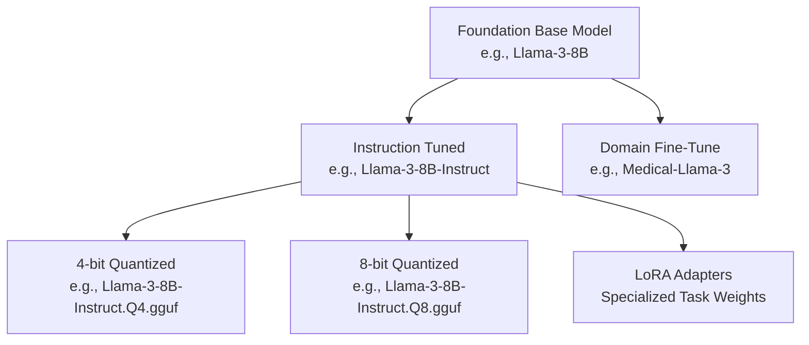

> **Complexity**: `[INTERMEDIATE]`
>
> **Time to Complete**: 45-60 min
>
> **Prerequisites**: Basic command-line comfort, general awareness of Kubernetes 1.35+ workloads, and familiarity with application deployment constraints

---

## Learning Outcomes

- Evaluate license restrictions and gated access before approving an open model for commercial use.
- Diagnose model card hardware tokenizer modality risks before downloading checkpoint files.
- Compare base instruction tuned and quantized variants for local inference constraints.
- Design a model family shortlist using context window multilingual requirements and parameter footprint.

## Why This Module Matters

Hypothetical scenario: an engineer is asked to add automated document summarization to a product that already runs in a Kubernetes 1.35+ cluster. They search a model hub, find a popular repository with impressive benchmark numbers, download a huge checkpoint, and point an inference server at the files. The first deployment does not fail because artificial intelligence is mysterious; it fails because the selected artifact requires more accelerator memory than any node in the cluster can provide, the tokenizer was not pulled with the weights, and the license requires additional approval before the model can support a commercial feature.

That scenario is common because model hubs look deceptively familiar to software engineers. A repository page resembles a package registry, a container registry, and a documentation site at the same time, so it is tempting to treat the download button as the start of the work. In practice, the download is near the end of the decision. Before you move any weight file, you need to read the license, inspect the model card, confirm the model type, compare variants, and decide whether your runtime can serve the model without creating legal, security, or reliability risk.

This module teaches the evaluation workflow behind that decision. You will learn how to separate "open weights" from open source software, how to read a hub repository as an operational artifact, how to choose between base, instruction tuned, and quantized variants, and how to shortlist model families based on the actual job rather than the most recent leaderboard. The goal is not to memorize model names. The goal is to build the habit of asking deployment-grade questions before a model enters your architecture.

## Decoding the Illusion of Open

Open source software has a reasonably stable meaning because the source code, license, build process, and downstream rights are usually visible in the same project. Open models are less uniform. A model release might include downloadable weights and an architecture definition while withholding the full training data, the exact training recipe, the filtering process, and the compute environment used to produce the model. That release can still be valuable, but it is not the same as receiving a reproducible software project where you can rebuild the artifact from first principles.

The practical distinction is between open source, open weights, and open access. Open source implies that the software license grants broad rights to inspect, modify, and redistribute the implementation. Open weights means the trained numerical parameters are available for inference or fine-tuning under some license, but the original training corpus and training system may remain closed. Open access means the repository page is visible or requestable, but downloads may still require approval, identity verification, license acknowledgment, or acceptance of acceptable-use terms.

Because foundational weights are expensive to train, model publishers often use custom licenses instead of standard software licenses. Some licenses allow commercial use with attribution and policy restrictions. Others permit research only, require a separate agreement above a usage threshold, forbid using outputs to train competing models, or restrict deployment in regulated domains. A systems engineer must treat those terms like vendor terms, not like decorative text at the bottom of a readme, because the license defines whether the model can legally sit inside a paid product, internal business workflow, or customer-facing service.

The phrase "commercial use" deserves special attention because many teams interpret it too narrowly. A model does not have to be sold directly to create commercial benefit. If it supports a private support assistant, helps employees triage customer tickets, drafts product documentation, ranks sales leads, or summarizes contracts for a revenue-generating company, the work may still fall under commercial use. Legal review should happen before a proof of concept becomes operational dependency, because changing models late can invalidate evaluations, prompts, latency budgets, and safety reviews.

Gated access is another source of misunderstanding. A public model hub page does not guarantee anonymous or unrestricted download. Some repositories require the user to request access, accept terms, or wait for publisher approval. That gate is not just administrative friction; it is part of the compliance boundary. If your deployment automation assumes a model can be fetched at build time without credentials or approval, the pipeline can break at the worst possible moment, and your artifact provenance becomes harder to explain during review.

Pause and predict: if a model is visible on a public hub but requires clicking through a license agreement before download, should your production build script fetch it dynamically during deployment? The safer answer is no. Production systems should pin approved artifacts, cache them in a controlled internal registry when the license permits it, and record the accepted terms as part of the release evidence. Dynamic pulls blur the line between a tested artifact and whatever the hub serves at deployment time.

This is why the first evaluation question is never "Can I download it?" The first question is "Can we use it for this purpose, in this organization, with this data, under this deployment model?" Only after that answer is defensible should you consider memory, throughput, and serving topology. A small, permissively licensed model that is easy to audit can be a better engineering choice than a larger model whose legal and operational boundaries are unclear.

The compliance review should also include data movement. Local inference is often attractive because prompts, embeddings, and generated text can stay inside an organization's boundary, but that benefit disappears if the model artifact itself is fetched through an unmanaged account, if access logs expose sensitive project names, or if evaluation data is uploaded to a third-party demo space. Open models reduce one kind of dependency, yet they do not remove the need for ordinary data governance. Treat the model, prompt data, evaluation logs, and generated outputs as a connected system.

Another useful habit is to separate permission from endorsement. A license may allow a deployment while the model card still warns that the model is a poor fit for the domain. Conversely, a model may look technically excellent while its license blocks the intended use. Approval requires both tracks to pass. This two-track review prevents teams from arguing that a strong benchmark compensates for weak rights, or that a permissive license compensates for missing safety evidence.

## Reading a Model Hub Like a Deployment Registry

A model hub serves as the central registry and version control system for machine learning artifacts, functioning much like a container registry does for microservices. However, while a container registry primarily holds immutable image layers that execute consistently, a model hub repository contains a complex constellation of interdependent configuration files. When you browse a repository on a platform like Hugging Face, you are not just looking at a simple download link for a massive binary file. You are looking at the entire configuration state required to instantiate the complex neural network directly into system memory.

Inside a standard model repository, you will find the weights serialized into formats like Safetensors or PyTorch binaries, typically split across multiple chunked files to handle network interruptions during massive downloads. Alongside the weights sits the core configuration file defining the tensor shapes, attention heads, and neural network layers. Crucially, the repository also contains the tokenizer configuration, which dictates exactly how raw text strings are mapped into the numerical tokens the model actually understands. If you attempt to run the weights with a mismatched or missing tokenizer, the model will output unpredictable gibberish, highlighting exactly why the hub treats these files as an inseparable package.

```ascii
+-------------------------------------------------------------+
|                 Model Hub Repository                        |
|                                                             |
|  +--------------------+   +------------------------------+  |
|  | Documentation      |   | Configuration Artifacts      |  |
|  |                    |   |                              |  |
|  | - README.md        |   | - config.json                |  |
|  |   (Model Card)     |   | - tokenizer_config.json      |  |
|  | - license.txt      |   | - generation_config.json     |  |
|  +--------------------+   +------------------------------+  |
|                                                             |
|  +-------------------------------------------------------+  |
|  |                 Weight Artifacts                      |  |
|  |                                                       |  |
|  | - model-00001-of-00004.safetensors  (4.5 GB)          |  |
|  | - model-00002-of-00004.safetensors  (4.5 GB)          |  |
|  | - model-00003-of-00004.safetensors  (4.5 GB)          |  |
|  | - model-00004-of-00004.safetensors  (1.2 GB)          |  |
|  +-------------------------------------------------------+  |
+-------------------------------------------------------------+
```

The diagram is intentionally similar to a release artifact inventory. The model card and license explain whether the artifact is appropriate. The configuration files explain how the neural network should be constructed. The tokenizer files explain how text becomes token IDs. The weight shards contain the large tensors. If any part is missing, stale, or mismatched, the system may still start, but the behavior can be wrong in ways that look like application bugs rather than packaging errors.

Model hubs also carry social signals, and those signals are useful only when you understand their limits. Download counts can show that a model has a broad user base, but they do not prove it is safe for your domain. Likes can identify community interest, but they do not replace evaluation. A repository with frequent commits may be active, but it can also change faster than your validation cycle. Treat hub metadata as triage information, then verify the actual files, version pins, and documentation before turning interest into a deployment decision.

The file format matters because loading a model is a trust decision. Safetensors was designed as a safer serialization format for tensor data because it avoids the arbitrary code execution risk associated with pickle-based formats. That does not make every model safe, but it narrows one class of supply-chain risk. When a repository offers both Safetensors and older binary formats, prefer the safer format unless a runtime constraint gives you a specific reason to do otherwise, and record that reason in the deployment notes.

Versioning deserves the same discipline you apply to containers. A model repository can change after your first test, and a branch name such as `main` is not a durable production reference. Pin a revision, record the exact file names and checksums when your tooling supports them, and mirror approved artifacts to infrastructure you control when license terms allow redistribution inside your organization. This makes rollback and incident analysis possible because you can prove which model bits were running when a behavior was observed.

Before running this, what output do you expect from a model loaded with the wrong tokenizer: a clean error, a crash, or plausible-looking nonsense? Many runtimes will not know the semantic relationship is wrong. They may happily convert input text into token IDs using the wrong vocabulary and generate output from those distorted inputs. That is more dangerous than a crash because it can pass superficial smoke tests while corrupting user-facing behavior.

## Working Through a Model Card

The most critical file in any model repository is the model card, which serves as the architectural blueprint and safety datasheet for the artificial intelligence system. A model card is fundamentally different from a standard software readme file. It documents the empirical bounds of the system, detailing what data the model was exposed to when disclosed, what biases it might exhibit, and what benchmarks it has passed. Skipping the model card and proceeding straight to downloading weights is the fastest way to deploy an inadequate or unsafe application.

A senior review starts with intended use. This section tells you what the publisher believes the model is for, and equally important, what the publisher does not claim it can do. If the card says the model is for general text generation and dialogue in English, then using it for multilingual legal translation is not a small stretch; it is an unvalidated use case. If the card says the model is research-only or excludes medical, legal, or financial decision-making, those words should stop the architecture discussion until a different model or a governed exception is identified.

The next pass is modality. Some models accept only text. Others accept images, audio, video frames, or structured tool calls through a specific processor. A vision-language model is not just a language model with an image pasted into the prompt; it has additional preprocessing, embedding, and alignment requirements. If the hub repository does not clearly describe supported input and output modalities, your integration will be built on assumptions. Those assumptions become expensive when an application team has already designed user flows around unsupported payloads.

Hardware sizing comes after purpose and modality because a runnable model is not automatically an appropriate model. Parameter count gives a rough sense of memory footprint, but it is not the whole story. Precision, context length, batch size, key-value cache size, runtime implementation, and accelerator type all affect whether inference is stable. A seven or eight billion parameter model in half precision can require far more memory during real serving than the raw weights suggest, especially when multiple concurrent requests hold long contexts in memory.

Tokenizer configuration is a separate review item rather than a footnote. The tokenizer defines vocabulary, special tokens, chat templates, beginning-of-sequence behavior, end-of-sequence behavior, and sometimes role markers used for instruction formatting. An instruction-tuned model expects prompts to be wrapped in the chat template it was trained against. If your application sends plain text to a model that expects role-formatted turns, the model may ignore instructions, leak formatting artifacts, or behave like a weaker base model.

Benchmark sections are useful when read modestly. A benchmark can tell you that a model family has broad competence, but it cannot tell you that the model will handle your customer vocabulary, document style, latency budget, or safety threshold. Teams often overfit to leaderboard rank because it feels objective. A better habit is to use benchmark results to build a shortlist, then run a small domain evaluation with representative prompts, expected answer rubrics, refusal cases, and latency measurements on the same hardware you plan to use.

Limitations and bias disclosures should feed directly into your architecture. If a model card warns that the model may produce false historical claims, unsafe code, or harmful content under adversarial prompting, the correct response is not to hope your users behave well. The correct response is to design guardrails, output validation, retrieval boundaries, logging, and escalation paths around the model. The card does not absolve you from risk; it tells you where to start looking.

Exercise scenario: suppose the model card for a vision-language model says it is intended for image captioning research, and the limitations section warns about unreliable performance on medical imagery. A product idea that uses the model to pre-screen patient images should be rejected at the model selection stage. That conclusion does not require a benchmark run. The publisher has already stated that the intended use and the known limitations conflict with the proposed deployment.

Think of the model card as the opening interview with a candidate system. You would not hire a database without asking about durability, backups, query patterns, and support boundaries. Do not adopt a model without asking about license, intended use, modality, tokenizer, context length, training limitations, and hardware. The questions are different from ordinary software selection, but the discipline is the same: verify the contract before integrating the dependency.

A good model-card review produces an engineering note, not just a yes or no. The note should identify which facts came directly from the repository, which facts were inferred from related documentation, and which questions remain unanswered. If hardware requirements are estimated from parameter count rather than stated by the publisher, label the estimate. If multilingual behavior is claimed by the community but not evaluated by your team, label it unverified. This language keeps the review honest and makes later decisions easier to challenge.

That note becomes especially important when the model is handed from a research or application team to a platform team. Platform engineers need to know whether the model expects a long-lived accelerator allocation, whether it can tolerate cold starts, whether it needs persistent local storage, and whether multiple replicas can share cached artifacts. Application engineers may focus on answer quality, but platform engineers inherit scheduling, health checks, observability, and rollout behavior. The model card rarely answers every platform question, so the review should translate model facts into operational questions.

## Choosing Among Base, Instruction Tuned, and Quantized Variants

The baseline model you initially find on a hub is rarely the exact model variant you will end up deploying in a production environment. The open ecosystem is defined by a massive secondary market of modifications, where a single foundational release branches into hundreds of specialized variants. Understanding this branching structure is critical because the base model released by a research laboratory is essentially a raw autocomplete engine. It is not designed to follow instructions, answer questions, or format code; it is designed to predict the next plausible token in a sequence based on its training corpus.

To make these neural networks useful for application development, they must undergo a secondary training phase called instruction tuning. The resulting Instruct or Chat variant is what you usually need for conversational agents, support tools, summarizers, and task-solving application systems. If you accidentally download a foundation base model and prompt it with a question, it might respond by generating ten more similar questions rather than providing a structured answer. You must always verify whether the repository name or model card explicitly indicates that the weights have been tuned for dialogue or instruction following.



Instruction tuning changes behavior, while quantization changes representation. A quantized model stores or computes weights at lower numerical precision, such as eight-bit or four-bit formats, instead of full or half precision. The benefit is memory reduction and often faster local inference on constrained hardware. The cost is that some information is compressed away, which can reduce reasoning quality, formatting consistency, tool-use reliability, or performance on edge cases. Quantization is not a magic setting; it is a trade-off you test against the task.

The GGUF format is common in local inference workflows because it is optimized for runtimes such as llama.cpp and for environments where central processing units or unified memory are more realistic than large dedicated accelerators. A GGUF artifact can be the correct choice for a laptop, workstation, or edge node, especially when the application can tolerate lower throughput and modest quality loss. The same artifact may be the wrong choice for a high-throughput service with accelerator scheduling, strict latency objectives, and careful batching, where a tensor format served by a specialized inference engine performs better.

Fine-tunes and adapters introduce another layer. A domain fine-tune may improve performance on a narrow task, but it also inherits the base model's license and adds questions about the fine-tuning dataset. A LoRA adapter can be efficient because it stores a smaller set of learned changes rather than a full copy of the model, but the runtime must combine the adapter with the correct base. If the base revision, tokenizer, or chat template differs from what the adapter expects, the model can degrade in subtle ways.

Which approach would you choose here and why: a full-precision instruction model with excellent benchmark scores, or a four-bit quantized instruction model that fits comfortably on your available node class? If the service must run on that node class, the full-precision model is not a candidate until the infrastructure changes. A model that cannot fit into memory is not "better" for your system; it is unavailable. Quality comparisons only matter among models you can legally and operationally serve.

The safest selection process begins with the task, not the artifact. For chat and instruction following, start with instruction-tuned variants. For raw text continuation research, base models may be appropriate. For constrained local inference, evaluate quantized variants and measure the quality loss. For domain-specific behavior, consider fine-tunes only after confirming provenance, license compatibility, and evaluation coverage. Each branch exists because different users optimize different constraints, and your job is to name your constraints before choosing the branch.

## Evaluating Major Model Families

The landscape of open models is dominated by several architectural families, each backed by different organizations and optimized for different operational use cases. You should not default to a single family out of brand loyalty or market noise. Instead, evaluate them based on license terms, context window, tokenizer behavior, multilingual coverage, tool ecosystem, parameter footprint, quantization support, and serving compatibility. The best starting model for a local coding assistant may be different from the best model for multilingual retrieval, and both may be different from the best model for a regulated internal summarizer.

The Llama family from Meta is often treated as a baseline for open-weights work because it has broad community support. Tooling, quantized variants, adapters, examples, and serving integrations tend to appear quickly around Llama releases. That ecosystem depth matters when you need production support, because fewer pieces have to be invented by your team. The trade-off is that license terms, acceptable-use policies, and version-specific requirements still need careful review rather than casual assumption.

The Mistral ecosystem is known for efficient models and strong performance relative to parameter count. That makes it attractive when memory and throughput are primary constraints. Smaller models can be cheaper to serve, easier to replicate, and simpler to place on node pools with limited accelerator capacity. The engineering question is whether that efficiency holds for your actual prompts, because a compact model that struggles with your domain may force more retries, larger retrieval context, or heavier post-processing.

The Qwen family is often a strong candidate for multilingual and coding-heavy workloads. Multilingual performance depends on training mix, tokenizer coverage, and evaluation, not just on whether a model can produce words in another language. If a product must handle English, Mandarin, Arabic, and other scripts in the same session, you should test model families that were built with broad multilingual data rather than assuming every general model will behave equally well. Context-switching across languages is a capability you verify, not a slogan you accept.

Google's Gemma family provides another option, particularly for teams that want open models connected to the research lineage and tooling patterns of the Google ecosystem. Gemma releases often have clear model cards, documented intended use, and integration paths with common machine learning frameworks. As with every family, the value is not only raw quality; it is the combination of license, documentation, safety guidance, runtime support, and the operational familiarity of your team.

Context window size is one of the most misunderstood comparison points. A longer context window allows the model to consider more tokens at once, but it does not guarantee better reasoning over that entire span. Long contexts increase memory use because the runtime must maintain attention state and key-value cache for active requests. A model with a huge context window can be slower and more expensive to serve than a smaller-context model paired with retrieval, chunking, and summarization. Select the context length you need, then test whether the model actually uses it well.

Parameter count is also a proxy, not a decision. Larger models usually have more capacity, but they cost more to load, serve, scale, and debug. Smaller models can win when the task is narrow, the prompts are well structured, or the system uses retrieval to provide grounding. A practical shortlist often includes one larger model for quality reference, one efficient model for cost-sensitive serving, and one quantized local model for offline or edge use. Comparing those options on the same evaluation set will teach you more than reading another leaderboard.

When Kubernetes enters the architecture, model-family choice also affects scheduling strategy. A larger accelerator-backed model may need node labels, device plugins, taints, tolerations, and careful rollout windows, while a smaller quantized model may run on ordinary nodes but require different latency expectations. Neither option is automatically superior. The right question is whether the model's resource shape fits the rest of the platform. A model that forces a unique node pool for one feature can be justified, but only if the feature value and operational ownership are clear.

Serving ecosystem maturity is part of the model-family comparison. A model that works in many runtimes gives you more escape hatches if one serving path becomes too expensive or too slow. A model that depends on a narrow custom runtime can still be worth using, but it raises the cost of debugging and portability. Check whether the family has documented tokenizer handling, quantization recipes, adapter support, batching guidance, and community examples that match your deployment style. Those support signals often matter as much as a small benchmark gap.

You should also compare failure behavior, not only successful answers. Some families are more verbose when uncertain, some refuse more readily, some invent citations, and some preserve structured output more reliably under pressure. These differences shape the surrounding application. A model that produces clean JSON in ordinary cases but breaks format under long prompts may require a stricter validation loop. A model that answers every question confidently may require stronger uncertainty handling. Reliability is the combination of model behavior and application controls.

## Patterns & Anti-Patterns

### Patterns

Start with a license-first intake pattern. Every candidate model should enter your tracking system with its license, gated access status, publisher, intended use, acceptable-use terms, redistribution assumptions, and commercial-use constraints recorded before technical testing begins. This pattern works because it prevents teams from emotionally committing to a model that cannot be used. It also creates reusable evidence for security, legal, and platform reviewers, so each application team does not have to rediscover the same restrictions.

Use a model-card review checklist before any performance benchmark. The checklist should cover intended use, modality, tokenizer, chat template, context window, training disclosure, limitations, hardware guidance, and safety notes. This pattern scales because it separates hard disqualifiers from tunable concerns. A model that excludes your domain or lacks the required modality can be removed quickly, while a model with acceptable boundaries can move into deeper evaluation with fewer surprises.

Build a variant ladder for local inference. For each promising family, identify the base model, the instruction-tuned model, the preferred full-precision or half-precision serving artifact, and one or two quantized alternatives. This pattern helps the team understand which trade-off is being tested. If the quantized version fails a formatting test, you can compare it against the non-quantized instruction model rather than guessing whether the issue came from the family, the fine-tune, the prompt, or the compression.

Pin revisions and mirror approved artifacts when permitted. A model hub is excellent for discovery, but production systems need reproducibility. Pinning the exact revision and storing approved artifacts in a controlled environment makes rollbacks, audits, and incident response far easier. This pattern also protects build systems from external availability problems and from accidental changes to a repository branch that was never meant to serve as a production contract.

### Anti-Patterns

Do not select a model by leaderboard rank alone. Leaderboards use benchmark tasks that may be useful signals, but they rarely match your domain, latency target, data sensitivity, or prompt shape. Teams fall into this anti-pattern because rank feels like an objective shortcut. The better alternative is to create a small evaluation suite from realistic user tasks, include failure cases, and compare shortlisted models under the same runtime conditions.

Do not treat "open" as a synonym for unrestricted. This anti-pattern appears when engineers conflate public visibility with legal permission. A public repository can still have commercial thresholds, usage restrictions, redistribution limits, or gated downloads. The better alternative is to make license review the first intake step and to record the decision before experiments create organizational momentum around a model that cannot ship.

Do not mix tokenizers, chat templates, adapters, and weight revisions casually. Many model failures are packaging failures disguised as poor intelligence. Teams fall into this pattern when they copy a weight file from one repository, a prompt template from another, and an adapter from a third. The better alternative is to treat the model repository as an atomic artifact set unless the publisher or adapter author explicitly documents the compatible base and template.

Do not deploy the largest model your hardware can barely load. A model that only fits with no room for concurrent requests, key-value cache growth, observability overhead, or rolling updates will fail under real traffic. Teams fall into this anti-pattern because a successful local load feels like proof of readiness. The better alternative is to size for serving behavior, including context length, batch size, failure isolation, and the operational buffer needed by your platform.

## Decision Framework

Begin the decision with a short written statement of the workload. Name the user, the input modality, the expected output, the risk level, the latency target, the data sensitivity, and the deployment environment. This forces hidden assumptions into the open. A model chosen for offline developer assistance can tolerate different privacy, latency, and license constraints than a model embedded in a customer-facing support workflow, even if both use the same prompt during a demo.

Next, eliminate candidates that fail non-negotiable boundaries. License conflict, unsupported modality, missing commercial rights, unacceptable gated-access terms, or explicit model-card warnings for the target domain should remove a model before you spend time on benchmark work. This step can feel conservative, but it protects the team from sunk cost. It is easier to reject a model early than to replace it after prompts, evaluations, dashboards, and capacity plans are built around it.

Then choose a family and variant set for evaluation. Include the most likely instruction-tuned candidate, a smaller or more efficient alternative, and a quantized local option if local inference is part of the goal. Use the same representative prompts, documents, and safety cases for every candidate. Measure quality, refusal behavior, formatting consistency, latency, memory use, and operational complexity. A model that produces slightly better answers but requires an unstable serving architecture may lose to a simpler model that meets the product need reliably.

Finally, translate the evaluation into an operational recommendation. The recommendation should say which model and revision to use, which tokenizer and chat template are required, which license constraints apply, which runtime is expected, what hardware envelope was tested, what limitations remain, and what would trigger reevaluation. That last point matters because the open-model ecosystem changes quickly. A good decision record explains why the chosen model is right today and how the team will know when it is time to compare again.

The recommendation should include a fallback path. Local inference systems can fail because the selected model exceeds memory under real traffic, because a quantized artifact loses too much quality, because the license review changes, or because the runtime cannot meet latency targets. A fallback might be a smaller model, a hosted model behind a stricter data boundary, a retrieval-first design with less generation, or a delayed launch while infrastructure catches up. Naming the fallback early makes the project less brittle when the first candidate disappoints.

Cost should be written in operational terms rather than only in hardware prices. A model that requires a dedicated accelerator node affects capacity planning, cluster upgrades, incident response, and developer access. A model that runs on central processing units may be cheaper to provision but slower per request, which can increase queueing and user-visible latency. A model that fits on laptops may be excellent for offline developer tools but unsuitable for shared production traffic. The decision framework should compare total operating shape, not just model size.

Security review closes the loop. Model artifacts are dependencies, and dependencies need provenance, approval, vulnerability monitoring, and removal plans. The serving container, tokenizer files, model weights, prompt templates, and post-processing code all participate in the security boundary. If a hub repository changes ownership, a license changes, or a safer artifact format becomes available, the team should know who evaluates the change. Open-model adoption is not a one-time download; it is an ongoing dependency-management practice.

## Did You Know?

- Did you know that Safetensors was created to store tensors without the arbitrary code execution behavior associated with pickle-based loading, which makes file format selection part of supply-chain risk management rather than mere convenience?
- Did you know that a context window is a hard limit on the tokens a model can attend to at once, so extra input is usually truncated, chunked, summarized, or rejected rather than magically remembered?
- Did you know that a four-bit quantized model can be small enough for local inference while still requiring careful testing, because compression can affect reasoning, formatting, and edge-case behavior differently across tasks?
- Did you know that the tokenizer is independent from the neural network weights, so swapping tokenizers between incompatible repositories can produce plausible-looking failures that are much harder to diagnose than a clean startup error?

## Common Mistakes

| Mistake | Why It Happens | How to Fix It |
|---|---|---|
| Selecting models by leaderboard rank alone | Leaderboards measure academic benchmarks that rarely translate to specific production domain performance. | Evaluate models using custom, domain-specific datasets that reflect your actual user inputs, output expectations, and latency budget. |
| Downloading base models for chat applications | Base models only predict the next token and often continue a pattern instead of answering the user. | Verify that the repository explicitly contains an instruction-tuned or chat-optimized variant before building the prompt contract. |
| Ignoring commercial license restrictions | Teams see a public repository and assume public visibility means unrestricted business use. | Audit the license file, gated access terms, and acceptable-use policy before running the first deployment experiment. |
| Attempting to load unquantized models on edge nodes | Full or half precision artifacts can exhaust memory before the service handles real concurrent requests. | Select quantized variants designed for constrained hardware, then measure quality loss against the full instruction model. |
| Assuming open weights means open training data | Many releases expose weights without exposing the full corpus, filtering pipeline, or training recipe. | Use model-card limitations, safety evaluations, and domain tests to compensate for the parts of provenance you cannot inspect. |
| Neglecting the matching tokenizer files | The runtime may accept mismatched token IDs and generate bad output instead of failing clearly. | Pull tokenizer, processor, chat template, and generation configuration from the same approved repository revision. |
| Overlooking context window limitations | Long documents can be truncated or become expensive because the key-value cache grows with active context. | Calculate expected token counts and test retrieval, chunking, or long-context models with realistic documents. |
| Failing to verify input modality | Teams assume a model can process images, audio, or tools because a similar model family can. | Confirm the exact input and output modalities in the model card and repository configuration before designing the API payload. |

## Quiz

<details><summary>Scenario: Your team wants to evaluate license restrictions and gated access for an open model that will summarize customer tickets inside a paid support product. The model page is public, but downloads require accepting a community license with commercial terms. What should you do before testing it in the product environment?</summary>
You should pause the product experiment and complete license review first, because public visibility does not prove commercial permission. The team should record the accepted terms, gated access process, commercial-use boundaries, and redistribution assumptions before the model becomes part of an architecture. If the terms conflict with the product, choose a permissive alternative or obtain the required agreement. Testing can continue only after the legal and operational boundary is clear.</details>

<details><summary>Scenario: A deployed summarizer loads its weight shards successfully, but every answer contains strange symbols and ignores the expected chat roles. You need to diagnose model card hardware tokenizer modality risks from the artifact set. What is the most likely packaging mistake?</summary>
The likely mistake is a mismatched tokenizer or chat template. Weight files can load correctly while the text-to-token mapping is still wrong, and the runtime may not understand that the semantic contract has been broken. You should verify that `tokenizer_config.json`, tokenizer files, generation configuration, and the chat template all come from the same approved revision as the weights. If any component came from another repository, rebuild the artifact set from a consistent source.</details>

<details><summary>Scenario: An engineer compares base instruction tuned and quantized variants for local inference on a workstation with limited unified memory. The base model has the best raw benchmark page, while a four-bit instruction variant fits comfortably. Which variant should be tested first for a chat assistant?</summary>
The instruction-tuned quantized variant should be tested first because the workload is chat assistance and the hardware is constrained. A base model is not trained to follow instructions reliably, so its benchmark score does not solve the behavioral requirement. The quantized variant trades some precision for a memory footprint that can actually run in the target environment. You should still compare quality against a less-compressed instruction model when possible, but the base model is the wrong starting point for chat behavior.</details>

<details><summary>Scenario: A product must design a model family shortlist using context window multilingual requirements and parameter footprint for English, Mandarin, and Arabic compliance reports. What should the shortlist emphasize?</summary>
The shortlist should emphasize families with strong multilingual evidence, suitable tokenizer coverage for the target scripts, and context behavior that can handle the document sizes without excessive serving cost. Qwen may deserve early evaluation because multilingual coverage is a known strength, while Llama, Mistral, or Gemma variants can provide useful baselines depending on license and runtime needs. Parameter footprint should be tested alongside quality because a smaller model that handles the languages well may be easier to serve. The final choice should come from a representative evaluation set, not from brand familiarity.</details>

<details><summary>Scenario: Your team finds a domain fine-tune that claims excellent legal summarization, but the repository does not identify the base revision or tokenizer. How should you evaluate this candidate?</summary>
Treat it as high risk until compatibility and provenance are clear. A fine-tune or adapter depends on the correct base model, tokenizer, and prompt format, so missing compatibility information can lead to subtle failures. You should ask for or find the base revision, license inheritance, tokenizer requirements, and evaluation details before running it in a serious test. If that information cannot be established, remove it from the shortlist.</details>

<details><summary>Scenario: A model card warns that the model is research-only for image captioning and unreliable on medical imagery. A stakeholder wants to use it to pre-screen patient scans because the demo looks impressive. What is the correct engineering recommendation?</summary>
Reject that deployment path. The model card explicitly says the intended use and limitation profile do not match the proposed medical screening workflow. A demo does not override the publisher's stated boundaries, and patient-impacting use requires much stronger validation, governance, and domain approval. The team should search for a model and process designed for the regulated medical context instead.</details>

<details><summary>Scenario: A platform team wants production pods to download model weights from a public hub at startup so each rollout always uses the latest files. What operational risks should you raise?</summary>
Dynamic startup downloads weaken reproducibility and can make rollbacks difficult because the running artifact may change without a code change. They also expose deployments to hub availability, gated access failures, rate limits, and unreviewed repository updates. The better pattern is to pin a revision, approve the artifact set, mirror it internally when allowed, and deploy from that controlled source. This gives incident responders a clear answer about which model was serving traffic.</details>

## Hands-On Exercise

Exercise scenario: your task is to evaluate a model hub repository as if you were preparing a deployment review for local inference. You do not need to run the model, and you should not download large weight files for this exercise. The goal is to practice reading the repository artifacts, license terms, and variant ecosystem before compute cost enters the discussion. Use a current open model repository from a major hub, such as a Llama, Mistral, Qwen, or Gemma instruction model, and document your findings in a short decision note.

### Setup

Open the model hub in a browser and choose one instruction-tuned repository that appears suitable for a general assistant or summarization workload. Keep a note open with five headings: license, model card, artifact inventory, variants, and deployment recommendation. As you inspect the repository, write down exact file names and page sections rather than relying on memory. This mirrors how an engineering review should preserve evidence for later reviewers.

### Tasks

- [ ] Evaluate license restrictions and gated access for the selected repository, including whether commercial use is allowed and whether downloads require approval or term acceptance.
- [ ] Diagnose model card hardware tokenizer modality risks by recording the intended use, supported inputs and outputs, context window, tokenizer or chat template notes, and hardware guidance.
- [ ] Compare base instruction tuned and quantized variants by finding the closest base model, the instruction model you selected, and at least one quantized local-inference artifact if one is available.
- [ ] Design a model family shortlist using context window multilingual requirements and parameter footprint for a hypothetical document summarization service.
- [ ] Write a deployment recommendation that names the exact model revision or artifact source you would test first and explains the trade-off you are accepting.

### Solutions

<details><summary>Solution guidance for task 1</summary>
Your license note should name the license or custom community agreement, describe any commercial-use conditions, and state whether gated access exists. If the page requires approval or term acceptance, record that as an operational dependency. A strong answer also says whether the artifact can be mirrored internally and who must approve that decision.</details>

<details><summary>Solution guidance for task 2</summary>
Your model-card note should connect intended use to your proposed workload. It should identify text, image, audio, or other modalities, plus the context length and tokenizer or chat template requirements. If hardware guidance is missing, state that as a risk rather than inventing a number. The review should distinguish known facts from assumptions.</details>

<details><summary>Solution guidance for task 3</summary>
Your variant comparison should show that base, instruction-tuned, and quantized artifacts solve different problems. The base model is useful for understanding lineage, the instruction model is usually the application candidate, and the quantized artifact is a local-inference trade-off. Note the format, approximate file size, and expected quality or memory compromise.</details>

<details><summary>Solution guidance for task 4</summary>
Your shortlist should include more than one family when the workload has multilingual, long-context, or hardware constraints. Explain why each family belongs in the comparison and what would disqualify it. A useful shortlist is small enough to test but diverse enough to reveal whether quality, memory, or license is the limiting factor.</details>

<details><summary>Solution guidance for task 5</summary>
Your recommendation should be specific enough for another engineer to reproduce the next evaluation. Name the model repository, revision strategy, tokenizer requirement, candidate runtime, hardware assumption, and the largest unresolved risk. Avoid saying "use the best model"; a deployment recommendation is a reasoned trade-off, not a popularity vote.</details>

### Success Criteria

- [ ] You can explain whether the chosen model is legally usable for the target commercial or internal business workflow.
- [ ] You can identify the tokenizer, chat template, modality, and context-window facts that affect integration.
- [ ] You can justify the selected variant as base, instruction tuned, quantized, fine-tuned, or adapter-based.
- [ ] You can compare at least two model families using context window, multilingual capability, and parameter footprint.
- [ ] You can state the first artifact you would test and the operational evidence required before production approval.

## Sources

- [Hugging Face Hub model cards](https://huggingface.co/docs/hub/model-cards)
- [Hugging Face Hub model repositories](https://huggingface.co/docs/hub/en/models-the-hub)
- [Hugging Face gated models](https://huggingface.co/docs/hub/en/models-gated)
- [Hugging Face Safetensors security audit](https://huggingface.co/docs/safetensors/audit)
- [Safetensors documentation](https://huggingface.co/docs/safetensors/index)
- [Meta Llama license](https://www.llama.com/llama3/license/)
- [Meta Llama acceptable use policy](https://www.llama.com/llama3/use-policy/)
- [Mistral AI documentation](https://docs.mistral.ai/)
- [Qwen model documentation](https://qwen.readthedocs.io/en/latest/)
- [Google Gemma model documentation](https://ai.google.dev/gemma/docs)
- [llama.cpp GGUF documentation](https://github.com/ggml-org/llama.cpp/blob/master/docs/gguf.md)

## Next Module

Continue to [Hugging Face for Learners](./module-1.2-hugging-face-for-learners/) to practice navigating the hub interface, repository files, and account workflows in more detail.
