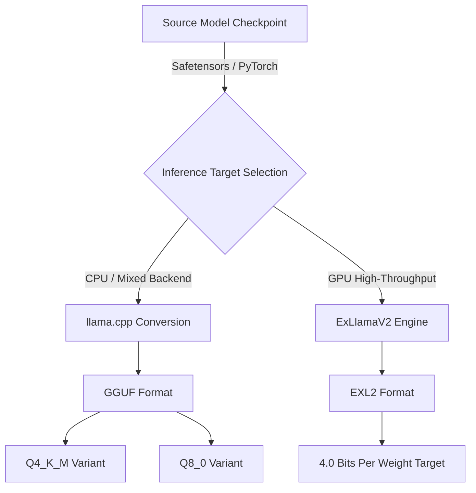

> **Open Models & Local Inference** | Complexity: `[MEDIUM]` | Time: 45-60 min

## Why This Module Matters

Without quantization, the democratized landscape of open-weights models would simply not exist for the majority of software engineers. The sheer physical footprint of modern neural networks dictates that a standard, unquantized foundational model requires specialized datacenter hardware just to load into active memory, let alone generate text. Quantization acts as the critical engineering bridge between massive academic research models and practical, local deployments on consumer laptops and edge devices. By mathematically compressing the neural weights into lower-precision formats, engineers can execute highly capable intelligence on constrained hardware, ensuring absolute data privacy, zero-latency network dependencies, and complete control over the inference stack. Unfortunately, the local AI ecosystem is littered with confusing acronyms, undocumented file extensions, and vague claims about compression ratios that leave practitioners guessing rather than engineering. Understanding the fundamental mechanics of quantization—specifically how we map continuous floating-point numbers into discrete integer spaces—transforms this guesswork into a rigorous architectural discipline. It empowers platform architects to make deliberate, mathematical choices about exactly when to sacrifice a fractional percentage of model accuracy in order to gain massive, compounding reductions in operational cost and infrastructure footprint.

## What You'll Learn

- Calculate the exact memory footprint of massive language models based on total parameter counts and applied quantization bit depths to systematically determine hardware feasibility before deployment.
- Evaluate the complex perplexity versus resource trade-offs between different mixed-precision K-quantization methodologies to deliberately protect critical architectural reasoning pathways.
- Differentiate fundamentally between unquantized model distribution containers like Safetensors and highly execution-optimized inference formats like GGUF and EXL2.
- Select the mathematically optimal quantization strategy and precise runtime file format for highly specific infrastructure constraints, perfectly balancing maximum inference speed against strict VRAM limits.

## The Physics of Model Weights and Memory Capacity

When architecting deployment systems for large language models, the most fundamental engineering constraint is rarely the raw computational speed of the processor, but rather the memory bandwidth and overall memory capacity of the hosting hardware. Neural networks are essentially massive, multi-dimensional mathematical arrays of floating-point numbers that explicitly represent the learned weights and biases formulated during the initial training phase. In a standard unquantized state, these weights are typically stored in Full Precision (FP32) or Half Precision (FP16) formats, utilizing four bytes or two bytes per individual parameter, respectively. To truly understand the scale of this physical problem, consider a relatively small foundational model boasting eight billion parameters; storing this model in standard Half Precision requires roughly sixteen gigabytes of contiguous memory strictly to hold the static, inactive weights. When you must additionally allocate dynamic, rapidly expanding memory for the Key-Value cache—which stores the mathematical representations of the ongoing conversational context—the total hardware footprint easily exceeds the physical capacity of standard consumer-grade graphics processing units.

Because generating a single new token requires the underlying inference engine to read every single parameter of the neural network from memory into the processing cores, the maximum speed of local inference is directly bottlenecked by how fast the system can shuttle these massive files across the internal hardware bus. This absolute memory bandwidth bottleneck is the primary mathematical reason why running foundational models locally was initially considered a fundamentally impossible task for the average software developer operating outside of specialized data centers. Quantization directly attacks this fundamental physics problem by fundamentally altering how these precise numerical values are stored and processed at the lowest architectural level. By systematically reducing the number of discrete bits required to represent each individual weight, quantization drastically shrinks the overall memory footprint of the entire model, allowing massive networks to fit entirely within the extremely fast Video RAM of standard consumer hardware. This aggressive compression does not merely save physical storage space; it exponentially accelerates token generation speed by drastically reducing the total volume of mathematical data that must traverse the memory bus during every single isolated inference step.

## Understanding Memory Bandwidth: The True Bottleneck

While total VRAM capacity determines whether a massive foundational model can physically load into the system without crashing, memory bandwidth dictates exactly how fast the artificial intelligence can actually generate coherent text for the user. Memory bandwidth is typically measured in gigabytes per second and represents the absolute maximum volume of raw data that can travel between the physical memory modules and the active computational logic cores. Generating a single new textual token requires the local inference engine to comprehensively read every single parameter of the neural network from memory, push it through the complex arithmetic logic units, and immediately write the resulting state back to the dynamic Key-Value cache. If you are operating a heavily quantized model that requires thirty gigabytes of physical hardware footprint, and your specific hardware possesses a maximum memory bandwidth of three hundred gigabytes per second, the theoretical maximum generation speed is rigidly capped at exactly ten tokens per second. Understanding this fundamental physics limitation explains exactly why connecting multiple slow consumer graphics cards together over narrow, constrained PCIe lanes often results in massive VRAM capacity but catastrophically poor, unusable inference speeds. Optimizing model formats is therefore not merely an exercise in fitting large models into physically small spaces, but a critical, highly technical architectural strategy for minimizing data travel and maximizing overall token generation velocity.

## The Hidden Cost: Calculating Key-Value (KV) Cache Overhead

A ubiquitous, recurring failure pattern in local AI deployment occurs when infrastructure engineers size their hardware strictly based on the static footprint of the downloaded model weights while entirely ignoring the massive dynamic memory requirements of the active Key-Value cache. The KV cache is a rapidly expanding mathematical matrix that stores the intermediate computational states of all previously processed tokens in the current conversation, preventing the inference engine from having to redundantly recalculate the entire document history from scratch for every single new word. As the user injects increasingly larger documents and prompts into the context window, the KV cache grows exponentially, continuously consuming all available VRAM until the system is violently forced into a catastrophic out-of-memory failure state. Advanced inference engines aggressively mitigate this contextual explosion through specialized, runtime quantization of the KV cache itself, compressing the historical context states into eight-bit or four-bit integer representations to ruthlessly preserve precious graphical memory. When calculating infrastructure requirements for production workloads, platform architects must proactively model the maximum anticipated context length and allocate an absolutely non-negotiable additional buffer of two to eight gigabytes of VRAM exclusively to support the dynamic expansion of the KV cache during sustained inference operations.

## The Mechanics of Quantization

At its foundational core, quantization is the rigorous mathematical process of mapping a continuous or extremely large set of complex values—such as a massive array of high-precision floating-point numbers—to a significantly smaller, highly discrete set of values, typically represented by basic integers. This aggressive data compression is achieved through a specific linear transformation formula that involves calculating an overarching scale factor and, optionally, a mathematically precise zero-point offset to properly align the massive data distributions. The most universally common approach utilized throughout the open-source community is Post-Training Quantization (PTQ), which simply takes a fully trained, high-precision model and mathematically compresses its weights after the fact without requiring any additional, computationally expensive training cycles. While Post-Training Quantization is incredibly fast and highly accessible to the broader community, it inherently introduces widespread rounding errors that can subtly degrade the model's complex reasoning capabilities, particularly when compressing down to very aggressive, low bit depths like four-bit or three-bit precision.

> **Active Learning Challenge:** Before examining the exact quantization transformation formulas, predict what mathematically happens to the critical zero-point offset calculation if a specific neural network layer's weights are perfectly and symmetrically distributed between negative one and positive one. If you reasoned that the zero-point simply becomes an absolute zero, you are entirely correct; this perfect architectural symmetry allows the inference engine to completely drop the addition operation from its millions of matrix calculations, resulting in a highly measurable, compounding acceleration in raw computational throughput.

To aggressively mitigate the accuracy drops associated with Post-Training Quantization, massive enterprise organizations often employ Quantization-Aware Training (QAT), a vastly more complex and resource-intensive methodology. Quantization-Aware Training actively simulates the restrictive, damaging effects of lower precision directly during the initial training or subsequent fine-tuning gradient updates, explicitly forcing the neural network to mathematically adapt its internal pathways to account for the impending quantization errors before they actually occur. Although this approach requires substantial, highly expensive compute clusters to execute successfully, the resulting quantized models exhibit significantly higher accuracy and strict instruction adherence compared to their PTQ counterparts, making QAT the absolutely preferred choice for deploying critical applications to highly constrained hardware edge devices.

```ascii
Continuous Floating-Point Distribution
[ -3.14159 ] . . . . . . . . [  0.00000  ] . . . . . . . . [ +3.14159 ]
      |                             |                             |
      |         Quantization        |         Quantization        |
      |           Mapping           |           Mapping           |
      v                             v                             v
[   -128   ] . . . . . . . . [     0     ] . . . . . . . . [   +127   ]
Discrete 8-Bit Integer Range
```

Furthermore, the implementation of these quantization mappings can be either symmetric or asymmetric, depending entirely on whether the algorithm centers the discrete integer range strictly around absolute zero. Asymmetric quantization maps the exact minimum and maximum floating-point values directly to the absolute boundaries of the integer space using a calculated zero-point, which flawlessly captures highly skewed weight distributions but introduces massive computational overhead during inference. Conversely, symmetric quantization algorithms ruthlessly lock the zero-point strictly to zero, centering the discrete integer range evenly across both positive and negative values regardless of the actual underlying data distribution. By completely eliminating the zero-point offset calculation from the critical execution path, symmetric quantization significantly accelerates raw inference throughput, albeit at the massive architectural risk of permanently wasting vital representation space if the neural weights are clustered entirely on one isolated side of the mathematical axis.

## Demystifying Model Checkpoints: The Role of Safetensors

A critical conceptual hurdle for engineers transitioning into serious local AI infrastructure is understanding the fundamental, unyielding distinction between training checkpoints utilized for model distribution and execution-optimized formats designed explicitly for fast inference. The Safetensors format has rapidly become the universal, unquestioned industry standard for securely distributing raw, pre-trained models across platforms like the Hugging Face Hub, successfully replacing the inherently insecure Python pickle-based legacy files. Safetensors files are ingeniously engineered to allow for absolute zero-copy memory mapping, meaning the underlying operating system can map the massive multi-gigabyte file directly into the application's active memory space without executing a redundant, highly expensive copy operation in system RAM. However, it is fundamentally vital to understand that Safetensors files are generally unquantized, passive storage containers; they securely hold the massive, untouched FP16 or BF16 weights but do absolutely nothing to solve the critical memory footprint issues required for successful local hardware execution.

To actually execute these massive foundational models on consumer or edge hardware, the raw Safetensors checkpoints must be mathematically converted and aggressively repackaged into highly specific execution formats perfectly tailored to the underlying inference engine. The GGUF (GPT-Generated Unified Format) ecosystem, engineered primarily for the highly popular and ubiquitous llama.cpp inference engine, has decisively emerged as the dominant global standard for cross-platform local execution. GGUF decisively solves a myriad of complex deployment issues by securely storing not only the aggressively quantized tensor weights but also the critical, highly specific model metadata—including the exact tokenizer configurations, required chat templates, and overarching architectural hyper-parameters—within a single, highly portable, unified file structure.



## The Evolution of Precision: Understanding Mixed-Precision K-Quants

When deeply navigating the extensive GGUF ecosystem, engineers are immediately confronted with a bewildering, massive array of quantization variants, most notably the modern and highly efficient K-quant series. Legacy quantization methodologies often applied a flat, brutally uncompromising bit depth across every single tensor layer within the complex neural network, which universally resulted in severe cognitive degradation because not all architectural layers respond to mathematical compression equally. The advanced K-quant methodology revolutionizes this execution process by intelligently introducing highly strategic, block-wise mixed-precision quantization dynamically across the model architecture based on mathematical sensitivity. In a highly popular variant designated strictly as `Q4_K_M` (Quantized 4-bit, K-method, Medium profile), the algorithm aggressively maintains the vast majority of the standard weights at a highly compressed four-bit depth to save massive amounts of memory, but intelligently preserves the mathematically highly sensitive attention mechanisms and critical feed-forward network layers at much safer six-bit or eight-bit precisions.

Selecting the absolutely appropriate K-quant variant requires rigorously evaluating the direct, unavoidable trade-off curve between the resulting model perplexity and the absolute physical memory footprint required for smooth execution. Perplexity is the standard, highly respected mathematical metric used to objectively measure a language model's predictive accuracy; a lower perplexity score indicates a significantly more coherent, reliable, and capable model. Exhaustive benchmark analyses conclusively demonstrate that compressing a massive model from Full Precision down to an eight-bit format results in an almost statistically invisible, negligible impact on overall perplexity, providing essentially free memory savings for the infrastructure. Pushing the aggressive compression further into the five-bit and four-bit K-quant ranges introduces a slightly noticeable but generally acceptable drop in deep reasoning capabilities, making these specific variants the universally recommended "sweet spot" for deploying models to constrained laptops and consumer workstations. However, compressing models violently below the strict three-bit threshold triggers an immediate, exponential perplexity degradation, resulting in severe model lobotomization where the artificial intelligence permanently loses its fundamental instruction-following capabilities and begins generating completely incoherent, useless hallucinations.

## The Transformers and BitsAndBytes Integration

While the highly portable GGUF ecosystem provides unparalleled execution efficiency for standalone local applications, data engineers operating deeply within the Python data science ecosystem rely almost exclusively on the Hugging Face Transformers library integrated tightly with the powerful BitsAndBytes quantization engine. This highly synergistic, runtime combination allows specialized developers to load massively scaled, completely unquantized foundational models directly into system memory using highly precise eight-bit or four-bit configurations generated dynamically at the exact moment of initialization. Unlike blindly executing a pre-compiled, static GGUF file, the dynamic Transformers integration mathematically quantizes the raw neural weights during the actual active loading phase, providing immense, necessary flexibility for practitioners who need to rapidly iterate across wildly different precision configurations without waiting for prolonged, agonizing file conversion pipelines. Furthermore, this dynamic runtime quantization methodology forms the foundational architectural bedrock for advanced training techniques like QLoRA (Quantized Low-Rank Adaptation). This revolutionary adaptation process uniquely empowers engineers to efficiently fine-tune massive seventy-billion-parameter models directly on standard consumer hardware by strictly freezing the heavily quantized base weights while exclusively training a tiny, high-precision mathematical adapter network alongside it.

```bash
# Inspecting the metadata and complex tensor structures of a downloaded GGUF format model
# This diagnostic command reveals the exact quantization profiles applied to individual internal layers
llama-gguf-metadata model-q4_k_m.gguf

# Executing the heavily quantized model while explicitly defining the dynamic KV cache context size
# The -c flag strictly allocates precise VRAM boundaries to prevent catastrophic out-of-memory errors
llama-cli -m model-q4_k_m.gguf -c 4096 --temp 0.7 -p "Explain quantization:"
```

## GPU-Optimized Formats: Target Bitrate and EXL2

While the generalized GGUF ecosystem relies heavily on pre-calculated, highly discrete integer representations to successfully shrink models for broad general-purpose inference across diverse hardware architectures, specialized high-throughput deployments often demand a significantly more granular approach. Advanced formats such as EXL2 introduce the highly mathematical concept of exact target bitrate quantization, which fundamentally shifts the entire optimization paradigm from discrete bit-depth buckets to highly precise, continuous memory footprint targeting. Instead of aggressively forcing an entire massive tensor layer into a strict four-bit or five-bit constraint, target bitrate algorithms meticulously and exhaustively evaluate the deep mathematical sensitivity of individual weights across the entire neural network structure. The underlying engine then algorithmically mixes two-bit, three-bit, four-bit, and eight-bit representations at an entirely microscopic level to achieve an exact, predetermined average mathematical footprint perfectly scaled across the entire deployed model.

This incredibly advanced quantization methodology empowers systems architects to extract absolute maximum efficiency from highly rigid hardware constraints, completely and decisively eliminating the wasted memory buffers inherently found in discrete K-quant profiles. If a specific, highly critical production server has exactly twenty gigabytes of VRAM available after the operating system and dynamic Key-Value cache overhead are fully accounted for, an engineer can instruct the EXL2 quantization pipeline to compress a massive model to a hyper-specific target of exactly 3.85 bits per weight. The target algorithm will mathematically optimize the precision distribution to perfectly fill the absolute remaining VRAM without spilling a single, disastrous byte into the devastatingly slow system swap memory. Understanding this massive architectural distinction between generalized discrete formats and highly specialized, targeted bitrate formats is the absolute defining characteristic of a senior platform engineer tasked with successfully deploying open-weight intelligence at true enterprise scale.

## Hardware Strategy: Apple Silicon Unified Memory vs. Discrete VRAM

The massive global proliferation of quantized local inference has completely upended and fundamentally rewritten traditional hardware evaluation paradigms, heavily spotlighting the uniquely powerful architectural advantages of Apple Silicon's revolutionary unified memory architecture. Traditional high-end computational workstations universally utilize discrete NVIDIA graphics cards, which provide blazing-fast, uncompromising memory bandwidth but strictly and permanently limit the VRAM capacity to absolute physical hardware boundaries, typically capping out at twenty-four gigabytes for premium consumer hardware. Attempting to artificially load a neural model that even slightly exceeds this physical boundary violently forces the system to shunt massive blocks of data across the exceptionally slow PCIe bus into generic system RAM, a disastrous failure state that instantly throttles token generation down to completely useless, agonizing speeds.

> **Active Learning Challenge:** Consider an architectural scenario where your highly specialized local application generates massive volumes of text but rarely requires a substantial historical context window. Based on your deep understanding of the memory bandwidth bottleneck, predict whether you should prioritize a heavily quantized model that fits entirely within fast VRAM or a mildly quantized model that slightly spills into system RAM. You must absolutely prioritize the heavily quantized VRAM model; spilling into system RAM will absolutely destroy your token generation velocity, making bandwidth protection your highest, non-negotiable architectural priority.

Apple's innovative M-Series architecture decisively bypasses this catastrophic bandwidth bottleneck entirely by seamlessly integrating the central processor, the graphical cores, and massive pools of high-bandwidth memory directly into a single, perfectly unified silicon package. This incredibly unified topology allows a high-end desktop workstation to seamlessly allocate up to one hundred and ninety-two gigabytes of ultra-fast memory directly to the neural inference engine without any artificial borders. This hardware revolution directly enables engineers to run massively scaled, partially quantized seventy-billion-parameter models natively on a standard desktop workstation without ever hitting a hard, software-crashing VRAM boundary, fundamentally changing how infrastructure teams approach local testing and deployment.

## Worked Example: Sizing and Selecting Models for Production

To firmly solidify these complex theoretical concepts, let us meticulously walk through a highly concrete architectural scenario involving extensive hardware sizing and rigorous model selection for a massive production deployment. Consider an elite engineering team tasked with locally deploying the highly expansive Llama-3-70B foundational model, an architecture which contains roughly seventy billion distinct parameters. The team is currently operating on an isolated inference server heavily equipped with dual NVIDIA RTX 3090 graphics cards, providing a total, contiguous memory pool of exactly forty-eight gigabytes of VRAM. The absolute first mandatory step in the feasibility analysis is mathematically calculating the completely unquantized memory requirement: seventy billion parameters explicitly multiplied by two bytes per parameter (assuming standard FP16 precision) results in a staggering one hundred and forty gigabytes of required, uninterrupted memory. When we correctly add the required overhead for the expanding Key-Value cache to support a reasonable conversation context window, the total requirement easily and instantly exceeds one hundred and forty-five gigabytes. Attempting to blindly execute this unquantized Safetensors checkpoint would brutally force the underlying system to aggressively utilize highly latent system swap memory over the PCIe bus, resulting in catastrophic inference latency measured entirely in seconds per token rather than the required tokens per second.

Having definitively established that unquantized execution is mathematically impossible on the strictly available hardware, the team must correctly calculate the precise footprint of an aggressively quantized GGUF variant. By actively selecting the highly optimized, widely recommended `Q4_K_M` format, the average memory requirement per parameter drops massively from two bytes down to approximately 0.55 bytes. Recalculating the physical footprint reveals that seventy billion parameters multiplied tightly by 0.55 bytes equates to roughly thirty-eight gigabytes of absolutely required VRAM. Factoring in an additional four gigabytes of highly protected memory allocation for a substantial KV cache brings the total operational footprint to exactly forty-two gigabytes. This flawlessly fits within the rigid forty-eight-gigabyte constraint of the dual-GPU server, successfully leaving a highly comfortable safety buffer for operating system overhead and unexpected context expansion during massive bursts of usage. This rigorous, step-by-step mathematical sizing exercise demonstrates exactly why quantization is not merely an optional software optimization technique, but an absolute, unyielding structural prerequisite for successfully operating modern AI architectures completely outside of hyperscale datacenter environments.

## Did You Know?

- The widely adopted, highly robust GGUF architectural format was originally engineered by developer Georgi Gerganov specifically for the highly optimized llama.cpp inference project, but its core design was so mathematically superior that it was rapidly adopted as a native, default standard by the massive Hugging Face ecosystem.
- The highly technical nomenclature "K-quant" directly originates from an advanced block-wise quantization strategy where the neural network weights are algorithmically grouped into highly distinct super-blocks and sub-blocks, a mathematical approach that preserves significantly higher model quality compared to deprecated legacy flat-precision methodologies.
- Utilizing Brain Floating Point (BF16) instead of standard FP16 dramatically reduces the mathematical precision of the fractional component while massively expanding the overall exponent range, a structural architectural trade-off that successfully prevents devastating underflow during massive training runs but provides virtually zero tangible inference benefits for purely local workloads.
- Modern Safetensors files inherently support powerful operating system-level "zero-copy" memory mapping, meaning the underlying hardware kernel can map the massive multi-gigabyte weight file directly into the application's active memory space without executing a redundant, slow copy operation, a deeply technical feature that drastically accelerates application initialization times.

## Common Mistakes

| Mistake | Why It Causes System Failures | Architectural Correction |
|---|---|---|
| Confusing raw Safetensors containers with execution-optimized quantization | Assuming a massive Safetensors checkpoint is ready for deployment leads to immediate, violent out-of-memory errors on consumer hardware during boot. | Explicitly recognize that Safetensors is merely a secure distribution container holding massive unquantized weights; you must mathematically convert it into GGUF or EXL2 for local execution. |
| Completely ignoring the dynamic expansion of the active Key-Value cache | Calculating hardware feasibility based solely on static model weights mathematically guarantees the system will crash once the context window fills during a conversation. | Always fiercely allocate a highly dedicated hardware buffer of two to eight gigabytes of VRAM specifically to support the exponential growth of the KV cache during sustained text generation. |
| Selecting an execution format completely mathematically incompatible with the inference engine | Downloading highly optimized EXL2 files and attempting to execute them on CPU-bound llama.cpp instances results in immediate, unavoidable kernel compilation failures. | Strictly align your complex format choices to your runtime architecture by utilizing GGUF exclusively for diverse mixed-hardware deployments and EXL2 entirely for optimized ExLlamaV2 GPU environments. |
| Chasing aggressive memory savings by deploying highly degraded two-bit quantization profiles | Aggressively compressing massive models below the three-bit mathematical threshold systematically and permanently destroys the structural integrity of the neural network's critical reasoning pathways. | Establish a firm architectural floor at four-bit or, at absolute minimum, three-bit mixed precision K-quants to decisively prevent catastrophic model hallucinations and massive loss of instruction adherence. |
| Evaluating overall model viability using exclusively token generation speed metrics | Optimizing entirely for maximum throughput often leads engineering teams to deploy heavily degraded legacy formats that generate highly coherent nonsense at blazing, useless speeds. | Always relentlessly pair generation speed evaluations with rigorous perplexity testing and scenario-based benchmark tasks to guarantee that the underlying reasoning capabilities have absolutely not been compromised. |
| Clinging to deprecated legacy GGML files for modern infrastructure deployments | Utilizing officially deprecated file structures guarantees missing metadata components, severely broken tokenizer implementations, and massive compatibility errors with modern inference tools. | Completely standardize your entire internal software repository exclusively around the modernized GGUF format, permanently and ruthlessly deprecating all legacy GGML artifacts from your deployment pipelines. |
| Assuming all baseline four-bit precision formats perform identically in production | Relying on legacy flat-precision models completely and disastrously ignores the massive reasoning benefits intelligently provided by modern block-wise quantization strategies. | Relentlessly prioritize the implementation of advanced mixed-precision K-quants (such as the widely used Q4_K_M) which intelligently preserve critical attention layers at higher bit depths to fiercely protect model coherence. |
| Splitting models highly inefficiently across slow PCIe bus architectures | Offloading too many massive neural layers from extremely fast GPU VRAM to incredibly slow system RAM creates a massive bandwidth bottleneck that utterly destroys inference throughput. | Maximize execution speed by fiercely fitting the entire mathematical model strictly into available VRAM; if layer splitting is completely unavoidable, aggressively minimize the system RAM allocation to protect precious bandwidth. |

## Quick Quiz

1. Your engineering team wants to urgently deploy a massive seventy billion parameter foundational model on a production server equipped with dual twenty-four gigabyte graphics cards. The unquantized model mathematically requires one hundred and forty gigabytes of active memory. Which highly specific quantization strategy should you implement to achieve the absolute highest possible reasoning quality while perfectly ensuring the model and a four-gigabyte KV cache fit entirely within the available forty-eight gigabytes of VRAM?
   <details>
   <summary>Answer</summary>
   You must definitively deploy a Q4_K_M GGUF format or an equivalent 4-bit mixed precision quantization. This highly optimized variant will successfully compress the massive seventy-billion model to roughly forty gigabytes. Combined perfectly with the crucial four-gigabyte KV cache, this architecture fits exactly within the strict forty-eight gigabyte VRAM budget, offering the absolute best mathematical balance of reasoning quality and hardware fit. Legacy Q8_0 would violently overflow the memory, 2-bit would utterly destroy the reasoning capabilities, and relying on system swap memory would catastrophically destroy generation speed.
   </details>

2. You are actively evaluating massive artificial intelligence models on the Hugging Face Hub for a local text summarization application strictly utilizing the highly optimized ExLlamaV2 engine. You observe versions of the identical model published in Safetensors, GGUF, AWQ, and EXL2 formats. Which specific, optimized format must you download to aggressively leverage the specific mathematical optimizations of your chosen inference engine?
   <details>
   <summary>Answer</summary>
   You must exclusively download and deploy the EXL2 format. The specialized ExLlamaV2 engine is specifically and deliberately engineered to utilize the highly optimized EXL2 format, which strictly employs continuous target bitrate quantization mathematically optimized for its custom GPU kernels. GGUF is engineered primarily for llama.cpp, and AWQ utilizes a completely different activation-aware methodology entirely.
   </details>

3. During an intensive local inference load test, your deployed application begins generating text perfectly at forty tokens per second. Suddenly, the dynamic context window completely fills up, and the generation speed immediately plummets to a catastrophic two tokens per second, while system CPU usage massively spikes. What critical architectural oversight most likely caused this devastating performance degradation?
   <details>
   <summary>Answer</summary>
   The underlying system completely ran out of VRAM for the dynamically expanding KV cache and was violently forced to spill the operation into system swap memory. When VRAM is totally exhausted, the system must frantically swap massive blocks of data back and forth across the highly restrictive PCIe bus to much slower system RAM. This massive bandwidth bottleneck completely destroys tokens-per-second metrics. The KV cache expanding wildly beyond available VRAM is the primary, unquestionable culprit.
   </details>

4. A junior developer enthusiastically proposes using a perfectly symmetric quantization algorithm for a new proprietary foundational model to save crucial computation time by entirely eliminating the mathematical zero-point calculation. However, you explicitly notice that the model's precise activation weights heavily and overwhelmingly skew towards positive values, with virtually zero negative numbers present. What is the severe architectural risk of accepting the developer's naive proposal?
   <details>
   <summary>Answer</summary>
   Symmetric quantization blindly and rigidly centers the discrete integer range perfectly around absolute zero. If the actual continuous data is highly and heavily asymmetrical, a massive portion of the available integer values (such as the entire negative half of an 8-bit integer space) will absolutely never be used, effectively and permanently wasting the precious bit depth and completely losing vital mathematical precision.
   </details>

5. You are deeply inspecting a freshly downloaded model repository and explicitly notice it contains hundreds of highly fragmented `pytorch_model-00001-of-00042.bin` files. A junior engineer loudly suggests deploying these files directly to the production inference server using the llama.cpp engine. What immediate, highly technical correction must you forcefully provide to ensure the deployment actually succeeds?
   <details>
   <summary>Answer</summary>
   You must clarify that PyTorch bin files and Safetensors rigorously represent unquantized, pre-trained checkpoints, entirely lacking execution optimization. The llama.cpp engine rigidly requires these massive weights to be aggressively converted and perfectly packaged into its highly specific GGUF execution format to map memory efficiently for inference; they absolutely cannot be executed natively.
   </details>

6. Your enterprise company strictly mandates that all locally deployed foundational models must suffer absolutely no more than a 0.5% measurable degradation in mathematical perplexity compared to their unquantized baseline. You have a highly strict VRAM budget that entirely precludes using Q8_0 or standard 8-bit formats. Which highly advanced quantization strategy logically represents the optimal architectural compromise to successfully meet the mandate while relentlessly minimizing the hardware memory footprint?
   <details>
   <summary>Answer</summary>
   You must definitively utilize a highly advanced mixed-precision K-quant configuration like Q5_K_M or Q4_K_M. These algorithms strategically and intelligently apply precise 5-bit, 6-bit, or 8-bit precision specifically to the most highly sensitive neural network attention layers while keeping the massive bulk of the weights at a compressed 4-bit depth. This approach aggressively minimizes the footprint while fiercely protecting the critical reasoning pathways, keeping the measurable perplexity degradation entirely negligible.
   </details>

7. You are actively architecting an embedded edge device that inherently uses a very low-power central processing unit. You need to permanently deploy a highly capable three-billion parameter model. You must choose strictly between standard Post-Training Quantization (PTQ) and the complex Quantization-Aware Training (QAT). You have full, unrestricted access to the model's massive training pipeline and an immense compute cluster for the initial preparation phase. Which highly specific path yields the absolute highest quality local inference model for the constrained edge device?
   <details>
   <summary>Answer</summary>
   You must absolutely apply Quantization-Aware Training (QAT) during the massive model preparation phase. While QAT is incredibly computationally expensive and time-consuming to successfully perform on a cluster, it brilliantly allows the complex neural network to aggressively adjust its internal mathematical weights during active training to seamlessly compensate for the exact quantization errors that will inevitably exist during edge inference. This results in a significantly and measurably higher quality quantized model compared to blindly applying PTQ after the fact.
   </details>

## Hands-On Exercise

This comprehensive, deeply technical practical exercise strongly requires you to successfully execute a full hardware sizing analysis and subsequently deploy a highly optimized, carefully selected local inference configuration. You must systematically, ruthlessly complete every single rigid requirement detailed below to mathematically validate your architectural understanding of quantization.

- [ ] Systematically navigate to the Hugging Face Hub platform and accurately locate the primary, authoritative repository for the completely unquantized `Mistral-7B-Instruct` foundational model. Systematically determine its exact base distribution format and rigorously calculate its approximate, uncompressed size in gigabytes.
- [ ] Execute a rigorous, highly mathematical hardware VRAM footprint calculation for this massive unquantized model assuming standard FP16 precision, explicitly and deliberately including a non-negotiable estimated two-gigabyte allocation strictly for the dynamic Key-Value cache.
- [ ] Actively locate a highly reliable, community-provided repository containing modernized, perfectly formatted GGUF execution variants of this exact neural model, specifically prioritizing repositories that thoroughly document their internal mixed-precision mapping methodologies.
- [ ] Analytically and mathematically select the highly specific GGUF file variant (such as the widely used Q4_K_M or Q5_K_M) that mathematically perfectly fits an incredibly constrained eight-gigabyte edge server environment without ever relying on agonizingly slow system swap memory. Thoroughly and formally document your strict mathematical justification for this selection.
- [ ] Formulate the absolute optimal execution format and highly specific variant choice for a massive twenty-four-gigabyte enterprise workstation environment, strongly assuming your primary architectural goal is maximizing absolute tokens-per-second throughput utilizing the highly optimized ExLlamaV2 engine. Clearly and deeply explain exactly why standard GGUF is mathematically the entirely incorrect architectural choice for this highly specific requirement.
- [ ] Download your carefully evaluated and meticulously selected GGUF model variant specifically and perfectly targeted for execution within a highly constrained developer laptop environment.
- [ ] Execute a highly targeted, observable test inference generation strictly using a robust local engine such as the `llama.cpp` CLI toolkit or the highly accessible `Ollama` framework.
- [ ] Actively and relentlessly monitor your underlying system resources (specifically VRAM and PCIe bandwidth) during the entire token generation phase, systematically verifying that overall memory consumption remains strictly and perfectly within the physical sixteen-gigabyte hardware limit.
- [ ] Write a highly detailed, analytical architectural post-mortem explicitly explaining exactly how the measurable perplexity and text coherence of the generated output mathematically compare to your initial theoretical expectations based entirely on your selected K-quantization profile.

## Next Module

Continue to [MLX on Apple Silicon](./module-1.4-mlx-on-apple-silicon/).

## Sources

- [Quantization concepts](https://huggingface.co/docs/transformers/en/quantization/concept_guide) — Explains how lower-precision weight representations change memory use, speed, and quality tradeoffs.
- [GGUF](https://huggingface.co/docs/transformers/gguf) — Describes the GGUF file format and its role in llama.cpp-style local inference workflows.
- [Transformers quantization](https://huggingface.co/docs/transformers/en/main_classes/quantization) — Documents practical lower-bit quantization support and loading options for running models on constrained hardware.
- [QLoRA: Efficient Finetuning of Quantized LLMs](https://arxiv.org/abs/2305.14314) — Provides deeper background on why 4-bit quantization became important for practical work with larger models.
