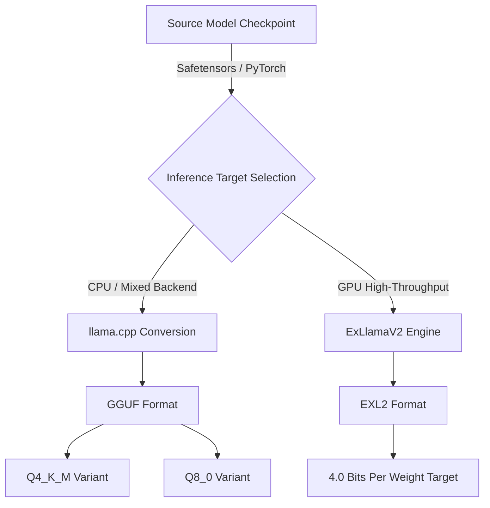

> **Complexity**: `[MEDIUM]`
>
> **Time to Complete**: 60-75 minutes
>
> **Prerequisites**: Open model basics, local inference tradeoffs, basic command-line comfort

---

## What You'll Be Able to Do

- Evaluate model memory and KV cache budgets before choosing hardware for local inference.
- Compare Safetensors, GGUF, and EXL2 formats and select the correct execution path for a target runtime.
- Design a quantization choice that balances hardware capacity, memory bandwidth, perplexity, and output quality.
- Diagnose local inference failures caused by format mismatch, excessive context length, or over-aggressive quantization.

## Why This Module Matters

Hypothetical scenario: your team wants a private summarization assistant for internal design documents, and the security requirement says prompts cannot leave the workstation or the controlled lab network. The model card advertises a capable open-weight model, the download page lists several files with names like `Q4_K_M`, `Q8_0`, `safetensors`, and `exl2`, and the hardware inventory shows a laptop with shared memory plus one older workstation with a discrete GPU. The hard part is not deciding whether local inference is attractive; the hard part is deciding which model artifact can actually run without turning every answer into a slow, unstable experiment.

Quantization is the practical bridge between open-weight research models and local systems that ordinary engineers can operate. A model with billions of parameters is not just a clever algorithm; it is also a physical object expressed as bytes that must fit in memory, cross a memory bus, and leave room for the active conversation state. If you do not calculate those constraints before deployment, the runtime will calculate them for you by crashing, spilling to slow memory, or generating text so slowly that the application becomes unusable.

This module teaches quantization as an engineering decision rather than a vocabulary list. You will preserve the distinction between distribution checkpoints and execution formats, estimate the memory cost of weights and KV cache, reason about why mixed precision often beats a single flat bit depth, and choose between GGUF, EXL2, and Transformers runtime quantization based on the workload. The examples do not require Kubernetes, but later platform modules assume Kubernetes 1.35 or newer when these local inference patterns are packaged into services.

## Model Weights Are a Memory System Problem

The first useful mental model is that a neural network is a large collection of learned numbers that must be read repeatedly during inference. A parameter count tells you how many learned weights exist, while the numeric format tells you how many bytes each weight consumes. A seven-billion-parameter model stored in FP16 uses about fourteen gigabytes for weights alone because each parameter consumes two bytes, and that estimate arrives before tokenizer data, runtime overhead, or conversation state enters the picture.

That calculation explains why local inference feels different from ordinary application deployment. A web service can often be squeezed by reducing concurrency or tuning caches, but a language model must load a large static object before it can answer anything at all. If the model weights do not fit in the fast memory attached to the accelerator or unified memory system, every generated token becomes hostage to slower transfers. Capacity decides whether the model loads, and bandwidth decides whether the loaded model feels usable.

Quantization reduces the number of bits used to represent model weights. Instead of storing every learned value as a sixteen-bit or thirty-two-bit floating-point number, the quantizer maps a range of real values into a smaller integer range and stores the scale needed to interpret those integers. This is lossy compression, not magic. The model becomes smaller and often faster, but the mapping introduces rounding error that may show up as weaker reasoning, brittle instruction following, or degraded performance on edge cases.

The reason quantization works surprisingly well is that trained neural networks contain redundancy. Many weights do not need high precision to preserve the broad behavior of the model, and many layers tolerate small rounding changes without visible quality loss. The reason quantization can fail is that some layers are more sensitive than others, especially attention and feed-forward structures that carry important routing or reasoning behavior. Good formats exploit the redundancy while protecting the sensitive parts.

```ascii
Continuous Floating-Point Distribution
[ -3.14159 ] . . . . . . . . [  0.00000  ] . . . . . . . . [ +3.14159 ]
      |                             |                             |
      |         Quantization        |         Quantization        |
      |           Mapping           |           Mapping           |
      v                             v                             v
[   -128   ] . . . . . . . . [     0     ] . . . . . . . . [   +127   ]
Discrete 8-Bit Integer Range
```

The diagram shows the central bargain. A broad continuous distribution is squeezed into a smaller set of representable values, and the runtime uses scale factors to approximate the original values during matrix operations. With eight bits, the integer range is still wide enough for many layers to remain close to their original behavior. With four bits, the range is much tighter, so the quantizer must be more careful about blocks, outliers, and which tensors deserve extra precision.

Pause and predict: if a layer has values evenly distributed around zero, what happens to the zero-point in a symmetric quantization scheme? The useful answer is that the zero-point can be fixed at zero, which removes an offset operation from the hot path. That can be faster and simpler, but it only works well when the data distribution actually behaves symmetrically enough to avoid wasting half of the integer range.

Post-training quantization is the common path for open-weight local inference because it starts with an already trained model and converts the weights after training has finished. It is accessible, cheap compared with training, and easy for community maintainers to publish in several variants. Quantization-aware training is different: it simulates low-precision effects during training or fine-tuning so the model can adapt to the errors it will later experience. QAT can produce stronger low-bit models, but it requires training access and meaningful compute, so most local practitioners encounter PTQ artifacts first.

The key is to treat bit depth as an operational risk dial. Eight-bit quantization usually saves substantial memory while staying close to the original quality. Five-bit and four-bit mixed schemes are often the practical sweet spot for laptops and workstations because they reduce weight size enough to fit useful models locally. Three-bit and lower variants may be useful for experimentation, but they deserve skepticism unless your evaluation workload proves that the quality loss is acceptable.

There is one more subtle point: quantization changes the representation used for inference, not the abstract promise of the model. The model card may describe a capable source model, but a heavily compressed artifact is a derivative engineering choice with its own behavior. Two files derived from the same checkpoint can differ in memory use, speed, and quality enough that they should be treated as separate release candidates. When you evaluate local inference, record the exact artifact name and not only the base model family.

This distinction also helps explain why community recommendations can sound contradictory. One engineer may say a four-bit model is excellent because their workload is casual chat on short prompts, while another may reject the same artifact because it fails structured extraction over long technical documents. Both reports can be true. The deployment context decides which loss is acceptable, so your job is to translate general model reputation into a measured artifact decision for your workload.

## Weight Footprint, KV Cache, and Bandwidth

The easiest sizing mistake is to calculate only static model weights. During generation, transformer runtimes also maintain a key-value cache that stores intermediate attention state for the tokens already processed in the current context. That cache lets the model avoid recomputing the entire prompt history for every new token, but it grows with context length, batch size, layer count, hidden dimension, and cache precision. A model that loads cleanly with a short prompt can still run out of memory when a real user pastes a long document.

KV cache overhead matters because local inference workloads are often context-heavy. A coding assistant, document summarizer, or retrieval-augmented workflow may send thousands of tokens before the model begins generating a short answer. If the runtime allocates the cache in high precision, the cache can consume several gigabytes even when the quantized weights look modest. Some engines support quantized KV cache settings, which can be a reasonable trade when context length matters more than maximum output fidelity.

Memory bandwidth is the second part of the same problem. Generating a token requires the inference engine to stream model data through compute kernels, and the ceiling on tokens per second is often closer to a memory-bandwidth limit than a raw arithmetic limit. If a thirty-gigabyte model must be read repeatedly on hardware with three hundred gigabytes per second of effective bandwidth, the theoretical upper bound is already constrained before software overhead, cache behavior, or multi-GPU transfers are considered.

This is why spilling across a slow boundary is so damaging. Discrete GPU VRAM is fast, but PCIe transfers to system RAM are much slower and add coordination overhead. A model that barely exceeds VRAM can run worse than a more aggressively quantized model that fits entirely in VRAM, even if the larger model looks better on a benchmark table. For interactive local inference, staying inside the fast memory boundary is often more important than preserving an extra bit of average precision.

Before running this, what output do you expect from a sizing worksheet that includes both weights and KV cache? You should expect a decision that sometimes rejects the theoretically higher-quality file because it leaves no room for context. If an eight-gigabyte device can fit a six-gigabyte quantized model but only has a small cache buffer afterward, it may fail the real workload even though the download page says the file fits.

The practical worksheet is simple enough to do before downloading a model. Start with parameter count, multiply by bytes per parameter for the candidate precision, then add KV cache and runtime headroom. FP16 is roughly two bytes per parameter, eight-bit is roughly one byte, and four-bit is roughly half a byte before format metadata and mixed-precision overhead. K-quant profiles are averages rather than perfectly uniform bit depths, so you should verify the actual file size and leave operational margin.

Exercise scenario: suppose a seventy-billion-parameter model is distributed in FP16, and your server has two twenty-four-gigabyte GPUs. The unquantized weights alone need about one hundred and forty gigabytes, so the deployment is impossible before context is considered. A mixed four-bit profile may land near the high-thirty-gigabyte range for weights, and a four-gigabyte cache allowance can still fit inside the combined hardware budget if the runtime can split layers efficiently. That is the difference between an architectural plan and wishful downloading.

The bandwidth lesson is equally direct. If you can choose between a Q5 file that spills into system RAM and a Q4 file that stays fully inside accelerator memory, the Q4 file may deliver better user experience despite lower nominal precision. The model has to be good enough, but an answer that arrives ten times slower can break the product requirement even when it is slightly more coherent. Quantization is therefore both a memory-capacity tool and a latency-control tool.

A useful habit is to write two budgets, one for a cold load and one for an active session. The cold-load budget covers model weights, tokenizer metadata, runtime libraries, and whatever reservation the engine makes during initialization. The active-session budget adds prompt ingestion, KV cache, generation buffers, and any concurrency you expect to support. Local demos often stop at the cold-load budget because it is easy to observe, but production-like tests fail in the active-session phase when the context window and cache finally become large.

Concurrency makes the cache problem sharper. If a local service handles one user at a time, the cache estimate can be tied to one prompt and one answer stream. If it handles several simultaneous sessions, every active context may need its own cache allocation or scheduling strategy. A quantization choice that works for an interactive single-user assistant may become unsafe when wrapped in a small API server. That is why model selection belongs in capacity planning, not only in a developer's notebook.

The same reasoning applies to batching. Some engines improve throughput by batching prompt processing or generation across requests, but batching changes memory pressure and can interact with cache placement. If the application is latency-sensitive, a larger batch may improve aggregate tokens per second while making individual responses feel worse. If the application is offline summarization, batching may be worth the extra memory. Quantization gives you room to make these scheduling decisions, but it does not remove the need to measure them.

## Formats: Distribution Containers Versus Execution Artifacts

A model file extension is not just packaging trivia. Safetensors, GGUF, and EXL2 answer different questions, and confusing those questions causes many failed local deployments. Safetensors is primarily a secure tensor serialization format used to distribute model checkpoints, especially through Hugging Face workflows. It avoids the code-execution risks associated with pickle-based PyTorch files and supports efficient memory mapping, but it does not automatically make a model small enough or optimized enough for a specific local runtime.

GGUF is an execution-oriented format associated with llama.cpp and the wider ecosystem of CPU, GPU, and mixed-backend local inference tools. A GGUF file can bundle quantized tensors together with tokenizer metadata, chat templates, architecture parameters, and other details the runtime needs to produce correct text. That packaging matters because a model without the right tokenizer or chat template may technically load while behaving strangely. GGUF makes the artifact more portable by keeping those runtime details near the weights.

EXL2 is more specialized. It targets ExLlamaV2-style high-throughput GPU inference and supports continuous target-bitrate quantization, where the quantizer aims for an average bits-per-weight budget rather than a small fixed menu of named buckets. That makes EXL2 attractive when a specific GPU memory budget must be filled tightly. The tradeoff is portability: the artifact is tuned for a narrower runtime family, so it is not the right default when your deployment needs CPU fallback or broad engine compatibility.



The flow is intentionally one-way for most practitioners. You begin with a source checkpoint, decide which runtime family will serve the model, and then select or produce the artifact that runtime expects. A Safetensors checkpoint is a good source of truth for conversion or fine-tuning, not a guarantee of efficient local execution. A GGUF file is usually the most practical artifact for llama.cpp, Ollama-like workflows, and mixed hardware, while EXL2 is a sharper tool for GPU-first serving with ExLlamaV2.

Which approach would you choose here and why: a developer laptop fleet with mixed Apple Silicon and Linux CPU machines, or one controlled inference workstation with a modern NVIDIA GPU? For the fleet, GGUF is usually the safer standard because it travels across engines and backends more easily. For the single controlled workstation, EXL2 may be worth the narrower compatibility if the workload is throughput-sensitive and the team can standardize on the matching runtime.

The old PyTorch `.bin` checkpoint pattern adds another source of confusion. Seeing many shards such as `pytorch_model-00001-of-00042.bin` means you are looking at distribution shards, not a single execution artifact ready for llama.cpp. Those files may be valid inputs for a Python loading stack or conversion process, but they are not the same thing as a quantized GGUF file. Treat every file listing as an interface contract: the artifact must match the runtime, the tokenizer expectations, and the memory budget.

```bash
# Inspecting the metadata and complex tensor structures of a downloaded GGUF format model
# This diagnostic command reveals the exact quantization profiles applied to individual internal layers
llama-gguf-metadata model-q4_k_m.gguf

# Executing the heavily quantized model while explicitly defining the dynamic KV cache context size
# The -c flag strictly allocates precise VRAM boundaries to prevent catastrophic out-of-memory errors
llama-cli -m model-q4_k_m.gguf -c 4096 --temp 0.7 -p "Explain quantization:"
```

The commands are deliberately diagnostic before they are celebratory. Inspecting metadata helps confirm that the file is really the quantization profile you intended to run and that the tokenizer and chat-template metadata are present. Running with an explicit context size makes the cache budget visible rather than accidental. If the first successful run is made with default settings, you may not learn anything about how the model behaves under the context length your application actually needs.

Transformers plus BitsAndBytes occupies a different part of the landscape. Instead of downloading a pre-quantized execution file, a Python application can load a source model with runtime quantization settings, such as eight-bit or four-bit loading. That path is valuable for experimentation, research notebooks, and fine-tuning techniques such as QLoRA, where quantized base weights are frozen while small trainable adapters carry the update. The tradeoff is that runtime quantization may require more Python stack complexity and is not always the leanest serving path.

The format decision should therefore be written down as a deployment contract. Name the source checkpoint, the execution runtime, the quantization profile, the expected context length, and the fallback plan if the runtime cannot allocate the cache. Teams get into trouble when they write only "use the four-bit model" because four-bit can mean several incompatible artifacts, different metadata assumptions, and very different runtime behavior. A precise artifact decision is easier to test, cache, reproduce, and replace.

Artifact provenance matters as much as the extension. A GGUF file can be produced by a careful conversion process with validated metadata, or it can be a stale community upload whose tokenizer settings no longer match the source model's current chat template. A responsible deployment records where the file came from, when it was downloaded, and which conversion or quantization notes were published with it. That does not mean every local project needs a formal model registry, but it does mean the artifact should be traceable enough for another engineer to reproduce the decision.

For teams that publish internal local-inference bundles, the cleanest pattern is to keep the source checkpoint reference and execution artifact reference together. The source checkpoint explains lineage and licensing; the execution artifact explains how the model is actually served. Separating those records prevents two common errors: treating a converted file as if it were the original checkpoint, and treating the original checkpoint as if it were ready for a specific runtime. This documentation discipline becomes more important when several quantized variants are approved for different hardware tiers.

## Mixed Precision and Quality Tradeoffs

Flat quantization applies the same bit depth everywhere, which sounds simple but ignores the uneven sensitivity inside a transformer. Some tensors can tolerate aggressive compression with little visible effect, while others are disproportionately important to coherence or instruction following. Mixed-precision schemes use more bits where the model is sensitive and fewer bits where the model is tolerant. That is why a named average such as `Q4_K_M` should be read as a strategy, not as proof that every value in the model is stored in exactly four bits.

K-quant profiles in GGUF are a practical example of this idea. A profile such as `Q4_K_M` keeps much of the model near four-bit storage while preserving selected tensors or blocks at higher precision. The goal is to protect quality where rounding error hurts most while still shrinking the file enough for local hardware. The "M" profile is a middle ground, and the right choice depends on whether the workload is chat, coding, summarization, extraction, or another task with its own sensitivity.

Perplexity is often used to compare quantization quality because it measures how well a language model predicts text on an evaluation set. Lower perplexity is better, but it is not the whole story. A model can show a small perplexity change and still lose behavior that matters to your application, such as following JSON-output instructions or keeping citations separate from summaries. You should combine perplexity with scenario tests that resemble the real prompts you intend to serve.

This is where many local inference plans become too optimistic. A benchmark may say a four-bit model is close to baseline, but the team may be using a long-context extraction prompt, a strict schema, or a domain vocabulary that was not represented in the benchmark. Quantization errors accumulate differently across tasks. The correct response is not to reject quantization, but to measure it against the workflow that will decide whether the deployment is successful.

For practical selection, eight-bit variants are conservative, four-bit and five-bit mixed variants are common production candidates, and two-bit or very low three-bit artifacts should be treated as constrained experiments. A small model at higher precision can sometimes outperform a larger model that has been compressed too aggressively for the task. The decision is not "largest parameter count possible"; it is "best model behavior inside the memory, bandwidth, latency, and quality envelope."

Quantization also interacts with model architecture. Two models with the same parameter count can react differently to the same nominal bit depth because their layer shapes, activation patterns, vocabulary, and training recipe differ. A four-bit profile that preserves one model's coding ability may weaken another model's reasoning more noticeably. That is why file names should guide the first candidate list, not replace testing. The artifact is a hypothesis about acceptable compression, and your prompt battery is the experiment that confirms or rejects it.

Calibration data is another hidden variable. Some quantization approaches use representative samples to decide which ranges, blocks, or weights deserve precision. If calibration data resembles the target workload, the resulting artifact may preserve useful behavior better. If the calibration set is far from the workload, a mathematically tidy quantization can still damage the behavior you care about. This is especially relevant for narrow domains, structured outputs, and code-heavy prompts where generic text calibration may not exercise the important paths.

You should also distinguish visible nonsense from subtle degradation. An over-compressed model may obviously ramble, contradict itself, or ignore instructions, but the more dangerous failure is quieter. It may produce plausible summaries with missing constraints, valid-looking JSON with wrong fields, or code that compiles but violates the requested behavior. Local inference evaluation should include checks that reveal these subtle errors, because quantization failures are not always dramatic enough for a quick chat test to catch.

EXL2's target bitrate model makes this tradeoff more granular. Instead of picking from a fixed set of names, the quantization process can aim for an average bits-per-weight target like four bits or a little below that, then distribute precision according to calibration and sensitivity. This can be useful when a GPU has a known usable memory budget after cache reservation. The cost is that the artifact becomes more tied to its quantization recipe and runtime.

Apple Silicon unified memory changes the deployment conversation without eliminating the need for quantization. Unified memory can let a model use a larger shared pool than a discrete consumer GPU would expose as VRAM, which makes larger local experiments feasible. However, bandwidth and cache behavior still matter, and the operating system still needs memory for everything else. A model that technically fits may not be the model that gives the best interactive experience.

Discrete GPUs invert the emphasis. Their VRAM is smaller but very fast, and staying inside it is often the top priority for token throughput. Multi-GPU setups add another layer because not every memory pool behaves as one seamless fast pool; transfers across PCIe can become the bottleneck. If a split model spends too much time moving activations or layers between devices, the extra nominal capacity can underperform a smaller single-device fit.

## Worked Example: Choosing a Runnable Artifact

Start with a model candidate and a hardware envelope, not with a download link. Suppose the candidate is a seven-billion-parameter instruct model and the first target is a developer laptop with sixteen gigabytes of usable memory for local inference. FP16 weights are about fourteen gigabytes before KV cache, so the unquantized artifact leaves almost no room for a useful context window. The conclusion is not subtle: the source checkpoint is valuable, but it is not the artifact to run on this laptop.

Now compare candidate quantized files. An eight-bit artifact might land near seven or eight gigabytes for weights, which leaves some context room and should preserve quality well. A `Q5_K_M` style artifact may reduce the footprint further while keeping strong behavior for many tasks. A `Q4_K_M` artifact is often the point where the model becomes comfortable on constrained hardware, with enough room for cache and runtime overhead. The right answer depends on context length and quality tests, not only on file size.

The same candidate on a twenty-four-gigabyte GPU changes the decision. If the workload values maximum throughput and stays within a moderate context window, a higher precision GGUF or an EXL2 artifact may be reasonable. If the runtime is ExLlamaV2 and the machine is dedicated to GPU inference, EXL2 can target the available memory tightly. If the same artifact must also run on CPU fallback machines, GGUF may be less specialized but operationally simpler.

For a seventy-billion-parameter model, the arithmetic becomes more dramatic. FP16 weights require roughly one hundred and forty gigabytes, which rules out ordinary consumer VRAM. A four-bit mixed artifact may reduce the weight footprint to the high-thirty-gigabyte range, and the engineer must still reserve memory for KV cache. On two twenty-four-gigabyte GPUs, this can be feasible only if the runtime can split the model without creating a bandwidth disaster and the context budget remains controlled.

The worked example also shows why the "best" model is not always the largest model you can barely load. If a seventy-billion-parameter artifact leaves almost no cache headroom, the deployment may fail under real prompts. A smaller model at a less aggressive quantization can sometimes produce better application results because it stays fast, preserves more precision, and leaves room for long context. A deployment decision should compare complete behavior, not merely parameter count.

The last step is to document the selection in a repeatable way. Record the source repository, the selected artifact name, the quantization family, file size, expected context length, measured memory at idle, measured memory during generation, and a small set of quality prompts. That worksheet becomes the baseline for future upgrades. When a newer model appears, you can rerun the same worksheet rather than restarting the debate from marketing claims or anecdotal leaderboard results.

A good worksheet also includes a rejection history. If you tested a smaller file and rejected it because schema adherence dropped, write that down. If a higher-precision file was rejected because it spilled beyond VRAM during long-context prompts, write that down too. Future engineers then see the boundary conditions instead of repeating the same tests. This is especially useful in local AI because the ecosystem moves quickly and file names can make old decisions look arbitrary after the original context fades.

The worksheet should be short enough that it gets used. A practical version can fit in a table with one row per candidate artifact and columns for runtime, file size, cache assumption, measured memory, speed, quality result, and decision. The goal is not bureaucracy; the goal is preserving the reasoning that connects hardware facts to model behavior. Once that reasoning is visible, quantization becomes a controlled tradeoff rather than a hopeful download.

## Patterns & Anti-Patterns

The strongest pattern is to reserve context memory before choosing weight precision. Many teams ask "which model fits" when the better question is "which model fits after the target context and runtime overhead are reserved." This pattern works because it protects the workload rather than the download. It scales well when you later add retrieval, longer documents, or multi-turn conversations because the cache budget remains a first-class requirement.

A second pattern is to standardize artifacts by runtime family. Use GGUF when you need llama.cpp compatibility, CPU fallback, or broad local tooling support. Use EXL2 when you control the GPU runtime and need high-throughput specialization. Use Safetensors as the source checkpoint for conversion, training, or Transformers loading. Teams that name both the runtime and artifact format avoid the common mistake of treating every model file as interchangeable.

A third pattern is to evaluate quantization with task-shaped prompts. Perplexity and community reports are useful signals, but your application may care about structured output, code correctness, document faithfulness, or refusal behavior. A small battery of representative prompts catches regressions that generic metrics miss. This pattern also makes upgrades safer because the team can compare a new artifact with the current baseline under the same operational constraints.

The first anti-pattern is chasing the smallest file without measuring quality. Extreme compression can make a model fit on almost anything, but a runnable model that loses instruction-following ability is not a useful deployment. The better alternative is to set a minimum quality bar, then search for the smallest artifact that passes it. That framing keeps memory pressure visible without pretending that all quantized files are equivalent.

The second anti-pattern is ignoring format metadata. A model may load with the wrong chat template, tokenizer assumptions, or runtime configuration and then produce oddly formatted or low-quality answers. The fix is to inspect the artifact metadata and run a known prompt before using the model in an application. GGUF's metadata packaging helps here, but it does not remove the responsibility to verify the file you downloaded.

The third anti-pattern is using system RAM spill as a normal operating mode for interactive inference. Spill can be acceptable for a one-time experiment, but it is a poor default for a user-facing assistant because bandwidth collapses and latency becomes unpredictable. The better design is to choose a quantization profile, context length, and runtime placement that keep the hot path inside fast memory. When that is impossible, change the model or the requirement rather than hiding the bottleneck.

| Pattern | Use It When | Why It Works | Scaling Concern |
|---|---|---|---|
| Reserve KV cache first | Context length is part of the product requirement | Prevents a model from fitting only under toy prompts | Revisit the estimate when retrieval or longer chats are added |
| Standardize by runtime | Multiple artifacts exist for the same model | Keeps format, tokenizer, and engine assumptions aligned | Document fallback runtimes before publishing a standard |
| Test with task-shaped prompts | Quality matters more than raw token speed | Catches failures that perplexity alone may miss | Keep the prompt set small enough to run on every upgrade |
| Prefer fast-memory fit | The model barely exceeds VRAM or unified-memory budget | Avoids bandwidth collapse from spill behavior | May require accepting a lower precision or smaller model |

## Decision Framework

Begin the decision by identifying the runtime boundary. If the workload must run across laptops, CPU machines, and mixed hardware, choose a GGUF-centered path unless a specific reason says otherwise. If the workload is a Python research or fine-tuning workflow, consider Safetensors plus Transformers runtime quantization. If the workload is a controlled GPU serving box optimized for ExLlamaV2, evaluate EXL2. The runtime boundary determines which artifacts are even candidates.

Next, reserve memory for context and overhead. Decide the target context length, estimate KV cache cost, and leave a buffer for the operating system and runtime. Only then compare artifact sizes. If the candidate file plus cache does not fit comfortably, move to a more compressed profile or a smaller model. Treat "barely fits" as a warning, because real prompts, batch settings, and concurrency often consume more memory than the first smoke test.

Then choose the quality floor. If the assistant must produce reliable structured output or technical summaries, start with eight-bit or five-bit candidates and prove that four-bit passes the task battery before adopting it. If the application is exploratory, offline, or latency-sensitive with human review, four-bit mixed precision may be the natural starting point. If very low-bit artifacts are the only way to fit, write down the expected quality risk before anyone mistakes the result for a general model evaluation.

Finally, validate the artifact in the same mode you will operate it. Use the real runtime, a realistic context size, and representative prompts. Watch memory consumption during the prompt ingestion phase and the generation phase, because they stress the system differently. Record tokens per second only after confirming that the output quality still meets the task. A fast broken answer is not a performance win.

When two candidates both pass quality tests, prefer the one that leaves more operational margin unless the latency difference is decisive. Margin protects the deployment from longer prompts, slightly larger future system prompts, background memory pressure, and runtime version changes. This is ordinary systems engineering applied to model files. Running at the edge of memory capacity may look efficient on a spreadsheet, but it can make the service fragile under the first realistic workload variation.

When no candidate passes both quality and memory constraints, change one of the constraints explicitly. You might reduce context length, choose a smaller base model, add hardware, use retrieval to shorten prompts, or accept a slower offline workflow. What you should not do is pretend that a failing artifact is good enough because it technically generated text once. The decision framework is useful because it makes these tradeoffs visible early, when changing the architecture is still cheaper than debugging an unstable local deployment.

| Constraint | Prefer | Avoid | Reason |
|---|---|---|---|
| Mixed local hardware | GGUF with conservative K-quant profiles | EXL2 as the only artifact | GGUF gives broader runtime compatibility |
| Dedicated NVIDIA GPU throughput | EXL2 or GPU-optimized GGUF | CPU-only conversion assumptions | The artifact should match the serving kernels |
| Long context summarization | More cache headroom, possible KV cache quantization | Filling memory entirely with weights | Context memory becomes part of correctness and stability |
| Strict quality threshold | Q8 or Q5-style candidates first | Jumping directly to very low-bit files | Quality loss must be measured before memory savings win |
| Fine-tuning with adapters | Safetensors plus Transformers and BitsAndBytes | Pre-quantized GGUF as the training source | Adapter workflows usually need the Python model stack |

## Did You Know?

- Safetensors was designed to avoid arbitrary code execution during tensor loading, which is why it became important as model distribution moved beyond trusted local files.
- GGUF stores more than weights; tokenizer details and chat-template-related metadata can live alongside tensors, reducing the chance of a runtime using the wrong surrounding assumptions.
- QLoRA showed in 2023 that four-bit quantized base models could support practical adapter fine-tuning, which helped make low-memory experimentation much more accessible.
- A model that fits in memory can still be slow if it crosses a bandwidth boundary, so "loads successfully" is only the first deployment test.

## Common Mistakes

| Mistake | Why It Happens | How to Fix It |
|---|---|---|
| Confusing raw Safetensors containers with execution-optimized quantization | The download page lists model files together, so engineers assume every file is a runnable local artifact. | Treat Safetensors as a secure distribution or training checkpoint, then choose GGUF, EXL2, or runtime quantization based on the serving engine. |
| Ignoring dynamic KV cache growth | Early smoke tests use short prompts, so the model appears stable until real context windows arrive. | Reserve cache memory during sizing, test with realistic prompts, and consider KV cache quantization only after measuring quality. |
| Selecting a format incompatible with the runtime | The team chooses the smallest or newest file name without checking which engine produced it. | Align artifact and runtime explicitly: GGUF for llama.cpp-style engines, EXL2 for ExLlamaV2, and Safetensors for Transformers workflows. |
| Chasing two-bit memory savings for serious reasoning tasks | Hardware pressure makes the smallest file look attractive before quality tests are run. | Establish a quality floor with representative prompts, then adopt the lowest precision that still passes the workload. |
| Evaluating only tokens per second | Speed is easy to measure, while coherence, schema discipline, and faithfulness require better test prompts. | Pair throughput measurements with task-shaped quality checks and record both results in the selection worksheet. |
| Clinging to deprecated or poorly documented artifacts | Old examples and mirrors may still reference formats that lack modern metadata or runtime support. | Prefer current GGUF, EXL2, or documented Transformers paths from active projects and verify metadata before deployment. |
| Splitting models across slow memory boundaries casually | Combined capacity looks sufficient on paper, so transfer costs are ignored. | Keep the hot path inside fast memory whenever possible and benchmark any multi-device split under realistic prompts. |

## Quiz: Scenario Checks

<details>
<summary>Your team has a sixteen-gigabyte laptop target and a seven-billion-parameter FP16 checkpoint that needs about fourteen gigabytes for weights before KV cache. What should you change before calling the deployment feasible?</summary>

Choose a quantized execution artifact and include KV cache in the sizing decision. The FP16 checkpoint leaves almost no room for context, so it may load under a tiny prompt while failing the actual workload. A GGUF `Q4_K_M` or `Q5_K_M` candidate is a more plausible starting point, provided it passes task-shaped quality checks. The important reasoning is that feasibility means weights plus cache plus overhead, not just static model size.

</details>

<details>
<summary>You downloaded a Safetensors repository and tried to run it directly with a llama.cpp command, but the engine expects a GGUF file. What is the diagnosis?</summary>

The artifact format does not match the runtime contract. Safetensors is appropriate as a secure checkpoint format and as a source for conversion or Transformers loading, but llama.cpp-style execution normally expects GGUF. The fix is to obtain or produce a GGUF artifact with the intended quantization profile and metadata. This is not a hardware failure; it is a format-selection failure.

</details>

<details>
<summary>A `Q5_K_M` file barely spills into system RAM, while a `Q4_K_M` file stays fully inside GPU VRAM. Which one should you test first for an interactive assistant?</summary>

Test the `Q4_K_M` file first because staying inside fast VRAM often matters more for user experience than preserving a small amount of extra precision. The `Q5_K_M` file may be higher quality in isolation, but system RAM spill can collapse token generation speed and make latency unpredictable. The correct final answer still depends on output quality tests, but the first operational candidate should avoid the bandwidth boundary. If `Q4_K_M` fails the quality floor, then you revisit hardware, context length, or model size.

</details>

<details>
<summary>Your GPU server is dedicated to ExLlamaV2 and has a known memory budget after reserving cache. Which artifact family should you evaluate, and why?</summary>

EXL2 is the natural candidate because it is designed for ExLlamaV2-style GPU inference and can target an average bits-per-weight budget closely. That helps fill a specific memory envelope without relying only on broad fixed buckets. GGUF may still be useful for compatibility, but it is not the specialized default for this runtime. Safetensors remains the source checkpoint path rather than the optimized serving artifact.

</details>

<details>
<summary>A four-bit model passes general chat prompts but repeatedly breaks your required JSON schema in a document extraction workflow. What should you do next?</summary>

Treat the quantization candidate as failing the application workload, even if generic benchmarks look acceptable. Move to a less aggressive profile such as a five-bit or eight-bit candidate, reduce context pressure, or test a smaller model at higher precision. The reason is that structured-output discipline can degrade before casual chat quality looks broken. Your quality floor must be based on the task the system actually performs.

</details>

<details>
<summary>During a long-document test, generation speed falls sharply only after the prompt length grows. What is the most likely memory-related cause?</summary>

The KV cache likely expanded beyond the fast-memory budget and forced spill or heavy memory pressure. Static weights may still fit, which explains why short prompts looked healthy. The fix is to reduce context length, quantize the KV cache if the runtime supports it, select a smaller or more compressed model, or use hardware with more suitable memory. This diagnosis follows from the fact that cache grows with the active context, not merely with model parameter count.

</details>

<details>
<summary>A teammate wants to standardize on the smallest available file for every local model because it maximizes hardware coverage. How should you respond?</summary>

Push back by separating hardware coverage from application quality. The smallest file may run widely, but very aggressive quantization can damage instruction following, schema reliability, or domain-specific reasoning. A better standard is the smallest artifact that passes a documented prompt battery inside the target memory and latency envelope. That gives the team a repeatable engineering rule rather than a file-size reflex.

</details>

## Hands-On Exercise

In this exercise, you will build a small model-selection worksheet for a local inference target. You do not need to download a large model if your machine cannot comfortably do so; the goal is to make the decision process explicit enough that another engineer could reproduce it. Use a real model card, a candidate runtime, and your actual hardware limits wherever possible, and clearly label any estimate that you cannot measure directly.

- [ ] Choose a source model repository, identify whether its primary checkpoint is Safetensors or another distribution format, and calculate the approximate FP16 weight footprint from the parameter count.
- [ ] Define a target hardware envelope, including fast memory capacity, expected context length, and a reserved KV cache budget for the workload.
- [ ] Compare at least three candidate artifacts or loading paths, such as GGUF `Q4_K_M`, GGUF `Q5_K_M`, EXL2, or Transformers with BitsAndBytes runtime quantization.
- [ ] Select one artifact for a constrained laptop or edge device and justify the choice using weights, KV cache, memory bandwidth, and expected quality.
- [ ] Select one artifact for a dedicated GPU workstation and explain whether GGUF, EXL2, or Transformers runtime quantization best matches the runtime.
- [ ] Run a short inference smoke test if you have a compatible local engine, then record memory use, context size, tokens per second, and any visible quality issues.

<details>
<summary>Solution guidance</summary>

A strong worksheet names the source checkpoint separately from the execution artifact. For example, it might list a seven-billion-parameter instruct model in Safetensors as the source, then compare a `Q4_K_M` GGUF file for a laptop, a `Q5_K_M` GGUF file for a larger unified-memory machine, and an EXL2 file for a controlled NVIDIA GPU runtime. The best answer reserves cache before declaring a model feasible, because long prompts can invalidate a plan that looked safe from file size alone.

</details>

Success criteria:

- [ ] Your worksheet separates source checkpoints from execution artifacts.
- [ ] Your memory estimate includes static weights, KV cache, and operational headroom.
- [ ] Your selected constrained-device artifact fits inside the fast-memory budget without planned spill.
- [ ] Your selected workstation artifact matches the chosen runtime family.
- [ ] Your quality notes include at least one task-shaped prompt, not only a token-speed measurement.

## Sources

- [Quantization concepts](https://huggingface.co/docs/transformers/en/quantization/concept_guide) — Explains how lower-precision weight representations change memory use, speed, and quality tradeoffs.
- [GGUF](https://huggingface.co/docs/transformers/gguf) — Describes the GGUF file format and its role in llama.cpp-style local inference workflows.
- [Transformers quantization](https://huggingface.co/docs/transformers/en/main_classes/quantization) — Documents practical lower-bit quantization support and loading options for running models on constrained hardware.
- [QLoRA: Efficient Finetuning of Quantized LLMs](https://arxiv.org/abs/2305.14314) — Provides deeper background on why 4-bit quantization became important for practical work with larger models.
- [llama.cpp GGUF documentation](https://github.com/ggml-org/llama.cpp/blob/master/docs/gguf.md) — Documents GGUF metadata and llama.cpp format expectations.
- [llama.cpp project](https://github.com/ggml-org/llama.cpp) — Provides the primary open-source runtime used by many GGUF local inference workflows.
- [Safetensors repository](https://github.com/huggingface/safetensors) — Documents the secure tensor serialization project used for checkpoint distribution.
- [Safetensors documentation](https://huggingface.co/docs/safetensors) — Explains Safetensors usage and memory-mapping behavior.
- [ExLlamaV2 repository](https://github.com/turboderp-org/exllamav2) — Documents the GPU-focused runtime associated with EXL2 artifacts.
- [BitsAndBytes repository](https://github.com/bitsandbytes-foundation/bitsandbytes) — Provides the library commonly used for low-bit Transformers loading.
- [Transformers BitsAndBytes guide](https://huggingface.co/docs/transformers/en/quantization/bitsandbytes) — Shows practical eight-bit and four-bit loading configuration in the Transformers stack.

## Next Module

Continue to [MLX on Apple Silicon](./module-1.4-mlx-on-apple-silicon/) to see how unified memory and Apple-focused runtimes change local inference decisions.
