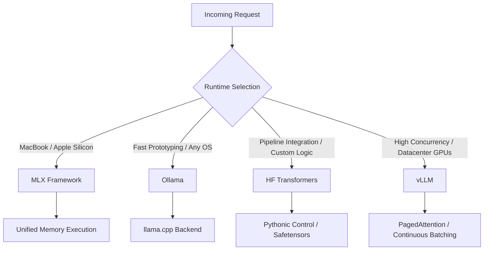

> **Complexity**: `[MEDIUM]`
>
> **Time to Complete**: 45-60 min
>
> **Prerequisites**: Open model basics, local model formats, basic Python, and a working mental model of GPU memory

---

## What You'll Be Able to Do

- Evaluate runtime architectures by matching Ollama, MLX, Transformers, and vLLM to hardware constraints, latency goals, and concurrency requirements.
- Compare desktop convenience, Apple-native execution, code-first experimentation, and production serving without treating their APIs as interchangeable wrappers.
- Design a multi-stage local inference stack that moves from developer laptops to evaluation pipelines to Kubernetes 1.35+ production serving.
- Diagnose performance and quality problems by tracing quantization, tokenizer behavior, KV cache pressure, batching, and hardware backend choices.

## Why This Module Matters

Hypothetical scenario: a platform team prototypes an internal coding assistant on laptops with a friendly local model tool, then copies that same runtime into a shared GPU environment because the first demo looked convincing. The local demo felt fast because one developer sent one request at a time, but the shared environment receives bursts from many engineers, every prompt competes for KV cache memory, and the runtime has no serious scheduling strategy for concurrent traffic.

That scenario is common because the surface area looks deceptively similar. Each tool accepts a prompt, loads model weights, and returns generated text, so it is tempting to describe the choice as taste or packaging. In practice, the runtime owns the hardest operational decisions: how weights are represented, how tensors move through memory, how requests are batched, how much internal state is exposed, and how tightly the software is coupled to a specific accelerator backend.

This module teaches you to choose the runtime by the job it is doing, not by whichever command first produced a satisfying answer. You will learn why Ollama is excellent for fast onboarding, why MLX is unusually strong on Apple Silicon, why Hugging Face Transformers remains the control plane for custom model work, and why vLLM exists for high-throughput serving rather than casual laptop experimentation.

The goal is not to declare a universal winner. A mature inference strategy often uses more than one runtime across the same model lifecycle, just as a software team uses an editor, a test runner, a package manager, and a production orchestrator for different parts of the same application. The skill is knowing where each runtime stops being helpful and where the next layer should take over.

## The Inference Runtime Is Part of the Architecture

An inference runtime is the software layer that turns model weights into generated tokens, but that simple description hides most of the engineering work. The runtime must load files from disk, map tensors onto devices, compile or call hardware kernels, allocate temporary memory, maintain the KV cache for active context, apply sampling rules, and expose an interface that applications can call. Two tools can both run the same open-weight model while making radically different choices at every one of those steps.

The first practical question is where the runtime sits on the abstraction spectrum. A desktop convenience runtime optimizes for installation, model discovery, and a stable API that feels easy from any programming language. A code-first framework optimizes for visibility and control, even when the developer has to manage more details directly. A serving runtime optimizes for the shape of production traffic, where many requests arrive at once and GPU utilization matters more than one clean command.

```ascii
+-----------------------------------------------------------------------+
|                 The Inference Runtime Abstraction Spectrum            |
+----------------------+----------------------+-------------------------+
| Desktop Convenience  | Engineering Control  | Production Throughput   |
+----------------------+----------------------+-------------------------+
| - Ollama             | - HF Transformers    | - vLLM                  |
| - LM Studio          | - PyTorch Native     | - TGI (Text Gen Inf)    |
| - MLX (Apple Native) | - JAX                | - TensorRT-LLM          |
+----------------------+----------------------+-------------------------+
| API-First            | Code-First           | Infrastructure-First    |
| Developer-focused    | Researcher-focused   | SRE-focused             |
| Hardware-abstracted  | Hardware-aware       | Hardware-maximized      |
+----------------------+----------------------+-------------------------+
```

The diagram is useful because it separates user experience from operational intent. Ollama and similar tools make the first prompt easy, which is a real engineering advantage during discovery. Transformers makes the internal machinery available, which matters when you are measuring, adapting, or debugging the model. vLLM makes the server behave like a throughput engine, which matters when idle VRAM and fragmented KV cache turn into real infrastructure cost.

The confusing case is MLX, because it can feel both convenient and code-first depending on how you use it. MLX is not merely a wrapper around a generic backend; it is a machine learning framework designed around Apple Silicon and unified memory. When the target hardware is a Mac with an M-series chip, MLX can be the native path rather than a compromise, especially for developers who need Python-level control without fighting a CUDA-shaped ecosystem.

Pause and predict: if the same model gives acceptable answers through a hosted full-precision endpoint but weaker answers through a local desktop runtime, which layer would you inspect first? A beginner often blames the model family immediately, but the more useful first checks are quantization format, context length, tokenizer compatibility, sampling defaults, and whether the runtime silently selected a smaller or more compressed artifact.

The runtime choice also shapes how easily you can reproduce a bug. An API-first tool might hide enough details that two machines appear to run the same model while using different quantized files or default parameters. A code-first tool makes the configuration explicit but asks the engineer to own more setup. A serving tool may add continuous batching and request scheduling, which are great for throughput but can make single-request debugging feel less direct.

Think of the runtime as the kitchen, not just the waiter. The same recipe can taste different when cooked on a camp stove, a home induction range, or a restaurant line with multiple cooks coordinating orders. The prompt is the order, the model weights are the ingredients, and the runtime decides how quickly, consistently, and observably the meal is prepared.

This is why runtime selection belongs in architecture review, not only in developer setup notes. A runtime can lock in file formats, influence how evaluation evidence is collected, and determine whether platform teams can observe the system under load. If that decision is made casually, the first serious performance or quality incident becomes harder to explain because the team never wrote down which layer was responsible for which behavior.

The best reviews include both happy-path and failure-path questions. What happens when the prompt is twice as long as the demo prompt, when ten requests arrive together, when the model artifact changes revision, or when a developer needs token-level evidence? Those questions sound operational, but they are also pedagogical because they teach the team how the runtime actually shapes model behavior.

The safest architecture starts by naming the job in front of you. Are you trying to help one developer evaluate model behavior today, let researchers inspect tensors and adapters tomorrow, or serve many users next month? Once the job is clear, the runtime decision becomes a set of tradeoffs rather than a debate about brand preference.

## Desktop Simplicity: Ollama and MLX

Ollama is usually the fastest route from curiosity to a local model response on a mixed team. It packages a background service, a command-line interface, model management, and an HTTP API into a workflow that resembles pulling and running a container image. That matters because early exploration dies quickly when every developer has to debug drivers, Python environments, model file formats, and GPU backend flags before anyone can test whether the model is useful.

The abstraction is intentionally thick. A developer can pull a model, call a local endpoint, and wire an application against an OpenAI-like flow without learning every detail of GGUF, quantization, or `llama.cpp` build options. This is the right trade when the question is whether a model class can solve a task at all, because the team needs a fast feedback loop more than it needs perfect control.

That same abstraction becomes a liability when the investigation moves from "does this feel promising" to "why did this answer change." Ollama may be using a quantized artifact that fits comfortably in consumer memory but does not match the numerical behavior of a full-precision checkpoint. It may also expose fewer internal hooks than a researcher needs for tokenizer experiments, logit processing, adapter swapping, or hidden-state analysis.

The important lesson is that quantization is not just compression. Lower-bit formats can make local inference practical by shrinking memory use and improving throughput, but they also change how precisely weights are represented. Many tasks tolerate that tradeoff well, while other tasks, such as brittle reasoning, exact code generation, or structured extraction under tight constraints, can reveal quality differences that look mysterious until you compare the actual artifacts.

MLX solves a different local problem. Apple Silicon machines share memory between CPU and GPU, which means the old mental model of copying tensors from system RAM into a separate GPU VRAM pool does not describe the hardware well. MLX leans into that unified memory design and provides array operations, model utilities, and examples that feel natural to Python developers while targeting Apple's Metal stack.

For Mac-heavy teams, MLX can be the difference between treating a laptop as a toy and treating it as a serious local experimentation machine. A large-memory Mac can run workloads that would be awkward through generic CPU fallback or poorly matched GPU abstractions. The developer still has to respect memory pressure, thermal behavior, and model size, but the runtime is at least aligned with the machine rather than pretending it is a small Linux GPU server.

Ollama and MLX can coexist inside one team. Windows and Linux developers may use Ollama for a shared local API, while Mac developers use MLX for native performance and deeper experiments. The risk is not having two tools; the risk is pretending their outputs are automatically comparable when file formats, quantization levels, tokenizer handling, and sampling defaults differ.

Before running this locally, what output do you expect if two developers call "the same" model name from two different runtimes? Write down whether you expect identical tokens, similar meaning, or visibly different behavior, then identify which settings would have to match before an evaluation result could be trusted. That prediction habit will save you from treating a runtime mismatch as a model failure.

The practical operating rule is simple: use Ollama when ease of access and API stability are the main constraints, and use MLX when Apple-native execution and Python-level control matter more than cross-platform uniformity. Neither choice commits you to production serving, and neither should be used as the only evidence that a model is ready for high-concurrency deployment.

Exercise scenario: a legal research team has five M-series laptops, several Windows desktops, and no shared GPU cluster yet. A sensible first week might use Ollama to let every engineer hit a local endpoint, MLX to let Mac-based data scientists inspect model behavior with native performance, and a written compatibility checklist to record the exact model files, context lengths, and sampling settings used in every experiment.

That compatibility checklist should be boring and explicit. It should name the friendly model label, the underlying repository or file, the quantization level, the context window, the prompt template, and the sampling configuration. When two developers disagree about quality, the checklist turns the discussion from subjective impressions into a controlled comparison that can be repeated.

Local runtimes also need resource budgets, even when they are not production systems. A laptop running a model is still competing with an editor, browser tabs, container tools, and video calls. If a runtime aggressively uses memory, the developer may experience operating-system pressure that looks like model latency but is actually the whole machine struggling to stay responsive.

The practical compromise is to start small and measure honestly. Use a smaller model or heavier quantization for application plumbing, then reserve larger or less-compressed artifacts for targeted quality checks. This prevents the team from teaching itself that local inference is unreliable when the real issue is that every laptop was asked to behave like a dedicated accelerator server.

## Engineering Control: Hugging Face Transformers

Hugging Face Transformers sits lower in the stack than an API-first local runtime. Instead of asking a daemon to "run this model," you usually instantiate a tokenizer, load a model class, place tensors on a device, configure generation, and call the model directly from Python. That extra ceremony is not accidental; it is what gives an engineer the ability to inspect and control the model path.

Transformers is the right tool when your question involves the mechanics of inference rather than only the application result. You can check whether tokenization changed a prompt boundary, force deterministic generation for evaluation, capture token-level scores, experiment with decoding strategies, and connect model execution to the rest of the Python machine learning ecosystem. Those capabilities matter when the team is building a repeatable evaluation pipeline or diagnosing why a model fails on specific examples.

The cost is that Transformers is not automatically a production server. A straightforward script can be clear and correct while still processing requests inefficiently, leaving GPU utilization low and memory behavior poor under concurrency. That is acceptable for evaluation jobs, fine-tuning experiments, and controlled batch analysis, but it is usually the wrong endpoint shape for a user-facing service that must handle many overlapping conversations.

Transformers also becomes essential when adapters and customization enter the picture. If a team trains a LoRA adapter for internal SQL style, contract language, or Kubernetes troubleshooting answers, someone must load the base model, attach or merge the adapter, and evaluate whether the change improved the target behavior without breaking the baseline. That workflow needs programmatic access to the model and tokenizer, not only a generic prompt endpoint.

Here is a deliberately small example of the kind of explicitness that code-first inference provides. The point is not that every module should use this exact model or device setting, but that the runtime makes generation choices visible in code. A reviewer can see the model identifier, tokenizer path, maximum new tokens, deterministic sampling choice, and device mapping instead of guessing what a background service selected.

```python
from transformers import AutoModelForCausalLM, AutoTokenizer

model_id = "Qwen/Qwen2.5-0.5B-Instruct"

tokenizer = AutoTokenizer.from_pretrained(model_id)
model = AutoModelForCausalLM.from_pretrained(model_id, device_map="auto")

prompt = "Explain when a local inference runtime should change between prototype and production."
inputs = tokenizer(prompt, return_tensors="pt").to(model.device)

outputs = model.generate(
    **inputs,
    max_new_tokens=120,
    do_sample=False,
)

print(tokenizer.decode(outputs[0], skip_special_tokens=True))
```

This kind of script is valuable for controlled measurement because each important choice can be versioned with the evaluation code. If a model answer changes, the team can inspect the model revision, tokenizer revision, generation parameters, library version, and hardware mapping. That does not eliminate all nondeterminism, but it gives the investigation a surface area that is far richer than "the endpoint returned a different sentence today."

Transformers is also where many format boundaries become explicit. Model repositories may include Safetensors files, tokenizer JSON, model configuration, generation configuration, and adapter files. A desktop runtime may consume a converted GGUF file instead, which is useful for local speed but can hide the relationship between the original checkpoint and the artifact being tested.

Which approach would you choose here and why: a nightly evaluation job that checks a fixed set of prompts against three candidate adapters, or a chat endpoint that must serve hundreds of users during business hours? The first job needs control, repeatability, and transparent scoring, so Transformers is a strong fit. The second job needs concurrency management and server ergonomics, so a serving runtime is the better target.

The mature pattern is to let Transformers own evaluation truth even when a different runtime owns developer convenience. A team can prototype through Ollama, run adapter experiments through Transformers, and later serve through vLLM, as long as it records exactly how artifacts move between those layers. Without that record, the team may unknowingly compare a quantized desktop artifact against an unquantized evaluation checkpoint and draw the wrong conclusion.

Transformers also gives reviewers a place to encode acceptance criteria. A quality gate can assert that a model produces valid JSON for structured extraction, avoids a forbidden answer pattern, or keeps a score above a threshold on a curated dataset. Those checks are much easier to maintain when the runtime path is ordinary code with pinned dependencies rather than a manual conversation with a desktop application.

The tradeoff is maintenance. Python dependency versions, accelerator libraries, and model repository changes can all affect a code-first pipeline, so the team should treat the evaluation environment like production-adjacent infrastructure. Lock files, container images, model revision pins, and deterministic test datasets are not bureaucracy; they are the mechanism that makes model comparisons meaningful across time.

Another useful pattern is to separate exploration notebooks from evaluation scripts. A notebook is excellent for learning, visualization, and quick experiments, but it can hide state between cells and make results difficult to reproduce. A script or small package can import the same model utilities while forcing every input, output, and configuration choice to be visible to reviewers.

## Production Throughput: vLLM

Production serving changes the question from "can this model answer one prompt" to "can this system keep many active conversations moving without wasting the accelerator." Large language models do not merely consume memory for weights; each active request also consumes KV cache memory that grows with context length and generated tokens. When requests overlap, KV cache management becomes one of the main determinants of how many users a GPU can support.

Naive batching is inefficient because requests have different prompt lengths and finish at different times. If a server waits for a whole batch to finish before admitting new work, fast requests are held back by slow ones. If it reserves large contiguous KV cache chunks for every possible maximum context, short requests waste memory that could have served other users.

vLLM exists to solve that serving problem. Its best-known idea, PagedAttention, borrows from operating system memory paging by storing KV cache in blocks rather than requiring one large contiguous allocation per request. That lets the runtime reduce fragmentation and keep more active sequences resident, which is a major advantage when production traffic includes a mix of short questions, long documents, and generated follow-up answers.

Continuous batching is the other key concept. Instead of treating a batch as a static group that starts and ends together, the server can add new requests as others finish. The GPU spends more time doing useful work, and the serving layer has a better chance of smoothing bursts without forcing every client to wait behind the slowest prompt in an old batch.



The diagram shows why vLLM is not simply "the faster one." It is optimized for high-concurrency serving on accelerator backends that match its kernel and scheduling assumptions. If you force it into a laptop workflow where one developer sends one prompt at a time, the extra server machinery may add complexity without showing the benefits that justify it.

That does not mean developers should ignore vLLM until launch week. Teams planning Kubernetes 1.35+ production serving should test vLLM early enough to discover model compatibility, memory profiles, container images, OpenAI-compatible API behavior, and observability needs. The mistake is using vLLM as the casual notebook runtime, not using it as a production candidate.

Here is a small Kubernetes deployment sketch for a vLLM-style serving container. Treat it as a shape to reason about, not a universal manifest, because real clusters need node selectors, runtime classes, image policy, persistent model storage, authentication, autoscaling, and observability decisions that depend on the platform.

```yaml
apiVersion: apps/v1
kind: Deployment
metadata:
  name: coding-assistant-vllm
  labels:
    app: coding-assistant-vllm
spec:
  replicas: 1
  selector:
    matchLabels:
      app: coding-assistant-vllm
  template:
    metadata:
      labels:
        app: coding-assistant-vllm
    spec:
      containers:
        - name: vllm
          image: vllm/vllm-openai:latest
          args:
            - --model
            - Qwen/Qwen2.5-7B-Instruct
            - --max-model-len
            - "8192"
          ports:
            - containerPort: 8000
          resources:
            limits:
              nvidia.com/gpu: "1"
```

The manifest exposes another tradeoff: production serving is no longer only a Python decision. The team must think about GPU scheduling, model download strategy, container startup time, request authentication, rollout safety, readiness probes, and how model memory behaves during rolling updates. vLLM helps with inference throughput, but the platform still has to manage the lifecycle around it.

Debugging vLLM also requires a different instinct than debugging a local wrapper. When latency spikes under load, you inspect queue time, batch composition, prompt lengths, maximum model length, KV cache utilization, GPU memory headroom, and whether clients are streaming responses or waiting for full completions. Those are serving-system questions, not only model-quality questions.

A useful rule is to separate semantic quality from serving quality. If a model gives the wrong answer under deterministic evaluation, vLLM is probably not the first suspect. If the same model answers correctly in evaluation but times out or crashes during concurrent traffic, then vLLM configuration, model length, memory pressure, and scheduling behavior become central to the diagnosis.

Production readiness also requires observing the serving layer in terms the runtime understands. Requests per second is not enough because two requests can differ dramatically in prompt tokens, generated tokens, and cache residency. Better dashboards distinguish prefill time, decode time, queue time, token throughput, error categories, and memory headroom, because each metric points to a different operational fix.

Capacity planning should use realistic traffic, not only benchmark prompts. A synthetic prompt with a short question can make a server look healthy while the real application sends retrieved documents, chat history, and formatting instructions in every request. If the target application is retrieval-heavy, the load test should include retrieved context blocks and the same maximum generation settings that production clients will use.

Serving also changes deployment risk. Rolling out a new model can temporarily double memory needs if old and new pods overlap, and a slow cold start can make an autoscaler look ineffective. Platform engineers should plan image pulls, model downloads, readiness behavior, and rollback strategy with the same seriousness they bring to any stateful or resource-heavy service.

## Worked Example: A Multi-Runtime Inference Strategy

Exercise scenario: a startup is building a retrieval-augmented legal document assistant. Five data scientists use M-series MacBooks, ten software engineers use Windows desktops, and production will run in a managed Kubernetes 1.35+ cluster with NVIDIA datacenter GPUs. The team needs local development, adapter experimentation, deterministic evaluation, and production serving without pretending one runtime is best for every phase.

The first phase is developer onboarding. Windows engineers need a local endpoint quickly so they can build application flows, test prompt templates, and practice failure handling without waiting for shared GPU capacity. Ollama fits because it reduces setup work, gives the application a predictable local API, and lets engineers pull a reasonably small quantized model that runs beside their editor and browser.

The Mac-based data scientists get a different path. They use MLX for local Apple-native experimentation when they need fast iteration on M-series hardware, especially when testing smaller models, conversions, or local analysis loops. That choice respects the hardware rather than forcing every laptop into the same abstraction for the sake of process neatness.

The evaluation pipeline uses Transformers because evaluation is where hidden defaults become dangerous. The team pins model revisions, tokenizer revisions, generation settings, adapter versions, and evaluation datasets. It can then compare a baseline checkpoint, a LoRA-adapted checkpoint, and a quantized local artifact while being explicit about what changed.

The production path uses vLLM because the cluster must serve many legal staff and engineers concurrently. Long legal passages create high KV cache pressure, and usage may arrive in bursts around document review cycles. PagedAttention and continuous batching directly address that workload shape, while Kubernetes handles scheduling and lifecycle concerns around the serving pods.

The artifact flow is the glue. A model may begin as Safetensors files in a model hub repository, pass through adapter training and evaluation in Transformers, be converted to a GGUF artifact for desktop experimentation, and be served from a compatible checkpoint through vLLM in production. The team should document every conversion because the artifact is part of the measurement, not a footnote.

```text
+----------------------+     +----------------------+     +----------------------+
| Data Science Macs    |     | Evaluation Pipeline  |     | Production Cluster   |
| MLX experiments      | --> | Transformers control | --> | vLLM serving         |
| local notebooks      |     | pinned revisions     |     | continuous batching  |
+----------------------+     +----------------------+     +----------------------+
          |                             ^
          v                             |
+----------------------+                |
| Developer Desktops   |                |
| Ollama local API     | ---------------+
| GGUF smoke tests     |
+----------------------+
```

This architecture has an obvious risk: evaluation drift. If developers test a quantized GGUF artifact through Ollama, data scientists inspect a converted MLX artifact, and CI scores a Safetensors checkpoint through Transformers, the team can accidentally compare three related but distinct systems. The mitigation is a release record that names the source checkpoint, conversion commands, quantization level, tokenizer revision, adapter revision, and runtime-specific generation settings.

Another risk is overfitting the deployment plan to the first model. A seven-billion-parameter model may fit comfortably in several runtimes, while a much larger model may force different quantization, tensor parallelism, context limits, or hardware choices. The decision framework should be revisited whenever the model size, context window, concurrency target, or hardware fleet changes.

The worked example also shows why "standardize on one runtime" can be the wrong governance instinct. Standardize on interfaces, evaluation records, artifact naming, and acceptance criteria instead. Let the runtime vary where the job varies, and make the variation visible enough that engineers can reason about quality, cost, and performance without guessing.

The team should also define what "same model" means before any result is accepted. In casual conversation it may mean the same model family, but in engineering review it should mean a source checkpoint, tokenizer files, adapter state, conversion process, quantization choice, and generation configuration. That stricter definition prevents a desktop smoke test from being overinterpreted as proof of production quality.

Finally, the example demonstrates why the handoff between roles matters. Application engineers need an endpoint that keeps them moving, data scientists need enough internal control to improve behavior, and platform engineers need a serving stack that can survive real traffic. A runtime plan that respects all three groups will look slightly more complex on paper, but it creates fewer surprises during delivery.

## Patterns & Anti-Patterns

Good runtime selection starts with an explicit stage boundary. Prototype work values fast installation and broad access, evaluation values reproducibility and control, research values internal hooks, and production values throughput and operational visibility. When those boundaries are written down, teams can change runtimes deliberately instead of discovering the mismatch during a deadline.

| Pattern | When to Use It | Why It Works | Scaling Consideration |
|---|---|---|---|
| Prototype with a convenience runtime | Early product exploration and mixed developer workstations | It minimizes setup cost and lets application work begin quickly | Record model artifact, quantization, context length, and sampling defaults before comparing results |
| Evaluate with code-first control | Golden datasets, adapter comparisons, tokenizer checks, regression tests | It makes generation parameters and model revisions explicit | Keep evaluation code close to the dataset and version every configuration file |
| Serve with a throughput runtime | Shared APIs, concurrent users, long contexts, expensive GPUs | It optimizes KV cache use and request scheduling | Add platform observability for queue time, token throughput, memory, and error rates |
| Separate artifact formats by purpose | Desktop smoke tests, CI scoring, and production serving | Each format can match the target runtime without pretending all files are equivalent | Maintain a release record that maps every converted artifact back to the source checkpoint |

The strongest anti-pattern is choosing the runtime that made the first demo easiest and then defending that choice forever. Early friction matters, but production constraints are allowed to be different. A good engineer can appreciate the tool that made learning possible while still replacing it when the workload changes.

| Anti-Pattern | What Goes Wrong | Better Alternative |
|---|---|---|
| Treating model names as exact artifacts | Different runtimes may resolve to different files, quantization levels, or revisions | Pin exact revisions and record file formats in evaluation notes |
| Using vLLM as a casual laptop notebook runtime | The serving machinery adds complexity without laptop-scale concurrency benefits | Use MLX on Apple Silicon or Transformers for code-level local experiments |
| Using Ollama as the only evaluation truth | Hidden defaults and compressed artifacts can distort quality comparisons | Reproduce important scores through Transformers with pinned settings |
| Ignoring tokenizer differences | Prompt boundaries and special tokens can change model behavior | Test tokenization directly before blaming the model family |
| Comparing streaming and non-streaming latency casually | User-perceived latency and total generation time answer different questions | Measure time to first token and total tokens per second separately |
| Serving long-context workloads without KV cache planning | Memory pressure appears only when real prompts and concurrent users arrive | Load test with realistic prompt lengths and inspect cache utilization |

The decision is not only technical; it also affects how teams communicate. If product engineers, data scientists, and platform engineers all say "we ran the model" but mean three different artifacts through three different runtimes, the conversation becomes noisy. A shared runtime matrix turns that vague claim into a specific statement that can be reviewed.

## Decision Framework

Start runtime selection with four questions: what hardware is available, how much control is needed, how many concurrent users exist, and what evidence must the result produce. If the answer is "one developer on a mixed laptop fleet testing application behavior," Ollama usually wins. If the answer is "Mac developers need native local experiments," MLX deserves a serious look. If the answer is "we must inspect and score model behavior," Transformers is the default. If the answer is "many users will share GPUs," vLLM belongs in the design.

| Decision Signal | Prefer Ollama | Prefer MLX | Prefer Transformers | Prefer vLLM |
|---|---|---|---|---|
| Primary hardware | Mixed laptops and desktops | Apple Silicon | Any supported ML workstation or CI worker | Linux GPU servers |
| Main goal | Fast local API and onboarding | Apple-native local performance | Control, inspection, evaluation, adapters | Concurrent serving and throughput |
| Artifact style | Often GGUF or managed local pulls | MLX-compatible weights and conversions | Hub checkpoints, Safetensors, adapters | Supported serving checkpoints |
| Concurrency target | One or a few local users | One local user or notebook loop | Batch jobs and controlled scripts | Many overlapping client requests |
| Debugging surface | API inputs, defaults, model file choice | Python code and Apple backend behavior | Tokenizer, tensors, logits, adapters | Queueing, batching, KV cache, GPU memory |

The framework becomes more reliable when you separate latency types. Time to first token matters for interactive chat because users feel the first pause sharply. Total tokens per second matters when generating long answers. Tail latency matters for production because the slowest requests shape user trust, especially when prompts vary widely in length.

Use Ollama when the problem is access. A developer should be able to run a local assistant, test a prompt template, and build error handling without filing a GPU ticket. Do not use it as your final proof of quality unless you can show that the artifact, tokenizer, and generation settings match the system you intend to ship.

Use MLX when the problem is making Apple Silicon productive. Mac developers should not have to pretend their machines are CUDA servers, and MLX gives them a framework that matches the hardware more directly. Do not assume MLX results are automatically comparable with a production Linux GPU path unless the conversion and generation settings are documented.

Use Transformers when the problem is evidence. Evaluation, adapter work, custom decoding, tokenizer inspection, and reproducibility all benefit from code-level control. Do not expose a simple script as the shared production service unless you have intentionally built the missing serving layer around it.

Use vLLM when the problem is shared throughput. The runtime is designed around serving many requests efficiently, especially when KV cache memory and batching determine cost. Do not choose it only because it sounds more "production" if your current task is a single-user local exploration loop.

The following flow is a compact way to review a runtime proposal during design review. It deliberately asks about workload before preference, because preferences formed during a successful demo can be sticky. If two branches seem plausible, run a small benchmark and a small quality evaluation rather than debating from intuition alone.

```text
Start
  |
  +-- Need many concurrent users on shared GPU servers?
  |       |
  |       +-- yes --> vLLM candidate, load test with realistic context lengths
  |       |
  |       +-- no
  |
  +-- Need tokenizer, adapter, logits, or deterministic evaluation control?
  |       |
  |       +-- yes --> Transformers candidate, pin revisions and generation config
  |       |
  |       +-- no
  |
  +-- Primary local hardware is Apple Silicon and native performance matters?
  |       |
  |       +-- yes --> MLX candidate, document conversion and memory pressure
  |       |
  |       +-- no --> Ollama candidate, record artifact and quantization details
```

The final design review question is whether the runtime boundary is reversible. A healthy prototype should be able to graduate into evaluation and serving without losing track of the source checkpoint. If a tool choice makes it impossible to name the artifact, reproduce the tokenizer path, or explain a quality change, the convenience has become technical debt.

When a proposal is close, run two small experiments instead of arguing from tool reputation. First, run a quality comparison with pinned prompts and identical generation settings where possible. Second, run a workload comparison using prompt lengths and concurrency that resemble the intended environment. The winner is the runtime that produces the evidence you need at the stage you are in.

The decision framework should live with the service documentation, not in a private chat thread. Future maintainers need to know why the team selected Ollama for desktop onboarding, MLX for Mac experiments, Transformers for evaluation, or vLLM for serving. Written rationale makes later migrations easier because the team can see which original assumptions changed.

One final review habit is to ask what evidence would make you reverse the decision. If a convenience runtime starts hiding too many details, move the workload toward Transformers. If a code-first evaluation path becomes a shared service by accident, move the endpoint toward vLLM. If Mac experiments repeatedly diverge from production evidence, tighten the artifact mapping rather than arguing from memory.

That habit keeps the runtime decision from becoming personal. Tools change quickly, hardware fleets evolve, and model formats improve, so the durable skill is not memorizing one permanent ranking. The durable skill is matching the runtime to the evidence, workload, and hardware in front of you, then leaving enough documentation that the next engineer can audit the choice.

## Did You Know?

- The `llama.cpp` project, which powers many desktop runtimes, was originally written in pure C/C++ by a single developer in a matter of days following the initial leak of the LLaMA weights.
- Apple's MLX framework intentionally mirrors the API design of NumPy and PyTorch, making it immediately familiar to Python developers while compiling operations for Apple hardware under the hood.
- Hugging Face Transformers downloads model weights and caches them locally; heavily experimenting with different models without clearing this cache can silently consume hundreds of gigabytes of disk space.
- vLLM's PagedAttention paper reported that the technique can reduce KV cache memory waste to under 4 percent in evaluated serving settings, changing the economics of hosting open-weight models.

## Common Mistakes

Runtime mistakes usually come from answering the wrong question. A tool can be excellent for one stage and still be wrong for the next stage, especially when a team moves from one developer, to a repeatable evaluation suite, to a shared production service. The table below is written as a review checklist rather than a blame list, because most of these failures are normal side effects of successful prototypes.

| Mistake | Why It Happens | How to Fix It |
|---|---|---|
| Demanding a universal winner | It feels efficient to standardize before the workload is understood. | Choose per stage: convenience for onboarding, control for evaluation, throughput for serving. |
| Comparing model names instead of artifacts | Different runtimes can resolve the same friendly name to different files or revisions. | Record source checkpoint, file format, quantization level, tokenizer revision, and generation config. |
| Treating Ollama output as production evidence | The local artifact may be compressed and hidden behind runtime defaults. | Re-run critical evaluations through a pinned Transformers pipeline before making quality claims. |
| Running vLLM where concurrency is not the problem | Production tooling sounds mature even when the local workflow is single-user. | Use vLLM for serving tests and use MLX or Transformers for local investigation. |
| Ignoring Apple Silicon architecture | Generic GPU advice often assumes separate CPU memory and NVIDIA CUDA behavior. | Use MLX when Mac-native execution and unified memory behavior are central to the workflow. |
| Forgetting KV cache pressure | The model fits during a single test prompt, so the team assumes production traffic will fit. | Load test with realistic prompt lengths, generated lengths, and concurrent sessions. |
| Mixing evaluation settings across runtimes | Defaults for temperature, top-p, templates, and special tokens vary by tool. | Create a runtime matrix and make every evaluation row name its exact settings. |

## Quiz

<details>
<summary>Question 1: Your team prototyped a support assistant through Ollama, then the CI evaluation using Transformers produces different answers for the same prompts. What do you check before declaring the model unstable?</summary>

Check the exact artifacts, tokenizer revisions, prompt template, quantization level, and generation settings used in both paths. Ollama may be serving a quantized GGUF file with defaults that differ from the full checkpoint evaluated through Transformers. The correct response is to make the two runs comparable before judging model stability, because the runtime boundary can change behavior even when the friendly model name looks the same.
</details>

<details>
<summary>Question 2: A Mac-heavy data science team wants local model experiments with Python control and strong Apple Silicon performance. Why is MLX a better first candidate than forcing a CUDA-oriented serving stack onto every laptop?</summary>

MLX is designed around Apple Silicon and unified memory, so it aligns with the hardware the team actually has. A CUDA-oriented serving stack may be valuable later on Linux GPU servers, but it adds friction on a laptop without providing the high-concurrency benefit that justifies its complexity. The better decision is to use MLX for native local experiments and document any conversion path needed for later evaluation or serving.
</details>

<details>
<summary>Question 3: A product engineer asks to expose a simple Transformers script as the team production endpoint because it gives the best evaluation visibility. What architectural concern should you raise?</summary>

Transformers gives excellent control, but a straightforward script is not automatically a high-throughput server. Production traffic needs request scheduling, batching behavior, memory management, health checks, authentication, and operational metrics. The evaluation script can remain the source of truth for quality while a serving runtime such as vLLM handles the concurrent endpoint.
</details>

<details>
<summary>Question 4: During a vLLM load test, latency spikes only when users paste long documents, even though the model weights fit easily in GPU memory. What should you investigate?</summary>

Investigate KV cache pressure, maximum model length, prompt length distribution, queue time, batch composition, and available GPU memory headroom. The weights fitting in memory only proves the static model can load; active contexts consume additional memory as requests progress. vLLM helps manage this through PagedAttention and continuous batching, but the configuration still has to match real prompt lengths.
</details>

<details>
<summary>Question 5: A manager wants one runtime for desktops, evaluation, and production to simplify documentation. How would you argue for a multi-runtime strategy without creating chaos?</summary>

Frame the runtime as a stage-specific tool and standardize the handoff records instead of forcing identical execution everywhere. Desktops need access, evaluation needs control, and production needs throughput, so one runtime may optimize the wrong thing in two of those stages. The anti-chaos mechanism is a release record that names artifacts, revisions, conversions, tokenizer versions, and generation settings across the lifecycle.
</details>

<details>
<summary>Question 6: A local Ollama result is lower quality than a hosted endpoint for the same model family. Which explanation is more likely than "the model family is bad," and how do you test it?</summary>

A likely explanation is that the local runtime is using a more aggressively quantized artifact, a different context limit, a different prompt template, or different sampling defaults. Test this by identifying the exact local file, comparing tokenizer behavior, pinning generation parameters, and evaluating the closest available full checkpoint through Transformers. If the quality gap follows the artifact or settings, the runtime path was the cause.
</details>

<details>
<summary>Question 7: Your Kubernetes 1.35+ production service uses vLLM, but researchers need to inspect token-level scores for a failing prompt. Which runtime should own the investigation and why?</summary>

The investigation should move into Transformers or an equivalent code-first path because researchers need internal visibility that a serving endpoint may not expose. vLLM can reproduce the production serving symptom, but token scores, tokenizer inspection, and custom diagnostic hooks are easier to control in a Python evaluation script. After the root cause is found, the team can decide whether the serving configuration or model artifact needs to change.
</details>

## Hands-On Exercise

In this exercise, you will design a multi-stage local inference strategy for a hypothetical startup building a customized retrieval-augmented application for legal document analysis. The point is to practice separating runtime responsibilities while preserving traceability across artifacts. You do not need to install every runtime to complete the exercise; the deliverable is an architecture note that another engineer could review.

Exercise scenario: the startup has five data scientists using M-series MacBooks, ten software engineers using Windows desktops, and a production environment hosted on Kubernetes 1.35+ with NVIDIA datacenter GPUs. They need to fine-tune or adapt a model, integrate it into a local development environment, evaluate it deterministically, and serve it at scale for internal legal review workflows.

- [ ] **Step 1: Local Development Specification.** Specify the runtime for the Windows engineers and justify the choice based on minimizing onboarding friction while still recording artifact details.
- [ ] **Step 2: Apple Silicon Research Specification.** Specify the runtime the data scientists should use on their MacBooks for native local experiments, and explain how they will document conversion differences.
- [ ] **Step 3: Evaluation Specification.** Specify the runtime framework for deterministic scoring, adapter comparison, tokenizer inspection, and generation-parameter control.
- [ ] **Step 4: Production Serving Specification.** Specify the runtime for the Kubernetes production environment and explain how its memory management helps with high concurrent load from long legal prompts.
- [ ] **Step 5: Dependency Mapping.** Create a text-based diagram showing how model weights move from source checkpoint, to local artifact, to evaluation checkpoint, to production serving artifact.
- [ ] **Step 6: Risk Review.** Identify one major risk in this multi-runtime architecture, such as format incompatibility or evaluation drift, and document a mitigation strategy.

<details>
<summary>Suggested solution</summary>

The Windows engineers should use Ollama for local development because it gives them a fast, stable local API without requiring everyone to become an accelerator specialist. The data scientists on M-series MacBooks should use MLX for native local experiments when they need Apple Silicon performance and Python-level workflows. The evaluation pipeline should use Hugging Face Transformers because it can pin model revisions, tokenizer revisions, generation settings, and adapters in code. Production should use vLLM on the Kubernetes GPU pool because PagedAttention and continuous batching are built for concurrent serving. The major risk is evaluation drift across artifact formats, so the release record must map every GGUF, MLX, Safetensors, and served checkpoint back to the same source model and settings.
</details>

<details>
<summary>Success criteria checklist</summary>

- [ ] Your design names a separate runtime for Windows local development, Apple Silicon experimentation, deterministic evaluation, and production serving.
- [ ] Your justification for each runtime mentions the workload it optimizes rather than only the tool name.
- [ ] Your artifact flow distinguishes source checkpoints, converted local files, evaluation artifacts, and served production artifacts.
- [ ] Your production explanation mentions KV cache pressure, batching, or GPU memory behavior rather than only saying "vLLM is faster."
- [ ] Your risk review includes a concrete mitigation such as pinned revisions, a conversion log, or a runtime matrix.
</details>

## Sources

- [MLX LM README](https://github.com/ml-explore/mlx-lm)
- [Transformers Quickstart](https://huggingface.co/docs/transformers/en/quicktour)
- [Ollama REST API documentation](https://github.com/ollama/ollama/blob/main/docs/api.md)
- [Ollama model library documentation](https://github.com/ollama/ollama/blob/main/docs/modelfile.md)
- [llama.cpp repository](https://github.com/ggerganov/llama.cpp)
- [Apple MLX repository](https://github.com/ml-explore/mlx)
- [Hugging Face Transformers generation strategies](https://huggingface.co/docs/transformers/en/generation_strategies)
- [Hugging Face PEFT documentation](https://huggingface.co/docs/peft/index)
- [vLLM documentation](https://docs.vllm.ai/)
- [vLLM OpenAI-compatible server documentation](https://docs.vllm.ai/en/latest/serving/openai_compatible_server.html)
- [vLLM PagedAttention paper](https://arxiv.org/abs/2309.06180)
- [Kubernetes GPU resource scheduling documentation](https://kubernetes.io/docs/tasks/manage-gpus/scheduling-gpus/)

## Next Module

Continue to [Gemma 4 and the Open Model Landscape](./module-1.7-gemma-4-and-the-open-model-landscape/) to compare modern open model families after you have a runtime-selection framework.
