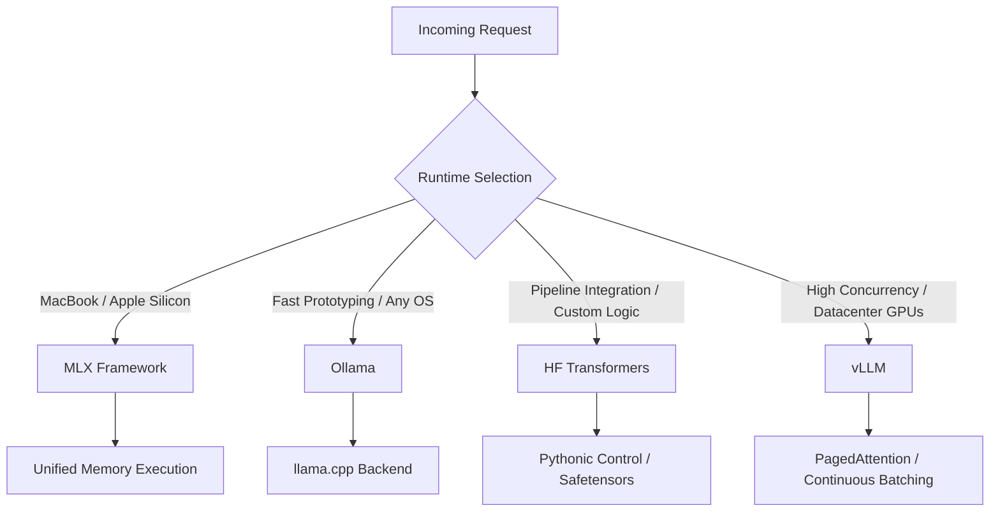

> **Open Models & Local Inference** | Complexity: `[MEDIUM]` | Time: 45-60 min

## Why This Module Matters

An engineering team at a mid-sized logistics company recently spent three weeks trying to optimize a production deployment of a local language model. They had built their entire prototype using desktop-friendly wrapper tools because the developer experience was frictionless and required zero configuration. However, when they deployed this exact same stack to their cloud GPU cluster, they discovered that their chosen runtime could only handle one concurrent request at a time, queueing all subsequent traffic and causing massive latency spikes. The team had fundamentally misunderstood that the tools designed for rapid desktop experimentation are structurally entirely different from the frameworks engineered for datacenter throughput.

Treating inference runtimes as interchangeable commodities is a catastrophic architectural mistake. The software that loads model weights into memory and orchestrates parallel execution dictates everything from hardware utilization to API flexibility. By understanding the distinct architectural goals of different runtimes, engineers can design systems that transition smoothly from local development on laptops to distributed serving in production, avoiding the trap of standardizing on the wrong tool for the wrong environment.

## What You'll Learn

- Evaluate runtime architectures to select the optimal inference engine based on specific hardware constraints and concurrency requirements.
- Compare the operational trade-offs between API-first desktop wrappers and production-grade serving frameworks.
- Design a local inference stack that supports a seamless transition from individual engineering experimentation to distributed deployment.
- Debug performance bottlenecks in local model execution by analyzing runtime-specific configuration parameters and memory management strategies.

## The Inference Landscape

Understanding the inference landscape requires moving beyond marketing claims and examining the foundational architecture of how these tools interact with system hardware. An inference runtime is not simply a passive container for weights; it is a highly active orchestrator that must manage memory allocation, schedule parallel operations across processing units, handle hardware-specific kernel compilation, and expose an API surface for client interaction. The choice of runtime dictates how effectively the underlying silicon is utilized and how much control the developer has over the generation process.

The ecosystem generally divides into three distinct categories based on their primary optimization target. The first category optimizes for desktop convenience, prioritizing a frictionless installation process and immediate usability over granular control. The second category optimizes for engineering control, exposing the internal mechanics of tokenization, hidden states, and sampling algorithms to researchers and developers building custom pipelines. The third category optimizes for production throughput, employing complex memory management techniques to maximize the number of concurrent requests a server can handle without exhausting hardware resources.

```ascii
+-----------------------------------------------------------------------+
|                 The Inference Runtime Abstraction Spectrum            |
+----------------------+----------------------+-------------------------+
| Desktop Convenience  | Engineering Control  | Production Throughput   |
+----------------------+----------------------+-------------------------+
| - Ollama             | - HF Transformers    | - vLLM                  |
| - LM Studio          | - PyTorch Native     | - TGI (Text Gen Inf)    |
| - MLX (Apple Native) | - JAX                | - TensorRT-LLM          |
+----------------------+----------------------+-------------------------+
| API-First            | Code-First           | Infrastructure-First    |
| Developer-focused    | Researcher-focused   | SRE-focused             |
| Hardware-abstracted  | Hardware-aware       | Hardware-maximized      |
+----------------------+----------------------+-------------------------+
```

When engineers fail to map their current workflow to the appropriate category, they experience severe friction. A researcher attempting to implement a novel decoding strategy will find a desktop API entirely too restrictive, while an SRE attempting to serve thousands of users will find a research-focused library tragically inefficient. The architectural maturity of an AI team is often visible in how deliberately they select and transition between these different runtimes as a project evolves from concept to production.

## Desktop Simplicity: Ollama and MLX

For the initial phases of discovery and prototyping, the primary metric of success is time-to-first-token. Developers need to quickly evaluate whether a specific open-weight model possesses the necessary reasoning capabilities for their use case without spending hours compiling C++ bindings, managing conflicting Python environments, or debugging CUDA driver versions. This is the domain where desktop-optimized runtimes excel, providing heavy abstraction over the underlying execution engines to deliver a seamless user experience.

Ollama has emerged as the standard for generic cross-platform onboarding by packaging the highly efficient `llama.cpp` backend into a background daemon. It provides a user experience modeled explicitly on Docker, allowing developers to pull model weights, instantiate them, and interact with a REST API using simple command-line instructions. This architectural choice completely shields the user from the complexities of quantization formats and hardware acceleration layers. However, this heavy abstraction becomes a significant liability when developers need to modify sampling algorithms, integrate custom tokenizers, or understand why a model is hallucinating, as the internal state is hidden behind an opaque API boundary.

**Active Learning Prompt:** You are debugging an application that generates wildly different, lower-quality responses when running locally on Ollama versus when querying the unquantized model on a cloud provider. Based on Ollama's architecture, predict which layer of the stack is responsible for this discrepancy before reading further.

The discrepancy typically arises because Ollama heavily utilizes aggressive quantization (like 4-bit or 5-bit GGUF formats) by default to ensure models fit into standard consumer RAM. While this enables execution on constrained hardware, it fundamentally alters the model's weight distribution, leading to degraded reasoning capabilities compared to the full-precision cloud versions. Developers often mistakenly attribute these failures to the model itself rather than the runtime's quantization strategy.

For developers utilizing Apple Silicon, the MLX framework provides a fundamentally different approach to local inference. Rather than abstracting the hardware away, MLX is explicitly designed by Apple's machine learning research team to treat the M-series unified memory architecture as a first-class citizen. Traditional frameworks often suffer from significant latency as data is copied back and forth between the CPU's system memory and the GPU's dedicated VRAM over a PCIe bus. MLX bypasses this bottleneck entirely, allowing Python code to execute operations directly on the GPU utilizing the same physical memory pool. This makes MLX the mandatory path for engineers extracting maximum performance from Macs, bridging the gap between desktop convenience and serious engineering capability by offering native performance without the overhead of heavy virtualization.

## Engineering Control: Hugging Face Transformers

When a project transitions from casual evaluation to rigorous pipeline development, the black-box nature of API-first tools becomes a major impediment. Engineers building complex AI applications must govern every aspect of the inference lifecycle, from how raw text is broken down into subword tokens to exactly how the probability distribution is sampled during token generation. Hugging Face Transformers represents the lingua franca of open-weight models, providing absolute programmatic control over these mechanics through a massive, continuously updated Python library.

Working directly with Transformers forces developers to confront the reality of how language models actually operate. Instead of simply sending a string to an endpoint, engineers must explicitly instantiate a tokenizer, map the resulting tensor to the appropriate hardware device, configure the model architecture, and dictate the generation parameters like temperature, top-k filtering, and repetition penalties. This level of granularity is not optimized for serving thousands of concurrent users—the native pipeline is generally synchronous and highly inefficient for batched API requests—but it is absolutely critical for evaluating model behavior deterministically.

Furthermore, dropping down to the Transformers layer is required when integrating advanced techniques like Parameter-Efficient Fine-Tuning (PEFT) or dynamic adapter loading. If a team trains a custom Low-Rank Adaptation (LoRA) module to improve a model's performance on SQL generation, they cannot simply drop that adapter into a basic API wrapper. They must utilize the Transformers library to load the base model, merge the adapter weights into the attention matrices dynamically, and evaluate the resulting performance improvements. When a team needs to implement speculative decoding, inject custom logit processors to force specific JSON schemas, or analyze hidden state activations, they must operate at this level of the stack because higher-level tools intentionally hide the necessary execution hooks.

## Production Throughput: vLLM

When an application is ready for production deployment, the engineering priorities shift dramatically. The primary metric is no longer the latency of a single request, but the overall system throughput across hundreds or thousands of concurrent users. Naive inference implementations, such as those found in standard Transformers pipelines or basic API wrappers, process requests sequentially or utilize simplistic batching. These approaches suffer from severe memory fragmentation, as the Key-Value (KV) cache—the memory required to store the context of the conversation for every active request—must be pre-allocated to its maximum possible size, wasting massive amounts of precious GPU VRAM.

**Active Learning Prompt:** A developer proposes running vLLM on their M3 Max MacBook for local testing to mirror the production environment perfectly. Analyze why this approach, while seemingly logical, will likely result in a highly suboptimal developer experience.

Running vLLM on a MacBook is generally an anti-pattern because vLLM's core architecture relies on CUDA-optimized kernels specifically designed for NVIDIA datacenter GPUs to manage its complex memory paging system. While experimental support for other backends exists, attempting to force a high-concurrency datacenter framework onto unified memory architecture introduces immense friction, compilation issues, and overhead without providing the concurrency benefits that justify its complexity.



To solve the production throughput problem, vLLM introduces an architecture called PagedAttention. Inspired by how operating systems manage virtual memory, PagedAttention dynamically allocates non-contiguous blocks of memory for the KV cache exactly as they are needed during token generation. Instead of dedicating a massive, contiguous block of VRAM that sits mostly empty for short responses, vLLM pages the memory, allowing a single GPU to serve significantly more concurrent requests with near-zero fragmentation. Additionally, vLLM employs continuous batching, dynamically inserting new requests into the execution batch the moment previous requests complete, rather than waiting for an entire batch to finish. This transforms the GPU from a sequential processor into a high-throughput inference engine, making vLLM the definitive standard for deploying open-weight models at scale.

## Worked Example: Architecting an Inference Strategy

To understand how these runtimes interact in a real-world scenario, consider an engineering team building an internal coding assistant named "CodeCompanion." The team must architect an inference strategy that spans local developer environments, their automated continuous integration pipeline, and their final production serving infrastructure. Choosing a single runtime for all three environments is guaranteed to fail, requiring the team to deliberately match the tool to the specific phase of the deployment lifecycle.

**Phase 1: Local Developer Experience.** The team's engineers use a mix of Windows workstations and Apple Silicon MacBooks. For the Windows users, the team standardizes on Ollama. It allows the engineers to pull the 8-billion parameter model locally via a single CLI command and interact with it using a standard REST API that mimics external providers, completely avoiding CUDA setup nightmares. For the engineers on MacBooks, the team standardizes on MLX. Because the Apple Silicon unified memory architecture is so distinct, utilizing MLX allows the Mac developers to run slightly larger models with significantly better performance and battery life than virtualization wrappers would allow, keeping the local development loop incredibly tight.

**Phase 2: The Evaluation Pipeline.** Before deploying a new version of the model, the team must run a rigorous evaluation suite in their CI/CD pipeline to ensure the model correctly answers a golden dataset of company-specific coding questions. For this phase, they use Hugging Face Transformers. The evaluation pipeline does not need to handle concurrent users; it needs absolute deterministic control. By using Transformers, the pipeline can strictly lock the temperature to 0.0, apply specific tokenizer configurations, and guarantee that the generation parameters are identical across every test run. If they used Ollama here, silent updates to the underlying quantization methods could invalidate their historical evaluation metrics.

**Phase 3: Production Serving.** The final application is deployed to an AWS Elastic Kubernetes Service (EKS) cluster utilizing instances with multiple NVIDIA A10G GPUs. The internal coding assistant will be used concurrently by hundreds of engineers across the organization. For this environment, the team deploys vLLM. The PagedAttention architecture ensures that the VRAM is not exhausted by developers pasting massive log files into the prompt context, and the continuous batching allows the system to maintain low latency even during peak usage hours. By understanding the distinct roles of each runtime, the team successfully navigated the entire lifecycle without forcing a square peg into a round hole at any stage.

## Did You Know?

- The `llama.cpp` project, which powers many desktop runtimes, was originally written in pure C/C++ by a single developer in a matter of days following the initial leak of the LLaMA weights.
- Apple's MLX framework intentionally mirrors the API design of NumPy and PyTorch, making it immediately familiar to Python developers while secretly compiling operations to highly optimized Metal shaders under the hood.
- Hugging Face Transformers downloads model weights and caches them locally; heavily experimenting with different models without clearing this cache can silently consume hundreds of gigabytes of disk space.
- vLLM's PagedAttention architecture reduced memory waste in large language model serving from an estimated 60-80% down to under 4%, fundamentally changing the economics of hosting open-weight models.

## Common Mistakes

| Mistake | Why It Hurts | Better Move |
|---|---|---|
| Demanding a universal winner | Hides the structural realities of hardware utilization and causes architectural friction. | Evaluate runtimes based strictly on machine architecture, workflow task, and deployment stage. |
| Starting with complex serving stacks | Creates massive, avoidable friction for beginners trying to understand basic prompting. | Start with the simplest local API tool that successfully teaches the immediate target lesson. |
| Remaining on convenience tools forever | Severely limits a developer's understanding of tokenization, architecture, and generation mechanics. | Deliberately step into code-first libraries when building robust evaluation or custom pipelines. |
| Ignoring hardware context | Causes terrible runtime fit, such as running non-native emulation on unified memory architectures. | Choose Apple-native or Linux-native execution paths deliberately based on the underlying silicon. |
| Using serving frameworks for evaluation | Introduces unnecessary complexity and non-deterministic batching behaviors into testing suites. | Use synchronous, highly controlled libraries like Transformers for deterministic benchmark evaluation. |
| Over-allocating VRAM for local tools | Causes desktop environments to freeze as the OS kills critical processes to reclaim system memory. | Utilize aggressive quantization formats when deploying models locally alongside heavy IDEs and browsers. |
| Treating APIs as black boxes | Leads to confusion when generation quality drops due to hidden default configuration parameters. | Inspect the underlying engine's default temperature, top-p, and context window settings explicitly. |

## Quick Quiz

1. **Your team is building an automated test suite that must evaluate a model's output deterministically across thousands of static prompts. Why is Hugging Face Transformers a better architectural choice for this specific task than Ollama?**
   <details>
   <summary>Answer</summary>
   Transformers provides absolute programmatic control over the generation parameters, tokenization process, and hardware mapping, ensuring deterministic execution without hidden abstraction layers altering the output.
   </details>

2. **A developer is experiencing severe latency spikes when testing their application against a local instance of vLLM deployed on their M2 MacBook. What fundamental architectural mismatch is causing this issue?**
   <details>
   <summary>Answer</summary>
   vLLM is engineered primarily for NVIDIA datacenter GPUs and relies on CUDA-specific memory management techniques; forcing it onto Apple's unified memory architecture introduces massive overhead without providing its intended concurrency benefits.
   </details>

3. **Your startup needs to onboard junior developers quickly so they can begin writing prompts against a local 8-billion parameter model on their varied Windows and Linux machines. Which runtime minimizes onboarding friction?**
   <details>
   <summary>Answer</summary>
   Ollama is the optimal choice here because it abstracts away Python environments, CUDA drivers, and quantization complexities, providing a simple, Docker-like installation and execution experience.
   </details>

4. **An SRE team notices that their naive production inference server crashes with Out-Of-Memory (OOM) errors during peak traffic, even though the models fit in VRAM during testing. How does vLLM's architecture specifically solve this problem?**
   <details>
   <summary>Answer</summary>
   vLLM utilizes PagedAttention to dynamically allocate non-contiguous blocks of memory for the KV cache as needed, eliminating the memory fragmentation that causes naive batching implementations to run out of VRAM under heavy concurrent load.
   </details>

5. **A machine learning researcher needs to inspect the hidden state activations of a model mid-generation to debug why it is hallucinating on specific inputs. Why must they abandon API-first tools for this task?**
   <details>
   <summary>Answer</summary>
   API-first tools intentionally hide the internal state and execution mechanics behind an opaque network boundary; the researcher must use a code-first library to access the internal tensors directly during execution.
   </details>

6. **You are tasked with maximizing the performance of a local model running exclusively on Apple Silicon hardware. Why would you choose MLX over standard virtualization-based runtimes?**
   <details>
   <summary>Answer</summary>
   MLX is explicitly designed to treat Apple's unified memory architecture as a first-class citizen, allowing execution directly on the GPU without the massive latency of copying data across a PCIe bus or running through heavy emulation layers.
   </details>

7. **Your application requires dynamically swapping out several different LoRA adapters based on user input during a single session. Which category of runtime is structurally required to implement this?**
   <details>
   <summary>Answer</summary>
   You require an engineering-control runtime (like Transformers or native PyTorch) that allows programmatic manipulation of the model weights and attention matrices at execution time, rather than a static API wrapper.
   </details>

8. **A team deploys an application built on Ollama to a cloud cluster and discovers it can only handle requests sequentially. What misunderstanding led to this architectural failure?**
   <details>
   <summary>Answer</summary>
   The team mistakenly assumed that a tool optimized for frictionless desktop experimentation would natively possess the complex continuous batching and memory management architectures required for high-throughput production serving.
   </details>

## Hands-On Exercise

In this exercise, you will design a multi-stage local inference strategy for a hypothetical startup building a heavily customized RAG (Retrieval-Augmented Generation) application for legal document analysis.

**Scenario:**
The startup has a team of 5 data scientists using M3 Max MacBooks, 10 software engineers using Windows desktops, and a production environment hosted on AWS utilizing instances with NVIDIA L40S GPUs. They need to fine-tune a model, integrate it into a local dev environment, and serve it at scale.

Complete the following architectural design steps:

- [ ] **Step 1: Local Development Specification.** Specify the runtime for the Windows engineers and justify the choice based on minimizing onboarding friction.
- [ ] **Step 2: Research & Fine-Tuning Specification.** Specify the runtime framework the data scientists must use on their MacBooks to experiment with custom tokenizers and evaluate fine-tuning results. Justify why the tool chosen in Step 1 is unacceptable for this task.
- [ ] **Step 3: Production Serving Specification.** Specify the runtime for the AWS production environment. Define exactly how this runtime's memory management architecture will prevent crashes under high concurrent load from the legal team.
- [ ] **Step 4: Dependency Mapping.** Create a simple text-based diagram mapping how the model weights will flow from the data scientists' environment into the production serving infrastructure, noting which formats (e.g., Safetensors, GGUF) will be utilized at each stage.
- [ ] **Step 5: Peer Review.** Identify one major risk in this multi-runtime architecture (e.g., format incompatibility, evaluation drift) and document a technical mitigation strategy to address it before deployment.

## Next Module

From here, continue to:
- [AI/ML Engineering: AI-Native Development](../../ai-ml-engineering/ai-native-development/)
- [AI/ML Engineering: Vector Search & RAG](../../ai-ml-engineering/vector-rag/)
- [AI/ML Engineering: AI Infrastructure](../../ai-ml-engineering/ai-infrastructure/)

## Sources

- [MLX LM README](https://github.com/ml-explore/mlx-lm) — Shows the Apple Silicon-focused MLX path for local LLM inference and related workflows.
- [Transformers Quickstart](https://huggingface.co/docs/transformers/en/quicktour) — Covers the core abstractions that make Transformers useful for direct engineering experimentation.
