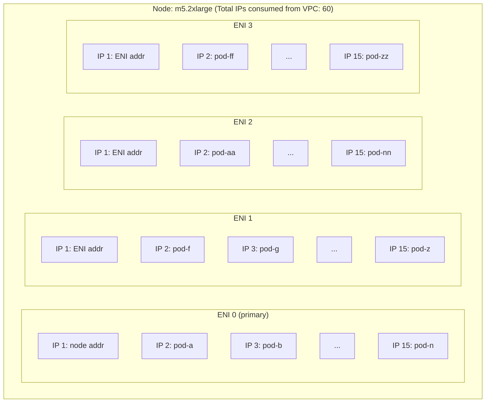
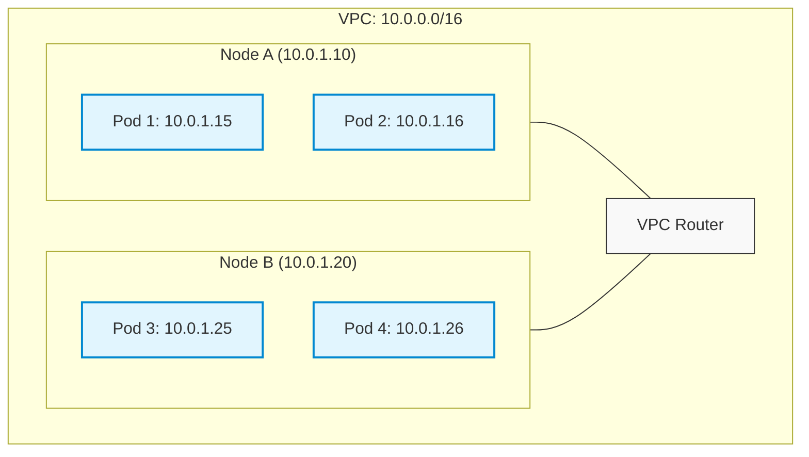
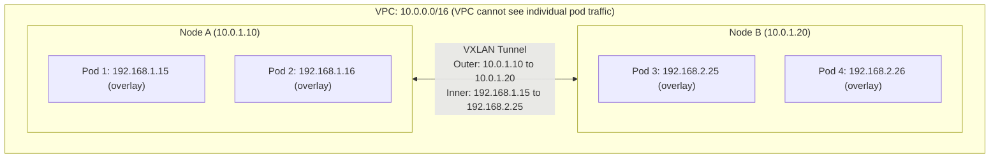
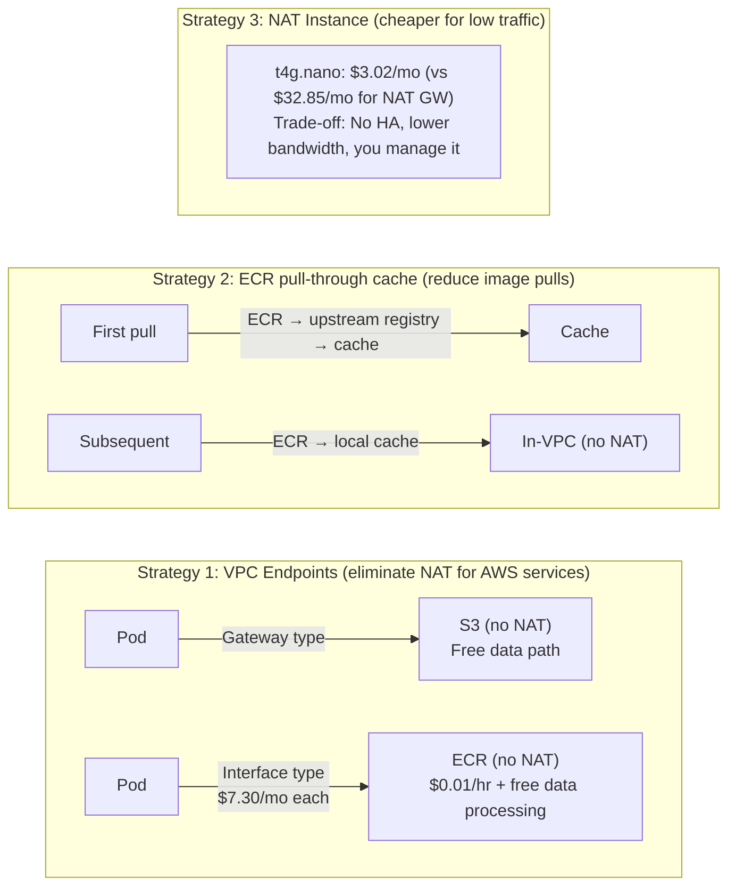
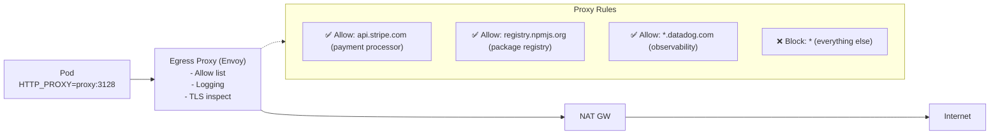
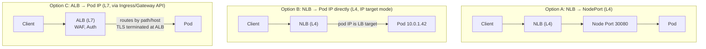
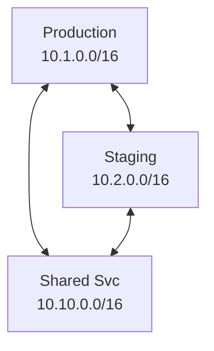
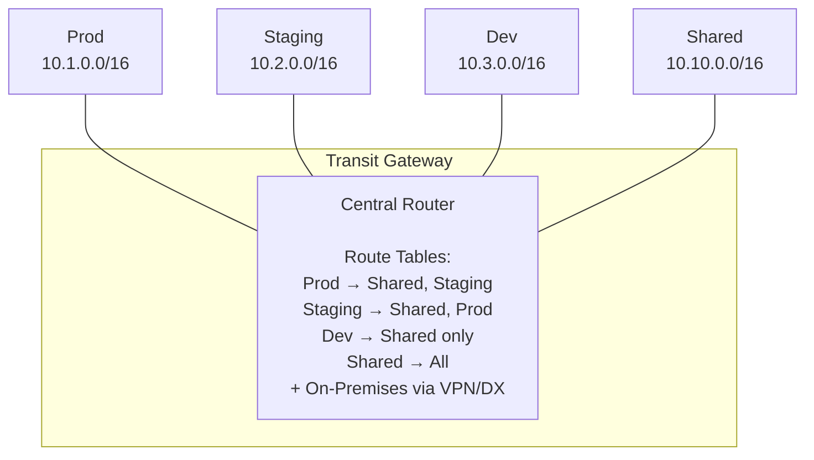
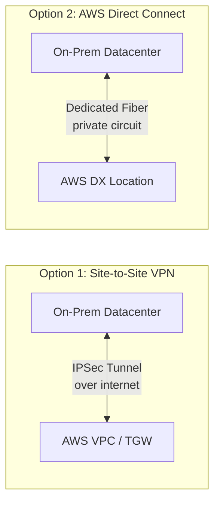

> **Complexity**: `[COMPLEX]`
>
> **Time to Complete**: 3.5 hours
>
> **Prerequisites**: [Module 4.1: Managed vs Self-Managed Kubernetes](../module-4.1-managed-vs-selfmanaged/), [Module 4.2: Multi-Cluster and Multi-Region Architectures](../module-4.2-multi-cluster/)
>
> **Track**: Cloud Architecture Patterns

## What You'll Be Able to Do

After completing this module, you will be able to:

- **Design** cloud-native VPC/VNet topologies optimized for Kubernetes cluster networking across availability zones.
- **Diagnose** IP exhaustion issues and **implement** CIDR planning strategies that accommodate pod networking, service ranges, and future cluster growth.
- **Implement** private cluster architectures with private API endpoints and VPC-native routing to secure the control plane.
- **Compare** overlay vs underlay CNI networking models to **evaluate** their performance and cloud integration trade-offs.
- **Evaluate** egress cost structures and **implement** VPC endpoint strategies to eliminate NAT Gateway data processing charges.

## Why This Module Matters

In September 2022, a major global shipping and logistics platform, Maersk, was running fourteen Kubernetes clusters on AWS. The platform team received an automated pager alert at 2:15 AM: "Pods stuck in ContainerCreating." The on-call engineer investigated and found eighteen pods waiting to be scheduled. Every attempt to create a new pod failed with the exact same error message: `failed to assign an IP address to the pod`. The nodes had plenty of available CPU and memory capacity, so resource exhaustion was ruled out immediately.

The root cause took three hours of frantic debugging to uncover. The EKS clusters utilized the VPC CNI plugin in its default mode, where every individual pod receives a real VPC IP address. The infrastructure team had provisioned their subnets with /24 CIDR blocks, meaning there were only 251 usable IPs per subnet. Each m5.2xlarge node could attach four Elastic Network Interfaces with 15 IPs each, consuming 60 IPs per node natively. With twelve nodes running in the subnet, the cluster required 720 IPs. The subnet mathematically could only provide 251. The cluster had been silently creeping toward this hard limit for months. Node autoscaling added more instances, each greedily consuming more IPs. Because no one monitored subnet IP utilization metrics, the threshold was crossed unexpectedly during a scale-up event. When the incident occurred, deployments failed, and the horizontal pod autoscaler compounded the crisis by constantly requesting more pods that could never receive network addresses.

The emergency mitigation required an invasive subnet expansion—adding secondary CIDR blocks to the VPC and creating entirely new, much larger subnets. This is a highly disruptive operation in a live production environment. Nodes had to be cordoned, drained, and relaunched in the new subnets over the course of an eleven-hour recovery window. The extended outage paralyzed their logistics scheduling system, resulting in an estimated four point two million dollars in missed SLA penalties, delayed global shipments, and severe reputational damage. This incident was entirely preventable with proper network architecture and IP Address Management. In this module, you will learn to design VPC topologies that seamlessly accommodate Kubernetes' voracious IP consumption patterns, architect secure egress and ingress pathways, and connect multiple environments without the subnet overlaps that make network peering impossible.

## The Paradigm Shift: IP Address Management in Kubernetes

IP Address Management (IPAM) for Kubernetes represents a radical departure from traditional infrastructure design. In a standard virtual machine-based world, each server machine receives exactly one IP address. You can comfortably place two hundred web servers in a single /24 subnet and run that architecture for years without issue. 

Kubernetes fundamentally shatters this model. When operating with VPC-native networking, which is the default configuration on all major managed cloud platforms like AWS EKS, every single pod gets its own dedicated VPC IP address. This changes how you must plan your subnets from the ground up. Think of a traditional virtual machine as a single-family home. It gets one street address. Kubernetes, however, is like building a massive high-rise apartment complex on that same plot of land. If the postal service expects only one family to live there, but suddenly receives mail for three hundred individual tenants, the system breaks down unless every single apartment is registered with its own distinct unit number.

### How Many IPs Does Kubernetes Actually Need?

To understand the scale of the problem, we must look at the raw numbers. The consumption rate of IP addresses in a Kubernetes cluster is staggering compared to legacy systems.

```text
IP CONSUMPTION: TRADITIONAL VS KUBERNETES
═══════════════════════════════════════════════════════════════

Traditional (VM-based):
  10 servers = 10 IPs
  Planning: /24 subnet (251 IPs) lasts years

Kubernetes (VPC CNI, per-pod IP):
  10 nodes × 30 pods each = 300 pod IPs + 10 node IPs = 310 IPs
  Planning: /24 subnet (251 IPs) exhausted before you reach 10 nodes

Kubernetes (VPC CNI with prefix delegation):
  10 nodes × 110 pods each = 1,100 pod IPs + 10 node IPs = 1,110 IPs
  Planning: Need /20 (4,091 IPs) minimum for a medium cluster

Kubernetes (overlay network, e.g., Calico VXLAN):
  10 nodes = 10 VPC IPs (pods use overlay, invisible to VPC)
  Planning: /24 subnet is fine, but overlay adds network latency
```

### The VPC CNI IP Consumption Model (AWS)

On Amazon EKS with the default VPC CNI plugin, the way IP addresses are allocated is aggressive. To ensure pods start quickly without waiting for an API call to the cloud provider, the CNI pre-warms IP addresses. It attaches multiple Elastic Network Interfaces to the EC2 instance and populates them with secondary IP addresses from your subnet.

Here is exactly how IPs are consumed per node, demonstrating why subnets drain so rapidly:



**Prefix Delegation: The Enterprise Solution**

To solve this rapid IP exhaustion, AWS introduced Prefix Delegation. Instead of assigning individual secondary IPs to an interface, the VPC CNI assigns entire /28 IPv4 prefixes. 
Each /28 prefix provides 16 IP addresses. 
The worker node's maximum pod capacity becomes limited by the Kubernetes scheduler (usually capped at 110 pods per node) rather than the strict ENI attachment limits of the specific EC2 instance size. 
While the node still reserves blocks of IPs, those blocks are utilized much more efficiently, drastically increasing the density of pods you can run per VPC IP consumed.

You must explicitly enable this feature on your clusters to reap the benefits.

```bash
# Enable prefix delegation on EKS (recommended for new clusters)
kubectl set env daemonset aws-node \
  -n kube-system \
  ENABLE_PREFIX_DELEGATION=true \
  WARM_PREFIX_TARGET=1

# Check current IP allocation on a node
kubectl get node ip-10-0-1-42.ec2.internal -o json | \
  jq '.status.allocatable["vpc.amazonaws.com/pod-eni"] // .status.capacity["vpc.amazonaws.com/PrivateIPv4Address"]'
```

### Guided Worked Example: Subnet Calculation

Let us walk through the architectural process of sizing a subnet for a new production cluster. 

**The Scenario:**
You are provisioning an EKS cluster using VPC CNI without prefix delegation. The cluster will scale up to twenty worker nodes. The nodes use the m5.large instance type, which supports up to three ENIs and ten IPs per ENI. You must ensure the subnet can handle this maximum capacity plus one hundred percent headroom for future growth.

**Step 1: Calculate IPs per node**
An m5.large instance can attach three ENIs, each loaded with ten IPs.
Total IPs per node = 3 * 10 = 30 IPs.

**Step 2: Calculate total IPs for maximum capacity**
20 nodes * 30 IPs/node = 600 IPs required purely from the VPC.

**Step 3: Add headroom**
Adding one hundred percent headroom means we need total space for 1,200 IPs.

**Step 4: Select the subnet CIDR**
- A /24 provides 251 usable IPs (Too small, cluster will crash)
- A /23 provides 507 usable IPs (Too small, cluster will crash at scale)
- A /22 provides 1,019 usable IPs (Too small, violates headroom requirement)
- A /21 provides 2,043 usable IPs (Perfect, offers safe expansion space)

For this cluster, a /21 subnet is the absolute minimum safe choice to guarantee 1,200 IPs are constantly available even if other infrastructure resources are deployed into the same subnet.

| Cluster Size | Nodes | Pods (est.) | VPC CNI (standard) | VPC CNI (prefix delegation) | Overlay |
|-------------|-------|-------------|--------------------|-----------------------------|---------|
| Small (dev) | 3-5 | ~100 | /24 (tight) | /24 (comfortable) | /27 |
| Medium | 10-20 | ~500 | /21 minimum | /23 | /25 |
| Large | 50-100 | ~3,000 | /19 minimum | /21 | /24 |
| Very Large | 200+ | ~10,000 | /17 minimum | /19 | /23 |

The golden rule of cloud-native networking: always provision subnets at least twice as large as your current projected maximum needs. IPv4 address space inside a private VPC is completely free. Expanding subnets later is a painful, risky, and manually intensive operation.

> **Pause and predict**: If you use a /24 subnet (251 IPs) for a cluster configured with Calico VXLAN (overlay) and scale to 50 nodes running 2,000 pods total, will you exhaust the VPC subnet? Why or why not?

## Underlay vs. Overlay: The Great Networking Debate

Choosing between an underlay network and an overlay network is the foundational networking decision for your Kubernetes platform. This choice directly impacts application performance, IP address consumption, cluster observability, and deep cloud integration capabilities.

### Underlay (VPC-Native / Flat Networking)

In an underlay network, pods receive real VPC IP addresses. The cloud provider's physical network infrastructure routes pod traffic natively without any secondary layers of translation.



**Pod-to-pod traffic:** Routed natively by the VPC fabric. There is no encapsulation. There is no tunnel. Traffic flows at full line speed.
Because the cloud provider is fully aware of the pod's IP address:
*   Cloud load balancers can target individual pods directly by their IP.
*   Cloud security groups can be applied directly to pod IPs for granular access control.
*   VPC Flow Logs clearly show individual pod traffic, vastly simplifying security audits.
*   Network ACLs can filter pod traffic natively at the subnet boundary.

### Overlay (Encapsulated Networking)

In an overlay network, pods receive IP addresses from an isolated, private address space that only the Kubernetes cluster knows about. Traffic between nodes is encapsulated in tunnels—typically using protocols like VXLAN, Geneve, or IP-in-IP.



Because the cloud provider's network only sees the outer encapsulation header (the node IPs):
*   Cloud load balancers must target nodes, creating an extra network hop.
*   Cloud security groups can only be applied to nodes, not individual pods.
*   VPC Flow Logs only show node-to-node communication.
*   Network ACLs cannot filter individual pod traffic.

During a major retail event, an e-commerce company experienced massive latency spikes. They were using an overlay network, and the encapsulation overhead added crucial milliseconds to every microservice hop, compounded by CPU exhaustion on the nodes trying to encrypt and encapsulate millions of tiny packets per second.

### Decision Matrix

| Factor | Underlay (VPC CNI) | Overlay (Calico/Cilium VXLAN) |
|--------|-------------------|-------------------------------|
| Performance | Native wire speed, no overhead | 5-15% throughput overhead (encapsulation) |
| IP consumption | High (1 VPC IP per pod) | Low (pods use private range) |
| Cloud integration | Full (LB targets pods, SGs per pod) | Limited (LB targets nodes, SGs per node) |
| Observability | VPC Flow Logs show pod traffic | Need CNI-level logs for pod traffic |
| Multi-cluster | VPC peering routes pod IPs natively | Overlay IPs not routable cross-VPC by default |
| Subnet planning | Critical (must plan for pod growth) | Simple (overlay range is independent) |
| Network policy | Enforced at VPC + Calico/Cilium | Enforced at CNI level only |
| Best for | Cloud-native apps needing deep cloud integration | Multi-cloud, IP-constrained environments |

Most engineering teams operating on a single cloud provider should strongly default to underlay (VPC-native) networking equipped with prefix delegation. The cloud integration benefits—direct pod targeting by load balancers, security groups per pod, and native VPC Flow Logs—heavily outweigh the IP planning overhead.

## Control Plane Security: Implementing Private Clusters

By default, managed Kubernetes services like Amazon EKS and Google GKE provision the cluster API server endpoint with a public IP address. This means that every single `kubectl` command your engineers execute traverses the public internet to reach your cluster. For enterprise environments with strict compliance mandates, this public exposure is completely unacceptable.

### Endpoint Access Modes

When configuring your cluster deployment, you have three primary architectural choices for securing the API server endpoint:

1. **Public Only (Default but Risky)**
   The API server is highly accessible from the open internet. The security of your cluster relies entirely on Kubernetes RBAC configurations and cloud IAM authentication. If a zero-day vulnerability is discovered in the Kubernetes API server itself, your cluster is immediately exposed to active exploitation from global botnets.

2. **Public and Private (The Compromise)**
   The API server receives both a public IP address and a private IP address within your internal VPC. The worker nodes utilize the private IP to communicate with the control plane, keeping all sensitive node-to-control-plane traffic securely off the internet. Developers can still use the public endpoint from their local machines, which is typically locked down tightly via a CIDR allowlist.

3. **Private Only (Enterprise Standard)**
   The API server only receives a private IP within your VPC. There is absolutely no public routing to the control plane. This is the most secure posture available but requires substantial additional architecture for developer and pipeline access.

### Implementing Private-Only Access

When you lock down a cluster to be fully private, how do developers and CI/CD pipelines run `kubectl apply`? You must architect a secure pathway into the VPC.
- **VPN / Direct Connect:** Developers connect securely to the corporate VPN, which is peered directly to the VPC. Traffic flows privately.
- **Bastion Host:** A hardened, heavily monitored EC2 instance deployed in a public subnet. Users authenticate to the bastion using secure protocols and execute `kubectl` commands from that jump box.
- **CI/CD Runners in VPC:** Pipeline runners are deployed as EC2 instances or long-running pods directly within the VPC itself, allowing them to communicate natively with the private API server.

```bash
# EKS: Update cluster to Private-Only mode
aws eks update-cluster-config \
  --name production-cluster \
  --resources-vpc-config endpointPublicAccess=false,endpointPrivateAccess=true
```

> **Stop and think**: If you switch an existing cluster to "Private Only" without having a VPN or Bastion host set up, what will happen to your current `kubectl` session? How will the worker nodes be affected?

## Egress Architecture: Escaping the NAT Gateway Trap

Every pod that needs to call an external third-party API, download an updated software package, or talk to a managed SaaS service requires an outbound egress path. This seemingly simple pathway carries massive cost, security, and compliance implications that consistently catch platform teams off guard.

### NAT Gateway: The Default (and Expensive) Path


**Cost Analysis:**
*   NAT Gateway hourly provision fee: $0.045/hr × 730 hrs = $32.85/mo
*   Data processing fee: $0.045/GB
*   At 1TB/month egress volume: $32.85 + $45.00 = $77.85/mo per AZ
*   With 3 AZs for high availability: $233.55/mo JUST for the NAT Gateway presence (plus standard internet data transfer charges stacked on top)

NAT Gateways are notoriously the single most expensive surprise in AWS Kubernetes deployments. A medium-sized cluster pulling heavy container images, constantly polling external APIs, and streaming verbose application logs to a SaaS observability platform can effortlessly generate five to ten terabytes of NAT data processing per month.

### Reducing NAT Costs

To combat these astronomical costs, experienced cloud architects utilize a combination of VPC Endpoints and caching layers. By ensuring that traffic destined for internal cloud services never crosses the NAT Gateway, the data processing fees plummet.



By aggressively deploying VPC endpoints, you create a private, unmetered tunnel directly to cloud provider services.

```bash
# Create VPC endpoints for common AWS services
# These eliminate NAT Gateway data processing charges

# S3 Gateway Endpoint (free)
aws ec2 create-vpc-endpoint \
  --vpc-id vpc-12345 \
  --service-name com.amazonaws.us-east-1.s3 \
  --route-table-ids rtb-private-1 rtb-private-2

# ECR API endpoint (Interface type, $7.30/mo)
aws ec2 create-vpc-endpoint \
  --vpc-id vpc-12345 \
  --vpc-endpoint-type Interface \
  --service-name com.amazonaws.us-east-1.ecr.api \
  --subnet-ids subnet-private-1a subnet-private-1b \
  --security-group-ids sg-vpce-ecr

# ECR Docker endpoint
aws ec2 create-vpc-endpoint \
  --vpc-id vpc-12345 \
  --vpc-endpoint-type Interface \
  --service-name com.amazonaws.us-east-1.ecr.dkr \
  --subnet-ids subnet-private-1a subnet-private-1b \
  --security-group-ids sg-vpce-ecr

# CloudWatch Logs endpoint
aws ec2 create-vpc-endpoint \
  --vpc-id vpc-12345 \
  --vpc-endpoint-type Interface \
  --service-name com.amazonaws.us-east-1.logs \
  --subnet-ids subnet-private-1a subnet-private-1b \
  --security-group-ids sg-vpce-logs

# STS endpoint (needed for IRSA token exchange)
aws ec2 create-vpc-endpoint \
  --vpc-id vpc-12345 \
  --vpc-endpoint-type Interface \
  --service-name com.amazonaws.us-east-1.sts \
  --subnet-ids subnet-private-1a subnet-private-1b \
  --security-group-ids sg-vpce-sts
```

> **Pause and predict**: Your monthly AWS bill shows a $4,000 charge for NAT Gateway Data Processing. Your cluster heavily uses S3 and DynamoDB. What single architectural change would drastically reduce this cost tomorrow without changing any application code?

### Egress for Compliance: Proxy-Based Egress

Highly regulated environments often mandate that all egress traffic must flow through an active inspection proxy. This rigorous architecture provides deep URL-level filtering capabilities, TLS inspection to detect data exfiltration, and comprehensive centralized logging. 



Using NetworkPolicies, you can mathematically ensure that pods cannot bypass the proxy.

```yaml
# Kubernetes: Force egress through proxy using NetworkPolicy
apiVersion: networking.k8s.io/v1
kind: NetworkPolicy
metadata:
  name: default-deny-egress
  namespace: production
spec:
  podSelector: {}
  policyTypes:
    - Egress
  egress:
    # Allow DNS
    - to: []
      ports:
        - protocol: UDP
          port: 53
        - protocol: TCP
          port: 53
    # Allow traffic to egress proxy only
    - to:
        - podSelector:
            matchLabels:
              app: egress-proxy
      ports:
        - protocol: TCP
          port: 3128
    # Allow in-cluster traffic
    - to:
        - namespaceSelector: {}
```

## Ingress Architecture: Load Balancing and the Gateway API

Ingress is the precise mirror of egress. It represents the heavily guarded pathway for how external customer traffic penetrates your perimeter and reaches your internal Kubernetes services. The architecture differs significantly depending on the cloud provider, load balancer choice, and whether you are operating at Layer 4 or Layer 7.

### Cloud Load Balancer Integration



*   **Option A:** Pros: Extremely simple to set up, generally preserves the source IP address of the client. Cons: Involves an inefficient extra hop via NodePort routing, which can lead to uneven load distribution.
*   **Option B:** Pros: Eradicates the extra hop completely, ensures perfectly even distribution of requests, and offers the lowest possible latency. Cons: Strict requirement to use VPC CNI (underlay networking) so the load balancer can view the pod IPs.
*   **Option C:** Pros: Delivers intelligent L7 routing capabilities, seamless WAF integration, and authentication offloading. Cons: Incurs higher ALB operational costs.

### Gateway API: The Modern Standard

The traditional Kubernetes Ingress resource was notoriously fragmented. The new Gateway API provides a unified, role-oriented standard for managing external access to cluster services.

```yaml
# Gateway API is replacing Ingress as the standard
# More expressive, role-oriented, portable

# Infrastructure admin creates the Gateway
apiVersion: gateway.networking.k8s.io/v1
kind: Gateway
metadata:
  name: production-gateway
  namespace: infrastructure
  annotations:
    # AWS: Use ALB
    service.beta.kubernetes.io/aws-load-balancer-type: "external"
    service.beta.kubernetes.io/aws-load-balancer-scheme: "internet-facing"
spec:
  gatewayClassName: aws-alb  # or istio, cilium, nginx, etc.
  listeners:
    - name: https
      protocol: HTTPS
      port: 443
      tls:
        mode: Terminate
        certificateRefs:
          - name: production-tls
            namespace: infrastructure
      allowedRoutes:
        namespaces:
          from: Selector
          selector:
            matchLabels:
              gateway-access: "true"
```

```yaml
# Application team creates HTTPRoutes
apiVersion: gateway.networking.k8s.io/v1
kind: HTTPRoute
metadata:
  name: payment-api-route
  namespace: production
spec:
  parentRefs:
    - name: production-gateway
      namespace: infrastructure
  hostnames:
    - "api.example.com"
  rules:
    - matches:
        - path:
            type: PathPrefix
            value: /v1/payments
      backendRefs:
        - name: payment-api
          port: 8080
          weight: 100
    - matches:
        - path:
            type: PathPrefix
            value: /v1/orders
      backendRefs:
        - name: order-api
          port: 8080
          weight: 100
```

### WAF Integration

A Web Application Firewall (WAF) forms an essential defensive perimeter and should sit securely in front of any public-facing Kubernetes service.

```bash
# AWS WAF with ALB Ingress Controller
# The ALB created by the Ingress controller can have WAF attached

# Create a WAF Web ACL
aws wafv2 create-web-acl \
  --name production-waf \
  --scope REGIONAL \
  --default-action Allow={} \
  --rules '[
    {
      "Name": "RateLimit",
      "Priority": 1,
      "Action": {"Block": {}},
      "Statement": {
        "RateBasedStatement": {
          "Limit": 2000,
          "AggregateKeyType": "IP"
        }
      },
      "VisibilityConfig": {
        "SampledRequestsEnabled": true,
        "CloudWatchMetricsEnabled": true,
        "MetricName": "RateLimit"
      }
    },
    {
      "Name": "AWSManagedRulesCommonRuleSet",
      "Priority": 2,
      "OverrideAction": {"None": {}},
      "Statement": {
        "ManagedRuleGroupStatement": {
          "VendorName": "AWS",
          "Name": "AWSManagedRulesCommonRuleSet"
        }
      },
      "VisibilityConfig": {
        "SampledRequestsEnabled": true,
        "CloudWatchMetricsEnabled": true,
        "MetricName": "CommonRules"
      }
    }
  ]' \
  --visibility-config SampledRequestsEnabled=true,CloudWatchMetricsEnabled=true,MetricName=production-waf
```

## Multi-Environment Routing: VPC Peering vs. Transit Gateways

As your platform matures, you will inevitably deploy multiple distinct VPCs covering disparate environments: development, staging, production, and shared services. Ensuring secure communication between these silos requires strategic architectural decisions.

### VPC Peering: Simple, Point-to-Point

VPC Peering connects two networks directly.



The fatal flaw of VPC Peering is scale:
*   2 VPCs = 1 peering connection
*   3 VPCs = 3 peering connections
*   4 VPCs = 6 peering connections
*   N VPCs = N×(N-1)/2 connections
*   With 10 VPCs: 10 × 9 / 2 = 45 peering connections. This rapidly becomes operationally impossible to manage or audit effectively.

### Transit Gateway: Hub-and-Spoke

A Transit Gateway (TGW) serves as a centralized, highly available cloud router. 



By connecting any number of VPCs to the TGW via a single attachment, you enable massive scalability and brutally efficient centralized routing policies.

```bash
# Create a Transit Gateway
aws ec2 create-transit-gateway \
  --description "Production TGW" \
  --options "AmazonSideAsn=64512,AutoAcceptSharedAttachments=disable,DefaultRouteTableAssociation=disable,DefaultRouteTablePropagation=disable,DnsSupport=enable"

# Attach VPCs
aws ec2 create-transit-gateway-vpc-attachment \
  --transit-gateway-id tgw-12345 \
  --vpc-id vpc-prod \
  --subnet-ids subnet-prod-1a subnet-prod-1b

aws ec2 create-transit-gateway-vpc-attachment \
  --transit-gateway-id tgw-12345 \
  --vpc-id vpc-staging \
  --subnet-ids subnet-staging-1a subnet-staging-1b

# Create separate route tables for segmentation
aws ec2 create-transit-gateway-route-table \
  --transit-gateway-id tgw-12345 \
  --tags Key=Name,Value=prod-routes

aws ec2 create-transit-gateway-route-table \
  --transit-gateway-id tgw-12345 \
  --tags Key=Name,Value=dev-routes
```

### Transit Gateway Costs

| Component | Cost |
|-----------|------|
| TGW per hour per AZ attachment | $0.05/hr (~$36.50/mo) |
| Data processing | $0.02/GB |
| 5 VPCs, 2 AZs each | $365/mo just for attachments |
| 1 TB cross-VPC traffic | $20/mo data processing |

Transit Gateway technology is universally recommended when you operate four or more VPCs or mandate rigid, centralized routing policies. For simple configurations, VPC Peering remains radically cheaper and conceptually simpler.

## Hybrid Cloud: On-Premises Connectivity Strategies

Connecting advanced Kubernetes clusters to deeply entrenched legacy on-premises data centers requires carefully evaluating VPN versus dedicated circuit solutions.



*   **Option 1:** Cost: $0.05/hr (~$36.50/mo) + standard data transfer. Bandwidth constraints: Up to 1.25 Gbps per individual tunnel. Latency: Highly variable. Setup duration: Hours.
*   **Option 2:** Cost: Base $0.30/hr (for a 1Gbps port) + data transfer. Bandwidth: 1, 10, or even 100 Gbps dedicated throughput. Latency: Rock-solid consistent. Setup duration: Weeks to months due to physical fiber provisioning.
*   **Option 3:** Direct Connect + VPN Backup. The ultimate enterprise solution where the primary line uses Direct Connect for fierce speed and the secondary line maintains a Site-to-Site VPN connection to guarantee automatic failover during physical fiber cuts.

### The Critical Point: Non-Overlapping CIDRs

When binding cloud environments to an established on-premises network, overlapping CIDR blocks represent a terminal architectural failure. If your massive data center uses the `10.0.0.0/8` block and your newly minted cloud VPC ignorantly assigns the `10.0.0.0/16` space, core routing completely collapses. The routers cannot safely discern if traffic meant for `10.0.1.5` intends to reach an ephemeral cloud pod or a critical on-prem database server.

```text