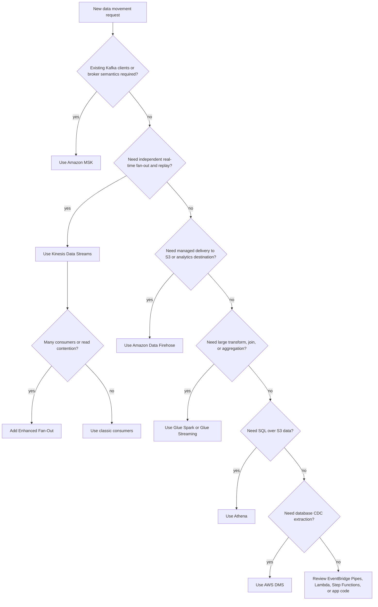

> **Complexity:** [COMPLEX]
>
> **Time:** 90-120 min
>
> **Prerequisites:**
> [1.1-iam](../module-1.1-iam/),
> [1.4-s3](../module-1.4-s3/),
> [1.10-cloudwatch](../module-1.10-cloudwatch/)

---

## What You'll Be Able to Do

After completing this module, you will be
able to perform these operator tasks in a
review, an incident, or a production
readiness discussion:

- **Compare** Kinesis Data Streams, Amazon Data Firehose, AWS Glue, Amazon Athena, MSK, DMS, EventBridge Pipes, and QuickSight by matching each service to ordering, replay, transformation, query, and ownership requirements.
- **Design** a secure ingestion pipeline that uses Kinesis shards, Firehose delivery, Glue Catalog metadata, Schema Registry contracts, S3 prefixes, IAM roles, KMS encryption, and VPC endpoints without giving operators a hidden data-loss path.
- **Diagnose** throughput, freshness, schema drift, partition sprawl, crawler churn, and Athena scan-cost incidents using CloudWatch metrics, workgroup controls, Glue logs, and concrete service limits.
- **Implement** an end-to-end Kinesis -> Firehose -> Glue Catalog -> S3 Parquet -> Athena workflow with a runnable Python producer and partitioning improvement loop.
- **Evaluate** the cost impact of shard mode, fan-out, Firehose conversion, dynamic partitioning, Glue DPU time, Catalog requests, and Athena bytes scanned before approving a production design.

The operator path is not about becoming a
data scientist.
It is about owning the pipes that data
scientists, analysts, application teams,
finance systems, and incident responders
depend on.
When a producer changes a field type, when a
shard gets hot, when Firehose retries for
hours, when a Glue crawler turns one table
into several tables, or when a single Athena
query scans a whole lake, the page goes to
the data-platform operator first.
This module treats Kinesis Data Streams,
Amazon Data Firehose, AWS Glue, and Amazon
Athena as one production surface rather than
four unrelated console pages.
You will see where each service begins and
ends, what AWS manages for you, what you
still own, and which metrics tell you that
the pipe is healthy enough to trust.

## Why This Module Matters

Hypothetical scenario: a platform team runs
telemetry ingestion for a customer-facing
product.
The application emits clickstream events
into a streaming service, another team
consumes the same stream for fraud signals,
Firehose lands a copy into S3, Glue keeps
the schema visible, and Athena powers
incident queries during launches.
At 09:05, dashboards show lower conversion.
At 09:10, the fraud consumer reports lag.
At 09:15, a product analyst says the latest
hour is missing from Athena.
At 09:20, the bill forecast jumps because
several people keep re-running full-table
queries against raw JSON.
None of those symptoms say "Kinesis" or
"Glue" on their own.
They say the ingestion contract is not being
operated as a system.
The stream, the delivery buffer, the
metadata catalog, the storage layout, the
query workgroup, and the IAM boundary are
all part of the same reliability story.
If the stream retains only one day of data,
a long consumer outage can become
unrecoverable.
If Firehose uses tiny buffers with dynamic
partitioning, S3 fills with small objects
and every downstream query pays the price.
If a crawler silently updates a column from
`bigint` to `string`, Athena may fail at the
worst possible time.
If the workgroup has no data scan limit, one
exploratory query can cost more than the
ingestion layer that created the data.
By the end, you should be able to read a
data-ingestion design the way an SRE reads a
service topology: where backpressure
appears, where replay exists, where data can
be dropped, where schema changes are
enforced, where cost scales linearly, and
where a small configuration decision becomes
an incident.
The hands-on path builds a small version of
that production shape.
You will create a Kinesis Data Streams
source, land data with Firehose, register a
Glue table, produce about fifty thousand
events, query the result with Athena, then
improve the table layout so the same
analytical question scans fewer bytes.

## The Four Services, One Mental Map

The first operational mistake is treating
these services as substitutes.
They are adjacent, but they are not the same
kind of thing.
Kinesis Data Streams is an ordered
append-only stream.
Amazon Data Firehose is a managed delivery
service.
AWS Glue is a metadata and transformation
platform.
Amazon Athena is a serverless SQL query
engine over data that usually lives in S3.
They often appear in the same architecture
because each one owns a different phase of
the data path.

```text
+------------------+      +-------------------+      +-------------------+
| producers        | ---> | Kinesis Data      | ---> | Firehose          |
| apps, agents,    |      | Streams           |      | delivery stream   |
| devices, jobs    |      | ordered shards    |      | buffer + convert  |
+------------------+      +-------------------+      +---------+---------+
                                                               |
                                                               v
                                                     +---------+---------+
                                                     | S3 data lake      |
                                                     | raw/curated       |
                                                     +---------+---------+
                                                               |
                         +-----------------------------+-------+------+
                         |                             |              |
                         v                             v              v
              +----------+----------+      +----------+------+   +----+-------+
              | Glue Catalog        |      | Glue ETL jobs   |   | Athena     |
              | databases, tables,  |      | Spark, shell,   |   | SQL scans  |
              | partitions, schemas |      | Ray, streaming  |   | over S3    |
              +---------------------+      +-----------------+   +------------+
```

Kinesis Data Streams, often shortened to
KDS, exists when you need durable, ordered,
replayable records and one or more
independent consumers.
AWS documents shards as the base throughput
unit; one shard supports one megabyte per
second or one thousand records per second
for writes and two megabytes per second for
reads in standard shared-throughput
consumption.
Retention starts at twenty four hours and
can extend to one year, which makes KDS a
replay buffer as well as a transport
surface.
Consumers normally checkpoint their progress
by shard, often through the Kinesis Client
Library and a DynamoDB lease table, so a
restarted worker can resume from a known
sequence number rather than guessing.
Firehose, now branded as Amazon Data
Firehose, is a different contract.
It is not the thing you choose when you need
custom consumers to branch from the same
ordered log.
It is the thing you choose when the
destination is known and you want AWS to
handle buffering, retry, delivery, optional
Lambda transformation, optional
JSON-to-Parquet conversion, and optional
dynamic S3 partitioning.
The lowest latency is near real time rather
than instant; buffer settings create the
tradeoff between smaller delay, more S3
objects, and higher downstream overhead.
AWS Glue has two identities that operators
must keep separate in their heads.
The Glue Data Catalog is the metastore:
databases, tables, partitions, column types,
SerDe properties, and storage locations.
Glue ETL jobs are compute: Spark jobs,
Python shell jobs, Ray jobs, and streaming
jobs that read, transform, and write data.
Crawlers can populate the Catalog by
scanning S3 or other sources, but a crawler
is not magic schema governance; it is an
inference tool that can create drift when it
sees mixed layouts.
Athena is the query surface.
It uses SQL to read data in place, commonly
through the Glue Data Catalog, and the most
important operator fact is that standard SQL
pricing is driven by bytes scanned.
Partitioning, columnar formats, compression,
workgroup limits, and query-result
encryption are not nice polish.
They are the controls that keep Athena
useful during incidents and affordable
during normal exploration.

| Service              | Operator mental model                              | What you own                                                                          | What AWS owns                                         | Common failure signal                                          |
| -------------------- | -------------------------------------------------- | ------------------------------------------------------------------------------------- | ----------------------------------------------------- | -------------------------------------------------------------- |
| Kinesis Data Streams | Ordered replay log split into shards               | Partition keys, shard mode, retention, consumers, IAM, KMS, lag alarms                | Durable stream storage and shard service              | Iterator age rises or provisioned throughput is exceeded       |
| Amazon Data Firehose | Managed delivery pipe to S3 and other destinations | Destination policy, buffer hints, conversion schema, error prefixes, Lambda transform | Delivery workers, retry loop, destination integration | Freshness rises or records appear in error prefixes            |
| AWS Glue             | Catalog plus serverless data processing            | Table schema, partition strategy, crawler scope, job code, DPU sizing                 | Catalog service and managed job runtime               | Crawler churn, job retries, executor errors, schema mismatch   |
| Amazon Athena        | Serverless SQL over lake data                      | Workgroups, limits, result bucket, table layout, query patterns                       | Query engine fleet and execution coordination         | Processed bytes spikes or queries fail on schema/layout errors |

Adjacent services cause confusion because
they overlap at the edges.
Amazon MSK is managed Kafka, not "bigger
Kinesis."
Choose MSK when existing applications
require Kafka client compatibility, Kafka
protocol semantics, large broker-level
configuration control, or Kafka ecosystem
tooling such as MirrorMaker based
replication.
Choose KDS when the team wants a native AWS
stream with simple shard math, IAM
integration, low operational overhead, and
no Kafka broker surface.
AWS Database Migration Service is for
database migration and change data capture
from relational and other sources.
It is not a general Spark transformation
engine.
Glue can process CDC-shaped data once it
lands in a stream or lake, but if the source
of truth is a database transaction log, DMS
is usually the extraction service.
QuickSight is a BI application.
Athena is the SQL engine that QuickSight
might query.
Giving every analyst Athena console access
because they want dashboards is usually the
wrong abstraction; use QuickSight when the
user needs governed dashboards, sharing, and
SPICE caching.
EventBridge Pipes can connect event sources
to targets with filtering and enrichment.
Firehose is still the better default when
the job is continuous high-volume delivery
to S3, Redshift, OpenSearch, Splunk, an HTTP
endpoint, or an Iceberg destination with
managed buffering.
Pause and predict: if a team says "we need
real-time fan-out to four independent
applications and each application must
replay yesterday's events," which part of
this map should make you nervous about
choosing Firehose alone?
The nervous part is "four independent
applications."
Firehose can deliver to a configured
destination, but it does not give each
application an independent replay cursor
over the same ordered stream.
That phrase points toward Kinesis Data
Streams with consumer checkpointing, and
possibly Enhanced Fan-Out if read throughput
or latency matters.

## Kinesis Deep Dive: Streams That Operators Can Rewind

Kinesis Data Streams is built from shards,
and shard math is the operator's first
responsibility.
AWS describes provisioned mode as a mode
where you choose the shard count, and each
shard contributes fixed write and read
capacity.
The sizing formula is not complicated, but
it forces you to be honest about bytes,
records, and consumers rather than averages
that hide hot partitions.
For provisioned streams, calculate the
required shard count from three ceilings.
First, divide incoming bytes per second by
one megabyte per second.
Second, divide incoming records per second
by one thousand records per second.
Third, divide outgoing bytes per second
across shared-throughput consumers by two
megabytes per second.
The stream needs the largest of those
values, rounded up, plus a margin for burst
and uneven partition-key distribution.
Worked example: a producer writes twelve
thousand records per second, each record
averages eight kilobytes after aggregation,
and two classic consumers both read the full
stream.
Incoming bandwidth is about ninety six
megabytes per second, so the write-byte
limit alone needs ninety six shards.
The record count limit needs twelve shards.
The shared read side is ninety six megabytes
per second times two consumers, divided by
two megabytes per second per shard, which
also needs ninety six shards.
The right starting answer is not twelve
shards; it is at least ninety six shards,
and a production operator would add headroom
because partition keys are rarely perfectly
even.
Now you solve it: a team writes five
thousand records per second, each record
averages three kilobytes, and one classic
consumer reads the whole stream.
Which limit controls the shard count, and
what would change if the team adds three
more classic consumers?
Write bytes need fifteen megabytes per
second, so bytes require fifteen shards.
Record count requires five shards.
One classic consumer also needs about eight
shards for shared read bandwidth.
With four classic consumers reading the same
stream, outgoing bandwidth becomes sixty
megabytes per second, and the read side
needs thirty shards, so read fan-out becomes
the controlling limit.
On-demand mode changes the operational
rhythm.
With on-demand, KDS manages shard capacity
for you and charges by data ingested and
data retrieved, with mode-specific details
on the pricing page.
That does not remove the need to understand
shard behavior.
Partition keys still decide record ordering
and hot-key risk.
Consumers still lag if they cannot process
the records they receive.
On-demand helps when traffic is variable or
hard to forecast, while provisioned mode
helps when traffic is predictable and cost
control is easier with explicit capacity.
Enhanced Fan-Out is the answer when multiple
consumers should not fight for the same read
bandwidth.
AWS documents Enhanced Fan-Out as dedicated
read throughput per shard per registered
consumer, using a push model over HTTP/2
rather than classic polling.
Classic consumers share the two megabytes
per second per shard read limit.
Enhanced Fan-Out consumers each get their
own pipe, at additional cost in provisioned
and some on-demand modes.
The operational question is not "is EFO
faster?"
The question is "does this consumer deserve
isolated throughput and lower propagation
delay?"
KCL makes Kinesis operable at scale because
it turns shard assignment into a lease
problem.
A KCL application stores leases and
checkpoints, commonly in DynamoDB.
Each worker owns leases for some shards,
processes records, checkpoints sequence
numbers, and releases or loses leases when
it exits.
If a worker crashes, another worker can
acquire its shard leases and resume near the
last checkpoint.
If the stream is resharded, KCL discovers
child shards and coordinates processing so
parent-shard data is handled before
child-shard data where ordering requires it.
That does not make resharding invisible.
Resharding changes the number of open
shards, the consumer concurrency shape, the
lease table contents, and the cost model.
The safest resharding playbook starts with
metrics, identifies hot shards or sustained
throttle, chooses split or merge, watches
iterator age and consumer errors, and avoids
performing unrelated deploys at the same
time.
Hot-shard mitigation is mostly partition-key
design.
If every record for a large tenant uses the
tenant ID as the partition key, that tenant
can overload one shard while the rest of the
stream sits idle.
Common fixes include adding a stable
sub-key, using an explicit hash key
strategy, aggregating records carefully, or
separating extreme tenants into their own
stream.
Random partition keys distribute load but
destroy per-entity ordering, so they are not
a free fix.
Security for KDS is standard AWS security
with a few stream-specific details.
At minimum, producers need actions such as
`kinesis:PutRecord`, `kinesis:PutRecords`,
and `kinesis:DescribeStreamSummary`.
Consumers need actions such as
`kinesis:GetRecords`,
`kinesis:GetShardIterator`,
`kinesis:DescribeStream`, and sometimes
`kinesis:SubscribeToShard` for Enhanced
Fan-Out.
KCL consumers also need DynamoDB permissions
for the lease table and CloudWatch
permissions if they publish metrics.
KMS server-side encryption protects data at
rest in the stream, and interface VPC
endpoints keep private workloads from
needing public internet paths to the Kinesis
API.

```json
{
  "Version": "2012-10-17",
  "Statement": [
    {
      "Sid": "ProducerCanWriteOnlyThisStream",
      "Effect": "Allow",
      "Action": [
        "kinesis:PutRecord",
        "kinesis:PutRecords",
        "kinesis:DescribeStreamSummary"
      ],
      "Resource": "arn:aws:kinesis:us-east-1:111122223333:stream/dojo-events"
    }
  ]
}
```

Operators should treat retention as a
recovery budget.
Twenty four hours may be enough when every
consumer is stateless and downstream outages
are short.
Seven days may be appropriate when consumers
depend on external services or when incident
response needs replay.
Longer retention turns KDS into a stronger
recovery buffer, but it also creates a
larger cost surface and a larger blast
radius if consumers replay the wrong range.

## Firehose Deep Dive: Delivery Without Consumer Code

Firehose is the service you choose when the
path is "take these records and deliver them
there."
The destination might be S3, Redshift,
OpenSearch, Splunk, supported third-party
HTTP endpoints, or other supported targets.
The important operator difference from KDS
is that Firehose does not ask you to run
consumer workers.
You configure a stream, a role, a
destination, buffering, optional transform,
optional conversion, optional partitioning,
retry behavior, and error output.
The first day-two knob is buffering.
Buffer size and buffer interval determine
when Firehose flushes data to the
destination.
Small buffers lower freshness delay but
create more S3 objects, more S3 PUT
requests, more small-file overhead, and more
pressure on Athena or Glue jobs that later
list and read those objects.
Large buffers improve object size and
downstream scan efficiency, but the newest
data arrives later.
For S3-backed analytics, the cheapest design
is often not the lowest-latency design; it
is the design that lands files large enough
for columnar readers while still meeting the
freshness SLO.
Compression and format conversion are the
second knob.
Firehose can convert JSON input to Apache
Parquet or ORC before writing to S3 when it
has a Glue Catalog schema to interpret the
records.
Parquet and ORC are columnar formats, which
means Athena can read only the columns
needed for a query rather than scanning
every field in a row-oriented JSON object.
Compression reduces stored bytes and scanned
bytes, but compression is not the same as
layout.
A compressed JSON file can still force
Athena to scan far more data than a
partitioned Parquet table.
Dynamic partitioning lets Firehose choose S3
prefixes from fields inside each record.
That can be powerful for paths like
`tenant_id=.../event_date=.../hour=.../`,
but it can also create path inflation.
If a partition key has too many unique
values per minute, Firehose must maintain
too many active buffers, object counts rise,
and records can be routed to error prefixes
when active partition limits are exceeded.
Dynamic partitioning is an operator feature,
not a checkbox for every payload.
Use it for low-cardinality, query-relevant
dimensions such as date, hour, region, or a
small bounded source type.
Be careful with user IDs, request IDs,
device IDs, and other high-cardinality
values.
Firehose error handling deserves explicit S3
prefixes.
Source-record backup stores the original
records when transformation is enabled and
you choose to keep them.
Processing failures, conversion failures,
dynamic partition failures, and destination
failures should not all land in the same
path.
An error prefix that includes the error type
and timestamp makes incident triage
practical.
Without that separation, the first hour of
an incident is spent proving whether the
problem is bad JSON, a Lambda timeout, a
missing partition key, an S3 access denial,
or a downstream service retry.
Lambda transformation is a hook, not a
streaming application platform.
Firehose invokes a Lambda function
synchronously with buffered batches.
The request and response payloads have size
limits, and the function must return the
expected Firehose response shape for each
record.
Use this hook for small normalization tasks,
field redaction, decompression, or
enrichment with fast bounded dependencies.
Do not put a large join, a slow API call, or
an unbounded retry loop in this Lambda; that
belongs in Glue, Flink, or another
processing layer.

```json
{
  "records": [
    {
      "recordId": "record-one",
      "result": "Ok",
      "data": "BASE64_ENCODED_TRANSFORMED_PAYLOAD"
    },
    {
      "recordId": "record-two",
      "result": "ProcessingFailed",
      "data": "BASE64_ENCODED_ORIGINAL_PAYLOAD"
    }
  ]
}
```

The IAM boundary for Firehose crosses
services.
When KDS is the source, the Firehose role
needs permission to read the Kinesis stream.
For S3 delivery, that role needs
`s3:AbortMultipartUpload`,
`s3:GetBucketLocation`, `s3:GetObject`,
`s3:ListBucket`,
`s3:ListBucketMultipartUploads`, and
`s3:PutObject` on the right bucket and
prefixes.
For format conversion, it needs Glue Catalog
read permissions.
For encrypted buckets, streams, or logs, it
needs the relevant KMS key permissions.
Bucket policies should allow the Firehose
role and deny broad accidental writes from
unrelated principals.

```json
{
  "Version": "2012-10-17",
  "Statement": [
    {
      "Sid": "AllowFirehoseDeliveryRoleToWriteLandingPrefix",
      "Effect": "Allow",
      "Principal": {
        "AWS": "arn:aws:iam::111122223333:role/dojo-firehose-role"
      },
      "Action": [
        "s3:AbortMultipartUpload",
        "s3:GetBucketLocation",
        "s3:ListBucket",
        "s3:ListBucketMultipartUploads"
      ],
      "Resource": "arn:aws:s3:::dojo-data-lake"
    },
    {
      "Sid": "AllowFirehoseDeliveryRoleToPutObjects",
      "Effect": "Allow",
      "Principal": {
        "AWS": "arn:aws:iam::111122223333:role/dojo-firehose-role"
      },
      "Action": "s3:PutObject",
      "Resource": "arn:aws:s3:::dojo-data-lake/events/*"
    }
  ]
}
```

Worked example: a Firehose stream receives
one hundred megabytes per minute and uses a
sixty second buffer.
If the buffer size is five megabytes,
Firehose can flush many smaller objects
during each minute, especially when dynamic
partitioning splits records across several
prefixes.
If the buffer size is one hundred twenty
eight megabytes and the interval remains
sixty seconds, the time interval will
usually flush one larger object per active
partition per minute.
The second setting lowers S3 object count
and improves Athena file scanning, but the
newest records still wait up to the interval
and dynamic partitioning can multiply object
count by active prefix.
Pause and predict: what happens to Athena
cost if Firehose writes thousands of tiny
Parquet files per hour instead of fewer
larger files with the same data?
The bytes scanned may not always rise by the
exact same factor, but query planning, file
listing, metadata reads, and reader overhead
all get worse.
Small files are especially painful when the
query touches many partitions, because the
engine spends more effort opening and
coordinating files rather than scanning
useful column chunks.

## Glue Deep Dive: Catalogs, Jobs, and Schema Contracts

Glue is where many operator incidents hide
because the word "Glue" can mean metadata,
compute, schema governance, low-code
preparation, or scheduling.
The Data Catalog is the table of contents
for the lake.
It tells Athena, Firehose, Glue jobs, EMR,
and other engines where data lives and what
shape it has.
The table definition includes columns,
types, partition keys, storage format, SerDe
settings, and location.
If that metadata lies, every downstream
service can be correct and still fail.
Crawlers are useful when the data layout is
stable and the crawler scope is narrow.
They scan a data source, infer metadata, and
create or update Catalog tables and
partitions.
They become dangerous when a broad S3 prefix
contains multiple schemas, mixed event
versions, temporary files, backfills, and
failed writes.
In that case, the crawler may infer a wider
or different type than expected, create
extra tables, or change partitions in a way
that makes Athena queries surprising.
Operators detect catalog drift by comparing
producer schema changes, Glue table
versions, crawler run history, partition
counts, and query failures.
The safest production pattern is to make the
producer schema explicit, update Catalog
tables through reviewable infrastructure or
controlled jobs, and reserve crawlers for
discovery or tightly scoped partition
updates.
Glue jobs provide compute, and the engine
choice matters.
Spark jobs are the default for distributed
ETL, joins, aggregation, file compaction,
and large transformations.
Python shell jobs fit small administrative
tasks, API calls, metadata updates, and
lightweight transformations that do not need
a Spark cluster.
Ray jobs fit Python-first distributed
workloads where the team wants scale-out
Python libraries without rewriting
everything into Spark.
Glue DataBrew exists for low-code visual
preparation, but platform operators usually
own its cost controls, access, and promotion
process rather than using it as the primary
production runtime.
DPU sizing is how Glue cost and capacity
meet.
AWS describes a DPU as four vCPU and sixteen
gigabytes of memory, and larger G-series
worker types map to multiple DPUs.
G.1X gives one DPU with four vCPU and
sixteen gigabytes.
G.2X gives two DPUs with eight vCPU and
thirty two gigabytes.
G.4X gives four DPUs with sixteen vCPU and
sixty four gigabytes.
G.8X gives eight DPUs with thirty two vCPU
and one hundred twenty eight gigabytes.
The operator decision is not simply "bigger
is faster."
A job with too few workers spills, retries,
and misses its SLO.
A job with too many workers can waste
DPU-hours while waiting on small files,
skewed keys, or a single slow output
partition.
Auto Scaling helps when stages have uneven
parallelism, but it still needs a sensible
maximum worker count and monitoring of
actual DPU seconds.
Job bookmarks help batch jobs process only
new data from supported sources.
They are not a global exactly-once
guarantee.
Bookmarks depend on source support,
transformation context, and the way the job
reads data.
Resetting a bookmark can cause a reprocess.
Using no bookmark can cause repeated
processing.
Using a bookmark with a changed source
layout can skip or duplicate unexpected
files.
Treat bookmarks as part of the job state,
document when they can be reset, and include
them in runbooks.
Glue triggers are orchestration controls.
They can start jobs and crawlers on a
schedule, on demand, or based on other Glue
events.
For complex dependency graphs, workflows are
often cleaner than a pile of independent
cron triggers.
Operators care about missed triggers,
overlapping runs, retry counts, and whether
a late upstream partition should backfill
one hour or the whole day.
Glue Streaming jobs use Spark Structured
Streaming and can read from Kinesis Data
Streams.
They fit transformations that Firehose
Lambda should not own: joins, stateful
aggregations, enrichment from larger
reference data, windowed calculations, and
more complex output logic.
They also introduce streaming-job
operations: checkpoint locations, microbatch
duration, maintenance windows, executor
utilization, and long-running job health.
If the transformation is "rename a field and
write Parquet," Firehose is usually simpler.
If the transformation is "join a stream with
reference data, aggregate by window, handle
late events, and write curated outputs,"
Glue Streaming becomes a serious option.
Schema Registry is the producer-side
contract that prevents "we changed JSON and
hoped consumers noticed."
AWS Glue Schema Registry supports Avro, JSON
Schema, and Protobuf, and it integrates with
Kinesis Data Streams, Amazon MSK, Lambda,
and other streaming surfaces.
Compatibility modes decide whether a new
schema version can be registered.
Backward compatibility is common when new
optional fields may appear and old consumers
should still read new data.
Forward compatibility matters when new
consumers must read older data.
Full compatibility is stricter.
No compatibility is not governance; it is a
shared folder with version numbers.

```json
{
  "$schema": "http://json-schema.org/draft-07/schema#",
  "title": "DojoEvent",
  "type": "object",
  "required": [
    "event_id",
    "ts",
    "tenant_id",
    "event_type",
    "amount"
  ],
  "properties": {
    "event_id": { "type": "string" },
    "ts": {
      "type": "string",
      "format": "date-time"
    },
    "tenant_id": { "type": "string" },
    "event_type": { "type": "string" },
    "amount": { "type": "number" }
  },
  "additionalProperties": false
}
```

Worked example: a producer wants to change
`amount` from number to string because one
source system sends `"unknown"`.
If the Catalog table says `amount double`,
Firehose conversion can fail records and
send them to an error prefix.
If the schema registry uses backward
compatibility, that schema change should be
rejected unless the team models unknown
values in a compatible way, such as adding a
new optional field or representing missing
values as null when the schema allows it.
The operator response is to stop the
incompatible change at registration time
rather than discover it from Athena failures
after bad data lands.
Now you solve it: a producer adds an
optional `campaign_id` string to every new
event, while old events do not have the
field.
Would you expect that to be safer than
changing `amount` from number to string, and
what still needs to be updated?
It is safer because optional additive fields
are usually compatible with old consumers.
The team still needs to register the schema
version, update the Glue Catalog table if
Athena or Firehose conversion should expose
the field, update tests, and make sure
downstream SQL does not assume the column
exists in older partitions without handling
nulls.

## Athena Deep Dive: SQL on S3 Without Owning a Cluster

Athena is attractive because nobody asks you
to size a query cluster before running SQL.
That convenience can hide the operator
contract.
The data still sits in S3.
The metadata usually sits in Glue.
The query result sits in an S3 result
bucket.
The workgroup controls access, encryption,
query limits, metrics, and engine version.
The cost comes from data scanned unless you
use a different capacity model.
Workgroups are the first production control.
A primary workgroup with default settings is
fine for a lab and weak for a platform.
Create separate workgroups for automated
jobs, analysts, incident responders, and
experiments.
Enforce query result locations, encrypt
results, publish query metrics, apply
per-query data scan limits, and tag
workgroups for cost allocation.
If a team needs a higher limit, make that an
explicit request with a reason rather than a
quiet default.
Engine version matters because Athena engine
version three is based on a newer Trino
lineage and changes behavior in ways that
can affect SQL, data types, and table
formats.
Operators should pin or control workgroups
intentionally, test important queries during
upgrades, and watch for behavior changes
around nested fields, timestamp handling,
Iceberg operations, and function semantics.
The safest runbook treats engine upgrades
like a database compatibility change, not
like a console theme update.
Partitioning and bucketing are the main
physical layout levers.
Partitioning stores data under separate
prefixes based on values such as date, hour,
region, or source.
When a query filters on partition columns,
Athena can avoid scanning irrelevant
prefixes.
Bucketing groups rows by a hash of a column
inside files, which can help some joins and
selective queries.
Partitioning is easier to reason about and
more common in S3 lakes; bucketing is useful
when query patterns justify the extra
discipline.
Columnar formats are the second lever.
JSON is friendly to producers and painful
for repeated analytical scans.
Parquet and ORC store data by column,
include metadata, support compression, and
let the engine read only the projected
columns.
The strongest cost pattern is often "land
raw safely, transform once to partitioned
Parquet, query many times."
Athena CTAS and `INSERT INTO` can do that
transformation without provisioning Glue
Spark, while Glue Spark remains better for
large joins, custom logic, and heavier
pipelines.
Iceberg, Hudi, and Delta Lake are table
formats on top of data files.
They exist because a plain pile of Parquet
files does not provide enough table-level
semantics for concurrent writers, row-level
changes, schema evolution, time travel,
compaction, and reliable snapshots.
Iceberg is often the clean default when
Athena-managed table evolution, time travel,
and transactional `MERGE` semantics are
important.
Hudi is common for upsert-heavy ingestion
and CDC-shaped pipelines, especially where
incremental query patterns matter.
Delta Lake is common in Spark-centered
lakehouse ecosystems; Athena can read
compatible Delta tables, but operators must
understand support limits before promising
write behavior from Athena.

| Table shape                  | Operator-visible strength                                                               | Operator-visible caution                                       | Good fit                                              |
| ---------------------------- | --------------------------------------------------------------------------------------- | -------------------------------------------------------------- | ----------------------------------------------------- |
| Plain Parquet external table | Simple, cheap, portable, easy for Firehose and Athena                                   | No table-level transactions or built-in time travel            | Append-only event logs and curated facts              |
| Apache Iceberg               | Snapshot isolation, schema and partition evolution, time travel, Athena `MERGE` support | Requires table maintenance and compatible catalog behavior     | Concurrent writers, deletes, updates, evolving tables |
| Apache Hudi                  | Upserts, incremental processing, copy-on-write and merge-on-read modes                  | Compaction and query type choices affect freshness and cost    | CDC-style lake ingestion and mutable records          |
| Delta Lake                   | Strong Spark ecosystem and transaction log model                                        | Athena support is read-focused with version and feature limits | Spark-authored tables queried by Athena               |

CTAS and `INSERT INTO` are operator tools,
not only analyst conveniences.
CTAS can create a new Parquet table from raw
JSON, choose compression, and partition data
in one statement.
`INSERT INTO` can add incremental data to a
table, but frequent tiny inserts create
small files.
Iceberg `MERGE` can update or insert rows
transactionally in Athena engine version
three, but it should still be protected by
workgroup limits, table maintenance, and
tests.
Worked example: raw JSON for one day is
three terabytes and analysts usually select
two columns out of ten.
If Athena reads uncompressed JSON, a query
can scan the whole three terabytes.
If a CTAS job converts the data to Parquet
with a three-to-one compression ratio, the
stored data becomes about one terabyte.
If the query needs two of ten evenly sized
columns, the scan can fall toward two tenths
of that compressed data, roughly two hundred
gigabytes, before partition pruning.
At five dollars per terabyte scanned, the
single query moves from about fifteen
dollars to about one dollar, and the benefit
repeats on every query.
Now you solve it: the same dataset is
partitioned by hour, and an incident query
needs only one hour.
What is the cost mistake if the query
filters on `event_time` but the partition
column is named `event_hour` and the query
never references it?
The mistake is assuming the engine will
prune partitions from a non-partition
expression.
Athena may still scan many partitions if the
predicate does not constrain the partition
column in a way the planner can use.
The operator fix is to expose clear
partition columns, teach query patterns, and
add workgroup scan limits so mistakes fail
early.

## Patterns & Anti-Patterns

| Pattern                                               | When to use it                                                                     | Why it works                                                              | Scaling consideration                                        |
| ----------------------------------------------------- | ---------------------------------------------------------------------------------- | ------------------------------------------------------------------------- | ------------------------------------------------------------ |
| KDS for replayable fan-out, Firehose for lake landing | Multiple applications need independent stream consumption and S3 also needs a copy | KDS owns replay and ordering while Firehose owns managed delivery         | Watch shard count, EFO cost, and Firehose freshness together |
| Raw zone plus curated Parquet zone                    | Producers change frequently or compliance needs original records                   | Raw data preserves evidence while curated tables optimize cost and schema | Lifecycle raw data and compact curated files                 |
| Schema Registry before Catalog update                 | Producers own event contracts and consumers need safe evolution                    | Incompatible changes fail before bad records land                         | Automate compatibility checks in CI and release gates        |
| Workgroup per workload class                          | Analysts, scheduled jobs, and incident users have different risk                   | Limits, result buckets, encryption, and tags match ownership              | Alert on processed bytes per workgroup                       |
| Crawler only on narrow stable prefixes                | Partition discovery is needed but schema is already disciplined                    | The crawler updates metadata without inferring unrelated schemas          | Avoid broad roots and mixed event versions                   |

| Anti-pattern                       | What goes wrong                                                            | Better alternative                                            |
| ---------------------------------- | -------------------------------------------------------------------------- | ------------------------------------------------------------- |
| "Firehose is our stream bus"       | Teams later need independent replay, fan-out, and per-consumer checkpoints | Use KDS for the stream contract and Firehose for delivery     |
| Partitioning by user ID            | S3 paths explode and active Firehose partition buffers multiply            | Partition by time and a small bounded dimension               |
| Crawling the whole lake root       | Glue creates confusing tables or mutates schemas from unrelated files      | Give each table a separate root and manage schemas explicitly |
| Querying raw JSON forever          | Every repeated Athena question scans too many bytes                        | Convert once to partitioned Parquet or ORC                    |
| Treating bookmarks as exactly-once | Resets, source changes, or missing transformation contexts cause surprises | Document bookmark state and test replay behavior              |

## Decision Framework

The decision should start from the shape of
the operational contract, not the service
name somebody used in a meeting.
Use the following flow when a new ingestion
request arrives.



| Requirement                                           | Default pick                                          | Why                                                | Do not pick this by accident                 |
| ----------------------------------------------------- | ----------------------------------------------------- | -------------------------------------------------- | -------------------------------------------- |
| Real-time fan-out to several independent consumers    | KDS with Enhanced Fan-Out when read isolation matters | Consumers checkpoint independently and can replay  | Firehose alone                               |
| Land streaming data to S3 as Parquet with little code | Firehose with Glue Catalog schema                     | Managed buffering, conversion, retry, and delivery | Glue Spark for a simple rename               |
| Existing Kafka applications must keep Kafka clients   | Amazon MSK                                            | Kafka protocol and ecosystem compatibility         | KDS as a forced rewrite                      |
| Transform, join, aggregate, or compact at scale       | Glue Spark batch or Glue Streaming                    | Distributed compute and stateful processing        | Lambda transform inside Firehose             |
| Ad-hoc SQL over S3                                    | Athena                                                | Serverless SQL with Glue Catalog metadata          | QuickSight as a raw query editor             |
| Governed dashboards and BI sharing                    | QuickSight, often backed by Athena or SPICE           | Dashboarding, sharing, and BI permissions          | Giving broad Athena console access           |
| CDC from relational database logs                     | AWS DMS                                               | Purpose-built migration and CDC extraction         | Glue job pretending to read transaction logs |
| Simple event source to target with filter/enrichment  | EventBridge Pipes                                     | Point-to-point event integration                   | Firehose when no delivery buffer is needed   |

MSK is the right pick over Kinesis when the
application surface is already Kafka.
That includes existing Kafka producers and
consumers, Kafka Streams applications,
connector ecosystems, larger message
patterns, broker tuning requirements, and
cross-region replication designs built
around Kafka tooling.
Kinesis is the right pick when native AWS
operations, IAM integration, shard-based
capacity, and managed stream semantics are
more valuable than Kafka compatibility.
The wrong move is choosing Kinesis because
it seems simpler, then rebuilding
Kafka-specific behavior in consumers until
the system is neither simple nor compatible.

## Cost Lens

Data ingestion cost is not one number.
It is an equation that touches write volume,
read volume, retention, object layout,
transformation compute, metadata requests,
and query scans.
Operators should build a cost model during
design review and keep it next to the SLOs.
KDS cost depends on mode.
In provisioned mode, key dimensions include
shard-hours, PUT payload units, extended
retention, long-term retention, Enhanced
Fan-Out consumer-shard-hours, and Enhanced
Fan-Out retrieval.
In on-demand modes, key dimensions include
data written, data read, stream-hour or
account-level minimum details depending on
mode, retention, and fan-out details.
The cost lever is choosing the right mode
for predictability, aggregating records
safely, using enough shards without large
idle margins, and reserving Enhanced Fan-Out
for consumers that need it.
Firehose cost starts with ingested
gigabytes.
Optional features add cost: format
conversion, dynamic partitioning, VPC
delivery, decompression, Lambda invocation,
destination-specific charges, and the
downstream S3 requests and storage that
Firehose creates.
The biggest design lever is file size and
partition cardinality.
Small files make Firehose look cheap while
moving the cost to S3, Glue, and Athena.
Glue cost is mostly DPU-hours for jobs and
crawlers, plus Data Catalog storage and
request dimensions after free-tier
allowances.
The current public pricing page also states
that Glue Schema Registry usage is offered
at no additional charge, but schema count
remains an inventory, quota, and governance
surface.
The operator levers are right-sizing
workers, enabling Auto Scaling where it
fits, avoiding crawlers over giant prefixes,
using job bookmarks carefully, and
compacting small files before they multiply
query cost.
Athena standard SQL cost is driven by
terabytes scanned, rounded according to the
pricing rules.
Columnar format plus partition pruning is
the largest repeatable lever.
CTAS to Parquet is the classic "pay once,
query many" move.
Workgroup data-scan limits are the guardrail
that stops one exploratory query from
becoming a billing incident.
Worked monthly estimate, using public US
East example prices and excluding S3
storage, KMS requests, data transfer,
Lambda, and support charges: the workload
ingests one gigabyte per second for a thirty
day month, keeps seven days of KDS
retention, has two Enhanced Fan-Out
consumers, lands Parquet in S3 through
Firehose with format conversion and dynamic
hourly partitioning, and runs fifty Athena
queries per day.
Monthly ingest volume is about two million
five hundred ninety two thousand gigabytes.
At one megabyte per second per provisioned
shard, the KDS write side needs about one
thousand twenty four shards before headroom.
Shard-hours are about seven hundred thirty
seven thousand for the month.
At the cited provisioned example rates, base
shard-hours are about eleven thousand
dollars.
Assuming records average sixty four
kilobytes, PUT payload units add about one
thousand eight hundred dollars.
Seven-day extended retention adds about
fourteen thousand seven hundred dollars.
Two Enhanced Fan-Out consumers add about
twenty two thousand one hundred dollars in
consumer-shard-hours and about sixty seven
thousand four hundred dollars in EFO
retrieval for two full-stream readers.
That puts the KDS portion near one hundred
seventeen thousand dollars before margin and
optional long-term retrieval.
Firehose at the first-tier direct or
KDS-source ingestion example rate adds about
seventy five thousand dollars for ingestion.
JSON-to-Parquet conversion adds about forty
six thousand seven hundred dollars.
Dynamic partitioning at the cited
per-gigabyte example rate adds about fifty
one thousand eight hundred dollars, with
object-delivery charges small compared with
the data volume if buffers are healthy.
That puts Firehose optional and base charges
near one hundred seventy three thousand
dollars for this large stream.
Glue Catalog references for a small number
of tables and partitions can stay inside the
free allowance, but crawler runs,
compaction, or ETL jobs would add DPU-hours.
For this worked example, assume managed
Catalog metadata is effectively zero dollars
and no Glue Spark job runs.
Athena depends on table layout.
If each query scans one hour of compressed
Parquet and two of ten columns, the scan can
be around one hundred forty four gigabytes
per query.
At five dollars per terabyte, that is about
seventy cents per query and about one
thousand eighty dollars for fifteen hundred
monthly queries.
If the same users accidentally scan the
whole month of Parquet each time, Athena can
jump to hundreds of thousands of dollars.
The lesson is not that Athena is expensive.
The lesson is that Athena faithfully bills
the layout and predicates you give it.
Where cost spikes most often:

- KDS provisioned shards are too low,
  operators switch to on-demand during a
  burst, and nobody revisits the mode when
  traffic stabilizes.
- Enhanced Fan-Out is enabled for consumers
  that do not need isolated read throughput.
- Firehose dynamic partitioning uses a
  high-cardinality field and creates many
  active buffers and small files.
- Firehose conversion lands tiny Parquet
  files, causing read amplification in
  Athena and compaction work in Glue.
- Glue crawlers scan huge prefixes
  repeatedly to discover partitions that
  could have been projected or added
  directly.
- Athena users query raw JSON or miss
  partition predicates, causing full-table
  scans.

## Observability and Day-2 Operations

A production ingestion pipeline needs
service-level signals and end-to-end
freshness signals.
Service metrics tell you where pressure
appears.
Freshness tells you whether users can see
the data they expect.
The most useful dashboards show both.
For KDS, `IncomingBytes` and
`IncomingRecords` show producer volume.
`WriteProvisionedThroughputExceeded` shows
producers are above provisioned write
capacity or hitting hot shards.
`OutgoingBytes` and `OutgoingRecords` show
consumer reads.
`ReadProvisionedThroughputExceeded` shows
classic consumers are fighting the shard
read limit.
`IteratorAgeMilliseconds` is the operator's
consumer-lag signal; when it rises, a
consumer is falling behind the head of the
stream.
For Firehose, `IncomingBytes` and
`IncomingRecords` show intake.
`DeliveryToS3Records` and
`DeliveryToS3Bytes` show successful
delivery.
`DeliveryToS3DataFreshness` is the freshness
SLO signal for S3 delivery.
`ThrottledRecords`, delivery failure
metrics, Lambda processing failure metrics,
and KMS-related metrics such as disabled
keys point to configuration or downstream
failures.
The S3 error prefix is part of
observability; alarm on new objects there.
For Glue, job metrics and logs are more
useful than a single success count.
Watch completed tasks, failed tasks,
executor runtime, bytes read, bytes written,
worker utilization, skew indicators, retry
count, and DPU seconds where available.
CloudWatch Logs usually reveal the actual
failure pattern: classpath conflicts,
missing permissions, bad input schema,
out-of-memory errors, missing partitions, or
downstream write failures.
For crawlers, watch run duration, tables
updated, partitions added, schema changes,
and whether table versions change outside
planned releases.
For Athena, `ProcessedBytes` is both a
performance and cost driver.
`EngineExecutionTime` helps separate
query-engine work from queueing and service
overhead.
`ServiceProcessingTime`, query state
changes, and workgroup metrics help identify
throttling, bad queries, and result-location
issues.
Set alerts on per-query scan limits,
workgroup scan totals, failed queries by
reason, and sudden changes in bytes scanned
for known dashboards.
When to fall back to console or CLI:

- Use Kinesis shard-level views and CLI
  calls when a hot partition key is
  suspected and aggregate metrics hide
  uneven distribution.
- Use Firehose console delivery details and
  S3 error objects when retries continue but
  the destination looks healthy from the
  outside.
- Use Glue job run logs, Spark UI where
  enabled, and CLI job-run details when a
  job fails from classpath, dependency, or
  executor issues.
- Use Athena query history and workgroup
  settings when users report missing data
  but the real issue is result bucket
  permissions, scan-limit cancellation, or
  engine version behavior.
An operator runbook should answer four
questions in order.
Is data entering the stream?
Is data leaving the stream or delivery
service?
Is the metadata describing the landed data
correctly?
Is the query scanning the intended files?
Skipping the order wastes time because
Athena can only query what S3 and Glue
expose, Glue can only describe what landed,
and Firehose can only land what it receives
and can parse.

## Did You Know?

- Kinesis Data Streams provisioned shard
  math has two independent write limits per
  shard: one megabyte per second and one
  thousand records per second. A
  small-record workload can hit the record
  limit long before it fills the byte limit.
- Firehose dynamic partitioning can reduce
  time-to-insight by delivering records into
  query-friendly prefixes, but a
  high-cardinality partition key can
  multiply active buffers and small S3
  objects.
- Glue DPU sizing maps directly to compute
  and memory. A G.8X worker maps to eight
  DPUs, thirty two vCPU, and one hundred
  twenty eight gigabytes of memory, so an
  oversized job can waste money quickly.
- Athena's pricing examples show why Parquet
  matters: compression reduces bytes, and
  columnar reads reduce bytes again when
  queries select only a subset of columns.

## Common Mistakes

| Mistake                                                      | Why It Happens                                                              | How to Fix It                                                                       |
| ------------------------------------------------------------ | --------------------------------------------------------------------------- | ----------------------------------------------------------------------------------- |
| Choosing Firehose when teams need replayable fan-out         | Firehose looks like "streaming" in diagrams, but it is a delivery service   | Put KDS in front and let Firehose be one delivery consumer                          |
| Sizing shards only from average megabytes per second         | Record count and hot partition keys are ignored                             | Calculate byte, record, and read limits, then inspect partition-key distribution    |
| Enabling Enhanced Fan-Out for every consumer                 | Teams equate dedicated throughput with best practice                        | Reserve EFO for consumers with latency or read-isolation requirements               |
| Letting crawlers infer production schema from broad prefixes | S3 lakes often contain mixed versions and failed writes                     | Scope crawlers narrowly or manage Catalog schema through reviewed changes           |
| Using dynamic partitioning on high-cardinality fields        | The field feels useful for filtering, but every value creates path pressure | Partition by time and bounded dimensions; keep high-cardinality fields inside files |
| Running Athena without workgroup scan limits                 | The service is serverless, so teams forget cost guardrails                  | Enforce result buckets, encryption, tags, and per-query data scan limits            |
| Treating Glue bookmarks as replay-proof state                | Bookmark behavior depends on source and transformation context              | Test replay, document reset rules, and keep raw data available for recovery         |

## Quiz

<details>
<summary>Your team has two consumers reading the same Kinesis stream. One is a fraud detector with a strict latency SLO; the other is a nightly archive verifier. Iterator age rises only for the fraud detector during launches. What do you change first?</summary>

Start by checking whether both consumers are
classic shared-throughput consumers on the
same shards. If the fraud detector needs
isolated read throughput, register it as an
Enhanced Fan-Out consumer or separate the
workload so it no longer competes with
slower readers. Also verify producer hot
keys and consumer processing time, because
EFO solves read contention but not a
consumer that is too slow to process its own
records.

</details>

<details>
<summary>A Firehose stream lands Parquet files into S3, but Athena queries are slower after dynamic partitioning was enabled by customer ID. The total data volume did not change. What is the likely operator mistake?</summary>

Customer ID is probably too high-cardinality
for a Firehose dynamic partition key.
Firehose now maintains many active buffers
and writes many small objects, which hurts
file listing and query planning even though
total bytes are similar. Move customer ID
back into the data and partition by time
plus a bounded dimension that matches common
predicates.

</details>

<details>
<summary>A producer changes a JSON field from number to string. Firehose format conversion starts writing records into an error prefix, and Athena shows missing recent data. Where should the permanent fix live?</summary>

The permanent fix should live at the schema
contract and producer release gate, not only
in Athena. A Glue Schema Registry
compatibility rule or equivalent CI check
should reject incompatible type changes
before records reach the stream. You may
still need a temporary transform or
quarantine path, but silently widening the
Athena table to string can break existing
consumers and hide the producer contract
violation.

</details>

<details>
<summary>An analyst says Athena is broken because yesterday's query cost much more today. The table is partitioned by `event_hour`, but the query filters only on `ts`. What do you check?</summary>

Check the query plan and processed bytes to
confirm whether partition pruning happened.
If the query does not constrain
`event_hour`, Athena may scan many
partitions even though `ts` appears
selective. The fix is to teach and template
queries that filter on partition columns,
add workgroup scan limits, and consider
views that expose safer predicates.

</details>

<details>
<summary>A Glue crawler that used to add hourly partitions now creates a second table after a producer deploy. What is your incident hypothesis?</summary>

The crawler probably saw a different schema
or folder shape under the crawled prefix and
inferred that it was a separate table. Look
for mixed event versions, temporary output,
failed writes, or a changed root path. The
durable fix is to narrow crawler scope,
separate incompatible schemas into different
roots, and manage table schema changes
intentionally.

</details>

<details>
<summary>A team asks for MSK because "Kinesis has shards and Kafka has partitions, so they are basically the same." How do you evaluate the request?</summary>

Ask whether they need Kafka client
compatibility, Kafka Streams, Kafka Connect,
broker configuration, or existing Kafka
operational patterns. If those are real
requirements, MSK may be the correct managed
surface. If the team only needs native AWS
ingestion with replay and fan-out, KDS is
simpler to operate and avoids importing
Kafka-specific responsibilities.

</details>

<details>
<summary>Your Firehose Lambda transform calls a slow external enrichment API. During an outage, Firehose freshness rises and transformed records are delayed. What design change do you recommend?</summary>

Move the unbounded enrichment out of the
Firehose Lambda transform. The transform
hook should stay small, fast, and bounded
because it sits in the delivery path. Use
Glue Streaming, a separate consumer
application, or a batch enrichment job where
retries, state, and backpressure can be
controlled without blocking basic landing.

</details>

## Hands-On Exercise

In this exercise, you build a small
ingestion -> transform -> query path.
You will create an on-demand Kinesis stream,
define Glue metadata and a Schema Registry
contract, create a Firehose delivery stream
that writes Parquet to S3, produce about
fifty thousand events, query the data with
Athena, then create an hour-partitioned
table to compare bytes scanned.
The command sequence creates the Glue table
before the Firehose stream because Firehose
format conversion references that table at
creation time.
The architecture is still the same six-step
pipeline: stream, deliver, catalog, produce,
verify, query, then improve the layout.

### Success Criteria

- [ ] Kinesis Data Streams stream exists in
      on-demand mode.
- [ ] S3 landing bucket exists with a
      dedicated raw prefix and error prefix.
- [ ] Glue database, Glue table, and Glue
      Schema Registry schema exist.
- [ ] Firehose delivery stream reads from
      KDS and writes Parquet to S3.
- [ ] The Python producer writes about fifty
      thousand JSON events with
      `put_records`.
- [ ] At least one Parquet object appears in
      S3 after the buffer interval.
- [ ] Athena returns a count grouped by hour
      and shows processed bytes.
- [ ] A partitioned table or CTAS output
      scans fewer bytes for the same
      hour-shaped question.

### Task 1: Prepare Names, Stream, Bucket, and IAM

Use a non-production AWS account or a
sandbox environment.
The commands assume AWS CLI v2, a configured
profile, and permission to create Kinesis,
Firehose, Glue, IAM, S3, and Athena
resources.

```bash
export AWS_REGION="${AWS_REGION:-us-east-1}"
export ACCOUNT_ID="$(aws sts get-caller-identity --query Account --output text)"
export STREAM_NAME="dojo-events"
export FIREHOSE_NAME="dojo-events-to-s3"
export BUCKET_NAME="dojo-data-ingestion-${ACCOUNT_ID}-${AWS_REGION}"
export GLUE_DB="dojo_ingestion"
export GLUE_TABLE="events_parquet"
export REGISTRY_NAME="dojo-event-registry"
export SCHEMA_NAME="dojo-event-json"
export ROLE_NAME="dojo-firehose-role"
export WORKGROUP_NAME="dojo-ingestion"
export ATHENA_RESULTS_PREFIX="athena-results/"

aws kinesis create-stream \
  --stream-name "$STREAM_NAME" \
  --stream-mode-details StreamMode=ON_DEMAND \
  --region "$AWS_REGION"

aws kinesis wait stream-exists \
  --stream-name "$STREAM_NAME" \
  --region "$AWS_REGION"

if [ "$AWS_REGION" = "us-east-1" ]; then
  aws s3api create-bucket \
    --bucket "$BUCKET_NAME" \
    --region "$AWS_REGION"
else
  aws s3api create-bucket \
    --bucket "$BUCKET_NAME" \
    --region "$AWS_REGION" \
    --create-bucket-configuration LocationConstraint="$AWS_REGION"
fi
```

The branch around `us-east-1` matters
because S3 bucket creation uses a special
API shape for that Region.

Create the Firehose role and a tightly
scoped inline policy so the delivery stream
can read exactly one source stream, write to
the lab bucket, and read the Glue table used
for format conversion.

```bash
WORKDIR="$(mktemp -d)"

cat > "$WORKDIR/firehose-trust-policy.json" <<'JSON'
{
  "Version": "2012-10-17",
  "Statement": [
    {
      "Effect": "Allow",
      "Principal": {
        "Service": "firehose.amazonaws.com"
      },
      "Action": "sts:AssumeRole"
    }
  ]
}
JSON

aws iam create-role \
  --role-name "$ROLE_NAME" \
  --assume-role-policy-document "file://$WORKDIR/firehose-trust-policy.json"

cat > "$WORKDIR/firehose-policy.json" <<JSON
{
  "Version": "2012-10-17",
  "Statement": [
    {
      "Effect": "Allow",
      "Action": [
        "s3:AbortMultipartUpload",
        "s3:GetBucketLocation",
        "s3:GetObject",
        "s3:ListBucket",
        "s3:ListBucketMultipartUploads",
        "s3:PutObject"
      ],
      "Resource": [
        "arn:aws:s3:::$BUCKET_NAME",
        "arn:aws:s3:::$BUCKET_NAME/*"
      ]
    },
    {
      "Effect": "Allow",
      "Action": [
        "kinesis:DescribeStream",
        "kinesis:DescribeStreamSummary",
        "kinesis:GetRecords",
        "kinesis:GetShardIterator",
        "kinesis:ListShards"
      ],
      "Resource": "arn:aws:kinesis:$AWS_REGION:$ACCOUNT_ID:stream/$STREAM_NAME"
    },
    {
      "Effect": "Allow",
      "Action": [
        "glue:GetDatabase",
        "glue:GetTable",
        "glue:GetTableVersion",
        "glue:GetTableVersions"
      ],
      "Resource": [
        "arn:aws:glue:$AWS_REGION:$ACCOUNT_ID:catalog",
        "arn:aws:glue:$AWS_REGION:$ACCOUNT_ID:database/$GLUE_DB",
        "arn:aws:glue:$AWS_REGION:$ACCOUNT_ID:table/$GLUE_DB/$GLUE_TABLE"
      ]
    },
    {
      "Effect": "Allow",
      "Action": [
        "logs:PutLogEvents"
      ],
      "Resource": "*"
    }
  ]
}
JSON

aws iam put-role-policy \
  --role-name "$ROLE_NAME" \
  --policy-name dojo-firehose-inline \
  --policy-document "file://$WORKDIR/firehose-policy.json"
```

<details>
<summary>Solution notes</summary>

The stream is on-demand to avoid shard
provisioning during the lab.
Production systems should still model shard
math because on-demand mode does not remove
partition-key, consumer, or cost concerns.
The role policy is intentionally scoped to
one stream, one bucket, and one Glue table.
In production, add KMS permissions when the
stream, bucket, or logs use customer-managed
keys.

</details>

### Task 2: Create the Glue Catalog Table and Schema Registry Contract

Create the Catalog database and a Parquet
table that Firehose can reference for schema
and Athena can query after delivery.

```bash
aws glue create-database \
  --database-input "Name=$GLUE_DB,Description=Dojo ingestion lab database" \
  --region "$AWS_REGION"

cat > "$WORKDIR/glue-table.json" <<JSON
{
  "Name": "$GLUE_TABLE",
  "TableType": "EXTERNAL_TABLE",
  "Parameters": {
    "classification": "parquet",
    "compressionType": "snappy"
  },
  "StorageDescriptor": {
    "Columns": [
      { "Name": "event_id", "Type": "string" },
      { "Name": "ts", "Type": "timestamp" },
      { "Name": "tenant_id", "Type": "string" },
      { "Name": "device_id", "Type": "string" },
      { "Name": "event_type", "Type": "string" },
      { "Name": "amount", "Type": "double" }
    ],
    "Location": "s3://$BUCKET_NAME/events/raw/",
    "InputFormat": "org.apache.hadoop.hive.ql.io.parquet.MapredParquetInputFormat",
    "OutputFormat": "org.apache.hadoop.hive.ql.io.parquet.MapredParquetOutputFormat",
    "SerdeInfo": {
      "SerializationLibrary": "org.apache.hadoop.hive.ql.io.parquet.serde.ParquetHiveSerDe"
    }
  }
}
JSON

aws glue create-table \
  --database-name "$GLUE_DB" \
  --table-input "file://$WORKDIR/glue-table.json" \
  --region "$AWS_REGION"
```

Create a registry and schema so producer
changes have a versioned contract before
records enter the stream and become harder
to quarantine.

```bash
cat > "$WORKDIR/event-schema.json" <<'JSON'
{
  "$schema": "http://json-schema.org/draft-07/schema#",
  "title": "DojoEvent",
  "type": "object",
  "required": [
    "event_id",
    "ts",
    "tenant_id",
    "device_id",
    "event_type",
    "amount"
  ],
  "properties": {
    "event_id": { "type": "string" },
    "ts": { "type": "string" },
    "tenant_id": { "type": "string" },
    "device_id": { "type": "string" },
    "event_type": { "type": "string" },
    "amount": { "type": "number" }
  },
  "additionalProperties": false
}
JSON

aws glue create-registry \
  --registry-name "$REGISTRY_NAME" \
  --description "Dojo ingestion event schemas" \
  --region "$AWS_REGION"

aws glue create-schema \
  --registry-id RegistryName="$REGISTRY_NAME" \
  --schema-name "$SCHEMA_NAME" \
  --data-format JSON \
  --compatibility BACKWARD \
  --schema-definition "file://$WORKDIR/event-schema.json" \
  --region "$AWS_REGION"
```

<details>
<summary>Solution notes</summary>

The schema registry contract protects
producer evolution.
The Catalog table protects readers and
Firehose conversion.
They are related but not identical: Schema
Registry validates event contracts near
producers, while the Catalog describes
stored data for query engines.

</details>

### Task 3: Create Firehose Delivery to S3 in Parquet

Create a Firehose delivery stream that reads
from KDS and writes Parquet to S3 using the
Glue table.

```bash
ROLE_ARN="arn:aws:iam::$ACCOUNT_ID:role/$ROLE_NAME"
STREAM_ARN="arn:aws:kinesis:$AWS_REGION:$ACCOUNT_ID:stream/$STREAM_NAME"

cat > "$WORKDIR/firehose-stream.json" <<JSON
{
  "DeliveryStreamName": "$FIREHOSE_NAME",
  "DeliveryStreamType": "KinesisStreamAsSource",
  "KinesisStreamSourceConfiguration": {
    "KinesisStreamARN": "$STREAM_ARN",
    "RoleARN": "$ROLE_ARN"
  },
  "ExtendedS3DestinationConfiguration": {
    "RoleARN": "$ROLE_ARN",
    "BucketARN": "arn:aws:s3:::$BUCKET_NAME",
    "Prefix": "events/raw/",
    "ErrorOutputPrefix": "events/errors/!{firehose:error-output-type}/",
    "BufferingHints": {
      "SizeInMBs": 128,
      "IntervalInSeconds": 300
    },
    "CompressionFormat": "UNCOMPRESSED",
    "DataFormatConversionConfiguration": {
      "Enabled": true,
      "InputFormatConfiguration": {
        "Deserializer": {
          "OpenXJsonSerDe": {}
        }
      },
      "OutputFormatConfiguration": {
        "Serializer": {
          "ParquetSerDe": {
            "Compression": "SNAPPY"
          }
        }
      },
      "SchemaConfiguration": {
        "RoleARN": "$ROLE_ARN",
        "DatabaseName": "$GLUE_DB",
        "TableName": "$GLUE_TABLE",
        "Region": "$AWS_REGION",
        "VersionId": "LATEST"
      }
    }
  }
}
JSON

aws firehose create-delivery-stream \
  --cli-input-json "file://$WORKDIR/firehose-stream.json" \
  --region "$AWS_REGION"
```

Wait until Firehose reports `ACTIVE` before
producing records, because a delivery stream
that is still creating can accept no useful
lab traffic.

```bash
aws firehose describe-delivery-stream \
  --delivery-stream-name "$FIREHOSE_NAME" \
  --query "DeliveryStreamDescription.DeliveryStreamStatus" \
  --output text \
  --region "$AWS_REGION"
```

<details>
<summary>Solution notes</summary>

The S3 destination uses a five minute
interval and a larger buffer to create
healthier Parquet objects for the lab.
For a lower-latency production stream, you
can reduce the interval, but then you must
explicitly accept the S3 object count and
query-planning tradeoff.

</details>

### Task 4: Produce About Fifty Thousand Events

Run this producer from the repository root
or any directory with the project virtual
environment available.
It uses `.venv/bin/python`, imports
everything it needs, batches records in
groups of five hundred, retries failed
records, and writes payloads with Kinesis
`put_records`.

```bash
export EVENT_COUNT="50000"

.venv/bin/python - <<'PY'
import datetime as dt
import json
import os
import random
import time
import uuid

import boto3

region = os.environ.get("AWS_REGION", "us-east-1")
stream_name = os.environ["STREAM_NAME"]
event_count = int(os.environ.get("EVENT_COUNT", "50000"))
batch_size = 500

kinesis = boto3.client("kinesis", region_name=region)
event_types = ["view", "click", "checkout", "refund"]
tenant_ids = [f"tenant-{i:03d}" for i in range(1, 9)]
device_ids = [f"device-{i:05d}" for i in range(1, 801)]
start = dt.datetime.now(dt.UTC).replace(microsecond=0)


def make_event(index: int) -> dict[str, object]:
    timestamp = start + dt.timedelta(milliseconds=index * 25)
    tenant_id = random.choice(tenant_ids)
    device_id = random.choice(device_ids)
    return {
        "event_id": str(uuid.uuid4()),
        "ts": timestamp.strftime("%Y-%m-%d %H:%M:%S"),
        "tenant_id": tenant_id,
        "device_id": device_id,
        "event_type": random.choice(event_types),
        "amount": round(random.uniform(1.0, 250.0), 2),
    }


def put_batch(records: list[dict[str, object]]) -> None:
    request_records = [
        {
            "Data": json.dumps(record, separators=(",", ":")).encode("utf-8"),
            "PartitionKey": record["device_id"],
        }
        for record in records
    ]
    while request_records:
        response = kinesis.put_records(
            StreamName=stream_name,
            Records=request_records,
        )
        failed = response.get("FailedRecordCount", 0)
        if not failed:
            return
        retry_records = []
        for original, result in zip(request_records, response["Records"], strict=True):
            if "ErrorCode" in result:
                retry_records.append(original)
        request_records = retry_records
        time.sleep(0.5)


buffer: list[dict[str, object]] = []
for index in range(event_count):
    buffer.append(make_event(index))
    if len(buffer) == batch_size:
        put_batch(buffer)
        buffer.clear()

if buffer:
    put_batch(buffer)

print(f"sent {event_count} events to {stream_name} in {region}")
PY
```

<details>
<summary>Solution notes</summary>

The partition key is `device_id`, which
spreads records across many devices while
preserving per-device order.
Using `tenant_id` might be appropriate for
some products, but it can create hot shards
when one tenant is much larger than the
others.

</details>

### Task 5: Verify Parquet Delivery and Query With Athena

Firehose may wait until the configured
buffer size or interval is reached.
After several minutes, verify that objects
landed.

```bash
aws s3 ls "s3://$BUCKET_NAME/events/raw/" \
  --recursive \
  --human-readable \
  --summarize
```

Create an Athena workgroup with a dedicated
result prefix, enforced settings, CloudWatch
metrics, and a per-query scan cutoff so the
lab has the same guardrail shape as a
production environment.

```bash
aws athena create-work-group \
  --name "$WORKGROUP_NAME" \
  --configuration "ResultConfiguration={OutputLocation=s3://$BUCKET_NAME/$ATHENA_RESULTS_PREFIX},EnforceWorkGroupConfiguration=true,PublishCloudWatchMetricsEnabled=true,BytesScannedCutoffPerQuery=10737418240" \
  --region "$AWS_REGION"
```

Run the first query against the unpartitioned
Parquet table and record the processed bytes,
because that value becomes the baseline for
the partitioning comparison.

```bash
QUERY_ID="$(aws athena start-query-execution \
  --work-group "$WORKGROUP_NAME" \
  --query-string "SELECT count(*) AS events, date_trunc('hour', ts) AS event_hour FROM ${GLUE_DB}.${GLUE_TABLE} GROUP BY 2 ORDER BY 2" \
  --query-execution-context Database="$GLUE_DB" \
  --region "$AWS_REGION" \
  --query QueryExecutionId \
  --output text)"

aws athena get-query-execution \
  --query-execution-id "$QUERY_ID" \
  --query "QueryExecution.{State:Status.State,Bytes:Statistics.DataScannedInBytes,EngineMs:Statistics.EngineExecutionTimeInMillis}" \
  --output table \
  --region "$AWS_REGION"
```

<details>
<summary>Solution notes</summary>

If the query fails with a table or SerDe
error, inspect the Firehose error prefix and
the Glue table schema first.
If the query succeeds but scans more data
than expected, confirm that the files are
Parquet and that the query projects only
needed columns.

</details>

### Task 6: Add Hour Partitioning and Compare Bytes Scanned

Create a curated table with an hour
partition using CTAS, which pays one query
to rewrite the data into a layout that
repeated incident and analyst queries can
scan more selectively.

```bash
export CURATED_TABLE="events_by_hour"

CTAS_QUERY="CREATE TABLE ${GLUE_DB}.${CURATED_TABLE}
WITH (
  format = 'PARQUET',
  parquet_compression = 'SNAPPY',
  partitioned_by = ARRAY['event_hour'],
  external_location = 's3://${BUCKET_NAME}/events/curated/events_by_hour/'
) AS
SELECT
  event_id,
  ts,
  tenant_id,
  device_id,
  event_type,
  amount,
  date_trunc('hour', ts) AS event_hour
FROM ${GLUE_DB}.${GLUE_TABLE}"

CTAS_ID="$(aws athena start-query-execution \
  --work-group "$WORKGROUP_NAME" \
  --query-string "$CTAS_QUERY" \
  --query-execution-context Database="$GLUE_DB" \
  --region "$AWS_REGION" \
  --query QueryExecutionId \
  --output text)"

aws athena get-query-execution \
  --query-execution-id "$CTAS_ID" \
  --query "QueryExecution.{State:Status.State,Bytes:Statistics.DataScannedInBytes}" \
  --output table \
  --region "$AWS_REGION"
```

Pick an hour from the first query result and
query the partitioned table with an explicit
partition predicate so Athena can prune S3
prefixes instead of scanning the whole
curated dataset.

```bash
export EVENT_HOUR="2026-05-19 12:00:00.000"

PARTITIONED_QUERY_ID="$(aws athena start-query-execution \
  --work-group "$WORKGROUP_NAME" \
  --query-string "SELECT count(*) AS events, event_hour FROM ${GLUE_DB}.${CURATED_TABLE} WHERE event_hour = TIMESTAMP '${EVENT_HOUR}' GROUP BY 2 ORDER BY 2" \
  --query-execution-context Database="$GLUE_DB" \
  --region "$AWS_REGION" \
  --query QueryExecutionId \
  --output text)"

aws athena get-query-execution \
  --query-execution-id "$PARTITIONED_QUERY_ID" \
  --query "QueryExecution.{State:Status.State,Bytes:Statistics.DataScannedInBytes,EngineMs:Statistics.EngineExecutionTimeInMillis}" \
  --output table \
  --region "$AWS_REGION"
```

<details>
<summary>Solution notes</summary>

The partitioned query should scan fewer
bytes when the filter constrains
`event_hour`.
The CTAS query itself costs money because it
reads the source table once.
That is the expected trade: pay once to
create a better layout, then pay less on
repeated queries.

</details>

### Cleanup

Delete lab resources when finished, including
the result bucket contents, because Firehose,
Kinesis retention, Athena result objects, and
Glue metadata can otherwise leave small but
confusing charges behind.

```bash
aws firehose delete-delivery-stream \
  --delivery-stream-name "$FIREHOSE_NAME" \
  --allow-force-delete \
  --region "$AWS_REGION"

aws kinesis delete-stream \
  --stream-name "$STREAM_NAME" \
  --enforce-consumer-deletion \
  --region "$AWS_REGION"

aws glue delete-table \
  --database-name "$GLUE_DB" \
  --name "$GLUE_TABLE" \
  --region "$AWS_REGION"

aws glue delete-table \
  --database-name "$GLUE_DB" \
  --name "$CURATED_TABLE" \
  --region "$AWS_REGION"

aws glue delete-database \
  --name "$GLUE_DB" \
  --region "$AWS_REGION"

aws glue delete-schema \
  --schema-id RegistryName="$REGISTRY_NAME",SchemaName="$SCHEMA_NAME" \
  --region "$AWS_REGION"

aws glue delete-registry \
  --registry-id RegistryName="$REGISTRY_NAME" \
  --region "$AWS_REGION"

aws athena delete-work-group \
  --work-group "$WORKGROUP_NAME" \
  --recursive-delete-option \
  --region "$AWS_REGION"

aws iam delete-role-policy \
  --role-name "$ROLE_NAME" \
  --policy-name dojo-firehose-inline

aws iam delete-role \
  --role-name "$ROLE_NAME"

aws s3 rm "s3://$BUCKET_NAME" --recursive
aws s3api delete-bucket --bucket "$BUCKET_NAME" --region "$AWS_REGION"
```

## Sources

- [Kinesis Data Streams capacity modes and shard sizing](https://docs.aws.amazon.com/streams/latest/dev/how-do-i-size-a-stream.html) -
  mode selection, on-demand behavior, and
  the provisioned shard formula.
- [Kinesis Enhanced Fan-Out consumers](https://docs.aws.amazon.com/streams/latest/dev/enhanced-consumers.html) -
  dedicated read throughput and consumer
  registration behavior.
- [Kinesis KCL scaling and resharding behavior](https://docs.aws.amazon.com/streams/latest/dev/kinesis-record-processor-scaling.html) -
  lease-table behavior, child shards, and
  record processor scaling.
- [Kinesis server-side encryption and VPC endpoint notes](https://docs.aws.amazon.com/streams/latest/dev/server-side-encryption.html) -
  KMS encryption and private access
  considerations.
- [Kinesis Data Streams pricing](https://aws.amazon.com/kinesis/data-streams/pricing/) -
  shard-hour, PUT payload, retention,
  data-in, data-out, and Enhanced Fan-Out
  pricing dimensions.
- [Amazon Data Firehose overview](https://docs.aws.amazon.com/firehose/latest/dev/what-is-this-service.html) -
  destinations, delivery model, records, and
  buffer concepts.
- [Firehose JSON to Parquet and ORC conversion](https://docs.aws.amazon.com/firehose/latest/dev/record-format-conversion.html) -
  format conversion requirements and Glue
  Catalog schema reference.
- [Firehose dynamic partitioning](https://docs.aws.amazon.com/firehose/latest/dev/dynamic-partitioning.html) -
  payload-derived S3 prefixes and analytics
  cost implications.
- [Firehose Lambda transformation](https://docs.aws.amazon.com/firehose/latest/dev/data-transformation.html) -
  synchronous Lambda transform flow and
  payload limits.
- [Amazon Data Firehose pricing](https://aws.amazon.com/firehose/pricing/) -
  ingestion, conversion, VPC delivery, and
  dynamic partitioning pricing dimensions.
- [Glue Data Catalog and crawlers](https://docs.aws.amazon.com/glue/latest/dg/catalog-and-crawler.html) -
  Catalog purpose, crawler metadata
  discovery, schema management, and
  integrations.
- [Using Glue crawlers to populate the Catalog](https://docs.aws.amazon.com/glue/latest/dg/add-crawler.html) -
  crawler behavior with S3 folders,
  partitions, and table inference.
- [Glue job run and worker type API reference](https://docs.aws.amazon.com/glue/latest/dg/aws-glue-api-jobs-runs.html) -
  DPU definitions, worker mappings, job
  types, and DPU seconds.
- [Glue Schema Registry](https://docs.aws.amazon.com/glue/latest/dg/schema-registry.html) -
  schema formats, compatibility modes, and
  streaming integrations.
- [AWS Glue pricing](https://aws.amazon.com/glue/pricing/) -
  DPU-hour, crawler, Data Catalog, DataBrew,
  and Schema Registry pricing notes.
- [Using Athena SQL](https://docs.aws.amazon.com/athena/latest/ug/using-athena-sql.html) -
  Athena SQL over S3, Glue Catalog,
  connectors, Iceberg, Hudi, and partition
  projection.
- [Athena workgroups and cost controls](https://docs.aws.amazon.com/athena/latest/ug/workgroups-manage-queries-control-costs.html) -
  workgroup isolation, result settings,
  encryption, metrics, and scan controls.
- [Athena partitioning and bucketing](https://docs.aws.amazon.com/athena/latest/ug/ctas-partitioning-and-bucketing.html) -
  reducing scanned data through table
  layout.
- [Amazon Athena pricing](https://aws.amazon.com/athena/pricing/) -
  per-terabyte scanned model, workgroup
  context, and columnar format pricing
  examples.
- [Apache Iceberg specification](https://iceberg.apache.org/spec/) -
  table-format semantics for snapshots,
  evolution, and table metadata.

## Next Module

Continue to
[Cloud Deep Dive: AWS EKS Mastery](../) to
apply AWS platform foundations to production
Kubernetes on AWS.
