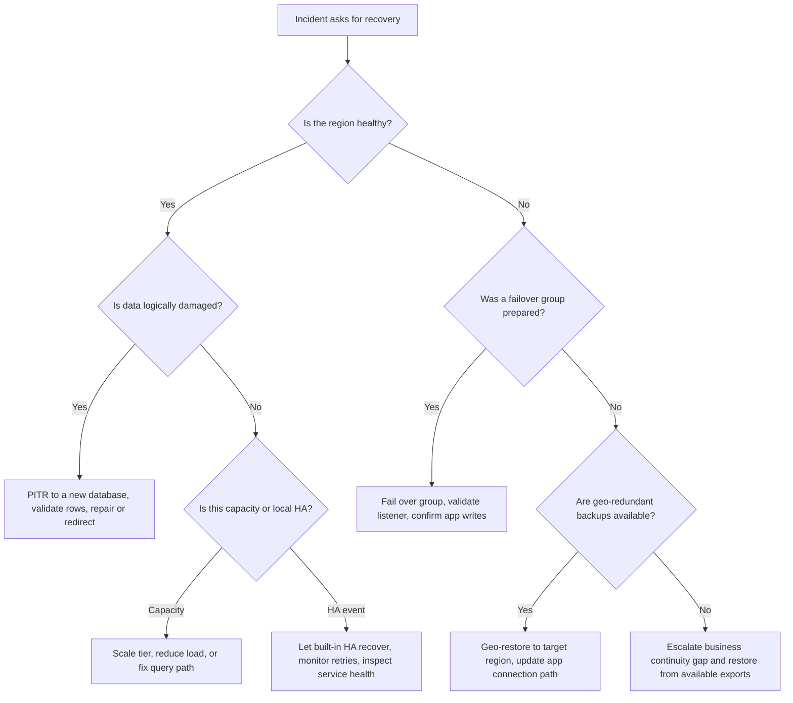
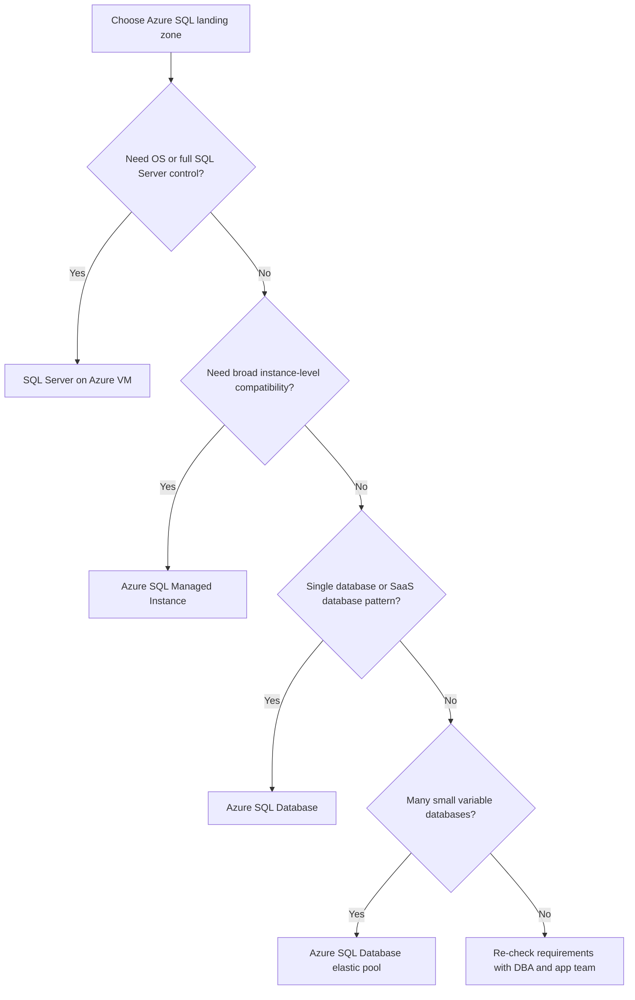

> **Complexity**: [COMPLEX]
>
> **Time to Complete**: 90-120 min
>
> **Prerequisites**: [3.1-entra-id](../module-3.1-entra-id/), [3.2-vnet](../module-3.2-vnet/), [3.9-key-vault](../module-3.9-key-vault/), [3.10-monitor](../module-3.10-monitor/)

---

## What You'll Be Able to Do

After completing this module, you will
be able to:

- **Compare** Azure SQL Database, Azure SQL Managed Instance, and SQL Server on Azure VM by control boundary, scaling unit, networking model, restore granularity, and feature fit.
- **Design** an Azure SQL Database compute and storage model that separates DTU, vCore, General Purpose, Business Critical, Hyperscale, Serverless, replicas, and IO limits.
- **Diagnose** availability and recovery incidents by selecting the right combination of built-in HA, zone redundancy, failover groups, active geo-replication, PITR, geo-restore, and LTR.
- **Implement** operator-grade identity, networking, encryption, audit, and Defender controls without turning the module into a T-SQL internals course.
- **Evaluate** Azure SQL Database cost and observability signals so you can explain slow queries, throttling, restore risk, and monthly spend before the ticket reaches a DBA.

## Why This Module Matters

Hypothetical scenario: an application
team opens an incident because
checkout latency tripled after a
release, the database CPU chart is at
the top of the graph, and the only
person on call is a platform engineer
rather than a DBA. The service owner
asks whether to scale the database,
fail over to the secondary region,
roll back the application, change a
firewall rule, or call the database
team. The wrong first move can turn a
contained performance incident into an
expensive outage because Azure SQL
Database combines database-engine
behavior, cloud networking, identity,
backup policy, and capacity billing in
one managed surface. The operator does
not need to tune every index from
memory, but the operator does need to
know which Azure SQL product is
running, which tier limits it, which
metric proves throttling, which
security control blocks a client, and
which restore path meets the promised
RPO.

Azure SQL is not one service with one
operating model. Microsoft uses the
Azure SQL family name for Azure SQL
Database, Azure SQL Managed Instance,
and SQL Server on Azure VM, each with
a different line between what Azure
operates and what your team operates.
Azure SQL Database is a
database-as-a-service for single
databases and elastic pools, Azure SQL
Managed Instance is closer to an
instance-scoped SQL Server migration
target, and SQL Server on Azure VM
gives you OS-level control with IaaS
responsibilities. Operators who
collapse those three into "SQL in
Azure" usually discover the difference
during incidents, especially when they
ask for SQL Agent, cross-database
behavior, custom networking, full OS
control, or a restore workflow that
the chosen service does not support.

This module teaches the daily operator
path. You will compare the managed SQL
choices, choose compute and storage
models, reason about HA and disaster
recovery, configure identity and
network access, model cost, read Azure
Monitor and Query Performance Insight,
run targeted SQL diagnostic queries,
and perform a point-in-time restore in
a hands-on exercise. The module
deliberately stays out of deep T-SQL
internals because the audience is a
platform, SRE, or DevOps engineer
responsible for production
reliability. When a problem crosses
into schema design, query plans,
statistics, isolation levels, or
application data modeling, you will
learn when to call a DBA and what
evidence to bring.

## 1. What Azure SQL Actually Means Today

The first operator question is not
"how do I connect?" The first question
is "which Azure SQL product am I
operating?" Azure SQL Database, Azure
SQL Managed Instance, and SQL Server
on Azure VM all use the SQL Server
engine lineage, but they differ in
control boundary, deployment shape,
networking, scale behavior, restore
model, and feature surface.
Microsoft's Azure SQL overview
describes the family as managed
products built on SQL Server
technology, with SQL Database and
Managed Instance as PaaS options and
SQL Server on Azure VM as IaaS [Azure
SQL
overview](https://learn.microsoft.com/en-us/azure/azure-sql/azure-sql-iaas-vs-paas-what-is-overview?view=azuresql).

Azure SQL Database is the most managed
option. You deploy a single database
or an elastic pool behind a logical
server, choose a purchasing model and
service tier, and let Azure handle
engine patching, backups, high
availability mechanics, and most
infrastructure work. The logical
server is not a SQL Server instance in
the traditional DBA sense. It is an
Azure management boundary for
databases, firewall rules, identity
configuration, private endpoints,
auditing settings, and failover group
participation.

Azure SQL Managed Instance is the
migration-friendly PaaS option. It
gives you an instance-scoped surface
that is much closer to SQL Server,
including broader compatibility for
instance-level features, native VNet
placement, and migration patterns that
assume existing SQL Server
applications. It reduces
operating-system and engine
maintenance, but it has a bigger
deployment footprint and a different
networking model than Azure SQL
Database. Operators usually choose it
when the application is too
instance-shaped for Azure SQL Database
but the team still wants PaaS
patching, automated backups, and
managed availability.

SQL Server on Azure VM is IaaS. You
run SQL Server on a Windows or Linux
VM, choose the SQL Server version and
edition, configure disks, patch the
OS, decide how backups run, and
implement SQL Server HA patterns such
as availability groups when the
application requires them. Azure can
help with the SQL IaaS Agent
extension, automated backup, patching
windows, and portal integration, but
the control and responsibility
boundary is fundamentally different.
This is the choice when legacy
features, third-party agents,
file-system access, kernel-level
control, or strict SQL Server
compatibility matter more than PaaS
simplicity.

Azure Database for PostgreSQL and
Azure Database for MySQL are not Azure
SQL Database variants. They are
managed relational database services
for different engines, drivers,
extensions, operational metrics,
backup semantics, and tuning habits.
An operator may run them on the same
platform and monitor them through
Azure Monitor, but this module does
not cover their engine behavior. Point
teams that need PostgreSQL or MySQL
toward the managed open-source
database tracks instead of trying to
transfer SQL Server assumptions across
engines.

```text
+----------------------+--------------------------+---------------------------+
| Azure SQL family     | Best mental model        | Operator owns             |
+----------------------+--------------------------+---------------------------+
| SQL Database         | Managed database         | DB settings, access, tier |
| Managed Instance     | Managed SQL instance     | Instance config, access   |
| SQL Server on VM     | SQL Server on Azure IaaS | OS, disks, SQL, HA, patch |
+----------------------+--------------------------+---------------------------+
```

| Operator comparison | Azure SQL Database | Azure SQL Managed Instance | SQL Server on Azure VM |
|---|---|---|---|
| What you control | Database settings, logical server policy, firewall, private endpoint, tier, replicas, backup retention, users, schema, query tuning | Instance configuration, VNet placement, databases, logins, jobs, policies, service tier, backup retention | VM size, OS, SQL version, disks, patching, backup tooling, HA topology, agents, registry, file system |
| What Azure controls | Hardware, OS, SQL engine patching, most HA, automated backups, storage abstraction | Hardware, OS patching, SQL engine patching, built-in HA, automated backups, platform lifecycle | Azure controls VM host fabric; your team controls guest OS and SQL Server stack |
| Scaling unit | Database, elastic pool, or Hyperscale replica | Managed instance or instance pool | VM, disk layout, SQL Server configuration, availability group replicas |
| Deployment time | Usually minutes for a small database | Commonly longer because the instance is network-integrated and heavier | VM provisioning plus SQL configuration time |
| Networking | Public endpoint, firewall rules, service endpoints, private endpoints | Native VNet integration and private addressing | Full VM networking, NSGs, load balancers, private IPs, custom routing |
| Restore granularity | Database-level PITR, geo-restore, deleted database restore, LTR restore to new DB | Database-level restore inside managed instance patterns | Whatever your backup design supports, often database and instance-level workflows |
| Max DB size | Tier-dependent; Hyperscale reaches the largest single-database size | Tier-dependent managed-instance limits | Limited by SQL edition, disk design, VM limits, and operational design |
| Eligible features | Most database-level features, no full instance control | Many instance-level SQL Server features without OS control | Full SQL Server surface when you install and operate it |

Worked example: a team is moving a
vendor application that uses SQL Agent
jobs, cross-database queries, CLR
integration, and linked-server
assumptions. Azure SQL Database may
look attractive because it is the most
managed option, but those
instance-level assumptions are the
warning sign. Managed Instance is the
first PaaS candidate because it
preserves more SQL Server instance
behavior while still removing OS and
engine patching from the team. SQL
Server on Azure VM remains the
fallback when the vendor requires OS
access, unsupported features, custom
agents, or a certified deployment
matrix that excludes PaaS.

Now you solve it: your team owns a new
SaaS API with one database per tenant,
modest data size, no SQL Agent, and a
requirement to isolate noisy tenants
later. Would you start with Azure SQL
Database single databases, an elastic
pool, Managed Instance, or SQL Server
on Azure VM? Write down the unit you
want to scale and the unit you want to
restore before choosing, because those
two answers usually expose the right
managed surface.

> **Pause and predict:** If a production incident says "the Azure SQL server is down," what three questions should you ask before any remediation command?

The strongest first questions are:
which Azure SQL product, which
database or instance, and which
connection path. "Server" can mean a
logical server for Azure SQL Database,
a managed instance, or a VM host, and
each answer changes the runbook. A
firewall rule on a logical server will
not fix a VM disk saturation incident,
and resizing a VM will not help a
serverless Azure SQL Database that is
resuming from pause. Clear naming in
dashboards, alerts, and runbooks
prevents the team from debugging the
wrong abstraction.

## 2. Compute and Storage Models

Azure SQL Database has two major
purchasing models: DTU and vCore. The
DTU model bundles CPU, memory, reads,
and writes into database transaction
units, with Basic, Standard, and
Premium tiers [DTU purchasing
model](https://learn.microsoft.com/en-us/azure/azure-sql/database/service-tiers-dtu?view=azuresql).
The vCore model exposes logical CPU,
memory, hardware family, storage,
backup storage, and service tier more
explicitly, and Microsoft recommends
it for flexibility, transparency, and
Azure Hybrid Benefit alignment
[purchasing
models](https://learn.microsoft.com/en-us/azure/azure-sql/database/purchasing-models?view=azuresql).
Operators should understand both
because many small or older databases
still run on DTU, while production
architecture reviews usually land on
vCore.

DTU is useful when the workload is
simple, small, and not worth detailed
sizing. If a development database or
low-traffic internal app fits
comfortably in Standard and has no
licensing optimization requirement,
DTU can be a practical way to buy a
bundle without arguing about vCores.
The danger is that DTU hides which
resource is saturated. When a DTU
database throttles, the operator still
has to look at CPU percentage, data IO
percentage, log IO percentage,
workers, sessions, waits, and query
behavior to know whether more bundled
DTUs are the right fix.

vCore is the operator-friendly model
for serious production. General
Purpose, Business Critical, and
Hyperscale are not just price tiers.
They describe different storage
architectures, IO ceilings, failover
behavior, read-scale options, and
maximum database sizes. The service
tier is an availability and
performance decision as much as a cost
decision.

General Purpose is the balanced
default for many production systems.
It uses remote storage, keeps cost
lower, and works well when latency
requirements are normal and the app
can tolerate the tier's IO limits.
Business Critical is for low-latency
OLTP and higher transaction rates,
with local SSD-backed storage and
multiple replicas behind the service
tier. Hyperscale separates compute and
storage so large databases can grow
far beyond the ordinary
single-database storage ceiling and
can scale compute and replicas
differently.

| Model | Operator reads it as | Best fit | Watch for |
|---|---|---|---|
| DTU | Bundled CPU, memory, read, and write budget | Small predictable apps, simple billing, older deployments | Hidden bottleneck type, coarse migration planning, bundled storage assumptions |
| vCore General Purpose | Explicit compute plus remote storage | Most ordinary production databases | Data IO and log IO throttling, remote storage latency, under-sized compute |
| vCore Business Critical | Higher-cost low-latency tier with replicas | Write-heavy OLTP, lower IO latency, read scale-out needs | Higher compute cost, local SSD capacity, replica behavior during failover |
| vCore Hyperscale | Cloud-native storage and compute split | Very large DBs, fast scale, many read replicas | Replica billing, page-server behavior, unsupported edge cases, migration planning |
| Serverless | Autoscaling vCore range with possible pause | Intermittent single DB workloads | Resume delay, min vCore floor, memory trimming, unpredictable warm-up |

Provisioned compute means you choose a
fixed amount of compute and pay for it
while it exists. That is the right
default for steady production
workloads because capacity is ready
when traffic arrives. Serverless means
you configure a minimum and maximum
vCore range, and the database can
automatically scale within that range
while billing for used compute;
General Purpose serverless can also
auto-pause so only storage is billed
during inactivity [serverless compute
tier](https://learn.microsoft.com/en-us/azure/azure-sql/database/serverless-tier-overview?view=azuresql).
Serverless is compelling for
intermittent workloads, but it is not
a free production autoscaler when
resume latency or cold memory affects
user traffic.

Hyperscale deserves its own mental
model. Traditional database storage
often feels like one engine process
managing local data files, but
Hyperscale splits the work into
compute nodes, page servers, a log
service, and Azure Storage [Hyperscale
architecture](https://learn.microsoft.com/en-us/azure/azure-sql/database/hyperscale-architecture?view=azuresql).
The primary compute replica handles
read-write workload, page servers own
ranges of database pages and keep SSD
caches, the log service processes
transaction log records, and durable
page storage sits in Azure Storage.
That design is why Hyperscale can
support very large databases, fast
snapshot-style backups, rapid scale
operations, and named replicas for
read-heavy patterns.

```text
+--------------------------- Hyperscale database ---------------------------+
|                                                                          |
|  Client writes                                                           |
|      |                                                                   |
|      v                                                                   |
|  +-------------------+        +-------------------+                       |
|  | Primary compute   | -----> | Log service       |                       |
|  | SQL engine        |        | Durable log path  |                       |
|  +-------------------+        +-------------------+                       |
|      |                         |       |       |                         |
|      v                         v       v       v                         |
|  +----------------+     +----------------+     +----------------+         |
|  | Page server A  |     | Page server B  |     | Page server C  |         |
|  | Page ranges    |     | Page ranges    |     | Page ranges    |         |
|  +----------------+     +----------------+     +----------------+         |
|      |                         |                       |                 |
|      v                         v                       v                 |
|  +------------------------------------------------------------------+    |
|  | Azure Storage durable page storage                                |    |
|  +------------------------------------------------------------------+    |
|                                                                          |
|  Read replicas attach to the same storage architecture for scale-out.     |
+--------------------------------------------------------------------------+
```

Read replicas are not one universal
feature with one billing model.
Business Critical includes a
read-scale secondary pattern that can
serve read-only workloads with
`ApplicationIntent=ReadOnly`.
Hyperscale can add HA replicas and
named replicas, and those replicas
have cost and resource implications.
Active geo-replication creates
readable secondary databases in
another region for Azure SQL Database,
while failover groups wrap one or more
databases with listener endpoints and
failover policy.

When a workload exceeds an SKU's IO
limit, Azure SQL Database does not
become magically faster because the
query is important. Throughput is
governed, operations wait, latency
rises, and clients may see timeouts or
retry storms. On DTU, the symptom may
be high DTU percentage with one of
CPU, data IO, or log IO driving the
blended limit. On vCore, the operator
can usually see the pressure more
directly through CPU percentage, data
IO percentage, log IO percentage,
workers percentage, sessions
percentage, waits, and Query
Performance Insight.

Worked example: a service runs on
General Purpose with 2 vCores and
shows CPU at moderate levels, data IO
near the limit, and log IO spiking
during batch imports. Scaling to 4
vCores may help if the tier gives more
IO with more vCores, but the real
question is whether the workload is
write-log limited, data-read limited,
or query-plan inefficient. If the
import is business-critical and
latency-sensitive, Business Critical
may be the right tier because the
storage architecture changes. If the
database is already several terabytes
and restore or scale time dominates
the decision, Hyperscale may be the
better architecture even if the
immediate symptom is IO.

Now you solve it: a database is slow
only during a nightly import, CPU
remains below half of the limit, log
IO reaches the top of the chart, and
client retries amplify the problem.
Would you first raise vCores, reduce
batch size, move to Business Critical,
change application retry policy, or
call a DBA for indexing and
transaction design? The operator
answer is to reduce blast radius and
collect proof: cap or schedule the
import, confirm log IO saturation,
check waits, then decide whether tier
movement or database design is the
durable fix.

## 3. High Availability and Disaster Recovery

Azure SQL Database gives you built-in
high availability before you configure
any cross-region disaster recovery.
The service is designed so Azure can
patch and recover infrastructure
without asking you to maintain SQL
Server failover clustering. That
built-in HA protects against many
local infrastructure failures, but it
is not the same as a cross-region
recovery plan. Operators must separate
local high availability, zone
redundancy, geo-replication, failover
groups, automatic backups,
point-in-time restore, geo-restore,
and long-term retention.

Zone redundancy is a regional
availability design. For supported
tiers and regions, Azure can place
database replicas across availability
zones so a zone failure does not imply
a database outage. Business Critical
and Hyperscale are the common
production tiers where operators
discuss zone-redundant HA, while
General Purpose zone redundancy is
also available in supported vCore
configurations. The decision belongs
in the same conversation as
application zone architecture, private
endpoint DNS, regional dependencies,
and whether the app is ready for
transient connection drops.

Backups solve a different problem.
Automated backups support
point-in-time restore for short-term
retention, with retention generally
configured in the 7 to 35 day range
for most production tiers and lower
limits for some small DTU choices
[automated
backups](https://learn.microsoft.com/en-us/azure/azure-sql/database/automated-backups-overview?view=azuresql-db).
Long-term retention copies selected
full backups into long-retention
storage for compliance and can retain
backups for up to 10 years [long-term
retention](https://learn.microsoft.com/en-us/azure/azure-sql/database/long-term-retention-overview?view=azuresql).
Backups are for data recovery after
deletion, corruption, bad deployments,
bad writes, and compliance evidence;
they are not a low-latency failover
mechanism.

Point-in-time restore creates a new
database from backups at a selected
timestamp. It is the operator's path
after a mistaken migration, accidental
delete, application bug, or data
corruption event where the original
database should not be overwritten
blindly. Geo-restore creates a
database from geo-replicated backups
in another region when the source
region is unavailable or when you need
regional recovery without
preconfigured active geo-replication.
Restore workflows should be rehearsed
because permission, naming, firewall,
identity, connection-string, and DNS
assumptions often fail during a real
incident.

Active geo-replication is per-database
asynchronous replication to readable
secondary databases. It can support
regional redundancy and manual
geo-failover for individual databases,
but applications must understand the
connection path and possible data loss
because replication is asynchronous
[active
geo-replication](https://learn.microsoft.com/en-us/azure/azure-sql/database/active-geo-replication-overview?view=azuresql-db).
Failover groups build on
geo-replication and manage one or more
databases as a group with stable
listener endpoints for read-write and
read-only connections [failover
groups](https://learn.microsoft.com/en-us/azure/azure-sql/database/auto-failover-group-sql-db?view=azuresql-db).
For operators, failover groups are
usually the safer application
abstraction because the connection
string can point at a listener instead
of a specific regional server.

| Recovery question | Use this feature | Operator warning |
|---|---|---|
| A zone has infrastructure trouble, but the region is alive | Zone-redundant HA where supported | The application still needs retry logic for transient disconnects |
| A deployment wrote bad data ten minutes ago | PITR to a new database | Restoring over the original is rarely the first safe move |
| A region is unavailable and no secondary exists | Geo-restore from geo-redundant backups | RTO is longer and capacity in target region is not guaranteed instantly |
| One important database needs a readable remote secondary | Active geo-replication | Failover is database-scoped and connection strings need planning |
| Several app databases must fail over together | Failover group | Secondary server security, firewall, identity, and DNS must be ready |
| Compliance requires historical backups beyond PITR | LTR | Retention can quietly become a large bill if no one owns policy |



RPO is the amount of data loss the
business can tolerate. RTO is the
amount of time the business can
tolerate before the service is usable
again. Those numbers should drive the
feature choice, not the other way
around. If the RPO is near zero and
RTO is minutes, relying only on
geo-restore is not a serious design;
if the workload is internal and can
wait, a failover group may be
unnecessary cost and complexity.

Worked example: a customer-facing API
promises a 15 minute RTO and accepts
up to 5 seconds of data loss during a
regional disaster. PITR alone cannot
meet that RTO because a restore
creates a new database and requires
application reconnection work.
Geo-restore is also too slow and too
manual for the promise. The operator
should design a failover group, test
planned failover, verify the
read-write listener, keep security
settings aligned on the secondary
server, and document the expected
data-loss window from asynchronous
replication.

> **Pause and predict:** A failover group exists, but after failover the app cannot connect from its private subnet in the secondary region.
> Which resource is most likely missing: the database, the login, the private DNS link, or the backup retention policy?

The most likely missing piece is the
network path, especially private DNS
and private endpoint alignment in the
target region. Authentication and
database existence can also fail, but
private endpoint designs are regional
and DNS-dependent. Good DR runbooks
include a secondary server access
checklist: Entra admin, contained
users, firewall state, private
endpoint, private DNS zone links,
application connection string, Key
Vault access, monitoring, and audit
destination. Do not treat failover as
only a database command.

## 4. Identity, Networking, and Security

Azure SQL Database access has two
planes. The Azure control plane
creates servers, databases, private
endpoints, firewall rules, identities,
diagnostic settings, Defender plans,
and backup policies through Azure
Resource Manager. The SQL data plane
accepts database connections,
authenticates users or applications,
enforces permissions, runs queries,
writes audit events, and exposes DMVs.
Operators need both planes because a
user can have Azure Contributor
permission and still be unable to
query a database, or have database
permission and still be blocked by
networking.

Microsoft Entra authentication is the
preferred identity direction for
humans and services because it
centralizes identity, conditional
access, group management, and service
principal patterns [configure
Microsoft Entra
authentication](https://learn.microsoft.com/en-us/azure/azure-sql/database/authentication-aad-configure?view=azuresql).
An Azure SQL logical server can have a
Microsoft Entra administrator, and
that administrator can create
contained database users from external
provider identities. Managed
identities can connect to Azure SQL
using Entra authentication when the
database has a corresponding user and
permission set [managed
identities](https://learn.microsoft.com/en-us/azure/azure-sql/database/authentication-azure-ad-user-assigned-managed-identity?view=azuresql-db).
This is the clean operator pattern for
App Service, Functions, AKS workload
identity, and automation jobs because
it avoids long-lived SQL passwords in
application settings.

```sql
-- Run as the Microsoft Entra administrator in the target database.
CREATE USER [app-orders-prod] FROM EXTERNAL PROVIDER;
ALTER ROLE db_datareader ADD MEMBER [app-orders-prod];
ALTER ROLE db_datawriter ADD MEMBER [app-orders-prod];
```

That snippet is intentionally small.
The operator decision is not "grant
db_owner so the app works." The
operator decision is to map an Entra
identity to the least database roles
the application needs, then make the
application use managed identity in
its connection string. If the app
needs schema migrations, use a
separate deployment identity with
controlled permissions rather than
giving the runtime identity ownership
of the database.

Networking is a separate gate. Azure
SQL Database can expose a public
endpoint guarded by IP firewall rules,
use virtual network service endpoints
in older patterns, or use private
endpoints through Azure Private Link
[private endpoint
overview](https://learn.microsoft.com/en-us/azure/azure-sql/database/private-endpoint-overview?view=azuresql).
Server-level firewall rules apply to
all databases on the logical server,
while database-level firewall rules
are created through T-SQL and apply
only to one database [firewall
rules](https://learn.microsoft.com/en-us/azure/azure-sql/database/firewall-configure?view=azuresql).
Private endpoints are usually the
production target for private
workloads, but they add DNS and
routing responsibilities that must be
tested from every caller network.

| Access pattern | When it is reasonable | Operator risk |
|---|---|---|
| Public endpoint plus narrow client IP firewall | Developer workstation, controlled admin jump host, short-lived lab | Dynamic IP changes, overly broad ranges, false confidence from "Allow Azure services" |
| Service endpoint | Existing VNet-based access pattern where supported | Less preferred than Private Link for many new designs |
| Private endpoint | Production private workloads and hub-spoke networks | DNS misconfiguration, regional failover gaps, split-horizon surprises |
| Database-level firewall rule | Rare per-database exception | Harder inventory because it is not managed like server-level firewall |
| Allow Azure services toggle | Emergency or legacy integration only | Broad Azure-origin access, poor least-privilege story |

Encryption controls protect different
layers. Transparent Data Encryption
protects data at rest by encrypting
database files and backups, and
customer-managed TDE keys let the
customer control the TDE protector
through Azure Key Vault or Managed HSM
[TDE with customer-managed
keys](https://learn.microsoft.com/en-us/azure/azure-sql/database/transparent-data-encryption-byok-overview?view=azuresql).
Always Encrypted protects selected
sensitive columns so encryption keys
are not exposed to the database engine
in ordinary operation [Always
Encrypted](https://learn.microsoft.com/en-us/sql/relational-databases/security/encryption/always-encrypted-database-engine?view=sql-server-ver17).
Dynamic Data Masking and Row-Level
Security are data-access controls, not
substitutes for permission design, and
they require application and DBA
review before production rollout.

Always Encrypted is a great example of
an operator-DBA boundary. The operator
can make sure Key Vault access,
managed identity, deployment pipeline
permissions, and driver support exist.
The DBA and application team must
decide which columns can be encrypted
without breaking query patterns,
indexing assumptions, sorting,
equality searches, or operational
support workflows. If the operator
turns it on as a checkbox without
application design, the incident may
be a broken release rather than a
safer database.

Auditing and Defender answer different
questions. Azure SQL auditing tracks
database events and can write audit
logs to Azure Storage, Log Analytics,
or Event Hubs [SQL
auditing](https://learn.microsoft.com/en-us/azure/azure-sql/database/auditing-overview?view=azuresql).
Microsoft Defender for SQL adds
vulnerability assessment and advanced
threat protection, including alerts
for possible SQL injection and
anomalous access patterns [Defender
for
SQL](https://learn.microsoft.com/en-us/azure/azure-sql/database/azure-defender-for-sql?view=azuresql).
Auditing is the durable trail;
Defender is detection and
recommendation; neither is a
replacement for least-privilege
identity, private networking, secure
coding, or patch discipline.

Hypothetical scenario: Defender raises
a possible SQL injection alert after a
new search endpoint goes live. The
operator should not dismiss it because
the service is behind private
networking; SQL injection is an
application input problem, not only an
internet exposure problem. The first
response is to preserve the alert,
identify the database and principal,
check audit logs and application logs
around the timestamp, confirm the
endpoint and query pattern, and pull
in the application team. If the alert
matches expected synthetic testing,
tune the alert process; if it matches
untrusted input reaching dynamic SQL,
escalate as a security incident.

## 5. Observability and Day-Two Operations

The operator's first slow-database
screen is Azure Monitor, not a
query-plan deep dive. Azure SQL
Database exposes metrics such as CPU
percentage, Data IO percentage, Log IO
percentage, Workers percentage,
Sessions percentage, DTU percentage
for DTU databases, storage percentage,
successful connections, failed
connections, and blocked connections
[monitoring
metrics](https://learn.microsoft.com/en-us/azure/azure-sql/database/monitoring-metrics-alerts?view=azuresql).
These metrics tell you whether the
database is near a service-tier limit,
whether the incident is
connection-related, whether worker or
session limits are involved, and
whether storage is becoming a capacity
risk. They do not tell you by
themselves which query or schema
design caused the pressure.

Query Performance Insight is the
operator's first stop for "why slow?"
It uses Query Store data to show top
resource-consuming and long-running
queries, CPU, duration, execution
count, query text where permitted, and
performance recommendations [Query
Performance
Insight](https://learn.microsoft.com/en-us/azure/azure-sql/database/query-performance-insight-use?view=azuresql).
The point is not that the operator
becomes the query tuner. The point is
that the operator can identify whether
one query, many chatty queries,
blocking, or a tier limit is the
dominant shape before escalating with
useful evidence.

Extended Events and automatic tuning
recommendations live one layer deeper.
Extended Events can capture targeted
diagnostic events with lower overhead
than older tracing habits, but it
still requires discipline because
"capture everything" is not an
incident strategy. Automatic tuning
recommendations can suggest index
creation, index drops, and plan
correction, but production teams
should treat automated changes as
policy decisions with rollback
awareness. For many teams, the
operator collects recommendations,
checks whether automatic tuning is
enabled, and brings the evidence to
the DBA or data platform owner.

```kusto
AzureMetrics
| where ResourceProvider == "MICROSOFT.SQL"
| where ResourceId has "/servers/" and ResourceId has "/databases/"
| where MetricName in ("cpu_percent", "dtu_consumption_percent", "data_io_percent", "log_write_percent")
| summarize max_value = max(Maximum) by MetricName, bin(TimeGenerated, 5m), ResourceId
| order by TimeGenerated desc
```

That KQL query is the Azure Monitor
metrics view of the same pressure
operators often inspect with
`sys.dm_db_resource_stats`. The DMV
itself is still useful when you are
connected to the database and need a
quick recent view. It returns CPU, IO,
and memory consumption rows for recent
intervals, with values expressed as
percentages of service-tier limits.
Use it like a database-local `top`
command, not as a permanent telemetry
store.

```sql
SELECT TOP (20)
    end_time,
    avg_cpu_percent,
    avg_data_io_percent,
    avg_log_write_percent,
    max_worker_percent,
    max_session_percent
FROM sys.dm_db_resource_stats
ORDER BY end_time DESC;
```

Database waits are the next operator
clue. The DMV `sys.dm_db_wait_stats`
shows completed waits for the current
database, and high lock waits, IO
waits, log waits, or worker-related
waits can point the investigation in
the right direction. The counters
reset after failover or database
movement, so do not compare them as if
they were a forever ledger. Use waits
to shape the next question: blocking,
IO, log pressure, worker starvation,
or application round trips.

```sql
SELECT TOP (15)
    wait_type,
    waiting_tasks_count,
    wait_time_ms,
    max_wait_time_ms,
    signal_wait_time_ms
FROM sys.dm_db_wait_stats
WHERE wait_type NOT LIKE 'SLEEP%'
ORDER BY wait_time_ms DESC;
```

For a more telemetry-native KQL
approach, Database Watcher can stream
Azure SQL monitoring datasets into
Azure Data Explorer or Fabric
Real-Time Analytics. Its SQL database
datasets include resource utilization,
query wait statistics, and wait
statistics tables such as
`sqldb_database_resource_utilization`,
`sqldb_database_query_wait_stats`, and
`sqldb_database_wait_stats` [database
watcher
datasets](https://learn.microsoft.com/en-us/azure/azure-sql/database-watcher-data?view=azuresql).
That makes KQL the right place for
fleet-level questions that do not
belong in one database connection. The
sample below assumes Database Watcher
is configured and data is landing in a
KQL database.

```kusto
sqldb_database_resource_utilization
| where sample_time_utc > ago(2h)
| where logical_server_name == "prod-sql-eastus"
| where database_name == "orders"
| summarize
    cpu=max(avg_cpu_percent),
    data_io=max(avg_data_io_percent),
    log_io=max(avg_log_write_percent),
    workers=max(max_worker_percent)
  by bin(sample_time_utc, 5m)
| render timechart
```

```kusto
sqldb_database_wait_stats
| where sample_time_utc > ago(2h)
| where logical_server_name == "prod-sql-eastus"
| where database_name == "orders"
| summarize wait_ms=max(wait_time_ms) by wait_type, bin(sample_time_utc, 5m)
| top 10 by wait_ms desc
```

Defender alerts add security context
to day-two operations. A possible SQL
injection alert asks whether untrusted
input reached a dangerous query
pattern. An unusual location or
unfamiliar principal alert asks
whether access behavior changed
because of a real deployment, a
compromised credential, or a
misconfigured integration. Operators
should route these alerts to the same
incident discipline as infrastructure
alerts: preserve evidence, identify
scope, correlate with deployment and
identity changes, and escalate with a
precise timeline.

Call in a DBA when the investigation
points to query plans, indexing,
locking design, isolation levels,
transaction shape, schema design,
statistics, parameter sensitivity, or
data distribution. Handle inline when
the issue is firewall, private
endpoint DNS, connection-string
target, tier saturation, runaway
non-production workload, backup
retention policy, diagnostic setting,
identity mapping, or a known platform
failover. The boundary is not ego; it
is risk management. A good operator
brings the DBA the timeline, metrics,
waits, top queries, recent
deployments, tier, connection path,
and user impact instead of a vague
"SQL is slow" ticket.

## Patterns and Anti-Patterns

Patterns turn managed database
operations into repeatable decisions.
The goal is not to create a perfect
database platform on day one. The goal
is to make the common failure paths
boring: access changes are reviewed,
failover has been rehearsed, capacity
graphs have owners, backup retention
has a business reason, and cost
increases can be explained before
finance opens a surprise ticket. Use
the patterns below as production
defaults unless your workload gives
you a concrete reason to diverge.

| Pattern | When to use it | Why it works | Scaling considerations |
|---|---|---|---|
| Logical server per environment boundary | Separate production, staging, and development blast radius | Firewall, Entra admin, audit, private endpoint, and failover policies stay easier to reason about | More servers means more policy automation and naming discipline |
| Managed identity for application access | Azure-hosted workloads that support Entra authentication | Removes long-lived SQL passwords from app settings and rotates trust through identity platform | Requires database users, driver support, and deployment identity separation |
| Private endpoint plus tested DNS | Private production workloads in VNets | Keeps traffic on private addressing and removes broad public exposure | Every region, spoke, resolver, and failover path needs validation |
| Failover group for multi-database apps | Apps with several databases that must move together | Listener endpoint avoids per-database connection-string rewrites | Secondary server access, cost, lag, and failover tests become recurring operations |
| Query Performance Insight before scaling | Slow queries or capacity alarms with unclear root cause | Shows whether one query, many queries, or tier limits dominate | Query Store retention and permissions must be healthy |
| PITR to new database before repair | Bad write, bad migration, accidental delete | Preserves evidence and gives a safe comparison target | Application repair scripts and data reconciliation may need DBA ownership |

Anti-patterns are usually attractive
because they work once. A broad
firewall rule fixes the developer
demo. Scaling up hides a bad import
for a week. One shared SQL admin
password gets the application online.
Each of those shortcuts transfers risk
to the next incident, where the team
has less context and more pressure.

| Anti-pattern | What goes wrong | Better alternative |
|---|---|---|
| Treating the logical server as a full SQL Server instance | Operators expect instance features that Azure SQL Database does not provide | Choose Managed Instance or SQL Server on VM when instance scope is required |
| Scaling before reading IO and query signals | Cost rises while the bottleneck remains application or schema-driven | Check Azure Monitor, Query Performance Insight, and waits before resizing |
| Leaving public access broad because private endpoints are hard | Attack surface and accidental access grow quietly | Use private endpoints for production and narrow temporary public rules for admin access |
| Enabling LTR without an owner | Backup storage becomes a compliance-cost trap | Attach retention to a named policy, audit cadence, and deletion process |
| Using SQL admin credentials in applications | Password rotation and blast radius become painful | Use managed identity and separate deployment identities |
| Building failover groups but never testing them | DNS, identity, and firewall gaps appear during the disaster | Run planned failover tests and record exact application validation steps |

## Decision Framework

Start with the operational ownership
model. If the team wants a managed
database and the application fits
database-scoped features, Azure SQL
Database is the default. If the
application is SQL Server
instance-shaped and needs broader
compatibility without OS ownership,
Managed Instance is the default
migration candidate. If the
application requires full SQL Server
control, a certified VM deployment,
custom agents, unsupported instance
features, or OS access, SQL Server on
Azure VM is the honest choice.



Choose DTU only when simplicity is the
real goal. DTU is fine for small,
predictable, low-risk databases where
a bundled capacity choice is easier
than independent compute and storage
sizing. Move to vCore when you need
transparent CPU and storage sizing,
Azure Hybrid Benefit, reserved
capacity, serious production modeling,
Business Critical, Hyperscale, or
Serverless. Do not let "DTU is
simpler" become "we cannot explain why
this database throttles."

Choose Serverless when the workload is
intermittent and can tolerate resume
behavior. Development, test,
occasional reporting, low-traffic
internal tools, and unpredictable new
databases are good candidates. Steady
user-facing APIs, latency-sensitive
services, and workloads with constant
background activity usually belong on
provisioned compute. Serverless saves
money when idle periods are real; it
disappoints when the database never
pauses or when cold-start behavior
violates the user experience.

Choose Hyperscale when the
architecture solves a real problem.
Very large databases, fast scale up or
down independent of data size, rapid
snapshot-style backups, and read-scale
patterns are strong reasons. Do not
choose Hyperscale only because the
name sounds safer. Its replicas and
storage model change the cost surface,
and some migration or feature
limitations may matter for legacy
applications.

| Decision | Choose this | Avoid this |
|---|---|---|
| New cloud app with one operational database | Azure SQL Database vCore General Purpose | Managed Instance just because it feels familiar |
| Existing SQL Server app with instance features | Azure SQL Managed Instance | Rewriting the app around single-database constraints under time pressure |
| Vendor app requiring OS access | SQL Server on Azure VM | Unsupported PaaS deployment that breaks vendor support |
| Small predictable internal app | DTU Standard or small vCore | Hyperscale or Business Critical without evidence |
| Intermittent dev or test database | Serverless General Purpose | Provisioned compute that runs idle all month |
| Very large single database with scale pressure | Hyperscale | Repeatedly raising General Purpose size without a restore and scale plan |
| Low-latency OLTP with high write rate | Business Critical | General Purpose if IO latency is the recurring incident |
| Legacy on-prem pattern with strict control | SQL Server on Azure VM | PaaS if kernel, agent, file, or edition control is mandatory |

Worked example: a customer database is
100 GB, serves a steady API, has
ordinary latency needs, and peaks
during business hours. General Purpose
vCore is a sensible first design
because the workload is not huge, not
obviously low-latency OLTP, and not
intermittent enough for Serverless. If
the team later sees sustained log IO
pressure and low-latency requirements,
Business Critical becomes a
performance architecture discussion
rather than a panic scale button. If
the database grows into many terabytes
and restore time becomes a product
risk, Hyperscale becomes a storage
architecture discussion.

Now you solve it: a reporting workload
runs for two hours each weekday, can
wait after idle periods, and is
inactive most nights and weekends.
Would Serverless or Provisioned
compute be the first cost model you
test? The correct operator instinct is
to test Serverless with a realistic
resume and query schedule, then
compare the bill against provisioned
compute plus any scheduling or pause
strategy the team can actually
operate.

## Cost Lens

Azure SQL Database cost is a design
input, not a finance afterthought. For
DTU, you pay for the chosen DTU
service objective and bundled storage
behavior. For vCore, the main bill is
compute hours, provisioned or
allocated data storage, backup storage
beyond the included amount, optional
long-term retention, replicas,
Defender, and network or monitoring
costs around the database. Reserved
capacity, Dev/Test pricing, and Azure
Hybrid Benefit can materially change
the compute line, but they do not
erase poor tier selection or unlimited
retention.

The vCore pricing surface is usually
easiest to explain as a formula.
Provisioned compute is vCore-hour rate
multiplied by hours in the month. Data
storage is GB-month multiplied by the
selected tier's storage rate. PITR
backup storage has an included amount
tied to database size, with excess
backup storage charged by GB-month,
while LTR storage is separate.
Geo-replication and failover groups
add secondary compute and storage
because the secondary database is a
real database, not a free checkbox.

Hyperscale changes the mental model.
Compute is charged per replica,
storage is charged for allocated data
storage that grows in increments, and
additional replicas change the monthly
number. Page servers and Azure Storage
are part of the architecture, so the
operator should read Hyperscale cost
as "primary compute plus replica
compute plus allocated storage plus
backup storage," not as "one database
price." Hyperscale can be
cost-effective for the right workload,
but it punishes vague replica habits.

Reserved capacity is a commitment
discount for steady production.
One-year and three-year reservations
can reduce compute cost when the
database is expected to run
continuously. Azure Hybrid Benefit can
apply existing SQL Server licenses to
eligible vCore Azure SQL Database
deployments, reducing compute cost
when licensing terms are met. Dev/Test
pricing can reduce non-production cost
for eligible subscriptions, but it
should not be used to hide production
workloads in the wrong subscription.

Worked pricing example, using East US
Pay-As-You-Go retail prices sampled
from the Azure pricing page and Retail
Prices API on May 19, 2026. Assume a
730-hour month, 100 GB maximum data
size, no LTR, and PITR backup
consumption within the included 100
percent database-size allowance. The
numbers are rounded and should be
recalculated in the Azure Pricing
Calculator for your region, currency,
reservation, licensing, backup
redundancy, and support plan. The
example compares General Purpose and
Business Critical because the tier
choice is often the biggest
operator-controlled difference.

| Example shape | Compute assumption | Compute monthly | Data storage monthly | PITR backup monthly | Approximate total |
|---|---:|---:|---:|---:|---:|
| General Purpose, 8 vCore, provisioned (Standard-series hardware) | $1.217736 per hour | $889.95 | $11.50 | $0.00 when within included allowance | $901.45 |
| Business Critical, 8 vCore, provisioned (Standard-series hardware) | $2.43548 per hour | $1,778.90 | $25.00 | $0.00 when within included allowance | $1,803.90 |

Zone-redundant configuration (where supported, including General Purpose and Business Critical) adds a premium of roughly 20-30% on the compute meter to account for the redundant deployment across availability zones. Use the [Azure Pricing Calculator](https://azure.microsoft.com/en-us/pricing/calculator/) to model the exact ZR rate for your chosen hardware family — published per-hour rates vary across Standard-series, Fsv2-series, and DC-series options and the public meter names change as new hardware families are introduced.

Read the table above carefully. It is not a
universal quote, and it does not
include Defender for SQL, cross-region
replicas, excess backup storage, LTR,
Log Analytics ingestion, support,
private endpoint data processing, or
reservations. It shows the operator
method: list the tier, compute hours,
storage GB-month, backup assumption,
and optional features separately. If
the bill is surprising, break it back
into those lines before changing the
database.

Cost spikes usually come from
operational shortcuts. An under-sized
DTU or vCore database causes
throttling, so the team
over-provisions to silence alerts
instead of fixing query shape or batch
timing. Unbounded LTR retains backups
for years without a named compliance
owner. Cross-region geo-replication
doubles much of the database footprint
because the secondary exists and runs.
Hyperscale replicas multiply compute
cost when teams add read replicas
without retiring experiments.

Defender for SQL is valuable, but it
is still a billable plan. For a small
low-risk development database, leaving
Defender enabled may be less important
than using a cheaper dev/test pattern
and stronger subscription policy. For
production data, the security signal
is often worth the cost, especially
when audit logs and incident response
are mature enough to use the alerts.
The operator decision is not "security
costs too much"; it is "which
subscriptions and data classes require
this control, and who reviews the
findings?"

## Did You Know?

- Azure SQL Database Serverless bills compute per second when active and can auto-pause in General Purpose, but storage billing continues while the database is paused.
- Long-term retention for Azure SQL Database can retain selected backups for up to 10 years, which is useful for compliance and dangerous when no one owns deletion policy.
- Hyperscale separates compute from storage with page servers and a log service, so backup and scale behavior is not tied to copying one giant local data file.
- In the vCore model, Microsoft documents that Business Critical pricing is higher partly because additional replicas are allocated automatically behind the service tier.

## Common Mistakes

| Mistake | Why It Happens | How to Fix It |
|---|---|---|
| Choosing Managed Instance for every migration | Teams equate "more compatible" with "always safer" | Start with feature requirements, then choose SQL Database when the app is database-scoped |
| Treating DTU percentage as a root cause | DTU is a blended signal, so it hides the dominant constrained resource | Break it into CPU, data IO, log IO, workers, sessions, waits, and top queries |
| Using public firewall exceptions as permanent production access | It is fast during setup and avoids DNS work | Move production callers to private endpoints and expire temporary public rules |
| Forgetting secondary-region security during failover design | The database replication setup succeeds, so teams assume access replicated too | Validate Entra admin, contained users, firewall, private endpoint, DNS, Key Vault, audit, and app settings |
| Enabling LTR with "keep everything" language | Compliance asks for retention and no owner translates it into policy | Map retention to a regulation, owner, review date, and deletion process |
| Scaling up to hide a bad batch job | More vCores reduce symptoms quickly | Schedule, batch, index, or redesign the job; scale only after the bottleneck is understood |
| Giving the runtime app db_owner | It avoids migration and permission errors during release | Split runtime identity from deployment identity and grant least privilege |
| Ignoring Query Store health | Query Performance Insight looks empty, so operators assume no data exists | Confirm Query Store is enabled, has space, and has collected enough workload history |

## Quiz

<details><summary>Your team runs a new checkout API on Azure SQL Database General Purpose. CPU is moderate, log IO is consistently near the service limit during imports, and the app sees timeout spikes. What do you check before scaling?</summary>

Start by confirming the pressure shape
with Azure Monitor metrics and
`sys.dm_db_resource_stats`, then look
at waits and Query Performance Insight
for the import workload. If log IO is
the dominant limit, scaling vCores may
help only if the tier provides more
log throughput at the new size. You
should also check batch size,
transaction scope, retry behavior, and
whether the import should be scheduled
or redesigned. Call in a DBA if
transaction design, indexing, or query
plans are part of the sustained
problem.

</details>

<details><summary>A vendor app requires SQL Agent jobs, linked-server behavior, and a certification matrix that names SQL Server on Windows. Which Azure SQL option is the safest starting point and why?</summary>

SQL Server on Azure VM is the safest
starting point when the vendor
requires OS-level or full SQL Server
control. Azure SQL Managed Instance
may be worth evaluating if the vendor
supports it and the feature set fits,
but certification language matters in
production. Azure SQL Database is
likely the wrong first choice because
it is database-scoped and does not
provide a full SQL Server instance
surface. The operator should document
which features force IaaS so the
decision is not dismissed as
preference.

</details>

<details><summary>A failover group test succeeds, but the application cannot connect from the secondary region after failover. The database exists and the listener resolves. What is your next investigation path?</summary>

Check the secondary-region network and
identity path, not only database
replication. Private endpoints,
private DNS zone links, firewall
rules, Entra admin, contained users,
Key Vault access, and application
configuration all need to work after
failover. The listener can point to
the new primary while the client
subnet still resolves or routes
incorrectly. A good failover test
validates application writes, reads,
secrets, audit, and monitoring, not
just the Azure failover operation.

</details>

<details><summary>A development database is used a few hours per week and has no latency-sensitive users. The monthly bill is mostly idle compute. Which compute model do you evaluate first?</summary>

Evaluate Serverless first because the
workload is intermittent and can
likely tolerate resume delay. Set a
realistic minimum and maximum vCore
range, test auto-pause and resume
behavior, and compare billed active
compute against provisioned compute.
If background jobs keep the database
active all month, Serverless may not
save much. The operator should measure
real idle periods rather than assuming
the service will pause.

</details>

<details><summary>A security team asks you to enable Always Encrypted for customer identifiers by Friday. What is the operator response?</summary>

Treat it as a joint application, DBA,
and platform change rather than a
simple portal toggle. The operator can
prepare Key Vault access, managed
identity, driver compatibility checks,
and deployment permissions, but the
application and DBA teams must
validate query patterns, indexing,
encryption type, and release safety.
Always Encrypted changes how the
application handles protected columns.
Rushing it without a test plan can
create an availability incident while
trying to solve a confidentiality
requirement.

</details>

<details><summary>An executive asks why a 100 GB database costs much more after adding geo-replication. How do you explain it?</summary>

Geo-replication creates a secondary
database that consumes compute and
storage, so it is not a free backup
copy. The bill can roughly double
major database lines depending on
tier, region, replicas, backup
redundancy, and configuration. Explain
the cost in terms of primary compute,
secondary compute, data storage,
backup storage, and any monitoring or
Defender charges. Then tie the added
spend to the RPO and RTO that
geo-replication or failover groups are
meant to satisfy.

</details>

<details><summary>An alert shows high workers percentage and blocked connections, but CPU is not saturated. Should the operator immediately move to Business Critical?</summary>

No, not immediately. High workers and
blocked connections can come from
blocking, long-running transactions,
connection storms, poor pooling, or
workload shape rather than storage
architecture. The operator should
inspect sessions, waits, Query
Performance Insight, application
connection behavior, and recent
deployments. Business Critical may be
appropriate later, but moving tiers
before identifying blocking or worker
exhaustion can increase cost without
fixing the cause.

</details>

## Hands-On Exercise

In this exercise you will create an
Azure SQL Database, configure access,
load data, generate pressure, observe
metrics, scale compute, and perform
point-in-time restore. The exercise is
designed for a solo operator with an
Azure subscription, Azure CLI,
`sqlcmd`, and permission to create a
resource group, SQL logical server,
database, firewall rule, and optional
private endpoint. Use a disposable
subscription or lab resource group,
because even short-lived databases can
cost money. Delete the resource group
at the end unless your instructor
tells you to keep it for review.

### Setup assumptions

Use East US in the examples so the
commands are concrete. Change the
region if your subscription policy
requires another location. The private
endpoint step is optional because not
every learner has an existing VNet;
the exercise still works with a narrow
client IP firewall rule. For
production, private endpoint plus
correct DNS should replace workstation
public access.

```bash
az account show --query "{subscription:name, tenant:tenantId}" -o table
sqlcmd -?
```

### Step 1: Create the resource group, logical server, and database

This step creates the management
boundary and a small provisioned vCore
database. The server name must be
globally unique under
`database.windows.net`, so the command
includes random shell values. Do not
paste a real production password into
the module or a ticket. Read it into
an environment variable and let the
shell keep it out of command history
where possible.

```bash
export RG="rg-kubedojo-sql"
export LOCATION="eastus"
export SQL_SERVER="dojo-sql-$RANDOM-$RANDOM"
export SQL_DB="dojoapp"
export SQL_ADMIN="dojooperator"

read -r -s -p "SQL admin password: " SQL_ADMIN_PASSWORD
printf '\n'

az group create \
  --name "$RG" \
  --location "$LOCATION"

az sql server create \
  --resource-group "$RG" \
  --name "$SQL_SERVER" \
  --location "$LOCATION" \
  --admin-user "$SQL_ADMIN" \
  --admin-password "$SQL_ADMIN_PASSWORD"

az sql db create \
  --resource-group "$RG" \
  --server "$SQL_SERVER" \
  --name "$SQL_DB" \
  --edition GeneralPurpose \
  --family Gen5 \
  --capacity 2 \
  --compute-model Provisioned \
  --backup-storage-redundancy Local
```

- [ ] Resource group exists.
- [ ] Logical server exists and shows the expected region.
- [ ] Database exists on General Purpose provisioned compute.
- [ ] You recorded the server FQDN as `$SQL_SERVER.database.windows.net`.

<details><summary>Solution notes for Step 1</summary>

Use `az sql db show --resource-group
"$RG" --server "$SQL_SERVER" --name
"$SQL_DB" -o table` to confirm the
database. If server creation fails,
check global name uniqueness, password
complexity, and subscription policy.
If database creation fails because the
selected region or family is
unavailable, choose an allowed region
or use the portal to identify
available Azure SQL Database options.
Do not continue until the database
reaches Online state.

</details>

### Step 2: Configure access with a narrow firewall rule and optional private endpoint

The fastest solo path is to allow your
current public client IP. That is
acceptable for a lab and poor as a
permanent production pattern. The
optional private endpoint commands
show the production direction when you
already have a VNet and subnet.
Private endpoint DNS must resolve the
SQL server FQDN to the private address
from the calling network.

```bash
CLIENT_IP="$(curl -fsS https://api.ipify.org)"

az sql server firewall-rule create \
  --resource-group "$RG" \
  --server "$SQL_SERVER" \
  --name AllowMyClientIp \
  --start-ip-address "$CLIENT_IP" \
  --end-ip-address "$CLIENT_IP"
```

Optional private endpoint path, only
if you have a VNet and a dedicated
subnet available:

```bash
export VNET_RG="rg-existing-network"
export VNET_NAME="vnet-platform-lab"
export SUBNET_NAME="snet-private-endpoints"
export PE_NAME="pe-$SQL_SERVER"
export DNS_ZONE="privatelink.database.windows.net"

SQL_SERVER_ID="$(az sql server show \
  --resource-group "$RG" \
  --name "$SQL_SERVER" \
  --query id \
  -o tsv)"

az network private-dns zone create \
  --resource-group "$VNET_RG" \
  --name "$DNS_ZONE"

az network private-dns link vnet create \
  --resource-group "$VNET_RG" \
  --zone-name "$DNS_ZONE" \
  --name "link-$VNET_NAME" \
  --virtual-network "$VNET_NAME" \
  --registration-enabled false

az network private-endpoint create \
  --resource-group "$VNET_RG" \
  --name "$PE_NAME" \
  --vnet-name "$VNET_NAME" \
  --subnet "$SUBNET_NAME" \
  --private-connection-resource-id "$SQL_SERVER_ID" \
  --group-id sqlServer \
  --connection-name "conn-$SQL_SERVER"

az network private-endpoint dns-zone-group create \
  --resource-group "$VNET_RG" \
  --endpoint-name "$PE_NAME" \
  --name default \
  --private-dns-zone "$DNS_ZONE" \
  --zone-name "$DNS_ZONE"
```

- [ ] A server-level firewall rule allows only your current client IP for the lab.
- [ ] If using Private Link, the private endpoint is approved and has a private IP.
- [ ] If using Private Link, the VNet is linked to `privatelink.database.windows.net`.
- [ ] You can explain why the lab firewall rule should be removed after cleanup.

<details><summary>Solution notes for Step 2</summary>

Use `az sql server firewall-rule list
--resource-group "$RG" --server
"$SQL_SERVER" -o table` to confirm the
rule. For private endpoints, test DNS
from a VM or runner inside the VNet
with `nslookup
"$SQL_SERVER.database.windows.net"`.
If DNS still returns public addresses
from the private network, fix the
private DNS zone link before blaming
SQL authentication. If you are working
only from your laptop, continue with
the narrow firewall rule.

</details>

### Step 3: Connect with sqlcmd and load a small schema

This step verifies that data-plane
authentication and network access
work. It also creates enough data to
make metrics and query views
interesting. The insert uses a
recursive CTE pattern to generate rows
without needing an external data file.
If `sqlcmd` cannot connect, fix that
before loading data because the rest
of the exercise depends on a stable
connection path.

```bash
sqlcmd \
  -S "$SQL_SERVER.database.windows.net" \
  -d "$SQL_DB" \
  -U "$SQL_ADMIN" \
  -P "$SQL_ADMIN_PASSWORD" \
  -N -C \
  -Q "SELECT DB_NAME() AS database_name, SUSER_SNAME() AS login_name;"
```

```bash
cat > seed-operator-events.sql <<'SQL'
SET NOCOUNT ON;

DROP TABLE IF EXISTS dbo.operator_events;

CREATE TABLE dbo.operator_events
(
    event_id int IDENTITY(1,1) NOT NULL PRIMARY KEY,
    tenant_id int NOT NULL,
    event_time datetime2 NOT NULL,
    severity varchar(12) NOT NULL,
    payload varchar(200) NOT NULL
);

WITH n AS
(
    SELECT TOP (10000)
        ROW_NUMBER() OVER (ORDER BY (SELECT NULL)) AS rn
    FROM sys.all_objects AS a
    CROSS JOIN sys.all_objects AS b
)
INSERT dbo.operator_events (tenant_id, event_time, severity, payload)
SELECT
    rn % 25,
    DATEADD(second, -rn, SYSUTCDATETIME()),
    CASE WHEN rn % 10 = 0 THEN 'warning' ELSE 'info' END,
    CONCAT('operator-path-event-', rn)
FROM n;

SELECT COUNT(*) AS inserted_rows FROM dbo.operator_events;
SQL

sqlcmd \
  -S "$SQL_SERVER.database.windows.net" \
  -d "$SQL_DB" \
  -U "$SQL_ADMIN" \
  -P "$SQL_ADMIN_PASSWORD" \
  -N -C \
  -i seed-operator-events.sql
```

- [ ] `sqlcmd` connects to the expected database.
- [ ] Table `dbo.operator_events` exists.
- [ ] The load reports 10000 inserted rows.
- [ ] You can see the database in the Azure portal Overview pane.

<details><summary>Solution notes for Step 3</summary>

If `sqlcmd` reports a login failure,
confirm the admin user, password, and
database name. If it reports a network
error, check the firewall rule,
private endpoint DNS, and whether your
current public IP changed. If the
insert fails because an object already
exists, rerun the script because it
drops and recreates the lab table. If
the row count is lower than expected,
check whether the script was
interrupted.

</details>

### Step 4: Trigger load and watch database metrics

The load script is intentionally
blunt. It updates rows and runs
aggregate reads in a loop so you can
watch CPU, data IO, log IO, workers,
and sessions move. The goal is not to
benchmark Azure SQL Database. The goal
is to connect workload behavior to
Azure Monitor metrics and identify
which limit appears first.

```bash
cat > load-operator-events.sql <<'SQL'
SET NOCOUNT ON;

DECLARE @i int = 0;

WHILE @i < 800
BEGIN
    UPDATE TOP (250) dbo.operator_events
        SET event_time = SYSUTCDATETIME()
        WHERE severity = 'info';

    SELECT COUNT_BIG(*) AS warning_events
    FROM dbo.operator_events
    WHERE severity = 'warning'
      AND payload LIKE 'operator-path-event-%';

    SET @i += 1;
END;
SQL

for worker in 1 2 3 4
do
  sqlcmd \
    -S "$SQL_SERVER.database.windows.net" \
    -d "$SQL_DB" \
    -U "$SQL_ADMIN" \
    -P "$SQL_ADMIN_PASSWORD" \
    -N -C \
    -i load-operator-events.sql > "load-worker-$worker.log" 2>&1 &
done

wait
```

Open the database in the Azure portal
while the load runs. Go to Monitoring,
Metrics, and chart CPU percentage,
Data IO percentage, Log IO percentage,
Workers percentage, Sessions
percentage, and successful or failed
connections. If the load completes too
quickly, rerun it or increase the loop
count modestly. If you see timeouts,
keep the logs because they are part of
the learning goal.

- [ ] You generated concurrent SQL activity.
- [ ] You observed at least CPU, data IO, and log IO metrics.
- [ ] You identified whether CPU, data IO, log IO, workers, or sessions looked closest to the limit.
- [ ] You opened Query Performance Insight and found the lab query shape or confirmed that it needs more collection time.

<details><summary>Solution notes for Step 4</summary>

Azure Monitor metrics may lag by a few
minutes, and Query Performance Insight
may need Query Store history before
useful charts appear. If no metric
changes, confirm that the load workers
actually ran and inspect
`load-worker-1.log`. If the database
throttles, the visible symptom may be
slower completion rather than a clean
error. The important output is your
observation of which metric saturates
first.

</details>

### Step 5: Scale the database compute and compare signals

Scaling is an operator action, not a
permanent conclusion. You are testing
whether more provisioned compute
changes the observed pressure. In
production, you would pair this with
cost approval, a rollback plan, and a
follow-up review of whether the
workload should be tuned instead. For
the lab, scale from 2 vCores to 4
vCores and rerun the load.

```bash
az sql db update \
  --resource-group "$RG" \
  --server "$SQL_SERVER" \
  --name "$SQL_DB" \
  --capacity 4

az sql db show \
  --resource-group "$RG" \
  --server "$SQL_SERVER" \
  --name "$SQL_DB" \
  --query "{name:name, status:status, edition:edition, capacity:currentServiceObjectiveName}" \
  -o table
```

Rerun the load after the update
completes. Compare CPU, data IO, log
IO, duration, and any timeout behavior
against the first run. If the dominant
bottleneck moved, write that down. If
nothing improved, the bottleneck may
be query shape, locking, log design,
or another tier limit rather than raw
compute.

- [ ] Database scale operation completed.
- [ ] The database reports the larger service objective.
- [ ] You reran the load and compared metrics.
- [ ] You can state whether scaling changed the bottleneck or only changed the bill.

<details><summary>Solution notes for Step 5</summary>

Some scale operations briefly
disconnect sessions, so production
applications need retry logic. If the
update is blocked by subscription
policy or regional limits, use the
portal to select the next available
size. If metrics improve, do not stop
thinking; ask whether the new size is
the right steady-state cost. If
metrics do not improve, bring the top
queries and waits to a DBA instead of
repeatedly increasing size.

</details>

### Step 6: Perform point-in-time restore to a new database

Point-in-time restore should create a
new database, not overwrite the
original during a live incident. This
step restores the database to a
timestamp five minutes in the past.
The restore time must be inside the
available PITR window, and very new
databases may need a little time
before an earlier restore point is
available. If the restore time fails,
wait several minutes and retry with a
slightly later timestamp.

```bash
export SQL_DB_RESTORED="${SQL_DB}-restore"

RESTORE_TIME="$(.venv/bin/python - <<'PY'
from datetime import datetime, timedelta, timezone

print((datetime.now(timezone.utc) - timedelta(minutes=5)).strftime("%Y-%m-%dT%H:%M:%SZ"))
PY
)"

printf 'Restoring to %s\n' "$RESTORE_TIME"

az sql db restore \
  --resource-group "$RG" \
  --server "$SQL_SERVER" \
  --name "$SQL_DB" \
  --dest-name "$SQL_DB_RESTORED" \
  --time "$RESTORE_TIME"

az sql db list \
  --resource-group "$RG" \
  --server "$SQL_SERVER" \
  --query "[].{name:name,status:status,sku:currentServiceObjectiveName}" \
  -o table
```

Verify the restored database through
`sqlcmd`. Use the restored database
name and check that the table exists.
The row count may differ depending on
the restore timestamp and load timing.
That difference is the point: PITR
gives you a database at a prior point
so you can compare, repair, or
redirect safely.

```bash
sqlcmd \
  -S "$SQL_SERVER.database.windows.net" \
  -d "$SQL_DB_RESTORED" \
  -U "$SQL_ADMIN" \
  -P "$SQL_ADMIN_PASSWORD" \
  -N -C \
  -Q "SELECT COUNT(*) AS restored_rows FROM dbo.operator_events;"
```

- [ ] Restore command completed successfully.
- [ ] A new database with the restored name exists.
- [ ] `sqlcmd` can connect to the restored database.
- [ ] The restored database contains `dbo.operator_events`.
- [ ] You can explain how PITR differs from failover.

<details><summary>Solution notes for Step 6</summary>

If the restore fails because the
timestamp is too early, wait until
backups catch up and choose a later
timestamp. If the restored database
cannot be queried, confirm firewall
and login access on the same logical
server. If the restored database
exists but lacks expected rows,
compare the restore timestamp with
when the seed and load scripts ran. In
production, this restored copy becomes
the safe analysis target for data
repair.

</details>

### Cleanup

Delete the resource group when you are
done. This removes the logical server,
databases, firewall rule, and lab
artifacts in that resource group. If
you created a private endpoint in a
shared network resource group, remove
that private endpoint and DNS zone
group separately if your organization
does not want to keep it. Do not leave
scaled-up lab databases running.

```bash
az group delete \
  --name "$RG" \
  --yes \
  --no-wait
```

- [ ] Lab resource group deletion started.
- [ ] Any optional private endpoint resources in another resource group were removed or assigned to an owner.
- [ ] Local files `seed-operator-events.sql`, `load-operator-events.sql`, and `load-worker-*.log` were reviewed or deleted.

## Sources

- [What is Azure SQL?](https://learn.microsoft.com/en-us/azure/azure-sql/azure-sql-iaas-vs-paas-what-is-overview?view=azuresql) — Defines the Azure SQL family and compares SQL Database, Managed Instance, and SQL Server on Azure VM.
- [What is Azure SQL Database?](https://learn.microsoft.com/en-us/azure/azure-sql/database/sql-database-paas-overview?view=azuresql) — Documents Azure SQL Database as managed PaaS and frames single databases and elastic pools.
- [Compare vCore and DTU purchasing models](https://learn.microsoft.com/en-us/azure/azure-sql/database/purchasing-models?view=azuresql) — Explains DTU versus vCore, compute costs, storage costs, and backup storage billing.
- [DTU-based purchasing model](https://learn.microsoft.com/en-us/azure/azure-sql/database/service-tiers-dtu?view=azuresql) — Provides DTU tier behavior and throttling context for bundled resource limits.
- [General Purpose and Business Critical service tiers](https://learn.microsoft.com/en-us/azure/azure-sql/database/service-tier-business-critical?view=azuresql) — Covers vCore tier architecture and Business Critical tradeoffs.
- [Hyperscale service tier](https://learn.microsoft.com/en-us/azure/azure-sql/database/service-tier-hyperscale?view=azuresql) — Documents Hyperscale capabilities, storage scale, replicas, and pricing model.
- [Hyperscale architecture](https://learn.microsoft.com/en-us/azure/azure-sql/database/hyperscale-architecture?view=azuresql) — Explains compute nodes, page servers, log service, and Azure Storage architecture.
- [Serverless compute tier](https://learn.microsoft.com/en-us/azure/azure-sql/database/serverless-tier-overview?view=azuresql) — Documents autoscaling, auto-pause behavior, and serverless billing.
- [Automated backups](https://learn.microsoft.com/en-us/azure/azure-sql/database/automated-backups-overview?view=azuresql-db) — Covers PITR retention, backup storage behavior, and backup cost mechanics.
- [Restore from backup](https://learn.microsoft.com/en-us/azure/azure-sql/database/recovery-using-backups?view=azuresql-db) — Documents restore workflows, PITR, deleted database restore, and geo-restore.
- [Long-term retention](https://learn.microsoft.com/en-us/azure/azure-sql/database/long-term-retention-overview?view=azuresql) — Documents LTR policy and the 10-year retention ceiling.
- [Active geo-replication](https://learn.microsoft.com/en-us/azure/azure-sql/database/active-geo-replication-overview?view=azuresql-db) — Explains per-database geo-replication and geo-secondary behavior.
- [Failover groups](https://learn.microsoft.com/en-us/azure/azure-sql/database/auto-failover-group-sql-db?view=azuresql-db) — Documents failover group behavior, listener endpoints, and failover policy.
- [Private endpoints](https://learn.microsoft.com/en-us/azure/azure-sql/database/private-endpoint-overview?view=azuresql) — Covers Azure Private Link behavior for Azure SQL Database.
- [Firewall rules](https://learn.microsoft.com/en-us/azure/azure-sql/database/firewall-configure?view=azuresql) — Documents server-level and database-level firewall rules.
- [Microsoft Entra authentication](https://learn.microsoft.com/en-us/azure/azure-sql/database/authentication-aad-configure?view=azuresql) — Covers Entra users, contained database users, and authentication setup.
- [Managed identities for Azure SQL](https://learn.microsoft.com/en-us/azure/azure-sql/database/authentication-azure-ad-user-assigned-managed-identity?view=azuresql-db) — Documents system-assigned and user-assigned managed identity behavior.
- [TDE with customer-managed keys](https://learn.microsoft.com/en-us/azure/azure-sql/database/transparent-data-encryption-byok-overview?view=azuresql) — Covers BYOK and customer-managed TDE protectors.
- [Always Encrypted](https://learn.microsoft.com/en-us/sql/relational-databases/security/encryption/always-encrypted-database-engine?view=sql-server-ver17) — Explains column encryption and key exposure boundaries.
- [Azure SQL auditing](https://learn.microsoft.com/en-us/azure/azure-sql/database/auditing-overview?view=azuresql) — Documents audit log destinations and audit purpose.
- [Microsoft Defender for SQL](https://learn.microsoft.com/en-us/azure/azure-sql/database/azure-defender-for-sql?view=azuresql) — Covers vulnerability assessment, SQL injection alerts, and anomalous access alerts.
- [Azure SQL metrics and alerts](https://learn.microsoft.com/en-us/azure/azure-sql/database/monitoring-metrics-alerts?view=azuresql) — Lists key Azure Monitor metrics for Azure SQL Database operations.
- [Query Performance Insight](https://learn.microsoft.com/en-us/azure/azure-sql/database/query-performance-insight-use?view=azuresql) — Documents top query analysis, Query Store dependency, and operator workflow.
- [Database Watcher datasets](https://learn.microsoft.com/en-us/azure/azure-sql/database-watcher-data?view=azuresql) — Documents resource utilization and wait statistics datasets for KQL-based monitoring.
- [Azure SQL Database pricing](https://azure.microsoft.com/en-us/pricing/details/azure-sql-database/single/) — Provides the pricing surface used for the cost lens and worked example.

## Next Module

Return to the [Azure Essentials
index](../) until the next ordered
module is assigned; the next
operator-path topic should continue
from managed data services into
production integration and data
movement.
