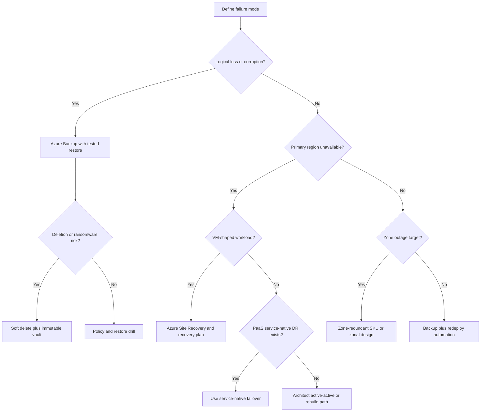

> **Complexity**: [COMPLEX]
>
> **Time to Complete**: 90-120 min
>
> **Prerequisites**: [3.1-entra-id](../module-3.1-entra-id/), [3.3-vms](../module-3.3-vms/), [3.4-blob](../module-3.4-blob/), [3.9-key-vault](../module-3.9-key-vault/)

---

## What You'll Be Able to Do

After completing this module, you will
be able to:

- **Compare** Azure Backup and Azure Site Recovery by recovery contract, RPO, RTO, workload scope, control plane, and failure mode.
- **Design** a vault, policy, retention, immutability, encryption, and network-access model for production Azure backup operations.
- **Diagnose** Site Recovery replication, failover, re-protection, failback, and recovery-plan incidents using the signals operators can actually see.
- **Evaluate** when to use Azure Backup, Site Recovery, Azure SQL failover groups, zone-redundant SKUs, or active-active architecture instead of treating DR as one product decision.
- **Implement** a lab that protects a VM with Azure Backup, enables Azure-to-Azure Site Recovery, runs a test failover, and cleans up safely.

## Why This Module Matters

Hypothetical scenario: a platform team
receives two incident messages in the
same hour. First, an application owner
reports that a release script dropped
the wrong table and the latest healthy
copy of the data was from last night.
Second, a regional service-health
event begins affecting the primary
Azure region that hosts a
revenue-critical VM tier. The first
incident needs a point-in-time restore
of one workload. The second needs a
secondary environment that can be
started in another region. Both
incidents are business-continuity
incidents, but they are not the same
operational contract.

Teams get into trouble when they use
one recovery word for every failure.
Backup is a restore contract: choose a
recovery point, restore one workload
or one dataset, and accept that the
recovery time includes finding the
point, provisioning restore resources,
validating the result, and switching
the application back. Disaster
recovery is an availability contract:
keep enough secondary state ready that
a primary-site outage can be handled
by failover rather than by rebuilding
production from yesterday's copy.
Microsoft describes Azure Backup as a
service for protecting and recovering
data, while Azure Site Recovery
replicates machines to a secondary
location and orchestrates failover and
failback during outages [Azure Backup
overview](https://learn.microsoft.com/en-us/azure/backup/backup-overview),
[Site Recovery
overview](https://learn.microsoft.com/en-us/azure/site-recovery/site-recovery-overview).

This module is written for platform,
SRE, and infrastructure engineers who
own the recovery surface but are not
backup-vendor specialists. You will
learn how the two Azure services fit
together, where they stop, how vaults
and policies shape recovery, how
identity and network controls change
restore operations, how cost grows,
and how to test the design before the
incident. The goal is not to memorize
every portal blade. The goal is to
build the operator mental model that
makes the first decision during a bad
day defensible.

## 1. Backup and Disaster Recovery Are Different Contracts

Backup answers a narrow question: can
I return a protected workload to a
specific recovery point? The workload
might be an Azure VM, an Azure file
share, SQL Server inside an Azure VM,
SAP HANA inside an Azure VM, a managed
disk, a Blob storage account, or a
PostgreSQL database that needs
long-term retention. The RPO is
bounded by how often usable recovery
points are created, and the RTO is
bounded by how long restore,
validation, and cutover take. A daily
VM backup can be excellent for
accidental deletion, but it is not a
promise that production will be online
in a second region within minutes.

Disaster recovery answers a broader
question: can I operate a secondary
environment when the primary
environment is unavailable? For
Azure-to-Azure VM recovery, Site
Recovery continuously replicates VM
disk writes through a cache path,
builds recovery points in a target
region, and creates VMs from those
recovery points during failover
[Azure-to-Azure
architecture](https://learn.microsoft.com/en-us/azure/site-recovery/azure-to-azure-architecture).
The RPO is the replication lag and the
latest recoverable point, while the
RTO is the orchestration time to start
the failed-over workload and reconnect
dependencies.

The difference matters most when the
failure is logical. A ransomware
process that encrypts files, a bad
migration that corrupts records, and a
privileged operator who deletes a
resource are not solved by replicating
the corruption quickly to another
region. DR gives you a second place to
run. Backup gives you a previous point
to inspect and restore. A mature
production design usually needs both
because logical loss and regional loss
are different failure families.

The inverse mistake is also common. A
team may say that immutable backups
cover regional DR because the data is
safe. That may be true for evidence,
compliance, and rebuilds, but users
are still offline until the
application stack is recreated,
networks are connected, DNS or traffic
routing is switched, identities are
validated, secrets are present, and
downstream systems accept the restored
service. A restore-only plan can be
acceptable for a lower-priority
workload, but it is not the same as a
failover plan.

The most dangerous misconception is
"geo-redundant storage means I have a
backup." Geo-redundant storage is a
storage replication choice. It can
protect against some storage-platform
durability failures, and some Azure
Backup vault modes use it to place
backup data in a paired region, but it
does not by itself define backup
policy, retention, restore workflow,
immutability, access control, or
workload-consistent recovery.
Microsoft separates storage
redundancy, backup services, and Site
Recovery for a reason; operators
should keep those layers separate when
they write recovery objectives.

```text
+------------------+-------------------------------+------------------------------+
| Failure pattern  | Backup response               | DR response                  |
+------------------+-------------------------------+------------------------------+
| File deleted     | Restore a prior recovery point | Usually unnecessary          |
| Bad release      | Restore or clone for repair    | Fails over bad state too     |
| Ransomware       | Immutable restore point        | Useful only after clean time |
| Region outage    | Slow rebuild path              | Fail over secondary region   |
| Zone outage      | Maybe no restore needed        | Maybe use zone redundancy    |
+------------------+-------------------------------+------------------------------+
```

Worked example: a VM hosts a small
order-processing worker. The VM has a
daily backup at midnight with seven
days of retention. At 15:00, an
operator deletes a configuration
directory and the service fails. The
backup RPO is roughly the time between
midnight and the delete, and the RTO
includes restore, validation, and
application repair. If the same VM is
protected by Site Recovery with
healthy replication, a regional outage
might be handled by failover, but
failover is not the clean fix for the
deleted directory if the deletion has
already replicated.

> **Pause and predict:** if a team protects every VM with Site Recovery but disables backup to save money, what happens when a corrupt application release runs successfully for an hour before anyone notices? Which recovery point family is missing?

Now you solve it: a production VM uses
GRS managed disks, but no Azure Backup
policy and no Site Recovery
replication. The application owner
asks whether that satisfies "one
off-region copy." Your answer should
separate disk durability, backup
retention, and failover readiness
instead of treating them as one
checkbox.

The operator language should be
precise. Use "backup" when you mean
recovery points, retention, restore,
soft delete, immutability, and restore
validation. Use "DR" when you mean
secondary region, replicated state,
failover runbook, re-protection,
failback, and traffic switch. Use
"availability zone" when you mean
intra-region fault isolation. Use
"active-active" when both regions are
already serving traffic and conflict
handling is part of the application
design.

One simple rule helps during design
reviews: a recovery objective is not
real until the operator can name the
service, the recovery point, the
identity allowed to execute it, the
network path used during restore, the
cost owner, and the test evidence. If
any one of those is missing, the plan
is still an intention rather than an
operational capability.

## 2. Azure Backup Deep Dive

Azure Backup is not one implementation
behind one vault. The control plane is
split between Recovery Services vaults
and Backup vaults, and the right vault
depends on the datasource. Recovery
Services vaults are the long-standing
vault type for Azure VM backup, SQL
Server in Azure VM, SAP HANA in Azure
VM, Azure Files, and on-premises
backup agents. Backup vaults are the
newer Azure Resource Manager model for
newer datasources such as Azure Blob
backup, Azure Disk backup, Azure
Database for PostgreSQL long-term
retention, and other data-protection
workloads [Backup support
matrix](https://learn.microsoft.com/en-us/azure/backup/backup-support-matrix),
[Backup vault
overview](https://learn.microsoft.com/en-us/azure/backup/backup-vault-overview).

This split is the first day-two
operations trap. A Recovery Services
vault and a Backup vault can sit in
the same resource group, have similar
names, and both appear in backup
management views, but they do not
protect the same workload families. If
your ticket says "put the VM into the
Backup vault," the ticket is probably
using the generic noun rather than the
Azure resource type. Azure VM backup
still uses a Recovery Services vault,
while Azure Disk backup uses a Backup
vault. An operator should correct the
language before building automation.

Backup policy is the second trap. A
policy is not only a schedule. It is
the binding between backup frequency,
retention duration, and recovery-point
lifecycle. For a VM, a simple policy
might take one daily recovery point
and retain it for a week. A production
policy often uses a GFS pattern: daily
short-term points for operational
mistakes, weekly points for recent
rollback, monthly points for audit,
and yearly points for long compliance
windows. Those longer tiers are
useful, but they are also where
storage cost grows quietly.

```text
+-------------------------+----------------------------------------------+
| Backup policy concept   | Operator question                            |
+-------------------------+----------------------------------------------+
| Schedule                | How often can the workload lose data?        |
| Daily retention         | How long do fast operational restores need?  |
| Weekly retention        | How long do release rollback windows need?   |
| Monthly retention       | What audit or close-cycle windows exist?     |
| Yearly retention        | What legal retention must survive turnover? |
| Instant restore points  | How many days need fast snapshot restore?    |
+-------------------------+----------------------------------------------+
```

Azure VM backup uses a VM backup
extension or an agentless
crash-consistent path depending on
policy and workload choices. Windows
VMs can coordinate with VSS for
application-consistent snapshots,
while Linux VMs can provide
file-system consistency when the guest
can quiesce appropriately. Microsoft
documents that VM backup creates
snapshots and transfers backup data to
the vault, with consistency behavior
depending on the policy and guest
support [Azure VM backup
overview](https://learn.microsoft.com/en-us/azure/backup/backup-azure-vms-introduction).
The operator consequence is simple: a
VM recovery point is only as useful as
the consistency level and the
application validation behind it.

Azure Files backup uses share
snapshots and can protect file shares
from accidental deletion and
corruption. It is attractive because
it is close to the storage service,
but it has a different restore shape
than a VM or database. Restoring a
share, item, or prior snapshot may be
enough for a file-service mistake,
while an application using the share
may still require coordinated downtime
or application-level validation.
Microsoft documents Azure Files backup
as a managed protection path for Azure
file shares [Azure Files backup
overview](https://learn.microsoft.com/en-us/azure/backup/azure-file-share-backup-overview).

SQL Server in Azure VM backup is not
the same as backing up the VM disk.
Azure Backup offers a stream-based
workload-aware solution for SQL Server
running in Azure VMs, with full,
differential, and log backup support,
database-level restore, and a much
tighter RPO than a once-daily VM
snapshot [SQL Server in Azure VM
backup](https://learn.microsoft.com/en-us/azure/backup/backup-azure-sql-database).
Operators should use the SQL workload
backup when database point-in-time
recovery matters and use VM backup for
the OS and non-database disks. Doing
only one of those may leave either the
application state or the machine state
under-protected.

SAP HANA in Azure VM has the same
principle but a different engine
contract. Azure Backup integrates with
SAP HANA using a Backint-certified
path and supports database-level
backup and restore for HANA workloads
[SAP HANA backup
overview](https://learn.microsoft.com/en-us/azure/backup/sap-hana-database-about).
The operator should not assume that a
VM-level crash-consistent backup is a
sufficient database recovery plan for
an SAP HANA production system. The
database service, application team,
and platform team should agree on both
database-level backup and VM-level
recovery boundaries.

Azure Disk backup is snapshot based
and uses a Backup vault rather than a
Recovery Services vault. It is useful
when a managed disk needs frequent
crash-consistent recovery points, when
an agent is not acceptable, or when
the cost of full VM backup is not
justified for a disk-specific use
case. Microsoft documents Azure Disk
backup as an agentless incremental
snapshot solution where snapshots
remain in the tenant and do not incur
a protected-instance fee for the
Backup vault storage tier [Azure Disk
backup
overview](https://learn.microsoft.com/en-us/azure/backup/disk-backup-overview).
That makes it operationally different
from vaulted VM backup.

Blob backup has two shapes:
operational backup and vaulted backup.
Operational backup is local to the
storage account and uses Blob service
capabilities such as point-in-time
restore, versioning, change feed, and
soft delete. Vaulted backup copies
backup data into a Backup vault
according to a policy and is the
better fit when the source account or
subscription compromise is part of the
threat model [Blob backup
overview](https://learn.microsoft.com/en-us/azure/backup/blob-backup-overview).
Operators should ask whether the
backup must survive loss or compromise
of the source storage account.

Azure Database for PostgreSQL has
native automated backups for
operational PITR and an Azure Backup
long-term retention option for
compliance-oriented logical backups.
Microsoft documents native retention
up to thirty-five days and long-term
retention through Azure Backup for up
to ten years [PostgreSQL backup and
restore](https://learn.microsoft.com/en-us/azure/postgresql/backup-restore/concepts-backup-restore).
The platform choice is not "does
PostgreSQL have backup?" It is whether
the needed recovery is recent
operational PITR, database-level
logical restore, audit retention, or
off-domain isolation.

Soft delete and immutability are the
security boundary that many teams add
too late. Soft delete keeps deleted
backup items or recovery points
recoverable during a configured
retention window, with a default
period of fourteen days and options to
extend the window for stronger
protection [Azure Backup soft
delete](https://learn.microsoft.com/en-us/azure/backup/quick-backup-azure-enable-enhanced-soft-delete).
Immutable vault settings can block
destructive operations against
protected backup data and can be
locked for WORM behavior [Immutable
vault
concept](https://learn.microsoft.com/en-us/azure/backup/backup-azure-immutable-vault-concept).
These controls do not make restore
automatic, but they buy time when
credentials are stolen or an operator
makes a destructive mistake.

Encryption is built into the backup
platform, but the key-management
choice still matters. Azure Backup
encrypts backed-up data at rest and
transfers backup data over HTTPS on
the Azure backbone [Backup
encryption](https://learn.microsoft.com/en-us/azure/backup/backup-encryption).
Recovery Services vaults use
platform-managed keys by default and
can use customer-managed keys when
configured before protection begins.
Backup vaults also support
Microsoft-managed and customer-managed
key options, with the Backup
Management Service app involved in Key
Vault access for the Backup vault
model [Backup vault
overview](https://learn.microsoft.com/en-us/azure/backup/backup-vault-overview).

The key rotation story is subtle.
Rotating a key version is normal when
the vault is configured for
customer-managed keys and the Key
Vault permissions remain correct.
Disabling a key, purging a key, moving
a Key Vault without updating
dependencies, or removing the vault's
access can turn a restore path into an
incident. Operators should document
key ownership and recovery procedures
with the same seriousness as backup
policy because a recovery point that
cannot be decrypted is only a billing
artifact.

Recovery time varies by workload type.
File or disk restores can be fast when
the target is small and the restore
path stays in the same region. Full VM
restore takes longer because disks and
VM resources must be created,
extensions must initialize, and the
application must be checked. SQL and
SAP HANA database restores depend on
full, differential, and log chains as
well as target server capacity.
Cross-region restore adds regional
placement and data path
considerations. A serious RTO
statement should be based on measured
drills, not service names.

Worked example: an internal Git
service runs on an Azure VM with a
separate data disk. The team wants
quick rollback after package upgrades,
daily operational recovery for
accidental deletion, and a monthly
restore point for audit. A good design
might use VM backup in a Recovery
Services vault for the full machine,
keep daily points for two weeks,
weekly points for two months, and
monthly points for a year, then run a
quarterly restore drill into an
isolated subnet. If the repository
data disk needs more frequent
crash-consistent points before
upgrades, Azure Disk backup can
complement the VM backup, but it
should not replace the full VM
recovery plan.

> **Pause and predict:** if a VM has a daily VM backup and a SQL Server database inside the guest has a fifteen-minute log backup policy, which recovery path do you choose after one table is corrupted by a migration? What evidence would you collect before restoring?

Now you solve it: a file-share
workload has a one-day RPO requirement
for accidental deletion, but the
compliance team also asks for
off-domain retention that survives
storage-account compromise. Decide
whether local share snapshots are
enough, whether vaulted backup is
required, and how soft delete plus
immutability change the operational
risk.

## 3. Azure Site Recovery Deep Dive

Azure Site Recovery is a replication
and orchestration service for disaster
recovery, not a general-purpose backup
system. The common modern scenario is
Azure-to-Azure replication, where VMs
in one Azure region replicate to
another region. Site Recovery also
supports on-premises VMware, Hyper-V,
physical servers, Azure Stack, and
some site-to-site patterns, but the
operator path for Azure platform
engineers usually starts with Azure VM
disaster recovery [Site Recovery
overview](https://learn.microsoft.com/en-us/azure/site-recovery/site-recovery-overview).

Azure-to-Azure replication has a
concrete data path. The protected VM
runs a Mobility Service extension.
Disk writes are captured and sent
through a cache storage account in the
source region. Data is processed into
replica managed disks and recovery
points in the target region. During
failover, Site Recovery uses a
selected recovery point to create a VM
in the target region. Microsoft
documents this flow in the Azure VM
disaster recovery tutorial and
architecture pages [VM disaster
recovery
tutorial](https://learn.microsoft.com/en-us/azure/virtual-machines/windows/tutorial-disaster-recovery),
[Azure-to-Azure
architecture](https://learn.microsoft.com/en-us/azure/site-recovery/azure-to-azure-architecture).

```text
+-------------------+        +---------------------+        +-------------------+
| Primary region    |        | Source cache path   |        | Secondary region  |
| Azure VM disks    +------->+ Storage account     +------->+ Replica disks     |
| Mobility Service  |        | Replication logs    |        | Recovery points   |
+-------------------+        +---------------------+        +---------+---------+
                                                                  |
                                                                  v
                                                        +-------------------+
                                                        | Failed-over VM    |
                                                        | Test or real run  |
                                                        +-------------------+
```

The RPO signal for ASR is not the same
as "last backup time." Replication is
continuous, recovery points are
created from replicated data, and the
operator watches replication health,
failover readiness, and lag. Site
Recovery monitoring examples use
fields such as `rpoInSeconds_d` in Log
Analytics queries, and those values
are the practical "are we within SLA
right now?" signal for replicated
items [Site Recovery
monitoring](https://learn.microsoft.com/en-us/azure/site-recovery/monitor-log-analytics).
If the lag is already outside the
business RPO, a failover may still
work, but it may not meet the promise.

Recovery plans are the orchestration
layer above single-VM failover. A
recovery plan groups machines, orders
startup, and can include manual
actions and automation runbooks.
Microsoft documents recovery plans as
a way to define systematic recovery
for multi-tier applications, with
groups, sequencing, scripts, and
manual tasks [Recovery plan
overview](https://learn.microsoft.com/en-us/azure/site-recovery/recovery-plan-overview).
Operators should use recovery plans
when a service is more than one VM
because order matters: domain
dependencies, database tiers, message
brokers, app servers, and web tiers
rarely recover safely in a random
sequence.

Failover has three operator-visible
modes. Test failover creates an
isolated recovery drill without
affecting production replication.
Planned failover is used for a
controlled event when the source is
healthy enough to shut down gracefully
and minimize data loss. Unplanned
failover is the emergency path when
the primary environment is already
unavailable or unsafe. Microsoft
documents failover behavior and the
difference between test, planned, and
unplanned operations in Site Recovery
failover guidance [Site Recovery
failover](https://learn.microsoft.com/en-us/azure/site-recovery/site-recovery-failover).

Test failover is the mode that
separates real DR from slideware. A
test that only proves "the VM booted"
is incomplete. A passing test should
show that target networking works,
security groups and routes are
correct, DNS or traffic management can
point to the secondary path,
application dependencies connect,
identity and secrets are usable,
monitoring recognizes the new
location, and the test resources are
cleaned up. A quarterly test is a
reasonable minimum for ordinary
production workloads, while
mission-critical systems often justify
monthly testing.

Re-protection is the step many
runbooks forget. After failover, the
workload is running in the secondary
region and is no longer protected in
the original direction. Re-protection
starts replication back toward the
original primary or toward another
target so that the new production
location is protected. Microsoft
documents the Azure-to-Azure
re-protection flow after failover
[Reprotect Azure
VMs](https://learn.microsoft.com/en-us/azure/site-recovery/azure-to-azure-how-to-reprotect).
Until that step completes, the team
has restored service but may be
exposed to another fault.

Failback is not a magic undo button.
After the primary region or original
environment is healthy, the operator
must decide whether to fail back,
remain in the secondary region, or
rebuild a new primary. Failback
requires capacity, network readiness,
data synchronization, application
validation, and a business-approved
cutover window. The most disciplined
teams treat failback as a second
planned migration rather than an
automatic clean-up step.

ASR also has clear boundaries. It is
not the right orchestrator for Azure
SQL Database failover groups because
Azure SQL has managed database-level
HA and DR features that preserve
database semantics and listener
behavior. It is not the DR mechanism
for App Service, where deployment
slots, regional deployments, Front
Door, and application-level
architecture matter. It is not the
recovery system for Azure Functions,
where deployment automation, storage
dependencies, slots, and regional
patterns matter. ASR protects
machines; PaaS services usually need
service-native availability and
recovery patterns.

That boundary does not make ASR less
important. Many production estates
still run stateful or packaged
workloads on VMs because of vendor
support, licensing, agents,
appliances, migration timelines, or
operating-system dependencies. For
those VM-shaped workloads, ASR
provides a managed replication and
failover control plane that would
otherwise require custom scripts,
storage replication plumbing, target
resource creation, and manual
dependency tracking.

Worked example: a three-tier internal
application has a VM-based database
appliance, two application VMs, and a
web VM behind an internal load
balancer. The recovery plan should
start the database appliance first,
pause for a health check, start the
application VMs, run a script that
validates service ports, then start
the web tier and update the target
load balancer backend. A test failover
should use an isolated VNet so it
cannot accidentally receive production
traffic, but it still needs enough
DNS, identity, and Key Vault
connectivity to prove the service can
run.

Now you solve it: a team protects the
four VMs above with ASR but has no
recovery plan. During a test failover,
all VMs boot, but the application
fails because the web tier starts
before the database appliance accepts
connections. Decide what belongs in
the recovery plan, what belongs in
application health checks, and what
should remain as a manual action for
the incident commander.

## 4. Identity, Networking, Security, and Compliance

Recovery tooling is security tooling.
The identities that can configure
backup, delete recovery points,
disable replication, trigger restore,
run test failover, or execute
unplanned failover can change the
blast radius of both accidents and
attacks. Azure provides built-in roles
such as Backup Contributor, Backup
Operator, and Site Recovery
Contributor, and the built-in role
documentation explains the permission
boundaries for management and
governance roles [Azure built-in
roles](https://learn.microsoft.com/en-us/azure/role-based-access-control/built-in-roles/management-and-governance).
The operator should assign the least
role that lets a person perform the
recovery task, not broad Contributor
rights by habit.

Backup roles are also operationally
distinct. A person who can monitor
jobs does not necessarily need
permission to delete backup data. A
person who can trigger an on-demand
backup before a risky change may not
need permission to change
immutability. A person who can run a
restore drill into a lab subscription
may not need permission to restore
over production. Azure Backup's RBAC
guidance exists because recovery-point
management is sensitive enough to
deserve separate roles and approval
paths [Backup
RBAC](https://learn.microsoft.com/en-us/azure/backup/backup-rbac-rs-vault).

Managed identities appear in several
places. Backup vaults use managed
identity to access datasources such as
disks or PostgreSQL resources and to
receive workload-level permissions.
Recovery Services vaults can use
managed identity for private endpoint
and customer-managed key patterns.
Operators need to document which
identity is used by which vault and
which Key Vault or resource
permissions it holds. Treat the
identity as part of the recovery
system, not as a portal implementation
detail.

Private endpoints change backup and
restore behavior. Azure Backup private
endpoints are supported for Recovery
Services vaults, but Microsoft calls
out important constraints: create
private endpoints before protecting
items in the vault, keep managed
identity enabled, configure DNS
correctly, and remember that the
private endpoint for Backup is not
used for Site Recovery [Azure Backup
private
endpoints](https://learn.microsoft.com/en-us/azure/backup/private-endpoints).
Network isolation is valuable, but a
misconfigured private endpoint can
make restore fail during the exact
moment you need it.

For ASR, network design is more than
opening a portal blade. The target
region needs VNets, subnets, NSGs,
routes, load balancers, private DNS,
identity endpoints, Key Vault access,
monitoring egress, and application
dependency paths. Replication itself
has service dependencies, but failover
success depends on the target runtime
network. A DR drill should therefore
validate routes and name resolution,
not only replication health.

Customer-managed keys introduce a
compliance and sovereignty control,
but they also introduce an operational
dependency. For Recovery Services
vault CMK, Microsoft requires the key
to be configured before protecting
items, and once enabled it cannot
simply be reversed for that vault
[Recovery Services vault
configuration](https://learn.microsoft.com/en-us/azure/backup/backup-create-recovery-services-vault).
For Backup vaults, CMK is also a
supported encryption option in the
Backup vault model [Backup vault
overview](https://learn.microsoft.com/en-us/azure/backup/backup-vault-overview).
Key rotation should be tested with
restore, because policy compliance is
not enough if the recovery process
cannot unwrap backup data.

The IDE pattern is a useful review
tool: Identity, Data, Encryption.
Identity asks who can administer the
vault, who can restore, and which
managed identities can reach source
resources or keys. Data asks where
recovery points live, which redundancy
mode is selected, whether cross-region
restore is enabled, and whether source
compromise can affect backup copies.
Encryption asks which key protects the
backup data, who can disable or purge
that key, and how key rotation is
validated. A vault design that passes
IDE review is usually easier to defend
in audit and incident response.

Immutability creates a real compliance
tension. WORM retention and locked
immutable vaults are designed to
prevent deletion, including deletion
by compromised or mistaken
administrators. Privacy and records
programs may also require deletion of
personal data under lawful processes.
Operators do not resolve that conflict
by secretly disabling immutability.
They resolve it by classifying data
before policy assignment, choosing
retention windows with legal approval,
documenting exception workflows, and
making sure application teams
understand that immutable backup
copies can outlive source deletion
requests for a defined retention
period.

Audit is part of recoverability. Every
restore, stop-protection action,
replication-disable action, failover,
test failover, role assignment, key
permission change, and vault
networking change should be visible in
Azure Activity logs, diagnostic logs,
or service job history. If the first
question after an emergency restore is
"who did this?", the audit path should
already exist. Backup Center, Azure
Monitor, Activity Log, and Log
Analytics give the operator the
evidence chain when diagnostic
settings are enabled [Backup Center
overview](https://learn.microsoft.com/en-us/azure/backup/backup-center-overview).

Worked example: a security team asks
for customer-managed keys on all
backup vaults, but the platform team
already protected production VMs in
Recovery Services vaults that use
platform-managed keys. The correct
response is not to promise an instant
in-place switch. The operator should
check which vaults support CMK for the
workload, whether CMK must be
configured before protection, what
migration or reprotection path exists,
which recovery points would remain
under the old vault model, and what
restore tests prove after the change.

Now you solve it: a vault uses private
endpoints and denies public access. A
restore of SQL in Azure VM fails from
a locked-down subnet during a drill.
List the checks you run before
changing the policy: private DNS
records, managed identity state, Key
Vault reachability, Azure Storage
endpoints, Microsoft Entra ID access,
and whether the workload type supports
the blocked network path.

## 5. Cost Lens for Backup and DR

Recovery is an engineering control
with a recurring bill. Azure Backup
usually charges along two dimensions:
protected-instance-month and backup
storage GB-month. The
protected-instance line depends on
workload type and size, while storage
depends on how much recovery-point
data is retained and which redundancy
option is selected. Microsoft Learn's
Azure Backup pricing guidance points
operators to workload size, churn,
retention, instant restore snapshot
duration, and storage redundancy as
the major estimation variables [Azure
Backup
pricing](https://learn.microsoft.com/en-us/azure/backup/azure-backup-pricing).

Site Recovery has a different shape.
ASR charges per protected instance
after the free initial period, and
failover adds the cost of compute,
disks, networking, and any supporting
services in the target region.
Microsoft documents Site Recovery
charges for managed disks and the
protected-instance license as a core
charge [Site Recovery
cost](https://learn.microsoft.com/en-us/azure/site-recovery/site-recovery-cost).
The operator should expect ASR to be
materially more expensive than simple
backup for the same VM because it is
buying a lower RPO, faster regional
recovery, and orchestration.

Pricing data changes by region,
agreement, currency, and date, so
production estimates should be pulled
from the Azure pricing calculator,
your enterprise price sheet, or the
Azure Retail Prices API. Microsoft
documents the Retail Prices API as a
way to query prices by service,
region, SKU, and meter [Azure Retail
Prices
API](https://learn.microsoft.com/en-us/rest/api/cost-management/retail-prices/azure-retail-prices).
The numbers below are a worked example
for East US public pricing at write
time, not a contract. The method
matters more than the exact cents.

Worked example: assume fifty
production VMs, each with 200 GiB of
protected data, daily backup,
thirty-day retention, three percent
daily churn, and GRS backup storage.
The simplified storage model is one
initial 200 GiB recovery point plus
twenty-nine daily deltas of 6 GiB, or
374 GiB per VM. Across fifty VMs, that
is 18,700 GiB of retained backup data.
Using an Azure VM protected-instance
meter of $10.00 per VM-month and a
Standard GRS backup storage meter of
$0.0448 per GiB-month, the backup
estimate is $500.00 for protected
instances plus $837.76 for storage, or
$1,337.76 per month before restore
traffic, transactions, discounts,
taxes, and policy differences.

Now add ASR for only the five
mission-critical VMs. Using the
Azure-to-Azure Site Recovery meter of
$25.00 per protected instance-month,
the ASR service line is $125.00 per
month after the free initial period.
If each VM has one 256 GiB Standard
SSD E15 replica disk in the target
region at $19.20 per disk-month,
replica disk capacity adds $96.00 per
month. A two-hour quarterly test
failover using B1s Linux VMs at
$0.0104 per VM-hour is roughly $0.11
for compute in that drill window,
although real mission-critical VM
sizes would cost more. The
steady-state ASR estimate for this
simplified line is $221.00 per month
before cache storage transactions,
network, monitoring, target load
balancers, and failover-time compute.

| Cost line | Assumption | Monthly estimate |
|---|---|---:|
| Backup protected instances | 50 Azure VMs x $10.00 | $500.00 |
| Backup GRS storage | 18,700 GiB x $0.0448 | $837.76 |
| Backup subtotal | Daily, thirty-day, simplified churn | $1,337.76 |
| ASR protected instances | 5 VMs x $25.00 | $125.00 |
| ASR replica disks | 5 E15 LRS disks x $19.20 | $96.00 |
| ASR drill compute | 5 B1s VMs x two hours | $0.11 |
| ASR subtotal | Service plus simple replica storage | $221.11 |

The example teaches three cost
lessons. First, backup storage is
dominated by retention and churn, not
by the number of policies in the
portal. Second, ASR is expensive
enough that many teams protect only
business-critical VM tiers rather than
every VM. Third, the cheapest DR plan
may be a service-native architecture
that removes the need for VM-level
replication entirely, but only when
the application and data services
actually support that model.

Cost spikes usually come from policy
drift. A team adds yearly retention
for audit and forgets that every
retained delta has a storage cost. A
vault uses GRS by default even for
development workloads that could use
LRS. ASR is enabled for every VM in a
resource group, including stateless
build workers and cache nodes that
could be redeployed. Test failover
resources are left running in the
target region. Diagnostic logs are
exported without retention rules. None
of these mistakes looks dramatic on
day one, but all of them show up in
the monthly bill.

Cost reduction should not start by
deleting recovery controls. Start by
classifying workloads. Put stateless
tiers behind rebuild automation and
short backup retention. Give stateful
VM workloads backup and maybe ASR if
the business RTO requires it. Use SQL
failover groups or managed database
features where the PaaS service owns
the failover semantics. Use LRS for
non-production backups when off-region
recovery is not required. Use GRS,
cross-region restore, immutable
vaults, and ASR only where the
recovery objective justifies them.

One cloud version of the three-two-one
backup rule is useful: keep three
copies, use two protection mechanisms
or storage domains, and keep one copy
off-region. Azure Backup with
cross-region restore and immutable
vault settings can satisfy the spirit
for many VM workloads, but only when
the backup is actually off-region and
protected against deletion. A local
snapshot, a GRS disk, and a mutable
vault controlled by the same broad
admin group do not provide the same
risk reduction.

## 6. Observability and Day-Two Operations

A recovery platform without monitoring
is a story, not a system. Operators
need to know whether the last backup
succeeded, whether recovery points are
growing as expected, whether protected
items are drifting out of policy,
whether ASR replicated items are
within RPO, whether a vault is
accessible, and whether anyone changed
recovery controls. Backup Center
provides a unified management
experience for backup and Site
Recovery estates across vaults,
subscriptions, regions, and supported
workload types [Backup Center
overview](https://learn.microsoft.com/en-us/azure/backup/backup-center-overview).

Backup Center has evolved toward Azure
Business Continuity Center, but the
operator pattern remains the same: use
an estate view rather than clicking
through each vault during an incident.
The source of truth should let you
answer "which production workloads are
unprotected?", "which backup jobs
failed last night?", "which restores
happened recently?", "which vaults
have soft-deleted items?", and "which
replicated items are unhealthy?" If
those queries require tribal memory,
the platform is not ready.

Azure Monitor metrics for Recovery
Services vaults and Backup vaults
include health-event metrics such as
`BackupHealthEvent` and
`RestoreHealthEvent` [Recovery
Services vault
metrics](https://learn.microsoft.com/en-us/azure/azure-monitor/reference/supported-metrics/microsoft-recoveryservices-vaults-metrics),
[Backup vault
metrics](https://learn.microsoft.com/en-us/azure/azure-monitor/reference/supported-metrics/microsoft-dataprotection-backupvaults-metrics).
Storage allocation and job history are
often examined through Backup reports,
Log Analytics tables, vault jobs, and
cost data rather than one universal
metric name. Operators should build
dashboards around the signals they can
alert on and the questions incident
responders ask.

For ASR, the key day-two signal is RPO
and replication health. The Site
Recovery monitoring guidance includes
KQL examples that filter A2A
replicated items and use
`rpoInSeconds_d` to alert when one VM
or a fleet exceeds an RPO threshold
[Site Recovery
monitoring](https://learn.microsoft.com/en-us/azure/site-recovery/monitor-log-analytics).
That is the signal that tells you
whether the secondary environment is
currently close enough to the primary.
A healthy-looking vault with stale
recovery points is not healthy for DR.

Alert rules should be tied to operator
action. Backup job failure should
create a ticket or page when the
workload is production and the next
scheduled run would violate RPO. RPO
breach should page the team that owns
DR because the workload is no longer
meeting its recovery promise. Vault
inaccessibility should trigger a
security and network investigation
because restore may fail even if jobs
were previously healthy. A restore
event in production should notify the
service owner and security team
because it can indicate either an
incident response action or
unauthorized data access.

Activity log queries answer the
uncomfortable questions. Who disabled
soft delete? Who changed a backup
policy? Who triggered an unplanned
restore last night? Who ran a test
failover and left resources behind?
Who changed role assignments on the
vault? A recovery design should
include diagnostic settings and
retention for those events before the
first audit request. Without that
history, the team may restore service
but still fail the incident review.

```kusto
AzureActivity
| where TimeGenerated > ago(7d)
| where ResourceProviderValue has "Microsoft.RecoveryServices"
   or ResourceProviderValue has "Microsoft.DataProtection"
| where OperationNameValue has_any (
    "restore",
    "delete",
    "write",
    "failover",
    "backup"
)
| project TimeGenerated, Caller, OperationNameValue, ActivityStatusValue, ResourceGroup, Resource
| order by TimeGenerated desc
```

```kusto
AzureDiagnostics
| where TimeGenerated > ago(2h)
| where replicationProviderName_s == "A2A"
| where isnotempty(name_s)
| summarize arg_max(TimeGenerated, *) by name_s
| project name_s, replicationHealth_s, failoverHealth_s, rpoInSeconds_d
| order by rpoInSeconds_d desc
```

```kusto
AzureDiagnostics
| where TimeGenerated > ago(24h)
| where Category has "AzureBackup"
| summarize FailedJobs=countif(JobStatus_s =~ "Failed"),
            CompletedJobs=countif(JobStatus_s =~ "Completed")
            by bin(TimeGenerated, 1h), Resource
| order by TimeGenerated desc
```

Run test failover on a schedule.
Quarterly is a reasonable floor for
production VM workloads, and monthly
is appropriate when the business RTO
is measured in minutes or the
dependency graph changes frequently. A
passing test should prove boot,
application health, target network,
identity, secret access, monitoring,
traffic switch procedure, and cleanup.
A failed test is not wasted time. It
is an incident discovered under
controlled conditions.

Day-two operations should also include
restore sampling. Pick a small set of
workloads each month, restore them
into isolated targets, and verify
application-level data. Rotate through
VM restore, file restore, database
restore, cross-region restore, and ASR
test failover. The test evidence
should record the selected recovery
point, elapsed restore time,
validation steps, operator identity,
blockers, cleanup status, and any cost
anomalies. That evidence is what turns
backup policy into trust.

## Patterns & Anti-Patterns

The patterns below are the practices
that repeatedly survive real
operations. They are not
vendor-neutral abstractions; they are
Azure-specific ways to keep the
recovery surface understandable,
testable, and affordable.

| Pattern | When to Use | Why It Works | Scaling Consideration |
|---|---|---|---|
| Pair backup and DR by workload tier | Any stateful production workload with both logical-loss and regional-outage risk | Backup handles clean recovery points; DR handles secondary runtime | Keep tier labels in tags so policies can be audited |
| Use service-native DR for PaaS | Azure SQL Database, Cosmos DB, App Service, Functions, and similar services | The platform service owns application-aware failover semantics | Document the service-native test procedure next to ASR runbooks |
| Use immutable vault settings for critical backup copies | Ransomware, privileged insider, or regulated retention threat model | Destructive operations are blocked or delayed | Classify data first because locked retention affects deletion workflows |
| Build recovery plans for multi-VM apps | VM applications with ordered dependencies | Startup sequence, scripts, and manual actions become explicit | Keep recovery plans small enough that tests are understandable |
| Test in isolated target networks | DR drills and restore validation | Production traffic and test recovery cannot collide | Maintain DNS and identity dependencies for the isolated network |
| Put cost ownership on policies | Backup and DR estates with many teams | Retention and ASR scope become financial decisions | Tag vaults, protected items, and recovery tiers consistently |

Anti-patterns are usually
understandable shortcuts. They become
dangerous when the shortcut is not
named and reviewed.

| Anti-pattern | What Goes Wrong | Better Alternative |
|---|---|---|
| "GRS means backup" | Storage replication has no restore policy, retention, or immutability contract | Use Azure Backup with explicit policy and restore tests |
| "ASR everything" | Monthly cost spikes and stateless tiers get unnecessary replication | Classify workloads and protect only tiers that need VM failover |
| "Backup only for regional DR" | Restore time becomes rebuild time during a region outage | Use ASR or service-native multi-region design when RTO is minutes |
| "Portal-only recovery knowledge" | Incident response depends on whoever remembers the clicks | Maintain runbooks, recovery plans, and tested automation |
| "No cleanup after drills" | Test VMs, disks, NICs, and public IPs keep billing | Add cleanup verification to every test failover checklist |
| "Mutable backups for ransomware" | A compromised admin can delete the recovery path | Enable soft delete, immutability, role separation, and MUA where required |
| "No restore validation" | Green backup jobs hide unusable recovery points | Restore samples and validate application-level data regularly |

## Decision Framework

Start with the failure you are
designing for, not the service name.
If the expected incident is accidental
deletion, bad migration, corruption,
or ransomware discovered after the
fact, begin with Azure Backup and
immutability. If the expected incident
is primary-region loss and the
workload is VM-shaped, evaluate Site
Recovery. If the workload is a managed
PaaS service with its own replication
and failover feature, use the
service-native design before reaching
for ASR. If the risk is only a zone
failure inside one region, a
zone-redundant SKU may meet the
objective without cross-region DR.



| Requirement | Usually Enough | Escalate When | Avoid |
|---|---|---|---|
| Restore one VM to yesterday | Azure Backup VM policy | RTO must be minutes or region may be gone | ASR as the only logical-loss control |
| Restore one SQL database in a VM | SQL workload backup | Whole app must move regions | VM snapshot as only database recovery |
| Survive Azure SQL regional outage | Azure SQL failover group | App cannot tolerate listener or data constraints | ASR for Azure SQL Database |
| Survive App Service regional outage | Regional deployment plus Front Door | Stateful dependencies are single-region | VM-level thinking for PaaS |
| Survive zone outage | Zone-redundant SKU or zonal spread | Regional outage is in scope | Cross-region DR for every minor risk |
| Survive source compromise | Immutable vaulted backup | Runtime must also continue elsewhere | Local snapshots only |
| Active-active global app | Service-native multi-region design | Conflict handling or data consistency is weak | ASR as a substitute for application architecture |

When Azure Backup is enough, the
workload can tolerate data loss equal
to the backup frequency and downtime
measured in restore hours. This is
common for development systems,
internal tools, stateless workers with
small state, and production workloads
whose business owner accepts a rebuild
window. The key is explicit
acceptance. "We can restore in hours"
is a valid requirement when the
business says so and drills prove it.

When ASR is required, the workload
needs a secondary runtime with RPO
measured in seconds or minutes and RTO
measured in minutes. This does not
mean every VM needs ASR. It means the
specific VM tier is hard to rebuild,
stateful enough to need replication,
and important enough to justify the
service line plus target-region
storage and drill costs. ASR should be
tied to a recovery plan and test
schedule, not just enabled because the
portal offered it.

When zone-redundant SKUs replace ASR,
the failure target is a zone inside
the same Azure region and the service
supports zone resilience.
Zone-redundant App Gateway,
zone-redundant managed disks where
available, zone-redundant storage, and
zone-aware compute placement can
remove the need for cross-region
failover for a zonal fault. They do
not solve total regional loss, and
they do not protect against logical
corruption.

When Azure SQL Database failover
groups beat both, the database is a
managed Azure SQL Database or Managed
Instance workload that should use
database-native replication,
listeners, and failover policy. ASR is
for machines, not for Azure SQL
Database. Backup remains relevant for
PITR and long-term retention, but the
regional availability mechanism
belongs to Azure SQL. This module
references that decision only at a
high level because the Azure SQL
operator path is covered in module
3.16.

When active-active replaces ASR, the
application is already built to run in
more than one region at the same time.
Cosmos DB multi-region writes, Front
Door, Traffic Manager, stateless
services deployed through CI/CD, and
application-level conflict handling
can make VM failover unnecessary. This
is usually better for user-facing
global systems, but it is also harder
to design because the application must
own consistency, routing, deployment,
and data semantics.

## Did You Know?

- Azure Backup soft delete defaults to fourteen days and can be configured up to 180 days for stronger recovery from accidental or malicious deletion.
- A Site Recovery recovery plan can include up to 100 protected instances, which is why large estates usually split plans by application rather than by subscription.
- Azure-to-Azure Site Recovery protected instances are free for the first 31 days, but storage, transactions, and failover resources can still incur charges.
- Azure Database for PostgreSQL long-term retention through Azure Backup can retain backups for up to ten years, which is a compliance feature rather than a normal operational rollback window.

## Common Mistakes

| Mistake | Why It Happens | How to Fix It |
|---|---|---|
| Treating geo-redundant storage as backup | Teams confuse durability replication with recovery policy | Create backup policies, test restore, and enable immutability where required |
| Using ASR for logical corruption | Replication feels safer because it is continuous | Keep clean backup recovery points and know when corruption started |
| Protecting every VM with ASR | The portal makes bulk enablement easy | Classify workload tiers and protect only VM tiers with DR RTO requirements |
| Forgetting re-protection after failover | The incident feels done when the app is online | Add re-protection and failback decisions to the recovery checklist |
| Creating private endpoints after vault use | Network isolation is added after backups already exist | Design vault networking before protecting workloads |
| Leaving test failover resources running | Cleanup is treated as a manual afterthought | Make cleanup a success criterion and audit target-region resources |
| Rotating CMK without a restore test | Key rotation is handled as compliance paperwork | Test restore after key rotation and monitor Key Vault access failures |

## Quiz

<details><summary>Your team has Azure Backup on a VM with daily recovery points and ASR replication to a paired region. A bad deployment corrupts files, and the issue is detected after replication is healthy. What is the safest recovery direction?</summary>

Start with backup, not ASR. ASR has
likely replicated the corrupted state
to the secondary region, so failover
may only move the bad state. Identify
the last clean recovery point, restore
into an isolated target, validate the
application, and then decide whether
to repair production or cut over to
the restored copy.

</details>

<details><summary>A regional outage affects the primary region for a VM-based payment worker. The VM has immutable backups with GRS storage but no ASR. What should the incident commander expect?</summary>

The backup data may be safe, but the
team does not have an orchestrated
secondary runtime. Recovery will look
like a rebuild or restore into another
region, including networking,
identity, secrets, monitoring, and
traffic routing. That can be
acceptable only if the agreed RTO is
measured in hours rather than minutes.

</details>

<details><summary>A security review finds that Backup Operators can delete recovery points and change policy on a critical vault. What design issue is this?</summary>

This is a separation-of-duties
problem. Recovery controls are
powerful enough to be part of the
security boundary. The team should
review built-in roles, restrict
destructive operations, use approval
for sensitive changes, enable soft
delete and immutability, and ensure
audit logs capture role and vault
changes.

</details>

<details><summary>A test failover boots the recovered VM, but the application cannot read secrets from Key Vault. The source VM worked before the drill. Where do you investigate first?</summary>

Investigate target-region identity and
network dependencies, not the VM boot
path. Check managed identity
permissions, Key Vault firewall or
private endpoint rules, DNS
resolution, route tables, and whether
the test network is intentionally
isolated from shared services. A VM
that boots without secrets is not a
passing DR test.

</details>

<details><summary>A product owner asks to lower cost by switching all backup vaults from GRS to LRS. Which question determines whether this is acceptable?</summary>

Ask whether off-region restore is part
of the recovery objective for each
workload tier. LRS may be reasonable
for development or rebuildable
workloads, but it weakens protection
against regional storage loss and may
remove cross-region restore options.
The decision should be made per
workload classification, not as a
subscription-wide savings toggle.

</details>

<details><summary>An Azure SQL Database workload has a regional RTO requirement. A teammate proposes ASR because every other critical workload uses it. How do you respond?</summary>

Use the service-native Azure SQL DR
feature first, such as failover
groups, because Azure SQL Database is
not a VM that ASR should orchestrate.
ASR protects machines and disks, while
Azure SQL failover mechanisms preserve
database-specific replication and
listener behavior. Backup still
matters for PITR and long-term
retention, but it is not the regional
failover tool.

</details>

<details><summary>A quarterly restore test succeeds, but nobody records the recovery point, operator, elapsed time, or validation result. Did the test pass operationally?</summary>

Not fully. The workload may have
restored, but the platform lacks
evidence for audit, trend analysis,
and incident readiness. A passing
recovery test should include the
selected recovery point, elapsed
restore time, validation checks,
cleanup status, operator identity,
blockers, and any follow-up work.

</details>

## Hands-On Exercise

Exercise scenario: you will create a
small Azure VM, protect it with Azure
Backup in a Recovery Services vault,
create a Backup vault to see the newer
vault model, enable Azure-to-Azure
Site Recovery for the same VM, run an
isolated test failover, and clean up
in the order that production operators
need to understand. Use a
non-production subscription and a
region pair where your subscription
has quota. The exact portal screens
change over time, so the success
criteria matter more than memorizing
blade names.

Before you start, install the Azure
CLI on your workstation, sign in, and
select the right subscription. The ASR
portion is easiest through the Azure
portal because it creates and
validates several target resources.
The CLI snippets below create the base
resources and provide cleanup checks;
use portal steps for backup policy and
ASR enablement where noted.

```bash
az login
az account show --query "{name:name, id:id, tenant:tenantId}" -o table
```

### Step 1: Create the resource group and both vault types

Create one lab resource group in the
primary region. Create a Recovery
Services vault for VM backup and Site
Recovery. Create a Backup vault as the
contrast point for newer backup
workloads such as disks, blobs, and
PostgreSQL long-term retention. If the
`dataprotection` extension is missing,
install it before creating the Backup
vault.

```bash
RG="rg-bcdr-operator-lab"
PRIMARY="eastus"
SECONDARY="westus"
RSV="rsv-bcdr-operator-lab"
BACKUP_VAULT="bv-bcdr-operator-lab"

az group create \
  --name "$RG" \
  --location "$PRIMARY"

az backup vault create \
  --resource-group "$RG" \
  --name "$RSV" \
  --location "$PRIMARY"

az extension add --name dataprotection --upgrade

az dataprotection backup-vault create \
  --resource-group "$RG" \
  --vault-name "$BACKUP_VAULT" \
  --location "$PRIMARY" \
  --type SystemAssigned \
  --storage-settings datastore-type=VaultStore type=GeoRedundant
```

- [ ] Resource group exists in the primary region.
- [ ] Recovery Services vault exists and is visible under Recovery Services vaults.
- [ ] Backup vault exists and is visible under Backup vaults or Resiliency.
- [ ] You can explain which vault protects Azure VMs in this exercise.

<details><summary>Solution notes for Step 1</summary>

If the Backup vault command fails,
check that the `dataprotection` CLI
extension installed successfully and
that the provider is registered. If
the Recovery Services vault command
succeeds but Backup vault creation
fails, do not switch the VM backup to
the Backup vault. That failure
demonstrates the distinction between
the two vault models rather than a
reason to blur them.

</details>

### Step 2: Create a small test VM

Create a small Ubuntu VM in the
primary region. Keep it inexpensive,
but use a supported image and a public
IP only if your lab policy allows it.
In stricter environments, place the VM
on a private subnet and connect
through a bastion or existing jump
path.

```bash
VM="vm-bcdr-operator"
ADMIN_USER="azureuser"

az vm create \
  --resource-group "$RG" \
  --name "$VM" \
  --location "$PRIMARY" \
  --image Ubuntu2204 \
  --size Standard_B1s \
  --admin-username "$ADMIN_USER" \
  --generate-ssh-keys \
  --public-ip-sku Standard
```

- [ ] VM exists and shows a running power state.
- [ ] OS disk and NIC were created in the lab resource group.
- [ ] You can identify the VM's primary region and resource ID.
- [ ] You know whether the VM is publicly reachable or private-only.

<details><summary>Solution notes for Step 2</summary>

If your subscription lacks quota for
`Standard_B1s`, choose the smallest
allowed general-purpose size in your
region. If policy blocks public IPs,
create the VM in an approved VNet and
use your normal private access path.
The DR lesson does not depend on
inbound internet access.

</details>

### Step 3: Enable Azure Backup with a daily policy and trigger a backup

In the Azure portal, open the Recovery
Services vault, choose Backup, select
Azure VM as the datasource, and create
a daily policy with seven-day
retention for this lab VM. Enable
backup for `vm-bcdr-operator`, then
trigger an on-demand backup. Use the
Backup jobs view to watch the job and
the Backup items view to confirm a
recovery point appears.

```bash
az backup item list \
  --resource-group "$RG" \
  --vault-name "$RSV" \
  --backup-management-type AzureIaasVM \
  --workload-type VM \
  -o table

az backup job list \
  --resource-group "$RG" \
  --vault-name "$RSV" \
  --operation Backup \
  -o table
```

- [ ] Daily VM backup policy exists with seven-day retention.
- [ ] VM is protected by the Recovery Services vault.
- [ ] On-demand backup job completed successfully.
- [ ] At least one recovery point is visible for the VM.
- [ ] You can state the lab RPO and why it is not the same as ASR RPO.

<details><summary>Solution notes for Step 3</summary>

The first VM backup can take longer
than later incremental backups because
Azure must create the initial
protected state. If no item appears,
confirm that you selected the Recovery
Services vault rather than the Backup
vault. If the job fails, inspect the
job details before retrying; backup
job failure is exactly the kind of
day-two signal this module expects
operators to monitor.

</details>

### Step 4: Enable Azure-to-Azure Site Recovery

In the Azure portal, open the VM,
select Disaster recovery, and choose
the secondary region. Use the Recovery
Services vault from Step 1. Let the
wizard create target resources for the
lab, or select explicit target
resource groups, network, and cache
storage if your subscription policy
requires it. Start replication and
wait for initial replication to
complete; a small B1s VM commonly
completes in a short lab window, but
production disks can take much longer.

```bash
az backup vault show \
  --resource-group "$RG" \
  --name "$RSV" \
  --query "{name:name, location:location, id:id}" \
  -o table

az vm show \
  --resource-group "$RG" \
  --name "$VM" \
  --query "{name:name, location:location, powerState:powerState}" \
  -d \
  -o table
```

- [ ] VM shows replication enabled in Site Recovery.
- [ ] Target region is different from the primary region.
- [ ] Initial replication completed or is visibly progressing.
- [ ] Replication health is normal before you attempt test failover.
- [ ] You can identify the cache storage account and target resources.

<details><summary>Solution notes for Step 4</summary>

If replication does not start, inspect
permissions, target quota, policy
assignments, and unsupported VM
features. If the VM has data disks,
verify that all intended disks are
included. If your network team
requires pre-created target VNets, do
that before enabling replication
rather than accepting a wizard-created
network that cannot pass a real test.

</details>

### Step 5: Run a test failover and clean it up

From the Recovery Services vault or
the replicated item, choose Test
Failover. Select a recent recovery
point and an isolated target network.
Do not use the production target
network for a casual drill unless the
recovery plan explicitly says so.
After the test VM boots, verify that
the VM exists in the secondary region,
check boot diagnostics or SSH if
allowed, then complete test failover
cleanup from the Site Recovery
workflow.

```bash
az vm list \
  --resource-group "$RG" \
  --query "[].{name:name, location:location, powerState:powerState}" \
  -d \
  -o table
```

- [ ] Test failover job completed without affecting the source VM.
- [ ] A test VM or test resources appeared in the secondary region.
- [ ] You validated boot or application health in the isolated environment.
- [ ] Test failover cleanup completed from the Site Recovery workflow.
- [ ] No unexpected test disks, NICs, IPs, or VMs remain in the target region.

<details><summary>Solution notes for Step 5</summary>

If the test VM boots but the
application is not healthy, treat that
as a valuable failure. Check DNS,
routes, NSGs, identity, Key Vault,
package repositories, and any
dependency that exists only in the
primary region. If cleanup is still
running, wait for the Site Recovery
job to finish before deleting
resources manually; manual deletion
can leave replication metadata in an
awkward state.

</details>

### Step 6: Disable replication, stop backup, and delete safely

Cleanup order matters. First, disable
Site Recovery replication for the VM
so the Recovery Services vault no
longer has replicated items. Then stop
backup for the VM and choose whether
to retain or delete backup data. For a
disposable lab, delete backup data,
but notice the soft-delete behavior:
recovery points or vaults may remain
in a soft-deleted state until the
retention window expires. Finally,
delete the VM resources and the vaults
when Azure allows it.

```bash
az backup item list \
  --resource-group "$RG" \
  --vault-name "$RSV" \
  --backup-management-type AzureIaasVM \
  --workload-type VM \
  -o table

az group delete \
  --name "$RG" \
  --yes \
  --no-wait
```

- [ ] ASR replication was disabled before deleting the VM.
- [ ] Backup was stopped and lab recovery points were deleted or intentionally retained.
- [ ] You observed whether soft delete delayed vault deletion.
- [ ] VM, test failover resources, disks, NICs, and public IPs were deleted.
- [ ] Recovery Services vault deletion was attempted only after dependencies were removed.
- [ ] Backup vault deletion was attempted only after protected items were removed.
- [ ] You can explain why production cleanup may require lead time.

<details><summary>Solution notes for Step 6</summary>

Recovery Services vault deletion fails
while protected backup items,
soft-deleted items, registered
containers, or replicated Site
Recovery items remain. That is
intentional. In production, this
behavior prevents a fast destructive
cleanup from removing recoverability
without evidence. For lab work, it
means you may need to wait for
soft-delete windows or follow the
documented permanent-delete procedure
if your policy permits it.

</details>

## Sources

- [Azure Backup overview](https://learn.microsoft.com/en-us/azure/backup/backup-overview) — Defines Azure Backup as the data protection and recovery service used throughout the module.
- [Backup vault overview](https://learn.microsoft.com/en-us/azure/backup/backup-vault-overview) — Explains the newer Backup vault model, supported workloads, managed identity, RBAC, and encryption options.
- [Create and configure Recovery Services vaults](https://learn.microsoft.com/en-us/azure/backup/backup-create-recovery-services-vault) — Documents Recovery Services vault creation, storage redundancy, cross-region restore, and CMK configuration.
- [Azure Backup support matrix](https://learn.microsoft.com/en-us/azure/backup/backup-support-matrix) — Maps workload types to supported vaults and constraints.
- [Azure VM backup overview](https://learn.microsoft.com/en-us/azure/backup/backup-azure-vms-introduction) — Explains VM backup mechanics, consistency levels, encryption, and workload-aware boundaries.
- [Azure Disk backup overview](https://learn.microsoft.com/en-us/azure/backup/disk-backup-overview) — Documents snapshot-based managed disk backup through Backup vault.
- [SQL Server in Azure VM backup](https://learn.microsoft.com/en-us/azure/backup/backup-azure-sql-database) — Covers stream-based SQL workload backup, log backups, and database-level restore.
- [SAP HANA backup overview](https://learn.microsoft.com/en-us/azure/backup/sap-hana-database-about) — Explains SAP HANA database backup on Azure VMs and Backint-based integration.
- [Azure Files backup overview](https://learn.microsoft.com/en-us/azure/backup/azure-file-share-backup-overview) — Documents Azure file share backup behavior and restore surface.
- [Blob backup overview](https://learn.microsoft.com/en-us/azure/backup/blob-backup-overview) — Distinguishes operational and vaulted backup for Azure Blob data.
- [PostgreSQL backup and restore](https://learn.microsoft.com/en-us/azure/postgresql/backup-restore/concepts-backup-restore) — Provides PostgreSQL native backup and Azure Backup long-term retention context.
- [Azure Backup soft delete](https://learn.microsoft.com/en-us/azure/backup/quick-backup-azure-enable-enhanced-soft-delete) — Documents soft-delete behavior, retention windows, and vault deletion impact.
- [Immutable vault concept](https://learn.microsoft.com/en-us/azure/backup/backup-azure-immutable-vault-concept) — Explains WORM-style immutable vault protection for backup data.
- [Backup encryption](https://learn.microsoft.com/en-us/azure/backup/backup-encryption) — Documents backup encryption at rest and in transit.
- [Azure Backup pricing](https://learn.microsoft.com/en-us/azure/backup/azure-backup-pricing) — Provides the cost-estimation framework for protected instances, storage, churn, and retention.
- [Backup Center overview](https://learn.microsoft.com/en-us/azure/backup/backup-center-overview) — Describes at-scale backup and Site Recovery monitoring and management views.
- [Azure Backup private endpoints](https://learn.microsoft.com/en-us/azure/backup/private-endpoints) — Documents private endpoint constraints and DNS requirements for vault access.
- [Azure built-in roles for management and governance](https://learn.microsoft.com/en-us/azure/role-based-access-control/built-in-roles/management-and-governance) — Provides role definitions including Site Recovery Contributor.
- [Azure Backup RBAC](https://learn.microsoft.com/en-us/azure/backup/backup-rbac-rs-vault) — Explains Backup Contributor, Backup Operator, and recovery-point access control.
- [Site Recovery overview](https://learn.microsoft.com/en-us/azure/site-recovery/site-recovery-overview) — Defines ASR scenarios, replication, failover, failback, and recovery-plan value.
- [Azure-to-Azure Site Recovery architecture](https://learn.microsoft.com/en-us/azure/site-recovery/azure-to-azure-architecture) — Explains Azure VM replication architecture and target-region recovery.
- [Azure VM disaster recovery tutorial](https://learn.microsoft.com/en-us/azure/virtual-machines/windows/tutorial-disaster-recovery) — Shows the Azure VM disaster recovery setup path and replication mechanics.
- [Recovery plan overview](https://learn.microsoft.com/en-us/azure/site-recovery/recovery-plan-overview) — Documents recovery-plan groups, order, scripts, and manual actions.
- [Site Recovery failover](https://learn.microsoft.com/en-us/azure/site-recovery/site-recovery-failover) — Documents test, planned, and unplanned failover workflows.
- [Reprotect Azure VMs](https://learn.microsoft.com/en-us/azure/site-recovery/azure-to-azure-how-to-reprotect) — Explains post-failover re-protection for Azure-to-Azure VM recovery.
- [Site Recovery cost](https://learn.microsoft.com/en-us/azure/site-recovery/site-recovery-cost) — Provides ASR protected-instance and managed-disk cost context.
- [Site Recovery monitoring](https://learn.microsoft.com/en-us/azure/site-recovery/monitor-log-analytics) — Provides Log Analytics queries and RPO monitoring examples for ASR.
- [Azure Retail Prices API](https://learn.microsoft.com/en-us/rest/api/cost-management/retail-prices/azure-retail-prices) — Documents the API used to validate current pricing meters for the worked example.
- [Recovery Services vault metrics](https://learn.microsoft.com/en-us/azure/azure-monitor/reference/supported-metrics/microsoft-recoveryservices-vaults-metrics) — Lists health metrics for Recovery Services vault monitoring.
- [Backup vault metrics](https://learn.microsoft.com/en-us/azure/azure-monitor/reference/supported-metrics/microsoft-dataprotection-backupvaults-metrics) — Lists health metrics for Backup vault monitoring.

## Next Module

Return to the [Azure Essentials
index](../) until the next ordered
module is assigned; the next
operator-path topic should continue
from business-continuity foundations
into production integration,
migration, or data movement.
