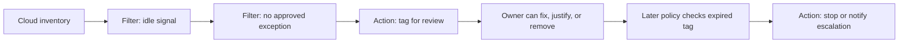
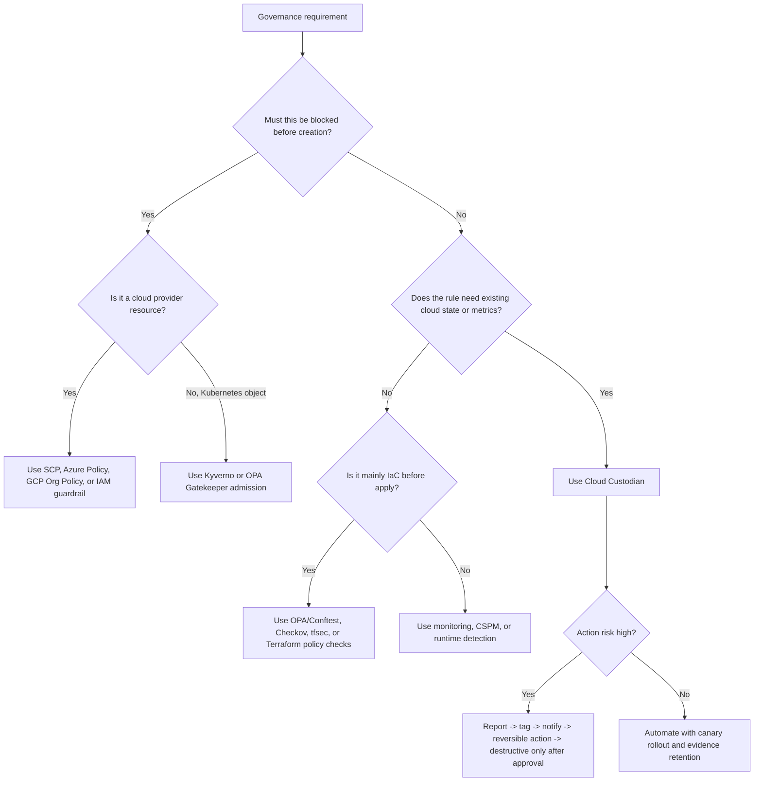

> **Complexity**: [COMPLEX]
>
> **Time to Complete**: 45-60 minutes
>
> **Prerequisites**: Read [Module 10.2: Cloud Governance & Policy as Code](../module-10.2-governance/) and [Module 10.3: Continuous Compliance & CSPM](../module-10.3-compliance/) first. Familiarity with Terraform or OpenTofu is helpful.

---

## What You'll Be Able to Do

After completing this module, you will be able to:

- **Design** a declarative Cloud Custodian policy set that separates selection, evidence, and remediation across AWS and Azure.
- **Implement** safe idle-resource governance policies that tag first, stop later, and preserve accountable exception paths.
- **Compare** Cloud Custodian with OPA Gatekeeper and Kyverno, then choose the correct enforcement layer for a production governance problem.
- **Diagnose** production failure modes in Custodian rollouts, including IAM gaps, event-mode drift, noisy metrics, and multi-account blast radius.
- **Evaluate** the cost and operational tradeoffs of running Custodian at moderate multi-cloud scale.

---

## Why This Module Matters

Hypothetical scenario: A platform team inherits three AWS organizations, five Azure subscriptions, and a Kubernetes fleet that spans business units acquired over several years.
The security team has a spreadsheet that says every EC2 instance and Azure VM must have an owner tag, every S3 bucket must use a lifecycle rule, and every idle server must be reviewed before the next quarter.
The spreadsheet is accurate for exactly one day.
By the end of the week, a Terraform apply creates twelve untagged instances, a break-glass admin disables lifecycle on a log bucket to debug retention, and an old analytics VM keeps running because no one remembers who owns it.

That is the moment when "cloud governance" stops being a policy document and becomes an operational system.
Module 10.2 showed you the pyramid: organization policies, IaC validation, Kubernetes admission control, and runtime detection.
Module 10.3 showed you why evidence has to be continuous instead of audit-day theater.
Cloud Custodian fills a specific gap between those two ideas: it lets you inspect the current cloud estate, filter resources by real cloud state, and take controlled actions without writing a custom script for every service and provider.

This module is not a catalog of Custodian actions.
You can get that from the reference docs.
The goal here is to build the mental model you need in a design review: when declarative governance is safer than ad-hoc automation, how the policy engine thinks, how AWS and Azure differ in syntax, and how to operate the system without turning it into an expensive fleet-wide cron job that surprises application teams.

---

## Why Declarative Governance Beats Ticket-Driven Cleanup

Start with the failure mode.
Manual cloud cleanup looks reasonable when the environment is small.
Someone runs a monthly report, sends messages to resource owners, and deletes the obvious waste.
That works until ownership, cloud provider behavior, and resource lifecycles stop fitting into one person's short-term memory.

The key production problem is not just drift.
It is drift with weak evidence.
A VM can be idle because it is abandoned.
A VM can also be idle because it is a warm standby, a quarterly reporting node, or a licensed application that must stay provisioned even when CPU is low.
A bucket without lifecycle can be a mistake.
It can also be a litigation-hold exception.
Governance automation has to distinguish "this is obviously wrong" from "this needs a human decision".

Cloud Custodian gives you a policy loop that is closer to a building inspection than a demolition crew.
Each policy describes the type of resource to inspect, the tests that narrow the list, and the action to take on the final set.
That action can be gentle, like tagging for review.
It can be evidentiary, like notifying a queue or writing a report.
It can be corrective, like enabling encryption or stopping an instance.
The important part is that each rule is stored as code, reviewed like code, and executed repeatedly against the real cloud control plane.

```text
Ticket-driven cleanup
  report -> spreadsheet -> chat message -> manual change -> forgotten exception

Declarative governance
  policy -> cloud query -> filtered evidence -> tagged decision -> controlled action
```

The difference is accountability.
A ticket tells you that someone intended to clean up a resource.
A policy tells you the exact predicate that selected the resource, the action that was allowed, the identity that executed it, and the output captured at the time.
That makes governance debuggable.

Cloud Custodian is especially useful in multi-cloud estates because it creates a repeated pattern across providers without pretending the providers are identical.
AWS resources use AWS-shaped names and permissions.
Azure resources use Azure-shaped resources and Monitor metrics.
The policy grammar stays familiar, but the provider details remain explicit.
That is a useful compromise: shared operating model, provider-native execution.

Hypothetical scenario: A central platform team wants one rule for "idle compute must be reviewed".
On AWS, the signal might be EC2 `CPUUtilization` from CloudWatch plus an `Owner` tag check.
On Azure, the signal might be Azure Monitor `Percentage CPU` on `azure.vm`.
The governance intent is the same, but the metric names, identity model, and stop behavior differ.
Custodian lets you make that difference visible in code instead of hiding it in one generic script.

> **Pause and predict:** If you immediately stop every VM below 5% CPU, which legitimate workloads are most likely to be harmed? Name at least two before reading on.

The safer pattern is usually a two-stage action.
First, mark the resource for review with a deadline, owner-facing message, and ticket context.
Second, run a separate policy that acts only on resources whose deadline has passed and whose exception signal is absent.
That two-stage shape is how you turn automation from a surprise into a visible governance process.



The loop also makes cost visible.
An idle-instance report that runs once is a snapshot.
A policy that runs every day creates a trend: which teams repeatedly leave resources idle, which business units carry exceptions, and which cleanup actions actually reduce spend.
That trend is what turns governance from punishment into capacity planning.

The tradeoff is that Cloud Custodian is not a preventive admission controller for every cloud action.
It can run in event-driven modes for some providers and resources, but many useful policies still operate as scheduled scans.
That means a bad resource might exist briefly before Custodian tags or remediates it.
For hard prohibitions, use organization policies, IAM/SCP boundaries, Azure Policy deny effects, or Kubernetes admission control.
Use Custodian when the decision depends on current resource state, historical metrics, ownership tags, or remediation workflows that are too nuanced for a single deny rule.

---

## The Cloud Custodian Policy Model

Cloud Custodian policies are YAML documents with a top-level `policies` list.
Each policy usually has a `name`, a `resource`, optional `filters`, and optional `actions`.
That looks simple enough to mistake for a loop over resources.
It is not just a loop.
The engine owns provider discovery, schema validation, resource augmentation, output, metrics, and execution mode wiring.

```yaml
policies:
  - name: ec2-tag-idle-for-review
    resource: aws.ec2
    filters:
      - "tag:DoNotStop": absent
      - type: metrics
        name: CPUUtilization
        days: 7
        period: 86400
        value: 5
        op: less-than
    actions:
      - type: mark-for-op
        tag: custodian_status
        op: stop
        days: 7
        msg: "Idle for 7 days; stop scheduled after owner review window."
```

Read the policy from top to bottom as a sentence:
"For EC2 instances, ignore resources with a `DoNotStop` tag, find instances whose average CPU was under 5% for seven days, and mark them for a future stop operation."
That sentence matters because a good Custodian policy should be explainable to the application owner who receives the tag or notification.

The `resource` field is the boundary of the query.
It tells Custodian which provider API shape to load, which filters are legal, and which actions are safe for that kind of object.
`aws.ec2`, `aws.s3`, and `azure.vm` are not interchangeable strings.
Each resource type has provider-specific filters and actions because clouds do not expose identical control planes.

The `filters` field is the policy's reasoning layer.
Simple value filters inspect fields returned by the provider.
Metric filters pull time-series data from CloudWatch or Azure Monitor.
Tag filters encode ownership and exception rules.
Boolean groups let you make the decision more precise.
This is where most policy quality lives.
A weak filter creates noisy remediation; a precise filter creates trust.

The `actions` field is the side-effect layer.
Some actions only annotate, such as `tag` or `mark-for-op`.
Some notify, report, or call another workflow.
Some change infrastructure directly, such as `stop`, `delete`, `set-bucket-encryption`, or `configure-lifecycle`.
Production teams should treat actions with the same care they apply to database migrations: start read-only, tag or notify next, then remediate only after the predicate has been proven.

```text
+----------------------- Cloud Custodian Policy -----------------------+
| name      | Human-readable contract and stable reporting identity     |
| resource  | Provider API family: aws.ec2, aws.s3, azure.vm, ...        |
| filters   | Evidence and predicates: tags, metrics, state, config      |
| actions   | Side effects: tag, notify, mark, stop, delete, configure    |
| mode      | Execution trigger: pull, schedule, cloud event, container   |
+---------------------------------------------------------------------+
```

The part that makes this more than a `for-each` loop is resource augmentation.
For example, S3 bucket governance often needs more than the bucket name.
Policies may need the bucket policy, tags, lifecycle configuration, public access settings, encryption, logging, and replication state.
Custodian includes resource-specific logic to fetch those subdocuments for the resource type.
That saves you from writing one brittle script that calls `list-buckets`, then `get-bucket-policy`, then `get-lifecycle-configuration`, then handles every access-denied edge case by hand.

The second difference is output.
A local script often prints a list and disappears.
Custodian writes resources, logs, and policy output to a selected output directory or cloud storage location.
That gives you evidence for audit and debugging.
If a policy stopped an instance, you want the exact resource document that matched, not just a Slack message saying "cleanup happened".

The third difference is mode.
A policy can run as a local pull scan, a periodic job, or an event-driven function depending on provider support and the policy's risk profile.
The same policy intent can move from `custodian run` in CI to scheduled production execution without rewriting the selection logic.
That is a major operational advantage over one-off scripts.

> **Pause and predict:** Which part of a policy should change most often: the resource type, the filters, or the actions? Why?

In healthy programs, filters change more often than resource types and actions.
The governance intent tends to stay stable: "idle compute is reviewed", "public buckets are blocked", "owner tags are required".
What changes is the evidence threshold, exception tag, allowed teams, or review window.
If actions change constantly, the organization probably has not agreed on the operating model yet.

### Policy anatomy by responsibility

| Policy part | Design question | Failure if rushed | Production habit |
| :--- | :--- | :--- | :--- |
| `name` | Can humans identify this rule in logs and reports? | Ambiguous audit trails | Use stable names with domain and action |
| `resource` | Which provider object is being governed? | Wrong API assumptions | Keep provider names explicit |
| `filters` | What evidence proves this resource is in scope? | False positives | Start with read-only reports |
| `actions` | What is the least risky useful side effect? | Surprise outages | Tag before stop, stop before delete |
| `mode` | When should the policy run? | Cost spikes or stale enforcement | Match cadence to risk |
| output | Where does evidence land? | No audit trail | Centralize logs and resources |

The policy file should also be validated before execution.
`custodian validate` catches schema errors that a YAML parser cannot.
YAML can be syntactically valid while still asking for an invalid action on a resource type.
That distinction is important in CI: you want both "is this YAML valid?" and "is this a valid Custodian policy?"

```bash
python -m venv .venv
.venv/bin/pip install c7n

custodian validate policies/aws-idle-compute.yml
custodian run --dryrun -s output policies/aws-idle-compute.yml
```

The dry run is not a ceremonial step.
It is the first time you see the actual resources that match.
If a policy expected four idle instances and matches four hundred, the failure is not in the action.
The failure is in your mental model of the estate.

---

## AWS Worked Example: Idle Compute, S3 Lifecycle, and Untagged Cleanup

The first AWS pattern is idle EC2 governance.
The mature version is not "stop anything quiet".
It is "identify low-utilization candidates, give owners a review window, then stop only resources that remain idle and unexceptioned".

Exercise scenario: You operate an AWS account used by several product teams.
You suspect long-running development instances are consuming budget, but you do not want to break standby systems or batch workers.
Your governance rule is:
mark running EC2 instances for review when average CPU is under 5% for seven days, exclude known protected instances, and stop them only after the review window expires.

```yaml
# policies/aws-idle-ec2.yml
policies:
  - name: ec2-idle-mark-for-review
    resource: aws.ec2
    description: |
      Mark running EC2 instances for review when CPU stays below 5 percent
      for seven days and no explicit protection tag is present.
    filters:
      - "tag:DoNotStop": absent
      - "tag:custodian_status": absent
      - type: value
        key: State.Name
        value: running
      - type: metrics
        name: CPUUtilization
        days: 7
        period: 86400
        value: 5
        op: less-than
        missing-value: 0
    actions:
      - type: mark-for-op
        tag: custodian_status
        op: stop
        days: 7
        msg: "Idle EC2 review: CPU < 5% for 7 days. Remove this tag or add DoNotStop=true with an approved ticket if this instance must remain running."

  - name: ec2-idle-stop-after-review
    resource: aws.ec2
    description: |
      Stop EC2 instances whose Custodian review window has expired.
    filters:
      - type: marked-for-op
        tag: custodian_status
        op: stop
      - "tag:DoNotStop": absent
      - type: value
        key: State.Name
        value: running
    actions:
      - type: stop
```

The `missing-value: 0` choice deserves a design review.
It tells the metric filter to treat absent metric data as zero.
That is useful for idle detection because a stopped instance or one without metrics should not silently escape the policy.
It is also dangerous if you apply it to a resource where metrics are absent because the resource is new, misconfigured, or outside the metric namespace.
For production, add a second filter that excludes very new instances or requires a minimum age before evaluating CPU.

```yaml
  - name: ec2-idle-mark-for-review-safer
    resource: aws.ec2
    filters:
      - "tag:DoNotStop": absent
      - "tag:custodian_status": absent
      - type: instance-age
        days: 14
        op: greater-than
      - type: value
        key: State.Name
        value: running
      - type: metrics
        name: CPUUtilization
        days: 7
        period: 86400
        value: 5
        op: less-than
        missing-value: 0
    actions:
      - type: mark-for-op
        tag: custodian_status
        op: stop
        days: 7
```

This small addition prevents the classic false positive where a newly launched instance has not accumulated enough metrics yet.
The core lesson is that metric policies are never just metric policies.
They are metric policies plus age, ownership, state, exception, and review-window logic.

> **Before running this:** How many instances do you expect the dry run to match, and which tags would convince you the result is safe?

Use dry run before enabling the stop policy.
The first command validates syntax and schema.
The second collects matched resources without applying actions.
The output directory becomes your review artifact.

```bash
custodian validate policies/aws-idle-ec2.yml
custodian run --dryrun -s output/aws-idle-ec2 policies/aws-idle-ec2.yml
find output/aws-idle-ec2 -name resources.json -print
```

The second AWS pattern is S3 lifecycle enforcement.
Lifecycle is a good Custodian use case because the desired outcome is a resource configuration, not a one-time cleanup.
Your rule might be:
versioned buckets must transition old noncurrent versions and expire incomplete multipart uploads unless the bucket has an approved retention exception.

```yaml
# policies/aws-s3-lifecycle.yml
policies:
  - name: s3-enforce-standard-lifecycle
    resource: aws.s3
    description: |
      Apply a baseline lifecycle rule to versioned buckets that do not carry
      an approved retention exception.
    filters:
      - "tag:RetentionException": absent
      - type: value
        key: Versioning.Status
        value: Enabled
      - or:
          - Lifecycle.Rules: absent
          - type: value
            key: "length(Lifecycle.Rules[?ID=='kdojo-standard-lifecycle'])"
            value: 0
    actions:
      - type: configure-lifecycle
        rules:
          - ID: kdojo-standard-lifecycle
            Status: Enabled
            Filter:
              Prefix: ""
            NoncurrentVersionExpiration:
              NoncurrentDays: 35
            AbortIncompleteMultipartUpload:
              DaysAfterInitiation: 7
```

The S3 example also shows why Custodian's resource model matters.
Lifecycle state is not returned by a simple bucket list.
The engine has to augment each bucket with additional configuration before your filter can inspect it.
That is convenient, but it is not free.
Every extra subdocument can mean more provider API calls.
At small scale this is invisible.
At hundreds or thousands of buckets across many accounts, unnecessary augmentation becomes latency, throttling, and cost noise.

For S3 policies, narrow what the policy needs.
If the rule only checks lifecycle and tags, avoid asking for every possible S3 subdocument.
Provider documentation supports `augment-keys` so policies can avoid unrelated reads.

```yaml
policies:
  - name: s3-lifecycle-report-only
    resource: aws.s3
    query:
      - augment-keys:
          - Lifecycle
          - Tagging
    filters:
      - Lifecycle.Rules: absent
    actions:
      - type: tag
        tag: lifecycle-review
        value: required
```

The third AWS pattern is untagged-resource cleanup.
Here the action should be slower and more conservative than the selection.
Missing owner tags often mean weak process, not disposable infrastructure.
Treat tag enforcement as a path to accountability first.

```yaml
# policies/aws-untagged-ec2.yml
policies:
  - name: ec2-untagged-owner-mark
    resource: aws.ec2
    filters:
      - type: value
        key: State.Name
        value: running
      - "tag:Owner": absent
      - "tag:CostCenter": absent
      - "tag:custodian_status": absent
    actions:
      - type: mark-for-op
        tag: custodian_status
        op: stop
        days: 10
        msg: "Missing Owner and CostCenter tags. Add tags or approved exception before the review window expires."

  - name: ec2-untagged-owner-stop
    resource: aws.ec2
    filters:
      - type: marked-for-op
        tag: custodian_status
        op: stop
      - "tag:Owner": absent
      - "tag:CostCenter": absent
      - type: value
        key: State.Name
        value: running
    actions:
      - type: stop
```

Notice that this policy does not terminate anything.
Stopping is reversible for many EC2 workloads.
Termination is a destructive action with data-loss risk.
If your governance program starts with termination, application teams will route around it.
If it starts with visible tags, reports, and reversible actions, teams are more likely to fix ownership upstream.

### AWS production notes

| Concern | What to decide | Why it matters |
| :--- | :--- | :--- |
| IAM role | Which permissions does each policy need? | Least privilege is per action, not per tool |
| Metric window | How many days and what statistic? | Short windows catch noise; long windows hide waste |
| Exception tag | Who can set it and with what ticket? | A self-service bypass becomes permanent drift |
| Output storage | Where do `resources.json` and logs go? | Audit and rollback need evidence |
| Schedule | Daily, hourly, or event-driven? | Cadence drives cost, API pressure, and reaction time |

---

## Azure Worked Example: Same Pattern, Different Provider Shape

The Azure version should feel familiar but not identical.
The top-level `policies` list is the same.
The provider resource is different.
The metric filter uses Azure Monitor terminology.
The stop action deallocates the VM when you use the `stop` action for `azure.vm`.
The exception and ownership tags are still your operating model.

Exercise scenario: Your Azure subscription contains development VMs used by several teams.
The FinOps lead wants low-CPU VMs tagged after seven days and stopped after fourteen days unless a `DoNotStop` tag is present.
The Azure platform team also wants a variant that reports public-IP VMs without immediately changing them.

```yaml
# policies/azure-idle-vm.yml
policies:
  - name: azure-vm-idle-mark-for-review
    resource: azure.vm
    description: |
      Mark Azure VMs for review when average Percentage CPU is below 5
      for seven days and no protection tag is present.
    filters:
      - type: value
        key: "tags.DoNotStop"
        value: absent
      - type: value
        key: "tags.custodian_status"
        value: absent
      - type: metric
        metric: Percentage CPU
        aggregation: average
        op: le
        threshold: 5
        timeframe: 168
        no_data_action: to_zero
    actions:
      - type: mark-for-op
        tag: custodian_status
        op: stop
        days: 7
        msg: "Idle Azure VM review: CPU <= 5% for 7 days. Remove this tag or add DoNotStop=true with an approved ticket if this VM must remain running."

  - name: azure-vm-idle-stop-after-review
    resource: azure.vm
    filters:
      - type: marked-for-op
        tag: custodian_status
        op: stop
      - type: value
        key: "tags.DoNotStop"
        value: absent
    actions:
      - type: stop
```

The metric window uses hours, not days.
Seven days is 168 hours.
That difference looks small, but it is exactly the kind of provider syntax mismatch that causes bad copy-paste governance.
Do not hide it behind a generic abstraction unless the abstraction is tested and owned.
In most teams, explicit provider policy files are easier to review.

The `no_data_action: to_zero` choice is the Azure sibling of AWS `missing-value: 0`.
It helps include quiet VMs whose metrics are absent.
It can also create false positives.
Before enabling the stop policy, run a report-only policy and inspect the matched resources.

```bash
custodian validate policies/azure-idle-vm.yml
custodian run --dryrun -s output/azure-idle-vm policies/azure-idle-vm.yml
```

The public-IP report shows a different governance posture.
Public exposure can be a hard deny in Azure Policy for new resources.
Custodian is useful for finding and routing existing drift.
You might tag, notify, or open a ticket before blocking future creation with preventive controls.

```yaml
# policies/azure-public-ip-report.yml
policies:
  - name: azure-vms-with-public-ip-report
    resource: azure.vm
    description: |
      Identify VMs with public IP addresses so the platform team can
      migrate them behind approved ingress patterns.
    filters:
      - type: network-interface
        key: "properties.ipConfigurations[].properties.publicIPAddress.id"
        value: not-null
    actions:
      - type: tag
        tag: network-review
        value: public-ip-detected
```

> **Which approach would you choose here and why:** Azure Policy deny for public IP creation, Custodian report for existing public IPs, or both?

The answer is usually both.
Azure Policy is better for preventing new non-compliant resources at the ARM control plane.
Custodian is better for scanning what already exists, attaching ownership context, and orchestrating remediation over time.
The two controls should not compete.
They should cover different lifecycle moments.

### AWS and Azure syntax comparison

| Intent | AWS shape | Azure shape | Design note |
| :--- | :--- | :--- | :--- |
| Resource | `resource: aws.ec2` | `resource: azure.vm` | Keep provider explicit |
| CPU metric | `name: CPUUtilization` | `metric: Percentage CPU` | Metric names are provider-native |
| Time window | `days: 7` plus `period` | `timeframe: 168` hours | Review units carefully |
| Missing data | `missing-value: 0` | `no_data_action: to_zero` | Use only with age safeguards |
| Stop | `type: stop` | `type: stop` | Same action name, provider behavior differs |
| Multi-account | `c7n-org` accounts | `c7n-org` subscriptions | One runner, different config |

This is the main mental model for multi-cloud Custodian work:
standardize the governance intent, not every line of syntax.
If your organization says "idle compute gets a review tag after seven days," that sentence should be the same across providers.
The implementation should remain honest about each provider's metrics, identity, API limits, and stop semantics.

---

## Cloud Custodian vs OPA, Gatekeeper, and Kyverno

Cloud Custodian, OPA Gatekeeper, and Kyverno are all policy-as-code tools, but they do not occupy the same layer.
Confusing them leads to weak designs.
The right question is not "which policy engine is best?"
The right question is "where in the lifecycle does this decision need to happen?"

Cloud Custodian is strongest when the policy needs cloud inventory, provider metrics, historical state, or remediation actions against cloud resources.
It can inspect existing resources and change them.
It is a governance worker.

OPA is a general-purpose policy engine.
Gatekeeper is the Kubernetes-native project that uses OPA/Rego with constraints and constraint templates for admission control and audit.
It is strongest when you need complex policy logic at the Kubernetes API boundary or when your organization already uses Rego across APIs, CI, and infrastructure checks.

Kyverno is Kubernetes-focused and uses Kubernetes-style policy resources.
It is strongest when platform teams want validation, mutation, generation, image verification, exceptions, and policy reports inside the cluster without teaching every contributor Rego.

```text
+---------------------+------------------------+--------------------------+
| Question            | Better layer           | Example                  |
+---------------------+------------------------+--------------------------+
| Should this cloud   | Cloud provider policy  | Deny public AKS creation |
| API request happen? | or organization guard  | with Azure Policy        |
+---------------------+------------------------+--------------------------+
| Does existing cloud | Cloud Custodian        | Tag idle EC2 for review  |
| state need cleanup? |                        | after metric evidence    |
+---------------------+------------------------+--------------------------+
| Should this K8s     | Kyverno or Gatekeeper  | Reject privileged Pods   |
| object be admitted? |                        | at API admission         |
+---------------------+------------------------+--------------------------+
| Does one rule need  | OPA/Rego ecosystem     | Share authorization      |
| cross-system logic? |                        | policy across services   |
+---------------------+------------------------+--------------------------+
```

### Decision comparison

| Need | Cloud Custodian | OPA Gatekeeper | Kyverno |
| :--- | :--- | :--- | :--- |
| Govern AWS/Azure/GCP resources already deployed | Strong | Weak unless external data is built | Weak outside Kubernetes |
| Enforce Kubernetes admission decisions | Limited and specialized | Strong | Strong |
| Mutate Kubernetes manifests on admission | Not the main job | Possible with Gatekeeper mutation | Strong |
| Generate Kubernetes resources | Not the main job | Not a core strength | Strong |
| Use historical cloud metrics | Strong | Not natural | Not natural |
| Remediate cloud resources | Strong | Not natural | Not natural |
| Reuse one language outside Kubernetes | Moderate DSL reuse | Strong with Rego and OPA | Limited to Kyverno ecosystem |
| Entry barrier for platform YAML users | Moderate | Higher because Rego | Lower for Kubernetes teams |

The important distinction is runtime authority.
Gatekeeper and Kyverno sit in the Kubernetes admission path.
If they deny a Pod, the Pod never exists.
Custodian often works after resources exist, unless deployed in an event-driven mode for specific cloud events.
That is not a weakness.
It is a different safety property.

Use a preventive layer when the organization cannot tolerate even temporary non-compliance.
For example, denying a public production cluster endpoint should happen at the provider policy layer.
Use Custodian when the policy needs evidence, review, staged remediation, or historical metrics.
For example, "stop idle instances after owner review" cannot be expressed well as a simple deny rule.
Use Kubernetes admission control when the object is a Kubernetes object and the decision must happen before persistence.

Hypothetical scenario: A team deploys a Kubernetes `Service` of type `LoadBalancer` that creates a public cloud load balancer.
Where should governance live?
Kyverno or Gatekeeper can reject the Kubernetes Service before the cloud load balancer appears.
Cloud provider policy can deny public load balancer creation at the cloud API.
Cloud Custodian can scan existing load balancers and tag or delete ones that escaped older controls.
The best production answer may use all three, but each has a distinct job.

> **Pause and predict:** If a Kyverno policy and a Custodian policy both try to fix the same problem, what symptoms tell you the boundary is wrong?

Look for repeated remediations, noisy alerts, and resources flipping between states.
If Custodian keeps deleting objects that admission control could have blocked, move the rule earlier.
If admission control blocks resources because it lacks context from cloud metrics or ownership systems, move that decision to a detective workflow with review.

---

## Operating Custodian in Production

Production Custodian is not just `custodian run`.
It is identity, scheduling, output, logging, metrics, CI validation, exception ownership, and multi-account rollout control.
Treat the policies as product code and the runner as infrastructure.

### Execution modes

Pull mode is the default mental model.
You run Custodian from a workstation, CI job, container, or scheduled worker.
The policy queries the cloud provider, filters resources, applies actions, and writes output.
This is the easiest mode to debug and the safest place to start.

Periodic mode turns policies into scheduled cloud functions for providers that support it.
On AWS, Custodian can deploy Lambda-backed policies with schedule or periodic semantics.
This is useful for policies that need steady enforcement but do not require a constantly running host.
It also means each policy function has runtime, memory, timeout, IAM, log, and deployment lifecycle concerns.

CloudTrail-driven mode on AWS subscribes policy Lambda functions to API events.
That is valuable when a policy should react soon after resource creation or modification.
The tradeoff is complexity.
Event patterns, resource ID extraction, function deployment, and stale schedules need careful lifecycle management.
If you change a policy from one mode to another, clean up old functions and schedules deliberately.

Azure has pull and Azure-specific event or container modes depending on deployment shape.
Many teams still begin with a containerized runner in CI or a scheduled platform job because it centralizes credentials, output, and change control.
That is fine.
A simple boring runner is often better than many event functions that no one debugs well.

```text
+----------------+---------------------------+----------------------------+
| Mode           | Best fit                  | Main risk                  |
+----------------+---------------------------+----------------------------+
| Pull           | CI, scheduled jobs, tests | Stale if cadence is too low |
| Periodic       | Regular enforcement       | Function sprawl, timeouts  |
| CloudTrail     | Event-driven AWS response | Event pattern mistakes     |
| Container job  | Central platform runner   | Broad credential blast     |
+----------------+---------------------------+----------------------------+
```

### IAM and least privilege

Do not grant Custodian administrator access because "the policies are reviewed".
The policy action decides the permission boundary.
A read-only report policy needs describe and list permissions.
An EC2 stop policy needs stop permissions for the target resource.
An S3 lifecycle policy needs lifecycle read and write permissions.
Separate high-risk policy sets into separate roles.

This is where policy organization matters.
Put report-only policies, tagging policies, and destructive policies in separate files or directories.
Bind them to separate CI jobs or runner roles.
That lets you approve a read-only policy quickly without also approving termination authority.

```text
policy-repo/
  aws/
    report-only/
      s3-public-report.yml
      ec2-idle-report.yml
    reversible-actions/
      ec2-idle-stop.yml
      s3-lifecycle-enforce.yml
    destructive-actions/
      ebs-delete-unattached-after-review.yml
  azure/
    report-only/
    reversible-actions/
```

Secrets should not live in policy files.
Use cloud-native identity wherever possible: IAM roles, workload identity, managed identity, or short-lived federated credentials from CI.
If a webhook action is needed, route through a secret manager or a platform notification service instead of embedding a token in YAML.
Keep example URLs fake and non-sensitive.

### Logging, metrics, and evidence

Custodian emits policy output that should be treated as audit evidence.
At minimum, store `resources.json`, logs, and policy reports in a central bucket or storage account with retention.
For AWS, Custodian can publish policy metrics to CloudWatch, including resource count, timing, API calls, and action timing.
Those metrics are operational signals, not vanity graphs.

Useful production dashboards answer these questions:

| Question | Metric or artifact | Why it matters |
| :--- | :--- | :--- |
| Did the policy match more resources than usual? | `ResourceCount` trend | Detect runaway filters |
| Did provider API calls spike? | `ApiCalls` trend | Catch expensive scans |
| Did actions slow down? | `ActionTime` | Detect throttling or provider issues |
| Which resources were changed? | `resources.json` | Provide audit and rollback context |
| Which policies keep failing? | Logs by policy name | Fix IAM or schema drift |

### c7n-org for multi-account execution

At single-account scale, one scheduled runner can be enough.
At enterprise scale, the problem becomes account and subscription fan-out.
`c7n-org` runs policies across AWS accounts, Azure subscriptions, GCP projects, and OCI tenancies from a config file.
That is powerful, so it needs guardrails.

```yaml
# accounts.yml
accounts:
  - account_id: "111122223333"
    name: app-dev
    regions:
      - us-east-1
      - us-west-2
    role: arn:aws:iam::111122223333:role/CloudCustodianReadOnly
    tags:
      - env:dev
      - scope:standard

  - account_id: "444455556666"
    name: app-prod
    regions:
      - us-east-1
    role: arn:aws:iam::444455556666:role/CloudCustodianReversibleActions
    tags:
      - env:prod
      - scope:pci
```

```bash
c7n-org validate -c accounts.yml -u policies/aws/report-only
c7n-org run -c accounts.yml -s output/aws-report -u policies/aws/report-only --dryrun
c7n-org report -c accounts.yml -s output/aws-report -u policies/aws/report-only
```

Use account tags to control rollout.
Start with one development account.
Expand to a small production canary.
Then expand by organizational unit or subscription group.
Do not run a new stop policy across every account on day one just because the tool can.

### CI integration

Policy CI should catch at least five problems before execution:

- YAML syntax errors.
- Custodian schema errors.
- Accidental destructive actions in the wrong directory.
- Missing owner metadata for new policies.
- Changed policies without a dry-run artifact or reviewer approval.

```yaml
# .github/workflows/custodian-policy-ci.yml
name: custodian-policy-ci

on:
  pull_request:
    paths:
      - "policies/**/*.yml"
      - "policies/**/*.yaml"

jobs:
  validate:
    runs-on: ubuntu-latest
    steps:
      - uses: actions/checkout@v4
      - uses: actions/setup-python@v5
        with:
          python-version: "3.12"
      - name: Install Cloud Custodian
        run: |
          python -m pip install --upgrade pip
          pip install c7n c7n-azure c7n-org
      - name: Validate policies
        run: |
          custodian validate policies/aws/**/*.yml policies/azure/**/*.yml
```

In this repository's local instructions, commands should use `.venv/bin/python`.
The workflow above is an illustrative GitHub Actions example running in a clean hosted environment.
For KubeDojo local validation, follow the repo's own `.venv/bin/python` rule.

### Cost-lens checklist

Cloud Custodian is open source, but operating it is not cost-free.
At moderate scale, the cost is usually from cloud API calls, function invocations, logs, metric ingestion, storage for evidence, and human review time.
The software license is not the bill.
The control-plane activity is the bill.

Use this checklist before promoting a policy:

- [ ] **What costs at moderate scale?** Provider API calls, CloudWatch or Azure Monitor metric queries, Lambda or container runtime, log ingestion, output storage, notification delivery, and reviewer time.
- [ ] **What reduces cost?** Narrow resource filters, provider-side query filters, less frequent schedules, `augment-keys` for S3, canary account rollouts, centralized metrics with `ignore_zero`, and report-only dry runs before remediation.
- [ ] **What makes cost spike?** Running broad policies across all accounts and regions, scanning high-cardinality resources every few minutes, fetching unnecessary S3 subdocuments, emitting every zero-value metric, retrying after IAM failures, and sending one notification per resource instead of batching.
- [ ] **What is the business value?** Estimate idle resource savings, reduced audit-prep time, avoided policy drift, and fewer custom scripts before adding another recurring scan.
- [ ] **What is the rollback plan?** Keep output artifacts, use reversible first actions, and define who can remove review tags or pause a policy.

> **Pause and predict:** Which is more likely to create surprise cost: a stop action on ten EC2 instances, or a read-only S3 policy that scans thousands of buckets across every account every hour? Explain your reasoning.

The answer is often the read-only scan.
Read-only does not mean free.
Broad inventory scans can generate many API calls, logs, metrics, and retries.
That is why production Custodian programs review selection cost as seriously as action risk.

---

## Patterns & Anti-Patterns

Patterns are the operating habits that keep Custodian trusted.
Anti-patterns are the shortcuts that make teams disable it.

| Pattern | When to use | Why it works | Scaling consideration |
| :--- | :--- | :--- | :--- |
| **Tag first, act later** | Idle compute, missing ownership, ambiguous cleanup | Gives owners a review window and creates evidence | Requires tag ownership and expiry automation |
| **Separate report, reversible, and destructive policies** | Any multi-account program | IAM and review can match risk level | More directories and pipelines, but smaller blast radius |
| **Canary by account tag** | New policy rollout | Finds false positives before fleet-wide action | Needs account metadata in c7n-org config |
| **Provider-native syntax with shared intent** | Multi-cloud policies | Avoids fake abstractions over different APIs | Requires reviewers who can read provider details |
| **Policy output as audit evidence** | Compliance and FinOps programs | Shows exactly which resources matched and why | Needs retention, storage lifecycle, and access control |
| **Metric plus age plus exception filters** | Idle-resource policies | Reduces false positives from new or special resources | More policy lines, but much safer decisions |

| Anti-pattern | What goes wrong | Why teams fall into it | Better alternative |
| :--- | :--- | :--- | :--- |
| **Admin role for every policy** | One policy bug can mutate the whole account | Faster bootstrap during proof of concept | Separate roles by action class |
| **Immediate delete on first match** | Data loss and organizational backlash | Cleanup pressure and confidence from small tests | Mark, notify, stop, then delete only after retention review |
| **One giant policy file** | Hard reviews and accidental broad changes | Central teams want one source of truth | Split by provider, action risk, and domain |
| **Generic multi-cloud wrapper hides provider behavior** | Reviewers miss metric and stop semantics | Desire for one elegant abstraction | Standardize naming and intent, not every field |
| **Audit-only forever** | Drift becomes normalized | Teams fear breaking production | Time-box report mode with clear promotion criteria |
| **No exception lifecycle** | Permanent bypass tags accumulate | Exceptions unblock incidents quickly | Require owner, ticket, expiry, and automated reporting |
| **Every policy runs hourly** | API throttling and log cost spikes | "More frequent is safer" thinking | Match cadence to risk and resource volatility |
| **Custodian replaces preventive controls** | Bad resources exist repeatedly before cleanup | One tool feels simpler | Use SCP/Azure Policy/Kyverno for hard denies |

The strongest pattern is staged trust.
Run a report.
Show owners the results.
Tune filters.
Tag resources.
Measure the false-positive rate.
Only then automate the reversible action.
This takes longer than a heroic cleanup script, but it creates a system people can live with.

---

## Decision Framework

Use this framework when deciding where a governance rule belongs.
Start with the lifecycle moment, then choose the policy layer.



### Design review questions

| Question | Choose Custodian when... | Choose another layer when... |
| :--- | :--- | :--- |
| Is the decision based on historical usage? | CPU, request count, age, or resource state matters | Creation-time attributes are enough |
| Does the rule need remediation? | You need to tag, stop, configure, or notify | You only need to reject invalid input |
| Is temporary non-compliance acceptable? | A review window is acceptable | The resource must never exist |
| Is the object a Kubernetes resource? | The object is a cloud-side resource created by K8s | Admission can block the K8s object directly |
| Does the policy span accounts? | `c7n-org` can fan out safely with account tags | Provider organization policy can enforce centrally |
| Is the action destructive? | You have staged evidence and approval | Use manual workflow or break the task apart |

### Policy promotion ladder

1. **Inventory:** run read-only and collect matched resources.
2. **Explain:** share the predicate with resource owners and adjust false positives.
3. **Mark:** add review tags with owner-facing messages.
4. **Notify:** batch notifications to team channels or ticket queues.
5. **Remediate:** stop, configure, or lock resources when the review window expires.
6. **Escalate:** reserve delete or irreversible actions for approved, narrow cases.

This ladder prevents a common failure:
the central team writes a technically correct policy, but teams experience it as random punishment.
The ladder makes policy behavior legible before it becomes forceful.

---

## Did You Know?

1. Cloud Custodian was created at Capital One in 2016, accepted into the CNCF Sandbox in 2020, and moved to CNCF Incubating status on September 14, 2022.
2. The CNCF project page describes Cloud Custodian as a YAML DSL for querying, filtering, and acting on cloud resources for security, cost optimization, and governance.
3. `c7n-org` can run the same policy runner pattern across AWS accounts, Azure subscriptions, GCP projects, and OCI tenancies from configuration files.
4. Cloud Custodian's AWS metrics output can include policy exception count, resource count, resource time, action time, and API calls, which means governance scans can be monitored like production jobs.

---

## Common Mistakes

| Mistake | Why It Happens | How to Fix It |
| :--- | :--- | :--- |
| Treating Custodian as a one-off cleanup script | The first use case is often waste cleanup, so teams skip operating discipline | Put policies in Git, validate them in CI, and retain output artifacts |
| Using CPU alone as an idle signal | CPU is easy to query and explain | Combine CPU with age, tags, state, owner review, and exception rules |
| Granting one broad admin role | It avoids IAM debugging during early rollout | Create separate roles for report-only, reversible, and destructive policy sets |
| Running every policy everywhere | Multi-account tooling makes fan-out easy | Canary by account tag, region, resource type, and action risk |
| Hiding provider differences behind a generic template | Teams want one multi-cloud policy | Keep intent shared but leave provider metrics and actions explicit |
| Forgetting output and evidence retention | The policy "worked", so logs seem secondary | Store `resources.json`, logs, and reports in controlled storage with retention |
| Letting exception tags live forever | Exceptions are granted during incidents and never revisited | Require ticket, owner, expiry, and a policy that reports expired exceptions |
| Promoting from dry run straight to delete | Cleanup pressure overrides safety | Use the promotion ladder: inventory, explain, mark, notify, remediate, escalate |

---

## Quiz

<details>
<summary>Question 1: Your first idle EC2 policy matches 320 instances when the FinOps team expected about 25. What do you check before changing the action?</summary>

Check the filters and the evidence output before touching the action.
Look at `resources.json` to see whether the matches are new instances, stopped instances, instances missing metrics, or legitimate low-CPU standby systems.
Then add age, state, ownership, and exception filters as needed.
The action is not the root problem; the selection predicate is too broad for production trust.
</details>

<details>
<summary>Question 2: A security engineer wants to use Cloud Custodian to prevent creation of public AKS clusters. Is that the best layer?</summary>

Usually no.
If the cluster must never be created with a public control plane, use Azure Policy or another provider-side preventive control at creation time.
Cloud Custodian can still scan existing clusters for drift or tag resources created before the deny rule existed.
The design is stronger when preventive controls block new violations and Custodian handles existing-state cleanup.
</details>

<details>
<summary>Question 3: Your Azure idle-VM policy uses `no_data_action: to_zero` and begins marking many recently created VMs. What is the likely failure mode?</summary>

The policy is treating missing metric data as zero CPU before the VMs have enough monitoring history.
That makes new resources look idle even when the signal is incomplete.
Add an age filter or a tag-based onboarding grace period, then rerun in dry-run mode.
Missing data handling is useful, but only when paired with safeguards against immature metrics.
</details>

<details>
<summary>Question 4: A team asks why you use Kyverno for Kubernetes labels but Cloud Custodian for EC2 tags. How do you explain the split?</summary>

Kyverno sits in the Kubernetes admission path and can reject or mutate Kubernetes objects before they are stored.
EC2 tags live on cloud resources outside the Kubernetes API, so Custodian is better suited to query AWS, evaluate existing state, and apply tag or stop actions.
The split follows the lifecycle boundary.
Use the engine closest to the resource and decision point.
</details>

<details>
<summary>Question 5: A Custodian S3 lifecycle policy is read-only during testing, but the API call count spikes across the organization. Why can read-only still be expensive?</summary>

Read-only policies can still query many resources and fetch many subdocuments.
S3 governance often requires lifecycle, tagging, policy, encryption, or logging details beyond the basic bucket list.
At large scale, those extra reads create latency, throttling pressure, logs, and metrics.
Use provider-side narrowing and S3 `augment-keys` so the policy fetches only the subdocuments it needs.
</details>

<details>
<summary>Question 6: Your c7n-org run stopped resources in a production account that was supposed to be report-only. What process gap do you investigate?</summary>

Start with account selection, policy directory boundaries, and IAM role mapping.
The production account may have been included by an account tag, the wrong policy directory may have been passed to `c7n-org run`, or the role may have allowed reversible actions in a report-only context.
The fix is not only a policy edit.
Separate report-only and action roles, require explicit account tags for rollout, and make CI block destructive actions in the wrong directory.
</details>

<details>
<summary>Question 7: An application owner says an idle instance is a quarterly reporting server and must remain provisioned. What should the exception process require?</summary>

The exception should be visible, scoped, and temporary.
Require an owner, ticket, business justification, expiry date, and an approved tag such as `DoNotStop=true` plus a ticket reference.
Then run a separate policy that reports expired exceptions.
Do not rely on a Slack thread or undocumented tag value because those disappear from audit context.
</details>

<details>
<summary>Question 8: A platform team wants to write one generic "idle compute" policy generator for AWS and Azure. What design warning would you give them?</summary>

Standardize the governance intent, but do not hide provider behavior.
AWS and Azure use different metric names, time-window fields, missing-data controls, identity models, and stop semantics.
A generator can help if it emits explicit provider-native policies that reviewers can inspect.
If it hides those differences, false positives become harder to diagnose.
</details>

---

## Hands-On Exercise

Exercise scenario: You are adding the first Cloud Custodian policy pack for a platform team.
Your goal is not to delete resources.
Your goal is to design a safe idle-compute workflow that tags first, stops later, and can be expressed on both AWS and Azure.

You do not need live cloud credentials to complete the design portion.
If you have a sandbox account or subscription, run only `validate` and `--dryrun` until you have inspected the matched resources.
Do not run stop actions in a shared environment.

### Setup

Create a local policy workspace:

```bash
mkdir -p custodian-lab/policies/aws custodian-lab/policies/azure custodian-lab/output
cd custodian-lab
python -m venv .venv
.venv/bin/pip install c7n c7n-azure c7n-org
```

If your shell cannot find `custodian` after installation, call it through the virtual environment path:

```bash
.venv/bin/custodian --help
```

### Task 1: Design the AWS "mark for review" policy

Create `policies/aws/idle-ec2-review.yml`.
The policy must find running EC2 instances with average CPU below 5% for seven days.
It must exclude instances with `DoNotStop`.
It must tag matching instances for review instead of stopping them immediately.

<details>
<summary>Solution</summary>

```yaml
policies:
  - name: ec2-idle-mark-for-review
    resource: aws.ec2
    filters:
      - "tag:DoNotStop": absent
      - "tag:custodian_status": absent
      - type: value
        key: State.Name
        value: running
      - type: instance-age
        days: 14
        op: greater-than
      - type: metrics
        name: CPUUtilization
        days: 7
        period: 86400
        value: 5
        op: less-than
        missing-value: 0
    actions:
      - type: mark-for-op
        tag: custodian_status
        op: stop
        days: 7
        msg: "Idle EC2 review: CPU < 5% for 7 days. Stop scheduled after owner review unless DoNotStop=true is approved."
```

</details>

### Task 2: Extend AWS to stop after the review window

Create a second AWS policy in the same file.
It should stop only instances whose review marker has expired and that still do not have `DoNotStop`.

<details>
<summary>Solution</summary>

```yaml
  - name: ec2-idle-stop-after-review
    resource: aws.ec2
    filters:
      - type: marked-for-op
        tag: custodian_status
        op: stop
      - "tag:DoNotStop": absent
      - type: value
        key: State.Name
        value: running
    actions:
      - type: stop
```

</details>

### Task 3: Express the same idea for Azure VMs

Create `policies/azure/idle-vm-review.yml`.
Use Azure Monitor's `Percentage CPU` metric.
The policy should mark VMs for stop after seven days of review, and a second policy should stop marked VMs after the marker expires.

<details>
<summary>Solution</summary>

```yaml
policies:
  - name: azure-vm-idle-mark-for-review
    resource: azure.vm
    filters:
      - type: value
        key: "tags.DoNotStop"
        value: absent
      - type: value
        key: "tags.custodian_status"
        value: absent
      - type: metric
        metric: Percentage CPU
        aggregation: average
        op: le
        threshold: 5
        timeframe: 168
        no_data_action: to_zero
    actions:
      - type: mark-for-op
        tag: custodian_status
        op: stop
        days: 7
        msg: "Idle Azure VM review: CPU <= 5% for 7 days. Stop scheduled after owner review unless DoNotStop=true is approved."

  - name: azure-vm-idle-stop-after-review
    resource: azure.vm
    filters:
      - type: marked-for-op
        tag: custodian_status
        op: stop
      - type: value
        key: "tags.DoNotStop"
        value: absent
    actions:
      - type: stop
```

</details>

### Task 4: Validate and dry-run safely

Validate the policy files.
If you have sandbox credentials, run dry runs and inspect `resources.json`.
If you do not have credentials, explain what evidence you would inspect before enabling actions.

<details>
<summary>Solution</summary>

```bash
.venv/bin/custodian validate policies/aws/idle-ec2-review.yml
.venv/bin/custodian validate policies/azure/idle-vm-review.yml

# Run only in a sandbox account or subscription:
.venv/bin/custodian run --dryrun -s output/aws-idle policies/aws/idle-ec2-review.yml
.venv/bin/custodian run --dryrun -s output/azure-idle policies/azure/idle-vm-review.yml
```

Before enabling actions, inspect the matched resource count, instance age, owner tags, `DoNotStop` coverage, metric history, and whether any standby or batch systems appear in the output.
If the dry run finds unexpected production systems, tune the filters before discussing the action.

</details>

### Task 5: Add production safeguards

Add at least three safeguards to your policy design.
Examples include account canaries, separate IAM roles, exception expiry reports, output retention, or batched owner notifications.

<details>
<summary>Solution</summary>

A strong answer includes safeguards such as:

- Run first in a development account selected by `c7n-org` account tags.
- Use a read-only role for report policies and a separate reversible-action role for stop policies.
- Store output in central cloud storage with retention and restricted access.
- Require `DoNotStop=true`, `ExceptionTicket`, `ExceptionOwner`, and `ExceptionExpires` tags for exceptions.
- Add a policy that reports expired exceptions without stopping resources automatically.
- Batch notifications by owner or team to avoid one message per resource.

</details>

### Task 6: Compare the layer choice

For each requirement below, choose Cloud Custodian, Azure Policy/SCP, Kyverno, or OPA Gatekeeper.
Write one sentence explaining each choice.

| Requirement | Your choice |
| :--- | :--- |
| New production S3 buckets must never be public |  |
| Existing EC2 instances under 5% CPU for seven days should be tagged for review |  |
| Pods must not run privileged containers |  |
| Existing Azure VMs with public IPs should be reported and migrated |  |
| Terraform plans must not create unencrypted disks |  |

<details>
<summary>Solution</summary>

| Requirement | Good choice | Why |
| :--- | :--- | :--- |
| New production S3 buckets must never be public | SCP/IAM guardrail plus S3 public access controls | It should be blocked before or at creation, not cleaned up later |
| Existing EC2 instances under 5% CPU for seven days should be tagged for review | Cloud Custodian | The decision depends on current inventory, metrics, tags, and staged remediation |
| Pods must not run privileged containers | Kyverno or OPA Gatekeeper | The decision belongs in Kubernetes admission before the Pod exists |
| Existing Azure VMs with public IPs should be reported and migrated | Cloud Custodian | It scans existing state and can tag or notify owners |
| Terraform plans must not create unencrypted disks | OPA/Conftest, Checkov, tfsec, or platform IaC policy checks | The decision should happen before infrastructure apply |

</details>

### Success Criteria

- [ ] I wrote an AWS policy that finds EC2 instances with CPU below 5% for seven days and marks them for review.
- [ ] I extended the AWS workflow so instances stop only after the review marker expires.
- [ ] I expressed the same idle-compute idea for Azure VMs using Azure Monitor `Percentage CPU`.
- [ ] I explained why missing metric data needs safeguards before automated stop actions.
- [ ] I validated the policy files and described what to inspect in dry-run output.
- [ ] I added at least three production safeguards for IAM, rollout, exceptions, logging, or notifications.
- [ ] I compared Custodian, provider policy, Kyverno, and Gatekeeper for five governance requirements.
- [ ] I can defend why "tag first, stop later" is safer than immediate cleanup.

---

## Sources

- [Cloud Custodian: The Path to a Well Managed Cloud](https://cloudcustodian.io/)
- [Cloud Custodian Azure Getting Started](https://cloudcustodian.io/docs/azure/gettingstarted.html)
- [Cloud Custodian AWS Modes](https://cloudcustodian.io/docs/aws/aws-modes.html)
- [Cloud Custodian AWS Lambda Support](https://cloudcustodian.io/docs/aws/lambda.html)
- [Cloud Custodian AWS Common Filters: metrics](https://cloudcustodian.io/docs/aws/resources/aws-common-filters.html)
- [Cloud Custodian aws.s3 resource reference](https://cloudcustodian.io/docs/aws/resources/s3.html)
- [Cloud Custodian azure.vm resource reference](https://cloudcustodian.io/docs/azure/resources/vm.html)
- [Cloud Custodian c7n-org: Multi Account Custodian Execution](https://cloudcustodian.io/docs/tools/c7n-org.html)
- [OPA for Kubernetes Admission Control](https://www.openpolicyagent.org/docs/kubernetes)
- [Kyverno Applying Policies](https://kyverno.io/docs/guides/applying-policies/)
- [CNCF Cloud Custodian project page](https://www.cncf.io/projects/cloud-custodian/)

## Next Module

Return to the [Enterprise & Hybrid Cloud overview](../) to place Cloud Custodian beside landing zones, compliance, fleet management, GitOps, zero trust, and FinOps in the full enterprise governance path.
