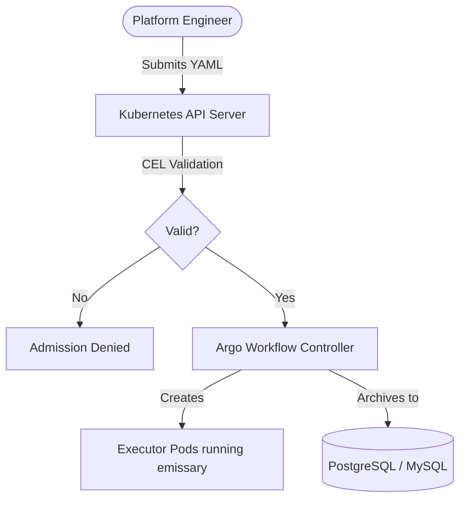
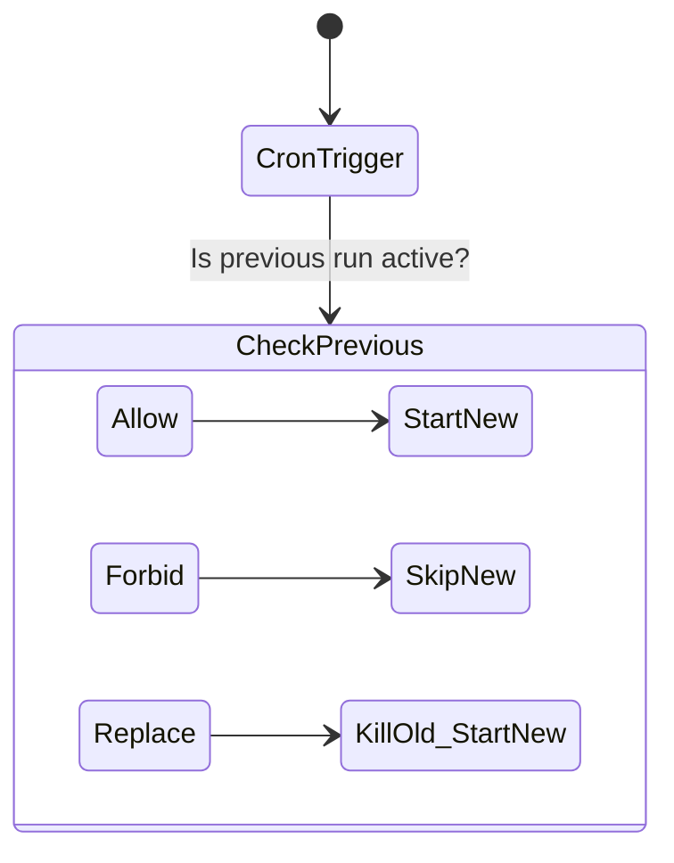
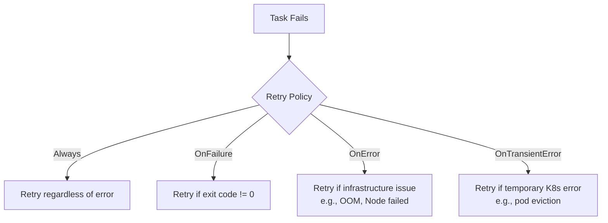

> **CAPA Track -- Domain 1 (36%)** | Complexity: `[COMPLEX]` | Time: 50-60 min

A global logistics firm experienced a silent nightmare. Their nightly supply chain reconciliation—a 14-step sequential process—began failing silently twice a week. The data pipeline lacked built-in observability, and the legacy orchestration scripts would just halt on transient network errors. Nobody knew the manifests hadn't processed until the morning standup, costing the company hundreds of thousands of dollars in delayed shipping schedules and manual recovery efforts.

After migrating to Argo Workflows, the entire paradigm shifted. They implemented exit handlers to push instant Slack alerts, leveraged CronWorkflows with IANA timezones for exact scheduling, and utilized memoization to bypass unchanged processing steps. With exponential backoff retry strategies handling transient Kubernetes errors automatically, the pipeline duration shrank from 3 hours to just 40 minutes. The operations team went from spending 12 hours a week manually babysitting batch jobs to virtually zero intervention.

## Prerequisites

- [Module 3.3: Argo Workflows](/platform/toolkits/cicd-delivery/ci-cd-pipelines/module-3.3-argo-workflows/) -- Container, Script, Steps, DAG, Artifacts
- Kubernetes RBAC basics (ServiceAccounts, Roles, RoleBindings)
- Basic understanding of Kubernetes Custom Resource Definitions (CRDs)

## What You'll Be Able to Do

After completing this module, you will be able to:

1. **Design** advanced Argo Workflows integrating all nine core and extended template types, including leveraging Resource templates for direct Kubernetes API interactions.
2. **Implement** resilient, self-healing pipelines by designing sophisticated retry strategies and comprehensive exit handlers.
3. **Evaluate** and select appropriate concurrency and synchronization limits using plural mutexes and semaphores backed by ConfigMaps or databases.
4. **Compare** and employ Python SDK alternatives to write infrastructure-as-code definitions for workflows dynamically.
5. **Diagnose** common workflow anti-patterns related to memoization limits, scheduling deprecations, and artifact garbage collection.

## Did You Know?

- **The v4.0.0 GA release dropped on February 4, 2026** — bringing massive breaking changes like the complete removal of the singular `schedule`, `mutex`, and `semaphore` fields in favor of strictly enforced plural arrays.
- **Argo Workflows now validates schemas via CEL** — starting in v4.0, Common Expression Language (CEL) validation is baked directly into the CRDs, catching logical errors at cluster admission time before they can crash your pipelines.
- **Memoization has a rigid 1MB limit per entry** — because it relies entirely on Kubernetes ConfigMaps under the hood, caching outputs larger than 1MB will silently fail or break your orchestration.
- **Pod logs are strictly bypassed during workflow archival** — while status states and execution results can be persisted to PostgreSQL (>=9.4) or MySQL (>=5.7.8), you must configure a separate logging pipeline to save actual container outputs.

## 1. The Argo Ecosystem and Architecture

Argo Workflows is a CNCF Graduated project implemented entirely as a Kubernetes Custom Resource Definition (CRD). It operates natively on Kubernetes, translating pipeline definitions directly into running Pods.

### Executor and Versions
Since version 3.4, Argo exclusively supports the `emissary` workflow executor. Older execution runtimes like `docker`, `pns`, `k8sapi`, and `kubelet` were removed to improve security and standardize the logging architecture. The project follows a strict lifecycle: the latest stable release is v4.0.4 (released April 2, 2026), and maintainers only test against the two most recent minor Kubernetes versions per release. Instead of publishing a single universal minimum Kubernetes version, backward compatibility largely dictates support. Minor Argo versions ship roughly every six months, maintaining release branches only for the two most recent minor series.

### Validation and Tooling
With v4.0, CEL-based CRD validation rules were introduced. This prevents malformed definitions from being persisted into the API server. To help engineers migrate legacy YAMLs, the `argo convert` CLI command automatically transforms v3.x manifests into the strictly compliant v4.0 syntax (such as migrating a singular `schedule` string to a `schedules` list).



## 2. Advanced Template Types

While basic containers and steps handle typical loads, Argo Workflows officially supports nine template types: `container`, `script`, `resource`, `dag`, `steps`, `suspend`, `http`, `plugin`, and `containerSet`.

### Resource Template
The `resource` template bypasses creating an explicit executor container. Instead, it tells the Argo controller to speak directly to the Kubernetes API to perform CRUD operations on other resources. This allows native querying via `successCondition` and `failureCondition` JSON paths.

```yaml
- name: create-configmap
  resource:
    action: create          # create | patch | apply | delete | get
    manifest: |
      apiVersion: v1
      kind: ConfigMap
      metadata:
        name: output-{{workflow.name}}
      data:
        result: "done"
    successCondition: "status.phase == Active"
    failureCondition: "status.phase == Failed"
```

### Suspend Template
If you need manual approval gates or specific delays in your pipeline, use a `suspend` template. 

```yaml
- name: approval-gate
  suspend:
    duration: "0"     # Wait indefinitely until resumed
- name: timed-pause
  suspend:
    duration: "30m"   # Auto-resume after 30 minutes
```

### HTTP and Plugin Templates
The `http` and `plugin` templates operate differently than everything else. They do not run as Pods scheduled by the main controller. Instead, they execute via the Argo Agent process, communicating asynchronously via a `WorkflowTaskSet` CRD.

```yaml
- name: call-webhook
  http:
    url: "http://localhost:8080/notify"
    method: POST
    headers:
      - name: Authorization
        valueFrom:
          secretKeyRef: {name: api-creds, key: token}
    body: '{"workflow": "{{workflow.name}}", "status": "{{workflow.status}}"}'
    successCondition: "response.statusCode >= 200 && response.statusCode < 300"
```

> **Pause and predict**: If the Argo Agent is severely resource-constrained, how might the execution of an `http` template differ from a standard `container` template?

### ContainerSet Template
A `containerSet` launches multiple containers simultaneously within a single Pod. Because they share the same network namespace and volume mounts, it is highly efficient for tight coupling. However, because they share a Pod lifecycle, they cannot utilize the enhanced boolean `depends` logic available to full DAGs. Resource requests are calculated as the sum of all containers in the set.

```yaml
- name: multi-container
  containerSet:
    volumeMounts:
      - name: workspace
        mountPath: /workspace
    containers:
      - name: clone
        image: alpine/git
        command: [sh, -c, "git clone https://github.com/argoproj/argo-workflows /workspace/repo"]
      - name: build
        image: golang:1.24
        command: [sh, -c, "cd /workspace/repo && go build ./..."]
        dependencies: [clone]
      - name: test
        image: golang:1.24
        command: [sh, -c, "cd /workspace/repo && go test ./..."]
        dependencies: [clone]
  volumes:
    - name: workspace
      emptyDir: {}
```

## 3. DAGs, Variables, and Logic Control

Directed Acyclic Graphs (DAGs) shine because of their flexibility. They unlock an advanced `depends` field that accepts boolean logic expressions like `A.Succeeded || B.Failed`. 

Furthermore, you can control the failure propagation. By default, DAGs have `failFast` set to `true`, preventing new tasks from scheduling if any single task errors out. Setting `failFast: false` lets all independent branches run to completion regardless of peer failures. Template-level `when` fields provide even more granular conditional step execution.

### Fan-out Variables
When dynamically looping over tasks, the property you use dictates the data structure:
- `withItems` accepts a standard inline YAML list.
- `withParam` accepts a JSON string, which is generally provided by the output of a preceding step.

### Parameter Scoping
Global workflow parameters set in `spec.arguments.parameters` are universally accessible throughout the entire run using the `{{workflow.parameters.<name>}}` syntax.

### Simple vs. Expression Tags
Argo supports simple string tags, but also expression tags running expr-lang logic.

```yaml
# Examples of Simple Tags
variables:
  - "{{workflow.name}}"
  - "{{workflow.status}}"
  - "{{inputs.parameters.my-param}}"
  - "{{tasks.task-a.outputs.result}}"
```

```yaml
# Examples of Expression Tags
expressions:
  - "{{=workflow.status == 'Succeeded' ? 'PASS' : 'FAIL'}}"
  - "{{=asInt(inputs.parameters.replicas) + 1}}"
  - "{{=sprig.upper(workflow.name)}}"
```

## 4. Scheduling execution: CronWorkflows

CronWorkflows operate as a unique CRD managing Workflow lifecycles over time. They are fundamentally separate from Kubernetes' native `CronJob` kinds.

With the release of v4.0, the singular `schedule` parameter was completely removed (having been deprecated since v3.6). You must now provide a `schedules` list. The `timezone` field is incredibly robust, accepting IANA timezone strings (like `America/New_York`) to accurately adjust for daylight saving offsets natively, overriding the host machine's local time.

```yaml
apiVersion: argoproj.io/v1alpha1
kind: CronWorkflow
metadata:
  name: nightly-etl
spec:
  schedules:
    - "0 2 * * *"
  timezone: "America/New_York"    # Default: local machine time
  startingDeadlineSeconds: 300    # Skip if missed by >5min
  concurrencyPolicy: Replace      # Kill previous if still running
  successfulJobsHistoryLimit: 3
  failedJobsHistoryLimit: 5
  workflowSpec:
    entrypoint: main
    templates:
      - name: main
        dag:
          tasks:
            - name: extract
              template: run-etl
            - name: load
              template: run-etl
              dependencies: [extract]
      - name: run-etl
        container:
          image: etl-runner:v3
          command: [python, run.py]
```

### Concurrency Strategies



> **Stop and think**: If a cluster outage lasts for 4 hours, missing three scheduled executions of a CronWorkflow, what happens when the cluster returns online? Does Argo backfill the jobs?

## 5. Architecture Resiliency: Retries and Exit Handlers

Transient failures destroy linear pipelines. You can combat this with explicit retry policies and exit handlers. 

### Retry Strategy Logic
The `retryStrategy` blocks allow defining conditions under which a failed container should trigger a restart. The `retryPolicy` field configures what qualifies as a recoverable failure, offering options like `OnFailure` (the default for container exit errors), `OnError` (underlying infrastructure issues like OOMKilled), and `OnTransientError`. Advanced workflows can use expression-based retry controls utilizing `lastRetry.exitCode` or `lastRetry.duration`.

The `backoff` dictates the delay: defining a `duration` (initial delay), an exponential `factor`, and an ultimate `maxDuration`.

```yaml
- name: call-api
  retryStrategy:
    limit: 5
    retryPolicy: OnError         
    backoff:
      duration: 10s              # Initial delay
      factor: 2                  # Multiplier per retry
      maxDuration: 5m            # Cap
    affinity:
      nodeAntiAffinity: {}       # Retry on different node
  container:
    image: curlimages/curl
    command: [curl, -f, "http://localhost:8080/process"]
```



### Exit Handlers
Exit handlers are triggered reliably at the end of the workflow, irrespective of success or failure. Configured via `spec.onExit`, the handler logic can route execution flows dynamically using the `{{workflow.status}}` variable (which yields `Succeeded`, `Failed`, or `Error`).

```yaml
spec:
  entrypoint: main
  onExit: exit-handler
  templates:
    - name: main
      container:
        image: alpine
        command: [sh, -c, "echo 'working'"]
    - name: exit-handler
      steps:
        - - name: success-notify
            template: notify
            when: "{{workflow.status}} == Succeeded"
          - name: failure-notify
            template: alert
            when: "{{workflow.status}} != Succeeded"
```

## 6. Lifecycle Hooks and Memoization

Sometimes you want logic to execute concurrently with state changes without altering the pipeline DAG.

### Lifecycle Hooks
Hooks let you trigger templates when a node moves into a `running` or `exit` state.

```yaml
- name: deploy
  hooks:
    running:
      template: log-start
    exit:
      template: log-completion
      expression: "steps['deploy'].status == 'Failed'"  # Conditional
  container:
    image: bitnami/kubectl:1.35
    command: [kubectl, apply, -f, /manifests/]
```

### Memoization
Memoization allows you to skip expensive steps if the inputs have not changed. The caching engine relies on ConfigMaps, strictly capping output payloads at 1MB per entry. Note that it specifically caches parameter outputs, NOT artifact volumes.

```yaml
- name: expensive-step
  memoize:
    key: "{{inputs.parameters.dataset}}-{{inputs.parameters.version}}"
    maxAge: "24h"
    cache:
      configMap:
        name: memo-cache
  inputs:
    parameters: [{name: dataset}, {name: version}]
  container:
    image: processor:v3.0
    command: [python, process.py]
  outputs:
    parameters:
      - name: result
        valueFrom:
          path: /tmp/result.json
```

## 7. Synchronization, Security, and Scalability

### Mutexes and Semaphores
To prevent concurrent runs of workflows that manipulate shared resources, Argo uses synchronization locks. In v4.0, the singular keys were replaced with plural `mutexes` and `semaphores` arrays. Argo supports local mutexes and ConfigMap-backed local semaphores. Furthermore, since late v3.x and stabilized in v4.0, database-backed multi-controller locks provide synchronization across highly available active-active clusters.

```yaml
# Mutex -- exclusive lock, one workflow at a time:
spec:
  synchronization:
    mutexes:
      - name: deploy-production
```

```yaml
# Semaphore -- N concurrent holders, backed by a ConfigMap (data: { gpu-jobs: "3" }):
spec:
  synchronization:
    semaphores:
      - configMapKeyRef:
          name: semaphore-config
          key: gpu-jobs
```

### Artifact Storage and GC
Workflows can stream artifacts to a massive array of providers: S3-compatible stores (AWS S3, MinIO), Azure Blob, HTTP stores, Artifactory, OSS, and (as of v4.0) streaming via Plugin artifact drivers. To prevent storage bloat, Artifact Garbage Collection (`artifactGC`), introduced in v3.4, cleans up objects asynchronously using `OnWorkflowDeletion` or `OnWorkflowCompletion` strategies.

### Security Dimensions
Argo Server provides three authentication modes: `client` (defaulting to the user's K8s bearer token), `server` (falling back to the server ServiceAccount), and `sso`. 

Controller metrics are exposed natively at `9090/metrics`, though the actual `Service` object must be deployed manually. Workflows themselves should enforce granular RBAC and drop privileges at the Pod spec level.

```yaml
spec:
  serviceAccountName: argo-deployer       # Workflow-level
  templates:
    - name: build-step
      serviceAccountName: argo-builder    # Template-level override
```

```yaml
- name: secure-step
  securityContext:
    runAsUser: 1000
    runAsNonRoot: true
  container:
    image: my-app:v3.0.0
    securityContext:
      allowPrivilegeEscalation: false
      readOnlyRootFilesystem: true
      capabilities:
        drop: [ALL]
```

### WorkflowTemplates
For code reuse, Argo provides `WorkflowTemplate` (namespaced) and `ClusterWorkflowTemplate` (cluster-scoped).

```yaml
apiVersion: argoproj.io/v1alpha1
kind: Workflow
metadata:
  generateName: ci-run-
spec:
  workflowTemplateRef:
    name: build-test-deploy       # WorkflowTemplate
  # clusterScope: true            # Add for ClusterWorkflowTemplate
  arguments:
    parameters:
      - name: image-tag
        value: ghcr.io/org/app:v3.0.0
```

```yaml
dag:
  tasks:
    - name: scan
      templateRef:
        name: org-standard-ci
        template: security-scan
        clusterScope: true
      arguments:
        parameters: [{name: image, value: "myapp:latest"}]
```

## Python SDKs
Maintaining YAML manually becomes tedious. Previously, the `argo-workflows` PyPI package acted as the official generator. However, due to systemic build issues, it was entirely removed in v4.0. The officially recommended replacement is **Hera**, a comprehensive SDK maintained by the community under the `argoproj-labs/hera` GitHub organization.

## Common Mistakes

| Mistake | Why It Hurts | Better Approach |
|---|---|---|
| **`Always` retry for logic errors** | Bad application code retries forever, burning cluster resources. | Use `OnError` for infrastructure faults, and `OnFailure` only for self-healing application bugs. |
| **Memoized outputs > 1MB** | ConfigMaps silently fail when limits are hit, breaking the execution DAG implicitly. | Keep memoized outputs strictly under the 1MB cap; rely on artifacts for large datasets. |
| **CronWorkflow without `startingDeadlineSeconds`** | Missed workflow runs vanish silently during an outage. | Always configure deadlines and monitor controller events for skipped schedules. |
| **Single SA for all workflows** | One compromised template grants full API access across your entire cluster namespace. | Institute strict least-privilege using per-workflow or per-template ServiceAccounts. |
| **Missing `clusterScope: true` in `templateRef`** | ClusterWorkflowTemplate references will fail to resolve inside namespaced workflows. | Always hardcode `clusterScope: true` when consuming cluster-wide templates. |
| **Exit handler uses artifacts** | If the parent workflow crashed prematurely, standard artifacts might not exist. | Pass exit data exclusively via parameter strings or external remote data stores. |
| **Mutex name collisions** | Unrelated workflows accidentally block each other because the mutex identifier overlaps. | Always namespace mutex string names syntactically: `team-a/deploy-prod`. |
| **Unquoted expression tags** | The Kubernetes YAML parser violently rejects unquoted `{{=...}}` objects. | Encapsulate expression blocks inside quotes: `value: "{{=expr}}"`. |

## Quiz

### Question 1: What is the primary difference between a Resource template and a generic Container template running a kubectl image?

<details><summary>Show Answer</summary>
Resource templates operate by communicating with the Kubernetes API server directly. There is no executor container scheduled and no image pull required. It natively supports `successCondition` and `failureCondition` for actively polling resource status phases. Container-based kubectl executions are much heavier but provide the full flexibility of shell scripting.
</details>

### Question 2: Write the CronWorkflow specification for triggering a pipeline at 3 AM UTC on weekdays, skipping the run if it is delayed by more than 10 minutes.

<details><summary>Show Answer</summary>

```yaml
spec:
  schedules:
    - "0 3 * * 1-5"
  timezone: "UTC"
  startingDeadlineSeconds: 600
  concurrencyPolicy: Forbid
```
Note the plural `schedules` field, ensuring compatibility with Argo v4.0+.
</details>

### Question 3: How does Argo's memoization feature function under the hood, and what is its primary technical constraint?

<details><summary>Show Answer</summary>
Memoization caches workflow output parameters inside a Kubernetes ConfigMap, mapped against a user-defined expression key. If a cache hit is verified (meaning the key exists and isn't expired), Argo skips task execution entirely and pulls the output directly. The primary limitation is the strict 1MB size limit per entry enforced by Kubernetes ConfigMaps.
</details>

### Question 4: Explain the functional difference between defining `{{workflow.name}}` versus `{{=workflow.name}}`.

<details><summary>Show Answer</summary>
The simple tag `{{workflow.name}}` resolves as a direct string substitution performed before task execution. The expression tag `{{=workflow.name}}` passes the string to the expr-lang evaluator. While they yield the same result for simple strings, the expression tag enables deep logic like conditional branching and arithmetic evaluation inline.
</details>

### Question 5: You need to ensure that a massive GPU training workflow only allows 4 concurrent instances globally. How do you implement this?

<details><summary>Show Answer</summary>
First, create a ConfigMap holding `data: { gpu: "4" }`. Then, inside the workflow, configure `spec.synchronization.semaphores` with a `configMapKeyRef` pointing to that resource. The fifth concurrent workflow will sit in a pending queue until one of the active four finishes and releases the semaphore lock.
</details>

### Question 6: What is the end result if a specified exit handler step fails during execution?

<details><summary>Show Answer</summary>
The overarching workflow's final status forcefully transitions to `Error`, potentially masking a successful pipeline outcome. Because of this, exit handlers must be designed robustly. You should keep logic minimal, utilize HTTP templates for rapid execution, and consider implementing targeted retries to prevent network blips from corrupting observability states.
</details>

### Question 7: A `WorkflowTemplate` is dramatically rewritten while an active workflow referencing it is running. Does the running workflow adopt the old or new logic?

<details><summary>Show Answer</summary>
The running workflow uses the **old version**. WorkflowTemplates are completely resolved and flattened at submission time. The full execution state is stored within the independent Workflow object, insulating active pipelines from sudden template mutations.
</details>

### Question 8: Define a YAML retry strategy that triggers 3 retries on any failure type, features a 30s exponential backoff capped at 5 minutes, and prevents retries from hitting the same node twice.

<details><summary>Show Answer</summary>

```yaml
retryStrategy:
  limit: 3
  retryPolicy: Always
  backoff: {duration: 30s, factor: 2, maxDuration: 5m}
  affinity:
    nodeAntiAffinity: {}
```
The execution sequence guarantees attempt 1 fires immediately, followed by retry sequences after 30s, 60s, and 120s, actively anti-affining against previous node assignments.
</details>

### Question 9: In an architecture design phase, how do you evaluate whether to use a `containerSet` over a standard `DAG` with disparate containers?

<details><summary>Show Answer</summary>
A `containerSet` launches all images into a single Pod, meaning they share a local filesystem and have practically zero scheduling overhead between steps. However, they are confined to a single node's resources and cannot utilize boolean DAG dependencies. A `DAG` schedules independent Pods, allowing for massive parallel scaling, specific resource limits per step, and individual retries, at the cost of relying on artifact storage for data transfer.
</details>

## Hands-On Exercise: Production-Ready Scheduled Pipeline

This exercise brings together CronWorkflows, synchronization semaphores, memoization, and conditional exit handlers.

### Step 1: Initialize the Environment

```bash
kind create cluster --name capa-lab
kubectl create namespace argo
kubectl apply -n argo -f https://github.com/argoproj/argo-workflows/releases/latest/download/install.yaml
kubectl -n argo wait --for=condition=ready pod -l app=workflow-controller --timeout=120s
```

### Step 2: Establish Synchronization and Caching Stores

```bash
kubectl apply -n argo -f - <<'EOF'
apiVersion: v1
kind: ConfigMap
metadata:
  name: deploy-semaphore
data:
  limit: "1"
---
apiVersion: v1
kind: ConfigMap
metadata:
  name: build-cache
data: {}
EOF
```

### Step 3: Implement the Pipeline Manifests

Deploy both the reusable template and the scheduled CronWorkflow utilizing a K8s List object to ensure seamless multi-document validation.

```yaml
apiVersion: v1
kind: List
items:
  - apiVersion: argoproj.io/v1alpha1
    kind: WorkflowTemplate
    metadata:
      name: build-step
      namespace: argo
    spec:
      templates:
        - name: build
          inputs:
            parameters: [{name: app-name}]
          memoize:
            key: "build-{{inputs.parameters.app-name}}"
            maxAge: "1h"
            cache:
              configMap: {name: build-cache}
          container:
            image: alpine
            command: [sh, -c]
            args: ["echo 'Building {{inputs.parameters.app-name}}' && sleep 3 && echo 'done' > /tmp/result.txt"]
          outputs:
            parameters:
              - name: build-id
                valueFrom: {path: /tmp/result.txt}
  - apiVersion: argoproj.io/v1alpha1
    kind: CronWorkflow
    metadata:
      name: scheduled-pipeline
      namespace: argo
    spec:
      schedules:
        - "*/5 * * * *"
      startingDeadlineSeconds: 120
      concurrencyPolicy: Forbid
      workflowSpec:
        entrypoint: main
        onExit: cleanup
        synchronization:
          semaphores:
            - configMapKeyRef: {name: deploy-semaphore, key: limit}
        templates:
          - name: main
            dag:
              tasks:
                - name: build-app
                  templateRef: {name: build-step, template: build}
                  arguments:
                    parameters: [{name: app-name, value: my-service}]
                - name: approval
                  template: pause
                  dependencies: [build-app]
                - name: deploy
                  template: deploy-step
                  dependencies: [approval]
          - name: pause
            suspend: {duration: "10s"}
          - name: deploy-step
            retryStrategy: {limit: 2, retryPolicy: OnError, backoff: {duration: 5s, factor: 2}}
            container:
              image: alpine
              command: [sh, -c, "echo 'Deploying...' && sleep 2 && echo 'Done'"]
          - name: cleanup
            container:
              image: alpine
              command: [sh, -c]
              args: ["echo 'Exit handler: {{workflow.name}} status={{workflow.status}}'"]
```

Save the block above to `pipeline.yaml`.

```bash
kubectl apply -n argo -f pipeline.yaml
# Manually trigger instead of waiting 5 min
argo submit -n argo --from cronwf/scheduled-pipeline --watch
# Run again to verify memoization (build step should be cached)
argo submit -n argo --from cronwf/scheduled-pipeline --watch
```

### Success Criteria

- [ ] CronWorkflow successfully spawns child workflow objects on the required schedule.
- [ ] Task effectively references external definitions using `templateRef`.
- [ ] Memoization system circumvents redundant build container execution during subsequent manual triggers.
- [ ] Suspend templates intercept execution, honoring timeout and manual resume signals.
- [ ] Exit handler captures deterministic terminal parameters via `{{workflow.status}}`.
- [ ] ConfigMap-backed semaphores guarantee that only 1 deployment thread executes concurrently.

### Cleanup

```bash
kind delete cluster --name capa-lab
```

## Key Takeaways

- [ ] Describe the nine distinct Argo template architectures and explicitly match use cases to functionality.
- [ ] Construct CronWorkflows relying on multiple IANA timezones and hard concurrency replacements.
- [ ] Design decoupled orchestration structures invoking WorkflowTemplates and ClusterWorkflowTemplates.
- [ ] Formulate reactive exit handlers driving Slack alerts based strictly on `workflow.status`.
- [ ] Enforce pipeline isolation utilizing plural arrays of mutexes and config-backed semaphores.
- [ ] Diagnose caching pipeline degradation by ensuring output payloads stay underneath ConfigMap 1MB limitations.
- [ ] Establish audit footprints via granular lifecycle hooks triggering across node initialization.
- [ ] Parse expression vs. simple variable tags specifically applying expr-lang bounds effectively.
- [ ] Tune retries targeting node anti-affinity mechanisms and exponential backoff intervals preventing localized crashes.
- [ ] Deploy locked-down execution contexts relying on read-only root filesystems and targeted workload identity boundaries.

---

*[Next up: Module 1.2: Extending Argo CD](/platform/toolkits/cicd-delivery/ci-cd-pipelines/module-1.2-extending-argo-cd/)*  
*"Advanced workflows are not about complexity for its own sake. They are about making failure visible, recovery automatic, and operations completely predictable."*