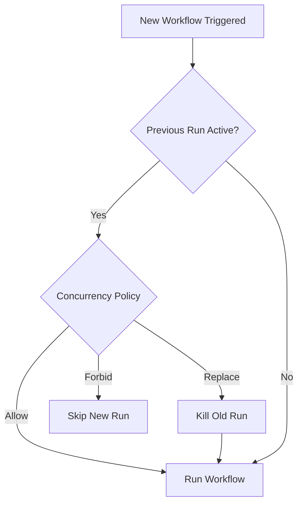
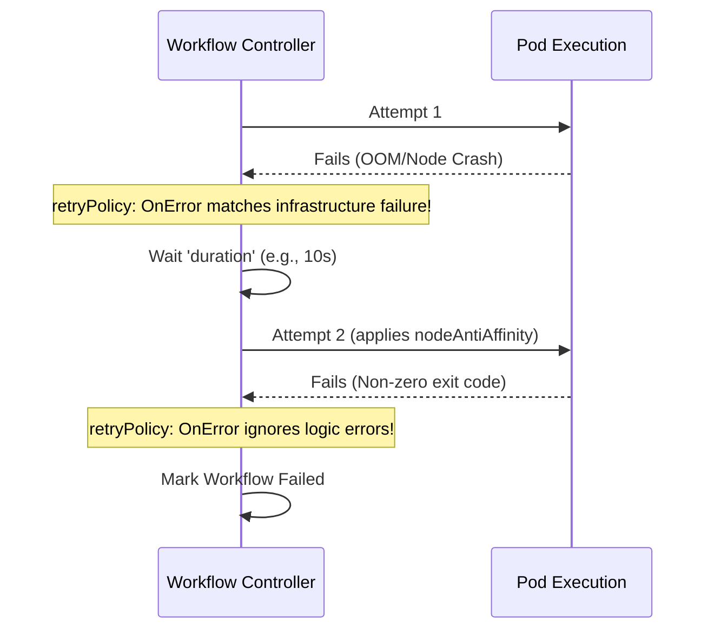
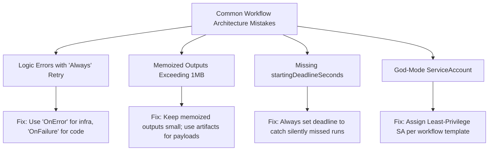

> **CAPA Track -- Domain 1 (36%)** | Complexity: `[COMPLEX]` | Time: 50-60 min

The platform engineering team at LedgerStream Finance faced a critical production challenge. Their nightly reconciliation workflow executed 14 data-processing steps sequentially, routinely taking three hours to complete. Worse, it failed silently twice a week. Nobody realized a step had timed out until morning standup, which led to delayed reporting and cascading financial discrepancies for their users. The financial impact was severe, costing them thousands of dollars per hour in SLA penalties when data was not reconciled by the market opening.

After migrating to Argo Workflows, the team revolutionized their pipeline architecture. By implementing exit handlers to trigger immediate incident alerts, CronWorkflows for native Kubernetes scheduling, memoization to bypass unchanged processing steps, and lifecycle hooks for unalterable audit logging, their three-hour pipeline shrank to just 40 minutes. Because of automated retry strategies, transient infrastructure errors healed themselves without human intervention. The team went from dedicating an entire engineer's week to pipeline babysitting down to zero hours of operational toil.

## Prerequisites

- [Module 3.3: Argo Workflows](/platform/toolkits/cicd-delivery/ci-cd-pipelines/module-3.3-argo-workflows/) -- Container, Script, Steps, DAG, Artifacts
- Kubernetes RBAC basics (ServiceAccounts, Roles, RoleBindings)
- Basic understanding of Kubernetes CronJob scheduling syntax

## What You'll Be Able to Do

After completing this module, you will be able to:

1. **Design** advanced Argo Workflows utilizing all nine available template types, choosing the correct execution model based on resource overhead and dependency complexity.
2. **Implement** scheduled CronWorkflows, synchronization locks, and memoization caches to construct concurrency-safe, highly efficient enterprise pipelines.
3. **Diagnose** pipeline execution paths using lifecycle hooks, expression-based condition evaluation, and robust retry strategies that guarantee self-healing execution.
4. **Evaluate** workflow security postures by applying least-privilege ServiceAccounts, validating execution parameters, and isolating artifact boundaries.

## Why This Module Matters

The CAPA exam dedicates 36% of its content to Domain 1, which requires an exhaustive, expert-level comprehension of Argo Workflows. While Module 3.3 established the baseline paradigms, this module explores the advanced orchestration mechanics required for production resilience. You will master the remaining template types, scheduled execution, reusable workflow constructs, exit handlers, synchronization primitives, memoization, lifecycle hooks, and robust retry strategies.

## Did You Know?

- **The latest stable release of Argo Workflows is v4.0.4, released on 2026-04-02.** This builds upon the massive v4.0.0 GA release from 2026-02-04, which fundamentally improved the controller engine.
- **Argo Workflows tests exactly two minor Kubernetes versions per release.** They do not publish a single universal minimum version; instead, they maintain release branches for only the two most recent minor versions and ship a new minor release approximately every 6 months.
- **Memoization has a strict 1MB limit per entry.** Because it relies on Kubernetes ConfigMap values for state storage, exceeding the 1MB cap causes your workflow to fail cryptically. Always use artifact storage for large payloads.
- **The v4.0 release introduced CEL-based CRD validation rules.** Enforced directly at cluster admission time, this prevents syntactically invalid workflows from ever entering the controller queue.

## The Core Engine Evolution

Argo Workflows is an open-source, container-native workflow engine implemented natively as a Kubernetes CRD (Custom Resource Definition). It is proudly a CNCF Graduated project, having earned that status by demonstrating massive adoption and rigorous security governance. 

Since version 3.4, the controller architecture was simplified: the only supported workflow executor is `emissary`. Older executors like docker, pns, k8sapi, and kubelet were explicitly removed.

## The Nine Template Types

Argo Workflows supports a comprehensive matrix of nine distinct template types: `container`, `script`, `resource`, `dag`, `steps`, `suspend`, `http`, `plugin`, and `containerSet`. We previously covered the fundamental types; let's explore the advanced ones.

### Resource Template

The Resource template performs CRUD actions directly on Kubernetes resources without requiring you to spin up a heavy container with `kubectl` installed. It interacts natively via the API server.

```yaml
- name: create-configmap
  resource:
    action: create          # create | patch | apply | delete | get
    manifest: |
      apiVersion: v1
      kind: ConfigMap
      metadata:
        name: "output-{{workflow.name}}"
      data:
        result: "done"
    successCondition: "status.phase == Active"
    failureCondition: "status.phase == Failed"
```

The `successCondition` and `failureCondition` fields use jsonpath formatting, allowing your workflow to natively wait for external jobs or CRDs to report a specific status before proceeding.

### Suspend Template

The Suspend template pauses execution until manually resumed or a duration elapses. This is how you build approval gates for manual deployments.

```yaml
- name: approval-gate
  suspend:
    duration: "0"     # Wait indefinitely until resumed
- name: timed-pause
  suspend:
    duration: "30m"   # Auto-resume after 30 minutes
```

To resume an indefinite suspension from the CLI, you run: `argo resume my-workflow -n argo`.

### HTTP and Plugin Templates

The HTTP and Plugin templates are highly efficient because they execute via the lightweight Argo Agent process, rather than spinning up dedicated pods. The Argo Agent communicates with the workflow controller through a `WorkflowTaskSet` CRD.

```yaml
- name: call-webhook
  http:
    url: "http://internal-webhook.svc.cluster.local:8080/notify"
    method: POST
    headers:
      - name: Authorization
        valueFrom:
          secretKeyRef: {name: api-creds, key: token}
    body: '{"workflow": "{{workflow.name}}", "status": "{{workflow.status}}"}'
    successCondition: "response.statusCode >= 200 && response.statusCode < 300"
```

For artifact management, note that artifact streaming for Plugin artifact drivers was officially added in v4.0, bridging the capability gap with native storage backends.

### ContainerSet Template

A ContainerSet template runs multiple containers inside a single Pod. This is excellent when you need steps to share a local filesystem without the overhead of external artifact storage.

```yaml
- name: multi-container
  containerSet:
    volumeMounts:
      - name: workspace
        mountPath: /workspace
    containers:
      - name: clone
        image: bitnami/git:latest
        command: [sh, -c, "git clone https://github.com/argoproj/argo-workflows.git /workspace/repo"]
      - name: build
        image: golang:1.35
        command: [sh, -c, "cd /workspace/repo && go build ./..."]
        dependencies: [clone]
      - name: test
        image: golang:1.35
        command: [sh, -c, "cd /workspace/repo && go test ./..."]
        dependencies: [clone]
  volumes:
    - name: workspace
      emptyDir: {}
```

A crucial limitation of ContainerSet: while it offers DAG-style dependency management between containers, it *cannot* use enhanced `depends` boolean logic. All resource requests are also aggregated as the sum of all containers simultaneously.

> **Stop and think**: If you have three steps that need to pass a 5GB compiled binary between them, should you use a DAG with S3 artifacts or a ContainerSet? Since ContainerSets share an `emptyDir` volume, they avoid the massive network overhead of pushing and pulling 5GB of data.

## Advanced DAGs, Conditionals, and Loops

DAGs (Directed Acyclic Graphs) remain the most powerful way to orchestrate parallel tasks. 

### Enhanced Dependencies and FailFast

DAG tasks support a `depends` field for enhanced dependency logic, allowing complex boolean expressions (e.g., `A.Succeeded || B.Failed`). This enables advanced branching logic without deeply nested condition trees.

By default, DAG templates fail fast. The `failFast` field defaults to `true`, meaning if one task fails, no new tasks are scheduled. When set to `false`, all parallel branches run to completion regardless of independent failures in sister branches.

### Conditionals and Loops

The template-level `when` field enables conditional step execution using expression-based conditions.

For executing dynamic lists, `withItems` accepts a standard YAML list for looping, whereas `withParam` accepts a JSON string (typically generated dynamically from a prior step's output). Remember that `withItems` fans out both the task and its dependencies, while `withParam` fans out only the current task.

## Reusability: WorkflowTemplates and SDKs

Code reuse is enforced through template scoping. A `WorkflowTemplate` is namespace-scoped. Conversely, a `ClusterWorkflowTemplate` is cluster-scoped and accessible across all namespaces in your cluster.

Reference an entire template as your entrypoint:

```yaml
apiVersion: argoproj.io/v1alpha1
kind: Workflow
metadata:
  generateName: ci-run-
spec:
  workflowTemplateRef:
    name: build-test-deploy       # WorkflowTemplate
  # clusterScope: true            # Add for ClusterWorkflowTemplate
  arguments:
    parameters:
      - name: image-tag
        value: ghcr.io/org/app:v3.5.0
```

Reference individual templates dynamically within a DAG:

```yaml
dag:
  tasks:
    - name: scan
      templateRef:
        name: org-standard-ci
        template: security-scan
        clusterScope: true
      arguments:
        parameters: [{name: image, value: "myapp:latest"}]
```

Global workflow parameters defined in `spec.arguments.parameters` are universally accessible throughout the entire workflow execution context via the `{{workflow.parameters.<name>}}` variable.

If you generate workflows programmatically, note that the official `argo-workflows` Python SDK (PyPI package) was removed entirely in v4.0. The officially recommended replacement is **Hera**, which is maintained by the community under the `argoproj-labs` GitHub organization (not directly under the main `argoproj` umbrella).

For teams upgrading from older versions, v4.0 added a CLI `argo convert` command that safely upgrades Workflow, WorkflowTemplate, ClusterWorkflowTemplate, and CronWorkflow manifests to the strict v4.0 syntax.

## Scheduling with CronWorkflows

CronWorkflows operate via their own CRD and instantiate new Workflow objects on a defined schedule.

In v4.0, the singular `schedule` field was officially removed. The replacement `schedules` field is a required non-empty list. Additionally, the `timezone` field accepts any standard IANA timezone string and defaults to the machine's local time, adjusting seamlessly for daylight saving transitions.

```yaml
apiVersion: argoproj.io/v1alpha1
kind: CronWorkflow
metadata:
  name: nightly-etl
spec:
  schedules:
    - "0 2 * * *"                 # 2 AM daily
  timezone: "America/New_York"    # Default: UTC
  startingDeadlineSeconds: 300    # Skip if missed by >5min
  concurrencyPolicy: Replace      # Kill previous if still running
  successfulJobsHistoryLimit: 3
  failedJobsHistoryLimit: 5
  workflowSpec:
    entrypoint: main
    templates:
      - name: main
        dag:
          tasks:
            - name: extract
              template: run-etl
            - name: load
              template: run-etl
              dependencies: [extract]
      - name: run-etl
        container:
          image: etl-runner:v3.5.0
          command: [python, run.py]
```

The concurrency policy dictates overlapping schedule behavior:



| Concurrency Policy | Behavior |
|---|---|
| `Allow` | Multiple concurrent runs permitted |
| `Forbid` | Skip new run if previous still active |
| `Replace` | Kill running workflow, start new one |

## Exit Handlers and Retry Strategies

### Exit Handlers

Exit handlers run at workflow end regardless of outcome. Specified via `spec.onExit` (globally) or template-level `onExit`, they are the backbone of alerting and cleanup.

```yaml
spec:
  entrypoint: main
  onExit: exit-handler
  templates:
    - name: main
      container:
        image: alpine:latest
        command: [sh, -c, "echo 'working'"]
    - name: exit-handler
      steps:
        - - name: success-notify
            template: notify
            when: "{{workflow.status}} == Succeeded"
          - name: failure-notify
            template: alert
            when: "{{workflow.status}} != Succeeded"
```

Inside an exit handler, the `{{workflow.status}}` variable yields strictly one of three values: `Succeeded`, `Failed`, or `Error`.

### Retry Strategies

Transient infrastructure errors are inevitable. A robust `retryStrategy` prevents pipeline failure over minor network blips.

```yaml
- name: call-api
  retryStrategy:
    limit: 5
    retryPolicy: OnError         # See table
    backoff:
      duration: 10s              # Initial delay
      factor: 2                  # Multiplier per retry
      maxDuration: 5m            # Cap
    affinity:
      nodeAntiAffinity: {}       # Retry on different node
  container:
    image: curlimages/curl:latest
    command: [curl, -f, "http://internal-processor.svc.cluster.local:8080/process"]
```

The `retryStrategy` backoff mechanism is configured strictly via the `duration` (initial delay), `factor` (exponential multiplier), and `maxDuration` (absolute wait cap) fields. Advanced workflows can further leverage expression-based retry control using variables like `lastRetry.exitCode` and `lastRetry.duration`.



| Policy | Retries on... |
|---|---|
| `Always` | Any failure (non-zero exit, OOM, node failure) |
| `OnFailure` | Non-zero exit code only |
| `OnError` | System errors (OOM, node failure), NOT non-zero exit |
| `OnTransientError` | Transient K8s errors only (pod eviction) |

## Synchronization and Memoization

Concurrency controls prevent race conditions and system overloads. Synchronization supports local mutexes and semaphores (which are ConfigMap-backed). As of late v3.x and stabilized in v4.0, database-backed multi-controller locks are also fully supported.

In v4.0, the singular `mutex` and `semaphore` fields in manifests were entirely removed in favor of plural lists: `mutexes` and `semaphores`.

### Mutex -- exclusive lock, one workflow at a time:

```yaml
spec:
  synchronization:
    mutexes:
      - name: deploy-production
```

### Semaphore -- N concurrent holders, backed by a ConfigMap:

```yaml
# ConfigMap: data: { gpu-jobs: "3" }
spec:
  synchronization:
    semaphores:
      - configMapKeyRef:
          name: semaphore-config
          key: gpu-jobs
```

### Memoization

Memoization caches step outputs based on a unique key, drastically reducing compute time for idempotent tasks.

```yaml
- name: expensive-step
  memoize:
    key: "{{inputs.parameters.dataset}}-{{inputs.parameters.version}}"
    maxAge: "24h"
    cache:
      configMap:
        name: memo-cache
  inputs:
    parameters: [{name: dataset}, {name: version}]
  container:
    image: processor:v3.5.0
    command: [python, process.py]
  outputs:
    parameters:
      - name: result
        valueFrom:
          path: /tmp/result.json
```

If the inputs match an existing cache entry, the workflow injects the cached output parameters and bypasses the container entirely.

> **Pause and predict**: Will memoization cache the 5GB dataset you generated in the container? No. It only caches output parameters up to 1MB. Artifacts themselves are not memoized.

## Artifacts, Garbage Collection, and Archival

Argo Workflows provides deep integration for artifact storage across S3-compatible stores (AWS S3, GCS, MinIO), Azure Blob, Artifactory, HTTP, and OSS. 

To prevent storage bloat, Artifact Garbage Collection (`artifactGC`) supports both `OnWorkflowDeletion` and `OnWorkflowCompletion` strategies, securely pruning remote files when workflows end.

For audit compliance, Workflow archival persists the completed state of workflows natively to an external database like PostgreSQL (>=9.4) or MySQL (>=5.7.8). Be aware that while the structural state is archived, pod logs are explicitly NOT archived by this process—you must rely on a central logging aggregator for historical logs.

## Security, Contexts, Metrics, Hooks, and Variables

### Lifecycle Hooks

Hooks execute discrete actions when a template starts or finishes, independently of the primary business logic.

```yaml
- name: deploy
  hooks:
    running:
      template: log-start
    exit:
      template: log-completion
      expression: "steps['deploy'].status == 'Failed'"  # Conditional
  container:
    image: bitnami/kubectl:latest
    command: [kubectl, apply, -f, /manifests/]
```

Triggers include `running` (the node starts execution) and `exit` (the node finishes regardless of outcome).

### Variables: Simple Tags vs Expression Tags

Ensure you use valid YAML quoting when employing variables.

```yaml
# Simple tags
name: "{{workflow.name}}"
status: "{{workflow.status}}"
param: "{{inputs.parameters.my-param}}"
result: "{{tasks.task-a.outputs.result}}"
```

Expression tags execute inline mathematical and string logic:

```yaml
# Expression tags
condition: "{{=workflow.status == 'Succeeded' ? 'PASS' : 'FAIL'}}"
replicas: "{{=asInt(inputs.parameters.replicas) + 1}}"
uppercase: "{{=sprig.upper(workflow.name)}}"
```

### Metrics and Security

The Argo Server operates with flexible security via three distinct auth modes: `client` (default since v3.0, mapping strictly to the user's RBAC), `server`, and `sso`.

For observability, Argo Workflows controller metrics are exposed dynamically at port `9090/metrics` by default. However, the Service and ServiceMonitor objects are not installed as part of the default installation; operators must explicitly deploy them to enable Prometheus scraping.

Always scope ServiceAccounts to the absolute minimum necessary privileges.

```yaml
spec:
  serviceAccountName: argo-deployer       # Workflow-level
  templates:
    - name: build-step
      serviceAccountName: argo-builder    # Template-level override
```

Enforce strict Pod security contexts to eliminate privilege escalation vectors:

```yaml
- name: secure-step
  securityContext:
    runAsUser: 1000
    runAsNonRoot: true
  container:
    image: my-app:v3.5.0
    securityContext:
      allowPrivilegeEscalation: false
      readOnlyRootFilesystem: true
      capabilities:
        drop: [ALL]
```

## Common Mistakes



| Mistake | Why It Hurts | Better Approach |
|---|---|---|
| `Always` retry for logic errors | Bad code retries forever | `OnError` for infra, `OnFailure` for self-healing bugs |
| Memoized outputs > 1MB | ConfigMap silently fails | Keep memoized outputs small; artifacts for large data |
| CronWorkflow without `startingDeadlineSeconds` | Missed runs vanish silently | Set deadline, monitor for skips |
| Single SA for all workflows | One compromise = full access | Least-privilege SA per workflow |
| Missing `clusterScope: true` in templateRef | ClusterWorkflowTemplate ref fails | Always set when referencing cluster-scoped |
| Exit handler uses artifacts | Artifacts may not be available | Pass data via parameters or external store |
| Mutex name collisions across teams | Unrelated workflows block each other | Namespace mutex names: `team-a/deploy-prod` |
| Unquoted expression tags | YAML parser breaks on `{{=...}}` | Always quote: `"{{=expr}}"` |

## Quiz

### Question 1: What is the primary operational difference between a Resource template and a standard Container template running kubectl?

<details><summary>Show Answer</summary>
Resource templates operate through the API server directly -- no container, no image pull, supports `successCondition`/`failureCondition` for watching status. Container+kubectl is heavier but allows shell scripting. Use Resource for simple CRUD, Container for complex logic.
</details>

### Question 2: Write the CronWorkflow spec for 3 AM UTC weekdays, skip if missed by >10 min, and strictly prevent concurrent overlap.

<details><summary>Show Answer</summary>

```yaml
spec:
  schedules:
    - "0 3 * * 1-5"
  timezone: "UTC"
  startingDeadlineSeconds: 600
  concurrencyPolicy: Forbid
```
</details>

### Question 3: How does memoization work under the hood, and what is its most critical hard limitation?

<details><summary>Show Answer</summary>
Caches output parameters in a ConfigMap keyed by a user-defined key. On cache hit (matching key, not expired), returns cached output without executing. Key limitation: **1MB per entry** (ConfigMap value cap). Only output parameters are cached, not artifacts.
</details>

### Question 4: Explain the functional difference between `{{workflow.name}}` and `{{=workflow.name}}`.

<details><summary>Show Answer</summary>
`{{workflow.name}}` is simple string substitution. `{{=workflow.name}}` evaluates an expr-lang expression -- identical for simple refs, but expression tags enable logic: `"{{=workflow.status == 'Succeeded' ? 'PASS' : 'FAIL'}}"`.
</details>

### Question 5: You need to strictly limit your GPU training workflows so that only 4 concurrent executions are permitted across the cluster. How do you achieve this?

<details><summary>Show Answer</summary>
Create ConfigMap with `data: { gpu: "4" }`, then use `spec.synchronization.semaphores` with a `configMapKeyRef` pointing to that key. Fifth workflow queues until one completes. ConfigMap value can be changed at runtime.
</details>

### Question 6: What happens to the final pipeline state when a globally defined exit handler fails?

<details><summary>Show Answer</summary>
The workflow's final status becomes `Error`. Design robust exit handlers: add retries, use HTTP templates for speed, keep logic minimal. For critical notifications, use a fallback (dead-letter queue or persistent store).
</details>

### Question 7: A namespace-scoped WorkflowTemplate is modified and redeployed ten minutes after a long-running workflow has already started referencing it. Does the in-flight workflow use the old or new version of the template?

<details><summary>Show Answer</summary>
**Old version.** Templates are resolved at submission time and stored in the Workflow object. Updates do not affect in-flight workflows.
</details>

### Question 8: Design a retry strategy that allows a maximum of 3 retries for any failure condition, applies a 30-second exponential backoff capped at 5 minutes, and guarantees execution on different cluster nodes upon retry.

<details><summary>Show Answer</summary>

```yaml
retryStrategy:
  limit: 3
  retryPolicy: Always
  backoff: {duration: 30s, factor: 2, maxDuration: 5m}
  affinity:
    nodeAntiAffinity: {}
```

Sequence: attempt 1 immediate, retry after 30s/60s/120s on different nodes each time.
</details>

### Question 9: Compare the architectural use cases of a ContainerSet template versus a traditional DAG chaining individual Containers.

<details><summary>Show Answer</summary>
**ContainerSet**: shared filesystem, tightly coupled steps, minimize scheduling overhead, fits on one node. **DAG**: independent steps, different resource needs, artifact passing via S3, independent retry/timeout per step, exceeds single-node capacity.
</details>

## Hands-On Exercise: Production-Ready Scheduled Pipeline

We will deploy a resilient, memoized, concurrency-controlled CronWorkflow locally.

### Setup

```bash
kind create cluster --name capa-lab
kubectl create namespace argo
kubectl apply -n argo -f https://github.com/argoproj/argo-workflows/releases/latest/download/install.yaml
kubectl -n argo wait --for=condition=ready pod -l app=workflow-controller --timeout=120s
```

### Step 1: Create supporting ConfigMaps

```bash
kubectl apply -n argo -f - <<'EOF'
apiVersion: v1
kind: ConfigMap
metadata:
  name: deploy-semaphore
data:
  limit: "1"
---
apiVersion: v1
kind: ConfigMap
metadata:
  name: build-cache
data: {}
EOF
```

### Step 2: Create WorkflowTemplate and CronWorkflow

Apply the v4.0 syntax to ensure valid schemas.

```yaml
# Save as pipeline.yaml
apiVersion: argoproj.io/v1alpha1
kind: WorkflowTemplate
metadata:
  name: build-step
  namespace: argo
spec:
  templates:
    - name: build
      inputs:
        parameters: [{name: app-name}]
      memoize:
        key: "build-{{inputs.parameters.app-name}}"
        maxAge: "1h"
        cache:
          configMap: {name: build-cache}
      container:
        image: alpine:latest
        command: [sh, -c]
        args: ["echo 'Building {{inputs.parameters.app-name}}' && sleep 3 && echo 'done' > /tmp/result.txt"]
      outputs:
        parameters:
          - name: build-id
            valueFrom: {path: /tmp/result.txt}
---
apiVersion: argoproj.io/v1alpha1
kind: CronWorkflow
metadata:
  name: scheduled-pipeline
  namespace: argo
spec:
  schedules:
    - "*/5 * * * *"
  startingDeadlineSeconds: 120
  concurrencyPolicy: Forbid
  workflowSpec:
    entrypoint: main
    onExit: cleanup
    synchronization:
      semaphores:
        - configMapKeyRef: {name: deploy-semaphore, key: limit}
    templates:
      - name: main
        dag:
          tasks:
            - name: build-app
              templateRef: {name: build-step, template: build}
              arguments:
                parameters: [{name: app-name, value: my-service}]
            - name: approval
              template: pause
              dependencies: [build-app]
            - name: deploy
              template: deploy-step
              dependencies: [approval]
      - name: pause
        suspend: {duration: "10s"}
      - name: deploy-step
        retryStrategy: {limit: 2, retryPolicy: OnError, backoff: {duration: 5s, factor: 2}}
        container:
          image: alpine:latest
          command: [sh, -c, "echo 'Deploying...' && sleep 2 && echo 'Done'"]
      - name: cleanup
        container:
          image: alpine:latest
          command: [sh, -c]
          args: ["echo 'Exit handler: {{workflow.name}} status={{workflow.status}}'"]
```

```bash
kubectl apply -n argo -f pipeline.yaml
# Manually trigger instead of waiting 5 min
argo submit -n argo --from cronwf/scheduled-pipeline --watch
# Run again to verify memoization (build step should be cached)
argo submit -n argo --from cronwf/scheduled-pipeline --watch
```

### Success Criteria

- [ ] CronWorkflow leverages the `schedules` array format.
- [ ] WorkflowTemplate correctly referenced via `templateRef`.
- [ ] Memoization successfully bypasses the build execution on the second trigger.
- [ ] Suspend template natively pauses and auto-resumes pipeline progress.
- [ ] Exit handler captures and reports the final workflow status accurately.
- [ ] Semaphore config strictly prevents concurrent pipeline overlaps.

### Cleanup

```bash
kind delete cluster --name capa-lab
```

## Key Takeaways

- [ ] Identify and differentiate the architecture of all nine template types.
- [ ] Construct CronWorkflows equipped with explicit timezones, missed deadline thresholds, and safe concurrency policies.
- [ ] Extract overlapping workflow segments into namespace and cluster-scoped templates.
- [ ] Embed deterministic exit handlers designed to evaluate the definitive `{{workflow.status}}`.
- [ ] Implement array-based mutexes and semaphores to coordinate locking across distributed execution queues.
- [ ] Limit pipeline degradation by caching data within the ConfigMap 1MB threshold.
- [ ] Instrument workflows with lifecycle hooks for irrefutable execution tracking.
- [ ] Architect advanced retry networks utilizing multi-variable backoff sequences and node anti-affinity routing.
- [ ] Defend your cluster by asserting specific Pod security controls and tightly bounded service accounts per task.

---

*"Advanced workflows are not about complexity for its own sake. They are about making failure visible, recovery automatic, and operations fundamentally predictable."*