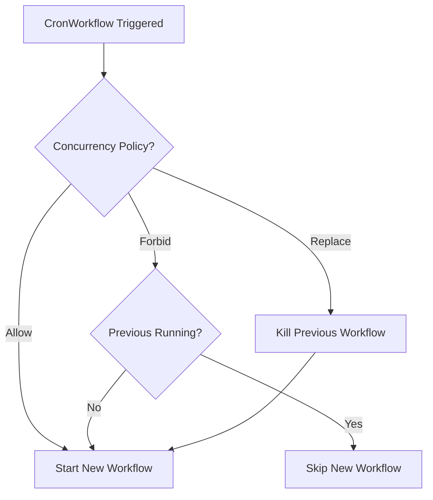
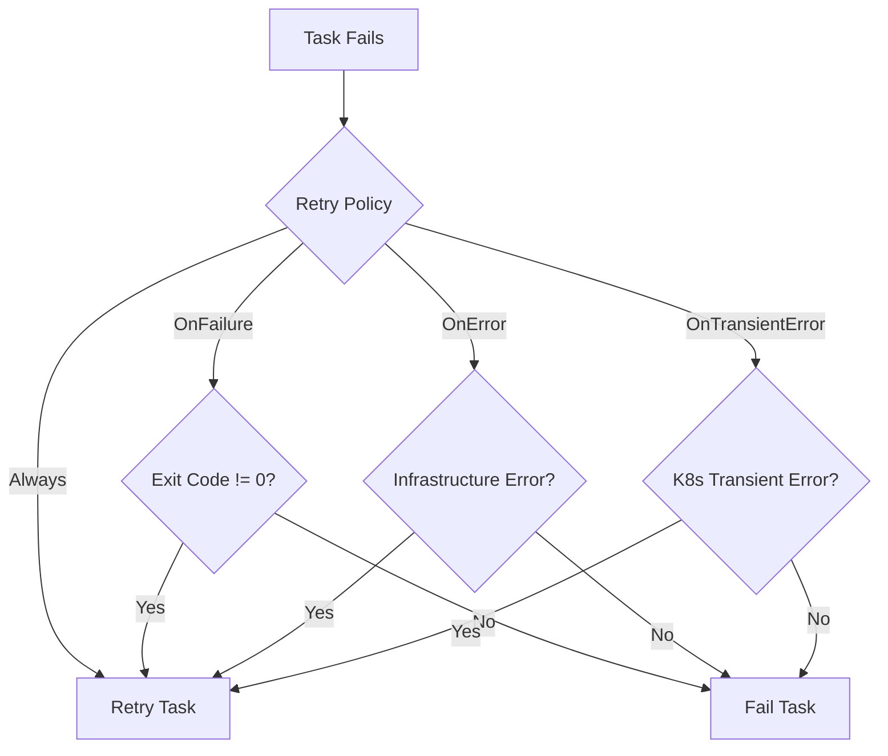
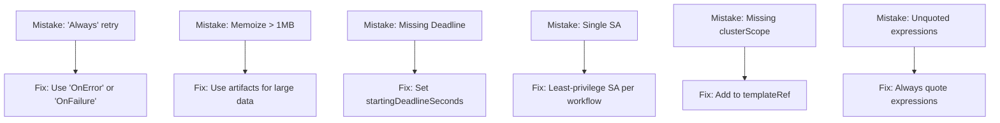

> **CAPA Track -- Domain 1 (36%)** | Complexity: `[COMPLEX]` | Time: 50-60 min

The platform team at FinCorp Global faced a catastrophic failure. Their nightly reconciliation workflow, processing $4.5 million in daily settlements, ran 14 manual steps sequentially via legacy bash scripts. One night, a temporary API rate limit caused step 8 to fail silently. The script continued, processing corrupted data downstream. This blind spot cost the company $280,000 in SLA penalties and required 72 hours of exhaustive manual database rollbacks to correct the ledger.

They needed a modern, declarative orchestration system. They migrated to Argo Workflows, leveraging advanced features like DAG dependency logic to parallelize independent tasks, `OnError` retry strategies with exponential backoff to handle network rate limits seamlessly, and exit handlers to immediately page the on-call engineer via Slack if the pipeline state became degraded. 

By utilizing these advanced patterns, the pipeline execution time shrank from 3 hours to just 40 minutes. Memoization bypassed unchanged datasets to save compute resources, and database-backed semaphores ensured no two geographic regions reconciled the same ledger concurrently. The team went from dedicating 12 hours a week to pipeline babysitting to running fully automated, self-healing operations.

## Prerequisites

- [Module 3.3: Argo Workflows](/platform/toolkits/cicd-delivery/ci-cd-pipelines/module-3.3-argo-workflows/) -- Container, Script, Steps, DAG, Artifacts
- Kubernetes RBAC basics (ServiceAccounts, Roles)
- CronJob scheduling syntax

## What You'll Be Able to Do

After completing this module, you will be able to:

1. **Construct** advanced Argo Workflows using all 9 template types, including Resource templates for direct Kubernetes object manipulation.
2. **Design** CronWorkflows, memoization strategies, and synchronization locks to build scheduled, efficient, and concurrency-safe pipelines.
3. **Implement** exit handlers, lifecycle hooks, and retry strategies that make workflows self-healing and auditable.
4. **Evaluate** workflow security best practices, including scoped ServiceAccounts, artifact repository configuration, and RBAC for workflow submission.

## Why This Module Matters

The CAPA exam dedicates 36% to Domain 1, covering Argo Workflows in extensive depth. Module 3.3 taught the fundamentals. This module covers the advanced concepts: the remaining template types, scheduled workflows, reusable templates, exit handlers, synchronization, memoization, lifecycle hooks, expression variables, robust retry strategies, and security.

## Did You Know?

- **Argo Workflows v4.0.0 was released on February 4, 2026** (latest stable v4.0.4 released 2026-04-02), bringing strict CEL-based CRD validation enforced directly at cluster admission time.
- **Argo supports exactly 9 template types** -- while most teams only use container, script, and dag, the system also supports resource, steps, suspend, http, plugin, and containerSet templates.
- **The official Python SDK was replaced** -- the `argo-workflows` PyPI package was removed in v4.0. Hera (maintained under the `argoproj-labs` GitHub organization) is now the officially recommended SDK.
- **Pod logs are permanently lost by default** -- while Workflow archival persists completed state to PostgreSQL (>=9.4) or MySQL (>=5.7.8), it explicitly does NOT archive pod logs, requiring a separate logging solution.

## 1. The Argo Ecosystem and v4.0 Evolution

Argo Workflows is an open-source container-native workflow engine implemented as a Kubernetes CRD, meaning it runs natively on your cluster without requiring external databases for active state. It is a CNCF Graduated project (accepted into graduation on December 6, 2022). 

Argo maintains release branches for only the two most recent minor versions, shipping a new minor version approximately every 6 months. It tests against two minor Kubernetes versions per release, but does not publish a single universal minimum Kubernetes version requirement. 

### Key v4.0 Changes

The v4.0 release brought significant breaking changes to modernize the platform:
- The singular `schedule` field in CronWorkflows was removed in favor of the `schedules` list.
- The singular `mutex` and `semaphore` fields were removed in favor of `mutexes` and `semaphores` arrays.
- A new CLI command, `argo convert`, was introduced to seamlessly upgrade Workflow, WorkflowTemplate, ClusterWorkflowTemplate, and CronWorkflow manifests to the v4.0 syntax.
- Since v3.4, `emissary` is the sole supported workflow executor. The `docker`, `pns`, `k8sapi`, and `kubelet` executors have been completely removed.

## 2. Advanced Template Types

Beyond the standard Container, Script, Steps, and DAG templates, Argo Workflows supports five additional types to handle complex orchestration.

### Resource Template

The Resource template performs CRUD operations on Kubernetes resources directly via the API server, entirely bypassing the need to spin up a pod running `kubectl`.

```yaml
- name: create-configmap
  resource:
    action: create          # create | patch | apply | delete | get
    manifest: |
      apiVersion: v1
      kind: ConfigMap
      metadata:
        name: output-{{workflow.name}}
      data:
        result: "done"
    successCondition: "status.phase == Active"
    failureCondition: "status.phase == Failed"
```

### Suspend Template

The Suspend template pauses execution until manually resumed via the CLI or UI, or until a specified duration elapses. This is the primary mechanism for building manual approval gates.

```yaml
- name: approval-gate
  suspend:
    duration: "0"     # Wait indefinitely until resumed
- name: timed-pause
  suspend:
    duration: "30m"   # Auto-resume after 30 minutes
```

### HTTP and Plugin Templates

HTTP and Plugin templates do not create pods. Instead, they execute via the Argo Agent process, which communicates with the workflow controller through a unique `WorkflowTaskSet` CRD created per running workflow.

```yaml
- name: call-webhook
  http:
    url: "https://httpbin.org/post"
    method: POST
    headers:
      - name: Authorization
        valueFrom:
          secretKeyRef: {name: api-creds, key: token}
    body: '{"workflow": "{{workflow.name}}", "status": "{{workflow.status}}"}'
    successCondition: "response.statusCode >= 200 && response.statusCode < 300"
```

### ContainerSet Template

The ContainerSet template runs multiple containers concurrently within a single Pod. This allows containers to share local storage volumes and loopback networking. 

```yaml
- name: multi-container
  containerSet:
    volumeMounts:
      - name: workspace
        mountPath: /workspace
    containers:
      - name: clone
        image: alpine/git:v2.43.0
        command: [sh, -c, "git clone https://github.com/argoproj/argo-workflows /workspace/repo"]
      - name: build
        image: golang:1.24
        command: [sh, -c, "cd /workspace/repo && go build ./..."]
        dependencies: [clone]
      - name: test
        image: golang:1.24
        command: [sh, -c, "cd /workspace/repo && go test ./..."]
        dependencies: [clone]
  volumes:
    - name: workspace
      emptyDir: {}
```

> **Stop and think**: Does a ContainerSet support the advanced boolean dependency logic (like `A.Succeeded || B.Failed`) available in DAGs? No, ContainerSet dependency management is strictly sequential; it cannot use the enhanced `depends` logic.

## 3. DAG Logic, Loops, and Context Variables

### Enhanced DAG Dependencies

While `dependencies` expects a simple array, DAG tasks support a `depends` field for enhanced dependency logic using boolean expressions. For example, `depends: "A.Succeeded || B.Failed"`.

Additionally, DAG templates have a `failFast` field that defaults to `true`. When one task fails, no new tasks are scheduled. Setting `failFast: false` allows all independent branches to run to completion even if an unrelated branch fails.

### Conditionals and Looping

The template-level `when` field enables conditional step execution using expression-based conditions.
For fanning out jobs, `withItems` accepts a YAML list (usually inlined) for looping, while `withParam` accepts a JSON string (typically passed from a prior step's output).

### Variables: Simple Tags vs Expression Tags

Global workflow parameters set in `spec.arguments.parameters` are accessible throughout the entire workflow via `{{workflow.parameters.<name>}}`.

**Simple tags** provide plain string substitution:

```yaml
- "{{workflow.name}}"
- "{{workflow.status}}"
- "{{inputs.parameters.my-param}}"
- "{{tasks.task-a.outputs.result}}"
```

**Expression tags** (`{{=...}}`) evaluate logic using the expr-lang syntax:

```yaml
- "{{=workflow.status == 'Succeeded' ? 'PASS' : 'FAIL'}}"
- "{{=asInt(inputs.parameters.replicas) + 1}}"
- "{{=sprig.upper(workflow.name)}}"
```

## 4. Scheduling with CronWorkflows

CronWorkflows create standard Workflow objects automatically based on a schedule.

```yaml
apiVersion: argoproj.io/v1alpha1
kind: CronWorkflow
metadata:
  name: nightly-etl
spec:
  schedules:
    - "0 2 * * *"                 # 2 AM daily
  timezone: "America/New_York"    # Default: UTC
  startingDeadlineSeconds: 300    # Skip if missed by >5min
  concurrencyPolicy: Replace      # Kill previous if still running
  successfulJobsHistoryLimit: 3
  failedJobsHistoryLimit: 5
  workflowSpec:
    entrypoint: main
    templates:
      - name: main
        dag:
          tasks:
            - name: extract
              template: run-etl
            - name: load
              template: run-etl
              dependencies: [extract]
      - name: run-etl
        container:
          image: etl-runner:v1.35
          command: [python, run.py]
```

Note that the `timezone` field accepts any standard IANA timezone string (like `America/New_York`) and falls back to the machine's local time if omitted.



## 5. Resilience: Retries, Exit Handlers, and GC

### Retry Strategies

Robust pipelines anticipate failure. The `retryStrategy` block defines how a template behaves when a container exits unexpectedly.

```yaml
- name: call-api
  retryStrategy:
    limit: 5
    retryPolicy: OnError         # See table
    backoff:
      duration: 10s              # Initial delay
      factor: 2                  # Multiplier per retry
      maxDuration: 5m            # Cap
    affinity:
      nodeAntiAffinity: {}       # Retry on different node
  container:
    image: curlimages/curl:8.7.1
    command: [curl, -f, "https://httpbin.org/post"]
```

The `retryPolicy` supports `OnFailure` (default, triggers on container failure), `OnError` (infrastructure errors), and `OnTransientError` (transient errors like I/O/TLS timeouts). Advanced expression-based retry control is possible using `lastRetry.exitCode` or `lastRetry.status`. Backoff configuration relies on the `duration`, `factor`, and `maxDuration` fields.



### Exit Handlers

Exit handlers run reliably at the conclusion of a workflow or template, regardless of whether it succeeded or failed. 

```yaml
spec:
  entrypoint: main
  onExit: exit-handler
  templates:
    - name: main
      container:
        image: alpine:3.19
        command: [sh, -c, "echo 'working'"]
    - name: exit-handler
      steps:
        - - name: success-notify
            template: notify
            when: "{{workflow.status}} == Succeeded"
          - name: failure-notify
            template: alert
            when: "{{workflow.status}} != Succeeded"
```

### Artifact Garbage Collection

Artifact Garbage Collection (`artifactGC`) was introduced in v3.4. It supports `OnWorkflowDeletion` and `OnWorkflowCompletion` strategies to clean up bulky S3 objects to prevent runaway cloud storage bills.

## 6. Optimization: Memoization and Artifacts

Memoization caches the output parameters of an expensive step in a Kubernetes ConfigMap. If the input parameters map to an existing cache key, the workflow skips container execution entirely and injects the cached output.

```yaml
- name: expensive-step
  memoize:
    key: "{{inputs.parameters.dataset}}-{{inputs.parameters.version}}"
    maxAge: "24h"
    cache:
      configMap:
        name: memo-cache
  inputs:
    parameters: [{name: dataset}, {name: version}]
  container:
    image: processor:v1.35
    command: [python, process.py]
  outputs:
    parameters:
      - name: result
        valueFrom:
          path: /tmp/result.json
```

> **Pause and predict**: What happens if the JSON output is 2.5MB? ConfigMaps possess a strict 1MB hard limit. The caching operation will fail silently. Always use artifacts for large payloads.

Argo Workflows supports artifact storage in S3-compatible stores (AWS S3, MinIO), Azure Blob, Artifactory, HTTP, and OSS. GCS is accessible via S3-compatible interoperability APIs. Artifact streaming for Plugin artifact drivers was officially added in v4.0.

## 7. Security, Authentication, and Metrics

Workflows should always operate under the principle of least privilege using scoped ServiceAccounts.

```yaml
spec:
  serviceAccountName: argo-deployer       # Workflow-level
  templates:
    - name: build-step
      serviceAccountName: argo-builder    # Template-level override
```

Additionally, Pod Security Contexts restrict container permissions to prevent container escapes:

```yaml
- name: secure-step
  securityContext:
    runAsUser: 1000
    runAsNonRoot: true
  container:
    image: my-app:v1.35
    securityContext:
      allowPrivilegeEscalation: false
      readOnlyRootFilesystem: true
      capabilities:
        drop: [ALL]
```

The Argo Server supports three primary auth modes: `client` (default since v3.0, mapping to the user's K8s token), `server`, and `sso`. For observability, controller metrics are exposed at port `9090/metrics` by default, though the metrics service itself is not installed as part of the default `install.yaml`.

## 8. Concurrency and Synchronization

Synchronization prevents destructive parallel execution through either exclusive locks (mutexes) or rate limits (semaphores). In v4.0, synchronization expanded to include database-backed multi-controller locks, alongside the traditional ConfigMap-backed local semaphores.

**Mutex (exclusive lock, one workflow at a time):**
```yaml
spec:
  synchronization:
    mutexes:
      - name: deploy-production
```

**Semaphore (N concurrent holders, backed by a ConfigMap):**
```yaml
# ConfigMap: data: { gpu-jobs: "3" }
spec:
  synchronization:
    semaphores:
      - configMapKeyRef:
          name: semaphore-config
          key: gpu-jobs
```

## 9. Reusability and Archiving

To share workflow logic, use a `WorkflowTemplate` (which is namespace-scoped) or a `ClusterWorkflowTemplate` (which is accessible across all namespaces).

```yaml
apiVersion: argoproj.io/v1alpha1
kind: Workflow
metadata:
  generateName: ci-run-
spec:
  workflowTemplateRef:
    name: build-test-deploy       # WorkflowTemplate
  # clusterScope: true            # Add for ClusterWorkflowTemplate
  arguments:
    parameters:
      - name: image-tag
        value: ghcr.io/org/app:v1.35.0
```

You can also reference templates at the task level inside a DAG:

```yaml
dag:
  tasks:
    - name: scan
      templateRef:
        name: org-standard-ci
        template: security-scan
        clusterScope: true
      arguments:
        parameters: [{name: image, value: "myapp:v1.35"}]
```

## Common Mistakes

| Mistake | Why It Hurts | Better Approach |
|---|---|---|
| `Always` retry for logic errors | Bad code retries forever | `OnError` for infra, `OnFailure` for self-healing bugs |
| Memoized outputs > 1MB | ConfigMap silently fails | Keep memoized outputs small; artifacts for large data |
| CronWorkflow without `startingDeadlineSeconds` | Missed runs vanish silently | Set deadline, monitor for skips |
| Single SA for all workflows | One compromise = full access | Least-privilege SA per workflow |
| Missing `clusterScope: true` in templateRef | ClusterWorkflowTemplate ref fails | Always set when referencing cluster-scoped |
| Exit handler uses artifacts | Artifacts may not be available | Pass data via parameters or external store |
| Mutex name collisions across teams | Unrelated workflows block each other | Namespace mutex names: `team-a/deploy-prod` |
| Unquoted expression tags | YAML parser breaks on `{{=...}}` | Always quote: `"{{=expr}}"` |



## Quiz

### Question 1: What is the difference between a Resource template and a Container running kubectl?

<details><summary>Show Answer</summary>
Resource templates operate through the API server directly -- no container, no image pull, supports `successCondition`/`failureCondition` for watching status. Container+kubectl is heavier but allows shell scripting. Use Resource for simple CRUD, Container for complex logic.
</details>

### Question 2: Write the CronWorkflow spec for 3 AM UTC weekdays, skip if missed by >10 min.

<details><summary>Show Answer</summary>

```yaml
spec:
  schedules:
    - "0 3 * * 1-5"
  timezone: "UTC"
  startingDeadlineSeconds: 600
  concurrencyPolicy: Forbid
```
</details>

### Question 3: How does memoization work, and what is its key limitation?

<details><summary>Show Answer</summary>
Caches output parameters in a ConfigMap keyed by a user-defined key. On cache hit (matching key, not expired), returns cached output without executing. Key limitation: **1MB per entry** (ConfigMap value cap). Only output parameters are cached, not artifacts.
</details>

### Question 4: Explain `{{workflow.name}}` vs `{{=workflow.name}}`.

<details><summary>Show Answer</summary>
`{{workflow.name}}` is simple string substitution. `{{=workflow.name}}` evaluates an expr-lang expression -- identical for simple refs, but expression tags enable logic: `"{{=workflow.status == 'Succeeded' ? 'PASS' : 'FAIL'}}"`.
</details>

### Question 5: Limit GPU training workflows to 4 concurrent. How?

<details><summary>Show Answer</summary>
Create ConfigMap with `data: { gpu: "4" }`, then use `spec.synchronization.semaphores` array pointing to that key. Fifth workflow queues until one completes. ConfigMap value can be changed at runtime.
</details>

### Question 6: What happens when an exit handler fails?

<details><summary>Show Answer</summary>
The workflow's final status becomes `Error`. Design robust exit handlers: add retries, use HTTP templates for speed, keep logic minimal. For critical notifications, use a fallback (dead-letter queue or persistent store).
</details>

### Question 7: A WorkflowTemplate is updated after a workflow starts. Old or new version?

<details><summary>Show Answer</summary>
**Old version.** Templates are resolved at submission time and stored in the Workflow object. Updates do not affect in-flight workflows.
</details>

### Question 8: Write a retry strategy: 3 retries, 30s exponential backoff capped at 5m, different nodes.

<details><summary>Show Answer</summary>

```yaml
retryStrategy:
  limit: 3
  retryPolicy: Always
  backoff: {duration: 30s, factor: 2, maxDuration: 5m}
  affinity:
    nodeAntiAffinity: {}
```

Sequence: attempt 1 immediate, retry after 30s/60s/120s on different nodes each time.
</details>

### Question 9: When use ContainerSet vs DAG with Containers?

<details><summary>Show Answer</summary>
**ContainerSet**: shared filesystem, tightly coupled steps, minimize scheduling overhead, fits on one node. **DAG**: independent steps, different resource needs, artifact passing via S3, independent retry/timeout per step, exceeds single-node capacity.
</details>

## Hands-On Exercise: Production-Ready Scheduled Pipeline

### Setup

```bash
kind create cluster --name capa-lab
kubectl create namespace argo
kubectl apply -n argo -f https://github.com/argoproj/argo-workflows/releases/latest/download/install.yaml
kubectl -n argo wait --for=condition=ready pod -l app=workflow-controller --timeout=120s
```

### Step 1: Create supporting ConfigMaps

```bash
kubectl apply -n argo -f - <<'EOF'
apiVersion: v1
kind: ConfigMap
metadata:
  name: deploy-semaphore
data:
  limit: "1"
---
apiVersion: v1
kind: ConfigMap
metadata:
  name: build-cache
data: {}
EOF
```

### Step 2: Create WorkflowTemplate and CronWorkflow

```yaml
# Save as pipeline-part1.yaml
apiVersion: argoproj.io/v1alpha1
kind: WorkflowTemplate
metadata:
  name: build-step
  namespace: argo
spec:
  templates:
    - name: build
      inputs:
        parameters: [{name: app-name}]
      memoize:
        key: "build-{{inputs.parameters.app-name}}"
        maxAge: "1h"
        cache:
          configMap: {name: build-cache}
      container:
        image: alpine:3.19
        command: [sh, -c]
        args: ["echo 'Building {{inputs.parameters.app-name}}' && sleep 3 && echo 'done' > /tmp/result.txt"]
      outputs:
        parameters:
          - name: build-id
            valueFrom: {path: /tmp/result.txt}
```

```yaml
# Save as pipeline-part2.yaml
apiVersion: argoproj.io/v1alpha1
kind: CronWorkflow
metadata:
  name: scheduled-pipeline
  namespace: argo
spec:
  schedules:
    - "*/5 * * * *"
  startingDeadlineSeconds: 120
  concurrencyPolicy: Forbid
  workflowSpec:
    entrypoint: main
    onExit: cleanup
    synchronization:
      semaphores:
        - configMapKeyRef: {name: deploy-semaphore, key: limit}
    templates:
      - name: main
        dag:
          tasks:
            - name: build-app
              templateRef: {name: build-step, template: build}
              arguments:
                parameters: [{name: app-name, value: my-service}]
            - name: approval
              template: pause
              dependencies: [build-app]
            - name: deploy
              template: deploy-step
              dependencies: [approval]
      - name: pause
        suspend: {duration: "10s"}
      - name: deploy-step
        retryStrategy: {limit: 2, retryPolicy: OnError, backoff: {duration: 5s, factor: 2}}
        container:
          image: alpine:3.19
          command: [sh, -c, "echo 'Deploying...' && sleep 2 && echo 'Done'"]
      - name: cleanup
        container:
          image: alpine:3.19
          command: [sh, -c]
          args: ["echo 'Exit handler: {{workflow.name}} status={{workflow.status}}'"]
```

```bash
kubectl apply -n argo -f pipeline-part1.yaml
kubectl apply -n argo -f pipeline-part2.yaml
# Manually trigger instead of waiting 5 min
argo submit -n argo --from cronwf/scheduled-pipeline --watch
# Run again to verify memoization (build step should be cached)
argo submit -n argo --from cronwf/scheduled-pipeline --watch
```

### Success Criteria

- [ ] CronWorkflow creates workflows on schedule
- [ ] WorkflowTemplate referenced via `templateRef`
- [ ] Memoization caches build on second run
- [ ] Suspend template pauses and auto-resumes
- [ ] Exit handler reports workflow status
- [ ] Semaphore prevents concurrent runs

### Cleanup

```bash
kind delete cluster --name capa-lab
```

## Key Takeaways

- [ ] Describe all 9 template types and when to deploy each.
- [ ] Configure CronWorkflows utilizing timezone, deadline, and concurrency arrays.
- [ ] Create and reference WorkflowTemplates safely across namespace borders.
- [ ] Implement robust exit handlers that dynamically branch on workflow status.
- [ ] Protect sensitive infrastructure using synchronization mutexes and semaphores.
- [ ] Configure memoization while strictly avoiding the 1MB ConfigMap hard limit.
- [ ] Attach lifecycle hooks to satisfy external audit logging requirements.
- [ ] Evaluate simple variable string tags versus dynamic expr-lang tags.
- [ ] Design comprehensive retry strategies targeting specific infrastructure failures.
- [ ] Apply least-privilege RBAC controls by binding dedicated service accounts per run.

## Next Module

Ready to move past standard orchestration and into event-driven patterns? Head over to [Module 1.2: Argo Events and Sensor Architecture](/platform/toolkits/cicd-delivery/ci-cd-pipelines/module-1.2-argo-events/) to learn how to dynamically trigger pipelines from external webhooks and message queues.

---

*"Advanced workflows are not about complexity for its own sake. They are about making failure visible, recovery automatic, and operations completely predictable."*