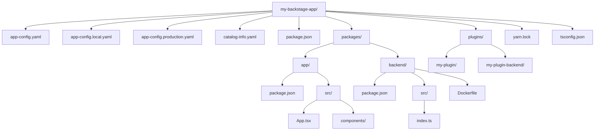

> **Complexity**: `[COMPLEX]` - Full-stack TypeScript project with monorepo tooling
>
> **Time to Complete**: 60-75 minutes
>
> **Prerequisites**: Node.js Active LTS (Node 22/24), Yarn 4.x, Docker, basic TypeScript familiarity
>
> **CBA Domain**: Domain 1 - Backstage Developer Workflow (24% of exam)

---

## What You'll Be Able to Do

After completing this module, you will be able to:

1. **Design** a resilient local development workflow utilizing Yarn workspaces, hot module replacement, and the Backstage CLI to efficiently test custom plugins.
2. **Evaluate** multi-stage Docker builds to optimize Backstage container images, understanding the critical differences between the build context and the runtime environment.
3. **Diagnose** dependency drift and version mismatches across the Backstage monorepo by interpreting CLI validation messages and lockfile conflicts.
4. **Implement** layered configuration management to securely inject PostgreSQL credentials, authentication provider secrets, and environment-specific overrides for staging and production deployments.
5. **Compare** the legacy backend wiring with the New Backend System to modernize dependency injection within custom plugins.

---

## Why This Module Matters

In early 2023, a prominent European financial services institution experienced a devastating internal tooling outage. Their Internal Developer Platform, built on a rapidly expanding installation of Backstage, suddenly refused to compile or start across all developer workstations and CI/CD pipelines. The root cause was traced back to a seemingly harmless action: a single platform team had manually updated a core catalog dependency in their localized plugin workspace, circumventing the monorepo's unified versioning strategy. This created a cascading version mismatch in the `yarn.lock` file that fundamentally broke the monolithic build process. For over 14 hours, nearly 600 software engineers were paralyzed—unable to scaffold new microservices, look up API documentation, or register automated deployments. The estimated financial impact of this productivity loss exceeded two million dollars.

This incident highlights exactly why mastering the Backstage developer workflow is an absolute operational necessity. Backstage is not just a standard web application; it is a highly complex, multi-package monorepo ecosystem that relies heavily on strict dependency management, layered configuration files, and tightly coordinated plugin versions. Domain 1 of the Certified Backstage Associate (CBA) exam accounts for 24% of your total score, and it focuses heavily on these exact operational mechanics. A misconfigured workspace protocol or an incorrectly scoped Docker build context can bring an entire engineering organization to a standstill.

You cannot effectively design sophisticated software catalogs, integrate Kubernetes clusters, or write custom plugins if you do not understand the underlying workspace protocol, the Docker multi-stage build context, and the correct procedural way to inject environment secrets. This module systematically deconstructs the foundational layers of the Backstage framework so that when you face these complex scenarios—both on the rigorous CBA exam and during a high-stakes production incident—you will know exactly how to diagnose, debug, and resolve them with absolute confidence.

> **The Recording Studio Analogy**
>
> Think of Backstage like a professional recording studio. The monorepo is the physical building—it houses every room (package) under one unified roof. The `packages/app` directory is the master mixing console where everything comes together for the listener to experience. The `packages/backend` directory is the sound booth where the heavy processing and routing actually happens. Each individual plugin located in `plugins/` acts as a separate instrument track. Yarn workspaces serve as the intricate wiring that connects every room so that audio signals flow correctly without interference. The `app-config` files are the mixing board presets—one configuration for rehearsal (local development), and a completely different secure configuration for the live show (production). You would never perform a live show without a rigorous sound check, and you should never deploy Backstage without deeply understanding the studio's layout first.

---

## Did You Know?

- Spotify created Backstage and officially open-sourced it on March 16, 2020. Prior to open-sourcing, Spotify utilized it internally to manage over 2,000 backend services, 4,000 data pipelines, and 300 websites across more than 280 engineering teams.
- Backstage officially joined the CNCF Sandbox on September 8, 2020, and was promoted to CNCF Incubating status on March 15, 2022, recognizing its massive enterprise adoption, though it has not yet achieved Graduated status.
- The official Backstage plugin directory currently lists over 250 open-source plugins, and the core project repository has accumulated more than 31,000 GitHub stars and contributions from over 1,800 developers globally.
- A standalone Backstage installation demands robust hardware, requiring a minimum of 20 GB of disk space and 6 GB of RAM. It fully supports Linux, macOS, and Windows Subsystem for Linux (WSL), but explicitly does not support native Windows execution.

*(Note: A self-cited Backstage blog post referencing a third-party developer experience survey claims Backstage holds an 89% market share among IDP tools compared to SaaS competitors, though the primary survey data is not independently verifiable.)*

---

## Part 1: Architectural Foundations and the Monorepo Strategy

### 1.1 The Top-Level Layout

When you scaffold a new Backstage application using the official creation tooling, you are not just generating a simple project; you are generating an entire monorepo designed to scale to hundreds of plugins. The foundation of this structure relies heavily on isolating the frontend user interface from the backend API services while keeping their dependencies centrally managed.



The underlying text representation of this file tree remains vital for developers navigating via the terminal:

```text
my-backstage-app/
├── app-config.yaml                 # Base configuration
├── app-config.local.yaml           # Local overrides (gitignored)
├── app-config.production.yaml      # Production overrides
├── catalog-info.yaml               # Self-registration in the catalog
├── package.json                    # Root workspace config
├── packages/
│   ├── app/                        # Frontend React application
│   │   ├── package.json
│   │   ├── src/
│   │   │   ├── App.tsx             # Plugin registration & routes
│   │   │   └── components/
│   │   └── public/
│   └── backend/                    # Backend Express application
│       ├── package.json
│       ├── src/
│       │   └── index.ts            # Backend startup & plugin wiring
│       └── Dockerfile              # Production image build
├── plugins/                        # Custom plugins live here
│   ├── my-plugin/                  # Frontend plugin
│   │   ├── package.json
│   │   ├── src/
│   │   └── dev/                    # Isolated dev setup
│   └── my-plugin-backend/          # Corresponding backend plugin
│       ├── package.json
│       └── src/
├── yarn.lock                       # Locked dependency tree
└── tsconfig.json                   # Root TypeScript config
```

### 1.2 Understanding Each Directory

Backstage utilizes a strict two-tier architecture. It consists of a React frontend and a Node.js backend, communicating seamlessly via a plugin system. Over 150 named organizations listed in the project's `ADOPTERS.md` file rely on this separation of concerns to scale their developer portals safely.

| Directory | Purpose | Key Files |
|-----------|---------|-----------|
| `packages/app` | Frontend SPA that end-users interact with | `App.tsx` registers routes and plugins |
| `packages/backend` | API server, proxies, catalog ingestion | `index.ts` wires backend plugins together |
| `plugins/` | Custom and forked plugins for your org | Each plugin is its own workspace package |
| Root | Workspace config, shared tooling, configs | `package.json` with `workspaces` field |

### 1.3 Yarn Workspaces in Detail

The Backstage monorepo requires Node.js Active LTS (Node 22 or 24) and Yarn 4.x. The root `package.json` declares which specific directories are permitted to participate in the workspace resolution process:

```json
{
  "name": "root",
  "version": "1.0.0",
  "private": true,
  "workspaces": {
    "packages": [
      "packages/*",
      "plugins/*"
    ]
  }
}
```

This strict configuration dictates that every `package.json` located inside the `packages/` and `plugins/` directories is treated as a highly integrated, linked local dependency. If the `packages/app` frontend SPA needs to rely on a custom plugin named `@internal/plugin-my-feature`, Yarn intelligently resolves it to the local `plugins/my-feature` directory on your filesystem rather than attempting to fetch it from the public npm registry.

**Why workspaces matter for the exam**: You must recognize that running `yarn install` at the root directory installs all dependencies for every nested package simultaneously. Furthermore, workspace packages reference each other using the `workspace:^` protocol in their respective `package.json` files, ensuring they remain tightly coupled during local development.

### 1.4 Evolution of the Core Systems

As Backstage evolved to handle its massive 89% adoption rate among IDP tools, architectural limits were reached. The legacy backend wiring required developers to manually wire together plugin routers in a central `index.ts` file. To resolve this, the community introduced the **New Backend System**, which reached a stable 1.0 release in 2024. This modernized system utilizes declarative dependency injection, allowing plugins to automatically register themselves and resolve their dependencies without boilerplate code. Concurrently, the **New Frontend System** was introduced to deeply modularize the UI tier, officially becoming adoption-ready at Backstage v1.42.0 in 2025. 

---

## Part 2: TypeScript Typings and Asynchronous Design

### 2.1 Types and Interfaces in Plugin Code

Backstage is primarily written in TypeScript, accounting for 93.9% of its entire codebase. With over 250 open-source plugins interacting within the same runtime environment, strict static typing is the only way to prevent catastrophic integration failures.

**Interfaces define the explicit shape of plugin APIs:**

```typescript
// A plugin's API surface is defined via an interface
export interface CatalogApi {
  getEntityByRef(ref: string): Promise<Entity | undefined>;
  getEntities(request?: GetEntitiesRequest): Promise<GetEntitiesResponse>;
}

// Utility references tie an interface to a plugin
export const catalogApiRef = createApiRef<CatalogApi>({
  id: 'plugin.catalog.service',
});
```

The Software Catalog, one of the three core built-in features of Backstage (alongside TechDocs and Software Templates), leverages these types to track ownership and metadata for all software in an organization's ecosystem.

**Type aliases define rigid data structures:**

```typescript
type EntityKind = 'Component' | 'API' | 'Resource' | 'System' | 'Domain';

type Entity = {
  apiVersion: string;
  kind: EntityKind;
  metadata: EntityMetadata;
  spec?: Record<string, unknown>;
};
```

### 2.2 Async/Await Patterns

Almost every backend operation in Backstage is inherently asynchronous. Plugin routers, catalog metadata processors, and Scaffolder execution actions all rely heavily on standard `async/await` syntax. This is particularly crucial when dealing with the Knex library, which Backstage uses to communicate with PostgreSQL (for production databases) and SQLite (for development and testing).

```typescript
// Backend plugin router pattern
import { Router } from 'express';

export async function createRouter(
  options: RouterOptions,
): Promise<Router> {
  const { logger, config, database } = options;

  const router = Router();

  router.get('/health', async (_req, res) => {
    const db = await database.getClient();
    const result = await db.select().from('my_table').limit(1);
    res.json({ status: 'ok', rows: result.length });
  });

  return router;
}
```

**Key pattern to memorize**: Legacy backend plugin factories always return a `Promise<Router>` and accept an `options` object containing core framework utilities like the `logger`, `config`, `database`, and other environment services.

### 2.3 Generics in API Refs

The `createApiRef<T>` utility function relies heavily on TypeScript generics. It fundamentally ties a specific type `T` to a unique reference string identifier, allowing the dependency injection system to explicitly know what type of API to return to the consumer:

```typescript
// When you call useApi(catalogApiRef), TypeScript knows the return
// type is CatalogApi, not just "any".
const catalogApiRef = createApiRef<CatalogApi>({
  id: 'plugin.catalog.service',
});
```

> **Stop and think**: Why does Backstage use a SQLite in-memory database by default for local development instead of requiring a full PostgreSQL container? What are the potential trade-offs when testing highly complex database schema migrations locally?

---

## Part 3: The Local Development Loop and Environment

### 3.1 Scaffolding a New App

To initiate a Backstage environment, developers utilize the official scaffolding package. The Certified Backstage Associate (CBA) certification, announced in November 2024, mandates a thorough understanding of this exact initialization sequence.

```bash
# Create a new Backstage app
npx @backstage/create-app@latest

# You'll be prompted for an app name
# This generates the full monorepo structure
```

After the scaffolding sequence completes, the developer transitions into the workspace context to initialize the project:

```bash
cd my-backstage-app
yarn install    # Install all workspace dependencies
yarn dev        # Start frontend AND backend in parallel
```

### 3.2 What `yarn dev` Actually Does

The `yarn dev` command is a highly orchestrated macro script. It runs both the frontend development server (powered by Webpack, typically on port 3000) and the backend development server (Node.js Express, on port 7007) concurrently. Under the hood, the root `package.json` defines this coordination:

```json
{
  "scripts": {
    "dev": "concurrently \"yarn start\" \"yarn start-backend\"",
    "start": "yarn workspace app start",
    "start-backend": "yarn workspace backend start"
  }
}
```

The frontend development server provides **hot module replacement (HMR)**. If you modify a React component within the `packages/app` directory, the browser interface updates instantaneously without requiring a disruptive full page reload. Simultaneously, the backend server utilizes file watchers like `nodemon` or `ts-node-dev` to automatically restart the API server upon detecting any backend source code changes. 

Because Backstage compiles a massive TypeScript monorepo alongside two dev servers and a local SQLite database, a standalone app strictly requires a minimum of 20 GB of disk space and 6 GB of RAM.

### 3.3 Debugging the Application

**Frontend debugging**: Developers should open Chrome DevTools, navigate to the Sources tab, and locate their plugin code under the `webpack://` domain structure. Breakpoints can be set directly against the source-mapped TypeScript code.

**Backend debugging**: To debug backend logic or catalog ingestion processors, start the backend with the Node.js inspector flag actively listening:

```bash
# Start backend with Node.js inspector
yarn workspace backend start --inspect
```

Once the inspector is active, you can attach VS Code or Chrome DevTools directly to `localhost:9229`. A standard `.vscode/launch.json` configuration file streamlines this attachment process:

```json
{
  "version": "0.2.0",
  "configurations": [
    {
      "type": "node",
      "request": "attach",
      "name": "Attach to Backend",
      "port": 9229,
      "restart": true,
      "skipFiles": ["<node_internals>/**"]
    }
  ]
}
```

---

## Part 4: Production Containerization and Deployment Strategy

### 4.1 Multi-Stage Dockerfile Execution

The officially generated `packages/backend/Dockerfile` employs a sophisticated multi-stage build strategy explicitly designed to keep the final production container image as small and secure as possible.

```dockerfile
# Stage 1 - Build
FROM node:18-bookworm-slim AS build

WORKDIR /app

# Copy root workspace files
COPY package.json yarn.lock ./
COPY packages/backend/package.json packages/backend/
COPY plugins/ plugins/

# Install ALL dependencies (including devDependencies for build)
RUN yarn install --frozen-lockfile

# Copy source and build
COPY packages/backend/ packages/backend/
COPY app-config*.yaml ./
RUN yarn workspace backend build

# Stage 2 - Production
FROM node:18-bookworm-slim

WORKDIR /app

# Copy only the built output and production dependencies
COPY --from=build /app/packages/backend/dist ./dist
COPY --from=build /app/node_modules ./node_modules
COPY app-config.yaml app-config.production.yaml ./

# Run as non-root
USER node

CMD ["node", "dist/index.cjs.js"]
```

### 4.2 Optimizing the Container Image Size

Optimizing a Backstage deployment is critical for fast Kubernetes pod startup times. Backstage deployments to Kubernetes v1.35+ clusters benefit significantly from these optimizations. 

| Technique | Impact | How |
|-----------|--------|-----|
| Multi-stage builds | High | Separate build and runtime stages |
| `--frozen-lockfile` | Medium | Ensures reproducible installs |
| `.dockerignore` | Medium | Exclude `node_modules/`, `.git/`, `*.md` |
| Slim base image | Medium | Use `node:18-bookworm-slim` not `node:18` |
| Non-root user | Security | `USER node` in final stage |

**Exam tip**: The Backstage CLI provides the `backstage-cli package build` command, which meticulously bundles the backend into a single, highly optimized distributable folder. You must deeply understand the critical difference between a standard `yarn build` (which operates at the workspace-level) and `backstage-cli package build` (which specifically targets package-level bundling).

### 4.3 Building and Running the Image

```bash
# Build the image
docker build -t backstage:latest -f packages/backend/Dockerfile .

# Run with config overrides via environment variables
docker run -p 7007:7007 \
  -e POSTGRES_HOST=host.docker.internal \
  -e POSTGRES_PORT=5432 \
  backstage:latest
```

It is paramount to note that the Docker build context is explicitly set to the **repo root** (`.`), and absolutely not to `packages/backend/`. This is necessary because the Dockerfile process requires unrestricted access to the root `yarn.lock` file and all adjacent workspace packages to resolve internal dependencies successfully.

---

## Part 5: NPM/Yarn Dependency Management at Scale

### 5.1 Lock Files and Dependency Drift

The `yarn.lock` file serves a singular, unyielding purpose: it pins every single dependency to an exact, unchangeable version string. This guarantees that every engineer on your team, and every automated CI/CD pipeline, retrieves an identical package tree. 

**Critical operational rules:**
- Never delete the `yarn.lock` file in a desperate attempt to "fix" dependency resolution issues (always run `yarn install` to allow the resolver to correct anomalies).
- The `yarn.lock` file must always be committed to version control.
- You must strictly use `yarn install --frozen-lockfile` within CI pipelines to immediately fail the build if the lock file is out of date or structurally inconsistent.

### 5.2 The Workspace Protocol

When one package inherently depends on another package located within the exact same monorepo, developers must explicitly use the `workspace:` protocol identifier:

```json
{
  "name": "@internal/plugin-my-feature",
  "dependencies": {
    "@backstage/core-plugin-api": "^1.9.0",
    "@internal/plugin-my-feature-common": "workspace:^"
  }
}
```

The `workspace:^` syntax instructs Yarn to dynamically resolve the dependency to the local package folder during active development. However, if the plugin is eventually packaged and published to a public registry, Yarn intelligently replaces the `workspace:^` string with the actual hardcoded version number.

### 5.3 Adding Dependencies to Specific Workspaces

Adding a dependency requires specifying the exact target workspace context. Without the proper flags, Yarn may incorrectly apply the dependency to the global root.

```bash
# Add a dependency to a specific workspace package
yarn workspace app add @backstage/plugin-catalog

# Add a dev dependency
yarn workspace backend add --dev @types/express

# Add a dependency to the root (shared tooling)
yarn add -W eslint prettier
```

The `-W` flag acts as an intentional override. It is strictly required when intentionally adding a package to the root of the entire workspace. Without it, Yarn forcefully refuses the installation to prevent developers from accidentally polluting the root-level dependency tree.

> **Pause and predict**: If you add a new third-party Backstage plugin to the monorepo, which directory should you install its package into—the root workspace, the frontend app workspace, or the backend workspace?

---

## Part 6: Navigating the Backstage CLI and Versioning

### 6.1 Core CLI Commands

The `@backstage/cli` package fundamentally provides the `backstage-cli` binary execution environment. It acts as the operational Swiss Army knife for all advanced Backstage development tasks:

| Command | Purpose |
|---------|---------|
| `backstage-cli package build` | Build a single package for production |
| `backstage-cli package lint` | Run ESLint on a package |
| `backstage-cli package test` | Run Jest tests for a package |
| `backstage-cli package start` | Start a package in dev mode |
| `backstage-cli versions:bump` | Bump all `@backstage/*` dependencies to latest |
| `backstage-cli versions:check` | Verify all `@backstage/*` versions are compatible |
| `backstage-cli new` | Scaffold a new plugin or package |

### 6.2 Creating a New Custom Plugin

To extend the core functionality of your Internal Developer Platform, you will frequently scaffold custom plugins:

```bash
# From the repo root, scaffold a frontend plugin
yarn new --select plugin

# Scaffold a backend plugin
yarn new --select backend-plugin
```

This sophisticated command automates the generation of the full plugin skeleton inside the `plugins/` directory. It scaffolds the `package.json`, the `src/` directory, an isolated development setup configuration, and base unit test files. Most importantly, the newly minted plugin is automatically wired into the Yarn workspace configuration.

### 6.3 Monolithic Version Management

Backstage engineering teams release updates following a strict monthly cadence. All `@backstage/*` packages included within a specific release are rigorously tested and explicitly designed to work together as a cohesive unit. Mixing packages from different monthly releases almost always results in subtle, difficult-to-diagnose runtime breakages.

```bash
# Check for version mismatches
yarn backstage-cli versions:check

# Bump everything to the latest release
yarn backstage-cli versions:bump
```

**War story**: An enterprise platform team once spent three full days aggressively debugging a massive catalog ingestion failure. The core backend was pinned to Backstage 1.18, but a junior engineer had manually upgraded `@backstage/plugin-catalog-backend` to version 1.21 in order to leverage a newly announced feature. The underlying Knex schema migrations between the two versions were entirely incompatible. The fix took precisely five minutes once a senior engineer ran the `versions:check` command—the version mismatch was flagged immediately. The hard lesson: never, under any circumstances, upgrade individual `@backstage/*` packages. Always bump the entire ecosystem together.

---

## Part 7: Layered Configuration and Secrets Management

### 7.1 Configuration Files

Backstage employs a highly structured, layered configuration system to manage environments dynamically:

```text
app-config.yaml                # Base config (committed to git)
app-config.local.yaml          # Local developer overrides (gitignored)
app-config.production.yaml     # Production overrides (committed or injected)
```

The configuration parsing engine reads and merges these files in exact sequential order. Files loaded later inherently override values established in earlier files. The `.local` file acts exclusively as a secure location for developer-specific settings (such as local database credentials and personal GitHub API tokens) and must explicitly never be committed to source control.

### 7.2 Core Configuration Structure

```yaml
# app-config.yaml
app:
  title: My Backstage Portal
  baseUrl: http://localhost:3000

backend:
  baseUrl: http://localhost:7007
  listen:
    port: 7007
  database:
    client: better-sqlite3
    connection: ':memory:'

catalog:
  locations:
    - type: file
      target: ../../catalog-info.yaml

integrations:
  github:
    - host: github.com
      token: ${GITHUB_TOKEN}  # Environment variable substitution
```

It is worth noting that TechDocs, Backstage's highly popular 'docs-like-code' solution (which reached v1.0 status in Backstage 1.2), heavily relies on this configuration file to determine its storage backend, supporting GCS, AWS S3, Azure Blob Storage, OpenStack Swift, and local filesystems.

### 7.3 Environment Variable Substitution Protocol

The Backstage configuration engine natively interprets the `${VAR}` syntax to dynamically read values directly from the host process environment at startup. This substitution mechanism is the globally recommended approach to inject sensitive secrets securely:

```yaml
# Never do this:
integrations:
  github:
    - host: github.com
      token: ghp_abc123hardcoded    # BAD: secret in git

# Always do this:
integrations:
  github:
    - host: github.com
      token: ${GITHUB_TOKEN}        # GOOD: injected at runtime
```

### 7.4 Config Includes and Advanced Overrides

Operators can explicitly dictate which configuration files the engine should load by utilizing the `APP_CONFIG_` environment variable prefix or by passing multiple CLI flags:

```bash
# Load base + production configs
yarn start-backend --config app-config.yaml --config app-config.production.yaml

# In Docker, use environment variables
APP_CONFIG_app_baseUrl=https://backstage.example.com
```

The `--config` execution flag can be repeated sequentially. The files are merged strictly from left to right, meaning the last file provided in the argument list possesses absolute priority during conflict resolution.

### 7.5 Database, Authentication, and Extended Tooling

To correctly configure a robust PostgreSQL backend for a highly available production environment, you must override the `database` section directly within your `app-config.production.yaml` file:

```yaml
backend:
  database:
    client: pg
    connection:
      host: ${POSTGRES_HOST}
      port: ${POSTGRES_PORT}
      user: ${POSTGRES_USER}
      password: ${POSTGRES_PASSWORD}
```

Authentication providers, which secure the application frontend, are configured underneath the heavily guarded `auth` key. For example, to enable rigorous GitHub organizational authentication, you provide the generated OAuth application credentials:

```yaml
auth:
  environment: production
  providers:
    github:
      production:
        clientId: ${GITHUB_CLIENT_ID}
        clientSecret: ${GITHUB_CLIENT_SECRET}
```

*Note on external plugins*: Backstage natively supports advanced integrations. For instance, the Backstage Kubernetes plugin requires configuration for two distinct packages (`@backstage/plugin-kubernetes` for the frontend UI, and `@backstage/plugin-kubernetes-backend` to securely query cluster APIs). Furthermore, as of 2025, Backstage officially supports Model Context Protocol (MCP) server integration for embedding advanced AI tooling directly into the developer portal experience. Software Templates (Scaffolder) configuration also resides here; be exceptionally cautious when defining Scaffolder action IDs—they must utilize `camelCase` and strictly avoid `kebab-case` to prevent the template expression engine from incorrectly evaluating dashes as mathematical subtraction operations.

---

## Common Mistakes

| Mistake | What Goes Wrong | Fix |
|---------|----------------|-----|
| Running `npm install` instead of `yarn install` | Generates `package-lock.json`, conflicts with `yarn.lock` | Always use `yarn`; delete `package-lock.json` if created |
| Editing `yarn.lock` by hand | Corrupts dependency resolution | Run `yarn install` to regenerate after `package.json` changes |
| Upgrading a single `@backstage/*` package | Version mismatch causes runtime errors | Use `backstage-cli versions:bump` to upgrade all together |
| Committing `app-config.local.yaml` | Leaks developer tokens and credentials | Ensure `.gitignore` includes `app-config.local.yaml` |
| Docker build context set to `packages/backend/` | Build fails because `yarn.lock` and workspace packages are not available | Set build context to repo root: `docker build -f packages/backend/Dockerfile .` |
| Forgetting `--frozen-lockfile` in CI | Non-deterministic builds; CI installs different versions than local | Always use `yarn install --frozen-lockfile` in CI pipelines |
| Hardcoding secrets in `app-config.yaml` | Secrets pushed to git | Use `${ENV_VAR}` substitution and inject at runtime |

---

## Quiz

Test your comprehensive knowledge of the Backstage developer workflow by answering these technical scenario questions.

**Q1: Your team wants to add a new custom UI widget to the Backstage homepage. Which directory must they modify, and why?**
<details>
<summary>Show Answer</summary>

They must modify the `packages/app` directory, as it contains the frontend React application where the UI shell and plugin routes are registered.
</details>

**Q2: A developer proposes moving custom plugins to separate Git repositories to speed up their individual CI builds. What major trade-off of abandoning the Backstage workspace structure are they ignoring?**
<details>
<summary>Show Answer</summary>

They are ignoring the increased risk of version drift and "dependency hell." The Yarn workspace monorepo allows all plugins to be versioned, tested, and updated together using the `workspace:^` protocol.
</details>

**Q3: What happens if you run `docker build` with the build context set to `packages/backend/` instead of the repo root?**
<details>
<summary>Show Answer</summary>

The build **fails** because the Dockerfile copies `yarn.lock` and workspace packages from the repo root. With the wrong context, those files are outside the build context and Docker cannot access them.
</details>

**Q4: During a code review, you notice a developer added a database password directly to `app-config.production.yaml`. How should you instruct them to fix this for security?**
<details>
<summary>Show Answer</summary>

Instruct them to use environment variable substitution (e.g., `${POSTGRES_PASSWORD}`) in the YAML file and inject the actual secret at runtime via the process environment.
</details>

**Q5: After a developer manually upgraded `@backstage/plugin-catalog` to `1.21.0` while the rest of the project is on `1.18.0`, the catalog stops ingesting data. What CLI command should you run to fix this, and why?**
<details>
<summary>Show Answer</summary>

Run `yarn backstage-cli versions:bump` to upgrade all Backstage packages together. Individual packages should never be upgraded manually as they are designed to work as a coordinated set within each monthly release.
</details>

**Q6: A developer starts the Backstage backend using the command `yarn start-backend --config app-config.yaml --config app-config.production.yaml`. Both files explicitly define a `backend.listen.port` configuration value. Which exact configuration value will Backstage use, and why?**
<details>
<summary>Show Answer</summary>

Backstage will explicitly use the port value defined within `app-config.production.yaml`. When multiple configuration files are supplied to the engine via the `--config` execution flag, they are merged sequentially in order from left to right. The final file specified in the argument list takes absolute precedence and silently overrides any conflicting keys derived from earlier files.
</details>

**Q7: Your enterprise platform team has successfully integrated 15 different `@backstage/plugin-*` packages into the internal monorepo over six months. During a routine audit, you suddenly discover strange UI rendering bugs and severe backend database schema errors occurring intermittently. What CLI command should you run to diagnose the root cause, and what is the tool explicitly looking for?**
<details>
<summary>Show Answer</summary>

You must urgently run the `yarn backstage-cli versions:check` command. This diagnostic command deeply analyzes your workspace packages to verify that all installed `@backstage/*` framework dependencies belong exclusively to the same compatible monthly release tier. The rendering glitches and underlying database schema errors are almost certainly caused by severe version drift, occurring when individual plugins were manually upgraded completely out of sync with the core Backstage framework constraints.
</details>

**Q8: An engineer creates a new Scaffolder software template and incorrectly names one of the custom execution actions `fetch-component-id`. When the template attempts to execute during a deployment, the string interpolation logic `${{ steps.fetch-component-id.output.componentId }}` violently resolves to `NaN`. How do you evaluate and permanently fix this Scaffolder template bug?**
<details>
<summary>Show Answer</summary>

You must immediately rename the specific action ID to utilize standard `camelCase` formatting (e.g., `fetchComponentId`). The core Scaffolder template parser interprets standard dashes as mathematical subtraction operators within its internal expression evaluation engine. As a direct result, it literally attempts to mathematically subtract the string `component` and `id` from the string `fetch`, which inherently results in a `Not a Number` (NaN) mathematical failure during runtime evaluation.
</details>

---

## Hands-On Exercise: Create and Explore a Backstage App

**Objective**: Autonomously scaffold a complete Backstage application, rigorously verify the internal monorepo directory structure, execute the application servers locally, and compile an optimized production-grade Docker image.

**Estimated time**: 30-40 minutes

### Prerequisites Checklist
- [ ] Node.js Active LTS installed and running (`node -v`)
- [ ] Yarn 4.x installed and configured via corepack (`yarn -v`)
- [ ] Docker engine running locally (`docker --version`)

### Execution Steps

**Step 1: Scaffold the base application**

Use the official creation script to generate the monorepo boilerplate.

```bash
npx @backstage/create-app@latest
# When prompted, name it: cba-lab
cd cba-lab
```

**Step 2: Rigorously verify the monorepo structure**

Ensure the scaffolding process successfully initialized the Yarn workspaces.

```bash
# List the top-level directories
ls -la

# Confirm workspace configuration
cat package.json | grep -A 5 '"workspaces"'

# Check that packages/app and packages/backend exist
ls packages/
```

**Success criteria**: You clearly see the `packages/app`, `packages/backend`, `app-config.yaml`, and `yarn.lock` assets physically located in the root repository.

**Step 3: Examine the frontend SPA entry point**

Inspect how the frontend establishes routes for all integrated plugins.

```bash
cat packages/app/src/App.tsx | head -40
```

Note precisely how frontend plugins are explicitly imported and formally registered as active React routes. This is the exact location where you would integrate newly developed custom frontend plugins.

**Step 4: Start the parallel development servers**

Initialize the continuous local development loop.

```bash
yarn dev
```

Open `http://localhost:3000` locally in your chosen web browser. You should visibly see the Backstage UI displaying the default Software Catalog interface.

**Success criteria**: The browser definitively renders the Backstage home page. The terminal actively streams both frontend (Webpack) and backend (Node.js Express) compilation logs without fatal errors.

**Step 5: Test the Hot Module Replacement (HMR) engine**

With the `yarn dev` command still executing, securely edit `packages/app/src/App.tsx` and dynamically change the application title or inject a visible comment block. Actively watch the browser—it should refresh the DOM automatically without triggering a destructive full page reload.

**Step 6: Explore the active configuration engine**

Open a completely **new terminal window** and navigate directly to your internal `cba-lab` directory, as the `yarn dev` process runs continuously blocking the initial terminal.

```bash
# View the base config
cat app-config.yaml

# Check which database is configured (default: SQLite in-memory)
grep -A 3 'database:' app-config.yaml
```

**Step 7: Create an isolated local configuration override**

Inject a gitignored configuration overlay to test overriding the base configuration securely.

```bash
cat > app-config.local.yaml << 'EOF'
app:
  title: CBA Lab Portal
integrations:
  github:
    - host: github.com
      token: ${GITHUB_TOKEN}
EOF
```

Restart the `yarn dev` command sequence and visually verify that the browser UI title successfully changes to display "CBA Lab Portal".

**Step 8: Build the optimized Docker image**

Compile the multi-stage container artifact for production deployment simulation.

```bash
# Build the backend for production
yarn workspace backend build

# Build the Docker image from the repo root
docker build -t cba-lab:latest -f packages/backend/Dockerfile .

# Verify image size
docker images cba-lab:latest
```

**Success criteria**: The container image compiles fully without halting on any underlying Docker errors. The final resulting image size should typically register under 1 GB in total size (typically landing between 500-700 MB depending on the number of installed plugins).

**Step 9: Run the containerized production application**

Execute the compiled container image locally, mimicking a production Kubernetes pod startup sequence.

```bash
docker run -p 7007:7007 cba-lab:latest
```

Open `http://localhost:7007` directly and empirically confirm the backend health endpoint actively responds with an operational status payload.

### Environment Cleanup

Execute these teardown commands to release your local system resources.

```bash
# Stop any running containers
docker rm -f $(docker ps -q --filter ancestor=cba-lab:latest) 2>/dev/null

# Remove the test app (optional)
cd .. && rm -rf cba-lab
```

---

## Summary

| Topic | Key Takeaway |
|-------|-------------|
| Monorepo structure | `packages/app` (frontend), `packages/backend` (backend), `plugins/` (extensions) |
| TypeScript patterns | Interfaces for APIs, `createApiRef<T>` for DI, `async/await` everywhere |
| Local development | `npx @backstage/create-app`, `yarn dev`, HMR for frontend |
| Docker builds | Multi-stage from repo root, slim base image, non-root user |
| Dependencies | Yarn workspaces, `workspace:^` protocol, `--frozen-lockfile` in CI |
| Backstage CLI | `versions:bump`, `versions:check`, `package build`, `new` |
| Configuration | Layered YAML files, `${ENV_VAR}` substitution, `--config` flag ordering |

---

## Next Module

[Module 1.2: Backstage Plugin Development](../module-1.2-backstage-plugin-development/) - Dive deeper into the architecture of the portal by building your first frontend and backend plugin, unlocking the secrets of the plugin API system, and learning precisely how Backstage's powerful dependency injection framework manages state at enterprise scale.