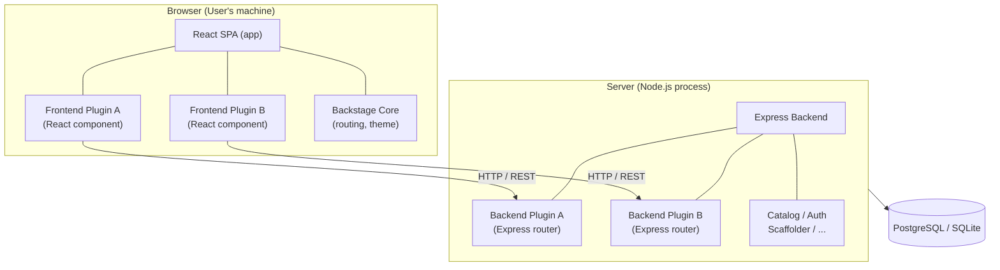

> **Complexity**: `[COMPLEX]` — Heaviest exam domain (32%)
>
> **Time to Complete**: 90-120 minutes
>
> **Prerequisites**: Module 1 (Backstage Development Workflow), familiarity with TypeScript, React basics, npm/yarn
>
> **CBA Domain**: Domain 4 — Customizing Backstage (32% of exam)

---

## What You'll Be Able to Do

After completing this module, you will be able to:

1. **Design** a Backstage frontend plugin with React components, Material UI theming, and route registration in the app shell.
2. **Implement** a backend plugin with Express routes, database migrations, and secure service-to-service authentication.
3. **Construct** Software Templates that scaffold new services with cookiecutter/Nunjucks, including CI/CD pipelines and catalog registration.
4. **Evaluate** plugin extension points, composability APIs, and auth provider integration by analyzing Backstage TypeScript code.

---

## Why This Module Matters

This is the single most important module for the Certified Backstage Associate (CBA) exam. **Domain 4 is worth 32%** of your final score — nearly one in three questions will test your deeply technical understanding of plugin development, Material UI integration, Software Templates, theming, and authentication providers. Backstage without plugins is essentially an empty shell. The entire value proposition of the platform — the centralized software catalog, embedded TechDocs, CI/CD pipeline visibility, and automated scaffolding — is delivered exclusively through plugins. When engineers at Spotify originally built Backstage, they designed it as a flexible plugin platform first and a developer portal second. Understanding how plugins interact under the hood is synonymous with understanding how Backstage itself operates. 

In 2023, a top-tier European banking institution experienced a catastrophic internal outage when a poorly designed custom Backstage plugin brought down their entire developer portal. The platform team had built a bespoke frontend component to display real-time deployment metrics across hundreds of microservices. It performed flawlessly during isolated staging tests. However, they pushed it to production on a Friday afternoon without rigorous load testing. The plugin was engineered to make unauthenticated, rapid-fire API calls to its corresponding backend plugin, which in turn queried the primary deployment database without utilizing any connection pooling mechanisms. When thousands of engineers logged into the portal on Monday morning, the backend plugin instantly exhausted the database connection pool. 

This resource starvation cascaded immediately, causing the entire Backstage Node.js backend process to crash repeatedly. Every critical capability — from the software catalog to TechDocs and the scaffolder — was rendered entirely inaccessible. The resulting downtime lasted over six hours, severely disrupting ongoing development pipelines across the enterprise. The post-mortem analysis revealed a financial impact of approximately $1.2M in lost developer productivity. The mitigation ultimately required just three lines of code: implementing a connection pool limit, adding a circuit breaker in the backend plugin, and wrapping the frontend component in a resilient React error boundary. This incident underscores a vital lesson: plugin development demands a profound understanding of the broader Backstage runtime architecture, not just superficial React and Express knowledge. This holistic comprehension is exactly what the CBA exam evaluates.

> **The Restaurant Analogy**
>
> Think of Backstage as a high-end restaurant kitchen. The core framework is the physical building — the walls, plumbing, and electricity. Frontend plugins are the finalized dishes on the menu presented to the customers. Backend plugins are the specialized kitchen stations (the grill, prep areas, dessert stations). Software Templates are the meticulous recipes that let line cooks produce consistent meals every single time. Auth providers are the strict bouncers at the door. You do not successfully run a restaurant by merely staring at the building's blueprint; you run it by mastering the art of cooking.

---

## Did You Know?

- Backstage is proudly licensed under the **Apache License 2.0**, encouraging widespread enterprise adoption and modification.
- Backstage uses a highly predictable monthly main release cadence, shipping a new major version exactly on the **Tuesday before the third Wednesday of each month**.
- The highly anticipated New Backend System was officially released as **stable 1.0** prior to the Backstage Wrapped post on **December 30, 2025**, marking a massive architectural milestone.
- Backstage rigorously supports exactly two adjacent even-numbered Node.js LTS releases at any given time. As of version 1.46.0, those supported runtimes are exclusively **Node.js 22** and **Node.js 24**.

---

## Part 1: Frontend vs Backend Plugin Architecture

Before writing any code, you must deeply understand where plugins run and how they communicate. This architectural separation is one of the most frequently tested concepts on the CBA exam. The browser and the server are entirely distinct environments, and Backstage enforces strict boundaries between them.

Here is the architectural overview, rendered as a logical flowchart:



<details>
<summary>View the Traditional ASCII Architecture Diagram</summary>

```text
BACKSTAGE RUNTIME ARCHITECTURE
══════════════════════════════════════════════════════════════════════

  Browser (User's machine)               Server (Node.js process)
 ┌────────────────────────┐             ┌─────────────────────────┐
 │   React SPA (app)      │             │   Express Backend       │
 │                        │   HTTP/     │                         │
 │  ┌──────────────────┐  │   REST      │  ┌───────────────────┐  │
 │  │ Frontend Plugin A │──│────────────│──│ Backend Plugin A   │  │
 │  │ (React component) │  │            │  │ (Express router)   │  │
 │  └──────────────────┘  │            │  └───────────────────┘  │
 │                        │            │                         │
 │  ┌──────────────────┐  │            │  ┌───────────────────┐  │
 │  │ Frontend Plugin B │──│────────────│──│ Backend Plugin B   │  │
 │  │ (React component) │  │            │  │ (Express router)   │  │
 │  └──────────────────┘  │            │  └───────────────────┘  │
 │                        │            │                         │
 │  ┌──────────────────┐  │            │  ┌───────────────────┐  │
 │  │  Backstage Core   │  │            │  │  Catalog / Auth   │  │
 │  │  (routing, theme) │  │            │  │  Scaffolder / ... │  │
 │  └──────────────────┘  │            │  └───────────────────┘  │
 └────────────────────────┘            └──────────┬──────────────┘
                                                   │
                                        ┌──────────▼──────────┐
                                        │   PostgreSQL / SQLite│
                                        └─────────────────────┘

 packages/app/                           packages/backend/
 (built as static JS/CSS)               (runs as Node.js process)
```

</details>

### Key Differences

| Aspect | Frontend Plugin | Backend Plugin |
|--------|----------------|----------------|
| **Language** | TypeScript + React + JSX | TypeScript + Express |
| **Runs in** | Browser | Node.js server |
| **Access to** | DOM, browser APIs, user session | Filesystem, database, secrets, network |
| **Package location** | `plugins/my-plugin/` | `plugins/my-plugin-backend/` |
| **Entry point** | `createPlugin()` | `createBackendPlugin()` |
| **Communicates via** | Backstage API client (`fetchApiRef`) | Express routes mounted at `/api/my-plugin` |
| **Testing** | `@testing-library/react` | Supertest + backend test utils |

> **Pause and predict**: Before scrolling down, how do you think a frontend React component securely communicates with a Node.js backend plugin if they run in completely different processes and cannot share code imports? Think about how authentication headers might be managed.

---

## Part 2: Frontend Plugin Development

### 2.1 Creating a Frontend Plugin

Backstage provides a powerful CLI generator to scaffold a new plugin quickly. 

Note: As of early 2026, the latest confirmed stable Backstage release is v1.49.0 (released January 28, 2026). Given the project's strict monthly cadence, versions 1.50.x or 1.51.x may have shipped by April 2026, but this remains unverified from primary sources. However, a critical fact applies from v1.49.0 onward: newly created Backstage apps use the New Frontend System by default. The old `--next` flag has been removed and replaced by a `--legacy` flag.

```bash
# From the Backstage root directory
yarn new --select plugin

# You'll be prompted for a plugin ID, e.g., "my-dashboard"
# This creates: plugins/my-dashboard/
```

The generated plugin folder structure adheres to strict conventions, organizing React components, route references, and testing utilities logically:

```text
plugins/my-dashboard/
├── src/
│   ├── index.ts              # Public API exports
│   ├── plugin.ts             # Plugin definition (createPlugin)
│   ├── routes.ts             # Route references
│   ├── components/
│   │   ├── MyDashboardPage/
│   │   │   ├── MyDashboardPage.tsx
│   │   │   └── index.ts
│   │   └── ExampleFetchComponent/
│   ├── api/                  # API client definitions
│   └── setupTests.ts
├── package.json
├── README.md
└── dev/                      # Standalone dev setup
    └── index.tsx
```

### 2.2 The Plugin Definition — `createPlugin`

In older or legacy codebases, every frontend plugin starts with `createPlugin` imported from `@backstage/core-plugin-api`. This acts as the plugin's core identity — it securely registers the plugin with the broader Backstage ecosystem and declares its routes, APIs, and visual extensions. (Note: in the New Frontend System, you will instead see `createFrontendPlugin` from `@backstage/frontend-plugin-api`).

```typescript
// plugins/my-dashboard/src/plugin.ts
import {
  createPlugin,
  createRoutableExtension,
} from '@backstage/core-plugin-api';
import { rootRouteRef } from './routes';

export const myDashboardPlugin = createPlugin({
  id: 'my-dashboard',
  routes: {
    root: rootRouteRef,
  },
});

export const MyDashboardPage = myDashboardPlugin.provide(
  createRoutableExtension({
    name: 'MyDashboardPage',
    component: () =>
      import('./components/MyDashboardPage').then(m => m.MyDashboardPage),
    mountPoint: rootRouteRef,
  }),
);
```

What this code does, line by line:

- `createPlugin({ id: 'my-dashboard' })` — Registers a plugin with a unique identifier. Backstage utilizes this ID for dynamic routing, user configuration, and telemetry analytics. Plugin IDs must strictly use kebab-case.
- `routes: { root: rootRouteRef }` — Associates named route variables with the plugin. `rootRouteRef` is an abstract reference created elsewhere to preserve loose coupling.
- `createRoutableExtension()` — Creates a highly optimized React component that Backstage can mount dynamically at a specific URL path. Notice how the `component` field uses a dynamic `import()` statement for code splitting — the heavy plugin bundle code is only loaded over the network when a user explicitly navigates to its page.
- `mountPoint: rootRouteRef` — Irrevocably ties this visual component to the aforementioned abstract route reference.

### 2.3 Route References

```typescript
// plugins/my-dashboard/src/routes.ts
import { createRouteRef } from '@backstage/core-plugin-api';

export const rootRouteRef = createRouteRef({
  id: 'my-dashboard',
});
```

Route references are intentionally abstract — they absolutely do not contain actual URL paths. The literal string path is assigned much later in the lifecycle when the plugin is explicitly mounted within the application routing tree.

### 2.4 Writing a Frontend Plugin Page

Here is a complete, production-ready frontend plugin page. Notice how it fetches data securely from a corresponding backend API and visually structures the response utilizing Backstage's sophisticated built-in core components:

```tsx
// plugins/my-dashboard/src/components/MyDashboardPage/MyDashboardPage.tsx
import React from 'react';
import { useApi, fetchApiRef } from '@backstage/core-plugin-api';
import {
  Header,
  Page,
  Content,
  ContentHeader,
  SupportButton,
  Table,
  TableColumn,
  InfoCard,
  Progress,
  ResponseErrorPanel,
} from '@backstage/core-components';
import { Grid } from '@mui/material';
import useAsync from 'react-use/lib/useAsync';

// Define the shape of data we expect from our backend
interface ServiceHealth {
  name: string;
  status: 'healthy' | 'degraded' | 'down';
  lastChecked: string;
  responseTimeMs: number;
}

// Table column definitions — Backstage's Table component uses this pattern
const columns: TableColumn<ServiceHealth>[] = [
  { title: 'Service', field: 'name' },
  {
    title: 'Status',
    field: 'status',
    render: (row: ServiceHealth) => {
      const colors: Record<string, string> = {
        healthy: '#4caf50',
        degraded: '#ff9800',
        down: '#f44336',
      };
      return (
        <span style={{ color: colors[row.status], fontWeight: 'bold' }}>
          {row.status.toUpperCase()}
        </span>
      );
    },
  },
  { title: 'Response Time (ms)', field: 'responseTimeMs', type: 'numeric' },
  { title: 'Last Checked', field: 'lastChecked' },
];

export const MyDashboardPage = () => {
  // useApi hook retrieves a Backstage API implementation by its ref
  const fetchApi = useApi(fetchApiRef);

  // useAsync handles loading/error states for async operations
  const {
    value: services,
    loading,
    error,
  } = useAsync(async (): Promise<ServiceHealth[]> => {
    const response = await fetchApi.fetch(
      '/api/my-dashboard/services/health',
    );
    if (!response.ok) {
      throw new Error(`Failed to fetch: ${response.statusText}`);
    }
    return response.json();
  }, []);

  if (loading) return <Progress />;
  if (error) return <ResponseErrorPanel error={error} />;

  return (
    <Page themeId="tool">
      <Header title="Service Health Dashboard" subtitle="Real-time status" />
      <Content>
        <ContentHeader title="Overview">
          <SupportButton>
            This dashboard shows the health of all registered services.
          </SupportButton>
        </ContentHeader>
        <Grid container spacing={3}>
          <Grid item xs={12}>
            <InfoCard title="Service Count">
              {services?.length ?? 0} services monitored
            </InfoCard>
          </Grid>
          <Grid item xs={12}>
            <Table
              title="Service Health"
              options={{ search: true, paging: true, pageSize: 10 }}
              columns={columns}
              data={services ?? []}
            />
          </Grid>
        </Grid>
      </Content>
    </Page>
  );
};
```

### Key Backstage Components Used Above

| Component | Package | Purpose |
|-----------|---------|---------|
| `Page` | `@backstage/core-components` | Top-level layout with sidebar support |
| `Header` | `@backstage/core-components` | Page header with title and subtitle |
| `Content` | `@backstage/core-components` | Main content area with padding |
| `InfoCard` | `@backstage/core-components` | A Material Design card with title |
| `Table` | `@backstage/core-components` | Data table with search, sort, pagination |
| `Progress` | `@backstage/core-components` | Loading spinner |
| `ResponseErrorPanel` | `@backstage/core-components` | Styled error display |
| `Grid` | `@mui/material` | MUI responsive grid layout |

### 2.5 Mounting the Plugin in the App

After meticulously building the React components of the plugin, you must explicitly wire it into the core application routing tree:

```tsx
// packages/app/src/App.tsx
import { MyDashboardPage } from '@internal/plugin-my-dashboard';

// Inside the <FlatRoutes> component:
<Route path="/my-dashboard" element={<MyDashboardPage />} />
```

And similarly, append an intuitive navigation entry to the primary sidebar:

```tsx
// packages/app/src/components/Root/Root.tsx
import DashboardIcon from '@mui/icons-material/Dashboard';

// Inside the <Sidebar> component:
<SidebarItem icon={DashboardIcon} to="my-dashboard" text="Health" />
```

---

## Part 3: Backend Plugin Development

### 3.1 Creating a Backend Plugin

Just as with the frontend, the Backstage CLI can expertly scaffold a reliable backend foundation:

```bash
yarn new --select backend-plugin

# Enter plugin ID: "my-dashboard"
# This creates: plugins/my-dashboard-backend/
```

### 3.2 Backend Plugin Structure (New Backend System)

Backstage has permanently migrated to a significantly enhanced architecture known as the "New Backend System", released as stable 1.0 and recommended for all new plugin development. The CBA exam evaluates your comprehension of this specific, modernized pattern heavily. Here is the full dependency-injected structure of a contemporary backend plugin:

```typescript
// plugins/my-dashboard-backend/src/plugin.ts
import {
  coreServices,
  createBackendPlugin,
} from '@backstage/backend-plugin-api';
import { createRouter } from './router';

export const myDashboardPlugin = createBackendPlugin({
  pluginId: 'my-dashboard',
  register(env) {
    env.registerInit({
      deps: {
        logger: coreServices.logger,
        http: coreServices.httpRouter,
        database: coreServices.database,
        config: coreServices.rootConfig,
      },
      async init({ logger, http, database, config }) {
        logger.info('Initializing my-dashboard backend plugin');

        const router = await createRouter({
          logger,
          database,
          config,
        });

        // Mount the Express router at /api/my-dashboard
        http.use(router);
      },
    });
  },
});
```

Key structural concepts to memorize:

- **`createBackendPlugin`** — The canonical factory function that declares a backend plugin with a unique `pluginId`.
- **`coreServices`** — The backbone of the new dependency injection system. Instead of painstakingly constructing complex dependencies yourself, you merely declare what you require, and the Backstage framework automatically provides highly optimized instances.
- **`coreServices.httpRouter`** — A robust Express router securely scoped to `/api/<pluginId>`.
- **`coreServices.database`** — A powerful Knex.js database client instance. Backstage manages the entire connection pool lifecycle transparently.
- **`coreServices.logger`** — A specialized Winston logger automatically pre-configured and scoped specifically to your plugin context.

### 3.3 Writing an Express Router

```typescript
// plugins/my-dashboard-backend/src/router.ts
import { Router } from 'express';
import { Logger } from 'winston';
import { DatabaseService } from '@backstage/backend-plugin-api';
import { Config } from '@backstage/config';

interface RouterOptions {
  logger: Logger;
  database: DatabaseService;
  config: Config;
}

interface ServiceHealthRecord {
  name: string;
  status: string;
  last_checked: string;
  response_time_ms: number;
}

export async function createRouter(
  options: RouterOptions,
): Promise<Router> {
  const { logger, database } = options;
  const router = Router();

  // Get a Knex database client from Backstage's database service
  const dbClient = await database.getClient();

  // Run migrations on startup (create tables if they don't exist)
  if (!await dbClient.schema.hasTable('service_health')) {
    await dbClient.schema.createTable('service_health', table => {
      table.string('name').primary();
      table.string('status').notNullable();
      table.timestamp('last_checked').defaultTo(dbClient.fn.now());
      table.integer('response_time_ms');
    });
    logger.info('Created service_health table');
  }

  // GET /api/my-dashboard/services/health
  router.get('/services/health', async (_req, res) => {
    try {
      const services = await dbClient<ServiceHealthRecord>(
        'service_health',
      ).select('*');

      res.json(
        services.map(s => ({
          name: s.name,
          status: s.status,
          lastChecked: s.last_checked,
          responseTimeMs: s.response_time_ms,
        })),
      );
    } catch (err) {
      logger.error('Failed to fetch service health', err);
      res.status(500).json({ error: 'Internal server error' });
    }
  });

  // POST /api/my-dashboard/services/health
  router.post('/services/health', async (req, res) => {
    const { name, status, responseTimeMs } = req.body;

    if (!name || !status) {
      res.status(400).json({ error: 'name and status are required' });
      return;
    }

    try {
      await dbClient('service_health')
        .insert({
          name,
          status,
          response_time_ms: responseTimeMs ?? 0,
          last_checked: new Date().toISOString(),
        })
        .onConflict('name')
        .merge(); // Upsert: update if exists

      res.status(201).json({ message: 'Service health recorded' });
    } catch (err) {
      logger.error('Failed to record service health', err);
      res.status(500).json({ error: 'Internal server error' });
    }
  });

  return router;
}
```

### 3.4 Registering the Backend Plugin

To activate the plugin within the server environment, simply import and register it:

```typescript
// packages/backend/src/index.ts
import { myDashboardPlugin } from '@internal/plugin-my-dashboard-backend';

// In the backend builder:
backend.add(myDashboardPlugin);
```

That single, elegant line of code is all it takes. The innovative new backend system flawlessly handles dependency injection, intricate router mounting, and comprehensive lifecycle management automatically.

---

## Part 4: Service-to-Service Authentication

When operating a mature, production-grade Backstage instance, you inevitably encounter scenarios where backend plugins must communicate securely with one another. For example, your custom dashboard plugin might urgently need to fetch metadata from the core Catalog plugin. Because all robust backend routes are rigorously protected by default, this integration requires dedicated service-to-service authentication.

The New Backend System addresses this elegantly by providing the `coreServices.auth` injection to generate specialized cryptographic tokens. These tokens mathematically prove that an internal request originated from a highly trusted Backstage plugin rather than a suspicious external web client.

```typescript
// Example of Service-to-Service Authentication
import { coreServices, createBackendPlugin } from '@backstage/backend-plugin-api';

export const mySecurePlugin = createBackendPlugin({
  pluginId: 'my-secure-plugin',
  register(env) {
    env.registerInit({
      deps: {
        auth: coreServices.auth,
        httpRouter: coreServices.httpRouter,
      },
      async init({ auth, httpRouter }) {
        httpRouter.use('/data', async (req, res) => {
          // Generate a highly secure token to authenticate against the catalog plugin
          const { token } = await auth.getPluginRequestToken({
            onBehalfOf: await auth.getOwnServiceCredentials(),
            targetPluginId: 'catalog',
          });

          // Attach the verifiable token to the Authorization header of the outbound request
          const response = await fetch('http://localhost:7007/api/catalog/entities', {
            headers: {
              Authorization: `Bearer ${token}`,
            },
          });

          if (!response.ok) {
            throw new Error(`Catalog request failed: ${response.statusText}`);
          }

          const data = await response.json();
          res.json(data);
        });
      },
    });
  },
});
```

Implementing this standard authentication pattern guarantees that even purely internal backend traffic respects Backstage's sophisticated zero-trust security boundaries, eliminating the possibility of rogue lateral movement within the Node.js process.

---

## Part 5: Material UI (MUI) and Theming

### 5.1 Backstage's Relationship with MUI

Backstage strictly uses Material UI v5 (`@mui/material`) as its foundational component library. Every interactive visual element you interact with — standard buttons, information cards, data tables, modal dialogs — originates directly from MUI. The exam meticulously tests your ability to recognize contemporary MUI components and comprehensively understand Backstage's proprietary theming abstraction system.

Commonly tested MUI components in a standard Backstage context:

| MUI Component | Backstage Usage |
|---------------|-----------------|
| `Grid` | Page layouts, responsive design |
| `Card` / `CardContent` | Content grouping (wrapped by `InfoCard`) |
| `Typography` | Text with semantic meaning (h1-h6, body, caption) |
| `Button` | Actions, form submissions |
| `TextField` | Form inputs in template forms |
| `Table` / `TableBody` / `TableRow` | Data display (Backstage wraps this in its own `Table`) |
| `Tabs` / `Tab` | Entity page tab navigation |
| `Chip` | Status badges, tags |
| `Dialog` | Modal dialogs for confirmations |

### 5.2 Custom Themes

Backstage exclusively supports custom corporate themes via the `createUnifiedTheme` utility. This sophisticated abstraction empowers organizations to aggressively brand the developer portal with their own proprietary corporate colors, custom typography, and bespoke component styles without compromising core functionality.

```typescript
// packages/app/src/theme.ts
import { createUnifiedTheme, palettes } from '@backstage/theme';

export const myCustomTheme = createUnifiedTheme({
  palette: {
    ...palettes.light,
    primary: {
      main: '#1565c0',       // Your brand blue
    },
    secondary: {
      main: '#f57c00',       // Your brand orange
    },
    navigation: {
      background: '#171717', // Dark sidebar
      indicator: '#1565c0',  // Active item highlight
      color: '#ffffff',      // Sidebar text
      selectedColor: '#ffffff',
    },
  },
  defaultPageTheme: 'home',
  fontFamily: '"Inter", "Helvetica", "Arial", sans-serif',
  components: {
    // Override specific MUI component styles globally
    MuiButton: {
      styleOverrides: {
        root: {
          textTransform: 'none', // No ALL CAPS buttons
          borderRadius: 8,
        },
      },
    },
    MuiCard: {
      styleOverrides: {
        root: {
          borderRadius: 12,
        },
      },
    },
  },
});
```

Register the theme directly in the core application routing shell:

```tsx
// packages/app/src/App.tsx
import { myCustomTheme } from './theme';
import { UnifiedThemeProvider } from '@backstage/theme';

// In the app root:
<UnifiedThemeProvider theme={myCustomTheme}>
  <AppRouter>
    {/* ... routes ... */}
  </AppRouter>
</UnifiedThemeProvider>
```

### 5.3 Using the `sx` Prop

MUI v5 leverages the highly versatile `sx` prop for rapid, one-off inline styling overrides. You will encounter this elegant styling pattern frequently on the exam:

```tsx
import { Box, Typography, Chip } from '@mui/material';

export const StatusBanner = ({ status }: { status: string }) => (
  <Box
    sx={{
      display: 'flex',
      alignItems: 'center',
      gap: 2,
      p: 2,                         // padding: theme.spacing(2)
      bgcolor: 'background.paper',  // uses theme palette
      borderRadius: 1,
    }}
  >
    <Typography variant="h6">Current Status</Typography>
    <Chip
      label={status}
      color={status === 'healthy' ? 'success' : 'error'}
      sx={{ fontWeight: 'bold' }}
    />
  </Box>
);
```

---

## Part 6: Installing Existing Plugins

You rarely need to build every tool from scratch. The robust community-driven Backstage plugin marketplace at [backstage.io/plugins](https://backstage.io/plugins) hosts over 200+ battle-tested community plugins maintained under the liberal Apache-2.0 license.

### 6.1 Installation Pattern

Integrating external plugins consistently follows a standardized four-step implementation pattern:

```bash
# 1. Install the frontend package
yarn --cwd packages/app add @backstage/plugin-tech-radar

# 2. Install the backend package (if the plugin has one)
yarn --cwd packages/backend add @backstage/plugin-tech-radar-backend
```

```tsx
// 3. Wire frontend into packages/app/src/App.tsx
import { TechRadarPage } from '@backstage/plugin-tech-radar';

<Route path="/tech-radar" element={<TechRadarPage />} />
```

```typescript
// 4. Wire backend into packages/backend/src/index.ts
backend.add(import('@backstage/plugin-tech-radar-backend'));
```

```yaml
# 5. Configure strictly required environmental parameters in app-config.yaml
techRadar:
  url: https://your-org.com/tech-radar-data.json
```

### 6.2 Overriding Plugin Components

A remarkable feature of Backstage's composable architecture is the ability to arbitrarily replace the default visual implementation of any registered plugin component. This is precisely how advanced organizations aggressively customize generic third-party plugins without resorting to brittle code forks:

```tsx
// packages/app/src/App.tsx
import { createApp } from '@backstage/app-defaults';
import { catalogPlugin } from '@backstage/plugin-catalog';

const app = createApp({
  // ...
  bindRoutes({ bind }) {
    bind(catalogPlugin.externalRoutes, {
      createComponent: scaffolderPlugin.routes.root,
    });
  },
});
```

---

## Part 7: Software Templates

Software Templates represent one of Backstage's most transformative enterprise features. They empower specialized platform engineering teams to define immutable "golden paths" — standardized, fully automated workflows for scaffolding entirely new microservices, libraries, or infrastructure components directly from a unified interface.

### 7.1 Template Structure

A robust Software Template is invariably defined by a strictly formatted YAML file seamlessly registered directly in the software catalog under the `kind: Template` directive:

```yaml
apiVersion: scaffolder.backstage.io/v1beta3
kind: Template
metadata:
  name: create-nodejs-service
  title: Create a Node.js Microservice
  description: Creates a new Node.js service with CI/CD, monitoring, and docs
  tags:
    - nodejs
    - recommended
spec:
  owner: platform-team
  type: service

  # Step 1: Collect user input
  parameters:
    - title: Service Details
      required:
        - name
        - owner
      properties:
        name:
          title: Service Name
          type: string
          description: Unique name for the service
          pattern: '^[a-z0-9-]+$'
          ui:autofocus: true
        owner:
          title: Owner
          type: string
          description: Team that owns this service
          ui:field: OwnerPicker
          ui:options:
            catalogFilter:
              kind: Group
        description:
          title: Description
          type: string

    - title: Infrastructure
      properties:
        database:
          title: Database
          type: string
          enum: ['none', 'postgresql', 'mongodb']
          default: 'none'
        port:
          title: Port
          type: number
          default: 3000

  # Step 2: Execute actions
  steps:
    - id: fetch-template
      name: Fetch Skeleton
      action: fetch:template
      input:
        url: ./skeleton     # Directory containing template files
        values:
          name: ${{ parameters.name }}
          owner: ${{ parameters.owner }}
          description: ${{ parameters.description }}
          database: ${{ parameters.database }}
          port: ${{ parameters.port }}

    - id: publish
      name: Publish to GitHub
      action: publish:github
      input:
        allowedHosts: ['github.com']
        repoUrl: github.com?owner=my-org&repo=${{ parameters.name }}
        description: ${{ parameters.description }}
        defaultBranch: main
        repoVisibility: internal

    - id: register
      name: Register in Catalog
      action: catalog:register
      input:
        repoContentsUrl: ${{ steps['publish'].output.repoContentsUrl }}
        catalogInfoPath: '/catalog-info.yaml'

  # What to show the user when done
  output:
    links:
      - title: Repository
        url: ${{ steps['publish'].output.remoteUrl }}
      - title: Open in Backstage
        icon: catalog
        entityRef: ${{ steps['register'].output.entityRef }}
```

> **Stop and think**: If a Software Template fails critically during the `publish:github` step due to an expired API token, what conceptually happens to the scaffolding files that were already generated in the previous `fetch:template` step? Do they permanently remain on the server's disk, or are they automatically rolled back? Understanding the server-side temporary workspace lifecycle is crucial for debugging templates.

### 7.2 Built-in Template Actions

| Action | Purpose |
|--------|---------|
| `fetch:template` | Copy and render template files (Nunjucks syntax) |
| `fetch:plain` | Copy files without templating |
| `publish:github` | Create a GitHub repository |
| `publish:gitlab` | Create a GitLab project |
| `publish:bitbucket` | Create a Bitbucket repository |
| `catalog:register` | Register the new entity in the Backstage catalog |
| `catalog:write` | Write a `catalog-info.yaml` file |
| `debug:log` | Log a message (useful for debugging templates) |

### 7.3 Writing a Custom Template Action

When the provided out-of-the-box actions are fundamentally insufficient for your highly specialized infrastructure needs, you are fully expected to engineer custom actions. This complex mechanism is a heavily tested topic on the CBA exam.

```typescript
// plugins/scaffolder-backend-custom/src/actions/createJiraTicket.ts
import { createTemplateAction } from '@backstage/plugin-scaffolder-node';
import { Config } from '@backstage/config';

export function createJiraTicketAction(options: { config: Config }) {
  const { config } = options;

  return createTemplateAction<{
    projectKey: string;
    summary: string;
    description: string;
    issueType: string;
  }>({
    id: 'jira:create-ticket',
    description: 'Creates a Jira ticket for tracking the new service',
    schema: {
      input: {
        type: 'object',
        required: ['projectKey', 'summary'],
        properties: {
          projectKey: {
            type: 'string',
            title: 'Jira Project Key',
            description: 'e.g., PLATFORM',
          },
          summary: {
            type: 'string',
            title: 'Ticket Summary',
          },
          description: {
            type: 'string',
            title: 'Ticket Description',
          },
          issueType: {
            type: 'string',
            title: 'Issue Type',
            enum: ['Task', 'Story', 'Bug'],
            default: 'Task',
          },
        },
      },
      output: {
        type: 'object',
        properties: {
          ticketUrl: {
            type: 'string',
            title: 'URL of the created Jira ticket',
          },
          ticketKey: {
            type: 'string',
            title: 'Jira ticket key (e.g., PLATFORM-123)',
          },
        },
      },
    },
    async handler(ctx) {
      const { projectKey, summary, description, issueType } = ctx.input;
      const jiraUrl = config.getString('jira.url');
      const jiraToken = config.getString('jira.apiToken');

      ctx.logger.info(
        `Creating Jira ticket in project ${projectKey}: ${summary}`,
      );

      const response = await fetch(`${jiraUrl}/rest/api/3/issue`, {
        method: 'POST',
        headers: {
          'Content-Type': 'application/json',
          Authorization: `Basic ${jiraToken}`,
        },
        body: JSON.stringify({
          fields: {
            project: { key: projectKey },
            summary,
            description: {
              type: 'doc',
              version: 1,
              content: [
                {
                  type: 'paragraph',
                  content: [{ type: 'text', text: description || summary }],
                },
              ],
            },
            issuetype: { name: issueType || 'Task' },
          },
        }),
      });

      if (!response.ok) {
        const errorBody = await response.text();
        throw new Error(`Jira API error (${response.status}): ${errorBody}`);
      }

      const data = await response.json();

      ctx.logger.info(`Created Jira ticket: ${data.key}`);

      // Output values can be referenced by later template steps
      ctx.output('ticketKey', data.key);
      ctx.output('ticketUrl', `${jiraUrl}/browse/${data.key}`);
    },
  });
}
```

Once implemented, systematically register the robust custom action:

```typescript
// plugins/scaffolder-backend-custom/src/plugin.ts
import { scaffolderActionsExtensionPoint } from '@backstage/plugin-scaffolder-node/alpha';
import { createBackendModule } from '@backstage/backend-plugin-api';
import { createJiraTicketAction } from './actions/createJiraTicket';

export const scaffolderModuleJiraAction = createBackendModule({
  pluginId: 'scaffolder',
  moduleId: 'jira-action',
  register(env) {
    env.registerInit({
      deps: {
        scaffolder: scaffolderActionsExtensionPoint,
        config: coreServices.rootConfig,
      },
      async init({ scaffolder, config }) {
        scaffolder.addActions(createJiraTicketAction({ config }));
      },
    });
  },
});
```

Finally, reference it dynamically within a functioning template:

```yaml
steps:
  # ... other steps ...
  - id: create-jira-ticket
    name: Create Tracking Ticket
    action: jira:create-ticket
    input:
      projectKey: PLATFORM
      summary: 'New service: ${{ parameters.name }}'
      description: 'Service created via Backstage template by ${{ user.entity.metadata.name }}'
      issueType: Task
```

---

## Part 8: Auth Providers

Backstage intrinsically supports multiple federated authentication providers entirely out of the box. The exam routinely tests nuanced configuration patterns for seamlessly navigating OAuth flows and identity resolution mechanics.

### 8.1 GitHub App Auth

```yaml
# app-config.yaml
auth:
  environment: production
  providers:
    github:
      production:
        clientId: ${GITHUB_CLIENT_ID}
        clientSecret: ${GITHUB_CLIENT_SECRET}
        signIn:
          resolvers:
            - resolver: usernameMatchingUserEntityName
```

### 8.2 Okta / OIDC

```yaml
# app-config.yaml
auth:
  providers:
    okta:
      production:
        clientId: ${OKTA_CLIENT_ID}
        clientSecret: ${OKTA_CLIENT_SECRET}
        audience: ${OKTA_AUDIENCE}
        authServerId: ${OKTA_AUTH_SERVER_ID}  # 'default' for org auth server
        signIn:
          resolvers:
            - resolver: emailMatchingUserEntityProfileEmail
```

### 8.3 Sign-in Resolvers

Highly customized sign-in resolvers are absolutely necessary to definitively map an external identity profile (like an active GitHub or Okta user) directly to a normalized internal Backstage user entity registered securely within the software catalog. The exam invariably tests your practical knowledge of these pivotal resolvers:

| Resolver | What it does |
|----------|-------------|
| `usernameMatchingUserEntityName` | Matches the provider's username to the `metadata.name` of a User entity |
| `emailMatchingUserEntityProfileEmail` | Matches the provider's email to `spec.profile.email` of a User entity |
| `emailLocalPartMatchingUserEntityName` | Matches the part before `@` in the email to `metadata.name` |

If standard resolvers are insufficient, you must programmatically craft a custom sign-in resolver module:

```typescript
// packages/backend/src/auth.ts
import { createBackendModule } from '@backstage/backend-plugin-api';
import {
  authProvidersExtensionPoint,
  createOAuthProviderFactory,
} from '@backstage/plugin-auth-node';
import { githubAuthenticator } from '@backstage/plugin-auth-backend-module-github-provider';

export const authModuleGithubCustom = createBackendModule({
  pluginId: 'auth',
  moduleId: 'github-custom-resolver',
  register(reg) {
    reg.registerInit({
      deps: {
        providers: authProvidersExtensionPoint,
      },
      async init({ providers }) {
        providers.registerProvider({
          providerId: 'github',
          factory: createOAuthProviderFactory({
            authenticator: githubAuthenticator,
            async signInResolver(info, ctx) {
              // info.result contains the GitHub profile
              const { fullProfile } = info.result;
              const userId = fullProfile.username;

              if (!userId) {
                throw new Error('GitHub username is required');
              }

              // Issue a Backstage token for this user
              return ctx.signInWithCatalogUser({
                entityRef: { name: userId },
              });
            },
          }),
        });
      },
    });
  },
});
```

---

## Part 9: Testing Plugins

### 9.1 Frontend Plugin Tests

Backstage proactively furnishes exceptionally useful testing utilities that natively wrap `@testing-library/react` to enforce optimal React testing architectures:

```tsx
// plugins/my-dashboard/src/components/MyDashboardPage/MyDashboardPage.test.tsx
import React from 'react';
import { screen } from '@testing-library/react';
import { renderInTestApp } from '@backstage/test-utils';
import { MyDashboardPage } from './MyDashboardPage';
import { rest } from 'msw';
import { setupServer } from 'msw/node';

// Mock the backend API using MSW (Mock Service Worker)
const server = setupServer(
  rest.get('/api/my-dashboard/services/health', (_req, res, ctx) => {
    return res(
      ctx.json([
        {
          name: 'auth-service',
          status: 'healthy',
          lastChecked: '2025-01-15T10:30:00Z',
          responseTimeMs: 42,
        },
        {
          name: 'payment-service',
          status: 'degraded',
          lastChecked: '2025-01-15T10:30:00Z',
          responseTimeMs: 1500,
        },
      ]),
    );
  }),
);

beforeAll(() => server.listen());
afterEach(() => server.resetHandlers());
afterAll(() => server.close());

describe('MyDashboardPage', () => {
  it('should render the service health table', async () => {
    await renderInTestApp(<MyDashboardPage />);

    // Wait for async data to load
    expect(
      await screen.findByText('Service Health Dashboard'),
    ).toBeInTheDocument();
    expect(await screen.findByText('auth-service')).toBeInTheDocument();
    expect(await screen.findByText('DEGRADED')).toBeInTheDocument();
  });

  it('should show an error panel when the API fails', async () => {
    server.use(
      rest.get('/api/my-dashboard/services/health', (_req, res, ctx) => {
        return res(ctx.status(500));
      }),
    );

    await renderInTestApp(<MyDashboardPage />);

    expect(await screen.findByText(/failed to fetch/i)).toBeInTheDocument();
  });
});
```

### 9.2 Backend Plugin Tests

Testing the intricate Express routers associated with backend plugins necessitates leveraging standard integration testing tools like `supertest`:

```typescript
// plugins/my-dashboard-backend/src/router.test.ts
import { createRouter } from './router';
import express from 'express';
import request from 'supertest';
import { getVoidLogger } from '@backstage/backend-common';
import Knex from 'knex';

describe('createRouter', () => {
  let app: express.Express;

  beforeAll(async () => {
    // Create an in-memory SQLite database for testing
    const knex = Knex({
      client: 'better-sqlite3',
      connection: ':memory:',
      useNullAsDefault: true,
    });

    const router = await createRouter({
      logger: getVoidLogger(),
      database: {
        getClient: async () => knex,
      } as any,
      config: {} as any,
    });

    app = express();
    app.use(express.json());
    app.use(router);
  });

  it('GET /services/health returns empty array initially', async () => {
    const response = await request(app).get('/services/health');
    expect(response.status).toBe(200);
    expect(response.body).toEqual([]);
  });

  it('POST /services/health creates a record', async () => {
    const response = await request(app)
      .post('/services/health')
      .send({ name: 'test-svc', status: 'healthy', responseTimeMs: 50 });

    expect(response.status).toBe(201);
  });

  it('GET /services/health returns the created record', async () => {
    const response = await request(app).get('/services/health');
    expect(response.status).toBe(200);
    expect(response.body).toHaveLength(1);
    expect(response.body[0].name).toBe('test-svc');
  });

  it('POST /services/health rejects missing fields', async () => {
    const response = await request(app)
      .post('/services/health')
      .send({ status: 'healthy' }); // Missing 'name'

    expect(response.status).toBe(400);
  });
});
```

---

## Common Mistakes

| Mistake | Why It Happens | Fix |
|---------|---------------|-----|
| Importing backend code in a frontend plugin | Looks like regular TypeScript imports | Frontend runs in the browser. It cannot access Node.js APIs, the filesystem, or the database. Use `fetchApiRef` to call your backend plugin over HTTP. |
| Using MUI v4 syntax (`makeStyles`, `@material-ui/core`) | Following outdated tutorials | Backstage uses MUI v5. Use `sx` prop, `styled()`, or `@mui/material` imports. |
| Hardcoding API URLs (`fetch('http://localhost:7007/...')`) | Works in local dev | Use `fetchApiRef` from `@backstage/core-plugin-api`. Backstage handles base URL resolution, auth headers, and proxy routing. |
| Forgetting to register the backend plugin | Plugin code exists but is never loaded | Add `backend.add(myPlugin)` in `packages/backend/src/index.ts`. No registration = no routes mounted. |
| Template actions with no error handling | Happy-path development | If a template action throws, the entire scaffolder run fails with a cryptic error. Always wrap external API calls in try/catch and provide meaningful error messages. |
| Using `getBy*` in tests for async content | Unfamiliar with testing-library patterns | Data that loads from an API is async. Use `findBy*` (which retries) instead of `getBy*` (which asserts immediately). |
| Creating custom themes with `createTheme` | Mixing MUI's `createTheme` with Backstage | Use `createUnifiedTheme` from `@backstage/theme`, not `createTheme` from `@mui/material`. Backstage's version adds page themes, navigation palette, and plugin integration. |
| Not setting `pluginId` on backend plugins | Copy-paste errors | The `pluginId` determines the API route prefix (`/api/<pluginId>`). If two plugins share an ID, routes collide. |

---

## Quiz

Test your nuanced understanding of Backstage architecture. These complex scenario-based questions directly mirror the rigorous style and analytical difficulty of actual CBA exam questions.

**Q1**: You are reviewing an older, legacy frontend plugin's source code to understand how it securely registers itself with the broader Backstage application shell. Which specific function and package were historically utilized to define this legacy frontend plugin, and what object does it ultimately return?

<details>
<summary>Answer</summary>
`createPlugin()` from `@backstage/core-plugin-api`. It takes an object with `id`, `routes`, `apis`, and other configuration. It returns a plugin instance that can provide extensions via `.provide()`. This legacy function is crucial to understand when maintaining older enterprise codebases. When systematically migrating away from it to the advanced New Frontend System, this logic is carefully refactored utilizing `createFrontendPlugin` and structured blueprints.
</details>

**Q2**: Your intricately designed frontend React component urgently needs to retrieve custom health data from a specialized backend endpoint logically mounted at `/api/my-plugin/endpoint`. A junior developer casually suggests invoking `window.fetch('http://localhost:7007/api/my-plugin/endpoint')`. Why is this naive approach structurally problematic, and what is the canonically correct method to execute this HTTP request within the Backstage framework?

<details>
<summary>Answer</summary>
Use `useApi(fetchApiRef)` to get the Backstage fetch API, then call `fetchApi.fetch('/api/my-plugin/endpoint')`. This ensures the request includes proper auth headers and uses the correct base URL. Never use `window.fetch` or hardcode URLs. Directly invoking global browser APIs inherently bypasses Backstage's sophisticated identity management and transparent proxy routing mechanisms. Utilizing the securely injected API reference mathematically guarantees your dynamic requests traverse seamlessly through the backend proxy and intricate authentication layers regardless of the host environment.
</details>

**Q3**: You are architecting a highly scalable backend plugin leveraging the sophisticated Backstage New Backend System. Your feature requires securely exposing several internal REST endpoints to the frontend. Which natively provided dependency-injection service must you formally request to handle this incoming HTTP traffic, and how is it integrated into the isolated backend architecture?

<details>
<summary>Answer</summary>
An Express router that is automatically mounted at `/api/<pluginId>`. Routes you add to this router are accessible at `/api/<pluginId>/your-route`. You do not need to manually configure the mount path. It is securely provided by `coreServices.httpRouter` within the plugin initialization hook. This elegant dependency injection mechanism ensures that all respective plugin routes remain neatly isolated under their designated API prefixes, effectively eliminating any risk of catastrophic route collisions across the broader backend monolithic application.
</details>

**Q4**: A dedicated platform engineer is aggressively constructing a comprehensive Software Template to automatically scaffold a new microservice repository. The associated skeleton folder concurrently contains raw binary assets and complex YAML configuration files embedded with dynamic Nunjucks variables like `${{ values.name }}`. What is the fundamental operational difference between executing `fetch:template` and `fetch:plain` within Software Templates, and which specific action should be mandated for each distinct file type?

<details>
<summary>Answer</summary>
`fetch:template` copies files and processes them through the Nunjucks templating engine, replacing `${{ values.name }}` placeholders with actual values. `fetch:plain` copies files as-is without any template processing. Use `fetch:plain` for binary files or when template syntax would conflict with the file content. If you carelessly execute `fetch:template` on raw binary files or syntax-conflicting files (like literal GitHub Actions workflow definitions), the strict template rendering engine will invariably throw a fatal error and permanently fail the scaffolding execution process.
</details>

**Q5**: Your executive organization has recently mandated a comprehensive visual rebranding of the Backstage developer portal to stringently match updated corporate identity guidelines. A frontend developer submits a pull request aggressively utilizing standard MUI's `createTheme` function to globally apply these extensive changes. Why is this methodology undeniably incorrect for a Backstage deployment, and what specific functional alternative must you definitively use instead?

<details>
<summary>Answer</summary>
`createUnifiedTheme` from `@backstage/theme`. This function extends MUI's theme with Backstage-specific features: page themes (`themeId`), navigation palette colors, and plugin-aware component overrides. Using MUI's `createTheme` directly will produce a theme that is missing Backstage-specific properties. Relying predominantly on the standard vanilla MUI function will undeniably result in profoundly broken styling for essential core Backstage layout components, such as the persistent sidebar and main headers, thereby leading to a jarring and inconsistent user experience across the portal.
</details>

**Q6**: During an exceptionally complex Software Template execution sequence, a custom scaffolder action is triggered to dynamically generate a Jira tracking ticket and discreetly populate it with highly sensitive database credentials directly retrieved from the immutable `app-config.yaml`. A rigorous security reviewer inquires exactly where this specific code executes to guarantee credentials aren't inadvertently leaked to the frontend client. Where does this custom action physically execute — within the vulnerable browser context or on the fortified server?

<details>
<summary>Answer</summary>
On the server (Node.js backend). All scaffolder actions run server-side in the backend scaffolder process. This is why they can access secrets from `app-config.yaml`, make authenticated API calls, and interact with the filesystem. The browser only collects form input and displays progress. This absolute architectural separation structurally guarantees that sensitive integration tokens and cryptographic keys are never maliciously exposed to the inherently untrusted frontend environment, vigorously maintaining a secure organizational security posture while permitting deep integration capabilities.
</details>

**Q7**: You are engineering a resilient automated test suite for a React component that asynchronously fetches a dynamic list of active services from a connected backend API. The underlying test utilizes `getByText('Loading...')` to assert against the final rendered state, but it consistently fails with DOM errors even though the component visually functions perfectly within the browser. Why does this discrepancy happen, and what robust testing methodology should you substitute to accurately assert against async content?

<details>
<summary>Answer</summary>
Use `findByText('Loading...')` or more commonly `findByText('expected content after load')`. The `findBy*` queries from `@testing-library/react` retry until the element appears (with a default timeout). `getBy*` queries assert immediately and fail if the element is not in the DOM yet. Because the underlying network API call is intrinsically asynchronous, the React component initially renders an empty loading state and only mutates the DOM tree with the resolved data milliseconds later. The `findBy*` methodologies elegantly handle this temporal delay, rendering your test assertions exceptionally robust and reliable under load.
</details>

**Q8**: You have successfully developed a highly customized backend scaffolder action that securely provisions a dedicated AWS S3 storage bucket. To make this specialized action broadly available to Software Templates operating exclusively within the context of the New Backend System architecture, you must formally register it. What is the canonically correct architectural pattern to effectively register a custom scaffolder action within the modernized new backend system framework?

<details>
<summary>Answer</summary>
Create a backend module using `createBackendModule` with `pluginId: 'scaffolder'`. In the module's `register` function, declare a dependency on `scaffolderActionsExtensionPoint` and call `scaffolder.addActions(yourCustomAction())` in the `init` function. Then add the module to the backend with `backend.add(yourModule)`. This pattern uses Backstage's dependency injection rather than manual wiring. This profoundly decoupled approach meticulously ensures that bespoke custom actions are seamlessly injected into the core scaffolder engine solely during backend initialization, vehemently maintaining an impeccably clean and scalable codebase.
</details>

**Q9**: A junior engineer eagerly submits a code review containing an innovative new frontend plugin. During the rigorous architectural review, you alarmingly spot the declaration `import { DatabaseService } from '@backstage/backend-plugin-api'` situated at the top of a file defining a simple React UI component. Intriguingly, the TypeScript compiler evaluates this without issuing warnings. What catastrophic failure will manifest when this code executes, and how should the author structurally remediate this severe design flaw?

<details>
<summary>Answer</summary>
The build will likely succeed (TypeScript types are just types), but the plugin will fail at runtime. `DatabaseService` and other backend APIs have no implementation in the browser environment. Frontend plugins cannot access the database directly. The author needs to create a backend plugin that exposes the data over an HTTP API and have the frontend plugin call that API using `fetchApiRef`. Modern web browsers function in a heavily sandboxed environment entirely devoid of unrestricted access to Node.js native runtime modules or direct TCP database sockets. Architecturally enforcing this strict separation boundary is fundamentally critical for maintaining both uncompromised security standards and baseline operational stability.
</details>

**Q10**: A sophisticated Software Template explicitly orchestrates multiple highly sequential execution steps: the preliminary step utilizes `publish:github` to securely provision a repository, while the subsequent discrete step fundamentally requires the resulting remote repository URL to correctly register it within the global software catalog. How do you syntactically reference this highly dynamic output payload emitted from the preceding step within the declarative YAML definition framework?

<details>
<summary>Answer</summary>
Use the syntax `${{ steps['step-id'].output.outputName }}`. For example, if a `publish:github` step with `id: publish` outputs `remoteUrl`, you reference it as `${{ steps['publish'].output.remoteUrl }}`. Each action defines its own output schema, and outputs are set in the action handler via `ctx.output('key', value)`. This exceptionally powerful interpolation syntax securely allows complex templates to seamlessly chain multifaceted discrete operations together, effortlessly passing contextual state dynamically from one logically isolated action to the next without brittle hardcoding values.
</details>

---

## Hands-On Exercise: Build a Full-Stack Backstage Plugin

**Objective**: Build a highly cohesive "Team Links" plugin that systematically displays and manages critical operational links for each engineering team. This progressive exercise explicitly provides the precise commands, verified code snippets, and systematic checkpoint verifications required to guide you from absolute zero to a fully functional, expertly tested, and brilliantly styled Backstage plugin.

### Task 1: Initialize the Application and Backend Plugin

First, we will robustly scaffold the foundational Backstage monorepo environment and precisely create the necessary backend constituent of our forthcoming full-stack plugin.

**Step-by-step Instructions:**

1. Safely scaffold the core base Backstage application structure.
```bash
# Ensure you have a Backstage app (if not, create one)
npx @backstage/create-app@latest

cd my-backstage-app
```

2. Construct the dedicated backend plugin for rigorously managing persistent team links.
```bash
yarn new --select backend-plugin
# Name it: team-links
```

3. **Checkpoint Verification**: Immediately verify the backend plugin was instantiated successfully by deeply inspecting the generated directory structure:
```bash
ls -l plugins/team-links-backend/src
# You should definitively see index.ts, plugin.ts, and router.ts present.
```

<details>
<summary>Solution & Troubleshooting</summary>
If the initial `yarn new` execution command abruptly fails, meticulously ensure you are operating strictly under Node.js 22 or 24, as these are exclusively the rigorously supported LTS versions designated for contemporary Backstage releases.
</details>

### Task 2: Create the Frontend Plugin

Next, we will seamlessly generate the interactive frontend graphical interface where engineers will intuitively interact with and observe the curated team links.

**Step-by-step Instructions:**

1. Explicitly scaffold the complementary frontend plugin component.
```bash
yarn new --select plugin
# Name it: team-links
```

2. **Checkpoint Verification**: Resolutely ensure the newly forged frontend plugin was accurately registered and added safely to the overarching monorepo workspace configurations:
```bash
cat plugins/team-links/package.json | grep "@backstage/plugin-team-links"
# This command should distinctly output the defined package name confirming it is properly linked.
```

<details>
<summary>Solution & Troubleshooting</summary>
The inherently interactive CLI prompt will abruptly ask for a localized plugin ID. Ensure you typed exactly `team-links`. The intelligent scaffolding CLI automatically configures the primary `package.json` to seamlessly interlink the plugin securely to the rest of the vast monorepo workspace environment.
</details>

### Task 3: Implement and Mount the Frontend Component

Now, we will meticulously wire the newly finalized interactive frontend plugin deeply into the persistent Backstage App global navigation shell.

**Step-by-step Instructions:**

1. Open the core routing registry file at `packages/app/src/App.tsx`.
2. Securely import the exported frontend plugin page module and inject an authoritative route structurally inside the parent `<FlatRoutes>` component definition.

```tsx
import { TeamLinksPage } from '@internal/plugin-team-links';

// Inside <FlatRoutes>:
<Route path="/team-links" element={<TeamLinksPage />} />
```

3. Open the primary navigational frame file located at `packages/app/src/components/Root/Root.tsx`.
4. Append an accessible, visually appealing navigation sidebar link referencing your new route.

```tsx
import LinkIcon from '@mui/icons-material/Link';

// Inside <Sidebar>:
<SidebarItem icon={LinkIcon} to="team-links" text="Team Links" />
```

5. **Checkpoint Verification**: Power up the local development runtime server and comprehensively verify the visual UI modifications.
```bash
yarn dev
# Navigate your browser precisely to http://localhost:3000/team-links. You should immediately witness the default generated placeholder page render correctly.
```

<details>
<summary>Solution & Troubleshooting</summary>
If the newly integrated sidebar item miraculously does not visually appear upon refresh, absolutely ensure you correctly placed the `<SidebarItem>` React component directly inside the parent `<Sidebar>` hierarchy wrapper and critically verify that the assigned `to` prop characteristically matches the exact path defined previously in your active routing definitions.
</details>

### Task 4: Develop Backend Routes and Apply Custom Theming

Finally, we must decisively establish the backend data endpoints and gracefully apply a remarkably custom MUI graphical theme framework to aggressively style the frontend aesthetics.

**Step-by-step Instructions:**

1. Carefully open the designated Express route file `plugins/team-links-backend/src/router.ts`.
2. Vigorously implement a simplified GET endpoint route that effortlessly returns an array of static functional links expressly for diagnostic testing purposes.

```typescript
router.get('/links', async (_req, res) => {
  res.json([
    { id: '1', title: 'Internal Wiki', url: 'https://wiki.example.com' },
    { id: '2', title: 'Oncall Schedule', url: 'https://pagerduty.com' }
  ]);
});
```

3. Open `packages/app/src/theme.ts` (create it if it doesn't exist) and systematically define an impeccably custom unified theme forcefully overriding the primary brand color to exactly `#1565c0`. Expertly deploy the `UnifiedThemeProvider` inside `App.tsx` precisely as demonstrated in Part 5 of this comprehensive module.

4. **Checkpoint Verification**: Hard stop and rigorously restart the NodeJS backend server to successfully compel the application of your latest route changes.
```bash
curl http://localhost:7007/api/team-links/links
# You should robustly receive the accurately formatted JSON array structure containing your hardcoded links.
```

<details>
<summary>Solution & Troubleshooting</summary>
If the designated diagnostic `curl` command disturbingly returns a standard 404 Not Found error, thoroughly verify that the specific backend plugin is formally registered and dynamically imported within `packages/backend/src/index.ts` utilizing `backend.add(import('@internal/plugin-team-links-backend'))`. Simultaneously ensure unequivocally that your implemented route is strictly mapped accurately to the `/links` prefix inside the configured Express router logic.
</details>

### Success Checklist
- [x] You have competently instantiated both a dedicated frontend and an isolated backend plugin using the powerful `yarn new` scaffolding capability.
- [x] The interactive frontend UI component is successfully mounted logically within the persistent `App.tsx` routing tree and consistently visible inside the primary sidebar navigation.
- [x] The secure backend plugin safely exposes a functioning Express route fully accessible via the isolated `/api/team-links` internal path prefix.
- [x] A remarkably customized unified graphical theme has been structurally applied globally via the robust `UnifiedThemeProvider` mechanism.

---

## Summary

This incredibly rigorous module extensively covered the sprawling core aspects of CBA Domain 4 — easily the single largest and most demanding knowledge domain tested on the examination at a staggering 32%. Here is a highly condensed summary of precisely what you must master:

| Topic | Key Takeaway |
|-------|-------------|
| Frontend plugins | `createPlugin` + `createRoutableExtension`, mounted in `App.tsx` |
| Backend plugins | `createBackendPlugin` with dependency injection via `coreServices` |
| Communication | Frontend calls backend over HTTP using `fetchApiRef`, never direct imports |
| MUI / Theming | MUI v5 components, `sx` prop, `createUnifiedTheme` for custom branding |
| Software Templates | YAML-defined workflows with `fetch:template`, `publish:github`, `catalog:register` |
| Custom actions | `createTemplateAction` with typed input/output schemas, runs server-side |
| Auth providers | YAML config + sign-in resolvers that map external identity to catalog User entity |
| Testing | `renderInTestApp` + MSW for frontend, supertest + in-memory DB for backend |
| Plugin installation | Install package, wire into app/backend, configure in `app-config.yaml` |

---

## Next Steps

- **Module 3**: [Backstage Catalog Deep Dive](../module-1.3-backstage-catalog-infrastructure/) — Dive deeper into the incredibly complex mechanics of Entity processors, sophisticated providers, YAML annotations, and advanced catalog troubleshooting (Domain 3, 22%).
- **Module 1**: [Backstage Development Workflow](../module-1.1-backstage-dev-workflow/) — Review the essential monolithic monorepo structure, highly optimized Docker image builds, and fundamental CLI commands (Domain 1, 24%).
- Consistently review the highly authoritative [Backstage Official Plugin Development Guide](https://backstage.io/docs/plugins/) for significantly additional academic depth and practical clarity.