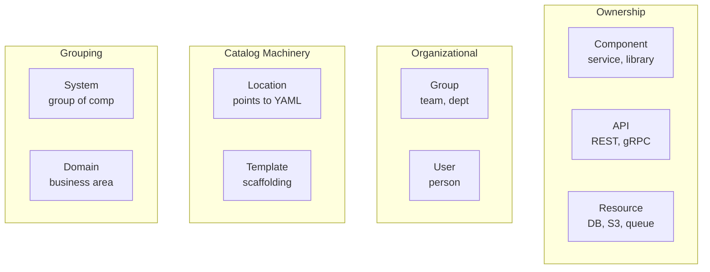
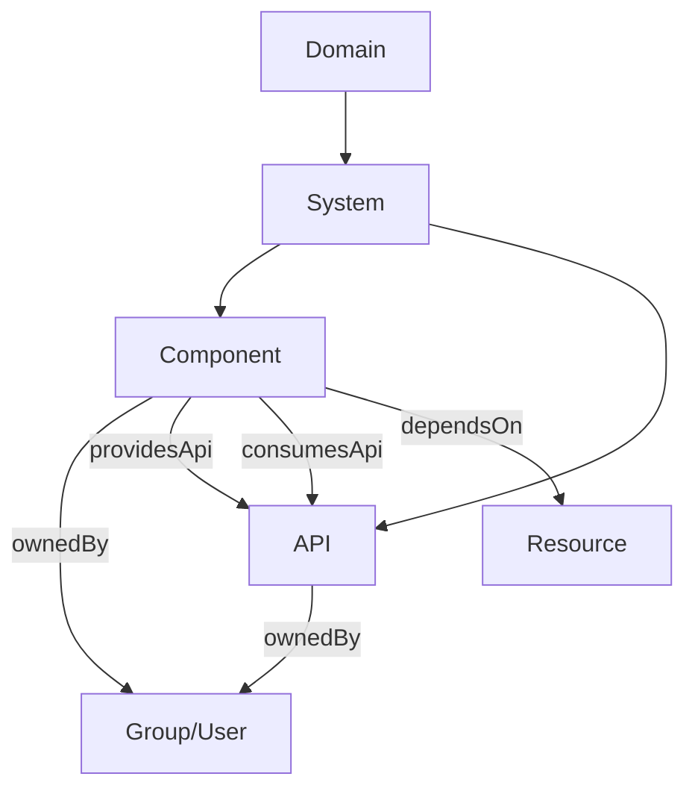
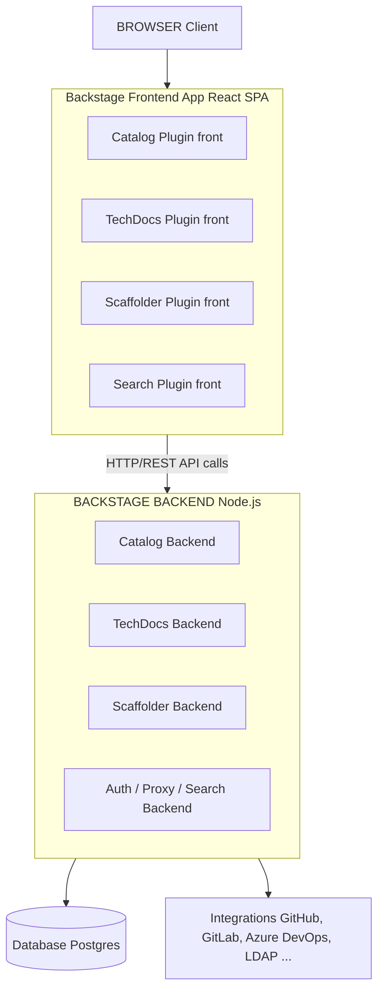
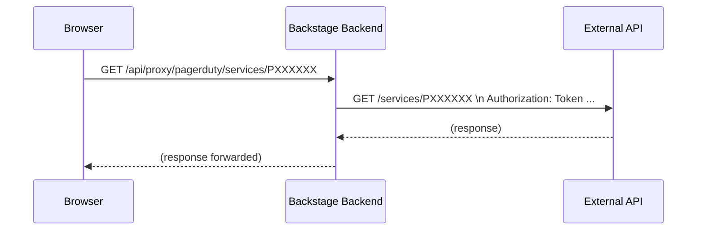

> **Complexity**: `[COMPLEX]` - Covers two exam domains (44% of CBA combined)
>
> **Time to Complete**: 60-75 minutes
>
> **Prerequisites**: Module 1 (Backstage Overview), Module 2 (Plugins & Extensibility)

## What You'll Be Able to Do

After completing this module, you will be able to:

1. **Design** a resilient catalog taxonomy that models organizational ownership, architectural dependencies, and API contracts.
2. **Implement** entity providers and discovery mechanisms to ingest software components securely from external version control systems.
3. **Diagnose** catalog ingestion failures and orphaned entities by interpreting pipeline processing logs and catalog API responses.
4. **Evaluate** infrastructure configurations for production readiness, comparing local development setups with robust, database-backed deployments.
5. **Debug** cross-origin resource sharing (CORS) and external API connectivity issues using the Backstage proxy architecture.

---

## Why This Module Matters

In early 2019, a major financial services company experienced a catastrophic, cascading failure across its payment gateways. An unowned, legacy microservice—forgotten after an internal reorganization—failed silently due to an expired certificate. Because there was no centralized registry of software ownership, incident responders spent six critical hours just trying to figure out which team had the access and knowledge to restart the component. During that time, the company lost an estimated $4 million in transaction processing fees. This incident highlighted a growing industry crisis: as microservice architectures scale, the complexity of tracking ownership, APIs, and infrastructure dependencies vastly outpaces human communication.

The financial impact of such "ghost services" is staggering. Without a unified system of record, organizations bleed engineering hours into duplicate work and prolonged outages. This exact pain point drove Spotify to create their internal developer portal, which eventually became Backstage. Backstage was open sourced by Spotify on March 16, 2020. Since then, it has fundamentally transformed how platform engineering teams operate. Marketing materials often state that Backstage has been adopted by more than 3,000 companies or 3,400 organizations and used by over 2 million developers. However, these adoption figures vary across sources, and a single authoritative primary source with a verifiable methodology and date could not be retrieved. Similarly, there are claims that Backstage captures 89% of the Internal Developer Portal (IDP) market compared to SaaS competitors. Note that this statistic appeared only in secondary blog summaries and could not be traced to an authoritative primary source such as Gartner or Forrester.

Understanding the Backstage Software Catalog is non-negotiable for platform engineers. It provides a single pane of glass over every service, API, team, and piece of infrastructure your organization owns. The CBA exam dedicates a full 22% of its questions to the catalog and another 22% to infrastructure. Mastering these concepts means you are already halfway to passing the exam, and more importantly, you are equipped to prevent the kind of multi-million dollar outages caused by fragmented software ownership.

> **The Library Analogy**
>
> Think of the Backstage catalog as a library's card catalog system. Every book (Component) has a card describing it—author, genre, location. Some books reference other books (API relationships). The librarian (entity processor) receives new books, catalogs them, and shelves them. The building itself—shelves, lighting, HVAC—is the infrastructure. You need both: a great catalog system is useless if the building has no electricity, and a beautiful building with empty shelves helps nobody.

---

## Did You Know?

1. Backstage was open sourced by Spotify on March 16, 2020.
2. Backstage entered the CNCF Sandbox on September 8, 2020, and was later promoted to the CNCF Incubating maturity level on March 15, 2022.
3. The Certified Backstage Associate (CBA) exam is a 90-minute proctored multiple-choice exam that costs $250 and includes one free retake. It covers Development Workflow, Infrastructure, and Catalog domains.
4. In version 1.49.0, newly created Backstage apps use the New Frontend System by default. This release replaced the previous `--next` flag for `create-app` with a `--legacy` flag for applications that want to maintain the old system, marking the release candidate for version 1.0 of the New Frontend System.

---

## The Software Catalog Foundations

### Understanding Entity Kinds

Everything in the Backstage catalog is an **entity**. Each entity has a `kind`, an `apiVersion`, `metadata`, and a `spec`. The eight built-in versioned entity kinds are Component, API, Resource, System, Domain, User, Group, and Location. Template is an additional kind used by the Scaffolder feature. Software Templates use kind: Template in their YAML descriptor, stored in a Git repository accessible to Backstage. Each template defines parameters and steps executed by the scaffolding service.



| Kind | Purpose | Example |
|------|---------|---------|
| **Component** | A piece of software (service, website, library) | `payments-service`, `react-ui-library` |
| **API** | A boundary between components (REST, gRPC, GraphQL, AsyncAPI) | `payments-api` (OpenAPI spec) |
| **Resource** | Physical or virtual infrastructure a component depends on | `orders-db` (PostgreSQL), `events-queue` (Kafka topic) |
| **System** | A collection of components and APIs that form a product | `payments-system` (groups payments service + API + DB) |
| **Domain** | A business area grouping related systems | `finance` (groups payments, billing, invoicing systems) |
| **Group** | A team or organizational unit | `platform-team`, `backend-guild` |
| **User** | An individual person | `jane.doe` |
| **Location** | A pointer to other entity definition files | A URL referencing a `catalog-info.yaml` in a repo |
| **Template** | A software template for scaffolding new projects | `springboot-service-template` |

**Key relationships between entity kinds:**



Per official system model documentation: Resources are the infrastructure a component needs to operate at runtime, such as BigTable databases, Pub/Sub topics, S3 buckets, or CDNs.

> **Stop and think**: If a component writes data to an AWS S3 bucket and publishes events to an Apache Kafka topic, how many Resource entities should you define in your catalog? Should the team that owns the component also own the Resource entities?

### Describing Entities: YAML Descriptors

Every entity is described by a YAML descriptor. Although catalog entity descriptor files can be named anything, the official recommendation is `catalog-info.yaml`, and it typically lives at the root of a repository.

```yaml
# catalog-info.yaml
apiVersion: backstage.io/v1alpha1
kind: Component
metadata:
  name: payments-service
  description: Handles all payment processing
  annotations:
    github.com/project-slug: myorg/payments-service
    backstage.io/techdocs-ref: dir:.
  tags:
    - java
    - payments
  links:
    - url: https://payments.internal.myorg.com
      title: Production
      icon: dashboard
spec:
  type: service
  lifecycle: production
  owner: team-payments
  system: payments-system
  providesApis:
    - payments-api
  dependsOn:
    - resource:payments-db
```

**Required fields for every entity:**
- `apiVersion` — As of the most recent official documentation, catalog entity descriptors still use `apiVersion: backstage.io/v1alpha1`. A GitHub issue (#2391) was opened to remove the alpha label, but the alpha version remains the documented and in-use schema.
- `kind` — one of the built-in kinds discussed above.
- `metadata.name` — unique within its kind+namespace; lowercase, hyphens, max 63 chars.
- `spec` — varies by kind. For example, official documentation and examples show `service`, `website`, and `library` as well-known Component types. The catalog accepts any string value for `spec.type`. Similarly, the official Backstage docs define three well-known lifecycle values: `experimental` (early/non-production), `production` (established/maintained), and `deprecated` (end-of-lifecycle). Any string is technically accepted here as well.

Entity references in Backstage use the format `[<kind>:][<namespace>/]<name>`. The default namespace value is `default`. All three parts are required in external/protocol contexts, though within the same namespace or kind, they can sometimes be shortened.

### Annotations and Entity Discovery

Annotations are the glue between catalog entities and Backstage plugins. They tell plugins where to find data about a component. This is a critical exam topic.

| Annotation | What It Does |
|------------|-------------|
| `github.com/project-slug` | Links entity to a GitHub repo (`org/repo`) |
| `backstage.io/techdocs-ref` | Tells TechDocs where to find docs (`dir:.` = same repo) |
| `backstage.io/source-location` | Source code URL for the entity |
| `jenkins.io/job-full-name` | Links to a Jenkins job |
| `pagerduty.com/service-id` | Links to PagerDuty for on-call info |
| `backstage.io/managed-by-location` | Which Location entity registered this entity |
| `backstage.io/managed-by-origin-location` | Original Location that first introduced the entity |

Annotations are how Backstage stays loosely coupled. The core catalog does not know about Jenkins or PagerDuty. Plugins read annotations to find the data they need.

---

## Catalog Ingestion and Processing

### Manual Registration

The simplest way to get entities into the catalog is **manual registration** using Location entities. You can do this via the UI, or by creating static locations.

```yaml
# app-config.yaml
catalog:
  locations:
    - type: url
      target: https://github.com/myorg/payments-service/blob/main/catalog-info.yaml
      rules:
        - allow: [Component, API]

    - type: file
      target: ../../examples/all-components.yaml
      rules:
        - allow: [Component, System, Domain]
```

**Location entity YAML** (can also be its own file):

```yaml
apiVersion: backstage.io/v1alpha1
kind: Location
metadata:
  name: myorg-payments
  description: Payments team components
spec:
  type: url
  targets:
    - https://github.com/myorg/payments-service/blob/main/catalog-info.yaml
    - https://github.com/myorg/payments-api/blob/main/catalog-info.yaml
```

> **Exam tip:** A Location entity can reference multiple targets. This is useful for registering many repos at once without automated discovery.

### Automated Ingestion

Manual registration does not scale. For organizations with hundreds or thousands of repos, Backstage supports **discovery providers** that automatically find and register entities. Backstage provides GitHub Discovery, GitLab Discovery, and Bitbucket Server Discovery processors/providers that scan source-code repositories for `catalog-info.yaml` files.

**GitHub Discovery:**

```yaml
# app-config.yaml
catalog:
  providers:
    githubDiscovery:
      myOrgProvider:
        organization: 'myorg'
        catalogPath: '/catalog-info.yaml'   # where to look in each repo
        schedule:
          frequency: { minutes: 30 }
          timeout: { minutes: 3 }
```

**GitLab Discovery:**

```yaml
catalog:
  providers:
    gitlab:
      myGitLab:
        host: gitlab.mycompany.com
        branch: main
        fallbackBranch: master
        catalogFile: catalog-info.yaml
        group: 'mygroup'                    # optional: limit to a group
        schedule:
          frequency: { minutes: 30 }
          timeout: { minutes: 3 }
```

**GitHub Org Data Provider** (for users and teams):

```yaml
catalog:
  providers:
    githubOrg:
      myOrgProvider:
        id: production
        orgUrl: https://github.com/myorg
        schedule:
          frequency: { hours: 1 }
          timeout: { minutes: 10 }
```

> **Pause and predict**: If you set up GitHub Discovery for an organization with 500 repositories, but only 200 of them contain a `catalog-info.yaml` file, how many Component entities will be created? What happens to the other 300 repositories?

### The Processing Pipeline

Backstage catalog entity ingestion relies on two mechanisms: Entity Providers and Processors. Entity providers read raw definitions from configured sources (static locations, discovery integrations, custom providers). Processors analyze descriptor data, validate, and attach status entries. Both are required for a fully stitched catalog entity.

```mermaid
flowchart LR
    subgraph Ingestion
        L[Locations]
        D[Discovery]
        P[Providers]
    end

    subgraph Processing
        V[Validate YAML]
        R[Run processors]
        E[Emit entities]
        Err[Emit errors]
    end

    subgraph Stitching
        Ref[Resolve refs]
        B[Build relation graph]
        F[Final entity]
    end

    Ingestion -->|Entity enters pipeline| Processing
    Processing -->|Entity validated & enriched| Stitching
    Stitching -->|Entity visible in catalog| Final[Catalog]
```



**Custom entity providers** let you ingest entities from any source. They implement the `EntityProvider` interface:

```typescript
import { EntityProvider, EntityProviderConnection } from '@backstage/plugin-catalog-node';

class MyCustomProvider implements EntityProvider {
  getProviderName(): string {
    return 'my-custom-provider';
  }

  async connect(connection: EntityProviderConnection): Promise<void> {
    // Fetch entities from your custom source
    const entities = await fetchFromMySource();

    await connection.applyMutation({
      type: 'full',
      entities: entities.map(entity => ({
        entity,
        locationKey: 'my-custom-provider',
      })),
    });
  }
}
```

### Catalog API and Pagination

The Backstage Catalog REST API exposes a `GET /entities/by-query` endpoint with cursor-based pagination, superseding the older paginated `GET /entities` endpoint. This `by-query` endpoint provides cursor-based pagination via a cursor parameter returned in the `pageInfo` property of the response (`nextCursor` / `prevCursor`). Note that full-text filtering is mutually exclusive with cursor pagination.

### Troubleshooting the Catalog

When an entity is not appearing after registration, check this list:

| Symptom | Likely Cause | Fix |
|---------|-------------|-----|
| Entity never shows up | Invalid YAML or schema violation | Check the catalog import page for errors |
| Entity appears then disappears | `rules` in app-config block the entity kind | Add the kind to `rules: allow` |
| Stale data after repo update | Refresh cycle has not run yet | Manually refresh via catalog API or wait ~100-200s |
| Entity shows as orphaned | The Location that registered it was deleted | Re-register or remove the orphan |
| Relationships broken | Referenced entity name does not match | Check exact `name` fields; they are case-sensitive |

**Orphaned entities** occur when the Location that originally registered an entity is removed, but the entity itself remains. Backstage marks these as orphans. You can list and delete them via the API:

```bash
# List orphaned entities via the Backstage catalog API
curl http://localhost:7007/api/catalog/entities?filter=metadata.annotations.backstage.io/orphan=true

# Delete a specific orphaned entity
curl -X DELETE http://localhost:7007/api/catalog/entities/by-uid/<entity-uid>
```

**Forcing a refresh:**

```bash
# Refresh a specific entity
curl -X POST http://localhost:7007/api/catalog/refresh \
  -H 'Content-Type: application/json' \
  -d '{"entityRef": "component:default/payments-service"}'
```

---

## Infrastructure and Architecture

### Framework Architecture

The software catalog is the beating heart of Backstage. Without it, Backstage is just a plugin framework with a pretty UI. With it, you have a single pane of glass for all your organizational data. You can run Backstage without a single plugin installed. The catalog alone provides enough value that some organizations deploy it purely as a service directory.

Backstage is a Node.js application with a clear client-server split:



While frequent Backstage releases mean the exact version can change daily, early 2026 search results confirm v1.49.0 as a major recent milestone, though the exact latest version current on April 12, 2026, cannot be definitively confirmed without a live query to the GitHub releases page. Backstage remains at CNCF Incubating level as of April 2026. No graduation announcement has been made.

When deploying Backstage, TechDocs uses MkDocs behind the scenes to convert Markdown files into a static HTML documentation site, with Backstage adding layers for content preparation, storage, and safe rendering inside the UI. The recommended TechDocs setup is to generate docs in CI/CD and store output to an external storage provider (e.g., AWS S3 or Google Cloud Storage) rather than generating on the Backstage server. The basic/out-of-the-box setup generates and stores locally on the Backstage server but is not recommended for production.

Additionally, the Backstage Kubernetes feature consists of two packages: `@backstage/plugin-kubernetes` (frontend) and `@backstage/plugin-kubernetes-backend`. The frontend surfaces workload health and deployment status; the backend handles cluster connectivity.

### Configuration via app-config.yaml

The `app-config.yaml` file is the central configuration for a Backstage instance.

```yaml
# app-config.yaml — Top-level structure
app:
  title: My Company Backstage
  baseUrl: http://localhost:3000          # Frontend URL

backend:
  baseUrl: http://localhost:7007          # Backend URL
  listen:
    port: 7007
  database:
    client: better-sqlite3                # dev default
    connection: ':memory:'
  cors:
    origin: http://localhost:3000

organization:
  name: MyOrg

integrations:
  github:
    - host: github.com
      token: ${GITHUB_TOKEN}              # environment variable substitution

auth:
  providers:
    github:
      development:
        clientId: ${AUTH_GITHUB_CLIENT_ID}
        clientSecret: ${AUTH_GITHUB_CLIENT_SECRET}

proxy:
  endpoints:
    '/pagerduty':
      target: https://api.pagerduty.com
      headers:
        Authorization: Token token=${PAGERDUTY_TOKEN}

catalog:
  locations: []
  providers: {}
  rules:
    - allow: [Component, System, API, Resource, Location, Domain, Group, User, Template]
```

**Configuration layering:**

```bash
# You can pass multiple config files — later files override earlier ones
node packages/backend --config app-config.yaml --config app-config.production.yaml
```

### The Backstage Proxy

**The Backstage proxy** (`/api/proxy`) lets the frontend call external APIs without exposing credentials to the browser—a pattern so useful that many teams use Backstage as their universal API gateway during development.

```yaml
# app-config.yaml
proxy:
  endpoints:
    '/pagerduty':
      target: https://api.pagerduty.com
      headers:
        Authorization: Token token=${PAGERDUTY_TOKEN}
    '/grafana':
      target: https://grafana.internal.myorg.com
      headers:
        Authorization: Bearer ${GRAFANA_TOKEN}
      allowedHeaders: ['Content-Type']
```



### Production Deployment

Moving to production requires robust backing infrastructure:

**Database — switch to PostgreSQL:**
SQLite is the default in `@backstage/create-app` (in-memory, for initial experimentation). PostgreSQL is the preferred production database. MySQL variants are reported to work but are not officially tested. Backstage uses Knex as the database abstraction layer.

```yaml
# app-config.production.yaml
backend:
  database:
    client: pg
    connection:
      host: ${POSTGRES_HOST}
      port: ${POSTGRES_PORT}
      user: ${POSTGRES_USER}
      password: ${POSTGRES_PASSWORD}
```

**HTTPS and base URLs:**

```yaml
app:
  baseUrl: https://backstage.mycompany.com

backend:
  baseUrl: https://backstage.mycompany.com
  cors:
    origin: https://backstage.mycompany.com
```

**Authentication:**

```yaml
auth:
  environment: production
  providers:
    github:
      production:
        clientId: ${AUTH_GITHUB_CLIENT_ID}
        clientSecret: ${AUTH_GITHUB_CLIENT_SECRET}
```

### Client-Server Architecture Flow

```text
1. User opens browser → loads React SPA from backend (static files)
2. SPA boots → calls backend APIs: /api/catalog, /api/techdocs, etc.
3. Backend plugins handle API calls → query database, call integrations
4. Backend returns JSON → SPA renders UI
5. For external data → SPA calls /api/proxy/* → backend forwards to external APIs
```

---

## War Story: The Case of the 10,000 Orphaned Entities

A platform team at a mid-size fintech company set up GitHub discovery to auto-register every repo in their organization. Within a week, the catalog had 10,000 entities—but morale was not what they expected. Developers were complaining that search was useless. The catalog was full of archived repos, forks, test projects, and abandoned experiments.

Worse, when they tried to clean up by deleting the discovery provider config, the entities did not disappear. They became orphaned entities. They remained in the catalog but were no longer refreshed. The team spent two days writing scripts to bulk-delete orphans via the catalog API.

**Lessons learned:**
1. Always scope discovery providers with filters.
2. Understand the orphan lifecycle before removing discovery providers.
3. Start with manual registration for your most important services.
4. Use `catalog.rules` to restrict which entity kinds can be registered from which sources.

---

## Common Mistakes

| Mistake | Why It Happens | What To Do Instead |
|---------|---------------|-------------------|
| Using SQLite in production | It is the default and "works" in dev | Always configure PostgreSQL for production |
| Not scoping discovery providers | GitHub discovery imports *every* repo | Use topic filters, path patterns, or allowlists |
| Expecting instant catalog updates | Developers register YAML and refresh the page immediately | Explain the ~100-200s refresh cycle; use manual refresh API for urgent updates |
| Hardcoding secrets in app-config.yaml | Copy-pasting tokens during setup | Use `${ENV_VAR}` substitution; never commit secrets |
| Forgetting `rules: allow` for entity kinds | Register a Template but it never appears | Each Location source needs explicit `rules` for allowed kinds |
| Running TLS termination in Node.js | Seems simpler than a reverse proxy | Use an ingress controller or load balancer for TLS; Node.js TLS is not needed |
| Not configuring auth for production | Dev mode works without it | Every production instance must have authentication enabled |
| Ignoring orphaned entities | They accumulate silently | Monitor orphan count; establish a cleanup process |

---

## Quiz

Test your understanding of Backstage catalog and infrastructure.

**Q1: Which entity kind represents a boundary between components?**

<details>
<summary>Answer</summary>

**API**. The API kind represents a contract/boundary between components. A Component `providesApi` and another Component `consumesApi`. API entities can describe REST (OpenAPI), gRPC (protobuf), GraphQL, or AsyncAPI interfaces.

</details>

**Q2: What is the default refresh interval for catalog entity processing?**

<details>
<summary>Answer</summary>

Approximately **100-200 seconds**. The catalog processing loop continuously cycles through entities, but there is no guarantee of instant updates. You can trigger a manual refresh via `POST /api/catalog/refresh` with the `entityRef`.

</details>

**Q3: How do you inject secrets into app-config.yaml?**

<details>
<summary>Answer</summary>

Use **environment variable substitution** with `${VARIABLE_NAME}` syntax. For example: `token: ${GITHUB_TOKEN}`. Backstage resolves these at startup from the process environment. Never hardcode secrets in config files.

</details>

**Q4: What is the purpose of the Backstage proxy plugin?**

<details>
<summary>Answer</summary>

The proxy plugin (`/api/proxy`) forwards requests from the frontend through the backend to external APIs. This solves CORS issues and keeps API credentials server-side. The browser never sees the external service tokens—only the backend injects them before forwarding.

</details>

**Q5: Name two ways entities can be registered in the catalog.**

<details>
<summary>Answer</summary>

1. **Manual registration** — via the UI ("Register Existing Component" button) or by adding static Location entries in `app-config.yaml` under `catalog.locations`.
2. **Automated discovery** — using providers like `githubDiscovery`, `gitlab`, or `githubOrg` configured under `catalog.providers` in `app-config.yaml`.

Other valid answers include: custom entity providers (programmatic) or direct API calls.

</details>

**Q6: What database should be used for a production Backstage deployment?**

<details>
<summary>Answer</summary>

**PostgreSQL**. SQLite (or better-sqlite3) is only suitable for local development. PostgreSQL supports concurrent connections, is durable, and handles the catalog processing workload in production. Configure it via `backend.database.client: pg` in `app-config.production.yaml`.

</details>

**Q7: What happens to entities when their source Location is deleted?**

<details>
<summary>Answer</summary>

They become **orphaned entities**. They remain in the catalog but are no longer refreshed from their source. Orphans are flagged with the annotation `backstage.io/orphan: 'true'`. They should be cleaned up either through the UI or via the catalog API (`DELETE /api/catalog/entities/by-uid/<uid>`).

</details>

**Q8: How does configuration layering work in Backstage?**

<details>
<summary>Answer</summary>

You pass multiple `--config` flags when starting the backend: `node packages/backend --config app-config.yaml --config app-config.production.yaml`. Later files override values from earlier files (deep merge). Common pattern: base config, production overrides, and a gitignored local config for personal development settings.

</details>

**Q9: Which annotation links a Backstage entity to its GitHub repository?**

<details>
<summary>Answer</summary>

`github.com/project-slug` with the value `org/repo-name`. For example: `github.com/project-slug: myorg/payments-service`. This annotation is read by GitHub-related plugins to display pull requests, CI status, code owners, and other repo-level information.

</details>

**Q10: In a production Kubernetes deployment of Backstage, why should catalog processing run on a single replica?**

<details>
<summary>Answer</summary>

To avoid **duplicate processing work** and potential conflicts. If multiple replicas all run the processing loop simultaneously, they may redundantly fetch the same sources, create duplicate refresh cycles, and potentially conflict on database writes. The `@backstage/plugin-catalog-backend` supports leader election to ensure only one replica performs catalog processing while others handle API requests.

</details>

---

## Hands-On Exercise: Build a Multi-Entity Catalog

**Objective:** Create a complete catalog structure with multiple entity kinds, register them, and verify the relationships.

**What you'll need:** A running Backstage instance (`npx @backstage/create-app@legacy` if you do not have one).

### Step 1: Create the Entity Descriptors

Create a file called `catalog-entities.yaml` in your Backstage project root:

```yaml
---
apiVersion: backstage.io/v1alpha1
kind: Domain
metadata:
  name: commerce
  description: All commerce-related systems
spec:
  owner: group:platform-team

---
apiVersion: backstage.io/v1alpha1
kind: System
metadata:
  name: orders-system
  description: Handles order lifecycle
spec:
  owner: group:backend-team
  domain: commerce

---
apiVersion: backstage.io/v1alpha1
kind: Component
metadata:
  name: orders-service
  description: REST API for order management
  annotations:
    backstage.io/techdocs-ref: dir:.
  tags:
    - java
    - springboot
spec:
  type: service
  lifecycle: production
  owner: group:backend-team
  system: orders-system
  providesApis:
    - orders-api
  dependsOn:
    - resource:orders-db

---
apiVersion: backstage.io/v1alpha1
kind: API
metadata:
  name: orders-api
  description: Orders REST API
spec:
  type: openapi
  lifecycle: production
  owner: group:backend-team
  system: orders-system
  definition: |
    openapi: "3.0.0"
    info:
      title: Orders API
      version: 1.0.0
    paths:
      /orders:
        get:
          summary: List orders
          responses:
            '200':
              description: OK

---
apiVersion: backstage.io/v1alpha1
kind: Resource
metadata:
  name: orders-db
  description: PostgreSQL database for orders
spec:
  type: database
  owner: group:backend-team
  system: orders-system

---
apiVersion: backstage.io/v1alpha1
kind: Group
metadata:
  name: backend-team
  description: Backend engineering team
spec:
  type: team
  children: []

---
apiVersion: backstage.io/v1alpha1
kind: Group
metadata:
  name: platform-team
  description: Platform engineering team
spec:
  type: team
  children: []
```

### Step 2: Register via app-config.yaml

Add to your `app-config.yaml`:

```yaml
catalog:
  rules:
    - allow: [Component, System, API, Resource, Location, Domain, Group, User, Template]
  locations:
    - type: file
      target: ./catalog-entities.yaml
      rules:
        - allow: [Domain, System, Component, API, Resource, Group]
```

### Step 3: Start Backstage and Verify

```bash
# Start Backstage in development mode
yarn dev
```

Open `` `http://localhost:3000` `` and verify:

1. Navigate to the **Catalog** — you should see `orders-service` listed as a Component
2. Click on `orders-service` — verify the **System** is `orders-system`
3. Check the **API** tab — `orders-api` should appear under "Provided APIs"
4. Check the **Dependencies** tab — `orders-db` should appear
5. Navigate to `orders-system` — verify it groups the component, API, and resource
6. Navigate to the `commerce` Domain — verify it contains `orders-system`

### Step 4: Test the Proxy (Optional)

Add a proxy endpoint to `app-config.yaml`:

```yaml
proxy:
  endpoints:
    '/jsonplaceholder':
      target: https://jsonplaceholder.typicode.com
```

Restart the backend and test:

```bash
# This request goes through the Backstage proxy
curl http://localhost:7007/api/proxy/jsonplaceholder/todos/1
```

You should get a JSON response from jsonplaceholder.typicode.com, forwarded through your Backstage backend.

### Success Criteria

<details>
<summary>Checklist</summary>

- [ ] All seven entities appear in the catalog
- [ ] `orders-service` shows correct owner (`backend-team`), system, API, and dependency
- [ ] Domain > System > Component hierarchy is visible in the UI
- [ ] You understand the refresh cycle (modify an entity, observe the delay before the catalog updates)
- [ ] Proxy endpoint returns data from the external API (optional)

</details>

---

## Key Takeaways

| Topic | Remember This |
|-------|--------------|
| Entity kinds | 9 built-in: Component, API, Resource, System, Domain, Group, User, Location, Template |
| catalog-info.yaml | Lives in repo root; `apiVersion`, `kind`, `metadata`, `spec` are required |
| Annotations | Connect entities to plugins; key discovery mechanism |
| Registration | Manual (UI or static locations) vs. automated (discovery providers) |
| Processing | Continuous loop with ~100-200s cycle; ingestion → processing → stitching |
| Architecture | React SPA frontend + Node.js backend + PostgreSQL database |
| app-config.yaml | Layered config; `${ENV_VAR}` for secrets; `--config` flag for overrides |
| Proxy | `/api/proxy/*` forwards frontend requests through backend to external APIs |
| Production | PostgreSQL, HTTPS (via ingress), authentication required, single processing replica |

---

## Next Module

**[CBA Track Overview: Domain 4 - Templates and Scaffolder](../module-1.4-templates-scaffolder)** — Discover how to standardize new project creation by **design**ing a catalog taxonomy that models your organization's ownership, dependencies, and API contracts. Provide a golden path for developers using Backstage Software Templates and the Scaffolder plugin.