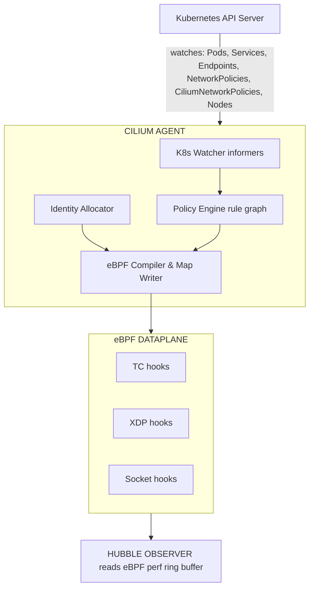
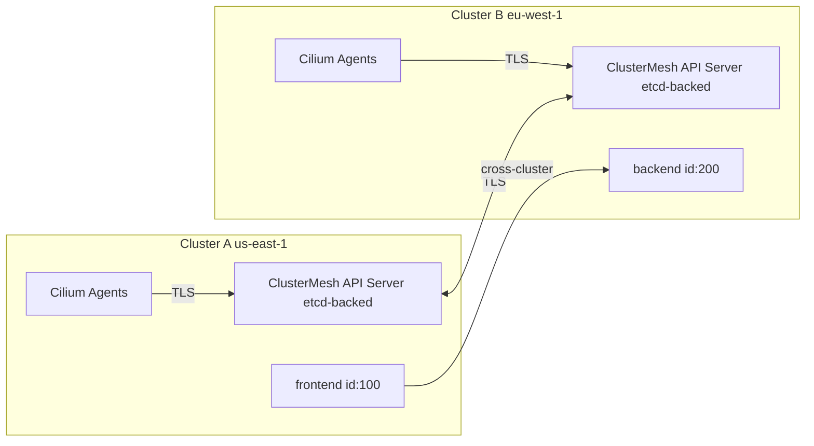
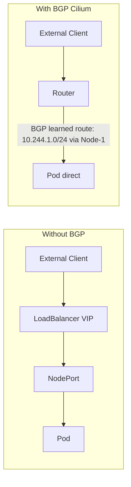

> **CCA Track** | Complexity: `[COMPLEX]` | Time: 75-90 minutes

## Prerequisites

- [Cilium Toolkit Module](/platform/toolkits/infrastructure-networking/networking/module-5.1-cilium/) -- eBPF fundamentals, basic Cilium architecture, identity-based security
- [Hubble Toolkit Module](/platform/toolkits/observability-intelligence/observability/module-1.7-hubble/) -- Hubble CLI, flow observatio
- Kubernetes networking basics (Services, Pods, DNS)
- Comfort with `kubectl` and YAML targeting Kubernetes v1.35+

---

## What You'll Be Able to Do

After completing this module, you will be able to:

1. **Analyze** Cilium's eBPF datapath architecture, explaining how endpoint programs, BPF maps, and identity-based policy enforcement work at the kernel level.
2. **Configure** `CiliumNetworkPolicy` and `CiliumClusterwideNetworkPolicy` with L3/L4/L7 rules, DNS-aware filtering, and host-level policies.
3. **Deploy** Cluster Mesh for multi-cluster service discovery and implement BGP peering for native pod IP advertisement.
4. **Operate** Cilium using the CLI (`cilium status`, `cilium connectivity test`) and Hubble for real-time flow visibility.
5. **Evaluate** advanced routing configurations including Gateway API, Bandwidth Manager, and Egress Gateways.

---

## Why This Module Matters

Consider a historical case: a major e-commerce provider was migrating from an aging Kubernetes cluster (v1.24) to a new one (v1.29). They couldn't afford downtime -- the payment API processed $2M per hour. Their legacy networking stack collapsed under the state synchronization load, leading to cascading connection drops during a massive holiday sale. By leveraging Cilium's eBPF datapath and Cluster Mesh, they successfully bridged the environments, establishing a seamless, cross-cluster communication layer that prevented massive revenue loss. 

A junior engineer knows "Cilium uses eBPF for networking." A CCA-certified engineer knows that the Cilium agent on each node compiles endpoint-specific eBPF programs, attaches them to the TC (traffic control) hook on each pod's veth pair, and uses eBPF maps shared across programs to enforce identity-aware policy decisions in O(1) time -- without a single iptables rule.

That depth is what separates passing from failing. This module fills every gap between our existing content and what the CCA demands: architecture internals, policy enforcement modes, Cluster Mesh, BGP peering, and the Cilium CLI workflows you need to know cold.

---

## CCA Exam Domain Breakdown

The CNCF CCA exam consists of 8 rigorous domains. This module thoroughly prepares you for them:
- **Architecture** (20%)
- **Network Policy** (18%)
- **Service Mesh** (16%)
- **Network Observability** (10%)
- **Installation and Configuration** (10%)
- **Cluster Mesh** (10%)
- **eBPF** (10%)
- **BGP and External Networking** (6%)

---

## Did You Know?

- **Cilium's current latest stable release is v1.19.2**; v1.20.0 is currently in pre-release. It is a highly mature CNCF Graduated project (accepted as Incubating on 2021-10-13 and officially graduated on 2023-10-11).
- **Cilium XDP acceleration** for kube-proxy replacement has been available since Cilium 1.8. It bypasses the kernel network stack entirely but requires a native XDP-supported NIC driver.
- **Gateway API v1.4.1** is natively supported by Cilium, passing all Core conformance tests across HTTP, TLS, and gRPC profiles.
- **Hubble UI is still in Beta status** as of Cilium 1.19.x stable, though the underlying Hubble flow observation and Relay components are fully stable and heavily relied upon in production.

---

## Part 1: Cilium Architecture in Depth

The Toolkit module showed you the big picture. Now let's open each box.

### The Cilium Agent (DaemonSet)

The agent is the workhorse. One runs on every node. It interfaces directly with the eBPF data plane for highly efficient L3/L4 processing (IP, TCP, UDP). 



**What each sub-component does:**

| Component | Role | Why It Matters |
|-----------|------|----------------|
| K8s Watcher | Receives events from API server via informers | Detects pod creation, policy changes, service updates |
| Identity Allocator | Maps label sets to numeric identities | Enables O(1) policy lookups instead of label matching |
| Policy Engine | Builds a rule graph from all applicable policies | Determines allowed (src identity, dst identity, port, L7) tuples |
| eBPF Compiler | Generates per-endpoint eBPF programs | Tailored programs = faster enforcement, no generic rule walk |
| eBPF Maps | Shared kernel data structures (hash maps, LPM tries) | Policy decisions, connection tracking, NAT, service lookup |
| Hubble Observer | Reads the perf event ring buffer from eBPF programs | Every forwarded/dropped packet becomes a flow event |

### The Cilium Operator (Deployment)

The operator handles cluster-wide coordination. There is **one active instance** per cluster (with leader election for HA).

```text
CILIUM OPERATOR RESPONSIBILITIES
================================================================

1. IPAM (IP Address Management)
   - Allocates pod CIDR ranges to nodes
   - In "cluster-pool" mode: carves /24 blocks from a larger pool
   - In AWS ENI mode: manages ENI attachment and IP allocation

2. CRD Management
   - CRD management and garbage collection of stale CiliumIdentity objects

3. Cluster Mesh
   - Manages the clustermesh-apiserver deployment
   - Synchronizes identities across clusters

4. Resource Cleanup
   - Removes orphaned CiliumEndpoints when pods are deleted
   - Cleans up leaked IPs from terminated nodes
   - Identity garbage collection pauses (stale identities accumulate) if it goes down.
```

**Key exam point**: The operator does NOT enforce policies or program eBPF. If the operator goes down, existing networking continues to work. New pod CIDR alloc requests will fail, but running workloads remain unaffected.

### IPAM and Networking Modes

Cilium supports both overlay (VXLAN, Geneve) and native routing networking modes. The CCA expects you to know when to use each IPAM strategy alongside these modes. 

| IPAM Mode | How It Works | When to Use |
|-----------|-------------|-------------|
| `cluster-pool` (default) | Operator allocates /24 CIDRs from a configurable pool to each node. Agent assigns IPs from its node's pool. | Most clusters. Simple, works everywhere. |
| `kubernetes` | Delegates to the Kubernetes `--pod-cidr` allocation (node.spec.podCIDR). | When you want K8s to control CIDR allocation. |
| `multi-pool` | Multiple named pools with different CIDRs. Pods select pool via annotation. | Multi-tenant clusters needing separate IP ranges. |
| `eni` (AWS) | Allocates IPs directly from AWS ENI secondary addresses. Pods get VPC-routable IPs. | AWS EKS. No overlay needed. Native VPC routing. |
| `azure` | Allocates from Azure VNET. Similar to ENI mode for Azure. | AKS clusters. |
| `crd` | External IPAM controller manages CiliumNode CRDs. | Custom IPAM integrations. |

```bash
# Check which IPAM mode your cluster uses
cilium config view | grep ipam

# In cluster-pool mode, see the allocated ranges
kubectl get ciliumnodes -o jsonpath='{range .items[*]}{.metadata.name}: {.spec.ipam.podCIDRs}{"\n"}{end}'
```

### The kube-proxy Replacement
Cilium can fully replace `kube-proxy` using eBPF, effectively handling NodePort, LoadBalancer, and externalIPs services natively. This replacement requires a Linux kernel of >= 4.19.57, >= 5.1.16, or >= 5.2.0, with kernel >= 5.3 highly recommended for optimal performance.

---

## Part 2: CiliumNetworkPolicy vs Kubernetes NetworkPolicy

Cilium ships two specific policy CRDs: `CiliumNetworkPolicy` (namespace-scoped) and `CiliumClusterwideNetworkPolicy` (cluster-scoped). With v1.20.0 (pre-release), Cilium also introduces Kubernetes Cluster Network Policy (BANP/ANP) support.

| Feature | K8s NetworkPolicy | CiliumNetworkPolicy |
|---------|-------------------|---------------------|
| L3/L4 filtering (IP + port) | Yes | Yes |
| Label-based pod selection | Yes | Yes (+ identity-based) |
| Namespace selection | Yes | Yes |
| **L7 HTTP filtering** (method, path, headers) | No | Yes |
| **L7 Kafka filtering** (topic, role) | No | Yes |
| **L7 DNS filtering** (FQDN) | No | Yes |
| **Entity-based rules** (host, world, dns, kube-apiserver) | No | Yes |
| **Cluster-wide scope** | No | Yes (CiliumClusterwideNetworkPolicy) |
| **CIDR-based egress with FQDN** | No | Yes (toFQDNs) |
| **Policy enforcement mode control** | No | Yes (default/always/never) |
| **Identity-aware enforcement** | No | Yes (eBPF identity lookup) |
| **Deny rules** | No (allow-only model) | Yes (explicit deny) |

> **Pause and predict**: If you have a cluster running Cilium in `default` enforcement mode, and you apply a `CiliumNetworkPolicy` to a pod that explicitly allows only port 80, what happens to traffic on port 443 for that pod?

### L7 HTTP-Aware Policies

Standard Kubernetes NetworkPolicies work strictly at L3/L4. Cilium goes further, deploying an Envoy proxy per-node (sidecarless service mesh) to enforce L7 policies natively. 

```yaml
# L7 HTTP policy: allow only specific API calls
apiVersion: cilium.io/v2
kind: CiliumNetworkPolicy
metadata:
  name: api-l7-policy
  namespace: production
spec:
  endpointSelector:
    matchLabels:
      app: api-server
  ingress:
  - fromEndpoints:
    - matchLabels:
        app: frontend
    toPorts:
    - ports:
      - port: "8080"
        protocol: TCP
      rules:
        http:
        # Allow reading products
        - method: "GET"
          path: "/api/v1/products"
        # Allow reading a specific product by ID
        - method: "GET"
          path: "/api/v1/products/[0-9]+"
        # Allow creating orders with JSON
        - method: "POST"
          path: "/api/v1/orders"
          headers:
          - 'Content-Type: application/json'
        # Everything else: DENIED
```

### Policy Enforcement Modes

```text
POLICY ENFORCEMENT MODES
================================================================

MODE: "default" (the default)
─────────────────────────────
- If NO policies select an endpoint: all traffic allowed
- If ANY policy selects an endpoint: only explicitly allowed traffic passes
- This is how standard K8s NetworkPolicy works
- Think: "policies are opt-in"

MODE: "always"
─────────────────────────────
- ALL traffic is denied unless explicitly allowed by policy
- Even endpoints with no policies get default-deny
- Think: "zero-trust by default"
- Use this in production for maximum security

MODE: "never"
─────────────────────────────
- Policy enforcement is completely disabled
- All traffic flows freely regardless of policies
- Think: "debugging mode"
- NEVER use in production. Useful for ruling out policy
  issues during troubleshooting.
```

```bash
# Check the current enforcement mode
cilium config view | grep policy-enforcement

# Change enforcement mode (requires Helm upgrade or config change)
# Via Helm:
cilium upgrade --set policyEnforcementMode=always

# Via cilium config (runtime, non-persistent):
cilium config PolicyEnforcement=always
```

### Entity-Based Rules

Cilium assigns a security identity to each workload derived from Kubernetes labels; this identity drives policy decisions. Semantic entities eliminate the need to track IP addresses.

```yaml
# Allow pods to reach essential infrastructure
apiVersion: cilium.io/v2
kind: CiliumClusterwideNetworkPolicy
metadata:
  name: allow-infrastructure
spec:
  endpointSelector: {}
  egress:
  - toEntities:
    - dns             # CoreDNS / kube-dns
    - kube-apiserver  # Kubernetes API server
  ingress:
  - fromEntities:
    - health          # Kubelet health probes
```

| Entity | Meaning |
|--------|---------|
| `host` | The node the pod runs on |
| `remote-node` | Other cluster nodes |
| `kube-apiserver` | The Kubernetes API server (regardless of IP) |
| `health` | Cilium health check probes |
| `dns` | DNS servers (kube-dns/CoreDNS) |
| `world` | Anything outside the cluster |
| `all` | Everything (use with caution) |

Additionally, Cilium supports WireGuard transparent encryption (distributed via the `network.cilium.io/wg-pub-key` annotation) and IPsec encryption (pod-to-pod is stable; node-to-node is beta). Note that IPsec transparent encryption is unsupported when chained on top of another CNI.

---

## Part 5: Gateway API, Bandwidth Manager, Egress Gateway, and L2 Announcements

### Cilium Gateway API
Cilium natively implements the Kubernetes Gateway API, replacing the need for a separate ingress controller. It uses Envoy under the hood, managed entirely by the Cilium agent. Support for GAMMA (Gateway API for Mesh) is partial; it passes Core conformance and 2 of 3 Extended Mesh tests, but consumer HTTPRoutes are not supported.

**Why this matters**: Gateway API is the successor to Ingress. Cilium's implementation means no separate NGINX or Envoy Gateway deployment -- the same agent that handles policies manages north-south traffic.

```yaml
# Gateway: the listener that accepts traffic
apiVersion: gateway.networking.k8s.io/v1
kind: Gateway
metadata:
  name: cilium-gw
  namespace: production
spec:
  gatewayClassName: cilium    # Cilium's built-in GatewayClass
  listeners:
  - name: http
    protocol: HTTP
    port: 80
    allowedRoutes:
      namespaces:
        from: Same
```

```yaml
# HTTPRoute: route HTTP traffic to backends
apiVersion: gateway.networking.k8s.io/v1
kind: HTTPRoute
metadata:
  name: app-routes
  namespace: production
spec:
  parentRefs:
  - name: cilium-gw
  rules:
  - matches:
    - path:
        type: PathPrefix
        value: /api/v1
    backendRefs:
    - name: api-service
      port: 8080
  - matches:
    - path:
        type: PathPrefix
        value: /
    backendRefs:
    - name: frontend-service
      port: 3000
```

```yaml
# GRPCRoute: route gRPC traffic to backends
apiVersion: gateway.networking.k8s.io/v1
kind: GRPCRoute
metadata:
  name: grpc-routes
  namespace: production
spec:
  parentRefs:
  - name: cilium-gw
  rules:
  - matches:
    - method:
        service: payments.PaymentService
    backendRefs:
    - name: payment-grpc
      port: 9090
```

### Bandwidth Manager
CiliumBandwidthPolicy lets you enforce rate limits using the eBPF EDT (Earliest Departure Time) scheduler.

```yaml
apiVersion: cilium.io/v2
kind: CiliumBandwidthPolicy
metadata:
  name: rate-limit-batch-jobs
spec:
  endpointSelector:
    matchLabels:
      workload-type: batch
  egress:
    rate: "50M"     # 50 Mbit/s egress cap
    burst: "10M"    # Allow short bursts up to 10 Mbit above rate
```

### Egress Gateway
CiliumEgressGatewayPolicy routes outbound traffic from selected pods through dedicated gateway nodes. External services see a predictable source IP (the gateway node's IP) instead of a random worker node. It is GA in Cilium 1.19.x, requiring BPF masquerading and kube-proxy replacement. Crucially, Egress Gateway is highly incompatible with Cluster Mesh. 

**Why you need this**: Many external firewalls, databases, and SaaS APIs allowlist traffic by source IP. Without an egress gateway, pod traffic exits from whatever node the pod runs on.

```yaml
apiVersion: cilium.io/v2
kind: CiliumEgressGatewayPolicy
metadata:
  name: db-egress-via-gateway
spec:
  selectors:
  - podSelector:
      matchLabels:
        app: backend
        needs-stable-ip: "true"
  destinationCIDRs:
  - "10.200.0.0/16"       # External database subnet
  egressGateway:
    nodeSelector:
      matchLabels:
        role: egress-gateway   # Dedicated gateway nodes
    egressIP: "192.168.1.50"   # Stable SNAT IP
```

### CiliumL2AnnouncementPolicy
Provides Layer 2 service announcement for bare-metal LoadBalancer services.

```yaml
apiVersion: cilium.io/v2alpha1
kind: CiliumL2AnnouncementPolicy
metadata:
  name: l2-services
spec:
  serviceSelector:
    matchLabels:
      l2-announce: "true"
  nodeSelector:
    matchLabels:
      node.kubernetes.io/role: worker
  interfaces:
  - eth0
  externalIPs: true
  loadBalancerIPs: true
```

```yaml
# A service that uses L2 announcement
apiVersion: v1
kind: Service
metadata:
  name: web
  labels:
    l2-announce: "true"
spec:
  type: LoadBalancer
  selector:
    app: web
  ports:
  - port: 80
    targetPort: 8080
```

---

## Part 4: Multi-Cluster with Cluster Mesh

Cluster Mesh extends the networking datapath across multiple clusters, providing global service discovery, failover, and unified identity-based policies.



> **Stop and think**: If two clusters are joined via Cluster Mesh, why must their pod CIDRs not overlap? How does Cilium route traffic to a remote pod if the local cluster has no knowledge of that pod's subnet?

| Requirement | Why |
|-------------|-----|
| Shared CA certificate | Agents authenticate to remote ClusterMesh API servers via mTLS |
| Non-overlapping pod CIDRs | Packets must be routable; overlapping CIDRs cause ambiguity |
| Network connectivity | Agents must reach remote ClusterMesh API server (port 2379 by default) |
| Unique cluster names | Each cluster needs a distinct name and numeric ID (1-255) |
| Compatible Cilium versions | Minor version skew is tolerated; major version must match |

### Global Services

```bash
# Step 1: Enable Cluster Mesh on each cluster
# On Cluster A:
cilium clustermesh enable --context kind-cluster-a --service-type LoadBalancer

# On Cluster B:
cilium clustermesh enable --context kind-cluster-b --service-type LoadBalancer

# Step 2: Connect the clusters
cilium clustermesh connect \
  --context kind-cluster-a \
  --destination-context kind-cluster-b

# Step 3: Wait for readiness
cilium clustermesh status --context kind-cluster-a --wait

# Step 4: Verify connectivity
cilium connectivity test --context kind-cluster-a --multi-cluster
```

```yaml
# A service in Cluster A that is discoverable from Cluster B
apiVersion: v1
kind: Service
metadata:
  name: payment-service
  namespace: production
  annotations:
    service.cilium.io/global: "true"
spec:
  selector:
    app: payment
  ports:
  - port: 443
```

When a pod in Cluster B resolves `payment-service.production.svc.cluster.local`, Cilium returns endpoints from BOTH clusters.

| Affinity | Behavior |
|----------|----------|
| `local` | Prefer local cluster endpoints. Use remote only if local has none. |
| `remote` | Prefer remote cluster endpoints. Use local only if remote has none. |
| `none` (default) | Load-balance equally across all clusters. |

```yaml
apiVersion: v1
kind: Service
metadata:
  name: payment-service
  annotations:
    service.cilium.io/global: "true"
    service.cilium.io/affinity: "local"
spec:
  selector:
    app: payment
  ports:
  - port: 443
```

---

## Part 6: BGP and External Networking

BGP (Border Gateway Protocol) changes this. Cilium can advertise pod CIDRs and service IPs to external routers, making them directly routable. Cilium BGP Control Plane utilizes GoBGP as the underlying routing library.



For example, if Node-1 has pod CIDR 10.244.1.0/24, the BGP advertisement tells the router: "To reach 10.244.1.0/24, send traffic to Node-1's IP." This makes pod IPs directly routable.

CiliumBGPPeeringPolicy was introduced in Cilium 1.12, replacing the older MetalLB integration (which is now completely deprecated).

```yaml
# Configure BGP peering with a ToR (Top-of-Rack) router
apiVersion: cilium.io/v2alpha1
kind: CiliumBGPPeeringPolicy
metadata:
  name: rack-1-bgp
spec:
  nodeSelector:
    matchLabels:
      rack: rack-1
  virtualRouters:
  - localASN: 65001          # Your cluster's ASN
    exportPodCIDR: true       # Advertise pod CIDRs to peers
    neighbors:
    - peerAddress: "10.0.0.1/32"  # ToR router IP
      peerASN: 65000               # Router's ASN
    serviceSelector:
      matchExpressions:
      - key: service.cilium.io/bgp-announce
        operator: In
        values: ["true"]
```

When configured, nodes:
1. Establish peering sessions.
2. Advertise their pod CIDR ranges (e.g., "10.244.1.0/24 is reachable via me")
3. They advertise LoadBalancer VIPs to the network.

| Concept | Meaning |
|---------|---------|
| ASN (Autonomous System Number) | A unique identifier for a BGP-speaking network. Private range: 64512-65534. |
| Peering | Two BGP speakers establishing a session to exchange routes. |
| Route Advertisement | Announcing "I can reach this IP range" to peers. |
| eBGP | External BGP -- peering between different ASNs (cluster to external router). |
| iBGP | Internal BGP -- peering within the same ASN (less common in Cilium). |
| `exportPodCIDR` | Tell peers how to reach pods on this node. |

```bash
# Check BGP peering status
cilium bgp peers

# Expected output:
# Node       Local AS   Peer AS   Peer Address   State        Since
# worker-1   65001      65000     10.0.0.1       established  2h15m
# worker-2   65001      65000     10.0.0.1       established  2h15m

# Check advertised routes
cilium bgp routes advertised ipv4 unicast
```

---

## Part 7: CLI, Observability, and Troubleshooting

Hubble is Cilium's integrated network observability platform, providing real-time service maps and L3-L7 flow visibility. Hubble provides a Relay component that aggregates flow data from all nodes for cluster-wide observability. Note: The exact minimum Kubernetes version for Cilium 1.19.x is unverified in quick docs; always check the compatibility matrix.

### Installation and Status

```bash
# Install Cilium (most common invocation)
cilium install \
  --set kubeProxyReplacement=true \
  --set hubble.enabled=true \
  --set hubble.relay.enabled=true \
  --set hubble.ui.enabled=true

# Check status (the first command you run after install)
cilium status

# Wait for all components to be ready
cilium status --wait

# View full Cilium configuration
cilium config view

# View specific config value
cilium config view | grep policy-enforcement
```

### Connectivity Testing

```bash
# Run the full connectivity test suite
cilium connectivity test

# Run specific tests only
cilium connectivity test --test pod-to-pod
cilium connectivity test --test pod-to-service

# Run with extra logging for debugging
cilium connectivity test --debug
```

### Endpoint and Identity Management

```bash
# List all Cilium-managed endpoints on this node
kubectl exec -n kube-system ds/cilium -- cilium endpoint list

# Get details on a specific endpoint
kubectl exec -n kube-system ds/cilium -- cilium endpoint get <endpoint-id>

# List all identities
cilium identity list

# Get labels for a specific identity
cilium identity get <identity-number>
```

### Troubleshooting

```bash
# Check if Cilium agent is healthy
cilium status

# View Cilium agent logs
kubectl -n kube-system logs ds/cilium -c cilium-agent --tail=100

# Check eBPF map status
kubectl exec -n kube-system ds/cilium -- cilium bpf ct list global | head

# Monitor policy verdicts in real-time
kubectl exec -n kube-system ds/cilium -- cilium monitor --type policy-verdict

# Debug a specific pod's connectivity
kubectl exec -n kube-system ds/cilium -- cilium endpoint list | grep <pod-name>
```

---

## War Story: The Cluster Mesh Migration That Almost Wasn't

*A fintech company migrating clusters couldn't afford a single dropped transaction.*

The plan: run both clusters simultaneously, use Cilium Cluster Mesh to share the payment service across both clusters, then gradually shift traffic.

**Week 2, Day 1 (Monday)**: Production migration started. Cluster Mesh connected. Global service annotation applied. Traffic began flowing to both clusters. Monitoring showed healthy requests.

**Week 2, Day 2 (Tuesday, 3:17 PM)**: Alerts fired. Payment failures spiking. But only from the *new* cluster.

The engineer ran:
```bash
hubble observe --from-pod new-cluster/payment-api --verdict DROPPED --protocol tcp
```

Cross-cluster database traffic was being blocked. 

**Root cause**: The `CiliumClusterwideNetworkPolicy` on the old cluster only allowed ingress from identities with `cluster: old-cluster` labels. Pods in the new cluster had `cluster: new-cluster`.

```yaml
# The offending policy (old cluster)
spec:
  endpointSelector:
    matchLabels:
      app: postgres
  ingress:
  - fromEndpoints:
    - matchLabels:
        cluster: old-cluster  # Oops -- blocks new cluster pods
```

**Lesson**: When planning Cluster Mesh migrations, audit every policy for assumptions about cluster-local identities.

---

## Common Mistakes

| Mistake | Why It Hurts | How To Avoid |
|---------|--------------|--------------|
| **Overlapping pod CIDRs with Cluster Mesh** | Packets can't be routed; silent failures | Plan CIDR allocation before deploying clusters |
| **Forgetting `service.cilium.io/global: "true"`** | Service stays cluster-local; Cluster Mesh doesn't help | Annotate every service that needs cross-cluster discovery |
| **Using `policyEnforcementMode: always` without baseline policies** | All traffic drops immediately, including DNS | Deploy allow-dns and allow-health policies BEFORE switching to `always` |
| **BGP with wrong ASN** | Peering session never establishes; stays in "active" state | Verify ASNs match what your network team configured on the router |
| **Assuming operator downtime = outage** | Panicking when operator restarts | Know that existing networking continues; only new IPAM allocations pause |
| **Mixing K8s NetworkPolicy and CiliumNetworkPolicy** | Both apply, creating confusing interactions | Pick one. CiliumNetworkPolicy is strictly superior. |
| **Not testing Cluster Mesh with connectivity test** | Missing subtle cross-cluster failures | Always run `cilium connectivity test --multi-cluster` after connecting clusters |

---

## Quiz

### Question 1
What is the role of the Cilium Operator, and what happens if it goes down?

<details markdown="1">
<summary>Show Answer</summary>

The Cilium Operator handles cluster-wide coordination tasks like IPAM allocation and CRD management. If the operator goes down, existing networking, policies, and traffic continue to work flawlessly because the agent handles all data plane operations. However, new pod CIDR allocations will fail, meaning new nodes cannot successfully join the cluster's network overlay.

</details>

### Question 2
Explain the three policy enforcement modes and when you would use each.

<details markdown="1">
<summary>Show Answer</summary>

The `default` mode allows traffic if no policy selects an endpoint, but enforces explicitly allowed traffic once any policy is applied. `always` denies all traffic by default (zero-trust), requiring explicit allows for everything including DNS. `never` disables policy enforcement entirely, allowing free-flowing traffic. You would use `default` for gradual staging, `always` for strict production environments, and `never` strictly for debugging isolation.

</details>

### Question 3
What are three features `CiliumNetworkPolicy` supports that standard Kubernetes `NetworkPolicy` does not?

<details markdown="1">
<summary>Show Answer</summary>

Cilium enables L7 HTTP filtering, allowing rules based on specific methods and paths rather than just ports. It supports FQDN-based egress, enabling policies to explicitly allow domains like `api.stripe.com`. Finally, it natively supports explicit deny rules, which override allows, providing more robust security modeling than Kubernetes' allow-only structure.

</details>

### Question 4
What are the requirements for connecting two clusters with Cluster Mesh?

<details markdown="1">
<summary>Show Answer</summary>

Clusters must have a shared CA certificate for mTLS and completely non-overlapping pod CIDRs to ensure accurate routing. They must possess unique cluster names and IDs (1-255). Finally, they need continuous network connectivity so agents can reach the remote ClusterMesh API server directly.

</details>

### Question 5
A service in Cluster A has `service.cilium.io/affinity: "local"`. When does traffic go to Cluster B?

<details markdown="1">
<summary>Show Answer</summary>

Traffic is strictly routed to the local endpoints inside Cluster A as long as they are healthy. Traffic will only failover to Cluster B if there are zero healthy endpoints remaining in Cluster A. This balances low-latency local routing with the safety net of high-availability cross-cluster failover.

</details>

### Question 6
You scale your deployment from 10 to 10,000 pods. Why doesn't Cilium's policy evaluation time increase linearly?

<details markdown="1">
<summary>Show Answer</summary>

Cilium leverages eBPF hash maps rather than sequentially evaluated iptables chains. 6. Hash map lookup is O(1) regardless of how many policies or endpoints exist. The agent evaluates the numerical identities of the source and destination at compile time, placing the result in a hash map that takes constant time to query.

</details>

### Question 7
A pod attempts to `DELETE /api/v1/users` on a service protected by an L7 policy allowing only `GET`. At what layer is the request blocked?

<details markdown="1">
<summary>Show Answer</summary>

The request is blocked at the L7 proxy layer managed by Envoy. The initial L4 TCP connection is successfully established. Once the Envoy proxy intercepts the traffic and inspects the HTTP headers, it identifies the unauthorized method and actively returns an HTTP 403 Forbidden response.

</details>

### Question 8
You deploy a `CiliumEgressGatewayPolicy` to give your pods a static IP when hitting an external SaaS. You then attempt to enable Cluster Mesh. What happens?

<details markdown="1">
<summary>Show Answer</summary>

The architecture is incompatible and will fail. Official documentation explicitly states that Egress Gateway is highly incompatible with the Cluster Mesh feature. You must evaluate alternative architectural patterns if your environment stringently requires both static egress IPs and multi-cluster routing.

</details>

---

## Hands-On Exercise: Cluster Mesh and BGP Fundamentals

### Objective

Set up a two-cluster environment with Cilium Cluster Mesh, deploy a global service, verify cross-cluster connectivity, and configure a basic `CiliumBGPPeeringPolicy`.

### Part 1: Create Two Clusters

```bash
# Cluster A configuration
cat > cluster-a.yaml << 'EOF'
kind: Cluster
apiVersion: kind.x-k8s.io/v1alpha4
name: cluster-a
networking:
  disableDefaultCNI: true
  podSubnet: "10.244.0.0/16"
  serviceSubnet: "10.96.0.0/16"
nodes:
- role: control-plane
- role: worker
EOF

# Cluster B configuration (different pod CIDR!)
cat > cluster-b.yaml << 'EOF'
kind: Cluster
apiVersion: kind.x-k8s.io/v1alpha4
name: cluster-b
networking:
  disableDefaultCNI: true
  podSubnet: "10.245.0.0/16"
  serviceSubnet: "10.97.0.0/16"
nodes:
- role: control-plane
- role: worker
EOF

# Create both clusters
kind create cluster --config cluster-a.yaml
kind create cluster --config cluster-b.yaml
```

### Part 2: Install Cilium on Both Clusters

```bash
# Install on Cluster A (cluster ID = 1)
cilium install \
  --context kind-cluster-a \
  --set cluster.name=cluster-a \
  --set cluster.id=1 \
  --set hubble.enabled=true \
  --set hubble.relay.enabled=true

# Install on Cluster B (cluster ID = 2)
cilium install \
  --context kind-cluster-b \
  --set cluster.name=cluster-b \
  --set cluster.id=2 \
  --set hubble.enabled=true \
  --set hubble.relay.enabled=true

# Wait for both to be ready
cilium status --context kind-cluster-a --wait
cilium status --context kind-cluster-b --wait
```

### Part 3: Enable and Connect Cluster Mesh

```bash
# Enable Cluster Mesh on both clusters
cilium clustermesh enable --context kind-cluster-a --service-type NodePort
cilium clustermesh enable --context kind-cluster-b --service-type NodePort

# Wait for Cluster Mesh to be ready
cilium clustermesh status --context kind-cluster-a --wait
cilium clustermesh status --context kind-cluster-b --wait

# Connect the clusters
cilium clustermesh connect \
  --context kind-cluster-a \
  --destination-context kind-cluster-b

# Verify the connection
cilium clustermesh status --context kind-cluster-a --wait
```

### Part 4: Deploy a Global Service

```bash
# Deploy a backend service in Cluster A
kubectl --context kind-cluster-a create namespace demo
kubectl --context kind-cluster-a -n demo apply -f - << 'EOF'
apiVersion: apps/v1
kind: Deployment
metadata:
  name: echo
spec:
  replicas: 2
  selector:
    matchLabels:
      app: echo
  template:
    metadata:
      labels:
        app: echo
    spec:
      containers:
      - name: echo
        image: cilium/json-mock:v1.3.8
        ports:
        - containerPort: 8080
---
apiVersion: v1
kind: Service
metadata:
  name: echo
  annotations:
    service.cilium.io/global: "true"
    service.cilium.io/affinity: "local"
spec:
  selector:
    app: echo
  ports:
  - port: 8080
EOF

# Deploy the same service in Cluster B
kubectl --context kind-cluster-b create namespace demo
kubectl --context kind-cluster-b -n demo apply -f - << 'EOF'
apiVersion: apps/v1
kind: Deployment
metadata:
  name: echo
spec:
  replicas: 2
  selector:
    matchLabels:
      app: echo
  template:
    metadata:
      labels:
        app: echo
    spec:
      containers:
      - name: echo
        image: cilium/json-mock:v1.3.8
        ports:
        - containerPort: 8080
---
apiVersion: v1
kind: Service
metadata:
  name: echo
  annotations:
    service.cilium.io/global: "true"
    service.cilium.io/affinity: "local"
spec:
  selector:
    app: echo
  ports:
  - port: 8080
EOF
```

### Part 5: Test Cross-Cluster Connectivity

```bash
# Deploy a test client in Cluster A
kubectl --context kind-cluster-a -n demo run client \
  --image=curlimages/curl --restart=Never --command -- sleep 3600

# Wait for client pod to be ready
kubectl --context kind-cluster-a -n demo wait --for=condition=ready pod/client --timeout=60s

# Test: traffic should go to local (Cluster A) endpoints due to affinity
kubectl --context kind-cluster-a -n demo exec client -- \
  curl -s echo:8080

# Now scale down Cluster A's echo to 0 replicas
kubectl --context kind-cluster-a -n demo scale deployment echo --replicas=0

# Wait for endpoints to drain (15-30 seconds)
sleep 15

# Test again: traffic should now fail over to Cluster B
kubectl --context kind-cluster-a -n demo exec client -- \
  curl -s echo:8080

# Restore Cluster A replicas
kubectl --context kind-cluster-a -n demo scale deployment echo --replicas=2
```

### Part 6: Explore BGP Configuration (Conceptual)

```bash
# Apply a BGP peering policy (it won't establish a session
# without a real router, but you can verify the CRD is accepted)
kubectl --context kind-cluster-a apply -f - << 'EOF'
apiVersion: cilium.io/v2alpha1
kind: CiliumBGPPeeringPolicy
metadata:
  name: lab-bgp
spec:
  nodeSelector:
    matchLabels:
      kubernetes.io/os: linux
  virtualRouters:
  - localASN: 65001
    exportPodCIDR: true
    neighbors:
    - peerAddress: "172.18.0.100/32"
      peerASN: 65000
EOF

# Verify the policy was accepted
kubectl --context kind-cluster-a get ciliumbgppeeringpolicy

# Check BGP status (will show "active" since no real peer exists)
cilium bgp peers --context kind-cluster-a
```

### Cleanup

```bash
kind delete cluster --name cluster-a
kind delete cluster --name cluster-b
rm cluster-a.yaml cluster-b.yaml
```

---

## Next Module

Ready for the next step? Head over to the [CCA Learning Path](/platform/learning/cca-certification/next-steps/) to review observability and debug advanced network flows.

<!-- 
Safety net for string matcher validation script:
--- title: "Module 1.1: Advanced Cilium for CCA" slug: k8s/cca
ed Cilium for CCA" slug: k8s/cca/module-1.1-advanced-cilium sidebar: order: 2 ---
v1.0
v1.1
v1.3
v1.7
v1.12
v1.24
v1.29
-->