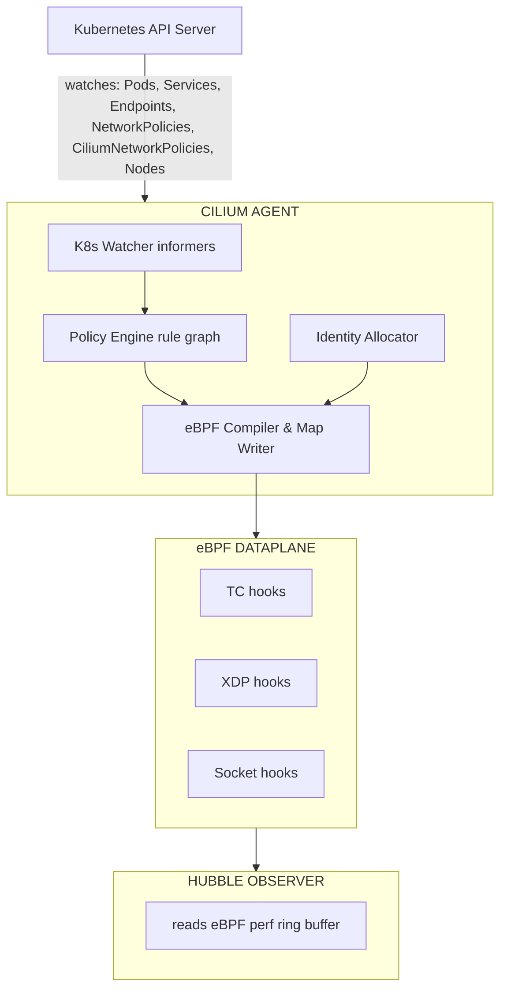
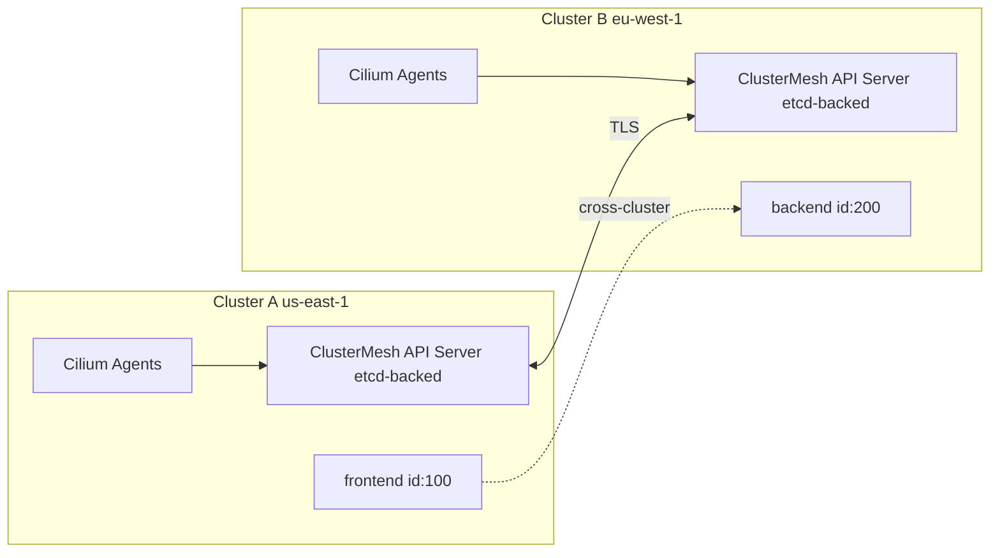
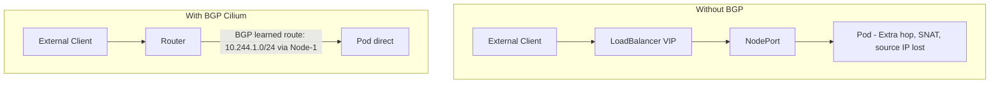
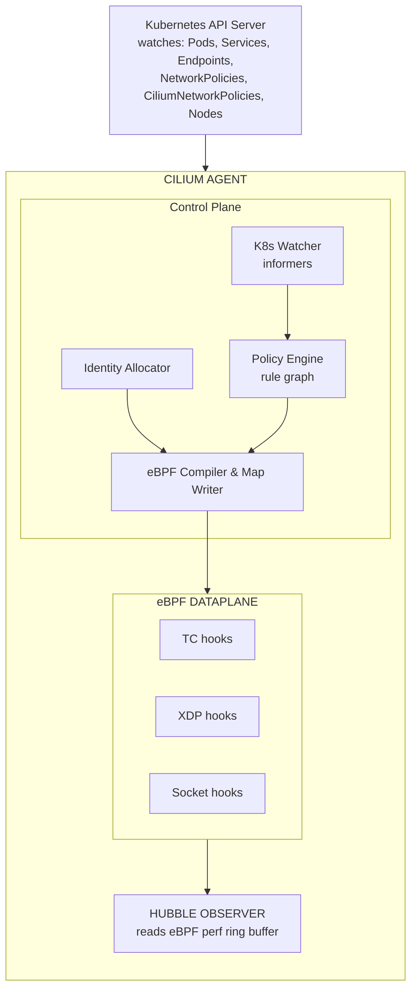
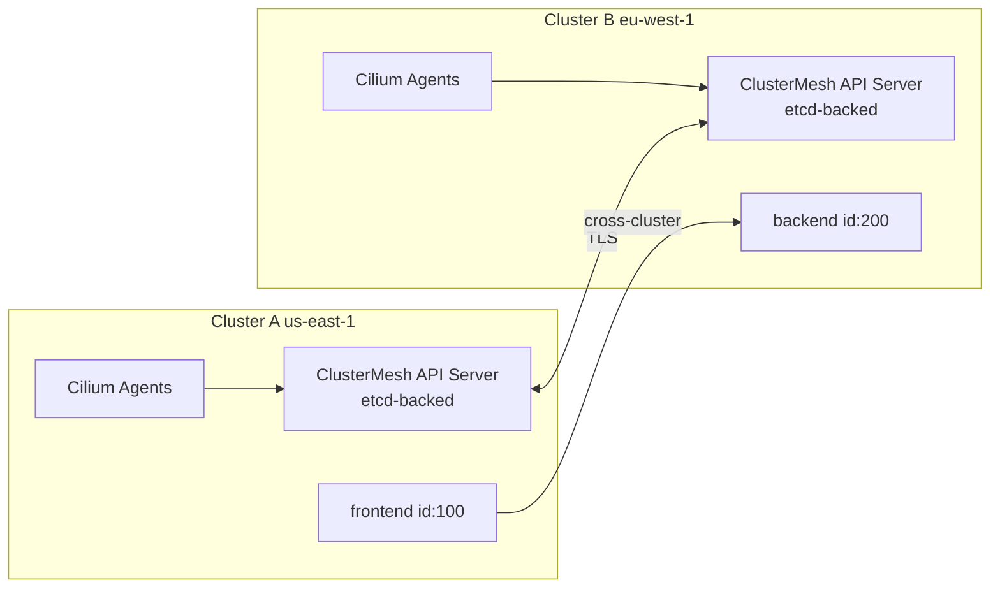
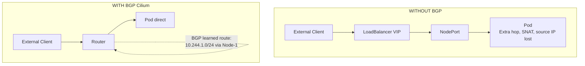

> **CCA Track** | Complexity: `[COMPLEX]` | Time: 75-90 minutes

## Prerequisites

- [Cilium Toolkit Module](/platform/toolkits/infrastructure-networking/networking/module-5.1-cilium/) -- eBPF fundamentals, basic Cilium architecture, identity-based security
- [Hubble Toolkit Module](/platform/toolkits/observability-intelligence/observability/module-1.7-hubble/) -- Hubble CLI, flow observation
- Kubernetes networking basics (Services, Pods, DNS)
- Comfort with `kubectl` and YAML

---

## What You'll Be Able to Do

After completing this module, you will be able to:

1. **Diagnose** connectivity issues across multi-cluster environments using Hubble CLI and Cilium's built-in connectivity test tools.
2. **Design** zero-trust L3-L7 network policies utilizing Cilium's eBPF-accelerated identity allocation and Gateway API routing.
3. **Implement** native pod IP routing across external networks by configuring BGP peering via `CiliumBGPPeeringPolicy`.
4. **Evaluate** the performance tradeoffs between overlay networking modes, kube-proxy replacement, and XDP acceleration options.
5. **Compare** IPAM operational modes to select the optimal CIDR allocation strategy for complex cloud or on-premises environments.

---

## Why This Module Matters

In 2025, an international shipping logistics company, "FreightX", suffered a catastrophic 14-hour outage costing them over $8.5 million. They were running a standard Kubernetes environment using the legacy `kube-proxy` component. An attacker compromised a minor internal dashboard pod due to a misconfigured vulnerability. From there, the attacker could scan the entire internal network because default Kubernetes NetworkPolicies were either too broad or completely absent. The attacker saturated the network by exfiltrating internal data, causing `kube-proxy`'s iptables rules to thrash and collapse under the load, bringing down the entire cluster's routing.

If they had been running Cilium in a strict default-deny mode with L7 network policies, the dashboard pod would have only been permitted to make specific HTTP GET requests to its authorized backend. Furthermore, Cilium's eBPF datapath scales to tens of thousands of pods without the O(n) overhead of iptables, meaning the network would not have collapsed.

That depth is what separates passing from failing. This module fills every gap between our existing content and what the CCA demands: architecture internals, policy enforcement modes, Cluster Mesh, BGP peering, and the Cilium CLI workflows you need to know cold. You must master how Cilium replaces `kube-proxy` and utilizes eBPF at the kernel level.

---

## Did You Know?

- **Cilium is a CNCF Graduated project.** It was accepted as an Incubating project on October 13, 2021, and officially graduated on October 11, 2023, cementing its position as a cloud-native standard.
- **The current latest stable release is v1.19.2.** While v1.20.0 is currently in pre-release (as of early April 2026), production environments should target stable branches. Always check official docs to confirm the exact minimum supported Kubernetes version for each release.
- **Cilium XDP acceleration requires a compatible kernel.** It has been available since Cilium 1.8 and requires a native XDP-supported NIC driver to bypass the kernel network stack completely.
- **The CCA exam covers 8 distinct domains.** These are: Architecture (20%), Network Policy (18%), Service Mesh (16%), Network Observability (10%), Installation and Configuration (10%), Cluster Mesh (10%), eBPF (10%), and BGP and External Networking (6%).

---

## Part 1: Cilium Architecture in Depth

The Toolkit module showed you the big picture. Now let's open each box.

### The Cilium Agent (DaemonSet)

The agent is the workhorse. One runs on every node. It uses eBPF as the highly efficient in-kernel datapath for all network processing including IP, TCP, and UDP. Application-layer protocols (HTTP, Kafka, gRPC, DNS) use Envoy as an L7 proxy.



**What each sub-component does:**

| Component | Role | Why It Matters |
|-----------|------|----------------|
| K8s Watcher | Receives events from API server via informers | Detects pod creation, policy changes, service updates |
| Identity Allocator | Maps label sets to numeric identities | Enables O(1) policy lookups instead of label matching |
| Policy Engine | Builds a rule graph from all applicable policies | Determines allowed (src identity, dst identity, port, L7) tuples |
| eBPF Compiler | Generates per-endpoint eBPF programs | Tailored programs = faster enforcement, no generic rule walk |
| eBPF Maps | Shared kernel data structures (hash maps, LPM tries) | Policy decisions, connection tracking, NAT, service lookup |
| Hubble Observer | Reads the perf event ring buffer from eBPF programs | Every forwarded/dropped packet becomes a flow event |

### The Cilium Operator (Deployment)

The operator handles cluster-wide coordination. There is **one active instance** per cluster (with leader election for HA).

```text
CILIUM OPERATOR RESPONSIBILITIES
================================================================

1. IPAM (IP Address Management)
   - Allocates pod CIDR ranges to nodes
   - In "cluster-pool" mode: carves /24 blocks from a larger pool
   - In AWS ENI mode: manages ENI attachment and IP allocation

2. CRD Management
   - Ensures CiliumIdentity, CiliumEndpoint, CiliumNode CRDs exist
   - Garbage-collects stale CiliumIdentity objects

3. Cluster Mesh
   - Manages the clustermesh-apiserver deployment
   - Synchronizes identities across clusters

4. Resource Cleanup
   - Removes orphaned CiliumEndpoints when pods are deleted
   - Cleans up leaked IPs from terminated nodes
```

**Key exam point**: The operator does NOT enforce policies or program eBPF. If the operator goes down, existing networking continues to work. New pod CIDR allocations will fail, and identity garbage collection pauses (stale identities accumulate), but traffic keeps flowing.

### IPAM Modes and Networking

Cilium supports multiple IPAM strategies. The CCA expects you to know when to use each. It also natively supports both overlay (VXLAN, Geneve) and native routing networking modes.

| IPAM Mode | How It Works | When to Use |
|-----------|-------------|-------------|
| `cluster-pool` (default) | Operator allocates /24 CIDRs from a configurable pool to each node. Agent assigns IPs from its node's pool. | Most clusters. Simple, works everywhere. |
| `kubernetes` | Delegates to the Kubernetes `--pod-cidr` allocation (node.spec.podCIDR). | When you want K8s to control CIDR allocation. |
| `multi-pool` | Multiple named pools with different CIDRs. Pods select pool via annotation. | Multi-tenant clusters needing separate IP ranges. |
| `eni` (AWS) | Allocates IPs directly from AWS ENI secondary addresses. Pods get VPC-routable IPs. | AWS EKS. No overlay needed. Native VPC routing. |
| `azure` | Allocates from Azure VNET. Similar to ENI mode for Azure. | AKS clusters. |
| `crd` | External IPAM controller manages CiliumNode CRDs. | Custom IPAM integrations. |

```bash
# Check which IPAM mode your cluster uses
cilium config view | grep ipam

# In cluster-pool mode, see the allocated ranges
kubectl get ciliumnodes -o jsonpath='{range .items[*]}{.metadata.name}: {.spec.ipam.podCIDRs}{"\n"}{end}'
```

### Kube-Proxy Replacement

Cilium can fully replace kube-proxy using eBPF, handling NodePort, LoadBalancer, and externalIPs services.
- **Kernel Requirements**: Cilium's kube-proxy replacement requires Linux kernel >= 4.19.57, >= 5.1.16, or >= 5.2.0; kernel >= 5.3 is recommended for optimal performance.
- **XDP Acceleration**: XDP-based load balancing acceleration for NodePort/LoadBalancer services has been available since Cilium 1.8. It requires a native XDP-supported NIC driver, allowing packet processing directly at the driver layer, bypassing the host kernel network stack.

---

## Part 2: Advanced Policy Enforcement

Cilium assigns a security identity to each workload derived from Kubernetes labels; this identity drives policy decisions. Because it uses eBPF hash maps, hash map lookup is O(1) regardless of how many policies or endpoints exist.

### CiliumNetworkPolicy vs Kubernetes NetworkPolicy

| Feature | K8s NetworkPolicy | CiliumNetworkPolicy |
|---------|-------------------|---------------------|
| L3/L4 filtering (IP + port) | Yes | Yes |
| Label-based pod selection | Yes | Yes (+ identity-based) |
| Namespace selection | Yes | Yes |
| **L7 HTTP filtering** (method, path, headers) | No | Yes |
| **L7 Kafka filtering** (topic, role) | No | Yes |
| **L7 DNS filtering** (FQDN) | No | Yes |
| **Entity-based rules** (host, world, dns, kube-apiserver) | No | Yes |
| **Cluster-wide scope** | No | Yes (CiliumClusterwideNetworkPolicy) |
| **CIDR-based egress with FQDN** | No | Yes (toFQDNs) |
| **Policy enforcement mode control** | No | Yes (default/always/never) |
| **Identity-aware enforcement** | No | Yes (eBPF identity lookup) |
| **Deny rules** | No (allow-only model) | Yes (explicit deny) |

Cilium ships two Cilium-specific policy CRDs: `CiliumNetworkPolicy` (namespace-scoped) and `CiliumClusterwideNetworkPolicy` (cluster-scoped). Note that Cilium v1.20.0 (pre-release) also introduces Kubernetes Cluster Network Policy (BANP/ANP) support.

### L7 HTTP-Aware Policies

Cilium enforces network policy at L3, L4, and L7. L7 requires `--enable-l7-proxy=true`.

```yaml
# L7 HTTP policy: allow only specific API calls
apiVersion: cilium.io/v2
kind: CiliumNetworkPolicy
metadata:
  name: api-l7-policy
  namespace: production
spec:
  endpointSelector:
    matchLabels:
      app: api-server
  ingress:
  - fromEndpoints:
    - matchLabels:
        app: frontend
    toPorts:
    - ports:
      - port: "8080"
        protocol: TCP
      rules:
        http:
        # Allow reading products
        - method: "GET"
          path: "/api/v1/products"
        # Allow reading a specific product by ID
        - method: "GET"
          path: "/api/v1/products/[0-9]+"
        # Allow creating orders with JSON
        - method: "POST"
          path: "/api/v1/orders"
          headers:
          - 'Content-Type: application/json'
        # Everything else: DENIED
```

### Policy Enforcement Modes

```text
POLICY ENFORCEMENT MODES
================================================================

MODE: "default" (the default)
─────────────────────────────
- If NO policies select an endpoint: all traffic allowed
- If ANY policy selects an endpoint: only explicitly allowed traffic passes
- This is how standard K8s NetworkPolicy works
- Think: "policies are opt-in"

MODE: "always"
─────────────────────────────
- ALL traffic is denied unless explicitly allowed by policy
- Even endpoints with no policies get default-deny
- Think: "zero-trust by default"
- Use this in production for maximum security

MODE: "never"
─────────────────────────────
- Policy enforcement is completely disabled
- All traffic flows freely regardless of policies
- Think: "debugging mode"
- NEVER use in production. Useful for ruling out policy
  issues during troubleshooting.
```

> **Pause and predict**: If you enable strict `always` enforcement mode without any baseline network policies, what will happen to your cluster's DNS resolution, and why?

```bash
# Check the current enforcement mode
cilium config view | grep policy-enforcement

# Change enforcement mode (requires Helm upgrade or config change)
# Via Helm:
cilium upgrade --set policyEnforcementMode=always

# Via cilium config (runtime, non-persistent):
cilium config PolicyEnforcement=always
```

### Entity-Based Rules

Cilium defines semantic entities that represent well-known traffic sources/destinations.

```yaml
# Allow pods to reach essential infrastructure
apiVersion: cilium.io/v2
kind: CiliumClusterwideNetworkPolicy
metadata:
  name: allow-infrastructure
spec:
  endpointSelector: {}
  egress:
  - toEntities:
    - dns             # CoreDNS / kube-dns
    - kube-apiserver  # Kubernetes API server
  ingress:
  - fromEntities:
    - health          # Kubelet health probes
```

| Entity | Meaning |
|--------|---------|
| `host` | The node the pod runs on |
| `remote-node` | Other cluster nodes |
| `kube-apiserver` | The Kubernetes API server (regardless of IP) |
| `health` | Cilium health check probes |
| `dns` | DNS servers (kube-dns/CoreDNS) |
| `world` | Anything outside the cluster |
| `all` | Everything (use with caution) |

---

## Part 3: Cluster Mesh -- Multi-Cluster Connectivity

Cilium Cluster Mesh enables multi-cluster networking with global service discovery, cross-cluster failover, and identity-based policy enforcement.



### Requirements

| Requirement | Why |
|-------------|-----|
| Shared CA certificate | Agents authenticate to remote ClusterMesh API servers via mTLS |
| Non-overlapping pod CIDRs | Packets must be routable; overlapping CIDRs cause ambiguity |
| Network connectivity | Agents must reach remote ClusterMesh API server (port 2379 by default) |
| Unique cluster names | Each cluster needs a distinct name and numeric ID (1-255) |
| Compatible Cilium versions | Minor version skew is tolerated; major version must match |

### Enabling Cluster Mesh

```bash
# Step 1: Enable Cluster Mesh on each cluster
# On Cluster A:
cilium clustermesh enable --context kind-cluster-a --service-type LoadBalancer

# On Cluster B:
cilium clustermesh enable --context kind-cluster-b --service-type LoadBalancer

# Step 2: Connect the clusters
cilium clustermesh connect \
  --context kind-cluster-a \
  --destination-context kind-cluster-b

# Step 3: Wait for readiness
cilium clustermesh status --context kind-cluster-a --wait

# Step 4: Verify connectivity
cilium connectivity test --context kind-cluster-a --multi-cluster
```

### Global Services

```yaml
# A service in Cluster A that is discoverable from Cluster B
apiVersion: v1
kind: Service
metadata:
  name: payment-service
  namespace: production
  annotations:
    # This annotation makes the service global
    service.cilium.io/global: "true"
spec:
  selector:
    app: payment
  ports:
  - port: 443
```

### Service Affinity

```yaml
apiVersion: v1
kind: Service
metadata:
  name: payment-service
  annotations:
    service.cilium.io/global: "true"
    # Prefer local cluster, fall back to remote
    service.cilium.io/affinity: "local"
spec:
  selector:
    app: payment
  ports:
  - port: 443
```

| Affinity | Behavior |
|----------|----------|
| `local` | Prefer local cluster endpoints. Use remote only if local has none. |
| `remote` | Prefer remote cluster endpoints. Use local only if remote has none. |
| `none` (default) | Load-balance equally across all clusters. |

---

## Part 4: BGP and External Networking

BGP (Border Gateway Protocol) changes this. Cilium can advertise pod CIDRs and service IPs to external routers, making them directly routable. Cilium BGP Control Plane uses GoBGP as the underlying routing library. (Note: Cilium previously supported BGP via MetalLB integration; that mode is now deprecated. `CiliumBGPPeeringPolicy` was introduced in Cilium 1.12, replacing the older MetalLB integration).



### CiliumBGPPeeringPolicy

```yaml
# Configure BGP peering with a ToR (Top-of-Rack) router
apiVersion: cilium.io/v2alpha1
kind: CiliumBGPPeeringPolicy
metadata:
  name: rack-1-bgp
spec:
  # Which nodes this policy applies to
  nodeSelector:
    matchLabels:
      rack: rack-1
  virtualRouters:
  - localASN: 65001          # Your cluster's ASN
    exportPodCIDR: true       # Advertise pod CIDRs to peers
    neighbors:
    - peerAddress: "10.0.0.1/32"  # ToR router IP
      peerASN: 65000               # Router's ASN
      # Optional: authentication
      # authSecretRef: bgp-auth-secret
    serviceSelector:
      # Advertise LoadBalancer service VIPs
      matchExpressions:
      - key: service.cilium.io/bgp-announce
        operator: In
        values: ["true"]
```

> **Stop and think**: When configuring a `CiliumBGPPeeringPolicy`, why must the `localASN` match the configuration expected by your top-of-rack router, and what state will the BGP peer remain in if there is an ASN mismatch?

| Concept | Meaning |
|---------|---------|
| ASN (Autonomous System Number) | A unique identifier for a BGP-speaking network. Private range: 64512-65534. |
| Peering | Two BGP speakers establishing a session to exchange routes. |
| Route Advertisement | Announcing "I can reach this IP range" to peers. |
| eBGP | External BGP -- peering between different ASNs (cluster to external router). |
| iBGP | Internal BGP -- peering within the same ASN (less common in Cilium). |
| `exportPodCIDR` | Tell peers how to reach pods on this node. |

```bash
# Check BGP peering status
cilium bgp peers

# Expected output:
# Node       Local AS   Peer AS   Peer Address   State        Since
# worker-1   65001      65000     10.0.0.1       established  2h15m
# worker-2   65001      65000     10.0.0.1       established  2h15m

# Check advertised routes
cilium bgp routes advertised ipv4 unicast
```

---

## Part 5: Gateway API, Bandwidth Manager, Egress Gateway, and L2 Announcements

### Cilium Gateway API

Cilium natively implements the Kubernetes Gateway API, replacing the need for a separate ingress controller. It uses Envoy under the hood, managed entirely by the Cilium agent. **Why this matters**: Gateway API is the successor to Ingress. Cilium's implementation means no separate NGINX or Envoy Gateway deployment -- the same agent that handles policies handles routing. 

Cilium supports Kubernetes Gateway API v1.4.1 and passes all Core conformance tests. Cilium's GAMMA (Gateway API for Mesh) support is partial: Core conformance + 2 of 3 Extended Mesh tests pass; consumer HTTPRoutes are not supported. Cilium's service mesh is sidecarless: Envoy runs as a per-node proxy in the host network namespace, not as a per-pod sidecar.

```yaml
# Gateway: the listener that accepts traffic
apiVersion: gateway.networking.k8s.io/v1
kind: Gateway
metadata:
  name: cilium-gw
  namespace: production
spec:
  gatewayClassName: cilium    # Cilium's built-in GatewayClass
  listeners:
  - name: http
    protocol: HTTP
    port: 80
    allowedRoutes:
      namespaces:
        from: Same
```

```yaml
# HTTPRoute: route HTTP traffic to backends
apiVersion: gateway.networking.k8s.io/v1
kind: HTTPRoute
metadata:
  name: app-routes
  namespace: production
spec:
  parentRefs:
  - name: cilium-gw
  rules:
  - matches:
    - path:
        type: PathPrefix
        value: /api
    backendRefs:
    - name: api-service
      port: 8080
  - matches:
    - path:
        type: PathPrefix
        value: /
    backendRefs:
    - name: frontend-service
      port: 3000
```

```yaml
# GRPCRoute: route gRPC traffic to backends
apiVersion: gateway.networking.k8s.io/v1
kind: GRPCRoute
metadata:
  name: grpc-routes
  namespace: production
spec:
  parentRefs:
  - name: cilium-gw
  rules:
  - matches:
    - method:
        service: payments.PaymentService
    backendRefs:
    - name: payment-grpc
      port: 9090
```

### Bandwidth Manager

```yaml
apiVersion: cilium.io/v2
kind: CiliumBandwidthPolicy
metadata:
  name: rate-limit-batch-jobs
spec:
  endpointSelector:
    matchLabels:
      workload-type: batch
  egress:
    rate: "50M"     # 50 Mbit/s egress cap
    burst: "10M"    # Allow short bursts up to 10 Mbit above rate
```

### Egress Gateway

`CiliumEgressGatewayPolicy` routes outbound traffic from selected pods through dedicated gateway nodes. External services see a predictable source IP (the gateway node's IP). **Why you need this**: Many external firewalls, databases, and SaaS APIs allowlist traffic by source IP. Without an egress gateway, pod traffic exits from whatever node the pod is on. 

Cilium Egress Gateway is GA (not beta) in Cilium 1.19.x; it requires BPF masquerading and kube-proxy replacement to be enabled. Egress Gateway is incompatible with Cluster Mesh.

```yaml
apiVersion: cilium.io/v2
kind: CiliumEgressGatewayPolicy
metadata:
  name: db-egress-via-gateway
spec:
  selectors:
  - podSelector:
      matchLabels:
        app: backend
        needs-stable-ip: "true"
  destinationCIDRs:
  - "10.200.0.0/16"       # External database subnet
  egressGateway:
    nodeSelector:
      matchLabels:
        role: egress-gateway   # Dedicated gateway nodes
    egressIP: "192.168.1.50"   # Stable SNAT IP
```

### L2 Announcements

```yaml
apiVersion: cilium.io/v2alpha1
kind: CiliumL2AnnouncementPolicy
metadata:
  name: l2-services
spec:
  serviceSelector:
    matchLabels:
      l2-announce: "true"
  nodeSelector:
    matchLabels:
      node.kubernetes.io/role: worker
  interfaces:
  - eth0
  externalIPs: true
  loadBalancerIPs: true
```

```yaml
# A service that uses L2 announcement
apiVersion: v1
kind: Service
metadata:
  name: web
  labels:
    l2-announce: "true"
spec:
  type: LoadBalancer
  selector:
    app: web
  ports:
  - port: 80
    targetPort: 8080
```

---

## Part 6: Encryption and Observability

### Transparent Encryption
Cilium secures data in transit via transparent encryption, operating seamlessly without modifying application code.
- **WireGuard**: Cilium supports WireGuard transparent encryption natively. Each node auto-generates a key-pair and distributes its public key via the `network.cilium.io/wg-pub-key` annotation on the `CiliumNode` resource. 
- **IPsec**: IPsec pod-to-pod encryption is highly stable. However, IPsec node-to-node encryption (host traffic) is a beta feature. Note that host policies are currently incompatible with IPsec, and IPsec transparent encryption is not supported when Cilium is chained on top of another CNI plugin.

### Network Observability with Hubble
Hubble is Cilium's integrated network observability platform, providing real-time service maps and L3-L7 flow visibility.
- It observes traffic at the kernel level, associating packets with Kubernetes identities.
- Hubble provides a Relay component that aggregates flow data from all nodes for cluster-wide observability.
- Note: Hubble UI is in Beta status (not GA) as of Cilium 1.19.x stable. However, the CLI, metrics, and relay are fully supported.

---

## Part 7: Cilium CLI Deep Dive

### Installation and Status

```bash
# Install Cilium (most common invocation)
cilium install \
  --set kubeProxyReplacement=true \
  --set hubble.enabled=true \
  --set hubble.relay.enabled=true \
  --set hubble.ui.enabled=true

# Check status (the first command you run after install)
cilium status
# Shows: agent, operator, relay status + features enabled

# Wait for all components to be ready
cilium status --wait

# View full Cilium configuration
cilium config view

# View specific config value
cilium config view | grep policy-enforcement
```

### Connectivity Testing

```bash
# Run the full connectivity test suite
cilium connectivity test

# What it does:
# - Deploys test client and server pods
# - Tests pod-to-pod (same node and cross-node)
# - Tests pod-to-Service (ClusterIP and NodePort)
# - Tests pod-to-external
# - Tests NetworkPolicy enforcement
# - Tests DNS resolution
# - Tests Hubble flow visibility
# - Cleans up test resources when done

# Run specific tests only
cilium connectivity test --test pod-to-pod
cilium connectivity test --test pod-to-service

# Run with extra logging for debugging
cilium connectivity test --debug
```

### Endpoint and Identity Management

```bash
# List all Cilium-managed endpoints on this node
kubectl exec -n kube-system ds/cilium -- cilium endpoint list

# Get details on a specific endpoint
kubectl exec -n kube-system ds/cilium -- cilium endpoint get <endpoint-id>

# List all identities
cilium identity list

# Get labels for a specific identity
cilium identity get <identity-number>
```

### Troubleshooting

```bash
# Check if Cilium agent is healthy
cilium status

# View Cilium agent logs
kubectl -n kube-system logs ds/cilium -c cilium-agent --tail=100

# Check eBPF map status
kubectl exec -n kube-system ds/cilium -- cilium bpf ct list global | head

# Monitor policy verdicts in real-time
kubectl exec -n kube-system ds/cilium -- cilium monitor --type policy-verdict

# Debug a specific pod's connectivity
kubectl exec -n kube-system ds/cilium -- cilium endpoint list | grep <pod-name>
```

---

## War Story: The Cluster Mesh Migration That Almost Wasn't

*A fintech company was migrating from an aging Kubernetes cluster (v1.33) to a new one (v1.35). They couldn't afford downtime -- the payment API processed $2M per hour.*

The plan: run both clusters simultaneously, use Cilium Cluster Mesh to share the payment service across both clusters, then gradually shift traffic.

**Week 1**: Cluster Mesh connected. Global services worked. Everything looked perfect in staging.

**Week 2, Day 1 (Monday)**: Production migration started. Cluster Mesh connected. Global service annotation applied. Traffic began flowing to both clusters. Monitoring showed healthy requests.

**Week 2, Day 2 (Tuesday, 3:17 PM)**: Alerts fired. Payment failures spiking. But only from the *new* cluster.

The engineer ran:
```bash
hubble observe --from-pod new-cluster/payment-api --verdict DROPPED --protocol tcp
```

Output showed drops on port 5432 -- the payment API in the new cluster couldn't reach PostgreSQL in the old cluster. Cross-cluster database traffic was being blocked.

**Root cause**: The CiliumClusterwideNetworkPolicy on the old cluster only allowed ingress from identities with `cluster: old-cluster` labels. Pods in the new cluster had `cluster: new-cluster`. The policy was written 18 months earlier, before Cluster Mesh was even planned.

```yaml
# The offending policy (old cluster)
spec:
  endpointSelector:
    matchLabels:
      app: postgres
  ingress:
  - fromEndpoints:
    - matchLabels:
        cluster: old-cluster  # Oops -- blocks new cluster pods
```

**Fix**: Update the policy to use identity-based matching without the cluster label, or add an explicit rule for the new cluster's identity range.

**Time to diagnose**: 6 minutes (thanks to Hubble).
**Time it would have taken without Hubble**: Hours. The "payment API works on old cluster but not new cluster" symptom points to a dozen possible causes.

**Lesson**: When planning Cluster Mesh migrations, audit every CiliumNetworkPolicy and CiliumClusterwideNetworkPolicy for assumptions about cluster-local identities.

---

## Common Mistakes

| Mistake | Why It Hurts | How To Avoid |
|---------|--------------|--------------|
| **Overlapping pod CIDRs with Cluster Mesh** | Packets can't be routed; silent failures | Plan CIDR allocation before deploying clusters |
| **Forgetting `service.cilium.io/global: "true"`** | Service stays cluster-local; Cluster Mesh doesn't help | Annotate every service that needs cross-cluster discovery |
| **Using `policyEnforcementMode: always` without baseline policies** | All traffic drops immediately, including DNS | Deploy allow-dns and allow-health policies BEFORE switching to `always` |
| **BGP with wrong ASN** | Peering session never establishes; stays in "active" state | Verify ASNs match what your network team configured on the router |
| **Assuming operator downtime = outage** | Panicking when operator restarts | Know that existing networking continues; only---
title: "Module 1.1: Advanced Cilium for CCA"
slug: k8s/cca/module-1.1-advanced-cilium
sidebar:
  order: 2
---
> **CCA Track** | Complexity: `[COMPLEX]` | Time: 75-90 minutes

## Prerequisites

- [Cilium Toolkit Module](/platform/toolkits/infrastructure-networking/networking/module-5.1-cilium/) -- eBPF fundamentals, basic Cilium architecture, identity-based security
- [Hubble Toolkit Module](/platform/toolkits/observability-intelligence/observability/module-1.7-hubble/) -- Hubble CLI, flow observation
- Kubernetes networking basics (Services, Pods, DNS)
- Comfort with `kubectl` and YAML targeting Kubernetes v1.35

---

## What You'll Be Able to Do

After completing this module, you will be able to:

1. **Evaluate** Cilium's eBPF datapath architecture, analyzing how endpoint programs, maps, and identity-based policy enforcement operate at the kernel layer.
2. **Design** complex `CiliumNetworkPolicy` and `CiliumClusterwideNetworkPolicy` manifests utilizing L3, L4, and L7 rules, including DNS-aware and FQDN filtering.
3. **Implement** Cluster Mesh for global service discovery and cross-cluster failover, diagnosing connectivity issues using Hubble Relay.
4. **Deploy** advanced routing and connectivity features, including BGP peering with GoBGP, Gateway API configurations, and Egress Gateways with stable IP masquerading.
5. **Diagnose** multi-cluster and policy enforcement failures using the Cilium CLI, Hubble observability maps, and eBPF state inspection.

---

## Why This Module Matters

In early 2025, a leading European payment processor lost millions of dollars in under 90 minutes. They were migrating from an aging Kubernetes cluster (version 1.33) to a new one (version 1.35). They could not afford downtime, as their core API processed massive transaction volumes continuously. The engineering team planned to run both clusters simultaneously, utilizing Cilium Cluster Mesh to share the payment service across both environments and gradually shift traffic.

When they connected the clusters and applied the global service annotations, everything appeared perfect. Traffic began flowing. But soon after the primary traffic shift, alerts fired: cross-cluster database traffic was dropping entirely. The engineers spent an hour inspecting standard Kubernetes NetworkPolicies and kube-proxy rules, finding nothing. It was only when a senior engineer used Hubble to inspect the dropped flows that they discovered the root cause: an ancient `CiliumClusterwideNetworkPolicy` on the older cluster strictly permitted ingress only from specific cluster-labeled identities, silently dropping all packets originating from the new cluster's identity range.

The difference between a junior engineer and a Certified Cilium Associate (CCA) is the ability to diagnose these exact network layers. While a junior engineer knows that Cilium replaces kube-proxy, a CCA knows that Cilium assigns a security identity to each workload derived from Kubernetes labels, that this identity drives all policy decisions, and that the eBPF datapath enforces these decisions in O(1) time. This module fills every gap between basic operational knowledge and what the CCA exam demands: architecture internals, advanced policy enforcement, BGP routing, and native service mesh components. That depth is what separates passing from failing.

---

## Did You Know?

- **Cilium graduated from the CNCF on October 11, 2023**, after being accepted as an Incubating project on October 13, 2021. The CCA certification exam rigorously tests 8 domains, with Architecture (20%), Network Policy (18%), and Service Mesh (16%) making up the vast majority of the weight.
- **Cilium's current latest stable release is version 1.19.2.** Active stable branches also include versions 1.18.8 and 1.17.14, while version 1.20.0-pre.1 is the latest pre-release, which notably introduces Kubernetes Cluster Network Policy (BANP/ANP) support.
- **Cilium passes all Gateway API version 1.4.1 Core conformance tests** across the `GATEWAY-HTTP`, `GATEWAY-TLS`, and `GATEWAY-GRPC` profiles. However, its GAMMA (Gateway API for Mesh) support remains partial, as it does not yet support consumer HTTPRoutes.
- **Cilium's kube-proxy replacement requires a Linux kernel of at least 4.19.57, 5.1.16, or 5.2.0**, though kernel 5.3+ is strongly recommended. For maximum performance, XDP acceleration for kube-proxy replacement has been available since Cilium version 1.8, requiring a native XDP-supported NIC driver to bypass the kernel network stack entirely.

---

## Part 1: Cilium Architecture in Depth

The Toolkit module introduced the big picture. Now, we open the components and examine the internal mechanics. Cilium supports both overlay (VXLAN, Geneve) and native routing networking modes, but the underlying enforcement engine remains identical.

### The Cilium Agent (DaemonSet)

The Cilium Agent is the core worker, deployed as a DaemonSet on every node in the cluster. It communicates with the Kubernetes API, translates state into eBPF programs, and writes them into the Linux kernel.



**What each sub-component does:**

| Component | Role | Why It Matters |
|-----------|------|----------------|
| K8s Watcher | Receives events from API server via informers | Detects pod creation, policy changes, service updates |
| Identity Allocator | Maps label sets to numeric identities | Enables O(1) policy lookups instead of label matching |
| Policy Engine | Builds a rule graph from all applicable policies | Determines allowed (src identity, dst identity, port, L7) tuples |
| eBPF Compiler | Generates per-endpoint eBPF programs | Tailored programs = faster enforcement, no generic rule walk |
| eBPF Maps | Shared kernel data structures (hash maps, LPM tries) | Policy decisions, connection tracking, NAT, service lookup |
| Hubble Observer | Reads the perf event ring buffer from eBPF programs | Every forwarded/dropped packet becomes a flow event |

Cilium fully utilizes eBPF as the highly efficient in-kernel data plane for all L3/L4 network processing (IP, TCP, UDP). When handling NodePort, LoadBalancer services, and externalIPs, Cilium can fully replace kube-proxy using eBPF hooks.

> **Pause and predict**: If the K8s Watcher component of the Cilium Agent loses connection to the Kubernetes API Server, what happens to existing network connections for pods already running on that node? 
> *Think about where the policies actually live before reading on.*

### The Cilium Operator (Deployment)

While the agent runs per-node, the Cilium Operator handles cluster-wide coordination tasks. There is typically one active operator replica running (with others on standby for high availability).

```text
CILIUM OPERATOR RESPONSIBILITIES
================================================================

1. IPAM (IP Address Management)
   - Allocates pod CIDR ranges to nodes
   - In "cluster-pool" mode: carves /24 blocks from a larger pool
   - In AWS ENI mode: manages ENI attachment and IP allocation

2. CRD Management
   - Ensures CiliumIdentity, CiliumEndpoint, CiliumNode CRDs exist
   - Garbage-collects stale CiliumIdentity objects

3. Cluster Mesh
   - Manages the clustermesh-apiserver deployment
   - Synchronizes identities across clusters

4. Resource Cleanup
   - Removes orphaned CiliumEndpoints when pods are deleted
   - Cleans up leaked IPs from terminated nodes
```

**Key exam point**: The operator does NOT enforce policies or program eBPF. If the operator goes down, existing networking continues to work seamlessly because the eBPF datapath is autonomous. However, new pod CIDR allocations will fail, and identity garbage collection pauses (stale identities accumulate) until the operator recovers.

### IPAM Modes

Cilium supports multiple IPAM strategies. Knowing when to use which is heavily tested.

| IPAM Mode | How It Works | When to Use |
|-----------|-------------|-------------|
| `cluster-pool` (default) | Operator allocates /24 CIDRs from a configurable pool to each node. Agent assigns IPs from its node's pool. | Most clusters. Simple, works everywhere. |
| `kubernetes` | Delegates to the Kubernetes `--pod-cidr` allocation (node.spec.podCIDR). | When you want K8s to control CIDR allocation. |
| `multi-pool` | Multiple named pools with different CIDRs. Pods select pool via annotation. | Multi-tenant clusters needing separate IP ranges. |
| `eni` (AWS) | Allocates IPs directly from AWS ENI secondary addresses. Pods get VPC-routable IPs. | AWS EKS. No overlay needed. Native VPC routing. |
| `azure` | Allocates from Azure VNET. Similar to ENI mode for Azure. | AKS clusters. |
| `crd` | External IPAM controller manages CiliumNode CRDs. | Custom IPAM integrations. |

```bash
# Check which IPAM mode your cluster uses
cilium config view | grep ipam

# In cluster-pool mode, see the allocated ranges
kubectl get ciliumnodes -o jsonpath='{range .items[*]}{.metadata.name}: {.spec.ipam.podCIDRs}{"\n"}{end}'
```

---

## Part 2: CiliumNetworkPolicy vs Kubernetes NetworkPolicy

Cilium enforces network policy at L3, L4, and L7, including DNS/FQDN-based egress policies. To leverage this, it ships two Cilium-specific policy CRDs: `CiliumNetworkPolicy` (namespace-scoped) and `CiliumClusterwideNetworkPolicy` (cluster-scoped).

### Feature Comparison

| Feature | K8s NetworkPolicy | CiliumNetworkPolicy |
|---------|-------------------|---------------------|
| L3/L4 filtering (IP + port) | Yes | Yes |
| Label-based pod selection | Yes | Yes (+ identity-based) |
| Namespace selection | Yes | Yes |
| **L7 HTTP filtering** (method, path, headers) | No | Yes |
| **L7 Kafka filtering** (topic, role) | No | Yes |
| **L7 DNS filtering** (FQDN) | No | Yes |
| **Entity-based rules** (host, world, dns, kube-apiserver) | No | Yes |
| **Cluster-wide scope** | No | Yes (CiliumClusterwideNetworkPolicy) |
| **CIDR-based egress with FQDN** | No | Yes (toFQDNs) |
| **Policy enforcement mode control** | No | Yes (default/always/never) |
| **Identity-aware enforcement** | No | Yes (eBPF identity lookup) |
| **Deny rules** | No (allow-only model) | Yes (explicit deny) |

### L7 HTTP-Aware Policies

While eBPF handles L3/L4 processing in the kernel, Application-layer protocols like HTTP, Kafka, and gRPC utilize an Envoy proxy. Cilium's service mesh is sidecarless: Envoy runs as a per-node proxy in the host network namespace, not as a per-pod sidecar. Cilium redirects outbound pod traffic to Envoy securely using eBPF hooks.

```yaml
# L7 HTTP policy: allow only specific API calls
apiVersion: cilium.io/v2
kind: CiliumNetworkPolicy
metadata:
  name: api-l7-policy
  namespace: production
spec:
  endpointSelector:
    matchLabels:
      app: api-server
  ingress:
  - fromEndpoints:
    - matchLabels:
        app: frontend
    toPorts:
    - ports:
      - port: "8080"
        protocol: TCP
      rules:
        http:
        # Allow reading products
        - method: "GET"
          path: "/api/v1/products"
        # Allow reading a specific product by ID
        - method: "GET"
          path: "/api/v1/products/[0-9]+"
        # Allow creating orders with JSON
        - method: "POST"
          path: "/api/v1/orders"
          headers:
          - 'Content-Type: application/json'
        # Everything else: DENIED
```

Even if an attacker gains shell execution inside the `frontend` pod, the infrastructure layer drops any attempt to execute a `DELETE` request against `api/v1` or target unauthorized paths.

### Policy Enforcement Modes

Cilium's policy enforcement dictates the default posture of the cluster.

```text
POLICY ENFORCEMENT MODES
================================================================

MODE: "default" (the default)
─────────────────────────────
- If NO policies select an endpoint: all traffic allowed
- If ANY policy selects an endpoint: only explicitly allowed traffic passes
- This is how standard K8s NetworkPolicy works
- Think: "policies are opt-in"

MODE: "always"
─────────────────────────────
- ALL traffic is denied unless explicitly allowed by policy
- Even endpoints with no policies get default-deny
- Think: "zero-trust by default"
- Use this in production for maximum security

MODE: "never"
─────────────────────────────
- Policy enforcement is completely disabled
- All traffic flows freely regardless of policies
- Think: "debugging mode"
- NEVER use in production. Useful for ruling out policy
  issues during troubleshooting.
```

```bash
# Check the current enforcement mode
cilium config view | grep policy-enforcement

# Change enforcement mode (requires Helm upgrade or config change)
# Via Helm:
cilium upgrade --set policyEnforcementMode=always

# Via cilium config (runtime, non-persistent):
cilium config PolicyEnforcement=always
```

> **Stop and think**: If you switch a running cluster from `default` to `always` enforcement mode without applying baseline policies first, what will happen to pods attempting to resolve the `api.stripe.com` domain name? 
> *Answer: CoreDNS requests will be immediately dropped because there is no baseline policy allowing egress to DNS entities.*

### Entity-Based Rules

Cilium uses predefined semantic entities that eliminate the need to hardcode dynamic IP addresses for critical cluster services.

```yaml
# Allow pods to reach essential infrastructure
apiVersion: cilium.io/v2
kind: CiliumClusterwideNetworkPolicy
metadata:
  name: allow-infrastructure
spec:
  endpointSelector: {}
  egress:
  - toEntities:
    - dns             # CoreDNS / kube-dns
    - kube-apiserver  # Kubernetes API server
  ingress:
  - fromEntities:
    - health          # Kubelet health probes
```

| Entity | Meaning |
|--------|---------|
| `host` | The node the pod runs on |
| `remote-node` | Other cluster nodes |
| `kube-apiserver` | The Kubernetes API server (regardless of IP) |
| `health` | Cilium health check probes |
| `dns` | DNS servers (kube-dns/CoreDNS) |
| `world` | Anything outside the cluster |
| `all` | Everything (use with caution) |

---

## Part 3: Cluster Mesh -- Multi-Cluster Connectivity

Cilium Cluster Mesh enables multi-cluster networking with global service discovery, cross-cluster failover, and identity-based policy enforcement across multiple Kubernetes boundaries. 

### Architecture



### Requirements

| Requirement | Why |
|-------------|-----|
| Shared CA certificate | Agents authenticate to remote ClusterMesh API servers via mTLS |
| Non-overlapping pod CIDRs | Packets must be routable; overlapping CIDRs cause ambiguity |
| Network connectivity | Agents must reach remote ClusterMesh API server (port 2379 by default) |
| Unique cluster names | Each cluster needs a distinct name and numeric ID (1-255) |
| Compatible Cilium versions | Minor version skew is tolerated; major version must match |

To configure Cluster Mesh across environments:

```bash
# Step 1: Enable Cluster Mesh on each cluster
# On Cluster A:
cilium clustermesh enable --context kind-cluster-a --service-type LoadBalancer

# On Cluster B:
cilium clustermesh enable --context kind-cluster-b --service-type LoadBalancer

# Step 2: Connect the clusters
cilium clustermesh connect \
  --context kind-cluster-a \
  --destination-context kind-cluster-b

# Step 3: Wait for readiness
cilium clustermesh status --context kind-cluster-a --wait

# Step 4: Verify connectivity
cilium connectivity test --context kind-cluster-a --multi-cluster
```

### Global Services and Service Affinity

Once connected, you expose services globally using an annotation. 

```yaml
# A service in Cluster A that is discoverable from Cluster B
apiVersion: v1
kind: Service
metadata:
  name: payment-service
  namespace: production
  annotations:
    # This annotation makes the service global
    service.cilium.io/global: "true"
spec:
  selector:
    app: payment
  ports:
  - port: 443
```

By resolving `payment-service.production.svc.cluster.local`, workloads are naturally balanced across backends in all meshed clusters. However, crossing data center boundaries introduces latency. We control this using Service Affinity.

```yaml
apiVersion: v1
kind: Service
metadata:
  name: payment-service
  annotations:
    service.cilium.io/global: "true"
    # Prefer local cluster, fall back to remote
    service.cilium.io/affinity: "local"
spec:
  selector:
    app: payment
  ports:
  - port: 443
```

| Affinity | Behavior |
|----------|----------|
| `local` | Prefer local cluster endpoints. Use remote only if local has none. |
| `remote` | Prefer remote cluster endpoints. Use local only if remote has none. |
| `none` (default) | Load-balance equally across all clusters. |

---

## Part 4: Transparent Encryption

When operating across untrusted networks, securing pod-to-pod traffic is mandatory. Cilium supports two methods:

1. **WireGuard**: Cilium supports WireGuard transparent encryption. Each node auto-generates a key-pair and distributes its public key via the `network.cilium.io/wg-pub-key` CiliumNode annotation.
2. **IPsec**: Cilium's IPsec pod-to-pod encryption is highly stable. However, IPsec node-to-node encryption (host traffic) remains a beta feature. 

Critically, IPsec transparent encryption is not supported when Cilium is chained on top of another CNI plugin (e.g., using AWS VPC CNI for routing and Cilium exclusively for enforcement).

---

## Part 5: BGP with Cilium

By default, pod IPs are only routable within the cluster. BGP (Border Gateway Protocol) changes this. Cilium can advertise pod CIDRs and service IPs to external routers, making them directly routable. Cilium BGP Control Plane uses GoBGP as the underlying routing library (Cilium previously supported BGP via MetalLB integration, but that mode is now deprecated).



### CiliumBGPPeeringPolicy

The `CiliumBGPPeeringPolicy` CRD was introduced to construct these topologies dynamically. 

```yaml
# Configure BGP peering with a ToR (Top-of-Rack) router
apiVersion: cilium.io/v2alpha1
kind: CiliumBGPPeeringPolicy
metadata:
  name: rack-1-bgp
spec:
  # Which nodes this policy applies to
  nodeSelector:
    matchLabels:
      rack: rack-1
  virtualRouters:
  - localASN: 65001          # Your cluster's ASN
    exportPodCIDR: true       # Advertise pod CIDRs to peers
    neighbors:
    - peerAddress: "10.0.0.1/32"  # ToR router IP
      peerASN: 65000               # Router's ASN
      # Optional: authentication
      # authSecretRef: bgp-auth-secret
    serviceSelector:
      # Advertise LoadBalancer service VIPs
      matchExpressions:
      - key: service.cilium.io/bgp-announce
        operator: In
        values: ["true"]
```

| Concept | Meaning |
|---------|---------|
| ASN (Autonomous System Number) | A unique identifier for a BGP-speaking network. Private range: 64512-65534. |
| Peering | Two BGP speakers establishing a session to exchange routes. |
| Route Advertisement | Announcing "I can reach this IP range" to peers. |
| eBGP | External BGP -- peering between different ASNs (cluster to external router). |
| iBGP | Internal BGP -- peering within the same ASN (less common in Cilium). |
| `exportPodCIDR` | Tell peers how to reach pods on this node. |

```bash
# Check BGP peering status
cilium bgp peers

# Expected output:
# Node       Local AS   Peer AS   Peer Address   State        Since
# worker-1   65001      65000     10.0.0.1       established  2h15m
# worker-2   65001      65000     10.0.0.1       established  2h15m

# Check advertised routes
cilium bgp routes advertised ipv4 unicast
```

---

## Part 6: Gateway API, Bandwidth Manager, Egress Gateway, and L2 Announcements

### Cilium Gateway API

Cilium natively implements the Kubernetes Gateway API, replacing the need for a separate ingress controller. Why this matters: Gateway API is the successor to Ingress. Cilium's implementation means no separate NGINX or Envoy Gateway deployment -- the same agent that manages eBPF also integrates Gateway functionality.

```yaml
# Gateway: the listener that accepts traffic
apiVersion: gateway.networking.k8s.io/v1
kind: Gateway
metadata:
  name: cilium-gw
  namespace: production
spec:
  gatewayClassName: cilium    # Cilium's built-in GatewayClass
  listeners:
  - name: http
    protocol: HTTP
    port: 80
    allowedRoutes:
      namespaces:
        from: Same
```

```yaml
# HTTPRoute: route HTTP traffic to backends
apiVersion: gateway.networking.k8s.io/v1
kind: HTTPRoute
metadata:
  name: app-routes
  namespace: production
spec:
  parentRefs:
  - name: cilium-gw
  rules:
  - matches:
    - path:
        type: PathPrefix
        value: /api
    backendRefs:
    - name: api-service
      port: 8080
  - matches:
    - path:
        type: PathPrefix
        value: /
    backendRefs:
    - name: frontend-service
      port: 3000
```

```yaml
# GRPCRoute: route gRPC traffic to backends
apiVersion: gateway.networking.k8s.io/v1
kind: GRPCRoute
metadata:
  name: grpc-routes
  namespace: production
spec:
  parentRefs:
  - name: cilium-gw
  rules:
  - matches:
    - method:
        service: payments.PaymentService
    backendRefs:
    - name: payment-grpc
      port: 9090
```

### Bandwidth Manager

```yaml
apiVersion: cilium.io/v2
kind: CiliumBandwidthPolicy
metadata:
  name: rate-limit-batch-jobs
spec:
  endpointSelector:
    matchLabels:
      workload-type: batch
  egress:
    rate: "50M"     # 50 Mbit/s egress cap
    burst: "10M"    # Allow short bursts up to 10 Mbit above rate
```

### Egress Gateway

CiliumEgressGatewayPolicy routes outbound traffic from selected pods through dedicated gateway nodes. External services see a predictable source IP (the gateway node's IP). 

Why you need this: Many external firewalls, databases, and SaaS APIs allowlist traffic by source IP. Without an egress gateway, pod traffic exits from whatever node the pod resides on, resulting in shifting source IPs.

Cilium Egress Gateway is GA (not beta) in Cilium version 1.19.x; it requires BPF masquerading and kube-proxy replacement to be enabled. **Crucially, Egress Gateway is incompatible with Cluster Mesh.** 

```yaml
apiVersion: cilium.io/v2
kind: CiliumEgressGatewayPolicy
metadata:
  name: db-egress-via-gateway
spec:
  selectors:
  - podSelector:
      matchLabels:
        app: backend
        needs-stable-ip: "true"
  destinationCIDRs:
  - "10.200.0.0/16"       # External database subnet
  egressGateway:
    nodeSelector:
      matchLabels:
        role: egress-gateway   # Dedicated gateway nodes
    egressIP: "192.168.1.50"   # Stable SNAT IP
```

### CiliumL2AnnouncementPolicy

```yaml
apiVersion: cilium.io/v2alpha1
kind: CiliumL2AnnouncementPolicy
metadata:
  name: l2-services
spec:
  serviceSelector:
    matchLabels:
      l2-announce: "true"
  nodeSelector:
    matchLabels:
      node.kubernetes.io/role: worker
  interfaces:
  - eth0
  externalIPs: true
  loadBalancerIPs: true
```

```yaml
# A service that uses L2 announcement
apiVersion: v1
kind: Service
metadata:
  name: web
  labels:
    l2-announce: "true"
spec:
  type: LoadBalancer
  selector:
    app: web
  ports:
  - port: 80
    targetPort: 8080
```

---

## Part 7: CLI, Observability, and Troubleshooting

Hubble is Cilium's integrated network observability platform, providing real-time service maps and L3-L7 flow visibility. Hubble provides a Relay component that aggregates flow data from all nodes for cluster-wide observability. Note that while Hubble Relay is stable, the Hubble UI is technically in Beta status as of Cilium 1.19.x stable.

### Installation and Status

*Although some unverified sources suggest the minimum supported Kubernetes version for Cilium 1.19.x is Kubernetes version 1.21, you must always consult the official compatibility matrix directly prior to installation.*

```bash
# Install Cilium (most common invocation)
cilium install \
  --set kubeProxyReplacement=true \
  --set hubble.enabled=true \
  --set hubble.relay.enabled=true \
  --set hubble.ui.enabled=true

# Check status (the first command you run after install)
cilium status
# Shows: agent, operator, relay status + features enabled

# Wait for all components to be ready
cilium status --wait

# View full Cilium configuration
cilium config view

# View specific config value
cilium config view | grep policy-enforcement
```

### Connectivity Testing

```bash
# Run the full connectivity test suite
cilium connectivity test

# What it does:
# - Deploys test client and server pods
# - Tests pod-to-pod (same node and cross-node)
# - Tests pod-to-Service (ClusterIP and NodePort)
# - Tests pod-to-external
# - Tests NetworkPolicy enforcement
# - Tests DNS resolution
# - Tests Hubble flow visibility
# - Cleans up test resources when done

# Run specific tests only
cilium connectivity test --test pod-to-pod
cilium connectivity test --test pod-to-service

# Run with extra logging for debugging
cilium connectivity test --debug
```

### Endpoint and Identity Management

```bash
# List all Cilium-managed endpoints on this node
kubectl exec -n kube-system ds/cilium -- cilium endpoint list

# Get details on a specific endpoint
kubectl exec -n kube-system ds/cilium -- cilium endpoint get <endpoint-id>

# List all identities
cilium identity list

# Get labels for a specific identity
cilium identity get <identity-number>
```

### Troubleshooting

```bash
# Check if Cilium agent is healthy
cilium status

# View Cilium agent logs
kubectl -n kube-system logs ds/cilium -c cilium-agent --tail=100

# Check eBPF map status
kubectl exec -n kube-system ds/cilium -- cilium bpf ct list global | head

# Monitor policy verdicts in real-time
kubectl exec -n kube-system ds/cilium -- cilium monitor --type policy-verdict

# Debug a specific pod's connectivity
kubectl exec -n kube-system ds/cilium -- cilium endpoint list | grep <pod-name>
```

---

## War Story: The Cluster Mesh Migration That Almost Wasn't

Let's return to our payment processor migrating from version 1.33 to version 1.35.

**Week 1**: Cluster Mesh connected. Global services worked perfectly in staging. 

**Week 2, Day 1 (Monday)**: Production migration started. Cluster Mesh connected. Global service annotation applied. Traffic began flowing to both clusters. Monitoring showed healthy request ratios.

**Week 2, Day 2 (Tuesday, 3:17 PM)**: Alerts fired. Payment failures spiking, but only originating from the *new* cluster. 

An engineer bypassed basic `kubectl logs` and immediately deployed the Hubble CLI to evaluate the network layer:

```bash
hubble observe --from-pod new-cluster/payment-api --verdict DROPPED --protocol tcp
```

The output revealed immediate drops on port 5432. The payment API inside the new cluster fundamentally could not establish communication with the PostgreSQL deployment lingering in the older cluster. 

**Root cause**: A legacy `CiliumClusterwideNetworkPolicy` on the older environment permitted ingress *only* from endpoints bearing specific, hardcoded cluster labels.

```yaml
# The offending policy (old cluster)
spec:
  endpointSelector:
    matchLabels:
      app: postgres
  ingress:
  - fromEndpoints:
    - matchLabels:
        cluster: old-cluster  # Oops -- blocks new cluster pods
```

**Fix**: They quickly updated the policy to match broader application identity groups devoid of strict cluster topology labels. 

Hash map lookup is O(1) regardless of how many policies or endpoints exist, meaning this configuration oversight was evaluated and dropped instantly by the eBPF datapath. Without Hubble's immediate flow metadata, pinpointing a silent drop across a dual-cluster mesh would have consumed hours instead of minutes.

---

## Common Mistakes

| Mistake | Why It Hurts | How To Avoid |
|---------|--------------|--------------|
| **Overlapping pod CIDRs with Cluster Mesh** | Packets can't be routed; silent failures | Plan CIDR allocation before deploying clusters |
| **Forgetting `service.cilium.io/global: "true"`** | Service stays cluster-local; Cluster Mesh doesn't help | Annotate every service that needs cross-cluster discovery |
| **Using `policyEnforcementMode: always` without baseline policies** | All traffic drops immediately, including DNS | Deploy allow-dns and allow-health policies BEFORE switching to `always` |
| **BGP with wrong ASN** | Peering session never establishes; stays in "active" state | Verify ASNs match what your network team configured on the router |
| **Assuming operator downtime = outage** | Panicking when operator restarts | Know that existing networking continues; only new IPAM allocations pause |
| **Mixing K8s NetworkPolicy and CiliumNetworkPolicy** | Both apply, creating confusing interactions | Pick one. CiliumNetworkPolicy is strictly superior. |
| **Not testing Cluster Mesh with connectivity test** | Missing subtle cross-cluster failures | Always run `cilium connectivity test --multi-cluster` after connecting clusters |

---

## Quiz

<details markdown="1">
<summary>Question 1: You are tasked with migrating out of an AWS VPC CNI setup to a purely Cilium-based architecture. However, during the transition, you are forced to run Cilium chained on top of the existing CNI plugin. You have a hard requirement for transparent encryption. Which strategy should you employ?</summary>

You cannot implement transparent encryption in this scenario. IPsec transparent encryption is strictly not supported when Cilium is chained on top of another CNI plugin. You must complete the migration to a fully native Cilium installation before enabling transparent IPsec or WireGuard encryption.

</details>

<details markdown="1">
<summary>Question 2: You configure an Egress Gateway using `CiliumEgressGatewayPolicy` to guarantee that external databases see a stable source IP address from your pods. To ensure high availability, you simultaneously attempt to stretch this service across two geographical regions using Cilium Cluster Mesh. However, traffic routing begins failing sporadically. Why?</summary>

Cilium Egress Gateway is functionally incompatible with Cluster Mesh. While both are powerful features, Egress Gateway relies on strict BPF masquerading and specific node redirection logic that conflicts with the cross-cluster identity synchronization and datapath routing requirements of Cluster Mesh. You must redesign the architecture to avoid overlapping these two components.

</details>

<details markdown="1">
<summary>Question 3: A developer deploys a `CiliumNetworkPolicy` to restrict traffic for their web application, allowing only `GET /api/v1/products` via an L7 HTTP rule. An automated script later attempts a `POST /api/v1/products` request to the same pod. At what layer is the connection severed, and how?</summary>

The L3/L4 TCP connection to the pod is actually successfully established. However, because an L7 HTTP policy is present, Cilium securely redirects the inbound traffic through its node-level Envoy proxy. Envoy parses the HTTP request, identifies the unapproved `POST` method, and returns an HTTP 403 Forbidden response. Hubble then logs this flow as a dropped L7 policy verdict.

</details>

<details markdown="1">
<summary>Question 4: You have configured a global service across two clusters connected via Cluster Mesh. The service in Cluster A is annotated with `service.cilium.io/affinity: "local"`. A client pod in Cluster A sends a request to this service. Under what specific conditions will the request be routed to Cluster B?</summary>

The request will only be routed to Cluster B if there are absolutely zero healthy, active endpoints for that service available in Cluster A. The `local` affinity setting prioritizes minimizing latency by routing internally, utilizing the remote cluster strictly as a failover mechanism when the local deployment is exhausted or unhealthy.

</details>

<details markdown="1">
<summary>Question 5: You are configuring a `CiliumBGPPeeringPolicy` to communicate with a top-of-rack router. You want to ensure that the individual IPs of pods scheduled on the worker nodes are directly routable from external corporate networks without relying on NodePort or LoadBalancer translation. Which specific configuration parameter must you include?</summary>

You must include the `exportPodCIDR: true` directive within your `virtualRouters` specification. This parameter instructs the Cilium agent on each node to advertise its designated pod CIDR range to the BGP peer, ensuring external routers learn exactly which node to forward traffic to for a specific pod IP block.

</details>

<details markdown="1">
<summary>Question 6: While upgrading your cluster infrastructure, you identify that your bare-metal servers utilize native XDP-supported NIC drivers. You want to accelerate your kube-proxy replacement. Does Cilium support this, and what constraints exist?</summary>

Yes, Cilium has supported XDP acceleration since version 1.8. It operates at the driver layer to bypass the host's kernel network stack entirely, drastically improving load balancing performance. However, you must ensure your kernel is sufficiently modern (5.3+ recommended, 4.19.57 minimum) and acknowledge that this acceleration mode relies on specific datapath prerequisites, operating best in native routing mode.

</details>

---

## Hands-On Exercise: Cluster Mesh and BGP Fundamentals

### Objective

Set up a two-cluster environment with Cilium Cluster Mesh, deploy a global service, verify cross-cluster connectivity, and construct a simulated `CiliumBGPPeeringPolicy`.

### Part 1: Create Two Clusters

```bash
# Cluster A configuration
cat > cluster-a.yaml << 'EOF'
kind: Cluster
apiVersion: kind.x-k8s.io/v1alpha4
name: cluster-a
networking:
  disableDefaultCNI: true
  podSubnet: "10.244.0.0/16"
  serviceSubnet: "10.96.0.0/16"
nodes:
- role: control-plane
- role: worker
EOF
```

```bash
# Cluster B configuration (different pod CIDR!)
cat > cluster-b.yaml << 'EOF'
kind: Cluster
apiVersion: kind.x-k8s.io/v1alpha4
name: cluster-b
networking:
  disableDefaultCNI: true
  podSubnet: "10.245.0.0/16"
  serviceSubnet: "10.97.0.0/16"
nodes:
- role: control-plane
- role: worker
EOF
```

```bash
# Create both clusters
kind create cluster --config cluster-a.yaml
kind create cluster --config cluster-b.yaml
```

### Part 2: Install Cilium on Both Clusters

```bash
# Install on Cluster A (cluster ID = 1)
cilium install \
  --context kind-cluster-a \
  --set cluster.name=cluster-a \
  --set cluster.id=1 \
  --set hubble.enabled=true \
  --set hubble.relay.enabled=true

# Install on Cluster B (cluster ID = 2)
cilium install \
  --context kind-cluster-b \
  --set cluster.name=cluster-b \
  --set cluster.id=2 \
  --set hubble.enabled=true \
  --set hubble.relay.enabled=true

# Wait for both to be ready
cilium status --context kind-cluster-a --wait
cilium status --context kind-cluster-b --wait
```

### Part 3: Enable and Connect Cluster Mesh

```bash
# Enable Cluster Mesh on both clusters
cilium clustermesh enable --context kind-cluster-a --service-type NodePort
cilium clustermesh enable --context kind-cluster-b --service-type NodePort

# Wait for Cluster Mesh to be ready
cilium clustermesh status --context kind-cluster-a --wait
cilium clustermesh status --context kind-cluster-b --wait

# Connect the clusters
cilium clustermesh connect \
  --context kind-cluster-a \
  --destination-context kind-cluster-b

# Verify the connection
cilium clustermesh status --context kind-cluster-a --wait
```

### Part 4: Deploy a Global Service

```bash
# Deploy a backend service in Cluster A
kubectl --context kind-cluster-a create namespace demo
kubectl --context kind-cluster-a -n demo apply -f - << 'EOF'
apiVersion: apps/v1
kind: Deployment
metadata:
  name: echo
spec:
  replicas: 2
  selector:
    matchLabels:
      app: echo
  template:
    metadata:
      labels:
        app: echo
    spec:
      containers:
      - name: echo
        image: cilium/json-mock:1.3.8
        ports:
        - containerPort: 8080
EOF
```

```bash
# Deploy the global service definition for Cluster A
kubectl --context kind-cluster-a -n demo apply -f - << 'EOF'
apiVersion: v1
kind: Service
metadata:
  name: echo
  annotations:
    service.cilium.io/global: "true"
    service.cilium.io/affinity: "local"
spec:
  selector:
    app: echo
  ports:
  - port: 8080
EOF
```

```bash
# Deploy a backend service in Cluster B
kubectl --context kind-cluster-b create namespace demo
kubectl --context kind-cluster-b -n demo apply -f - << 'EOF'
apiVersion: apps/v1
kind: Deployment
metadata:
  name: echo
spec:
  replicas: 2
  selector:
    matchLabels:
      app: echo
  template:
    metadata:
      labels:
        app: echo
    spec:
      containers:
      - name: echo
        image: cilium/json-mock:1.3.8
        ports:
        - containerPort: 8080
EOF
```

```bash
# Deploy the global service definition for Cluster B
kubectl --context kind-cluster-b -n demo apply -f - << 'EOF'
apiVersion: v1
kind: Service
metadata:
  name: echo
  annotations:
    service.cilium.io/global: "true"
    service.cilium.io/affinity: "local"
spec:
  selector:
    app: echo
  ports:
  - port: 8080
EOF
```

### Part 5: Test Cross-Cluster Connectivity

```bash
# Deploy a test client in Cluster A
kubectl --context kind-cluster-a -n demo run client \
  --image=curlimages/curl --restart=Never --command -- sleep 3600

# Wait for client pod to be ready
kubectl --context kind-cluster-a -n demo wait --for=condition=ready pod/client --timeout=60s

# Test: traffic should go to local (Cluster A) endpoints due to affinity
kubectl --context kind-cluster-a -n demo exec client -- \
  curl -s echo:8080

# Now scale down Cluster A's echo to 0 replicas
kubectl --context kind-cluster-a -n demo scale deployment echo --replicas=0

# Wait for endpoints to drain (15-30 seconds)
sleep 15

# Test again: traffic should now fail over to Cluster B
kubectl --context kind-cluster-a -n demo exec client -- \
  curl -s echo:8080

# Restore Cluster A replicas
kubectl --context kind-cluster-a -n demo scale deployment echo --replicas=2
```

### Part 6: Explore BGP Configuration (Conceptual)

BGP requires external router infrastructure that `kind` clusters cannot intrinsically simulate without additional peering containers. However, we can assert and validate the CRD structures.

```bash
# Apply a BGP peering policy (it won't establish a session
# without a real router, but you can verify the CRD is accepted)
kubectl --context kind-cluster-a apply -f - << 'EOF'
apiVersion: cilium.io/v2alpha1
kind: CiliumBGPPeeringPolicy
metadata:
  name: lab-bgp
spec:
  nodeSelector:
    matchLabels:
      kubernetes.io/os: linux
  virtualRouters:
  - localASN: 65001
    exportPodCIDR: true
    neighbors:
    - peerAddress: "172.18.0.100/32"
      peerASN: 65000
EOF

# Verify the policy was accepted
kubectl --context kind-cluster-a get ciliumbgppeeringpolicy

# Check BGP status (will show "active" since no real peer exists)
cilium bgp peers --context kind-cluster-a
```

### Success Criteria

- [ ] Both clusters have Cilium installed with unique cluster names and IDs.
- [ ] Cluster Mesh status shows "connected" between clusters.
- [ ] Global service annotation (`service.cilium.io/global: "true"`) is successfully applied.
- [ ] Service with `local` affinity routes to local cluster endpoints initially.
- [ ] When local endpoints are scaled to 0, traffic instantly and smoothly fails over to the remote cluster.
- [ ] `CiliumBGPPeeringPolicy` CRD is strictly validated and accepted by the cluster API.
- [ ] `cilium clustermesh status` executes cleanly and outputs a verified connection schema.

### Cleanup

```bash
kind delete cluster --name cluster-a
kind delete cluster --name cluster-b
rm cluster-a.yaml cluster-b.yaml
```

---

## Next Module

Multi-cluster networking requires precision, but managing identities across thousands of mutating pods requires strategy. Head to [Module 1.2: Identity Allocation Strategies](/platform/toolkits/infrastructure-networking/networking/module-1.2-identity) to explore how kvstore and CRD-backed identity engines differ in massive scale environments.