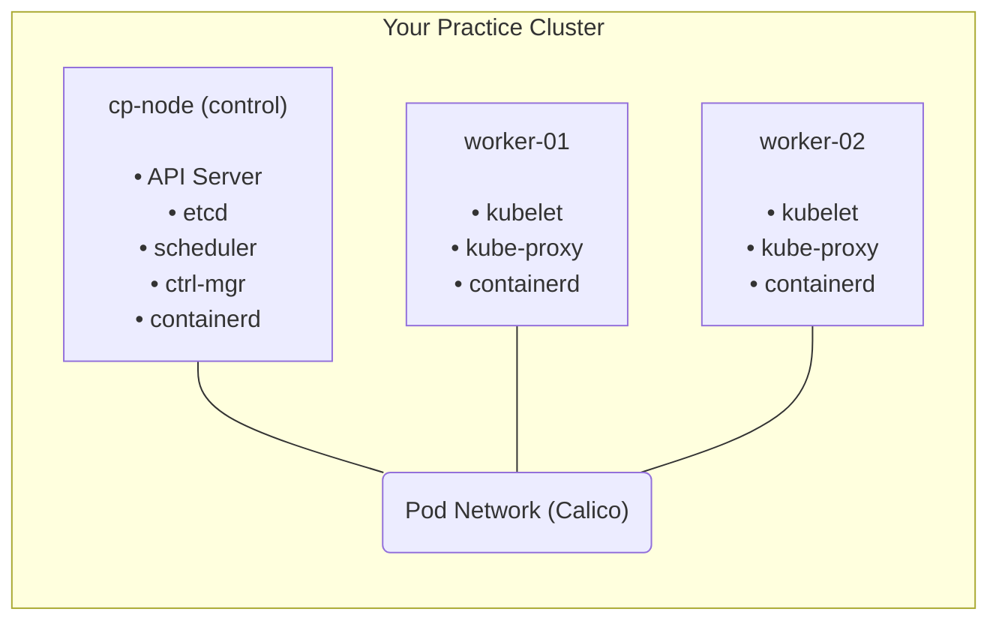

> **Complexity**: `[MEDIUM]` - Takes time but straightforward if you follow steps
>
> **Time to Complete**: 45-60 minutes the first time, 15-20 minutes once familiar
>
> **Prerequisites**: Two or more machines, provided as physical hosts, local VMs, or cloud instances

# Module 0.1: Cluster Setup

## Learning Outcomes

After this module, you will be able to:

- **Build** a multi-node kubeadm cluster from scratch, including one control plane node and two worker nodes.
- **Diagnose** a node stuck in `NotReady` by checking kubelet status, CNI readiness, and system pod health.
- **Recover** from cluster bootstrap failures such as a missing scheduler manifest, a crashed worker kubelet, or an expired join token.
- **Evaluate** infrastructure choices for a practice cluster and select the tradeoff that fits exam preparation, cost, and troubleshooting depth.

## Why This Module Matters

Exercise scenario: you have been practicing Kubernetes with a managed cluster where the cloud provider owns the control plane, node bootstrap, and most of the networking defaults. During a CKA-style task, a worker suddenly stays `NotReady`, a pod is stuck in `ContainerCreating`, and the only useful clues are on the node itself. If your mental model stops at `kubectl get pods`, you can describe the symptom, but you cannot diagnose the system that created it.

The CKA environment expects you to work with kubeadm-provisioned clusters, not a polished managed service that hides certificate generation, kubelet registration, static control plane pods, and Container Network Interface configuration. kubeadm does not remove complexity; it packages the bootstrap sequence into predictable phases so you can reason about what happened when something breaks. That makes it ideal for exam preparation because every visible failure maps back to a small set of local files, systemd services, ports, certificates, and pods.

This module teaches you to build a practice cluster that behaves like the clusters you troubleshoot in administration work. You will prepare three Ubuntu-based nodes, install containerd and the Kubernetes tools, initialize the control plane with Kubernetes 1.35 package repositories, install Calico networking, join workers, and prove that workloads schedule across the cluster. More importantly, you will learn why each step exists so a broken setup does not feel like a long checklist with one invisible typo.

Think of a Kubernetes cluster like an orchestra. The control plane is the conductor because it decides what should run, records the score, and tells every section when to enter. Worker nodes are the musicians because they run the containers that produce the application. A conductor without musicians creates silence, musicians without a conductor create confusion, and a cluster without reliable communication between those roles creates the same kind of operational noise.

## What You'll Build

The target cluster has one control plane node and two worker nodes. That is small enough to build repeatedly, but large enough to expose the behaviors that single-node tools hide: node registration, pod placement across machines, CNI distribution, kubelet health, and control plane static pods. A one-node cluster is useful for API practice, but it cannot teach you what happens when a worker joins, stops reporting, loses networking, or needs to be reset.



This diagram is intentionally simple because kubeadm's first lesson is separation of responsibility. The API server, scheduler, controller manager, and etcd run as static pods on the control plane node. The kubelet and container runtime run on every node. Calico adds the pod network that lets pods on different nodes behave as if they share one routable cluster network.

The same picture is also useful during troubleshooting because every symptom has a location. If `kubectl` cannot reach the cluster, start with API server reachability and kubeconfig. If a pod never receives an IP address, start with CNI pods and node-level CNI configuration. If a worker disappears from scheduling, start with the kubelet, node conditions, and the worker's local system logs.

## Choose Your Infrastructure

You need three machines for the full exercise, and the word "machine" can mean a physical host, a virtual machine, or a cloud instance. The important requirement is not the vendor; it is that each node has its own operating system, hostname, IP address, container runtime, kubelet, and systemd service state. That separation gives you a realistic place to practice SSH-based diagnosis instead of treating the cluster as one opaque process.

| Option | Pros | Cons | Cost |
|--------|------|------|------|
| **VMs on Mac (UTM/Parallels)** | Local, no network issues | Resource heavy | Free (UTM) |
| **VMs on Linux (KVM/libvirt)** | Native performance | Linux host required | Free |
| **Cloud VMs (AWS/GCP/Azure)** | Closest to exam environment | Costs money | ~$0.10/hr |
| **Bare metal** | Best performance | Need hardware | Existing |
| **Raspberry Pi cluster** | Fun project, low power | ARM quirks | ~$200 |

Local VMs are usually the best first choice because snapshots make mistakes cheap. If you misconfigure containerd or accidentally reset a node, you can roll back quickly and repeat the lesson. Cloud VMs are closer to many production environments, but firewalls, cloud-init images, and cloud networking rules add failure modes that distract from kubeadm until you are comfortable with the baseline.

When you evaluate infrastructure choices for a practice cluster, separate convenience from observability. A managed service is convenient because it removes the control plane from your workload, but that also removes the exact files, services, and recovery paths this module is trying to expose. A laptop VM environment is less glamorous, yet it lets you pause, snapshot, inspect logs, break a worker, and rebuild the same failure until the sequence becomes familiar. That repetition is more valuable than raw realism during the first pass through kubeadm.

| Resource | Control Plane | Worker |
|----------|--------------|--------|
| CPU | 2 cores | 2 cores |
| RAM | 2 GB | 2 GB |
| Disk | 20 GB | 20 GB |
| OS | Ubuntu 22.04 LTS | Ubuntu 22.04 LTS |

These minimums are deliberately modest because the cluster is for learning, not production traffic. The control plane needs enough memory for etcd, the API server, the scheduler, the controller manager, CoreDNS, kube-proxy, and Calico. Workers need enough headroom to run system pods and a few test workloads without creating misleading memory pressure while you are still learning the normal bootstrap path.

Before you provision anything, decide how you will identify the nodes from your terminal. Hostname confusion is a common cause of self-inflicted cluster damage because `kubeadm init`, `kubeadm join`, and `kubeadm reset` are node-local operations. A clear shell prompt, a small inventory note, or three separate terminal tabs named after the hosts can prevent you from joining the wrong machine or resetting the control plane.

Also decide how you will recover from mistakes before you make them. If you are using local VMs, take a snapshot after the operating system is updated and before Kubernetes packages are installed, then consider another snapshot after the node preparation steps succeed. If you are using cloud VMs, write down the instance names, private addresses, and security group rules, and set a budget reminder so the lab does not keep running after practice. These operational choices are part of the module because cluster setup is never just a Kubernetes command; it is a small systems project with cost, access, and recovery constraints.

## Prepare Every Node Before Bootstrap

kubeadm assumes the operating system is already suitable for Kubernetes. It does not magically fix swap, kernel module loading, bridge packet filtering, IP forwarding, container runtime configuration, or package repository setup. Those are host prerequisites, and treating them as part of the cluster rather than "Linux chores" makes the later errors much easier to interpret.

Run the preparation steps on all three nodes: `cp-node`, `worker-01`, and `worker-02`. The goal is to make the machines boringly consistent before any node tries to become a control plane or worker. If one worker has swap enabled, another has the wrong hostname, and the control plane has a different cgroup driver, kubeadm may still start, but your first troubleshooting exercise will be a pile of unrelated failures.

Start with hostnames because Kubernetes uses node names as durable identities. A node object called `worker-01` is easier to recognize in `kubectl get nodes`, `kubectl describe node`, scheduler events, and pod placement output than a default cloud hostname. The name should describe the role, not the temporary IP address, because addresses can change in many lab setups.

```bash
# On control plane node
sudo hostnamectl set-hostname cp-node

# On first worker
sudo hostnamectl set-hostname worker-01

# On second worker
sudo hostnamectl set-hostname worker-02
```

Add simple name resolution next. A small `/etc/hosts` file is enough for a lab cluster, and it removes DNS as a variable while you learn kubeadm. Replace the example addresses with the actual addresses for your nodes, and apply the same mapping on each machine so every node agrees on how to reach the control plane and workers.

```bash
sudo tee -a /etc/hosts << EOF
192.168.1.10  cp-node
192.168.1.11  worker-01
192.168.1.12  worker-02
EOF
```

Swap must be disabled unless you are intentionally testing newer swap behavior and have configured the kubelet for it. For CKA practice, disable it because the exam-style path expects the kubelet to manage node memory without the operating system moving anonymous pages to disk behind its back. When swap is enabled unexpectedly, memory pressure symptoms become harder to interpret because the kubelet and scheduler no longer have a clean view of allocatable memory.

```bash
# Disable swap immediately
sudo swapoff -a

# Disable swap permanently (survives reboot)
sudo sed -i '/ swap / s/^/#/' /etc/fstab
```

Exercise scenario: a worker joins successfully, but after the first reboot the kubelet never becomes healthy and the node never turns `Ready`. You check `journalctl -u kubelet` and see swap-related messages because the operator ran `swapoff -a` during setup but forgot to edit `/etc/fstab`. The fix is not to reinstall Kubernetes; the fix is to correct the host configuration that returns at boot.

Linux bridge networking also needs explicit preparation. Kubernetes pods often send traffic through virtual Ethernet devices and Linux bridges, and the host must pass bridged packets through netfilter so iptables or nftables rules can enforce service routing and policy. Loading `overlay` and `br_netfilter` now, then persisting them under `/etc/modules-load.d`, keeps runtime behavior consistent after a reboot.

```bash
# Load modules now
sudo modprobe overlay
sudo modprobe br_netfilter

# Ensure they load on boot
cat << EOF | sudo tee /etc/modules-load.d/k8s.conf
overlay
br_netfilter
EOF
```

The sysctl settings connect that kernel preparation to packet forwarding. `net.ipv4.ip_forward` lets the host route packets between interfaces, while the bridge netfilter settings make bridged IPv4 and IPv6 traffic visible to filtering rules. Without these settings, a pod can appear healthy from the API's point of view while traffic silently fails at the node boundary.

```bash
cat << EOF | sudo tee /etc/sysctl.d/k8s.conf
net.bridge.bridge-nf-call-iptables  = 1
net.bridge.bridge-nf-call-ip6tables = 1
net.ipv4.ip_forward                 = 1
EOF

# Apply immediately
sudo sysctl --system
```

Pause and predict: before you run `kubeadm init`, which command would you expect to fail if packet forwarding or bridge netfilter is wrong? The surprising answer is that bootstrap may still complete because those settings matter most when pods and services start sending traffic. That is why a cluster can look healthy at the control plane level while application connectivity fails during verification.

Kubernetes 1.35 expects modern node behavior, and cgroup v2 is now the baseline for this lab. cgroups are the kernel mechanism that lets the kubelet and container runtime place limits around CPU, memory, and process accounting. If the kubelet uses one cgroup driver while the runtime uses another, node accounting becomes inconsistent, so this module keeps the host, kubelet, and containerd aligned around systemd-managed cgroups.

```bash
# Check cgroup version (must show "cgroup2fs")
stat -fc %T /sys/fs/cgroup
# Expected output: cgroup2fs

# If it shows "tmpfs", you're on cgroup v1 — you need a newer OS
# Affected: CentOS 7, RHEL 7, Ubuntu 18.04
# Supported: Ubuntu 22.04+, Debian 12+, RHEL 9+, Rocky 9+
```

If `stat -fc %T /sys/fs/cgroup` returns `tmpfs` instead of `cgroup2fs`, upgrade the operating system before proceeding. Kubernetes 1.35 will not be a friendly place to debug old cgroup defaults, and the time you spend forcing an outdated host to limp forward is time stolen from the actual administration skills you need. Ubuntu 22.04 or newer keeps this part predictable.

containerd is the container runtime in this module because Kubernetes speaks to runtimes through the Container Runtime Interface rather than through Docker commands. Installing containerd directly keeps the node close to current Kubernetes defaults and avoids an extra compatibility layer. The key configuration detail is `SystemdCgroup = true`, which tells containerd to use the same cgroup manager that the kubelet expects on a systemd-based distribution.

```bash
# Install containerd (ensure version 2.0+)
sudo apt-get update
sudo apt-get install -y containerd

# Verify version
containerd --version
# Should be 2.0.0 or later

# Create default config
sudo mkdir -p /etc/containerd
containerd config default | sudo tee /etc/containerd/config.toml

# Enable systemd cgroup driver (IMPORTANT!)
sudo sed -i 's/SystemdCgroup = false/SystemdCgroup = true/' /etc/containerd/config.toml

# Restart containerd
sudo systemctl restart containerd
sudo systemctl enable containerd
```

The runtime version matters for future compatibility as well as today's bootstrap. Kubernetes 1.35 is a modern target, and the ecosystem has moved away from old image formats and old runtime behavior. If you inherit very old container images that rely on Docker Schema 1, containerd 2.0 will not rescue them; rebuild or republish those images with a modern toolchain instead of weakening the node runtime.

Now install the Kubernetes node tools from the 1.35 package repository. `kubeadm` performs cluster bootstrap and joins nodes, `kubelet` runs on every node and reports local state, and `kubectl` is the client you will use from the control plane during this lab. Holding the packages is a practical lab choice because accidental minor-version drift can turn a simple exercise into an upgrade troubleshooting session.

```bash
# Install dependencies
sudo apt-get update
sudo apt-get install -y apt-transport-https ca-certificates curl gpg

# Add Kubernetes repository key
curl -fsSL https://pkgs.k8s.io/core:/stable:/v1.35/deb/Release.key | sudo gpg --dearmor -o /etc/apt/keyrings/kubernetes-apt-keyring.gpg

# Add Kubernetes repository
echo 'deb [signed-by=/etc/apt/keyrings/kubernetes-apt-keyring.gpg] https://pkgs.k8s.io/core:/stable:/v1.35/deb/ /' | sudo tee /etc/apt/sources.list.d/kubernetes.list

# Install components
sudo apt-get update
sudo apt-get install -y kubelet kubeadm kubectl

# Prevent automatic updates (version consistency matters)
sudo apt-mark hold kubelet kubeadm kubectl
```

The kubelet may show as inactive, activating, or repeatedly restarting before the cluster is initialized. That is expected because kubeadm has not yet written the kubelet configuration and bootstrap credentials under `/var/lib/kubelet`. A first-time learner often treats that restart loop as a failed installation, but at this point the kubelet is waiting for cluster identity rather than reporting a runtime error.

```bash
# Check containerd
sudo systemctl status containerd

# Check kubelet (will be inactive until cluster is initialized)
sudo systemctl status kubelet

# Check kubeadm version
kubeadm version
```

Before moving on, compare the three nodes rather than trusting that repeated commands succeeded identically. The control plane and workers should agree on cgroup version, containerd health, package versions, host resolution, and disabled swap. This is the first habit that separates reliable cluster administration from command memorization: verify the state you think you created before asking Kubernetes to build on top of it.

One practical comparison method is to keep a scratch buffer with the expected output from each prerequisite and mark each node as it passes. That sounds mundane, but it prevents a subtle class of errors where two nodes are correct and the third only looks correct because you ran the last command in the wrong terminal. In real operations, this becomes configuration management and node conformance testing; in a small lab, a careful checklist gives you the same protection at the right scale.

The preparation phase also teaches you which errors belong below Kubernetes. If `modprobe br_netfilter` fails, that is a kernel or host image problem. If `containerd --version` is too old, that is a package source or operating system problem. If `/etc/hosts` resolves `cp-node` differently on two machines, that is a name resolution problem. kubeadm will eventually reveal some of these mistakes, but it will reveal them later and with less context than the direct host checks do.

## Initialize the Control Plane

Only the control plane node runs `kubeadm init`. That command creates the cluster's first API endpoint, generates certificates, writes static pod manifests, initializes etcd, creates bootstrap credentials, and prints a worker join command. It is a dense operation, so treat the output as a record of what was created rather than a wall of text to skip.

```bash
sudo kubeadm init \
  --pod-network-cidr=10.244.0.0/16 \
  --control-plane-endpoint=cp-node:6443
```

The pod CIDR is the address range that the cluster will reserve for pods, and the control plane endpoint is the address workers use when they join. For a lab, `cp-node:6443` is simple and readable. In a highly available production cluster, that endpoint would normally be a load balancer or stable virtual address, but this module keeps the topology intentionally small so you can see every moving part.

```text
Your Kubernetes control-plane has initialized successfully!

To start using your cluster, you need to run the following as a regular user:

  mkdir -p $HOME/.kube
  sudo cp -i /etc/kubernetes/admin.conf $HOME/.kube/config
  sudo chown $(id -u):$(id -g) $HOME/.kube/config

Then you can join any number of worker nodes by running the following on each as root:

kubeadm join cp-node:6443 --token abcdef.0123456789abcdef \
    --discovery-token-ca-cert-hash sha256:...
```

Save the join command because it contains two important pieces of trust material. The token lets a new node authenticate during bootstrap, and the CA certificate hash lets the node verify that it is talking to the intended control plane instead of a lookalike endpoint. If the token expires, you can generate another one, but saving the first command keeps the initial lab smooth.

Configure `kubectl` for your regular user after initialization. The file you copy is an administrator kubeconfig, so do not scatter it casually across machines or paste it into chat systems. For this practice cluster, keeping it under your home directory on the control plane node is enough to make the client usable without running every command through `sudo`.

```bash
mkdir -p $HOME/.kube
sudo cp -i /etc/kubernetes/admin.conf $HOME/.kube/config
sudo chown $(id -u):$(id -g) $HOME/.kube/config
```

When you first ask for nodes, the control plane commonly appears as `NotReady`. That status does not mean the API server failed; it means the node is not yet fully prepared to run pods because the cluster network plugin has not configured pod networking. This is one of the most valuable early observations in the module because it teaches you that control plane bootstrap and pod network readiness are separate milestones.

```bash
kubectl get nodes
```

```text
NAME      STATUS     ROLES           AGE   VERSION
cp-node   NotReady   control-plane   1m    v1.35.0
```

Pause and predict: if the API server, etcd, scheduler, and controller manager are already running, why would the node still be `NotReady`? The missing piece is the CNI plugin, which writes node-level network configuration and runs pods that provide pod-to-pod routing. Until that exists, the kubelet cannot truthfully report that the node is ready for normal scheduling.

It helps to know where kubeadm placed the control plane components. They are static pod manifests under `/etc/kubernetes/manifests`, watched by the kubelet rather than deployed by a higher-level controller. That design is why moving one manifest out of the directory can remove a control plane component, and moving it back can restore the component without a separate deployment command.

```bash
sudo ls /etc/kubernetes/manifests
```

```text
etcd.yaml
kube-apiserver.yaml
kube-controller-manager.yaml
kube-scheduler.yaml
```

This static pod pattern is operationally useful because it gives you a local recovery lever when the cluster is partly broken. If the scheduler is missing, new pods can remain pending even though the API server accepts requests. If the API server is down, `kubectl` cannot help until you diagnose the local manifest, kubelet, container runtime, certificate, or port problem on the control plane node.

The kubeconfig step deserves the same respect as the cluster initialization step because it controls who you are when you talk to the API server. The copied `admin.conf` file contains client credentials with broad cluster authority, so it is convenient for a private practice environment but not a pattern for distributing access in a shared organization. Later modules will use Kubernetes RBAC to create narrower identities; for now, the important point is that `kubectl` success depends on a local file, a reachable server endpoint, and credentials trusted by the API server.

If `kubectl get nodes` returns a connection error, split the problem into layers. First confirm that the kubeconfig exists and points at `https://cp-node:6443`. Then confirm the name resolves from the current host and the API server process is running as a static pod. Finally, check whether the kubelet and containerd are healthy enough to keep that static pod alive. This approach is slower than guessing on the first day, but it becomes faster because every check has a reason.

## Install the Pod Network

Kubernetes defines a networking model but does not ship one mandatory implementation. Every pod should get an IP address, pods should reach other pods without node-level NAT, and services should have stable virtual addresses, but a CNI plugin provides the host-level mechanics. This separation lets different environments choose Calico, Cilium, Flannel, cloud-native plugins, or other implementations without changing the Kubernetes API.

For this lab, use Calico because it is widely documented, works well in kubeadm labs, and exposes the relationship between a cluster manifest and node-level CNI configuration. The command below is the protected setup command from the original module, and it applies a versioned Calico manifest directly from the upstream project. In a production change process, you would usually pin, review, and store manifests instead of applying remote YAML blindly.

```bash
kubectl apply -f https://raw.githubusercontent.com/projectcalico/calico/v3.27.0/manifests/calico.yaml
```

Watch the `kube-system` namespace after applying the CNI. This is not just waiting for green output; it is learning which system pods belong to the base cluster and which ones come from the network plugin. Calico runs as a DaemonSet on nodes because networking must be configured locally on each machine that will run pods.

```bash
kubectl get pods -n kube-system -w
```

After the Calico pods settle, check node readiness again. The transition from `NotReady` to `Ready` is the point where the kubelet can report that the node has runtime, health, and networking conditions suitable for scheduling. If the status stays `NotReady`, do not reinstall kubeadm first; inspect CNI pods, kubelet events, and `/etc/cni/net.d` on the node.

```bash
kubectl get nodes
```

```text
NAME      STATUS   ROLES           AGE   VERSION
cp-node   Ready    control-plane   5m    v1.35.0
```

The most useful debugging question at this stage is whether the failure is cluster-wide or node-local. If all nodes lack CNI pods, the manifest or image pulls are suspect. If only one worker is affected, the kubelet, container runtime, host firewall, kernel modules, or CNI files on that worker are better starting points. This habit keeps you from deleting healthy system pods just because one node is broken.

Networking is often where beginners blur three separate ideas: pod IP assignment, service routing, and external access. The CNI plugin primarily gives pods network interfaces and routes so pods can communicate according to the Kubernetes network model. kube-proxy programs service rules so a stable service address can reach changing pod backends. NodePort then exposes a service on node ports, which is useful for a lab test but not the same thing as proving every external ingress path is production-ready.

This distinction matters during diagnosis because similar symptoms can come from different layers. A pod stuck in `ContainerCreating` often points toward runtime or CNI setup before the container is even running. A running pod that cannot be reached through a service may point toward labels, endpoints, kube-proxy, or host firewall behavior. A service that works from one node but not another may point toward node-local rules instead of the deployment itself.

## Join Worker Nodes

Worker nodes join the cluster by running the join command generated by `kubeadm init`. The command is intentionally run with `sudo` on the worker because it writes kubelet bootstrap files, talks to the API server, and configures the node as a cluster member. Run it on `worker-01` and `worker-02`, not on the control plane node that already belongs to the cluster.

```bash
sudo kubeadm join cp-node:6443 --token abcdef.0123456789abcdef \
    --discovery-token-ca-cert-hash sha256:...
```

Tokens expire by design, so do not treat an expired join command as a disaster. The short lifetime limits the damage if a token is copied into notes or terminal scrollback where it does not belong. When you need to add another worker later, create a fresh join command on the control plane and run the new command on the worker.

```bash
# On control plane, generate new token
kubeadm token create --print-join-command
```

Verify joined nodes from the control plane. New workers may briefly appear before all CNI pods and kube-proxy components settle, but they should converge to `Ready` if the preparation steps were consistent. The role may show as `<none>` because worker role labels are conventional labels, not a separate node type created by kubeadm.

```bash
kubectl get nodes
```

```text
NAME        STATUS   ROLES           AGE   VERSION
cp-node     Ready    control-plane   10m   v1.35.0
worker-01   Ready    <none>          2m    v1.35.0
worker-02   Ready    <none>          1m    v1.35.0
```

Hypothetical scenario: you expect a three-node cluster, but `kubectl get nodes` shows only two nodes after you ran a join command. Before changing tokens or reapplying Calico, confirm which terminal was connected to which host and check the worker's kubelet logs. Many bootstrap mistakes are not Kubernetes mysteries; they are simple host targeting mistakes that become obvious when you verify the hostname and node-local service state.

Labeling workers is optional, but it makes output clearer and helps later modules that discuss scheduling, affinity, taints, and topology. The label below uses the common role-label convention so `kubectl get nodes` displays `worker` in the roles column. It does not grant special powers; it simply improves readability and creates useful metadata.

```bash
kubectl label node worker-01 node-role.kubernetes.io/worker=
kubectl label node worker-02 node-role.kubernetes.io/worker=
```

```text
NAME        STATUS   ROLES           AGE   VERSION
cp-node     Ready    control-plane   10m   v1.35.0
worker-01   Ready    worker          3m    v1.35.0
worker-02   Ready    worker          2m    v1.35.0
```

Before running application workloads, inspect the system from two perspectives. From the API server perspective, nodes and system pods should be ready. From the node perspective, kubelet and containerd should be healthy systemd services. Kubernetes administration becomes easier when you can move between those perspectives instead of expecting `kubectl` to explain every host-level failure.

The join process is also your first view of Kubernetes trust bootstrapping. A worker does not become a node merely because it can open a TCP connection to the API server; it presents bootstrap credentials, verifies the cluster CA hash, receives kubelet credentials, and then begins reporting node status. That is why the join command includes both a token and a discovery hash. One proves the worker is allowed to request entry, while the other helps the worker confirm which cluster it is joining.

If a join fails, preserve the terminal output long enough to classify the failure. A DNS failure, a timeout to port 6443, an expired token, a CA hash mismatch, and a kubelet registration failure are not interchangeable. Each points to a different layer and a different fix, so the fastest recovery usually starts by naming the class of failure before rerunning anything. This is the same reasoning you will use in later modules when a failed workload might be an image, scheduling, runtime, networking, or policy issue.

## Verify the Cluster With a Workload

A cluster is not useful merely because the control plane responds. It must schedule pods, start containers, assign pod IP addresses, route service traffic, and clean up resources afterward. A tiny nginx deployment is enough to prove the basic loop without burying you in application-specific configuration.

```bash
kubectl create deployment nginx --image=nginx --replicas=3
kubectl expose deployment nginx --port=80 --type=NodePort
```

Check where the pods landed. The exact pod names will differ, but the important detail is that pods are running and scheduled onto worker nodes. If every pod stays pending, think scheduler, taints, resource requests, or node readiness. If pods stay in `ContainerCreating`, think image pulls, runtime, volumes, and CNI events.

```bash
kubectl get pods -o wide
```

```text
NAME                     READY   STATUS    NODE
nginx-77b4fdf86c-abc12   1/1     Running   worker-01
nginx-77b4fdf86c-def34   1/1     Running   worker-02
nginx-77b4fdf86c-ghi56   1/1     Running   worker-01
```

Expose the deployment with a NodePort and test it from a node. NodePort is not the only service type, but it is a convenient lab check because it exercises service routing without requiring an external load balancer. Replace `<nodeport>` with the actual port shown by the service output.

```bash
# Get NodePort
kubectl get svc nginx

# Test from any node
curl http://worker-01:<nodeport>
```

Clean up the test resources after the verification step. Leaving tiny workloads around is not harmful in a disposable lab, but cleanup teaches you to control the cluster state deliberately. Later troubleshooting exercises are clearer when old test pods and services are not mixed with the thing you are trying to observe.

```bash
kubectl delete deployment nginx
kubectl delete svc nginx
```

Keep a small command reference for the cluster, but do not confuse a reference with understanding. These commands are useful because each one answers a different question: is the API reachable, are nodes ready, are all namespaces healthy, is a local kubelet running, and can a node be reset when you need to start over. Practice saying the question before running the command so the output has meaning.

```bash
# Check cluster status
kubectl cluster-info
kubectl get nodes
kubectl get pods -A

# Check component health
kubectl get componentstatuses  # deprecated but still works

# SSH to nodes for troubleshooting
ssh worker-01 "sudo systemctl status kubelet"
ssh worker-01 "sudo journalctl -u kubelet -f"

# Reset a node (start over)
sudo kubeadm reset
```

Which approach would you choose here and why: repeatedly rebuild the cluster from scratch, or snapshot the VMs after node preparation and before `kubeadm init`? For early learning, snapshots after preparation are efficient because they let you repeat bootstrap failures without redoing package installation. For exam readiness, occasional full rebuilds still matter because they test whether you remember the host prerequisites as well as the kubeadm commands.

The nginx check is intentionally ordinary because ordinary checks make abnormal behavior stand out. If you choose a complex application for the first verification, you add application configuration, storage, probes, and image behavior to the same moment when you are trying to validate the cluster. A simple deployment and service keep the signal clean: can the scheduler place pods, can the runtime start containers, can the CNI provide networking, and can service routing reach a backend.

After cleanup, run one final cluster-wide read command such as `kubectl get pods -A` and look for leftovers. This is not about keeping the lab pristine for its own sake; it is about learning to close a change with evidence. Administrators who leave every verification pod behind eventually train themselves to ignore clutter, and ignored clutter is where real alerts, failed jobs, or broken system pods can hide.

## Patterns & Anti-Patterns

Reliable kubeadm work is less about typing a long sequence perfectly and more about creating feedback points. A good pattern turns invisible assumptions into visible state before the next step depends on them. A bad pattern compresses too much work into one paste buffer and leaves you guessing which prerequisite caused the later failure.

| Pattern | When to Use It | Why It Works |
|---------|----------------|--------------|
| Prepare all nodes before bootstrap | Before running `kubeadm init` or `kubeadm join` | It removes host drift so bootstrap errors point to Kubernetes rather than inconsistent Linux state. |
| Verify from API and node views | Whenever a node, pod, or component looks unhealthy | The API shows desired and reported cluster state, while systemd and journals show local process failures. |
| Keep join commands short-lived | When adding workers after the initial bootstrap | Fresh tokens reduce stale credential risk and avoid confusing expired-token errors with network failures. |
| Label workers after they join | When you want readable node output and future scheduling practice | Role labels improve clarity without changing how kubeadm created the node. |

The strongest pattern in this module is preparing every node the same way before assigning roles. You can still tune control plane and worker nodes differently later, but baseline consistency is a gift during early troubleshooting. If one node is unhealthy, you want to compare it against a known-good peer rather than wonder whether every machine was built differently.

| Anti-Pattern | What Goes Wrong | Better Alternative |
|--------------|-----------------|--------------------|
| Treating `NotReady` as one generic error | You reinstall components without checking node conditions or CNI events | Read `kubectl describe node`, CNI pod status, and kubelet logs before changing state. |
| Applying remote manifests without review in production | You cannot prove what changed or roll back confidently | Pin, review, and store manifests, even if labs use a direct URL for speed. |
| Ignoring systemd because `kubectl` exists | Host-level kubelet or runtime failures stay invisible | Use `systemctl` and `journalctl` as first-class Kubernetes tools. |
| Leaving packages unpinned in a practice cluster | Background upgrades can introduce version drift between nodes | Hold kubelet, kubeadm, and kubectl until you intentionally practice upgrades. |

The most dangerous anti-pattern is assuming a green command means a complete system. `kubeadm init` can succeed before pod networking exists, and a node can register before it is genuinely useful for workloads. Build the habit of verifying the next dependency in the chain: API, kubelet, runtime, CNI, system pods, application pods, service reachability, and cleanup.

Another pattern worth practicing is the reversible change. Moving a scheduler manifest to `/tmp/` is reversible because you know exactly what changed and how to put it back. Resetting a worker is reversible if you also know how to delete the stale node object and generate a fresh join command. Randomly deleting namespaces, reinstalling packages, or reinitializing the control plane is harder to reverse because those actions change many things at once and destroy the evidence you needed.

Good troubleshooting notes should capture the symptom, the layer you tested, the command used, and the result. For example, "worker kubelet stopped, node condition changed to NotReady, restarting kubelet restored Ready" is far more useful than "fixed node." The first note teaches a causal link you can reuse under pressure. The second note only says that something happened, and it will not help when the next failure looks similar but comes from CNI rather than kubelet health.

## Decision Framework

Choose the simplest infrastructure that still exposes the failure modes you need to practice. If your goal is API object fluency, a single-node tool can be enough for a short session. If your goal is CKA administration, you need separate nodes because kubelet, join, CNI, and reset workflows are the skill being tested.

```text
+-------------------------------+
| Need node-level CKA practice?  |
+---------------+---------------+
                |
        +-------+-------+
        |               |
       Yes              No
        |               |
+-------v------+   +----v----------------+
| Use kubeadm  |   | Use kind/minikube   |
| with 3 nodes |   | for API object work |
+-------+------+   +---------------------+
        |
        v
+-------------------------------+
| Need cheap resets and repeats? |
+---------------+---------------+
                |
        +-------+-------+
        |               |
       Yes              No
        |               |
+-------v------+   +----v----------------+
| Local VMs    |   | Cloud or bare metal |
| with snapshots|  | with clear teardown |
+--------------+   +---------------------+
```

Use local VMs when you want fast repetition, predictable networking, and cheap mistakes. Use cloud VMs when you also want to practice host firewalls, security groups, remote access, and external routing, but remember that those are extra lessons layered on top of kubeadm. Use bare metal when performance or hardware learning matters, and accept that resets require more discipline.

For this module, the recommended path is three Ubuntu 22.04 or newer VMs with static or reserved IP addresses. That gives you enough realism for node troubleshooting and enough control to rebuild without fear. After you can build and repair this cluster twice from notes, cloud variants become useful practice rather than a source of random distractions.

Use the same decision logic when you adapt the lab for your own machine. If your laptop has limited memory, use smaller VMs and keep workloads tiny rather than skipping worker nodes entirely. If your network makes local VM routing painful, a short-lived cloud lab may be worth the cost because it preserves the multi-node learning objective. If you only have one machine today, practice the command sequence mentally, but do not mistake that for completing the diagnostic outcome because node-local failure handling requires separate hosts.

The decision is not permanent. A good learning path often starts with local VMs, moves to cloud VMs for remote networking practice, and later compares the kubeadm model with a managed service to understand what the provider takes over. That sequence gives you both sympathy for the machinery under Kubernetes and appreciation for the operational boundaries managed services create. The key is to choose the environment that exposes the specific skill you are trying to learn this week.

## Did You Know?

- kubeadm became generally available as part of Kubernetes 1.13 in 2018, after earlier releases treated it as an evolving bootstrap tool rather than the stable cluster creation path most administrators now recognize.
- Kubernetes removed the in-tree dockershim from the kubelet in version 1.24, which is why modern labs usually teach containerd or another CRI runtime directly instead of treating Docker as the node runtime.
- Bootstrap tokens are designed to be temporary credentials; the default time-to-live is 24 hours, so a join command saved from the first day of a lab should not be expected to work later.
- The Kubernetes package repositories moved to `pkgs.k8s.io`, and this module uses the `core:/stable:/v1.35` repository path so package installation tracks the Kubernetes 1.35 target rather than an older repository layout.

## Common Mistakes

| Mistake | Why It Happens | How to Fix It |
|---------|----------------|---------------|
| `kubelet` keeps restarting before `kubeadm init` | Learners expect kubelet to be fully configured immediately after package installation | Recognize the pre-bootstrap restart as expected, then verify it again after `kubeadm init` or `kubeadm join` writes kubelet config. |
| Nodes stuck in `NotReady` | The CNI plugin was not installed, failed to start, or did not write node CNI configuration | Check `kubectl get pods -n kube-system`, inspect CNI pod events, and verify the node has CNI files under `/etc/cni/net.d`. |
| `kubeadm init` hangs or workers cannot join | Firewalls, host resolution, or endpoint mistakes block access to the API server on port 6443 | Confirm `/etc/hosts`, test connectivity to `cp-node:6443`, and open the required Kubernetes node ports in the lab network. |
| Join token expired | The original bootstrap token aged out before a new worker was added | Run `kubeadm token create --print-join-command` on the control plane and use the fresh command on the worker. |
| `kubectl` returns connection refused | The user's kubeconfig is missing, points to the wrong endpoint, or was copied with the wrong ownership | Recopy `/etc/kubernetes/admin.conf` to `$HOME/.kube/config`, fix ownership, and verify the server address. |
| Pods stay in `ContainerCreating` | The runtime, image pull, CNI, or volume setup is failing after scheduling | Use `kubectl describe pod`, inspect events, then check containerd, CNI pods, and node logs for the specific failure. |
| Scheduler appears healthy but new pods stay pending | The scheduler static pod manifest may be missing, the scheduler is crashlooping, or nodes are unschedulable | Check `kube-system` scheduler pods, verify `/etc/kubernetes/manifests/kube-scheduler.yaml`, and inspect pending pod events. |

## Quiz

<details>
<summary>Scenario: Your team is provisioning new lab servers, and someone suggests leaving swap enabled so the operating system has a safety valve. What do you check and how do you respond?</summary>

You should explain that the kubelet expects predictable memory accounting and that unexpected swap makes node memory behavior harder to reason about. In this lab path, disable swap immediately with `sudo swapoff -a` and persist the change in `/etc/fstab` so the issue does not return after a reboot. If the kubelet is failing, inspect `journalctl -u kubelet` for swap-related messages before reinstalling Kubernetes. The important reasoning is that this is a host prerequisite failure, not a scheduler or CNI failure.

</details>

<details>
<summary>Scenario: You run `kubeadm init`, configure `kubectl`, and see `cp-node` as `NotReady`. Which component do you investigate first, and why?</summary>

Investigate the CNI installation first because a freshly initialized control plane can run the API server, etcd, scheduler, and controller manager before pod networking is ready. The kubelet reports `NotReady` when it cannot provide normal pod networking, and that is expected before Calico or another CNI plugin is installed. Check `kubectl get pods -n kube-system`, apply the Calico manifest if needed, and then watch node readiness. Re-running `kubeadm init` would be the wrong first move because the control plane already exists.

</details>

<details>
<summary>Scenario: Three days after bootstrap, you need to add `worker-03`, but the saved join command fails. What is the safest recovery path?</summary>

Generate a new command on the control plane with `kubeadm token create --print-join-command`, then run that fresh command on the prepared worker. The original bootstrap token is designed to expire, so the failure does not imply that the API server is broken. Before joining, still confirm that `worker-03` has swap disabled, containerd running, Kubernetes packages installed, and name resolution for `cp-node`. This answer tests recovery because the fix is to renew bootstrap credentials rather than weaken token lifetime.

</details>

<details>
<summary>Scenario: `worker-02` appears in `kubectl get nodes`, but it remains `NotReady` while the control plane and `worker-01` are healthy. How do you narrow the diagnosis?</summary>

Treat it as a node-local failure until evidence says otherwise. Start with `kubectl describe node worker-02` to read conditions and events, then SSH to the worker and check `systemctl status kubelet`, `journalctl -u kubelet`, containerd status, and CNI configuration. Because other nodes are healthy, a cluster-wide Calico manifest problem is less likely than a worker-specific runtime, kubelet, kernel module, firewall, or CNI file problem. This reasoning prevents broad destructive changes to healthy parts of the cluster.

</details>

<details>
<summary>Scenario: New pods stay `Pending` after someone moved `/etc/kubernetes/manifests/kube-scheduler.yaml` out of the manifest directory. Why does that break scheduling, and how do you restore it?</summary>

kubeadm runs the scheduler as a static pod controlled by the kubelet on the control plane node. When the manifest is removed, the kubelet no longer has the local desired state needed to run the scheduler pod, so the API can accept pod objects but no scheduler assigns them to nodes. Restore the manifest to `/etc/kubernetes/manifests/`, wait for the scheduler pod to return in `kube-system`, and then verify that pending pods transition to running. This is a recovery task because the fix happens on the control plane filesystem, not through a Deployment.

</details>

<details>
<summary>Scenario: You can reach the API server, all nodes are `Ready`, but the nginx NodePort test fails from a worker. What should you inspect before rebuilding the cluster?</summary>

Start with the service and endpoint chain, then move outward to node networking. Check `kubectl get svc nginx`, `kubectl get endpoints nginx`, pod readiness, and `kubectl get pods -o wide` to confirm there are healthy backend pods. If the Kubernetes objects look correct, inspect host firewall rules, CNI pods, kube-proxy health, and whether you used the actual NodePort in the curl command. Rebuilding the cluster would discard useful evidence before you know whether the failure is service selection, pod health, kube-proxy, or host networking.

</details>

<details>
<summary>Scenario: You must evaluate infrastructure choices and select the cluster setup tradeoff that best fits CKA preparation. Do you choose a managed cloud cluster or a three-node kubeadm lab?</summary>

Choose the three-node kubeadm lab because the objectives require building, diagnosing, recovering, and evaluating node-level cluster bootstrap behavior. Managed clusters are excellent for many application tasks, but they hide the control plane bootstrap, static pod manifests, kubelet registration, and much of the node preparation path. For this module, those hidden pieces are the curriculum, not incidental details. A managed cluster can be useful later for comparing operational models after you understand the kubeadm baseline.

</details>

## Hands-On Exercise

Exercise scenario: build the practice cluster following the module, then intentionally prove that you can observe and repair the most common bootstrap failures. Work from a terminal layout that clearly separates `cp-node`, `worker-01`, and `worker-02`, because the exercise is as much about node targeting as it is about command syntax. Record the commands you run and the checks that prove each stage succeeded.

### Task 1: Build the Baseline Cluster

Prepare all three nodes, initialize the control plane, install Calico, join two workers, and label the workers. Do not rush past verification; capture `kubectl get nodes`, `kubectl get pods -n kube-system`, and one node-local kubelet status check. Your success criteria should prove that the API, system pods, node registration, runtime, and network plugin are all functioning together.

<details>
<summary>Solution outline</summary>

Run the preparation commands on every node, run `kubeadm init` only on `cp-node`, configure `$HOME/.kube/config`, apply Calico, and run the join command on both workers. Then label `worker-01` and `worker-02` with `node-role.kubernetes.io/worker=`. If a step fails, stop and diagnose the current layer before continuing to the next one.

</details>

### Task 2: Verify Workload Scheduling

Deploy the nginx test workload, expose it as a NodePort, confirm that pods run on worker nodes, test the service from a node, and clean up the resources. This task proves that the cluster can move from control plane health to real workload behavior. If the pods do not distribute exactly like the sample output, focus on whether they are running and reachable rather than matching pod names.

```bash
# All nodes ready?
kubectl get nodes | grep -c "Ready"  # Should output: 3

# Calico running?
kubectl get pods -n kube-system | grep calico

# Pods scheduling to workers?
kubectl run test --image=nginx
kubectl get pod test -o wide  # Should show worker node
kubectl delete pod test
```

### Task 3: Practice Fast Health Checks

Time yourself while running a basic health check. The goal is not to memorize a magic command order; the goal is to move through API reachability, node readiness, system pod health, and workload scheduling without hesitation. A fast administrator is not guessing faster; they are asking better questions in a stable order.

```bash
# All nodes Ready?
kubectl get nodes
# Expected: 3 nodes, all STATUS=Ready

# All system pods running?
kubectl get pods -n kube-system | grep -v Running
# Expected: No output (all pods Running)

# Can schedule workloads?
kubectl run test --image=nginx --rm -it --restart=Never -- echo "Cluster healthy"
# Expected: "Cluster healthy" then pod deleted
```

### Task 4: Simulate and Fix a `NotReady` Worker

Stop the kubelet on `worker-01`, watch the node status from the control plane, diagnose the condition, then restart the kubelet. This drill teaches the difference between a cluster object and the local agent that keeps that object updated. Wait long enough for the status to change, but do not wait passively; read the node conditions while the failure is present.

```bash
# On worker-01, stop kubelet
sudo systemctl stop kubelet

# On control plane, watch node status
kubectl get nodes -w
# Wait until worker-01 shows NotReady

# Diagnose the issue
kubectl describe node worker-01 | grep -A5 Conditions

# Fix: Restart kubelet on worker-01
sudo systemctl start kubelet

# Verify recovery
kubectl get nodes
```

### Task 5: Simulate CNI Trouble

Create a test pod and inspect what happens when pod networking is unhealthy or system pods are restarted. In a healthy cluster, the pod should run quickly. If it stays in `ContainerCreating`, the pod events and Calico pod status should become your first evidence because CNI failure usually appears during sandbox creation.

```bash
# Create a test pod
kubectl run cni-test --image=nginx

# Check status (should be Running if CNI works)
kubectl get pod cni-test

# If ContainerCreating, diagnose:
kubectl describe pod cni-test | grep -A10 Events
kubectl get pods -n kube-system | grep calico

# Common fix: Restart CNI pods
kubectl delete pods -n kube-system -l k8s-app=calico-node

# Cleanup
kubectl delete pod cni-test
```

### Task 6: Reset, Rejoin, and Recover Scheduling

Reset one worker and rejoin it, then break and restore the scheduler manifest on the control plane. These two drills exercise opposite sides of kubeadm administration: worker lifecycle and control plane static pod recovery. Read each command before running it because the reset belongs on the worker, while the scheduler manifest repair belongs on the control plane.

```bash
# On worker-01: Reset the node
sudo kubeadm reset -f
sudo rm -rf /etc/cni/net.d

# On control plane: Remove the node
kubectl delete node worker-01

# On control plane: Generate new join command
kubeadm token create --print-join-command

# On worker-01: Rejoin
sudo kubeadm join <command-from-above>

# Verify
kubectl get nodes
```

```bash
# Setup: Run this to break the cluster (on control plane)
sudo mv /etc/kubernetes/manifests/kube-scheduler.yaml /tmp/

# Problem: New pods won't schedule
kubectl run broken-test --image=nginx
kubectl get pods  # STATUS: Pending forever

# YOUR TASK: Figure out why and fix it
# Hint: Check control plane components
```

<details>
<summary>Scheduler recovery solution</summary>

```bash
# Check what's running in kube-system
kubectl get pods -n kube-system
# Notice: No scheduler pod!

# Check manifest directory
ls /etc/kubernetes/manifests/
# Notice: kube-scheduler.yaml is missing

# Fix: Restore the scheduler
sudo mv /tmp/kube-scheduler.yaml /etc/kubernetes/manifests/

# Wait for scheduler to restart
kubectl get pods -n kube-system | grep scheduler

# Verify pod now schedules
kubectl get pods  # Should transition to Running
kubectl delete pod broken-test
```

</details>

### Optional Challenge: Add a Third Worker

Prepare a new VM with the same base setup, join it as `worker-03`, verify it becomes `Ready`, schedule a pod there if capacity allows, and label it with the worker role label. This challenge is intentionally less guided because the skill being tested is whether you can reuse the bootstrap model on a new host. If you get stuck, generate a fresh join command and compare the new worker's preparation against a healthy worker.

<details>
<summary>Hints if you are stuck</summary>

1. Run all preparation steps on the new node.
2. Get a fresh join command with `kubeadm token create --print-join-command`.
3. Label the node with `kubectl label node worker-03 node-role.kubernetes.io/worker=`.

</details>

### Success Criteria

- [ ] Three nodes show `Ready` in `kubectl get nodes`.
- [ ] Calico pods are running in the `kube-system` namespace.
- [ ] A test pod can be deployed and scheduled to a worker node.
- [ ] You can SSH to a worker and check kubelet status with `systemctl`.
- [ ] You can generate a fresh join command after the original token expires.
- [ ] You can restore a missing scheduler static pod manifest and observe pending pods recover.
- [ ] You can evaluate infrastructure choices and explain why the selected cluster setup tradeoff fits CKA preparation.

## Sources

- [Kubernetes: Creating a cluster with kubeadm](https://kubernetes.io/docs/setup/production-environment/tools/kubeadm/create-cluster-kubeadm/)
- [Kubernetes: Installing kubeadm](https://kubernetes.io/docs/setup/production-environment/tools/kubeadm/install-kubeadm/)
- [Kubernetes: Container runtimes](https://kubernetes.io/docs/setup/production-environment/container-runtimes/)
- [Kubernetes: kubeadm init](https://kubernetes.io/docs/reference/setup-tools/kubeadm/kubeadm-init/)
- [Kubernetes: kubeadm join](https://kubernetes.io/docs/reference/setup-tools/kubeadm/kubeadm-join/)
- [Kubernetes: Bootstrap tokens](https://kubernetes.io/docs/reference/access-authn-authz/bootstrap-tokens/)
- [Kubernetes: Nodes](https://kubernetes.io/docs/concepts/architecture/nodes/)
- [Kubernetes: Network plugins](https://kubernetes.io/docs/concepts/extend-kubernetes/compute-storage-net/network-plugins/)
- [Kubernetes: Debugging nodes with crictl](https://kubernetes.io/docs/tasks/debug/debug-cluster/crictl/)
- [Kubernetes Linux package repositories for v1.35](https://pkgs.k8s.io/core:/stable:/v1.35/deb/)
- [Project Calico installation manifest used in this lab](https://raw.githubusercontent.com/projectcalico/calico/v3.27.0/manifests/calico.yaml)
- [containerd documentation](https://containerd.io/docs/)
- [Killercoda KubeDojo lab scenario](https://killercoda.com/kubedojo/scenario/cka-0.1-cluster-setup)

## Next Module

[Module 0.2: Shell Mastery](../module-0.2-shell-mastery/) - Build the shell habits, completion setup, and command-line speed that make Kubernetes troubleshooting less error-prone under exam pressure.
