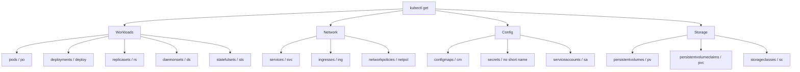
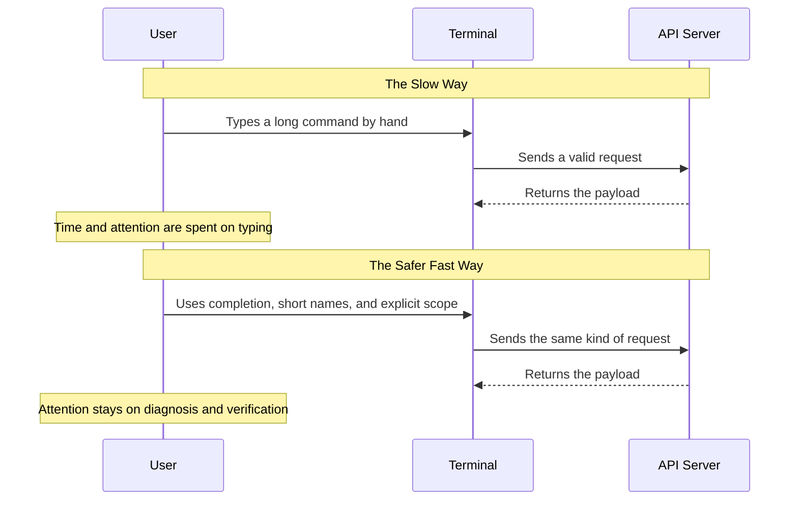

> **Complexity**: `[QUICK]` - Setup once, benefit every time you touch a cluster
>
> **Time to Complete**: 15-20 minutes
>
> **Prerequisites**: Module 0.1 with a working Kubernetes v1.35 or higher cluster and a functioning `kubectl` configuration

## Learning Outcomes

- **Implement** shell completion and kubectl command discovery so long resource names, pod names, namespaces, and subcommands can be selected accurately under time pressure.
- **Diagnose** context and namespace drift before making cluster changes, using prompt checks, explicit verification commands, and a repeatable pre-command routine.
- **Design** imperative YAML generation workflows that use client-side dry-run output as a safe starting point for exam manifests and production change review.
- **Evaluate** shell portability and terminal multiplexing tradeoffs across Bash, POSIX `sh`, Zsh, Fish, tmux, and prompt tooling for Kubernetes operations.

## Why This Module Matters

Hypothetical scenario: you are halfway through a CKA-style troubleshooting block when the prompt says to fix CoreDNS on `cluster-b`, but your terminal is still attached to `cluster-a` from the previous task. You type quickly, the command succeeds, and nothing in the current question improves because you changed the wrong control plane. The mistake is not a Kubernetes concept failure; it is a shell workflow failure. Shell mastery is the discipline of making the right action fast while making the wrong action harder to perform unnoticed.

The same pattern appears outside exams whenever an operator has multiple terminals, namespaces, and kubeconfig contexts open during an incident. Speed helps only when it is paired with orientation. A fast command in the wrong namespace is worse than a slow command in the right one, because the fast command creates confident damage. This module treats the shell as an operational interface: completion reduces typos, short resource names reduce friction, context checks reduce cross-cluster mistakes, and dry-run generation turns imperative commands into editable manifests.

You will not memorize every flag in Kubernetes v1.35, and you do not need to. You need a working loop for discovering valid commands, generating valid YAML, checking where you are, and verifying the result. The goal is not to create a clever dotfile collection; the goal is to build a boring, reproducible terminal routine that keeps working when you are tired, rushed, or connected to a cluster that matters.

```text
Before: kubectl get pods --namespace kube-system --output wide
After:  kubectl get po -n kube-system -o wide

Before: kubectl describe pod nginx-deployment-abc123
After:  kubectl describe po nginx<TAB>

Before: kubectl config use-context production-cluster
After:  kubectl config use-context production<TAB>
```

The race-car pit crew analogy is useful when you keep it grounded. A pit crew is fast because every tool has a stable location and every motion is rehearsed before the high-pressure moment. Your shell should work the same way. Completion is the labeled tool rack, command history is the practiced reach, explicit context verification is the safety callout, and generated YAML is the prepared spare part that you inspect before installing.

## Shell Execution Model and Portability

Before you add anything to a startup file, separate three ideas that often get blurred together: the shell you type into, the shell a script declares, and the shell a system service chooses when no declaration exists. Bash, Zsh, Fish, and POSIX `sh` overlap in daily use, but they are not interchangeable languages. A command copied from an interactive Bash prompt can fail in a cron job if the job runs under `/bin/sh`, and on many Ubuntu systems `/bin/sh` points to `dash`, a small POSIX-oriented shell rather than Bash.

That distinction matters because many convenience features used by Kubernetes operators are shell-specific. Process substitution, written as `<(command)`, is common in Bash and Zsh examples, but it is not a POSIX `sh` feature. Bash arrays, completion functions, and prompt hooks also belong to the interactive shell layer. Treat interactive shell setup as an operator convenience, and treat scripts as separate artifacts that must declare their interpreter with a shebang and avoid hidden interactive assumptions.

Pause and predict: if the line `source <(kubectl completion bash)` works at your prompt, what do you expect to happen if the same line is executed by `/bin/sh`? The important answer is not merely "it fails." The useful diagnosis is that `/bin/sh` parses the file before `kubectl` ever runs, sees syntax it does not support, and stops with a shell syntax error. That tells you to fix the interpreter boundary rather than chasing Kubernetes authentication, RBAC, or cluster connectivity.

```bash
# Install bash-completion if it is not already present.
sudo apt-get update
sudo apt-get install -y bash-completion
```

The next command is intentionally for an interactive Bash startup file. It asks `kubectl` to print Bash completion code and asks Bash to source that generated code when a new interactive shell starts. This is convenient for a lab workstation and for a disposable exam terminal, but it is not a pattern for portable production scripts. If you write automation, call `kubectl` directly and keep shell startup customization out of the script body.

```bash
# Enable kubectl completion for future interactive Bash shells.
echo 'source <(kubectl completion bash)' >> ~/.bashrc
source ~/.bashrc
```

You can also load the completion rules only for the current shell, which is useful when you are validating a temporary terminal or working in a restricted environment where you do not want to alter startup files. This version still depends on Bash process substitution, so it belongs at an interactive Bash prompt rather than inside a POSIX script. The benefit is immediate feedback: if completion starts working now, the generated completion script and local `kubectl` binary are both available.

```bash
# Load kubectl completion only in the current Bash shell.
source <(kubectl completion bash)
```

The mental model is simple: `kubectl` provides the knowledge of Kubernetes commands, resources, and flags, while your shell provides the keypress behavior that turns `<TAB>` into a lookup. When completion fails, diagnose both sides. Confirm that the shell loaded completion support, confirm that `kubectl completion bash` prints code, and confirm that the current user can reach a cluster when completion needs live resource names.

```bash
# Confirm that kubectl can generate completion code.
kubectl completion bash | head
```

Bash is a strong default for CKA practice because the exam environment is Linux-oriented and most examples assume Bash-style completion. Zsh and Fish are excellent interactive shells for personal workstations, but they have their own completion systems and startup files. A professional setup can use any of them, provided you can explain which layer owns completion, which layer owns prompt rendering, and which layer owns scripts that other people or CI systems will run.

```bash
# Confirm which shell is running your current interactive session.
printf '%s\n' "$SHELL"
printf '%s\n' "$0"
```

## Completion, Short Names, and Command Discovery

Completion is not just a typing shortcut; it is an accuracy tool. Kubernetes object names frequently include generated suffixes, and rushing a long pod name by hand creates avoidable `NotFound` errors. Completion lets the shell ask Kubernetes what names are valid in the current context and namespace, then inserts the exact match. That turns a fuzzy memory problem into a selection problem, which is much easier under exam pressure.

```bash
kubectl get <TAB><TAB>
```

When that expansion works, you should see a broad list of verbs, resources, or completions depending on cursor position. The exact display varies by shell and completion package, so do not memorize the screen shape. Instead, verify that repeated `<TAB>` presses reveal useful options and that partial resource names narrow the list. If nothing happens, return to the completion loading steps before blaming the cluster.

```bash
kubectl get pods -n kube<TAB>
```

Namespace completion is especially valuable because namespace spelling often differs by only a few characters in practice environments. A task may place the broken workload in `kube-system`, `app-prod`, or a purpose-built namespace with a long name. If completion fills the name, you avoid a silent search in the wrong scope. If completion does not fill the name, run an explicit namespace listing before assuming the workload is absent.

```bash
kubectl describe pod cal<TAB> -n kube-system
```

Resource short names are different from shell aliases. They are defined by the Kubernetes API discovery information and shown by `kubectl api-resources`, so they work anywhere `kubectl` works. `po` for pods, `svc` for services, and `deploy` for deployments are not local tricks; they are Kubernetes resource shortcuts. That is why they are safe to use in examples, scripts, and exam practice, while local shell aliases should be treated as optional interactive sugar.

| Full Name | Short | Example |
|-----------|-------|---------|
| pods | po | `kubectl get po` |
| deployments | deploy | `kubectl get deploy` |
| services | svc | `kubectl get svc` |
| namespaces | ns | `kubectl get ns` |
| nodes | no | `kubectl get no` |
| configmaps | cm | `kubectl get cm` |
| secrets | none | `kubectl get secrets` |
| persistentvolumes | pv | `kubectl get pv` |
| persistentvolumeclaims | pvc | `kubectl get pvc` |
| serviceaccounts | sa | `kubectl get sa` |
| replicasets | rs | `kubectl get rs` |
| daemonsets | ds | `kubectl get ds` |
| statefulsets | sts | `kubectl get sts` |
| ingresses | ing | `kubectl get ing` |
| networkpolicies | netpol | `kubectl get netpol` |
| storageclasses | sc | `kubectl get sc` |



The fastest way to keep this list honest is to ask the cluster. API resources can change when CustomResourceDefinitions are installed, and aggregated APIs may add kinds that are not part of your memory. `kubectl api-resources` shows names, short names, API groups, whether a resource is namespaced, and the kind. That output turns discovery into a habit rather than a lookup exercise.

```bash
kubectl api-resources
kubectl api-resources --namespaced=true
kubectl api-resources --namespaced=false
```

For interactive use, you can define functions that save typing without depending on a single-letter alias. Functions are easier to read in a shared startup file, and they can forward all arguments safely with `"$@"`. They still belong in your interactive shell setup, not in scripts that other machines will run without sourcing your dotfiles. In copy-paste teaching examples, keep using full `kubectl` so the command remains runnable for every learner.

```bash
# Optional interactive helpers for your own shell, not required by the course.
kgp() { kubectl get pods "$@"; }
kgpa() { kubectl get pods -A "$@"; }
kgs() { kubectl get svc "$@"; }
kgn() { kubectl get nodes "$@"; }
kgd() { kubectl get deploy "$@"; }
```

Which approach would you choose here and why: a local function that saves a few keystrokes, or a full `kubectl` command that any teammate can paste into a runbook? In a private exam terminal, a function can be useful if you have practiced it. In documentation, incident notes, and scripts, the full command is the better default because it carries its meaning and prerequisites with it.

```bash
# Full commands remain the portable form.
kubectl get po -A -o wide
kubectl get deploy -n default
kubectl describe po nginx -n default
```

Command history is the other half of command discovery. GNU Readline gives Bash users reverse search, beginning and end navigation, and word deletion without needing external tools. These shortcuts are not Kubernetes-specific, but they matter because many Kubernetes commands differ by a namespace, label selector, or output flag. Editing a correct previous command is faster and safer than rebuilding a similar command from memory.

```text
Ctrl+R      Reverse-search command history
Ctrl+A      Move to the beginning of the line
Ctrl+E      Move to the end of the line
Ctrl+W      Delete the previous word
!!          Re-run the previous command, often as part of sudo !!
```

## Context and Namespace Discipline

Context is the cluster identity in your kubeconfig, while namespace is the default scope for namespaced resources inside that context. They solve different problems. A context mistake sends the request to the wrong API server. A namespace mistake sends the request to the right API server but the wrong logical space. Both can look like "Kubernetes is broken" when the real issue is that your terminal is pointed at a different target than the task describes.

```bash
# List every configured context and show the current one.
kubectl config get-contexts
kubectl config current-context
```

Switching context should be the first active step for any exam question or production procedure that names a cluster. Do not begin by listing pods and inferring from the output; that trains you to trust accidental state. Read the task, switch to the named context, confirm the current context, and only then inspect workloads. This routine feels slow for the first few repetitions and then becomes faster than recovering from one wrong-cluster command.

```bash
# Switch to the context named by the task, then confirm it.
kubectl config use-context <context-name>
kubectl config current-context
```

Namespace discipline has two valid styles. You can use explicit `-n <namespace>` flags on each command, which makes every command self-documenting, or you can set the default namespace for the current context, which reduces repetition during a focused task. The danger of a default namespace is that it persists in kubeconfig state. If you set it, verify it, and reset it when you leave the task.

```bash
# Set the default namespace for the current context.
kubectl config set-context --current --namespace=kube-system

# Confirm the namespace attached to the current context.
kubectl config view --minify --output 'jsonpath={..namespace}'; printf '\n'

# Return to the default namespace when the focused task is done.
kubectl config set-context --current --namespace=default
```

Explicit namespace flags are better when you are writing notes, teaching, or running a sequence that might be copied into another terminal. They make the target visible on every line. Defaults are better when you are repeatedly inspecting many objects in one namespace and you have a clear cleanup step. The key is to choose intentionally rather than letting yesterday's kubeconfig setting choose for you.

```bash
# Self-documenting commands for shared notes and runbooks.
kubectl get po -n kube-system -o wide
kubectl describe deploy coredns -n kube-system
kubectl get events -n kube-system --sort-by=.lastTimestamp
```

Hypothetical scenario: an operator finishes debugging a staging namespace and then joins a production bridge call. Their prompt shows only a working directory, so every command looks the same as the previous terminal. A context-aware prompt would not prevent every mistake, but it would put the active context into the operator's field of view before each command. This is why prompt design is not decoration; it is a low-friction safety signal.

```bash
# A simple pre-flight function you can run before mutating commands.
kubectl_whereami() {
  printf 'context=%s\n' "$(kubectl config current-context)"
  printf 'namespace=%s\n' "$(kubectl config view --minify --output 'jsonpath={..namespace}')"
}
```

Before running this, what output do you expect after setting the namespace to `kube-system`? The function should print the active context and then `namespace=kube-system`. If the namespace line is empty, Kubernetes treats the default namespace as `default`, which is different from having a named namespace explicitly configured in kubeconfig.

```bash
kubectl_whereami
```

## Imperative YAML Generation and Safe Deletion

Kubernetes exams and real incident response both reward a generate-edit-validate loop. Hand-writing a full manifest from an empty file is slow and error-prone because indentation, API version, field placement, and object shape all have to be correct at the same time. Imperative `kubectl` commands can produce a valid starting object, and `--dry-run=client -o yaml` lets you capture that object without creating it. You then edit the result deliberately and validate it before applying.

```bash
# Optional interactive variable for a focused shell session.
export do='--dry-run=client -o yaml'
```

The variable is a convenience, not a requirement. It expands to two ordinary `kubectl` flags, so you should know the long form even if you use the short variable interactively. In shared documentation, prefer the long flags when clarity matters; in a personal timed drill, the variable is reasonable if you have practiced it and can recover when it is unset.

```bash
# Generate a Pod manifest without creating the Pod.
kubectl run nginx --image=nginx --dry-run=client -o yaml > pod.yaml
```

```bash
# The same idea using the optional interactive variable.
kubectl run nginx --image=nginx $do > pod.yaml
```

Deployments are a common place where generation saves time because the object has nested selectors, pod templates, and replica settings. The generated YAML is not always the final answer, but it gives you valid structure. You can add resource requests, labels, node selectors, tolerations, or probes in the right region instead of building the whole object from memory.

```bash
kubectl create deployment web --image=nginx --replicas=3 --dry-run=client -o yaml > deploy.yaml
```

Services are another strong use case because the imperative command can express the common shape quickly. After generation, inspect selectors carefully. A Service with the wrong selector is syntactically valid but operationally useless because it will have no matching endpoints. The shell can help you create the object, but you still have to reason about labels and relationships.

```bash
kubectl create service clusterip web --tcp=80:80 --dry-run=client -o yaml > svc.yaml
```

ConfigMaps and Secrets can also be generated, but be careful with example values. Do not put realistic credentials into practice files, command history, screenshots, or Git commits. Use safe placeholders and delete practice artifacts when the exercise is complete. The shell remembers more than people expect, so treat command history as part of your operational surface area.

```bash
kubectl create configmap app-config --from-literal=mode=practice --dry-run=client -o yaml > cm.yaml
kubectl create secret generic app-secret --from-literal=password=demo-password --dry-run=client -o yaml > secret.yaml
```

The validation step is where the workflow becomes reliable. Client-side dry-run catches many structural errors before a live create or update. It does not prove that the workload will behave correctly, but it proves that `kubectl` can parse the YAML and that the basic object schema is acceptable for the command path. After applying, you still verify the live object, events, and status.

```bash
kubectl apply -f pod.yaml --dry-run=client
kubectl apply -f deploy.yaml --dry-run=client
kubectl apply -f svc.yaml --dry-run=client
```

Force deletion belongs in a different mental category. The flags `--force --grace-period=0` tell Kubernetes to remove the API object without the usual graceful waiting behavior. That can be appropriate in a disposable exam lab when a Pod is stuck and the task requires moving forward, but it is dangerous for stateful workloads, finalizers, and production debugging. Always inspect the object and confirm context before using immediate deletion.

```bash
# Optional interactive variable for a focused lab session.
export now='--force --grace-period=0'
```

```bash
# Inspect first, then force delete only when the risk is acceptable.
kubectl get po stuck-pod -n default -o wide
kubectl describe po stuck-pod -n default
kubectl delete po stuck-pod -n default --force --grace-period=0
```

The fastest safe workflow is not "always force." It is "identify why normal deletion is not completing, decide whether the resource is disposable, and use the smallest action that solves the task." In production, a stuck finalizer may indicate an external controller or storage operation that needs attention. In an exam lab, the scoring object may simply need to disappear. The command is the same, but the operational judgment is not.

```bash
# Save the interactive conveniences for future Bash sessions.
echo "export do='--dry-run=client -o yaml'" >> ~/.bashrc
echo "export now='--force --grace-period=0'" >> ~/.bashrc
source ~/.bashrc
```

## Terminal Multiplexing and Prompt Awareness

Readline shortcuts help inside one command line, but incidents often require multiple live views: events in one pane, logs in another, a watch command in a third, and a careful manifest edit in a fourth. A terminal multiplexer such as tmux gives you persistent sessions, pane splitting, and recovery after a network drop. It does not make you a better Kubernetes diagnostician by itself, but it keeps the diagnostic workspace from falling apart when the connection or window layout changes.

```bash
# Start a named tmux session for Kubernetes work.
tmux new-session -s cka-practice
```

A useful tmux layout keeps passive observation separate from mutating commands. Put `kubectl get events --sort-by=.lastTimestamp -A --watch` or a namespace-scoped watch in a pane where you will not accidentally type destructive commands. Keep editing and applying in a different pane. This is the terminal equivalent of separating a dashboard from a control switch: both are useful, but they should not invite the same muscle memory.

```bash
# In one pane, observe cluster activity.
kubectl get events -A --sort-by=.lastTimestamp --watch
```

```bash
# In another pane, observe pods in the namespace you are actively fixing.
kubectl get po -n kube-system -o wide --watch
```

Prompt awareness is the lighter-weight version of the same idea. A prompt that shows the Kubernetes context and namespace gives you a constant orientation signal without requiring an extra command. Starship and similar prompt tools can render this consistently across shells, while hand-written `PS1` snippets are often Bash-specific. The tradeoff is dependency management: a portable prompt engine is another binary to install, while a simple Bash prompt is easier to inspect but harder to share across Zsh and Fish users.

```toml
# Example Starship Kubernetes prompt configuration.
[kubernetes]
disabled = false
format = '[$context \($namespace\)](bold blue) '
```

The complete Bash setup below keeps the original module's intent while avoiding a single-letter `kubectl` alias in runnable examples. It loads completion, defines readable optional helper functions, exports the dry-run and immediate-deletion variables, and leaves full `kubectl` commands as the canonical form for scripts and shared notes. Copy only what you have practiced; a startup file you do not understand becomes another source of failure.

```bash
# ============================================
# Kubernetes CKA Exam Shell Configuration
# ============================================

# kubectl completion for interactive Bash.
source <(kubectl completion bash)

# Optional interactive helper functions.
kgp() { kubectl get pods "$@"; }
kgpa() { kubectl get pods -A "$@"; }
kgs() { kubectl get svc "$@"; }
kgn() { kubectl get nodes "$@"; }
kgd() { kubectl get deploy "$@"; }
kgpv() { kubectl get pv "$@"; }
kgpvc() { kubectl get pvc "$@"; }
kdp() { kubectl describe pod "$@"; }
kds() { kubectl describe svc "$@"; }
kdn() { kubectl describe node "$@"; }
kdd() { kubectl describe deploy "$@"; }
kl() { kubectl logs "$@"; }
klf() { kubectl logs -f "$@"; }
ka() { kubectl apply -f "$@"; }
kdfile() { kubectl delete -f "$@"; }
kx() { kubectl config use-context "$@"; }
kns() { kubectl config set-context --current --namespace="$@"; }
krun() { kubectl run debug --image=busybox --rm -it --restart=Never -- "$@"; }

# Environment variables for focused interactive drills.
export do='--dry-run=client -o yaml'
export now='--force --grace-period=0'

# ============================================
```

After changing startup files, verify the behavior in a new shell or by sourcing the file once. Do not assume the file loaded successfully. A single quote mismatch in `.bashrc` can break later lines, and a missing completion package can make the setup only partially active. Verification should check the binary, the context, completion generation, and the variables you expect to use during drills.

```bash
source ~/.bashrc
command -v kubectl
kubectl config current-context
kubectl completion bash >/tmp/kubectl-completion-check
printf '%s\n' "$do"
printf '%s\n' "$now"
```

The speed comparison is still real even when you avoid single-letter aliases. Kubernetes-native short names, completion, history search, and dry-run variables remove most of the friction without hiding the command behind local magic. The point is not to type the fewest possible characters; the point is to type a command that is fast, accurate, and understandable when you reread your terminal history later.

```bash
# Baseline commands.
kubectl get pods --all-namespaces --output wide
kubectl describe pod <pod-name> --namespace default
kubectl config use-context production
```

```bash
# Optimized but still portable commands.
kubectl get po -A -o wide
kubectl describe po <pod-name> -n default
kubectl config use-context prod<TAB>
```

```bash
# YAML generation with the explicit flags.
kubectl run nginx --image=nginx --dry-run=client -o yaml > nginx.yaml
```



Finally, remember that `kubectl` itself is part of your shell mastery toolkit. `kubectl explain` gives field-level documentation from the API schema, and `--help` exposes command examples without leaving the terminal. During an exam, external browsing rules matter; during production incidents, documentation access may be slow or filtered. A strong terminal workflow uses local discovery first and reaches for browser documentation when local discovery is not enough.

```bash
kubectl explain pod.spec.containers
kubectl explain deployment.spec.strategy
```

```bash
kubectl create --help
kubectl run --help
kubectl expose --help
```

### Worked Example: From Confusion to a Stable Shell Loop

Consider a focused troubleshooting exercise where the prompt says a workload in `payments` cannot reach its Service. A weak shell workflow begins with whatever command happens to be in history, maybe a cluster-wide pod listing, followed by a guess about the namespace. A stronger workflow begins by anchoring the terminal: confirm the context, confirm or explicitly name the namespace, list the Service and Pods with short Kubernetes resource names, then compare selectors and labels. The commands are not impressive by themselves; the sequence is the skill.

The first useful move is to make the invisible target visible. If the question or ticket names a context, switch to it and confirm it. If it names a namespace, decide whether you will use `-n payments` on every command or set the namespace for the current context. In a teaching module, explicit `-n` flags are better because each command carries its target. In a timed terminal, setting the namespace can be fine if you verify it and reset it afterward.

Once the target is visible, use discovery commands that answer relationships rather than isolated facts. `kubectl get svc -n payments -o wide` tells you the Service selector shape, while `kubectl get po -n payments --show-labels` tells you whether any Pod labels can match that selector. If the labels do not match, restarting Pods is noise. The shell helped because completion and history made the commands quick, but the diagnostic value came from comparing two pieces of Kubernetes state.

This is where command history becomes more than convenience. After you type one correct namespace-scoped command, `Ctrl+R` and line editing let you reuse the namespace and output flags while changing only the resource or field you are inspecting. You avoid rebuilding similar commands from scratch, and you avoid accidentally dropping the namespace flag on the second or third command. A practiced shell user edits a known-good command shape rather than repeatedly composing new commands under pressure.

The same loop applies when you are creating a fix. Generate a manifest only after you know what relationship must change. If the Service selector is wrong, you might patch the Service, edit the manifest, or regenerate a clean object depending on the task. If a Deployment template label is wrong, you need to consider ReplicaSet behavior and whether changing the template will create new Pods. Shell speed is valuable because it gives you more time for these Kubernetes decisions, not because it replaces them.

### Worked Example: Turning Dry-Run Output into a Reviewed Manifest

Dry-run generation is sometimes misunderstood as a shortcut for people who do not know YAML. A better interpretation is that dry-run generation gives you a schema-shaped draft that you still have to review. The generated file usually contains correct `apiVersion`, `kind`, `metadata`, and the basic `spec` scaffold. It may not contain resource limits, probes, labels, affinity, tolerations, or the exact selector relationship you need. Your job is to use the generated structure as a starting point, then make the smallest purposeful edit.

In an exam setting, the safest rhythm is generate, open, edit, validate, apply, verify. Skipping the open-and-edit step creates objects before they satisfy the task. Skipping validation makes YAML indentation mistakes expensive. Skipping verification assumes that a successful API response means the workload is healthy, which is rarely true for scheduling, networking, or configuration tasks. The shell can compress the mechanical pieces of this loop, but it should not remove the review gates.

For example, generating a Deployment with three replicas gives you a useful object, but it does not prove those Pods will become Ready. After applying, you still inspect `kubectl get deploy`, `kubectl get rs`, `kubectl get po`, and events in the target namespace. If the Pods are Pending, the YAML generation step was not the problem; scheduling constraints, node resources, taints, or image pull behavior may be the issue. A strong shell loop keeps you moving from object creation to live-state diagnosis without changing tools.

There is also a version-awareness benefit. Kubernetes v1.35 clients and servers expose current API behavior, and `kubectl` generated output reflects the command and version you are actually using. Copying a stale manifest from memory can smuggle in deprecated fields or old assumptions. Dry-run output is not a substitute for documentation, but it is anchored in the toolchain in front of you. That makes it a useful first draft when time is constrained and correctness matters.

### Recovery Habits When the Shell Is Not Yours

The CKA environment, a jump host, and a teammate's workstation may not have your dotfiles. That should not be frightening if you have practiced the underlying commands. The recovery sequence is short: identify the shell, load completion if Bash support is present, export optional variables if you want them, and continue with full `kubectl` commands. If a helper function is missing, your workflow slows down slightly but does not collapse. That is the difference between an optimization and a dependency.

When a convenience fails, resist the urge to debug everything at once. If completion fails, check completion generation and shell loading. If a command cannot find a resource, check context and namespace before assuming the object is gone. If dry-run output differs from what you expected, check the exact `kubectl` subcommand and flags you used. Each failure class has a nearby diagnostic, and the shell stays calm when you handle one layer at a time.

This layered thinking is especially important for POSIX boundaries. A line that belongs in `.bashrc` is not automatically safe in a script, and a script that begins with `#!/bin/sh` has promised to avoid Bash-only syntax. Many operational failures that look mysterious are just broken promises between file content and interpreter. If you need Bash, say so with `#!/usr/bin/env bash` at the top of a script and then test it as a script, not only by pasting lines into your interactive prompt.

Prompt tools deserve the same discipline. A prompt that shows Kubernetes context is useful only if it is accurate, fast, and unobtrusive. If it runs a slow command before every prompt, it can make the terminal frustrating and encourage people to disable it. If it hides errors, it can create false confidence. Keep prompt configuration simple, test it in a new shell, and verify that you still know the explicit `kubectl config` commands when the prompt is unavailable.

### Building Muscle Memory Without Hiding the Mechanics

Practice should make the reliable path feel natural. That means drilling command sequences rather than isolated commands. A useful drill is not "type the shortest possible pod listing"; it is "switch context, confirm namespace, list pods with wide output, describe one pod, read events, and decide the next diagnostic." The sequence trains attention. If you practice only speed, you may become fast at skipping the checks that protect your score and your cluster.

Another useful drill is to alternate between explicit flags and configured defaults. Run a few commands with `-n kube-system`, then set the current namespace and run equivalent commands without the flag, then reset to default. This teaches you what state lives in the command line and what state lives in kubeconfig. People who never practice both styles often misread their own terminal history later, because they cannot tell whether a command carried its namespace explicitly or inherited it silently.

You should also practice failure on purpose. Unset the dry-run variable and recover by typing the long flags. Open a new shell that has no completion loaded and recover by sourcing completion. Set the namespace to a non-default value, notice it, and reset it. These small failures are cheap in a lab and expensive during a timed task. Practicing recovery turns a missing convenience into a small detour rather than a panic.

The final muscle-memory rule is to narrate the target before mutating it. Say, even silently, "context, namespace, resource, action" before pressing Enter on an apply, delete, scale, cordon, or drain command. That sounds slow, but it costs less than a second after practice. More importantly, it forces the command to pass through the part of your brain that checks intent. Shell mastery is not only about hands; it is about building a repeatable pause at the exact moment mistakes become real.

### What to Preserve in Team Environments

Teams should standardize the parts of shell mastery that improve shared reliability and leave personal ergonomics personal. Everyone can agree on full `kubectl` commands in runbooks, explicit namespaces in incident notes, dry-run validation before applying generated files, and context confirmation before mutating operations. Individual engineers can still choose Bash, Zsh, Fish, tmux layouts, prompt themes, and helper functions. The boundary keeps collaboration readable while allowing people to work efficiently.

This boundary also makes code review easier. A reviewer can reason about `kubectl apply -f deploy.yaml --dry-run=client` without knowing the author's aliases. They can see `-n payments` in the command and connect it to the incident scope. They can reproduce `kubectl api-resources` on the target cluster and confirm whether a short name exists. Shared commands should minimize hidden assumptions because hidden assumptions are exactly what reviewers are trying to find.

For production runbooks, include verification commands next to action commands. If the runbook says to apply a manifest, it should also say how to verify rollout, events, endpoints, or logs. If it says to delete a resource, it should name the namespace and describe how to confirm the resource is gone. A shell-optimized operator can move through those checks quickly, but the runbook should remain understandable for the next engineer who has none of your local setup.

Finally, document the recovery path for your team's preferred prompt or multiplexer. If Starship is the standard prompt, explain how to confirm the raw context with `kubectl config current-context`. If tmux is standard during incidents, explain how sessions are named and how panes are arranged. The goal is not to force everyone into identical terminals. The goal is to make the operational safety signals durable when the primary operator changes, the laptop changes, or the incident moves to a new bridge.

## Patterns & Anti-Patterns

The strongest shell patterns are boring because they survive stress. They make target selection visible, keep generated files inspectable, and avoid relying on hidden local assumptions. Anti-patterns usually start as small conveniences that grow beyond their safe boundary: a prompt that hides context, an alias copied into a script, or a default namespace left behind after a task.

| Pattern | When to Use It | Why It Works |
|---------|----------------|--------------|
| Confirm context before mutation | Before `apply`, `delete`, `scale`, `cordon`, or `drain` | It catches wrong-cluster state before the command reaches the API server. |
| Use Kubernetes short names | In interactive commands and scripts where `kubectl` supports them | Short names come from API discovery, not local shell state. |
| Generate, edit, validate | When creating Pods, Deployments, Services, ConfigMaps, or Secrets | It starts from valid object structure and makes edits easier to review. |
| Keep observation panes separate | During multi-pane tmux incident work | It reduces the chance of typing a mutating command into a watch pane. |

| Anti-Pattern | What Goes Wrong | Better Alternative |
|--------------|-----------------|--------------------|
| Relying on local aliases in shared scripts | The script fails or behaves differently on another machine | Use full `kubectl` commands in scripts and runbooks. |
| Trusting the previous namespace | Objects look missing or changes land in the wrong scope | Use explicit `-n` flags or verify the current namespace. |
| Force deleting as a first response | Stateful cleanup, finalizers, or controller behavior may be bypassed | Inspect, decide whether the object is disposable, then delete. |
| Customizing a prompt without testing failure modes | A broken prompt can hide useful errors or slow shell startup | Keep the prompt simple and verify it in new shells. |

## When You'd Use This vs Alternatives

Use interactive shell customization when the operator and the terminal are the same stable environment. Completion, helper functions, prompt context, and dry-run variables are excellent for personal practice and disposable exam shells because they reduce repetition while you keep control of the session. Do not make those conveniences prerequisites for a runbook, CI job, or production automation script unless the script explicitly installs and verifies them before use.

| Situation | Prefer | Reason |
|-----------|--------|--------|
| Personal CKA practice terminal | Completion, short names, dry-run variables, optional helper functions | You control the shell and benefit from repeated speed gains. |
| Shared incident runbook | Full `kubectl` commands with explicit namespaces | Every reader can paste and audit the command without knowing your dotfiles. |
| CI or scheduled automation | Script with a shebang and full commands | Automation must not depend on interactive shell startup behavior. |
| Multi-cluster incident bridge | tmux panes plus prompt context | Persistent layout and visible context reduce orientation mistakes. |

Choose explicit commands when the cost of ambiguity is high. Choose shortcuts when the environment is controlled and the shortcut has been practiced enough that it reduces errors rather than creating a new thing to remember. If you are unsure which side you are on, write the full command first, then optimize only after the workflow is correct.

A useful personal rule is to optimize the action you repeat, not the fact you still need to think about. Listing pods, generating starter YAML, and confirming context are repeatable mechanics, so shell support belongs there. Deciding whether a deletion is safe, whether a selector matches labels, or whether a namespace default should persist is judgment, so do not hide those decisions behind a clever wrapper. The best shell setup leaves the important Kubernetes relationship visible while removing dull keystroke overhead around it. That balance is what makes the workflow durable in both exams and real operations under pressure.

## Did You Know?

- POSIX.1-2024, also called The Open Group Base Specifications Issue 8, was published in June 2024 and is the portability baseline behind many `/bin/sh` expectations.
- Bash 5.3 documentation is available from the GNU project, but many managed machines still ship older shells, so scripts should declare their interpreter instead of assuming your workstation version.
- macOS Catalina 10.15 moved new interactive users toward Zsh in 2019, which is why cross-platform shell instructions should name Bash, Zsh, or Fish explicitly.
- `kubectl api-resources` reports short names, API groups, namespaced scope, and kinds from discovery, making it more trustworthy than a memorized cheat sheet for clusters with CRDs.

## Common Mistakes

| Mistake | Why It Happens | How to Fix It |
|---------|----------------|---------------|
| Starting a task without checking context | The previous question or terminal pane left kubeconfig pointed at a different cluster | Run `kubectl config use-context <name>` and confirm with `kubectl config current-context` before mutating commands. |
| Searching only the default namespace | Many examples use `default`, so operators forget that system and app workloads often live elsewhere | Use `-n <namespace>` when the task names one, and use `-A` only for discovery across namespaces. |
| Treating shell aliases as portable commands | Aliases are interactive shell features and are not guaranteed in scripts, CI, or another user's terminal | Write full `kubectl` in shared examples and reserve helper functions for your own shell. |
| Hand-writing manifests from a blank file | The author tries to remember nested YAML fields under time pressure | Generate a client-side dry-run manifest, edit the specific fields, then validate before applying. |
| Force deleting before inspecting | The operator wants the object gone and skips understanding finalizers, storage, or graceful shutdown | Describe the object first and use immediate deletion only when the resource is disposable or the lab explicitly requires it. |
| Leaving a namespace default behind | `kubectl config set-context --current --namespace=...` persists after the task | Reset to `default` or prefer explicit `-n` flags in mixed workflows. |
| Opening many terminals with identical prompts | Every pane looks safe, so context drift becomes invisible | Show context and namespace in the prompt or run a pre-flight function before risky commands. |

## Quiz

<details><summary>Question 1: You need to implement shell completion and kubectl command discovery in a fresh Bash terminal, but `<TAB>` does nothing after `kubectl get po`. What do you check first, and why?</summary>

Check whether Bash completion is installed and whether the current shell loaded the `kubectl completion bash` output. The failure is in the shell interaction layer until proven otherwise, because the cluster can be healthy while the shell has no completion rules. Run `kubectl completion bash | head` to confirm `kubectl` can generate the script, then source it in Bash or add it to `.bashrc`. Only after completion rules load should you investigate live resource name completion and cluster access.

</details>

<details><summary>Question 2: A task names `cluster-b` and namespace `payments`, but `kubectl get po -n payments` shows healthy pods and the reported outage is missing. Diagnose the context and namespace drift risk.</summary>

The first suspicion is that the terminal is still using the wrong context from a previous task. A namespace flag can be correct while the API server target is wrong, so the command may be listing `payments` in `cluster-a`. Run `kubectl config current-context`, switch with `kubectl config use-context cluster-b`, and confirm again before inspecting pods. This protects both the current score and any earlier work from accidental cross-cluster changes.

</details>

<details><summary>Question 3: You must design imperative YAML generation for a Deployment that needs later resource limits and a node selector. What workflow gives you speed without sacrificing review?</summary>

Generate the base object with `kubectl create deployment web --image=nginx --dry-run=client -o yaml > deploy.yaml`, then edit the manifest and validate it with `kubectl apply -f deploy.yaml --dry-run=client`. The imperative command gives you correct structure for the Deployment and Pod template, while the file edit gives you room to add fields deliberately. Applying only after validation prevents a half-remembered YAML shape from becoming a live object. The workflow is faster than starting from an empty file and safer than creating the Deployment before required edits are present.

</details>

<details><summary>Question 4: A Pod is stuck in `Terminating` during a disposable lab, and normal deletion does not complete. How do you decide whether to use immediate deletion?</summary>

Inspect the Pod first with `kubectl get` and `kubectl describe` in the correct namespace, then decide whether the object is safe to remove without graceful shutdown. In a disposable exam lab, immediate deletion can be appropriate when the task is blocked and no durable state matters. In production, the same flags can hide finalizer, storage, or node problems that deserve diagnosis. The command is powerful, so the decision must be based on scope, context, and resource risk rather than impatience.

</details>

<details><summary>Question 5: A teammate copies your interactive helper function into a CI script and the job fails before reaching Kubernetes. How do you evaluate the shell portability problem?</summary>

First identify which interpreter the CI script actually uses. If the script runs under `/bin/sh`, Bash-specific constructs such as process substitution, Bash functions written with nonportable syntax, or completion setup can fail during parsing. CI scripts should declare an interpreter with a shebang and use full `kubectl` commands rather than relying on interactive startup files. The fix is to separate operator conveniences from automation logic, then test the script in the same shell CI will use.

</details>

<details><summary>Question 6: During an incident, you have logs, events, and a manifest edit open across several windows. How do terminal multiplexing and prompt awareness reduce operational risk?</summary>

tmux keeps related views in one persistent session, so a network drop or window shuffle does not destroy the diagnostic workspace. Separating watch panes from command panes also reduces the chance of typing a mutating command into an observation stream. Prompt context adds a constant reminder of the active cluster and namespace, which helps catch drift before the command is submitted. Neither tool replaces Kubernetes reasoning, but both reduce the cognitive load around it.

</details>

<details><summary>Question 7: You run `kubectl get po -A -o wide` and find the broken pod, then immediately edit a manifest in the current namespace. What mistake might still be present?</summary>

The `-A` discovery command found the object across all namespaces, but it did not change your default namespace. If the broken pod is in `payments` and your context default is still `default`, a later create or apply may land in the wrong namespace unless the manifest or command specifies one. Record the namespace from discovery, then use explicit `-n payments` flags or set and verify the current namespace. Discovery scope and mutation scope must be connected deliberately.

</details>

## Hands-On Exercise

**Task**: Configure a shell workflow that supports completion, explicit context checks, YAML generation, and safe verification without relying on a single-letter `kubectl` alias. Use a disposable practice cluster or lab terminal, and keep every command readable enough that you could paste it into a runbook later.

**Setup**:

```bash
sudo apt-get update
sudo apt-get install -y bash-completion
source <(kubectl completion bash)
export do='--dry-run=client -o yaml'
export now='--force --grace-period=0'
```

### Task 1: Verify completion and discovery

Run a completion smoke test, list API resources, and confirm that short names are available from discovery rather than from local shell configuration. Use the output to identify the short names for Pods, Deployments, Services, ConfigMaps, and PersistentVolumeClaims.

```bash
kubectl completion bash >/tmp/kubectl-completion-check
kubectl api-resources | head
kubectl api-resources | grep -E 'pods|deployments|services|configmaps|persistentvolumeclaims'
```

<details><summary>Solution</summary>

You should see completion script content written successfully to `/tmp/kubectl-completion-check`, and `kubectl api-resources` should show rows for the built-in resources. The short names should include `po`, `deploy`, `svc`, `cm`, and `pvc` in a standard cluster. If a row is missing, confirm that your cluster is reachable and that `kubectl` is configured for the expected context.

</details>

### Task 2: Build a context and namespace pre-flight

Create and run a small function that prints the current context and namespace, then switch to a known namespace and verify the output. Reset the namespace afterward so you do not carry hidden state into the next module.

```bash
kubectl_whereami() {
  printf 'context=%s\n' "$(kubectl config current-context)"
  printf 'namespace=%s\n' "$(kubectl config view --minify --output 'jsonpath={..namespace}')"
}

kubectl config set-context --current --namespace=kube-system
kubectl_whereami
kubectl config set-context --current --namespace=default
```

<details><summary>Solution</summary>

The function should print your active context and then show `namespace=kube-system` after the namespace change. After the reset, it should show `namespace=default` or an empty namespace value that Kubernetes treats as default, depending on your kubeconfig. The important habit is not the exact formatting; it is verifying target state before commands that create, update, or delete resources.

</details>

### Task 3: Generate and validate YAML

Generate a Pod, Deployment, Service, ConfigMap, and Secret using client-side dry-run output. Validate the files without creating live resources, then inspect at least one file to identify where you would add labels, resource limits, or selectors.

```bash
kubectl run nginx --image=nginx $do > pod.yaml
kubectl create deployment web --image=nginx --replicas=3 $do > deploy.yaml
kubectl create service clusterip web --tcp=80:80 $do > svc.yaml
kubectl create configmap app-config --from-literal=mode=practice $do > cm.yaml
kubectl create secret generic app-secret --from-literal=password=demo-password $do > secret.yaml
kubectl apply -f pod.yaml --dry-run=client
kubectl apply -f deploy.yaml --dry-run=client
kubectl apply -f svc.yaml --dry-run=client
```

<details><summary>Solution</summary>

Each generation command should produce a YAML file and each validation command should report that the object is valid for client-side dry-run. If validation fails, read the error rather than regenerating blindly; the message usually points to indentation, unsupported fields, or malformed YAML. For the Deployment, inspect `spec.template.spec.containers` because that is where resource requests, limits, ports, and environment variables usually belong.

</details>

### Task 4: Practice safe observation before deletion

Use a harmless Pod name from your lab or create a disposable Pod if your environment allows it. Inspect it before deletion, then delete it normally. Only practice immediate deletion on disposable resources, and write down why force deletion would or would not be acceptable in the situation.

```bash
kubectl run delete-practice --image=nginx --restart=Never
kubectl get po delete-practice -o wide
kubectl describe po delete-practice
kubectl delete po delete-practice
```

<details><summary>Solution</summary>

The safe path is normal deletion after verifying that the Pod is the one you created in the expected namespace. If it becomes stuck in a disposable lab, immediate deletion could be practiced with `kubectl delete po delete-practice $now`, but that should not be your first reflex. The learning objective is the decision process: context, namespace, resource identity, and state risk before the deletion flags.

</details>

### Task 5: Run a timed first-two-minutes exam routine

Start a timer and perform the terminal setup you would use at the beginning of an exam environment. Load completion, export the two optional variables, confirm context, list contexts, and run one harmless read-only command with a short Kubernetes resource name.

```bash
source <(kubectl completion bash)
export do='--dry-run=client -o yaml'
export now='--force --grace-period=0'
kubectl config current-context
kubectl config get-contexts
kubectl get no
```

<details><summary>Solution</summary>

The target is not a magic time; it is a smooth sequence with no guessing. You should finish with completion loaded, variables visible through `printf '%s\n' "$do"` and `printf '%s\n' "$now"`, a known current context, and a successful read-only node listing. If any step fails, fix the environment before beginning scored or production-impacting work.

</details>

### Task 6: Clean up practice files

Remove generated YAML files only after you have validated them and learned from their structure. Cleanup is part of shell mastery because it keeps future directory listings and accidental `kubectl apply -f .` commands from including stale practice artifacts.

```bash
ls -la *.yaml
rm -f pod.yaml deploy.yaml svc.yaml cm.yaml secret.yaml
```

<details><summary>Solution</summary>

After cleanup, `ls *.yaml` should either show no files or only files unrelated to this exercise that you intentionally kept. If your shell reports "No such file or directory," that is acceptable after removal. The important check is that practice manifests do not remain in a working directory where a later bulk apply could pick them up.

</details>

**Success Criteria**:

- [ ] `kubectl completion bash` produces completion code and your interactive Bash shell can use completion.
- [ ] You can explain the difference between Kubernetes short names and local shell aliases.
- [ ] You confirmed the current context and namespace before any mutating command in the exercise.
- [ ] You generated at least three YAML manifests with client-side dry-run output and validated them before applying.
- [ ] You used full `kubectl` commands in shared or runnable examples rather than relying on local aliases.
- [ ] You cleaned up generated practice files and reset any namespace default you changed.

## Sources

- https://kubernetes.io/docs/reference/kubectl/generated/kubectl_completion/
- https://kubernetes.io/docs/reference/kubectl/quick-reference/
- https://kubernetes.io/docs/reference/kubectl/generated/kubectl_api-resources/
- https://kubernetes.io/docs/reference/kubectl/generated/kubectl_config/kubectl_config_use-context/
- https://kubernetes.io/docs/reference/kubectl/generated/kubectl_config/kubectl_config_set-context/
- https://kubernetes.io/docs/reference/kubectl/generated/kubectl_explain/
- https://kubernetes.io/docs/reference/kubectl/generated/kubectl_run/
- https://kubernetes.io/docs/reference/kubectl/generated/kubectl_create/kubectl_create_deployment/
- https://kubernetes.io/docs/reference/kubectl/generated/kubectl_delete/
- https://pubs.opengroup.org/onlinepubs/9799919799/
- https://www.gnu.org/software/bash/manual/bash.html
- https://github.com/tmux/tmux/wiki
- https://starship.rs/config/#kubernetes

## Next Module

[Module 0.3: Vim for YAML](../module-0.3-vim-yaml/) - Deep-dive into Vim configurations specifically tuned for editing and debugging YAML manifests under time pressure.
