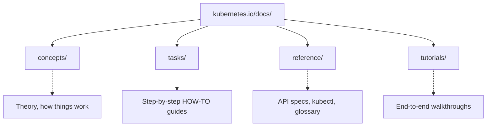
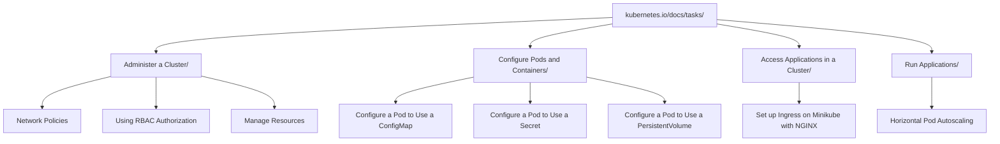
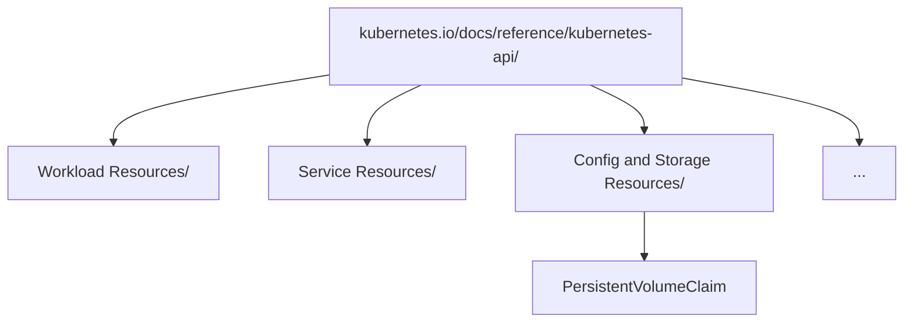

> **Complexity**: `[QUICK]` - Know where things are, find them fast
>
> **Time to Complete**: 20-30 minutes
>
> **Prerequisites**: None

## What You'll Be Able to Do

After completing this module, you will be able to:

- **Diagnose** documentation drift by comparing requested API versions against current Kubernetes 1.35 documentation, supported release windows, and versioned documentation subdomains.
- **Implement** cluster resources by navigating the kubernetes.io Tasks section quickly enough to locate and adapt official YAML examples under exam pressure.
- **Evaluate** the fastest path to resource definitions by choosing between `kubectl explain`, the web API reference, task pages, and command references.
- **Compare** Concepts, Tasks, Tutorials, and Reference sections so you spend study and exam time in the section that matches the job you are doing.
- **Design** an efficient open-book exam strategy that uses allowed documentation domains without depending on broad external search habits.

## Why This Module Matters

Hypothetical scenario: you are working through a timed CKA practice environment and a task asks you to create a NetworkPolicy, mount a PersistentVolumeClaim, and fix an Ingress that uses an old API version. You remember the rough shape of all three resources, but rough memory is not enough when a single misplaced field causes `kubectl apply` to reject the file. The practical skill is not memorizing every Kubernetes object. The practical skill is knowing exactly where the authoritative documentation keeps examples, schema details, version notes, and command references, then moving between those places without losing your place.

The exam environment is open book, but it is not open ended. You can use official Kubernetes documentation, the Kubernetes blog, Helm documentation, and the Kubernetes GitHub organization, yet the browser is intentionally limited and the clock keeps moving while you search. A learner who types broad phrases into search and opens the first result will often land on a Concepts page when they need a Task page, or on a blog post when they need the current API reference. A learner who knows the site architecture can start from the problem type, choose the correct section, and copy a nearby official example before using `kubectl explain` to fill in field-level details.

This module teaches that navigation pattern as a technical workflow rather than as trivia about a website. You will map the official documentation structure, practice choosing the right source for a specific job, use versioned documentation to diagnose drift, and rehearse timed lookups that resemble real administration work. The payoff is immediate: when the next module starts discussing exam strategy, you will already have the documentation muscle memory needed to execute that strategy instead of fighting the browser.

## Part 1: The Kubernetes Documentation Ecosystem

Kubernetes is described by its own project documentation as a portable, extensible, open source platform for managing containerized workloads and services, with declarative configuration and automation at the center of the model. That definition matters when you navigate the docs because the website is organized around the same idea. Some pages explain the platform model, some pages show how to declare objects, some pages document automation commands, and some pages record project news. Treating all of those pages as equal search results is like treating a textbook, a recipe card, and a dictionary as interchangeable because they all contain words.

Google open-sourced Kubernetes in 2014, and the project has grown into a large vendor-neutral ecosystem under the Cloud Native Computing Foundation. The abbreviation K8s is a numeronym: the 8 represents the letters between K and s in "Kubernetes". Those details are useful context, but your immediate exam concern is more concrete. The canonical technical site is `kubernetes.io`, and the documentation source itself is public in the `github.com/kubernetes/website` repository, which means the rendered website is the product of an open documentation workflow rather than a random collection of articles.

The top-level navigation on `kubernetes.io` separates Documentation, Kubernetes Blog, Training, Careers, Partners, and Community. That separation is deliberate. Documentation is where you go for current concepts, tasks, tutorials, references, and API material. The blog is valuable for release announcements and feature context, but it is not the fastest source for routine YAML. Training and certification pages point to learning programs, while Community points to Slack, forums, meetups, and contributor entry points. In an exam or outage-like exercise, you should know which door you are walking through before you start clicking.

The site is also multilingual, with official documentation available in many languages, including Bengali, Chinese, French, German, Hindi, Indonesian, Italian, Japanese, Korean, Polish, Portuguese, Russian, Spanish, Ukrainian, and Vietnamese. That breadth is a strength of the project, but it introduces a small operational caution. If your browser remembers a translated page or if a search result sends you to localized content, make sure the page still corresponds to the Kubernetes version and object you need. The rendered examples should remain familiar, yet the fastest path during a timed English-language exam is usually the English docs because the exam task wording and most command output will match that terminology.

Pause and predict: if a task asks you to create a Pod that reads a ConfigMap as environment variables, which part of the website should contain the first working YAML example, and which part should you use only after that example is not detailed enough? The answer should be Tasks first, then Reference or `kubectl explain` for specific fields. Making that prediction before you click is the habit this module is building.

## Part 2: Documentation Architecture

The official documentation is large, but it is not shapeless. Its main learning and lookup areas are Getting Started, Concepts, Tasks, Tutorials, Reference, and Contribute, while the page content types you will see most often are Concept, Task, Tutorial, and Reference. The names are not decorative. A Concept page explains how a feature fits into Kubernetes, a Task page shows how to perform an operation, a Tutorial walks through a longer scenario, and a Reference page gives exact fields, flags, generated API shapes, or glossary entries. Once you learn that distinction, search results stop feeling like a pile and start feeling like a set of tools.



The library analogy is still the right mental model, provided you use it precisely. Concepts are the shelves that explain how Kubernetes thinks about workloads, networking, storage, configuration, security, scheduling, and extension points. Tasks are the recipe cards that show what to type or apply. Reference is the dictionary and legal code: it tells you exactly which fields and flags exist, but it rarely tells you the shortest path to a practical outcome. Tutorials are longer guided exercises, useful for learning but usually too slow for a single exam objective.

| Section | Use For | Example |
|---------|---------|---------|
| **Tasks** | How to DO something | "Configure a Pod to Use a ConfigMap" |
| **Reference** | YAML fields, kubectl flags | "kubectl Cheat Sheet" |
| **Concepts** | Understanding (rarely during exam) | "What is a Service?" |

Tasks should be your primary destination when the problem statement uses action verbs such as create, configure, expose, use, mount, autoscale, or manage. For example, "configure a Pod to use a ConfigMap" is almost certainly a Task lookup, not a Concepts lookup, because the requested output is a manifest or command. A Concepts page about ConfigMaps will help you reason about when they are appropriate, but it will usually take longer to find the copyable manifest shape. In a timed setting, theory supports implementation; it should not block it.

Reference becomes the right destination when the question is about exact structure. If you already have the skeleton of a Pod and need to know whether `resources` sits under the container or the Pod spec, the API reference and `kubectl explain` are more direct than another how-to page. If you need the exact `kubectl` flag for a command, the command reference or cheat sheet is the correct source. The key is to ask, "Do I need an example workflow, a field definition, or a command flag?" before you reach for search.

Tutorials are valuable during study because they connect several features into an end-to-end activity. During the exam, however, a Tutorial can be a trap if it hides the one small detail you need inside a much larger narrative. Use Tutorials when a task resembles a multi-step walkthrough and you have time to scan. Otherwise, prefer Tasks for operational examples and Reference for exact definitions. This distinction is one of the simplest ways to avoid wasting minutes reading accurate but mismatched material.

Exercise scenario: you have a partial Deployment manifest and must add an `initContainer` plus a ConfigMap volume. Your first click should not be a broad search for "Kubernetes init container volume config map tutorial" because that query invites a long walkthrough. A better route is to find the Task page for init containers or ConfigMaps, copy the closest snippet, and then use `kubectl explain deployment.spec.template.spec.initContainers` or `kubectl explain pod.spec.volumes.configMap` to confirm where the fields belong.

## Part 3: Versioning and Release Lifecycles

Kubernetes moves quickly enough that documentation drift is a real operational risk. As of this module's Kubernetes 1.35 target, the current documentation points at v1.35 behavior, while supported patch releases follow the project's version skew and support policy. The project normally patch-supports the three most recent minor versions, which means a team running much older clusters should not assume current examples map cleanly to its control plane. The problem is not that official docs are unreliable; the problem is that they are official for the version you are reading.

The website keeps documentation for several recent versions, and older supported documentation is available through versioned subdomains such as `v1-34.docs.kubernetes.io`. That pattern is important during real work because managed clusters, lab clusters, and production clusters do not always move in lockstep with the newest docs. If the cluster says it is running v1.33 and the page header says v1.35, you should pause before copying a manifest that uses newer fields or newer default behavior. In an exam targeting current Kubernetes, read the current docs unless the task explicitly gives an older cluster version.

API versions are the most visible place where drift becomes painful. Older Ingress examples used `extensions/v1beta1`; current Kubernetes uses `networking.k8s.io/v1`. An outdated blog post might still rank well in search, but `kubectl apply` will reject that manifest against a modern cluster. The same pattern appears with beta resources, removed fields, and feature gates that changed over time. Your habit should be to check the `apiVersion` in any copied example, compare it with the cluster's available API resources, and prefer current official task pages over unsourced snippets.

You can diagnose version fit from both the web and the cluster. On the web, use the page version selector or versioned documentation subdomain when you know you need a specific minor release. In the terminal, use `kubectl version`, `kubectl api-resources`, and `kubectl explain` to see what the cluster actually exposes. These tools complement each other: the website explains intent and examples, while the cluster schema tells you what this API server will accept right now.

Before running this, what output do you expect if the cluster no longer serves an old API version? A dry run against an obsolete Ingress manifest should fail before it creates anything, and `kubectl api-resources | grep -i ingress` should show the served group and version. That prediction matters because it turns a confusing apply error into a documentation drift diagnosis rather than a random YAML debugging session.

## Part 4: Search Strategies and Mechanics

The site search endpoint is `kubernetes.io/search/`, and the search box can be reached from the documentation interface. Search is useful, but it rewards precise keywords and punishes vague intent. "Network policy" may return Concepts, Tasks, and blog content, while "networkpolicy ingress example" points much closer to an operational snippet. The search results themselves are not the answer; they are a routing table. Read the section label, choose Tasks when you need a how-to, choose Reference when you need a field or flag, and avoid clicking a blog result unless you deliberately want release context.

Most exam answers are physically located in the Tasks hierarchy because the exam usually asks you to operate the cluster. The Tasks area includes install tooling, administer a cluster, configure pods and containers, monitor and debug applications, manage objects, use secrets, and run applications. That structure mirrors the kind of work an administrator performs. Once you know that NetworkPolicy belongs near administering or networking tasks, ConfigMap and Secret examples belong near configuring pods, and HPA belongs near running applications, native search becomes a backup instead of your only navigation tool.



The fastest workflow is usually a two-step lookup. First, find a Task page that gives you a complete working example close to the requested outcome. Second, use `kubectl explain` to adjust fields that the example does not cover. This prevents two common failures: trying to write the whole manifest from memory, and trying to read the entire API reference before you have a skeleton. A skeleton from Tasks plus field validation from Reference is a practical compromise between speed and correctness.

```bash
# See available fields for a resource
kubectl explain pod.spec.containers

# Go deeper
kubectl explain pod.spec.containers.resources
kubectl explain pod.spec.containers.volumeMounts

# See all fields at once
kubectl explain pod --recursive | grep -A5 "containers"
```

When you use `kubectl explain`, remember that it reads the cluster's OpenAPI schema. That makes it powerful for field placement, but it does not replace task documentation. It can tell you that `volumeMounts` belongs under a container, yet it will not design a clean ConfigMap example for you. It can show that `namespaceSelector` exists in a NetworkPolicy peer, yet it will not explain the operational effect of an empty `podSelector`. Use it like a technical dictionary that sits next to the recipe, not like a tutorial.



You can also execute a field lookup instantly from the CLI when the object exists in the cluster schema, which is often faster than opening another page. This is especially useful when you already know the object family and only need to confirm one nested field before writing the manifest.

```bash
kubectl explain pvc.spec.accessModes
```

Pause and predict: you search for "ingress" and the first result is a Concepts page explaining controllers, classes, and traffic routing. If you need a minimal manifest, what should your next click be? The best answer is to move from Concepts toward a Task or Reference page that contains the current `networking.k8s.io/v1` example, because a conceptual explanation may be accurate while still being slower than the source that matches your output.

There is a small browser discipline component as well. The exam browser and many remote lab browsers are less forgiving than your normal workstation. Opening many tabs, losing the active task page, or relying on external search habits adds overhead that you do not notice during casual study. Practice with only a few tabs: one for Tasks, one for Reference, and one for Helm if the objective includes Helm. Close tabs after you extract the example, and keep the terminal as the place where final validation happens.

A useful study technique is to narrate the source choice out loud before you search. Say, "I need a workflow, so I am opening Tasks," or, "I need a field, so I am using `kubectl explain`." This sounds simple, but it interrupts the panic-clicking reflex that many learners develop when a timer is visible. It also gives you a quick self-check after the fact: if you chose Concepts for a field lookup or Reference for a full workflow, you can identify the mismatch and repeat the drill with a better starting point.

## Part 5: High-Value Locations and Reusable YAML

The fastest documentation navigators maintain a small mental bookmark list. You do not need to memorize every URL, but you should remember that the kubectl cheat sheet is under Reference, that the main Tasks page is the launch point for operational how-to material, and that workload, networking, storage, and configuration Concepts pages are useful when the task wording implies design reasoning. During study, visit each page manually rather than only following direct links. The physical act of moving through the site builds the same spatial memory you will rely on under time pressure.

| Topic | URL |
|-------|-----|
| **kubectl Cheat Sheet** | https://kubernetes.io/docs/reference/kubectl/cheatsheet/ |
| **Tasks (main page)** | https://kubernetes.io/docs/tasks/ |
| **Workloads** | https://kubernetes.io/docs/concepts/workloads/ |
| **Networking** | https://kubernetes.io/docs/concepts/services-networking/ |
| **Storage** | https://kubernetes.io/docs/concepts/storage/ |
| **Configuration** | https://kubernetes.io/docs/concepts/configuration/ |

The next layer is remembering which task family tends to contain which object. ConfigMaps, Secrets, and volumes usually appear under configuring pods and containers because they change how workloads consume configuration and storage. NetworkPolicy and RBAC appear under cluster administration because they define access boundaries. Ingress appears under access applications because it concerns traffic entry to services. HPA appears under run applications because it changes how an application scales after deployment.

| Need | Go To |
|------|-------|
| Create ConfigMap | Tasks -> Configure Pods -> Configure ConfigMaps |
| Create Secret | Tasks -> Configure Pods -> Secrets |
| Create PVC | Tasks -> Configure Pods -> Configure PersistentVolumeClaim |
| NetworkPolicy | Tasks -> Administer Cluster -> Network Policies |
| RBAC | Tasks -> Administer Cluster -> Using RBAC Authorization |
| Ingress | Tasks -> Access Applications -> Set Up Ingress |
| HPA | Tasks -> Run Applications -> Horizontal Pod Autoscale |

Gateway API and Helm deserve special attention because they sit near the edge of core Kubernetes administration. Gateway API documentation lives in Kubernetes networking concepts and related project documentation because it is more than a single built-in object pattern in older clusters. Helm documentation lives at `helm.sh/docs`, which is an allowed vendor domain for Helm questions. Kustomize appears in Kubernetes tasks for managing objects and is also integrated into `kubectl`, so you should know that it is a configuration-management path rather than a workload resource.

| Topic | URL |
|-------|-----|
| **Gateway API** | https://kubernetes.io/docs/concepts/services-networking/gateway/ |
| **Helm** | https://helm.sh/docs/ |
| **Kustomize** | https://kubernetes.io/docs/tasks/manage-kubernetes-objects/kustomization/ |

The examples below are preserved because they represent the kind of snippets you are training yourself to find quickly. Do not treat them as a memorization list. Treat them as shape recognition. When you see a NetworkPolicy, notice where `podSelector`, `policyTypes`, and `ingress` live. When you see a PVC, notice how small the spec is. When you see RBAC, notice that a Role and RoleBinding are separate objects. The point is to recognize a correct skeleton fast enough that the docs and cluster schema can help you finish safely.

#### NetworkPolicy

Location: Tasks -> Administer a Cluster -> Declare Network Policy. Use this as a skeleton for selector placement and policy direction, then adjust namespaces, labels, and ports to match the prompt before validating the finished object.

```yaml
apiVersion: networking.k8s.io/v1
kind: NetworkPolicy
metadata:
  name: test-network-policy
  namespace: default
spec:
  podSelector:
    matchLabels:
      role: db
  policyTypes:
  - Ingress
  - Egress
  ingress:
  - from:
    - podSelector:
        matchLabels:
          role: frontend
    ports:
    - protocol: TCP
      port: 6379
```

#### PersistentVolumeClaim

Location: Tasks -> Configure Pods -> Configure a Pod to Use a PersistentVolumeClaim. Use this as the claim object shape, then pair it with a Pod or Deployment volume example when the task asks you to mount storage into a workload.

```yaml
apiVersion: v1
kind: PersistentVolumeClaim
metadata:
  name: my-pvc
spec:
  accessModes:
    - ReadWriteOnce
  resources:
    requests:
      storage: 1Gi
```

#### RBAC (Role + RoleBinding)

Location: Tasks -> Administer a Cluster -> Using RBAC Authorization. Keep the Role and RoleBinding relationship clear because many broken RBAC attempts define permissions but forget to bind those permissions to a subject.

```yaml
apiVersion: rbac.authorization.k8s.io/v1
kind: Role
metadata:
  namespace: default
  name: pod-reader
rules:
- apiGroups: [""]
  resources: ["pods"]
  verbs: ["get", "watch", "list"]
```

```yaml
apiVersion: rbac.authorization.k8s.io/v1
kind: RoleBinding
metadata:
  name: read-pods
  namespace: default
subjects:
- kind: User
  name: jane
  apiGroup: rbac.authorization.k8s.io
roleRef:
  kind: Role
  name: pod-reader
  apiGroup: rbac.authorization.k8s.io
```

#### Ingress

Location: Concepts -> Services, Load Balancing -> Ingress. Check the current API version carefully here because old Ingress snippets are common, and modern manifests should use the current networking API shape.

```yaml
apiVersion: networking.k8s.io/v1
kind: Ingress
metadata:
  name: minimal-ingress
spec:
  rules:
  - host: example.com
    http:
      paths:
      - path: /
        pathType: Prefix
        backend:
          service:
            name: my-service
            port:
              number: 80
```

#### Gateway API

Location: Concepts -> Services, Load Balancing -> Gateway API. Treat this as a feature area where documentation and cluster installation can diverge, then confirm CRD availability before assuming `HTTPRoute` exists locally.

```yaml
apiVersion: gateway.networking.k8s.io/v1
kind: HTTPRoute
metadata:
  name: http-route
spec:
  parentRefs:
  - name: my-gateway
  rules:
  - matches:
    - path:
        type: PathPrefix
        value: /app
    backendRefs:
    - name: my-service
      port: 80
```

When you copy a YAML example, apply three checks before you trust it. First, check the `apiVersion` against current Kubernetes 1.35 expectations and against `kubectl api-resources` when the cluster version is uncertain. Second, check the object kind and namespace so you do not accidentally create a namespaced object in the wrong place. Third, run a client-side dry run when possible so obvious schema errors fail before you consume more time. These checks are faster than debugging a broken resource after the fact.

There is one more practical check that saves time: compare the prompt's nouns to the manifest's nouns. If the prompt says Deployment but the example is a Pod, you probably need to move the Pod-level fields under `spec.template.spec`. If the prompt says namespace-wide policy but the example only uses `podSelector`, you probably need a namespace selector or an empty selector in the correct location. This noun-to-field comparison helps you adapt official examples without pretending that the first copied YAML block is automatically the final answer.

Which approach would you choose here and why: copying a full NetworkPolicy example from Tasks, then using `kubectl explain networkpolicy.spec.ingress.from.namespaceSelector`, or trying to build the entire object by reading the API reference from top to bottom? The first approach is normally better because the example gives a coherent object and the field lookup solves the specific missing detail. The second approach is accurate but slow, and slow accuracy can still lose points in a timed exam.

## Part 6: Beyond Docs: Blog, Community, Training, and Speed Drills

The Kubernetes blog lives at `kubernetes.io/blog/` and uses a date-based URL pattern under `/blog/YYYY/MM/DD/post-slug/`. The blog is organized chronologically rather than as a task catalog, and an RSS feed is available at `kubernetes.io/feed.xml`. Blog posts can be excellent for release notes, feature graduations, deprecations, and design background, but they are not the first place to look for routine object YAML. If a feature is new or a task asks about recent behavior, the blog may provide context after you verify the current docs.

The broader ecosystem also includes Linux Foundation training, CNCF certifications, the Kubernetes community Slack workspace, the official discussion forum, global meetups, the contributor portal at `k8s.dev`, and social channels such as `@kubernetes.io` on Bluesky and `@kubernetesio` on X. Those resources matter for long-term learning and professional participation. During the CKA, however, they matter mainly as context for what is not your immediate source. The exam rewards practical navigation of allowed technical documentation, not general community browsing.

Speed drills turn documentation knowledge into reflex. A good drill is short, timed, and specific enough that you can tell whether you improved. Do not only practice successful lookups. Practice recovering from wrong pages, replacing an outdated API version, and deciding when to abandon browser search in favor of `kubectl explain`. The goal is not to become a faster web user in general; the goal is to build a repeatable path from problem statement to official example to validated manifest.

For the first drill, find a NetworkPolicy example in under 30 seconds by starting at kubernetes.io, searching for a specific phrase, choosing a Tasks result, and scrolling directly to YAML. For the second drill, find PVC access modes in under 20 seconds by using the cluster schema rather than the browser. For the third drill, locate an RBAC Role example in under 30 seconds by searching for "Using RBAC Authorization" and scanning for the Role example. For the fourth drill, move to Helm documentation and find `helm install` syntax in under 30 seconds. Each drill exercises a different routing decision.

```bash
kubectl explain pvc.spec.accessModes
```

The same drills also teach when the documentation is not enough by itself. If a task says "create a Secret from a file," a Task page can show the command and explain the options. If the task says "add a liveness probe to this existing container," `kubectl explain pod.spec.containers.livenessProbe` may be faster than browsing. If a task says "use Helm to upgrade a release with a values file," Helm's command reference is the correct vendor source. The source choice should follow the artifact you need to produce.

## Patterns & Anti-Patterns

The primary pattern is "Task for skeleton, Reference for precision, dry run for confidence." It works because Kubernetes resources are declarative and nested. A working skeleton helps you avoid structural mistakes, the reference fills in exact fields, and a dry run catches schema errors before you submit. This pattern scales from beginner tasks such as ConfigMaps to more advanced tasks such as RBAC, NetworkPolicy, and autoscaling. It also keeps your attention split correctly between documentation, terminal validation, and the actual question.

Another strong pattern is version-first reading. Before copying any manifest from an unfamiliar page, look at the Kubernetes version, the page section, and the `apiVersion` in the snippet. This is especially important for Ingress, Gateway API, beta resources, and examples discovered through search rather than direct navigation. Version-first reading is not slow once it becomes automatic. It is a small up-front cost that prevents a much larger debugging cost.

A fourth pattern is "copy less than you understand, then validate more than you trust." Copying a complete example is acceptable when the example is official and close to the task, but you should still know which lines are essential and which lines are sample-specific. Names, labels, hosts, ports, storage classes, and namespaces often need prompt-specific edits. Validation then becomes more meaningful because you are not merely asking whether the YAML parses; you are checking whether the adapted object still expresses the requested behavior.

A third pattern is controlled tab usage. Keep the main task page, the API reference or cheat sheet, and any vendor-specific docs in predictable places. Avoid opening a new tab for every search result because that changes the problem from "find the field" to "find the tab that had the field." In a real terminal workflow, the equivalent pattern is keeping a manifest file, a validation command, and a schema lookup command close together instead of scattering partial attempts across many files.

The last pattern is deliberate recovery from wrong turns. During practice, intentionally click one plausible but wrong result, then time how quickly you can recognize the mismatch and move to the right section. This trains an important exam behavior: a wrong click should cost seconds, not minutes. The clue is usually in the page type, heading, or absence of a runnable example. If the page is explaining background and you need an object, recover toward Tasks. If the page gives a command but you need nested schema, recover toward Reference or `kubectl explain`.

The main anti-pattern is broad search followed by passive reading. Learners fall into it because search feels productive, and every page on the official site looks authoritative. The better alternative is to decide what kind of answer you need before reading: workflow, schema, command flag, release context, or conceptual background. Another anti-pattern is writing YAML from memory after finding one similar example. Kubernetes manifests are unforgiving enough that confidence should come from validation, not familiarity.

There is also an anti-pattern around aliases. Many engineers use a short interactive alias for `kubectl`, but runnable examples in curriculum, scripts, and copied blocks should use the full `kubectl` binary name. Aliases usually do not expand in non-interactive shells, and learners copying code into a file should not receive a preventable `command not found` error. This module uses full commands in shell fences for that reason, even though experienced users may shorten them interactively.

## When You'd Use This vs Alternatives

Use Kubernetes Tasks when the question asks you to produce or modify a resource and you need a working example quickly. Tasks are the best default for ConfigMaps, Secrets, PVC usage, NetworkPolicy examples, RBAC examples, HPA examples, and many common troubleshooting procedures. Use the API reference or `kubectl explain` when you already know the object family and need exact field placement, allowed nested structures, or cluster-specific schema. Use Concepts when the task requires design judgment, such as distinguishing Services, Ingress, Gateway API, and NetworkPolicy behavior.

Use Tutorials when you are studying a multi-step workflow outside the exam or when the task itself resembles a guided build. Use the Kubernetes blog when the question involves a recent release, feature graduation, deprecation, or project announcement, then verify any operational detail against current docs. Use Helm documentation when Helm syntax, chart behavior, values, release history, or rollback commands are the subject. Use GitHub Kubernetes repositories for source-level references only when the exam or real task genuinely requires project files rather than rendered documentation.

If two sources appear to disagree, prefer the source closest to the thing you will execute. The cluster schema is closest for served fields, the Kubernetes API reference is closest for canonical object definitions, the current Task page is closest for official examples, and the Helm command reference is closest for Helm CLI syntax. Blog posts and community discussions may explain why something changed, but they should not override current references for what you apply. This hierarchy is simple enough to remember and strong enough to guide most documentation decisions.

This comparison also prevents over-correcting in the wrong direction. A Concepts page might describe why a Service type behaves a certain way, but it may not show every manifest field you need. A Reference page might list every legal property, but it may not show a minimal operational example. A Task page may show a sample that works, but it may use names or labels that do not match your prompt. Choosing the right source is therefore only half the job; the other half is knowing what that source is allowed to answer.

For quick modules, this "use this versus alternatives" habit is more valuable than a large decision tree. You are training a reflex that runs before the command line work begins: classify the problem, choose the source, extract the smallest trustworthy example, and validate locally. When that reflex is stable, hard tasks feel less chaotic because each unfamiliar field has a known lookup path. The docs become part of your operating procedure instead of a separate activity you perform only after getting stuck, and that habit compounds across every later Kubernetes module.

## Did You Know?

1. **Kubernetes dates back to 2014:** Google open-sourced Kubernetes in 2014, and that origin explains why the documentation combines project history, API references, and operational tasks in one large public site.
2. **K8s is a numeronym:** The 8 in K8s represents the eight letters between K and s, which is why the shorthand is written with a digit rather than as an acronym.
3. **The project supports recent minors, not every old cluster:** Kubernetes patch support focuses on the three most recent minor releases, so stale clusters need upgrade planning rather than just old examples.
4. **The website source is public:** The official documentation is maintained in the `kubernetes/website` repository, so the rendered pages come from a visible contributor workflow.

## Common Mistakes

| Mistake | Why It Happens | How to Fix It |
|---------|----------------|---------------|
| Searching too broadly | Vague phrases return Concepts, blog posts, and old examples mixed together | Search for the object plus the output you need, such as "networkpolicy ingress example" |
| Reading Concepts during a timed implementation task | Concepts pages feel authoritative and can be genuinely useful | Use Concepts for design reasoning, then move to Tasks or Reference for the manifest |
| Memorizing YAML instead of navigation | Repetition makes familiar objects feel safer than documentation | Memorize where examples live, then validate fields with current docs and `kubectl explain` |
| Ignoring `kubectl explain` | Learners forget the cluster carries its own OpenAPI schema | Use `kubectl explain` for exact field placement after you have a skeleton |
| Opening too many tabs | Every search result looks potentially useful under pressure | Keep only a few predictable tabs and close pages after extracting the needed detail |
| Ignoring API versions | Old examples still look like valid Kubernetes YAML | Check `apiVersion`, use current docs, and compare against `kubectl api-resources` |
| Relying on outdated blogs | Blog posts may predate API removals or behavior changes | Use blog posts for context, then verify syntax in current official docs |
| Forgetting versioned documentation | Different clusters may run different supported minor releases | Use versioned docs such as `v1-34.docs.kubernetes.io` when the cluster version requires it |

## Quiz

<details>
<summary>Scenario: You need to mount a PersistentVolumeClaim into a Pod, but you only remember the PVC object, not the Pod `volumes` and `volumeMounts` structure. What documentation path should you use first, and how do you finish the manifest safely?</summary>

Start with a Task page because the requested output is an implementation, not a conceptual explanation. Search for or navigate to the task about configuring a Pod to use a PersistentVolumeClaim, copy the closest official YAML skeleton, and adapt the names to the exam prompt. Then use `kubectl explain pod.spec.volumes` and `kubectl explain pod.spec.containers.volumeMounts` if you need exact field placement. This approach implements the resource quickly while still validating the nested fields against the cluster schema.

</details>

<details>
<summary>Scenario: A copied Ingress manifest fails because it uses `extensions/v1beta1`. How do you diagnose documentation drift and correct your source?</summary>

Treat the error as an API-version mismatch before assuming the YAML indentation is wrong. Check current Kubernetes 1.35 documentation for Ingress, then compare served APIs with `kubectl api-resources | grep -i ingress`. The current object should use `networking.k8s.io/v1`, and the shape of the backend fields should match that API. This diagnoses documentation drift by comparing the example, the current docs, and the cluster's exposed resources.

</details>

<details>
<summary>Scenario: You found a NetworkPolicy example that uses `podSelector`, but the task requires allowing traffic from a namespace. What is the fastest field-level lookup?</summary>

Keep the Task example as your skeleton because it already gives you a coherent NetworkPolicy object. For the missing field, use `kubectl explain networkpolicy.spec.ingress.from.namespaceSelector` or the Kubernetes API reference for NetworkPolicy peers. That lookup is faster than reading a full Concepts page because you need a specific nested selector shape. The final manifest should still be dry-run validated before you consider it complete.

</details>

<details>
<summary>Scenario: You search for Gateway API and mostly see background pages and older blog posts. How should you evaluate the fastest authoritative source?</summary>

Gateway API is networking-related and may require conceptual navigation before you find examples, so start from the Kubernetes networking Concepts area and the Gateway API page rather than trusting a broad search result. If the cluster has Gateway API CRDs installed, use `kubectl explain httproute.spec` to confirm the served schema. Blog posts can explain project evolution, but current docs and cluster schema should decide what you apply. This evaluates the source by matching the feature type and the artifact you need.

</details>

<details>
<summary>Scenario: You need a Helm rollback command during an allowed-docs exam question. Should you stay on kubernetes.io or switch sources?</summary>

Switch to Helm documentation because the artifact you need is Helm CLI syntax, not a Kubernetes object field. The allowed documentation set includes `helm.sh/docs` for Helm, and that vendor source is closest to the command behavior. Staying on Kubernetes docs may eventually lead you to related package-management context, but it is less direct. The efficient strategy is to choose the source that owns the tool.

</details>

<details>
<summary>Scenario: You have 12 minutes left and three small manifests to create. How do you design an open-book navigation strategy that avoids browser thrashing?</summary>

Open the main Tasks page, the kubectl cheat sheet or API reference, and Helm docs only if Helm appears in the remaining tasks. For each manifest, find one official skeleton, copy it into your working file, then use `kubectl explain` and dry-run validation for field placement. Close pages after extracting the relevant example so the browser stays manageable. This design keeps source choice, terminal validation, and task progress in a repeatable loop.

</details>

<details>
<summary>Scenario: You are unsure whether to read Concepts, Tasks, Tutorials, or Reference for a Service networking issue. How do you compare the sections and choose?</summary>

Ask what output you need. If you must create or modify a Service, start with Tasks or a nearby official example. If you must decide between Service, Ingress, Gateway API, and NetworkPolicy, read Concepts because the question is about design behavior. If you need the exact fields for a Service spec or a command flag, use Reference or `kubectl explain`. Tutorials are best for study-length walkthroughs, not quick single-object lookup under time pressure.

</details>

## Hands-On Exercise

This exercise is a documentation navigation lab, not a memorization test. Use a stopwatch, keep the browser limited to official allowed sources, and write down which source you used for each answer. If you miss a target time, repeat the same lookup after a short break and record the second time. Improvement matters more than the first score because the real skill is building a repeatable navigation route.

### Setup

You need a working Kubernetes context for the `kubectl explain` and dry-run validation tasks. A local kind, minikube, cloud lab, or Killercoda environment is fine as long as `kubectl version` can reach the API server. If a Gateway API CRD is not installed, the Gateway API `kubectl explain` lookup may fail, and that result is itself useful evidence that the cluster schema differs from the documentation feature you are reading.

### Progressive Tasks

1. Find the official ConfigMap task page and locate one complete YAML example in under 30 seconds.
2. Find a Secret-from-file example or command in under 45 seconds and note whether it came from Tasks or Reference.
3. Use the terminal to find PVC access mode schema information without opening a new browser tab.
4. Find a HorizontalPodAutoscaler example, then identify which fields you would change for a different target CPU value.
5. Find the Helm command syntax for install, upgrade with a values file, and rollback.
6. Deploy or dry-run validate one copied ConfigMap, one Secret command, and one NetworkPolicy manifest.

<details>
<summary>Solution guide for the progressive tasks</summary>

The ConfigMap and Secret examples should come from Kubernetes Tasks under configuring pods and containers. The PVC access mode lookup should use `kubectl explain pvc.spec.accessModes`, which keeps the answer tied to the cluster schema. The HPA example usually appears under Tasks for running applications, while Helm syntax belongs in `helm.sh/docs`. For deployment validation, prefer `kubectl apply --dry-run=client -f <file>` first, then apply for real only in a disposable lab namespace.

</details>

### Practice Drills

Open kubernetes.io and race to find these. Use a stopwatch, record your first attempt, and repeat until the route feels automatic rather than lucky.

| Task | Target Time |
|------|-------------|
| Find NetworkPolicy YAML example | < 30 sec |
| Find PVC with ReadWriteMany example | < 45 sec |
| Find RBAC RoleBinding example | < 30 sec |
| Find Ingress with TLS example | < 45 sec |
| Find HorizontalPodAutoscaler example | < 45 sec |
| Find Job with backoffLimit example | < 30 sec |

Without using the web, find these using only `kubectl explain`. This drill is intentionally terminal-only so you learn which answers are already available from the API server schema and do not require browser context switching.

```bash
# 1. What fields does a Pod spec have?
kubectl explain pod.spec | head -30

# 2. What are valid values for PVC accessModes?
kubectl explain pvc.spec.accessModes

# 3. What fields does a container have for health checks?
kubectl explain pod.spec.containers.livenessProbe

# 4. What's the structure of a NetworkPolicy spec?
kubectl explain networkpolicy.spec

# 5. How do you specify resource limits?
kubectl explain pod.spec.containers.resources
```

Using only kubernetes.io docs, find examples and create or dry-run validate these resources in a disposable namespace. The point is to practice moving from an official example to a local validation command while keeping the source trail clear.

```bash
# 1. Find a ConfigMap example and create one
# kubernetes.io -> Tasks -> Configure Pods -> ConfigMaps

# 2. Find a Secret example and create one
# kubernetes.io -> Tasks -> Configure Pods -> Secrets

# 3. Find a NetworkPolicy example and create one
# kubernetes.io -> Tasks -> Administer Cluster -> Network Policies

# Verify all three exist
kubectl get cm,secret,netpol

# Cleanup
kubectl delete cm --all
kubectl delete secret --all  # careful: leaves default secrets
kubectl delete netpol --all
```

Find these on helm.sh/docs and write the command form next to each one. This separates Helm-owned syntax from Kubernetes object syntax, which keeps your source choices clean when an exam objective mixes both tools.

```bash
# 1. How do you install a chart from a repo?
# Answer: helm install [RELEASE] [CHART]

# 2. How do you see values available for a chart?
# Answer: helm show values [CHART]

# 3. How do you rollback to a previous release?
# Answer: helm rollback [RELEASE] [REVISION]

# 4. How do you list all releases?
# Answer: helm list

# 5. How do you upgrade with new values?
# Answer: helm upgrade [RELEASE] [CHART] -f values.yaml
```

Gateway API is part of the modern CKA study surface. Find these in the docs and compare the documentation with your cluster schema when possible:

```bash
# 1. Find the HTTPRoute example
# kubernetes.io -> Concepts -> Services -> Gateway API

# 2. Find what parentRefs means in HTTPRoute
kubectl explain httproute.spec.parentRefs  # If Gateway API CRDs installed

# 3. Find the difference between Gateway and HTTPRoute
# Gateway = infrastructure (like LoadBalancer)
# HTTPRoute = routing rules (like Ingress rules)
```

Exercise scenario: you found what looks like the right YAML, but it does not work. The manifest below represents an outdated Ingress shape. Your task is to find the current API version in the official docs, compare it against the cluster's served resources, and rewrite the object with the current backend structure.

```bash
# You found this "Ingress" example but it fails
cat << 'EOF' > wrong-ingress.yaml
apiVersion: extensions/v1beta1
kind: Ingress
metadata:
  name: test-ingress
spec:
  backend:
    serviceName: testsvc
    servicePort: 80
EOF

kubectl apply -f wrong-ingress.yaml
# ERROR: no matches for kind "Ingress" in version "extensions/v1beta1"

# Your task: find the correct API version in current docs.
```

<details>
<summary>Solution for the outdated Ingress drill</summary>

The old `extensions/v1beta1` API was deprecated and removed from modern Kubernetes. Current Ingress examples use `networking.k8s.io/v1`, and the backend service name and port sit under `defaultBackend.service`. Confirm the served API with `kubectl api-resources | grep -i ingress`, then validate the corrected manifest before applying it to a real namespace.

```yaml
apiVersion: networking.k8s.io/v1
kind: Ingress
metadata:
  name: test-ingress
spec:
  defaultBackend:
    service:
      name: testsvc
      port:
        number: 80
```

</details>

Set a 10-minute timer and complete as many as possible. For each item, use official documentation to find the resource shape, then validate with a dry run.

1. [ ] Create a Pod with resource limits using a documented example.
2. [ ] Create a Deployment with 3 replicas using a documented example.
3. [ ] Create a Service type LoadBalancer using a documented example.
4. [ ] Create a ConfigMap from a file using a documented command or manifest.
5. [ ] Create a PVC with 1Gi storage using a documented example.
6. [ ] Create a Job that runs once using a documented example.
7. [ ] Create a CronJob running every minute using a documented example.
8. [ ] Create a NetworkPolicy allowing only port 80 using a documented example.

```bash
# Validate each one works
kubectl apply -f <file> --dry-run=client
```

Score the drill honestly: 8 completed items means you are moving at exam speed, 6-7 means the route is good but needs repetition, 4-5 means you should repeat the documentation structure review, and fewer than 4 means the section map is not yet automatic. The score is not a grade on Kubernetes knowledge. It is a measurement of whether your documentation workflow is fast enough to support the knowledge you already have.

### Success Criteria

- [ ] Can find a ConfigMap task page in under 30 seconds.
- [ ] Can find an official YAML example in under one minute.
- [ ] Can use `kubectl explain` for field-level schema checks.
- [ ] Can compare Tasks, Concepts, Tutorials, and Reference without guessing.
- [ ] Can diagnose documentation drift by checking `apiVersion` and cluster resources.
- [ ] Can design a limited-tab exam documentation strategy.
- [ ] Can validate at least one resource sourced from official documentation.

## Sources

- https://kubernetes.io/docs/home/
- https://kubernetes.io/docs/concepts/
- https://kubernetes.io/docs/tasks/
- https://kubernetes.io/docs/tutorials/
- https://kubernetes.io/docs/reference/
- https://kubernetes.io/docs/reference/kubectl/cheatsheet/
- https://kubernetes.io/docs/reference/kubernetes-api/
- https://kubernetes.io/docs/concepts/overview/
- https://kubernetes.io/docs/setup/release/version-skew-policy/
- https://kubernetes.io/docs/concepts/services-networking/gateway/
- https://kubernetes.io/docs/tasks/manage-kubernetes-objects/kustomization/
- https://helm.sh/docs/
- https://github.com/kubernetes/website
- https://kubernetes.io/blog/
- https://kubernetes.io/feed.xml

## Next Module

[Module 0.5: Exam Strategy - Three-Pass Method](../module-0.5-exam-strategy/) - The strategy that maximizes your score by balancing speed, precision, and the triage of complex questions.
