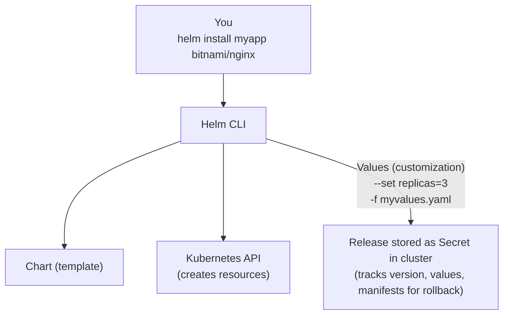

> **Complexity**: `[MEDIUM]` - Essential exam skill for Kubernetes 1.35+
>
> **Time to Complete**: 40-50 minutes
>
> **Prerequisites**: Module 0.1 (working cluster), basic YAML knowledge

---

## What You'll Be Able to Do

After completing this module, you will be able to:

- **Diagnose** failed Helm deployments by analyzing release Secrets, rendered manifests, and release history logs.
- **Implement** custom infrastructure configurations using complex Helm values overrides, values files, and chart documentation.
- **Evaluate** the state of a cluster by tracking namespace-scoped releases, orphaned resources, and safe rollback targets.
- **Design** robust deployment workflows using the `helm upgrade --install` pattern for idempotent CI/CD integration.

## Why This Module Matters

Hypothetical scenario: an on-call engineer is asked to publish a small web application during a maintenance window, but the application is not one Kubernetes object. It needs a Deployment, a Service, optional Ingress configuration, resource requests, labels for monitoring, and a rollback path if the new chart version behaves badly. Applying those files one by one can work in a lab, yet it creates a fragile production habit because each command becomes a separate chance to drift from the intended state.

Helm exists to make that kind of multi-object rollout behave like a single versioned release. Instead of treating each manifest as an isolated file, Helm packages templates, default values, dependencies, and metadata into a chart, then records each install, upgrade, rollback, and uninstall as release history stored inside the cluster. The operational advantage is not only convenience; it is the ability to ask, "What did we deploy, with which values, in which namespace, and how do we return to a known working revision?"

For the CKA exam and for real Kubernetes operations, the important skill is not memorizing every chart option. The important skill is knowing how to inspect a chart, render what Helm will send to the API server, override values in a predictable order, diagnose why a release cannot be found, and choose a rollback or uninstall action that matches the situation. This module teaches Helm as a release-management tool first and a command-line shortcut second, because that framing is what keeps complex Kubernetes applications understandable under pressure.

## Part 1: Helm as Release Management, Not Just Packaging

Helm is often introduced as "the package manager for Kubernetes," and the analogy is useful as long as you do not stop there. A Linux package manager installs files onto a machine and tracks the package version; Helm renders Kubernetes manifests from templates, submits them to the API server, and tracks the release revision in Kubernetes Secrets. That release record matters because Kubernetes itself does not know that a Deployment, Service, ConfigMap, and Ingress were meant to travel together as one application unit.

The core vocabulary is small, but each term carries operational consequences. A chart is the reusable package, a release is one installed instance of that chart, a repository is an index of packaged charts, and values are the configuration inputs that make a generic chart fit a specific environment. When you debug a broken deployment, keep asking which layer you are looking at: chart defaults, user-supplied values, rendered manifests, Kubernetes resources, or Helm release history.

| Term | Definition |
|------|------------|
| **Chart** | A package of Kubernetes resources (like a .deb or .rpm) |
| **Release** | An instance of a chart running in your cluster |
| **Repository** | A collection of charts (like apt repository) |
| **Values** | Configuration options to customize a chart |

The following flow is the mental model you should carry into every Helm task. The CLI reads a chart and its values, renders ordinary Kubernetes YAML, applies that YAML using your current Kubernetes credentials, and stores release metadata for future status, history, upgrade, and rollback operations. Nothing magical is running in the cluster on Helm's behalf in modern Helm; the stored release Secret is the memory that lets Helm reason about revisions.



Helm 3 removed Tiller, the in-cluster server component used by Helm 2. That architectural change is more than trivia: Helm now talks directly to the Kubernetes API using your kubeconfig and your RBAC permissions, so an install fails if your identity cannot create the target resources. On an exam, this helps you separate Helm problems from authorization problems; if rendering works locally but the API rejects the install, inspect permissions and target namespace instead of blaming the chart.

```bash
# Helm 3 (current) - no Tiller needed
helm install myapp ./mychart

# Helm 2 (deprecated) - required Tiller
# Don't use this anymore
```

Pause and predict: if two engineers install the same `bitnami/nginx` chart as releases named `web` and `admin` in the same namespace, do they share one release history or get two independent histories? The chart is the shared package, but each release name becomes its own tracked instance, so status, values, history, and rollback are evaluated per release.

## Part 2: Installing the CLI and Working with Repositories

Helm is a client-side binary, so installing Helm does not install a controller, admission webhook, or any other long-running component into the cluster. This is why the first troubleshooting question is usually local: does the CLI exist, can it reach your Kubernetes API server, and does your kubeconfig point at the cluster and namespace you think it does? Once the CLI is installed, the cluster only sees standard Kubernetes API calls made with your current credentials.

The installation commands below preserve the common options you will see across macOS and Linux environments. For production workstations, prefer the official installation guide or your organization's approved package source, because package repository details can change over time. For exam practice, the key is simpler: verify `helm version`, then immediately verify `kubectl config current-context` so you know which cluster Helm will operate against.

```bash
# macOS
brew install helm

# Linux (script)
curl https://raw.githubusercontent.com/helm/helm/main/scripts/get-helm-3 | bash

# Linux (package manager)
# Debian/Ubuntu
curl https://packages.cloud.google.com/apt/doc/apt-key.gpg | gpg --dearmor | sudo tee /usr/share/keyrings/helm.gpg > /dev/null
echo "deb [arch=$(dpkg --print-architecture) signed-by=/usr/share/keyrings/helm.gpg] https://apt.kubernetes.io/ kubernetes-xenial main" | sudo tee /etc/apt/sources.list.d/helm-stable-debian.list
sudo apt-get update
sudo apt-get install helm

# Verify installation
helm version
```

A Helm repository is an HTTP location that exposes an `index.yaml` file pointing to packaged chart archives. Public repositories make popular workloads easy to discover, while private repositories let teams distribute internal platform charts with controlled versioning. ChartMuseum is one open-source option for hosting a private Helm repository, but OCI registries are also common because Helm can store charts in registry infrastructure many teams already operate.

```bash
# Add the Bitnami repository (popular, well-maintained charts)
helm repo add bitnami https://github.com/bitnami/charts

# Add other common repositories
helm repo add ingress-nginx https://kubernetes.github.io/ingress-nginx
helm repo add prometheus-community https://prometheus-community.github.io/helm-charts

# Update repository index
helm repo update

# List configured repositories
helm repo list
```

Repository configuration is local to your machine, which explains a frequent "works on my laptop" problem. If one terminal can search `bitnami/nginx` and another cannot, the difference may be repository configuration or an out-of-date index rather than a Kubernetes cluster issue. Before blaming the cluster, run `helm repo list`, refresh with `helm repo update`, and confirm that the chart name includes the repository prefix you intended.

## Part 3: Inspecting and Installing Charts Safely

Helm gives you several inspection commands because a chart is both a software artifact and a configuration surface. `helm show chart` answers metadata questions such as chart name and version, `helm show readme` explains intended usage, and `helm show values` exposes the configurable keys that the templates expect. In an exam environment with limited web access, these commands become your local documentation, especially when you need the exact nested value for a Service type or Ingress hostname.

```bash
# Search in Artifact Hub (online registry)
helm search hub nginx

# Search in your added repositories
helm search repo nginx

# Show all versions of a chart
helm search repo bitnami/nginx --versions

# Get info about a specific chart
helm show chart bitnami/nginx
helm show readme bitnami/nginx
helm show values bitnami/nginx  # See all configurable values
```

An install needs two names: the release name you choose and the chart reference you install from. Treat the release name like an operational handle, not a throwaway label, because it appears in `helm list`, history, Secret names, and many rendered resource names. A clear release name also reduces mistakes during rollback; `helm rollback web` is easier to reason about than a generated name that nobody recognizes during an incident.

```bash
# Basic install
helm install my-nginx bitnami/nginx
#           ^^^^^^^^  ^^^^^^^^^^^^^
#           release   chart name
#           name

# Install in specific namespace
helm install my-nginx bitnami/nginx -n web --create-namespace

# Install with custom values
helm install my-nginx bitnami/nginx --set replicaCount=3

# Install with values file
helm install my-nginx bitnami/nginx -f myvalues.yaml

# Install specific version
helm install my-nginx bitnami/nginx --version 15.0.0

# Dry-run (see what would be created)
helm install my-nginx bitnami/nginx --dry-run

# Generate manifests only (don't install)
helm template my-nginx bitnami/nginx > manifests.yaml
```

The safest workflow is to inspect before you install and render before you trust. A dry run asks Helm to process the chart and show the planned result, while `helm template` emits manifests without creating cluster resources. Those outputs are not busywork; they reveal names, labels, namespaces, resource requests, Service types, and Secrets before the API server accepts anything.

Before running this, what output do you expect from `helm template my-nginx bitnami/nginx` compared with `helm install my-nginx bitnami/nginx --dry-run`? The first is manifest-focused and easy to redirect into a file, while the second follows the install path and includes release-oriented information useful for debugging the install operation itself.

Once a release exists, inspection shifts from the chart artifact to the installed release. Helm stores release state as Kubernetes Secrets named with the `sh.helm.release.v1.<release-name>.v<revision>` pattern, usually in the namespace where the release was installed. If `helm list` seems empty but application resources exist, do not assume the resources are unmanaged until you have checked all namespaces and looked for Helm-owned Secrets.

```bash
# List all releases
helm list

# List in all namespaces
helm list -A

# List including failed releases
helm list --all

# Get status of a release
helm status my-nginx

# Get values used for a release
helm get values my-nginx

# Get all values (including defaults)
helm get values my-nginx --all

# Get the manifests that were installed
helm get manifest my-nginx
```

The distinction between `helm get values` and `helm get values --all` is worth practicing. The first shows values explicitly supplied for the release, which is often what you need when diagnosing a surprising override. The second merges those user-supplied values with chart defaults, which is often what you need when reconstructing the full configuration that produced the current manifests.

## Part 4: Customizing with Values and Understanding Precedence

Values are Helm's primary customization mechanism, and their power comes from predictability. A chart author defines default values, the operator supplies one or more values files, and the command line can supply final overrides with `--set`. This layered approach lets you keep stable environment configuration in version control while still making a small emergency adjustment without editing a committed file.

Pause and predict: You run `helm install my-app bitnami/nginx --set replicaCount=3 -f values.yaml` where `values.yaml` contains `replicaCount: 5`. How many replicas will you get? The command-line `--set` value has higher precedence than the file, so Helm renders three replicas unless another later override changes the same key.

The precedence order is highest to lowest: `--set` flags, values files specified with `-f` where later files override earlier files, and finally the chart's default `values.yaml`. That means a production override file can build on a base file, and a one-off command-line value can still win at the very end. The tradeoff is auditability: the more you rely on ad hoc `--set` values, the harder it becomes to reconstruct intent from version control.

```bash
# Example: Multiple ways to set replicas
helm install my-nginx bitnami/nginx \
  -f base-values.yaml \
  -f production-values.yaml \
  --set replicaCount=5  # This wins
```

For quick experiments, `--set` is efficient and perfectly acceptable. It becomes uncomfortable when values are deeply nested, contain arrays, or need quoting to preserve strings that resemble numbers or booleans. When a value affects production behavior, prefer a file because it can be reviewed, diffed, rolled back, and reused during future upgrades.

```bash
# Simple value
helm install my-nginx bitnami/nginx --set replicaCount=3

# Nested value
helm install my-nginx bitnami/nginx --set service.type=NodePort

# Multiple values
helm install my-nginx bitnami/nginx \
  --set replicaCount=3 \
  --set service.type=NodePort \
  --set service.nodePorts.http=30080

# Array values
helm install my-app ./mychart --set 'ingress.hosts[0]=example.com'

# String that looks like number (use quotes)
helm install my-app ./mychart --set 'version="1.35"'
```

Values files are the better default for repeatable infrastructure because they keep the release configuration close to the team's review process. A file also makes it easier to compare environments: base values can describe shared policy, while staging and production files can override only the differences. When you diagnose a production release, ask whether the current release was built from a file you can still find or from command-line overrides that only exist in shell history.

```yaml
# myvalues.yaml
replicaCount: 3

service:
  type: NodePort
  nodePorts:
    http: 30080

resources:
  requests:
    memory: "128Mi"
    cpu: "100m"
  limits:
    memory: "256Mi"
    cpu: "200m"

ingress:
  enabled: true
  hostname: myapp.example.com
```

```bash
# Use the values file
helm install my-nginx bitnami/nginx -f myvalues.yaml
```

When you inherit a chart, start with the default values file instead of guessing parameter names. Saving the default values locally gives you a searchable reference and a safe place to copy the subset you intend to override. Do not commit the entire default file as your environment configuration unless your team deliberately wants that maintenance burden, because a huge copied file can hide the few settings that actually matter.

```bash
# See all configurable options
helm show values bitnami/nginx

# Save to file for reference
helm show values bitnami/nginx > nginx-defaults.yaml
```

Which approach would you choose here and why: one long `helm upgrade` command with ten `--set` flags, or a reviewed `production-values.yaml` file plus one temporary `--set image.tag=...` override during a rollback rehearsal? The file-centered approach usually wins for team operations because it makes the stable configuration reviewable while keeping the emergency override visible and intentional.

## Part 5: Upgrades, Rollbacks, and Release History

Upgrades are where Helm starts to feel different from plain `kubectl apply`. Helm does not merely submit a new set of manifests; it records a new release revision that includes chart metadata, values, and rendered manifests. That revision history is why you can ask Helm for a timeline and roll back to a known earlier state without manually reconstructing every object from old YAML files.

Stop and think: You run `helm upgrade my-app bitnami/nginx` without `--reuse-values` and without specifying any values. What happens to all the custom values you set during the original install? Helm prepares the upgrade from the chart defaults plus values supplied to this upgrade command, so previous custom values are not automatically reused unless you specify `--reuse-values` or provide the full desired values again.

```bash
# Upgrade with new values
helm upgrade my-nginx bitnami/nginx --set replicaCount=5

# Upgrade with values file
helm upgrade my-nginx bitnami/nginx -f newvalues.yaml

# Upgrade to new chart version
helm upgrade my-nginx bitnami/nginx --version 16.0.0

# Upgrade or install if not exists
helm upgrade --install my-nginx bitnami/nginx

# Reuse values from previous release + new values
helm upgrade my-nginx bitnami/nginx --reuse-values --set replicaCount=5
```

The `helm upgrade --install` pattern is valuable in CI/CD because it makes the command idempotent for a target release name. If the release does not exist, Helm installs it; if it does exist, Helm upgrades it. That design reduces branching logic in deployment jobs, but it does not remove the need to pass the correct namespace, chart version, and values every time.

```bash
# View upgrade history
helm history my-nginx

# Output:
# REVISION  STATUS      CHART           DESCRIPTION
# 1         superseded  nginx-15.0.0    Install complete
# 2         superseded  nginx-15.0.0    Upgrade complete
# 3         deployed    nginx-15.0.1    Upgrade complete
```

Read the history before rolling back, especially in a namespace with multiple recent changes. Helm can roll back to the previous revision by default, or to a specific revision if you name one. In a pressure situation, the safest sequence is status, history, rollback, status again, and then Kubernetes-level verification of Pods, Services, and events.

```bash
# Rollback to previous revision
helm rollback my-nginx

# Rollback to specific revision
helm rollback my-nginx 1

# Dry-run rollback
helm rollback my-nginx 1 --dry-run
```

A rollback creates another revision rather than erasing history. That can surprise learners who expect revision numbers to move backward, but it is a useful audit property: the cluster records that you performed a rollback action and what revision became active afterward. When diagnosing later, `helm history` should show both the failed upgrade and the rollback that restored service.

## Part 6: Uninstalling, Orphaned Resources, and Chart Anatomy

Uninstalling a Helm release asks Helm to delete the resources it manages for that release. The normal path also removes release history, while `--keep-history` leaves historical release metadata so you can inspect what existed. The operational question is whether you want the application gone completely, temporarily removed with history retained, or left running while you only inspect and clean up a failed release state.

```bash
# Uninstall a release
helm uninstall my-nginx

# Uninstall but keep history (allows rollback)
helm uninstall my-nginx --keep-history

# Uninstall in specific namespace
helm uninstall my-nginx -n web
```

Orphaned resources appear when Kubernetes objects remain but Helm no longer has usable release metadata for them, or when resources were created outside the release and happen to share similar names. This is why manually deleting `sh.helm.release` Secrets is dangerous: you are deleting Helm's memory, not necessarily the live application. If the Deployment still exists but `helm status` cannot find the release, compare namespaces, inspect `kubectl get secrets -l owner=helm -A`, and decide whether to adopt, recreate, or remove the orphaned objects.

While the CKA does not require you to become a chart author, chart anatomy helps you debug. A chart directory has metadata, defaults, optional dependencies, and templates that produce the Kubernetes manifests. The `templates/` directory is where most install failures originate, because bad values can render invalid YAML, invalid Kubernetes fields, or resources that your RBAC identity cannot create.

```text
mychart/
├── Chart.yaml          # Metadata (name, version, description)
├── values.yaml         # Default configuration
├── charts/             # Dependencies (subcharts)
├── templates/          # Kubernetes manifest templates
│   ├── deployment.yaml
│   ├── service.yaml
│   ├── ingress.yaml
│   ├── _helpers.tpl    # Template helpers
│   └── NOTES.txt       # Post-install message
└── README.md           # Documentation
```

Stop and think: You delete the Kubernetes Secret that stores a Helm release's metadata, the one labeled `owner=helm`. Can you still run `helm upgrade` or `helm rollback` on that release? Helm depends on that release record, so the resources may keep running, but Helm can no longer reason about that release normally.

Templates use Go template syntax to substitute values and release metadata into Kubernetes manifests. The snippet below is intentionally small, but it shows the important pattern: `.Release.Name` comes from the chosen release, while `.Values.*` comes from the merged values hierarchy. A broken value can therefore create a broken Deployment even when the chart's default template is valid.

```yaml
# templates/deployment.yaml (simplified)
apiVersion: apps/v1
kind: Deployment
metadata:
  name: "{{ .Release.Name }}-nginx"
spec:
  replicas: {{ .Values.replicaCount }}
  template:
    spec:
      containers:
      - name: nginx
        image: "{{ .Values.image.repository }}:{{ .Values.image.tag }}"
```

Render before you install when the problem might be templating. `helm template` shows the YAML that Helm would generate, and `--debug --dry-run` adds context around the install path. If the rendered YAML is wrong, fix values or chart templates; if the rendered YAML is right but the install fails, investigate Kubernetes validation, admission policies, quotas, and RBAC.

```bash
# See what YAML would be generated
helm template my-nginx bitnami/nginx -f myvalues.yaml

# Install with debug info
helm install my-nginx bitnami/nginx --debug --dry-run
```

## Part 7: Exam-Ready Workflows and Operational Checks

The exam scenarios below are intentionally compact, but they represent the full rhythm you should practice: add a repository, update the index, inspect values if needed, install with explicit configuration, verify with Helm, and verify with Kubernetes. Helm tells you about the release; Kubernetes tells you whether the resulting objects are healthy. You need both views because a release can exist while Pods are still Pending or CrashLooping.

```bash
# Task: Install nginx with 3 replicas exposed on NodePort 30080

# Solution:
helm repo add bitnami https://github.com/bitnami/charts
helm repo update

helm install web bitnami/nginx \
  --set replicaCount=3 \
  --set service.type=NodePort \
  --set service.nodePorts.http=30080
```

After the install, avoid the trap of treating a successful Helm command as proof that the application is ready. Run `helm status web`, then inspect the Deployment, Pods, and Service that were created. A CKA task may award credit for the installed object, but a production runbook should always include readiness checks because Helm can create resources that still need time or capacity to become healthy.

```bash
# Task: Upgrade the existing nginx release to use 5 replicas

# Solution:
helm upgrade web bitnami/nginx --reuse-values --set replicaCount=5

# Verify:
kubectl get deployment
```

The `--reuse-values` flag is a deliberate choice in that upgrade command. It tells Helm to begin with the last release's values, then apply the new replica override, which is useful when the previous release carried important settings not repeated on the command line. If you do not want to inherit previous values, pass a complete values file instead so the upgrade is explicit.

```bash
# Task: Rollback to the previous working version

# Solution:
helm history web
helm rollback web

# Verify:
helm status web
```

When rolling back, verify both Helm and Kubernetes state. Helm status tells you the release revision and notes, while `kubectl rollout status deployment/<name>` and `kubectl get events` can reveal whether Pods are actually progressing. This two-level check prevents a false sense of safety after a rollback command returns successfully but the workload still cannot schedule, pull images, or pass readiness probes.

## Part 8: Troubleshooting Helm as a Layered System

Helm troubleshooting becomes much easier when you treat the system as layers rather than as one opaque command. The first layer is local configuration: your Helm repository index, chart cache, current working directory, kubeconfig, and default namespace. The second layer is rendering: chart templates combine with values to produce manifests. The third layer is the Kubernetes API, where validation, admission control, quotas, and RBAC decide whether the rendered resources are accepted.

This layered model prevents random command repetition. If `helm search repo nginx` cannot find a chart, Kubernetes is not involved yet, so checking Pods wastes time. If `helm template` fails, the API server is not involved yet, so changing RBAC will not help. If rendering succeeds but install fails with a forbidden error, the chart may be fine, and the real issue may be the identity that Helm is using through kubeconfig.

Start every investigation by writing down four facts: release name, namespace, chart reference, and values source. Those facts sound basic, but they explain a large share of Helm confusion. A release named `web` in `default` is not the same release as `web` in `helm-lab`, and a chart reference such as `bitnami/nginx` depends on local repository configuration that may not exist on a different workstation or exam terminal.

The next diagnostic question is whether Helm can still see the release record. `helm status` and `helm history` depend on release metadata, while Kubernetes resource commands only prove that objects exist. If `helm status web -n helm-lab` fails but `kubectl get deployment -n helm-lab` succeeds, you have not proven that Helm is broken; you have proven that Helm metadata and live Kubernetes objects no longer line up in the way you expected.

Exercise scenario: a release install was interrupted after some resources were created, and a later `helm install` reports that a resource already exists. The right response is not to delete the resource immediately. First inspect whether there is a failed release in `helm list --all -n <namespace>`, whether release Secrets exist, and whether the live resource has labels or annotations tying it to a Helm release. Those checks tell you whether to uninstall, upgrade, adopt manually, or remove an orphan.

Rendering diagnostics should come before live retries because rendering is cheap and reversible. When a template output contains a wrong image tag, wrong namespace, or wrong Service type, repeating `helm install` cannot fix the underlying values. Save rendered output when debugging a complex chart, compare it with the chart's default values, and confirm that each override appears in the generated manifest where you expected it to appear.

Kubernetes diagnostics begin after the API accepts the resources. A successful install can still create Pods that never become Ready, Services without endpoints, or Ingress objects that depend on a controller not present in the cluster. Helm is responsible for release lifecycle; it is not a replacement for Pod scheduling, image pull, readiness probe, or networking diagnosis. That is why every serious Helm workflow ends with Kubernetes-level verification.

Values diagnosis often comes down to identifying the source of a surprising field. If a rendered Deployment has five replicas, ask whether that number came from the chart default, a base values file, an environment values file, a `--set` flag, or `--reuse-values` during upgrade. Once you know the source, you can change the right artifact instead of editing a random generated manifest that Helm may overwrite later.

A useful habit is to compare three views of a release: `helm get values`, `helm get values --all`, and `helm get manifest`. The first view shows user-supplied intent, the second shows intent after defaults are included, and the third shows what Kubernetes received. If those views disagree with your mental model, slow down before upgrading again, because another upgrade may preserve or overwrite exactly the values you misunderstood.

Rollback diagnosis also benefits from separating Helm state from workload state. `helm rollback` changes the release to a previous rendered state, but it cannot guarantee that the cluster has enough capacity, that images are available, or that readiness probes will pass. After rollback, read the new history entry, inspect current manifests if needed, and check the resulting Deployment or StatefulSet rollout. Recovery is complete only when the application is healthy, not when the command exits.

Namespace diagnosis deserves special emphasis because Helm's namespace behavior is a common source of false negatives. The namespace flag affects where release metadata is stored and where namespaced resources are created unless templates override namespaces explicitly. In shared clusters, always include `-n` in status, history, upgrade, rollback, and uninstall commands. In exam conditions, this habit saves time because it removes a whole category of accidental default-namespace searches.

Repository diagnosis is different from release diagnosis. `helm repo update` refreshes local knowledge about available chart versions, but it does not modify any cluster resources. `helm search repo` can prove that your local index knows a chart, but it does not prove that an installed release uses that chart version. For an existing release, use `helm history` and `helm status` to see what was actually deployed.

Chart version pinning is part of troubleshooting because unpinned upgrades can change more than the value you intended to adjust. A chart version may update templates, default values, resource names, container images, or hooks. When a change must be narrow, pin the chart version and change only the values you intend. When the chart version must change, render both old and new output so you can see the operational difference before the API server applies it.

Hooks add another layer that learners often overlook. Some charts define pre-install, post-install, pre-upgrade, or post-upgrade hooks that create Jobs or other temporary resources. If a Helm command appears stuck or failed even though the main Deployment looks reasonable, inspect the release notes, chart documentation, and namespace Jobs. A hook failure can affect release status even when the primary application objects look mostly correct.

Secrets and sensitive values require special caution during diagnosis. Helm release Secrets can contain rendered manifests and values in encoded form, which means operational debugging should avoid copying real credentials into tickets, chat, or training notes. Use placeholder values in examples, limit access to namespaces containing sensitive releases, and prefer external secret patterns when production credentials must be supplied to an application.

The most reliable Helm runbooks state both the command and the observation that proves it worked. "Run rollback" is not a complete recovery step. "Run rollback to revision 2, confirm `helm status` reports deployed, confirm Pods are Ready, and confirm the Service has endpoints" is operationally useful because it connects Helm's release layer to Kubernetes health. That style of runbook is also good exam preparation because it makes verification automatic.

If you feel tempted to repair a release by editing live Kubernetes objects, ask what Helm will do on the next upgrade. Manual edits may be overwritten because Helm renders from chart templates and values, not from your emergency changes. Sometimes a temporary `kubectl` edit is justified during an incident, but the durable fix should be captured in chart values or templates so Helm and the live cluster converge again.

Finally, remember that Helm is a tool for managing desired Kubernetes objects, not a policy engine or dependency solver for every platform concern. It will not decide whether a NodePort is allowed by your platform policy, whether an image registry is trusted, or whether a namespace has enough quota. Those decisions live in Kubernetes admission, cluster policy, and platform design. Helm helps you package and track the release so those other systems can evaluate a clear manifest.

A strong diagnostic habit is to name the evidence you need before you run the command. If the question is "which values produced this release," `helm get values` is evidence. If the question is "which YAML did Kubernetes receive," `helm get manifest` is evidence. If the question is "why are Pods not ready," Kubernetes Pod descriptions and events are evidence. Matching the command to the question keeps troubleshooting focused.

Another useful distinction is planned state versus observed state. Helm stores planned state in release revisions and manifests, while Kubernetes reports observed state through object status, controller conditions, and events. When those disagree, do not choose one source blindly. Use Helm to understand what should have been created, then use Kubernetes to understand what actually happened after controllers, schedulers, admission plugins, and kubelets reacted to that plan.

Release naming conventions are part of reliability because a name becomes a diagnostic anchor. A release called `web` in namespace `helm-lab` tells a future operator less than `payments-api` in namespace `payments`, but both are better than a generated name nobody can connect to an application. In shared clusters, choose names that are short enough to type under pressure but specific enough to avoid accidental rollback of an unrelated workload.

Values review should include negative checks, not just confirmation that a desired field appears. If you intend to expose only a ClusterIP Service, verify that the rendered output does not create a NodePort, LoadBalancer, or Ingress by default. If you intend to avoid persistent storage in a disposable lab, search rendered manifests for PersistentVolumeClaim resources. Helm charts often include optional features, and values files are how you turn those features on or off deliberately.

Chart README files are helpful, but rendered manifests are the final local truth before the API server. Documentation can be outdated, default values can change between chart versions, and subcharts can introduce resources you did not expect. When the operational risk is high, read the README to understand intent, inspect values to understand configuration, and render the chart to understand concrete Kubernetes objects.

Subcharts deserve attention because a parent chart can deploy more than the application name suggests. A monitoring chart may install exporters, RBAC, ConfigMaps, Jobs, and Services from dependencies. If you only inspect the parent chart's top-level values, you may miss dependency-specific configuration. Use `helm show values` and chart documentation to find whether nested dependency values need to be overridden.

Cluster policy failures can look like Helm failures at first glance. A chart may render a privileged container, a forbidden hostPath, or a Service type disallowed by your platform. Helm reports that the install or upgrade failed, but the policy engine made the decision. The fix is not to retry Helm; the fix is to change values, choose a different chart setting, or request a policy exception through the platform process.

Resource quota failures follow a similar pattern. Helm can render a Deployment requesting more CPU or memory than the namespace quota allows, and the API server may reject or controllers may fail to progress. The chart is not necessarily bad, and Helm is not necessarily broken. Diagnose quota with Kubernetes namespace and event commands, then reduce requests in values or choose a namespace with appropriate capacity.

Image pull failures are another place where Helm and Kubernetes responsibilities meet. Helm may correctly deploy a manifest with the image tag you supplied, while Pods fail because registry credentials, image names, or network access are wrong. In that case, `helm history` explains when the tag changed, and `kubectl describe pod` explains why the kubelet cannot pull it. The complete answer uses both tools.

Finally, make cleanup explicit in practice labs. A clean `helm uninstall web -n helm-lab` demonstrates lifecycle management and prevents later exercises from colliding with leftover resources. If you keep history, know why you kept it; if you remove history, know that rollback is no longer available. Good cleanup is not separate from Helm proficiency, because the same release metadata that helps rollback also determines what uninstall can remove.

The practical standard is simple: never leave a Helm action without knowing what evidence would convince another operator. A release name, namespace, chart version, values source, rendered manifest, and workload status form a complete story. When that story is complete, upgrades and rollbacks become controlled operations rather than guesses.

## Patterns & Anti-Patterns

Patterns and anti-patterns help you choose a Helm habit before the incident starts. The common thread is traceability: reliable Helm workflows make it obvious which chart version, values, namespace, and release name produced the live objects. Fragile workflows hide that information in ad hoc commands, deleted Secrets, or copied manifests that Helm can no longer manage.

| Pattern | When to Use | Why It Works | Scaling Consideration |
|---------|-------------|--------------|-----------------------|
| Versioned values files | Shared environments, reviewed production changes, and repeatable lab setups | The desired configuration lives in source control and can be reviewed before `helm upgrade` | Keep files small by overriding only meaningful differences from chart defaults |
| `helm upgrade --install` | CI/CD jobs that should create or update the same release idempotently | One command handles first deployment and later upgrades without branchy shell logic | Always pass namespace, chart version, and values explicitly so different runners behave the same way |
| Render-before-change checks | Complex charts, risky overrides, and exam tasks with unfamiliar values | `helm template` and `--dry-run` reveal generated manifests before live resources are touched | Add manifest diffing or policy checks in mature pipelines so rendering catches more than syntax |
| Namespace-aware release inspection | Clusters with many teams or repeated release names | `helm list -A` and explicit `-n` flags prevent false "release not found" conclusions | Standardize release naming and labels so ownership remains visible across namespaces |

The opposite behaviors usually come from understandable pressure: a chart must be installed quickly, a value name is not obvious, or a failed release seems easier to delete manually than debug. Those shortcuts create future ambiguity. When in doubt, preserve Helm's release history and use Helm commands to manage releases instead of editing around Helm behind its back.

| Anti-Pattern | What Goes Wrong | Better Alternative |
|--------------|-----------------|--------------------|
| Copying `helm template` output into `kubectl apply` for long-term management | Kubernetes resources exist, but Helm has no release history for upgrade or rollback | Use `helm install` or `helm upgrade --install` for the managed release |
| Deleting `sh.helm.release` Secrets to "clean up" | Helm loses the metadata required for status, history, upgrade, and rollback | Use `helm uninstall`, `helm history`, and namespace-scoped inspection commands |
| Relying on many unrecorded `--set` flags in production | The live configuration becomes hard to review and hard to reproduce | Put stable configuration in values files and reserve `--set` for narrow, documented overrides |
| Omitting namespace flags in shared clusters | Commands inspect or change the wrong release, especially when names repeat | Use explicit `-n <namespace>` or `helm list -A` before acting |

## Decision Framework

Use this framework when you need to decide which Helm action fits the problem in front of you. The fastest command is not always the safest command; a minute spent identifying the release, namespace, values source, and desired end state can save a much longer cleanup. The goal is to choose an action that preserves traceability while moving the cluster toward the intended state.

| Situation | First Question | Preferred Helm Action | Verification |
|-----------|----------------|-----------------------|--------------|
| New application install | Do I know the chart, namespace, and required values? | `helm install` with explicit release name and values | `helm status`, then Kubernetes resource checks |
| Repeatable pipeline deploy | Should this create or update the same release? | `helm upgrade --install` with pinned chart version and values file | Release history plus rollout status |
| Small temporary override | Is the override easy to explain and safe to type? | `helm upgrade --reuse-values --set key=value` | `helm get values` and rendered manifest review |
| Production configuration change | Does the change need review and auditability? | `helm upgrade -f production-values.yaml` | Git diff, `helm template`, release history, workload health |
| Suspected bad upgrade | Which revision was last known good? | `helm history`, then `helm rollback <release> <revision>` if needed | Helm status, Pods, events, and application checks |
| Release not found | Am I in the right namespace, and does release metadata exist? | `helm list -A`, then inspect Helm-owned Secrets | Confirm whether resources are managed, orphaned, or absent |
| Application should be removed | Should history remain available? | `helm uninstall` or `helm uninstall --keep-history` | Helm list, Kubernetes resources, and remaining Secrets |

The same decision can be expressed as a simple flow. If the release does not exist and should exist, install it. If it exists and should change, upgrade it. If it changed badly, inspect history and roll back. If it should disappear, uninstall it. If Helm cannot find it while resources still exist, pause before deleting anything and determine whether the issue is namespace scope, missing release metadata, or unmanaged resources.

```text
+-----------------------------+
| Need to change an app?      |
+--------------+--------------+
               |
               v
+-----------------------------+
| Does Helm know the release? |
+------+----------------------+
       | yes
       v
+-----------------------------+      bad result      +-----------------------------+
| Upgrade with values or      |--------------------->| Inspect history and rollback |
| rollback from history       |                      +-----------------------------+
+--------------+--------------+
               |
               v
+-----------------------------+
| Verify Helm and Kubernetes  |
| state before closing task   |
+-----------------------------+

       | no
       v
+-----------------------------+
| Search all namespaces and   |
| Helm-owned release Secrets  |
+--------------+--------------+
               |
               v
+-----------------------------+
| Install, adopt carefully,   |
| or remove orphaned objects  |
+-----------------------------+
```

## Did You Know?

- Helm was originally created by Deis in 2015 and was donated to the CNCF in 2018, eventually graduating as a top-level project in April 2020.
- By default, Helm retains up to 10 revision secrets per release to prevent etcd database bloat, though you can adjust this limit with the `--history-max` flag.
- Helm templates are powered by the Go template engine, which allows complex logic, conditionals, and loops, handling over 150 built-in template functions inherited from the Sprig library.
- The transition from Helm 2 to Helm 3 in November 2019 eliminated the in-cluster Tiller component entirely, moving Helm to a client-only architecture that uses Kubernetes RBAC directly.

## Common Mistakes

| Mistake | Why It Happens | How to Fix It |
|---------|----------------|---------------|
| Forgetting `-n namespace` | Helm releases are namespace-scoped, so the default namespace may not contain the release you want | Use `helm list -A` to find the release, then repeat status, upgrade, rollback, or uninstall with the explicit namespace |
| Not using `--reuse-values` during a narrow upgrade | Operators expect Helm to remember previous custom values automatically | Use `--reuse-values` for additive changes, or provide a complete values file for fully declared upgrades |
| Using the wrong repository URL or stale index | Local repo configuration is separate from the cluster and may differ between terminals | Check `helm repo list`, run `helm repo update`, and use the repository-qualified chart name |
| Skipping dry-run and template output | The chart renders resources you did not expect, such as a different Service type or resource name | Run `helm template` or `helm install --debug --dry-run` before complex installs and risky upgrades |
| Treating Helm success as workload readiness | Helm can create Kubernetes objects before Pods are scheduled, ready, or serving traffic | Follow `helm status` with `kubectl get pods`, rollout status, events, and Service checks |
| Manually deleting Helm release Secrets | It appears to clean up metadata, but it removes Helm's ability to manage history and rollback | Use `helm uninstall` for removal and inspect `owner=helm` Secrets only for diagnosis |
| Hardcoding passwords in values files | Values files are often committed to Git and release Secrets can expose rendered configuration | Use external secret management patterns and placeholder examples, never real credentials |
| Applying rendered templates manually for managed apps | Helm loses lifecycle tracking, so future upgrades and rollbacks no longer match the live objects | Use `helm install` or `helm upgrade --install` unless you intentionally want unmanaged YAML |

## Quiz

<details>
<summary>1. During a CKA practice task, you need to expose a chart through NodePort, but you do not know the exact values key for the Service type. The repository is already configured, and external web search is unavailable. What do you inspect before installing, and why?</summary>

Run `helm show values <repo>/<chart>` and search the output for the Service configuration, then use the discovered key in the install or values file. This works because chart values are the chart's local configuration contract; you do not need internet access once the chart metadata is available from the configured repository. Guessing `service.type` might work for many charts, but the exam-safe habit is to inspect the actual chart before acting. This directly tests whether you can implement custom infrastructure configuration from chart documentation rather than from memory.
</details>

<details>
<summary>2. A teammate says a release named `web` is missing because `helm list` shows nothing, but `kubectl get deploy -n apps` shows a Deployment named `web-nginx`. What do you check next, and what conclusions are possible?</summary>

First run `helm list -A` or `helm list -n apps` because Helm releases are namespace-scoped and the current namespace may simply be wrong. Then inspect Helm-owned release Secrets with `kubectl get secrets -n apps -l owner=helm` to see whether release metadata still exists. If release metadata exists, use the correct namespace in future Helm commands; if it does not, the Deployment may be orphaned or unmanaged from Helm's perspective. The fix depends on that diagnosis, so deleting resources before checking release metadata would be premature.
</details>

<details>
<summary>3. You upgraded a release and the application starts returning server errors. The release has several revisions in history, and you need the quickest safe recovery path. Which Helm commands do you run, and what do you verify afterward?</summary>

Run `helm history <release> -n <namespace>` to identify the last known good revision, then run `helm rollback <release> <revision> -n <namespace>` or omit the revision only if the previous revision is clearly the desired target. Afterward, run `helm status` to confirm the active release state and Kubernetes commands such as `kubectl get pods` or rollout status to verify that the workload is actually healthy. Helm rollback records a new revision, so the history should show the rollback action rather than erasing the failed upgrade. This answer evaluates release state and recovery, not just command recall.
</details>

<details>
<summary>4. A pipeline uses `helm upgrade --install web bitnami/nginx` without a namespace, chart version, or values file. It works on one runner and deploys the wrong configuration on another. How would you redesign the deployment command?</summary>

Make the command explicit by including the namespace, creating it if appropriate, pinning the chart version, and passing a reviewed values file, for example `helm upgrade --install web bitnami/nginx -n web --create-namespace --version <version> -f production-values.yaml`. The `upgrade --install` pattern is still useful because it keeps the pipeline idempotent, but idempotence does not mean the environment can be implicit. Different runners may have different default namespaces, repository indexes, or working directories, so the deployment command should state its assumptions. This design choice aligns the pipeline with repeatability and auditability.
</details>

<details>
<summary>5. A chart install fails before creating resources, and the error mentions invalid YAML near a templated field. What is your first debugging move, and what are you trying to separate?</summary>

Render the chart locally with `helm template <release> <chart> -f <values-file>` and, if needed, retry with `helm install --debug --dry-run` to see Helm's rendered output and debug context. You are separating template or values problems from Kubernetes API problems. If the rendered YAML is malformed, the issue is in the chart templates or supplied values; if the YAML renders cleanly but the API rejects it, then validation, admission, quota, or RBAC becomes more likely. This is why rendering is a safe first move before repeating a live install.
</details>

<details>
<summary>6. You need to increase replicas from three to five without losing the custom Service and Ingress settings from the previous release. Which upgrade style is safest, and what would be unsafe?</summary>

Use `helm upgrade <release> <chart> --reuse-values --set replicaCount=5` if the desired change is only the replica count and the previous values are trusted. An unsafe approach would be running `helm upgrade <release> <chart> --set replicaCount=5` while assuming Helm automatically reuses the old custom values, because the upgrade may fall back to chart defaults for omitted settings. A complete values file is also safe if it declares every intended setting. The reasoning depends on values precedence and how Helm builds the configuration for each upgrade.
</details>

<details>
<summary>7. Someone suggests deleting `sh.helm.release.v1.web.v3` because the release history looks cluttered. What risk do you explain, and what should they do instead?</summary>

Explain that those Secrets are Helm's release records, so deleting them can break status, history, upgrade, and rollback behavior even while Kubernetes workloads keep running. The right cleanup path is to use Helm's own lifecycle commands, such as `helm uninstall` for removal or `--history-max` for history retention policy during future operations. If the goal is diagnosis, inspect the Secrets by label rather than deleting them. This protects Helm's ability to evaluate the cluster state later.
</details>

## Hands-On Exercise

Exercise scenario: you are preparing a repeatable Helm workflow for an nginx release in a Kubernetes 1.35+ practice cluster. The goal is not only to install the chart, but also to prove that you can inspect chart values, render manifests before applying them, upgrade with controlled values, diagnose release history, and roll back safely. Use a disposable namespace so the exercise does not interfere with other modules.

### Setup

Use a cluster where you can create namespaces, Deployments, Services, and Secrets. The Killercoda Kubernetes playground linked in the frontmatter is suitable, as is any local practice cluster. If the Bitnami chart repository changes location in the future, use the repository URL shown by the current Bitnami Helm documentation, but keep the release and namespace names from this exercise so your verification commands remain consistent.

### Tasks

- [ ] Add the Bitnami repository, update the repository index, and confirm that an nginx chart is discoverable with `helm search repo`.
- [ ] Inspect the default chart values and identify the keys that control replica count, Service type, and NodePort configuration.
- [ ] Render the release with a values file before installing it, then install a release named `web` in a namespace named `helm-lab`.
- [ ] Upgrade the release from three replicas to five replicas while preserving the existing Service configuration.
- [ ] Diagnose the release by checking `helm status`, `helm history`, user-supplied values, rendered manifests, and Helm-owned Secrets.
- [ ] Roll back the release to the previous revision and verify both Helm status and Kubernetes workload state.

<details>
<summary>Solution outline</summary>

Start by adding and updating the repository, then inspect the chart before writing values. Create a small values file that sets the replica count and Service configuration, render it with `helm template`, and only then install the release. After installation, use `helm upgrade --reuse-values --set replicaCount=5` for the narrow replica change, inspect history, and roll back if the exercise asks for recovery. The important success criterion is that every live change can be explained from Helm release state and Kubernetes object state.

```bash
helm repo add bitnami https://github.com/bitnami/charts
helm repo update
helm search repo bitnami/nginx
helm show values bitnami/nginx > nginx-defaults.yaml
```

```yaml
# helm-lab-values.yaml
replicaCount: 3

service:
  type: NodePort
  nodePorts:
    http: 30080
```

```bash
helm template web bitnami/nginx -n helm-lab -f helm-lab-values.yaml > rendered-web.yaml

helm install web bitnami/nginx \
  -n helm-lab \
  --create-namespace \
  -f helm-lab-values.yaml

helm status web -n helm-lab
kubectl get deployment,svc,pods -n helm-lab

helm upgrade web bitnami/nginx \
  -n helm-lab \
  --reuse-values \
  --set replicaCount=5

helm history web -n helm-lab
helm get values web -n helm-lab
helm get manifest web -n helm-lab
kubectl get secrets -n helm-lab -l owner=helm

helm rollback web -n helm-lab
helm status web -n helm-lab
kubectl get deployment,svc,pods -n helm-lab
```
</details>

### Success Criteria

- [ ] You can explain the difference between the chart name, release name, namespace, and rendered Kubernetes resource names.
- [ ] You can show the values keys used for replica count, Service type, and NodePort instead of guessing them.
- [ ] You can prove the install was created by Helm by showing release status, history, and Helm-owned Secrets.
- [ ] You can evaluate whether an upgrade preserved prior values by comparing `helm get values` output before and after the upgrade.
- [ ] You can roll back the release and verify the result using both Helm and Kubernetes commands.

## Sources

- [Helm documentation](https://helm.sh/docs/)
- [Helm installation guide](https://helm.sh/docs/intro/install/)
- [Using Helm](https://helm.sh/docs/intro/using_helm/)
- [Helm charts topic guide](https://helm.sh/docs/topics/charts/)
- [Helm values files](https://helm.sh/docs/chart_template_guide/values_files/)
- [Helm template guide getting started](https://helm.sh/docs/chart_template_guide/getting_started/)
- [Helm upgrade command reference](https://helm.sh/docs/helm/helm_upgrade/)
- [Helm rollback command reference](https://helm.sh/docs/helm/helm_rollback/)
- [Helm get manifest command reference](https://helm.sh/docs/helm/helm_get_manifest/)
- [Helm registries topic guide](https://helm.sh/docs/topics/registries/)
- [Kubernetes Secrets concept](https://kubernetes.io/docs/concepts/configuration/secret/)
- [Kubernetes kubectl command reference](https://kubernetes.io/docs/reference/kubectl/)

## Next Module

Next: [Module 1.4: Kubeadm Cluster Setup](./module-1.4-kubeadm-cluster-setup/) - build on Helm release operations by learning how Kubernetes clusters are bootstrapped, configured, and validated.
