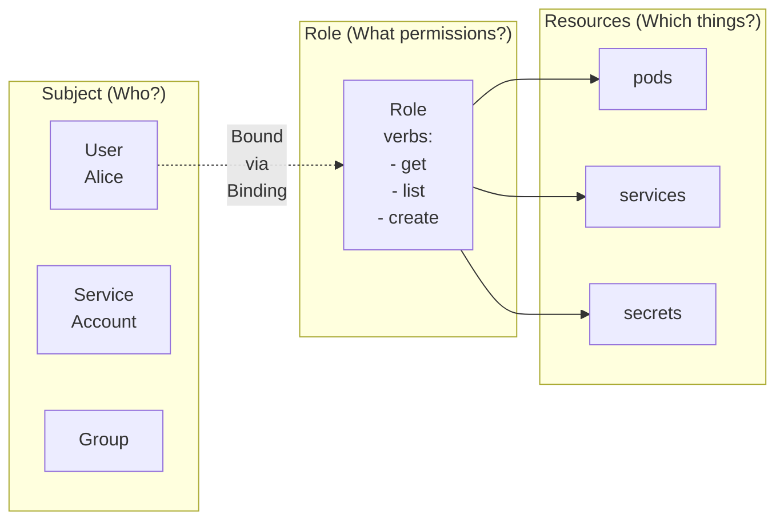

> **Complexity**: `[MEDIUM]` - Common exam topic
>
> **Time to Complete**: 40-50 minutes
>
> **Prerequisites**: Module 1.1 (Control Plane), understanding of namespaces

## What You'll Be Able to Do

After completing this module, you will be able to:
- **Design** an enterprise-grade role-based access control architecture that enforces strict least privilege isolation across multiple development teams.
- **Implement** namespace-scoped and cluster-scoped access policies using Roles, ClusterRoles, and bindings within a modern Kubernetes v1.35 environment.
- **Diagnose** complex authorization failures and "Forbidden" errors by systematically evaluating API request contexts, subject bindings, and aggregated rules.
- **Evaluate** the security posture of an existing Kubernetes cluster by auditing privilege escalation vectors, default system bindings, and overly permissive wildcard definitions.
- **Compare** the standard RBAC authorizer against alternative mechanisms like Node authorization and external Webhook integration for specialized security requirements.

---

## Why This Module Matters

In August 2022, a prominent cloud-native financial services firm experienced a catastrophic security incident that wiped out millions of dollars in transaction records. The root cause was not a sophisticated zero-day vulnerability, but a simple misconfiguration in their Kubernetes access controls. A junior developer's ServiceAccount was granted excessive permissions in a development namespace. Due to an improperly scoped RoleBinding that incorrectly referenced a broad administrative ClusterRole, the attacker who compromised the developer's container was able to pivot across the entire cluster, ultimately accessing production databases and manipulating financial ledgers.

Incidents like this underscore the critical importance of robust authorization mechanisms. Kubernetes does not restrict internal network traffic or API calls by default unless explicit security controls are implemented. If your cluster relies solely on authentication (proving who a user is) without rigorous authorization (verifying what they are allowed to do), every compromised application becomes a gateway to cluster-wide devastation. 

Role-Based Access Control (RBAC) is the cornerstone of Kubernetes security. It provides the granular, declarative framework necessary to enforce the principle of least privilege. In this module, we will explore the depths of the RBAC API, examine how to safely delegate permissions without risking privilege escalation, and understand the nuances of subjects, verbs, and resource definitions. For anyone aspiring to become a Certified Kubernetes Administrator, mastering these concepts is absolutely essential, as RBAC configuration and troubleshooting are heavily emphasized in the CKA exam.

> **The Security Guard Analogy**
>
> Think of RBAC like a physical building's sophisticated security system. A **Role** is like defining an access badge tier—"Developer Badge" permits access to floors 2 and 3, while "Admin Badge" permits access to all floors. A **RoleBinding** is the act of handing that specific badge tier to a person—"Alice receives a Developer Badge." The security system (the API server) rigorously checks the assigned badge before allowing entry to any specific room (the resource).

---

## Part 1: The Kubernetes Authorization Pipeline

Before a request reaches the RBAC engine, it passes through the authentication layer. Once the user or service is identified, the API server must determine if the action is permitted. The `kube-apiserver` binary controls this process via the `--authorization-mode` flag. 

The API server supports multiple authorization modes, including `AlwaysAllow`, `AlwaysDeny`, `ABAC` (Attribute-Based Access Control), `RBAC`, `Node`, and `Webhook`. Administrators typically configure multiple modes simultaneously by passing a comma-separated list. 

Authorization modes are evaluated sequentially in the exact order they are specified. If any configured authorizer approves or denies the request, the decision is immediately returned to the user, and evaluation halts. If all authorizers return "no opinion," the request is ultimately denied with an HTTP 403 Forbidden error.

It is critical to understand that RBAC permissions are purely additive — there are absolutely no deny rules within the RBAC API. Because of this additive nature, configuring your API server with `--authorization-mode=AlwaysAllow,RBAC` has the exact same net effect as using `AlwaysAllow` alone; the `AlwaysAllow` authorizer approves every request instantly, rendering the subsequent RBAC authorizer entirely useless.

### Node and Webhook Authorization

Beyond standard RBAC, two other modes are widely utilized in production:

**Node Authorization**: This is a special-purpose authorization mode specifically designed to grant the kubelet daemon minimal permissions based strictly on the pods currently scheduled to run on its specific node. The Node authorizer limits kubelets to reading only the Secrets, ConfigMaps, and PersistentVolumeClaims explicitly referenced by pods bound to their node. To utilize this, kubelets must present credentials within the `system:nodes` group using the strict username format `system:node:<nodeName>`. To fully secure this boundary, the `NodeRestriction` admission plugin should always be enabled alongside Node authorization; it limits kubelets to modifying only their own Node object and pods bound to themselves. Note that while the Node authorizer itself has been stable for a long time, specific sub-features surrounding node credentials continue to evolve. Always consult version-specific documentation.

**Webhook Authorization**: The Webhook mode forces the API server to make a synchronous HTTP callout to a remote external service to determine authorization. The API server will block the request until the external webhook responds with a definitive allow or deny payload. This is highly useful for integrating Kubernetes with corporate identity management platforms or external policy engines like Open Policy Agent (OPA).

---

## Part 2: The Core RBAC Resources

The RBAC API dictates exactly four fundamental resource kinds to govern access. These resources utilize the API group `rbac.authorization.k8s.io` and operate on API version `v1`, which is highly stable. 

| Resource | Scope | Purpose |
|----------|-------|---------|
| **Role** | Namespace | Grants permissions within a namespace |
| **ClusterRole** | Cluster | Grants permissions cluster-wide |
| **RoleBinding** | Namespace | Binds Role/ClusterRole to subjects in a namespace |
| **ClusterRoleBinding** | Cluster | Binds ClusterRole to subjects cluster-wide |

A **Role** defines a set of permissions strictly confined to a single namespace. A **ClusterRole** defines permissions that apply globally across the entire cluster, or targets cluster-scoped resources (like Nodes or PersistentVolumes) that do not exist within namespaces. 

Similarly, a **RoleBinding** associates a set of permissions with a user or service within a specific namespace, while a **ClusterRoleBinding** grants those permissions uniformly across all namespaces in the cluster. 

A fascinating and powerful feature of the RBAC API is that a RoleBinding (which is namespace-scoped) may actually reference a ClusterRole. When this occurs, the RoleBinding binds the permissions defined in the ClusterRole, but strictly restricts their application to the RoleBinding's native namespace. This promotes high reusability of ClusterRole definitions.

### The RBAC Flow Diagram



---

## Part 3: Roles and ClusterRoles Deep Dive

When crafting a Role or ClusterRole, you must specify `apiGroups`, `resources`, and `verbs`. 

### Defining Verbs

| Verb | Description |
|------|-------------|
| `get` | Read a single resource |
| `list` | List resources (get all) |
| `watch` | Watch for changes |
| `create` | Create new resources |
| `update` | Modify existing resources |
| `patch` | Partially modify resources |
| `delete` | Delete resources |
| `deletecollection` | Delete multiple resources |

The standard RBAC verbs are `get`, `list`, `watch`, `create`, `update`, `patch`, `delete`, and `deletecollection`.

Common verb groups:
- **Read-only**: `get`, `list`, `watch`
- **Read-write**: `get`, `list`, `watch`, `create`, `update`, `patch`, `delete`
- **Full control**: `*` (all verbs)

In addition to the standard operational verbs, there are highly specialized verbs tailored for security administration:
- **`bind`**: Controls the ability to create RoleBindings that reference a specific role.
- **`escalate`**: Permits creating or updating roles containing permissions that the subject does not currently hold.
- **`impersonate`**: Permits acting as another user, group, or service account when issuing API requests.

### Creating a Role (Namespace-Scoped)

```yaml
# role-pod-reader.yaml
apiVersion: rbac.authorization.k8s.io/v1
kind: Role
metadata:
  name: pod-reader
  namespace: default
rules:
  - apiGroups: [""]          # "" = core API group (pods, services, etc.)
    resources: ["pods"]
    verbs: ["get", "list", "watch"]
```

```bash
# Apply the Role
kubectl apply -f role-pod-reader.yaml

# Or create imperatively
kubectl create role pod-reader \
  --verb=get,list,watch \
  --resource=pods \
  -n default
```

### Creating a ClusterRole (Cluster-Scoped)

```yaml
# clusterrole-node-reader.yaml
apiVersion: rbac.authorization.k8s.io/v1
kind: ClusterRole
metadata:
  name: node-reader
rules:
  - apiGroups: [""]
    resources: ["nodes"]
    verbs: ["get", "list", "watch"]
```

```bash
# Apply
kubectl apply -f clusterrole-node-reader.yaml

# Or imperatively
kubectl create clusterrole node-reader \
  --verb=get,list,watch \
  --resource=nodes
```

> **Pause and predict**: You create a Role with `verbs: ["get", "list"]` for `resources: ["pods"]` in namespace `dev`. Can the user with this Role see pods in the `production` namespace? What about cluster-scoped resources like Nodes?

### Multiple Rules and Resource Names

```yaml
apiVersion: rbac.authorization.k8s.io/v1
kind: Role
metadata:
  name: developer
  namespace: dev
rules:
  # Pods: full access
  - apiGroups: [""]
    resources: ["pods", "pods/log", "pods/exec"]
    verbs: ["*"]

  # Deployments: full access
  - apiGroups: ["apps"]
    resources: ["deployments", "replicasets"]
    verbs: ["*"]

  # Services: create and view
  - apiGroups: [""]
    resources: ["services"]
    verbs: ["get", "list", "create", "delete"]

  # ConfigMaps: read only
  - apiGroups: [""]
    resources: ["configmaps"]
    verbs: ["get", "list"]

  # Secrets: no access (not listed = denied)
```

RBAC rules also securely support a `resourceNames` field to restrict permissions to specific named resource instances. For example, you can grant update permissions solely on a ConfigMap named `frontend-config`. However, it is crucial to note that the `deletecollection` verb and top-level `create` requests cannot be restricted by `resourceNames`, because those actions do not target an existing, named entity.

Additionally, ClusterRoles (but not Roles) support a `nonResourceURLs` field to grant direct access to non-resource HTTP endpoints at the API server level, such as `/healthz` and `/metrics`.

### API Groups Reference

| API Group | Resources |
|-----------|-----------|
| `""` (core) | pods, services, configmaps, secrets, namespaces, nodes, persistentvolumes |
| `apps` | deployments, replicasets, statefulsets, daemonsets |
| `batch` | jobs, cronjobs |
| `networking.k8s.io` | networkpolicies, ingresses |
| `rbac.authorization.k8s.io` | roles, clusterroles, rolebindings, clusterrolebindings |
| `storage.k8s.io` | storageclasses, volumeattachments |

```bash
# Find the API group for any resource
kubectl api-resources | grep deployment
# NAME         SHORTNAMES   APIVERSION   NAMESPACED   KIND
# deployments  deploy       apps/v1      true         Deployment
#                           ^^^^
#                           API group is "apps"
```
> **Gotcha: Core API Group**
>
> The core API group is an empty string `""`. Resources like pods, services, configmaps use `apiGroups: [""]`, not `apiGroups: ["core"]`.


---

## Part 4: RoleBindings and Subjects

RBAC targets can be one of three entity kinds: **User**, **Group**, or **ServiceAccount**. 
- Users and Groups utilize the `rbac.authorization.k8s.io` API group. 
- ServiceAccounts utilize the empty core string `""` as their API group and uniquely require an explicit `namespace` field.

The Kubernetes API securely reserves the `system:` prefix for internal system use. Administrators should never manually modify ClusterRoles or ClusterRoleBindings that bear this prefix. Two notable built-in groups are `system:authenticated` (representing any user who has passed authentication) and `system:unauthenticated` (representing anonymous users).

### RoleBinding (Namespace-Scoped)

```yaml
# rolebinding-alice-pod-reader.yaml
apiVersion: rbac.authorization.k8s.io/v1
kind: RoleBinding
metadata:
  name: alice-pod-reader
  namespace: default
subjects:
  - kind: User
    name: alice
    apiGroup: rbac.authorization.k8s.io
roleRef:
  kind: Role
  name: pod-reader
  apiGroup: rbac.authorization.k8s.io
```

```bash
# Imperative command
kubectl create rolebinding alice-pod-reader \
  --role=pod-reader \
  --user=alice \
  -n default
```

### ClusterRoleBinding (Cluster-Scoped)

```yaml
# clusterrolebinding-bob-node-reader.yaml
apiVersion: rbac.authorization.k8s.io/v1
kind: ClusterRoleBinding
metadata:
  name: bob-node-reader
subjects:
  - kind: User
    name: bob
    apiGroup: rbac.authorization.k8s.io
roleRef:
  kind: ClusterRole
  name: node-reader
  apiGroup: rbac.authorization.k8s.io
```

```bash
# Imperative command
kubectl create clusterrolebinding bob-node-reader \
  --clusterrole=node-reader \
  --user=bob
```

### Binding to Multiple Subjects

```yaml
apiVersion: rbac.authorization.k8s.io/v1
kind: RoleBinding
metadata:
  name: dev-team-access
  namespace: development
subjects:
  # Bind to a user
  - kind: User
    name: alice
    apiGroup: rbac.authorization.k8s.io

  # Bind to a group
  - kind: Group
    name: developers
    apiGroup: rbac.authorization.k8s.io

  # Bind to a ServiceAccount
  - kind: ServiceAccount
    name: cicd-deployer
    namespace: development
roleRef:
  kind: Role
  name: developer
  apiGroup: rbac.authorization.k8s.io
```

> **Stop and think**: You need to give a developer read-only access to pods in the `staging` namespace but not `production`. Would you use a Role or ClusterRole? Would you use a RoleBinding or ClusterRoleBinding? There's more than one correct answer — think about which approach is most reusable.

### Using ClusterRole in RoleBinding

```yaml
# Use the built-in "edit" ClusterRole in the "production" namespace only
apiVersion: rbac.authorization.k8s.io/v1
kind: RoleBinding
metadata:
  name: alice-edit-production
  namespace: production
subjects:
  - kind: User
    name: alice
    apiGroup: rbac.authorization.k8s.io
roleRef:
  kind: ClusterRole     # Using ClusterRole
  name: edit            # Built-in ClusterRole
  apiGroup: rbac.authorization.k8s.io

# Alice can edit resources in "production" namespace only
```

---

## Part 5: ServiceAccounts Identity

While Users represent humans, ServiceAccounts provide programmatic identity for pods. 

### What Are ServiceAccounts?

```bash
# List ServiceAccounts
kubectl get serviceaccounts
kubectl get sa

# Every namespace has a "default" ServiceAccount
kubectl get sa default -o yaml
```

### Creating a ServiceAccount

```bash
# Create a ServiceAccount
kubectl create serviceaccount myapp-sa

# Or with YAML
cat > myapp-sa.yaml << 'EOF'
apiVersion: v1
kind: ServiceAccount
metadata:
  name: myapp-sa
  namespace: default
EOF
kubectl apply -f myapp-sa.yaml
```

### Binding Roles to ServiceAccounts

```bash
# Create a Role
kubectl create role pod-reader \
  --verb=get,list,watch \
  --resource=pods

# Bind it to the ServiceAccount
kubectl create rolebinding myapp-pod-reader \
  --role=pod-reader \
  --serviceaccount=default:myapp-sa
#                  ^^^^^^^^^^^^^^^^^
#                  namespace:name format
```

### Using ServiceAccount in a Pod

```yaml
apiVersion: v1
kind: Pod
metadata:
  name: myapp
spec:
  serviceAccountName: myapp-sa    # Use this ServiceAccount
  containers:
  - name: myapp
    image: nginx
```

The pod now has the permissions granted to `myapp-sa`.

> **Did You Know?**
>
> By default, pods use the `default` ServiceAccount in their namespace. This account typically has no permissions. Always create dedicated ServiceAccounts with minimal required permissions.

---

## Part 6: Built-in ClusterRoles and Aggregation

Kubernetes automatically provisions default ClusterRoles tailored for various operational needs. 

| ClusterRole | Permissions |
|-------------|-------------|
| `cluster-admin` | Full access to everything (superuser) |
| `admin` | Full access within a namespace |
| `edit` | Read/write most resources, no RBAC |
| `view` | Read-only access to most resources |

- **`cluster-admin`**: Allows ultimate super-user access to perform any action on any resource. Its default ClusterRoleBinding grants this directly to the `system:masters` group.
- **`admin`**: Intended to be granted via a namespace-scoped RoleBinding. It grants read/write to most namespace resources, including Role creation.
- **`edit`**: Allows read/write to most namespace objects. It explicitly does not allow viewing or modifying Roles or RoleBindings to prevent privilege escalation. However, it *does* permit accessing Secrets and running pods as any ServiceAccount in the namespace.
- **`view`**: Allows read-only access to most namespace objects. It does not allow viewing Secrets (to protect credentials) or Roles/RoleBindings.
- **Discovery Roles**: `system:basic-user`, `system:discovery`, and `system:public-info-viewer`.
- **System Components**: `system:kube-scheduler`, `system:kube-controller-manager`, and `system:node`.

Kubernetes automatically reconciles and restores these built-in ClusterRoles and ClusterRoleBindings at API server startup, ensuring structural integrity even if an administrator incorrectly alters them.

### Role Aggregation

ClusterRoles support an incredibly dynamic `aggregationRule` field. A built-in controller constantly watches the cluster and auto-combines rules from all ClusterRoles matching a designated label selector into the aggregated parent role's `rules` field. 

The standard aggregation label format is `rbac.authorization.k8s.io/aggregate-to-<clusterrole-name>: "true"`. The default `admin`, `edit`, and `view` roles are actually built using `aggregationRule`, making them highly extensible when new CustomResourceDefinitions (CRDs) are deployed to the cluster.

```bash
# See all built-in ClusterRoles
kubectl get clusterroles | grep -v "^system:"

# Inspect a ClusterRole
kubectl describe clusterrole edit
```

### Using Built-in ClusterRoles

```bash
# Give alice admin access to namespace "myapp"
kubectl create rolebinding alice-admin \
  --clusterrole=admin \
  --user=alice \
  -n myapp

# Give bob view access to namespace "production"
kubectl create rolebinding bob-view \
  --clusterrole=view \
  --user=bob \
  -n production
```

---

## Part 7: Privilege Escalation Prevention

To maintain a secure multitenant environment, the Kubernetes API strictly enforces privilege escalation prevention mechanisms. 

A user can only create or update a Role or ClusterRole if they already natively hold all the permissions defined within that target role, *or* if they have explicitly been granted the `escalate` verb on roles or clusterroles. 

Similarly, a user can only create or update a RoleBinding or ClusterRoleBinding if they already hold all permissions contained in the referenced role, *or* if they have the dedicated `bind` verb targeting that role. This prevents a restricted developer from creating an arbitrary binding that assigns the `cluster-admin` role to their own ServiceAccount.

---

## Part 8: Testing and Debugging Permissions

> **What would happen if**: You create two RoleBindings in the same namespace — one grants a user `get` on pods, the other grants `delete` on pods. Does the user get both permissions, or does one override the other? What if you wanted to explicitly deny `delete`?

Under the hood, the access review API relies on specialized resource kinds: `SubjectAccessReview` (cluster-scoped), `LocalSubjectAccessReview` (namespace-scoped), `SelfSubjectAccessReview`, and `SelfSubjectRulesReview`. The familiar CLI tools wrap these APIs directly.

### kubectl auth can-i

```bash
# Check your own permissions
kubectl auth can-i create pods
kubectl auth can-i delete deployments
kubectl auth can-i '*' '*'  # Am I admin?

# Check in a specific namespace
kubectl auth can-i create pods -n production

# Check for another user (requires admin)
kubectl auth can-i create pods --as=alice
kubectl auth can-i delete nodes --as=bob

# Check for a ServiceAccount
kubectl auth can-i list secrets --as=system:serviceaccount:default:myapp-sa
```

### List All Permissions

```bash
# What can I do in this namespace?
kubectl auth can-i --list

# What can alice do?
kubectl auth can-i --list --as=alice

# What can a ServiceAccount do?
kubectl auth can-i --list --as=system:serviceaccount:default:myapp-sa
```

### Debugging Permission Denied

```bash
# Error: pods is forbidden
kubectl get pods
# Error: User "alice" cannot list resource "pods" in API group "" in namespace "default"

# Debug steps:
# 1. Check what permissions the user has
kubectl auth can-i --list --as=alice

# 2. Check what roles are bound to the user
kubectl get rolebindings -A -o wide | grep alice
kubectl get clusterrolebindings -o wide | grep alice

# 3. Check the role's rules
kubectl describe role <role-name> -n <namespace>
kubectl describe clusterrole <clusterrole-name>
```
> **War Story: The 403 Mystery**
>
> An engineer spent hours debugging why their CI/CD pipeline couldn't deploy. `kubectl auth can-i` showed permissions were correct. The issue? The ServiceAccount was in namespace `cicd`, but the RoleBinding was in namespace `production` with a typo: `namespace: prduction`. One missing letter, hours of debugging. Always double-check namespaces in bindings.


---

## Part 9: Exam Scenarios

### Developer Access

```bash
# Create namespace
kubectl create namespace development

# Create ServiceAccount
kubectl create serviceaccount developer -n development

# Bind edit ClusterRole (read/write most resources)
kubectl create rolebinding developer-edit \
  --clusterrole=edit \
  --serviceaccount=development:developer \
  -n development
```

### Read-Only Monitoring

```bash
# ServiceAccount for monitoring tools
kubectl create serviceaccount monitoring -n monitoring

# Cluster-wide read access
kubectl create clusterrolebinding monitoring-view \
  --clusterrole=view \
  --serviceaccount=monitoring:monitoring
```

### CI/CD Deployer

```bash
# Create role for deployments only
kubectl create role deployer \
  --verb=get,list,watch,create,update,patch,delete \
  --resource=deployments,services,configmaps \
  -n production

# Bind to CI/CD ServiceAccount
kubectl create rolebinding cicd-deployer \
  --role=deployer \
  --serviceaccount=cicd:pipeline \
  -n production
```

### Quick RBAC Creation

```bash
# Task: Create a Role that can get, list, and watch pods and services in namespace "app"

kubectl create role app-reader \
  --verb=get,list,watch \
  --resource=pods,services \
  -n app

# Task: Bind the role to user "john"

kubectl create rolebinding john-app-reader \
  --role=app-reader \
  --user=john \
  -n app

# Verify
kubectl auth can-i get pods -n app --as=john
# yes
kubectl auth can-i delete pods -n app --as=john
# no
```

### ServiceAccount with Cluster Access

```bash
# Task: Create ServiceAccount "dashboard" that can list pods across all namespaces

kubectl create serviceaccount dashboard -n kube-system

kubectl create clusterrole pod-list \
  --verb=list \
  --resource=pods

kubectl create clusterrolebinding dashboard-pod-list \
  --clusterrole=pod-list \
  --serviceaccount=kube-system:dashboard
```

---

## Did You Know?

1. RBAC wasn't always the standard. It officially entered beta status in Kubernetes v1.6, and was successfully promoted to Generally Available (GA) status in Kubernetes v1.8 (released in October 2017). Before this, administrators frequently relied on heavy ABAC configurations.
2. The API server sequentially evaluates up to six independent authorization modes (`AlwaysAllow`, `AlwaysDeny`, `ABAC`, `RBAC`, `Node`, `Webhook`). By default, managed cloud clusters predominantly use `Node,RBAC` as their standard operational mode.
3. The latest Kubernetes release as of April 2026 is v1.35, with v1.36 scheduled for approximately April 22, 2026. The swift release cycle consistently introduces sophisticated subresource restrictions to fine-tune cluster security.
4. Kubernetes ships with over 70 built-in ClusterRoles by default (including components like `system:kube-scheduler`). The API server proactively auto-reconciles these built-in roles, restoring them completely to their original state every single time the API server process starts up.

---

## Common Mistakes

| Mistake | Problem | Solution |
|---------|---------|----------|
| Wrong `apiGroup` | Role doesn't grant access | Check `kubectl api-resources` for the correct group |
| Missing namespace in binding | Wrong permissions apply | Always verify `-n namespace` when creating bindings |
| Forgetting ServiceAccount namespace | Binding silently fails | Use the strict `namespace:name` format |
| Using Role for cluster resources | Can't access Nodes or PVs | Use ClusterRole for all cluster-scoped resources |
| Empty apiGroup not quoted | Hard YAML syntax error | Use `apiGroups: [""]` with explicit quotes |
| Missing `create` verb on exec/attach subresources | `kubectl exec` silently fails (K8s 1.35+) | Add `create` verb to `pods/exec`, `pods/attach`, `pods/portforward` — see note below |
| Overly broad `cluster-admin` | Dangerous privilege escalation | Scope roles strictly and perform regular audits |
| Using `AlwaysAllow,RBAC` | Bypasses all intended security | Configure API server without `AlwaysAllow` in production |

> **K8s 1.35 Breaking Change: WebSocket Streaming RBAC**
>
> Starting in Kubernetes 1.35, `kubectl exec`, `attach`, and `port-forward` use WebSocket connections that require the **`create`** verb on the relevant subresource (e.g., `pods/exec`). Previously, only `get` was needed. Existing RBAC policies that grant `get pods/exec` will **silently fail** — commands hang or return permission errors. Audit your ClusterRoles and Roles:

```yaml
# OLD (broken in 1.35+):
- apiGroups: [""]
  resources: ["pods/exec"]
  verbs: ["get"]

# FIXED:
- apiGroups: [""]
  resources: ["pods/exec", "pods/attach", "pods/portforward"]
  verbs: ["get", "create"]
```

---

## Hands-On Exercise

**Task**: Set up RBAC for a development team.

**Steps**:

1. **Create a namespace**:
```bash
kubectl create namespace dev-team
```

2. **Create a ServiceAccount**:
```bash
kubectl create serviceaccount dev-sa -n dev-team
```

3. **Create a Role for developers**:
```bash
kubectl create role developer \
  --verb=get,list,watch,create,update,delete \
  --resource=pods,deployments,services,configmaps \
  -n dev-team
```

4. **Bind the Role to the ServiceAccount**:
```bash
kubectl create rolebinding dev-sa-developer \
  --role=developer \
  --serviceaccount=dev-team:dev-sa \
  -n dev-team
```

5. **Test the permissions**:
```bash
# Test as the ServiceAccount
kubectl auth can-i get pods -n dev-team \
  --as=system:serviceaccount:dev-team:dev-sa
# yes

kubectl auth can-i delete pods -n dev-team \
  --as=system:serviceaccount:dev-team:dev-sa
# yes

kubectl auth can-i get secrets -n dev-team \
  --as=system:serviceaccount:dev-team:dev-sa
# no (we didn't grant access to secrets)

kubectl auth can-i get pods -n default \
  --as=system:serviceaccount:dev-team:dev-sa
# no (role only applies in dev-team namespace)
```

6. **Create a pod using the ServiceAccount**:
```bash
cat > dev-pod.yaml << 'EOF'
apiVersion: v1
kind: Pod
metadata:
  name: dev-shell
  namespace: dev-team
spec:
  serviceAccountName: dev-sa
  containers:
  - name: shell
    image: bitnami/kubectl
    command: ["sleep", "infinity"]
EOF

kubectl apply -f dev-pod.yaml

# Wait for the pod to be running
kubectl wait --for=condition=Ready pod/dev-shell -n dev-team --timeout=60s
```

7. **Test from inside the pod**:
```bash
kubectl exec dev-shell -n dev-team -- kubectl get pods              # Should work
kubectl exec dev-shell -n dev-team -- kubectl get secrets           # Should fail (forbidden)
kubectl exec dev-shell -n dev-team -- kubectl get pods -n default   # Should fail (forbidden)
```

8. **Add read-only cluster access** (bonus):
```bash
kubectl create clusterrolebinding dev-sa-view \
  --clusterrole=view \
  --serviceaccount=dev-team:dev-sa

# Now the ServiceAccount can read resources cluster-wide
kubectl auth can-i get pods -n default \
  --as=system:serviceaccount:dev-team:dev-sa
# yes (but read-only)
```

9. **Cleanup**:
```bash
kubectl delete namespace dev-team
kubectl delete clusterrolebinding dev-sa-view
rm dev-pod.yaml
```

**Success Criteria**:
- [ ] Can create Roles and ClusterRoles
- [ ] Can create RoleBindings and ClusterRoleBindings
- [ ] Can bind to Users, Groups, and ServiceAccounts
- [ ] Can test permissions with `kubectl auth can-i`
- [ ] Understand namespace vs cluster scope

---

## Practice Drills

### Drill 1: RBAC Speed Test (Target: 3 minutes)

Create RBAC resources as fast as possible:

```bash
# Create namespace
kubectl create ns rbac-drill

# Create ServiceAccount
kubectl create sa drill-sa -n rbac-drill

# Create Role (read pods)
kubectl create role pod-reader --verb=get,list,watch --resource=pods -n rbac-drill

# Create RoleBinding
kubectl create rolebinding drill-binding --role=pod-reader --serviceaccount=rbac-drill:drill-sa -n rbac-drill

# Test
kubectl auth can-i get pods -n rbac-drill --as=system:serviceaccount:rbac-drill:drill-sa

# Cleanup
kubectl delete ns rbac-drill
```

### Drill 2: Permission Testing (Target: 5 minutes)

```bash
kubectl create ns perm-test
kubectl create sa test-sa -n perm-test

# Create limited role
kubectl create role limited --verb=get,list --resource=pods,services -n perm-test
kubectl create rolebinding limited-binding --role=limited --serviceaccount=perm-test:test-sa -n perm-test

# Test various permissions
echo "=== Testing as test-sa ==="
kubectl auth can-i get pods -n perm-test --as=system:serviceaccount:perm-test:test-sa      # yes
kubectl auth can-i create pods -n perm-test --as=system:serviceaccount:perm-test:test-sa   # no
kubectl auth can-i get secrets -n perm-test --as=system:serviceaccount:perm-test:test-sa   # no
kubectl auth can-i get pods -n default --as=system:serviceaccount:perm-test:test-sa        # no
kubectl auth can-i get services -n perm-test --as=system:serviceaccount:perm-test:test-sa  # yes

# Cleanup
kubectl delete ns perm-test
```

### Drill 3: ClusterRole vs Role (Target: 5 minutes)

```bash
# Create namespaces
kubectl create ns ns-a
kubectl create ns ns-b
kubectl create sa cross-ns-sa -n ns-a

# Option 1: Role (namespace-scoped) - only works in ns-a
kubectl create role ns-a-reader --verb=get,list --resource=pods -n ns-a
kubectl create rolebinding ns-a-binding --role=ns-a-reader --serviceaccount=ns-a:cross-ns-sa -n ns-a

# Test
kubectl auth can-i get pods -n ns-a --as=system:serviceaccount:ns-a:cross-ns-sa  # yes
kubectl auth can-i get pods -n ns-b --as=system:serviceaccount:ns-a:cross-ns-sa  # no

# Option 2: ClusterRole + RoleBinding (still namespace-scoped binding)
kubectl create clusterrole pod-reader-cluster --verb=get,list --resource=pods
kubectl create rolebinding ns-b-binding -n ns-b --clusterrole=pod-reader-cluster --serviceaccount=ns-a:cross-ns-sa

# Now can read ns-b too
kubectl auth can-i get pods -n ns-b --as=system:serviceaccount:ns-a:cross-ns-sa  # yes

# Cleanup
kubectl delete ns ns-a ns-b
kubectl delete clusterrole pod-reader-cluster
```

### Drill 4: Troubleshooting - Permission Denied (Target: 5 minutes)

```bash
# Setup: Create SA with intentionally wrong binding
kubectl create ns debug-rbac
kubectl create sa debug-sa -n debug-rbac
kubectl create role secret-reader --verb=get,list --resource=secrets -n debug-rbac
# WRONG: binding role to different SA name
kubectl create rolebinding wrong-binding --role=secret-reader --serviceaccount=debug-rbac:other-sa -n debug-rbac

# User reports: "I can't read secrets!"
kubectl auth can-i get secrets -n debug-rbac --as=system:serviceaccount:debug-rbac:debug-sa
# no

# YOUR TASK: Diagnose and fix
```

<details>
<summary>Solution</summary>

```bash
# Check what the rolebinding references
kubectl get rolebinding wrong-binding -n debug-rbac -o yaml | grep -A5 subjects
# Shows: other-sa, not debug-sa

# Fix: Create correct binding
kubectl delete rolebinding wrong-binding -n debug-rbac
kubectl create rolebinding correct-binding --role=secret-reader --serviceaccount=debug-rbac:debug-sa -n debug-rbac

# Verify
kubectl auth can-i get secrets -n debug-rbac --as=system:serviceaccount:debug-rbac:debug-sa
# yes

# Cleanup
kubectl delete ns debug-rbac
```

</details>

### Drill 5: Aggregate ClusterRoles (Target: 5 minutes)

```bash
# Create aggregated role
cat << 'EOF' | kubectl apply -f -
apiVersion: rbac.authorization.k8s.io/v1
kind: ClusterRole
metadata:
  name: aggregate-reader
  labels:
    rbac.authorization.k8s.io/aggregate-to-view: "true"
rules:
  - apiGroups: [""]
    resources: ["configmaps"]
    verbs: ["get", "list"]
EOF

# The built-in 'view' ClusterRole automatically includes rules from
# any ClusterRole with label aggregate-to-view: "true"

# Check what 'view' includes
kubectl get clusterrole view -o yaml | grep -A20 "rules:"

# Cleanup
kubectl delete clusterrole aggregate-reader
```

### Drill 6: RBAC for User (Target: 5 minutes)

```bash
# Create role for hypothetical user "alice"
kubectl create ns alice-ns
kubectl create role alice-admin --verb='*' --resource='*' -n alice-ns
kubectl create rolebinding alice-is-admin --role=alice-admin --user=alice -n alice-ns

# Test as alice
kubectl auth can-i create deployments -n alice-ns --as=alice      # yes
kubectl auth can-i delete pods -n alice-ns --as=alice             # yes
kubectl auth can-i get secrets -n default --as=alice              # no (different ns)
kubectl auth can-i create namespaces --as=alice                   # no (cluster scope)

# List what alice can do
kubectl auth can-i --list -n alice-ns --as=alice

# Cleanup
kubectl delete ns alice-ns
```

### Drill 7: Challenge - Least Privilege Setup

Create RBAC for a "deployment-manager" that can:
- Create, update, delete Deployments in namespace `app`
- View (but not modify) Services in namespace `app`
- View Pods in any namespace (read-only cluster-wide)

```bash
kubectl create ns app
# YOUR TASK: Create the necessary Role, ClusterRole, and bindings
```

<details>
<summary>Solution</summary>

```bash
# Role for deployment management in 'app' namespace
kubectl create role deployment-manager \
  --verb=create,update,delete,get,list,watch \
  --resource=deployments \
  -n app

# Role for service viewing in 'app' namespace
kubectl create role service-viewer \
  --verb=get,list,watch \
  --resource=services \
  -n app

# ClusterRole for cluster-wide pod viewing
kubectl create clusterrole pod-viewer \
  --verb=get,list,watch \
  --resource=pods

# Create ServiceAccount
kubectl create sa deployment-manager -n app

# Bind all roles
kubectl create rolebinding dm-deployments \
  --role=deployment-manager \
  --serviceaccount=app:deployment-manager \
  -n app

kubectl create rolebinding dm-services \
  --role=service-viewer \
  --serviceaccount=app:deployment-manager \
  -n app

kubectl create clusterrolebinding dm-pods \
  --clusterrole=pod-viewer \
  --serviceaccount=app:deployment-manager

# Test
kubectl auth can-i create deployments -n app --as=system:serviceaccount:app:deployment-manager  # yes
kubectl auth can-i delete services -n app --as=system:serviceaccount:app:deployment-manager     # no
kubectl auth can-i get pods -n default --as=system:serviceaccount:app:deployment-manager        # yes

# Cleanup
kubectl delete ns app
kubectl delete clusterrole pod-viewer
kubectl delete clusterrolebinding dm-pods
```

</details>

---

## Quiz

1. **Your company has 5 development teams, each with their own namespace. All teams need the same set of permissions: read/write Deployments, Services, and ConfigMaps but no access to Secrets. You could create 5 separate Roles (one per namespace) or use a different approach. What's the most maintainable way to set this up, and why?**
   <details>
   <summary>Answer</summary>
   Create a single ClusterRole with the desired permissions, then create a RoleBinding in each team's namespace that references that ClusterRole. When you bind a ClusterRole with a RoleBinding, the permissions are scoped to that namespace only. This way, if permissions need to change (e.g., adding `pods/log` access), you update one ClusterRole instead of five Roles. The commands would be: `kubectl create clusterrole team-developer --verb=get,list,watch,create,update,delete --resource=deployments,services,configmaps` followed by `kubectl create rolebinding team-dev --clusterrole=team-developer --group=team-alpha -n alpha-ns` for each namespace. This is the standard pattern used by the built-in `edit` and `view` ClusterRoles.
   </details>

2. **A CI/CD pipeline ServiceAccount in the `cicd` namespace needs to deploy applications to the `production` namespace. The team creates a Role in `production` and a RoleBinding, but `kubectl auth can-i create deployments -n production --as=system:serviceaccount:cicd:pipeline` returns "no." The Role and RoleBinding YAML look correct. What's the most likely mistake?**
   <details>
   <summary>Answer</summary>
   The most likely mistake is in the RoleBinding's `subjects` section. When binding to a ServiceAccount from a different namespace, you must specify the ServiceAccount's namespace in the subject: `namespace: cicd`. A common error is omitting the namespace field or setting it to `production` (the RoleBinding's namespace) instead of `cicd` (where the ServiceAccount lives). The correct subject should be: `kind: ServiceAccount, name: pipeline, namespace: cicd`. Another possibility is the Role's `apiGroups` field — Deployments are in the `apps` group, not the core group. Check with `kubectl get rolebinding -n production -o yaml` and verify both the subject namespace and the role's apiGroups match `["apps"]` for deployments.
   </details>

3. **During a security audit, you find a ClusterRoleBinding that grants `cluster-admin` to a ServiceAccount called `monitoring` in the `monitoring` namespace. The monitoring tool only needs to read pod metrics across all namespaces. Why is this dangerous, and what's the least-privilege replacement?**
   <details>
   <summary>Answer</summary>
   `cluster-admin` grants unrestricted access to everything in the cluster — create, delete, and modify any resource in any namespace, including Secrets, RBAC rules, and even the ability to escalate its own privileges. If the monitoring pod is compromised, an attacker gains full cluster control. The least-privilege replacement is to create a ClusterRole with only the read permissions needed: `kubectl create clusterrole monitoring-reader --verb=get,list,watch --resource=pods,nodes,namespaces` and bind it with a ClusterRoleBinding. If the tool needs metrics specifically, add `pods/metrics` or `nodes/metrics` resources. The principle is: RBAC is additive (there's no "deny"), so grant only what's needed. Audit regularly with `kubectl auth can-i --list --as=system:serviceaccount:monitoring:monitoring` to verify permissions are minimal.
   </details>

4. **A developer runs `kubectl exec -it my-pod -- bash` in the `dev` namespace and gets "forbidden." You check their Role and see it grants `["get", "list", "watch"]` on `["pods", "pods/exec"]`. On a Kubernetes 1.34 cluster this worked fine, but after upgrading to 1.35 it broke. What changed and how do you fix it?**
   <details>
   <summary>Answer</summary>
   Starting in Kubernetes 1.35, `kubectl exec`, `attach`, and `port-forward` use WebSocket connections that require the `create` verb on the relevant subresource. Previously, only `get` was needed for `pods/exec`. The fix is to add the `create` verb to the Role rule for subresources: update the rule to `verbs: ["get", "create"]` for `resources: ["pods/exec", "pods/attach", "pods/portforward"]`. This is a breaking change that affects any existing RBAC policies relying on the old `get`-only pattern. Audit all Roles and ClusterRoles that reference `pods/exec` by running `kubectl get roles,clusterroles -A -o yaml | grep -B5 "pods/exec"` to find and update them all.
   </details>

5. **A developer reports "I can't read secrets!" despite having a newly created RoleBinding that points to a properly configured Role with `get` and `list` on secrets. You inspect the RoleBinding and notice the subject field points to a ServiceAccount named `other-sa` instead of the pod's active identity, `debug-sa`. How do you immediately resolve this error?**
   <details>
   <summary>Answer</summary>
   To resolve the error, you must explicitly bind the Role to the correctly named ServiceAccount. RoleBindings cannot be patched to alter the subject list effectively if the primary identity is entirely wrong. You must delete the incorrect RoleBinding using `kubectl delete rolebinding wrong-binding` and create a new one utilizing the correct target. The new command should be `kubectl create rolebinding correct-binding --role=secret-reader --serviceaccount=debug-rbac:debug-sa -n debug-rbac`. Validating the output of `kubectl auth can-i get secrets --as=system:serviceaccount:debug-rbac:debug-sa` will confirm the fix.
   </details>

6. **You are tasked with providing an external monitoring daemon direct read-only access to the `/metrics` API path of the kube-apiserver. You deploy a namespace-scoped Role in the `kube-system` namespace to permit this, but the daemon continuously receives a 403 Forbidden error. Why did this fail, and how must you architect the solution?**
   <details>
   <summary>Answer</summary>
   The `/metrics` endpoint is considered a non-resource URL because it does not correspond to a standard Kubernetes API object (like a Pod or a Deployment). The RBAC API dictates that `nonResourceURLs` are strictly supported by cluster-scoped ClusterRoles, and completely unsupported by namespace-scoped Roles. To resolve this, you must construct a ClusterRole specifying `nonResourceURLs: ["/metrics"]` and apply the exact `get` verb. Afterward, you must associate this ClusterRole with the monitoring daemon's ServiceAccount utilizing a ClusterRoleBinding.
   </details>

7. **A rogue cluster administrator manually alters the default `system:kube-scheduler` ClusterRole, injecting extreme permissions to experiment with a custom scheduling script. However, upon restarting the API server the next morning, the administrator discovers that all of their custom modifications have vanished. What mechanism caused this reversion?**
   <details>
   <summary>Answer</summary>
   The Kubernetes API server contains an automatic reconciliation controller that fires during the startup sequence. This controller systematically evaluates all built-in ClusterRoles and ClusterRoleBindings (such as those prefixed with `system:`) and seamlessly restores them to their factory defaults. This aggressive auto-reconciliation is by design, ensuring the operational integrity of critical control plane components cannot be permanently damaged by manual tampering.
   </details>

---

## Next Module

[Module 1.7: kubeadm Basics](../module-1.7-kubeadm/) - Uncover the secrets of cluster bootstrapping, node join procedures, and managing the control plane lifecycle from the ground up.