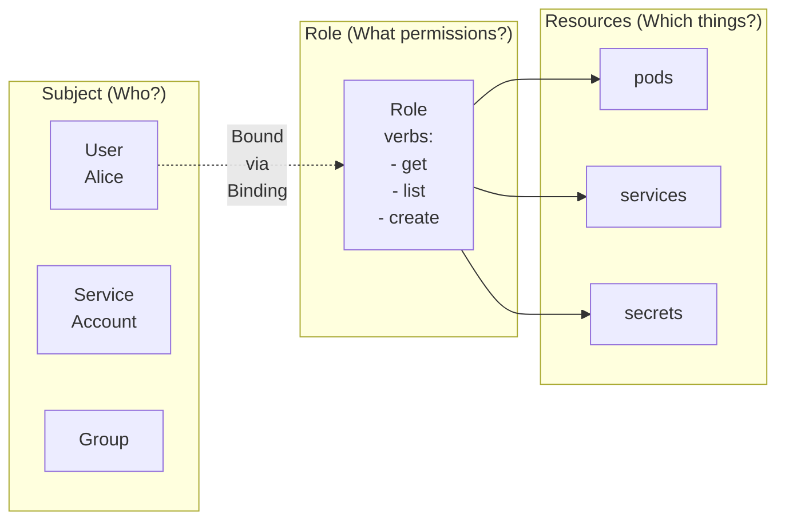

> **Complexity**: `[MEDIUM]` - Common exam topic
>
> **Time to Complete**: 40-50 minutes
>
> **Prerequisites**: Module 1.1 (Control Plane), understanding of namespaces

---

## What You'll Be Able to Do

After completing this module, you will be able to:

- **Design** namespace and cluster RBAC scopes for least-privilege team access.
- **Implement** Roles, ClusterRoles, RoleBindings, ClusterRoleBindings, and ServiceAccount bindings with `kubectl`.
- **Diagnose** Forbidden authorization failures using `kubectl auth can-i`, impersonation, and binding inspection.
- **Evaluate** privilege escalation risks from wildcards, built-in roles, `bind`, `escalate`, `impersonate`, and Secrets access.
- **Compare** RBAC with Node and Webhook authorization modes for specialized security requirements.

---

## Why This Module Matters

Hypothetical scenario: a development platform hosts five product teams in one Kubernetes cluster, with each team isolated by namespace and each deployment pipeline running as its own ServiceAccount. One team asks for permission to restart pods, another asks for read-only access to production logs, and the monitoring stack asks to discover pods across every namespace. If the administrator grants `cluster-admin` because it is fast, the cluster works for the next hour, but every compromised workload and every leaked pipeline token now has a path toward production control.

RBAC is the mechanism that turns those informal requests into precise API permissions. Authentication only answers who made the request; authorization decides whether that identity may perform a verb such as `get`, `create`, or `delete` against a resource such as `pods`, `deployments`, `secrets`, or `rolebindings`. The Certified Kubernetes Administrator exam expects you to make that decision under time pressure, but the same skill matters more in production because RBAC mistakes are quiet until a user is blocked or an attacker is not.

This module teaches RBAC as an operational design tool rather than a pile of YAML. You will build the same four RBAC object kinds used in real clusters, bind them to users, groups, and ServiceAccounts, test the result with impersonation, and reason about built-in roles, aggregation, and escalation controls. The goal is not to memorize every permission string; the goal is to read a Forbidden error and know exactly which scope, subject, role reference, or verb could explain it.

The physical badge analogy is useful as long as you keep the scope clear. A Role or ClusterRole is the badge tier that says which rooms may be entered, while a RoleBinding or ClusterRoleBinding is the assignment that hands that badge tier to a person, group, or workload identity. Kubernetes adds one important twist: a reusable cluster-wide badge definition can be handed out only inside one namespace when a RoleBinding points at a ClusterRole.

## Authorization Pipeline: Who Decides?

Every Kubernetes API request enters the API server with a set of attributes: the authenticated user, optional groups, requested verb, API group, resource, namespace, resource name, and sometimes a non-resource URL such as `/metrics`. Authorization begins only after authentication has identified the caller, so RBAC is not a login system. It is the policy layer that answers whether an already identified subject can perform one requested action.

The API server can run several authorizers, and their order matters. The traditional flag is `--authorization-mode`, with values such as `Node`, `RBAC`, `Webhook`, `ABAC`, `AlwaysAllow`, and `AlwaysDeny`; modern clusters can also use an authorization configuration file. Each authorizer returns allow, deny, or no opinion, and the API server stops once an authorizer gives a definitive answer.

RBAC permissions are additive, which means there is no deny rule you can place in a Role to cancel a permission granted somewhere else. If Alice has one binding that grants `get` on pods and another binding that grants `delete` on pods, Alice has both powers. This additive model keeps evaluation predictable, but it also means least privilege must be designed by granting less, not by granting broadly and trying to subtract later.

Authorization is also separate from admission control. RBAC can decide that a user may create pods, but admission plugins still get a later chance to reject the pod because it violates Pod Security, quota, image policy, or another cluster rule. This distinction matters when you see an error after RBAC appears correct: Forbidden usually points at authorization, while validation or admission messages often point at a later control plane stage.

The dangerous configuration to remember is `AlwaysAllow,RBAC`. Because the first authorizer approves everything, RBAC never gets a useful chance to restrict anything, and the cluster behaves as if authorization were disabled. That detail appears simple, but it is a good exam trap because the flag still contains the word `RBAC`, even though the earlier authorizer has already made the decision.

Node authorization is a special-purpose mode for kubelets, not a general substitute for RBAC. A kubelet credential must identify as `system:node:<nodeName>` and belong to the `system:nodes` group; the Node authorizer then allows the kubelet to read and write only the API objects needed for pods scheduled to that node. In a hardened cluster, Node authorization is paired with the `NodeRestriction` admission plugin, which limits kubelets to their own Node object and their own bound pods.

Webhook authorization delegates the decision to an external HTTP service. That can be useful when a cluster must integrate with a central policy engine or a corporate authorization service, but it also puts a synchronous dependency in the request path. If the webhook is slow, unavailable, or configured with the wrong failure behavior, ordinary API requests can become slow or fail even when the RBAC objects inside the cluster look correct.

Do not confuse Webhook authorization with validating or mutating admission webhooks. Authorization webhooks answer whether a request is allowed at all, before persistence and before admission changes the object. Admission webhooks evaluate the object after authorization has already allowed the operation, which means they are good for policy about object shape but not a replacement for correct RBAC on who may call the API.

Pause and predict: if a cluster runs `Node,RBAC,Webhook`, a kubelet request may be approved by Node authorization before RBAC is consulted, while a human user's namespace request usually falls through to RBAC. What would you expect if every authorizer returns no opinion? The default answer is deny, so a clean Forbidden response often means no configured authorizer found a matching allow.

When you troubleshoot authorization, separate the request path from the policy object. A Forbidden error on `kubectl get pods -n dev` might be caused by a missing RoleBinding, an incorrect subject, a Role in the wrong namespace, or an API group mismatch. A Forbidden error from a kubelet or aggregated API server might instead involve Node or Webhook authorization, so the first diagnostic question is always which identity and which authorizer are actually in play.

## RBAC Objects: Scope, Rules, and API Groups

The RBAC API has four object kinds, all in the `rbac.authorization.k8s.io` API group. Roles and ClusterRoles define permissions, while RoleBindings and ClusterRoleBindings attach those permissions to subjects. Most CKA tasks can be solved by correctly pairing those four objects with the requested namespace and the requested subject identity.

| Resource | Scope | Purpose |
|----------|-------|---------|
| **Role** | Namespace | Grants permissions within a namespace |
| **ClusterRole** | Cluster | Grants permissions cluster-wide |
| **RoleBinding** | Namespace | Binds Role/ClusterRole to subjects in a namespace |
| **ClusterRoleBinding** | Cluster | Binds ClusterRole to subjects cluster-wide |

A Role always belongs to one namespace, and every rule inside that Role is evaluated only for requests in that namespace. A ClusterRole is not namespaced, so it can describe permissions for cluster-scoped resources such as Nodes and PersistentVolumes, or it can define reusable permissions for namespaced resources such as pods and services. The subtle but powerful pattern is using a namespace RoleBinding that points to a ClusterRole, which reuses the ClusterRole's rule set while limiting the grant to the RoleBinding namespace.



Think of a rule as a sentence with three mandatory nouns: API group, resource, and verb. The API group identifies the API family, the resource identifies the object collection or subresource, and the verb identifies the operation. If any part is wrong, the rule may look reasonable to a human while failing to match the actual request the API server is evaluating.

| Verb | Description |
|------|-------------|
| `get` | Read a single resource |
| `list` | List resources (get all) |
| `watch` | Watch for changes |
| `create` | Create new resources |
| `update` | Modify existing resources |
| `patch` | Partially modify resources |
| `delete` | Delete resources |
| `deletecollection` | Delete multiple resources |

The common read-only group is `get`, `list`, and `watch`, and you will see that combination constantly in viewer roles and monitoring roles. Read-write access usually adds `create`, `update`, `patch`, and `delete`, while full control uses `*` for all verbs. Wildcards are convenient in a lab, but in a shared cluster they also grant future verbs and future resources that did not exist when the role was written.

Kubernetes verbs are logical API operations, not always one-to-one shell commands. A command such as `kubectl logs` usually checks a pod log subresource, while `kubectl scale` checks the `scale` subresource for a workload type. When a command fails unexpectedly, translate the command into the resource and subresource the API server sees; otherwise you may keep granting access to the parent resource while the actual subresource remains forbidden.

RBAC includes special administrative verbs that should make you slow down. The `bind` verb controls whether a user can create a binding that references a role whose permissions they do not already possess. The `escalate` verb controls whether a user can create or update a Role or ClusterRole with permissions beyond their own, and `impersonate` allows a caller to act as another user, group, or ServiceAccount for API requests.

```yaml
# role-pod-reader.yaml
apiVersion: rbac.authorization.k8s.io/v1
kind: Role
metadata:
  name: pod-reader
  namespace: default
rules:
  - apiGroups: [""]          # "" = core API group (pods, services, etc.)
    resources: ["pods"]
    verbs: ["get", "list", "watch"]
```

```bash
# Apply the Role
kubectl apply -f role-pod-reader.yaml

# Or create imperatively
kubectl create role pod-reader \
  --verb=get,list,watch \
  --resource=pods \
  -n default
```

This Role is deliberately narrow: it grants read-only access to pods in the `default` namespace and nothing else. It does not grant access to pods in `production`, it does not grant access to Secrets in `default`, and it does not grant access to Nodes because Nodes are cluster-scoped. The API server does not infer related resources; you must name each resource and subresource that the workload or user actually needs.

```yaml
# clusterrole-node-reader.yaml
apiVersion: rbac.authorization.k8s.io/v1
kind: ClusterRole
metadata:
  name: node-reader
rules:
  - apiGroups: [""]
    resources: ["nodes"]
    verbs: ["get", "list", "watch"]
```

```bash
# Apply
kubectl apply -f clusterrole-node-reader.yaml

# Or imperatively
kubectl create clusterrole node-reader \
  --verb=get,list,watch \
  --resource=nodes
```

The ClusterRole is the correct place for Node permissions because Nodes are not namespaced. If you tried to put `nodes` in a Role, the object might be accepted, but the rule cannot authorize a cluster-scoped Node request inside a namespace. That distinction is a common source of exam mistakes because many commands look similar until you ask whether the target resource has a namespace column in `kubectl api-resources`.

Pause and predict: you create a Role with `verbs: ["get", "list"]` for `resources: ["pods"]` in namespace `dev`. Before you test anything, decide whether the user can see pods in `production`, list Nodes, or watch pod changes in `dev`. The correct reasoning is that namespace, resource, and verb must all match, so only `get` and `list` on `dev` pods are allowed.

```yaml
apiVersion: rbac.authorization.k8s.io/v1
kind: Role
metadata:
  name: developer
  namespace: dev
rules:
  # Pods: full access
  - apiGroups: [""]
    resources: ["pods", "pods/log", "pods/exec"]
    verbs: ["*"]

  # Deployments: full access
  - apiGroups: ["apps"]
    resources: ["deployments", "replicasets"]
    verbs: ["*"]

  # Services: create and view
  - apiGroups: [""]
    resources: ["services"]
    verbs: ["get", "list", "create", "delete"]

  # ConfigMaps: read only
  - apiGroups: [""]
    resources: ["configmaps"]
    verbs: ["get", "list"]

  # Secrets: no access (not listed = denied)
```

Multiple rules let you express different permission levels for different API groups without creating a separate Role for every resource. Notice that `pods`, `services`, and `configmaps` use the empty core API group, while `deployments` and `replicasets` use `apps`. Also notice the absence of Secrets: RBAC denies by default when no rule matches, so leaving Secrets out is the least-privilege way to avoid granting them.

The `resourceNames` field can restrict a rule to specific existing object names, such as permitting updates only to a ConfigMap called `frontend-config`. That can be useful for leader election leases, approved maintenance objects, or a narrow automation account. It cannot restrict top-level `create` requests, because the object name might not exist at authorization time, and it cannot restrict `deletecollection` in a useful object-specific way.

ClusterRoles have one additional feature that Roles do not: `nonResourceURLs`. These permissions apply to API server paths that are not Kubernetes objects, such as `/healthz`, `/livez`, `/readyz`, or `/metrics`. Because non-resource URLs are not namespaced, a namespace Role cannot grant them, and the correct design is a ClusterRole bound at the cluster level or narrowly to the identity that needs that endpoint.

Named resources are another place where request shape matters. If you restrict a rule with `resourceNames`, a request that lists a collection must include a field selector for the matching name, because the API server cannot authorize an unrestricted list against one allowed object name. That makes `resourceNames` useful for very specific automation, but awkward for humans who expect ordinary list and watch commands to work without extra selectors.

| API Group | Resources |
|-----------|-----------|
| `""` (core) | pods, services, configmaps, secrets, namespaces, nodes, persistentvolumes |
| `apps` | deployments, replicasets, statefulsets, daemonsets |
| `batch` | jobs, cronjobs |
| `networking.k8s.io` | networkpolicies, ingresses |
| `rbac.authorization.k8s.io` | roles, clusterroles, rolebindings, clusterrolebindings |
| `storage.k8s.io` | storageclasses, volumeattachments |

```bash
# Find the API group for any resource
kubectl api-resources | grep deployment
# NAME         SHORTNAMES   APIVERSION   NAMESPACED   KIND
# deployments  deploy       apps/v1      true         Deployment
#                           ^^^^
#                           API group is "apps"
```

Before running this in an exam environment, predict the group you expect to see and then verify it with `kubectl api-resources`. This habit prevents one of the most common RBAC failures: granting `apiGroups: [""]` for a resource that actually lives in `apps`, `batch`, or another named API group. The core API group is the empty string `""`, not `"core"`, which is why YAML examples quote the empty value explicitly.

## Bindings, Subjects, and Workload Identity

RBAC subjects are the identities that receive permissions. A subject can be a User, a Group, or a ServiceAccount; Kubernetes itself does not store ordinary User objects, so those names come from the authentication layer. ServiceAccounts are Kubernetes API objects, and because they are namespaced, a ServiceAccount subject must include both `name` and `namespace`.

```yaml
# rolebinding-alice-pod-reader.yaml
apiVersion: rbac.authorization.k8s.io/v1
kind: RoleBinding
metadata:
  name: alice-pod-reader
  namespace: default
subjects:
  - kind: User
    name: alice
    apiGroup: rbac.authorization.k8s.io
roleRef:
  kind: Role
  name: pod-reader
  apiGroup: rbac.authorization.k8s.io
```

```bash
# Imperative command
kubectl create rolebinding alice-pod-reader \
  --role=pod-reader \
  --user=alice \
  -n default
```

This RoleBinding grants Alice the `pod-reader` Role only in the `default` namespace. A RoleBinding is namespaced even when its subject is a cluster-wide concept such as a user or group name. If Alice later needs the same access in `staging`, you create another RoleBinding in `staging` or use a carefully chosen ClusterRoleBinding if the access truly must span every namespace.

The `roleRef` field is intentionally stable once a binding is created. In practice, if a binding points at the wrong role, deleting and recreating the binding is clearer than trying to morph one grant into another. That behavior supports auditability: changing who receives a role is different from changing which role is being granted, and review tooling can treat those operations as separate security events.

```yaml
# clusterrolebinding-bob-node-reader.yaml
apiVersion: rbac.authorization.k8s.io/v1
kind: ClusterRoleBinding
metadata:
  name: bob-node-reader
subjects:
  - kind: User
    name: bob
    apiGroup: rbac.authorization.k8s.io
roleRef:
  kind: ClusterRole
  name: node-reader
  apiGroup: rbac.authorization.k8s.io
```

```bash
# Imperative command
kubectl create clusterrolebinding bob-node-reader \
  --clusterrole=node-reader \
  --user=bob
```

A ClusterRoleBinding is intentionally broad. It binds a ClusterRole across the cluster, which is necessary for cluster-scoped resources such as Nodes, but risky when the ClusterRole describes namespaced resources such as pods. If you bind `view` with a ClusterRoleBinding, the subject can view allowed resources in every namespace, not just one team namespace.

```yaml
apiVersion: rbac.authorization.k8s.io/v1
kind: RoleBinding
metadata:
  name: dev-team-access
  namespace: development
subjects:
  # Bind to a user
  - kind: User
    name: alice
    apiGroup: rbac.authorization.k8s.io

  # Bind to a group
  - kind: Group
    name: developers
    apiGroup: rbac.authorization.k8s.io

  # Bind to a ServiceAccount
  - kind: ServiceAccount
    name: cicd-deployer
    namespace: development
roleRef:
  kind: Role
  name: developer
  apiGroup: rbac.authorization.k8s.io
```

One binding can contain multiple subjects, but the operational tradeoff is audit clarity. A binding named `dev-team-access` that grants a team group and a pipeline account may be convenient, but it also means future reviewers must inspect the subject list carefully to understand who has the grant. In regulated environments, separate bindings for humans and workloads often make access review easier, even when they point to the same role reference.

Stop and think: you need to give a developer read-only access to pods in `staging` but not `production`. You can create a `pod-reader` Role in `staging` and bind it there, or create a reusable ClusterRole and bind that ClusterRole with a RoleBinding in `staging`. The second approach is more maintainable when many namespaces need the same rules, while the RoleBinding still keeps the actual grant namespace-scoped.

```yaml
# Use the built-in "edit" ClusterRole in the "production" namespace only
apiVersion: rbac.authorization.k8s.io/v1
kind: RoleBinding
metadata:
  name: alice-edit-production
  namespace: production
subjects:
  - kind: User
    name: alice
    apiGroup: rbac.authorization.k8s.io
roleRef:
  kind: ClusterRole     # Using ClusterRole
  name: edit            # Built-in ClusterRole
  apiGroup: rbac.authorization.k8s.io

# Alice can edit resources in "production" namespace only
```

That example is the reusable ClusterRole pattern in its most compact form. The `edit` ClusterRole is cluster-scoped as an object, but the RoleBinding exists in `production`, so the effective permission applies only inside `production`. This is the pattern you should reach for when many namespaces share one permission profile but each namespace has different users, groups, or ServiceAccounts.

ServiceAccounts provide identity for pods and controllers. A pod that does not set `.spec.serviceAccountName` is assigned the `default` ServiceAccount in its namespace by the ServiceAccount admission controller, and modern Kubernetes mounts short-lived projected tokens by default when token automounting is enabled. That default identity usually has very little permission, but it is still an identity you should account for in RBAC design.

```bash
# List ServiceAccounts
kubectl get serviceaccounts
kubectl get sa

# Every namespace has a "default" ServiceAccount
kubectl get sa default -o yaml
```

```bash
# Create a ServiceAccount
kubectl create serviceaccount myapp-sa

# Or with YAML
cat > myapp-sa.yaml << 'EOF'
apiVersion: v1
kind: ServiceAccount
metadata:
  name: myapp-sa
  namespace: default
EOF
kubectl apply -f myapp-sa.yaml
```

Creating a dedicated ServiceAccount is the workload equivalent of issuing a dedicated badge instead of letting every process share the building's default visitor pass. It gives you one place to bind permissions, one identity to audit, and one name to use when a Forbidden error reports `system:serviceaccount:<namespace>:<name>`. It also keeps application permissions separate from deployment pipeline permissions, which should usually be different identities.

ServiceAccount token mounting is a separate design decision from RBAC grants. A pod can have a ServiceAccount name for image pull secrets or identity conventions while setting token automounting off when it never calls the Kubernetes API. Reducing token exposure does not replace RBAC, but it shrinks the value of a compromised container because there may be no API credential available to reuse.

```bash
# Create a Role
kubectl create role pod-reader \
  --verb=get,list,watch \
  --resource=pods

# Bind it to the ServiceAccount
kubectl create rolebinding myapp-pod-reader \
  --role=pod-reader \
  --serviceaccount=default:myapp-sa
#                  ^^^^^^^^^^^^^^^^^
#                  namespace:name format
```

```yaml
apiVersion: v1
kind: Pod
metadata:
  name: myapp
spec:
  serviceAccountName: myapp-sa    # Use this ServiceAccount
  containers:
  - name: myapp
    image: nginx
```

The important diagnostic detail is the ServiceAccount namespace. A RoleBinding in `production` can bind a ServiceAccount from `cicd`, but the subject must explicitly say `namespace: cicd`; otherwise the binding may point at the wrong identity or at a ServiceAccount that is not used by the pod. When a pipeline reports Forbidden, compare the pod's ServiceAccount name with the RoleBinding subject before you rewrite the Role itself.

## Built-In Roles, Aggregation, and Escalation Guards

Kubernetes installs default ClusterRoles and ClusterRoleBindings so core components and common user-facing access patterns work immediately. Some names begin with `system:`, which signals control-plane ownership and should discourage manual edits. Other names, such as `cluster-admin`, `admin`, `edit`, and `view`, are intended for administrators to bind to users, groups, or ServiceAccounts with careful scope.

| ClusterRole | Permissions |
|-------------|-------------|
| `cluster-admin` | Full access to everything (superuser) |
| `admin` | Full access within a namespace |
| `edit` | Read/write most resources, no RBAC |
| `view` | Read-only access to most resources |

The `cluster-admin` role is the superuser role, and a ClusterRoleBinding to it is effectively full cluster control. The `admin` role is normally granted through a RoleBinding in a namespace, where it gives broad namespace administration without granting cluster-scoped resource control. The `edit` role allows most namespace object changes but avoids RBAC objects, while `view` is read-only and intentionally avoids Secrets because readable Secrets often mean usable credentials.

The built-in names are convenient, but their security meaning depends on the other identities in the namespace. For example, a subject with broad pod creation rights may be able to create a pod that uses a powerful ServiceAccount already present in the namespace, even if the subject cannot edit RBAC objects directly. That is why namespace administration is not only about verbs on resources; it also includes reviewing existing ServiceAccounts, Secrets, and admission controls.

```bash
# See all built-in ClusterRoles
kubectl get clusterroles | grep -v "^system:"

# Inspect a ClusterRole
kubectl describe clusterrole edit
```

The API server auto-reconciles default RBAC objects at startup when RBAC is active. If a default ClusterRole is missing a required rule or a default binding is missing a required subject, Kubernetes restores the missing piece so core components keep working across upgrades. That behavior protects the control plane, but it also means you should not treat manual edits to `system:` roles as a durable customization mechanism.

ClusterRole aggregation is the extension point behind the built-in `admin`, `edit`, and `view` roles. A ClusterRole can define an `aggregationRule` that selects other ClusterRoles by label, and a controller copies the selected rules into the aggregate role. The standard labels follow the pattern `rbac.authorization.k8s.io/aggregate-to-<clusterrole-name>: "true"`, which lets custom resource providers add read or edit rules to the familiar user-facing roles.

```bash
# Give alice admin access to namespace "myapp"
kubectl create rolebinding alice-admin \
  --clusterrole=admin \
  --user=alice \
  -n myapp

# Give bob view access to namespace "production"
kubectl create rolebinding bob-view \
  --clusterrole=view \
  --user=bob \
  -n production
```

Aggregation is useful, but it is also a place where a small label can have wide impact. A ClusterRole labeled to aggregate into `view` may grant every subject with `view` access to a new custom resource, while a label aggregating into `edit` may grant mutation across many namespaces where `edit` is bound. Review aggregation labels with the same seriousness you would apply to direct bindings.

Kubernetes includes explicit escalation prevention for RBAC administration. A user can create or update a Role or ClusterRole only if they already have every permission contained in the new role, unless they have the special `escalate` verb for that RBAC resource type. Similarly, a user can create or update a binding only if they already hold the referenced role's permissions at the relevant scope, unless they have the `bind` verb for that role.

That guard prevents a namespace developer from granting themselves `cluster-admin` just because they can create RoleBindings. It also explains why RBAC administration sometimes fails in surprising ways: the caller may have permission to create the `rolebindings` resource, but not permission to bind the powerful ClusterRole named in `roleRef`. When diagnosing this case, inspect both the permission to create bindings and the caller's authority to bind the referenced role.

Privilege escalation prevention applies at the API server, so it protects both declarative manifests and imperative `kubectl create rolebinding` commands. A GitOps controller, package installer, or human operator still presents an identity, and that identity must be authorized for the role or binding it is trying to create. When an installation guide asks for `bind` or `escalate`, treat that as a platform security decision rather than a routine namespace permission.

The `impersonate` verb belongs in the same mental category because it lets a subject ask the API server to evaluate requests as another user, group, or ServiceAccount. Administrators use impersonation for testing and support, but broad impersonation is equivalent to broad delegated access. If a user can impersonate `system:masters` or a privileged ServiceAccount, the cluster will evaluate their later requests as that stronger identity.

## Testing and Debugging Permissions

RBAC troubleshooting should be systematic because many failures look identical at the command line. A Forbidden message usually includes the user, verb, resource, API group, and namespace, and those fields are the fastest route to the broken object. If the error says Alice cannot list `pods` in API group `""` in namespace `default`, do not start with Deployments or ClusterRoles for Nodes; start with pod list permissions in that namespace.

What would happen if you create two RoleBindings in the same namespace, one granting `get` on pods and one granting `delete` on pods? The user receives both permissions because RBAC is additive. If you wanted to prevent `delete`, you would remove the binding or avoid granting a role that includes `delete`; you would not add a deny rule, because RBAC has no deny rule.

The `kubectl auth can-i` command wraps Kubernetes authorization review APIs, including self reviews and impersonated checks. It is not a substitute for reading the Role and binding YAML, but it tells you what the API server would decide for a specific request. Use it before and after a change so you can distinguish "policy not applied" from "policy applied but still wrong."

```bash
# Check your own permissions
kubectl auth can-i create pods
kubectl auth can-i delete deployments
kubectl auth can-i '*' '*'  # Am I admin?

# Check in a specific namespace
kubectl auth can-i create pods -n production

# Check for another user (requires admin)
kubectl auth can-i create pods --as=alice
kubectl auth can-i delete nodes --as=bob

# Check for a ServiceAccount
kubectl auth can-i list secrets --as=system:serviceaccount:default:myapp-sa
```

Impersonation checks require permission to impersonate the target identity, so a failure to run the diagnostic can itself be an RBAC problem. In an exam cluster you often operate as an administrator and can use `--as` freely; in production, support roles may need narrowly scoped impersonation to test ServiceAccounts without receiving their actual tokens. Always make the impersonated namespace explicit for ServiceAccounts by using the full `system:serviceaccount:<namespace>:<name>` string.

```bash
# What can I do in this namespace?
kubectl auth can-i --list

# What can alice do?
kubectl auth can-i --list --as=alice

# What can a ServiceAccount do?
kubectl auth can-i --list --as=system:serviceaccount:default:myapp-sa
```

The list form is useful for broad audits, but it can be noisy because permissions from several bindings are merged. A focused check such as `kubectl auth can-i get secrets -n production --as=...` is better when you have a single expected action. Use the list form when you suspect a wildcard, built-in role, or ClusterRoleBinding has granted more than intended.

Rules reviews also have a blind spot: they show the effective permissions the API server can summarize, not necessarily the organizational reason those permissions exist. If a user inherits access through several groups, the output may tell you that `delete pods` is allowed without naming the ticket, team, or business owner behind the grant. Pair command output with binding inspection and your identity provider's group membership when you perform a real access review.

```bash
# Error: pods is forbidden
kubectl get pods
# Error: User "alice" cannot list resource "pods" in API group "" in namespace "default"

# Debug steps:
# 1. Check what permissions the user has
kubectl auth can-i --list --as=alice

# 2. Check what roles are bound to the user
kubectl get rolebindings -A -o wide | grep alice
kubectl get clusterrolebindings -o wide | grep alice

# 3. Check the role's rules
kubectl describe role <role-name> -n <namespace>
kubectl describe clusterrole <clusterrole-name>
```

Exercise scenario: a CI/CD pipeline cannot deploy to `production`, and `kubectl auth can-i create deployments -n production --as=system:serviceaccount:cicd:pipeline` returns `no`. The likely search path is subject namespace, RoleBinding namespace, Role API group, and deployment resource spelling. If the RoleBinding lives in `production` but the subject accidentally says `namespace: production`, the binding points at `system:serviceaccount:production:pipeline`, not the real pipeline identity in `cicd`.

Kubernetes 1.35 and newer deserve special attention for streaming subresources used by `exec`, `attach`, and `port-forward`. These operations open a connection to a pod subresource, and modern authorization expects `create` permission on subresources such as `pods/exec`, `pods/attach`, and `pods/portforward`. A legacy role that only granted `get` on `pods/exec` can produce confusing failures after an upgrade because ordinary pod reads still work.

The safest way to update those streaming permissions is to treat them as interactive access, not as ordinary viewing. A user who can exec into a container may read environment variables, inspect mounted files, and run commands with the container's Linux permissions. Granting `pods/exec` should therefore be closer to granting shell access than granting `pods/log`, and it deserves a separate role when only a subset of responders need it.

```yaml
# OLD (broken in 1.35+):
- apiGroups: [""]
  resources: ["pods/exec"]
  verbs: ["get"]

# FIXED:
- apiGroups: [""]
  resources: ["pods/exec", "pods/attach", "pods/portforward"]
  verbs: ["get", "create"]
```

Exam scenarios usually combine scope and subject mistakes rather than exotic authorizer behavior. Work through the target action first: who is calling, what verb is requested, which API group and resource are involved, and whether the resource is namespaced. Once you can say that sentence clearly, the required Role, ClusterRole, RoleBinding, or ClusterRoleBinding often becomes obvious.

```bash
# Create namespace
kubectl create namespace development

# Create ServiceAccount
kubectl create serviceaccount developer -n development

# Bind edit ClusterRole (read/write most resources)
kubectl create rolebinding developer-edit \
  --clusterrole=edit \
  --serviceaccount=development:developer \
  -n development
```

This developer access scenario uses the built-in `edit` ClusterRole through a namespace RoleBinding. The grant is broad inside `development`, so it is acceptable for a training namespace or a trusted development sandbox, but it would be too broad for a controller that only updates Deployments. The design question is not whether `edit` works; the question is whether its included resources match the risk of the identity receiving it.

```bash
# ServiceAccount for monitoring tools
kubectl create serviceaccount monitoring -n monitoring

# Cluster-wide read access
kubectl create clusterrolebinding monitoring-view \
  --clusterrole=view \
  --serviceaccount=monitoring:monitoring
```

The monitoring scenario uses a ClusterRoleBinding because the ServiceAccount needs read access across namespaces. This is still less dangerous than `cluster-admin`, but it is not automatically perfect because `view` includes many readable resources. A stricter production design may create a custom ClusterRole for only pods, nodes, namespaces, and metrics-related resources the monitoring tool actually uses.

```bash
# Create role for deployments only
kubectl create role deployer \
  --verb=get,list,watch,create,update,patch,delete \
  --resource=deployments,services,configmaps \
  -n production

# Bind to CI/CD ServiceAccount
kubectl create rolebinding cicd-deployer \
  --role=deployer \
  --serviceaccount=cicd:pipeline \
  -n production
```

The CI/CD example intentionally binds a ServiceAccount from `cicd` into the `production` namespace. That is a valid cross-namespace subject grant because the RoleBinding's namespace controls where the permission applies, while the subject namespace identifies which ServiceAccount receives it. If the pipeline also needs to create Jobs in `batch`, the Role needs the correct API group and resource rather than a broader binding.

```bash
# Task: Create a Role that can get, list, and watch pods and services in namespace "app"

kubectl create role app-reader \
  --verb=get,list,watch \
  --resource=pods,services \
  -n app

# Task: Bind the role to user "john"
kubectl create rolebinding john-app-reader \
  --role=app-reader \
  --user=john \
  -n app

# Verify
kubectl auth can-i get pods -n app --as=john
# yes
kubectl auth can-i delete pods -n app --as=john
# no
```

That quick creation pattern is exam-friendly because it proves both the positive and negative cases. A single `yes` can hide an overbroad role, while a paired `no` confirms that the role did not accidentally include mutation. When time allows, test the namespace boundary too, because many RBAC mistakes come from creating a correct Role in the wrong namespace.

```bash
# Task: Create ServiceAccount "dashboard" that can list pods across all namespaces

kubectl create serviceaccount dashboard -n kube-system

kubectl create clusterrole pod-list \
  --verb=list \
  --resource=pods

kubectl create clusterrolebinding dashboard-pod-list \
  --clusterrole=pod-list \
  --serviceaccount=kube-system:dashboard
```

The dashboard scenario needs cluster-wide access to a namespaced resource, so a ClusterRoleBinding is appropriate. The ClusterRole itself is intentionally small: it grants `list` on pods, not `get` on Secrets, not `delete` on workloads, and not broad `view` unless the dashboard truly needs every resource that `view` includes. This is the kind of minimal custom role that turns RBAC from a checkbox into a security control.

## Patterns & Anti-Patterns

Use reusable ClusterRoles with namespace RoleBindings when many namespaces need the same permission profile but different subjects. This pattern gives you one rule set to maintain and many scoped grants to audit. It works especially well for team developer roles, read-only support roles, and namespace-local automation that should behave consistently across environments.

Use dedicated ServiceAccounts per workload or automation boundary. A deployment controller, monitoring scraper, and interactive debug pod have different reasons to call the API, so they should not share the `default` ServiceAccount. Dedicated identities make Forbidden errors easier to read and make it possible to revoke one workload's permissions without breaking every pod in the namespace.

Use `kubectl auth can-i` as a design test, not only as a break-glass diagnostic. After creating a role, test at least one expected allow, one expected deny, and one namespace boundary. That habit catches the common mistakes where a role grants the right resource but the binding targets the wrong subject, or where a ClusterRoleBinding accidentally turns a namespace requirement into a cluster-wide grant.

Avoid binding `cluster-admin` to application ServiceAccounts. Teams often do this when a controller fails during installation and the chart's documentation suggests a broad role for convenience. The better alternative is to inspect the controller's actual API calls, start with read-only discovery if needed, and add only the resources and verbs required for reconciliation.

Avoid wildcard rules for long-lived production identities unless you have a deliberate platform-level reason. A wildcard on verbs or resources grants future API surface as the cluster evolves, including CRDs installed later. If you need a temporary wildcard for diagnosis, record it as temporary work, remove it quickly, and replace it with explicit verbs and resources before considering the incident closed.

Avoid editing `system:` ClusterRoles by hand. Auto-reconciliation may restore missing default permissions, and an incorrect change can break control-plane components before it is reverted. If you need to extend user-facing roles for custom resources, use ClusterRole aggregation labels; if you need a platform-specific component role, create a separate named ClusterRole and bind it explicitly.

Avoid treating RBAC as a network security boundary. RBAC controls API server actions, not pod-to-pod traffic, process privileges inside a container, or filesystem access inside a mounted volume. Pair it with NetworkPolicy, Pod Security, admission controls, image policy, and secret management, because a pod with no RBAC permission can still do damage through other paths if those layers are absent.

## Decision Framework

Start every RBAC decision by writing the request sentence: subject, verb, API group, resource, namespace, and resource name if relevant. For example, `system:serviceaccount:cicd:pipeline` needs `create` on `deployments.apps` in `production`. That sentence tells you whether the role must be namespaced, whether the binding must cross a ServiceAccount namespace, and whether a built-in role is too broad.

Choose a Role when the permission is unique to one namespace and unlikely to be reused. Choose a ClusterRole when the permission touches cluster-scoped resources, non-resource URLs, or a reusable permission profile for namespaced resources. Choose a RoleBinding when the grant should apply in one namespace, even if the referenced role is a ClusterRole, and choose a ClusterRoleBinding only when the grant must apply cluster-wide.

When the subject is a human, prefer group bindings from the authentication provider over many individual user bindings. Group bindings let identity management systems handle joiner and leaver workflows while Kubernetes keeps a stable policy object. Individual user bindings are still useful for exam tasks, short-lived break-glass access, and small clusters, but they age poorly when teams change.

When the subject is a workload, bind the exact ServiceAccount used by the pod or controller. Do not assume a RoleBinding in the target namespace automatically points at a ServiceAccount in that namespace or in the pipeline namespace. The subject namespace identifies the identity; the binding namespace identifies where a Role or namespaced grant applies.

When the request involves `pods/exec`, `pods/attach`, `pods/portforward`, `pods/log`, `deployments/scale`, or any other subresource, name the subresource explicitly. Subresources are separate authorization targets because they expose different capabilities than ordinary object reads. In Kubernetes 1.35 and newer, remember that streaming connection subresources need `create` for the interactive operation, not only a read verb on pods.

When an existing built-in role looks close, inspect it before binding it. The `view` role avoids Secrets, `edit` can mutate many namespace resources and may allow pods to run as powerful ServiceAccounts, and `admin` is broader still inside a namespace. The correct decision is based on the caller's operational task, not on the friendly name of the built-in role.

## Did You Know?

1. RBAC entered beta in Kubernetes v1.6 and reached general availability in Kubernetes v1.8, released in October 2017.
2. The RBAC API uses four object kinds: Role, ClusterRole, RoleBinding, and ClusterRoleBinding.
3. ServiceAccount token behavior changed significantly after Kubernetes v1.24, with short-lived projected tokens replacing automatic long-lived Secret tokens for ordinary pods.
4. Node authorization is a special-purpose kubelet authorizer, and the Kubernetes documentation marks it stable as of Kubernetes v1.34.

## Common Mistakes

| Mistake | Why It Happens | How to Fix It |
|---------|----------------|---------------|
| Wrong `apiGroup` | The Role looks correct, but the request uses another API group | Check `kubectl api-resources` and use `apps` for Deployments, `batch` for Jobs, and `""` for core resources |
| Missing namespace in binding | The binding is created in the wrong namespace or grants access somewhere unexpected | Always verify `-n <namespace>` on RoleBindings and test the intended namespace with `kubectl auth can-i` |
| Forgetting ServiceAccount namespace | The RoleBinding subject points at the wrong workload identity | Use the strict `namespace:name` format in commands and the `namespace:` field in YAML subjects |
| Using Role for cluster resources | Namespaced Roles cannot authorize requests for Nodes, PersistentVolumes, or non-resource URLs | Use a ClusterRole for cluster-scoped resources and bind it with the narrowest suitable binding |
| Empty apiGroup not quoted | YAML or review tooling hides the difference between core and named API groups | Use `apiGroups: [""]` with explicit quotes for core resources |
| Missing `create` verb on exec/attach subresources | Kubernetes 1.35+ streaming authorization requires more than old `get`-only rules | Add `create` to `pods/exec`, `pods/attach`, and `pods/portforward` rules when interactive access is intended |
| Overly broad `cluster-admin` | Teams use the fastest grant to make a controller or dashboard work | Replace it with a custom ClusterRole, then test expected allows and denies |
| Using `AlwaysAllow,RBAC` | The flag mentions RBAC, but the earlier authorizer approves everything first | Remove `AlwaysAllow` from production authorization chains and verify the active API server configuration |

## Quiz

<details>
<summary>1. Your company has five development teams, each with its own namespace. All teams need read/write Deployments, Services, and ConfigMaps, but no Secrets. What is the most maintainable RBAC design?</summary>

Create one reusable ClusterRole that grants the shared namespaced resource permissions, then create a RoleBinding in each namespace that references that ClusterRole and targets the right team group. The ClusterRole centralizes the rule set, while each RoleBinding keeps the grant namespace-scoped. Five separate Roles can work, but they create drift when the permission profile changes. A ClusterRoleBinding would be too broad because it would grant the permissions across all namespaces at once.
</details>

<details>
<summary>2. A CI/CD ServiceAccount in `cicd` needs to create Deployments in `production`, but `kubectl auth can-i` returns `no`. The Role exists in `production`. What do you inspect first?</summary>

Inspect the RoleBinding in `production`, especially the ServiceAccount subject namespace and the Role's API group. The subject should identify `namespace: cicd` and `name: pipeline`, while the Role rule for Deployments should use `apiGroups: ["apps"]`. If the subject namespace is omitted or set to `production`, the binding points at a different identity. If the API group is `""`, the rule does not match Deployments.
</details>

<details>
<summary>3. A monitoring ServiceAccount has a ClusterRoleBinding to `cluster-admin`, but it only needs to read pod and node information. How do you evaluate and replace that risk?</summary>

`cluster-admin` gives the monitoring pod full control over RBAC, Secrets, workloads, and cluster-scoped objects, so compromise of the monitoring pod becomes cluster compromise. Replace it with a custom ClusterRole that grants only the needed read verbs and resources, then bind that ClusterRole to the monitoring ServiceAccount. Test with `kubectl auth can-i --as=system:serviceaccount:monitoring:monitoring` for required and forbidden actions. This evaluates privilege escalation risk from built-in roles and overly broad bindings.
</details>

<details>
<summary>4. After upgrading to Kubernetes 1.35+, a developer can list pods but cannot run `kubectl exec`. Their Role has `get`, `list`, and `watch` on pods and `pods/exec`. What changed?</summary>

Interactive streaming subresources such as `pods/exec`, `pods/attach`, and `pods/portforward` require `create` permission for the connection operation in Kubernetes 1.35 and newer. Listing pods still works because ordinary pod reads are separate authorization checks. Add `create` to the relevant subresource rule while keeping the grant scoped to the intended namespace. Do not fix this by granting broad `edit` or `cluster-admin` unless the user truly needs those wider permissions.
</details>

<details>
<summary>5. A user receives Forbidden when accessing `/metrics` through the API server, and you find a namespace Role granting `get` on that path. Why does it fail?</summary>

`/metrics` is a non-resource URL, not a namespaced Kubernetes object. Roles cannot grant `nonResourceURLs`; that field belongs on ClusterRoles because the path is cluster-level API server surface. Create a ClusterRole with `nonResourceURLs: ["/metrics"]` and `verbs: ["get"]`, then bind it to the exact subject that needs metrics access. Keep the binding narrow because metrics endpoints can expose operational detail.
</details>

<details>
<summary>6. A developer can create RoleBindings but cannot bind the built-in `admin` ClusterRole. What RBAC escalation guard is blocking the request?</summary>

Kubernetes checks whether the caller already holds the permissions in the referenced role at the relevant scope, or whether the caller has the special `bind` verb for that role. Permission to create the `rolebindings` resource alone is not enough to bind a more powerful role. This prevents a user from escalating by binding themselves to `admin` or `cluster-admin`. The safe fix is to grant a narrow `bind` permission only for the roles that user is allowed to delegate.
</details>

<details>
<summary>7. You must compare RBAC, Node, and Webhook authorization for a new platform requirement. Which mode handles ordinary team access, which handles kubelet requests, and which delegates to an external service?</summary>

RBAC handles ordinary team, workload, namespace, and cluster resource permissions through Kubernetes API objects. Node authorization is for kubelet API requests and should be paired with NodeRestriction so kubelets remain tied to their own node and scheduled pods. Webhook authorization delegates the decision to an external HTTP service, which is useful for specialized policy integration but adds a synchronous dependency to API requests. A strong design uses each mode for the request class it was built to evaluate.
</details>

## Hands-On Exercise

In this exercise, you will build a namespace-local development identity, prove what it can and cannot do, then extend the pattern with several short practice drills. The commands assume you have a Kubernetes v1.35 or newer cluster available and that your current kubeconfig identity can create RBAC objects for the lab. If you are using a shared cluster, use temporary namespaces and run the cleanup commands.

### Main Task: Development Team RBAC

1. Create the namespace that will hold the workload identity.

```bash
kubectl create namespace dev-team
```

2. Create a dedicated ServiceAccount instead of using the namespace default.

```bash
kubectl create serviceaccount dev-sa -n dev-team
```

3. Create a Role for day-to-day developer actions in this namespace.

```bash
kubectl create role developer \
  --verb=get,list,watch,create,update,delete \
  --resource=pods,deployments,services,configmaps \
  -n dev-team
```

4. Bind the Role to the dedicated ServiceAccount.

```bash
kubectl create rolebinding dev-sa-developer \
  --role=developer \
  --serviceaccount=dev-team:dev-sa \
  -n dev-team
```

5. Test expected allows and denies before running a pod.

```bash
# Test as the ServiceAccount
kubectl auth can-i get pods -n dev-team \
  --as=system:serviceaccount:dev-team:dev-sa
# yes

kubectl auth can-i delete pods -n dev-team \
  --as=system:serviceaccount:dev-team:dev-sa
# yes

kubectl auth can-i get secrets -n dev-team \
  --as=system:serviceaccount:dev-team:dev-sa
# no (we didn't grant access to secrets)

kubectl auth can-i get pods -n default \
  --as=system:serviceaccount:dev-team:dev-sa
# no (role only applies in dev-team namespace)
```

6. Create a pod that uses the ServiceAccount and wait for it to become ready.

```bash
cat > dev-pod.yaml << 'EOF'
apiVersion: v1
kind: Pod
metadata:
  name: dev-shell
  namespace: dev-team
spec:
  serviceAccountName: dev-sa
  containers:
  - name: shell
    image: bitnami/kubectl
    command: ["sleep", "infinity"]
EOF

kubectl apply -f dev-pod.yaml

# Wait for the pod to be running
kubectl wait --for=condition=Ready pod/dev-shell -n dev-team --timeout=60s
```

7. Test from inside the pod so you see the permissions attached to the running workload identity.

```bash
kubectl exec dev-shell -n dev-team -- kubectl get pods              # Should work
kubectl exec dev-shell -n dev-team -- kubectl get secrets           # Should fail (forbidden)
kubectl exec dev-shell -n dev-team -- kubectl get pods -n default   # Should fail (forbidden)
```

8. Add read-only cluster access as a deliberate extension, then verify the scope change.

```bash
kubectl create clusterrolebinding dev-sa-view \
  --clusterrole=view \
  --serviceaccount=dev-team:dev-sa

# Now the ServiceAccount can read resources cluster-wide
kubectl auth can-i get pods -n default \
  --as=system:serviceaccount:dev-team:dev-sa
# yes (but read-only)
```

9. Clean up the lab resources.

```bash
kubectl delete namespace dev-team
kubectl delete clusterrolebinding dev-sa-view
rm dev-pod.yaml
```

### Practice Drills

Run these drills after the main task if you want CKA-style speed and troubleshooting practice. Each drill is intentionally short, but the reasoning should stay the same: identify the subject, choose the narrowest role scope, bind at the intended scope, then test both an allow and a deny.

#### Drill 1: RBAC Speed Test

```bash
# Create namespace
kubectl create ns rbac-drill

# Create ServiceAccount
kubectl create sa drill-sa -n rbac-drill

# Create Role (read pods)
kubectl create role pod-reader --verb=get,list,watch --resource=pods -n rbac-drill

# Create RoleBinding
kubectl create rolebinding drill-binding --role=pod-reader --serviceaccount=rbac-drill:drill-sa -n rbac-drill

# Test
kubectl auth can-i get pods -n rbac-drill --as=system:serviceaccount:rbac-drill:drill-sa

# Cleanup
kubectl delete ns rbac-drill
```

#### Drill 2: Permission Testing

```bash
kubectl create ns perm-test
kubectl create sa test-sa -n perm-test

# Create limited role
kubectl create role limited --verb=get,list --resource=pods,services -n perm-test
kubectl create rolebinding limited-binding --role=limited --serviceaccount=perm-test:test-sa -n perm-test

# Test various permissions
echo "=== Testing as test-sa ==="
kubectl auth can-i get pods -n perm-test --as=system:serviceaccount:perm-test:test-sa      # yes
kubectl auth can-i create pods -n perm-test --as=system:serviceaccount:perm-test:test-sa   # no
kubectl auth can-i get secrets -n perm-test --as=system:serviceaccount:perm-test:test-sa   # no
kubectl auth can-i get pods -n default --as=system:serviceaccount:perm-test:test-sa        # no
kubectl auth can-i get services -n perm-test --as=system:serviceaccount:perm-test:test-sa  # yes

# Cleanup
kubectl delete ns perm-test
```

#### Drill 3: ClusterRole vs Role

```bash
# Create namespaces
kubectl create ns ns-a
kubectl create ns ns-b
kubectl create sa cross-ns-sa -n ns-a

# Option 1: Role (namespace-scoped) - only works in ns-a
kubectl create role ns-a-reader --verb=get,list --resource=pods -n ns-a
kubectl create rolebinding ns-a-binding --role=ns-a-reader --serviceaccount=ns-a:cross-ns-sa -n ns-a

# Test
kubectl auth can-i get pods -n ns-a --as=system:serviceaccount:ns-a:cross-ns-sa  # yes
kubectl auth can-i get pods -n ns-b --as=system:serviceaccount:ns-a:cross-ns-sa  # no

# Option 2: ClusterRole + RoleBinding (still namespace-scoped binding)
kubectl create clusterrole pod-reader-cluster --verb=get,list --resource=pods
kubectl create rolebinding ns-b-binding -n ns-b --clusterrole=pod-reader-cluster --serviceaccount=ns-a:cross-ns-sa

# Now can read ns-b too
kubectl auth can-i get pods -n ns-b --as=system:serviceaccount:ns-a:cross-ns-sa  # yes

# Cleanup
kubectl delete ns ns-a ns-b
kubectl delete clusterrole pod-reader-cluster
```

#### Drill 4: Troubleshooting Permission Denied

```bash
# Setup: Create SA with intentionally wrong binding
kubectl create ns debug-rbac
kubectl create sa debug-sa -n debug-rbac
kubectl create role secret-reader --verb=get,list --resource=secrets -n debug-rbac
# WRONG: binding role to different SA name
kubectl create rolebinding wrong-binding --role=secret-reader --serviceaccount=debug-rbac:other-sa -n debug-rbac

# User reports: "I can't read secrets!"
kubectl auth can-i get secrets -n debug-rbac --as=system:serviceaccount:debug-rbac:debug-sa
# no

# YOUR TASK: Diagnose and fix
```

<details>
<summary>Solution</summary>

```bash
# Check what the rolebinding references
kubectl get rolebinding wrong-binding -n debug-rbac -o yaml | grep -A5 subjects
# Shows: other-sa, not debug-sa

# Fix: Create correct binding
kubectl delete rolebinding wrong-binding -n debug-rbac
kubectl create rolebinding correct-binding --role=secret-reader --serviceaccount=debug-rbac:debug-sa -n debug-rbac

# Verify
kubectl auth can-i get secrets -n debug-rbac --as=system:serviceaccount:debug-rbac:debug-sa
# yes

# Cleanup
kubectl delete ns debug-rbac
```

</details>

#### Drill 5: Aggregate ClusterRoles

```bash
# Create aggregated role
cat << 'EOF' | kubectl apply -f -
apiVersion: rbac.authorization.k8s.io/v1
kind: ClusterRole
metadata:
  name: aggregate-reader
  labels:
    rbac.authorization.k8s.io/aggregate-to-view: "true"
rules:
  - apiGroups: [""]
    resources: ["configmaps"]
    verbs: ["get", "list"]
EOF

# The built-in 'view' ClusterRole automatically includes rules from
# any ClusterRole with label aggregate-to-view: "true"

# Check what 'view' includes
kubectl get clusterrole view -o yaml | grep -A20 "rules:"

# Cleanup
kubectl delete clusterrole aggregate-reader
```

#### Drill 6: RBAC for User

```bash
# Create role for hypothetical user "alice"
kubectl create ns alice-ns
kubectl create role alice-admin --verb='*' --resource='*' -n alice-ns
kubectl create rolebinding alice-is-admin --role=alice-admin --user=alice -n alice-ns

# Test as alice
kubectl auth can-i create deployments -n alice-ns --as=alice      # yes
kubectl auth can-i delete pods -n alice-ns --as=alice             # yes
kubectl auth can-i get secrets -n default --as=alice              # no (different ns)
kubectl auth can-i create namespaces --as=alice                   # no (cluster scope)

# List what alice can do
kubectl auth can-i --list -n alice-ns --as=alice

# Cleanup
kubectl delete ns alice-ns
```

#### Drill 7: Challenge - Least Privilege Setup

Create RBAC for a `deployment-manager` that can create, update, and delete Deployments in namespace `app`, view but not modify Services in namespace `app`, and view Pods in any namespace.

```bash
kubectl create ns app
# YOUR TASK: Create the necessary Role, ClusterRole, and bindings
```

<details>
<summary>Solution</summary>

```bash
# Role for deployment management in 'app' namespace
kubectl create role deployment-manager \
  --verb=create,update,delete,get,list,watch \
  --resource=deployments \
  -n app

# Role for service viewing in 'app' namespace
kubectl create role service-viewer \
  --verb=get,list,watch \
  --resource=services \
  -n app

# ClusterRole for cluster-wide pod viewing
kubectl create clusterrole pod-viewer \
  --verb=get,list,watch \
  --resource=pods

# Create ServiceAccount
kubectl create sa deployment-manager -n app

# Bind all roles
kubectl create rolebinding dm-deployments \
  --role=deployment-manager \
  --serviceaccount=app:deployment-manager \
  -n app

kubectl create rolebinding dm-services \
  --role=service-viewer \
  --serviceaccount=app:deployment-manager \
  -n app

kubectl create clusterrolebinding dm-pods \
  --clusterrole=pod-viewer \
  --serviceaccount=app:deployment-manager

# Test
kubectl auth can-i create deployments -n app --as=system:serviceaccount:app:deployment-manager  # yes
kubectl auth can-i delete services -n app --as=system:serviceaccount:app:deployment-manager     # no
kubectl auth can-i get pods -n default --as=system:serviceaccount:app:deployment-manager        # yes

# Cleanup
kubectl delete ns app
kubectl delete clusterrole pod-viewer
kubectl delete clusterrolebinding dm-pods
```

</details>

### Success Criteria

- [ ] Design namespace and cluster RBAC scopes for least-privilege team access.
- [ ] Implement Roles, ClusterRoles, RoleBindings, ClusterRoleBindings, and ServiceAccount bindings.
- [ ] Diagnose Forbidden authorization failures with `kubectl auth can-i` and binding inspection.
- [ ] Evaluate privilege escalation risks from wildcards, built-in roles, `bind`, `escalate`, `impersonate`, and Secrets.
- [ ] Compare RBAC, Node, and Webhook authorization modes when explaining your design choice.

## Sources

- https://kubernetes.io/docs/reference/access-authn-authz/rbac/
- https://kubernetes.io/docs/reference/access-authn-authz/authorization/
- https://kubernetes.io/docs/reference/access-authn-authz/node/
- https://kubernetes.io/docs/reference/access-authn-authz/service-accounts-admin/
- https://kubernetes.io/docs/concepts/security/service-accounts/
- https://kubernetes.io/docs/reference/access-authn-authz/admission-controllers/#noderestriction
- https://kubernetes.io/docs/reference/kubectl/generated/kubectl_auth/kubectl_auth_can-i/
- https://kubernetes.io/docs/reference/kubectl/generated/kubectl_auth/kubectl_auth_reconcile/
- https://kubernetes.io/docs/reference/generated/kubernetes-api/v1.35/#role-v1-rbac-authorization-k8s-io
- https://kubernetes.io/docs/reference/generated/kubernetes-api/v1.35/#clusterrole-v1-rbac-authorization-k8s-io
- https://kubernetes.io/docs/reference/generated/kubernetes-api/v1.35/#rolebinding-v1-rbac-authorization-k8s-io
- https://kubernetes.io/docs/reference/generated/kubernetes-api/v1.35/#clusterrolebinding-v1-rbac-authorization-k8s-io
- https://github.com/kubernetes/kubernetes/pull/134577

## Next Module

[Module 1.7: kubeadm Basics](../module-1.7-kubeadm/) - Uncover cluster bootstrapping, node join procedures, and control plane lifecycle management.
