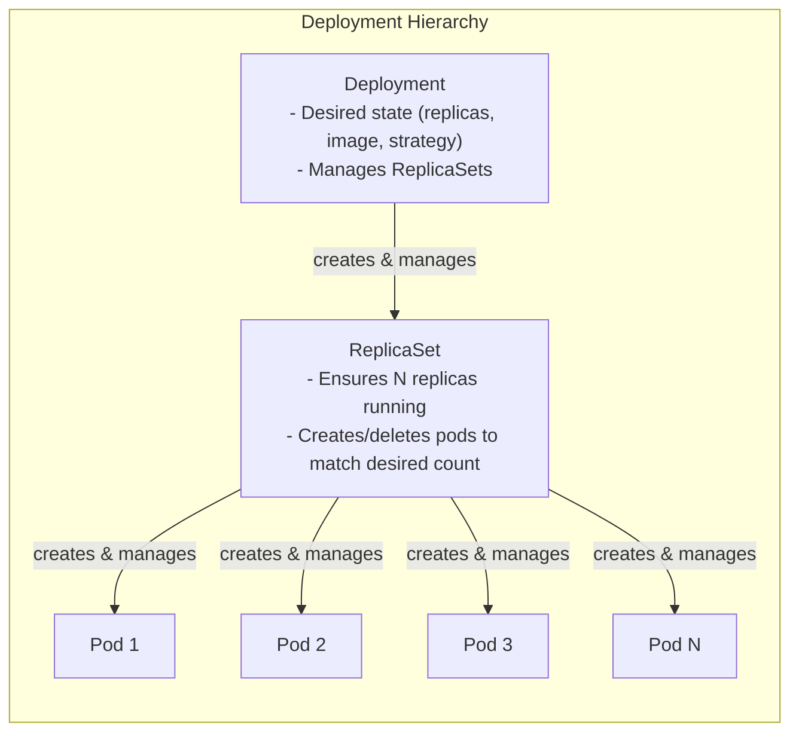
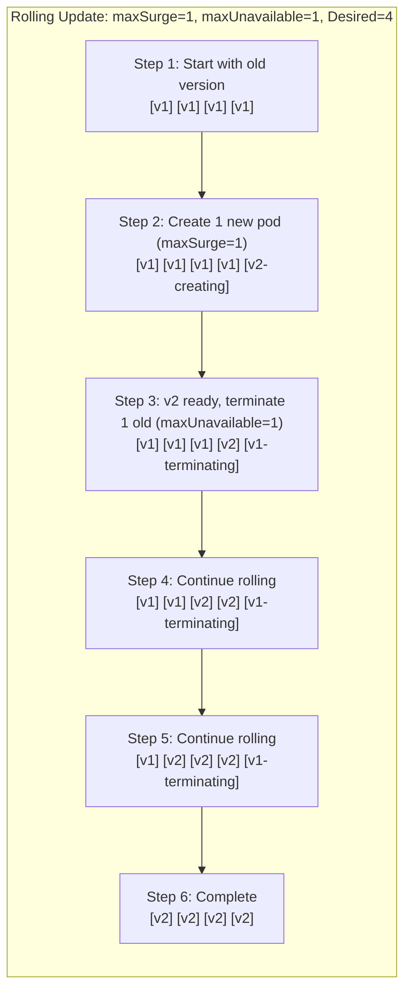
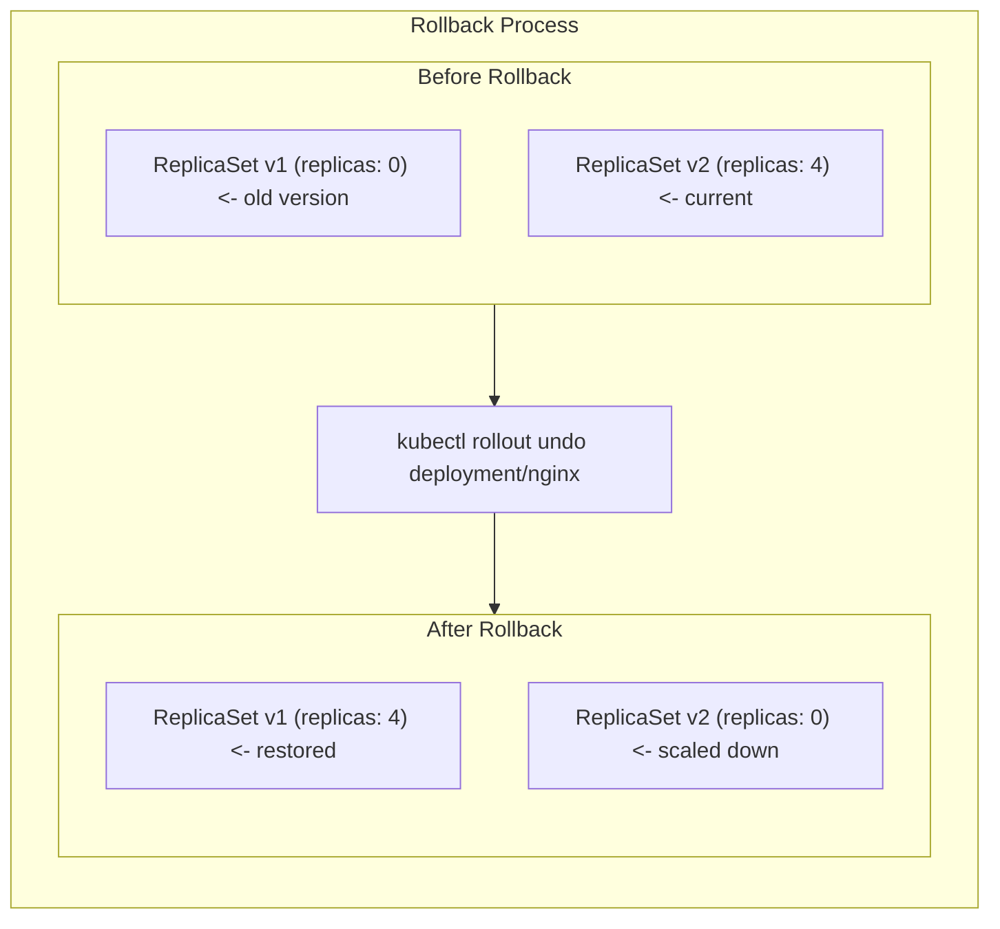

> **Complexity**: `[MEDIUM]` - Core exam topic
>
> **Time to Complete**: 45-55 minutes
>
> **Prerequisites**: Module 2.1 (Pods)

---

## What You'll Be Able to Do

After this module, you will be able to:

- **Implement** Kubernetes Deployments with matching selectors, Pod templates, replica counts, resource requests, and rolling update strategy settings.
- **Diagnose** stuck rollouts by following Deployment conditions, ReplicaSet status, Pod events, readiness failures, and image pull errors.
- **Perform** scaling, image updates, pause and resume workflows, rollback, and rollout history inspection under CKA time pressure.
- **Evaluate** when to choose RollingUpdate versus Recreate based on availability needs, version compatibility, shared storage, and resource trade-offs.

## Why This Module Matters

Hypothetical scenario: your team has a small web API running as three healthy Pods, and a new image tag needs to reach users without dropping every request in flight. If you replace those Pods by hand, you become the controller, which means you must notice crashes, decide when enough new Pods are ready, and remember exactly how to return to the old image when the release fails. A Deployment exists so that this operational loop becomes declarative: you describe the desired Pod template and replica count, then Kubernetes continuously reconciles the real cluster toward that desired state.

Deployments are the everyday controller for stateless application workloads because they sit above Pods and ReplicaSets. You still care about Pods, because Pods are where containers run and where logs, probes, and events reveal failure. You usually avoid creating ReplicaSets directly, because a Deployment adds rollout history, rolling updates, rollback, pause and resume behavior, and strategy controls such as `maxSurge` and `maxUnavailable`. The CKA exam often compresses these ideas into practical tasks: create a Deployment quickly, scale it, update an image, inspect the rollout, diagnose why it is stuck, and recover without guessing.

This module teaches Deployments as an operating model, not just a list of commands. You will build from the ownership chain to the rollout algorithm, then use that model to debug failures quickly. Keep asking one question as you read: "Which controller owns the next action?" When you can answer that for a Deployment, ReplicaSet, and Pod, the command output starts to feel predictable instead of noisy.

## Deployment Ownership: Desired State With Delegation

A Deployment is a desired-state object that manages ReplicaSets, and each ReplicaSet manages Pods that match its selector. That hierarchy is important because you rarely fix a Deployment problem by editing the lowest layer first. The Deployment owns the rollout strategy and the Pod template, the ReplicaSet owns the count of matching Pods for one exact template hash, and the Pod exposes the runtime evidence through phase, container status, events, logs, and probe results. If you skip straight to a Pod without checking the owning ReplicaSet or Deployment condition, you may fix a symptom while the controller immediately recreates the same broken state.



The practical consequence is that each layer has a different kind of truth. The Deployment tells you whether the rollout is progressing and how many replicas should exist. The ReplicaSet tells you whether a specific Pod template hash is being scaled up or down. The Pod tells you whether containers are actually scheduled, pulled, started, restarted, and marked Ready. Pause and predict: if a Deployment image changes twice, what should happen to the old ReplicaSets, and why would Kubernetes keep them with zero replicas instead of deleting them immediately?

| Feature | ReplicaSet | Deployment |
|---------|------------|------------|
| Maintain replica count | Yes | Yes |
| Rolling updates | No | Yes |
| Rollback | No | Yes |
| Update history | No | Yes |
| Pause/Resume | No | Yes |

For most application workloads, prefer Deployments over direct ReplicaSet management. ReplicaSets are still real controller objects, and the exam expects you to read them, but directly scaling a ReplicaSet that belongs to a Deployment fights the parent controller. The Deployment will continue reconciling its declared replica count and rollout state, so manual child edits are fragile. Create a ReplicaSet directly only in uncommon cases where you deliberately do not want Deployment rollout behavior.

```yaml
apiVersion: apps/v1
kind: Deployment
metadata:
  name: nginx-deployment
  labels:
    app: nginx
spec:
  replicas: 3                    # Desired pod count
  selector:                      # How to find pods to manage
    matchLabels:
      app: nginx
  template:                      # Pod template
    metadata:
      labels:
        app: nginx               # Must match selector
    spec:
      containers:
      - name: nginx
        image: nginx:1.25
        ports:
        - containerPort: 80
```

The selector and the Pod template labels are the contract between the controller and the Pods it owns. If `spec.selector.matchLabels` does not match `spec.template.metadata.labels`, the Deployment cannot manage the Pods described by its own template, and Kubernetes rejects or fails the workload depending on the exact mismatch. Treat selector labels as stable identity rather than decoration. Once a Deployment exists, changing its selector is constrained because the selector defines ownership, and ownership is what prevents two controllers from claiming the same Pods.

```bash
# Create deployment
kubectl create deployment nginx --image=nginx

# Create with specific replicas
kubectl create deployment nginx --image=nginx --replicas=3

# Create with port
kubectl create deployment nginx --image=nginx --port=80

# Generate YAML (essential for exam!)
kubectl create deployment nginx --image=nginx --replicas=3 --dry-run=client -o yaml > deploy.yaml
```

Imperative creation is useful under exam pressure because it gives you a valid object quickly, especially when paired with `--dry-run=client -o yaml`. The command is not a substitute for understanding the YAML; it is a fast way to generate a syntactically correct starting point. In real operational work, you normally store the YAML in version control and let review catch risky changes before they touch the cluster. In the exam, generating YAML lets you add strategy, resources, labels, probes, and annotations without writing every field from memory.

```yaml
# nginx-deployment.yaml
apiVersion: apps/v1
kind: Deployment
metadata:
  name: nginx
spec:
  replicas: 3
  selector:
    matchLabels:
      app: nginx
  template:
    metadata:
      labels:
        app: nginx
    spec:
      containers:
      - name: nginx
        image: nginx:1.25
        ports:
        - containerPort: 80
        resources:
          requests:
            cpu: 100m
            memory: 128Mi
          limits:
            cpu: 200m
            memory: 256Mi
```

```bash
kubectl apply -f nginx-deployment.yaml
```

Resource requests in the example are not decoration. The scheduler uses requests when deciding whether a Pod fits on a node, so a Deployment without requests can behave differently from the same Deployment with realistic requests. Limits are also part of the runtime contract because they constrain how much CPU or memory a container can consume. A clean Deployment spec gives the controller enough information to create Pods and gives the scheduler enough information to place them safely.

```bash
# List deployments
kubectl get deployments
kubectl get deploy          # Short form

# Detailed view
kubectl get deploy -o wide

# Describe deployment
kubectl describe deployment nginx

# Get deployment YAML
kubectl get deployment nginx -o yaml

# Check rollout status
kubectl rollout status deployment/nginx
```

Use `kubectl get` to answer "what is the current summary?" and `kubectl describe` to answer "what did the controllers report while reconciling?" The `rollout status` command is especially valuable because it waits for the latest rollout to complete and returns a nonzero exit status if the wait fails. Before running this, what output do you expect when the image pulls successfully but the readiness probe never passes? The Deployment may show updated replicas being created, while available replicas lag because readiness gates traffic.

## ReplicaSets Under the Hood

When you create a Deployment, the Deployment controller creates a ReplicaSet whose Pod template matches the Deployment's current template. The ReplicaSet name contains the Deployment name and a hash derived from the Pod template, which is why changing the image, environment, resource settings, labels, annotations, or other template fields creates a new ReplicaSet. Scaling the Deployment does not create a new ReplicaSet because the Pod template did not change. That distinction is a fast way to separate "capacity change" from "release change" during troubleshooting.

```bash
# Create a deployment
kubectl create deployment nginx --image=nginx --replicas=3

# See the ReplicaSet created
kubectl get replicasets
# NAME               DESIRED   CURRENT   READY   AGE
# nginx-5d5dd5d5fb   3         3         3       30s

# See pods with owner reference
kubectl get pods --show-labels
```

```text
nginx-5d5dd5d5fb
^     ^
|     |
|     +-- Hash of pod template
|
+-- Deployment name
```

The hash is what allows Kubernetes to keep multiple rollout revisions side by side without confusing their Pods. During a rolling update, the old ReplicaSet might still have some ready Pods while the new ReplicaSet is gradually scaled up. During a rollback, Kubernetes does not rebuild the old Pod template from your memory; it scales a retained old ReplicaSet back up and scales the failed one down. If revision history is pruned too aggressively, that recovery path becomes less useful.

```bash
# Don't do this - let Deployment manage ReplicaSets
kubectl scale replicaset nginx-5d5dd5d5fb --replicas=5  # BAD

# Do this instead
kubectl scale deployment nginx --replicas=5             # GOOD
```

The command pair above captures a core controller rule: change the object that owns the desired state. Scaling the child ReplicaSet may appear to work for a moment, but the Deployment still owns the intended total replica count and rollout distribution. Scaling the Deployment updates the parent spec, which lets the controllers converge in the same direction. This is the same reason you edit a Deployment's Pod template rather than editing one live Pod when you want a permanent change.

## Scaling and Editing Without Losing the Controller Model

Scaling changes how many Pods of the current template should run; it does not mean a new software version is being released. That is why scaling usually affects the current ReplicaSet rather than creating another one. When a Deployment has one stable ReplicaSet and you scale from three replicas to five, the ReplicaSet controller creates two more Pods with the same template hash. When you scale down, it deletes Pods while preserving the desired count in the Deployment spec.

```bash
# Scale to specific replicas
kubectl scale deployment nginx --replicas=5

# Scale to zero (stop all pods)
kubectl scale deployment nginx --replicas=0

# Scale multiple deployments
kubectl scale deployment nginx webapp --replicas=3
```

Scaling to zero is a useful maintenance tool, but it is not the same thing as deleting the Deployment. The object, selector, rollout history, annotations, and strategy remain, while the desired replica count becomes zero. That means you can scale back up without recreating the spec. It also means Services and other objects that select the same labels may still exist even though no endpoints are available.

```bash
# Edit deployment directly (interactive, commonly used in exam)
# kubectl edit deployment nginx
# Change spec.replicas and save

# Or patch (non-interactive, used for this lab)
kubectl patch deployment nginx -p '{"spec":{"replicas":5}}'
```

Interactive editing is common in exams because it is quick, but it carries a risk: you may change the wrong field or leave invalid YAML. A patch is better for repeatable lab instructions because it expresses one narrow change. In production workflows, declarative files and code review are usually safer than ad hoc edits. The exam skill is knowing all three paths and choosing the fastest one that remains understandable.

```bash
# View pods scale (use -w in exam to watch continuously)
kubectl get pods

# Check deployment status
kubectl get deployment nginx
# NAME    READY   UP-TO-DATE   AVAILABLE   AGE
# nginx   5/5     5            5           10m

# Detailed status
kubectl rollout status deployment/nginx
```

When checking a scale operation, compare the Deployment summary to the Pods rather than trusting one command alone. `READY` shows how many desired replicas are currently ready, `UP-TO-DATE` shows how many replicas match the current template, and `AVAILABLE` reflects minimum availability. If `UP-TO-DATE` is correct but `AVAILABLE` is low, the controller created the right template but the Pods are not becoming available. That observation sends you toward readiness probes, image pulls, events, resource pressure, or application startup.

## Rolling Updates and Rollbacks

A rolling update changes the Pod template and lets Kubernetes replace old Pods gradually. The default Deployment strategy is RollingUpdate, and the two knobs that shape its behavior are `maxSurge` and `maxUnavailable`. `maxSurge` allows extra Pods above the desired replica count during the rollout, while `maxUnavailable` allows some desired replicas to be unavailable during the rollout. With four replicas, `maxSurge: 1`, and `maxUnavailable: 0`, Kubernetes can briefly run five Pods so that it does not intentionally reduce available capacity.

Pause and predict: you have a Deployment with four replicas, `maxSurge: 1`, and `maxUnavailable: 0`. During a rolling update, what is the maximum number of Pods running at any point, and what happens if the new version never becomes Ready? The maximum is five Pods, and the controller should stop progressing rather than delete the remaining ready old Pods. That behavior is why a broken update often produces a mixed fleet instead of a total outage.

```yaml
apiVersion: apps/v1
kind: Deployment
metadata:
  name: nginx
spec:
  replicas: 4
  strategy:
    type: RollingUpdate           # Default strategy
    rollingUpdate:
      maxSurge: 1                 # Max pods over desired during update
      maxUnavailable: 1           # Max pods unavailable during update
  selector:
    matchLabels:
      app: nginx
  template:
    metadata:
      labels:
        app: nginx
    spec:
      containers:
      - name: nginx
        image: nginx:1.25
```

The values can be absolute numbers or percentages, and percentages are resolved against the desired replica count. For small replica counts, a percentage can round in ways that surprise beginners, so explicit numbers are easier to reason about during practice. `maxUnavailable: 1` trades a small amount of capacity for faster replacement because Kubernetes can terminate one old Pod while creating new ones. `maxUnavailable: 0` is more conservative, but it needs enough cluster capacity for surge Pods.



Any change to the Pod template can trigger a rollout. Updating an image is the obvious case, but environment variables, resource settings, labels, annotations, probes, commands, and volume mounts are also part of the template. Changing only `spec.replicas` scales the existing template and does not create a new ReplicaSet. That difference matters when you inspect rollout history: history tracks template revisions, not every administrative change on the Deployment object.

```bash
# Update image (triggers rolling update)
kubectl set image deployment/nginx nginx=nginx:1.26

# Update with record (saves command in history)
kubectl set image deployment/nginx nginx=nginx:1.26 --record

# Update environment variable
kubectl set env deployment/nginx ENV=production

# Update resources
kubectl set resources deployment/nginx -c nginx --limits=cpu=200m,memory=512Mi

# Edit deployment (any change to pod template triggers update)
# kubectl edit deployment nginx
# For automation, we patch an annotation:
kubectl patch deployment nginx -p '{"spec":{"template":{"metadata":{"annotations":{"update":"now"}}}}}'
```

The `--record` flag appears in older examples and some inherited drills, but it is deprecated. A modern workflow writes an explicit `kubernetes.io/change-cause` annotation or relies on deployment tooling that records the reason for a release. The important operational habit is not the flag itself; it is preserving enough context that a future rollback target is understandable. A history entry without the image, reason, or change owner is much less useful under pressure.

```bash
# Watch rollout progress
kubectl rollout status deployment/nginx

# View pods during update (in exam, use -w to watch continuously)
kubectl get pods

# View ReplicaSets (in exam, use -w to watch continuously)
kubectl get rs
```

Rollbacks use the same controller machinery in reverse. The Deployment controller scales a retained old ReplicaSet up and scales the current ReplicaSet down. A rollback is explicit; Kubernetes does not generally decide to undo a bad release for you. Your job is to recognize that the rollout is stuck or harmful, inspect enough evidence to avoid rolling back to another bad revision, and then run the undo command against the Deployment.

```bash
# View history
kubectl rollout history deployment/nginx

# View specific revision
kubectl rollout history deployment/nginx --revision=2
```

```bash
# Rollback to previous version
kubectl rollout undo deployment/nginx

# Rollback to specific revision
kubectl rollout undo deployment/nginx --to-revision=2

# Verify rollback
kubectl rollout status deployment/nginx
kubectl get deployment nginx -o wide
```



Rollout history is bounded by `revisionHistoryLimit`. The default keeps ten old ReplicaSets, which is usually enough for ordinary rollback needs while preventing unlimited controller clutter. Setting the value to zero disables rollback history, which may be tempting in tiny clusters but removes one of the most useful recovery tools. If your environment has strict cleanup requirements, choose a small positive number and pair it with reliable image tagging and release notes.

```yaml
apiVersion: apps/v1
kind: Deployment
metadata:
  name: nginx
spec:
  revisionHistoryLimit: 10    # Keep 10 old ReplicaSets (default)
  # Set to 0 to disable rollback capability
```

Exercise scenario: a broken image tag makes a rollout fail quickly, and `kubectl rollout undo` lets you restore the previous revision faster than manually reconstructing the last known-good image. That scenario is not a promise that rollback solves every release problem. If the new version changed external state, database schema, or shared storage, rolling the Pods back may not restore compatibility. Deployment rollback is powerful, but it is still a workload-controller operation, not a full application disaster-recovery plan.

## Pause, Resume, and Strategy Choice

Pausing a Deployment tells the Deployment controller not to start a new rollout for Pod template changes until you resume it. This is useful when you need to change the image, resources, and environment together and you do not want three separate ReplicaSets. Pausing does not freeze the entire cluster, and it does not mean Kubernetes can never create replacement Pods for other reasons. It specifically controls rollout progression for the Deployment's template changes.

```bash
# Pause deployment
kubectl rollout pause deployment/nginx

# Make multiple changes (no rollout triggered)
kubectl set image deployment/nginx nginx=nginx:1.26
kubectl set resources deployment/nginx -c nginx --limits=cpu=200m
kubectl set env deployment/nginx ENV=production

# Resume - triggers single rollout with all changes
kubectl rollout resume deployment/nginx

# Watch the rollout
kubectl rollout status deployment/nginx
```

Pause and resume also helps you keep history meaningful. If every small template adjustment becomes its own revision, a future rollback list can become hard to read. Batching related changes gives you one revision that represents one release intent. The trade-off is that a paused Deployment can sit in a surprising state if someone forgets to resume it, so always verify `kubectl rollout status` after resuming and check the Deployment conditions if progress does not continue.

Recreate is the other built-in strategy, and it is much simpler: delete all old Pods first, then create new Pods. That simplicity comes with downtime because there is a moment when no old version is serving and the new version is not ready yet. Recreate can be the right strategy for workloads that cannot safely run old and new versions at the same time, such as a single-writer application with incompatible shared storage behavior. If you can design backward-compatible releases instead, RollingUpdate usually gives better availability.

```yaml
apiVersion: apps/v1
kind: Deployment
metadata:
  name: database
spec:
  replicas: 1
  strategy:
    type: Recreate          # All pods deleted, then new pods created
  selector:
    matchLabels:
      app: database
  template:
    metadata:
      labels:
        app: database
    spec:
      containers:
      - name: db
        image: postgres:15
```

Which approach would you choose here and why: a stateless API with four replicas, backward-compatible database migrations, and enough node capacity for one surge Pod? RollingUpdate is a strong fit because it preserves availability while the new version proves readiness. Recreate would avoid version overlap, but it would create avoidable downtime. The better engineering answer is often to make the application and migration compatible enough that RollingUpdate remains safe.

| Aspect | RollingUpdate | Recreate |
|--------|---------------|----------|
| Downtime | Zero if configured correctly | Yes |
| Resource usage | Higher during update | Same |
| Complexity | Higher | Simple |
| Use case | Stateless apps | Stateful, incompatible versions |

## Diagnosing Stuck Rollouts

A stuck rollout is usually a safety signal, not just a nuisance. The Deployment controller may be waiting because new Pods cannot be scheduled, cannot pull the image, crash after starting, or never become Ready. The fastest diagnostic path moves from the parent status to the child objects: describe the Deployment, compare ReplicaSets, inspect Pods, then read events and logs. This order helps you avoid tunnel vision and tells you whether the problem is a rollout strategy issue, a scheduling issue, an image issue, or an application readiness issue.

```bash
# View conditions
kubectl get deployment nginx -o jsonpath='{.status.conditions[*].type}'

# Detailed conditions
kubectl describe deployment nginx | grep -A10 Conditions
```

| Condition | Meaning |
|-----------|---------|
| `Available` | Minimum replicas available |
| `Progressing` | Rollout in progress |
| `ReplicaFailure` | Failed to create pods |

Conditions are compressed summaries, so pair them with events. A `Progressing` condition that never reaches availability often means the new ReplicaSet exists but its Pods are not ready. A `ReplicaFailure` condition points toward failures creating Pods, which may include quota, admission, or scheduling problems. If the Deployment summary says the desired count is correct but readiness is low, move down to Pods and look for `ImagePullBackOff`, `CrashLoopBackOff`, readiness probe failures, or pending scheduling messages.

Stop and think: if a Deployment is stuck in a `Progressing` state but never becomes `Available`, where is the first place you should look to understand why the new Pods are not starting? Start with `kubectl describe deployment` to read conditions and events, then compare ReplicaSets to identify which template hash is failing. After that, inspect the failing Pods because the runtime error lives at the Pod level. This sequence is faster than randomly deleting Pods and hoping the controller creates healthier replacements.

```bash
# Update to an image tag that doesn't exist
kubectl set image deployment/nginx nginx=nginx:broken-tag

# The rollout will hang without a timeout
kubectl rollout status deployment/nginx --timeout=10s || true
# Output: error: timed out waiting for the condition
```

The timeout in this lab command is deliberate. Without it, `kubectl rollout status` can keep waiting while the controller protects the old healthy Pods and repeatedly fails to make the new version available. In an exam, a short timeout prevents one command from consuming the rest of your time. In production automation, a timeout gives your pipeline a clear failure signal and lets the next diagnostic or rollback step run.

```bash
kubectl describe deployment nginx
```

Read the bottom of the describe output before scrolling away. The `Events` section often tells you whether Pods are being scaled, whether a ReplicaSet failed to create Pods, or whether progress has stalled. The condition timestamps also help you separate a rollout that is merely slow from one that has stopped making useful progress. If there are no obvious events, the next useful object is the ReplicaSet list.

```bash
kubectl get replicasets -l app=nginx
```

The ReplicaSet list shows which template hash is old and which is new. During a failed image rollout, you may see the old ReplicaSet still carrying ready replicas while the new ReplicaSet has desired or current Pods but zero ready Pods. That is the controller protecting availability according to the strategy. It also gives you the label selector you need for targeted Pod inspection.

```bash
kubectl get pods -l app=nginx
# Look for the pod in ImagePullBackOff or CrashLoopBackOff status
```

```bash
# Describe the failing pods using label selector
kubectl describe pod -l app=nginx

# Or check recent events in the namespace
kubectl get events --sort-by='.metadata.creationTimestamp' | tail -n 10
```

In the broken image scenario, the Pod events should reveal a failed image pull for `nginx:broken-tag`. A readiness failure would look different: the image pulls and the container starts, but the Pod never becomes Ready because the readiness probe fails or the application does not open the expected port. A scheduling failure would show pending Pods and scheduler messages about resources, taints, affinity, or constraints. Each failure mode points to a different fix, so do not roll back blindly until you know what you are reversing.

```bash
kubectl rollout undo deployment/nginx
kubectl rollout status deployment/nginx
```

Rollback is the recovery action for the lab because the root cause is a bad image tag. If the root cause were insufficient cluster capacity for the surge Pod, rollback might not be necessary; lowering surge, adding capacity, or adjusting requests could be the better fix. If the root cause were a readiness probe misconfiguration, you might patch the probe and continue the rollout after testing. The controller gives you a safe pause point, but your diagnosis decides the repair.

## Exam Troubleshooting Playbook

The fastest Deployment troubleshooting habit is to separate intent, controller progress, and runtime evidence. Intent lives in the Deployment spec: replicas, selector, strategy, and Pod template. Controller progress lives in Deployment conditions and ReplicaSet counts. Runtime evidence lives in Pods, events, and logs. When those layers disagree, trust the layer that owns the question you are asking. A Pod log can explain an application crash, but it cannot tell you whether the rollout strategy allowed enough surge capacity.

Start with the Deployment because it is the object the exam task usually names. If the task says "fix the rollout for deployment web," resist the urge to delete Pods immediately. Check whether the Deployment has the right image, replica count, selector, strategy, and conditions. A wrong image in the template is fixed at the Deployment. A wrong replica count is fixed at the Deployment. A Pod that is merely a child object will be recreated from the same flawed template if you delete it without fixing the parent.

Move to ReplicaSets when you need to understand revision shape. One ReplicaSet with all desired replicas usually means no rollout is currently split across versions. Multiple ReplicaSets with nonzero desired counts usually means a rollout or rollback is in progress. An old ReplicaSet with zero desired replicas is not automatically a problem; it may be retained history. A new ReplicaSet with desired Pods but zero ready Pods tells you the template changed successfully, but the new Pods failed somewhere after that point.

Move to Pods when you need evidence about scheduling, image pull, container startup, probes, and application behavior. `Pending` points toward scheduling, quota, affinity, taints, or resource requests. `ImagePullBackOff` points toward registry access, image name, tag, or pull secret issues. `CrashLoopBackOff` means the container starts and exits repeatedly, so logs and command arguments become useful. A running container with no readiness usually points toward probes, ports, dependencies, or startup timing.

Use events as a bridge between controller output and runtime output. Deployment events can show scaling decisions, while Pod events can show scheduler and kubelet problems. Events are especially useful when logs are empty because the container never started. Sort events by timestamp when output is noisy, and correlate the newest messages with the Pod names created by the new ReplicaSet. The goal is not to read every event; the goal is to find the first controller or node component that could not do its job.

Keep rollout strategy in mind while interpreting a mixed fleet. Seeing old and new Pods at the same time is normal during RollingUpdate. Seeing old Pods stay alive while new Pods fail can be a healthy protective behavior, not a controller bug. The Deployment is trying to avoid reducing availability beyond the configured strategy. If the application is already failing for users, rollback may still be the right operational choice, but understand that the mixed state is the controller preserving capacity rather than losing track.

Capacity failures can look like release failures if you only watch `rollout status`. A new image may be perfectly valid, but a surge Pod cannot schedule because the cluster lacks requested CPU, memory, Pod capacity, or allowed topology. In that case, changing the image again does not solve the problem. You need to inspect pending Pod events and decide whether to reduce surge, reduce requests, add capacity, or choose a rollout window with more headroom. This is why resource requests belong in a Deployment lesson rather than only a scheduling lesson.

Readiness failures deserve similar care because they are not always application crashes. A readiness probe may target the wrong path, port, scheme, or initial delay. The application may be healthy but slower than the probe budget, or it may require a dependency that is unavailable. RollingUpdate treats readiness as the signal that a Pod can replace old capacity, so a bad readiness probe can stop a rollout even when the process is technically running. Fix the probe or the application behavior rather than forcing the rollout past the signal.

Rollbacks should be deliberate because they restore a Pod template, not the entire world around the workload. If a release included a database migration, external configuration change, or traffic policy change, undoing the Deployment may leave the old code facing a changed environment. For the CKA, rollback questions usually focus on the Deployment object itself. For real operations, pair rollback with release notes and migration discipline so the old template is actually compatible with current external state.

When you inspect rollout history, look beyond the revision number. The useful details are image, container name, environment, resource settings, probes, and change-cause annotations. If those details are missing or ambiguous, history still helps by retaining ReplicaSets, but it does not replace release documentation. A revision that was good yesterday might be bad today if it depends on an external system that changed. The command tells you what Kubernetes can restore; engineering judgment tells you whether restoring it is safe.

The selector is another frequent source of quiet mistakes. A Service selector, Deployment selector, and Pod template labels can be valid individually while not selecting the same Pods together. In that case, the Deployment may be healthy but traffic still does not reach it, or the Service may point to old Pods while the Deployment rolls out new ones. During troubleshooting, compare labels with the same discipline you use for images. Controllers and Services act on labels exactly, not on the human meaning of a name.

Avoid using deletion as a diagnostic shortcut. Deleting a failed Pod can be reasonable after you understand the issue, but it often erases useful events and produces a replacement with the same failure. Deleting a ReplicaSet owned by a Deployment can also trigger confusing reconciliation. In an exam, deletion may accidentally make the output look cleaner while the underlying template remains wrong. Inspect first, fix the owner, and then let the controller create fresh children when needed.

Deployment debugging becomes easier when you phrase every action as an ownership statement. "I am scaling the Deployment because the Deployment owns desired replica count." "I am inspecting the ReplicaSet because the ReplicaSet represents this template revision." "I am reading Pod events because the kubelet and scheduler report runtime failure there." This habit prevents random command hopping and makes your answer easier to defend. It also maps directly to how Kubernetes controllers are built.

For update commands, remember that convenience and permanence are different concerns. `kubectl set image` is fast and appropriate for many exam tasks, while declarative YAML is better for reviewed environments. `kubectl patch` is precise for narrow fields, while `kubectl edit` is quick but easier to misuse. None of these commands is inherently superior. The right choice depends on whether you need speed, repeatability, reviewability, or exact control over one field.

For strategy decisions, start by asking whether two versions can run together. If they can, RollingUpdate is usually the default because it preserves availability and gives readiness a chance to protect users. If they cannot, Recreate may be honest and safer, but it creates downtime. The more mature alternative is often to change the application release design so old and new versions overlap safely. Kubernetes gives you rollout mechanisms, but application compatibility determines which mechanism is responsible.

Finally, make verification part of every change rather than a separate afterthought. After creating a Deployment, check rollout status and Pods. After scaling, check desired and ready counts. After changing a template, check ReplicaSets and rollout history. After rollback, check the current image and availability. Verification is what turns a command sequence into an operational workflow, and it is the difference between passing an exam task by accident and knowing why the cluster reached the desired state.

Namespace context is another small detail that prevents large mistakes. The exam may place resources in a specific namespace, and real clusters often use namespaces to separate teams or environments. If you inspect the default namespace while the Deployment lives elsewhere, every command looks empty and the temptation is to recreate objects that already exist. Confirm the namespace before diagnosing, and prefer explicit `-n` flags in notes when the task names a namespace. That habit keeps Deployment output tied to the workload you are actually responsible for.

Cleanups deserve the same controller awareness as rollouts. Deleting a Deployment normally removes the ReplicaSets and Pods it owns, while deleting a Service, ConfigMap, or Secret requires separate action because those objects are not children of the Deployment. Scaling to zero is reversible capacity control, but deletion removes the controller and its rollout history. Before cleanup in a shared environment, identify whether the goal is to stop serving traffic temporarily, remove a failed release object, or dismantle every supporting resource created for a lab.

The most reliable mental model is reconciliation, not command execution. A command changes an API object, then controllers notice the new desired state and work toward it. Sometimes that work is immediate, and sometimes it waits on scheduling, image pulls, probes, or strategy limits. If output does not change instantly, do not assume the command failed; inspect which reconciliation step is waiting. Kubernetes is less mysterious when you treat every Deployment action as a request that controllers must be able to satisfy.

## Patterns & Anti-Patterns

Deployment patterns are mostly about making controller behavior predictable. Use stable labels, immutable image tags, and readiness probes so the controller can tell when a new Pod is actually safe to count as available. Use resource requests so scheduling failures are explicit instead of accidental. Use rollout history and change-cause annotations so a rollback target has context. These habits make both CKA tasks and real incidents easier because the cluster output tells a coherent story.

| Pattern | When to Use It | Why It Works | Scaling Consideration |
|---------|----------------|--------------|-----------------------|
| Generate YAML, then edit | CKA tasks where speed matters but strategy or resources must be customized | Starts from valid API shape and reduces indentation mistakes | Commit the final manifest in real environments |
| Read Deployment, ReplicaSet, then Pod | Any rollout that is slow, mixed, or failing | Follows ownership from intent to runtime evidence | Works even as replica counts grow because selectors narrow the view |
| Batch template changes with pause/resume | Multiple image, resource, env, or annotation updates belong to one release | Produces one rollout and one revision for related changes | Requires a resume check so the Deployment is not left paused |
| Use explicit strategy values | Small replica counts or strict availability requirements | Makes surge and unavailable behavior predictable | Needs enough cluster capacity when surge is greater than zero |

The biggest anti-pattern is fighting the controller. Manually deleting or scaling child objects can make the output look different for a moment, but the parent Deployment will continue reconciling the declared state. Another common anti-pattern is using mutable image tags such as `latest`, because a Pod template may not change even though the registry content changed. A third is treating rollback as the whole incident response, when rollback only restores a Pod template and does not undo external changes made by the application.

| Anti-Pattern | What Goes Wrong | Better Alternative |
|--------------|-----------------|--------------------|
| Scaling a Deployment-owned ReplicaSet | The Deployment reconciles over the manual child change | Scale the Deployment itself |
| Using mutable tags for releases | Rollout history cannot reliably identify the running image | Use specific version or digest references |
| Removing rollout history entirely | `rollout undo` has no useful old ReplicaSet to restore | Keep a small positive `revisionHistoryLimit` |
| Ignoring readiness | New Pods receive traffic before the app is actually ready | Add readiness probes that match real service health |

## Decision Framework

Choose the Deployment action by identifying which part of desired state changed. If only the number of identical Pods changed, scale the Deployment. If the Pod template changed, expect a new ReplicaSet and a rollout. If the rollout harms availability or fails, inspect history and conditions before undoing. If old and new versions cannot overlap safely, choose Recreate or redesign the release so both versions can temporarily coexist.

| Situation | Primary Command or Field | First Verification | Main Risk |
|-----------|--------------------------|--------------------|-----------|
| Need more capacity | `kubectl scale deployment NAME --replicas=N` | `kubectl get deployment NAME` | Scheduler cannot place requested Pods |
| Need a new image | `kubectl set image deployment/NAME CONTAINER=IMAGE` | `kubectl rollout status deployment/NAME` | New Pods fail readiness or crash |
| Need several template edits | `kubectl rollout pause`, changes, `kubectl rollout resume` | `kubectl rollout status deployment/NAME` | Forgetting to resume |
| Need recovery | `kubectl rollout history`, then `kubectl rollout undo` | `kubectl get rs` and rollout status | Restoring a revision that is also bad |
| Versions cannot overlap | `strategy.type: Recreate` | Pod readiness after downtime | Planned outage during replacement |

```text
Start with the symptom
|
+-- Need more or fewer identical Pods? --> Scale the Deployment
|
+-- New template should roll out? ------> Use RollingUpdate unless overlap is unsafe
|                                      |
|                                      +-- Overlap unsafe? --> Recreate or redesign compatibility
|
+-- Rollout stuck or harmful? ---------> Describe Deployment, compare ReplicaSets, inspect Pods
                                       |
                                       +-- Bad new template? --> Rollout undo after checking history
```

This decision tree is intentionally small because the CKA exam rewards fast classification. If a command changes `spec.replicas`, think scaling. If a command changes `spec.template`, think rollout. If the controller creates a new ReplicaSet, think revision history and rollback. If a Pod does not become Ready, think image, schedule, container, logs, probes, and events rather than assuming the Deployment object itself is broken.

## Did You Know?

- Kubernetes Deployments use `apps/v1`, and their selector must match the Pod template labels because the selector defines controller ownership.
- The default Deployment strategy is RollingUpdate, and the documented default values for both `maxSurge` and `maxUnavailable` are 25 percent.
- `kubectl rollout status` watches the latest rollout until it completes unless you set a timeout, which makes it useful in scripts and CI jobs.
- The `--record` flag is deprecated; meaningful rollout history should come from explicit change-cause annotations or release tooling that writes them.

## Common Mistakes

| Mistake | Why It Happens | How to Fix It |
|---------|----------------|---------------|
| Selector labels do not match template labels | The author treats labels as cosmetic metadata instead of the ownership contract | Make `spec.selector.matchLabels` and `spec.template.metadata.labels` match before applying |
| Scaling a ReplicaSet owned by a Deployment | The ReplicaSet looks like the object creating Pods, so it seems like the right target | Scale the Deployment and let it reconcile its child ReplicaSets |
| Using `latest` or another mutable image tag | The tag is convenient during testing, but rollout history becomes ambiguous | Use immutable version tags or image digests for release Deployments |
| Rolling back without inspecting history | Pressure makes the previous revision feel automatically safe | Run `kubectl rollout history deployment/NAME --revision=N` before targeting a revision |
| Forgetting that pause only batches template rollouts | The word "pause" sounds like it freezes all controller behavior | Resume the Deployment and verify rollout status after batched edits |
| Choosing RollingUpdate when versions cannot overlap | Teams optimize for availability before checking storage or schema compatibility | Use Recreate for true incompatibility or redesign for backward-compatible releases |
| Debugging only Pods and ignoring ReplicaSets | Pod errors are visible, but the rollout shape lives one level higher | Compare Deployment conditions, ReplicaSets, and Pods in that order |

## Quiz

<details>
<summary>Your team pushed image `api:v2.1` to a Deployment running `api:v2.0` with four replicas. Users report errors from about half their requests, and you see two old Pods plus two new Pods, one of which is in CrashLoopBackOff. What happened, and what should you do first?</summary>

The rolling update is partially complete and now stuck because the new version is not healthy enough to replace the remaining old Pods. The Deployment controller is preserving some availability by keeping old Pods alive instead of deleting everything. First, inspect the failing new Pod with `kubectl describe pod` and `kubectl logs` so you know whether this is a bad image, app crash, probe failure, or configuration problem. If the new version is clearly bad, run `kubectl rollout undo deployment/api` and verify the rollback before attempting another release.

</details>

<details>
<summary>A Deployment has a new ReplicaSet with `DESIRED` 1, `CURRENT` 1, and `READY` 0, while the older ReplicaSet still has ready Pods. Which objects should you inspect next, and why?</summary>

The new ReplicaSet proves that a template change triggered a rollout, but the zero ready count means the new Pods are not becoming available. Inspect the Pods created by that ReplicaSet using labels, then describe the failing Pods and read recent events. The root cause may be `ImagePullBackOff`, `CrashLoopBackOff`, failed scheduling, or readiness probes that never pass. Inspecting only the Deployment would tell you the rollout is stuck, but the Pod events explain why.

</details>

<details>
<summary>You need to change an image, an environment variable, and resource limits for one release. How do you avoid creating three separate rollout revisions?</summary>

Pause the Deployment, apply the related template changes, then resume it. While paused, the Deployment records the template edits but does not start a rollout for each edit. When you resume, Kubernetes creates one new ReplicaSet for the combined template. Always follow the resume with `kubectl rollout status deployment/NAME` so you do not leave the Deployment paused or miss a failed rollout.

</details>

<details>
<summary>A colleague suggests using Recreate for every workload because it is simpler than RollingUpdate. Evaluate that choice for a stateless API with readiness probes and enough spare node capacity.</summary>

Recreate is simpler, but it causes downtime because old Pods are deleted before new Pods are created. For a stateless API with readiness probes and spare capacity, RollingUpdate is usually better because it can create new Pods, wait for readiness, and then remove old Pods gradually. The added complexity is justified by the availability benefit. Recreate should be reserved for workloads where old and new versions truly cannot overlap or where downtime is explicitly acceptable.

</details>

<details>
<summary>A rollout times out in your terminal after ten seconds, but several old Pods are still serving traffic. Does the timeout mean Kubernetes deleted the Deployment or failed the whole application?</summary>

No. The timeout means the client stopped waiting for the rollout condition, not that Kubernetes deleted the Deployment. The controller may still be reconciling, and the old Pods may remain available because the rolling update strategy is protecting capacity. You should inspect the Deployment conditions, ReplicaSets, and Pods to identify the stalled step. After diagnosis, either fix the new template, adjust capacity or strategy, or roll back.

</details>

<details>
<summary>You scaled a Deployment from three replicas to five and expected a new ReplicaSet, but only the existing ReplicaSet changed size. Is that correct?</summary>

Yes, that is correct. Scaling changes `spec.replicas`, not the Pod template, so Kubernetes does not need a new template hash. The existing current ReplicaSet simply creates or deletes Pods to match the desired count. A new ReplicaSet appears when the Pod template changes, such as an image, environment variable, resource setting, probe, label, or annotation under `spec.template`.

</details>

<details>
<summary>You need to roll back to the version from two releases ago, but the history list is hard to interpret. What should you check before running undo?</summary>

Inspect individual revisions with `kubectl rollout history deployment/NAME --revision=N` and compare the Pod template details that matter, especially image tags, environment variables, resources, and annotations. Do not assume the revision number alone identifies a safe version, because rollback operations can create new revision numbers and old entries may be pruned. Once you identify the correct target, run `kubectl rollout undo deployment/NAME --to-revision=N`. Then verify with rollout status and the current image field.

</details>

## Hands-On Exercise

Exercise scenario: complete a Deployment lifecycle in a throwaway namespace or lab cluster. The goal is not only to make commands succeed; it is to observe how Deployment, ReplicaSet, and Pod output changes after each action. Work in order, and after each step write down which controller owned the change you just made.

### Task 1: Create a Deployment

Start with a small NGINX Deployment and wait for the rollout. This task exercises imperative creation and the most important verification command for a Deployment.

```bash
kubectl create deployment webapp --image=nginx:1.24 --replicas=3
kubectl rollout status deployment/webapp
```

<details>
<summary>Solution notes</summary>

You should see the rollout complete and three desired replicas become available. If the command fails because the Deployment already exists, delete the old lab object or choose a fresh name. The important observation is that the Deployment immediately creates a ReplicaSet, and the ReplicaSet creates Pods with labels derived from the Deployment name.

</details>

### Task 2: Verify the ownership chain

Look at the Deployment, ReplicaSet, and Pods. The output should make the parent-child relationship visible even before you inspect owner references in YAML.

```bash
kubectl get deployment webapp
kubectl get replicaset
kubectl get pods -l app=webapp
```

<details>
<summary>Solution notes</summary>

The Deployment should report three ready replicas, the ReplicaSet should have a name that starts with `webapp-`, and the Pods should share the `app=webapp` label. If Pods are pending, describe one Pod and check events before moving on. A pending Pod means the controller created the desired object, but the scheduler or kubelet could not complete the runtime step.

</details>

### Task 3: Scale the Deployment

Scale the Deployment to five replicas and verify that scaling adjusts the current ReplicaSet rather than creating a new rollout revision.

```bash
kubectl scale deployment webapp --replicas=5
kubectl get pods  # View pods scale up (use -w in exam)
```

<details>
<summary>Solution notes</summary>

You should see five Pods after scheduling and startup complete. The current ReplicaSet should change desired and current counts, but there should not be a new ReplicaSet solely from scaling. If new Pods stay pending, the likely issue is scheduling capacity rather than Deployment strategy.

</details>

### Task 4: Update, break, and recover

Perform a normal image update, inspect history, then deliberately use a bad image tag so you can practice diagnosing and rolling back a stuck rollout.

```bash
kubectl set image deployment/webapp nginx=nginx:1.25 --record
kubectl rollout status deployment/webapp
```

```bash
kubectl rollout history deployment/webapp
kubectl get replicaset  # Notice two ReplicaSets now
```

```bash
kubectl set image deployment/webapp nginx=nginx:broken --record
kubectl rollout status deployment/webapp --timeout=10s || true  # Timeout prevents hanging
kubectl get pods  # Some in ImagePullBackOff
```

```bash
kubectl rollout undo deployment/webapp
kubectl rollout status deployment/webapp
kubectl get pods  # Back to healthy state
```

<details>
<summary>Solution notes</summary>

The successful update should create a second ReplicaSet and eventually move all ready replicas to the new template. The bad update should create another ReplicaSet whose Pods cannot pull the image, while older Pods remain available according to the rolling strategy. After rollback, verify that the broken ReplicaSet is scaled down and healthy Pods are running from the previous image.

</details>

### Task 5: Target a specific revision, then clean up

Inspect history again, roll back to the first revision, and delete the lab Deployment. This task reinforces that rollback targets are Deployment revisions, not Pod names.

```bash
kubectl rollout history deployment/webapp
kubectl rollout undo deployment/webapp --to-revision=1
kubectl rollout status deployment/webapp
```

```bash
kubectl delete deployment webapp
```

<details>
<summary>Solution notes</summary>

The exact revision list can differ depending on previous rollback actions, so inspect the revision details before using a target in real work. In this lab, returning to revision one should restore the original `nginx:1.24` template if history has not been pruned. Deleting the Deployment should also delete the ReplicaSets and Pods that it owns.

</details>

### Extra CKA Drills

The following drills preserve the original practice flow. Use them after the main lab when you want speed practice, but keep the same diagnostic discipline: state which object you changed, then verify at the right layer.

```bash
# Create deployment
kubectl create deployment nginx --image=nginx:1.25 --replicas=3

# Verify
kubectl rollout status deployment/nginx
kubectl get deploy nginx
kubectl get rs
kubectl get pods -l app=nginx

# Cleanup
kubectl delete deployment nginx
```

```bash
# Create deployment
kubectl create deployment web --image=nginx:1.24 --replicas=4

# Wait for ready
kubectl rollout status deployment/web

# Update image
kubectl set image deployment/web nginx=nginx:1.25

# Watch the rollout
kubectl rollout status deployment/web

# Verify new image
kubectl get deployment web -o jsonpath='{.spec.template.spec.containers[0].image}'

# Cleanup
kubectl delete deployment web
```

```bash
# Create deployment
kubectl create deployment app --image=nginx:1.24 --replicas=3
kubectl rollout status deployment/app

# Update 1
kubectl set image deployment/app nginx=nginx:1.25 --record
kubectl rollout status deployment/app

# Update 2 (bad version)
kubectl set image deployment/app nginx=nginx:bad --record
# Don't wait - it will fail

# Check history
kubectl rollout history deployment/app

# Rollback
kubectl rollout undo deployment/app
kubectl rollout status deployment/app

# Verify rolled back
kubectl get deployment app -o jsonpath='{.spec.template.spec.containers[0].image}'
# Should be nginx:1.25

# Cleanup
kubectl delete deployment app
```

```bash
# Create deployment
kubectl create deployment scale-test --image=nginx --replicas=2

# Scale up
kubectl scale deployment scale-test --replicas=5
kubectl get pods -l app=scale-test

# Scale down
kubectl scale deployment scale-test --replicas=1
kubectl get pods -l app=scale-test

# Scale to zero
kubectl scale deployment scale-test --replicas=0
kubectl get pods -l app=scale-test  # No pods

# Scale back up
kubectl scale deployment scale-test --replicas=3

# Cleanup
kubectl delete deployment scale-test
```

```bash
# Create deployment
kubectl create deployment paused --image=nginx:1.24 --replicas=2
kubectl rollout status deployment/paused

# Pause
kubectl rollout pause deployment/paused

# Make multiple changes (no rollout triggered)
kubectl set image deployment/paused nginx=nginx:1.25
kubectl set env deployment/paused ENV=production
kubectl set resources deployment/paused -c nginx --requests=cpu=100m

# Check - still old image
kubectl get deployment paused -o jsonpath='{.spec.template.spec.containers[0].image}'

# Resume - single rollout
kubectl rollout resume deployment/paused
kubectl rollout status deployment/paused

# Verify all changes applied
kubectl get deployment paused -o yaml | grep -E "image:|ENV|cpu"

# Cleanup
kubectl delete deployment paused
```

```bash
# Create deployment with Recreate strategy
cat << 'EOF' | kubectl apply -f -
apiVersion: apps/v1
kind: Deployment
metadata:
  name: recreate-demo
spec:
  replicas: 3
  strategy:
    type: Recreate
  selector:
    matchLabels:
      app: recreate-demo
  template:
    metadata:
      labels:
        app: recreate-demo
    spec:
      containers:
      - name: nginx
        image: nginx:1.24
EOF

kubectl rollout status deployment/recreate-demo

# Update - watch all pods terminate then new ones create
kubectl set image deployment/recreate-demo nginx=nginx:1.25

# View pods (all old terminate, then all new create). In exam, add -w to watch.
kubectl get pods -l app=recreate-demo

# Cleanup
kubectl delete deployment recreate-demo
```

```bash
# Generate YAML
kubectl create deployment myapp --image=nginx:1.25 --replicas=3 --dry-run=client -o yaml > myapp.yaml

# View generated YAML
cat myapp.yaml

# Modify the YAML file (e.g., change replicas to 4 before applying)
sed 's/replicas: 3/replicas: 4/' myapp.yaml > tmp.yaml && mv tmp.yaml myapp.yaml

# Apply the deployment
kubectl apply -f myapp.yaml

# Update via patch (replacing interactive edit `kubectl edit deployment myapp`)
kubectl patch deployment myapp -p '{"spec":{"replicas":5}}'

# Verify
kubectl get deployment myapp

# Cleanup
kubectl delete -f myapp.yaml
rm myapp.yaml
```

Complete this final workflow without looking at the solution until you have tried it: create Deployment `lifecycle-test` with `nginx:1.24` and three replicas, scale to five replicas, update to `nginx:1.25`, check rollout history, update to `nginx:1.26`, roll back to the first revision, and delete the Deployment.

```bash
# YOUR TASK: Complete the workflow
```

<details>
<summary>Solution</summary>

```bash
# 1. Create
kubectl create deployment lifecycle-test --image=nginx:1.24 --replicas=3
kubectl rollout status deployment/lifecycle-test

# 2. Scale
kubectl scale deployment lifecycle-test --replicas=5

# 3. Update to 1.25
kubectl set image deployment/lifecycle-test nginx=nginx:1.25 --record
kubectl rollout status deployment/lifecycle-test

# 4. Check history
kubectl rollout history deployment/lifecycle-test

# 5. Update to 1.26
kubectl set image deployment/lifecycle-test nginx=nginx:1.26 --record
kubectl rollout status deployment/lifecycle-test

# 6. Rollback to revision 1
kubectl rollout undo deployment/lifecycle-test --to-revision=1
kubectl rollout status deployment/lifecycle-test

# Verify it's 1.24
kubectl get deployment lifecycle-test -o jsonpath='{.spec.template.spec.containers[0].image}'

# 7. Delete
kubectl delete deployment lifecycle-test
```

</details>

Success criteria:

- [ ] Implement a Deployment from imperative command output and from YAML.
- [ ] Diagnose the Deployment -> ReplicaSet -> Pod ownership chain from command output.
- [ ] Perform scaling, rolling update, history inspection, and rollback without editing child ReplicaSets directly.
- [ ] Evaluate RollingUpdate and Recreate trade-offs for an application compatibility scenario.
- [ ] Diagnose a stuck rollout using Deployment conditions, ReplicaSet counts, Pod status, and events.
- [ ] Clean up all lab Deployments after finishing the exercise.

## Sources

- [Deployments](https://kubernetes.io/docs/concepts/workloads/controllers/deployment/)
- [kubectl rollout status](https://kubernetes.io/docs/reference/kubectl/generated/kubectl_rollout/kubectl_rollout_status/)
- [Liveness, Readiness, and Startup Probes](https://kubernetes.io/docs/concepts/configuration/liveness-readiness-startup-probes/)
- [Update a Deployment Without Downtime](https://kubernetes.io/docs/tasks/run-application/update-deployment-rolling/)
- [ReplicaSet](https://kubernetes.io/docs/concepts/workloads/controllers/replicaset/)
- [Kubernetes API Reference: Deployment apps/v1](https://kubernetes.io/docs/reference/kubernetes-api/workload-resources/deployment-v1/)
- [kubectl create deployment](https://kubernetes.io/docs/reference/kubectl/generated/kubectl_create/kubectl_create_deployment/)
- [kubectl set image](https://kubernetes.io/docs/reference/kubectl/generated/kubectl_set/kubectl_set_image/)
- [kubectl rollout undo](https://kubernetes.io/docs/reference/kubectl/generated/kubectl_rollout/kubectl_rollout_undo/)
- [kubectl scale](https://kubernetes.io/docs/reference/kubectl/generated/kubectl_scale/)
- [kubectl describe](https://kubernetes.io/docs/reference/kubectl/generated/kubectl_describe/)
- [Resource Management for Pods and Containers](https://v1-35.docs.kubernetes.io/docs/concepts/configuration/manage-resources-containers/)

## Next Module

[Module 2.3: DaemonSets & StatefulSets](../module-2.3-daemonsets-statefulsets/) - Specialized workload controllers for node-level agents and identity-sensitive workloads.
