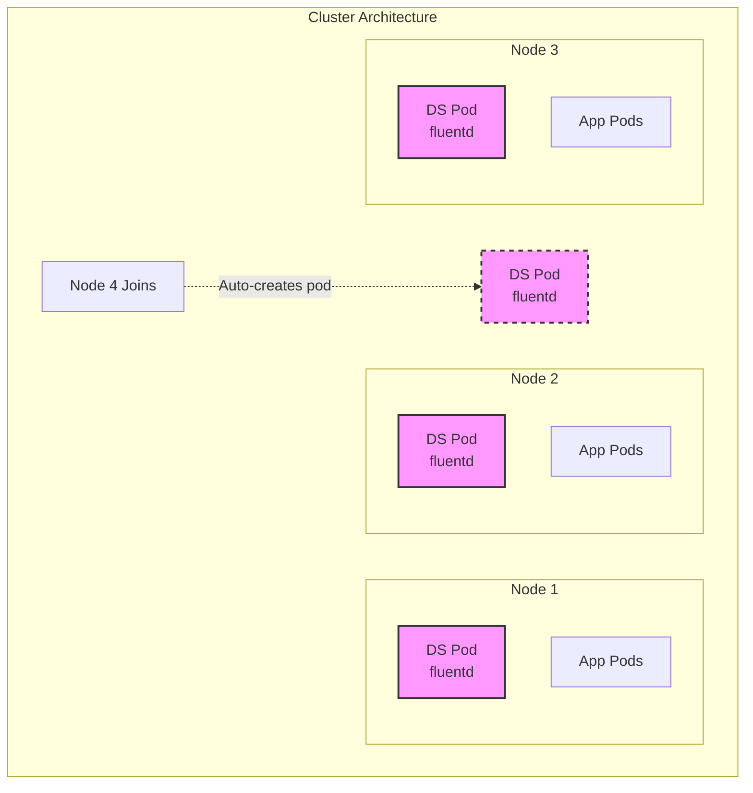
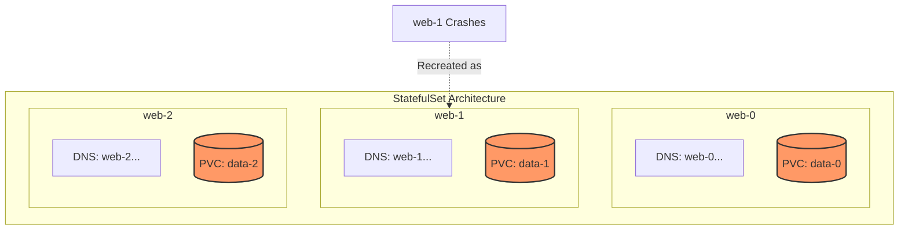
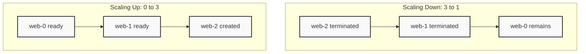
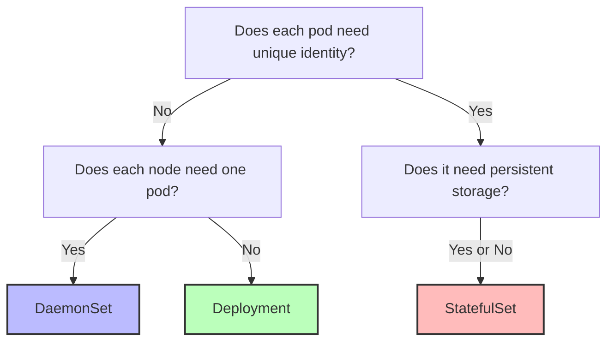

> **Complexity**: `[MEDIUM]` - Specialized workload patterns
>
> **Time to Complete**: 40-50 minutes
>
> **Prerequisites**: Module 2.1 (Pods), Module 2.2 (Deployments)

---

## What You'll Be Able to Do

After completing this module, you will be able to:

- **Deploy** DaemonSets for node-level services and StatefulSets for stateful applications across diverse Kubernetes 1.35+ architectures.
- **Compare** DaemonSet, Deployment, and StatefulSet behavior when identity, storage, update order, or node coverage affects application correctness.
- **Configure** DaemonSet tolerations, selectors, and StatefulSet headless Services so workloads land on the intended nodes and expose stable DNS names.
- **Diagnose** StatefulSet failures involving PVC retention, ordered rollout stalls, headless Service DNS records, and partitioned updates.
- **Design** workload-controller choices that match production requirements for logging agents, monitoring agents, databases, distributed systems, and stateless services.

## Why This Module Matters

Hypothetical scenario: your cluster autoscaler adds three worker nodes during a traffic spike, but the new nodes do not receive the log collector that forwards container logs to your incident-response system. The web application is healthy, the Deployment has enough replicas, and the node capacity looks fine, yet the exact nodes handling the busiest traffic are invisible to observability. A Deployment can spread replicas, but it cannot express the operational rule "one copy must run on every eligible node, including future nodes." That rule belongs to a DaemonSet, and the difference becomes visible at the worst possible moment.

Exercise scenario: a team tries to run a database cluster as a normal Deployment because the YAML feels familiar and the pods start successfully during a quiet test. Later, one replica moves to another node, receives a new pod name, and loses the stable DNS identity that the replication configuration expected. Kubernetes did what a Deployment promises: it kept the desired number of interchangeable pods running. The application needed a stronger promise: stable ordinal identity, predictable network names, and storage that stays paired with each replica.

This module teaches the two workload controllers you reach for when Deployments are too generic. DaemonSets solve node-local coverage problems such as logging, monitoring, networking, storage, and security agents. StatefulSets solve identity and storage problems for systems that treat individual replicas as named members rather than anonymous copies. The skill is not memorizing that "databases use StatefulSets" or "agents use DaemonSets"; the skill is recognizing the guarantee your workload needs and choosing the controller whose reconciliation loop naturally maintains that guarantee.

The hospital analogy from the original lesson is useful because it separates interchangeable service capacity from specialized placement. Deployments are like general practitioners: you can have more or fewer, and most patients do not care which one answers. DaemonSets are like security guards posted at entrances: every eligible entrance needs coverage, and a new entrance needs a guard automatically. StatefulSets are like surgeons with named rooms and dedicated tools: the identity matters, the equipment matters, and replacement must preserve the relationship between the person, room, and instruments.

## DaemonSets: Node-Level Coverage as a Contract

A DaemonSet ensures that all, or a selected subset, of nodes run a copy of a pod. When a matching node joins the cluster, the DaemonSet controller creates a pod for that node. When a node leaves, the associated pod is cleaned up with the node. The controller is therefore not asking, "How many replicas should exist?" in the way a Deployment does. It is asking, "Which nodes are eligible, and does each eligible node have its local copy?"

That distinction is why DaemonSets fit infrastructure components more naturally than ordinary applications. Log collectors need access to node-local log paths, network plugins need a presence on each node participating in the pod network, and security scanners often need visibility from the node boundary. A Deployment with anti-affinity can try to spread pods, but it cannot automatically track the node set as the cluster grows and shrinks. A DaemonSet turns node coverage into the desired state, so autoscaling events and node replacement events are part of normal reconciliation rather than special operational procedures.



The diagram shows the important mental model: the fourth pod is not a scaling decision made by a human after the new node appears. It is the natural result of the DaemonSet controller noticing that the new node matches the DaemonSet's placement rules. If a node does not match those rules because of labels, selectors, affinity, or taints that the pod does not tolerate, the absence of a pod is also expected behavior. Troubleshooting DaemonSets therefore starts by asking whether the node is eligible, not by asking whether the replica count is wrong.

| Use Case | Example |
|----------|---------|
| Log collection | Fluentd, Filebeat |
| Node monitoring | Node Exporter, Datadog agent |
| Network plugins | Calico, Cilium, Weave |
| Storage daemons | GlusterFS, Ceph |
| Security agents | Falco, Sysdig |

Those use cases share one property: each pod does useful work because of where it runs, not just because it exists somewhere in the cluster. A node exporter without a pod on a node cannot export that node's metrics. A log collector on one node cannot read arbitrary host paths from another node. A storage daemon that expects local disks must land on the machines with those disks. This placement-coupled value is the clearest signal that a DaemonSet may be the correct controller.

Creating a DaemonSet looks much like creating a Deployment because both controllers manage pods from a pod template. The defining differences are `kind: DaemonSet` and the absence of a `replicas` field. Replica count belongs to controllers that count interchangeable copies. A DaemonSet calculates its desired pod count from the set of eligible nodes, so setting an independent replica number would conflict with the controller's purpose.

```yaml
# fluentd-daemonset.yaml
apiVersion: apps/v1
kind: DaemonSet
metadata:
  name: fluentd
  labels:
    app: fluentd
spec:
  selector:
    matchLabels:
      app: fluentd
  template:
    metadata:
      labels:
        app: fluentd
    spec:
      containers:
      - name: fluentd
        image: fluentd:v1.35
        resources:
          limits:
            memory: 200Mi
          requests:
            cpu: 100m
            memory: 200Mi
        volumeMounts:
        - name: varlog
          mountPath: /var/log
      volumes:
      - name: varlog
        hostPath:
          path: /var/log
```

The `hostPath` volume in this example is not decorative; it explains why a DaemonSet is useful for this workload. The pod needs the `/var/log` directory from the node where it is running, and each node has its own local view of that path. A Deployment could accidentally concentrate replicas on a smaller set of nodes and leave other nodes uncollected. The DaemonSet makes the local-node relationship explicit.

```bash
kubectl apply -f fluentd-daemonset.yaml
```

Pause and predict: you have a five-node cluster and create this DaemonSet. Then a sixth node joins the cluster with labels and taints compatible with the pod template. Before reading further, decide how many fluentd pods should exist and whether you would need to edit a replica field. Now compare that with a Deployment set to five replicas and ask what would happen when the sixth node joins.

```bash
# List DaemonSets
kubectl get daemonsets
kubectl get ds
```

```bash
# Describe DaemonSet
kubectl describe ds fluentd
```

```bash
# Check pods created by DaemonSet
kubectl get pods -l app=fluentd -o wide
```

```bash
# Delete DaemonSet
kubectl delete ds fluentd
```

The `-o wide` view matters more for DaemonSets than it does for many stateless Deployments because the node column tells you whether coverage matches expectation. If the DaemonSet says desired pods are fewer than the cluster node count, that is not automatically a bug. It may mean selectors excluded some nodes, taints repelled the pod, or the cluster has unschedulable nodes. A good DaemonSet diagnosis reads the controller status together with node labels, taints, and pod scheduling events.

| Aspect | DaemonSet | Deployment |
|--------|-----------|------------|
| Pod count | One per node (automatic) | Specified replicas |
| Scheduling | Targets eligible nodes and then uses the scheduler to bind Pods | Uses scheduler |
| Node addition | Auto-creates pod | No automatic action |
| Use case | Node-level services | Application workloads |

The table captures the exam-level contrast, but production decisions need the deeper version. If the workload provides service capacity to users and any healthy pod can handle any request, a Deployment is usually simpler and more flexible. If the workload provides node-level functionality and missing a single eligible node is a correctness problem, a DaemonSet is the safer expression. If the workload requires stable identity or per-replica storage, neither table column is enough, and you move toward StatefulSet reasoning.

There is one more subtle difference that matters during maintenance windows. A Deployment can move capacity away from an unhealthy node if the scheduler finds a better place for a replacement pod, which is exactly what you want for stateless services. A DaemonSet does not try to move node responsibility elsewhere because the local work cannot be delegated cleanly. If the node is unhealthy, the node-local agent may also be unhealthy, and that absence is a signal about that node rather than a capacity problem elsewhere in the cluster.

When you review a DaemonSet manifest, read it from the bottom up as well as from the top down. The volumes and mounts usually reveal why the pod must run locally, the resource requests reveal the per-node tax it imposes, and the tolerations reveal which node boundaries it crosses. Then return to the selector and labels to confirm the controller can own the pods it creates. This habit catches many mistakes before you even run `kubectl apply`, especially mismatched labels and overly broad tolerations.

## DaemonSet Scheduling, Taints, and Updates

DaemonSets do not mean "ignore scheduling rules." They mean "create one pod for each node that the pod template can legally run on." That distinction prevents a common misconception: teams expect a DaemonSet to appear everywhere, then discover that control plane nodes, GPU nodes, or isolated storage nodes do not receive pods. The controller is still constrained by node labels, affinity, taints, resource requests, and readiness of the underlying node. Kubernetes 1.35 keeps that model consistent: the DaemonSet expresses desired coverage, while scheduling rules determine eligibility.

You often restrict a DaemonSet intentionally. A disk health monitor for SSD hosts should not consume CPU on standard nodes. A GPU telemetry agent should not run on nodes without GPUs. A host-level storage agent may be meaningful only on a labeled pool. The right question is not "How do I make the DaemonSet run everywhere?" but "What is the precise set of nodes whose local state this agent must observe or manage?"

```yaml
apiVersion: apps/v1
kind: DaemonSet
metadata:
  name: ssd-monitor
spec:
  selector:
    matchLabels:
      app: ssd-monitor
  template:
    metadata:
      labels:
        app: ssd-monitor
    spec:
      nodeSelector:
        disk: ssd            # Only nodes with this label
      containers:
      - name: monitor
        image: busybox
        command: ["sleep", "infinity"]
```

The selector above is deliberately simple because `nodeSelector` is easy to reason about during the CKA exam. In larger clusters, node affinity can express more complex placement, but the operational idea is identical: label the infrastructure meaningfully, then let the workload controller target labels instead of hard-coding node names. Labels survive node replacement patterns better than manual node lists, and they let platform teams document placement intent directly in the API.

```bash
# Label a node
kubectl label node worker-1 disk=ssd
```

```bash
# DaemonSet only runs on labeled nodes
kubectl get pods -l app=ssd-monitor -o wide
```

Taints are the other half of the placement story. A taint says that a node repels pods unless those pods declare a matching toleration. Control plane nodes commonly carry a `NoSchedule` taint because arbitrary application pods should not compete with the components that run the cluster. Some dedicated nodes use taints to reserve hardware or isolate sensitive workloads. A DaemonSet that truly must cover those nodes needs tolerations in its pod template.

```yaml
apiVersion: apps/v1
kind: DaemonSet
metadata:
  name: node-monitor
spec:
  selector:
    matchLabels:
      app: node-monitor
  template:
    metadata:
      labels:
        app: node-monitor
    spec:
      tolerations:
      # Tolerate control-plane taint
      - key: node-role.kubernetes.io/control-plane
        operator: Exists
        effect: NoSchedule
      # Tolerate all taints (run everywhere)
      - operator: Exists
      containers:
      - name: monitor
        image: prom/node-exporter
```

The broad `- operator: Exists` toleration is powerful and should be treated as an intentional design choice rather than a default. It says the pod may tolerate any taint, which can be appropriate for core node agents but risky for ordinary software. If you use it for a security agent, document why every node class must be covered. If you use it because a pod was pending and you did not investigate the taint, you may accidentally defeat isolation that another team depends on.

DaemonSet updates also deserve respect because node-level agents sit close to the health of the cluster. Updating all log collectors, network agents, or monitoring agents at the same instant can create blind spots or local disruption. The default `RollingUpdate` strategy limits unavailable DaemonSet pods so the cluster gradually replaces them. `OnDelete` shifts control to the operator: the controller records the new template, but individual pods update only when someone deletes the old pods.

```yaml
apiVersion: apps/v1
kind: DaemonSet
metadata:
  name: fluentd
spec:
  updateStrategy:
    type: RollingUpdate        # Default
    rollingUpdate:
      maxUnavailable: 1        # Update one node at a time
  selector:
    matchLabels:
      app: fluentd
  template:
    # ...
```

| Strategy | Behavior |
|----------|----------|
| [`RollingUpdate`](https://kubernetes.io/docs/tasks/manage-daemon/update-daemon-set/) | Gradually update pods, one node at a time |
| `OnDelete` | Only update when pod is manually deleted |

Before running this in a real cluster, what output would convince you that the update is progressing safely? Look at desired, current, ready, updated, and available counts together. If the updated count rises while ready pods stay near the desired count, the rollout is behaving as intended. If updated pods stall or ready pods drop sharply, inspect pod events, image pulls, resource pressure, and any node-specific failures before forcing the next step.

A useful DaemonSet troubleshooting loop has three layers. First, inspect the DaemonSet status to see what the controller believes should exist. Second, inspect the nodes that did not receive pods, including labels, taints, readiness, and schedulability. Third, inspect pending or failed pods for events that mention resource pressure, image pulls, host path access, or admission policies. Moving in that order keeps you from editing YAML randomly when the real issue is node eligibility.

Be careful with resource requests on DaemonSets because the cost scales with node count rather than replica count. A request that looks tiny on a three-node lab cluster may become meaningful across many worker nodes, and a memory-heavy agent can reduce allocatable capacity everywhere. This does not mean node agents should omit requests; it means requests must represent the real minimum needed for stable operation. Under-requested agents can be evicted or throttled precisely when the cluster is already under pressure.

The CKA often frames DaemonSet questions as "why is the pod missing from this node?" In those scenarios, resist the urge to recreate the controller first. Check whether the node has a taint the pod does not tolerate, whether a node selector excludes it, whether the node is cordoned, and whether the DaemonSet status already reports a lower desired count. Recreating the controller with the same template rarely changes the scheduling answer because the same rules are applied again.

## StatefulSets: Identity, Storage, and Ordered Change

StatefulSets manage applications whose replicas are not interchangeable. The controller gives each pod a stable ordinal name such as `web-0`, `web-1`, and `web-2`. It pairs those identities with stable network records through a headless Service and, when configured, stable PersistentVolumeClaims through `volumeClaimTemplates`. These guarantees matter when application members form a cluster, elect leaders, replicate data, shard workloads, or store local state that must reconnect to the same logical member after a restart.

Deployments intentionally hide pod identity because that is ideal for stateless services. A frontend replica that dies can be replaced by another pod with a different generated name, and a Service can load-balance traffic without clients knowing the difference. Stateful systems often have the opposite requirement. A peer may need to contact `web-0` specifically, a database replica may need its own disk, and a rolling update may need to proceed from the highest ordinal downward so the oldest or most central members are disturbed last.



The crash arrow is the key detail. If `web-1` disappears, Kubernetes does not create `web-3` as a replacement. The StatefulSet controller recreates `web-1`, preserving the identity that other members may reference. If the StatefulSet has a volume claim template, the replacement pod reuses the claim associated with that identity. That pairing is why StatefulSet troubleshooting usually includes three resources at once: the StatefulSet, the individual pod, and the PVC named for that pod.

| Use Case | Example |
|----------|---------|
| Databases | PostgreSQL, MySQL, MongoDB |
| Distributed systems | Kafka, Zookeeper, etcd |
| Search engines | Elasticsearch |
| Message queues | RabbitMQ |

The examples in the table are not a license to put every database into Kubernetes without thinking. Some stateful systems are better consumed as managed services, and some teams lack the operational maturity to run storage-heavy systems inside the cluster. The StatefulSet is a tool for expressing identity and storage semantics, not a promise that backup, failover, performance tuning, schema migration, and disaster recovery are solved. On the CKA, you need the controller mechanics; in production, you also need the application-specific runbook.

StatefulSets require a Service name because the controller uses it to shape stable DNS records. A headless Service, defined with `clusterIP: None`, is the usual companion because it returns endpoint records rather than hiding all pods behind a single virtual IP. The Service selector must match the StatefulSet pod labels, and the StatefulSet `serviceName` must reference that Service. If those fields do not line up, pods may exist and look healthy while DNS-based peer discovery fails.

```yaml
# Headless Service (required)
apiVersion: v1
kind: Service
metadata:
  name: nginx
  labels:
    app: nginx
spec:
  ports:
  - port: 80
    name: web
  clusterIP: None          # This makes it headless
  selector:
    app: nginx
```

The Service above has no ClusterIP, so it is not a normal load-balancing front door. It is a DNS and endpoint-discovery tool. For a stateless web application, you often want a stable Service name that spreads requests across any ready replica. For a stateful member set, you often want the option to address a specific ordinal pod because client libraries, cluster members, or replication configuration may need stable peer names.

```yaml
# StatefulSet
apiVersion: apps/v1
kind: StatefulSet
metadata:
  name: web
spec:
  serviceName: nginx       # Must reference the headless service
  replicas: 3
  selector:
    matchLabels:
      app: nginx
  template:
    metadata:
      labels:
        app: nginx
    spec:
      containers:
      - name: nginx
        image: nginx
        ports:
        - containerPort: 80
        volumeMounts:
        - name: data
          mountPath: /usr/share/nginx/html
  volumeClaimTemplates:    # Creates PVC for each pod
  - metadata:
      name: data
    spec:
      accessModes: ["ReadWriteOnce"]
      resources:
        requests:
          storage: 1Gi
```

The volume claim template creates one PVC per pod ordinal, not one shared claim for the whole StatefulSet. That is why a three-replica StatefulSet with a template named `data` produces claims such as `data-web-0`, `data-web-1`, and `data-web-2`. Each claim has its own lifecycle and binding status. If `web-1` is pending because its claim cannot bind, scaling or restarting the StatefulSet will not fix the root cause; you need to inspect storage classes, capacity, access modes, and events on the PVC.

```bash
# Pod DNS names follow pattern:
# <pod-name>.<service-name>.<namespace>.svc.cluster.local
```

```bash
# For StatefulSet "web" with headless service "nginx":
web-0.nginx.default.svc.cluster.local
web-1.nginx.default.svc.cluster.local
web-2.nginx.default.svc.cluster.local
```

```bash
# Other pods can reach specific instances:
curl web-0.nginx
curl web-1.nginx
```

Pause and predict: if you delete pod `web-1` from a StatefulSet, what name should the replacement pod have, and which PVC should it mount? Your answer should connect identity and storage together. If you answer only "the pod comes back," you are thinking like a Deployment operator. If you answer "`web-1` comes back and reuses the storage for `web-1`," you are thinking like a StatefulSet operator.

```bash
# Each pod gets its own PVC named:
# <volumeClaimTemplates.name>-<pod-name>
data-web-0
data-web-1
data-web-2
```

```bash
# When pod restarts, it reattaches to its specific PVC
# Data persists across pod restarts
```

PVC retention is intentionally conservative because accidental data deletion is harder to recover from than an extra cleanup step. By default, deleting a StatefulSet does not automatically delete the PVCs created from its `volumeClaimTemplates`. Newer Kubernetes versions support configurable persistent volume claim retention policies, but the safety principle remains the same: know whether you are deleting compute, identity, storage claims, or the underlying data. Many expensive storage surprises come from deleting only the controller and leaving claims behind.

The storage pairing also changes how you think about node failure. If `web-1` moves to a different node, the important question is not whether the new pod has the same IP address; it usually will not. The important question is whether the logical member `web-1` can reattach the correct claim and rejoin peers under the same DNS identity. StatefulSet identity is therefore logical identity, not physical node identity. The pod may move, but the member name and storage relationship remain stable.

Do not confuse a StatefulSet with a backup strategy. A retained PVC protects against accidental pod deletion, but it does not protect against corrupted data, application-level mistakes, region failure, or a storage backend problem. StatefulSets make it easier to run systems that expect named members; they do not remove the need for snapshots, restores, replication testing, and upgrade runbooks. On real platforms, the StatefulSet manifest should be only one part of a larger operational design.

When storage binding stalls, the fastest useful clue is often on the PVC rather than the pod. A pod event may say the volume is unavailable, but the PVC event can reveal whether no StorageClass matched, capacity was unavailable, an access mode was unsupported, or a dynamic provisioner failed. Because StatefulSets create predictable claim names, you can quickly map `web-2` to `data-web-2` and inspect the exact resource that blocks that ordinal. That mapping is one of the main reasons the naming convention is worth memorizing.

## StatefulSet Operations and Headless Service DNS

StatefulSets enforce ordered creation and deletion by default. When scaling from zero to three, `web-0` is created and must become Running and Ready before `web-1` proceeds, and `web-1` must be ready before `web-2` proceeds. When scaling down, the controller removes higher ordinals first. This behavior protects systems where startup order, peer discovery, or leadership assumptions depend on earlier members being available before later members join.



The ordered default can also make failures look confusing. If `web-0` cannot become Ready, `web-1` and `web-2` may never appear during initial creation. That is not because the scheduler forgot about them; it is because the controller is honoring `OrderedReady`. In a real incident, this is useful information. You inspect the earliest missing or unready ordinal first because later ordinals may simply be waiting for it rather than failing independently.

```yaml
apiVersion: apps/v1
kind: StatefulSet
metadata:
  name: web
spec:
  podManagementPolicy: OrderedReady   # Default - sequential
  # podManagementPolicy: Parallel     # All at once (like Deployment)
```

| Policy | Behavior |
|--------|----------|
| `OrderedReady` | Sequential creation/deletion (default) |
| `Parallel` | All pods created/deleted simultaneously |

`Parallel` pod management is not a performance button for every StatefulSet. It is appropriate only when the application does not need ordered readiness for correctness. Some workloads need stable identities and independent storage but do not require sequential startup, so parallel creation can reduce rollout time. Other distributed systems assume the lower ordinal members exist first, and parallel creation can amplify failure noise. Choose the policy from the application's membership model, not from impatience during a rollout.

StatefulSet rolling updates proceed in a controlled ordinal order. The `partition` field lets you canary a change by updating only pods whose ordinal is greater than or equal to the partition. With three replicas and `partition: 2`, only `web-2` receives the new template. This is a native way to test a new image or configuration against one member while preserving the rest of the set on the old version.

```yaml
apiVersion: apps/v1
kind: StatefulSet
metadata:
  name: web
spec:
  updateStrategy:
    type: RollingUpdate
    rollingUpdate:
      partition: 2          # Only update pods >= 2
```

Which approach would you choose here and why: a partitioned StatefulSet rollout or a separate canary Deployment? If the application member must keep a stable ordinal and its own storage, a StatefulSet partition matches the risk you are trying to control. If the workload is stateless and can receive traffic through ordinary Service load balancing, a Deployment canary may be simpler. The controller choice should follow the unit of risk: anonymous capacity for Deployments, named members for StatefulSets.

```bash
# List StatefulSets
kubectl get statefulsets
kubectl get sts
```

```bash
# Describe
kubectl describe sts web
```

```bash
# Scale
kubectl scale sts web --replicas=5
```

```bash
# Check pods (notice ordered names)
kubectl get pods -l app=nginx
```

```bash
# Check PVCs (one per pod)
kubectl get pvc
```

```bash
# Delete StatefulSet (PVCs remain!)
kubectl delete sts web
```

```bash
# Delete PVCs manually
kubectl delete pvc data-web-0 data-web-1 data-web-2
```

Headless Services complete the StatefulSet story because they expose stable records without forcing every connection through a single virtual IP. A normal Service receives a ClusterIP, and clients resolve the Service name to that virtual IP. A headless Service skips that virtual IP and lets DNS return endpoint information directly. For StatefulSets, the important benefit is not merely "multiple IPs"; it is the ability to resolve per-pod names that encode ordinal identity.

```yaml
# Regular Service
apiVersion: v1
kind: Service
metadata:
  name: nginx-regular
spec:
  selector:
    app: nginx
  ports:
  - port: 80
# DNS: nginx-regular -> ClusterIP (load balanced)
```

```yaml
# Headless Service
apiVersion: v1
kind: Service
metadata:
  name: nginx-headless
spec:
  clusterIP: None           # Headless!
  selector:
    app: nginx
  ports:
  - port: 80
# DNS: nginx-headless -> Returns all pod IPs
# DNS: web-0.nginx-headless -> Specific pod IP
```

```bash
# Regular service - returns ClusterIP
nslookup nginx-regular
# Server: 10.96.0.10
# Address: 10.96.0.10#53
# Name: nginx-regular.default.svc.cluster.local
# Address: 10.96.100.50  (ClusterIP)
```

```bash
# Headless service - returns pod IPs
nslookup nginx-headless
# Server: 10.96.0.10
# Address: 10.96.0.10#53
# Name: nginx-headless.default.svc.cluster.local
# Address: 10.244.1.5  (Pod IP)
# Address: 10.244.2.6  (Pod IP)
# Address: 10.244.3.7  (Pod IP)
```

When DNS fails for a StatefulSet, avoid jumping straight to CoreDNS as the culprit. First check that the Service is headless, the selector matches the pod labels, the StatefulSet `serviceName` matches the Service name, the pods are Ready when readiness is required for records, and the query uses the correct namespace. DNS is often the symptom of a mismatch in ordinary Kubernetes objects. The best troubleshooters move from the API objects to the generated endpoints and only then to the DNS layer.

Ordered updates have a similar diagnostic rhythm. If a StatefulSet rollout pauses, identify the highest ordinal that should have updated and inspect that pod before changing the partition or deleting lower ordinals. The controller may be waiting because the updated pod is not Ready, because its PVC cannot mount, or because the application rejects the new configuration. Forcing additional pods to update before understanding that first failure can turn a controlled canary into a multi-member outage.

Partitioned rollouts are especially valuable when application correctness depends on cluster quorum. Updating one high ordinal lets you observe logs, readiness, peer membership, and storage behavior while most members continue running the old version. Once the canary behaves correctly, lowering the partition gradually expands the rollout. This is slower than replacing every pod at once, but the slowness is a feature for systems where each member carries identity and possibly data.

The headless Service is also a teaching example for why Kubernetes separates controllers from discovery. The StatefulSet owns the pod identities and update order, while the Service selects pods and exposes DNS records. If either half is wrong, the system can fail in a way that looks like the other half is broken. A correct StatefulSet with a wrong Service selector will still create pods, and a correct headless Service cannot invent stable ordinals for pods that are not managed by a StatefulSet.

## Comparing Controllers for Real Workloads

The cleanest way to compare Deployments, DaemonSets, and StatefulSets is to ask what a replacement pod is allowed to forget. A Deployment pod may forget its name, its node, and usually its local filesystem because another pod can serve the same role. A DaemonSet pod may forget its individual pod name, but it cannot forget which node it serves, because node-local work is the point. A StatefulSet pod may be rescheduled, but it must keep its logical name and any storage identity attached to that name.

| Aspect | Deployment | StatefulSet |
|--------|------------|-------------|
| Pod names | Random suffix (nginx-5d5dd5d5fb-xyz) | Ordinal index (web-0, web-1) |
| Network identity | None (use Service) | Stable DNS per pod |
| Storage | Shared or none | Dedicated PVC per pod |
| Scaling order | Any order | Sequential (ordered) |
| Rolling update | No stable ordinal update order guarantee | Reverse ordinal order (N-1 first) |
| Use case | Stateless apps | Stateful apps |

This comparison does not include DaemonSet because it answers a different first question. Deployments and StatefulSets both manage application replica sets, but they disagree about identity. DaemonSets manage node coverage, so the first question is whether every eligible node needs a local pod. Once you see the axes separately, controller choice becomes less mystical: node coverage points to DaemonSet, stable identity points to StatefulSet, and anonymous horizontal capacity points to Deployment.



The flowchart intentionally asks about identity before storage because some stateful protocols need stable names even when storage is external. A clustered application may store data elsewhere but still need predictable peer addresses. Conversely, an application might mount persistent storage but remain effectively single-replica and not need a multi-member StatefulSet. Use the chart as a starting point, then verify the application's own documentation, especially for databases and distributed systems that have strict membership rules.

Exercise scenario: a database depends on per-replica identity for peer configuration, and someone proposes a Deployment because it is easier to scale. The safer default is a StatefulSet because Kubernetes will preserve ordinal names, predictable DNS records, and PVC pairing. That does not mean the StatefulSet alone makes the database highly available. It means the Kubernetes controller now expresses the identity model the database already assumes, which gives your backup, failover, and recovery procedures a stable platform to build on.

Another way to evaluate controller choice is to imagine deleting a single pod during a quiet maintenance window. If deleting any pod merely causes another equivalent pod to appear, a Deployment is probably fine. If deleting a pod must produce a replacement on the same node class because node-local coverage matters, the DaemonSet model is showing through. If deleting a pod must preserve the same member name and storage identity, a StatefulSet is the model that matches the consequence you care about.

This deletion thought experiment is useful because it avoids product names. "Kafka" and "PostgreSQL" often lead people to memorized answers, but real environments contain custom services, vendor agents, and hybrid patterns. Ask what the workload must remember after disruption. Must it remember the node, the ordinal, the disk, or nothing at all? The answer is more reliable than the application's category label, especially when a vendor chart hides several controllers behind one installation command.

Controller choice also affects who owns operational work. DaemonSets are often platform-team assets because they touch every node and can affect cluster-wide observability or networking. StatefulSets often sit closer to application and data teams because their correctness depends on application-specific recovery procedures. Deployments are shared ground for ordinary services. When ownership is unclear, incidents get slower, so include controller type and cleanup behavior in runbooks and service documentation.

## Patterns & Anti-Patterns

Patterns are useful because they connect API fields to operational intent. A DaemonSet with a broad toleration is not inherently good or bad; it is good when the workload is a cluster-critical node agent that must run on every node class, and bad when it lets an ordinary application bypass placement boundaries. A StatefulSet with retained PVCs is not clutter; it is a data-safety default. The pattern is the reason behind the YAML, not the YAML by itself.

| Pattern | When to Use It | Why It Works | Scaling Consideration |
|---------|----------------|--------------|-----------------------|
| Node agent DaemonSet | Logging, metrics, security, networking, or storage agents need local node access | The controller reconciles one pod per eligible node as nodes join or leave | Watch resource requests because every new node receives another pod |
| Label-scoped DaemonSet | Only certain node pools need an agent, such as SSD, GPU, or storage nodes | Labels describe infrastructure capability and keep placement declarative | Keep labels automated through node provisioning or documented operations |
| Headless Service plus StatefulSet | Members need stable peer names such as `web-0.nginx` | The Service and StatefulSet combine DNS records with ordinal pod identity | Verify selector, namespace, and `serviceName` before blaming DNS |
| StatefulSet PVC template | Each member needs its own disk or persistent data directory | Claims are generated per ordinal and reattached after pod replacement | Plan cleanup and retention so unused claims do not consume storage indefinitely |

The strongest pattern in this module is separating desired behavior from cleanup behavior. StatefulSets preserve PVCs because data loss is more dangerous than leftover claims. DaemonSets clean up their pods when nodes disappear because node-local agents without nodes have no useful work to do. These lifecycle choices are not arbitrary defaults. They mirror the cost of being wrong: losing database storage is severe, while leaving a node agent pod around for a removed node is pointless.

For DaemonSets, a mature pattern is to design the manifest as part of node lifecycle management. If autoscaling adds nodes, the agent appears automatically; if node provisioning adds labels, the DaemonSet follows those labels; if dedicated node pools use taints, the tolerations document which agents are allowed through. This makes platform behavior auditable. Someone reading the YAML can see not only that an agent exists, but which classes of nodes it is expected to cover.

For StatefulSets, a mature pattern is to document storage cleanup separately from application cleanup. The command that removes the controller should not be the same mental operation as the command that removes data. In practice, teams often require a second review, a backup check, or an explicit change ticket before deleting retained claims. That ceremony may feel slow, but it matches the risk profile of stateful data far better than automatic deletion hidden behind controller removal.

Anti-patterns often start from familiar YAML. A Deployment is familiar, so teams use it for databases. A DaemonSet sounds like "run everywhere," so teams add a universal toleration without understanding taints. A headless Service looks like a normal Service with one field changed, so teams forget that selectors and readiness still affect endpoint records. Most failures are not caused by obscure Kubernetes features; they are caused by applying a correct feature to the wrong operational question.

| Anti-Pattern | What Goes Wrong | Better Alternative |
|--------------|-----------------|--------------------|
| Deployment for a multi-member database | Pod names change, PVC pairing is awkward, and peers cannot rely on ordinal identity | Use a StatefulSet with a headless Service and explicit storage planning |
| DaemonSet as a cheap replica spreader | It creates node-coupled pods even when the application only needs capacity | Use a Deployment with topology spread or affinity rules |
| Universal toleration without review | Workloads may land on isolated or control plane nodes unexpectedly | Add only the tolerations required by the node-level responsibility |
| Deleting StatefulSet and assuming data is gone | PVCs remain bound and storage cost continues | Audit PVCs and use retention policy intentionally |
| Troubleshooting DNS before labels | Headless Service records fail because selectors do not match pods | Compare Service selector, pod labels, endpoints, and namespace first |

## Decision Framework

Start controller selection with the guarantee that would break the workload if Kubernetes failed to maintain it. If missing one node means missing logs, metrics, networking, or security coverage, choose a DaemonSet and then refine eligibility with labels and tolerations. If replacing a pod with a new anonymous name is harmless, choose a Deployment and keep the system simple. If a pod's name, ordinal, storage claim, or peer identity must survive replacement, choose a StatefulSet and design the Service and PVC behavior deliberately.

| Requirement | Prefer | Reason | First Diagnostic When It Fails |
|-------------|--------|--------|--------------------------------|
| One local agent on each eligible node | DaemonSet | Desired count follows matching nodes | Compare node labels, taints, and DaemonSet desired count |
| Stateless request handling with interchangeable pods | Deployment | Replica count is independent of node count | Inspect ReplicaSet, pods, Service endpoints, and readiness |
| Stable pod names and DNS records | StatefulSet | Ordinals provide predictable identity | Check `serviceName`, headless Service, selectors, endpoints, and namespace |
| One PVC per named member | StatefulSet | `volumeClaimTemplates` create per-ordinal claims | Inspect PVC events, StorageClass, access mode, and binding state |
| Controlled single-member stateful canary | StatefulSet partition | Only ordinals at or above the partition update | Check update strategy, partition value, image, and pod ordinal |

Use this framework during exams by converting the scenario into a sentence. "I need one pod on every node" maps to DaemonSet. "I need five anonymous web replicas" maps to Deployment. "I need `db-0` and `db-1` to keep names and disks" maps to StatefulSet. Then prove the choice by naming the fields you would inspect: DaemonSet selectors and tolerations, Deployment replicas and Service endpoints, or StatefulSet `serviceName`, ordinal pods, and PVCs.

During troubleshooting, the same framework becomes a map for where to look first. For a DaemonSet, compare intended node coverage with actual pod placement and explain every missing node through eligibility. For a Deployment, compare desired replicas with available pods and Service endpoints. For a StatefulSet, follow the ordinal: pod, DNS name, PVC, readiness, and update state. This keeps the investigation aligned with the controller's promise instead of treating every workload as a generic pod problem.

It is also acceptable to combine controllers in one product, as long as each controller has a clean responsibility. A logging stack might use a DaemonSet for node collectors, a Deployment for an ingestion API, and a StatefulSet for a storage backend. That is not inconsistency; it is good modeling. Each part receives the reconciliation behavior it needs, and failures become easier to isolate because node coverage, stateless service capacity, and stateful storage are represented by separate objects.

## Did You Know?

- DaemonSets automatically respond to node membership changes, so adding a matching node creates another DaemonSet pod without editing a replica count.
- StatefulSet pod ordinals start at 0 by default and proceed sequentially, so a three-replica set normally creates `web-0`, `web-1`, and `web-2`.
- A headless Service uses `clusterIP: None`, which means DNS can return endpoint records directly instead of a single virtual Service IP.
- StatefulSet PVCs are retained by default when the controller is deleted, and Kubernetes also provides retention policy fields for teams that need explicit cleanup behavior.

## Common Mistakes

| Mistake | Why It Happens | How to Fix It |
|---------|----------------|---------------|
| Creating a StatefulSet without a matching headless Service | The pods run, so the missing stable DNS path is not obvious until peer discovery fails | Create a Service with `clusterIP: None`, match selectors to pod labels, and set `spec.serviceName` correctly |
| Deleting a StatefulSet and expecting PVC cleanup | Operators think controller deletion implies data deletion | Inspect PVCs after deletion and remove claims only when the data is intentionally retired |
| Using a Deployment for a clustered database | The Deployment manifest is familiar and starts pods quickly | Use a StatefulSet when stable ordinal identity, peer names, or per-member storage matters |
| Letting a DaemonSet run on more nodes than intended | A broad toleration or missing selector makes every node eligible | Scope nodes with labels, affinity, and precise tolerations that match the agent's responsibility |
| Forgetting the DaemonSet selector/template label match | The API requires selectors to match the pod template labels | Keep `spec.selector.matchLabels` and `template.metadata.labels` aligned before applying |
| Misreading ordered StatefulSet stalls | Later pods are absent, so the failure appears widespread | Diagnose the lowest unready ordinal first because later ordinals may be waiting |
| Updating a StatefulSet with an unexpected partition | Some pods keep the old template by design | Check `spec.updateStrategy.rollingUpdate.partition` and lower it deliberately after validation |
| Troubleshooting headless DNS without checking endpoints | DNS looks broken, but the Service has no matching or ready endpoints | Verify Service selector, pod labels, endpoint slices, readiness, and namespace before editing CoreDNS |

## Quiz

1. **Your monitoring team needs exactly one log collector pod on every node, including nodes added later. A colleague suggests using a Deployment with `replicas` set to the current node count and pod anti-affinity. Why is a DaemonSet the better controller, and what should happen when a new eligible node joins?**

   <details>
   <summary>Answer</summary>

   A DaemonSet is better because its desired state is tied to eligible nodes rather than to a manually chosen replica count. When a new node joins and matches the pod's selectors, taints, and resource requirements, the DaemonSet controller creates a log collector pod for that node automatically. A Deployment with anti-affinity can spread replicas, but it still counts pods rather than nodes, so a new node would not necessarily receive coverage. The diagnostic proof is `kubectl get pods -l app=<label> -o wide`, where you should see one pod on each intended node.

   </details>

2. **You are deploying a three-member PostgreSQL-style cluster where each member needs a stable DNS name and its own persistent volume. Which controller and supporting Service pattern should you use, and what happens if `web-1` crashes?**

   <details>
   <summary>Answer</summary>

   Use a StatefulSet with a headless Service, because the workload requires stable per-member identity rather than anonymous replicas. The headless Service enables predictable names such as `web-1.nginx.default.svc.cluster.local`, while `volumeClaimTemplates` create per-ordinal PVCs such as `data-web-1`. If `web-1` crashes, the StatefulSet controller recreates `web-1` rather than creating `web-3`, and it reattaches the PVC associated with that ordinal. That behavior preserves peer configuration and storage identity across pod replacement.

   </details>

3. **You delete a StatefulSet with `kubectl delete sts web`, but storage usage does not drop. What happened, and what should you inspect before deleting anything else?**

   <details>
   <summary>Answer</summary>

   The PVCs created by the StatefulSet's `volumeClaimTemplates` were retained, which is the safe default for stateful data. Deleting the controller removes the controller and pods, but it does not automatically mean the data is disposable. Inspect the PVCs, their bound PersistentVolumes, backups, retention requirements, and any application recovery plan before removing claims. Once you are certain the data is no longer needed, delete the specific PVCs deliberately.

   </details>

4. **A StatefulSet scaled from one replica to three creates `web-0` but never creates `web-1`. The scheduler has capacity, and no quota is exceeded. What behavior should you suspect first, and where should you look?**

   <details>
   <summary>Answer</summary>

   Suspect the default `OrderedReady` pod management policy. The StatefulSet controller will not proceed to `web-1` until `web-0` is Running and Ready, so later pods can be absent because the first ordinal is unhealthy. Inspect `web-0` events, readiness probes, logs, image pulls, PVC binding, and Service dependencies before chasing nonexistent failures on later ordinals. If the application truly does not require ordered readiness, then `Parallel` may be appropriate, but that is an application design decision.

   </details>

5. **You need to test a risky StatefulSet image on only one member of a five-replica set while keeping the rest on the old version. How can the `partition` field help, and which pod updates first with `partition: 4`?**

   <details>
   <summary>Answer</summary>

   The StatefulSet rolling update partition updates only pods with ordinals greater than or equal to the partition. In a five-replica set with ordinals `web-0` through `web-4`, setting `partition: 4` updates only `web-4`. The lower ordinals remain on the old template until you lower the partition. This is useful for stateful canaries because the canary remains a real named member of the set instead of an anonymous extra pod.

   </details>

6. **A security scanner DaemonSet is absent from control plane nodes during an audit, but it runs on worker nodes. What is the likely placement cause, and how do you resolve it without making every workload tolerate the taint?**

   <details>
   <summary>Answer</summary>

   The control plane nodes are likely tainted with a `NoSchedule` taint such as `node-role.kubernetes.io/control-plane`, so pods without a matching toleration are repelled. Add a toleration to the DaemonSet pod template because this specific node-level scanner requires control plane coverage. Do not remove the taint globally or teach unrelated workloads to tolerate it. Verify the result by checking DaemonSet desired and ready counts together with `kubectl get pods -o wide`.

   </details>

7. **A developer runs `nslookup nginx-headless` and sees several pod IPs instead of one load-balanced virtual IP. Why is this expected for a headless Service, and why does that help StatefulSets?**

   <details>
   <summary>Answer</summary>

   A headless Service has `clusterIP: None`, so Kubernetes does not allocate a single virtual Service IP for clients to use. DNS can return records for the backing endpoints directly, and StatefulSets can also expose predictable per-pod names tied to ordinals. This helps stateful applications because clients or peers can choose a specific member instead of being load-balanced randomly. If the records are missing, inspect Service selectors, pod labels, readiness, endpoint slices, and namespace before changing DNS components.

   </details>

## Hands-On Exercise

This lab preserves the original module's practical path: create a DaemonSet, observe one-pod-per-node behavior, create a StatefulSet with a headless Service, and then prove that StatefulSet names and DNS records are stable. Run it on a disposable Kubernetes 1.35+ practice cluster because the commands create and delete resources. If your environment has only one node, the DaemonSet portion still works, but the "one per node" observation will be less interesting than it is on a multi-node cluster.

### Part A: DaemonSet Coverage

Create a small DaemonSet whose pod prints its hostname. The image and command are intentionally simple so the controller behavior is the focus rather than the application. After applying the manifest, compare DaemonSet desired, current, and ready counts with the number of schedulable nodes. Then look at the pod node placement with `-o wide`.

```bash
cat > node-monitor-ds.yaml << 'EOF'
apiVersion: apps/v1
kind: DaemonSet
metadata:
  name: node-monitor
spec:
  selector:
    matchLabels:
      app: node-monitor
  template:
    metadata:
      labels:
        app: node-monitor
    spec:
      containers:
      - name: monitor
        image: busybox
        command: ["sh", "-c", "while true; do echo $(hostname); sleep 60; done"]
        resources:
          limits:
            memory: 50Mi
            cpu: 50m
EOF

kubectl apply -f node-monitor-ds.yaml
```

```bash
kubectl get pods -l app=node-monitor -o wide
kubectl get ds node-monitor
# DESIRED = CURRENT = READY = number of eligible nodes
```

```bash
kubectl logs -l app=node-monitor --all-containers
```

```bash
kubectl delete ds node-monitor
rm node-monitor-ds.yaml
```

<details>
<summary>Solution notes</summary>

The DaemonSet should create one pod on each eligible node. If the counts are lower than the number of nodes you expected, inspect node taints, selectors, unschedulable status, and pod events. The cleanup removes the controller and its pods because DaemonSet pods are owned by the controller and tied to node coverage rather than retained storage.

</details>

### Part B: StatefulSet Identity

Now create a headless Service and a StatefulSet. The Service selector and StatefulSet labels must match, and the StatefulSet `serviceName` must reference the Service. Watch the pods appear in ordinal order, then query pod-specific DNS names from a temporary BusyBox pod. This proves that Kubernetes is maintaining identity, not just replica count.

```bash
cat > statefulset-demo.yaml << 'EOF'
apiVersion: v1
kind: Service
metadata:
  name: nginx
spec:
  clusterIP: None
  selector:
    app: nginx
  ports:
  - port: 80
---
apiVersion: apps/v1
kind: StatefulSet
metadata:
  name: web
spec:
  serviceName: nginx
  replicas: 3
  selector:
    matchLabels:
      app: nginx
  template:
    metadata:
      labels:
        app: nginx
    spec:
      containers:
      - name: nginx
        image: nginx
        ports:
        - containerPort: 80
EOF

kubectl apply -f statefulset-demo.yaml
```

```bash
kubectl get pods -l app=nginx -w
# web-0 Running, then web-1, then web-2
```

```bash
kubectl run dns-test --image=busybox --rm -it --restart=Never -- nslookup web-0.nginx
kubectl run dns-test --image=busybox --rm -it --restart=Never -- nslookup web-1.nginx
```

```bash
kubectl scale sts web --replicas=1
kubectl get pods -l app=nginx -w
# web-2 terminates, then web-1
```

```bash
kubectl scale sts web --replicas=3
kubectl get pods -l app=nginx -w
# web-1 created, then web-2
```

```bash
kubectl delete -f statefulset-demo.yaml
rm statefulset-demo.yaml
```

<details>
<summary>Solution notes</summary>

The StatefulSet should create pods in ordinal order and preserve the names when you scale down and back up. The DNS test should resolve pod-specific names through the headless Service. If DNS fails, compare the Service selector, pod labels, namespace, pod readiness, and `serviceName` before assuming a CoreDNS failure.

</details>

### Additional Practice Drills

Use these drills when you want faster repetitions of the same ideas. They intentionally keep manifests small so you can focus on controller behavior under time pressure. Run one drill at a time, read the expected outcome before cleanup, and avoid leaving temporary taints or PVCs behind in shared clusters.

```bash
# Drill 1: DaemonSet creation
cat << 'EOF' | kubectl apply -f -
apiVersion: apps/v1
kind: DaemonSet
metadata:
  name: log-collector
spec:
  selector:
    matchLabels:
      app: log-collector
  template:
    metadata:
      labels:
        app: log-collector
    spec:
      containers:
      - name: collector
        image: busybox
        command: ["sleep", "infinity"]
EOF
```

```bash
kubectl get ds log-collector
kubectl get pods -l app=log-collector -o wide
kubectl delete ds log-collector
```

```bash
# Drill 2: DaemonSet with nodeSelector
NODE=$(kubectl get nodes -o jsonpath='{.items[0].metadata.name}')
kubectl label node $NODE disk=ssd
```

```bash
cat << 'EOF' | kubectl apply -f -
apiVersion: apps/v1
kind: DaemonSet
metadata:
  name: ssd-only
spec:
  selector:
    matchLabels:
      app: ssd-only
  template:
    metadata:
      labels:
        app: ssd-only
    spec:
      nodeSelector:
        disk: ssd
      containers:
      - name: app
        image: busybox
        command: ["sleep", "infinity"]
EOF
```

```bash
kubectl get pods -l app=ssd-only -o wide
kubectl delete ds ssd-only
kubectl label node $NODE disk-
```

```bash
# Drill 3: StatefulSet basic
cat << 'EOF' | kubectl apply -f -
apiVersion: v1
kind: Service
metadata:
  name: db
spec:
  clusterIP: None
  selector:
    app: db
  ports:
  - port: 5432
---
apiVersion: apps/v1
kind: StatefulSet
metadata:
  name: db
spec:
  serviceName: db
  replicas: 3
  selector:
    matchLabels:
      app: db
  template:
    metadata:
      labels:
        app: db
    spec:
      containers:
      - name: postgres
        image: busybox
        command: ["sleep", "infinity"]
EOF
```

```bash
kubectl get pods -l app=db -w &
sleep 30
kill %1
kubectl get pods -l app=db
kubectl delete sts db
kubectl delete svc db
```

```bash
# Drill 4: StatefulSet DNS test
cat << 'EOF' | kubectl apply -f -
apiVersion: v1
kind: Service
metadata:
  name: nginx
spec:
  clusterIP: None
  selector:
    app: nginx
  ports:
  - port: 80
---
apiVersion: apps/v1
kind: StatefulSet
metadata:
  name: web
spec:
  serviceName: nginx
  replicas: 2
  selector:
    matchLabels:
      app: nginx
  template:
    metadata:
      labels:
        app: nginx
    spec:
      containers:
      - name: nginx
        image: nginx
EOF
```

```bash
kubectl wait --for=condition=ready pod/web-0 pod/web-1 --timeout=60s
kubectl run dns-test --image=busybox --rm -it --restart=Never -- nslookup nginx
kubectl run dns-test --image=busybox --rm -it --restart=Never -- nslookup web-0.nginx
kubectl run dns-test --image=busybox --rm -it --restart=Never -- nslookup web-1.nginx
kubectl delete sts web
kubectl delete svc nginx
```

```bash
# Drill 5: StatefulSet scaling order
cat << 'EOF' | kubectl apply -f -
apiVersion: v1
kind: Service
metadata:
  name: order-test
spec:
  clusterIP: None
  selector:
    app: order-test
  ports:
  - port: 80
---
apiVersion: apps/v1
kind: StatefulSet
metadata:
  name: order
spec:
  serviceName: order-test
  replicas: 1
  selector:
    matchLabels:
      app: order-test
  template:
    metadata:
      labels:
        app: order-test
    spec:
      containers:
      - name: nginx
        image: nginx
EOF
```

```bash
kubectl scale sts order --replicas=3
kubectl get pods -l app=order-test -w &
sleep 30
kill %1
kubectl scale sts order --replicas=1
kubectl get pods -l app=order-test -w &
sleep 30
kill %1
kubectl delete sts order
kubectl delete svc order-test
```

```bash
# Drill 6: Troubleshooting a DaemonSet missing a tainted node
NODE=$(kubectl get nodes -o jsonpath='{.items[0].metadata.name}')
kubectl taint node $NODE special=true:NoSchedule
```

```bash
cat << 'EOF' | kubectl apply -f -
apiVersion: apps/v1
kind: DaemonSet
metadata:
  name: no-toleration
spec:
  selector:
    matchLabels:
      app: no-toleration
  template:
    metadata:
      labels:
        app: no-toleration
    spec:
      containers:
      - name: app
        image: busybox
        command: ["sleep", "infinity"]
EOF
```

```bash
kubectl get pods -l app=no-toleration -o wide
kubectl get ds no-toleration
kubectl delete ds no-toleration
```

<details>
<summary>Solution for the taint drill</summary>

```bash
cat << 'EOF' | kubectl apply -f -
apiVersion: apps/v1
kind: DaemonSet
metadata:
  name: with-toleration
spec:
  selector:
    matchLabels:
      app: with-toleration
  template:
    metadata:
      labels:
        app: with-toleration
    spec:
      tolerations:
      - key: special
        operator: Equal
        value: "true"
        effect: NoSchedule
      containers:
      - name: app
        image: busybox
        command: ["sleep", "infinity"]
EOF
```

```bash
kubectl get pods -l app=with-toleration -o wide
kubectl delete ds with-toleration
kubectl taint node $NODE special-
```

</details>

<details>
<summary>Controller choice drill answers</summary>

For a web application with five interchangeable replicas, choose a Deployment. For a log collector on every node, choose a DaemonSet. For a PostgreSQL database cluster, choose a StatefulSet when the cluster needs stable identity and per-member storage. For a stateless REST API service, choose a Deployment. For Prometheus node exporter, choose a DaemonSet. For Kafka, choose a StatefulSet when running it inside Kubernetes. For an nginx reverse proxy, choose a Deployment unless the proxy is intentionally tied to node-local behavior.

</details>

### Success Criteria

- [ ] Deploy DaemonSets across diverse node topologies and verify pod placement with `kubectl get pods -o wide`.
- [ ] Compare one-pod-per-node DaemonSet behavior with replica-count Deployment behavior during node changes.
- [ ] Configure StatefulSets with properly linked headless Services and verify stable per-pod DNS names.
- [ ] Diagnose ordered StatefulSet scaling, rollout partitions, PVC retention, and headless Service selector mistakes.
- [ ] Design the correct controller choice for logging agents, monitoring agents, databases, distributed systems, and stateless services.

## Sources

- [DaemonSet](https://kubernetes.io/docs/concepts/workloads/controllers/daemonset/)
- [Perform a Rolling Update on a DaemonSet](https://kubernetes.io/docs/tasks/manage-daemon/update-daemon-set/)
- [StatefulSets](https://kubernetes.io/docs/concepts/workloads/controllers/statefulset/)
- [Service](https://kubernetes.io/docs/concepts/services-networking/service/)
- [DNS for Services and Pods](https://kubernetes.io/docs/concepts/services-networking/dns-pod-service/)
- [Assign Pods to Nodes](https://kubernetes.io/docs/concepts/scheduling-eviction/assign-pod-node/)
- [Taints and Tolerations](https://kubernetes.io/docs/concepts/scheduling-eviction/taint-and-toleration/)
- [Persistent Volumes](https://kubernetes.io/docs/concepts/storage/persistent-volumes/)
- [Storage Classes](https://kubernetes.io/docs/concepts/storage/storage-classes/)
- [Kubernetes Workload Management](https://kubernetes.io/docs/concepts/workloads/)
- [Labels and Selectors](https://kubernetes.io/docs/concepts/overview/working-with-objects/labels/)
- [EndpointSlices](https://kubernetes.io/docs/concepts/services-networking/endpoint-slices/)

## Next Module

[Module 2.4: Jobs & CronJobs](../module-2.4-jobs-cronjobs/) - Next you will move from long-running controllers to batch and scheduled workloads, where completion, retry behavior, and time-based execution become the core design constraints.
