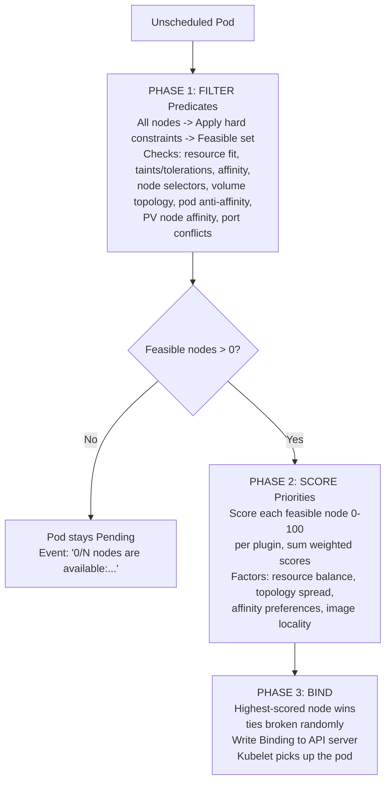
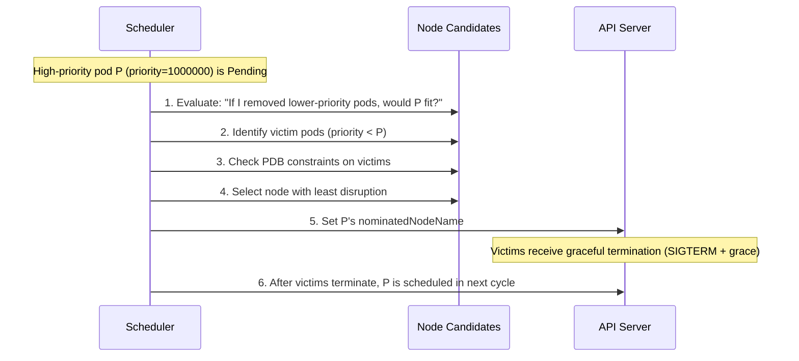
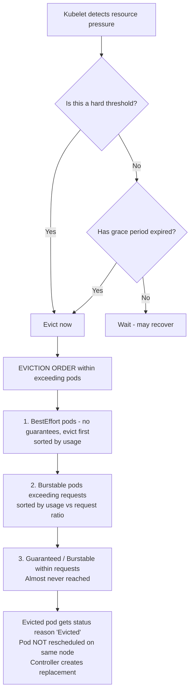
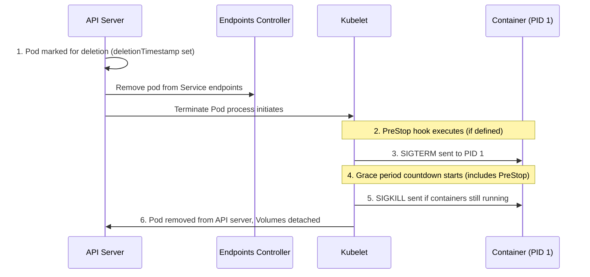

> **Complexity**: `[COMPLEX]` - Advanced scheduling internals, high exam yield
>
> **Time to Complete**: 35-45 minutes
>
> **Prerequisites**: Module 2.5 (Resource Management), Module 2.6 (Scheduling)

---

## What You'll Be Able to Do

- **Diagnose** Pending scheduler filter failures by comparing pod requests, taints, affinity, and events.
- **Design** PriorityClass preemption behavior that protects critical workloads while limiting disruption.
- **Evaluate** QoS eviction risk from pod resource requests, limits, and node pressure.
- **Debug** kubelet node-pressure eviction using signals, conditions, taints, and replacement behavior.
- **Implement** graceful termination and PodDisruptionBudget rules for drains, preemption, and shutdown.

## Why This Module Matters

Hypothetical scenario: your team rolls out a latency-sensitive API during a marketing launch, and the new pods sit Pending while lower-priority batch workers keep running. The cluster has enough total CPU across all nodes, but no single node has the right combination of free CPU, tolerations, volume topology, and disruption budget room. From outside Kubernetes, this looks like a simple capacity problem; inside the control plane, it is a chain of scheduling, preemption, eviction, and lifecycle decisions.

This module matters because the scheduler and kubelet are the two components that turn resource intent into runtime behavior. The scheduler decides whether a pod can be placed, which node is the best fit, and whether lower-priority pods should be preempted to make room. The kubelet later decides what happens when a node runs out of memory, disk, or process IDs, and it also controls the shutdown sequence when pods are deleted, evicted, or preempted.

For the CKA, this topic is valuable because it teaches a reliable troubleshooting path instead of a bag of memorized commands. A Pending pod is usually not mysterious once you know where Filter stops, where Score begins, and how events summarize rejected nodes. An unexpected termination is also easier to explain when you can connect QoS class, eviction signals, node conditions, PDB behavior, and graceful shutdown timing into one operational story.

Kubernetes 1.35 keeps the same core mental model used by modern scheduler and kubelet documentation: pods declare requirements, the scheduler finds feasible nodes, the kubelet enforces node-local safety, and controllers repair desired state after disruption. Historical features evolved across many earlier releases, but for this module you should reason from current Kubernetes 1.35 behavior and treat older release details as background only. The exam rewards that current model because it maps directly to `kubectl describe`, pod events, node conditions, and object specifications.

## The Scheduler Pipeline

When you create a pod without `spec.nodeName`, it enters the scheduling queue and waits for kube-scheduler to assign it to a node. The scheduler is not simply looking for the emptiest machine; it is running a plugin pipeline that first eliminates impossible nodes and then ranks the nodes that remain. This distinction matters because a pod that fails Filter cannot be rescued by a high Score, while a pod that passes Filter may still land on one node instead of another because scoring preferences make the placement better.

The cleanest way to troubleshoot the pipeline is to ask three questions in order. First, what hard constraints must be true before the pod can run anywhere? Second, among the nodes that satisfy those constraints, what preferences make one node better than another? Third, after the scheduler chooses a node, did the bind operation actually write the assignment so the kubelet can start the pod? Those questions match the Filter, Score, and Bind phases.



<details>
<summary>Legacy ASCII View of Pipeline</summary>

```text
┌──────────────────────────────────────────────────────────────────────┐
│                     SCHEDULER PIPELINE                               │
│                                                                      │
│  Unscheduled Pod                                                     │
│       │                                                              │
│       ▼                                                              │
│  ┌─────────────────────────────────────────────────────────┐        │
│  │  PHASE 1: FILTER (Predicates)                           │        │
│  │                                                         │        │
│  │  All nodes ──► Apply hard constraints ──► Feasible set  │        │
│  │                                                         │        │
│  │  Checks: resource fit, taints/tolerations, affinity,    │        │
│  │  node selectors, volume topology, pod anti-affinity,    │        │
│  │  PV node affinity, port conflicts                       │        │
│  └────────────────────────┬────────────────────────────────┘        │
│                           │                                          │
│              ┌────────────┴──────────────┐                          │
│              │ Feasible nodes > 0?       │                          │
│              └────────────┬──────────────┘                          │
│               No ▼                Yes ▼                              │
│         Pod stays Pending    ┌──────────────────────────────────┐   │
│         Event: "0/N nodes    │  PHASE 2: SCORE (Priorities)    │   │
│         are available:..."   │                                  │   │
│                              │  Score each feasible node 0-100  │   │
│                              │  per plugin, sum weighted scores  │   │
│                              │                                  │   │
│                              │  Factors: resource balance,      │   │
│                              │  topology spread, affinity       │   │
│                              │  preferences, image locality     │   │
│                              └──────────────┬───────────────────┘   │
│                                             │                        │
│                                             ▼                        │
│                              ┌──────────────────────────────────┐   │
│                              │  PHASE 3: BIND                  │   │
│                              │                                  │   │
│                              │  Highest-scored node wins        │   │
│                              │  (ties broken randomly)          │   │
│                              │  Write Binding to API server     │   │
│                              │  Kubelet picks up the pod        │   │
│                              └──────────────────────────────────┘   │
│                                                                      │
└──────────────────────────────────────────────────────────────────────┘
```
</details>

Filter is the hard-gate phase. A node that lacks allocatable CPU, has an untolerated `NoSchedule` taint, violates required node affinity, cannot satisfy a volume topology rule, or would break required pod anti-affinity is removed from the candidate set. The scheduler records the reasons as pod events, which is why `kubectl describe pod <name>` is usually the fastest first command when a pod is Pending.

| Filter Plugin | What It Checks |
|---|---|
| `NodeResourcesFit` | Does the node have enough allocatable CPU, memory, ephemeral storage? |
| `NodeAffinity` | Does the node match `requiredDuringSchedulingIgnoredDuringExecution`? |
| `TaintToleration` | Does the pod tolerate all NoSchedule taints on the node? |
| `NodePorts` | Are the requested host ports available? |
| `VolumeBinding` | Can the required PVs be bound to this node's topology? |
| `PodTopologySpread` | Does placing here violate `maxSkew` with `whenUnsatisfiable: DoNotSchedule`? |
| `InterPodAffinity` | Does placement violate required pod anti-affinity rules? |

The important detail is that Filter evaluates requested resources, not live usage. If a node is idle but its allocatable CPU is already reserved by existing pod requests, a new CPU-heavy pod still fails `NodeResourcesFit`. That can feel surprising to new operators because dashboard CPU graphs may show room, but the scheduler protects capacity promises rather than betting on current usage staying low.

```text
0/5 nodes are available: 2 insufficient cpu, 2 node(s) had taint
{node-role.kubernetes.io/control-plane: }, 1 node(s) didn't match
Pod topology spread constraints.
```

Pause and predict: if the event says two nodes have insufficient CPU and one node has an untolerated taint, would lowering the pod's memory request help? It would not address the CPU or taint failures, so the pod would remain Pending unless another constraint also mentioned memory. This habit of matching the fix to the failed filter reason keeps exam troubleshooting precise.

Score begins only after at least one node survives Filter. Each scoring plugin gives feasible nodes a score, usually in the zero-to-one-hundred range, and the scheduler combines those scores with plugin weights. Scoring preferences can spread workloads, improve topology balance, favor nodes with cached images, or prefer nodes that better satisfy soft affinity. Those preferences are useful, but they never make an infeasible node legal.

| Score Plugin | What It Favors |
|---|---|
| `NodeResourcesBalancedAllocation` | Nodes where CPU and memory usage ratios are similar (balanced utilization) |
| `NodeResourcesLeastAllocated` | Nodes with the most available resources (spread workloads) |
| `ImageLocality` | Nodes that already have the container image cached |
| `InterPodAffinity` | Nodes matching `preferredDuringSchedulingIgnoredDuringExecution` |
| `TaintToleration` | Nodes with fewer tolerations needed (prefer "cleaner" nodes) |
| `PodTopologySpread` | Nodes that improve topology balance |

Ties are intentionally not a placement contract. If two feasible nodes receive the same total score, the scheduler may break the tie randomly to avoid concentrating otherwise identical work on one node. If you require exact placement, use a hard mechanism such as node affinity, a node selector, taints and tolerations, or explicit `spec.nodeName` for special cases; do not reverse-engineer a scoring tie and depend on it.

Bind is the handoff from scheduler decision to node execution. The scheduler writes a binding that sets `spec.nodeName`, and the kubelet on that node notices the assignment through the API server. From there the kubelet pulls images, prepares volumes, creates sandboxes, and starts containers. If the pod has no useful events at all, include scheduler health in your investigation because the normal Filter failure trail may never have been produced.

## Priority, Preemption, and Disruption Tradeoffs

Priority tells Kubernetes which pending pods deserve scheduling attention first and which running pods may be displaced when a higher-priority pod cannot fit. This is a powerful reliability tool, but it is also a sharp edge because the cluster can remove healthy lower-priority pods to make room. A good priority design therefore names business intent, separates critical workloads from batch work, and avoids making every application "critical" just because it has users.

Pause and predict: a high-priority pod with priority `1000000` is Pending because no node has enough free CPU, while low-priority batch pods are already running. Kubernetes can preempt lower-priority pods if the incoming pod's PriorityClass allows it, but it will first evaluate which node could host the pending pod after removing victims. The scheduler tries to minimize disruption, but it is optimizing for the higher-priority pod's placement, not for keeping every lower-priority workload alive.

```yaml
apiVersion: scheduling.k8s.io/v1
kind: PriorityClass
metadata:
  name: critical-service
value: 1000000
globalDefault: false
preemptionPolicy: PreemptLowerPriority
description: "For services that must not be displaced by batch workloads"
```

```yaml
apiVersion: scheduling.k8s.io/v1
kind: PriorityClass
metadata:
  name: batch-processing
value: 100
globalDefault: false
preemptionPolicy: PreemptLowerPriority
description: "For batch jobs that can be preempted"
```

```yaml
apiVersion: scheduling.k8s.io/v1
kind: PriorityClass
metadata:
  name: best-effort-batch
value: 10
globalDefault: false
preemptionPolicy: Never
description: "Batch jobs that should never preempt others"
```

The `preemptionPolicy` field deserves careful reading. `PreemptLowerPriority` means a pending pod may trigger eviction of lower-priority pods if doing so makes placement possible. `Never` means the pod can still move ahead of lower-priority pending pods in the scheduling queue, but it will not evict already-running pods. That distinction is useful for important but non-disruptive work, such as reports that should run soon but should not interrupt live services.

| Name | Value | Used By |
|---|---|---|
| `system-cluster-critical` | 2000000000 | Cluster-essential components (CoreDNS, kube-proxy) |
| `system-node-critical` | 2000001000 | Node-essential components (kubelet static pods) |

Built-in PriorityClasses exist for cluster and node critical components, and you should not reuse their values for ordinary application tiers. If application teams assign values near system priority, they make it harder for the cluster to protect its own control-plane dependencies during pressure. A practical production scheme usually has a small number of named tiers, clear ownership rules for who may use each tier, and review around any workload that can preempt others.

```yaml
apiVersion: v1
kind: Pod
metadata:
  name: fraud-detector
spec:
  priorityClassName: critical-service
  containers:
  - name: detector
    image: fraud-detector:v3.2
    resources:
      requests:
        cpu: "2"
        memory: 4Gi
      limits:
        cpu: "2"
        memory: 4Gi
```

Preemption starts only when the pending pod cannot be scheduled normally. The scheduler simulates each candidate node by asking whether removing lower-priority pods would make the high-priority pod fit, then it chooses victim sets and checks disruption impact. The pending pod may receive `nominatedNodeName`, but nomination is not a guarantee; the pod still has to pass a later scheduling cycle after victims terminate, and another even-higher-priority pod may change the situation.



<details>
<summary>Legacy ASCII View of Preemption Sequence</summary>

```text
┌──────────────────────────────────────────────────────────────────┐
│                  PREEMPTION SEQUENCE                              │
│                                                                  │
│  High-priority pod P (priority=1000000) is Pending               │
│       │                                                          │
│       ▼                                                          │
│  1. Scheduler re-evaluates each node:                            │
│     "If I removed lower-priority pods, would P fit?"             │
│       │                                                          │
│       ▼                                                          │
│  2. For each candidate node, identify victim pods:               │
│     - Only pods with priority < P's priority                     │
│     - Remove minimum set needed to free resources                │
│       │                                                          │
│       ▼                                                          │
│  3. Check PDB constraints:                                       │
│     - Would evicting victims violate any PDB?                    │
│     - If yes, try a different victim set or skip node            │
│       │                                                          │
│       ▼                                                          │
│  4. Select the node with the least disruption:                   │
│     - Prefer nodes where fewest pods must be evicted             │
│     - Prefer nodes where lowest-priority pods are victims        │
│       │                                                          │
│       ▼                                                          │
│  5. Set P's nominatedNodeName to the chosen node                 │
│     Victims receive graceful termination (SIGTERM + grace)       │
│       │                                                          │
│       ▼                                                          │
│  6. After victims terminate, P is scheduled in the next cycle    │
│                                                                  │
└──────────────────────────────────────────────────────────────────┘
```
</details>

Consider a three-node cluster where each node has four allocatable CPUs. A new `fraud-detector` pod needs two CPUs and has priority `1000000`. No node has two CPUs free, so ordinary scheduling fails, but every node has lower-priority pods that could be removed. This is the moment where preemption analysis is useful because total cluster capacity is irrelevant unless one node can be made feasible for the incoming pod.

| Node | Running Pods | CPU Used | Available |
|---|---|---|---|
| node-1 | batch-a (priority 100, 2 CPU), batch-b (priority 100, 1 CPU) | 3 CPU | 1 CPU |
| node-2 | web-api (priority 500, 3 CPU) | 3 CPU | 1 CPU |
| node-3 | monitoring (priority 800, 2 CPU), logger (priority 50, 1.5 CPU) | 3.5 CPU | 0.5 CPU |

The scheduler evaluates each node as a possible landing zone. On `node-1`, evicting `batch-a` frees enough CPU with one victim. On `node-2`, evicting `web-api` also works, but that victim has higher priority than the batch pod. On `node-3`, evicting `logger` combines the already-free half CPU with the released one-and-a-half CPUs, making exactly enough room with a lower-priority victim.

The best candidate is therefore `node-3`, assuming no other constraints change the decision. The scheduler can nominate that node, terminate `logger` gracefully, and schedule the high-priority pod in a later cycle after resources are actually free. The key lesson is that preemption is not a blind "kill lowest-priority pod anywhere" operation; it is a node-specific feasibility calculation.

PDBs complicate that calculation because they express how many matching pods must remain available during voluntary disruption. During scheduler preemption, Kubernetes tries to avoid violating PDBs, but PDBs are not an absolute barrier if every workable victim set would violate a budget. That soft treatment prevents a badly chosen PDB from blocking genuinely higher-priority recovery work forever, but it also means PDBs should not be your only protection for critical availability.

## QoS, Requests, Limits, and Eviction Risk

Kubernetes assigns each pod a QoS class from its container resource requests and limits. You do not set the QoS class directly; it is derived from whether every container has CPU and memory requests equal to limits, whether at least one request or limit exists, or whether no resource guarantees exist at all. This derived label becomes important under node pressure because the kubelet uses it to decide which pods are safest to evict first.

| QoS Class | Condition | Eviction Priority |
|---|---|---|
| **Guaranteed** | Every container has `requests == limits` for both CPU and memory | Last evicted |
| **Burstable** | At least one container has a request or limit set, but not Guaranteed | Middle |
| **BestEffort** | No container has any request or limit | First evicted |

Guaranteed pods are the most protected because they make a clear reservation contract. Every container must have both CPU and memory requests, every matching limit must be equal, and every container in the pod must satisfy the same rule. If one sidecar omits memory resources while the main container is perfect, the whole pod is no longer Guaranteed because Kubernetes evaluates the pod as a unit.

```yaml
apiVersion: v1
kind: Pod
metadata:
  name: qos-guaranteed
spec:
  containers:
  - name: app
    image: nginx:1.35
    resources:
      requests:
        cpu: 500m
        memory: 256Mi
      limits:
        cpu: 500m
        memory: 256Mi
```

```bash
kubectl get pod qos-guaranteed -o jsonpath='{.status.qosClass}'
# Output: Guaranteed
```

Burstable pods have some resource intent but not a strict one-to-one request and limit match across every container. This is the common class for services that reserve enough CPU and memory to be scheduled sensibly but allow some temporary headroom. Burstable is not wrong; it is simply a tradeoff that accepts more eviction exposure than Guaranteed in exchange for flexible runtime behavior.

```yaml
apiVersion: v1
kind: Pod
metadata:
  name: qos-burstable
spec:
  containers:
  - name: app
    image: nginx:1.35
    resources:
      requests:
        cpu: 250m
        memory: 128Mi
      limits:
        cpu: 500m
        memory: 512Mi
```

```bash
kubectl get pod qos-burstable -o jsonpath='{.status.qosClass}'
# Output: Burstable
```

BestEffort pods have no CPU or memory requests and no limits on any container. They can be useful for disposable experiments or low-value batch work, but they are first in line when a node needs to reclaim resources. On a busy production node, BestEffort is a clear statement that the workload may be sacrificed before workloads with explicit reservations.

```yaml
apiVersion: v1
kind: Pod
metadata:
  name: qos-besteffort
spec:
  containers:
  - name: app
    image: nginx:1.35
```

```bash
kubectl get pod qos-besteffort -o jsonpath='{.status.qosClass}'
# Output: BestEffort
```

Before running this, what QoS class do you expect if a pod sets memory requests equal to memory limits but leaves CPU limits higher than CPU requests? The answer is Burstable, because Guaranteed requires equality for both CPU and memory across every container. This is a common exam trap because one resource can look perfect while the other quietly moves the pod into the middle eviction tier.

QoS does not change the scheduler's resource fit calculation by itself. The scheduler primarily uses requests to decide whether a pod fits on a node, while limits are enforced later by the kubelet and runtime. A Guaranteed pod requesting two CPUs and a Burstable pod requesting two CPUs consume the same scheduling capacity, even though they receive different treatment when node pressure forces eviction choices.

There are edge cases worth remembering because they explain many "why is this pod Burstable?" surprises. If you set a limit but omit the matching request, Kubernetes may default the request from the limit for that container and resource, but every container and both CPU and memory must still satisfy the Guaranteed rule. Ephemeral storage requests and limits affect scheduling and eviction for storage pressure, but they do not determine the CPU and memory QoS class in the same way.

## Kubelet Eviction and Node Pressure

The scheduler makes placement decisions, but the kubelet protects a node that is already running workloads. It monitors local signals such as available memory, root filesystem space, image filesystem space, and available process IDs. When thresholds are crossed, the kubelet may evict pods to keep the operating system and node services alive, which is why evicted pods often point to node pressure rather than a scheduler decision.

| Signal | Description | Typical Soft Threshold | Typical Hard Threshold |
|---|---|---|---|
| `memory.available` | Free memory on the node | < 500Mi (grace 90s) | < 100Mi |
| `nodefs.available` | Free disk on root partition | < 15% (grace 120s) | < 10% |
| `imagefs.available` | Free disk on image filesystem | < 15% (grace 120s) | < 10% |
| `pid.available` | Free PIDs | < 1000 (grace 60s) | < 500 |

Soft thresholds include a grace period, so the kubelet waits to see whether the pressure clears before evicting. Hard thresholds are immediate because the node is close enough to failure that waiting would endanger the host. In either case, the goal is not fairness among applications; the goal is preserving node stability by reclaiming resources from pods according to Kubernetes eviction rules.



<details>
<summary>Legacy ASCII View of Eviction Flow</summary>

```text
┌──────────────────────────────────────────────────────────────────┐
│                   EVICTION DECISION FLOW                         │
│                                                                  │
│  Kubelet detects resource pressure                               │
│       │                                                          │
│       ▼                                                          │
│  Is this a hard threshold?                                       │
│       │                                                          │
│   Yes ▼              No ▼                                        │
│   Evict now     Has grace period expired?                        │
│       │              │                                           │
│       │          No ▼          Yes ▼                             │
│       │      Wait (may recover)   Proceed to eviction            │
│       │                                │                         │
│       ▼                                ▼                         │
│  ┌──────────────────────────────────────────────────────┐       │
│  │  EVICTION ORDER (within pods exceeding requests):    │       │
│  │                                                      │       │
│  │  1. BestEffort pods -- no guarantees, evict first    │       │
│  │     (sorted by resource usage, highest first)        │       │
│  │                                                      │       │
│  │  2. Burstable pods exceeding their requests          │       │
│  │     (sorted by usage relative to requests)           │       │
│  │                                                      │       │
│  │  3. Guaranteed / Burstable within their requests     │       │
│  │     (only if still under pressure after 1+2)         │
│  │     Almost never reached in practice                 │
│  └──────────────────────────────────────────────────────┘       │
│       │                                                          │
│       ▼                                                          │
│  Evicted pod gets status reason "Evicted"                        │
│  Pod is NOT rescheduled on the same node                         │
│  Controller (Deployment, Job, etc.) creates replacement          │
│  elsewhere. Standalone pods are gone permanently.                │
│                                                                  │
└──────────────────────────────────────────────────────────────────┘
```
</details>

Eviction order starts with pods that have the weakest resource claim. BestEffort pods are evicted first, then Burstable pods that exceed their requests, and only later pods that are within their requests or Guaranteed. This ordering is why requests matter twice: they affect whether a pod can be scheduled, and they later define the line between expected usage and excess usage when the kubelet is under pressure.

When a pod is evicted, its status becomes `Failed` with reason `Evicted`, and it may remain visible until garbage collection removes it. A controller such as a Deployment, ReplicaSet, StatefulSet, or Job can create a replacement pod, but a standalone pod has no controller to repair it. The replacement is a new pod, so it goes through scheduling again and may land on any eligible node with sufficient capacity and matching constraints.

| Condition | Triggered By | Effect |
|---|---|---|
| `MemoryPressure` | `memory.available` below threshold | Taint applied, no new BestEffort pods |
| `DiskPressure` | `nodefs.available` or `imagefs.available` below threshold | Taint applied, no new pods |
| `PIDPressure` | `pid.available` below threshold | Taint applied, no new pods |

Node pressure also affects future scheduling because the node reports conditions and may receive taints such as `node.kubernetes.io/memory-pressure`. That protects the node from receiving more unsuitable work while it recovers. If pods keep cycling back to the same troubled node, inspect node conditions, taints, allocatable resources, and controller behavior instead of only looking at the evicted pod.

Which approach would you choose here and why: increase memory limits on a Burstable pod that is repeatedly evicted, or increase its memory request? Increasing the limit may reduce container OOM kills, but it does not improve the pod's scheduling reservation or its position relative to request-based eviction pressure. If the service genuinely needs more memory to be protected, the request is the field that changes the scheduler contract and the kubelet's eviction comparison.

## Pod Termination, Graceful Shutdown, and PDBs

Pod termination is a coordinated sequence rather than a single kill signal. The API server marks the pod for deletion, endpoint controllers remove it from Service endpoint sets, the kubelet runs any PreStop hook, and then the kubelet sends SIGTERM to container process one. The grace period starts when deletion begins, not when the application finally receives SIGTERM, so long PreStop hooks can consume shutdown time that the application expected to use.



<details>
<summary>Legacy ASCII View of Termination Sequence</summary>

```text
┌──────────────────────────────────────────────────────────────────┐
│                 POD TERMINATION SEQUENCE                          │
│                                                                  │
│  1. Pod marked for deletion (deletionTimestamp set)              │
│     Endpoints controller removes pod from Service endpoints      │
│     ── Traffic stops being routed to this pod ──                 │
│       │                                                          │
│       ▼                                                          │
│  2. PreStop hook executes (if defined)                           │
│     Runs in parallel with endpoint removal                       │
│     Examples: drain connections, deregister from service mesh    │
│       │                                                          │
│       ▼                                                          │
│  3. SIGTERM sent to PID 1 in each container                     │
│     Application should begin graceful shutdown                   │
│       │                                                          │
│       ▼                                                          │
│  4. Grace period countdown (terminationGracePeriodSeconds)       │
│     Default: 30 seconds                                          │
│     Includes time spent in PreStop hook                          │
│       │                                                          │
│       ▼                                                          │
│  5. SIGKILL sent if containers still running                     │
│     Forced termination -- no cleanup possible                    │
│       │                                                          │
│       ▼                                                          │
│  6. Pod removed from API server                                  │
│     Volumes detached and unmounted                               │
│                                                                  │
└──────────────────────────────────────────────────────────────────┘
```
</details>

Stop and think: you set `terminationGracePeriodSeconds: 30` and a PreStop hook that sleeps for twenty seconds. The application does not receive a full thirty seconds after the hook; it receives roughly the remaining ten seconds before SIGKILL. If the hook itself runs longer than the grace period, Kubernetes may grant a short extension in some cases, but you should design as if the hook and application shutdown share the same budget.

```yaml
apiVersion: v1
kind: Pod
metadata:
  name: graceful-app
spec:
  terminationGracePeriodSeconds: 60
  containers:
  - name: app
    image: myapp:v2
    lifecycle:
      preStop:
        exec:
          command: ["/bin/sh", "-c", "sleep 5 && /app/drain-connections.sh"]
    ports:
    - containerPort: 8080
```

A graceful shutdown budget should include endpoint propagation, PreStop behavior, application drain time, and a small margin for variance. Stateless web servers often need a shorter grace period than databases, message consumers, or batch processors that must checkpoint work. The correct value is not "as high as possible" because long termination can slow rollouts and drains; the correct value is long enough for the application to stop accepting work and finish the work it already accepted.

| Workload Type | Recommended Grace Period | Why |
|---|---|---|
| Stateless web server | 15-30s | Quick drain, few in-flight requests |
| API gateway / load balancer | 30-60s | Long-lived connections, must drain gracefully |
| Database | 60-120s | Must flush WAL, checkpoint, close connections |
| Batch processor | 60-300s | May need to checkpoint partial work |
| Message queue consumer | 30-60s | Must finish processing current message |

PDBs sit beside graceful termination because they control how many matching pods may be voluntarily disrupted at once. They do not make a pod immortal, and they do not protect against a node crash, kernel OOM kill, or hard kubelet eviction. They are a promise made to voluntary operations such as drain, cluster upgrade, autoscaler scale-down, and eviction API calls that the operation should not reduce availability below the declared budget.

```yaml
apiVersion: policy/v1
kind: PodDisruptionBudget
metadata:
  name: web-api-pdb
spec:
  minAvailable: 2
  selector:
    matchLabels:
      app: web-api
```

```yaml
apiVersion: policy/v1
kind: PodDisruptionBudget
metadata:
  name: web-api-pdb
spec:
  maxUnavailable: 1
  selector:
    matchLabels:
      app: web-api
```

`minAvailable` and `maxUnavailable` are mutually exclusive ways to express the same protection. `minAvailable: 2` says at least two selected pods must stay available, while `maxUnavailable: 1` says at most one selected pod may be unavailable during voluntary disruption. Percentages are allowed, but for small replica counts an integer is easier to reason about during exams because rounding behavior can surprise you under pressure.

```bash
# Drain with timeout to avoid hanging forever
kubectl drain node-2 --ignore-daemonsets --delete-emptydir-data --timeout=300s
```

Pause and predict: a three-replica Deployment has a PDB with `minAvailable: 3`, and one of its replicas is on a node you want to drain. The drain blocks because evicting that pod would reduce available replicas below the PDB requirement. If the node crashes instead, the PDB cannot stop the involuntary loss; the controller must create a replacement, and the cluster must have capacity to run it.

| Type | Examples | Honors PDB? |
|---|---|---|
| **Voluntary** | `kubectl drain`, cluster upgrade, autoscaler scale-down, preemption | Yes |
| **Involuntary** | Node crash, OOM kill, kubelet hard eviction, hardware failure | No |

This voluntary versus involuntary distinction should shape how you design availability. PDBs help maintenance workflows proceed safely, but replicas, topology spread, resource requests, probes, and adequate spare capacity are what make unexpected failures survivable. In scheduling lifecycle troubleshooting, always ask whether the disruption was planned through the API or forced by node reality.

## Worked Diagnostic Walkthrough

Exercise scenario: a Deployment rollout creates five new pods, and two become Running while three remain Pending. The application team says the cluster has enough total unused CPU, and a dashboard appears to support that claim. Your first move should not be to lower requests randomly; it should be to read the Pending pod events and separate total cluster capacity from per-node feasibility.

The scheduler can only bind a pod to one node, so capacity fragmented across many nodes does not help a pod whose request must fit on a single node. If three nodes each have half a CPU free and the pod requests one full CPU, the cluster has one-and-a-half CPUs free in total but no feasible node. That is a scheduling fit problem, not a kubelet eviction problem and not a PDB problem.

After reading the events, suppose you see both insufficient CPU and untolerated taints. Treat those as separate blockers rather than picking the first one that looks familiar. Reducing the CPU request might make some nodes feasible, but the tainted node still requires a matching toleration if the workload is allowed there. Adding a toleration might make the tainted node legal, but it does nothing for nodes that genuinely lack requested CPU.

The next question is whether the pod should be allowed to run on the tainted node at all. A taint usually means the node is reserved for a special purpose, such as control-plane duties, GPUs, storage, or another isolated workload class. If the application has no business running there, the correct fix is capacity or request tuning on ordinary worker nodes. If it does belong there, add the toleration deliberately and consider adding affinity so the scheduler intent is explicit.

Now imagine the same Pending pod has high priority and the cluster is full of lower-priority batch work. Preemption can help only if removing lower-priority pods from one node creates a feasible placement. If every node also fails a required node affinity rule or volume topology rule, preemption cannot solve the placement because victims do not change those hard constraints. This is why preemption troubleshooting still begins with Filter reasons.

If preemption does proceed, watch for the gap between nomination and binding. A pending pod may show a nominated node while victim pods terminate gracefully, and the incoming pod may still wait until the next scheduling cycle. During that window, events can look confusing because the scheduler has chosen a path but the kubelet has not yet freed the resources. Read `nominatedNodeName` as a clue, not as proof that the pod is already scheduled.

PDBs add another layer to that story because they influence which victims are least disruptive. A budget protecting batch pods may make one node less attractive as a preemption target, while another node with unprotected disposable work may be easier to use. The scheduler attempts to respect PDBs during preemption, but if every possible path violates a budget, higher priority can still win. That behavior is intentional because availability policy cannot be allowed to deadlock critical recovery forever.

For a CKA-style answer, describe the exact component making the decision. The scheduler filters and scores Pending pods, then may nominate lower-priority victims. The kubelet evicts already-running pods under node pressure and manages termination signals. The eviction API and PDB controller regulate voluntary disruptions such as drain. Controllers such as Deployments create replacement pods after disruption, but the scheduler still decides where those replacements land.

Now move from Pending to Evicted. If a pod has reason `Evicted`, do not spend your first minute editing affinity rules because the pod was already running before the kubelet removed it. Inspect the node that hosted it, look at pressure conditions, and compare the pod's QoS class and actual usage with its requests. A BestEffort pod evicted under MemoryPressure is behaving exactly as Kubernetes promises, even if the application owner expected it to be durable.

Burstable workloads require more judgment because their risk depends on requests and actual usage. A Burstable pod that stays within its memory request is better protected than one that regularly exceeds the request by a large margin. If the application routinely needs more memory than requested, the fix is not merely raising the limit; the request should also reflect the memory the workload needs to be treated as expected usage during pressure.

Guaranteed QoS is valuable, but it is not a license to ignore capacity. If every important service is Guaranteed with oversized requests, the scheduler may leave new work Pending because allocatable resources are already reserved. Guaranteed is best for workloads whose resource envelope is known and whose eviction cost is high. For services with variable load, a carefully chosen Burstable profile may be more efficient while still avoiding BestEffort risk.

Disk pressure follows the same diagnostic structure but uses different signals. If `nodefs.available` or `imagefs.available` crosses thresholds, the kubelet may reclaim images and evict pods to protect the node. Application teams often focus on memory because it is familiar, but ephemeral storage usage can also trigger evictions. Check logs, temporary files, emptyDir usage, and image churn when DiskPressure appears in node conditions.

PIDPressure is less common in beginner labs but important in production. A process leak inside a container can consume process IDs on the host, and the kubelet may have to evict pods to preserve node health. If you see PIDPressure, ask whether a workload is forking unexpectedly, whether probes or sidecars are creating excessive processes, and whether the node has enough PID capacity for the workload mix.

Drains are different again because they are voluntary maintenance operations. If a drain hangs, check PDB status before assuming the command is broken. A PDB with zero allowed disruptions is doing its job when it blocks eviction. The right fix may be scaling the Deployment, waiting for unavailable replicas to recover, widening the budget temporarily, or choosing a maintenance order that preserves application availability.

The labels on the PDB matter as much as the numeric budget. A PDB that selects no pods protects nothing, while a PDB that selects too many pods may couple unrelated applications into one disruption budget. During troubleshooting, compare the PDB selector with pod labels and controller labels. A common root cause is a label changed during a rollout while the PDB kept selecting the old shape or accidentally selected multiple releases.

Graceful termination problems often show up as dropped requests during rollout even when scheduling and PDBs are correct. Endpoint removal, PreStop hooks, SIGTERM handling, and application readiness all have to cooperate. If the app keeps accepting traffic after deletion starts, it may receive work it cannot finish before SIGKILL. If the PreStop hook sleeps too long, it may leave almost no time for the app to process SIGTERM.

A better shutdown design makes the application stop advertising readiness before it stops serving already-accepted work. Kubernetes endpoint removal reduces new traffic, while the application uses SIGTERM to drain outstanding requests. The grace period must cover both the platform-side transition and the application-side cleanup. For stateful systems, that may include flushing logs, closing database connections, checkpointing offsets, or handing off leadership.

Tie the lifecycle pieces together during a rollout. A new ReplicaSet creates pods, the scheduler places them, the kubelet starts containers, readiness controls Service endpoints, and the old pods terminate according to grace periods and PDB constraints. If any link is poorly configured, the rollout may be slow, unavailable, or noisy. Debugging is faster when you trace the rollout as a sequence instead of treating each symptom as isolated.

The same sequence explains cluster autoscaler scale-down. A node can be removed only if its pods can be evicted according to disruption rules and rescheduled elsewhere according to scheduling constraints. High requests, strict affinity, local storage, or tight PDBs can all make a node hard to drain. When autoscaling seems stuck, inspect the pods on candidate nodes and ask which constraint prevents safe movement.

For exam practice, build a verbal checklist and use it consistently. Pending means scheduler events, node fit, taints, affinity, topology, priority, and preemption. Evicted means pod status, node conditions, QoS, requests, and kubelet pressure signals. Terminating or drain problems mean PDBs, grace periods, PreStop hooks, endpoint behavior, and controller replacements. This checklist is faster than searching every Kubernetes object at random.

The final design lesson is that scheduling lifecycle reliability is mostly decided before an incident. Requests express capacity needs, priorities express importance, PDBs express disruption tolerance, QoS emerges from requests and limits, and termination settings express shutdown time. Kubernetes can enforce those contracts, but it cannot infer business criticality or application drain behavior that you never declared. Good operators make those contracts visible in manifests before pressure arrives.

A useful way to review any manifest is to ask what happens during scarcity. If CPU is scarce, requests and priority decide whether the pod can be placed or whether it can displace another pod. If memory is scarce after placement, QoS and request-relative usage influence kubelet eviction decisions. If nodes are scarce during maintenance, PDBs and topology determine whether pods can move without breaking availability.

Another useful review question is what happens during replacement. A controller may create a new pod quickly, but the new pod still has to pass the same scheduling filters as the old one. If every remaining node violates affinity or lacks requested resources, replacement stalls even though the controller is healthy. That is why resilience requires both a controller and a feasible landing zone for replacement pods.

Finally, remember that lifecycle settings are part of scheduling design because disruption is not complete until the old pod exits and the replacement is available. A long grace period can preserve requests but slow node drains, while a short grace period can speed rollouts but risk dropped work. The right design balances service-level needs with cluster operations, then verifies that balance through events, readiness, and PDB status.

## Patterns & Anti-Patterns

Reliable scheduling design usually starts with small, named policy sets rather than one-off pod fields. PriorityClasses, PDBs, QoS targets, graceful shutdown budgets, topology rules, and requests should fit together so each workload communicates what it needs and how it may be disrupted. When these pieces are designed independently, the cluster may obey each object correctly while still producing an outage-shaped result.

| Pattern | When to Use | Why It Works |
|---|---|---|
| Three-tier PriorityClass scheme | Critical services, ordinary services, and disposable batch share a cluster | Keeps preemption meaningful without making every workload top priority |
| Guaranteed QoS for small critical control-plane helpers | Workloads must survive node pressure and have predictable usage | Equal requests and limits express a clear reservation and improve eviction protection |
| PDB per production controller | Rolling maintenance, node drains, and autoscaler scale-down must preserve availability | Voluntary disruption is limited before maintenance removes too many replicas |
| Explicit termination budget | Applications need time to drain connections or checkpoint state | PreStop and SIGTERM timing are designed instead of discovered during a rollout |

The main scaling consideration is operational consistency. If every namespace invents its own priorities, budgets, and shutdown expectations, cluster-wide behavior becomes impossible to predict during pressure. A platform team can help by publishing allowed PriorityClasses, recommended PDB patterns by replica count, and resource-request review guidance so application teams make local decisions within a shared scheduling model.

| Anti-Pattern | What Goes Wrong | Better Alternative |
|---|---|---|
| Marking all services critical | Preemption loses meaning and lower-priority recovery cannot happen | Reserve high priority for a reviewed set of workloads |
| Using BestEffort for production APIs | The kubelet evicts them first under node pressure | Set realistic requests and choose Burstable or Guaranteed intentionally |
| Setting `maxUnavailable: 0` everywhere | Drains and upgrades block across the cluster | Use enough replicas and allow at least one voluntary disruption when possible |
| Long PreStop with short grace period | The application receives SIGTERM too late to drain | Budget hook time and application shutdown together |

A subtle anti-pattern is treating Pending, Preempted, Evicted, and Terminating as the same kind of failure. Pending is a scheduling feasibility problem, preemption is a priority-driven displacement problem, eviction is a kubelet pressure response, and termination is a lifecycle sequence. Mixing those terms leads to random fixes; separating them points you at the component and object field that actually controls the behavior.

## Decision Framework

Use this framework when you face a scheduling or lifecycle symptom during the exam or in a real cluster. Start from the visible pod state, identify the responsible component, and then inspect the object fields that component uses. This prevents you from changing PDBs for a kubelet hard eviction, changing limits for a Filter failure caused by requests, or adding tolerations when the real problem is a volume topology mismatch.

| Symptom | First Place to Look | Likely Component | High-Value Fix |
|---|---|---|---|
| Pod is Pending with filter events | Pod events and node descriptions | Scheduler Filter | Adjust requests, tolerations, affinity, topology, or capacity |
| High-priority pod waits behind running batch | PriorityClass and preemption events | Scheduler Preemption | Confirm priority values, preemption policy, PDB impact, and victim feasibility |
| Pod failed with reason `Evicted` | Pod status, node conditions, kubelet events | Kubelet Eviction Manager | Inspect pressure signal, QoS class, requests, and node capacity |
| Drain hangs | PDB status and matching labels | Eviction API and PDB controller | Scale replicas, relax budget, or use a timeout while preserving availability |
| Shutdown drops requests | Pod lifecycle hooks and grace period | Kubelet Termination Flow | Increase grace period, shorten PreStop, and drain traffic earlier |

The fastest exam path is usually `kubectl describe pod`, then `kubectl describe node`, then the controlling object. Pod events tell you whether the scheduler rejected nodes, the kubelet evicted a running pod, or a controller is replacing replicas. Node descriptions show allocatable resources, pressure conditions, and taints. The controller explains whether replacements should appear and whether PDB selectors match the pods you think they protect.

If the symptom is Pending, ask whether a single node can ever satisfy the pod. If the answer is no, preemption cannot help unless removing lower-priority pods on one node makes it feasible. If the symptom is eviction, ask whether the pod exceeded its request or had no request at all. If the symptom is drain blocking, ask whether the PDB budget is already consumed by unavailable replicas before blaming the drain command.

## Did You Know?

1. **Scheduling throughput**: In large clusters, kube-scheduler can make thousands of scheduling decisions per second by evaluating a percentage of nodes rather than every node in very large clusters.
2. **`nominatedNodeName` is provisional**: A preempting pod may nominate a node, but the pod must still pass a future scheduling cycle before it is actually bound.
3. **Eviction and OOM kill are different**: Kubelet eviction is proactive and follows Kubernetes QoS ordering, while the Linux OOM killer reacts when memory is exhausted and uses `oom_score_adj`.
4. **A zero-disruption PDB is powerful**: `maxUnavailable: 0` can block voluntary disruptions during critical windows, but it can also block ordinary drains and upgrades.

## Common Mistakes

| Mistake | Why It Happens | How to Fix It |
|---|---|---|
| Not setting any PriorityClass | Critical services compete equally with batch jobs, so preemption cannot express business importance | Define a small reviewed set of priority tiers and assign them deliberately |
| Treating limits as scheduling reservations | Limits feel like capacity, but the scheduler fits pods using requests | Set realistic CPU and memory requests, then choose limits based on runtime risk |
| Forgetting PDBs before cluster upgrades | Drain operations may evict too many replicas or block unexpectedly | Create PDBs for production controllers and test allowed disruptions before maintenance |
| Setting `terminationGracePeriodSeconds: 0` | The pod receives no useful graceful shutdown window | Use a budget that includes endpoint removal, PreStop time, application drain, and margin |
| Assuming PDBs prevent every outage | Node crashes, hard evictions, and kernel OOM kills are involuntary | Combine PDBs with replicas, topology spread, resource requests, and spare capacity |
| Giving batch jobs Guaranteed QoS by accident | Equal requests and limits make disposable work harder to evict under pressure | Use lower priority and appropriate Burstable or BestEffort settings for expendable work |
| Diagnosing evictions as scheduler bugs | Evicted pods were already running, so the kubelet made the decision | Inspect pod reason, node pressure conditions, QoS class, and kubelet events |

## Quiz

Test your understanding with scenario-first questions. Use the answer blocks to check the reasoning path, not just the final fix.

<details>
<summary>1. A pod is Pending and events say two nodes have insufficient CPU while one node has an untolerated GPU taint. How do you diagnose the scheduler filter failure?</summary>

Start by comparing the pod's CPU request with node allocatable CPU, then inspect the GPU taint and the pod's tolerations. Lowering memory limits would not address the reported CPU or taint failures because Filter stops on hard constraints. If the pod should use a GPU node, add the correct toleration and any required node affinity; otherwise add capacity or reduce the CPU request to a realistic value. This diagnoses the Pending scheduler filter failure by matching each event reason to the field that controls it.
</details>

<details>
<summary>2. A critical pod has priority 1000000 and `preemptionPolicy: Never`, while lower-priority batch pods fill every node. What PriorityClass preemption behavior should you expect?</summary>

The pod can be ordered ahead of lower-priority pending pods, but it will not preempt running batch pods. `preemptionPolicy: Never` disables displacement even when the numeric priority is high. The pod remains Pending until capacity appears through completion, scale-out, manual deletion, or a policy change. Use this behavior for important non-disruptive work, not for workloads that must make room during pressure.
</details>

<details>
<summary>3. A pod has CPU request 500m, CPU limit 1000m, memory request 256Mi, and memory limit 256Mi. How do you evaluate QoS eviction risk?</summary>

The pod is Burstable because Guaranteed requires CPU and memory requests to equal limits for every container. Its memory pair is equal, but its CPU request is lower than its CPU limit. Under node pressure it is safer than BestEffort but less protected than Guaranteed, especially if it exceeds its request. To make it Guaranteed, align CPU request and limit as well as memory request and limit across all containers.
</details>

<details>
<summary>4. A node reports MemoryPressure and pods fail with reason `Evicted`. How do you debug kubelet node-pressure eviction?</summary>

Look at node conditions, taints, kubelet events, and each evicted pod's QoS class and resource requests. The scheduler is not the component evicting already-running pods; the kubelet is reacting to local pressure signals. BestEffort pods and Burstable pods above their requests are expected to be evicted before Guaranteed pods. The durable fix may be better requests, less node overcommitment, additional capacity, or removing the workload causing pressure.
</details>

<details>
<summary>5. During `kubectl drain`, a three-replica Deployment with `minAvailable: 3` blocks eviction from one node. How should you implement PDB rules for the drain?</summary>

The PDB requires all three replicas to remain available, so voluntary eviction of any matching pod violates the budget. You can scale the Deployment up before the drain, change the PDB to `minAvailable: 2`, or use `maxUnavailable: 1` if one unavailable replica is acceptable. A timeout prevents the command from hanging forever, but it does not solve the availability policy. The fix is to align replica count and PDB budget with the disruption you need to perform.
</details>

<details>
<summary>6. A PreStop hook sleeps for twenty-five seconds and `terminationGracePeriodSeconds` is thirty. What shutdown behavior should you expect?</summary>

The application receives only about five seconds after the hook finishes because the grace countdown starts when deletion begins. PreStop execution consumes part of the same budget that SIGTERM handling uses. If the application needs twenty seconds to drain, this configuration is too short. Increase the grace period, shorten the hook, or move some traffic-drain behavior earlier in the shutdown path.
</details>

<details>
<summary>7. A node crash removes one replica from a Deployment protected by `maxUnavailable: 1`, and a drain starts before the replacement is ready. What happens?</summary>

The crash is involuntary, so the PDB could not prevent the first loss, but the unavailable replica still consumes the disruption budget. A voluntary drain that would evict a second replica should block until the replacement becomes available or the budget changes. This is why spare capacity and fast replacement scheduling matter alongside PDBs. PDBs protect planned disruption; they do not erase the consequences of unplanned failures.
</details>

## Hands-On Exercise

This exercise walks through QoS classification, preemption observation, kubelet eviction indicators, and PDB-protected drains. Run it on a disposable kind or minikube cluster because drain and preemption tests intentionally disrupt pods. If your local cluster has very small allocatable CPU, adjust replica counts and requests downward while preserving the same relationships between high and low priority.

<details>
<summary>Step 1: Create pods with different QoS classes</summary>

```bash
# Create a namespace for this exercise
kubectl create namespace scheduler-lab

# Guaranteed QoS pod
cat <<'EOF' | kubectl apply -f -
apiVersion: v1
kind: Pod
metadata:
  name: qos-guaranteed
  namespace: scheduler-lab
spec:
  containers:
  - name: app
    image: nginx:1.35
    resources:
      requests:
        cpu: 200m
        memory: 128Mi
      limits:
        cpu: 200m
        memory: 128Mi
EOF

# Burstable QoS pod
cat <<'EOF' | kubectl apply -f -
apiVersion: v1
kind: Pod
metadata:
  name: qos-burstable
  namespace: scheduler-lab
spec:
  containers:
  - name: app
    image: nginx:1.35
    resources:
      requests:
        cpu: 100m
        memory: 64Mi
      limits:
        cpu: 500m
        memory: 256Mi
EOF

# BestEffort QoS pod
cat <<'EOF' | kubectl apply -f -
apiVersion: v1
kind: Pod
metadata:
  name: qos-besteffort
  namespace: scheduler-lab
spec:
  containers:
  - name: app
    image: nginx:1.35
EOF
```

Verify QoS classification:

```bash
kubectl get pods -n scheduler-lab -o custom-columns=\
NAME:.metadata.name,\
QOS:.status.qosClass,\
STATUS:.status.phase
```

Expected output:

```text
NAME              QOS          STATUS
qos-besteffort    BestEffort   Running
qos-burstable     Burstable    Running
qos-guaranteed    Guaranteed   Running
```
</details>

<details>
<summary>Step 2: Set up PriorityClasses and observe preemption</summary>

```bash
# Create PriorityClasses
cat <<'EOF' | kubectl apply -f -
apiVersion: scheduling.k8s.io/v1
kind: PriorityClass
metadata:
  name: high-priority
value: 10000
globalDefault: false
description: "High priority for critical workloads"
---
apiVersion: scheduling.k8s.io/v1
kind: PriorityClass
metadata:
  name: low-priority
value: 100
globalDefault: false
description: "Low priority for batch workloads"
EOF

# Fill the node with low-priority pods.
# Adjust CPU requests based on your cluster's allocatable CPU.
kubectl create deployment low-batch \
  --image=nginx:1.35 \
  --replicas=10 \
  -n scheduler-lab

# Patch to add priority and resource requests.
kubectl patch deployment low-batch -n scheduler-lab --type=json -p='[
  {"op": "add", "path": "/spec/template/spec/priorityClassName", "value": "low-priority"},
  {"op": "add", "path": "/spec/template/spec/containers/0/resources", "value": {"requests": {"cpu": "100m", "memory": "64Mi"}}}
]'

# Wait for pods to be running.
kubectl rollout status deployment/low-batch -n scheduler-lab --timeout=60s

# Now create a high-priority pod that requests significant resources.
cat <<'EOF' | kubectl apply -f -
apiVersion: v1
kind: Pod
metadata:
  name: critical-service
  namespace: scheduler-lab
spec:
  priorityClassName: high-priority
  containers:
  - name: app
    image: nginx:1.35
    resources:
      requests:
        cpu: 500m
        memory: 256Mi
EOF

# Check events and look for preemption messages.
kubectl get events -n scheduler-lab --sort-by='.lastTimestamp' | tail -20

# Verify the critical pod is running.
kubectl get pod critical-service -n scheduler-lab

# Check if any low-priority pods were preempted.
kubectl get pods -n scheduler-lab -o wide
```
</details>

<details>
<summary>Step 3: Observe eviction indicators with memory-pressure concepts</summary>

```bash
# Check current node conditions.
kubectl describe nodes | grep -A 5 "Conditions:"

# View the QoS classes that kubelet uses when calculating eviction priority.
kubectl get pods -n scheduler-lab -o jsonpath='{range .items[*]}{.metadata.name}{"\t"}{.status.qosClass}{"\n"}{end}'

# To see oom_score_adj for a specific pod's container:
kubectl exec qos-besteffort -n scheduler-lab -- cat /proc/1/oom_score_adj
# Expected: 1000 (most likely to be OOM killed)

kubectl exec qos-guaranteed -n scheduler-lab -- cat /proc/1/oom_score_adj
# Expected: -997 (least likely to be OOM killed)

kubectl exec qos-burstable -n scheduler-lab -- cat /proc/1/oom_score_adj
# Expected: value between -997 and 1000 (calculated based on requests ratio)
```
</details>

<details>
<summary>Step 4: Test a PDB-protected drain</summary>

```bash
# Create a Deployment with multiple replicas.
kubectl create deployment web-app \
  --image=nginx:1.35 \
  --replicas=3 \
  -n scheduler-lab

kubectl rollout status deployment/web-app -n scheduler-lab --timeout=60s

# Create a PDB.
cat <<'EOF' | kubectl apply -f -
apiVersion: policy/v1
kind: PodDisruptionBudget
metadata:
  name: web-app-pdb
  namespace: scheduler-lab
spec:
  minAvailable: 2
  selector:
    matchLabels:
      app: web-app
EOF

# Verify PDB status.
kubectl get pdb -n scheduler-lab
# ALLOWED DISRUPTIONS should be 1 (3 replicas - 2 minAvailable)

# Find which node has web-app pods.
kubectl get pods -n scheduler-lab -l app=web-app -o wide

# Try draining a node that has a web-app pod with a client-side dry run first.
NODE=$(kubectl get pods -n scheduler-lab -l app=web-app -o jsonpath='{.items[0].spec.nodeName}')
kubectl drain "$NODE" --ignore-daemonsets --delete-emptydir-data --dry-run=client

# Perform actual drain with a timeout.
kubectl drain "$NODE" --ignore-daemonsets --delete-emptydir-data --timeout=120s

# Observe that the PDB allows draining one pod at a time.
kubectl get pods -n scheduler-lab -l app=web-app -o wide
kubectl get pdb -n scheduler-lab

# Uncordon the node when done.
kubectl uncordon "$NODE"
```
</details>

<details>
<summary>Cleanup</summary>

```bash
kubectl delete namespace scheduler-lab
kubectl delete priorityclass high-priority low-priority
```
</details>

### Success Checklist

- [ ] Diagnose Pending scheduler filter failures by comparing pod requests, taints, affinity, and events.
- [ ] Design PriorityClass preemption behavior that protects critical workloads while limiting disruption.
- [ ] Evaluate QoS eviction risk from pod resource requests, limits, and node pressure.
- [ ] Debug kubelet node-pressure eviction using signals, conditions, taints, and replacement behavior.
- [ ] Implement graceful termination and PodDisruptionBudget rules for drains, preemption, and shutdown.

## Practice Drills

Timed practice is useful because scheduler lifecycle questions often look long but collapse quickly once you identify the responsible component. Repeat these drills until you can state whether the scheduler, kubelet, PDB controller, or workload controller is making the decision. The goal is not to memorize every command; it is to build a fast diagnostic loop from symptom to component to controlling field.

| # | Drill | Target Time |
|---|---|---|
| 1 | Create three pods (Guaranteed, Burstable, BestEffort) and verify their QoS class using jsonpath | 3 min |
| 2 | Create two PriorityClasses (high=10000, low=100) and a pod using each. Verify with `kubectl get pod -o yaml \| grep priority` | 2 min |
| 3 | Create a 3-replica Deployment with a PDB (`maxUnavailable: 1`). Drain a node and verify only one pod is evicted at a time | 5 min |
| 4 | A pod is Pending. Use `kubectl describe pod` and `kubectl describe node` to identify whether the issue is insufficient resources, taints, or affinity | 3 min |
| 5 | Create a pod with a PreStop hook that writes to a log file, delete it with `--grace-period=60`, and verify the hook ran by checking the log | 4 min |
| 6 | Given a cluster with resource fragmentation, explain why a pod requesting 2 CPU is Pending and propose two fixes | 2 min |

## Sources

- [Kubernetes Scheduler](https://kubernetes.io/docs/concepts/scheduling-eviction/kube-scheduler/)
- [Pod Priority and Preemption](https://kubernetes.io/docs/concepts/scheduling-eviction/pod-priority-preemption/)
- [Node-pressure Eviction](https://kubernetes.io/docs/concepts/scheduling-eviction/node-pressure-eviction/)
- [Pod Lifecycle](https://kubernetes.io/docs/concepts/workloads/pods/pod-lifecycle/)
- [Assigning Pods to Nodes](https://kubernetes.io/docs/concepts/scheduling-eviction/assign-pod-node/)
- [Taints and Tolerations](https://kubernetes.io/docs/concepts/scheduling-eviction/taint-and-toleration/)
- [Resource Management for Pods and Containers](https://kubernetes.io/docs/concepts/configuration/manage-resources-containers/)
- [Pod Quality of Service Classes](https://kubernetes.io/docs/concepts/workloads/pods/pod-qos/)
- [Specifying a Disruption Budget for your Application](https://kubernetes.io/docs/tasks/run-application/configure-pdb/)
- [Disruptions](https://kubernetes.io/docs/concepts/workloads/pods/disruptions/)
- [Container Lifecycle Hooks](https://kubernetes.io/docs/concepts/containers/container-lifecycle-hooks/)
- [API Reference: PriorityClass](https://kubernetes.io/docs/reference/kubernetes-api/workload-resources/priority-class-v1/)

## Next Module

Continue to [Module 2.9: Autoscaling (HPA, VPA, Cluster)](/k8s/cka/part2-workloads-scheduling/module-2.9-autoscaling/) to learn how Kubernetes automatically adjusts resources based on demand and how autoscaling decisions interact with scheduling pressure.
