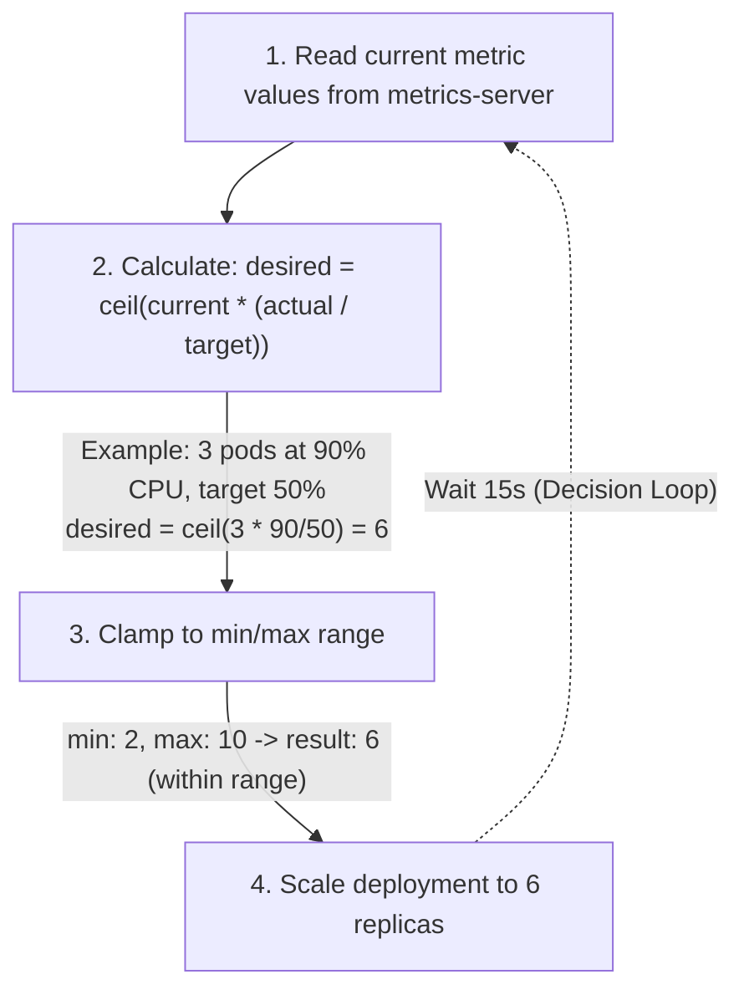

> **Complexity**: `[MEDIUM]` - CKA exam topic
>
> **Time to Complete**: 40-50 minutes
>
> **Prerequisites**: Module 2.2 (Deployments), Module 2.5 (Resource Management)

---

## What You'll Be Able to Do

After this module, you will be able to:

- **Implement** a HorizontalPodAutoscaler for a Deployment using CPU, memory, and custom metric targets.
- **Diagnose** HPA failures by tracing metrics-server readiness, pod resource requests, current metric values, and autoscaling events.
- **Evaluate** the HPA replica calculation, stabilization behavior, and scaling velocity limits before changing production settings.
- **Compare** HPA, VPA, and node autoscaling so you choose the right control loop for workload demand, pod sizing, and cluster capacity.
- **Design** a cautious autoscaling rollout with observable success criteria, safe minimums, realistic maximums, and rollback steps.

---

## Why This Module Matters

Hypothetical scenario: a team runs a checkout API with a fixed replica count of three because that number passed the last load test. On a quiet morning, the Deployment wastes node capacity because the application only needs one or two replicas, but during a promotion the same setting turns into a bottleneck. Requests queue up, CPU climbs, users retry, and the manual response is always late because humans are slower than a control loop that checks current demand continuously.

Autoscaling is Kubernetes' answer to that mismatch between static configuration and moving traffic. A Deployment's `replicas` field is useful when demand is predictable, but most real services face daily cycles, release spikes, batch backlogs, and noisy neighbors. The Horizontal Pod Autoscaler watches metrics, calculates a desired replica count, and updates the workload's scale subresource so the system can add or remove pods without an operator editing YAML every time traffic changes.

The CKA exam expects you to create and troubleshoot HorizontalPodAutoscalers quickly, but the operational skill goes deeper than remembering `kubectl autoscale`. You need to know why an HPA reports `<unknown>`, why missing CPU requests break utilization math, why scale-down often waits even after load stops, and why adding pods may not help a workload that is constrained by memory, a single-writer database, or an exhausted node group. This module teaches the control loops as engineering tools, not magic switches.

The thermostat analogy still helps, provided you do not stretch it too far. A thermostat reads the current temperature, compares it with a target, and turns heating or cooling on within practical limits. HPA reads a workload metric, compares it with a target, and changes replica count within `minReplicas` and `maxReplicas`, but it also has to account for missing data, not-yet-ready pods, stabilization windows, and the scheduler's ability to place new replicas.

You will build a small web Deployment, attach an HPA, generate load, watch the autoscaler react, and then use the same reasoning to compare HPA with Vertical Pod Autoscaler and node autoscaling. The goal is not to memorize every controller flag. The goal is to look at a scaling symptom, identify which control loop owns that layer, and make the smallest safe change that improves capacity without creating oscillation.

## Part 1: The Autoscaling Control Loops

Kubernetes autoscaling is easier to reason about when you separate three questions that often get mixed together. The first question is how many pod replicas a workload should run. The second question is how large each pod should be in terms of CPU and memory requests. The third question is whether the cluster has enough nodes to schedule the pods that controllers want to create. HPA, VPA, and node autoscaling each answer a different question.

Horizontal Pod Autoscaler changes the number of replicas for a scalable workload such as a Deployment, ReplicaSet, StatefulSet, or another target that exposes the scale subresource. It is best for horizontally scalable services where another pod is a useful unit of capacity. If a stateless web application has eight identical pods behind a Service, adding four more pods usually increases request-handling capacity, assuming the bottleneck is not a shared database or external dependency.

Vertical Pod Autoscaler changes or recommends CPU and memory requests for individual pods. It is best when the problem is pod sizing rather than replica count, especially for workloads that are hard to shard or where adding replicas changes application semantics. VPA can run in recommendation-only mode first, which is often the safest starting point because it tells you what it would change before it starts evicting or resizing anything.

Node autoscaling changes the number or shape of cluster nodes. It does not make an overloaded application faster by itself, and it does not decide how many replicas your Deployment should have. It reacts when pods can't be scheduled because the cluster lacks allocatable resources, then asks the infrastructure layer for more capacity within the configured limits. HPA can ask for more pods, but node autoscaling determines whether the cluster can make room for them.

Think of these loops as operating on nested boxes. HPA adjusts how many boxes of application work you have. VPA adjusts how big each application box should be. Node autoscaling adjusts how much shelf space the cluster has for all those boxes. The loops complement each other when each one owns a distinct problem, but they become unstable when two loops fight over the same signal.

```text
+---------------- Kubernetes Cluster Capacity ----------------+
|                                                              |
|  Node autoscaling: add or remove nodes when pods fit poorly  |
|                                                              |
|    +---------------- Workload Replica Count ---------------+ |
|    |                                                        | |
|    |  HPA: change how many pods serve the workload          | |
|    |                                                        | |
|    |    +-------------- Individual Pod Size --------------+ | |
|    |    |                                                | | |
|    |    |  VPA: recommend or change CPU/memory requests   | | |
|    |    |                                                | | |
|    |    +------------------------------------------------+ | |
|    +--------------------------------------------------------+ |
|                                                              |
+--------------------------------------------------------------+
```

The CKA usually focuses on HPA because it is part of day-to-day workload administration and has direct `kubectl` support. That exam focus should not tempt you to use HPA for every capacity issue. If the Service can't route traffic evenly, if the application stores local state, or if the bottleneck is a single upstream dependency, adding replicas may only spread the symptom around while increasing cost.

Before you configure autoscaling, write down the saturation signal you actually trust. CPU utilization is common because it is built into the resource metrics pipeline, but it is not always the earliest or most accurate demand signal. Request rate, queue depth, outstanding work items, or packets per second can be better for some systems, but those custom metrics require an adapter that exposes the Kubernetes custom metrics or external metrics API.

Pause and predict: if an API is slow because every request waits on a saturated database connection pool, what do you expect an HPA based only on CPU to do? The honest answer is that it may do very little if CPU stays low, or it may add pods that create even more database pressure. Good autoscaling starts with a metric that represents useful work, not merely a metric that happens to be easy to collect.

## Part 2: Horizontal Pod Autoscaler Mechanics

HPA is a controller loop. At a regular sync interval, commonly described as every fifteen seconds by default for the controller manager flag, it reads the target workload, fetches metrics, calculates the desired replica count, applies policy and stabilization rules, and writes the new scale value if a change is needed. That loop is simple in outline, but each step has failure modes that show up directly in `kubectl get hpa` and `kubectl describe hpa`.

For CPU utilization targets, the crucial denominator is the pod's CPU request. Kubernetes can only say that a pod is at fifty percent CPU utilization if it knows the requested CPU amount. A pod using `100m` CPU against a `200m` request is at fifty percent utilization, while the same pod using `100m` against a `50m` request is at two hundred percent utilization. Missing requests make that percentage impossible to calculate.

This is why HPA belongs next to resource management in the CKA sequence. A Deployment without resource requests may still run, and the scheduler can still place it using best-effort rules, but a CPU-based HPA can't make a reliable utilization decision. The autoscaler is not measuring "busy" in a human sense. It is comparing observed usage against declared intent, so your requests become part of the scaling contract.

The core formula is `desiredReplicas = ceil(currentReplicas * currentMetricValue / desiredMetricValue)`. If three pods are averaging ninety percent CPU and the target is fifty percent, the raw desired count is `ceil(3 * 90 / 50)`, which becomes six. The controller then clamps that value between `minReplicas` and `maxReplicas`, applies scaling behavior rules, and avoids tiny changes within its tolerance window.



The formula explains the shape of most HPA behavior, but it does not mean every metric bump immediately becomes a scale event. Kubernetes also has readiness handling, missing metric handling, scale-up and scale-down policies, and scale-down stabilization. Those guards exist because autoscaling is feedback control, and feedback control can oscillate if it reacts too aggressively to noisy measurements.

Scaling velocity is the part many learners notice only after a load test. HPA can limit how quickly it adds or removes pods, such as adding a bounded number of pods or a bounded percentage of the current replica count per policy period. In the `autoscaling/v2` API, the `behavior` field lets you customize scale-up and scale-down policies, including stabilization windows and policy selection.

Scale-down is deliberately conservative because removing pods too soon can create a loop where new pods start, metrics briefly improve, old load returns, and the workload scales up again. The default scale-down stabilization behavior keeps recent recommendations in mind so the controller does not immediately chase every temporary dip. For production services, this delay can be cheaper than flapping, especially when pods need warm caches, JIT compilation, or connection pools before they handle traffic well.

Custom metrics follow the same high-level idea but use a different metrics API. Instead of asking metrics-server for CPU or memory usage, HPA asks an adapter that serves `custom.metrics.k8s.io` or `external.metrics.k8s.io`. Prometheus Adapter is a common example because it can translate Prometheus queries into Kubernetes metrics API responses, but the important concept is the API boundary, not the brand of monitoring stack.

Pause and predict: you set `minReplicas: 2`, `maxReplicas: 10`, and an average CPU target of fifty percent. If four pods are averaging twenty-five percent CPU after a traffic drop, what raw replica count does the formula suggest, and why might the observed scale-down happen later than the math suggests? You should expect a raw recommendation of two, followed by controller behavior that may wait because stabilization is designed to avoid rapid downscaling.

## Part 3: Creating an HPA Safely

The fastest exam path is imperative: create a Deployment, set resource requests, and run `kubectl autoscale`. The safest production path is usually declarative: write the HPA object, review it, apply it, and keep the configuration in version control. Both paths create the same kind of Kubernetes object, so you should be comfortable reading the YAML even if you create it with a command under exam pressure.

Start by checking the metrics pipeline. CPU and memory HPA targets depend on the resource metrics API, usually provided by metrics-server. If `kubectl top nodes` fails with a metrics API error, an HPA may exist but can't report current utilization. On local clusters such as kind or some minikube setups, metrics-server may also need kubelet TLS adjustments because the local certificate arrangement differs from managed clusters.

```bash
# Check whether the resource metrics API is available.
kubectl top nodes

# If metrics are not available, install metrics-server.
kubectl apply -f https://github.com/kubernetes-sigs/metrics-server/releases/latest/download/components.yaml

# For local clusters such as kind or some minikube setups, this may be needed.
kubectl patch deployment metrics-server -n kube-system --type=json \
  -p '[{"op":"add","path":"/spec/template/spec/containers/0/args/-","value":"--kubelet-insecure-tls"}]'

# Wait for metrics-server to become ready and collect its first samples.
kubectl rollout status deployment metrics-server -n kube-system
sleep 15

# Verify that resource metrics are now available.
kubectl top nodes
kubectl top pods
```

Notice the order in that block. You verify the metrics path before blaming the HPA, because the HPA is downstream of metrics-server for resource metrics. You also wait briefly after rollout because the API may be ready before useful samples appear. When learners skip that delay, they often see `<unknown>` and assume the autoscaler is broken when it simply has not received usable metrics yet.

Next create a small workload and give it resource requests. The requests are not only scheduling hints; they are part of the utilization calculation. A low CPU request makes a small amount of CPU look like high utilization, while an inflated request can hide real demand. This is why HPA tuning and resource request tuning should be reviewed together rather than owned by completely separate people.

```bash
# Create a dummy deployment first.
kubectl create deployment web --image=nginx --replicas=2

# Add resource requests so CPU utilization has a denominator.
kubectl set resources deployment web \
  --requests=cpu=100m,memory=128Mi \
  --limits=cpu=200m,memory=256Mi

# Create HPA: scale between 2 and 10 replicas, target 80 percent CPU.
kubectl autoscale deployment web --min=2 --max=10 --cpu-percent=80

# Verify the autoscaler object and initial status.
kubectl get hpa
# NAME   REFERENCE        TARGETS         MINPODS   MAXPODS   REPLICAS   AGE
# web    Deployment/web   <unknown>/80%   2         10        2          30s
```

The initial `<unknown>` in that example is not necessarily a failure. Immediately after creation, the metrics pipeline may not have a fresh sample for the new pods, and nginx may not be using measurable CPU. If the value remains unknown after the pods are ready and metrics-server works for other pods, then you investigate missing requests, metrics-server errors, target references, and HPA events.

Declarative HPA manifests are worth practicing because they expose features that the simple `kubectl autoscale` command can't express. The `autoscaling/v2` API supports multiple metrics, including CPU, memory, pod metrics, object metrics, and external metrics. When multiple metrics are configured, HPA calculates a desired replica count for each metric and chooses the highest recommendation, which protects capacity when one signal sees demand before another.

```yaml
apiVersion: autoscaling/v2
kind: HorizontalPodAutoscaler
metadata:
  name: web-hpa
spec:
  scaleTargetRef:
    apiVersion: apps/v1
    kind: Deployment
    name: web
  minReplicas: 2
  maxReplicas: 10
  metrics:
  - type: Resource
    resource:
      name: cpu
      target:
        type: Utilization
        averageUtilization: 80
  - type: Resource
    resource:
      name: memory
      target:
        type: Utilization
        averageUtilization: 85
  - type: Pods
    pods:
      metric:
        name: packets-per-second
      target:
        type: AverageValue
        averageValue: 1k
```

That manifest preserves an important production idea: CPU and memory are resource metrics, while `packets-per-second` is a pod metric that requires a custom metrics adapter. If the adapter is absent, the HPA may work for CPU but report errors for the custom metric. In a real rollout, you would verify the custom metrics API before attaching business-critical scaling to it.

Before running this, what output do you expect from `kubectl describe hpa web-hpa` if CPU metrics are available but `packets-per-second` is not? Expect the HPA object to exist, the CPU metric to show a current value when samples are available, and the Events or Conditions area to mention failures retrieving the custom metric. The highest recommendation rule only helps when the metrics can actually be read.

Monitoring HPA is a combination of status, events, and the target workload. `kubectl get hpa` gives the compact view, `kubectl describe hpa` explains conditions and events, and `kubectl get deployment` shows whether the replica change propagated to the Deployment controller. When a new replica is pending, you then move to scheduler and node-capacity checks rather than staring only at the HPA.

```bash
# Check HPA status.
kubectl get hpa web
kubectl describe hpa web

# Watch scaling recommendations and replica changes.
kubectl get hpa -w

# Check events for scaling decisions.
kubectl get events --field-selector reason=SuccessfulRescale
```

The CKA exam often rewards a disciplined troubleshooting sequence. First confirm the autoscaler exists and points to the intended Deployment. Then confirm metrics are available with `kubectl top`. Then check resource requests on the pod template. Then inspect HPA conditions and events. Finally, if HPA recommends more replicas but pods stay Pending, inspect the scheduler events and node capacity because you have moved from workload autoscaling to cluster capacity.

## Part 4: Load Testing and Interpreting the Result

A load test for HPA should be treated as an observation exercise, not as proof that production scaling is solved. The test below uses nginx and a BusyBox loop because it is simple enough for a practice cluster, but nginx may not burn much CPU for tiny responses. The point is to practice object creation, metrics inspection, event reading, and cleanup, not to produce a perfect benchmark.

```bash
# Deploy a test app with resource requests.
# Clean up previous dummy resources.
kubectl delete hpa web --ignore-not-found
kubectl delete deployment web --ignore-not-found

kubectl create deployment web --image=nginx --replicas=1
kubectl set resources deployment web --requests=cpu=100m,memory=128Mi --limits=cpu=200m,memory=256Mi

# Expose it so the load generator can reach it.
kubectl expose deployment web --port=80

# Verify deployment is ready.
kubectl rollout status deployment web

# Create HPA.
kubectl autoscale deployment web --min=1 --max=5 --cpu-percent=50

# Generate load.
kubectl run load-generator --image=busybox --restart=Never -- \
  /bin/sh -c "while true; do wget -q -O- http://web; done"

# Watch HPA respond.
kubectl get hpa web -w

# Stop load.
kubectl delete pod load-generator

# Watch HPA scale back down after stabilization.
kubectl get hpa web -w
```

When you watch the HPA, read each column as a clue. `TARGETS` compares current and desired metric values. `MINPODS` and `MAXPODS` show the allowed range. `REPLICAS` shows the current scale of the target. If `TARGETS` rises but `REPLICAS` does not, describe the HPA and read conditions. If `REPLICAS` rises but pods remain Pending, the HPA has done its job and the scheduler is now blocked.

The success of this test depends on more than the autoscaler object. The Deployment must be ready, the Service name must resolve from the load generator pod, metrics-server must scrape kubelets successfully, and the pod template must contain CPU requests. A failure in any one of those pieces can look like "HPA did not work" unless you trace the full path from load generation to metrics to replica update.

There is also a timing lesson in scale-down. Learners often stop load and expect the replica count to fall immediately. In Kubernetes, that would be dangerous because short dips are common, and a scale-down can remove warm capacity that will be needed again seconds later. The stabilization window is there to keep the system from turning every small metric wobble into pod churn.

Exercise scenario: suppose your watch shows `web   120%/50%   1   5   5`, and users are still complaining about timeouts. The HPA has already reached `maxReplicas`, so raising CPU target is the wrong immediate response because that would make scaling less aggressive. You would check node capacity, upstream bottlenecks, application logs, and whether `maxReplicas` was set too low for the event.

Another common interpretation error is assuming that more replicas always mean lower latency. If your pods spend most of their time waiting on a shared database, more pods may increase connection pressure and worsen the incident. If your pods are CPU-bound and stateless, more replicas may help quickly. Autoscaling is powerful only when the scaling unit matches the bottleneck.

## Part 5: Vertical Pod Autoscaler and In-Place Resize

Vertical Pod Autoscaler addresses a different operational pain: choosing CPU and memory requests for pods. Too-small requests cause throttling risk, OOM kills, or low utilization targets that make HPA overreact. Too-large requests waste allocatable capacity and can prevent scheduling even when nodes have idle real usage. VPA observes historical usage and recommends or applies better request values.

VPA is especially useful when the workload can't be scaled horizontally in a meaningful way. A single-writer database, a cache that is not configured as a cluster, or a batch job with fixed parallelism may need a larger pod rather than more pods. For those workloads, HPA may create additional replicas that the application can't use safely, while VPA can improve the resource envelope of the existing pods.

The safe way to introduce VPA is to start with recommendations. In recommendation-only mode, VPA tells you target, lower bound, and upper bound values without changing running pods. That mode is valuable because it separates learning from action. You can compare recommendations with current requests, understand peak windows, and decide whether automatic updates would be disruptive.

Kubernetes 1.35 matters here because in-place pod resize is part of the current resource-management story. VPA can use update modes that attempt to resize resources without always forcing a pod restart when the platform and workload support it, falling back to recreation when needed. You still need to treat automatic resizing carefully because not every application responds well to changed CPU or memory limits at runtime.

```yaml
apiVersion: autoscaling.k8s.io/v1
kind: VerticalPodAutoscaler
metadata:
  name: web-vpa
spec:
  targetRef:
    apiVersion: apps/v1
    kind: Deployment
    name: web
  updatePolicy:
    updateMode: "Auto"  # Options: Off, Initial, Recreate, Auto
```

The example above is intentionally small because VPA details vary by installation and policy. The key fields are `targetRef`, which tells VPA which workload to analyze, and `updatePolicy`, which controls whether recommendations are merely reported or applied. In cautious environments, `Off` is a strong first choice because it produces evidence before it changes workload behavior.

| Scenario | Use |
|----------|-----|
| Stateless web apps | HPA (add more pods) |
| Databases, caches | VPA (bigger pods - can't easily add replicas) |
| Unknown resource needs | VPA in recommend mode first |
| Batch jobs | VPA (right-size the job pods) |
| Nodes out of capacity | Node autoscaling (adds more nodes) |
| Combine both | HPA on custom metrics + VPA on resources |

The table is simple, but the reasoning is what matters. Stateless web apps usually benefit from additional identical pods because Services and load balancers can spread traffic. Databases and caches need application-aware replication, so blindly adding pods can break consistency or do nothing useful. Batch jobs can often benefit from right-sized pods because each job pod needs enough resources to finish efficiently without wasting node capacity.

| Mode | Behavior |
|------|----------|
| `Off` | VPA only recommends and does not change pods, which is safest for auditing. |
| `Initial` | VPA sets resources only when pods are created, leaving already-running pods alone. |
| `Recreate` | VPA evicts and recreates pods with new resources when it applies updates. |
| `InPlaceOrRecreate` | VPA attempts in-place resource updates when possible and falls back to recreate when needed. |

HPA and VPA can be combined, but only if you avoid having both controllers fight over the same resource metric. If HPA scales on CPU utilization and VPA changes CPU requests, then VPA changes the denominator of HPA's calculation. The result can be an unstable loop where VPA increases requests, HPA sees lower utilization and scales down, then fewer pods push utilization back up.

The safer pattern is to let HPA scale on a traffic or work metric while VPA handles CPU and memory right-sizing. For example, an API can scale replicas based on requests per second or queue depth, while VPA recommends CPU and memory requests using observed resource usage. That separation gives each controller a clean signal and prevents one controller's action from invalidating the other controller's measurement.

Which approach would you choose here and why: a single-replica Redis cache that can't be clustered this week needs more memory during peak hours, but a stateless frontend needs more capacity only during traffic bursts? The Redis workload points toward VPA recommendations and careful pod sizing, while the frontend points toward HPA because adding replicas is a meaningful way to serve more requests.

## Part 6: Debugging Autoscaling Failures

Autoscaling failures are usually chain failures, so debugging works best when you follow the chain. Start at the HPA object, then the metrics API, then the target workload's pod template, then the controller events, then the scheduler. Jumping straight to controller flags is rarely necessary for CKA tasks and often wastes time when the issue is a missing CPU request or an absent metrics-server installation.

The first symptom is often `TARGETS: <unknown>/80%`. That does not mean the HPA object is invalid. It means the controller can't currently compute the metric value for the target. The cause may be missing metrics-server, metrics-server unable to scrape kubelets, missing pod resource requests, pods not ready long enough to be considered, or a custom metrics adapter that does not expose the named metric.

The second symptom is HPA recommending more replicas but the Deployment not becoming healthy. In that case, check whether the Deployment's desired replica count changed. If it did, HPA completed its part. Pending pods, image pull failures, quota limits, PodDisruptionBudgets, affinity rules, or node capacity issues are separate problems that happen after HPA writes the scale value.

The third symptom is oscillation. If replicas swing up and down during ordinary traffic, examine whether the metric is noisy, the target is too low, scale-down stabilization is too short, startup readiness is misleading, or HPA and VPA are both touching CPU. You may need to smooth the metric at the monitoring layer, use a custom metric closer to actual work, or adjust `behavior` so the controller changes capacity more gradually.

The fourth symptom is cost surprise. If an HPA scales to its maximum and stays there, the autoscaler is doing exactly what its inputs tell it to do. The fix may be a better target, a higher resource request, application optimization, or upstream rate limiting. Treat autoscaling as one control surface among several, not as a substitute for capacity planning.

When describing an HPA, look at Conditions before Events. Conditions summarize whether the HPA can scale, whether it can read metrics, and whether scaling is limited by configuration. Events then give the time-ordered story of rescale operations or metric retrieval failures. Together, they tell you whether to repair metrics, adjust bounds, or debug the workload itself.

For custom metrics, include the adapter in the debugging path. A Prometheus graph proving that a metric exists is not the same as the Kubernetes custom metrics API serving that metric to HPA. You need the adapter's API resource to be discoverable and the metric name, target selector, and permissions to line up with the HPA specification.

For cluster capacity, remember that HPA and node autoscaling are asynchronous loops. HPA may create unschedulable pods, then node autoscaling may need time to provision nodes, and then the scheduler needs to bind the pods. During that window, application capacity may lag behind demand. For known events, pre-scaling `minReplicas` can be more reliable than waiting for a fully reactive chain.

## Patterns & Anti-Patterns

Good autoscaling patterns make the control loop boring. They use metrics that reflect useful work, set bounds that match tested capacity, and provide enough observability for an operator to explain each scale decision. Bad patterns usually come from treating HPA as a magic cost switch, turning it on without requests, or combining controllers without deciding which signal each controller owns.

| Pattern | When to Use | Why It Works | Scaling Considerations |
|---------|-------------|--------------|------------------------|
| CPU HPA with explicit requests | Stateless services where CPU tracks demand | The resource metrics pipeline is built in and utilization has a clear denominator | Review requests regularly because changing requests changes utilization math. |
| Custom-metric HPA | Queues, gateways, packet processors, or APIs where CPU lags demand | The metric represents work waiting or arriving, so scaling can happen before CPU saturates | Requires a reliable adapter and metric naming discipline. |
| Recommendation-first VPA | Unknown resource needs or workloads sensitive to restarts | Operators can compare recommendations with current requests before automation changes pods | Collect data across peak and quiet periods before trusting automatic updates. |
| Pre-scale for known events | Predictable promotions, launches, migrations, or batch windows | Raising `minReplicas` before demand avoids reactive lag and cold-start pain | Restore normal minimums after the event and document the reason for the temporary change. |

The strongest pattern is to document what each autoscaler is allowed to optimize. For a stateless API, HPA might own request concurrency, VPA might only recommend CPU and memory, and node autoscaling might own unschedulable pods. That division gives responders a shared model during incidents, which matters more than a clever metric when time is short.

| Anti-Pattern | Why It Fails | Better Alternative |
|--------------|--------------|--------------------|
| HPA without CPU requests | Utilization can't be calculated because the denominator is missing | Set realistic `resources.requests.cpu` on every container selected by the HPA. |
| HPA and VPA both controlling CPU | VPA changes the request denominator while HPA reacts to utilization | Use HPA on custom workload metrics and VPA for CPU or memory recommendations. |
| Tiny `maxReplicas` for critical services | HPA reaches the ceiling during real demand and can't add capacity | Size max values from load tests and node autoscaling limits. |
| Very low CPU target | The workload scales aggressively and may waste capacity or flap | Start with a moderate target and tune from observed latency and utilization. |
| Ignoring Pending pods | HPA appears to scale, but the scheduler can't place new replicas | Check events, quotas, node capacity, affinity, and node autoscaling settings. |
| Treating scale-down delay as a bug | Stabilization is mistaken for controller failure | Explain and tune scale-down behavior rather than forcing immediate churn. |

The most expensive anti-pattern is using autoscaling to hide missing performance work. If every traffic increase requires doubling replicas, the service may have inefficient code, database queries, cache misses, or an external dependency bottleneck. HPA can keep the service alive while you investigate, but it should not become the permanent answer to a problem that belongs in application design.

## Decision Framework

Use this framework when you decide which autoscaling mechanism to apply. Start by identifying the bottleneck, then choose the controller that changes the right layer. If you can't name the bottleneck, do not start by adding automation. Start by collecting metrics and setting resource requests so the system can make meaningful decisions.

```text
Start with the symptom
        |
        v
Is more identical application capacity useful?
        |
    +---+---+
    |       |
   Yes      No
    |       |
    v       v
Use HPA   Is each pod too small or badly requested?
    |       |
    |   +---+---+
    |   |       |
    |  Yes      No
    |   |       |
    |   v       v
    |  Use VPA  Debug app, dependency, or architecture
    |
    v
Can new pods schedule?
        |
    +---+---+
    |       |
   Yes      No
    |       |
    v       v
Tune HPA  Check node autoscaling, quota, and scheduling constraints
```

A decision framework is not a replacement for measurement. It keeps you from making category mistakes. HPA changes replica count, VPA changes pod size, and node autoscaling changes cluster capacity. If the symptom is latency but the cause is a database lock, none of those controllers is the primary fix, although they may reduce impact while you address the root cause.

| Question | If Yes | If No |
|----------|--------|-------|
| Can the workload safely run more identical pods? | Consider HPA. | Consider VPA, application changes, or architecture changes. |
| Does CPU or memory utilization reflect real demand? | Resource metrics may be enough. | Use custom or external metrics closer to work. |
| Are resource requests realistic? | HPA percentages are meaningful. | Fix requests or start with VPA recommendations. |
| Can the cluster schedule new replicas? | HPA changes can become running capacity. | Review node autoscaling, quotas, and scheduling rules. |
| Is demand predictable ahead of time? | Pre-scale `minReplicas` for the event. | Use reactive scaling with conservative bounds and alerts. |

When you are under exam pressure, the framework becomes a checklist. Create the workload, set requests, create the HPA, verify metrics, generate or observe load, and inspect status. When you are in production, add rollout controls: alerts for maxed-out HPAs, dashboards that show current versus target metrics, and runbooks that explain when to raise bounds or disable automation.

Design the rollout before you apply the YAML. A cautious autoscaling rollout has a hypothesis, a blast-radius limit, and a rollback path. The hypothesis says which signal should rise when demand rises, which controller should react, and what success looks like after the reaction. The blast-radius limit says how far the controller may go on its first production day. The rollback path says how you will freeze or remove automation if the signal is wrong.

For a new CPU-based HPA, the first production version should usually have a conservative `maxReplicas` that fits tested node capacity and downstream limits. That maximum is not only a cost guard. It protects databases, queues, caches, and third-party APIs from a sudden fan-out of clients. If you later raise the maximum, do it because load tests, saturation metrics, and dependency owners agree that the larger replica count is useful capacity.

Minimum replicas deserve the same discipline. A minimum that is too low saves money during quiet periods but can produce cold-start pain when traffic returns, especially for applications that warm caches or establish expensive connections. A minimum that is too high hides real demand patterns and can make VPA recommendations less representative. Treat `minReplicas` as an availability and warm-capacity setting, not as a decorative default.

Success criteria should be observable from outside the autoscaler. "The HPA exists" is not success, and "the replica count changed" is only partial success. Better criteria include target metrics becoming readable, latency staying within the service objective during a planned load step, Pending pods staying near zero, downstream error rates staying stable, and scale-down happening without repeated oscillation after the test ends.

Rollbacks should be simple enough to execute during pressure. You can delete the HPA and set a fixed replica count, patch `minReplicas` and `maxReplicas` to hold a safe range, or temporarily change a behavior policy if the issue is scale-down churn. The right rollback depends on what failed, so write it next to the rollout plan rather than inventing it while an incident is unfolding.

For custom metrics, add an adapter verification step to the rollout. It is not enough for Prometheus to show a graph, because HPA reads through the Kubernetes metrics API. You want to prove that the metric name, label selectors, namespace, and permissions work from the autoscaler's point of view. If that path is untested, the first traffic spike becomes your integration test.

For VPA, design the first rollout as observation unless the workload is disposable. Recommendation mode lets you compare suggested requests with current requests, peak usage, and scheduling constraints. It also gives application owners time to decide whether automatic resizing or eviction is acceptable. A controller that changes pod resources is powerful, but a recommendation that prevents a bad request from being committed is already valuable.

For node autoscaling, include infrastructure limits in the same document as HPA limits. If HPA may ask for twenty pods but the node group can only fit twelve, your apparent workload policy and your real capacity policy disagree. That disagreement causes confusing incidents because one controller says "scale up" while another layer lacks the budget, quota, or instance type capacity to honor the request.

Alerting should describe saturation, not merely object existence. Useful alerts include HPA at maximum for several evaluation periods, current metric far above target, repeated failures to fetch metrics, and a growing count of unschedulable pods for an autoscaled workload. Less useful alerts page someone every time the replica count changes, which can train operators to ignore normal controller behavior.

The best rollout review question is: "What will convince us this autoscaler is helping?" If the answer is only lower cost, you may be missing resilience and latency goals. If the answer is only more replicas, you may be ignoring dependency pressure. A good answer names user-facing behavior, controller behavior, and resource behavior together, because autoscaling is successful only when all three improve or remain within agreed limits.

During an exam, you will not write a full production rollout plan, but the same thinking makes you faster. You know to set requests before HPA, verify metrics before tuning targets, read events before guessing, and clean up objects after the lab. The command sequence becomes easier to remember because it follows the causal path that the controller itself follows.

During production work, that causal path becomes a change-management habit. You start with a small safe range, observe the controller, and widen the range only after the evidence supports it. You also record why the target metric was chosen, because the person on call next month needs to know whether CPU was a proxy for work or the real limiting resource.

There is one more practical review that catches many weak autoscaling designs: compare the autoscaler range with the Service's real dependency budget. If eight replicas each open ten database connections, then a maximum of eight means up to eighty connections before you count migrations, admin jobs, or other services. A replica maximum that looks harmless in Kubernetes can be too aggressive for the systems behind the workload.

Also compare the HPA target with the application's readiness behavior. If a pod becomes Ready before it has loaded configuration, warmed caches, or established upstream connections, the Service may send traffic to a pod that is technically ready but not useful yet. That creates noisy metrics and can make scale-up look less effective. Readiness probes, startup probes, and autoscaling settings should tell the same story about when a pod is actually able to serve.

Finally, review cleanup and ownership as part of the design. An HPA left behind after a temporary event can keep resetting a Deployment that another operator is trying to stabilize manually. A VPA left in an automatic mode can change requests after a release and confuse capacity comparisons. Naming, labels, runbook links, and explicit expiration notes are small details, but they prevent autoscaling objects from becoming surprising background actors.

## Did You Know?

- HPA's default controller sync period is commonly documented as 15 seconds, controlled by the controller manager's `--horizontal-pod-autoscaler-sync-period` flag.
- CPU utilization for HPA is measured against container CPU requests, so changing a request can change the utilization percentage even if real CPU usage stays the same.
- The `autoscaling/v2` API can evaluate multiple metrics for one HPA and uses the largest desired replica recommendation when metrics are available.
- Kubernetes 1.35 includes stable in-place Pod resize support, which changes how resource resizing can be handled by tools such as VPA.

## Common Mistakes

| Mistake | Why It Happens | How to Fix It |
|---------|----------------|---------------|
| No metrics-server | The HPA object exists, but the resource metrics API can't provide CPU or memory samples. | Install and verify metrics-server, then confirm `kubectl top nodes` and `kubectl top pods` return data. |
| No resource requests on pods | CPU utilization needs a request value as the denominator, so HPA can't calculate a percentage. | Set realistic CPU requests on the Deployment pod template before using CPU utilization targets. |
| Min and max replicas are the same | The HPA is valid, but the allowed range leaves no room for scaling decisions. | Set a minimum for baseline availability and a tested maximum for peak capacity. |
| CPU target is unrealistically low | The controller interprets ordinary traffic as overload and may scale too aggressively. | Start with a moderate target, then tune from latency, saturation, and cost data. |
| HPA and VPA both act on CPU | VPA changes CPU requests while HPA uses those requests in utilization math. | Use VPA for recommendations or use HPA on custom workload metrics instead of CPU. |
| Forgetting scale-down stabilization | Operators expect replicas to drop immediately after load stops and misread delay as failure. | Check HPA behavior and events, then tune stabilization only when you have evidence. |
| Ignoring node capacity | HPA increases desired replicas, but new pods stay Pending because the cluster has no room. | Inspect pod events, quotas, node allocatable resources, and node autoscaling limits. |

## Quiz

<details>
<summary>Question 1: Your HPA shows `TARGETS: &lt;unknown&gt;/80%` for a Deployment that is under load. What sequence do you follow before changing the target percentage?</summary>

First verify the resource metrics pipeline with `kubectl top nodes` and `kubectl top pods`, because an unavailable metrics API is the most common reason for unknown targets. Then inspect the Deployment pod template for CPU requests, because CPU utilization can't be computed without requests. Next describe the HPA to read conditions and events, which may identify missing metrics, target reference problems, or pods not ready long enough to count. Changing the target percentage does not fix missing data; it only changes the desired threshold after the controller can read metrics.
</details>

<details>
<summary>Question 2: A Deployment has four replicas averaging 90 percent CPU with a target of 50 percent, `minReplicas: 2`, and `maxReplicas: 10`. What desired replica count should you expect, and what could still delay the visible result?</summary>

The raw calculation is `ceil(4 * 90 / 50)`, so the desired count is eight, which falls within the configured bounds. The visible result can still be delayed by the controller sync interval, metrics freshness, scaling policies, and the Deployment controller creating pods. If new pods can't schedule, the HPA may have updated the scale target while actual running capacity remains lower. That is why you check both HPA status and pod events.
</details>

<details>
<summary>Question 3: Your team wants autoscaling for a single-instance cache that can't safely run independent replicas. Why is HPA the wrong first tool, and what would you try first?</summary>

HPA is the wrong first tool because it adds replicas, and extra independent cache pods do not automatically create a coherent cache cluster. If the application is wired to one cache endpoint or depends on local state, more pods can be useless or harmful. VPA in recommendation mode is a safer first step because it observes resource usage and suggests CPU or memory requests without changing runtime behavior. After reviewing recommendations, you can decide whether an automatic update mode is acceptable.
</details>

<details>
<summary>Question 4: An API HPA scales to its maximum during a launch, but users still see timeouts and several new pods are Pending. What do you check next?</summary>

Once HPA reaches `maxReplicas`, it can't ask for more pods unless you raise the bound, so you first verify whether the maximum was sized from a realistic load test. Pending pods shift the investigation to scheduling and cluster capacity: describe the pods, inspect events, check quotas, review node allocatable resources, and confirm node autoscaling limits. You should also check application and dependency saturation because more replicas might not solve an upstream bottleneck. The immediate response may combine raising `maxReplicas`, increasing node capacity, and protecting dependencies with rate limits.
</details>

<details>
<summary>Question 5: A colleague enables VPA automatic updates on CPU while an existing HPA also targets CPU utilization. During testing, replica count becomes unstable. Explain the feedback loop.</summary>

The instability happens because VPA changes CPU requests, and HPA uses CPU requests as the denominator for utilization. If VPA raises requests, the same real CPU usage appears as lower utilization, so HPA may scale down. With fewer pods, per-pod load rises again, and HPA may scale back up while VPA keeps adjusting requests. The better design is to keep VPA in recommendation mode or make HPA scale on an independent custom metric such as request rate or queue depth.
</details>

<details>
<summary>Question 6: Your load test shows no scale-up, but `kubectl top pods` works and the HPA target is visible. The nginx pods use very little CPU while the BusyBox loop is running. What does this tell you?</summary>

It tells you that the test may not be generating the metric pressure you expected. A simple nginx response can be too cheap to push CPU above the configured target, especially with a low request count or fast local networking. You can still use the test to practice HPA inspection, but you should not conclude that HPA is broken solely because replicas did not increase. For a stronger test, use an application endpoint that burns CPU or scale on a metric closer to the work you care about.
</details>

<details>
<summary>Question 7: A queue worker Deployment has low CPU but a growing backlog. Should you scale on CPU, memory, or a custom metric, and why?</summary>

A custom metric such as queue depth or messages per worker is the better signal because it represents work waiting to be processed. CPU can stay low when workers are blocked on I/O, rate limits, or external systems, so CPU-based HPA may react late or not at all. Memory is usually even less direct for backlog-driven scaling unless memory usage tracks queued work inside each pod. The custom metric requires an adapter, but it gives the autoscaler a signal that matches the operational goal.
</details>

## Hands-On Exercise

**Challenge: Auto-Scale a Web Application**

In this exercise you will create a Deployment, attach an HPA, generate load, and verify the autoscaling path from metrics to replica changes. Work slowly enough to observe each stage. The point is not merely to make the replica number change, but to prove that you can explain why it changed or why it did not change in your cluster.

### Tasks

- [ ] Create a namespace or use a clean practice namespace so the autoscaling objects are easy to inspect.
- [ ] Deploy `challenge-web` with CPU and memory requests before creating the HPA.
- [ ] Design a cautious autoscaling rollout with observable success criteria and safe minimums before changing production defaults.
- [ ] Expose the Deployment and verify that a temporary pod can reach the Service name.
- [ ] Create an HPA with a minimum of two replicas, a maximum of eight replicas, and a CPU target of fifty percent.
- [ ] Generate load, watch HPA status, and capture at least one condition or event that explains the autoscaler's decision.
- [ ] Stop the load, observe the scale-down delay, and clean up every object you created.

```bash
# 1. Create deployment with resource requests.
kubectl create deployment challenge-web --image=nginx --replicas=1
kubectl set resources deployment challenge-web \
  --requests=cpu=50m,memory=64Mi --limits=cpu=100m,memory=128Mi

# 2. Expose it.
kubectl expose deployment challenge-web --port=80

# Verify deployment is ready.
kubectl rollout status deployment challenge-web

# 3. Create HPA: 2 to 8 replicas, 50 percent CPU target.
kubectl autoscale deployment challenge-web --min=2 --max=8 --cpu-percent=50

# 4. Verify HPA is working.
kubectl get hpa challenge-web

# 5. Generate load.
kubectl run load --image=busybox --restart=Never -- \
  /bin/sh -c "while true; do wget -q -O- http://challenge-web; done"

# 6. Watch scaling happen.
kubectl get hpa challenge-web -w

# 7. Stop load and watch scale-down.
kubectl delete pod load
kubectl get hpa challenge-web -w

# 8. Cleanup.
kubectl delete deployment challenge-web
kubectl delete svc challenge-web
kubectl delete hpa challenge-web
```

<details>
<summary>Solution guidance</summary>

If `kubectl get hpa challenge-web` reports `<unknown>`, confirm metrics-server first with `kubectl top pods`, then confirm that `challenge-web` pods have CPU requests. If metrics are visible but replicas do not increase, the load may not be CPU-heavy enough for nginx in your cluster, so focus on describing the HPA and interpreting the conditions. If replicas increase but new pods stay Pending, describe those pods and look for scheduling, quota, or node-capacity messages. Cleanup matters because leftover HPAs can keep changing Deployments during later exercises.
</details>

**Success Criteria:**

- [ ] HPA created with correct min, max, and target settings.
- [ ] HPA target values become readable instead of staying permanently unknown.
- [ ] Replicas scale up during sustained load or you can explain from conditions why they did not.
- [ ] Replicas scale down only after load stops and stabilization allows it.
- [ ] Cleanup removes the Deployment, Service, HPA, and load generator pod.

## Sources

- [Certified Kubernetes Administrator (CKA)](https://training.linuxfoundation.org/certification/certified-kubernetes-administrator-cka/)
- [Horizontal Pod Autoscaling](https://v1-35.docs.kubernetes.io/docs/tasks/run-application/horizontal-pod-autoscale/)
- [Vertical Pod Autoscaling](https://kubernetes.io/docs/concepts/workloads/autoscaling/vertical-pod-autoscale/)
- [Resize CPU and Memory Resources assigned to Containers](https://v1-35.docs.kubernetes.io/docs/tasks/configure-pod-container/resize-container-resources/)
- [Kubernetes Metrics Server](https://github.com/kubernetes-sigs/metrics-server)
- [Tools for Monitoring Resources](https://v1-35.docs.kubernetes.io/docs/tasks/debug-application-cluster/resource-usage-monitoring/)
- [Prometheus Adapter for Kubernetes Metrics APIs](https://github.com/kubernetes-sigs/prometheus-adapter)
- [Resource Management for Pods and Containers](https://v1-35.docs.kubernetes.io/docs/concepts/configuration/manage-resources-containers/)
- [Node Autoscaling](https://v1-35.docs.kubernetes.io/docs/concepts/cluster-administration/node-autoscaling/)
- [HorizontalPodAutoscaler API reference](https://v1-35.docs.kubernetes.io/docs/reference/kubernetes-api/workload-resources/horizontal-pod-autoscaler-v2/)
- [kubectl autoscale reference](https://v1-35.docs.kubernetes.io/docs/reference/generated/kubectl/kubectl-commands#autoscale/)

## Next Module

Return to [Part 2 Overview](/k8s/cka/part2-workloads-scheduling/). Next you will use the same workload reasoning to choose the right scheduling and capacity tools during exam-style troubleshooting.
