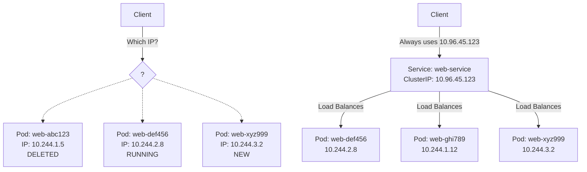
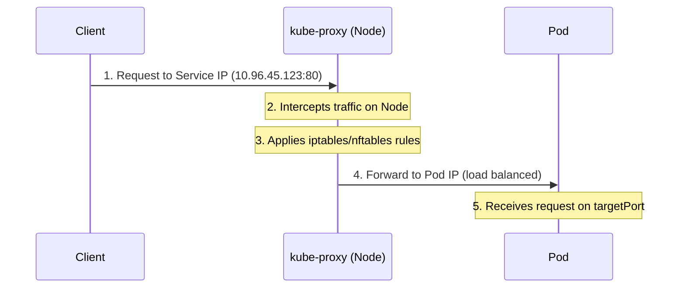
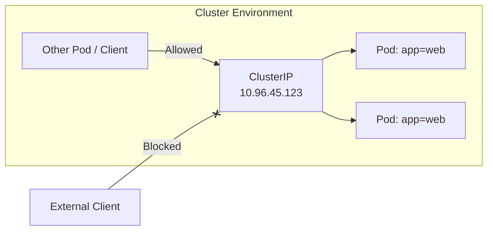
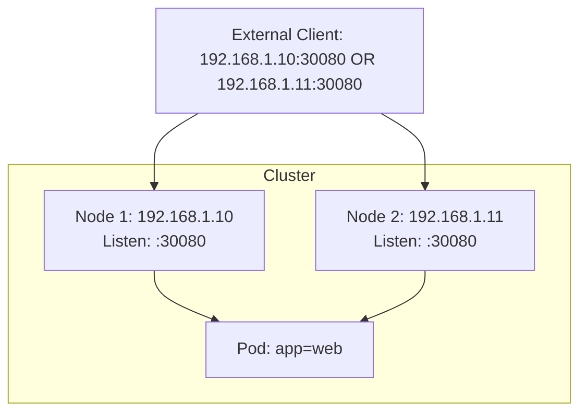
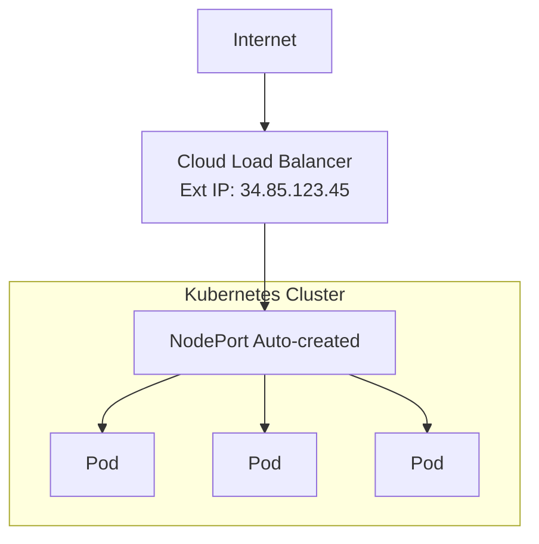
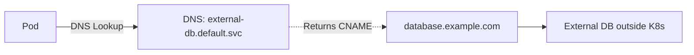
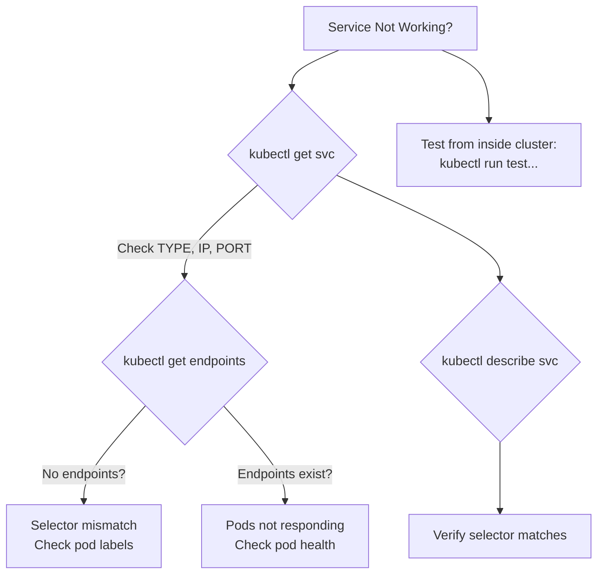

> **Complexity**: `[MEDIUM]` - Core networking concept
>
> **Time to Complete**: 45-55 minutes
>
> **Prerequisites**: Module 2.1 (Pods), Module 2.2 (Deployments)

---

## What You'll Be Able to Do

After completing this module, you will be able to:

- **Design** highly available Service exposure by choosing ClusterIP, NodePort, LoadBalancer, ExternalName, or headless Services for a stated access requirement.
- **Implement** declarative and imperative Service definitions that correctly map `port`, `targetPort`, named ports, protocols, selectors, and multi-port traffic.
- **Diagnose** Service routing failures by tracing the path from DNS name to Service, EndpointSlice, selected Pod, target port, and kube-proxy forwarding rule.
- **Evaluate** traffic behavior for session affinity, `externalTrafficPolicy`, `internalTrafficPolicy`, and Kubernetes v1.35 traffic distribution preferences.
- **Debug** kube-proxy data-plane symptoms by comparing iptables, nftables, and deprecated IPVS evidence without confusing proxy rules with application failures.

## Why This Module Matters

Hypothetical scenario: your team deploys a payment frontend with three replicas, tests it successfully, and then watches it fail after a routine rollout because another application was configured to call one Pod IP directly. The broken configuration worked only while that exact Pod existed. When the Deployment replaced it, the client kept dialing a dead address, even though healthy replacement Pods were ready and serving traffic. Kubernetes Services exist to remove that fragile coupling between client configuration and backend Pod lifecycles.

Pods are intentionally disposable. The scheduler may place a replacement Pod on another node, a Deployment rollout may create a new replica set, and a failed readiness probe may remove a Pod from traffic even before the container is fully terminated. Service objects give clients a stable name and usually a stable virtual IP while Kubernetes continuously updates the backend set. That stable identity is not a convenience feature; it is the difference between a cluster that tolerates normal change and a cluster where every rollout becomes a network outage.

For the CKA exam, Services sit at the intersection of command fluency and diagnostic reasoning. You need to create a Service quickly, but you also need to explain why a Service has no endpoints, why `port` and `targetPort` are not interchangeable, why a ClusterIP is unreachable from outside the cluster, and why a NodePort may still fail when host firewalls block the allocated range. This module keeps the original examples, diagrams, tables, and source references, but rebuilds the lesson around the reasoning chain you will use under exam pressure and in real operations.

> **The Restaurant Analogy**
>
> Imagine a restaurant where the chefs are Pods. Chefs change shifts, call in sick, and move between stations, but customers do not need each chef's private phone number. They call the restaurant's public number, and the host directs the request to an available chef. A Kubernetes Service is that stable phone number and routing desk: clients use one identity while Kubernetes keeps track of which backends are currently ready.

## Service Identity and the Pod Churn Problem

The first Service concept to internalize is that a Service is not a Pod and not a process. It is an API object that describes a durable access point and a selection rule for finding backends. The selection rule usually says "send traffic to Pods with these labels," while the access point exposes a name, a virtual IP, and one or more ports. This separation lets a Deployment replace Pods without forcing every client to relearn backend addresses.

When a client tries to call a Pod IP directly, the client is taking responsibility for a thing Kubernetes intentionally treats as temporary. That may be acceptable during a one-minute debugging session, but it is a brittle production contract. A Service moves the contract up one level: the client depends on `web-service.default.svc.cluster.local` or the Service ClusterIP, and Kubernetes keeps the backend membership current as Pods appear, disappear, become ready, or fail readiness checks.



<details>
<summary>View Legacy ASCII Diagram</summary>

```text
┌────────────────────────────────────────────────────────────────┐
│                     The Problem                                │
│                                                                │
│   Client wants to reach "web app"                              │
│                                                                │
│   ┌─────────────────────────────────────────────────────┐      │
│   │  Pod: web-abc123   IP: 10.244.1.5   ← Created       │      │
│   │  Pod: web-def456   IP: 10.244.2.8   ← Running       │      │
│   │  Pod: web-ghi789   IP: 10.244.1.12  ← Created       │      │
│   │  Pod: web-abc123   IP: 10.244.1.5   ← Deleted!      │      │
│   │  Pod: web-xyz999   IP: 10.244.3.2   ← New pod       │      │
│   └─────────────────────────────────────────────────────┘      │
│                                                                │
│   Which IP should the client use? They keep changing!          │
│                                                                │
└────────────────────────────────────────────────────────────────┘

┌────────────────────────────────────────────────────────────────┐
│                     The Solution: Services                     │
│                                                                │
│   ┌───────────────────────────────────────────────────────┐    │
│   │            Service: web-service                       │    │
│   │            ClusterIP: 10.96.45.123                    │    │
│   │            (Never changes!)                           │    │
│   │                                                       │    │
│   │     Selector: app=web                                 │    │
│   │         │                                             │    │
│   │         ├──► Pod: web-def456 (10.244.2.8)             │    │
│   │         ├──► Pod: web-ghi789 (10.244.1.12)            │    │
│   │         └──► Pod: web-xyz999 (10.244.3.2)             │    │
│   └───────────────────────────────────────────────────────┘    │
│                                                                │
│   Client always uses 10.96.45.123 - Kubernetes handles rest    │
│                                                                │
└────────────────────────────────────────────────────────────────┘
```

</details>

Read the diagram from left to right as an operational timeline. The top half shows why direct Pod addressing fails: the address that was correct yesterday may point to nothing after a rollout. The bottom half shows the Service contract: the Service IP and DNS name stay stable while EndpointSlices update the current Pod IPs. The important CKA habit is to ask whether the problem is with the stable front door, the backend membership list, or the application listening behind that membership list.

Pause and predict: if a Service selector matches three running Pods, and one Pod becomes unready because its readiness probe fails, should a new client request still be sent to that unready Pod? Before reading on, decide whether the answer should depend on the Service, the Deployment, or the readiness condition. The reason matters because Service debugging often starts with a healthy-looking Pod list but an endpoint list that tells a more precise truth.

The main parts of a normal Service are compact, but each one answers a different question. `ClusterIP` is the stable internal virtual IP. `selector` tells Kubernetes which Pods are eligible backends. `port` is what clients connect to on the Service. `targetPort` is where traffic lands on the selected Pods. Endpoints and EndpointSlices are the resolved backend addresses that Kubernetes derives from the selector and Pod readiness.

| Component | Description |
|-----------|-------------|
| **ClusterIP** | Stable internal IP address for the service |
| **Selector** | Labels that identify which pods to route to |
| **Port** | The port the service listens on |
| **TargetPort** | The port on the pods to forward traffic to |
| **Endpoints** | Actual pod IPs backing the service |

The `port` and `targetPort` distinction is the most common early mistake because the names sound similar. A useful analogy is a building lobby: the Service `port` is the lobby desk clients approach, while `targetPort` is the room number where the request is delivered after the lobby routes it. If `targetPort` is omitted, Kubernetes defaults it to the same value as `port`, which is convenient for simple nginx examples but dangerous when the application listens on a different container port.

Behind the Service object, kube-proxy or an alternative data plane programs the node networking rules that make a virtual IP useful. In the common Linux kube-proxy case, traffic to the Service IP is captured and translated to one of the backend Pod IPs. The Service IP usually does not exist as a normal address on a node interface; it is a virtual destination recognized by the cluster networking rules. That is why pinging a ClusterIP is not a reliable Service test, while an HTTP request to the configured Service port is meaningful.



<details>
<summary>View Legacy ASCII Diagram</summary>

```text
┌────────────────────────────────────────────────────────────────┐
│                   Service Request Flow                         │
│                                                                │
│   1. Client sends request to Service IP (10.96.45.123:80)      │
│                         │                                      │
│                         ▼                                      │
│   2. kube-proxy (on each node) intercepts                      │
│                         │                                      │
│                         ▼                                      │
│   3. kube-proxy uses iptables/nftables rules                   │
│                         │                                      │
│                         ▼                                      │
│   4. Request forwarded to one of the pod IPs                   │
│      (load balanced - round robin by default)                  │
│                         │                                      │
│                         ▼                                      │
│   5. Pod receives request on targetPort                        │
│                                                                │
└────────────────────────────────────────────────────────────────┘
```

</details>

Kubernetes v1.35 still supports multiple kube-proxy modes, but you should treat their operational signals differently. The default on Linux remains iptables when proxy mode is not explicitly configured, while nftables is the modern Linux direction and IPVS is deprecated in v1.35. For the CKA, you usually do not need to edit kube-proxy rules directly, but you do need to know that a Service failure can be caused by selector state, Pod readiness, application listening ports, node firewalls, or the node data plane.

## Choosing the Right Service Type

Service type is an exposure decision, not a performance label. Start by asking who needs to reach the application. If only other Pods inside the cluster need it, ClusterIP is the default and usually the correct answer. If traffic must enter the cluster from outside, NodePort, LoadBalancer, Ingress, or Gateway become candidates, and the right choice depends on whether you need a quick exam answer, a cloud-managed external address, or a production HTTP routing layer.

| Type | Scope | Use Case | Exam Frequency |
|------|-------|----------|----------------|
| **ClusterIP** | Internal only | Pod-to-pod communication | [High] |
| **NodePort** | External via node IP | Development, testing | [Medium-High] |
| **LoadBalancer** | External via cloud LB | Production in cloud | [Medium] |
| **ExternalName** | DNS alias | External services | [Low] |

ClusterIP is the default because internal communication is the safest baseline. Omitting `spec.type` gives you a stable internal Service address that is reachable from Pods inside the cluster, but not directly from a laptop on the outside network. That default matters on the exam because a task may ask for an internal backend Service and never mention `type`; adding NodePort or LoadBalancer would overexpose the workload and change the answer.

```yaml
# Internal-only access - most common type
apiVersion: v1
kind: Service
metadata:
  name: web-service
spec:
  type: ClusterIP           # Default, can be omitted
  selector:
    app: web                # Match pods with label app=web
  ports:
  - port: 80                # Service listens on port 80
    targetPort: 8080        # Forward to pod port 8080
```



<details>
<summary>View Legacy ASCII Diagram</summary>

```text
┌────────────────────────────────────────────────────────────────┐
│                     ClusterIP Service                          │
│                                                                │
│   Only accessible from within the cluster                      │
│                                                                │
│   ┌────────────────┐        ┌────────────────┐                 │
│   │  Other Pod     │───────►│  ClusterIP     │                 │
│   │  (client)      │        │  10.96.45.123  │                 │
│   └────────────────┘        │                │                 │
│                             │  ┌──────────┐  │                 │
│                             │  │ Pod      │  │                 │
│                             │  │ app=web  │  │                 │
│   ┌────────────────┐        │  └──────────┘  │                 │
│   │  External      │───X───►│                │                 │
│   │  (blocked)     │        │  ┌──────────┐  │                 │
│   └────────────────┘        │  │ Pod      │  │                 │
│                             │  │ app=web  │  │                 │
│                             │  └──────────┘  │                 │
│                             └────────────────┘                 │
│                                                                │
└────────────────────────────────────────────────────────────────┘
```

</details>

Headless Services are still Services, but they deliberately remove the virtual IP. Setting `.spec.clusterIP: None` tells Kubernetes not to allocate a ClusterIP and not to have kube-proxy load balance through that virtual address. DNS instead returns the backend Pod addresses directly, which is useful when the client needs to make its own backend choice, as with some clustered databases, peer-aware systems, or StatefulSet patterns. The tradeoff is that your application now owns more of the load-distribution behavior.

NodePort opens the Service on a port from the configured node-port range, which defaults to `30000-32767`. In the usual setup, every node listens on the same NodePort and forwards to the Service, even if the chosen backend Pod is on another node. That makes NodePort simple for labs, bare-metal experiments, and exam tasks, but it also exposes a high port on each node and requires firewalls, routing, and security groups to allow that port. Treat it as a primitive building block rather than a complete production edge strategy.

```yaml
# Exposes service on each node's IP at a static port
apiVersion: v1
kind: Service
metadata:
  name: web-nodeport
spec:
  type: NodePort
  selector:
    app: web
  ports:
  - port: 80              # ClusterIP port (internal)
    targetPort: 8080      # Pod port
    nodePort: 30080       # External port (30000-32767)
```



<details>
<summary>View Legacy ASCII Diagram</summary>

```text
┌────────────────────────────────────────────────────────────────┐
│                     NodePort Service                           │
│                                                                │
│   External access via <NodeIP>:<NodePort>                      │
│                                                                │
│   ┌─────────────────────────────────────────────────────────┐  │
│   │                    Cluster                              │  │
│   │                                                         │  │
│   │  Node 1 (192.168.1.10)     Node 2 (192.168.1.11)        │  │
│   │  ┌──────────────────┐      ┌──────────────────┐         │  │
│   │  │ :30080 ──────────┼──────┼─► Pod (app=web)  │         │  │
│   │  └──────────────────┘      └──────────────────┘         │  │
│   │                                                         │  │
│   └─────────────────────────────────────────────────────────┘  │
│                 ▲                          ▲                   │
│                 │                          │                   │
│   External: 192.168.1.10:30080  OR  192.168.1.11:30080         │
│             (Both work!)                                       │
│                                                                │
└────────────────────────────────────────────────────────────────┘
```

</details>

The NodePort allocation range is designed to reduce collisions between explicit and automatic assignments. Kubernetes uses the lower band for ports requested manually and the upper band first for dynamic assignment. You should still avoid hand-picking NodePorts unless a task requires it, because fixed ports become shared cluster resources that can conflict with other teams, firewall policy, and future automation. When an exam prompt specifies a NodePort, write it in YAML because the imperative expose command does not always express every Service field cleanly.

LoadBalancer asks the cluster environment to provision an external load balancer for the Service. On managed clouds, that usually creates a cloud load-balancer resource and assigns an external IP or hostname; on local clusters, it may remain pending unless an implementation such as MetalLB is installed. By default, many implementations allocate NodePorts underneath the LoadBalancer, though providers that route directly to Pods may support disabling that with `allocateLoadBalancerNodePorts: false`. The important distinction is that the Kubernetes Service records the desired exposure, while the environment performs the actual provisioning.

```yaml
# Creates external load balancer (cloud provider)
apiVersion: v1
kind: Service
metadata:
  name: web-lb
spec:
  type: LoadBalancer
  selector:
    app: web
  ports:
  - port: 80
    targetPort: 8080
```



<details>
<summary>View Legacy ASCII Diagram</summary>

```text
┌────────────────────────────────────────────────────────────────┐
│                   LoadBalancer Service                         │
│                                                                │
│   Cloud provider creates an external load balancer             │
│                                                                │
│   ┌──────────────────┐                                         │
│   │   Internet       │                                         │
│   └────────┬─────────┘                                         │
│            │                                                   │
│            ▼                                                   │
│   ┌──────────────────┐     External IP: 34.85.123.45           │
│   │   Cloud LB       │                                         │
│   │   (AWS/GCP/Azure)│                                         │
│   └────────┬─────────┘                                         │
│            │                                                   │
│            ▼                                                   │
│   ┌──────────────────────────────────────────────────┐         │
│   │             NodePort (auto-created)              │         │
│   │                      │                           │         │
│   │        ┌─────────────┼─────────────┐             │         │
│   │        ▼             ▼             ▼             │         │
│   │    ┌──────┐     ┌──────┐     ┌──────┐            │         │
│   │    │ Pod  │     │ Pod  │     │ Pod  │            │         │
│   │    └──────┘     └──────┘     └──────┘            │         │
│   └──────────────────────────────────────────────────┘         │
│                                                                │
└────────────────────────────────────────────────────────────────┘
```

</details>

ExternalName is different because it does not proxy traffic at all. It creates a DNS CNAME-style alias from a Kubernetes Service name to an external DNS name, which can be helpful when applications expect to call a cluster-local name but the real dependency lives outside the cluster. Because there is no ClusterIP, selector, or kube-proxy routing, ExternalName cannot fix network reachability, TLS hostname mismatch, or authentication problems. It only changes how the name resolves.

```yaml
# DNS alias to external service (no proxying)
apiVersion: v1
kind: Service
metadata:
  name: external-db
spec:
  type: ExternalName
  externalName: database.example.com   # Returns CNAME record
  # No selector - points to external DNS name
```



<details>
<summary>View Legacy ASCII Diagram</summary>

```text
┌────────────────────────────────────────────────────────────────┐
│                   ExternalName Service                         │
│                                                                │
│   DNS alias - no ClusterIP, no proxying                        │
│                                                                │
│   ┌────────────────┐                                           │
│   │  Pod           │                                           │
│   │                │──► DNS: external-db.default.svc           │
│   │                │          │                                │
│   └────────────────┘          │ Returns CNAME                  │
│                               ▼                                │
│                     database.example.com                       │
│                               │                                │
│                               ▼                                │
│                     ┌──────────────────┐                       │
│                     │  External DB     │                       │
│                     │  (outside K8s)   │
│                     └──────────────────┘                       │
│                                                                │
└────────────────────────────────────────────────────────────────┘
```

</details>

Be careful with `ExternalName` values that look like raw IP addresses. DNS treats the value as a name, not as a routed IP target, so an external name of `192.168.1.50` is not a portable way to point a Service at that address. If you need a stable Kubernetes Service name for manually managed backend IPs, a selectorless Service with manually defined Endpoints or EndpointSlices is usually the more explicit pattern. Which approach would you choose for a legacy database with fixed private IPs, and why?

## Creating Services and Mapping Ports

In the CKA, imperative commands are valuable because they create correct boilerplate quickly. The safest workflow is often to generate YAML with `--dry-run=client -o yaml`, review the selector and ports, then apply the manifest. That approach is fast enough for the exam while leaving an auditable manifest if you need to specify fields such as `nodePort`, named ports, `sessionAffinity`, or traffic policy. Commands should use the full `kubectl` binary so copied blocks work in non-interactive shells and training environments.

```bash
# Expose a deployment (most common exam task)
kubectl expose deployment nginx --port=80 --target-port=8080 --name=nginx-svc

# Expose with NodePort
kubectl expose deployment nginx --port=80 --type=NodePort --name=nginx-np

# Expose a pod
kubectl expose pod nginx --port=80 --name=nginx-pod-svc

# Generate YAML without creating
kubectl expose deployment nginx --port=80 --dry-run=client -o yaml > svc.yaml

# Create service for existing pods by selector
kubectl create service clusterip my-svc --tcp=80:8080
```

```bash
# Full syntax
kubectl expose deployment <name> \
  --port=<service-port> \
  --target-port=<pod-port> \
  --type=<ClusterIP|NodePort|LoadBalancer> \
  --name=<service-name> \
  --protocol=<TCP|UDP>

# Examples
kubectl expose deployment web --port=80 --target-port=8080
kubectl expose deployment web --port=80 --type=NodePort
kubectl expose deployment web --port=80 --type=LoadBalancer
```

The declarative form is where Services become easier to review. A selector should match only the intended Pods, and every multi-port Service should name its ports so downstream references remain unambiguous. Named `targetPort` values are especially useful when container ports differ across versions, because the Service can route to a named container port rather than a hardcoded number. The Service still needs a valid backend port at runtime, but the manifest communicates intent more clearly.

```yaml
# Complete service example
apiVersion: v1
kind: Service
metadata:
  name: web-service
  labels:
    app: web
spec:
  type: ClusterIP
  selector:
    app: web              # MUST match pod labels
    tier: frontend
  ports:
  - name: http            # Named port (good practice)
    port: 80              # Service port
    targetPort: 8080      # Pod port (can be name or number)
    protocol: TCP         # TCP (default) or UDP
```

```yaml
# Service with multiple ports
apiVersion: v1
kind: Service
metadata:
  name: multi-port-svc
spec:
  selector:
    app: web
  ports:
  - name: http            # Required when multiple ports
    port: 80
    targetPort: 8080
  - name: https
    port: 443
    targetPort: 8443
  - name: metrics
    port: 9090
    targetPort: 9090
```

Before running this, what output do you expect if the selector uses `app: web` but the Deployment template labels its Pods with `app: frontend`? The Service will still be created, because the API server accepts a selector that currently matches no Pods. The failure appears in the endpoint layer: `kubectl get endpoints` or `kubectl get endpointslices` shows no backends, and client traffic has nowhere useful to go.

Selector matching is exact for the labels you specify, but Pods may have additional labels. That means a Service selecting `app: web` and `tier: frontend` will match a Pod with those two labels plus `version: v2`; it will not match a Pod that is missing `tier: frontend`. This is a powerful model because you can route to a slice of a workload, but it is unforgiving when labels drift between Deployment templates and Service manifests.

```yaml
# Service selector MUST match pod labels exactly
# Service:
spec:
  selector:
    app: web
    tier: frontend

# Pod (will be selected):
metadata:
  labels:
    app: web
    tier: frontend
    version: v2          # Extra labels OK

# Pod (will NOT be selected - missing tier):
metadata:
  labels:
    app: web
    version: v2
```

Service discovery usually starts with DNS, not with IP addresses. Kubernetes DNS names follow the pattern `<service>.<namespace>.svc.<cluster-domain>`, and Pod resolver search paths make short names convenient inside the same namespace. From another namespace, use at least `<service>.<namespace>`, and in configuration files that must be unambiguous, prefer the fully qualified name. The difference between `api` and `api.backend` is often the difference between calling your own namespace by accident and calling the intended backend namespace.

```bash
# From a pod in the same namespace
curl web-service

# From a pod in different namespace
curl web-service.production

# Fully qualified (always works)
curl web-service.production.svc.cluster.local
```

Kubernetes also injects Service environment variables into Pods, but only for Services that already existed when the Pod was created. That timing rule makes environment variables a poor discovery mechanism for dynamic systems, because creating a Service later does not retroactively update existing Pod environments. DNS is the normal answer because it is resolved at runtime and follows Service changes without recreating clients. You should recognize the environment variables, but design around DNS for ordinary Service-to-Service communication.

```bash
# Environment variables for service "web-service"
WEB_SERVICE_SERVICE_HOST=10.96.45.123
WEB_SERVICE_SERVICE_PORT=80

# Note: Only works for services created BEFORE the pod
```

Exercise scenario: you inherit a namespace where an API Deployment exposes container port `3000`, a Service exposes `port: 80`, and clients intermittently report connection refused. Start by checking whether `targetPort` is `3000`, whether the selected Pods are ready, and whether the application is listening on the expected socket inside the container. If any one of those links is wrong, the Service can exist, DNS can resolve, and the request can still fail at delivery time. The point is to diagnose the chain, not just the object.

## EndpointSlices, Traffic Policy, and kube-proxy Behavior

Endpoints and EndpointSlices are the live backend inventory for a Service. Legacy Endpoints are easy to read, but EndpointSlices are the modern scalable API and the place where newer traffic behavior is expressed. If a Service has no endpoints, clients cannot reach selected backends through that Service, regardless of whether the Service YAML looks correct. If endpoints exist but traffic fails, move down the chain to Pod health, target ports, NetworkPolicy, node routing, or application behavior.

```bash
# List services
kubectl get services
kubectl get svc                    # Short form

# Get service details
kubectl describe svc web-service

# Get service endpoints
kubectl get endpoints web-service

# Get service YAML
kubectl get svc web-service -o yaml

# Find service ClusterIP
kubectl get svc web-service -o jsonpath='{.spec.clusterIP}'
```

```bash
# View endpoints (pod IPs backing the service)
kubectl get endpoints web-service
# NAME          ENDPOINTS                         AGE
# web-service   10.244.1.5:8080,10.244.2.8:8080   5m

# Detailed endpoint info
kubectl describe endpoints web-service
```

```bash
# View EndpointSlices (modern scalable API)
kubectl get endpointslices -l kubernetes.io/service-name=web-service
# NAME                ADDRESSTYPE   PORTS   ENDPOINTS                     AGE
# web-service-x8z9w   IPv4          8080    10.244.1.5,10.244.2.8         5m

# Detailed EndpointSlice info
kubectl describe endpointslices -l kubernetes.io/service-name=web-service
```

Selectorless Services are valid when Kubernetes should not discover Pods automatically. This pattern is useful for routing through a Kubernetes name toward a manually managed backend, such as a legacy appliance, a database outside the cluster, or a migration target. The Service defines the stable frontend, while you create matching Endpoints or EndpointSlices yourself. The tradeoff is ownership: Kubernetes will not update those backend addresses for you, so drift and stale IPs become your operational responsibility.

```text
# Service without selector
apiVersion: v1
kind: Service
metadata:
  name: external-service
spec:
  ports:
  - port: 80
    targetPort: 80
---
# Manual endpoints
apiVersion: v1
kind: Endpoints
metadata:
  name: external-service    # Must match service name
subsets:
- addresses:
  - ip: 192.168.1.100      # External IP
  - ip: 192.168.1.101
  ports:
  - port: 80
```

A selectorless Service has one notable safety restriction: the API server refuses `kubectl port-forward` against it because the Service is not linked to Pods through a selector. That protects users from treating an arbitrary endpoint as though it were a Pod selected by the Kubernetes API. Similarly, `.spec.externalIPs` is user-managed; Kubernetes does not allocate or provision those addresses. It merely programs routing behavior for traffic destined to addresses you have already arranged to own and route.

Traffic policy fields shape how backends are chosen after the Service has a backend set. `externalTrafficPolicy: Local` preserves client source IP for external traffic, but it only sends traffic to node-local endpoints; if a node receives traffic and has no local endpoint, that request can be dropped. `internalTrafficPolicy: Local` applies a similar locality rule for cluster-internal traffic. These settings are powerful when source IP or node-locality matters, but they are dangerous when you expect any node to be able to forward to any healthy Pod.

```yaml
# Sticky sessions - route same client to same pod
apiVersion: v1
kind: Service
metadata:
  name: sticky-service
spec:
  selector:
    app: web
  sessionAffinity: ClientIP      # None (default) or ClientIP
  sessionAffinityConfig:
    clientIP:
      timeoutSeconds: 10800      # 3 hours (default)
  ports:
  - port: 80
```

Session affinity is a request-distribution hint, not a substitute for durable session storage. `ClientIP` can keep a client routed to the same backend for a configured timeout, up to the documented ceiling, but it cannot preserve memory from a deleted Pod. If the selected Pod disappears, clients are remapped to remaining endpoints. Use affinity for workloads that benefit from stickiness, such as WebSocket-style traffic, while still moving real session state to a shared store when correctness matters.

| Scenario | Use Affinity? |
|----------|---------------|
| Stateless API | No (default) |
| Shopping cart in pod memory | Yes (but better: use Redis) |
| WebSocket connections | Yes |
| Authentication sessions in memory | Yes (but better: external store) |

Kubernetes v1.35 adds sharper vocabulary for traffic distribution. `PreferSameNode` asks the implementation to prefer endpoints on the same node and fall back when needed, while `PreferSameZone` prefers topologically close endpoints such as those in the same zone. `PreferClose` remains a deprecated alias for `PreferSameZone`, so new manifests should use the clearer names. These preferences can reduce latency or cross-zone cost, but they do not replace readiness, capacity planning, or failure-domain design.

```yaml
apiVersion: v1
kind: Service
metadata:
  name: latency-sensitive
spec:
  selector:
    app: cache
  ports:
  - port: 6379
  trafficDistribution: PreferSameNode  # Route to local node first
```

| Value | Behavior |
|-------|----------|
| `PreferSameNode` | [Strictly prefer endpoints on the same node, fall back to remote (GA in 1.35)](https://kubernetes.io/docs/concepts/services-networking/service/) |
| `PreferSameZone` | Prefer endpoints topologically close — same zone when using topology-aware routing |

Pause and predict: if you set `externalTrafficPolicy: Local` for a NodePort Service and send traffic to a node with no local backend Pod, what should you check before blaming DNS? The DNS name may be resolving correctly, and the NodePort may be open, but the policy intentionally refuses to forward to remote endpoints. The right evidence is node placement, EndpointSlice hints, Service policy fields, and whether the receiving node has a local ready endpoint.

When endpoint state looks correct and clients still fail, kube-proxy inspection becomes useful. In iptables mode, rules in `KUBE-SERVICES`, `KUBE-SVC-*`, and `KUBE-SEP-*` chains show how the virtual Service IP is translated to backend Pod IPs. In nftables mode, the same idea appears in the nft ruleset. In deprecated IPVS mode, `ipvsadm` shows virtual servers and real servers. This is advanced evidence, but it can separate a broken data plane from a broken application.



<details>
<summary>View Legacy ASCII Diagram</summary>

```text
Service Not Working?
    │
    ├── kubectl get svc (check service exists)
    │       │
    │       └── Check TYPE, CLUSTER-IP, EXTERNAL-IP, PORT
    │
    ├── kubectl get endpoints <svc> (check endpoints)
    │       │
    │       ├── No endpoints? → Selector doesn't match pods
    │       │                   Check pod labels
    │       │
    │       └── Endpoints exist? → Pods aren't responding
    │                              Check pod health
    │
    ├── kubectl describe svc <svc> (check selector)
    │       │
    │       └── Verify selector matches pod labels
    │
    └── Test from inside cluster:
        kubectl run test --rm -it --image=busybox -- wget -qO- <svc>
```

</details>

| Symptom | Cause | Solution |
|---------|-------|----------|
| No endpoints | Selector doesn't match pods | Fix selector or pod labels |
| Connection refused | Pod not listening on targetPort | Check pod port configuration |
| Timeout | Pod not running or crashlooping | Debug pod issues first |
| NodePort not accessible | Firewall blocking port | Check node firewall rules |
| Wrong service type | Using ClusterIP for external access | Change to NodePort/LoadBalancer |

```bash
# Check service and endpoints
kubectl get svc,endpoints

# Inspect modern EndpointSlices to diagnose backend routing
kubectl get endpointslices -l kubernetes.io/service-name=web-service

# Verify selector matches pods
kubectl get pods --selector=app=web

# Test connectivity from within cluster
kubectl run test --rm -it --image=busybox:1.36 --restart=Never -- \
  wget -qO- http://web-service

# Test with curl
kubectl run test --rm -it --image=curlimages/curl --restart=Never -- \
  curl -s http://web-service

# Check DNS resolution
kubectl run test --rm -it --image=busybox:1.36 --restart=Never -- \
  nslookup web-service

# Check port on pod directly
kubectl exec <pod> -- netstat -tlnp
```

```bash
# 1. Get the Service ClusterIP
kubectl get svc web-service
# Example IP: 10.96.45.123

# 2. SSH into a Kubernetes Node
ssh user@node-01

# 3. Search iptables rules for the Service IP
sudo iptables-save | grep 10.96.45.123
# You will see a rule redirecting traffic to a KUBE-SVC-* chain:
# -A KUBE-SERVICES -d 10.96.45.123/32 -p tcp -m tcp --dport 80 -j KUBE-SVC-XXXXXXXXXXXXXXXX

# 4. Inspect the KUBE-SVC chain to find the load balancing logic
sudo iptables-save | grep KUBE-SVC-XXXXXXXXXXXXXXXX
# You will see rules distributing traffic to KUBE-SEP-* chains (one for each Pod endpoint) using probabilities.

# 5. Inspect a KUBE-SEP (Service Endpoint) chain to find the actual Pod IP
sudo iptables-save | grep KUBE-SEP-YYYYYYYYYYYYYYYY
# You will see the DNAT rule translating the destination to the Pod IP:
# -A KUBE-SEP-YYYYYYYYYYYYYYYY -p tcp -m tcp -j DNAT --to-destination 10.244.1.5:8080
```

On clusters running kube-proxy in `nftables` mode, the equivalent first look is `nft list ruleset | grep 10.96.45.123`, followed by inspection of the relevant NAT rules. On legacy clusters still using deprecated IPVS mode, `ipvsadm -ln -t 10.96.45.123:80` shows the virtual server and real server table. These commands should come after ordinary Service, EndpointSlice, Pod, and application checks; otherwise you risk spending time in the data plane while the selector is simply misspelled.

## Worked Example: Trace a Service Failure End to End

The fastest Service debugging habit is to walk the request path in order and refuse to skip layers. A request starts as a name, becomes a Service virtual destination, resolves to a backend set, enters node-level forwarding, and finally reaches an application socket. Each layer can fail independently, and the symptom seen by the caller is often too vague to identify the failing layer by itself. A timeout, connection refused error, or empty response body should become a structured investigation rather than a guess about which YAML field looks suspicious.

Start by proving the Service object exists and exposes the port the client is actually using. This is not merely a command-memory step; it establishes the contract that clients are supposed to call. If the Service type, ClusterIP, port, or namespace is wrong, deeper checks will only produce confusing evidence. On the CKA, this first command also prevents wasted edits when the real issue is that the Service was created in `default` while the workload and client are in another namespace.

```bash
kubectl get svc web-service -o wide
```

After the Service contract is visible, inspect the selector and compare it against the selected Pods. Do not rely on names that look similar, because Kubernetes does not infer that `web`, `web-app`, and `frontend-web` are related. The selector must match labels exactly for the keys it specifies, and it only selects Pods in the same namespace. This is why a Service can look correct in `kubectl get svc` output while still routing to no backends at all.

```bash
kubectl get svc web-service -o yaml
kubectl get pods --show-labels
kubectl get pods --selector=app=web,tier=frontend
```

Next, ask Kubernetes what backend set it actually built. EndpointSlices are better evidence than your expectation because they reflect selector matching, namespace scope, readiness, and port resolution after controllers have done their work. If the EndpointSlice list is empty, kube-proxy has no useful backend information to program for that Service. If EndpointSlices exist, note the endpoint addresses, readiness, and ports before moving to application or node-level checks.

```bash
kubectl get endpointslices -l kubernetes.io/service-name=web-service -o wide
kubectl describe endpointslices -l kubernetes.io/service-name=web-service
```

The next layer is an in-cluster client test, because it removes external firewalls, cloud load balancers, and node routing from the first diagnosis. A temporary Pod gives you the same DNS search paths and cluster network context that real workloads use. If the short name fails but the fully qualified name works, the failure is probably namespace-related. If DNS resolves but HTTP fails, the investigation moves from name resolution toward endpoint delivery and application behavior.

```bash
kubectl run svc-debug --rm -it --image=busybox:1.36 --restart=Never -- \
  sh -c 'nslookup web-service && wget -S -O- http://web-service'
```

When an endpoint exists and DNS works, verify the Pod-side socket. A Service cannot make a container listen on a port it never opened. The cleanest check is often to inspect the Pod spec for container ports, then execute a simple socket or HTTP check inside the selected Pod if the image contains suitable tools. Container port declarations are documentation for humans and integrations, but the real application process must still bind the target port.

```bash
kubectl get pod -l app=web -o jsonpath='{range .items[*]}{.metadata.name}{" "}{.status.podIP}{"\n"}{end}'
kubectl exec deploy/web -- sh -c 'netstat -tlnp || ss -tlnp || true'
```

Only after the Service, selector, endpoints, DNS, and application socket are plausible should you inspect the node data plane. In iptables mode, look for the Service IP and port in NAT rules, then follow the `KUBE-SVC-*` chain toward endpoint-specific rules. In nftables mode, inspect the nft ruleset for the same Service IP. This layer matters when every Kubernetes object looks healthy but traffic still disappears, especially after kube-proxy configuration changes or node-level packet-filter changes.

```bash
kubectl get svc web-service -o jsonpath='{.spec.clusterIP}{"\n"}'
sudo iptables-save | grep 10.96.45.123
sudo nft list ruleset | grep 10.96.45.123
```

For a deprecated IPVS-mode cluster, the diagnostic evidence looks different, but the reasoning is the same. You are still looking for a virtual Service destination and real backend servers. If IPVS shows no real servers, return to EndpointSlices and kube-proxy synchronization. If IPVS shows backends but traffic fails, compare the backend Pod IPs and ports with the application socket and any policy that could block the path. The tool changes, but the chain of responsibility does not.

```bash
sudo ipvsadm -ln
sudo ipvsadm -ln -t 10.96.45.123:80
```

External exposure adds one more layer above the Service. For NodePort, confirm the allocated node port and then confirm that the client can reach a node address on that port. For LoadBalancer, check whether an external address was provisioned and whether the provider has reported events or health-check failures. For either type, remember that `externalTrafficPolicy: Local` changes which nodes are valid entry points, because nodes without local ready endpoints may drop traffic by design.

```bash
kubectl get svc frontend-svc -o jsonpath='{.spec.type}{" "}{.spec.ports[0].nodePort}{"\n"}'
kubectl describe svc frontend-svc
```

This worked example is deliberately repetitive because repetition is how you avoid false conclusions during an outage or an exam clock. The correct sequence is Service contract, selector, EndpointSlice, in-cluster DNS and HTTP, Pod socket, node data plane, and external entry layer. If you can state which layer each command proves, you can diagnose most Service failures without memorizing a unique recipe for every symptom. The best administrators are not faster because they guess; they are faster because their checks eliminate whole classes of failure in a stable order.

There is another reason to keep this order: each layer has a different owner in many clusters. Application teams often own container ports, labels, readiness probes, and Deployment rollout timing. Platform teams often own kube-proxy mode, node firewalls, CNI behavior, and cloud load-balancer integration. When you bring evidence from the wrong layer, the conversation becomes vague and political; when you bring evidence from the correct layer, the next action is usually obvious. A Service diagnosis should produce a sentence like "the Service selector matches zero ready Pods" or "the node received NodePort traffic but local policy has no local endpoint," not merely "networking is broken."

Namespace scope deserves special attention because it creates failures that look like name-resolution problems but are really object-location problems. A Service selects only Pods in its own namespace, and a short DNS name resolves relative to the caller's namespace first. That means a backend named `api` in namespace `backend` and an unrelated Service named `api` in namespace `frontend` can both exist without conflict, while a client using the short name may quietly call the wrong one. In exam conditions, always include namespace checks when endpoint evidence does not match your expectation.

Readiness also changes the Service view of reality. A Pod can be running, have an IP address, and still be removed from endpoints if it is not ready. That behavior is exactly what you want during a rollout because clients should not receive traffic before the application is prepared to serve it. The practical consequence is that `kubectl get pods` is not enough evidence by itself. Pair it with EndpointSlices, Pod conditions, and events when a Service has fewer backends than the replica count suggests.

The `port` and `targetPort` relationship is another place where a clean object can hide a broken delivery path. The Service can accept connections perfectly on `port: 80`, kube-proxy can translate them perfectly to a selected Pod, and the application can still refuse the connection because traffic arrives at the wrong container port. This is why a good Service review compares the Service manifest with the Deployment template and, when needed, with the process actually listening inside the container. It is not enough for the YAML to be valid; the YAML must describe the running application.

EndpointSlices also help you reason about scale. Legacy Endpoints pack backend addresses into a single object, which becomes awkward for very large Services and cannot represent newer distribution hints as cleanly. EndpointSlices divide the backend set into smaller slices and carry information that controllers and data planes can use for topology-aware behavior. For most small labs, both APIs show enough to debug a simple selector mismatch, but learning EndpointSlices now prepares you for clusters where a Service may have hundreds or thousands of backends.

Traffic policies are easiest to understand if you separate preference from requirement. `trafficDistribution: PreferSameNode` and `PreferSameZone` express preferences that can fall back when the preferred endpoint is not available. `internalTrafficPolicy: Local` and `externalTrafficPolicy: Local` are much stricter because they can drop traffic when the receiving node has no local ready endpoint. A preference optimizes a path; a local-only policy can remove a path. Confusing those two ideas leads to bad availability assumptions.

Session affinity has a similar boundary. It influences which backend receives a client's requests, but it does not promise that backend will remain alive or that its memory is durable. If a sticky Pod is deleted during a rollout, Kubernetes must choose a remaining endpoint, and any state stored only in the deleted Pod is gone. That is why session affinity is a routing feature, not a data architecture. Use it to smooth connection behavior when appropriate, but do not use it to justify keeping critical state inside Pods.

External exposure should be tested from both sides of the boundary. A NodePort Service can be healthy inside the cluster while an outside client fails because a host firewall blocks the port. A LoadBalancer Service can have correct selectors and endpoints while the cloud provider has not assigned an external address or has marked nodes unhealthy. Conversely, an external address can exist while the backend set is empty. Always separate "the edge exists" from "the edge reaches a ready application."

The kube-proxy layer is powerful evidence precisely because it is downstream of the Kubernetes API objects. If rules reference the Service IP and backend Pod IPs you expect, the data plane has at least received the desired state. If the rules are absent on one node but present on another, you may be looking at a node-local kube-proxy or synchronization problem. If the rules exist everywhere but clients fail only for one application, the issue may be above the data plane, such as the target port or application readiness. The trick is to use proxy evidence to narrow the scope, not to replace ordinary Service checks.

Finally, write down the smallest reproducible observation before changing anything. "From a temporary Pod in namespace `default`, DNS for `web-service` resolves, EndpointSlices contain two ready addresses on port 8080, and HTTP returns connection refused" is a high-quality observation. It points directly toward the backend application socket or target port. "The Service is broken" is a low-quality observation because it hides the layer that failed. Clear observations make repairs faster, and they make post-fix verification much more convincing.

Use the same discipline after a fix. If you changed a selector, prove EndpointSlices now contain the expected Pods before declaring the Service repaired. If you changed `targetPort`, prove the temporary client reaches the application and that the Pod is listening on the intended port. If you changed a NodePort firewall, prove the external path and the in-cluster path separately so you know which boundary improved. Verification should mirror diagnosis because the same layered evidence that found the fault is the evidence that proves the repair.

That habit also keeps documentation honest. Record the object you changed, the command that proved the change, and the remaining risk if the fix depends on scheduling, cloud health checks, or client retry behavior. Future operators can then tell whether a recurrence is the same failure or a similar symptom from another layer.

## Patterns & Anti-Patterns

Good Service design starts with a narrow access contract. A backend used only by in-cluster clients should normally be ClusterIP, even if a developer wants to test it externally for a few minutes. A public HTTP application should usually be exposed through an Ingress or Gateway controller backed by a Service, not through a growing pile of ad hoc NodePorts. A database or peer-aware workload may need headless Service discovery, but only when the client understands multiple backend addresses and can choose safely.

| Pattern | When to Use | Why It Works | Scaling Consideration |
|---------|-------------|--------------|-----------------------|
| ClusterIP for internal APIs | Backend services called only by Pods | Keeps exposure private and stable | Use DNS names and readiness probes so endpoints track healthy Pods |
| NodePort for bounded labs or specified exam tasks | You need quick external access without cloud provisioning | Opens the same high port on nodes | Confirm firewall rules and avoid unnecessary fixed ports |
| LoadBalancer for cloud edge entry | One Service needs a cloud-managed external address | Delegates external IP and load balancer provisioning | Understand provider cost, health checks, and NodePort allocation behavior |
| Headless Service for client-side discovery | Clients must see individual Pod addresses | DNS returns backend records instead of one VIP | Application must handle balancing, retries, and membership changes |
| EndpointSlice-first troubleshooting | Endpoint count or topology matters | Shows modern backend state and hints | Legacy Endpoints may be truncated or less expressive at scale |

The anti-patterns are almost always shortcuts that hide the real contract. Direct Pod IPs look easy until a rollout changes them. NodePort looks universal until every node is externally reachable on a high port that no firewall permits. Session affinity looks like state management until a Pod dies and the in-memory state disappears. Selectorless Services look like magic until nobody owns the manually maintained backend list.

| Anti-Pattern | What Goes Wrong | Better Alternative |
|--------------|-----------------|--------------------|
| Hardcoding Pod IPs in client config | Rollouts and reschedules break connectivity | Use Service DNS names and selectors |
| Exposing every workload as NodePort | Enlarges the attack surface and complicates firewall policy | Keep backends ClusterIP and expose a controlled edge |
| Treating `port` and `targetPort` as the same field | Traffic reaches the Service but misses the application socket | Map Service port to the actual container listening port |
| Using `ExternalName` for raw IP targets | DNS treats the value as a name, not managed routing | Use selectorless Services with explicit endpoints when appropriate |
| Relying on `ClientIP` affinity for correctness | Deleted Pods still lose in-memory state | Store session state outside the Pod |
| Debugging kube-proxy before selectors | Time is wasted below the failing layer | Check Service, selector, EndpointSlice, and Pod readiness first |

## Decision Framework

Choose Service design by working from the caller backward. If the caller is another Pod, start with ClusterIP. If the caller is outside the cluster and the prompt specifically asks for a node port, use NodePort and verify the allocated or requested port. If the caller is outside the cluster in a cloud environment and needs a dedicated external address, use LoadBalancer. If the caller needs HTTP host or path routing across many applications, put Ingress or Gateway in front of Services rather than assigning a public load balancer to every workload.

```text
Need to expose a workload?
    │
    ├── Only Pods inside the cluster call it?
    │       └── Use ClusterIP, usually with Service DNS.
    │
    ├── Client must discover individual Pod addresses?
    │       └── Use a headless Service and verify client behavior.
    │
    ├── Need a DNS alias to an external hostname?
    │       └── Use ExternalName, not raw IP strings.
    │
    ├── Need quick external access or exam-specified node port?
    │       └── Use NodePort and check node firewalls.
    │
    └── Need cloud-managed external load balancing?
            └── Use LoadBalancer, or Ingress/Gateway for HTTP routing.
```

| Decision Question | Prefer This | Avoid This | Reasoning |
|-------------------|-------------|------------|-----------|
| Do clients live in the same cluster? | ClusterIP | NodePort by habit | Internal-only exposure reduces risk and noise |
| Do clients need one stable VIP? | Normal ClusterIP | Headless Service | kube-proxy can balance across ready endpoints |
| Do clients need backend identity? | Headless Service | Client scraping Endpoints manually | DNS can expose Pod records through a supported API path |
| Do you need source IP preservation? | `externalTrafficPolicy: Local` with planned Pod placement | Assuming every node can forward | Local policy drops traffic on nodes without local endpoints |
| Are you troubleshooting no endpoints? | Compare selector and Pod labels first | Restarting kube-proxy first | The backend set is empty before the data plane is relevant |

This framework also helps you answer exam questions without overbuilding. If a prompt asks for a Service reachable only from inside the cluster, do not add a LoadBalancer because it feels more complete. If a prompt asks for a specific NodePort, do not rely on automatic allocation. If a prompt asks why a Service has no endpoints, do not change the Service type; inspect selectors, namespaces, labels, and readiness first. The simplest correct Service is usually the most robust answer.

## Did You Know?

1. **EndpointSlices became stable in Kubernetes v1.21 and legacy Endpoints are deprecated as of v1.33**: modern Service troubleshooting should include EndpointSlices because they scale better and carry newer routing information.
2. **The default NodePort range is `30000-32767`**: Kubernetes reserves room for manual and dynamic allocation behavior, so explicit ports and automatic ports are less likely to collide when teams follow the range.
3. **Kubernetes v1.35 deprecates kube-proxy IPVS mode**: iptables remains the default Linux proxy mode when unspecified, while nftables is the modern replacement direction for Linux packet filtering.
4. **Service ClusterIPs are virtual destinations**: they usually are not assigned to a normal network interface, so the useful test is traffic to the Service port, not whether the virtual IP behaves like a host address.

## Common Mistakes

| Mistake | Why It Happens | How to Fix It |
|---------|----------------|---------------|
| Selector mismatch leaves a Service with no endpoints | Deployment labels and Service selectors were typed separately and drifted | Compare `kubectl get svc -o yaml`, `kubectl get pods --show-labels`, and EndpointSlices in the same namespace |
| `targetPort` points to the wrong application socket | Authors remember the client-facing Service port but forget the container listens elsewhere | Set `targetPort` to the actual container port or a named container port |
| ClusterIP is used for an externally reachable frontend | ClusterIP is the default, so the Service is created without an obvious error | Change to the requested external exposure pattern, usually NodePort, LoadBalancer, Ingress, or Gateway |
| NodePort is created but unreachable from outside | The Service exists, but network firewalls or security groups block the high port | Confirm node reachability, the NodePort value, and external firewall policy |
| Cross-namespace calls use only the short Service name | DNS search paths first try the caller's namespace | Use `<service>.<namespace>` or the full FQDN for cross-namespace configuration |
| Session affinity is treated as durable state | `ClientIP` stickiness hides the need for shared session storage | Store correctness-critical state outside Pods and use affinity only as a routing preference |
| EndpointSlice evidence is ignored | Operators keep checking only Service YAML after the object exists | Inspect EndpointSlices to see the current backend addresses, readiness, ports, and topology hints |

## Quiz

<details>
<summary>1. A developer has a Service with `port: 80` and `targetPort: 8080`, but their app container listens on port 80. Users report connection refused when hitting the Service. What went wrong and how would you fix it?</summary>

The Service is accepting traffic on port 80 and then forwarding it to port 8080 on each selected Pod. If the container listens on port 80, nothing is accepting traffic on 8080, so the connection can be refused even though DNS and endpoint selection are working. Fix the Service by changing `targetPort` to 80, or change the application and container port definition so the app really listens on 8080. The key distinction is that `port` is the client-facing Service port, while `targetPort` is the backend Pod socket.

</details>

<details>
<summary>2. You deploy a new microservice and create a Service for it, but `kubectl get endpoints` shows `<none>`. The Pods are running and show `1/1 READY`. Walk through your debugging process.</summary>

Running Pods with no endpoints usually means the Service selector does not match ready Pods in the same namespace. First inspect the Service selector with `kubectl get svc <name> -o yaml`, then compare it with `kubectl get pods --show-labels` or a targeted `kubectl get pods --selector=...`. Confirm the Service and Pods are in the same namespace, because Services do not select Pods across namespaces. If labels match and endpoints are still empty, check readiness gates and EndpointSlices for more precise backend state.

</details>

<details>
<summary>3. A frontend was created as a ClusterIP Service, but external users cannot reach it. What is wrong, what are the options, and what trade-offs should you consider?</summary>

ClusterIP is intentionally internal-only, so outside clients cannot reach it directly. For a quick lab or an exam task, NodePort may be enough, but it exposes a high port on every node and depends on node firewall reachability. LoadBalancer gives a cloud-managed external address when the environment supports it, while Ingress or Gateway is usually better for HTTP routing across multiple Services. The correct fix depends on the requested access pattern, not on changing the app container.

</details>

<details>
<summary>4. During a CKA task, you need to expose `payment-api` as a NodePort Service on Service port 80, target container port 3000, and NodePort 30100. What would you create, and what happens if you omit `targetPort`?</summary>

Use a NodePort Service manifest so you can set `nodePort: 30100` explicitly under the Service port. The Service should select the `payment-api` Pods, expose `port: 80`, and forward to `targetPort: 3000`. If you omit `targetPort`, Kubernetes defaults it to the same value as `port`, so traffic goes to port 80 on the Pod instead of port 3000. That would fail if the application only listens on 3000.

</details>

<details>
<summary>5. A Pod in namespace `frontend` can reach `api.backend`, but `api` fails. Explain why and when you would use the full FQDN.</summary>

The short name `api` is resolved relative to the caller's namespace first, so Kubernetes DNS looks for `api.frontend.svc.cluster.local`. The name `api.backend` includes the target namespace, so it resolves to the Service in `backend`. In production configuration, the full name `api.backend.svc.cluster.local` can be clearer because it removes namespace ambiguity and does not depend on search-path assumptions. Short names are convenient inside one namespace, but they are a poor cross-namespace contract.

</details>

<details>
<summary>6. Your team enables `externalTrafficPolicy: Local` on a NodePort Service, then some node IPs intermittently drop traffic. What should you inspect before changing DNS?</summary>

With `externalTrafficPolicy: Local`, a node only forwards external traffic to local ready endpoints. If the load balancer or client sends traffic to a node that has no local backend Pod, the traffic can be dropped even though DNS points to a valid node address. Inspect Pod placement, EndpointSlices, Service policy fields, and any cloud load-balancer health checks that decide which nodes receive traffic. The fix may be to adjust Pod spread, change the policy, or configure health checks to target only nodes with local endpoints.

</details>

<details>
<summary>7. A latency-sensitive cache Service uses `trafficDistribution: PreferSameNode` in Kubernetes v1.35, but clients still sometimes reach remote Pods. Is the Service broken?</summary>

No, the word `Prefer` is important. `PreferSameNode` asks Kubernetes to prefer same-node endpoints when they are available, but it can fall back to remote endpoints when local choices do not exist or are not suitable. Verify EndpointSlices and Pod placement before assuming a bug. If strict locality is required, combine the Service behavior with scheduling, topology spread, and policy choices that ensure local endpoints exist where clients run.

</details>

<details>
<summary>8. Every Service, selector, EndpointSlice, DNS lookup, and Pod socket looks correct, but traffic to the ClusterIP still times out on one node. How would you debug kube-proxy evidence across iptables, nftables, and deprecated IPVS modes?</summary>

First confirm which proxy mode the cluster is using, because the evidence lives in different tools. In iptables mode, search the NAT rules for the Service ClusterIP and follow the `KUBE-SVC-*` and `KUBE-SEP-*` chains to see whether the virtual destination maps to backend Pod IPs. In nftables mode, inspect `nft list ruleset` for the same Service IP and backend translation rules. In deprecated IPVS mode, use `ipvsadm -ln` to compare the virtual server and real server table, then return to EndpointSlices if the data plane lacks the expected backends.

</details>

## Hands-On Exercise

Exercise scenario: create and debug Services for a simple multi-tier application. The goal is not just to make `kubectl` print green output, but to practice the evidence chain: Service object, selector, endpoints, DNS lookup, cross-namespace name, and cleanup. Run these tasks in a disposable namespace or lab cluster, and pause after each verification command to explain what layer you just proved.

### Task 1: Create backend and frontend Services

```bash
# Create a backend deployment
kubectl create deployment backend --image=nginx --replicas=2
kubectl set env deployment/backend APP=backend

# Label the pods properly
kubectl label deployment backend tier=backend

# Expose backend as ClusterIP
kubectl expose deployment backend --port=80 --name=backend-svc

# Verify the service
kubectl get svc backend-svc
kubectl get endpoints backend-svc

# Create a frontend deployment
kubectl create deployment frontend --image=nginx --replicas=2

# Expose frontend as NodePort
kubectl expose deployment frontend --port=80 --type=NodePort --name=frontend-svc
```

<details>
<summary>Solution notes for Task 1</summary>

The backend should be a ClusterIP because it is the internal dependency, while the frontend NodePort demonstrates external exposure for the lab. `kubectl get endpoints backend-svc` should show backend Pod IPs once the Pods are ready and selected. If endpoints are empty, compare the Service selector with the labels on the backend Pods before changing Service type.

</details>

### Task 2: Test internal and cross-namespace discovery

```bash
# From a test pod, reach the backend service
kubectl run test --rm -it --image=busybox:1.36 --restart=Never -- \
  wget -qO- http://backend-svc

# Create another namespace and test
kubectl create namespace other
kubectl run test -n other --rm -it --image=busybox:1.36 --restart=Never -- \
  wget -qO- http://backend-svc.default
```

<details>
<summary>Solution notes for Task 2</summary>

The short name works from the same namespace because DNS search paths include the caller's namespace. From namespace `other`, use `backend-svc.default` because the backend Service lives in `default`. If the cross-namespace call fails, check the namespace, Service name, and whether the temporary Pod can resolve DNS before assuming the Service routing is broken.

</details>

### Task 3: Debug a broken selector

```bash
# Create a service with wrong selector
kubectl create service clusterip broken-svc --tcp=80:80

# Check endpoints (should be empty)
kubectl get endpoints broken-svc

# Fix by creating proper service
kubectl delete svc broken-svc
kubectl expose deployment backend --port=80 --name=broken-svc --selector=app=backend
kubectl get endpoints broken-svc
```

<details>
<summary>Solution notes for Task 3</summary>

The intentionally broken Service has no selector that matches the backend Deployment, so it has no endpoints. Recreating it from the Deployment gives Kubernetes a selector aligned with the Deployment's Pod template labels. A correct fix is proven by endpoint presence, not merely by successful Service creation.

</details>

### Task 4: Practice quick Service drills

```bash
# Setup
kubectl create deployment drill-app --image=nginx --replicas=2

# Create ClusterIP service
kubectl expose deployment drill-app --port=80 --name=drill-clusterip

# Create NodePort service
kubectl expose deployment drill-app --port=80 --type=NodePort --name=drill-nodeport

# Verify both
kubectl get svc drill-clusterip drill-nodeport

# Generate YAML
kubectl expose deployment drill-app --port=80 --dry-run=client -o yaml > svc.yaml

# Cleanup
kubectl delete deployment drill-app
kubectl delete svc drill-clusterip drill-nodeport
rm svc.yaml
```

<details>
<summary>Solution notes for Task 4</summary>

This drill builds speed with imperative commands while reinforcing the difference between default ClusterIP and explicit NodePort. The generated YAML is useful because many exam tasks are faster when you generate a starting manifest and then edit the fields that imperative commands do not express cleanly. Verify both Services before cleanup so you see the port format in `kubectl get svc` output.

</details>

### Task 5: Multi-port and selector repair drills

```bash
# Create deployment
kubectl create deployment multi-port --image=nginx

# Create multi-port service from YAML
cat << 'EOF' | kubectl apply -f -
apiVersion: v1
kind: Service
metadata:
  name: multi-port-svc
spec:
  selector:
    app: multi-port
  ports:
  - name: http
    port: 80
    targetPort: 80
  - name: https
    port: 443
    targetPort: 443
EOF

# Verify
kubectl describe svc multi-port-svc

# Cleanup
kubectl delete deployment multi-port
kubectl delete svc multi-port-svc
```

```bash
# Create deployment with specific labels
kubectl create deployment endpoint-test --image=nginx
kubectl label deployment endpoint-test tier=web --overwrite

# Create service with WRONG selector (intentionally broken)
cat << 'EOF' | kubectl apply -f -
apiVersion: v1
kind: Service
metadata:
  name: broken-endpoints
spec:
  selector:
    app: wrong-label    # This won't match!
  ports:
  - port: 80
EOF

# Observe: no endpoints
kubectl get endpoints broken-endpoints
# ENDPOINTS: <none>

# Debug: check what selector should be
kubectl get pods --show-labels

# Fix: delete and recreate with correct selector
kubectl delete svc broken-endpoints
kubectl expose deployment endpoint-test --port=80 --name=fixed-endpoints

# Verify: endpoints exist now
kubectl get endpoints fixed-endpoints

# Cleanup
kubectl delete deployment endpoint-test
kubectl delete svc fixed-endpoints
```

<details>
<summary>Solution notes for Task 5</summary>

The multi-port Service must name each port so clients and dependent resources can refer to a specific port without ambiguity. The broken endpoint drill proves that Service creation and endpoint creation are separate observations. A Service with the wrong selector is syntactically valid, but operationally empty until the selector matches ready Pods in the namespace.

</details>

### Task 6: DNS, NodePort, ExternalName, and challenge workflow

```bash
# Create service
kubectl create deployment web --image=nginx
kubectl expose deployment web --port=80

# Test DNS resolution
kubectl run dns-test --rm -it --image=busybox:1.36 --restart=Never -- \
  nslookup web

# Test full FQDN
kubectl run dns-test --rm -it --image=busybox:1.36 --restart=Never -- \
  nslookup web.default.svc.cluster.local

# Test connectivity
kubectl run curl-test --rm -it --image=curlimages/curl --restart=Never -- \
  curl -s http://web

# Cleanup
kubectl delete deployment web
kubectl delete svc web
```

```bash
# Create service in default namespace
kubectl create deployment app --image=nginx
kubectl expose deployment app --port=80

# Create other namespace
kubectl create namespace testing

# Access from other namespace - short form
kubectl run test -n testing --rm -it --image=busybox:1.36 --restart=Never -- \
  wget -qO- http://app.default

# Access with FQDN
kubectl run test -n testing --rm -it --image=busybox:1.36 --restart=Never -- \
  wget -qO- http://app.default.svc.cluster.local

# Cleanup
kubectl delete deployment app
kubectl delete svc app
kubectl delete namespace testing
```

```bash
# Create deployment
kubectl create deployment nodeport-test --image=nginx

# Create NodePort with specific port
cat << 'EOF' | kubectl apply -f -
apiVersion: v1
kind: Service
metadata:
  name: specific-nodeport
spec:
  type: NodePort
  selector:
    app: nodeport-test
  ports:
  - port: 80
    targetPort: 80
    nodePort: 30080    # Specific port
EOF

# Verify port
kubectl get svc specific-nodeport
# Should show 80:30080/TCP

# Cleanup
kubectl delete deployment nodeport-test
kubectl delete svc specific-nodeport
```

```bash
# Create ExternalName service
cat << 'EOF' | kubectl apply -f -
apiVersion: v1
kind: Service
metadata:
  name: external-api
spec:
  type: ExternalName
  externalName: api.example.com
EOF

# Check the service (no ClusterIP!)
kubectl get svc external-api
# Note: CLUSTER-IP shows as <none>

# Test DNS resolution
kubectl run test --rm -it --image=busybox:1.36 --restart=Never -- \
  nslookup external-api
# Shows CNAME to api.example.com

# Cleanup
kubectl delete svc external-api
```

```bash
# YOUR TASK: Complete in under 5 minutes
```

<details>
<summary>Solution for the challenge workflow</summary>

```bash
# 1. Create deployment
kubectl create deployment challenge-app --image=nginx --replicas=3

# 2. Expose as ClusterIP
kubectl expose deployment challenge-app --port=80

# 3. Verify 3 endpoints
kubectl get endpoints challenge-app

# 4. Scale to 5
kubectl scale deployment challenge-app --replicas=5

# 5. Verify 5 endpoints
kubectl get endpoints challenge-app

# 6. Change to NodePort (delete and recreate)
kubectl delete svc challenge-app
kubectl expose deployment challenge-app --port=80 --type=NodePort

# 7. Get NodePort
kubectl get svc challenge-app -o jsonpath='{.spec.ports[0].nodePort}'

# 8. Cleanup
kubectl delete deployment challenge-app
kubectl delete svc challenge-app
```

</details>

### Success Criteria

- [ ] You can create ClusterIP and NodePort Services and explain why each type fits its caller.
- [ ] You can map Service `port` to Pod `targetPort` without guessing which socket receives traffic.
- [ ] You can debug a Service with zero endpoints by comparing selectors, labels, namespaces, and readiness.
- [ ] You can test same-namespace and cross-namespace DNS names from a temporary Pod.
- [ ] You can inspect EndpointSlices and decide whether the failure is in discovery, routing, or the application.

## Sources

- [Kubernetes Services, Load Balancing, and Networking overview](https://kubernetes.io/docs/concepts/services-networking/)
- [Kubernetes Service concept documentation](https://kubernetes.io/docs/concepts/services-networking/service/)
- [Virtual IPs and Service proxies](https://kubernetes.io/docs/reference/networking/virtual-ips)
- [DNS for Services and Pods](https://kubernetes.io/docs/concepts/services-networking/dns-pod-service/)
- [kube-proxy command reference](https://kubernetes.io/docs/reference/command-line-tools-reference/kube-proxy/)
- [Service reference page](https://kubernetes.io/docs/concepts/services-networking/service/index.html)
- [Service v1 API reference](https://kubernetes.io/docs/reference/kubernetes-api/service-resources/service-v1/)
- [Labels and Selectors](https://kubernetes.io/docs/concepts/overview/working-with-objects/labels/)
- [EndpointSlices concept documentation](https://kubernetes.io/docs/concepts/services-networking/endpoint-slices/)
- [Ingress concept documentation](https://kubernetes.io/docs/concepts/services-networking/ingress/)
- [Gateway API overview](https://gateway-api.sigs.k8s.io/)

## Next Module

[Module 3.2: Endpoints & EndpointSlices](../module-3.2-endpoints/) - Plunge deeper into the architectural transition from legacy Endpoints to highly scalable EndpointSlices, exploring exactly how Kubernetes tracks large numbers of Pods at enterprise scale.
