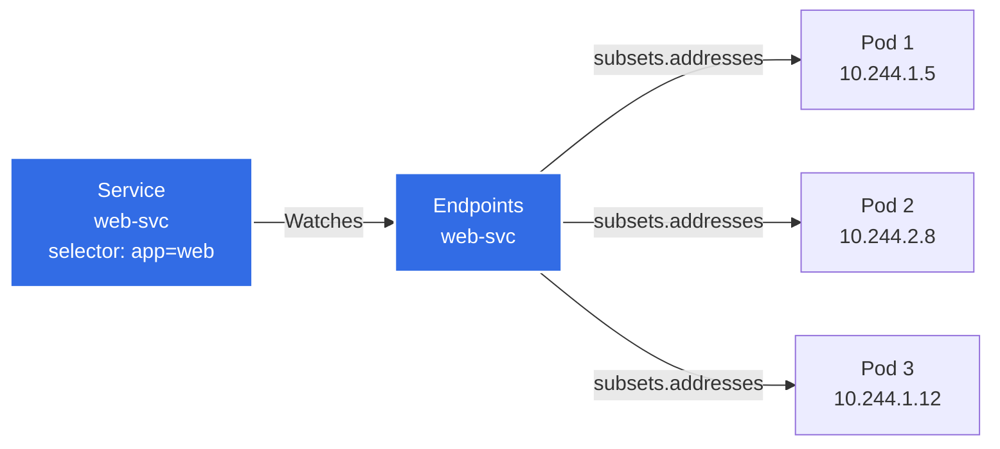
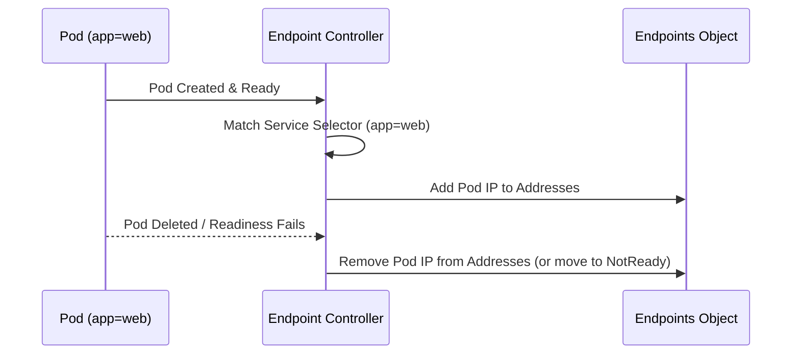
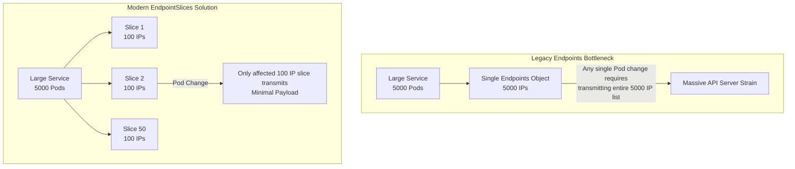
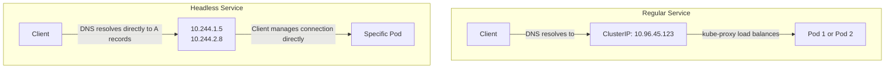

> **Complexity**: `[MEDIUM]` - Understanding service mechanics
>
> **Time to Complete**: 30-40 minutes
>
> **Prerequisites**: Module 3.1 (Services)

---

## What You'll Be Able to Do

After this module, you will be able to:

- **Diagnose** traffic routing failures by evaluating EndpointSlice conditions and pod readiness.
- **Design** manual endpoint configurations to integrate external databases into your Kubernetes service mesh.
- **Compare** the performance characteristics and limitations of legacy Endpoints versus modern EndpointSlices.
- **Implement** headless services for stateful workloads requiring direct pod addressing.
- **Evaluate** cluster topology to configure zone-aware routing using EndpointSlice hints.

---

## Why This Module Matters

Hypothetical scenario: your team operates an online checkout API that normally runs a few dozen replicas, then a seasonal traffic event pushes the autoscaler into four-digit replica counts. The Service object still exists, DNS still resolves, and many pods are Ready, but traffic distribution becomes uneven because part of the routing data model cannot represent the backend set cleanly. Nothing about that failure looks dramatic at first; it appears as latency, hot pods, and confusing disagreement between different inspection commands.

That is why a CKA candidate needs to look beneath the Service abstraction. A Service is the stable address, but endpoints are the current answer to a more operational question: which network destinations should receive traffic right now? When selectors, readiness probes, EndpointSlice conditions, or topology hints disagree, the Service name can look healthy while the actual routing set is empty, stale, truncated, or intentionally narrowed.

Kubernetes 1.35 uses EndpointSlices as the scalable discovery API behind Services, while the older Endpoints API remains visible mostly for compatibility and troubleshooting. This module teaches you how those objects are produced, how to read their signals during an incident, and how to design selectorless or headless services without accidentally creating a dead name. You will practice the same mental model repeatedly: start with the stable Service, inspect the backing endpoints, explain why each backend is included or excluded, and then choose the lowest-risk correction.

---

## Part 1: Endpoints Fundamentals

### 1.1 What Are Endpoints?

Endpoints are the glue between Services and Pods. A Service gives clients a durable name and usually a stable virtual IP, but a Pod IP is temporary by design; it changes when a replica is rescheduled, replaced, or recreated. The endpoint layer bridges that gap by recording the currently eligible backend addresses for a Service, along with the port information needed to connect to them.

Think of the Service as a reception desk and the endpoint set as the current room assignment sheet. Callers do not need to know which room each engineer occupies today, but the receptionist needs a fresh sheet or the call goes nowhere. In Kubernetes, the controller manager continually reconciles Services and Pods so that the sheet reflects labels, readiness, deletion, and replacement. When the sheet is empty, no amount of confidence in the reception desk helps the caller reach a person.

> **Legacy Visualization Reference:**
<details>
<summary>View original ASCII architecture diagram</summary>

```text
┌────────────────────────────────────────────────────────────────┐
│                   Service → Endpoints → Pods                    │
│                                                                 │
│   ┌──────────────────┐    ┌──────────────────┐                │
│   │    Service       │    │    Endpoints     │                │
│   │    web-svc       │    │    web-svc       │                │
│   │                  │    │                  │                │
│   │  selector:       │───►│  subsets:        │                │
│   │    app: web      │    │  - addresses:    │                │
│   │                  │    │    - 10.244.1.5  │───► Pod 1      │
│   │  ports:          │    │    - 10.244.2.8  │───► Pod 2      │
│   │  - port: 80      │    │    - 10.244.1.12 │───► Pod 3      │
│   │                  │    │    ports:        │                │
│   │                  │    │    - port: 8080  │                │
│   └──────────────────┘    └──────────────────┘                │
│                                                                 │
│   Endpoints auto-created and updated by endpoint controller    │
│                                                                 │
└────────────────────────────────────────────────────────────────┘
```
</details>

Here is the modern routing flow visualized:



The legacy Endpoints object stores addresses in `subsets`, which group a set of IPs with a set of ports. That shape matters when you debug older tools because the object does not simply say "three pods"; it says "these addresses are ready for these ports, and these other addresses are not ready." A selector-based Service normally receives this object automatically, so manually editing it is usually a sign that you are fighting the controller rather than fixing the workload.

Pause and predict: if a Deployment has three Pods, but only two pass readiness, how many Pod IPs should be usable through the Service and where would you expect to find the excluded address? The correct answer is not "all Running pods." Kubernetes separates liveness, scheduling state, and readiness so that an alive container can be protected from user traffic while it starts, warms caches, or waits for a dependency.

### 1.2 Endpoint Lifecycle

The Endpoint Controller operates in the Kubernetes control plane, constantly reconciling the state of the cluster to ensure Endpoints stay accurate. It watches Services because selectors define intent, and it watches Pods because labels, IPs, readiness, node placement, and deletion determine the actual backend set. The controller does not make traffic flow by itself; it writes discovery objects that other components, such as `kube-proxy`, CoreDNS, and ingress controllers, can consume.

The lifecycle is deliberately boring when everything is healthy. A Pod appears with labels that match a Service selector, the Pod becomes Ready, the controller records its IP as a backend, and clients can be routed to it. When the Pod fails readiness or starts terminating, the controller changes the discovery object so service proxies stop treating that endpoint as a normal destination. The practical diagnostic lesson is simple: always ask whether the Service selector matched the Pod, and then ask whether readiness allowed that match to become routable.

<details>
<summary>View original ASCII lifecycle diagram</summary>

```text
┌────────────────────────────────────────────────────────────────┐
│                   Endpoint Controller                           │
│                                                                 │
│   Watches: Pods and Services                                   │
│   Updates: Endpoints objects                                   │
│                                                                 │
│   Pod Created (label: app=web)                                 │
│       │                                                         │
│       ▼                                                         │
│   Controller finds Service with selector app=web               │
│       │                                                         │
│       ▼                                                         │
│   Adds Pod IP to Service's Endpoints                           │
│                                                                 │
│   Pod Deleted or Fails Readiness                               │
│       │                                                         │
│       ▼                                                         │
│   Removes Pod IP from Endpoints                                │
│                                                                 │
└────────────────────────────────────────────────────────────────┘
```
</details>



One useful habit is to treat endpoint generation as a reconciliation chain rather than as a single command output. The Service must exist in the namespace you are querying, its selector must match the labels that are actually on the Pods, the Pods must have assigned IP addresses, and readiness must permit routing. If any link breaks, `kubectl get svc` can still look normal while `kubectl get endpoints` or `kubectl get endpointslices` reveals the real failure.

### 1.3 Viewing Endpoints

You can inspect the legacy Endpoints API using standard `kubectl` commands. Even though EndpointSlices are the modern source for service proxies in current Kubernetes, legacy Endpoints output remains useful because many humans, scripts, and older controllers still expose it during troubleshooting. Use it as a quick compatibility view, then confirm anything scale-sensitive or condition-sensitive with EndpointSlices.

```bash
# List all endpoints
kubectl get endpoints
kubectl get ep                    # Short form

# Get specific endpoint
kubectl get endpoints web-svc

# Detailed view
kubectl describe endpoints web-svc

# Get endpoints as YAML
kubectl get endpoints web-svc -o yaml

# Wide output with pod IPs
kubectl get endpoints -o wide
```

The short form `ep` is fine because it is a real Kubernetes resource abbreviation, not a shell alias. Avoid using a local shorthand for `kubectl` in shared runbooks, copied exercises, or CI scripts because aliases often do not expand in non-interactive shells. A module that teaches reliable operations should make every command copy-pasteable without depending on a learner's terminal profile.

### 1.4 Endpoint Structure

The YAML shape explains several common debugging surprises. Ready addresses and not-ready addresses can live in the same object, which means an endpoint object can exist without every listed Pod being eligible for normal traffic. The `targetRef` links an address back to the Pod that produced it, the `nodeName` shows where that backend resides, and `ports` describes the backend port, not just the front-door Service port.

```yaml
# What an Endpoints object looks like
apiVersion: v1
kind: Endpoints
metadata:
  name: web-svc           # Must match Service name
  namespace: default
subsets:
- addresses:              # Ready pod IPs
  - ip: 10.244.1.5
    nodeName: worker-1
    targetRef:
      kind: Pod
      name: web-abc123
      namespace: default
  - ip: 10.244.2.8
    nodeName: worker-2
    targetRef:
      kind: Pod
      name: web-def456
      namespace: default
  notReadyAddresses:      # Pods not passing readiness probe
  - ip: 10.244.1.12
    nodeName: worker-1
    targetRef:
      kind: Pod
      name: web-ghi789
      namespace: default
  ports:
  - port: 8080
    protocol: TCP
```

When you read this object, do not stop at the address list. Ask whether the backend port matches the container port the application actually listens on, whether the endpoint is ready or not ready, and whether the Pod reference still exists. A stale-looking reference usually points to a reconciliation lag or a race you should recheck, while a stable not-ready entry points toward application health, probe configuration, or dependency readiness.

> **Pause and predict**: You have a Service with 3 endpoints. You add a readiness probe to the deployment that checks `/healthz`, but the endpoint on your app returns 500 for that path. What happens to the Service's endpoints, and can clients still reach the app?

The key is that readiness is an admission control signal for Service traffic, not a statement about whether the process exists. If all replicas fail the probe, clients can resolve the Service name but receive no normal backend through the Service. That behavior is protective, because sending users to a Pod that says it is not ready is usually worse than surfacing a clean failure that pushes the operator toward the probe or dependency problem.

---

## Part 2: The Shift to EndpointSlices

As clusters grew, the legacy `Endpoints` API became a bottleneck because it represented an entire backend set in one object. Any Pod addition, deletion, readiness transition, or IP change could require a large object update, and every watcher had to process the new version. That design is tolerable for small Services, but it becomes wasteful when a single Service has hundreds or thousands of backends across many nodes and zones.

EndpointSlices solve the same discovery problem with smaller, shard-like objects under `discovery.k8s.io/v1`. Kubernetes has treated EndpointSlices as stable since v1.21, and in Kubernetes 1.35 they are the API you should consider first for scalable service discovery, dual-stack addressing, endpoint conditions, and topology-aware routing. The older Endpoints API remains relevant mainly because you still encounter it in commands, legacy integrations, and compatibility behavior.

### 2.1 Why EndpointSlices?

<details>
<summary>View original ASCII EndpointSlices diagram</summary>

```text
┌────────────────────────────────────────────────────────────────┐
│                   Endpoints Problem                             │
│                                                                 │
│   Large Service with 5000 pods                                 │
│                                                                 │
│   Single Endpoints object:                                     │
│   - Contains all 5000 IPs                                      │
│   - Any pod change = entire object update                      │
│   - Large payload sent to all watchers                         │
│   - API server and etcd strain                                 │
│                                                                 │
└────────────────────────────────────────────────────────────────┘

┌────────────────────────────────────────────────────────────────┐
│                   EndpointSlices Solution                       │
│                                                                 │
│   Same 5000 pods split across 50 slices                        │
│                                                                 │
│   ┌─────────┐ ┌─────────┐ ┌─────────┐      ┌─────────┐        │
│   │ Slice 1 │ │ Slice 2 │ │ Slice 3 │ ...  │Slice 50 │        │
│   │ 100 IPs │ │ 100 IPs │ │ 100 IPs │      │ 100 IPs │        │
│   └─────────┘ └─────────┘ └─────────┘      └─────────┘        │
│                                                                 │
│   Pod change = update only affected slice                      │
│   Small payload, minimal API server load                       │
│                                                                 │
└────────────────────────────────────────────────────────────────┘
```
</details>



The default EndpointSlice controller creates another slice when existing slices for a Service reach about 100 endpoints and one more endpoint is needed. The controller can be configured with `--max-endpoints-per-slice`, but larger slices trade fewer objects for larger updates, so the default is a reasonable operational compromise. The point is not that 100 is magic; the point is that a change to one backend should not force the whole cluster to reprocess every backend.

EndpointSlices also carry details that the legacy object either cannot express or expresses poorly. The `addressType` can distinguish IPv4, IPv6, and FQDN-shaped addresses, although Kubernetes service proxies process IPv4 and IPv6 for normal routing. Endpoint conditions add richer lifecycle meaning, while topology hints can help proxies prefer same-zone endpoints when the Service and cluster configuration allow it. Those fields turn EndpointSlices from a scale fix into the central service-discovery API.

> **Stop and think**: Imagine a Service backed by 5,000 pods. Every time a single pod is added or removed, the entire Endpoints object containing all 5,000 IPs must be sent to every node watching it. What problem does this create, and how would you design a better solution?

The design pressure is bandwidth, CPU, watch latency, and unnecessary churn in components that need routing data. A better design splits the backend set into bounded chunks, lets each chunk carry enough metadata to be useful on its own, and updates only the affected chunk when one Pod changes. That is exactly the shape EndpointSlices provide, which is why modern debugging should include them even when the legacy output looks familiar.

### 2.2 EndpointSlice Structure

An EndpointSlice is a dedicated Kubernetes API resource under `discovery.k8s.io/v1`. A single Service may be associated with multiple EndpointSlice objects, dynamically tied via the `kubernetes.io/service-name` label. That label is not decoration; it is how you reliably list the slices for one Service without relying on generated object names.

```yaml
# What an EndpointSlice looks like
apiVersion: discovery.k8s.io/v1
kind: EndpointSlice
metadata:
  name: web-svc-abc12      # Auto-generated name
  labels:
    kubernetes.io/service-name: web-svc
addressType: IPv4
ports:
- name: ""
  port: 8080
  protocol: TCP
endpoints:
- addresses:
  - 10.244.1.5
  conditions:
    ready: true
    serving: true
    terminating: false
  nodeName: worker-1
  targetRef:
    kind: Pod
    name: web-abc123
    namespace: default
- addresses:
  - 10.244.2.8
  conditions:
    ready: true
  nodeName: worker-2
```

The fields you inspect most often are `ports`, `addressType`, `endpoints[].addresses`, `endpoints[].conditions`, `endpoints[].nodeName`, and optionally `endpoints[].zone` or `hints`. Transient duplication can occur because controllers and watchers do not observe every update at the same instant, so do not build fragile automation that assumes a backend appears in exactly one slice at every millisecond. For operational debugging, compare the stable shape over repeated reads and focus on labels and conditions.

### 2.3 Viewing EndpointSlices

EndpointSlices have their own resource names and generated object names, so the safest query starts with the Service label. When you only run `kubectl get endpointslices`, a busy namespace can produce a noisy list that hides the slice you care about. Filtering by `kubernetes.io/service-name` keeps the output tied to the Service under investigation and matches how controllers associate slices with Services.

```bash
# List all EndpointSlices
kubectl get endpointslices
kubectl get eps                   # Short form (might conflict with endpoints)

# Get EndpointSlices for a service
kubectl get endpointslices -l kubernetes.io/service-name=web-svc

# Detailed view
kubectl describe endpointslice web-svc-abc12

# Get as YAML
kubectl get endpointslice web-svc-abc12 -o yaml
```

Before running a describe command, first list the slices and copy the generated name that currently exists. The generated suffix can change when the controller reshapes the slice set, and hard-coding it in runbooks creates brittle instructions. In troubleshooting notes, prefer the label selector query because it survives controller-generated name changes.

### 2.4 Endpoints vs EndpointSlices Comparison

| Aspect | Endpoints | EndpointSlices |
|--------|-----------|----------------|
| Max entries | Unlimited (but problematic) | 100 per slice |
| Update scope | Entire object | Single slice |
| API version | v1 | discovery.k8s.io/v1 |
| Default since | Always | Kubernetes 1.21 |
| Dual-stack support | Limited | Full IPv4/IPv6 |
| Topology hints | No | Yes |

This comparison is useful, but it needs one correction in your mental model: "unlimited" in the legacy Endpoints row does not mean safe at any size. Kubernetes documents that the legacy Endpoints API truncates over-capacity backend sets at 1,000 endpoints and marks the object with the `endpoints.kubernetes.io/over-capacity: truncated` annotation. If a tool reads only the legacy object, it can miss backends that EndpointSlices still represent.

For exam and production work, treat EndpointSlices as the authoritative modern view while still knowing how to interpret Endpoints. You will often inspect both because old commands are fast and familiar, but your conclusion should account for which API has the fidelity needed for the situation. Large Services, dual-stack clusters, terminating endpoint behavior, and topology-aware routing all push you toward EndpointSlices.

---

## Part 3: Debugging Routing and Conditions

### 3.1 No Endpoints Means No Traffic

When traffic drops, your first stop is usually verifying endpoint generation. A Service with no endpoints is like a load balancer with a listener and no healthy backend targets; the front door exists, but it has nowhere useful to send the request. This is one of the fastest failures to diagnose if you resist the temptation to start with application logs before checking the discovery layer.

```bash
# Service exists but has no endpoints
kubectl get svc web-svc
# NAME      TYPE        CLUSTER-IP     PORT(S)
# web-svc   ClusterIP   10.96.45.123   80/TCP

kubectl get endpoints web-svc
# NAME      ENDPOINTS   AGE
# web-svc   <none>      5m     ← Problem!
```

An empty endpoint result does not prove the Service is broken by itself. It tells you the Service selector, the Pod labels, the namespace, the Pod phase, or readiness is preventing a backend from entering the routable set. The right move is to preserve the chain of evidence: record the Service selector, list the matching Pods, check readiness, and then inspect EndpointSlice conditions if the legacy output is ambiguous.

### 3.2 Common Causes of Missing Endpoints

| Symptom | Cause | Debug Command | Solution |
|---------|-------|---------------|----------|
| `<none>` endpoints | No pods match selector | `kubectl get pods --show-labels` | Fix selector or pod labels |
| `<none>` endpoints | Pods not running | `kubectl get pods` | Fix pod issues |
| `<none>` endpoints | Pods in wrong namespace | `kubectl get pods -A` | Check namespace |
| Partial endpoints | Some pods not ready | `kubectl describe endpoints` | Check readiness probes |

Selector problems are especially common after template rewrites because a Deployment can keep creating healthy Pods with labels the Service no longer selects. Namespace mistakes look similar because Services select Pods only in their own namespace, even when the same label exists elsewhere. Readiness problems are subtler because the Pod can be Running and still excluded from normal Service traffic; that is a feature, not a contradiction.

Before running this, what output do you expect if the Service selector is `app: web` but the Pods are labeled `app: api`? You should expect the selector query to return no Pods, and therefore the endpoint objects should have no ready backend addresses. If the selector query does return Pods, shift your attention to readiness, ports, and conditions rather than repeatedly recreating the Service.

### 3.3 Debugging Workflow

The workflow below starts with the smallest question and only moves deeper when the previous answer does not explain the failure. That matters during incidents because random command hopping creates contradictory notes and makes handoff harder. Each command either confirms the Service exists, confirms the selector, confirms matching Pods, or checks whether readiness keeps those Pods out of the endpoint set.

```bash
# Step 1: Check if endpoints exist
kubectl get endpoints web-svc
# If <none>, proceed to step 2

# Step 2: Check service selector
kubectl get svc web-svc -o yaml | grep -A5 selector
# selector:
#   app: web

# Step 3: Find pods with matching labels
kubectl get pods --selector=app=web
# Should list pods backing the service

# Step 4: If no pods found, check what labels pods have
kubectl get pods --show-labels
# Compare with service selector

# Step 5: If pods exist but not in endpoints, check pod status
kubectl get pods
# Look for pods that aren't Running

# Step 6: Check for readiness probe failures
kubectl describe pod <pod-name> | grep -A10 Readiness
```

The workflow deliberately uses the Service selector as a boundary. If `kubectl get pods --selector=app=web` returns nothing, you have a selection problem; describing EndpointSlices will mostly confirm what you already know. If matching Pods exist and are Ready, then EndpointSlice inspection becomes more valuable because it can reveal port mismatches, condition values, terminating endpoints, or topology information that the old Endpoints view compresses away.

### 3.4 Endpoints with NotReady Pods and EndpointSlice Conditions

Readiness is where many learners first realize that endpoints are not just a list of Pod IPs. Kubernetes can know about a Pod, include a reference to it in discovery data, and still protect clients from it. The legacy object shows this as `NotReadyAddresses`; EndpointSlices express the same idea through conditions that are more precise for modern service proxies.

```bash
# Describe shows both ready and not-ready addresses
kubectl describe endpoints web-svc

# Output:
# Name:         web-svc
# Subsets:
#   Addresses:          10.244.1.5,10.244.2.8
#   NotReadyAddresses:  10.244.1.12
#   Ports:
#     Name     Port  Protocol
#     ----     ----  --------
#     <unset>  8080  TCP
```

Pods listed in `NotReadyAddresses` are actively shielded from receiving normal traffic. In the modern `EndpointSlice` API, routing is driven by endpoint conditions: `ready`, `serving`, and `terminating`. The `serving` condition maps directly to pod readiness for pod-backed endpoints, while `terminating` indicates the endpoint is currently shutting down.

For pod-backed endpoints, nil values in `ready` or `serving` are safely interpreted as `true`, while nil in `terminating` is interpreted as `false`. Service proxies normally ignore terminating endpoints, but they may route to endpoints marked as both `serving` and `terminating` if all available endpoints are terminating. That fallback helps avoid an immediate total outage during aggressive rollouts, but you should still fix the rollout shape so healthy replacements exist before old Pods disappear.

When diagnosing a readiness-related outage, keep the human explanation tied to the condition. Say "the Pods are Running but excluded because readiness is false" instead of "Kubernetes lost the Pods." That phrasing prevents the team from deleting random resources and points them toward probe paths, dependency checks, application startup time, or resource pressure. It also maps cleanly to the CKA troubleshooting style, where you need to identify the broken link and correct it directly.

---

## Part 4: Manual Endpoints and External Services

### 4.1 When to Use Manual Endpoints

Services without a label selector do not get EndpointSlice objects created automatically; their EndpointSlices or legacy Endpoints must be created manually. This pattern is useful when Kubernetes should provide the stable Service name, policy surface, or DNS name, but the backend does not come from Pods selected in the same namespace. Common examples include a database on virtual machines, a service in another cluster, or a static appliance that the application should reach through a Kubernetes name.

Manual endpoints are powerful because they let workloads use normal Service DNS for resources that Kubernetes does not own. They are risky for the same reason: the control plane cannot infer when an external IP changes, whether the remote process is healthy, or whether a listed address is still safe. If you choose this design, the operational owner of the external resource also owns the automation or runbook that keeps the endpoint data current.

EndpointSlices managed outside the control plane should explicitly use the `endpointslice.kubernetes.io/managed-by` label, and each namespace endpoint slice must have a unique name. That label helps humans and controllers distinguish manually maintained discovery data from slices produced by the built-in controller. Without a clear managed-by signal, future operators can misread the object as automatic and waste time wondering why the controller does not fix it.

### 4.2 Creating Manual Endpoints

The legacy manual Endpoints pattern requires the Service and Endpoints object to share the same name in the same namespace. The Service has no selector, so the endpoint controller leaves it alone, and the manually created object supplies the backend addresses. This is a good way to learn the model, even though new integrations should consider manual EndpointSlices when they need modern fields.

```kubernetes
# Step 1: Create service WITHOUT selector
apiVersion: v1
kind: Service
metadata:
  name: external-db
spec:
  ports:
  - port: 5432
    targetPort: 5432
  # No selector! This is intentional.
---
# Step 2: Create Endpoints with same name
apiVersion: v1
kind: Endpoints
metadata:
  name: external-db     # Must match service name exactly
subsets:
- addresses:
  - ip: 192.168.1.100   # External database IP
  - ip: 192.168.1.101   # Backup database IP
  ports:
  - port: 5432
```

```bash
# Apply both
kubectl apply -f external-db.yaml

# Verify
kubectl get svc,endpoints external-db

# Now pods can reach external DB via:
# external-db.default.svc.cluster.local:5432
```

This pattern works because clients only need the Service name and port. They do not care whether the backend IP came from a Pod selector or a human-maintained endpoint object. The danger appears later, when the external database moves to a new address and no Kubernetes controller updates the object. At that point the Service name still resolves, but traffic follows stale endpoint data until someone patches or reapplies the backend list.

### 4.3 Manual Endpoints Use Cases

The same technique can expose a stable name for an external HTTPS API. In production, prefer a DNS-backed design when the provider gives you a stable hostname, because raw public IPs can change and may represent a load-balanced edge rather than a durable server. Use static endpoint IPs only when your network team can guarantee that those addresses are meant to be targets.

```kubernetes
# Example: External API endpoint
apiVersion: v1
kind: Service
metadata:
  name: external-api
spec:
  ports:
  - port: 443
---
apiVersion: v1
kind: Endpoints
metadata:
  name: external-api
subsets:
- addresses:
  - ip: 52.84.123.45     # External API server
  ports:
  - port: 443
```

Exercise scenario: your application team wants `payments-db.default.svc.cluster.local` to point at a managed database outside the cluster. Which approach would you choose here and why: a selectorless Service with manual endpoint IPs, an ExternalName Service that points at a provider hostname, or moving the database behind an internal load balancer? The best answer depends on who owns address changes, whether clients need a port-only Service abstraction, and whether your network policy or DNS requirements favor one layer over another.

When you design manual endpoint configurations, document ownership as carefully as YAML. A selector-based Service has obvious ownership because the Deployment template controls the selected Pods, but a selectorless Service can become an orphaned name if no one owns the external lifecycle. A good runbook states where the backend address comes from, how to validate it, how to update it, and how to confirm clients are reaching the intended service.

---

## Part 5: Headless Services

### 5.1 What Is a Headless Service?

A headless service explicitly has no `ClusterIP`. Instead of returning a single virtual IP, Kubernetes DNS can return individual backend records so that clients can connect directly to selected Pods. This is most useful when the client must know the identity of the backend rather than treating all replicas as interchangeable.

```yaml
apiVersion: v1
kind: Service
metadata:
  name: headless-svc
spec:
  clusterIP: None          # This makes it headless
  selector:
    app: web
  ports:
  - port: 80
```

The distinction is not "headless means no Service." The Service still defines a name, selector, and ports; it simply opts out of the normal ClusterIP load-balancing abstraction. For StatefulSets, that is exactly what you want because `pod-0`, `pod-1`, and `pod-2` may have different identities, storage, replication roles, or quorum responsibilities. For a stateless web frontend, it is often unnecessary because most clients should not care which replica answered.

> **What would happen if**: You set `clusterIP: None` on a Service. A pod does `nslookup` on that service name. Instead of getting one IP, it gets three. Why is this useful, and when would you NOT want this behavior?

The useful part is direct discovery: a client library can see all available backends and choose according to its own protocol rules. The risky part is that you have shifted some load-balancing responsibility away from Kubernetes service proxying and toward the client. If the client caches DNS forever, chooses poorly, or cannot retry across returned addresses, a headless Service can expose more failure modes than a regular ClusterIP Service.

### 5.2 Headless Service Behavior

For headless services, selector-based services create EndpointSlices natively in the control plane, while selectorless headless services do not generate them automatically. That difference is easy to miss because both objects have `clusterIP: None`, but one has a selector Kubernetes can reconcile and the other does not. If there is no selector, you must provide the discovery data yourself.

<details>
<summary>View original ASCII headless flow</summary>

```text
┌────────────────────────────────────────────────────────────────┐
│                   Regular vs Headless Service                   │
│                                                                 │
│   Regular Service (ClusterIP: 10.96.45.123)                    │
│   ┌─────────────────────────────────────────────────────────┐  │
│   │  DNS: web-svc.default.svc → 10.96.45.123 (Service IP)   │  │
│   │  Client → Service IP → kube-proxy → random Pod          │  │
│   └─────────────────────────────────────────────────────────┘  │
│                                                                 │
│   Headless Service (clusterIP: None)                           │
│   ┌─────────────────────────────────────────────────────────┐  │
│   │  DNS: web-svc.default.svc →                             │  │
│   │       10.244.1.5 (Pod 1)                                │  │
│   │       10.244.2.8 (Pod 2)                                │  │
│   │       10.244.1.12 (Pod 3)                               │  │
│   │  Client gets ALL pod IPs, chooses one itself            │  │
│   └─────────────────────────────────────────────────────────┘  │
│                                                                 │
└────────────────────────────────────────────────────────────────┘
```
</details>



This behavior explains why headless Services pair naturally with StatefulSets. StatefulSet identity is stable, so DNS records such as `kafka-0.kafka-headless.default.svc.cluster.local` can resolve to a particular Pod identity rather than an arbitrary backend. That directness is valuable for databases, message brokers, and clustered systems that have leader, follower, shard, or replica identities.

### 5.3 Headless Service Use Cases

| Use Case | Why Headless? |
|----------|---------------|
| StatefulSets | Need to address specific pods (pod-0, pod-1) |
| Client-side load balancing | Client needs all IPs to implement custom balancing |
| Service discovery | Discover all backend instances |
| Database clusters | Need direct connection to specific node |

Choose a headless Service when backend identity is part of the protocol, not just an implementation detail. If every replica is equivalent, a regular ClusterIP Service keeps client behavior simpler and lets Kubernetes handle proxy selection. If the client must choose a leader, connect to a shard owner, or list all peers, direct DNS records may be the right interface.

### 5.4 Headless Service Endpoints

Endpoints still matter for headless Services because DNS needs to know which backend records to return. A selector-based headless Service uses the same reconciliation chain as other selector Services, but the DNS response differs. You can inspect endpoints and then test DNS from inside the cluster to confirm whether clients will see individual Pod addresses.

```bash
# Endpoints still track pods
kubectl get endpoints headless-svc
# NAME           ENDPOINTS
# headless-svc   10.244.1.5,10.244.2.8,10.244.1.12

# DNS returns multiple A records
kubectl run test --rm -i --image=busybox:1.36 --restart=Never -- \
  nslookup headless-svc

# Output:
# Name:    headless-svc.default.svc.cluster.local
# Address: 10.244.1.5
# Address: 10.244.2.8
# Address: 10.244.1.12
```

DNS tests are most meaningful when run from inside the cluster because cluster DNS names and search paths are meant for Pods. If you test from your laptop, you may be querying a completely different resolver that knows nothing about `svc.cluster.local`. A CKA troubleshooting answer should be precise about vantage point: inspect Kubernetes objects with `kubectl`, then test in-cluster name resolution with a temporary Pod.

---

## Part 6: Service Topology and Topology Hints

### 6.1 Topology-Aware Routing

EndpointSlices natively support topology hints. This permits zone-aware routing, where service proxies can prefer endpoints in the same zone to reduce latency and cross-zone data transfer. The feature does not guarantee that all traffic always stays local, because Kubernetes must balance locality against availability, endpoint distribution, and Service configuration.

```yaml
# EndpointSlice with hints
apiVersion: discovery.k8s.io/v1
kind: EndpointSlice
metadata:
  name: web-svc-abc12
endpoints:
- addresses:
  - 10.244.1.5
  zone: us-east-1a          # Pod is in this zone
  hints:
    forZones:
    - name: us-east-1a      # Prefer traffic from same zone
```

The important word is "prefer." A topology hint tells a proxy which endpoints are suitable for a zone-aware choice, but it is not a hard security boundary or a replacement for network policy. If a zone has no healthy endpoint, or if the distribution would make routing unsafe, Kubernetes can still send traffic elsewhere depending on configuration and implementation. Treat hints as an optimization signal, not as a correctness requirement.

### 6.2 Enabling Topology-Aware Hints

Kubernetes has evolved the naming around topology-aware routing, so be careful when reading older examples. You may see the older `service.kubernetes.io/topology-mode: Auto` annotation, while newer documentation also discusses `trafficDistribution` behavior on Services. In a Kubernetes 1.35 study context, the CKA-level skill is to recognize that EndpointSlices carry zone and hint data, and that service routing can use that data when the cluster and Service are configured for topology-aware behavior.

```yaml
# Service with topology hints
apiVersion: v1
kind: Service
metadata:
  name: web-svc
  annotations:
    service.kubernetes.io/topology-mode: Auto   # Enable hints
spec:
  selector:
    app: web
  ports:
  - port: 80
```

Which approach would you choose here and why: same-zone preference for a latency-sensitive internal API, or ordinary cluster-wide balancing for a tiny service with one replica per region? Same-zone preference makes sense when you have enough healthy endpoints per zone and cross-zone traffic has measurable cost or latency. Ordinary balancing is simpler when replicas are sparse, traffic is low, or reliability would suffer if locality rules narrow the eligible backend set too much.

---

## Patterns & Anti-Patterns

### Patterns

Use selector-based Services for normal Pod-backed workloads because they let Kubernetes own endpoint reconciliation. This pattern works best when Deployment labels are stable, readiness probes represent real serving ability, and the Service selector is intentionally narrow but not version-specific. It scales operationally because the controller updates EndpointSlices as Pods come and go, while your runbook stays focused on labels and readiness.

Use EndpointSlices as the primary diagnostic view for large or modern Services. The legacy Endpoints command can still be a quick first check, but it hides important condition and scale details. EndpointSlices let you inspect ready, serving, terminating, node, zone, and address family data in one place, which is exactly the information you need when traffic behaves differently across rollouts, zones, or IP families.

Use headless Services when backend identity is part of the protocol. StatefulSets, peer discovery systems, and client-side load balancers often need direct backend records instead of a single virtual IP. The pattern works when clients understand multiple DNS answers and can retry intelligently, but it is a poor fit for simple stateless clients that expect Kubernetes to hide backend choice.

Use selectorless Services only when an external lifecycle owns the backend. A manual endpoint can be clean and useful when a database, appliance, or other cluster cannot be selected as Pods in the namespace. The pattern needs explicit ownership because Kubernetes will not discover, health-check, or update those addresses automatically.

### Anti-Patterns

Do not treat a Running Pod as proof that Service routing is healthy. Running only means the container exists and has not failed its liveness contract; readiness determines whether it should receive normal Service traffic. The better alternative is to compare Pod status, readiness, EndpointSlice conditions, and Service selector matches before changing any workload objects.

Do not build new automation that depends only on legacy Endpoints for large Services. Once a backend set crosses the documented legacy truncation behavior, older readers can observe an incomplete world and make bad routing or alerting decisions. The better alternative is to read EndpointSlices through the discovery API and use the Service label to gather all slices for the target Service.

Do not use a headless Service as a casual performance tweak. Direct DNS answers can make clients responsible for balancing, caching, retrying, and handling backend churn, and many simple clients do those things badly. The better alternative is to use regular ClusterIP Services unless backend identity is a genuine requirement of the application protocol.

Do not leave manual endpoints undocumented. A selectorless Service can look like a normal Kubernetes abstraction while secretly depending on a spreadsheet, a ticket, or a person remembering to update an IP address. The better alternative is to add clear labels, runbooks, and preferably automation that owns updates to manual EndpointSlices or Endpoints.

---

## Decision Framework

Start with the workload source. If the backend is a normal set of Pods in the same namespace, use a selector-based Service and let Kubernetes create EndpointSlices automatically. If the backend is outside Kubernetes or outside the namespace selector model, use a selectorless Service and create the discovery data deliberately. If backend identity matters to clients, consider a headless Service; if identity does not matter, prefer ClusterIP because it keeps client behavior simpler.

Next evaluate scale and metadata needs. For a small Service, legacy Endpoints output may be enough for a quick glance, but EndpointSlices should still be your deeper diagnostic tool. For a large Service, dual-stack Service, topology-aware design, or rollout involving terminating endpoints, go directly to EndpointSlices because the old object can omit or flatten exactly the details you need. This distinction is especially important on the exam because the fastest command is not always the most complete explanation.

Finally evaluate who owns correctness after deployment. Selector-based Services have controller ownership, readiness-based admission, and automatic reconciliation. Manual endpoints need external ownership and a tested update process. Headless Services need clients that can handle multiple records and backend churn. Topology hints need enough endpoints per zone to preserve availability while improving locality. A good design answer names the owner of each moving part, not just the YAML field that enables it.

Use that framework during troubleshooting as well as design. If a Service has a selector, your first hypothesis should be reconciliation: labels, namespaces, Pod IPs, readiness, and EndpointSlice conditions. If a Service lacks a selector, your first hypothesis should be ownership: who created the endpoints, whether the names and labels connect them to the Service, and whether the external address is still valid. If a Service is headless, your first hypothesis should include client behavior because DNS may expose multiple backends instead of hiding selection behind a virtual IP.

---

## Did You Know?

- **EndpointSlices became stable in Kubernetes 1.21:** The discovery API is not experimental in modern clusters; it is the scalable replacement for watching one giant legacy Endpoints object.
- **Legacy Endpoints truncate over-capacity backends at 1,000 addresses:** Kubernetes marks the object with `endpoints.kubernetes.io/over-capacity: truncated`, which is a warning that legacy readers may see only part of the backend set.
- **EndpointSlices are normally split around 100 endpoints each:** The controller creates additional slices as Services grow, reducing the update payload when one Pod changes.
- **EndpointSlice conditions distinguish readiness from termination:** `ready`, `serving`, and `terminating` let service proxies reason about rollout edge cases that the legacy object cannot describe as clearly.

---

## Common Mistakes

| Mistake | Why It Happens | How to Fix It |
|---------|----------------|---------------|
| **Wrong endpoint name** | Manual Endpoints or EndpointSlices are created with a name that does not associate with the target Service. | Make the manual object name or `kubernetes.io/service-name` label match the Service name exactly, then verify with a label-filtered query. |
| **Selector typo** | A Deployment template label changes, but the Service selector still points at the old label set. | Compare `kubectl get svc <name> -o yaml` with `kubectl get pods --show-labels`, then patch the selector or labels intentionally. |
| **Missing `targetRef`** | Manual endpoint authors focus only on IPs and lose traceability back to the producing object. | Include `targetRef` when an endpoint represents an in-cluster object, and label externally managed EndpointSlices with `endpointslice.kubernetes.io/managed-by`. |
| **Ignoring `NotReadyAddresses`** | Engineers assume Running Pods are routable and overlook readiness probe failures. | Inspect `NotReadyAddresses` and EndpointSlice conditions, then debug the readiness probe path, dependency, or startup timing. |
| **Confusing Endpoints and EndpointSlices** | Older runbooks query only the legacy object and miss scale or condition details. | Use Endpoints for a quick compatibility glance, but treat EndpointSlices as the modern source of truth for large or nuanced Services. |
| **Missing `managed-by` label** | Manually maintained slices look like controller-owned slices, confusing future operators. | Add a clear `endpointslice.kubernetes.io/managed-by` label and document the automation or team that owns updates. |
| **Using legacy Endpoints for IPv6 planning** | The old API lacks modern dual-stack and topology fields, so it becomes an incomplete design surface. | Use EndpointSlices when designing IPv4/IPv6 or topology-aware Service behavior. |
| **Forgetting selectorless headless rules** | A headless Service without a selector is expected to auto-discover backends, but no controller can infer them. | Create the EndpointSlice or Endpoints object manually, then test DNS from an in-cluster Pod. |

---

## Quiz

1. **You deploy a new version of your app and `kubectl get endpoints my-svc` suddenly shows `<none>`, even though `kubectl get pods` shows 3 pods in Running state. The previous version worked fine. What is your debugging process?**
   <details>
   <summary>Answer</summary>
   First, check whether the Pods are actually Ready, not merely Running, because readiness controls Service routing. Then compare the Service selector with the labels on the new Pods; a changed template label is a common reason the endpoint controller has no matching backends. If labels match, inspect readiness probe events with `kubectl describe pod <pod-name>` and confirm the target port still matches what the Service expects. This process diagnoses routing failures by following the Service-to-endpoint chain instead of guessing from application symptoms.
   </details>

2. **Your company has a PostgreSQL database running on a VM at 192.168.1.50, outside the Kubernetes cluster. You want pods to reach it as `external-db.default.svc.cluster.local:5432`. How do you set this up, and what happens if the database IP changes?**
   <details>
   <summary>Answer</summary>
   Create a Service without a selector and provide matching manual discovery data, either as a legacy Endpoints object for the basic pattern or as an EndpointSlice when you need the modern API fields. The Service defines the stable name and port, while the endpoint object lists `192.168.1.50` as the backend address. If the database IP changes, Kubernetes will not update it automatically because no selector points to a Pod set. You need automation or a runbook that updates the endpoint data and verifies clients can still connect through the Service name.
   </details>

3. **You run `kubectl describe endpoints my-svc` and see 2 IPs under `Addresses` and 1 IP under `NotReadyAddresses`. A colleague says "just delete the not-ready pod to fix it." Is this the right approach? What should you investigate first?**
   <details>
   <summary>Answer</summary>
   Deleting the Pod may temporarily create a replacement, but it does not explain why Kubernetes excluded the backend from Service traffic. The Pod is alive enough to appear in discovery data, yet readiness says it should not receive normal requests. First inspect readiness probe events, application logs, the configured probe path and port, and any dependency the probe checks. Kubernetes is doing the protective thing here, so the fix should target the readiness failure rather than bypassing the signal.
   </details>

4. **Your cluster has a Service backed by 3,000 pods. An SRE reports that every time a rolling update occurs, the API server's memory spikes and kube-proxy takes 10+ seconds to update rules. What is causing this, and what Kubernetes feature addresses it?**
   <details>
   <summary>Answer</summary>
   A single legacy Endpoints object is a poor fit for thousands of backend addresses because any small change can require watchers to process the whole object again. EndpointSlices address this by splitting the backend set into smaller discovery objects that can be updated independently. With slices around 100 endpoints by default, one Pod change affects a much smaller payload. The practical fix is to use EndpointSlice-aware tooling and controllers rather than building new behavior around the legacy Endpoints object.
   </details>

5. **You are deploying a StatefulSet for a Kafka cluster where each broker needs to be individually addressable. A regular ClusterIP Service gives you a single virtual IP. How do you configure DNS so that producers can connect to `kafka-0`, `kafka-1`, and `kafka-2` individually?**
   <details>
   <summary>Answer</summary>
   Create a headless Service by setting `clusterIP: None`, and set that Service as the StatefulSet `serviceName`. Kubernetes DNS can then publish records tied to individual StatefulSet Pod identities, such as `kafka-0.kafka-headless.default.svc.cluster.local`. This implements direct pod addressing for a protocol that needs stable broker identities. A regular ClusterIP Service would hide the backend choice, which is useful for stateless applications but wrong when each backend has a distinct role.
   </details>

6. **You are reviewing the YAML of an EndpointSlice for a legacy application. Under one of the endpoints, the `ready` and `serving` conditions are missing entirely (`nil`). A junior engineer worries that kube-proxy will drop traffic to this endpoint because it is not explicitly marked ready. Are they correct, and why?**
   <details>
   <summary>Answer</summary>
   They are not correct for pod-backed endpoints. Kubernetes interprets nil `ready` or `serving` values as true for compatibility, while nil `terminating` is interpreted as false. That does not mean missing conditions are ideal for clarity, but it does mean the endpoint is not automatically dropped only because those fields are absent. You should still evaluate the broader EndpointSlice, Pod readiness, and rollout state before concluding the proxy behavior is wrong.
   </details>

7. **During a traffic spike, your application auto-scales to 1,200 pods. Metrics show that 200 of the newest pods receive zero traffic while the older 1,000 pods are overloaded. You inspect the `Endpoints` object and notice an `endpoints.kubernetes.io/over-capacity: truncated` annotation. What is the architectural root cause, and how do you route traffic to the stranded pods?**
   <details>
   <summary>Answer</summary>
   The root cause is reliance on the legacy Endpoints API after the backend set exceeded its documented truncation behavior. The annotation tells you the old object is not representing every backend, so any component reading only that object can make incomplete routing decisions. EndpointSlices are designed to represent the full backend set in smaller objects, so use EndpointSlice-aware service routing and diagnostics. The stranded pods are not necessarily unhealthy; they are invisible to legacy readers that cannot represent the whole set.
   </details>

8. **During an aggressive rolling update of a critical microservice, you observe a brief window where all available pods are terminating. To your surprise, `kube-proxy` is still routing active traffic to these pods instead of dropping it immediately. The endpoints show both `serving: true` and `terminating: true`. Is this a bug in the proxy or intended behavior?**
   <details>
   <summary>Answer</summary>
   This can be intended fallback behavior. Service proxies normally avoid terminating endpoints, but if all available endpoints are terminating, a proxy may continue routing to endpoints that are still serving to avoid an immediate total drop. The real fix is not to depend on that edge case; improve rollout settings so replacement Pods become Ready before every old endpoint is terminating. The EndpointSlice conditions help you distinguish a controlled fallback from a mysterious proxy bug.
   </details>

---

## Hands-On Exercise

**Task**: Debug a service with endpoint issues by creating a selector mismatch, proving why the endpoint set is empty, repairing the Service, and then comparing normal EndpointSlice-backed routing with headless DNS behavior.

**Steps**: Work through the sequence in order and pause after each observation command to explain what the output proves. The goal is not just to make the final Service work; it is to build a repeatable diagnostic path from Service selector to Pod labels to endpoint objects.

1. **Create a deployment**:
```bash
kubectl create deployment web --image=nginx --replicas=3
kubectl rollout status deployment web --timeout=60s
```

2. **Create a service with wrong selector**:
```bash
cat << 'EOF' | kubectl apply -f -
apiVersion: v1
kind: Service
metadata:
  name: broken-service
spec:
  selector:
    app: webapp          # Wrong! Should be "web"
  ports:
  - port: 80
EOF
```

3. **Observe the problem**:
```bash
kubectl get endpoints broken-service
# Shows: <none>
```

4. **Debug the issue**:
```bash
# Check what selector the service has
kubectl get svc broken-service -o yaml | grep -A2 selector

# Check what labels the pods have
kubectl get pods --show-labels

# Find the mismatch!
```

5. **Fix the service**:
```bash
kubectl delete svc broken-service
kubectl expose deployment web --port=80 --name=broken-service
```

6. **Verify endpoints exist**:
```bash
kubectl get endpoints broken-service
# Should show 3 pod IPs
```

7. **Check EndpointSlices too**:
```bash
kubectl get endpointslices -l kubernetes.io/service-name=broken-service
```

8. **Test with a headless service**:
```bash
cat << 'EOF' | kubectl apply -f -
apiVersion: v1
kind: Service
metadata:
  name: headless-web
spec:
  clusterIP: None
  selector:
    app: web
  ports:
  - port: 80
EOF

# Check DNS returns multiple IPs
kubectl run test --rm -i --image=busybox:1.36 --restart=Never -- \
  nslookup headless-web
```

9. **Cleanup**:
```bash
kubectl delete deployment web
kubectl delete svc broken-service headless-web
```

**Success Criteria**: Mark each item only when you can explain the evidence behind it. For example, "endpoints exist" should mean you can name the command that showed them, the selector that produced them, and the Pod labels that made the match valid.
- [ ] Can identify missing endpoints.
- [ ] Can debug selector mismatches confidently.
- [ ] Understand endpoints vs endpointslices outputs.
- [ ] Can manually create headless services.
- [ ] Understand DNS behavior differences for `clusterIP: None`.

The exercise begins with a selector mismatch because that is the cleanest way to see the discovery chain fail without introducing application-specific noise. Once you repair the selector by recreating the Service from the Deployment, the endpoint objects should populate and EndpointSlices should appear under the Service label. The headless step then proves that the same backend set can be exposed through a different DNS behavior without changing the Pods.

### Drill 1: Endpoint Inspection (Target: 2 minutes)

```bash
# Setup
kubectl create deployment drill --image=nginx --replicas=2
kubectl rollout status deployment drill --timeout=60s
kubectl expose deployment drill --port=80

# Check endpoints
kubectl get endpoints drill

# Get detailed endpoint info
kubectl describe endpoints drill

# Get as YAML (see pod IPs)
kubectl get endpoints drill -o yaml

# Check EndpointSlices
kubectl get endpointslices -l kubernetes.io/service-name=drill

# Cleanup
kubectl delete deployment drill
kubectl delete svc drill
```

### Drill 2: Debug Missing Endpoints (Target: 3 minutes)

```bash
# Create deployment
kubectl create deployment debug-app --image=nginx
kubectl rollout status deployment debug-app --timeout=60s

# Create service with typo in selector
cat << 'EOF' | kubectl apply -f -
apiVersion: v1
kind: Service
metadata:
  name: debug-svc
spec:
  selector:
    app: debug-apps    # Typo: extra 's'
  ports:
  - port: 80
EOF

# Observe problem
kubectl get endpoints debug-svc
# <none>

# Debug
kubectl get pods --show-labels
kubectl get svc debug-svc -o jsonpath='{.spec.selector}'

# Fix
kubectl delete svc debug-svc
kubectl expose deployment debug-app --port=80 --name=debug-svc

# Verify
kubectl get endpoints debug-svc

# Cleanup
kubectl delete deployment debug-app
kubectl delete svc debug-svc
```

### Drill 3: Manual Endpoints (Target: 4 minutes)

```bash
# Create service without selector
cat << 'EOF' | kubectl apply -f -
apiVersion: v1
kind: Service
metadata:
  name: external-svc
spec:
  ports:
  - port: 80
EOF

# Check - no endpoints yet
kubectl get endpoints external-svc

# Create manual endpoints
cat << 'EOF' | kubectl apply -f -
apiVersion: v1
kind: Endpoints
metadata:
  name: external-svc
subsets:
- addresses:
  - ip: 1.2.3.4
  - ip: 5.6.7.8
  ports:
  - port: 80
EOF

# Verify endpoints
kubectl get endpoints external-svc
kubectl describe endpoints external-svc

# Cleanup
kubectl delete svc external-svc
kubectl delete endpoints external-svc
```

### Drill 4: Headless Service (Target: 3 minutes)

```bash
# Create deployment
kubectl create deployment headless-test --image=nginx --replicas=3
kubectl rollout status deployment headless-test --timeout=60s

# Create headless service
cat << 'EOF' | kubectl apply -f -
apiVersion: v1
kind: Service
metadata:
  name: headless
spec:
  clusterIP: None
  selector:
    app: headless-test
  ports:
  - port: 80
EOF

# Verify no ClusterIP
kubectl get svc headless
# CLUSTER-IP should be "None"

# Check endpoints (still exist!)
kubectl get endpoints headless

# Test DNS - should return multiple IPs
kubectl run test --rm -i --image=busybox:1.36 --restart=Never -- \
  nslookup headless

# Cleanup
kubectl delete deployment headless-test
kubectl delete svc headless
```

### Drill 5: EndpointSlice Analysis (Target: 3 minutes)

```bash
# Create deployment
kubectl create deployment slice-test --image=nginx --replicas=3
kubectl rollout status deployment slice-test --timeout=60s
kubectl expose deployment slice-test --port=80

# Get EndpointSlice name
kubectl get endpointslices -l kubernetes.io/service-name=slice-test

# Describe it
SLICE_NAME=$(kubectl get endpointslices -l kubernetes.io/service-name=slice-test -o jsonpath='{.items[0].metadata.name}')
kubectl describe endpointslice $SLICE_NAME

# Get YAML
kubectl get endpointslice $SLICE_NAME -o yaml

# Note the endpoints array with conditions

# Cleanup
kubectl delete deployment slice-test
kubectl delete svc slice-test
```

### Drill 6: Readiness and Endpoints (Target: 4 minutes)

```bash
# Create pod with failing readiness probe
cat << 'EOF' | kubectl apply -f -
apiVersion: v1
kind: Pod
metadata:
  name: unready-pod
  labels:
    app: unready
spec:
  containers:
  - name: nginx
    image: nginx
    readinessProbe:
      httpGet:
        path: /nonexistent
        port: 80
      initialDelaySeconds: 1
      periodSeconds: 2
EOF

# Create service
kubectl expose pod unready-pod --port=80 --name=unready-svc

# Wait for the pod to be scheduled and probe to fail
kubectl wait --for=condition=ready pod/unready-pod --timeout=10s || true
kubectl get endpoints unready-svc
# Should be <none> or empty!

# Check why
kubectl describe endpoints unready-svc
# Look for notReadyAddresses

# Check pod status
kubectl get pod unready-pod
# Not ready due to probe

# Cleanup
kubectl delete pod unready-pod
kubectl delete svc unready-svc
```

### Drill 7: Scale and Watch Endpoints (Target: 3 minutes)

```bash
# Create deployment
kubectl create deployment watch-test --image=nginx --replicas=1
kubectl rollout status deployment watch-test --timeout=60s
kubectl expose deployment watch-test --port=80

# Watch endpoints in terminal 1 (or background)
kubectl get endpoints watch-test -w &

# Scale up and observe endpoints change
kubectl scale deployment watch-test --replicas=5
kubectl rollout status deployment watch-test --timeout=60s

# Scale down
kubectl scale deployment watch-test --replicas=2
kubectl rollout status deployment watch-test --timeout=60s

# Stop the background watch process
kill $!

# Cleanup
kubectl delete deployment watch-test
kubectl delete svc watch-test
```

### Drill 8: Challenge - Complete Endpoint Workflow

Without looking at solutions:

1. Create deployment `ep-challenge` with 3 replicas of nginx
2. Create a service that intentionally has wrong selector
3. Diagnose why endpoints are empty
4. Fix the service
5. Create a headless service for same deployment
6. Verify DNS returns 3 IPs for headless service
7. Create manual endpoints for IP 10.0.0.1
8. Cleanup everything

```bash
# YOUR TASK: Complete in under 6 minutes
```

<details>
<summary>Solution</summary>

```bash
# 1. Create deployment
kubectl create deployment ep-challenge --image=nginx --replicas=3
kubectl rollout status deployment ep-challenge --timeout=60s

# 2. Create service with wrong selector
cat << 'EOF' | kubectl apply -f -
apiVersion: v1
kind: Service
metadata:
  name: wrong-svc
spec:
  selector:
    app: wrong
  ports:
  - port: 80
EOF

# 3. Diagnose
kubectl get endpoints wrong-svc
# <none>
kubectl get pods --show-labels
# Labels show app=ep-challenge, not app=wrong

# 4. Fix
kubectl delete svc wrong-svc
kubectl expose deployment ep-challenge --port=80 --name=fixed-svc
kubectl get endpoints fixed-svc
# Shows 3 IPs

# 5. Create headless service
cat << 'EOF' | kubectl apply -f -
apiVersion: v1
kind: Service
metadata:
  name: headless-challenge
spec:
  clusterIP: None
  selector:
    app: ep-challenge
  ports:
  - port: 80
EOF

# 6. Verify DNS
kubectl run test --rm -i --image=busybox:1.36 --restart=Never -- \
  nslookup headless-challenge
# Should show 3 IPs

# 7. Manual endpoints
cat << 'EOF' | kubectl apply -f -
apiVersion: v1
kind: Service
metadata:
  name: manual-svc
spec:
  ports:
  - port: 80
---
apiVersion: v1
kind: Endpoints
metadata:
  name: manual-svc
subsets:
- addresses:
  - ip: 10.0.0.1
  ports:
  - port: 80
EOF
kubectl get endpoints manual-svc

# 8. Cleanup
kubectl delete deployment ep-challenge
kubectl delete svc fixed-svc headless-challenge manual-svc
kubectl delete endpoints manual-svc
```

</details>

These drills are intentionally repetitive because endpoint troubleshooting is a chain-of-evidence skill. By the end, you should be able to explain which object owns the stable name, which object owns the backend list, which field excludes an unhealthy backend, and which command proves your claim. That is the difference between memorizing a Service definition and diagnosing Service routing under exam pressure.

If one of the drills behaves differently in your cluster, treat that as useful signal rather than noise. Resource names may collide with leftovers from a previous attempt, DNS Pods may take a few seconds to answer, and readiness probes may need one or two probe periods before the endpoint view changes. The disciplined response is to re-run the relevant inspection command, identify whether the object state or timing explains the difference, and clean up only the resources created by the drill.

---

## Sources

- [EndpointSlices](https://kubernetes.io/docs/concepts/services-networking/endpoint-slices/) — Primary reference for slice sizing, conditions, duplication behavior, and controller-managed EndpointSlices.
- [Service](https://kubernetes.io/docs/concepts/services-networking/service/) — Covers selectorless Services, headless Services, deprecated Endpoints behavior, and over-capacity truncation.
- [DNS for Services and Pods](https://kubernetes.io/docs/concepts/services-networking/dns-pod-service/) — Explains how normal and headless Services resolve in cluster DNS, including multiple A/AAAA responses.
- [Topology Aware Routing](https://kubernetes.io/docs/concepts/services-networking/topology-aware-routing/) — Explains zone-aware routing behavior and EndpointSlice hints.
- [Service Internal Traffic Policy](https://kubernetes.io/docs/concepts/services-networking/service-traffic-policy/) — Covers how Service routing policy can narrow eligible endpoints.
- [EndpointSlice API reference](https://kubernetes.io/docs/reference/kubernetes-api/service-resources/endpoint-slice-v1/) — Defines EndpointSlice fields, conditions, address types, ports, and topology fields.
- [Endpoints API reference](https://kubernetes.io/docs/reference/kubernetes-api/service-resources/endpoints-v1/) — Defines the legacy Endpoints object shape used in compatibility examples.
- [Debug Services](https://kubernetes.io/docs/tasks/debug/debug-application/debug-service/) — Kubernetes task guide for tracing Service selector and endpoint failures.
- [StatefulSet Basics](https://kubernetes.io/docs/tutorials/stateful-application/basic-stateful-set/) — Demonstrates stable network identity and headless Service usage for StatefulSets.
- [Virtual IPs and Service Proxies](https://kubernetes.io/docs/reference/networking/virtual-ips/) — Explains how Kubernetes service proxying uses Service and endpoint data.

## Next Module

[Module 3.3: DNS & CoreDNS](../module-3.3-dns/) - Deep-dive into Kubernetes DNS, service discovery, and resolving complex naming constraints.
